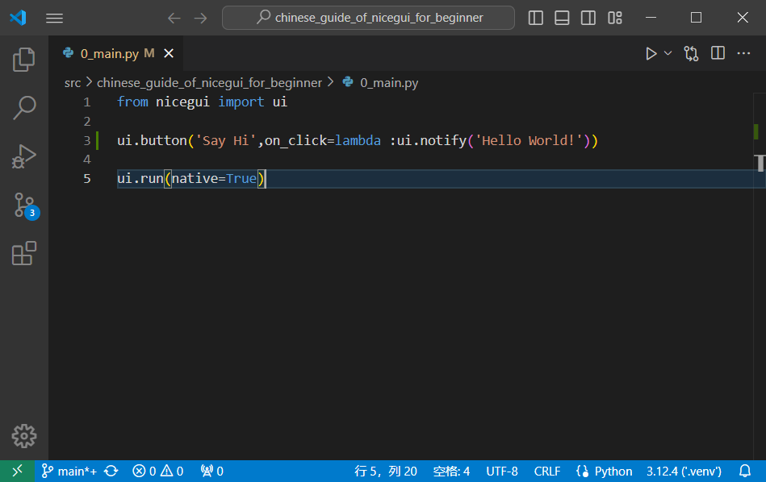
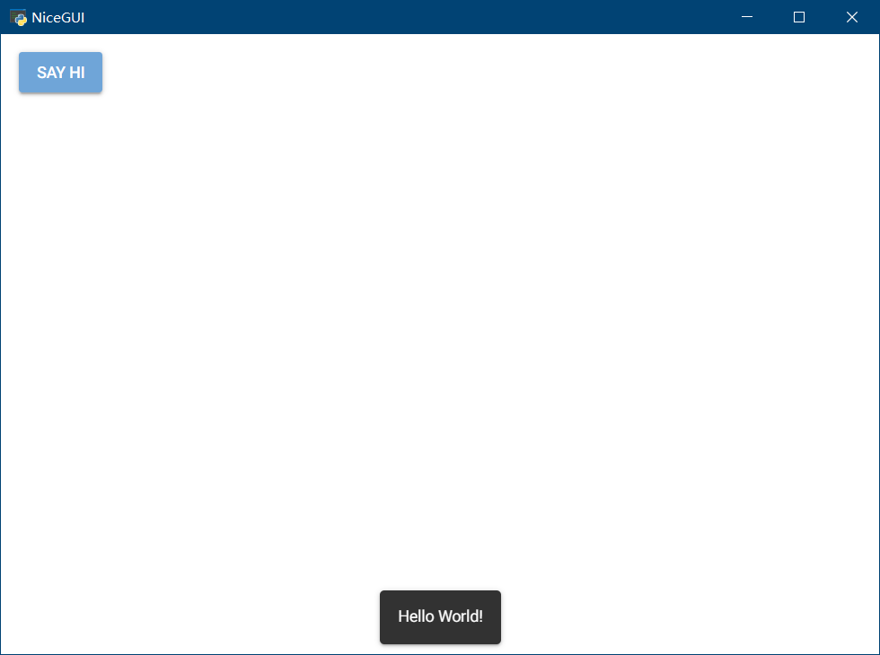

# nicegui的中文入门教程

## 0 前言

对于python语言的使用者来说，nicegui是一款优秀的WebUI、GUI框架，只需学习一定量的前端知识，就能使用nicegui快速搭建出美观的UI界面。但是，由于官方作者不提供系统性的入门、中文教程，很多中文初学者望而却步。于是，本教程应运而生。

本教程旨在用中文提供官方文档没有的系统性入门教程，并将部分社区讨论问题汉化、简化，方便中文学习者尽快上手并解决常见难题。虽然教程的名字叫入门教程，但我们并没有停留在翻译官网文档的阶段，能够解决常见问题的高阶技巧也有。对于官方提供的各个控件的详细API，我们并不会照本宣科，而是在提供思路之后，由读者自行查阅。正所谓“授人以鱼不如授人以渔”，掌握方法比掌握结果更有效。

本教程基于 nicegui  1.4.*  制作， nicegui  2.0版本很快发布。虽然版本变动较大，但大部分用法相通，如果后续代码出现不兼容的情况，请自行根据版本兼容情况修改。

## 1 环境准备

### 1.1 运行环境

为了保证最佳开发体验，所有的环境准备优先使用Windows系统，使用Linux、Mac的话，请自己根据系统变通。

首先，我们需要准备python解释器和`pip`。其中，Python解释器是运行后续代码、工具的基础，只需到官网安装最新稳定版（当前为3.12.*）即可；`pip`是Python官方的包管理工具，安装解释器时务必勾选此选项，如果没有勾选或者想要后续单独安装`pip`，可以到[pypi](https://pypi.org/)官方查看安装方法，这里不在赘述。

环境管理工具有`pdm`和`poetry`,我们需要使用以下命令全部安装：

```shell
pip install pdm poetry
```

环境管理工具是快捷管理python运行环境的工具，可以创建出独立的python运行环境，各个运行环境内安装的软件包不会干扰其他环境，也不会影响到默认的python环境。

`pdm`是一款国人创建的环境管理工具，语法简单，操作方便，因此教程采用此工具。

`poetry`也是一款环境管理工具，是nicegui官方仓库采用的，可以基于官方源代码自己编译安装包，也用于后续自托管文档，因此需要安装。

但是，`poetry`的检查依赖速度比`pdm`慢太多，故这里采用`pdm`作为学习工具，如果读者有能力，可以只使用`poetry`。

#### 1.1.1 基础环境初始化

先在纯英文、无空格、无特殊字符的路径下创建纯英文、无空格、无特殊字符的空白文件夹，进入该文件夹后，右键，在此处打开终端或者命令行，运行以下命令：

```shell
pdm init
```

会看到以下输出：

```shell
PS E:\PSF\git\chinese_guide_of_nicegui_for_beginner> pdm init
Creating a pyproject.toml for PDM...
Please enter the Python interpreter to use
 0. cpython@3.12 (D:\Programs\Python\Python312\python.EXE)
 1. cpython@3.11 (D:\mingw64\bin\python3.11.exe)
 2. cpython@3.11 (D:\mingw64\bin\python3.exe)
 3. cpython@3.11 (D:\mingw64\bin\python.exe)
 4. cpython@3.11 (C:\Users\peter\AppData\Local\pdm\pdm\python\cpython@3.11.5\python.exe)
Please select (0): 0
Virtualenv is created successfully at E:\PSF\git\chinese_guide_of_nicegui_for_beginner\.venv
Project name (chinese_guide_of_nicegui_for_beginner):
Project version (0.1.0):
Do you want to build this project for distribution(such as wheel)?
If yes, it will be installed by default when running `pdm install`. [y/n] (n):
License(SPDX name) (MIT):
Author name (): Peter
Author email (): peter@linux
Python requires('*' to allow any) (==3.12.*):
Project is initialized successfully
PS E:\PSF\git\chinese_guide_of_nicegui_for_beginner>
```

过程为交互式，需要自己输入之后回车才能继续，不输入直接回车则采用默认。

`Please select (0):`为选择python版本，pdm会自动识别当前电脑安装的所有python解释器，部分工具（如gcc）也会自带python解释器，我们需要正确选择自己安装的、可以直接运行pip命令的python解释器，这一步根据实际情况选择，一般默认第一个，可以直接回车。

`Project name (chinese_guide_of_nicegui_for_beginner):`为设置项目名称，通常为当前文件夹名字，可以自己输入来修改。这个不会修改当前文件夹名字，只会影响项目描述文件中的项目名称和后续创建的源代码文件夹名称。这里可以直接回车。

`Project version (0.1.0):`为设置当前项目的版本号，该版本号符合语义化规则，不懂或者不想了解的可以直接回车。

`If yes, it will be installed by default when running pdm install. [y/n] (n):`这一步是问你要不要将项目构建成分发包（可以用pip安装的），如果选择`y`，使用`pdm install`就会默认安装项目。这里我们不是创建分发包，所以直接回车。

`License(SPDX name) (MIT):`、`Author name (): `、`Author email ():`分别是许可协议、作者名字、作者邮箱地址，了解、知道的可以修改，不清楚或者不想写的可以直接回车。

`Python requires('*' to allow any) (==3.12.*):`为python的版本要求，如果后续要用低版本或者高版本python运行，这里需要修改，否则此项目会限制python的版本。这个后续可以自己了解，这里直接回车即可。

至此，基础环境已经准备完毕，我们得到以下目录结构：

```shell
chinese_guide_of_nicegui_for_beginner
├─.venv
│  ├─Lib
│  │  └─site-packages
│  └─Scripts
├─src
│  └─chinese_guide_of_nicegui_for_beginner
└─tests
```

`./src/chinese_guide_of_nicegui_for_beginner/`下存放我们的源代码，后续的代码操作（创建修改）均在此目录。此外，项目根目录下有`pyproject.toml`（项目描述文件）和`README.md`（自述文件），本教程不涉及手动修改。

#### 1.1.2 nicegui运行环境

基础环境初始化完毕之后，项目还不能直接运行基于nicegui框架的代码，因为基础环境还没有安装nicegui。因此，需要在项目根目录下使用以下命令安装：

```shell
pdm add nicegui
```

安装过程取决于网速，耐心等待。

如果后续项目中需要使用其他库，可以使用`pdm add 库对应的pip安装命令中的名字`来添加到我们的项目环境中。

对于调试使用nicegui的程序，通常在`native mode`下比较方便，因此，建议安装`pywebview`来增加`native mode`的支持，命令是：

```shell
pdm add pywebview
```

对于没有安装过Microsoft Edge WebView2或者版本较旧的Windows系统，建议访问 [ Microsoft Edge WebView2下载 ](https://developer.microsoft.com/zh-cn/microsoft-edge/webview2 ) 安装最新版本。

### 1.2 开发工具

VSCode或者PyCharm，其中VSCode比PyCharm轻量，但需要手动安装python插件，而PyCharm自带插件，操作简单。这里推荐使用VSCode，比较流畅，如果是使用PyCharm，后续操作根据VSCode对应即可。

对于VSCode，建议安装以下插件：

```
ms-python.python
ms-python.autopep8
ms-python.black-formatter
```

### 1.3 自托管文档[可选]

因为官网文档是可交互的，只有连接到官网才能操作。但是，部分地区的访问官网存在网络不佳的情况，如果需要自托管官网文档，可以遵循以下步骤。

首先要安装`git`，具体可以看[Git - 安装 Git](https://git-scm.com/book/zh/v2/%E8%B5%B7%E6%AD%A5-%E5%AE%89%E8%A3%85-Git)。

安装完成后，额外找一个空白文件夹，打开终端，执行以下命令：

```shell
git clone https://github.com/zauberzeug/nicegui.git
```

没有git，可以打开以下链接：

```shell
https://github.com/zauberzeug/nicegui/archive/refs/heads/main.zip
```

下载压缩包之后解压，结果一样。对于GItHub难以访问的问题，可以自行搜索GitHub加速的方法。

使用以下命令进入nicegui的源代码文件夹，并执行安装操作：

```shell
cd nicegui
poetry install
```

等安装完成之后（poetry的install时间会比较长），执行以下命令，会开启一个服务器托管官网文档，并自动调用浏览器打开自托管的官网：

```shell
poetry run python .\main.py
```

关掉终端就可以关闭服务器，下次运行这条命令就可以直接开启自托管的官网文档，无需再次安装。

如果官方有源代码更新，后续将源代码解压覆盖之后，执行一次安装操作即可更新。

## 2 入门基础（更新中）

### 2.1 认识nicegui

nicegui 是一个开源的python库，可以搭建运行在浏览器的图形界面，也就是WebUI，也可以理解为和网站一样。nicegui的学习过程并不难，但不意味着你可以零基础入门。对于开发nicegui的开发者而言，python的基础是必须的；如果掌握python不常用语法和用法更好，后续在使用nicegui的过程中，可以很方便理解一些为了达成效果而使用的骚操作。尽管大部分python的学习者是零基础入门，除了转全栈、爬虫的开发者，后续学习过程中很少接触前端（HTML、CSS、JavaScript），但还是在使用nicegui之前，要有学习前端的心理准备。nicegui为了方便python工程师快速搭建图形界面，专注于python代码本身，做了不少前端细节的隐藏。不过，默认的样式不一定符合预期效果，为了达成效果，还是需要了解一些前端知识，才能让界面完全符合心意。

nicegui的底层使用了`fastapi`作为运行服务器，`Quasar`作为前端框架，支持`tailwindcss`的CSS语法，因为`Quasar`的内部使用`VUE`搭建，nicegui也不可避免地用到了`VUE`的语法。因此，对于想要用好nicegui的开发者，在后续使用nicegui的过程中，需要对上述提到的项目有一定了解。想要对后端部分定制、修改的，需要了解`fastapi`以及其基于的其他组件；想要让界面美化、随心的，需要掌握`Quasar`、`tailwindcss`基础；对于有能力和需求完全定制界面的，则需要掌握`VUE`基础。

相关链接：

nicegui官方文档：https://nicegui.io/documentation

Quasar官方文档：https://quasar.dev/docs

tailwindcss官方文档：https://tailwindcss.com/

VUE官方文档：https://cn.vuejs.org/guide/introduction

#### 2.1.1 nicegui的`Hello World!`

如果你能看到这里，证明你有学好nicegui的基础和能力，并不畏惧上一节提到的那么多基础知识。那么，就让我们用一段简单的`Hello World!`代码开启nicegui的入门之旅。

使用VSCode在我们的项目文件夹下的`src\chinese_guide_of_nicegui_for_beginner`内，新建以`py`为后缀的python代码文件，复制以下代码到代码文件中，保存。

```python3
from nicegui import ui

ui.button('Say Hi',on_click=lambda :ui.notify('Hello World!'))

ui.run(native=True)
```

注意vscode的右下角，务必确保使用的是`venv`下的python解释器，如果不是，点击右下角`3.12.4{'.venv'}`对应位置，选择输入解释器路径-查找，选择`.venv\Scripts\`下的`python.exe`。



点击VSCode右上角的运行按钮（三角形），就可以看到一个窗口弹出，点击`SAY HI`按钮，就能看到窗口底部弹出的`Hello World!`。



从`Hello World!`示例可以看到，基于nicegui的python程序寥寥三行代码，除去导入语句和必不可少的`ui.run`，主体只有一行代码，就能实现一个完整的交互过程，足见nicegui的强大、简洁。后续我们的很多例子都可以做到几行代码实现不错的效果，这也是我学习nicegui的原因和动力。

### 2.2 nicegui的基本结构


## 3 高阶技巧（更新中）

