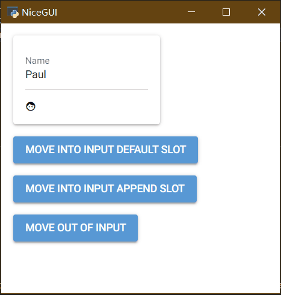

# nicegui的中文入门教程

[TOC]


## 0 前言

对于python语言的使用者来说，[nicegui](https://nicegui.io/)是一款优秀的WebUI、GUI框架，只需学习一定量的前端知识，就能使用nicegui快速搭建出美观的UI界面。但是，由于官方作者不提供系统性的入门、中文教程，很多中文初学者望而却步。于是，本教程应运而生。

本教程旨在用中文提供官方文档没有的系统性入门教程，并将部分社区讨论问题汉化、简化，方便中文学习者尽快上手并解决常见难题。虽然教程的名字叫入门教程，但本教程并没有停留在翻译官网文档的阶段，能够解决常见问题的高阶技巧也有。对于官方提供的各个控件的详细API，本教程并不会照本宣科，而是在提供思路之后，由读者自行查阅。正所谓“授人以鱼不如授人以渔”，掌握方法比掌握结果更有效。

本教程基于 nicegui  1.4.*  制作， nicegui  2.0版本很快发布。虽然版本变动较大，但大部分用法相通，如果后续代码出现不兼容的情况，请自行根据版本兼容情况修改。

->[教程全文详见仓库](https://github.com/python-and-fiction/chinese_guide_of_nicegui_for_beginner)

## 1 环境准备

本章主要介绍运行和开发nicegui程序的环境准备，包括虚拟环境的建立、开发工具的选择、如何自托管文档。

### 1.1 运行环境

为了保证最佳开发体验，所有的环境准备优先使用Windows系统，使用Linux、Mac的话，请自己根据系统变通。

首先，需要准备python解释器和pip。其中，Python解释器是运行后续代码、工具的基础，只需到官网安装最新稳定版（当前为3.12.*）即可；pip是Python官方的包管理工具，安装解释器时务必勾选此选项，如果没有勾选或者想要后续单独安装pip，可以到[pypi](https://pypi.org/)官方查看安装方法，这里不在赘述。

环境管理工具有pdm和poetry，使用以下命令全部安装：

```shell
pip install pdm poetry
```

环境管理工具是快捷管理python运行环境的工具，可以创建出独立的python运行环境，各个运行环境内安装的软件包不会干扰其他环境，也不会影响到默认的python环境。

pdm是一款国人创建的环境管理工具，语法简单，操作方便，因此教程采用此工具。

poetry也是一款环境管理工具，是nicegui官方仓库采用的，可以基于官方源代码自己编译安装包，也用于后续自托管文档，因此需要安装。

但是，poetry的检查依赖速度比pdm慢太多，故这里采用pdm作为学习工具，如果读者有能力，可以只使用poetry。

#### 1.1.1 基础环境初始化

先在纯英文、无空格、无特殊字符的路径下创建纯英文、无空格、无特殊字符的空白文件夹，进入该文件夹后，右键，在此处打开终端或者命令行，运行以下命令：

```shell
pdm init
```

会看到以下输出：

```shell
PS E:\PSF\git\chinese_guide_of_nicegui_for_beginner> pdm init
Creating a pyproject.toml for PDM...
Please enter the Python interpreter to use
 0. cpython@3.12 (D:\Programs\Python\Python312\python.EXE)
 1. cpython@3.11 (D:\mingw64\bin\python3.11.exe)
 2. cpython@3.11 (D:\mingw64\bin\python3.exe)
 3. cpython@3.11 (D:\mingw64\bin\python.exe)
 4. cpython@3.11 (C:\Users\peter\AppData\Local\pdm\pdm\python\cpython@3.11.5\python.exe)
Please select (0): 0
Virtualenv is created successfully at E:\PSF\git\chinese_guide_of_nicegui_for_beginner\.venv
Project name (chinese_guide_of_nicegui_for_beginner):
Project version (0.1.0):
Do you want to build this project for distribution(such as wheel)?
If yes, it will be installed by default when running `pdm install`. [y/n] (n):
License(SPDX name) (MIT):
Author name (): Peter
Author email (): peter@linux
Python requires('*' to allow any) (==3.12.*):
Project is initialized successfully
PS E:\PSF\git\chinese_guide_of_nicegui_for_beginner>
```

过程为交互式，需要自己输入之后回车才能继续，不输入直接回车则采用默认。

`Please select (0):`为选择python版本，pdm会自动识别当前电脑安装的所有python解释器，部分工具（如gcc）也会自带python解释器，需要正确选择自己安装的、可以直接运行pip命令的python解释器，这一步根据实际情况选择，一般默认第一个，可以直接回车。

`Project name (chinese_guide_of_nicegui_for_beginner):`为设置项目名称，通常为当前文件夹名字，可以自己输入来修改。这个不会修改当前文件夹名字，只会影响项目描述文件中的项目名称和后续创建的源代码文件夹名称。这里可以直接回车。

`Project version (0.1.0):`为设置当前项目的版本号，该版本号符合语义化规则，不懂或者不想了解的可以直接回车。

`If yes, it will be installed by default when running pdm install. [y/n] (n):`这一步是问你要不要将项目构建成分发包（可以用pip安装的），如果选择`y`，使用`pdm install`就会默认安装项目。这里选择不创建分发包，所以直接回车。

`License(SPDX name) (MIT):`、`Author name (): `、`Author email ():`分别是许可协议、作者名字、作者邮箱地址，了解、知道的可以修改，不清楚或者不想写的可以直接回车。

`Python requires('*' to allow any) (==3.12.*):`为python的版本要求，如果后续要用低版本或者高版本python运行，这里需要修改，否则此项目会限制python的版本。这个后续可以自己了解，这里直接回车即可。

至此，基础环境已经准备完毕，可以得到以下目录结构：

```shell
chinese_guide_of_nicegui_for_beginner
├─.venv
│  ├─Lib
│  │  └─site-packages
│  └─Scripts
├─src
│  └─chinese_guide_of_nicegui_for_beginner
└─tests
```

`./src/chinese_guide_of_nicegui_for_beginner/`下存放项目的源代码，后续的代码操作（创建修改）均在此目录。此外，项目根目录下有`pyproject.toml`（项目描述文件）和`README.md`（自述文件），本教程不涉及手动修改。

#### 1.1.2 nicegui运行环境

基础环境初始化完毕之后，项目还不能直接运行基于nicegui框架的代码，因为基础环境还没有安装nicegui。因此，需要在项目根目录下使用以下命令安装：

```shell
pdm add nicegui
```

安装过程取决于网速，耐心等待。

如果后续项目中需要使用其他库，可以使用`pdm add 库对应的pip安装命令中的名字`来添加到项目环境中。

对于调试使用nicegui的程序，通常在native mode下比较方便，因此，建议安装`pywebview`来增加native mode的支持，命令是：

```shell
pdm add pywebview
```

对于没有安装过Microsoft Edge WebView2或者版本较旧的Windows系统，建议访问 [ Microsoft Edge WebView2下载 ](https://developer.microsoft.com/zh-cn/microsoft-edge/webview2 ) 安装最新版本。

### 1.2 开发工具

[VSCode](https://code.visualstudio.com/)或者[PyCharm](https://www.jetbrains.com/pycharm/download/)，其中VSCode比PyCharm轻量，但需要手动安装python插件，而PyCharm自带插件，操作简单。这里推荐使用VSCode，比较流畅，如果是使用PyCharm，后续操作根据VSCode对应即可。

对于VSCode，建议安装以下插件：

```
ms-python.python
ms-python.autopep8
ms-python.black-formatter
```

### 1.3 自托管文档【可选】

因为官网文档是可交互的，只有连接到官网才能操作。但是，部分地区的访问官网存在网络不佳的情况，如果需要自托管官网文档，可以遵循以下步骤。

首先要安装git，具体可以看[Git - 安装 Git](https://git-scm.com/book/zh/v2/%E8%B5%B7%E6%AD%A5-%E5%AE%89%E8%A3%85-Git)。

安装完成后，额外找一个空白文件夹，打开终端，执行以下命令：

```shell
git clone https://github.com/zauberzeug/nicegui.git
```

没有git，可以打开以下链接：

```shell
https://github.com/zauberzeug/nicegui/archive/refs/heads/main.zip
```

下载压缩包之后解压，结果一样。对于GItHub难以访问的问题，可以自行搜索GitHub加速的方法。

使用以下命令进入nicegui的源代码文件夹，并执行安装操作：

```shell
cd nicegui
poetry install
```

等安装完成之后（poetry的install时间会比较长），执行以下命令，会开启一个服务器托管官网文档，并自动调用浏览器打开自托管的官网：

```shell
poetry run python .\main.py
```

关掉终端就可以关闭服务器，下次运行这条命令就可以直接开启自托管的官网文档，无需再次安装。

如果官方有源代码更新，后续将源代码解压覆盖之后，执行一次安装操作即可更新。

## 2 入门基础

本章主要介绍nicegui的基础知识，系统性了解nicegui的基本结构，在自学nicegui、查阅官网文档时有方向。

### 2.1 认识nicegui

nicegui 是一个开源的python库，可以搭建运行在浏览器的图形界面，也就是WebUI，也可以理解为和网站一样。nicegui的学习过程并不难，但不意味着你可以零基础入门。对于开发nicegui的开发者而言，python的基础是必须的；如果掌握python不常用语法和用法更好，后续在使用nicegui的过程中，可以很方便理解一些为了达成效果而使用的骚操作。尽管大部分python的学习者是零基础入门，除了转全栈、爬虫的开发者，后续学习过程中很少接触前端（HTML、CSS、JavaScript），但还是在使用nicegui之前，要有学习前端的心理准备。nicegui为了方便python工程师快速搭建图形界面，专注于python代码本身，做了不少前端细节的隐藏。不过，默认的样式不一定符合预期效果，为了达成效果，还是需要了解一些前端知识，才能让界面完全符合心意。

nicegui的底层使用了fastapi作为运行服务器，Quasar作为前端框架，支持tailwindcss的CSS语法，因为Quasar的内部使用VUE搭建，nicegui也不可避免地用到了VUE的语法。因此，对于想要用好nicegui的开发者，在后续使用nicegui的过程中，需要对上述提到的项目有一定了解。想要对后端部分定制、修改的，需要了解fastapi以及其基于的其他组件；想要让界面美化、随心的，需要掌握Quasar、tailwindcss基础；对于有能力和需求完全定制界面的，则需要掌握VUE基础。

相关链接：

nicegui官方文档：https://nicegui.io/documentation

fastapi官方文档：https://fastapi.tiangolo.com/zh/

Quasar官方文档：https://quasar.dev/docs

tailwindcss官方文档：https://tailwindcss.com/

VUE官方文档：https://cn.vuejs.org/guide/introduction

#### 2.1.1 nicegui的`Hello World!`

如果你能看到这里，证明你有学好nicegui的基础和能力，并不畏惧上一节提到的那么多基础知识。那么，就用一段简单的`Hello World!`代码开启nicegui的入门之旅。

使用VSCode在项目文件夹下的`src\chinese_guide_of_nicegui_for_beginner`内，新建以`py`为后缀的python代码文件，复制以下代码到代码文件中，保存。

```python3
from nicegui import ui

ui.button('Say Hi',on_click=lambda :ui.notify('Hello World!'))

ui.run(native=True)
```

注意vscode的右下角，务必确保使用的是`venv`下的python解释器，如果不是，点击右下角`3.12.4{'.venv'}`对应位置，选择输入解释器路径-查找，选择`.venv\Scripts\`下的`python.exe`。


点击VSCode右上角的运行按钮（三角形），就可以看到一个窗口弹出，点击`SAY HI`按钮，就能看到窗口底部弹出的`Hello World!`。


从`Hello World!`示例可以看到，基于nicegui的python程序寥寥三行代码，除去导入语句和必不可少的`ui.run`，主体只有一行代码，就能实现一个完整的交互过程，足见nicegui的强大、简洁。后续教程中很多例子都可以做到几行代码实现不错的效果，这也是nicegui大受欢迎的原因。

### 2.2 nicegui的基本结构

#### 2.2.1 图形界面的基础概念

在正式学习nicegui之前，需要先对图形界面有个基础的理解。

一般来说，搭建图形界面理解三个概念：控件、布局、交互。

##### 2.2.1.1 控件

控件是搭建图形界面的基本元素，就像是盖房子用的砖、门、窗等最小搭建单位。控件通常是图形界面框架提供、直接可用的。如果使用过程中发现基本元素不够，可以结合布局功能，用基本元素组合出新的控件。

##### 2.2.1.2 布局

布局是排布控件的方式，就像是房屋的基本框架。用砖可以铺地，也可以垒墙，对于砖而言，墙或是地，就是布局。控件是横向排列还是竖向排列，是像网格一样一一对应，还是大控件套着小控件，都是由布局控制。大部分图形程序框架提供的布局类似，除了基本的几种布局之外，部分图形程序框架还提供额外的组合布局。

##### 2.2.1.3 交互

交互是图形界面的重中之重，也是一个程序最难的部分。论难度的话，前面的控件和布局的学习只是对照文档，按图索骥，交互则需要身经百战，不断积累经验。

事件机制是目前大部分图形界面采用的交互反馈机制，也就是基于特定的事件触发，执行对应的函数。微软的winform中采用的消息机制，Qt的信号与槽，现代网页开发中的event事件监听，都可以理解为事件机制，只是对于winform和Qt而言，他们框架内的事件分别叫做消息和信号而已。

除了事件机制，美化也是交互的一部分。大部分现代图形界面框架。如Qt、WPF以及一系列基于网页开发的图形界面框架，支持CSS或者类似语法的美化功能，让图形界面变得更加美观，也让控件的动画效果更加丰富，这个极大提升了用户的使用体验。

此外，基于图形界面框架的特性，后端的处理逻辑以及数据的传递也是交互的一部分。在函数内，对于控件的控制，如何做到符合要求，毕竟有的框架、编程语言不支持没有定义或者声明函数就调用，而有的语言不支持声明函数。如果需要让控件显示的文本与另一个控件的文本一致，如何处理数据同步过程也需要技巧。

#### 2.2.2 nicegui与基础概念的对应

对图形界面有基础的理解之后，下面就可以根据nicegui与基础概念的对应，进一步理解nicegui的设计理念。

在`Hello World!`示例中，使用了导入语句`from nicegui import ui`导入了`ui`，顾名思义，ui就是用户界面，这也是nicegui调用控件的模块，也可以调用布局。具体的控件和布局用法可以参考下一节[nicegui中不得不学的功能](#2.3 nicegui中不得不学的功能)，下一节将选取一些nicegui中常用、不好理解的功能重点讲解。

因为nicegui是基于Quasar这个Web框架做的python调用绑定，因此，nicegui的交互部分，很大程度与Web结合。在Web设计中，基于CSS实现的美化效果，基于JavaScript的event做的事件响应，都能在nicegui中看到。所以，如果用好nicegui，对Web三件套HTML、CSS、JavaScript的学习不可避免。此外，因为nicegui与Quasar这个Web框架的深度集成的关系，Quasar中的属性、slot、事件也需要掌握，才能让交互设计更加得心应手。

关于美化，下一节中的[外观美化](#2.3.7 外观美化)将会详细介绍，也可以查阅对应的官方文档。事件的学习，可以参阅下一节的[事件和执行](#2.3.8 事件和执行)，也可以查阅对应的官方文档。

### 2.3 nicegui中不得不学的功能（更新中）

以下是官网文档对于nicegui提供的功能做了大致的划分，本教程将会对每个部分中不好掌握、需要重点学习的控件、功能进行剖析：

1.   文本控件：https://nicegui.io/documentation/section_text_elements

2.   常用控件：https://nicegui.io/documentation/section_controls

3.   多媒体控件：https://nicegui.io/documentation/section_audiovisual_elements

4.   数据控件：https://nicegui.io/documentation/section_data_elements

5.   属性绑定：https://nicegui.io/documentation/section_binding_properties

6.   图形布局：https://nicegui.io/documentation/section_page_layout

7.   外观美化：https://nicegui.io/documentation/section_styling_appearance

8.   事件和执行：https://nicegui.io/documentation/section_action_events

9.   网站页面：https://nicegui.io/documentation/section_pages_routing

10.   部署与配置：https://nicegui.io/documentation/section_configuration_deployment


这部分对于官方内容的解析并不会完全覆盖，主要讲经常用到的参数、属性、方法，对于某些隐藏参数和不常用的属性方法，会在后面用到的时候详细介绍，这里最多提一嘴。

#### 2.3.1 文本控件

文本类控件主要是一些静态展示可复制文本的控件，是构成网页显示效果的主要控件。

##### 2.3.1.1 ui.label

文本标签，用法很简单，通过传入一个字符串类型的参数`text`，让网页显示字符串内的文字。注意，虽然参数支持多行文字，但是输出只能一行，需要原样输出多行文字的话，可以使用下面介绍的`ui.html`，将`tag`设置为`pre`。

```python3
ui.label(text='some label')
```

##### 2.3.1.2 ui.link

超链接，一种点击之后跳转到指定地址的文本元素。可以传入`text`、`target`、`new_tab`三个参数。代码如下：

```python3
ui.link(text='NiceGUI on GitHub',target= 'https://github.com/zauberzeug/nicegui',new_tab=False)
```

`text`参数，字符串类型，表示超链接显示什么文字。

`target`参数，字符串类型、`page function`、`ui.element`类型，表示超链接跳转到什么位置，这里只介绍字符串类型用法，其他类型可以自行探索或者后续需要用到的时候补充。字符串类型参数表示超链接跳转的url地址，可以使用协议开头的完整地址，也可以使用省略主机的绝对路径、相对路径。

`new_tab`参数，布尔类型，默认为`False`，表示要不要在新建标签页中打开超链接。

##### 2.3.1.3 ui.element

通用元素，也是nicegui大部分界面控件的基类。很多控件都是通过继承这个类来调用自定义标签、JavaScript代码实现。通过继承实现自定义控件、修改默认风格属于高级用法，这里只说基本用法。

`tag`参数，字符串类型，默认为`div`，表示生成的元素用什么标签，实际使用时可以根据需要修改为其他HTML标签或者Quasar标签。代码如下：

```python3
with ui.element('div').classes('p-2 bg-blue-100'):
    ui.label('inside a colored div')
```

`move`方法，将控件移动到指定控件之内，默认为`default`slot，也可以传递`target_slot`参数，指定slot。代码如下：

```python3
with ui.card() as card:
    name = ui.input('Name', value='Paul')
    name.add_slot('append')
    icon = ui.icon('face')

ui.button('Move into input default slot', on_click=lambda: icon.move(name))
ui.button('Move into input append slot', on_click=lambda: icon.move(name, target_slot='append'))
ui.button('Move out of input', on_click=lambda: icon.move(card))
```



##### 2.3.1.4 ui.markdown和ui.html

与`ui.label`类似，`ui.markdown`和`ui.html`，都可以用来展示文本，只是后两者支持markdown语法和HTML语法，因为markdown语法支持一部分HTML的标签，可以看到放在`ui.markdown`里的HTML标签也能被解析。以下是三种控件解析同一内容的代码：

```python3
content = '''
This is **Markdown**.
This is <u>emphasized</u>
'''
ui.label(content)
ui.markdown(content)
ui.html(content)
```

此外，`ui.html`还支持传入字符串类型参数`tag`给基类`ui.element`，用于修改生成`ui.html`用的标签，比如：

```python3
ui.html('This is <u>emphasized</u>.', tag='em')
```

#### 2.3.2 常用控件

常用控件主要是一些支持点击、输入、拖动等交互功能的控件。

##### 2.3.2.1 ui.button

按钮作是网页交互设计中最常见的基本元素，在移动互联网没有普及之前，使用鼠标点击为主要交互方式的时代，除了用于跳转网页的超链接，按钮就是网页中用的最多的可交互元素。在nicegui中，按钮控件可以传入位置参数`text`，关键字参数`on_click`、`color`和`icon`。

以下代码就是一个定义了基本交互的按钮，点击会弹出一个通知提示：

```python3
ui.button('Click me!',color='green',icon='thumb_up', on_click=lambda: ui.notify('You clicked me!'))
```

`text`参数，字符串类型，表示显示在按钮上的文字，如果是英文的话，默认全部大写。该参数默认只支持字符串类型，但是整数和小数可以直接使用，其他类型需要先转换为字符串类型才能传入。

`color`参数，字符串类型或者None，表示按钮的颜色，支持传入字符串类型的颜色类（Quasar、 Tailwind、CSS的颜色名）或者None（即让按钮变成默认颜色）。

`icon`参数，字符串类型，表示按钮额外显示的图标，支持传入字符串类型的图标名，具体名字会在`ui.icon`中介绍，这里不做详细介绍。

`on_click`参数，可调用类型，表示点击按钮调用的函数，可以使用`lambda`表达式，也可以使用函数名。

如果觉得对按钮传入参数来自定义按钮内容的方法太死板，也可以使用以下语法，使用`with`来进入按钮的`default slot`，随意组合按钮内的内容：

```python3
with ui.button(color='green',on_click=lambda: ui.notify('You clicked me!')):
    ui.icon('thumb_up')
    ui.label('Click me!')
```


对于`on_click`参数、后续会涉及到的on开头的`on_*`参数、on开头的`on_*`方法和`on`方法里的callback或者handler参数，均为可调用类型参数，既可以在创建控件时定义lambda表达式，也可以提前定义。对于复杂一点逻辑操作，应该定义函数而不是lambda表达式，比如：

```python3
test = lambda :...
#如果要执行的操作比较多、复杂，应该定义函数
def test():
    pass
#在控件中调用可以直接使用test
ui.button('Click me!',on_click=test)
```

##### 2.3.2.2 ui.input（更新中）


#### 2.3.3 多媒体控件


#### 2.3.4 数据控件


#### 2.3.5 属性绑定


#### 2.3.6 图形布局


#### 2.3.7 外观美化（更新中）


无需死记硬背tailwindcss，也不需要反复查询官网，直接使用`.tailwindcss`属性或者使用`Tailwind`对象，会有自动提示。

比如：

```python3
from nicegui import ui,app
from nicegui.tailwind import Tailwind

#设定标签的字体颜色为红色
label = ui.label('Style')
red_style = Tailwind().text_color('red-400')
red_style.apply(label)
#上述代码可以简化为一行，但是调用tailwind必须放到最后。
#因为tailwind的函数返回的是tailwind对象，不是element对象。
#调用完tailwind之后没法继续调用基于element的方法。
ui.label('Style').tailwind.text_color('red-400')
#以上方法等同于设定class为text-red-400
ui.label('Style').classes('text-red-400')

ui.run(native=True)
```


#### 2.3.8 事件和执行


#### 2.3.9 网站页面


#### 2.3.10 部署与配置

