# nicegui的中文入门教程

[TOC]


## 0 前言

对于python语言的使用者来说，[nicegui](https://nicegui.io/)是一款优秀的WebUI、GUI框架，只需学习一定量的前端知识，就能使用nicegui快速搭建出美观的UI界面。但是，由于官方作者不提供系统性的入门、中文教程，很多中文初学者望而却步。于是，本教程应运而生。

本教程旨在用中文提供官方文档没有的系统性入门教程，并将部分社区讨论问题汉化、简化，方便中文学习者尽快上手并解决常见难题。虽然教程的名字叫入门教程，但本教程并没有停留在翻译官网文档的阶段，能够解决常见问题的高阶技巧也有。对于官方提供的各个控件的详细API，本教程并不会照本宣科，而是在提供思路之后，由读者自行查阅。正所谓“授人以鱼不如授人以渔”，掌握方法比掌握结果更有效。

->[教程全文详见仓库](https://github.com/python-and-fiction/chinese_guide_of_nicegui_for_beginner)

## 1 环境准备

本章主要介绍运行和开发nicegui程序的环境准备，包括虚拟环境的建立、开发工具的选择、如何自托管文档。

### 1.1 运行环境

为了保证最佳开发体验，所有的环境准备优先使用Windows系统，使用Linux、Mac的话，请自己根据系统变通。

首先，需要准备python解释器和pip。其中，Python解释器是运行后续代码、工具的基础，只需到官网安装最新稳定版（当前为3.12.*）即可；pip是Python官方的包管理工具，安装解释器时务必勾选此选项，如果没有勾选或者想要后续单独安装pip，可以到[pypi](https://pypi.org/)官方查看安装方法，这里不在赘述。

环境管理工具有pdm和poetry，使用以下命令全部安装：

```shell
pip install pdm poetry
```

环境管理工具是快捷管理python运行环境的工具，可以创建出独立的python运行环境，各个运行环境内安装的软件包不会干扰其他环境，也不会影响到默认的python环境。

pdm是一款国人创建的环境管理工具，语法简单，操作方便，因此教程采用此工具。

poetry也是一款环境管理工具，是nicegui官方仓库采用的，可以基于官方源代码自己编译安装包，也用于后续自托管文档，因此需要安装。

但是，poetry的检查依赖速度比pdm慢太多，故这里采用pdm作为学习工具，如果读者有能力，可以只使用poetry。

#### 1.1.1 基础环境初始化

先在纯英文、无空格、无特殊字符的路径下创建纯英文、无空格、无特殊字符的空白文件夹，进入该文件夹后，右键，在此处打开终端或者命令行，运行以下命令：

```shell
pdm init
```

会看到以下输出：

```shell
PS E:\PSF\git\chinese_guide_of_nicegui_for_beginner> pdm init
Creating a pyproject.toml for PDM...
Please enter the Python interpreter to use
 0. cpython@3.12 (D:\Programs\Python\Python312\python.EXE)
 1. cpython@3.11 (D:\mingw64\bin\python3.11.exe)
 2. cpython@3.11 (D:\mingw64\bin\python3.exe)
 3. cpython@3.11 (D:\mingw64\bin\python.exe)
 4. cpython@3.11 (C:\Users\peter\AppData\Local\pdm\pdm\python\cpython@3.11.5\python.exe)
Please select (0): 0
Virtualenv is created successfully at E:\PSF\git\chinese_guide_of_nicegui_for_beginner\.venv
Project name (chinese_guide_of_nicegui_for_beginner):
Project version (0.1.0):
Do you want to build this project for distribution(such as wheel)?
If yes, it will be installed by default when running `pdm install`. [y/n] (n):
License(SPDX name) (MIT):
Author name (): Peter
Author email (): peter@linux
Python requires('*' to allow any) (==3.12.*):
Project is initialized successfully
PS E:\PSF\git\chinese_guide_of_nicegui_for_beginner>
```

过程为交互式，需要自己输入之后回车才能继续，不输入直接回车则采用默认。

`Please select (0):`为选择python版本，pdm会自动识别当前电脑安装的所有python解释器，部分工具（如gcc）也会自带python解释器，需要正确选择自己安装的、可以直接运行pip命令的python解释器，这一步根据实际情况选择，一般默认第一个，可以直接回车。

`Project name (chinese_guide_of_nicegui_for_beginner):`为设置项目名称，通常为当前文件夹名字，可以自己输入来修改。这个不会修改当前文件夹名字，只会影响项目描述文件中的项目名称和后续创建的源代码文件夹名称。这里可以直接回车。

`Project version (0.1.0):`为设置当前项目的版本号，该版本号符合语义化规则，不懂或者不想了解的可以直接回车。

`If yes, it will be installed by default when running pdm install. [y/n] (n):`这一步是问你要不要将项目构建成分发包（可以用pip安装的），如果选择`y`，使用`pdm install`就会默认安装项目。这里选择不创建分发包，所以直接回车。

`License(SPDX name) (MIT):`、`Author name (): `、`Author email ():`分别是许可协议、作者名字、作者邮箱地址，了解、知道的可以修改，不清楚或者不想写的可以直接回车。

`Python requires('*' to allow any) (==3.12.*):`为python的版本要求，如果后续要用低版本或者高版本python运行，这里需要修改，否则此项目会限制python的版本。这个后续可以自己了解，这里直接回车即可。

至此，基础环境已经准备完毕，可以得到以下目录结构：

```shell
chinese_guide_of_nicegui_for_beginner
├─.venv
│  ├─Lib
│  │  └─site-packages
│  └─Scripts
├─src
│  └─chinese_guide_of_nicegui_for_beginner
└─tests
```

`./src/chinese_guide_of_nicegui_for_beginner/`下存放项目的源代码，后续的代码操作（创建修改）均在此目录。此外，项目根目录下有`pyproject.toml`（项目描述文件）和`README.md`（自述文件），本教程不涉及手动修改。

#### 1.1.2 nicegui运行环境

基础环境初始化完毕之后，项目还不能直接运行基于nicegui框架的代码，因为基础环境还没有安装nicegui。因此，需要在项目根目录下使用以下命令安装：

```shell
pdm add nicegui
```

安装过程取决于网速，耐心等待。

如果后续项目中需要使用其他库，可以使用`pdm add 库对应的pip安装命令中的名字`来添加到项目环境中。

对于调试使用nicegui的程序，通常在native mode下比较方便，因此，建议安装`pywebview`来增加native mode的支持，命令是：

```shell
pdm add pywebview
```

对于没有安装过Microsoft Edge WebView2或者版本较旧的Windows系统，建议访问 [ Microsoft Edge WebView2下载 ](https://developer.microsoft.com/zh-cn/microsoft-edge/webview2 ) 安装最新版本。

### 1.2 开发工具

[VSCode](https://code.visualstudio.com/)或者[PyCharm](https://www.jetbrains.com/pycharm/download/)，其中VSCode比PyCharm轻量，但需要手动安装python插件，而PyCharm自带插件，操作简单。这里推荐使用VSCode，比较流畅，如果是使用PyCharm，后续操作根据VSCode对应即可。

对于VSCode，建议安装以下插件：

```
ms-python.python
ms-python.autopep8
ms-python.black-formatter
```

### 1.3 自托管文档【可选】

因为官网文档是可交互的，只有连接到官网才能操作。但是，部分地区的访问官网存在网络不佳的情况，如果需要自托管官网文档，可以遵循以下步骤。

首先要安装git，具体可以看[Git - 安装 Git](https://git-scm.com/book/zh/v2/%E8%B5%B7%E6%AD%A5-%E5%AE%89%E8%A3%85-Git)。

安装完成后，额外找一个空白文件夹，打开终端，执行以下命令：

```shell
git clone https://github.com/zauberzeug/nicegui.git
```

没有git，可以打开以下链接：

```shell
https://github.com/zauberzeug/nicegui/archive/refs/heads/main.zip
```

下载压缩包之后解压，结果一样。对于GItHub难以访问的问题，可以自行搜索GitHub加速的方法。

使用以下命令进入nicegui的源代码文件夹，并执行安装操作：

```shell
cd nicegui
poetry install
```

等安装完成之后（poetry的install时间会比较长），执行以下命令，会开启一个服务器托管官网文档，并自动调用浏览器打开自托管的官网：

```shell
poetry run python .\main.py
```

关掉终端就可以关闭服务器，下次运行这条命令就可以直接开启自托管的官网文档，无需再次安装。

如果官方有源代码更新，后续将源代码解压覆盖之后，执行一次安装操作即可更新。

## 2 入门基础

本章主要介绍nicegui的基础知识，系统性了解nicegui的基本结构，在自学nicegui、查阅官网文档时有方向。

### 2.1 认识nicegui

nicegui 是一个开源的python库，可以搭建运行在浏览器的图形界面，也就是WebUI，也可以理解为和网站一样。nicegui的学习过程并不难，但不意味着你可以零基础入门。对于开发nicegui的开发者而言，python的基础是必须的；如果掌握python不常用语法和用法更好，后续在使用nicegui的过程中，可以很方便理解一些为了达成效果而使用的骚操作。尽管大部分python的学习者是零基础入门，除了转全栈、爬虫的开发者，后续学习过程中很少接触前端（HTML、CSS、JavaScript），但还是在使用nicegui之前，要有学习前端的心理准备。nicegui为了方便python工程师快速搭建图形界面，专注于python代码本身，做了不少前端细节的隐藏。不过，默认的样式不一定符合预期效果，为了达成效果，还是需要了解一些前端知识，才能让界面完全符合心意。

nicegui的底层使用了fastapi作为运行服务器，Quasar作为前端框架，支持tailwindcss的CSS语法，因为Quasar的内部使用VUE搭建，nicegui也不可避免地用到了VUE的语法。因此，对于想要用好nicegui的开发者，在后续使用nicegui的过程中，需要对上述提到的项目有一定了解。想要对后端部分定制、修改的，需要了解fastapi以及其基于的其他组件；想要让界面美化、随心的，需要掌握Quasar、tailwindcss基础；对于有能力和需求完全定制界面的，则需要掌握VUE基础。

相关链接：

nicegui官方文档：https://nicegui.io/documentation

fastapi官方文档：https://fastapi.tiangolo.com/zh/

Quasar官方文档：https://quasar.dev/docs

tailwindcss官方文档：https://tailwindcss.com/

VUE官方文档：https://cn.vuejs.org/guide/introduction

#### 2.1.1 nicegui的`Hello World!`

如果你能看到这里，证明你有学好nicegui的基础和能力，并不畏惧上一节提到的那么多基础知识。那么，就用一段简单的`Hello World!`代码开启nicegui的入门之旅。

使用VSCode在项目文件夹下的`src\chinese_guide_of_nicegui_for_beginner`内，新建以`py`为后缀的python代码文件，复制以下代码到代码文件中，保存。

```python3
from nicegui import ui

ui.button('Say Hi',on_click=lambda :ui.notify('Hello World!'))

ui.run(native=True)
```

注意vscode的右下角，务必确保使用的是`venv`下的python解释器，如果不是，点击右下角`3.12.4{'.venv'}`对应位置，选择输入解释器路径-查找，选择`.venv\Scripts\`下的`python.exe`。

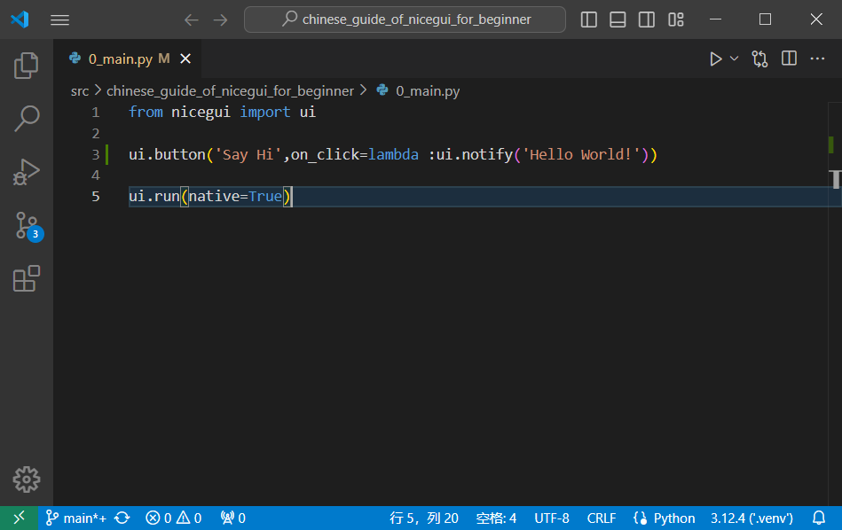

点击VSCode右上角的运行按钮（三角形），就可以看到一个窗口弹出，点击`SAY HI`按钮，就能看到窗口底部弹出的`Hello World!`。

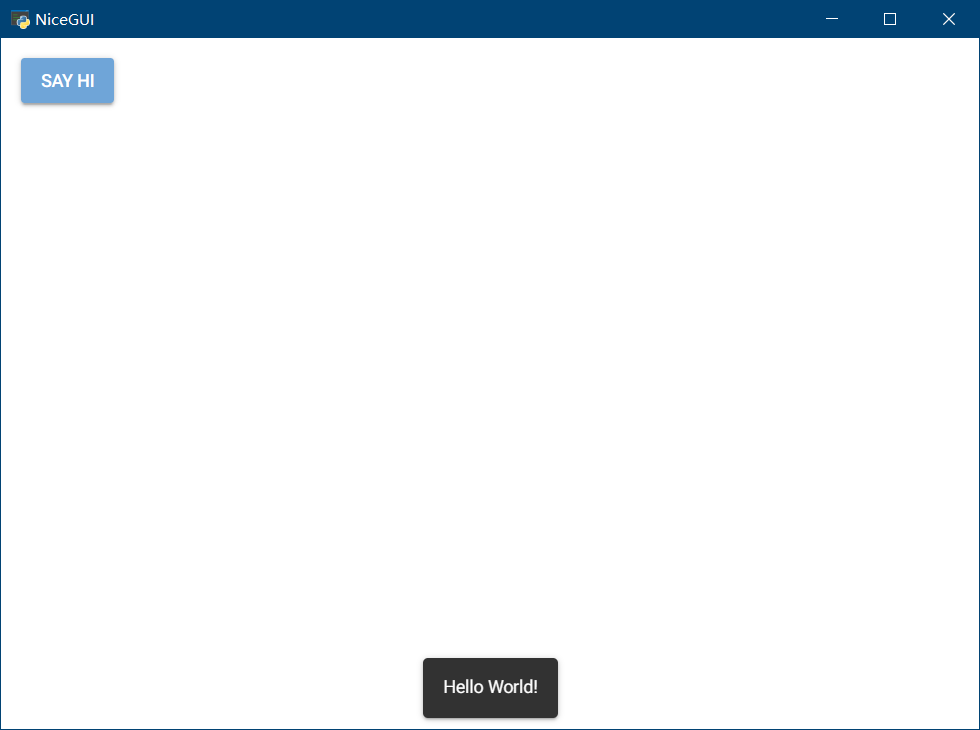

从`Hello World!`示例可以看到，基于nicegui的python程序寥寥三行代码，除去导入语句和必不可少的`ui.run`，主体只有一行代码，就能实现一个完整的交互过程，足见nicegui的强大、简洁。后续教程中很多例子都可以做到几行代码实现不错的效果，这也是nicegui大受欢迎的原因。

### 2.2 nicegui的基本结构

#### 2.2.1 图形界面的基础概念

在正式学习nicegui之前，需要先对图形界面有个基础的理解。

一般来说，搭建图形界面理解三个概念：控件、布局、交互。

##### 2.2.1.1 控件

控件是搭建图形界面的基本元素，就像是盖房子用的砖、门、窗等最小搭建单位。控件通常是图形界面框架提供、直接可用的。如果使用过程中发现基本元素不够，可以结合布局功能，用基本元素组合出新的控件。

##### 2.2.1.2 布局

布局是排布控件的方式，就像是房屋的基本框架。用砖可以铺地，也可以垒墙，对于砖而言，墙或是地，就是布局。控件是横向排列还是竖向排列，是像网格一样一一对应，还是大控件套着小控件，都是由布局控制。大部分图形程序框架提供的布局类似，除了基本的几种布局之外，部分图形程序框架还提供额外的组合布局。

##### 2.2.1.3 交互

交互是图形界面的重中之重，也是一个程序最难的部分。论难度的话，前面的控件和布局的学习只是对照文档，按图索骥，交互则需要身经百战，不断积累经验。

事件机制是目前大部分图形界面采用的交互反馈机制，也就是基于特定的事件触发，执行对应的函数。微软的winform中采用的消息机制，Qt的信号与槽，现代网页开发中的event事件监听，都可以理解为事件机制，只是对于winform和Qt而言，他们框架内的事件分别叫做消息和信号而已。

除了事件机制，美化也是交互的一部分。大部分现代图形界面框架。如Qt、WPF以及一系列基于网页开发的图形界面框架，支持CSS或者类似语法的美化功能，让图形界面变得更加美观，也让控件的动画效果更加丰富，这个极大提升了用户的使用体验。

此外，基于图形界面框架的特性，后端的处理逻辑以及数据的传递也是交互的一部分。在函数内，对于控件的控制，如何做到符合要求，毕竟有的框架、编程语言不支持没有定义或者声明函数就调用，而有的语言不支持声明函数。如果需要让控件显示的文本与另一个控件的文本一致，如何处理数据同步过程也需要技巧。

#### 2.2.2 nicegui与基础概念的对应

对图形界面有基础的理解之后，下面就可以根据nicegui与基础概念的对应，进一步理解nicegui的设计理念。

在`Hello World!`示例中，使用了导入语句`from nicegui import ui`导入了`ui`，顾名思义，ui就是用户界面，这也是nicegui调用控件的模块，也可以调用布局。具体的控件和布局用法可以参考下一节[nicegui中不得不学的功能](#2.3 nicegui中不得不学的功能)，下一节将选取一些nicegui中常用、不好理解的功能重点讲解。

因为nicegui是基于Quasar这个Web框架做的python调用绑定，因此，nicegui的交互部分，很大程度与Web结合。在Web设计中，基于CSS实现的美化效果，基于JavaScript的event做的事件响应，都能在nicegui中看到。所以，如果用好nicegui，对Web三件套HTML、CSS、JavaScript的学习不可避免。此外，因为nicegui与Quasar这个Web框架的深度集成的关系，Quasar中的属性、slot、事件也需要掌握，才能让交互设计更加得心应手。

关于美化，下一节中的[外观美化](#2.3.7 外观美化)将会详细介绍，也可以查阅对应的官方文档。事件的学习，可以参阅下一节的[事件和执行](#2.3.8 事件和执行)，也可以查阅对应的官方文档。

### 2.3 nicegui中不得不学的功能

以下是官网文档对于nicegui提供的功能做了大致的划分，本教程将会对每个部分中不好掌握、需要重点学习的控件、功能进行剖析：

1.   文本控件：https://nicegui.io/documentation/section_text_elements

2.   常用控件：https://nicegui.io/documentation/section_controls

3.   多媒体控件：https://nicegui.io/documentation/section_audiovisual_elements

4.   数据控件：https://nicegui.io/documentation/section_data_elements

5.   属性绑定：https://nicegui.io/documentation/section_binding_properties

6.   图形布局：https://nicegui.io/documentation/section_page_layout

7.   外观美化：https://nicegui.io/documentation/section_styling_appearance

8.   事件和执行：https://nicegui.io/documentation/section_action_events

9.   网站页面：https://nicegui.io/documentation/section_pages_routing

10.   部署与配置：https://nicegui.io/documentation/section_configuration_deployment


这部分对于官方内容的解析并不会完全覆盖，主要讲经常用到的参数、属性、方法，对于某些隐藏参数和不常用的属性方法，会在后面用到的时候详细介绍，这里最多提一嘴。

#### 2.3.1 文本控件

文本类控件主要是一些静态展示可复制文本的控件，是构成网页显示效果的主要控件。

##### 2.3.1.1 ui.label

文本标签，用法很简单，通过传入一个字符串类型的参数`text`，让网页显示字符串内的文字。注意，虽然参数支持多行文字，但是输出只能一行，需要原样输出多行文字的话，可以使用下面介绍的`ui.html`，将`tag`设置为`pre`。

```python3
from nicegui import ui

ui.label(text='some label')

ui.run(native=True)
```

##### 2.3.1.2 ui.link

超链接，一种点击之后跳转到指定地址的文本元素。可以传入`text`、`target`、`new_tab`三个参数。代码如下：

```python3
from nicegui import ui

ui.link(text='NiceGUI on GitHub', target= 'https://github.com/zauberzeug/nicegui', new_tab=False)

ui.run(native=True)
```

`text`参数，字符串类型，表示超链接显示什么文字。

`target`参数，字符串类型、`page function`、`ui.element`类型，表示超链接跳转到什么位置，这里只介绍字符串类型用法，其他类型可以自行探索或者后续需要用到的时候补充。字符串类型参数表示超链接跳转的url地址，可以使用协议开头的完整地址，也可以使用省略主机的绝对路径、相对路径。

`new_tab`参数，布尔类型，默认为`False`，表示要不要在新建标签页中打开超链接。

##### 2.3.1.3 ui.element

通用元素，也是nicegui大部分界面控件的基类。很多控件都是通过继承这个类来调用自定义标签、JavaScript代码实现。通过继承实现自定义控件、修改默认风格属于高级用法，这里只说基本用法。

`tag`参数，字符串类型，默认为`div`，表示生成的元素用什么标签，实际使用时可以根据需要修改为其他HTML标签或者Quasar标签。代码如下：

```python3
from nicegui import ui

with ui.element('div').classes('p-2 bg-blue-100'):
    ui.label('inside a colored div')
    
ui.run(native=True)
```

`move`方法，将控件移动到指定控件之内，默认为`default`slot，也可以传递`target_slot`参数，指定slot。代码如下：

```python3
from nicegui import ui

with ui.card() as card:
    name = ui.input('Name', value='Paul')
    name.add_slot('append')
    icon = ui.icon('face')

ui.button('Move into input default slot', on_click=lambda: icon.move(name))
ui.button('Move into input append slot', on_click=lambda: icon.move(name, target_slot='append'))
ui.button('Move out of input', on_click=lambda: icon.move(card))

ui.run(native=True)
```

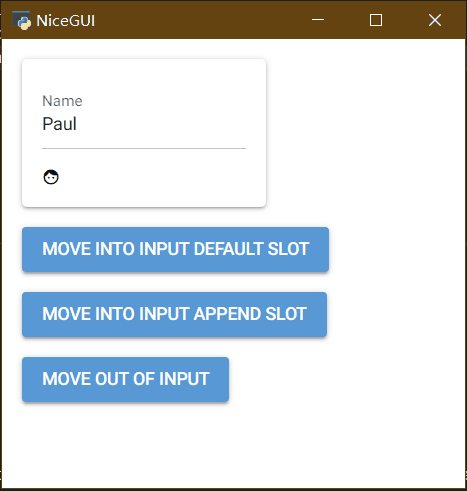

##### 2.3.1.4 ui.markdown和ui.html

与`ui.label`类似，`ui.markdown`和`ui.html`，都可以用来展示文本，只是后两者支持markdown语法和HTML语法，因为markdown语法支持一部分HTML的标签，可以看到放在`ui.markdown`里的HTML标签也能被解析。以下是三种控件解析同一内容的代码：

```python3
from nicegui import ui

content = '''
This is **Markdown**.
This is <u>emphasized</u>
'''
ui.label(content)
ui.markdown(content)
ui.html(content)

ui.run(native=True)
```

此外，`ui.html`还支持传入字符串类型参数`tag`给基类`ui.element`，用于修改生成`ui.html`用的标签，比如：

```python3
from nicegui import ui

ui.html('This is <u>emphasized</u>.', tag='em')

ui.run(native=True)
```

#### 2.3.2 常用控件

常用控件主要是一些支持点击、输入、拖动等交互功能的控件。

##### 2.3.2.1 ui.button

按钮作是网页交互设计中最常见的基本元素，在移动互联网没有普及之前，使用鼠标点击为主要交互方式的时代，除了用于跳转网页的超链接，按钮就是网页中用的最多的可交互元素。在nicegui中，按钮控件可以传入位置参数`text`，关键字参数`on_click`、`color`和`icon`。

以下代码就是一个定义了基本交互的按钮，点击会弹出一个通知提示：

```python3
from nicegui import ui

ui.button('Click me!', color='green', icon='thumb_up', on_click=lambda: ui.notify('You clicked me!'))

ui.run(native=True)
```

`text`参数，字符串类型，表示显示在按钮上的文字，如果是英文的话，默认全部大写。该参数默认只支持字符串类型，但是整数和小数可以直接使用，其他类型需要先转换为字符串类型才能传入。

`color`参数，字符串类型或者None，表示按钮的颜色，支持传入字符串类型的颜色类（Quasar、 Tailwind、CSS的颜色名）或者`None`（即让按钮变成默认颜色）。

`icon`参数，字符串类型，表示按钮额外显示的图标，支持传入字符串类型的图标名，具体名字会在`ui.icon`中介绍，这里不做详细介绍。

`on_click`参数，可调用类型，表示点击按钮调用的函数，可以使用`lambda`表达式，也可以使用函数名。

如果觉得对按钮传入参数来自定义按钮内容的方法太死板，也可以使用以下语法，使用`with`来进入按钮的`default slot`，随意组合按钮内的内容：

```python3
from nicegui import ui

with ui.button(color='green', on_click=lambda: ui.notify('You clicked me!')):
    ui.icon('thumb_up')
    ui.label('Click me!')

ui.run(native=True)
```

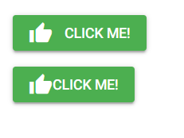

对于`on_click`参数、后续会涉及到的on开头的`on_*`参数、on开头的`on_*`方法和`on`方法里的callback或者handler参数，均为可调用类型参数，既可以在创建控件时定义lambda表达式，也可以提前定义。对于复杂一点逻辑操作，应该定义函数而不是lambda表达式，比如：

```python3
from nicegui import ui

test = lambda :...
#如果要执行的操作比较多、复杂，应该定义函数
def test():
    pass
#在控件中传参可以直接使用test
ui.button('Click me!',on_click=test)

ui.run(native=True)
```

对于button等控件而言，除了支持通过传参创建响应动作，还支持调用对应的`on_*`方法（比如on_click）创建，这个方法极大提高了响应动作的灵活性，上面的例子就可以借助这个方法调整函数定义与按钮创建的先后顺序，代码如下：

```python3
from nicegui import ui

button = ui.button('Click me!')
def test():
    pass
button.on_click(test)

ui.run(native=True)
```

##### 2.3.2.2 ui.input

输入框，大概是网页中仅次于按钮和超链接，用得最多的控件。HTML中输入框的变体很多，在nicegui中，输入框的参数也很多，基于输入框扩展的控件也多，使用输入框的逻辑设计、注意事项一样很多。不过，在这一节，针对输入框的学习并不会那么深入，只要能掌握常用的参数和基础的方法，那些疑难点会放到进阶和需要的时候细讲，以免一时不好理解而记混。

以下代码定义了一个名字输入框和密码输入框，并在输入名字的时候，自动弹出通知显示名字和密码：

```python3
from nicegui import ui

name = ui.input(label='Name:', value='Peter', on_change=lambda :ui.notify(f'{name.value=},{password.value=}'))
password = ui.input(label='Password:', value='123456', password=True, password_toggle_button=True)

ui.run(native=True)
```

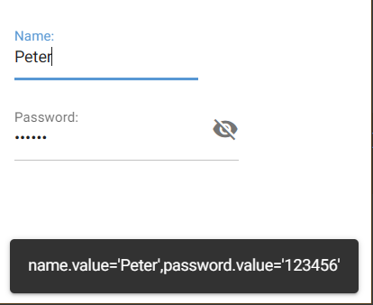

`label`参数，字符串类型，直译的话是标签，表示显示在输入框上方的文本，但不是输入的文本，如果输入的内容是空的，点击输入的之前会显示在输入框内，点击之后会移动到输入框上方。

`value`参数，字符串类型，表示输入框内的内容，也就是输入框的值。对于后续介绍的以及其他支持交互输入的控件，都会有这么一个参数、属性、相关方法，来设置控件的值，这一点上，nicegui的设计倒是很统一。

`on_change`参数，可调用类型，表示输入框的值变化时执行的函数。

`password`参数，布尔类型，表示输入框是否设置为密码输入框，如果设置为`True`，输入的内容将不显示明文，转而显示统一的密码符号。

`password_toggle_button`参数，布尔类型，表示输入框内是否显示密码按钮，密码按钮可以切换输入框内的密码、明文状态。

输入框控件还有很多参数和方法，就留给读者自己探索了，后续如有相关案例，到时候再细讲。

##### 2.3.2.3 ui.slider和ui.knob

ui.slider是滑动条，这个比较简单，参数也不多，按理说不用专门讲一下，自学即可。至于ui.knob——旋钮，这个的样式参数比较多，也有很大的自定义自由度，值得一讲。不过，这些都不是这里要专门放在一起介绍的原因，具体原因是什么，这里先卖个关子，后面再做解释。

先看一段代码：

```python3
from nicegui import ui

slider = ui.slider(min=0, max=100, step=1, value=50)
ui.knob(min=0, max=100, step=1, value=50,
        color='orange', center_color='blue', track_color='black',
        size='3.5em',
        show_value=True
        ).bind_value(slider, 'value')

ui.run(native=True)
```

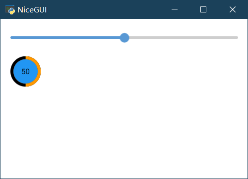

可以看到，ui.knob的前四个参数和ui.slider的一样，都是浮点类型，分别代表最小值、最大值、每次调整的最小步长、当前值。

在ui.knob中，有`color`、`center_color`、 `track_color`三种可以传参修改的颜色，分别代表旋钮边缘的颜色、旋钮中间的颜色、旋钮边缘没有覆盖之前的颜色，支持传入字符串类型的颜色类（Quasar、 Tailwind、CSS的颜色名）、`None`（即让按钮变成默认颜色）或者`"primary"`（跟随主题颜色）。

`size`是旋钮的整体大小，字符串类型，采用CSS语法的大小表示方式。

`show_value`参数，布尔类型，是否在旋钮中间显示当前值。

#### 2.3.3 多媒体控件

##### 2.3.3.1 ui.image和ui.interactive_image

点开一个网页，最抓人眼球的是什么内容？没错，是图片。既然用nicegui设计网页，没有图片元素怎么行？在nicegui中，有两种显示图片的控件：ui.image和ui.interactive_image。前者可以简单理解为显示图片的简单标签，后者是基于前者扩展了很多交互功能的plus版本。两者的第一个参数都是`source`，支持字符串类型的本地图像路径、网络图像路径，或者base64编码的图像本身，这个没什么难点，这里不做细讲，接下来要重点讲的是ui.interactive_image的其他参数的用法，因为这个控件有时候比看似简单的ui.image更加好用趁手。

先看一段代码：

```python3
from nicegui import ui

src = 'https://picsum.photos/id/377/640/360'
img = ui.image(src)
img2 = ui.interactive_image(src)

ui.run(native=True)
```


可以看到，同样的图片地址，都是不传入其他参数的情况下，即使可用空间大于图片大小，ui.interactive_image也不会随着页面大小而缩放图片，始终保持图片的原始大小，这个有别于ui.image的特性，可以在日后想要保持图片真实大小时使用。

除了`source`参数外，ui.interactive_image还有以下参数：

`content`参数，字符串类型，表示覆盖在图片之上的SVG内容，SVG的画布大小就是图片的大小。当然，不太理解SVG的话也没关系，后面用到会详细介绍，也可以专门找一下资料。这里可以简单理解SVG为一种用定义描述的几何图形，这种图形不会因为缩放变成马赛克，因为它是基于定义绘制的。

`size`参数，元组类型（宽度，高度），表示如果`source`没有设置的话，这就是默认图形的尺寸。这个对于绘制上面的SVG内容来说比较重要，因为这个尺寸就是画布的大小。对于想要交互创建SVG内容的操作，指定画布大小很重要。

`on_mouse`参数，可调用类型，表示触发鼠标事件之后要执行的操作，默认包含一个鼠标事件的参数，参数字典内的image_x和image_y的值是以像素为单位表示的鼠标交互位置。

`events`参数，字符串列表，表示JavaScript订阅的事件，默认订阅点击事件，即`['click']`，也可以自己指定要订阅的事件内容。

`cross`参数，字符串类型或者布尔类型，表示要不要显示十字线来指示鼠标位置，默认为`False`。如果为`True`或者表示颜色的字符串，就会显示指定颜色（即字符串表示的颜色）的十字线。

`force_reload`方法，强制重新载入图片，这个方法两者图片控件都有，对于某些时候网络不好造成图片加载失败、支持随机刷新图片的接口，这个方法还是很实用的。

对于图片控件，一样可以使用`with`嵌入其他内容。比如，下面的代码就嵌入了一个按钮，实现了点击图片和按钮有不同的通知内容：

```python3
from nicegui import ui

src = 'https://picsum.photos/id/377/640/360'
with ui.interactive_image(src,on_mouse=lambda :ui.notify('You clicked interactive_image.')):
    ui.button(on_click=lambda: ui.notify('You clicked button.'), icon='thumb_up')\
        .props('flat color=white').classes('absolute bottom-0 left-0 m-2')

ui.run(native=True)
```


##### 2.3.3.2 ui.icon和ui.avatar

在[ui.button](#2.3.2.1 ui.button)中挖了一个有关ui.icon的坑，现在，终于到了填坑的时候。先看一个简单的示例，了解一下ui.icon控件的用法：

```python3
from nicegui import ui

ui.icon(name='home', color='blue', size='xl')
ui.icon(name='o_home', color='blue', size='xl')
ui.icon(name='r_home', color='blue', size='xl')
ui.icon(name='sym_o_home', color='blue', size='xl')
ui.icon(name='sym_r_home', color='blue', size='xl')

ui.run(native=True)
```

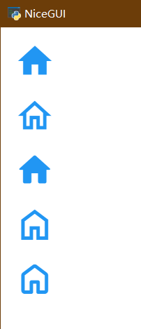

ui.icon的参数不多，就三个：

`name`参数，字符串类型，表示图标字体中的图标名，ui.icon通过给定的图标名，从字体中加载图标，默认支持Material Icons图标字体。也可以自己添加其他图标字体，并结合对应图标字体的用法加载。这一部分需要根据具体情况灵活变通，这里不做详解。

`color`参数，字符串类型，表示图标的颜色。

`size`参数，字符串类型，表示图标的大小。

理解参数不难，但是，给出的示例代码并没有看上去那么简单。这个时候，聪明的读者已经发现了猫腻：几个图标看上去很像，但不完全一样。再仔细看的话就会发现，它们的后缀都是一样的，只有前缀不同。没错，这组图标本质上都是一个，只是名字的前缀有特定的风格含义，需要特别注意一下。

无前缀代表实心填充风格，"o\_" 前缀表示轮廓线风格，"r\_" 前缀表示圆角风格，"s\_"前缀表示锐化风格，"sym\_o\_"前缀表示轮廓线符号，"sym\_r\_"前缀表示圆角符号，"sym\_s\_" 前缀表示锐化符号。

这个时候，有的读者就要头疼了，前缀就这么几个，还好记，可图标那么多，每个图标名字怎么记得住，有没有方便查询的网站？有，不过国内没法直接访问，那就是官网：

 Material Icons查询网站（非中国大陆地区）：https://fonts.google.com/icons?icon.set=Material+Icons

当然，国内也有很多渠道查询，为了避免广告嫌疑，这里就不具体指明了。

不过，只是提供一个404网站，教程就失去了意义，这里还有一个备用方法，那就是小工具：

 Material Icons查询器：`src\chinese_guide_of_nicegui_for_beginner\2_3_3_2_ui_icon.py`

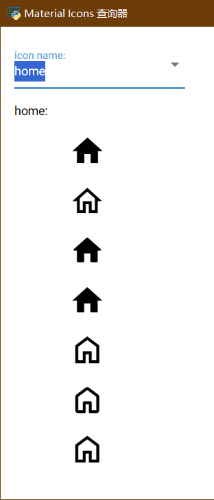

在输入框输入关键字，选定需要的名字，然后在下面查看各个风格的图标预览，最后确定要使用的图标名称。要注意的是，图标名是遍历字体库源代码下的文件夹名字，有的图标不支持全部风格，如果发现下面的预览存在图标异常或者各个风格没有区分，证明这个图标不支持全部风格，读者需酌情调整。

这一节到这里还没结束，还有一个控件要一并讲解。之所以放在一起讲，是因为这个控件主要参数和ui.icon一样，实际应用也不少，那就是头像控件——ui.avatar。

按照惯例先看代码：

```python3
from nicegui import ui

ui.avatar(icon='favorite_border', color='green-5', text_color='blue-10',
          size='60px', font_size='50px', square=False, rounded=True)
ui.avatar(icon='favorite_border', color='green-5', text_color='blue-10',
          size='60px', font_size='50px', square=True, rounded=False)
# 使用图片文件当做头像
url = 'https://nicegui.io/logo_square.png'
ui.avatar(f'img:{url}')
with ui.avatar():
    ui.image(url)

ui.run(native=True)
```

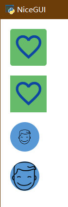

从参数上看，`icon`就是ui.icon的`name`；颜色这里不太一样，`color`和`text_color`分别代表头像的背景颜色、图标颜色；`size`是头像大小，`font_size`是图标大小。此外，还有两个布尔类型的参数决定头像框的形状：`square`是方形， `rounded`是圆角方形，如果两个都是`False`，头像框就是圆形。

除了使用图标字体外，头像当然可以使用图片。一种是用以`img:`开头的图片地址，另一种是在`defalut slot`中加入图片控件。要注意的是，两种方法呈现的图片不一样，后者使用的是ui.image的样式，实际图片显示会有差别。

##### 2.3.3.3 ui.audio和ui.video

ui.audio和ui.video从本质上讲是一样的，参数、方法基本一致，所以，只需学会其中一个的用法，另一个就是改个名字的事儿。

顾名思义，ui.audio和ui.video，分别代表着音频、视频控件，对于需要再网页播放音频、视频的需求，这两个控件再合适不过。

先看示例代码：

```python3
from nicegui import ui

v = ui.video(src='https://test-videos.co.uk/vids/bigbuckbunny/mp4/h264/360/Big_Buck_Bunny_360_10s_1MB.mp4',
             controls=True, autoplay=False, muted=False, loop=False)
ui.button('Play', on_click=v.play)
ui.button('Pause', on_click=v.pause)
ui.button('Jump to 0:05', on_click=lambda: v.seek(5))

ui.run(native=True)
```

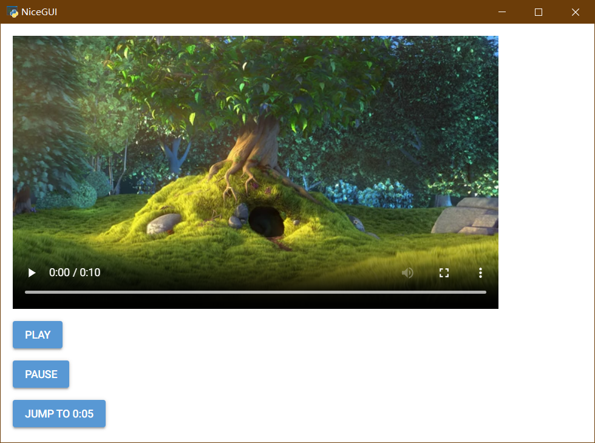

控件通过字符串类型参数`src`传入视频地址，四个布尔类型参数`controls`、`autoplay`、 `muted`、 `loop`分别代表着是否显示内置工具栏、是否自动开始播放、是否静音、是否循环播放。

当然，除了上面代码里用按钮在外面控制播放暂停，还可以监听播放、暂停、播放结束的事件，执行特定的操作。

```python3
from nicegui import ui

v = ui.video(src='https://test-videos.co.uk/vids/bigbuckbunny/mp4/h264/360/Big_Buck_Bunny_360_10s_1MB.mp4',
             controls=True, autoplay=False, muted=False, loop=False)
v.on('play', lambda _: ui.notify('Started'))
v.on('pause', lambda _: ui.notify('Paused'))
v.on('ended', lambda _: ui.notify('Completed'))

ui.run(native=True)
```

#### 2.3.4 图形布局

盖房子不是把砖简单地垒砌，做图形界面一样不是简单地添加控件，美观、简洁的布局除了让图形界面整体风格更加整齐，也让用户使用时更加方便、快捷，这才是图形界面的意义。在掌握了一定数量的常用控件之后，在继续深入学习其他控件之前，是时候了解一下NiceGUI支持的布局控件了。

在NiceGUI中，有一个概念非常重要，那就是上下文。前面代码中使用的`with`就是Python的上下文管理器关键字，而在NiceGUI中，进入某个控件的上下文，就意味着后续添加控件的操作都是在这个控件的上下文内，直观感受的话，就是后续添加的控件都在这个控件内部。

以代码为例：

```python3
from nicegui import ui

with ui.card():
    ui.label('Card content')
    ui.button('Add label1', on_click=lambda: ui.label('Click!'))
ui.button('Add label2', on_click=lambda: ui.label('Click!'))

ui.run(native=True)
```

`Add label1`按钮在ui.card内部，它添加的ui.label就在ui.card内。`Add label2`按钮在ui.card外，它添加的ui.label就在ui.card外。所以点击两个按钮的效果是这样的：

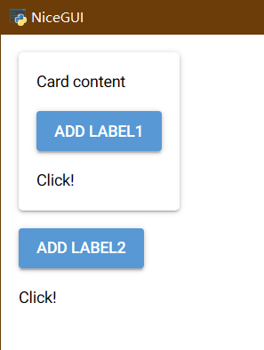

##### 2.3.4.1 ui.row、ui.column和ui.grid

在图形界面的布局设计中，最常用也是最基本的布局，就是行布局、列布局和网格布局，几乎所有的现代GUI框架都提供了这三种布局。说来神奇，哪怕不用框架提供的其他布局，只是这三种布局相互组合，就能构成了用户在程序里看到的各种控件排布，真可谓“三生万物”。

行（ui.row）布局，即所有控件排成一行。

列（ui.column）布局，即所有控件排成一列。

网格（ui.grid）布局，即所有控件按照给定的网格排布（几行几列），依次占据每个单元格，就和表格一样。

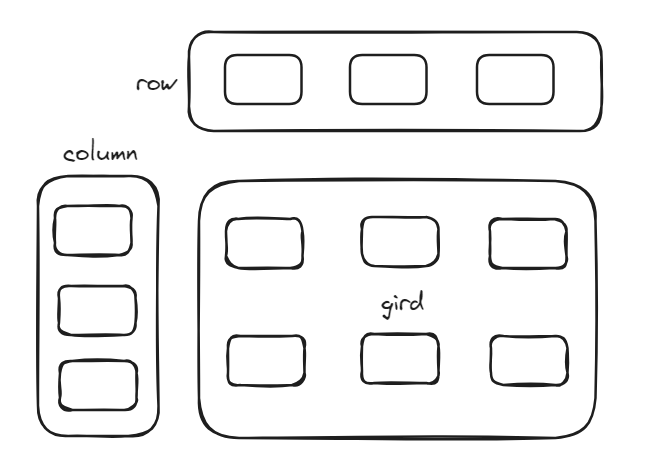

在NiceGUI中，想要让指定的控件按照给定的布局排布，就要在布局的上下文内创建控件，因此，这三个常用布局的代码就要这样写：

```python3
from nicegui import ui

with ui.column().classes('border-4 border-black p-2'):
    ui.label('label 1')
    ui.label('label 2')
    ui.label('label 3')

with ui.row().classes('border-4 border-black p-2'):
    ui.label('label 1')
    ui.label('label 2')
    ui.label('label 3')

with ui.grid(columns=2,rows=2).classes('border-4 border-black p-2'):
    ui.label('label 1')
    ui.label('label 2')
    ui.label('label 3')

ui.run(native=True)
```

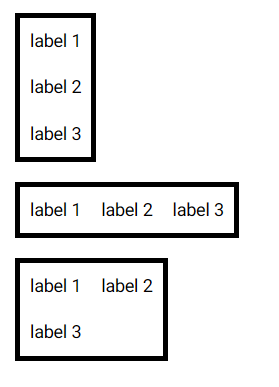

##### 2.3.4.2 ui.space

在布局控件的时候，如果想要一些控件放在末尾，可按照布局控件的规则，内部的控件总是像排队一样一个挨着一个，似乎需要调整CSS才行。其实，还有一种不用CSS的方法，那就是使用ui.space。

ui.space可以默认填充浮动布局的可用空间，让布局不会因为默认的排列规则而显得末尾空空如也。

```python3
from nicegui import ui

with ui.row().classes('w-96 border-4 border-black p-2'):
    ui.label('label 1')
    ui.label('label 2')
    ui.space()
    ui.label('label 3')

with ui.column().classes('h-96 border-4 border-black p-2'):
    ui.label('label 1')
    ui.label('label 2')
    ui.space()
    ui.label('label 3')

ui.run(native=True)
```

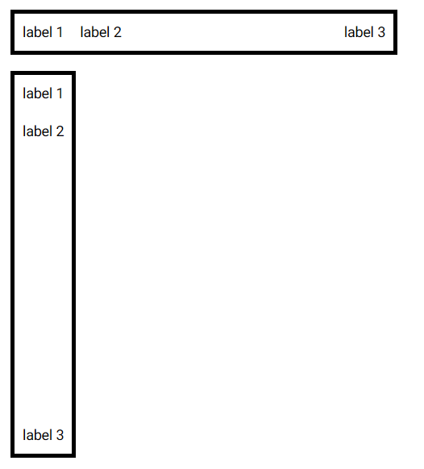

##### 2.3.4.3 ui.separator

用ui.space可以填充空白，但是有读者担心，目的是达到了，能不能画条线在末尾的控件前，用来区分一下这个位置的控件与其他位置控件的区别？没问题，ui.separator就是用来干这个的，不管是水平还是垂直，都可以。代码如下：

```python3
from nicegui import ui

with ui.column().classes('border-4 border-black p-2'):
    ui.label('text above')
    ui.separator()
    ui.label('text below')

with ui.row().classes('border-4 border-black p-2'):
    ui.label('text above')
    ui.separator().props('vertical')
    ui.label('text below')

ui.run(native=True)
```

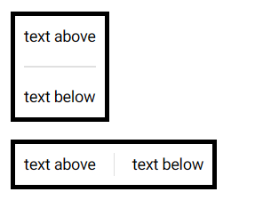

##### 2.3.4.4 ui.menu和ui.context_menu

有用过图形程序的读者看到前面的内容，肯定联想到，ui.separator好像菜单里面用来分割退出功能与其他功能的分割符，NiceGUI有没有菜单？当然也有，普通的点击菜单ui.menu和右键菜单ui.context_menu。两个菜单的语法一致，只是触发方式不同。菜单的内部一般使用ui.menu_item当菜单项，一般可以当做按钮处理，因为它们的触发操作都是传给点击事件。

下面的代码给`menu`按钮创建点击菜单和右键菜单，可以分别用鼠标左击和右击查看弹出的菜单的异同，除了菜单内文字为了作出区分专门修改了之外，菜单的布局和样式一模一样，因此两种菜单可以很方便复用相同的内容：

```python3
from nicegui import ui

with ui.row().classes('w-full items-center'):
    result = ui.label().classes('mr-auto')
    with ui.button(text='menu', icon='menu'):
        with ui.context_menu() as menu1:
            ui.menu_item('Context Menu item 1', lambda: result.set_text('Selected item 1'))
            ui.menu_item('Context Menu item 2', lambda: result.set_text('Selected item 2'))
            ui.menu_item('Context Menu item 3 (keep open)',
                         lambda: result.set_text('Selected item 3'), auto_close=False)
            ui.separator()
            ui.menu_item('Close', menu1.close)
        with ui.menu() as menu2:
            ui.menu_item('Menu item 1', lambda: result.set_text('Selected item 1'))
            ui.menu_item('Menu item 2', lambda: result.set_text('Selected item 2'))
            ui.menu_item('Menu item 3 (keep open)',
                         lambda: result.set_text('Selected item 3'), auto_close=False)
            ui.separator()
            ui.menu_item('Close', menu2.close)

ui.run(native=True)
```

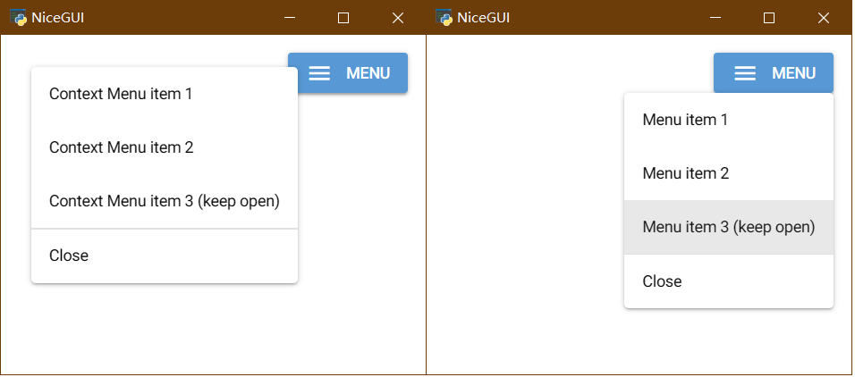

##### 2.3.4.5 ui.tooltip

ui.tooltip可以给控件添加一种光标悬停之后弹出的提示。一般是在给定控件的上下文添加，也可以用给定控件的`tooltip`方法来添加，代码如下：

```python3
from nicegui import ui

with ui.button(icon='thumb_up'):
    ui.tooltip('I like this')

button = ui.button(icon='thumb_up')
button.tooltip('I like this')

ui.run(native=True)
```

但是要注意，如果想要美化ui.tooltip，只能给上下文添加的ui.tooltip美化，如果是用`tooltip`方法添加的，则不能美化。因为`tooltip`方法返回的是控件本身，而不是tooltip。可以看到，下面代码的`tooltip`方法后添加的美化，在按钮本身生效了，实际上ui_tooltip并没有生效。

```python3
from nicegui import ui

with ui.button(icon='thumb_up'):
    ui.tooltip('I like this').classes('bg-green')

button = ui.button(icon='thumb_up')
button.tooltip('I like this').classes('bg-green')

ui.run(native=True)
```

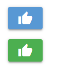

##### 2.3.4.6 ui.notify

通知提示控件，在前面[ui.button](#2.3.2.1 ui.button)中已经用过，虽然简单传递一个字符串参数的用法很好用，但是到这一节结束都不说一下的话，实在是对不起读者。毕竟，这个控件的参数可不止看上去那么少，隐藏在其中的参数也很有用。

代码如下：

```python3
from nicegui import ui

ui.button('Notify',
          on_click=lambda: ui.notify(
              message='Hi!',
              position='bottom',
              close_button='OK',
              type=None,
              color='black-5',
              multi_line=False,
              progress=True,
              caption='5 minutes ago',
              timeout=5*1000,
              spinner= True
          ))

ui.run(native=True)
```

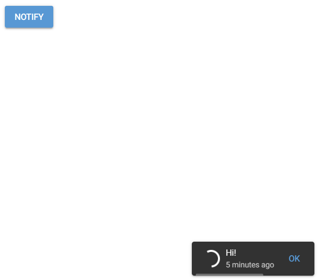

参数有点多，但不必害怕，习惯用法只需记住第一个参数，用起来也简单，其他参数只做了解。

 `message`参数，字符串类型，信息文本，显示在通知中的主要内容。

`position`参数，字符串类型，通知出现的位置，有"top-left"、 "top-right"、"bottom-left"、 "bottom-right"、 "top"、 "bottom"、 "left"、 "right"、 "center"可选，默认为 "bottom"。

`close_button`参数，字符串类型或者布尔型，是否显示关闭按钮，如果是字符串类型，关闭按钮的文字就是给定的文字。

`type`参数，字符串类型，通知的类型，有"positive"、 "negative"、 "warning"、 "info"、 "ongoing"，默认为`None`，不是其中的任何一种。

`color`参数，字符串类型，通知的背景颜色。

`multi_line`参数，布尔类型，是否让通知内容以多行格式显示。

 `progress`参数，布尔类型，是否显示通知消失的进度条。

`caption`参数，字符串类型，显示在信息文本下的说明文字。

`timeout`参数，整数型，通知自动消失的时间，单位毫秒，为0就是不消失，但是要确保`close_button`不是`False`，否则通知没法正常消除，影响用户体验。

`spinner`参数，布尔类型，是否显示转盘动画。

#### 2.3.5 属性绑定和数据控件

##### 2.3.5.1 binding

在[ui.slider和ui.knob](#2.3.2.3 ui.slider和ui.knob)一节中，为了让ui.slider和ui.knob联动，使用了`bind_value`方法来实现，现在是时候详细了解了。

对于大部分控件来说，都有几个可以bind的属性，以ui.button为例，有icon、text、visibility、enabled几个属性可以bind。在下面的代码中，就将ui.button这四个属性绑定到ui.select上，可以手动选择每个ui.select的值，让按钮实时发生变化：

```python3
from nicegui import ui

icon = ui.select(['home','menu'],value='menu',label='icon:').classes('w-32')
text = ui.select(['home','menu'],value='menu',label='text:').classes('w-32')
visibility = ui.select([True,False],value=True,label='visibility:').classes('w-32')
enabled = ui.select([True,False],value=True,label='enabled:').classes('w-32')
ui.button()\
    .bind_icon(icon,'value')\
    .bind_text(text,'value')\
    .bind_visibility(visibility,'value')\
    .bind_enabled(enabled,'value')

ui.run(native=True)
```

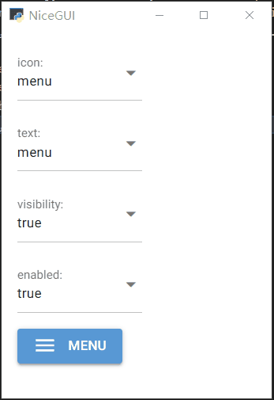

`bind_{属性名}`方法有四个参数`target_object`、 `target_name`、`forward`、`backward`：

`target_object`参数，任意对象，是被绑定的对象。

`target_name`参数，字符串类型，是被绑定对象的属性名，以被绑定的ui.select为例，它的值就对应`value`属性。

`forward`参数和`backward`参数，可调用类型，是正向绑定和反向绑定的转换函数。因为绑定是双向的，除了在目标值改变的时候同步过来，本身的值改变还要同步过去，是两个方向的操作。两个参数的默认值都是`lambda x:x`，意思是双向传递过程不改变值，如果有需要，可以修改这两个参数，在传递的时候实现数据的转换和映射的改变。

要注意的是，`bind_{属性名}`方法返回的是控件本身，因此可以实现连续bind的操作，不需要每次bind都要写一次控件对象，NiceGUI的这一点非常方便。

除了`bind_{属性名}`方法，对于同一属性，还有`bind_{属性名}_to`方法和`bind_{属性名}_from`方法。相比之下，后两者方法就像是把前者的两个方向拆分，分别对应着正向和反向，参数自然分别去掉了不需要的反向绑定`backward`参数和正向绑定`forward`参数。而NiceGUI实际上内部的实现，是`bind_{属性名}`方法执行了`bind_{属性名}_to`方法和`bind_{属性名}_from`方法，因此，三者的关系更像下面这张图：

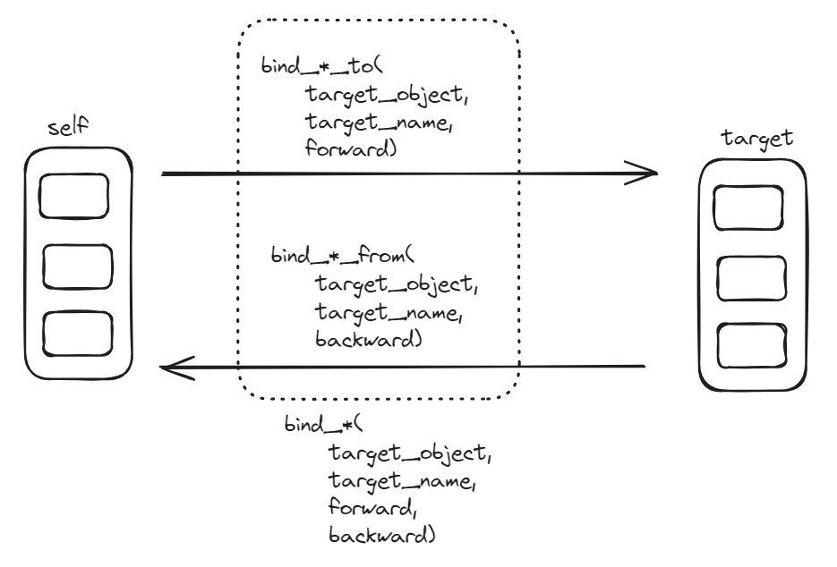

`bind_{属性名}_to`方法和`bind_{属性名}_from`方法的特性，可以参照下面代码的演示：

```python3
from nicegui import ui

text_from = ui.select(['home','menu'],value='menu',label='text_from:').classes('w-32')
text_from2 = ui.select(['home','menu'],value='menu',label='text_from2:').classes('w-32')
text_to = ui.select(['home','menu'],value='menu',label='text_to:').classes('w-32')
ui.button()\
    .bind_text_from(text_from,'value')\
    .bind_text_from(text_from2,'value')\
    .bind_text_to(text_to,'value')

ui.run(native=True)
```

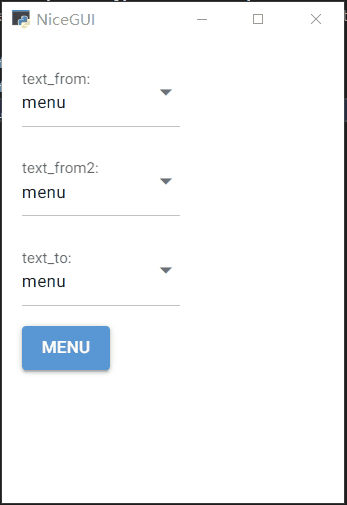

代码中做了两个反向绑定和一个正向绑定到ui.button。实际操作的话就会发现，因为两个反向绑定的控件都是单向绑定，任意操作其中一个反向绑定的控件，都只会影响到ui.button和正向绑定的控件，不会影响到另一个反向绑定的控件。对于正向绑定的控件，只有ui.button的`text`发生变化之后，正向绑定的控件才会发生变化，只是操作正向绑定的控件，ui.button和两个反向绑定的控件不会受影响。

##### 2.3.5.2 ui.linear_progress和ui.circular_progress

前面[ui.slider和ui.knob](#2.3.2.3 ui.slider和ui.knob)介绍过滑动条和旋钮，肯定有聪明的读者想用这两个控件做条形进度条和环形进度条，但是，这一节的标题已经表明，有专门的进度条控件，使用滑动条和旋钮充当进度条就未免有些画蛇添足。更关键的是，滑动条和旋钮接受用户输入，如果想避免用户输入影响数据展示，还要将控件禁用，具体样式又要做诸多调整，很不方便。然而，进度条控件没有这些弊端，使用起来更加简单。显然，这一节要介绍的进度条控件更适合展示进度。

ui.linear_progress和ui.circular_progress分别是线性进度条和环形进度条，样子看上去就像滑动条和旋钮，但与滑动条和旋钮不同，这两个控件不支持交互输入，只接受数据输入，所以，要想实现简单的交互演示，需要用到上一节的bind方法，这里用的是`bind_value_from`。当然，如果有其他控件作为该控件的下游，还可以使用`bind_value_to`串联下去。

```python3
from nicegui import ui

slider = ui.slider(min=0, max=1, step=0.01, value=0.5)
ui.linear_progress().bind_value_from(slider, 'value')
ui.circular_progress().bind_value_from(slider, 'value')

ui.run(native=True)
```

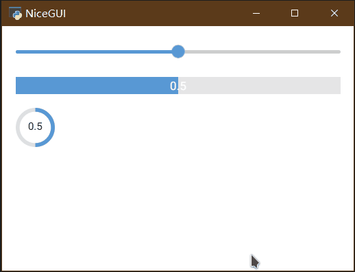

##### 2.3.5.3 ui.spinner

spinner直译的话是陀螺，在实际使用中，其实是加载中常见的动画图标，这里就称之为加载动画控件。

先看代码：

```python3
from nicegui import ui

ui.spinner(type='default',size='xl',color='red',thickness=5)

ui.run(native=True)
```


ui.spinner有`type`、`size`、`color`、`thickness`四个参数，分别是字符串类型的动画类型、字符串类型的整体尺寸大小、字符串类型的颜色和浮点类型的厚度（这个只有`type`为`default`时生效）。

下面的代码展示了所有动画类型的ui.spinner，读者可以根据需要选择合适的ui.spinner：

```python3
from nicegui import ui

spinner_type = ['default','audio','ball','bars','box','clock',
                'comment','cube','dots','facebook','gears','grid',
                'hearts','hourglass','infinity','ios','orbit','oval',
                'pie','puff','radio','rings','tail'] 

with ui.card().classes('w-96'),ui.label('All Spinners:'),ui.row():
    for i in spinner_type:
        with ui.element():
            ui.spinner(i,size='lg')
            ui.tooltip(i)

ui.run(native=True)
```

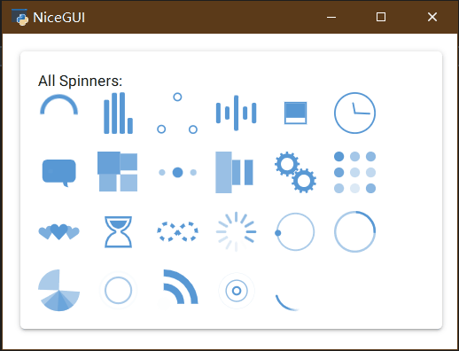

##### 2.3.5.4 ui.code

如果想要在网页上显示有语法高亮的代码块，除了截图之外，惯用的做法是将代码放到代码块里。在NiceGUI中，ui.code就是用来展示代码的。ui.code有两个字符串参数，`content`参数是代码主体，`language`参数是代码的语言类型。

```python3
from nicegui import ui

code ='''
    from nicegui import ui

    ui.label('Code inception!')

    ui.run()
'''
ui.code(content=code, language='python').classes('w-full')

ui.run(native=True)
```

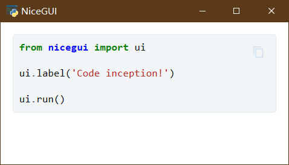

用于数据展示的控件还有很多，比如：表格ui.table，树形图ui.tree，基于AG Grid的ui.aggrid，用于绘制图表ui.echart、ui.highchart、ui.pyplot、ui.line_plot、ui.plotly，展示3D模型的ui.scene等。因为用法稍微有点复杂，有能力的读者可以自己了解或者等基础学完之后学习后续的进阶教程，这里就不做讲解了。

#### 2.3.6 外观美化

哪怕控件的默认样式好看，总有人觉得厌烦，调整颜色、大小、排列方式，或者一点小小的位移，都能让人眼前一亮。可是，对于前端来说的改变很小，需要涉及到的经验、代码很多，不去深入学习的话似乎很难达到效果。好在有NiceGUI，它的前端样式可以使用tailwindcss，提前定义的一系列样式省去不少麻烦。当然，它也提供了多种自定义的接口，也没有因为降低难度而限制了前端的自由。

##### 2.3.6.1 需要记住具体名字的props、classes、style方法

在掌握便利的工具之前，先辛苦一下，学点需要基础知识、但以后会很有用的方法。

先看代码：

```python3
from nicegui import ui

ui.button('button').props('color="red"')
ui.button('button').classes('!bg-red-500')
ui.button('button').style('background-color:red !important')

ui.run(native=True)
```

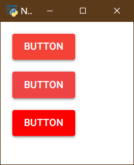

代码中，使用了三种方法将按钮颜色设置为红色。下面将分别说明三种方法的用法：

`props`方法，设置的是HTML标签的属性，对于NiceGUI基于的Quasar来说，标签属性有不少是决定显示效果的，因此，在NiceGUI中，可以用这个方法设置对应底层组件的属性。就代码案例而言，具体属性名可以参考https://quasar.dev/vue-components/button ，属性值参考 https://quasar.dev/style/sass-scss-variables 。

`classes`方法，设置的是HTML标签的类（class）名，NiceGUI支持tailwindcss，因此，`classes`方法可以使用tailwindcss预定义的类，也可以使用自定义的CSS类。就代码案例而言，具体类名可以参考https://tailwindcss.com/docs/background-color  。

`style`方法，设置的是HTML标签的CSS属性，可以直接给组件设置CSS属性，如果有一定前端基础的话，可以使用该方法充分自定义，没有相关基础也没关系，上面的两个方法提供了丰富的预定义功能，学习难度也不高。就代码案例而言，具体语法可以参考 https://developer.mozilla.org/en-US/docs/Web/CSS/background-color 。

##### 2.3.6.2 好记一点的tailwindcss属性和Tailwind对象

tailwindcss官网提供了搜索功能，但总归需要一定的时间学习，更别说网络不好或者没网的时候，没法打开官网搜索。当然，也有方法自托管tailwindcss的文档，但有一定难度，也不符合NiceGUI的宗旨。

因此，NiceGUI后续推出了tailwindcss属性和Tailwind对象。无需死记硬背tailwindcss，也不需要反复查询官网，直接使用`tailwindcss`属性或者使用`Tailwind`对象，会有自动提示，只要有一点英语基础，很容易找到对应的tailwindcss类名。

比如：

```python3
from nicegui import ui
from nicegui.tailwind import Tailwind

#设定标签的字体颜色为红色
label = ui.label('Style')
red_style = Tailwind().text_color('red-400')
red_style.apply(label)
#上述代码可以简化为一行，但是调用tailwind必须放到最后。
#因为tailwind的函数返回的是tailwind对象，不是element对象。
#调用完tailwind之后没法继续调用基于element的方法。
ui.label('Style').tailwind.text_color('red-400')
#以上方法等同于设定class为text-red-400
ui.label('Style').classes('text-red-400')

ui.run(native=True)
```

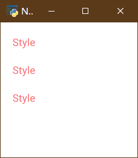

在开发工具中调用控件的`tailwindcss`属性或者创建` Tailwind()`对象之后，再输入`.`，就会弹出子方法提示，选择对应的子方法之后，在输入引号，会进一步弹出参数的提示。

##### 2.3.6.3 暗黑模式ui.dark_mode

现在很多网站支持暗黑模式，方便访问者光线不佳时浏览网页，让网页没那么刺眼。NiceGUI中，也有一个控件可以快速切换暗黑模式，实现同样的效果，那就是ui.dark_mode。

以下代码用ui.dark_mode创建了一个暗黑模式的控件，默认值为`False`，并且创建了一个模式切换的响应函数，会在模式切换时弹出通知，通过点击下方的两个按钮，可以直接启用、禁用暗黑模式：

```python3
from nicegui import ui

dark = ui.dark_mode(value=False, on_change=lambda :ui.notify(f'Dark mode is {dark.value}.'))
ui.label('Switch mode:')
ui.button('Dark', on_click=dark.enable)
ui.button('Light', on_click=dark.disable)

ui.run(native=True)
```

##### 2.3.6.4 设置主题颜色ui.colors

前面讲了如何给单个控件设置颜色的方法，肯定有读者担心了，如果想要修改主题颜色，还需要每个控件修改一次或者添加一下主题类，会不会很麻烦？其实，这个操作也有简单的方法，ui.colors可以直接设置整个程序的主题颜色，直接影响所有控件。因为Quasar提供了一系列预先定义好的类名，这些名字用在NiceGUI的控件颜色中，通过ui.colors可以修改这些类名的具体值。类名可以参考https://quasar.dev/style/theme-builder 。

以下面的代码为例，`primary`就是各个控件主要的颜色，通过ui.colors将`primary`修改为`#555`，上一节中的按钮默认颜色就变成灰色了：

```python3
from nicegui import ui

dark = ui.dark_mode(value=False, on_change=lambda: ui.notify(
    f'Dark mode is {dark.value}.'))
ui.label('Switch mode:')
ui.button('Dark', on_click=dark.enable)
ui.button('Light', on_click=dark.disable)

main_color = dict(primary='#5898d4',
                  secondary='#26a69a',
                  accent='#9c27b0',
                  dark='#1d1d1d',
                  positive='#21ba45',
                  negative='#c10015',
                  info='#31ccec',
                  warning='#f2c037')
ui.colors().props.update(main_color)
#或者简单修改其中一个类别
ui.colors(primary='#555')

ui.run(native=True)
```

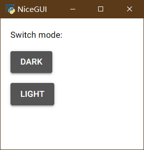


#### 2.3.7 事件和执行

##### 2.3.7.1 通用事件

大部分控件都有预定义事件监听，比如，ui.button的on_click点击事件监听，在传参或者调用方法时定义。除了这种已经定义的事件监听，每个控件还支持通过on方法创建任意事件监听，比如使用on方法创建点击事件监听，也可以创建鼠标进入、离开的事件监听。正如下面的代码所示：

```python3
from nicegui import ui

ui.button('A',on_click=lambda: ui.notify('You clicked the button A.'))
ui.button('B').on('click',lambda: ui.notify('You clicked the button B.'))
ui.button('C').on('mouseenter',lambda: ui.notify('You entered the button C.'))
ui.button('D').on('mouseleave',lambda: ui.notify('You left the button D.'))

ui.run(native=True)
```

##### 2.3.7.2 常用事件app.on\_\*

如果想要针对浏览器端的连接、关闭，服务器端的启动、关闭，添加事件监听，就要导入app模块。app.on_connect、app.on_disconnect可以监听浏览器端的连接、关闭；app.on_startup、app.on_shutdown可以监听服务器端的启动、关闭。代码如下：

```python3
from nicegui import ui,app

app.on_startup(lambda :print('started!'))
app.on_shutdown(lambda :print('shutdowning!'))
app.on_connect(lambda :print('connected!'))
app.on_disconnect(lambda :print('disconnected!'))

ui.run(native=True)
```

##### 2.3.7.3 定时器ui.timer

定时器可以根据给定的时间间隔，周期性执行指定函数。ui.timer有四个参数：浮点类型的时间间隔`interval`、可调用类型的执行操作`callback`、布尔类型的是否激活`active`、布尔类型的是否运行一次`once`。

代码如下：

```python3
from nicegui import ui

ui.timer(interval=6.0,callback=lambda :ui.notify('Timer.'),active=True,once=False)

ui.run(native=True)
```

##### 2.3.7.4 可刷新方法ui.refreshable

一般来说，每个控件都有`update`方法来更新控件显示，主要是针对某些不会触发UI刷新的修改。但是，`update`方法有一定局限性，只能刷新控件自身，如果控件下嵌套其他控件，该方法不能确保子控件一并刷新。因此，可刷新方法ui.refreshable就派上用场了。

以下面代码为例：

```python3
from nicegui import ui

a = ['A','A']

def row_ui():
    with ui.row() as row:
        for i in a:
            ui.label(i)
    return row

row = row_ui()

def clicked():
    a.append('A')
    row.update()

ui.button('A+1',on_click=clicked)

ui.run(native=True)
```

定义了一个字符串列表`a`，用于存储字符串。函数`row_ui`会根据a的内容创建相同数目的ui.label。然而，按钮`A+1`要执行的函数里，会执行一次给`a`追加一个'A'，也就是说，每点一次按钮，`a`里的'A'就会多一个。可是，即便函数`clicked`里已经添加了`row.update()`来刷新ui.row，每次点击按钮，屏幕上的ui.label并不会增加。

问题出在哪里？稍安勿躁，先修改一下代码，用`@ui.refreshable`装饰一下函数`row_ui`，然后将函数`clicked`里的`row.update()`换成`row_ui.refresh()`，再看看按钮点击的效果：

```python3
from nicegui import ui

a = ['A','A']

@ui.refreshable
def row_ui():
    with ui.row():
        for i in a:
            ui.label(i)
            
row_ui()

def clicked():
    a.append('A')
    row_ui.refresh()

ui.button('A+1',on_click=clicked)

ui.run(native=True)
```

这一次，结果总算正确了，点一次按钮，屏幕上的ui.label增加一个。

为什么？

可刷新方法ui.refreshable装饰的函数，会多一个`refresh`方法，调用这个方法会触发被装饰函数的重新执行，相当于这一部分的UI全部重新绘制，并不会像`update`方法一样只是触发刷新。触发刷新只能检测到与控件相关联的事件，示例代码里定义的列表a，没有使用绑定方法与控件关联，只有执行迭代的时候才有不同，因此ui.row的刷新并不能实现预期效果。

一般来说，为了快捷创建有规律的控件而使用迭代方法，需要根据数据变化刷新显示，都要用ui.refreshable来重新绘制。当然，没有控件数量变化的时候也有需要使用ui.refreshable来重新绘制的情况，读者在遇到时见机行事。毕竟重新绘制比触发刷新的性能开销大，非必要的情况，还是不要制造需要重新绘制的情况。

##### 2.3.7.5 运行JavaScript代码ui.run_javascript

NiceGUI既然是基于Web的UI，免不了与网页三剑客HTML、CSS、JavaScript打交道。前面提到过HTML的标签，也讲过了CSS的美化语法，JavaScript如何执行却没说过。现在，终于到了与JavaScript交互的时候。

ui.run_javascript可以运行任意JavaScript代码，方便在Python无法处理的时候，补充使用JavaScript的方法。当然，JavaScript毕竟是一门设计时就很仓促的语言，时至今日，哪怕ES标准正在解决JavaScript留下的烂摊子，也避免不了JavaScript糟糕的历史包袱。对于各位读者来说，非必要还是别执行JavaScript代码，但是这个执行的方法，不能不会。

```python3
from nicegui import ui

ui.button('js',on_click=lambda :ui.run_javascript(code='alert("Hello World from JavaScript!")',timeout=1))

ui.run(native=True)
```

字符串类型参数`code`就是要执行的JavaScript代码，浮点类型参数`timeout`是超时，有些JavaScript方法的执行时间比较长，可以修改这个参数来避免JavaScript执行触发超时而导致结果返回失败。

#### 2.3.8 网站页面（更新中）

ui.page和auto-index的区别

页面布局三大块，header、footer和左右drawer

page_title设置

navigate函数

ui.download

#### 2.3.9 部署与配置

ui.run端口、ip的配置，native mode的开启，reload的关闭

native mode初始参数设置，窗口大小，是否运行调整窗口大小，是否允许下载，是否启用调试工具，调整窗口大小、设置窗口标题的api等
