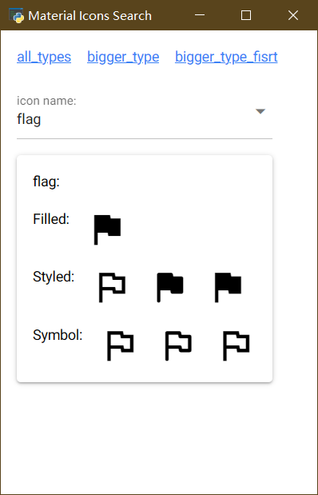
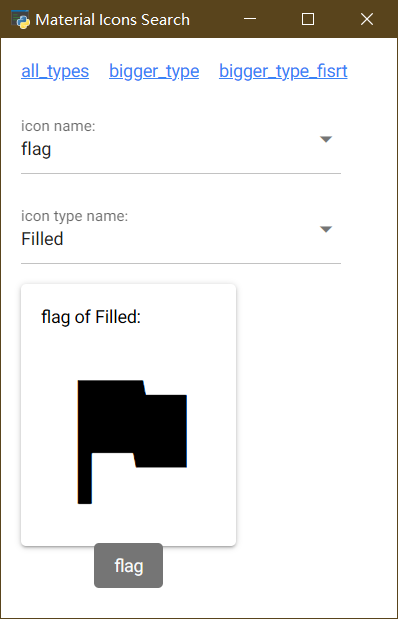
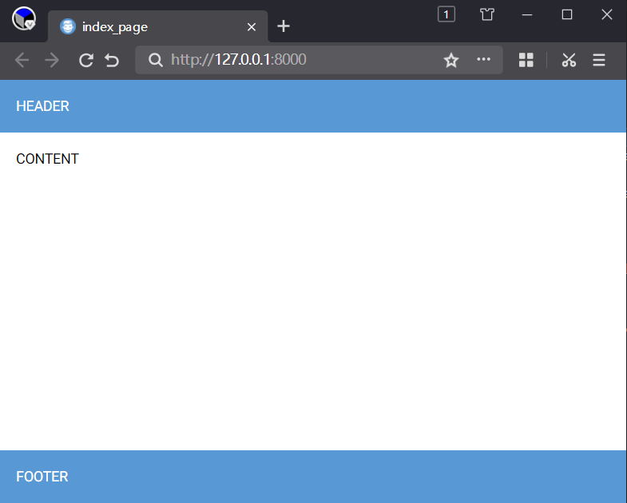

# nicegui的中文入门教程

[TOC]


## 0 前言

对于python语言的使用者来说，[nicegui](https://nicegui.io/)是一款优秀的WebUI、GUI框架，只需学习一定量的前端知识，就能使用nicegui快速搭建出美观的UI界面。但是，由于官方作者不提供系统性的入门、中文教程，很多中文初学者望而却步。于是，本教程应运而生。

本教程旨在用中文提供官方文档没有的系统性入门教程，并将部分社区讨论问题汉化、简化，方便中文学习者尽快上手并解决常见难题。虽然教程的名字叫入门教程，但本教程并没有停留在翻译官网文档的阶段，能够解决常见问题的高阶技巧也有。对于官方提供的各个控件的详细API，本教程并不会照本宣科，而是在提供思路之后，由读者自行查阅。正所谓“授人以鱼不如授人以渔”，掌握方法比掌握结果更有效。

->[教程全文详见仓库](https://github.com/python-and-fiction/chinese_guide_of_nicegui_for_beginner)

## 1 环境准备

本章主要介绍运行和开发nicegui程序的环境准备，包括虚拟环境的建立、开发工具的选择、如何自托管文档。

### 1.1 运行环境

为了保证最佳开发体验，所有的环境准备优先使用Windows系统，使用Linux、Mac的话，请自己根据系统变通。

首先，需要准备python解释器和pip。其中，Python解释器是运行后续代码、工具的基础，只需到官网安装最新稳定版（当前为3.12.*）即可；pip是Python官方的包管理工具，安装解释器时务必勾选此选项，如果没有勾选或者想要后续单独安装pip，可以到[pypi](https://pypi.org/)官方查看安装方法，这里不在赘述。

环境管理工具有pdm和poetry，使用以下命令全部安装：

```shell
pip install pdm poetry
```

环境管理工具是快捷管理python运行环境的工具，可以创建出独立的python运行环境，各个运行环境内安装的软件包不会干扰其他环境，也不会影响到默认的python环境。

pdm是一款国人创建的环境管理工具，语法简单，操作方便，因此教程采用此工具。

poetry也是一款环境管理工具，是nicegui官方仓库采用的，可以基于官方源代码自己编译安装包，也用于后续自托管文档，因此需要安装。

但是，poetry的检查依赖速度比pdm慢太多，故这里采用pdm作为学习工具，如果读者有能力，可以只使用poetry。

#### 1.1.1 基础环境初始化

先在纯英文、无空格、无特殊字符的路径下创建纯英文、无空格、无特殊字符的空白文件夹，进入该文件夹后，右键，在此处打开终端或者命令行，运行以下命令：

```shell
pdm init
```

会看到以下输出：

```shell
PS E:\PSF\git\chinese_guide_of_nicegui_for_beginner> pdm init
Creating a pyproject.toml for PDM...
Please enter the Python interpreter to use
 0. cpython@3.12 (D:\Programs\Python\Python312\python.EXE)
 1. cpython@3.11 (D:\mingw64\bin\python3.11.exe)
 2. cpython@3.11 (D:\mingw64\bin\python3.exe)
 3. cpython@3.11 (D:\mingw64\bin\python.exe)
 4. cpython@3.11 (C:\Users\peter\AppData\Local\pdm\pdm\python\cpython@3.11.5\python.exe)
Please select (0): 0
Virtualenv is created successfully at E:\PSF\git\chinese_guide_of_nicegui_for_beginner\.venv
Project name (chinese_guide_of_nicegui_for_beginner):
Project version (0.1.0):
Do you want to build this project for distribution(such as wheel)?
If yes, it will be installed by default when running `pdm install`. [y/n] (n):
License(SPDX name) (MIT):
Author name (): Peter
Author email (): peter@linux
Python requires('*' to allow any) (==3.12.*):
Project is initialized successfully
PS E:\PSF\git\chinese_guide_of_nicegui_for_beginner>
```

过程为交互式，需要自己输入之后回车才能继续，不输入直接回车则采用默认。

`Please select (0):`为选择python版本，pdm会自动识别当前电脑安装的所有python解释器，部分工具（如gcc）也会自带python解释器，需要正确选择自己安装的、可以直接运行pip命令的python解释器，这一步根据实际情况选择，一般默认第一个，可以直接回车。

`Project name (chinese_guide_of_nicegui_for_beginner):`为设置项目名称，通常为当前文件夹名字，可以自己输入来修改。这个不会修改当前文件夹名字，只会影响项目描述文件中的项目名称和后续创建的源代码文件夹名称。这里可以直接回车。

`Project version (0.1.0):`为设置当前项目的版本号，该版本号符合语义化规则，不懂或者不想了解的可以直接回车。

`If yes, it will be installed by default when running pdm install. [y/n] (n):`这一步是问你要不要将项目构建成分发包（可以用pip安装的），如果选择`y`，使用`pdm install`就会默认安装项目。这里选择不创建分发包，所以直接回车。

`License(SPDX name) (MIT):`、`Author name (): `、`Author email ():`分别是许可协议、作者名字、作者邮箱地址，了解、知道的可以修改，不清楚或者不想写的可以直接回车。

`Python requires('*' to allow any) (==3.12.*):`为python的版本要求，如果后续要用低版本或者高版本python运行，这里需要修改，否则此项目会限制python的版本。这个后续可以自己了解，这里直接回车即可。

至此，基础环境已经准备完毕，可以得到以下目录结构：

```shell
chinese_guide_of_nicegui_for_beginner
├─.venv
│  ├─Lib
│  │  └─site-packages
│  └─Scripts
├─src
│  └─chinese_guide_of_nicegui_for_beginner
└─tests
```

`./src/chinese_guide_of_nicegui_for_beginner/`下存放项目的源代码，后续的代码操作（创建修改）均在此目录。此外，项目根目录下有`pyproject.toml`（项目描述文件）和`README.md`（自述文件），本教程不涉及手动修改。

#### 1.1.2 nicegui运行环境

基础环境初始化完毕之后，项目还不能直接运行基于nicegui框架的代码，因为基础环境还没有安装nicegui。因此，需要在项目根目录下使用以下命令安装：

```shell
pdm add nicegui
```

如果运行环境是全局环境或者想用pip安装，可以执行下面的命令安装：

```shell
pip install nicegui
```

安装过程取决于网速，耐心等待。

如果后续项目中需要使用其他库，可以使用`pdm add 库对应的pip安装命令中的名字`来添加到项目环境中。

对于调试使用nicegui的程序，通常在native mode下比较方便，因此，建议安装`pywebview`来增加native mode的支持，命令是：

```shell
pdm add pywebview
```

如果运行环境是全局环境或者想用pip安装，可以执行下面的命令安装：

```shell
pip install nicegui[native]
#或者下面这条
pip install pywebview
```

对于没有安装过Microsoft Edge WebView2或者版本较旧的Windows系统，建议访问 [ Microsoft Edge WebView2下载 ](https://developer.microsoft.com/zh-cn/microsoft-edge/webview2 ) 安装最新版本。

### 1.2 开发工具

[VSCode](https://code.visualstudio.com/)或者[PyCharm](https://www.jetbrains.com/pycharm/download/)，其中VSCode比PyCharm轻量，但需要手动安装python插件，而PyCharm自带插件，操作简单。这里推荐使用VSCode，比较流畅，如果是使用PyCharm，后续操作根据VSCode对应即可。

对于VSCode，建议安装以下插件：

```
ms-python.python
ms-python.autopep8
ms-python.black-formatter
```

### 1.3 自托管文档【可选】

因为官网文档是可交互的，只有连接到官网才能操作。但是，部分地区的访问官网存在网络不佳的情况，如果需要自托管官网文档，可以遵循以下步骤。

首先要安装git，具体可以看[Git - 安装 Git](https://git-scm.com/book/zh/v2/%E8%B5%B7%E6%AD%A5-%E5%AE%89%E8%A3%85-Git)。

安装完成后，额外找一个空白文件夹，打开终端，执行以下命令：

```shell
git clone https://github.com/zauberzeug/nicegui.git
```

没有git，可以打开以下链接：

```shell
https://github.com/zauberzeug/nicegui/archive/refs/heads/main.zip
```

下载压缩包之后解压，结果一样。对于GItHub难以访问的问题，可以自行搜索GitHub加速的方法。

使用以下命令进入nicegui的源代码文件夹，并执行安装操作：

```shell
cd nicegui
poetry install
```

等安装完成之后（poetry的install时间会比较长），执行以下命令，会开启一个服务器托管官网文档，并自动调用浏览器打开自托管的官网：

```shell
poetry run python .\main.py
```

_注意：如果不使用poetry创建的虚拟环境运行，而是使用全局python运行的话，首先要安装nicegui库，然后根据提示安装缺失的库（自托管文件需要的部分依赖不会随nicegui自动安装），并且在源码根目录执行`python main.py`_。

关掉终端就可以关闭服务器，下次运行这条命令就可以直接开启自托管的官网文档，无需再次安装。

如果官方有源代码更新，后续将源代码解压覆盖之后，执行一次安装操作即可更新。

## 2 入门基础

本章主要介绍nicegui的基础知识，系统性了解nicegui的基本结构，在自学nicegui、查阅官网文档时有方向。

### 2.1 认识nicegui

nicegui 是一个开源的python库，可以搭建运行在浏览器的图形界面，也就是WebUI，也可以理解为和网站一样。nicegui的学习过程并不难，但不意味着你可以零基础入门。对于开发nicegui的开发者而言，python的基础是必须的；如果掌握python不常用语法和用法更好，后续在使用nicegui的过程中，可以很方便理解一些为了达成效果而使用的骚操作。尽管大部分python的学习者是零基础入门，除了转全栈、爬虫的开发者，后续学习过程中很少接触前端（HTML、CSS、JavaScript），但还是在使用nicegui之前，要有学习前端的心理准备。nicegui为了方便python工程师快速搭建图形界面，专注于python代码本身，做了不少前端细节的隐藏。不过，默认的样式不一定符合预期效果，为了达成效果，还是需要了解一些前端知识，才能让界面完全符合心意。

nicegui的底层使用了fastapi作为运行服务器，Quasar作为前端框架，支持tailwindcss的CSS语法，因为Quasar的内部使用VUE搭建，nicegui也不可避免地用到了VUE的语法。因此，对于想要用好nicegui的开发者，在后续使用nicegui的过程中，需要对上述提到的项目有一定了解。想要对后端部分定制、修改的，需要了解fastapi以及其基于的其他组件；想要让界面美化、随心的，需要掌握Quasar、tailwindcss基础；对于有能力和需求完全定制界面的，则需要掌握VUE基础。

相关链接：

nicegui官方文档：https://nicegui.io/documentation

fastapi官方文档：https://fastapi.tiangolo.com/zh/

Quasar官方文档：https://quasar.dev/docs

tailwindcss官方文档：https://tailwindcss.com/

VUE官方文档：https://cn.vuejs.org/guide/introduction

#### 2.1.1 nicegui的`Hello World!`

如果你能看到这里，证明你有学好nicegui的基础和能力，并不畏惧上一节提到的那么多基础知识。那么，就用一段简单的`Hello World!`代码开启nicegui的入门之旅。

使用VSCode在项目文件夹下的`src\chinese_guide_of_nicegui_for_beginner`内，新建以`py`为后缀的python代码文件，复制以下代码到代码文件中，保存。

```python3
from nicegui import ui

ui.button('Say Hi',on_click=lambda :ui.notify('Hello World!'))

ui.run(native=True)
```

注意vscode的右下角，务必确保使用的是`venv`下的python解释器，如果不是，点击右下角`3.12.4{'.venv'}`对应位置，选择输入解释器路径-查找，选择`.venv\Scripts\`下的`python.exe`。


点击VSCode右上角的运行按钮（三角形），就可以看到一个窗口弹出，点击`SAY HI`按钮，就能看到窗口底部弹出的`Hello World!`。


从`Hello World!`示例可以看到，基于nicegui的python程序寥寥三行代码，除去导入语句和必不可少的`ui.run`，主体只有一行代码，就能实现一个完整的交互过程，足见nicegui的强大、简洁。后续教程中很多例子都可以做到几行代码实现不错的效果，这也是nicegui大受欢迎的原因。

### 2.2 nicegui的基本结构

#### 2.2.1 图形界面的基础概念

在正式学习nicegui之前，需要先对图形界面有个基础的理解。

一般来说，搭建图形界面理解三个概念：控件、布局、交互。

##### 2.2.1.1 控件

控件是搭建图形界面的基本元素，就像是盖房子用的砖、门、窗等最小搭建单位。控件通常是图形界面框架提供、直接可用的。如果使用过程中发现基本元素不够，可以结合布局功能，用基本元素组合出新的控件。

##### 2.2.1.2 布局

布局是排布控件的方式，就像是房屋的基本框架。用砖可以铺地，也可以垒墙，对于砖而言，墙或是地，就是布局。控件是横向排列还是竖向排列，是像网格一样一一对应，还是大控件套着小控件，都是由布局控制。大部分图形程序框架提供的布局类似，除了基本的几种布局之外，部分图形程序框架还提供额外的组合布局。

##### 2.2.1.3 交互

交互是图形界面的重中之重，也是一个程序最难的部分。论难度的话，前面的控件和布局的学习只是对照文档，按图索骥，交互则需要身经百战，不断积累经验。

事件机制是目前大部分图形界面采用的交互反馈机制，也就是基于特定的事件触发，执行对应的函数。微软的winform中采用的消息机制，Qt的信号与槽，现代网页开发中的event事件监听，都可以理解为事件机制，只是对于winform和Qt而言，他们框架内的事件分别叫做消息和信号而已。

除了事件机制，美化也是交互的一部分。大部分现代图形界面框架。如Qt、WPF以及一系列基于网页开发的图形界面框架，支持CSS或者类似语法的美化功能，让图形界面变得更加美观，也让控件的动画效果更加丰富，这个极大提升了用户的使用体验。

此外，基于图形界面框架的特性，后端的处理逻辑以及数据的传递也是交互的一部分。在函数内，对于控件的控制，如何做到符合要求，毕竟有的框架、编程语言不支持没有定义或者声明函数就调用，而有的语言不支持声明函数。如果需要让控件显示的文本与另一个控件的文本一致，如何处理数据同步过程也需要技巧。

#### 2.2.2 nicegui与基础概念的对应

对图形界面有基础的理解之后，下面就可以根据nicegui与基础概念的对应，进一步理解nicegui的设计理念。

在`Hello World!`示例中，使用了导入语句`from nicegui import ui`导入了`ui`，顾名思义，ui就是用户界面，这也是nicegui调用控件的模块，也可以调用布局。具体的控件和布局用法可以参考下一节[nicegui中不得不学的功能](#2.3 nicegui中不得不学的功能)，下一节将选取一些nicegui中常用、不好理解的功能重点讲解。

因为nicegui是基于Quasar这个Web框架做的python调用绑定，因此，nicegui的交互部分，很大程度与Web结合。在Web设计中，基于CSS实现的美化效果，基于JavaScript的event做的事件响应，都能在nicegui中看到。所以，如果用好nicegui，对Web三件套HTML、CSS、JavaScript的学习不可避免。此外，因为nicegui与Quasar这个Web框架的深度集成的关系，Quasar中的属性、slot、事件也需要掌握，才能让交互设计更加得心应手。

关于美化，下一节中的[外观美化](#2.3.7 外观美化)将会详细介绍，也可以查阅对应的官方文档。事件的学习，可以参阅下一节的[事件和执行](#2.3.8 事件和执行)，也可以查阅对应的官方文档。

### 2.3 nicegui中不得不学的功能

以下是官网文档对于nicegui提供的功能做了大致的划分，本教程将会对每个部分中不好掌握、需要重点学习的控件、功能进行剖析：

1.   文本控件：https://nicegui.io/documentation/section_text_elements

2.   常用控件：https://nicegui.io/documentation/section_controls

3.   多媒体控件：https://nicegui.io/documentation/section_audiovisual_elements

4.   数据控件：https://nicegui.io/documentation/section_data_elements

5.   属性绑定：https://nicegui.io/documentation/section_binding_properties

6.   图形布局：https://nicegui.io/documentation/section_page_layout

7.   外观美化：https://nicegui.io/documentation/section_styling_appearance

8.   事件和执行：https://nicegui.io/documentation/section_action_events

9.   网站页面：https://nicegui.io/documentation/section_pages_routing

10.   部署与配置：https://nicegui.io/documentation/section_configuration_deployment


这部分对于官方内容的解析并不会完全覆盖，主要讲经常用到的参数、属性、方法，对于某些隐藏参数和不常用的属性方法，会在后面用到的时候详细介绍，这里最多提一嘴。

#### 2.3.1 文本控件

文本类控件主要是一些静态展示可复制文本的控件，是构成网页显示效果的主要控件。

##### 2.3.1.1 ui.label

文本标签，用法很简单，通过传入一个字符串类型的参数`text`，让网页显示字符串内的文字。注意，虽然参数支持多行文字，但是输出只能一行，需要原样输出多行文字的话，可以使用下面介绍的`ui.html`，将`tag`设置为`pre`。

```python3
from nicegui import ui

ui.label(text='some label')

ui.run(native=True)
```

##### 2.3.1.2 ui.link

超链接，一种点击之后跳转到指定地址的文本元素。可以传入`text`、`target`、`new_tab`三个参数。代码如下：

```python3
from nicegui import ui

ui.link(text='NiceGUI on GitHub', target= 'https://github.com/zauberzeug/nicegui', new_tab=False)

ui.run(native=True)
```

`text`参数，字符串类型，表示超链接显示什么文字。

`target`参数，字符串类型、`page function`、`ui.element`类型，表示超链接跳转到什么位置，这里只介绍字符串类型用法，其他类型可以自行探索或者后续需要用到的时候补充。字符串类型参数表示超链接跳转的url地址，可以使用协议开头的完整地址，也可以使用省略主机的绝对路径、相对路径。

`new_tab`参数，布尔类型，默认为`False`，表示要不要在新建标签页中打开超链接。

##### 2.3.1.3 ui.element

通用元素，也是nicegui大部分界面控件的基类。很多控件都是通过继承这个类来调用自定义标签、JavaScript代码实现。通过继承实现自定义控件、修改默认风格属于高级用法，这里只说基本用法。

`tag`参数，字符串类型，默认为`div`，表示生成的元素用什么标签，实际使用时可以根据需要修改为其他HTML标签或者Quasar标签。代码如下：

```python3
from nicegui import ui

with ui.element('div').classes('p-2 bg-blue-100'):
    ui.label('inside a colored div')
    
ui.run(native=True)
```

`move`方法，将控件移动到指定控件之内，默认为`default`slot，也可以传递`target_slot`参数，指定slot。代码如下：

```python3
from nicegui import ui

with ui.card() as card:
    name = ui.input('Name', value='Paul')
    name.add_slot('append')
    icon = ui.icon('face')

ui.button('Move into input default slot', on_click=lambda: icon.move(name))
ui.button('Move into input append slot', on_click=lambda: icon.move(name, target_slot='append'))
ui.button('Move out of input', on_click=lambda: icon.move(card))

ui.run(native=True)
```


##### 2.3.1.4 ui.markdown和ui.html

与`ui.label`类似，`ui.markdown`和`ui.html`，都可以用来展示文本，只是后两者支持markdown语法和HTML语法，因为markdown语法支持一部分HTML的标签，可以看到放在`ui.markdown`里的HTML标签也能被解析。以下是三种控件解析同一内容的代码：

```python3
from nicegui import ui

content = '''
This is **Markdown**.
This is <u>emphasized</u>
'''
ui.label(content)
ui.markdown(content)
ui.html(content)

ui.run(native=True)
```

此外，`ui.html`还支持传入字符串类型参数`tag`给基类`ui.element`，用于修改生成`ui.html`用的标签，比如：

```python3
from nicegui import ui

ui.html('This is <u>emphasized</u>.', tag='em')

ui.run(native=True)
```

#### 2.3.2 常用控件

常用控件主要是一些支持点击、输入、拖动等交互功能的控件。

##### 2.3.2.1 ui.button

按钮作是网页交互设计中最常见的基本元素，在移动互联网没有普及之前，使用鼠标点击为主要交互方式的时代，除了用于跳转网页的超链接，按钮就是网页中用的最多的可交互元素。在nicegui中，按钮控件可以传入位置参数`text`，关键字参数`on_click`、`color`和`icon`。

以下代码就是一个定义了基本交互的按钮，点击会弹出一个通知提示：

```python3
from nicegui import ui

ui.button('Click me!', color='green', icon='thumb_up', on_click=lambda: ui.notify('You clicked me!'))

ui.run(native=True)
```

`text`参数，字符串类型，表示显示在按钮上的文字，如果是英文的话，默认全部大写。该参数默认只支持字符串类型，但是整数和小数可以直接使用，其他类型需要先转换为字符串类型才能传入。

`color`参数，字符串类型或者None，表示按钮的颜色，支持传入字符串类型的颜色类（Quasar、 Tailwind、CSS的颜色名）或者`None`（即让按钮变成默认颜色），默认为'primary'，即和主题颜色一致。

`icon`参数，字符串类型，表示按钮额外显示的图标，支持传入字符串类型的图标名，具体名字会在`ui.icon`中介绍，这里不做详细介绍。

`on_click`参数，可调用类型，表示点击按钮调用的函数，可以使用`lambda`表达式，也可以使用函数名。

如果觉得对按钮传入参数来自定义按钮内容的方法太死板，也可以使用以下语法，使用`with`来进入按钮的`default slot`，随意组合按钮内的内容：

```python3
from nicegui import ui

with ui.button(color='green', on_click=lambda: ui.notify('You clicked me!')):
    ui.icon('thumb_up')
    ui.label('Click me!')

ui.run(native=True)
```


对于`on_click`参数、后续会涉及到的on开头的`on_*`参数、on开头的`on_*`方法和`on`方法里的callback或者handler参数，均为可调用类型参数，既可以在创建控件时定义lambda表达式，也可以提前定义。对于复杂一点逻辑操作，应该定义函数而不是lambda表达式，比如：

```python3
from nicegui import ui

test = lambda :...
#如果要执行的操作比较多、复杂，应该定义函数
def test():
    pass
#在控件中传参可以直接使用test
ui.button('Click me!',on_click=test)

ui.run(native=True)
```

对于button等控件而言，除了支持通过传参创建响应动作，还支持调用对应的`on_*`方法（比如on_click）创建，这个方法极大提高了响应动作的灵活性，上面的例子就可以借助这个方法调整函数定义与按钮创建的先后顺序，代码如下：

```python3
from nicegui import ui

button = ui.button('Click me!')
def test():
    pass
button.on_click(test)

ui.run(native=True)
```

##### 2.3.2.2 ui.input

输入框，大概是网页中仅次于按钮和超链接，用得最多的控件。HTML中输入框的变体很多，在nicegui中，输入框的参数也很多，基于输入框扩展的控件也多，使用输入框的逻辑设计、注意事项一样很多。不过，在这一节，针对输入框的学习并不会那么深入，只要能掌握常用的参数和基础的方法，那些疑难点会放到进阶和需要的时候细讲，以免一时不好理解而记混。

以下代码定义了一个名字输入框和密码输入框，并在输入名字的时候，自动弹出通知显示名字和密码：

```python3
from nicegui import ui

name = ui.input(label='Name:', value='Peter', on_change=lambda :ui.notify(f'{name.value=},{password.value=}'))
password = ui.input(label='Password:', value='123456', password=True, password_toggle_button=True)

ui.run(native=True)
```


`label`参数，字符串类型，直译的话是标签，表示显示在输入框上方的文本，但不是输入的文本，如果输入的内容是空的，点击输入的之前会显示在输入框内，点击之后会移动到输入框上方。

`value`参数，字符串类型，表示输入框内的内容，也就是输入框的值。对于后续介绍的以及其他支持交互输入的控件，都会有这么一个参数、属性、相关方法，来设置控件的值，这一点上，nicegui的设计倒是很统一。

`on_change`参数，可调用类型，表示输入框的值变化时执行的函数。

`password`参数，布尔类型，表示输入框是否设置为密码输入框，如果设置为`True`，输入的内容将不显示明文，转而显示统一的密码符号。

`password_toggle_button`参数，布尔类型，表示输入框内是否显示密码按钮，密码按钮可以切换输入框内的密码、明文状态。

以下参数用得比较少或者有一定使用难度，学有余力的读者可以继续学习：

`placeholder`参数，字符串类型，表示输入框的占位符，即输入框没有输入之前，显示什么内容。与标签不太一样的是，占位符是输入框获得焦点时候显示的，标签是输入框没有获得焦点时候显示的。

`autocomplete`参数，字符串列表类型，表示在输入框输入内容时候，搜索这个字符串列表，来自动提示、补全要输入的内容，按Tab键可以补全内容。

`validation`参数，可调用类型、字典类型或者`None`，表示验证输入的内容是否有效。如果传入可调用类型参数，该参数返回错误信息表示内容无效，返回`None`表示内容有效。如果传入字典类型参数，则字典的键（key）表示错误信息，字典的值（value）返回`True`表示内容有效，返回`False`则表示内容有效并输出错误信息。默认值为`None`，表示不验证输入的内容。

##### 2.3.2.3 ui.slider和ui.knob

ui.slider是滑动条，这个比较简单，参数也不多，按理说不用专门讲一下，自学即可。至于ui.knob——旋钮，这个的样式参数比较多，也有很大的自定义自由度，值得一讲。不过，这些都不是这里要专门放在一起介绍的原因，具体原因是什么，这里先卖个关子，后面再做解释。

先看一段代码：

```python3
from nicegui import ui

slider = ui.slider(min=0, max=100, step=1, value=50)
ui.knob(min=0, max=100, step=1, value=50,
        color='orange', center_color='blue', track_color='black',
        size='3.5em',
        show_value=True
        ).bind_value(slider, 'value')

ui.run(native=True)
```


可以看到，ui.knob的前四个参数和ui.slider的一样，都是浮点类型，分别代表最小值、最大值、每次调整的最小步长、当前值。

在ui.knob中，有`color`、`center_color`、 `track_color`三种可以传参修改的颜色，分别代表旋钮边缘的颜色、旋钮中间的颜色、旋钮边缘没有覆盖之前的颜色，支持传入字符串类型的颜色类（Quasar、 Tailwind、CSS的颜色名）、`None`（即让按钮变成默认颜色）或者`"primary"`（跟随主题颜色）。

`size`是旋钮的整体大小，字符串类型，采用CSS语法的大小表示方式。

`show_value`参数，布尔类型，是否在旋钮中间显示当前值。

#### 2.3.3 多媒体控件

##### 2.3.3.1 ui.image和ui.interactive_image

点开一个网页，最抓人眼球的是什么内容？没错，是图片。既然用nicegui设计网页，没有图片元素怎么行？在nicegui中，有两种显示图片的控件：ui.image和ui.interactive_image。前者可以简单理解为显示图片的简单标签，后者是基于前者扩展了很多交互功能的plus版本。两者的第一个参数都是`source`，支持字符串类型的本地图像路径、网络图像路径，或者base64编码的图像本身，这个没什么难点，这里不做细讲，接下来要重点讲的是ui.interactive_image的其他参数的用法，因为这个控件有时候比看似简单的ui.image更加好用趁手。

先看一段代码：

```python3
from nicegui import ui

src = 'https://picsum.photos/id/377/640/360'
img = ui.image(src)
img2 = ui.interactive_image(src)

ui.run(native=True)
```


可以看到，同样的图片地址，都是不传入其他参数的情况下，即使可用空间大于图片大小，ui.interactive_image也不会随着页面大小而缩放图片，始终保持图片的原始大小，这个有别于ui.image的特性，可以在日后想要保持图片真实大小时使用。

除了`source`参数外，ui.interactive_image还有以下参数：

`content`参数，字符串类型，表示覆盖在图片之上的SVG内容，SVG的画布大小就是图片的大小。当然，不太理解SVG的话也没关系，后面用到会详细介绍，也可以专门找一下资料。这里可以简单理解SVG为一种用定义描述的几何图形，这种图形不会因为缩放变成马赛克，因为它是基于定义绘制的。

`size`参数，元组类型（宽度，高度），表示如果`source`没有设置的话，这就是默认图形的尺寸。这个对于绘制上面的SVG内容来说比较重要，因为这个尺寸就是画布的大小。对于想要交互创建SVG内容的操作，指定画布大小很重要。

`on_mouse`参数，可调用类型，表示触发鼠标事件之后要执行的操作，默认包含一个鼠标事件的参数，参数字典内的image_x和image_y的值是以像素为单位表示的鼠标交互位置。

`events`参数，字符串列表，表示JavaScript订阅的事件，默认订阅点击事件，即`['click']`，也可以自己指定要订阅的事件内容。

`cross`参数，字符串类型或者布尔类型，表示要不要显示十字线来指示鼠标位置，默认为`False`。如果为`True`或者表示颜色的字符串，就会显示指定颜色（即字符串表示的颜色）的十字线。

`force_reload`方法，强制重新载入图片，这个方法两者图片控件都有，对于某些时候网络不好造成图片加载失败、支持随机刷新图片的接口，这个方法还是很实用的。

对于图片控件，一样可以使用`with`嵌入其他内容。比如，下面的代码就嵌入了一个按钮，实现了点击图片和按钮有不同的通知内容：

```python3
from nicegui import ui

src = 'https://picsum.photos/id/377/640/360'
with ui.interactive_image(src,on_mouse=lambda :ui.notify('You clicked interactive_image.')):
    ui.button(on_click=lambda: ui.notify('You clicked button.'), icon='thumb_up')\
        .props('flat color=white').classes('absolute bottom-0 left-0 m-2')

ui.run(native=True)
```


##### 2.3.3.2 ui.icon和ui.avatar

在[ui.button](#2.3.2.1 ui.button)中挖了一个有关ui.icon的坑，现在，终于到了填坑的时候。先看一个简单的示例，了解一下ui.icon控件的用法：

```python3
from nicegui import ui

ui.icon(name='home', color='blue', size='xl')
ui.icon(name='o_home', color='blue', size='xl')
ui.icon(name='r_home', color='blue', size='xl')
ui.icon(name='sym_o_home', color='blue', size='xl')
ui.icon(name='sym_r_home', color='blue', size='xl')

ui.run(native=True)
```


ui.icon的参数不多，就三个：

`name`参数，字符串类型，表示图标字体中的图标名，ui.icon通过给定的图标名，从字体中加载图标，默认支持Material Icons图标字体。也可以自己添加其他图标字体，并结合对应图标字体的用法加载。这一部分需要根据具体情况灵活变通，这里不做详解。

`color`参数，字符串类型，表示图标的颜色。

`size`参数，字符串类型，表示图标的大小。

理解参数不难，但是，给出的示例代码并没有看上去那么简单。这个时候，聪明的读者已经发现了猫腻：几个图标看上去很像，但不完全一样。再仔细看的话就会发现，它们的后缀都是一样的，只有前缀不同。没错，这组图标本质上都是一个，只是名字的前缀有特定的风格含义，需要特别注意一下。

无前缀代表实心填充风格，"o\_" 前缀表示轮廓线风格，"r\_" 前缀表示圆角风格，"s\_"前缀表示锐化风格，"sym\_o\_"前缀表示轮廓线符号，"sym\_r\_"前缀表示圆角符号，"sym\_s\_" 前缀表示锐化符号。

这个时候，有的读者就要头疼了，前缀就这么几个，还好记，可图标那么多，每个图标名字怎么记得住，有没有方便查询的网站？有，不过国内没法直接访问，那就是官网：

 Material Icons查询网站（非中国大陆地区）：https://fonts.google.com/icons?icon.set=Material+Icons

当然，国内也有很多渠道查询，为了避免广告嫌疑，这里就不具体指明了。

不过，只是提供一个404网站，教程就失去了意义，这里还有一个备用方法，那就是小工具：

 Material Icons查询器：

```python3
from nicegui import ui

icon_name_dict = {
    '10k': ['', 'o_', 'r_', 's_', 'sym_o_', 'sym_r_', 'sym_s_'], '10mp': ['', 'o_', 'r_', 's_', 'sym_o_', 'sym_r_', 'sym_s_'], '11mp': ['', 'o_', 'r_', 's_', 'sym_o_', 'sym_r_', 'sym_s_'], '123': ['', 'o_', 'r_', 's_', 'sym_o_', 'sym_r_', 'sym_s_'], '12mp': ['', 'o_', 'r_', 's_', 'sym_o_', 'sym_r_', 'sym_s_'], '13mp': ['', 'o_', 'r_', 's_', 'sym_o_', 'sym_r_', 'sym_s_'], '14mp': ['', 'o_', 'r_', 's_', 'sym_o_', 'sym_r_', 'sym_s_'], '15mp': ['', 'o_', 'r_', 's_', 'sym_o_', 'sym_r_', 'sym_s_'], '16mp': ['', 'o_', 'r_', 's_', 'sym_o_', 'sym_r_', 'sym_s_'], '17mp': ['', 'o_', 'r_', 's_', 'sym_o_', 'sym_r_', 'sym_s_'], '18_up_rating': ['', 'o_', 'r_', 's_', 'sym_o_', 'sym_r_', 'sym_s_'], '18mp': ['', 'o_', 'r_', 's_', 'sym_o_', 'sym_r_', 'sym_s_'], '19mp': ['', 'o_', 'r_', 's_', 'sym_o_', 'sym_r_', 'sym_s_'], '1k': ['', 'o_', 'r_', 's_', 'sym_o_', 'sym_r_', 'sym_s_'], '1k_plus': ['', 'o_', 'r_', 's_', 'sym_o_', 'sym_r_', 'sym_s_'], '1x_mobiledata': ['', 'o_', 'r_', 's_', 'sym_o_', 'sym_r_', 'sym_s_'], '20mp': ['', 'o_', 'r_', 's_', 'sym_o_', 'sym_r_', 'sym_s_'], '21mp': ['', 'o_', 'r_', 's_', 'sym_o_', 'sym_r_', 'sym_s_'], '22mp': ['', 'o_', 'r_', 's_', 'sym_o_', 'sym_r_', 'sym_s_'], '23mp': ['', 'o_', 'r_', 's_', 'sym_o_', 'sym_r_', 'sym_s_'], '24mp': ['', 'o_', 'r_', 's_', 'sym_o_', 'sym_r_', 'sym_s_'], '2k': ['', 'o_', 'r_', 's_', 'sym_o_', 'sym_r_', 'sym_s_'], '2k_plus': ['', 'o_', 'r_', 's_', 'sym_o_', 'sym_r_', 'sym_s_'], '2mp': ['', 'o_', 'r_', 's_', 'sym_o_', 'sym_r_', 'sym_s_'], '30fps': ['', 'o_', 'r_', 's_', 'sym_o_', 'sym_r_', 'sym_s_'], '30fps_select': ['', 'o_', 'r_', 's_', 'sym_o_', 'sym_r_', 'sym_s_'], '360': ['', 'o_', 'r_', 's_', 'sym_o_', 'sym_r_', 'sym_s_'], '3d_rotation': ['', 'o_', 'r_', 's_', 'sym_o_', 'sym_r_', 'sym_s_'], '3g_mobiledata': ['', 'o_', 'r_', 's_', 'sym_o_', 'sym_r_', 'sym_s_'], '3k': ['', 'o_', 'r_', 's_', 'sym_o_', 'sym_r_', 'sym_s_'], '3k_plus': ['', 'o_', 'r_', 's_', 'sym_o_', 'sym_r_', 'sym_s_'], '3mp': ['', 'o_', 'r_', 's_', 'sym_o_', 'sym_r_', 'sym_s_'], '3p': ['', 'o_', 'r_', 's_', 'sym_o_', 'sym_r_', 'sym_s_'], '4g_mobiledata': ['', 'o_', 'r_', 's_', 'sym_o_', 'sym_r_', 'sym_s_'], '4g_plus_mobiledata': ['', 'o_', 'r_', 's_', 'sym_o_', 'sym_r_', 'sym_s_'], '4k': ['', 'o_', 'r_', 's_', 'sym_o_', 'sym_r_', 'sym_s_'], '4k_plus': ['', 'o_', 'r_', 's_', 'sym_o_', 'sym_r_', 'sym_s_'], '4mp': ['', 'o_', 'r_', 's_', 'sym_o_', 'sym_r_', 'sym_s_'], '5g': ['', 'o_', 'r_', 's_', 'sym_o_', 'sym_r_', 'sym_s_'], '5k': ['', 'o_', 'r_', 's_', 'sym_o_', 'sym_r_', 'sym_s_'], '5k_plus': ['', 'o_', 'r_', 's_', 'sym_o_', 'sym_r_', 'sym_s_'], '5mp': ['', 'o_', 'r_', 's_', 'sym_o_', 'sym_r_', 'sym_s_'], '60fps': ['', 'o_', 'r_', 's_', 'sym_o_', 'sym_r_', 'sym_s_'], '60fps_select': ['', 'o_', 'r_', 's_', 'sym_o_', 'sym_r_', 'sym_s_'], '6_ft_apart': ['', 'o_', 'r_', 's_', 'sym_o_', 'sym_r_', 'sym_s_'], '6k': ['', 'o_', 'r_', 's_', 'sym_o_', 'sym_r_', 'sym_s_'], '6k_plus': ['', 'o_', 'r_', 's_', 'sym_o_', 'sym_r_', 'sym_s_'], '6mp': ['', 'o_', 'r_', 's_', 'sym_o_', 'sym_r_', 'sym_s_'], '7k': ['', 'o_', 'r_', 's_', 'sym_o_', 'sym_r_', 'sym_s_'], '7k_plus': ['', 'o_', 'r_', 's_', 'sym_o_', 'sym_r_', 'sym_s_'], '7mp': ['', 'o_', 'r_', 's_', 'sym_o_', 'sym_r_', 'sym_s_'], '8k': ['', 'o_', 'r_', 's_', 'sym_o_', 'sym_r_', 'sym_s_'], '8k_plus': ['', 'o_', 'r_', 's_', 'sym_o_', 'sym_r_', 'sym_s_'], '8mp': ['', 'o_', 'r_', 's_', 'sym_o_', 'sym_r_', 'sym_s_'], '9k': ['', 'o_', 'r_', 's_', 'sym_o_', 'sym_r_', 'sym_s_'], '9k_plus': ['', 'o_', 'r_', 's_', 'sym_o_', 'sym_r_', 'sym_s_'], '9mp': ['', 'o_', 'r_', 's_', 'sym_o_', 'sym_r_', 'sym_s_'], 'abc': ['', 'o_', 'r_', 's_', 'sym_o_', 'sym_r_', 'sym_s_'], 'ac_unit': ['', 'o_', 'r_', 's_', 'sym_o_', 'sym_r_', 'sym_s_'], 'access_alarm': ['', 'o_', 'r_', 's_'], 'access_alarms': ['', 'o_', 'r_', 's_'], 'access_time': ['', 'o_', 'r_', 's_'], 'access_time_filled': ['', 'o_', 'r_', 's_'], 'accessibility': ['', 'o_', 'r_', 's_', 'sym_o_', 'sym_r_', 'sym_s_'], 'accessibility_new': ['', 'o_', 'r_', 's_', 'sym_o_', 'sym_r_', 'sym_s_'], 'accessible': ['', 'o_', 'r_', 's_', 'sym_o_', 'sym_r_', 'sym_s_'], 'accessible_forward': ['', 'o_', 'r_', 's_', 'sym_o_', 'sym_r_', 'sym_s_'], 'account_balance': ['', 'o_', 'r_', 's_', 'sym_o_', 'sym_r_', 'sym_s_'], 'account_balance_wallet': ['', 'o_', 'r_', 's_', 'sym_o_', 'sym_r_', 'sym_s_'], 'account_box': ['', 'o_', 'r_', 's_', 'sym_o_', 'sym_r_', 'sym_s_'], 'account_circle': ['', 'o_', 'r_', 's_', 'sym_o_', 'sym_r_', 'sym_s_'], 'account_tree': ['', 'o_', 'r_', 's_', 'sym_o_', 'sym_r_', 'sym_s_'], 'ad_units': ['', 'o_', 'r_', 's_', 'sym_o_', 'sym_r_', 'sym_s_'], 'adb': ['', 'o_', 'r_', 's_', 'sym_o_', 'sym_r_', 'sym_s_'], 'add': ['', 'o_', 'r_', 's_', 'sym_o_', 'sym_r_', 'sym_s_'], 'add_a_photo': ['', 'o_', 'r_', 's_', 'sym_o_', 'sym_r_', 'sym_s_'], 'add_alarm': ['', 'o_', 'r_', 's_'], 'add_alert': ['', 'o_', 'r_', 's_', 'sym_o_', 'sym_r_', 'sym_s_'], 'add_box': ['', 'o_', 'r_', 's_', 'sym_o_', 'sym_r_', 'sym_s_'], 'add_business': ['', 'o_', 'r_', 's_', 'sym_o_', 'sym_r_', 'sym_s_'], 'add_call': ['', 'sym_o_', 'sym_r_', 'sym_s_'], 'add_card': ['', 'o_', 'r_', 's_', 'sym_o_', 'sym_r_', 'sym_s_'], 'add_chart': ['', 'o_', 'r_', 's_', 'sym_o_', 'sym_r_', 'sym_s_'], 'add_circle': ['', 'o_', 'r_', 's_', 'sym_o_', 'sym_r_', 'sym_s_'], 'add_circle_outline': ['', 'o_', 'r_', 's_'], 'add_comment': ['', 'o_', 'r_', 's_', 'sym_o_', 'sym_r_', 'sym_s_'], 'add_home': ['', 'o_', 'r_', 's_', 'sym_o_', 'sym_r_', 'sym_s_'], 'add_home_work': ['', 'o_', 'r_', 's_', 'sym_o_', 'sym_r_', 'sym_s_'], 'add_ic_call': ['', 'o_', 'r_', 's_'], 'add_link': ['', 'o_', 'r_', 's_', 'sym_o_', 'sym_r_', 'sym_s_'], 'add_location': ['', 'o_', 'r_', 's_', 'sym_o_', 'sym_r_', 'sym_s_'], 'add_location_alt': ['', 'o_', 'r_', 's_', 'sym_o_', 'sym_r_', 'sym_s_'], 'add_moderator': ['', 'o_', 'r_', 's_', 'sym_o_', 'sym_r_', 'sym_s_'], 'add_photo_alternate': ['', 'o_', 'r_', 's_', 'sym_o_', 'sym_r_', 'sym_s_'], 'add_reaction': ['', 'o_', 'r_', 's_', 'sym_o_', 'sym_r_', 'sym_s_'], 'add_road': ['', 'o_', 'r_', 's_', 'sym_o_', 'sym_r_', 'sym_s_'], 'add_shopping_cart': ['', 'o_', 'r_', 's_', 'sym_o_', 'sym_r_', 'sym_s_'], 'add_task': ['', 'o_', 'r_', 's_', 'sym_o_', 'sym_r_', 'sym_s_'], 'add_to_drive': ['', 'o_', 'r_', 's_', 'sym_o_', 'sym_r_', 'sym_s_'], 'add_to_home_screen': ['', 'o_', 'r_', 's_', 'sym_o_', 'sym_r_', 'sym_s_'], 'add_to_photos': ['', 'o_', 'r_', 's_', 'sym_o_', 'sym_r_', 'sym_s_'], 'add_to_queue': ['', 'o_', 'r_', 's_', 'sym_o_', 'sym_r_', 'sym_s_'], 'addchart': ['', 'o_', 'r_', 's_'], 'adf_scanner': ['', 'o_', 'r_', 's_', 'sym_o_', 'sym_r_', 'sym_s_'], 'adjust': ['', 'o_', 'r_', 's_', 'sym_o_', 'sym_r_', 'sym_s_'], 'admin_panel_settings': ['', 'o_', 'r_', 's_', 'sym_o_', 'sym_r_', 'sym_s_'], 'ads_click': ['', 'o_', 'r_', 's_', 'sym_o_', 'sym_r_', 'sym_s_'], 'agriculture': ['', 'o_', 'r_', 's_', 'sym_o_', 'sym_r_', 'sym_s_'], 'air': ['', 'o_', 'r_', 's_', 'sym_o_', 'sym_r_', 'sym_s_'], 'airline_seat_flat': ['', 'o_', 'r_', 's_', 'sym_o_', 'sym_r_', 'sym_s_'], 'airline_seat_flat_angled': ['', 'o_', 'r_', 's_', 'sym_o_', 'sym_r_', 'sym_s_'], 'airline_seat_individual_suite': ['', 'o_', 'r_', 's_', 'sym_o_', 'sym_r_', 'sym_s_'], 'airline_seat_legroom_extra': ['', 'o_', 'r_', 's_', 'sym_o_', 'sym_r_', 'sym_s_'], 'airline_seat_legroom_normal': ['', 'o_', 'r_', 's_', 'sym_o_', 'sym_r_', 'sym_s_'], 'airline_seat_legroom_reduced': ['', 'o_', 'r_', 's_', 'sym_o_', 'sym_r_', 'sym_s_'], 'airline_seat_recline_extra': ['', 'o_', 'r_', 's_', 'sym_o_', 'sym_r_', 'sym_s_'], 'airline_seat_recline_normal': ['', 'o_', 'r_', 's_', 'sym_o_', 'sym_r_', 'sym_s_'], 'airline_stops': ['', 'o_', 'r_', 's_', 'sym_o_', 'sym_r_', 'sym_s_'], 'airlines': ['', 'o_', 'r_', 's_', 'sym_o_', 'sym_r_', 'sym_s_'], 'airplane_ticket': ['', 'o_', 'r_', 's_', 'sym_o_', 'sym_r_', 'sym_s_'], 'airplanemode_active': ['', 'o_', 'r_', 's_', 'sym_o_', 'sym_r_', 'sym_s_'], 'airplanemode_inactive': ['', 'o_', 'r_', 's_', 'sym_o_', 'sym_r_', 'sym_s_'], 'airplay': ['', 'o_', 'r_', 's_', 'sym_o_', 'sym_r_', 'sym_s_'], 'airport_shuttle': ['', 'o_', 'r_', 's_', 'sym_o_', 'sym_r_', 'sym_s_'], 'alarm': ['', 'o_', 'r_', 's_', 'sym_o_', 'sym_r_', 'sym_s_'], 'alarm_add': ['', 'o_', 'r_', 's_', 'sym_o_', 'sym_r_', 'sym_s_'], 'alarm_off': ['', 'o_', 'r_', 's_', 'sym_o_', 'sym_r_', 'sym_s_'], 'alarm_on': ['', 'o_', 'r_', 's_', 'sym_o_', 'sym_r_', 'sym_s_'], 'album': ['', 'o_', 'r_', 's_', 'sym_o_', 'sym_r_', 'sym_s_'], 'align_horizontal_center': ['', 'o_', 'r_', 's_', 'sym_o_', 'sym_r_', 'sym_s_'], 'align_horizontal_left': ['', 'o_', 'r_', 's_', 'sym_o_', 'sym_r_', 'sym_s_'], 'align_horizontal_right': ['', 'o_', 'r_', 's_', 'sym_o_', 'sym_r_', 'sym_s_'], 'align_vertical_bottom': ['', 'o_', 'r_', 's_', 'sym_o_', 'sym_r_', 'sym_s_'], 'align_vertical_center': ['', 'o_', 'r_', 's_', 'sym_o_', 'sym_r_', 'sym_s_'], 'align_vertical_top': ['', 'o_', 'r_', 's_', 'sym_o_', 'sym_r_', 'sym_s_'], 'all_inbox': ['', 'o_', 'r_', 's_', 'sym_o_', 'sym_r_', 'sym_s_'], 'all_inclusive': ['', 'o_', 'r_', 's_', 'sym_o_', 'sym_r_', 'sym_s_'], 'all_out': ['', 'o_', 'r_', 's_', 'sym_o_', 'sym_r_', 'sym_s_'], 'alt_route': ['', 'o_', 'r_', 's_', 'sym_o_', 'sym_r_', 'sym_s_'], 'alternate_email': ['', 'o_', 'r_', 's_', 'sym_o_', 'sym_r_', 'sym_s_'], 'analytics': ['', 'o_', 'r_', 's_', 'sym_o_', 'sym_r_', 'sym_s_'], 'anchor': ['', 'o_', 'r_', 's_', 'sym_o_', 'sym_r_', 'sym_s_'], 'android': ['', 'o_', 'r_', 's_', 'sym_o_', 'sym_r_', 'sym_s_'], 'animation': ['', 'o_', 'r_', 's_', 'sym_o_', 'sym_r_', 'sym_s_'], 'announcement': ['', 'o_', 'r_', 's_'], 'aod': ['', 'o_', 'r_', 's_', 'sym_o_', 'sym_r_', 'sym_s_'], 'apartment': ['', 'o_', 'r_', 's_', 'sym_o_', 'sym_r_', 'sym_s_'], 'api': ['', 'o_', 'r_', 's_', 'sym_o_', 'sym_r_', 'sym_s_'], 'app_blocking': ['', 'o_', 'r_', 's_', 'sym_o_', 'sym_r_', 'sym_s_'], 'app_registration': ['', 'o_', 'r_', 's_', 'sym_o_', 'sym_r_', 'sym_s_'], 'app_settings_alt': ['', 'o_', 'r_', 's_'], 'app_shortcut': ['', 'o_', 'r_', 's_', 'sym_o_', 'sym_r_', 'sym_s_'], 'approval': ['', 'o_', 'r_', 's_', 'sym_o_', 'sym_r_', 'sym_s_'], 'apps': ['', 'o_', 'r_', 's_', 'sym_o_', 'sym_r_', 'sym_s_'], 'apps_outage': ['', 'o_', 'r_', 's_', 'sym_o_', 'sym_r_', 'sym_s_'], 'architecture': ['', 'o_', 'r_', 's_', 'sym_o_', 'sym_r_', 'sym_s_'], 'archive': ['', 'o_', 'r_', 's_', 'sym_o_', 'sym_r_', 'sym_s_'], 'area_chart': ['', 'o_', 'r_', 's_', 'sym_o_', 'sym_r_', 'sym_s_'], 'arrow_back': ['', 'o_', 'r_', 's_', 'sym_o_', 'sym_r_', 'sym_s_'], 'arrow_back_ios': ['', 'o_', 'r_', 's_', 'sym_o_', 'sym_r_', 'sym_s_'], 'arrow_back_ios_new': ['', 'o_', 'r_', 's_', 'sym_o_', 'sym_r_', 'sym_s_'], 'arrow_circle_down': ['', 'o_', 'r_', 's_', 'sym_o_', 'sym_r_', 'sym_s_'], 'arrow_circle_left': ['', 'o_', 'r_', 's_', 'sym_o_', 'sym_r_', 'sym_s_'], 'arrow_circle_right': ['', 'o_', 'r_', 's_', 'sym_o_', 'sym_r_', 'sym_s_'], 'arrow_circle_up': ['', 'o_', 'r_', 's_', 'sym_o_', 'sym_r_', 'sym_s_'], 'arrow_downward': ['', 'o_', 'r_', 's_', 'sym_o_', 'sym_r_', 'sym_s_'], 'arrow_drop_down': ['', 'o_', 'r_', 's_', 'sym_o_', 'sym_r_', 'sym_s_'], 'arrow_drop_down_circle': ['', 'o_', 'r_', 's_', 'sym_o_', 'sym_r_', 'sym_s_'], 'arrow_drop_up': ['', 'o_', 'r_', 's_', 'sym_o_', 'sym_r_', 'sym_s_'], 'arrow_forward': ['', 'o_', 'r_', 's_', 'sym_o_', 'sym_r_', 'sym_s_'], 'arrow_forward_ios': ['', 'o_', 'r_', 's_', 'sym_o_', 'sym_r_', 'sym_s_'], 'arrow_left': ['', 'o_', 'r_', 's_', 'sym_o_', 'sym_r_', 'sym_s_'], 'arrow_outward': ['', 'o_', 'r_', 's_', 'sym_o_', 'sym_r_', 'sym_s_'], 'arrow_right': ['', 'o_', 'r_', 's_', 'sym_o_', 'sym_r_', 'sym_s_'], 'arrow_right_alt': ['', 'o_', 'r_', 's_', 'sym_o_', 'sym_r_', 'sym_s_'], 'arrow_upward': ['', 'o_', 'r_', 's_', 'sym_o_', 'sym_r_', 'sym_s_'], 'art_track': ['', 'o_', 'r_', 's_', 'sym_o_', 'sym_r_', 'sym_s_'], 'article': ['', 'o_', 'r_', 's_', 'sym_o_', 'sym_r_', 'sym_s_'], 'aspect_ratio': ['', 'o_', 'r_', 's_', 'sym_o_', 'sym_r_', 'sym_s_'], 'assessment': ['', 'o_', 'r_', 's_'], 'assignment': ['', 'o_', 'r_', 's_', 'sym_o_', 'sym_r_', 'sym_s_'], 'assignment_add': ['', 'sym_o_', 'sym_r_', 'sym_s_'], 'assignment_ind': ['', 'o_', 'r_', 's_', 'sym_o_', 'sym_r_', 'sym_s_'], 'assignment_late': ['', 'o_', 'r_', 's_', 'sym_o_', 'sym_r_', 'sym_s_'], 'assignment_return': ['', 'o_', 'r_', 's_', 'sym_o_', 'sym_r_', 'sym_s_'], 'assignment_returned': ['', 'o_', 'r_', 's_', 'sym_o_', 'sym_r_', 'sym_s_'], 'assignment_turned_in': ['', 'o_', 'r_', 's_', 'sym_o_', 'sym_r_', 'sym_s_'], 'assist_walker': ['', 'o_', 'r_', 's_', 'sym_o_', 'sym_r_', 'sym_s_'], 'assistant': ['', 'o_', 'r_', 's_'], 'assistant_direction': ['', 'o_', 'r_', 's_', 'sym_o_', 'sym_r_', 'sym_s_'], 'assistant_navigation': ['', 'sym_o_', 'sym_r_', 'sym_s_'], 'assistant_photo': ['', 'o_', 'r_', 's_'], 'assured_workload': ['', 'o_', 'r_', 's_', 'sym_o_', 'sym_r_', 'sym_s_'], 'atm': ['', 'o_', 'r_', 's_', 'sym_o_', 'sym_r_', 'sym_s_'], 'attach_email': ['', 'o_', 'r_', 's_', 'sym_o_', 'sym_r_', 'sym_s_'], 'attach_file': ['', 'o_', 'r_', 's_', 'sym_o_', 'sym_r_', 'sym_s_'], 'attach_money': ['', 'o_', 'r_', 's_', 'sym_o_', 'sym_r_', 'sym_s_'], 'attachment': ['', 'o_', 'r_', 's_', 'sym_o_', 'sym_r_', 'sym_s_'], 'attractions': ['', 'o_', 'r_', 's_', 'sym_o_', 'sym_r_', 'sym_s_'], 'attribution': ['', 'o_', 'r_', 's_', 'sym_o_', 'sym_r_', 'sym_s_'], 'audio_file': ['', 'o_', 'r_', 's_', 'sym_o_', 'sym_r_', 'sym_s_'], 'audiotrack': ['', 'o_', 'r_', 's_'], 'auto_awesome': ['', 'o_', 'r_', 's_'], 'auto_awesome_mosaic': ['', 'o_', 'r_', 's_', 'sym_o_', 'sym_r_', 'sym_s_'], 'auto_awesome_motion': ['', 'o_', 'r_', 's_', 'sym_o_', 'sym_r_', 'sym_s_'], 'auto_delete': ['', 'o_', 'r_', 's_', 'sym_o_', 'sym_r_', 'sym_s_'], 'auto_fix_high': ['', 'o_', 'r_', 's_'], 'auto_fix_normal': ['', 'o_', 'r_', 's_'], 'auto_fix_off': ['', 'o_', 'r_', 's_'], 'auto_graph': ['', 'o_', 'r_', 's_'], 'auto_mode': ['', 'o_', 'r_', 's_'], 'auto_stories': ['', 'o_', 'r_', 's_', 'sym_o_', 'sym_r_', 'sym_s_'], 'autofps_select': ['', 'o_', 'r_', 's_', 'sym_o_', 'sym_r_', 'sym_s_'], 'autorenew': ['', 'o_', 'r_', 's_', 'sym_o_', 'sym_r_', 'sym_s_'], 'av_timer': ['', 'o_', 'r_', 's_', 'sym_o_', 'sym_r_', 'sym_s_'], 'baby_changing_station': ['', 'o_', 'r_', 's_', 'sym_o_', 'sym_r_', 'sym_s_'], 'back_hand': ['', 'o_', 'r_', 's_', 'sym_o_', 'sym_r_', 'sym_s_'], 'backpack': ['', 'o_', 'r_', 's_', 'sym_o_', 'sym_r_', 'sym_s_'], 'backspace': ['', 'o_', 'r_', 's_', 'sym_o_', 'sym_r_', 'sym_s_'], 'backup': ['', 'o_', 'r_', 's_', 'sym_o_', 'sym_r_', 'sym_s_'], 'backup_table': ['', 'o_', 'r_', 's_', 'sym_o_', 'sym_r_', 'sym_s_'], 'badge': ['', 'o_', 'r_', 's_', 'sym_o_', 'sym_r_', 'sym_s_'], 'bakery_dining': ['', 'o_', 'r_', 's_', 'sym_o_', 'sym_r_', 'sym_s_'], 'balance': ['', 'o_', 'r_', 's_', 'sym_o_', 'sym_r_', 'sym_s_'], 'balcony': ['', 'o_', 'r_', 's_', 'sym_o_', 'sym_r_', 'sym_s_'], 'ballot': ['', 'o_', 'r_', 's_', 'sym_o_', 'sym_r_', 'sym_s_'], 'bar_chart': ['', 'o_', 'r_', 's_', 'sym_o_', 'sym_r_', 'sym_s_'], 'barcode_reader': ['', 'sym_o_', 'sym_r_', 'sym_s_'], 'batch_prediction': ['', 'o_', 'r_', 's_', 'sym_o_', 'sym_r_', 'sym_s_'], 'bathroom': ['', 'o_', 'r_', 's_', 'sym_o_', 'sym_r_', 'sym_s_'], 'bathtub': ['', 'o_', 'r_', 's_', 'sym_o_', 'sym_r_', 'sym_s_'], 'battery_0_bar': ['', 'o_', 'r_', 's_', 'sym_o_', 'sym_r_', 'sym_s_'], 'battery_1_bar': ['', 'o_', 'r_', 's_', 'sym_o_', 'sym_r_', 'sym_s_'], 'battery_2_bar': ['', 'o_', 'r_', 's_', 'sym_o_', 'sym_r_', 'sym_s_'], 'battery_3_bar': ['', 'o_', 'r_', 's_', 'sym_o_', 'sym_r_', 'sym_s_'], 'battery_4_bar': ['', 'o_', 'r_', 's_', 'sym_o_', 'sym_r_', 'sym_s_'], 'battery_5_bar': ['', 'o_', 'r_', 's_', 'sym_o_', 'sym_r_', 'sym_s_'], 'battery_6_bar': ['', 'o_', 'r_', 's_', 'sym_o_', 'sym_r_', 'sym_s_'], 'battery_alert': ['', 'o_', 'r_', 's_', 'sym_o_', 'sym_r_', 'sym_s_'], 'battery_charging_full': ['', 'o_', 'r_', 's_', 'sym_o_', 'sym_r_', 'sym_s_'], 'battery_full': ['', 'o_', 'r_', 's_', 'sym_o_', 'sym_r_', 'sym_s_'], 'battery_saver': ['', 'o_', 'r_', 's_', 'sym_o_', 'sym_r_', 'sym_s_'], 'battery_std': ['', 'o_', 'r_', 's_'], 'battery_unknown': ['', 'o_', 'r_', 's_', 'sym_o_', 'sym_r_', 'sym_s_'], 'beach_access': ['', 'o_', 'r_', 's_', 'sym_o_', 'sym_r_', 'sym_s_'], 'bed': ['', 'o_', 'r_', 's_', 'sym_o_', 'sym_r_', 'sym_s_'], 'bedroom_baby': ['', 'o_', 'r_', 's_', 'sym_o_', 'sym_r_', 'sym_s_'], 'bedroom_child': ['', 'o_', 'r_', 's_', 'sym_o_', 'sym_r_', 'sym_s_'], 'bedroom_parent': ['', 'o_', 'r_', 's_', 'sym_o_', 'sym_r_', 'sym_s_'], 'bedtime': ['', 'o_', 'r_', 's_', 'sym_o_', 'sym_r_', 'sym_s_'], 'bedtime_off': ['', 'o_', 'r_', 's_', 'sym_o_', 'sym_r_', 'sym_s_'], 'beenhere': ['', 'o_', 'r_', 's_', 'sym_o_', 'sym_r_', 'sym_s_'], 'bento': ['', 'o_', 'r_', 's_', 'sym_o_', 'sym_r_', 'sym_s_'], 'bike_scooter': ['', 'o_', 'r_', 's_', 'sym_o_', 'sym_r_', 'sym_s_'], 'biotech': ['', 'o_', 'r_', 's_', 'sym_o_', 'sym_r_', 'sym_s_'], 'blender': ['', 'o_', 'r_', 's_', 'sym_o_', 'sym_r_', 'sym_s_'], 'blind': ['', 'o_', 'r_', 's_', 'sym_o_', 'sym_r_', 'sym_s_'], 'blinds': ['', 'o_', 'r_', 's_', 'sym_o_', 'sym_r_', 'sym_s_'], 'blinds_closed': ['', 'o_', 'r_', 's_', 'sym_o_', 'sym_r_', 'sym_s_'], 'block': ['', 'o_', 'r_', 's_', 'sym_o_', 'sym_r_', 'sym_s_'], 'block_flipped': [''], 'bloodtype': ['', 'o_', 'r_', 's_', 'sym_o_', 'sym_r_', 'sym_s_'], 'bluetooth': ['', 'o_', 'r_', 's_', 'sym_o_', 'sym_r_', 'sym_s_'], 'bluetooth_audio': ['', 'o_', 'r_', 's_'], 'bluetooth_connected': ['', 'o_', 'r_', 's_', 'sym_o_', 'sym_r_', 'sym_s_'], 'bluetooth_disabled': ['', 'o_', 'r_', 's_', 'sym_o_', 'sym_r_', 'sym_s_'], 'bluetooth_drive': ['', 'o_', 'r_', 's_', 'sym_o_', 'sym_r_', 'sym_s_'], 'bluetooth_searching': ['', 'o_', 'r_', 's_', 'sym_o_', 'sym_r_', 'sym_s_'], 'blur_circular': ['', 'o_', 'r_', 's_', 'sym_o_', 'sym_r_', 'sym_s_'], 'blur_linear': ['', 'o_', 'r_', 's_', 'sym_o_', 'sym_r_', 'sym_s_'], 'blur_off': ['', 'o_', 'r_', 's_', 'sym_o_', 'sym_r_', 'sym_s_'], 'blur_on': ['', 'o_', 'r_', 's_', 'sym_o_', 'sym_r_', 'sym_s_'], 'bolt': ['', 'o_', 'r_', 's_', 'sym_o_', 'sym_r_', 'sym_s_'], 'book': ['', 'o_', 'r_', 's_', 'sym_o_', 'sym_r_', 'sym_s_'], 'book_online': ['', 'o_', 'r_', 's_', 'sym_o_', 'sym_r_', 'sym_s_'], 'bookmark': ['', 'o_', 'r_', 's_', 'sym_o_', 'sym_r_', 'sym_s_'], 'bookmark_add': ['', 'o_', 'r_', 's_', 'sym_o_', 'sym_r_', 'sym_s_'], 'bookmark_added': ['', 'o_', 'r_', 's_', 'sym_o_', 'sym_r_', 'sym_s_'], 'bookmark_border': ['', 'o_', 'r_', 's_'], 'bookmark_remove': ['', 'o_', 'r_', 's_', 'sym_o_', 'sym_r_', 'sym_s_'], 'bookmarks': ['', 'o_', 'r_', 's_', 'sym_o_', 'sym_r_', 'sym_s_'], 'border_all': ['', 'o_', 'r_', 's_', 'sym_o_', 'sym_r_', 'sym_s_'], 'border_bottom': ['', 'o_', 'r_', 's_', 'sym_o_', 'sym_r_', 'sym_s_'], 'border_clear': ['', 'o_', 'r_', 's_', 'sym_o_', 'sym_r_', 'sym_s_'], 'border_color': ['', 'o_', 'r_', 's_', 'sym_o_', 'sym_r_', 'sym_s_'], 'border_horizontal': ['', 'o_', 'r_', 's_', 'sym_o_', 'sym_r_', 'sym_s_'], 'border_inner': ['', 'o_', 'r_', 's_', 'sym_o_', 'sym_r_', 'sym_s_'], 'border_left': ['', 'o_', 'r_', 's_', 'sym_o_', 'sym_r_', 'sym_s_'], 'border_outer': ['', 'o_', 'r_', 's_', 'sym_o_', 'sym_r_', 'sym_s_'], 'border_right': ['', 'o_', 'r_', 's_', 'sym_o_', 'sym_r_', 'sym_s_'], 'border_style': ['', 'o_', 'r_', 's_', 'sym_o_', 'sym_r_', 'sym_s_'], 'border_top': ['', 'o_', 'r_', 's_', 'sym_o_', 'sym_r_', 'sym_s_'], 'border_vertical': ['', 'o_', 'r_', 's_', 'sym_o_', 'sym_r_', 'sym_s_'], 'boy': ['', 'o_', 'r_', 's_', 'sym_o_', 'sym_r_', 'sym_s_'], 'branding_watermark': ['', 'o_', 'r_', 's_', 'sym_o_', 'sym_r_', 'sym_s_'], 'breakfast_dining': ['', 'o_', 'r_', 's_', 'sym_o_', 'sym_r_', 'sym_s_'], 'brightness_1': ['', 'o_', 'r_', 's_', 'sym_o_', 'sym_r_', 'sym_s_'], 'brightness_2': ['', 'o_', 'r_', 's_', 'sym_o_', 'sym_r_', 'sym_s_'], 'brightness_3': ['', 'o_', 'r_', 's_', 'sym_o_', 'sym_r_', 'sym_s_'], 'brightness_4': ['', 'o_', 'r_', 's_', 'sym_o_', 'sym_r_', 'sym_s_'], 'brightness_5': ['', 'o_', 'r_', 's_', 'sym_o_', 'sym_r_', 'sym_s_'], 'brightness_6': ['', 'o_', 'r_', 's_', 'sym_o_', 'sym_r_', 'sym_s_'], 'brightness_7': ['', 'o_', 'r_', 's_', 'sym_o_', 'sym_r_', 'sym_s_'], 'brightness_auto': ['', 'o_', 'r_', 's_', 'sym_o_', 'sym_r_', 'sym_s_'], 'brightness_high': ['', 'o_', 'r_', 's_', 'sym_o_', 'sym_r_', 'sym_s_'], 'brightness_low': ['', 'o_', 'r_', 's_', 'sym_o_', 'sym_r_', 'sym_s_'], 'brightness_medium': ['', 'o_', 'r_', 's_', 'sym_o_', 'sym_r_', 'sym_s_'], 'broadcast_on_home': ['', 'o_', 'r_', 's_', 'sym_o_', 'sym_r_', 'sym_s_'], 'broadcast_on_personal': ['', 'o_', 'r_', 's_', 'sym_o_', 'sym_r_', 'sym_s_'], 'broken_image': ['', 'o_', 'r_', 's_', 'sym_o_', 'sym_r_', 'sym_s_'], 'browse_gallery': ['', 'o_', 'r_', 's_', 'sym_o_', 'sym_r_', 'sym_s_'], 'browser_not_supported': ['', 'o_', 'r_', 's_'], 'browser_updated': ['', 'o_', 'r_', 's_', 'sym_o_', 'sym_r_', 'sym_s_'], 'brunch_dining': ['', 'o_', 'r_', 's_', 'sym_o_', 'sym_r_', 'sym_s_'], 'brush': ['', 'o_', 'r_', 's_', 'sym_o_', 'sym_r_', 'sym_s_'], 'bubble_chart': ['', 'o_', 'r_', 's_', 'sym_o_', 'sym_r_', 'sym_s_'], 'bug_report': ['', 'o_', 'r_', 's_', 'sym_o_', 'sym_r_', 'sym_s_'], 'build': ['', 'o_', 'r_', 's_', 'sym_o_', 'sym_r_', 'sym_s_'], 'build_circle': ['', 'o_', 'r_', 's_', 'sym_o_', 'sym_r_', 'sym_s_'], 'bungalow': ['', 'o_', 'r_', 's_', 'sym_o_', 'sym_r_', 'sym_s_'], 'burst_mode': ['', 'o_', 'r_', 's_', 'sym_o_', 'sym_r_', 'sym_s_'], 'bus_alert': ['', 'o_', 'r_', 's_', 'sym_o_', 'sym_r_', 'sym_s_'], 'business': ['', 'o_', 'r_', 's_'], 'business_center': ['', 'o_', 'r_', 's_', 'sym_o_', 'sym_r_', 'sym_s_'], 'cabin': ['', 'o_', 'r_', 's_', 'sym_o_', 'sym_r_', 'sym_s_'], 'cable': ['', 'o_', 'r_', 's_', 'sym_o_', 'sym_r_', 'sym_s_'], 'cached': ['', 'o_', 'r_', 's_', 'sym_o_', 'sym_r_', 'sym_s_'], 'cake': ['', 'o_', 'r_', 's_', 'sym_o_', 'sym_r_', 'sym_s_'], 'calculate': ['', 'o_', 'r_', 's_', 'sym_o_', 'sym_r_', 'sym_s_'], 'calendar_month': ['', 'o_', 'r_', 's_', 'sym_o_', 'sym_r_', 'sym_s_'], 'calendar_today': ['', 'o_', 'r_', 's_', 'sym_o_', 'sym_r_', 'sym_s_'], 'calendar_view_day': ['', 'o_', 'r_', 's_', 'sym_o_', 'sym_r_', 'sym_s_'], 'calendar_view_month': ['', 'o_', 'r_', 's_', 'sym_o_', 'sym_r_', 'sym_s_'], 'calendar_view_week': ['', 'o_', 'r_', 's_', 'sym_o_', 'sym_r_', 'sym_s_'], 'call': ['', 'o_', 'r_', 's_', 'sym_o_', 'sym_r_', 'sym_s_'], 'call_end': ['', 'o_', 'r_', 's_', 'sym_o_', 'sym_r_', 'sym_s_'], 'call_made': ['', 'o_', 'r_', 's_', 'sym_o_', 'sym_r_', 'sym_s_'], 'call_merge': ['', 'o_', 'r_', 's_', 'sym_o_', 'sym_r_', 'sym_s_'], 'call_missed': ['', 'o_', 'r_', 's_', 'sym_o_', 'sym_r_', 'sym_s_'], 'call_missed_outgoing': ['', 'o_', 'r_', 's_', 'sym_o_', 'sym_r_', 'sym_s_'], 'call_received': ['', 'o_', 'r_', 's_', 'sym_o_', 'sym_r_', 'sym_s_'], 'call_split': ['', 'o_', 'r_', 's_', 'sym_o_', 'sym_r_', 'sym_s_'], 'call_to_action': ['', 'o_', 'r_', 's_', 'sym_o_', 'sym_r_', 'sym_s_'], 'camera': ['', 'o_', 'r_', 's_', 'sym_o_', 'sym_r_', 'sym_s_'], 'camera_alt': ['', 'o_', 'r_', 's_'], 'camera_enhance': ['', 'o_', 'r_', 's_'], 'camera_front': ['', 'o_', 'r_', 's_', 'sym_o_', 'sym_r_', 'sym_s_'], 'camera_indoor': ['', 'o_', 'r_', 's_', 'sym_o_', 'sym_r_', 'sym_s_'], 'camera_outdoor': ['', 'o_', 'r_', 's_', 'sym_o_', 'sym_r_', 'sym_s_'], 'camera_rear': ['', 'o_', 'r_', 's_', 'sym_o_', 'sym_r_', 'sym_s_'], 'camera_roll': ['', 'o_', 'r_', 's_', 'sym_o_', 'sym_r_', 'sym_s_'], 'cameraswitch': ['', 'o_', 'r_', 's_', 'sym_o_', 'sym_r_', 'sym_s_'], 'campaign': ['', 'o_', 'r_', 's_', 'sym_o_', 'sym_r_', 'sym_s_'], 'cancel': ['', 'o_', 'r_', 's_', 'sym_o_', 'sym_r_', 'sym_s_'], 'cancel_presentation': ['', 'o_', 'r_', 's_', 'sym_o_', 'sym_r_', 'sym_s_'], 'cancel_schedule_send': ['', 'o_', 'r_', 's_', 'sym_o_', 'sym_r_', 'sym_s_'], 'candlestick_chart': ['', 'o_', 'r_', 's_', 'sym_o_', 'sym_r_', 'sym_s_'], 'car_crash': ['', 'o_', 'r_', 's_', 'sym_o_', 'sym_r_', 'sym_s_'], 'car_rental': ['', 'o_', 'r_', 's_', 'sym_o_', 'sym_r_', 'sym_s_'], 'car_repair': ['', 'o_', 'r_', 's_', 'sym_o_', 'sym_r_', 'sym_s_'], 'card_giftcard': ['', 'o_', 'r_', 's_'], 'card_membership': ['', 'o_', 'r_', 's_', 'sym_o_', 'sym_r_', 'sym_s_'], 'card_travel': ['', 'o_', 'r_', 's_', 'sym_o_', 'sym_r_', 'sym_s_'], 'carpenter': ['', 'o_', 'r_', 's_', 'sym_o_', 'sym_r_', 'sym_s_'], 'cases': ['', 'o_', 'r_', 's_', 'sym_o_', 'sym_r_', 'sym_s_'], 'casino': ['', 'o_', 'r_', 's_', 'sym_o_', 'sym_r_', 'sym_s_'], 'cast': ['', 'o_', 'r_', 's_', 'sym_o_', 'sym_r_', 'sym_s_'], 'cast_connected': ['', 'o_', 'r_', 's_', 'sym_o_', 'sym_r_', 'sym_s_'], 'cast_for_education': ['', 'o_', 'r_', 's_', 'sym_o_', 'sym_r_', 'sym_s_'], 'castle': ['', 'o_', 'r_', 's_', 'sym_o_', 'sym_r_', 'sym_s_'], 'catching_pokemon': ['', 'o_', 'r_', 's_'], 'category': ['', 'o_', 'r_', 's_', 'sym_o_', 'sym_r_', 'sym_s_'], 'celebration': ['', 'o_', 'r_', 's_', 'sym_o_', 'sym_r_', 'sym_s_'], 'cell_tower': ['', 'o_', 'r_', 's_', 'sym_o_', 'sym_r_', 'sym_s_'], 'cell_wifi': ['', 'o_', 'r_', 's_', 'sym_o_', 'sym_r_', 'sym_s_'], 'center_focus_strong': ['', 'o_', 'r_', 's_', 'sym_o_', 'sym_r_', 'sym_s_'], 'center_focus_weak': ['', 'o_', 'r_', 's_', 'sym_o_', 'sym_r_', 'sym_s_'], 'chair': ['', 'o_', 'r_', 's_', 'sym_o_', 'sym_r_', 'sym_s_'], 'chair_alt': ['', 'o_', 'r_', 's_', 'sym_o_', 'sym_r_', 'sym_s_'], 'chalet': ['', 'o_', 'r_', 's_', 'sym_o_', 'sym_r_', 'sym_s_'], 'change_circle': ['', 'o_', 'r_', 's_', 'sym_o_', 'sym_r_', 'sym_s_'], 'change_history': ['', 'o_', 'r_', 's_', 'sym_o_', 'sym_r_', 'sym_s_'], 'charging_station': ['', 'o_', 'r_', 's_', 'sym_o_', 'sym_r_', 'sym_s_'], 'chat': ['', 'o_', 'r_', 's_', 'sym_o_', 'sym_r_', 'sym_s_'], 'chat_bubble': ['', 'o_', 'r_', 's_', 'sym_o_', 'sym_r_', 'sym_s_'], 'chat_bubble_outline': ['', 'o_', 'r_', 's_'], 'check': ['', 'o_', 'r_', 's_', 'sym_o_', 'sym_r_', 'sym_s_'], 'check_box': ['', 'o_', 'r_', 's_', 'sym_o_', 'sym_r_', 'sym_s_'], 'check_box_outline_blank': ['', 'o_', 'r_', 's_', 'sym_o_', 'sym_r_', 'sym_s_'], 'check_circle': ['', 'o_', 'r_', 's_', 'sym_o_', 'sym_r_', 'sym_s_'], 'check_circle_outline': ['', 'o_', 'r_', 's_'], 'checklist': ['', 'o_', 'r_', 's_', 'sym_o_', 'sym_r_', 'sym_s_'], 'checklist_rtl': ['', 'o_', 'r_', 's_', 'sym_o_', 'sym_r_', 'sym_s_'], 'checkroom': ['', 'o_', 'r_', 's_', 'sym_o_', 'sym_r_', 'sym_s_'], 'chevron_left': ['', 'o_', 'r_', 's_', 'sym_o_', 'sym_r_', 'sym_s_'], 'chevron_right': ['', 'o_', 'r_', 's_', 'sym_o_', 'sym_r_', 'sym_s_'], 'child_care': ['', 'o_', 'r_', 's_', 'sym_o_', 'sym_r_', 'sym_s_'], 'child_friendly': ['', 'o_', 'r_', 's_', 'sym_o_', 'sym_r_', 'sym_s_'], 'chrome_reader_mode': ['', 'o_', 'r_', 's_', 'sym_o_', 'sym_r_', 'sym_s_'], 'church': ['', 'o_', 'r_', 's_', 'sym_o_', 'sym_r_', 'sym_s_'], 'circle': ['', 'o_', 'r_', 's_', 'sym_o_', 'sym_r_', 'sym_s_'], 'circle_notifications': ['', 'o_', 'r_', 's_', 'sym_o_', 'sym_r_', 'sym_s_'], 'class': ['', 'o_', 'r_', 's_'], 'clean_hands': ['', 'o_', 'r_', 's_', 'sym_o_', 'sym_r_', 'sym_s_'], 'cleaning_services': ['', 'o_', 'r_', 's_', 'sym_o_', 'sym_r_', 'sym_s_'], 'clear': ['', 'o_', 'r_', 's_'], 'clear_all': ['', 'o_', 'r_', 's_', 'sym_o_', 'sym_r_', 'sym_s_'], 'close': ['', 'o_', 'r_', 's_', 'sym_o_', 'sym_r_', 'sym_s_'], 'close_fullscreen': ['', 'o_', 'r_', 's_', 'sym_o_', 'sym_r_', 'sym_s_'], 'closed_caption': ['', 'o_', 'r_', 's_', 'sym_o_', 'sym_r_', 'sym_s_'], 'closed_caption_disabled': ['', 'o_', 'r_', 's_', 'sym_o_', 'sym_r_', 'sym_s_'], 'closed_caption_off': ['', 'o_', 'r_', 's_'], 'cloud': ['', 'o_', 'r_', 's_', 'sym_o_', 'sym_r_', 'sym_s_'], 'cloud_circle': ['', 'o_', 'r_', 's_', 'sym_o_', 'sym_r_', 'sym_s_'], 'cloud_done': ['', 'o_', 'r_', 's_', 'sym_o_', 'sym_r_', 'sym_s_'], 'cloud_download': ['', 'o_', 'r_', 's_', 'sym_o_', 'sym_r_', 'sym_s_'], 'cloud_off': ['', 'o_', 'r_', 's_', 'sym_o_', 'sym_r_', 'sym_s_'], 'cloud_queue': ['', 'o_', 'r_', 's_'], 'cloud_sync': ['', 'o_', 'r_', 's_', 'sym_o_', 'sym_r_', 'sym_s_'], 'cloud_upload': ['', 'o_', 'r_', 's_', 'sym_o_', 'sym_r_', 'sym_s_'], 'cloudy_snowing': ['', 'sym_o_', 'sym_r_', 'sym_s_'], 'co2': ['', 'o_', 'r_', 's_', 'sym_o_', 'sym_r_', 'sym_s_'], 'co_present': ['', 'o_', 'r_', 's_', 'sym_o_', 'sym_r_', 'sym_s_'], 'code': ['', 'o_', 'r_', 's_', 'sym_o_', 'sym_r_', 'sym_s_'], 'code_off': ['', 'o_', 'r_', 's_', 'sym_o_', 'sym_r_', 'sym_s_'], 'coffee': ['', 'o_', 'r_', 's_', 'sym_o_', 'sym_r_', 'sym_s_'], 'coffee_maker': ['', 'o_', 'r_', 's_', 'sym_o_', 'sym_r_', 'sym_s_'], 'collections': ['', 'o_', 'r_', 's_'], 'collections_bookmark': ['', 'o_', 'r_', 's_', 'sym_o_', 'sym_r_', 'sym_s_'], 'color_lens': ['', 'o_', 'r_', 's_'], 'colorize': ['', 'o_', 'r_', 's_', 'sym_o_', 'sym_r_', 'sym_s_'], 'comment': ['', 'o_', 'r_', 's_', 'sym_o_', 'sym_r_', 'sym_s_'], 'comment_bank': ['', 'o_', 'r_', 's_', 'sym_o_', 'sym_r_', 'sym_s_'], 'comments_disabled': ['', 'o_', 'r_', 's_', 'sym_o_', 'sym_r_', 'sym_s_'], 'commit': ['', 'o_', 'r_', 's_', 'sym_o_', 'sym_r_', 'sym_s_'], 'commute': ['', 'o_', 'r_', 's_', 'sym_o_', 'sym_r_', 'sym_s_'], 'compare': ['', 'o_', 'r_', 's_', 'sym_o_', 'sym_r_', 'sym_s_'], 'compare_arrows': ['', 'o_', 'r_', 's_', 'sym_o_', 'sym_r_', 'sym_s_'], 'compass_calibration': ['', 'o_', 'r_', 's_', 'sym_o_', 'sym_r_', 'sym_s_'], 'compost': ['', 'o_', 'r_', 's_', 'sym_o_', 'sym_r_', 'sym_s_'], 'compress': ['', 'o_', 'r_', 's_', 'sym_o_', 'sym_r_', 'sym_s_'], 'computer': ['', 'o_', 'r_', 's_', 'sym_o_', 'sym_r_', 'sym_s_'], 'confirmation_number': ['', 'o_', 'r_', 's_', 'sym_o_', 'sym_r_', 'sym_s_'], 'connect_without_contact': ['', 'o_', 'r_', 's_', 'sym_o_', 'sym_r_', 'sym_s_'], 'connected_tv': ['', 'o_', 'r_', 's_', 'sym_o_', 'sym_r_', 'sym_s_'], 'connecting_airports': ['', 'o_', 'r_', 's_', 'sym_o_', 'sym_r_', 'sym_s_'], 'construction': ['', 'o_', 'r_', 's_', 'sym_o_', 'sym_r_', 'sym_s_'], 'contact_emergency': ['', 'o_', 'r_', 's_', 'sym_o_', 'sym_r_', 'sym_s_'], 'contact_mail': ['', 'o_', 'r_', 's_', 'sym_o_', 'sym_r_', 'sym_s_'], 'contact_page': ['', 'o_', 'r_', 's_', 'sym_o_', 'sym_r_', 'sym_s_'], 'contact_phone': ['', 'o_', 'r_', 's_', 'sym_o_', 'sym_r_', 'sym_s_'], 'contact_support': ['', 'o_', 'r_', 's_', 'sym_o_', 'sym_r_', 'sym_s_'], 'contactless': ['', 'o_', 'r_', 's_', 'sym_o_', 'sym_r_', 'sym_s_'], 'contacts': ['', 'o_', 'r_', 's_', 'sym_o_', 'sym_r_', 'sym_s_'], 'content_copy': ['', 'o_', 'r_', 's_', 'sym_o_', 'sym_r_', 'sym_s_'], 'content_cut': ['', 'o_', 'r_', 's_', 'sym_o_', 'sym_r_', 'sym_s_'], 'content_paste': ['', 'o_', 'r_', 's_', 'sym_o_', 'sym_r_', 'sym_s_'], 'content_paste_go': ['', 'o_', 'r_', 's_', 'sym_o_', 'sym_r_', 'sym_s_'], 'content_paste_off': ['', 'o_', 'r_', 's_', 'sym_o_', 'sym_r_', 'sym_s_'], 'content_paste_search': ['', 'o_', 'r_', 's_', 'sym_o_', 'sym_r_', 'sym_s_'], 'contrast': ['', 'o_', 'r_', 's_', 'sym_o_', 'sym_r_', 'sym_s_'], 'control_camera': ['', 'o_', 'r_', 's_', 'sym_o_', 'sym_r_', 'sym_s_'], 'control_point': ['', 'o_', 'r_', 's_'], 'control_point_duplicate': ['', 'o_', 'r_', 's_', 'sym_o_', 'sym_r_', 'sym_s_'], 'conveyor_belt': ['', 'sym_o_', 'sym_r_', 'sym_s_'], 'cookie': ['', 'o_', 'r_', 's_', 'sym_o_', 'sym_r_', 'sym_s_'], 'copy_all': ['', 'o_', 'r_', 's_', 'sym_o_', 'sym_r_', 'sym_s_'], 'copyright': ['', 'o_', 'r_', 's_', 'sym_o_', 'sym_r_', 'sym_s_'], 'coronavirus': ['', 'o_', 'r_', 's_', 'sym_o_', 'sym_r_', 'sym_s_'], 'corporate_fare': ['', 'o_', 'r_', 's_', 'sym_o_', 'sym_r_', 'sym_s_'], 'cottage': ['', 'o_', 'r_', 's_', 'sym_o_', 'sym_r_', 'sym_s_'], 'countertops': ['', 'o_', 'r_', 's_', 'sym_o_', 'sym_r_', 'sym_s_'], 'create': ['', 'o_', 'r_', 's_'], 'create_new_folder': ['', 'o_', 'r_', 's_', 'sym_o_', 'sym_r_', 'sym_s_'], 'credit_card': ['', 'o_', 'r_', 's_', 'sym_o_', 'sym_r_', 'sym_s_'], 'credit_card_off': ['', 'o_', 'r_', 's_', 'sym_o_', 'sym_r_', 'sym_s_'], 'credit_score': ['', 'o_', 'r_', 's_', 'sym_o_', 'sym_r_', 'sym_s_'], 'crib': ['', 'o_', 'r_', 's_', 'sym_o_', 'sym_r_', 'sym_s_'], 'crisis_alert': ['', 'o_', 'r_', 's_', 'sym_o_', 'sym_r_', 'sym_s_'], 'crop': ['', 'o_', 'r_', 's_', 'sym_o_', 'sym_r_', 'sym_s_'], 'crop_16_9': ['', 'o_', 'r_', 's_', 'sym_o_', 'sym_r_', 'sym_s_'], 'crop_3_2': ['', 'o_', 'r_', 's_', 'sym_o_', 'sym_r_', 'sym_s_'], 'crop_5_4': ['', 'o_', 'r_', 's_', 'sym_o_', 'sym_r_', 'sym_s_'], 'crop_7_5': ['', 'o_', 'r_', 's_', 'sym_o_', 'sym_r_', 'sym_s_'], 'crop_din': ['', 'o_', 'r_', 's_'], 'crop_free': ['', 'o_', 'r_', 's_', 'sym_o_', 'sym_r_', 'sym_s_'], 'crop_landscape': ['', 'o_', 'r_', 's_', 'sym_o_', 'sym_r_', 'sym_s_'], 'crop_original': ['', 'o_', 'r_', 's_'], 'crop_portrait': ['', 'o_', 'r_', 's_', 'sym_o_', 'sym_r_', 'sym_s_'], 'crop_rotate': ['', 'o_', 'r_', 's_', 'sym_o_', 'sym_r_', 'sym_s_'], 'crop_square': ['', 'o_', 'r_', 's_', 'sym_o_', 'sym_r_', 'sym_s_'], 'cruelty_free': ['', 'o_', 'r_', 's_', 'sym_o_', 'sym_r_', 'sym_s_'], 'css': ['', 'o_', 'r_', 's_', 'sym_o_', 'sym_r_', 'sym_s_'], 'currency_bitcoin': ['', 'o_', 'r_', 's_', 'sym_o_', 'sym_r_', 'sym_s_'], 'currency_exchange': ['', 'o_', 'r_', 's_', 'sym_o_', 'sym_r_', 'sym_s_'], 'currency_franc': ['', 'o_', 'r_', 's_', 'sym_o_', 'sym_r_', 'sym_s_'], 'currency_lira': ['', 'o_', 'r_', 's_', 'sym_o_', 'sym_r_', 'sym_s_'], 'currency_pound': ['', 'o_', 'r_', 's_', 'sym_o_', 'sym_r_', 'sym_s_'], 'currency_ruble': ['', 'o_', 'r_', 's_', 'sym_o_', 'sym_r_', 'sym_s_'], 'currency_rupee': ['', 'o_', 'r_', 's_', 'sym_o_', 'sym_r_', 'sym_s_'], 'currency_yen': ['', 'o_', 'r_', 's_', 'sym_o_', 'sym_r_', 'sym_s_'], 'currency_yuan': ['', 'o_', 'r_', 's_', 'sym_o_', 'sym_r_', 'sym_s_'], 'curtains': ['', 'o_', 'r_', 's_', 'sym_o_', 'sym_r_', 'sym_s_'], 'curtains_closed': ['', 'o_', 'r_', 's_', 'sym_o_', 'sym_r_', 'sym_s_'], 'cyclone': ['', 'o_', 'r_', 's_', 'sym_o_', 'sym_r_', 'sym_s_'], 'dangerous': ['', 'o_', 'r_', 's_', 'sym_o_', 'sym_r_', 'sym_s_'], 'dark_mode': ['', 'o_', 'r_', 's_', 'sym_o_', 'sym_r_', 'sym_s_'], 'dashboard': ['', 'o_', 'r_', 's_', 'sym_o_', 'sym_r_', 'sym_s_'], 'dashboard_customize': ['', 'o_', 'r_', 's_', 'sym_o_', 'sym_r_', 'sym_s_'], 'data_array': ['', 'o_', 'r_', 's_', 'sym_o_', 'sym_r_', 'sym_s_'], 'data_exploration': ['', 'o_', 'r_', 's_', 'sym_o_', 'sym_r_', 'sym_s_'], 'data_object': ['', 'o_', 'r_', 's_', 'sym_o_', 'sym_r_', 'sym_s_'], 'data_saver_off': ['', 'o_', 'r_', 's_'], 'data_saver_on': ['', 'o_', 'r_', 's_', 'sym_o_', 'sym_r_', 'sym_s_'], 'data_thresholding': ['', 'o_', 'r_', 's_', 'sym_o_', 'sym_r_', 'sym_s_'], 'data_usage': ['', 'o_', 'r_', 's_', 'sym_o_', 'sym_r_', 'sym_s_'], 'dataset': ['', 'o_', 'r_', 's_', 'sym_o_', 'sym_r_', 'sym_s_'], 'dataset_linked': ['', 'o_', 'r_', 's_', 'sym_o_', 'sym_r_', 'sym_s_'], 'date_range': ['', 'o_', 'r_', 's_', 'sym_o_', 'sym_r_', 'sym_s_'], 'deblur': ['', 'o_', 'r_', 's_', 'sym_o_', 'sym_r_', 'sym_s_'], 'deck': ['', 'o_', 'r_', 's_', 'sym_o_', 'sym_r_', 'sym_s_'], 'dehaze': ['', 'o_', 'r_', 's_', 'sym_o_', 'sym_r_', 'sym_s_'], 'delete': ['', 'o_', 'r_', 's_', 'sym_o_', 'sym_r_', 'sym_s_'], 'delete_forever': ['', 'o_', 'r_', 's_', 'sym_o_', 'sym_r_', 'sym_s_'], 'delete_outline': ['', 'o_', 'r_', 's_'], 'delete_sweep': ['', 'o_', 'r_', 's_', 'sym_o_', 'sym_r_', 'sym_s_'], 'delivery_dining': ['', 'o_', 'r_', 's_'], 'density_large': ['', 'o_', 'r_', 's_', 'sym_o_', 'sym_r_', 'sym_s_'], 'density_medium': ['', 'o_', 'r_', 's_', 'sym_o_', 'sym_r_', 'sym_s_'], 'density_small': ['', 'o_', 'r_', 's_', 'sym_o_', 'sym_r_', 'sym_s_'], 'departure_board': ['', 'o_', 'r_', 's_', 'sym_o_', 'sym_r_', 'sym_s_'], 'description': ['', 'o_', 'r_', 's_', 'sym_o_', 'sym_r_', 'sym_s_'], 'deselect': ['', 'o_', 'r_', 's_', 'sym_o_', 'sym_r_', 'sym_s_'], 'design_services': ['', 'o_', 'r_', 's_', 'sym_o_', 'sym_r_', 'sym_s_'], 'desk': ['', 'o_', 'r_', 's_', 'sym_o_', 'sym_r_', 'sym_s_'], 'desktop_access_disabled': ['', 'o_', 'r_', 's_', 'sym_o_', 'sym_r_', 'sym_s_'], 'desktop_mac': ['', 'o_', 'r_', 's_', 'sym_o_', 'sym_r_', 'sym_s_'], 'desktop_windows': ['', 'o_', 'r_', 's_', 'sym_o_', 'sym_r_', 'sym_s_'], 'details': ['', 'o_', 'r_', 's_', 'sym_o_', 'sym_r_', 'sym_s_'], 'developer_board': ['', 'o_', 'r_', 's_', 'sym_o_', 'sym_r_', 'sym_s_'], 'developer_board_off': ['', 'o_', 'r_', 's_', 'sym_o_', 'sym_r_', 'sym_s_'], 'developer_mode': ['', 'o_', 'r_', 's_', 'sym_o_', 'sym_r_', 'sym_s_'], 'device_hub': ['', 'o_', 'r_', 's_', 'sym_o_', 'sym_r_', 'sym_s_'], 'device_thermostat': ['', 'o_', 'r_', 's_', 'sym_o_', 'sym_r_', 'sym_s_'], 'device_unknown': ['', 'o_', 'r_', 's_', 'sym_o_', 'sym_r_', 'sym_s_'], 'devices': ['', 'o_', 'r_', 's_', 'sym_o_', 'sym_r_', 'sym_s_'], 'devices_fold': ['', 'o_', 'r_', 's_', 'sym_o_', 'sym_r_', 'sym_s_'], 'devices_other': ['', 'o_', 'r_', 's_', 'sym_o_', 'sym_r_', 'sym_s_'], 'dew_point': ['', 'sym_o_', 'sym_r_', 'sym_s_'], 'dialer_sip': ['', 'o_', 'r_', 's_', 'sym_o_', 'sym_r_', 'sym_s_'], 'dialpad': ['', 'o_', 'r_', 's_', 'sym_o_', 'sym_r_', 'sym_s_'], 'diamond': ['', 'o_', 'r_', 's_', 'sym_o_', 'sym_r_', 'sym_s_'], 'difference': ['', 'o_', 'r_', 's_', 'sym_o_', 'sym_r_', 'sym_s_'], 'dining': ['', 'o_', 'r_', 's_', 'sym_o_', 'sym_r_', 'sym_s_'], 'dinner_dining': ['', 'o_', 'r_', 's_', 'sym_o_', 'sym_r_', 'sym_s_'], 'directions': ['', 'o_', 'r_', 's_', 'sym_o_', 'sym_r_', 'sym_s_'], 'directions_bike': ['', 'o_', 'r_', 's_', 'sym_o_', 'sym_r_', 'sym_s_'], 'directions_boat': ['', 'o_', 'r_', 's_', 'sym_o_', 'sym_r_', 'sym_s_'], 'directions_boat_filled': ['', 'o_', 'r_', 's_'], 'directions_bus': ['', 'o_', 'r_', 's_', 'sym_o_', 'sym_r_', 'sym_s_'], 'directions_bus_filled': ['', 'o_', 'r_', 's_'], 'directions_car': ['', 'o_', 'r_', 's_', 'sym_o_', 'sym_r_', 'sym_s_'], 'directions_car_filled': ['', 'o_', 'r_', 's_'], 'directions_off': ['', 'o_', 'r_', 's_', 'sym_o_', 'sym_r_', 'sym_s_'], 'directions_railway': ['', 'o_', 'r_', 's_', 'sym_o_', 'sym_r_', 'sym_s_'], 'directions_railway_filled': ['', 'o_', 'r_', 's_'], 'directions_run': ['', 'o_', 'r_', 's_', 'sym_o_', 'sym_r_', 'sym_s_'], 'directions_subway': ['', 'o_', 'r_', 's_', 'sym_o_', 'sym_r_', 'sym_s_'], 'directions_subway_filled': ['', 'o_', 'r_', 's_'], 'directions_transit': ['', 'o_', 'r_', 's_'], 'directions_transit_filled': ['', 'o_', 'r_', 's_'], 'directions_walk': ['', 'o_', 'r_', 's_', 'sym_o_', 'sym_r_', 'sym_s_'], 'dirty_lens': ['', 'o_', 'r_', 's_', 'sym_o_', 'sym_r_', 'sym_s_'], 'disabled_by_default': ['', 'o_', 'r_', 's_', 'sym_o_', 'sym_r_', 'sym_s_'], 'disabled_visible': ['', 'o_', 'r_', 's_', 'sym_o_', 'sym_r_', 'sym_s_'], 'disc_full': ['', 'o_', 'r_', 's_', 'sym_o_', 'sym_r_', 'sym_s_'], 'discount': ['', 'o_', 'r_', 's_'], 'display_settings': ['', 'o_', 'r_', 's_', 'sym_o_', 'sym_r_', 'sym_s_'], 'diversity_1': ['', 'o_', 'r_', 's_', 'sym_o_', 'sym_r_', 'sym_s_'], 'diversity_2': ['', 'o_', 'r_', 's_', 'sym_o_', 'sym_r_', 'sym_s_'], 'diversity_3': ['', 'o_', 'r_', 's_', 'sym_o_', 'sym_r_', 'sym_s_'], 'dns': ['', 'o_', 'r_', 's_', 'sym_o_', 'sym_r_', 'sym_s_'], 'do_disturb': ['', 'o_', 'r_', 's_'], 'do_disturb_alt': ['', 'o_', 'r_', 's_'], 'do_disturb_off': ['', 'o_', 'r_', 's_'], 'do_disturb_on': ['', 'o_', 'r_', 's_'], 'do_not_disturb': ['', 'o_', 'r_', 's_'], 'do_not_disturb_alt': ['', 'o_', 'r_', 's_'], 'do_not_disturb_off': ['', 'o_', 'r_', 's_', 'sym_o_', 'sym_r_', 'sym_s_'], 'do_not_disturb_on': ['', 'o_', 'r_', 's_', 'sym_o_', 'sym_r_', 'sym_s_'], 'do_not_disturb_on_total_silence': ['', 'o_', 'r_', 's_', 'sym_o_', 'sym_r_', 'sym_s_'], 'do_not_step': ['', 'o_', 'r_', 's_', 'sym_o_', 'sym_r_', 'sym_s_'], 'do_not_touch': ['', 'o_', 'r_', 's_', 'sym_o_', 'sym_r_', 'sym_s_'], 'dock': ['', 'o_', 'r_', 's_', 'sym_o_', 'sym_r_', 'sym_s_'], 'document_scanner': ['', 'o_', 'r_', 's_', 'sym_o_', 'sym_r_', 'sym_s_'], 'domain': ['', 'o_', 'r_', 's_', 'sym_o_', 'sym_r_', 'sym_s_'], 'domain_add': ['', 'o_', 'r_', 's_', 'sym_o_', 'sym_r_', 'sym_s_'], 'domain_disabled': ['', 'o_', 'r_', 's_', 'sym_o_', 'sym_r_', 'sym_s_'], 'domain_verification': ['', 'o_', 'r_', 's_', 'sym_o_', 'sym_r_', 'sym_s_'], 'done': ['', 'o_', 'r_', 's_', 'sym_o_', 'sym_r_', 'sym_s_'], 'done_all': ['', 'o_', 'r_', 's_', 'sym_o_', 'sym_r_', 'sym_s_'], 'done_outline': ['', 'o_', 'r_', 's_', 'sym_o_', 'sym_r_', 'sym_s_'], 'donut_large': ['', 'o_', 'r_', 's_', 'sym_o_', 'sym_r_', 'sym_s_'], 'donut_small': ['', 'o_', 'r_', 's_', 'sym_o_', 'sym_r_', 'sym_s_'], 'door_back': ['', 'o_', 'r_', 's_', 'sym_o_', 'sym_r_', 'sym_s_'], 'door_front': ['', 'o_', 'r_', 's_', 'sym_o_', 'sym_r_', 'sym_s_'], 'door_sliding': ['', 'o_', 'r_', 's_', 'sym_o_', 'sym_r_', 'sym_s_'], 'doorbell': ['', 'o_', 'r_', 's_', 'sym_o_', 'sym_r_', 'sym_s_'], 'double_arrow': ['', 'o_', 'r_', 's_', 'sym_o_', 'sym_r_', 'sym_s_'], 'downhill_skiing': ['', 'o_', 'r_', 's_', 'sym_o_', 'sym_r_', 'sym_s_'], 'download': ['', 'o_', 'r_', 's_', 'sym_o_', 'sym_r_', 'sym_s_'], 'download_done': ['', 'o_', 'r_', 's_', 'sym_o_', 'sym_r_', 'sym_s_'], 'download_for_offline': ['', 'o_', 'r_', 's_', 'sym_o_', 'sym_r_', 'sym_s_'], 'downloading': ['', 'o_', 'r_', 's_', 'sym_o_', 'sym_r_', 'sym_s_'], 'drafts': ['', 'o_', 'r_', 's_', 'sym_o_', 'sym_r_', 'sym_s_'], 'drag_handle': ['', 'o_', 'r_', 's_', 'sym_o_', 'sym_r_', 'sym_s_'], 'drag_indicator': ['', 'o_', 'r_', 's_', 'sym_o_', 'sym_r_', 'sym_s_'], 'draw': ['', 'o_', 'r_', 's_', 'sym_o_', 'sym_r_', 'sym_s_'], 'drive_eta': ['', 'o_', 'r_', 's_'], 'drive_file_move': ['', 'o_', 'r_', 's_', 'sym_o_', 'sym_r_', 'sym_s_'], 'drive_file_move_outline': [''], 'drive_file_move_rtl': ['', 'o_', 'r_', 's_'], 'drive_file_rename_outline': ['', 'o_', 'r_', 's_'], 'drive_folder_upload': ['', 'o_', 'r_', 's_', 'sym_o_', 'sym_r_', 'sym_s_'], 'dry': ['', 'o_', 'r_', 's_', 'sym_o_', 'sym_r_', 'sym_s_'], 'dry_cleaning': ['', 'o_', 'r_', 's_', 'sym_o_', 'sym_r_', 'sym_s_'], 'duo': ['', 'o_', 'r_', 's_', 'sym_o_', 'sym_r_', 'sym_s_'], 'dvr': ['', 'o_', 'r_', 's_', 'sym_o_', 'sym_r_', 'sym_s_'], 'dynamic_feed': ['', 'o_', 'r_', 's_', 'sym_o_', 'sym_r_', 'sym_s_'], 'dynamic_form': ['', 'o_', 'r_', 's_', 'sym_o_', 'sym_r_', 'sym_s_'], 'e_mobiledata': ['', 'o_', 'r_', 's_', 'sym_o_', 'sym_r_', 'sym_s_'], 'earbuds': ['', 'o_', 'r_', 's_', 'sym_o_', 'sym_r_', 'sym_s_'], 'earbuds_battery': ['', 'o_', 'r_', 's_', 'sym_o_', 'sym_r_', 'sym_s_'], 'east': ['', 'o_', 'r_', 's_', 'sym_o_', 'sym_r_', 'sym_s_'], 'edgesensor_high': ['', 'o_', 'r_', 's_', 'sym_o_', 'sym_r_', 'sym_s_'], 'edgesensor_low': ['', 'o_', 'r_', 's_', 'sym_o_', 'sym_r_', 'sym_s_'], 'edit': ['', 'o_', 'r_', 's_', 'sym_o_', 'sym_r_', 'sym_s_'], 'edit_attributes': ['', 'o_', 'r_', 's_', 'sym_o_', 'sym_r_', 'sym_s_'], 'edit_calendar': ['', 'o_', 'r_', 's_', 'sym_o_', 'sym_r_', 'sym_s_'], 'edit_document': ['', 'sym_o_', 'sym_r_', 'sym_s_'], 'edit_location': ['', 'o_', 'r_', 's_', 'sym_o_', 'sym_r_', 'sym_s_'], 'edit_location_alt': ['', 'o_', 'r_', 's_', 'sym_o_', 'sym_r_', 'sym_s_'], 'edit_note': ['', 'o_', 'r_', 's_', 'sym_o_', 'sym_r_', 'sym_s_'], 'edit_notifications': ['', 'o_', 'r_', 's_', 'sym_o_', 'sym_r_', 'sym_s_'], 'edit_off': ['', 'o_', 'r_', 's_', 'sym_o_', 'sym_r_', 'sym_s_'], 'edit_road': ['', 'o_', 'r_', 's_', 'sym_o_', 'sym_r_', 'sym_s_'], 'edit_square': ['', 'sym_o_', 'sym_r_', 'sym_s_'], 'egg': ['', 'o_', 'r_', 's_', 'sym_o_', 'sym_r_', 'sym_s_'], 'egg_alt': ['', 'o_', 'r_', 's_', 'sym_o_', 'sym_r_', 'sym_s_'], 'eject': ['', 'o_', 'r_', 's_', 'sym_o_', 'sym_r_', 'sym_s_'], 'elderly': ['', 'o_', 'r_', 's_', 'sym_o_', 'sym_r_', 'sym_s_'], 'elderly_woman': ['', 'o_', 'r_', 's_', 'sym_o_', 'sym_r_', 'sym_s_'], 'electric_bike': ['', 'o_', 'r_', 's_', 'sym_o_', 'sym_r_', 'sym_s_'], 'electric_bolt': ['', 'o_', 'r_', 's_', 'sym_o_', 'sym_r_', 'sym_s_'], 'electric_car': ['', 'o_', 'r_', 's_', 'sym_o_', 'sym_r_', 'sym_s_'], 'electric_meter': ['', 'o_', 'r_', 's_', 'sym_o_', 'sym_r_', 'sym_s_'], 'electric_moped': ['', 'o_', 'r_', 's_', 'sym_o_', 'sym_r_', 'sym_s_'], 'electric_rickshaw': ['', 'o_', 'r_', 's_', 'sym_o_', 'sym_r_', 'sym_s_'], 'electric_scooter': ['', 'o_', 'r_', 's_', 'sym_o_', 'sym_r_', 'sym_s_'], 'electrical_services': ['', 'o_', 'r_', 's_', 'sym_o_', 'sym_r_', 'sym_s_'], 'elevator': ['', 'o_', 'r_', 's_', 'sym_o_', 'sym_r_', 'sym_s_'], 'email': ['', 'o_', 'r_', 's_'], 'emergency': ['', 'o_', 'r_', 's_', 'sym_o_', 'sym_r_', 'sym_s_'], 'emergency_recording': ['', 'o_', 'r_', 's_', 'sym_o_', 'sym_r_', 'sym_s_'], 'emergency_share': ['', 'o_', 'r_', 's_', 'sym_o_', 'sym_r_', 'sym_s_'], 'emoji_emotions': ['', 'o_', 'r_', 's_'], 'emoji_events': ['', 'o_', 'r_', 's_', 'sym_o_', 'sym_r_', 'sym_s_'], 'emoji_food_beverage': ['', 'o_', 'r_', 's_', 'sym_o_', 'sym_r_', 'sym_s_'], 'emoji_nature': ['', 'o_', 'r_', 's_', 'sym_o_', 'sym_r_', 'sym_s_'], 'emoji_objects': ['', 'o_', 'r_', 's_', 'sym_o_', 'sym_r_', 'sym_s_'], 'emoji_people': ['', 'o_', 'r_', 's_', 'sym_o_', 'sym_r_', 'sym_s_'], 'emoji_symbols': ['', 'o_', 'r_', 's_', 'sym_o_', 'sym_r_', 'sym_s_'], 'emoji_transportation': ['', 'o_', 'r_', 's_', 'sym_o_', 'sym_r_', 'sym_s_'], 'energy_savings_leaf': ['', 'o_', 'r_', 's_', 'sym_o_', 'sym_r_', 'sym_s_'], 'engineering': ['', 'o_', 'r_', 's_', 'sym_o_', 'sym_r_', 'sym_s_'], 'enhanced_encryption': ['', 'o_', 'r_', 's_', 'sym_o_', 'sym_r_', 'sym_s_'], 'equalizer': ['', 'o_', 'r_', 's_', 'sym_o_', 'sym_r_', 'sym_s_'], 'error': ['', 'o_', 'r_', 's_', 'sym_o_', 'sym_r_', 'sym_s_'], 'error_outline': ['', 'o_', 'r_', 's_'], 'escalator': ['', 'o_', 'r_', 's_', 'sym_o_', 'sym_r_', 'sym_s_'], 'escalator_warning': ['', 'o_', 'r_', 's_', 'sym_o_', 'sym_r_', 'sym_s_'], 'euro': ['', 'o_', 'r_', 's_', 'sym_o_', 'sym_r_', 'sym_s_'], 'euro_symbol': ['', 'o_', 'r_', 's_', 'sym_o_', 'sym_r_', 'sym_s_'], 'ev_station': ['', 'o_', 'r_', 's_', 'sym_o_', 'sym_r_', 'sym_s_'], 'event': ['', 'o_', 'r_', 's_', 'sym_o_', 'sym_r_', 'sym_s_'], 'event_available': ['', 'o_', 'r_', 's_', 'sym_o_', 'sym_r_', 'sym_s_'], 'event_busy': ['', 'o_', 'r_', 's_', 'sym_o_', 'sym_r_', 'sym_s_'], 'event_note': ['', 'o_', 'r_', 's_', 'sym_o_', 'sym_r_', 'sym_s_'], 'event_repeat': ['', 'o_', 'r_', 's_', 'sym_o_', 'sym_r_', 'sym_s_'], 'event_seat': ['', 'o_', 'r_', 's_', 'sym_o_', 'sym_r_', 'sym_s_'], 'exit_to_app': ['', 'o_', 'r_', 's_', 'sym_o_', 'sym_r_', 'sym_s_'], 'expand': ['', 'o_', 'r_', 's_', 'sym_o_', 'sym_r_', 'sym_s_'], 'expand_circle_down': ['', 'o_', 'r_', 's_', 'sym_o_', 'sym_r_', 'sym_s_'], 'expand_less': ['', 'o_', 'r_', 's_', 'sym_o_', 'sym_r_', 'sym_s_'], 'expand_more': ['', 'o_', 'r_', 's_', 'sym_o_', 'sym_r_', 'sym_s_'], 'explicit': ['', 'o_', 'r_', 's_', 'sym_o_', 'sym_r_', 'sym_s_'], 'explore': ['', 'o_', 'r_', 's_', 'sym_o_', 'sym_r_', 'sym_s_'], 'explore_off': ['', 'o_', 'r_', 's_', 'sym_o_', 'sym_r_', 'sym_s_'], 'exposure': ['', 'o_', 'r_', 's_', 'sym_o_', 'sym_r_', 'sym_s_'], 'exposure_neg_1': ['', 'o_', 'r_', 's_', 'sym_o_', 'sym_r_', 'sym_s_'], 'exposure_neg_2': ['', 'o_', 'r_', 's_', 'sym_o_', 'sym_r_', 'sym_s_'], 'exposure_plus_1': ['', 'o_', 'r_', 's_', 'sym_o_', 'sym_r_', 'sym_s_'], 'exposure_plus_2': ['', 'o_', 'r_', 's_', 'sym_o_', 'sym_r_', 'sym_s_'], 'exposure_zero': ['', 'o_', 'r_', 's_', 'sym_o_', 'sym_r_', 'sym_s_'], 'extension': ['', 'o_', 'r_', 's_', 'sym_o_', 'sym_r_', 'sym_s_'], 'extension_off': ['', 'o_', 'r_', 's_', 'sym_o_', 'sym_r_', 'sym_s_'], 'face': ['', 'o_', 'r_', 's_', 'sym_o_', 'sym_r_', 'sym_s_'], 'face_2': ['', 'o_', 'r_', 's_', 'sym_o_', 'sym_r_', 'sym_s_'], 'face_3': ['', 'o_', 'r_', 's_', 'sym_o_', 'sym_r_', 'sym_s_'], 'face_4': ['', 'o_', 'r_', 's_', 'sym_o_', 'sym_r_', 'sym_s_'], 'face_5': ['', 'o_', 'r_', 's_', 'sym_o_', 'sym_r_', 'sym_s_'], 'face_6': ['', 'o_', 'r_', 's_', 'sym_o_', 'sym_r_', 'sym_s_'], 'face_retouching_natural': ['', 'o_', 'r_', 's_'], 'face_retouching_off': ['', 'o_', 'r_', 's_', 'sym_o_', 'sym_r_', 'sym_s_'], 'fact_check': ['', 'o_', 'r_', 's_', 'sym_o_', 'sym_r_', 'sym_s_'], 'factory': ['', 'o_', 'r_', 's_', 'sym_o_', 'sym_r_', 'sym_s_'], 'family_restroom': ['', 'o_', 'r_', 's_', 'sym_o_', 'sym_r_', 'sym_s_'], 'fast_forward': ['', 'o_', 'r_', 's_', 'sym_o_', 'sym_r_', 'sym_s_'], 'fast_rewind': ['', 'o_', 'r_', 's_', 'sym_o_', 'sym_r_', 'sym_s_'], 'fastfood': ['', 'o_', 'r_', 's_', 'sym_o_', 'sym_r_', 'sym_s_'], 'favorite': ['', 'o_', 'r_', 's_', 'sym_o_', 'sym_r_', 'sym_s_'], 'favorite_border': ['', 'o_', 'r_', 's_'], 'fax': ['', 'o_', 'r_', 's_', 'sym_o_', 'sym_r_', 'sym_s_'], 'featured_play_list': ['', 'o_', 'r_', 's_', 'sym_o_', 'sym_r_', 'sym_s_'], 'featured_video': ['', 'o_', 'r_', 's_', 'sym_o_', 'sym_r_', 'sym_s_'], 'feed': ['', 'o_', 'r_', 's_', 'sym_o_', 'sym_r_', 'sym_s_'], 'feedback': ['', 'o_', 'r_', 's_', 'sym_o_', 'sym_r_', 'sym_s_'], 'female': ['', 'o_', 'r_', 's_', 'sym_o_', 'sym_r_', 'sym_s_'], 'fence': ['', 'o_', 'r_', 's_', 'sym_o_', 'sym_r_', 'sym_s_'], 'festival': ['', 'o_', 'r_', 's_', 'sym_o_', 'sym_r_', 'sym_s_'], 'fiber_dvr': ['', 'o_', 'r_', 's_', 'sym_o_', 'sym_r_', 'sym_s_'], 'fiber_manual_record': ['', 'o_', 'r_', 's_', 'sym_o_', 'sym_r_', 'sym_s_'], 'fiber_new': ['', 'o_', 'r_', 's_', 'sym_o_', 'sym_r_', 'sym_s_'], 'fiber_pin': ['', 'o_', 'r_', 's_', 'sym_o_', 'sym_r_', 'sym_s_'], 'fiber_smart_record': ['', 'o_', 'r_', 's_', 'sym_o_', 'sym_r_', 'sym_s_'], 'file_copy': ['', 'o_', 'r_', 's_', 'sym_o_', 'sym_r_', 'sym_s_'], 'file_download': ['', 'o_', 'r_', 's_'], 'file_download_done': ['', 'o_', 'r_', 's_', 'sym_o_', 'sym_r_', 'sym_s_'], 'file_download_off': ['', 'o_', 'r_', 's_', 'sym_o_', 'sym_r_', 'sym_s_'], 'file_open': ['', 'o_', 'r_', 's_', 'sym_o_', 'sym_r_', 'sym_s_'], 'file_present': ['', 'o_', 'r_', 's_', 'sym_o_', 'sym_r_', 'sym_s_'], 'file_upload': ['', 'o_', 'r_', 's_'], 'file_upload_off': ['', 'sym_o_', 'sym_r_', 'sym_s_'], 'filter': ['', 'o_', 'r_', 's_', 'sym_o_', 'sym_r_', 'sym_s_'], 'filter_1': ['', 'o_', 'r_', 's_', 'sym_o_', 'sym_r_', 'sym_s_'], 'filter_2': ['', 'o_', 'r_', 's_', 'sym_o_', 'sym_r_', 'sym_s_'], 'filter_3': ['', 'o_', 'r_', 's_', 'sym_o_', 'sym_r_', 'sym_s_'], 'filter_4': ['', 'o_', 'r_', 's_', 'sym_o_', 'sym_r_', 'sym_s_'], 'filter_5': ['', 'o_', 'r_', 's_', 'sym_o_', 'sym_r_', 'sym_s_'], 'filter_6': ['', 'o_', 'r_', 's_', 'sym_o_', 'sym_r_', 'sym_s_'], 'filter_7': ['', 'o_', 'r_', 's_', 'sym_o_', 'sym_r_', 'sym_s_'], 'filter_8': ['', 'o_', 'r_', 's_', 'sym_o_', 'sym_r_', 'sym_s_'], 'filter_9': ['', 'o_', 'r_', 's_', 'sym_o_', 'sym_r_', 'sym_s_'], 'filter_9_plus': ['', 'o_', 'r_', 's_', 'sym_o_', 'sym_r_', 'sym_s_'], 'filter_alt': ['', 'o_', 'r_', 's_', 'sym_o_', 'sym_r_', 'sym_s_'], 'filter_alt_off': ['', 'o_', 'r_', 's_', 'sym_o_', 'sym_r_', 'sym_s_'], 'filter_b_and_w': ['', 'o_', 'r_', 's_', 'sym_o_', 'sym_r_', 'sym_s_'], 'filter_center_focus': ['', 'o_', 'r_', 's_', 'sym_o_', 'sym_r_', 'sym_s_'], 'filter_drama': ['', 'o_', 'r_', 's_', 'sym_o_', 'sym_r_', 'sym_s_'], 'filter_frames': ['', 'o_', 'r_', 's_', 'sym_o_', 'sym_r_', 'sym_s_'], 'filter_hdr': ['', 'o_', 'r_', 's_', 'sym_o_', 'sym_r_', 'sym_s_'], 'filter_list': ['', 'o_', 'r_', 's_', 'sym_o_', 'sym_r_', 'sym_s_'], 'filter_list_alt': [''], 'filter_list_off': ['', 'o_', 'r_', 's_', 'sym_o_', 'sym_r_', 'sym_s_'], 'filter_none': ['', 'o_', 'r_', 's_', 'sym_o_', 'sym_r_', 'sym_s_'], 'filter_tilt_shift': ['', 'o_', 'r_', 's_', 'sym_o_', 'sym_r_', 'sym_s_'], 'filter_vintage': ['', 'o_', 'r_', 's_', 'sym_o_', 'sym_r_', 'sym_s_'], 'find_in_page': ['', 'o_', 'r_', 's_', 'sym_o_', 'sym_r_', 'sym_s_'], 'find_replace': ['', 'o_', 'r_', 's_', 'sym_o_', 'sym_r_', 'sym_s_'], 'fingerprint': ['', 'o_', 'r_', 's_', 'sym_o_', 'sym_r_', 'sym_s_'], 'fire_extinguisher': ['', 'o_', 'r_', 's_', 'sym_o_', 'sym_r_', 'sym_s_'], 'fire_hydrant_alt': ['', 'o_', 'r_', 's_'], 'fire_truck': ['', 'o_', 'r_', 's_', 'sym_o_', 'sym_r_', 'sym_s_'], 'fireplace': ['', 'o_', 'r_', 's_', 'sym_o_', 'sym_r_', 'sym_s_'], 'first_page': ['', 'o_', 'r_', 's_', 'sym_o_', 'sym_r_', 'sym_s_'], 'fit_screen': ['', 'o_', 'r_', 's_', 'sym_o_', 'sym_r_', 'sym_s_'], 'fitbit': ['', 'o_', 'r_', 's_'], 'fitness_center': ['', 'o_', 'r_', 's_', 'sym_o_', 'sym_r_', 'sym_s_'], 'flag': ['', 'o_', 'r_', 's_', 'sym_o_', 'sym_r_', 'sym_s_'], 'flag_circle': ['', 'o_', 'r_', 's_', 'sym_o_', 'sym_r_', 'sym_s_'], 'flaky': ['', 'o_', 'r_', 's_', 'sym_o_', 'sym_r_', 'sym_s_'], 'flare': ['', 'o_', 'r_', 's_', 'sym_o_', 'sym_r_', 'sym_s_'], 'flash_auto': ['', 'o_', 'r_', 's_', 'sym_o_', 'sym_r_', 'sym_s_'], 'flash_off': ['', 'o_', 'r_', 's_', 'sym_o_', 'sym_r_', 'sym_s_'], 'flash_on': ['', 'o_', 'r_', 's_', 'sym_o_', 'sym_r_', 'sym_s_'], 'flashlight_off': ['', 'o_', 'r_', 's_', 'sym_o_', 'sym_r_', 'sym_s_'], 'flashlight_on': ['', 'o_', 'r_', 's_', 'sym_o_', 'sym_r_', 'sym_s_'], 'flatware': ['', 'o_', 'r_', 's_', 'sym_o_', 'sym_r_', 'sym_s_'], 'flight': ['', 'o_', 'r_', 's_', 'sym_o_', 'sym_r_', 'sym_s_'], 'flight_class': ['', 'o_', 'r_', 's_', 'sym_o_', 'sym_r_', 'sym_s_'], 'flight_land': ['', 'o_', 'r_', 's_', 'sym_o_', 'sym_r_', 'sym_s_'], 'flight_takeoff': ['', 'o_', 'r_', 's_', 'sym_o_', 'sym_r_', 'sym_s_'], 'flip': ['', 'o_', 'r_', 's_', 'sym_o_', 'sym_r_', 'sym_s_'], 'flip_camera_android': ['', 'o_', 'r_', 's_', 'sym_o_', 'sym_r_', 'sym_s_'], 'flip_camera_ios': ['', 'o_', 'r_', 's_', 'sym_o_', 'sym_r_', 'sym_s_'], 'flip_to_back': ['', 'o_', 'r_', 's_', 'sym_o_', 'sym_r_', 'sym_s_'], 'flip_to_front': ['', 'o_', 'r_', 's_', 'sym_o_', 'sym_r_', 'sym_s_'], 'flood': ['', 'o_', 'r_', 's_', 'sym_o_', 'sym_r_', 'sym_s_'], 'fluorescent': ['', 'o_', 'r_', 's_', 'sym_o_', 'sym_r_', 'sym_s_'], 'flutter_dash': ['', 'o_', 'r_', 's_', 'sym_o_', 'sym_r_', 'sym_s_'], 'fmd_bad': ['', 'o_', 'r_', 's_', 'sym_o_', 'sym_r_', 'sym_s_'], 'fmd_good': ['', 'o_', 'r_', 's_'], 'foggy': ['', 'sym_o_', 'sym_r_', 'sym_s_'], 'folder': ['', 'o_', 'r_', 's_', 'sym_o_', 'sym_r_', 'sym_s_'], 'folder_copy': ['', 'o_', 'r_', 's_', 'sym_o_', 'sym_r_', 'sym_s_'], 'folder_delete': ['', 'o_', 'r_', 's_', 'sym_o_', 'sym_r_', 'sym_s_'], 'folder_off': ['', 'o_', 'r_', 's_', 'sym_o_', 'sym_r_', 'sym_s_'], 'folder_open': ['', 'o_', 'r_', 's_', 'sym_o_', 'sym_r_', 'sym_s_'], 'folder_shared': ['', 'o_', 'r_', 's_', 'sym_o_', 'sym_r_', 'sym_s_'], 'folder_special': ['', 'o_', 'r_', 's_', 'sym_o_', 'sym_r_', 'sym_s_'], 'folder_zip': ['', 'o_', 'r_', 's_', 'sym_o_', 'sym_r_', 'sym_s_'], 'follow_the_signs': ['', 'o_', 'r_', 's_', 'sym_o_', 'sym_r_', 'sym_s_'], 'font_download': ['', 'o_', 'r_', 's_', 'sym_o_', 'sym_r_', 'sym_s_'], 'font_download_off': ['', 'o_', 'r_', 's_', 'sym_o_', 'sym_r_', 'sym_s_'], 'food_bank': ['', 'o_', 'r_', 's_', 'sym_o_', 'sym_r_', 'sym_s_'], 'forest': ['', 'o_', 'r_', 's_', 'sym_o_', 'sym_r_', 'sym_s_'], 'fork_left': ['', 'o_', 'r_', 's_', 'sym_o_', 'sym_r_', 'sym_s_'], 'fork_right': ['', 'o_', 'r_', 's_', 'sym_o_', 'sym_r_', 'sym_s_'], 'forklift': ['', 'sym_o_', 'sym_r_', 'sym_s_'], 'format_align_center': ['', 'o_', 'r_', 's_', 'sym_o_', 'sym_r_', 'sym_s_'], 'format_align_justify': ['', 'o_', 'r_', 's_', 'sym_o_', 'sym_r_', 'sym_s_'], 'format_align_left': ['', 'o_', 'r_', 's_', 'sym_o_', 'sym_r_', 'sym_s_'], 'format_align_right': ['', 'o_', 'r_', 's_', 'sym_o_', 'sym_r_', 'sym_s_'], 'format_bold': ['', 'o_', 'r_', 's_', 'sym_o_', 'sym_r_', 'sym_s_'], 'format_clear': ['', 'o_', 'r_', 's_', 'sym_o_', 'sym_r_', 'sym_s_'], 'format_color_fill': ['', 'o_', 'r_', 's_', 'sym_o_', 'sym_r_', 'sym_s_'], 'format_color_reset': ['', 'o_', 'r_', 's_', 'sym_o_', 'sym_r_', 'sym_s_'], 'format_color_text': ['', 'o_', 'r_', 's_', 'sym_o_', 'sym_r_', 'sym_s_'], 'format_indent_decrease': ['', 'o_', 'r_', 's_', 'sym_o_', 'sym_r_', 'sym_s_'], 'format_indent_increase': ['', 'o_', 'r_', 's_', 'sym_o_', 'sym_r_', 'sym_s_'], 'format_italic': ['', 'o_', 'r_', 's_', 'sym_o_', 'sym_r_', 'sym_s_'], 'format_line_spacing': ['', 'o_', 'r_', 's_', 'sym_o_', 'sym_r_', 'sym_s_'], 'format_list_bulleted': ['', 'o_', 'r_', 's_', 'sym_o_', 'sym_r_', 'sym_s_'], 'format_list_bulleted_add': ['', 'sym_o_', 'sym_r_', 'sym_s_'], 'format_list_numbered': ['', 'o_', 'r_', 's_', 'sym_o_', 'sym_r_', 'sym_s_'], 'format_list_numbered_rtl': ['', 'o_', 'r_', 's_', 'sym_o_', 'sym_r_', 'sym_s_'], 'format_overline': ['', 'o_', 'r_', 's_', 'sym_o_', 'sym_r_', 'sym_s_'], 'format_paint': ['', 'o_', 'r_', 's_', 'sym_o_', 'sym_r_', 'sym_s_'], 'format_quote': ['', 'o_', 'r_', 's_', 'sym_o_', 'sym_r_', 'sym_s_'], 'format_shapes': ['', 'o_', 'r_', 's_', 'sym_o_', 'sym_r_', 'sym_s_'], 'format_size': ['', 'o_', 'r_', 's_', 'sym_o_', 'sym_r_', 'sym_s_'], 'format_strikethrough': ['', 'o_', 'r_', 's_', 'sym_o_', 'sym_r_', 'sym_s_'], 'format_textdirection_l_to_r': ['', 'o_', 'r_', 's_', 'sym_o_', 'sym_r_', 'sym_s_'], 'format_textdirection_r_to_l': ['', 'o_', 'r_', 's_', 'sym_o_', 'sym_r_', 'sym_s_'], 'format_underlined': ['', 'o_', 'r_', 's_', 'sym_o_', 'sym_r_', 'sym_s_'], 'fort': ['', 'o_', 'r_', 's_', 'sym_o_', 'sym_r_', 'sym_s_'], 'forum': ['', 'o_', 'r_', 's_', 'sym_o_', 'sym_r_', 'sym_s_'], 'forward': ['', 'o_', 'r_', 's_', 'sym_o_', 'sym_r_', 'sym_s_'], 'forward_10': ['', 'o_', 'r_', 's_', 'sym_o_', 'sym_r_', 'sym_s_'], 'forward_30': ['', 'o_', 'r_', 's_', 'sym_o_', 'sym_r_', 'sym_s_'], 'forward_5': ['', 'o_', 'r_', 's_', 'sym_o_', 'sym_r_', 'sym_s_'], 'forward_to_inbox': ['', 'o_', 'r_', 's_', 'sym_o_', 'sym_r_', 'sym_s_'], 'foundation': ['', 'o_', 'r_', 's_', 'sym_o_', 'sym_r_', 'sym_s_'], 'free_breakfast': ['', 'o_', 'r_', 's_'], 'free_cancellation': ['', 'o_', 'r_', 's_', 'sym_o_', 'sym_r_', 'sym_s_'], 'front_hand': ['', 'o_', 'r_', 's_', 'sym_o_', 'sym_r_', 'sym_s_'], 'front_loader': ['', 'sym_o_', 'sym_r_', 'sym_s_'], 'fullscreen': ['', 'o_', 'r_', 's_', 'sym_o_', 'sym_r_', 'sym_s_'], 'fullscreen_exit': ['', 'o_', 'r_', 's_', 'sym_o_', 'sym_r_', 'sym_s_'], 'functions': ['', 'o_', 'r_', 's_', 'sym_o_', 'sym_r_', 'sym_s_'], 'g_mobiledata': ['', 'o_', 'r_', 's_', 'sym_o_', 'sym_r_', 'sym_s_'], 'g_translate': ['', 'o_', 'r_', 's_', 'sym_o_', 'sym_r_', 'sym_s_'], 'gamepad': ['', 'o_', 'r_', 's_', 'sym_o_', 'sym_r_', 'sym_s_'], 'games': ['', 'o_', 'r_', 's_'], 'garage': ['', 'o_', 'r_', 's_', 'sym_o_', 'sym_r_', 'sym_s_'], 'gas_meter': ['', 'o_', 'r_', 's_', 'sym_o_', 'sym_r_', 'sym_s_'], 'gavel': ['', 'o_', 'r_', 's_', 'sym_o_', 'sym_r_', 'sym_s_'], 'generating_tokens': ['', 'o_', 'r_', 's_'], 'gesture': ['', 'o_', 'r_', 's_', 'sym_o_', 'sym_r_', 'sym_s_'], 'get_app': ['', 'o_', 'r_', 's_'], 'gif': ['', 'o_', 'r_', 's_', 'sym_o_', 'sym_r_', 'sym_s_'], 'gif_box': ['', 'o_', 'r_', 's_', 'sym_o_', 'sym_r_', 'sym_s_'], 'girl': ['', 'o_', 'r_', 's_', 'sym_o_', 'sym_r_', 'sym_s_'], 'gite': ['', 'o_', 'r_', 's_', 'sym_o_', 'sym_r_', 'sym_s_'], 'golf_course': ['', 'o_', 'r_', 's_', 'sym_o_', 'sym_r_', 'sym_s_'], 'gpp_bad': ['', 'o_', 'r_', 's_', 'sym_o_', 'sym_r_', 'sym_s_'], 'gpp_good': ['', 'o_', 'r_', 's_'], 'gpp_maybe': ['', 'o_', 'r_', 's_', 'sym_o_', 'sym_r_', 'sym_s_'], 'gps_fixed': ['', 'o_', 'r_', 's_'], 'gps_not_fixed': ['', 'o_', 'r_', 's_'], 'gps_off': ['', 'o_', 'r_', 's_'], 'grade': ['', 'o_', 'r_', 's_', 'sym_o_', 'sym_r_', 'sym_s_'], 'gradient': ['', 'o_', 'r_', 's_', 'sym_o_', 'sym_r_', 'sym_s_'], 'grading': ['', 'o_', 'r_', 's_', 'sym_o_', 'sym_r_', 'sym_s_'], 'grain': ['', 'o_', 'r_', 's_', 'sym_o_', 'sym_r_', 'sym_s_'], 'graphic_eq': ['', 'o_', 'r_', 's_', 'sym_o_', 'sym_r_', 'sym_s_'], 'grass': ['', 'o_', 'r_', 's_', 'sym_o_', 'sym_r_', 'sym_s_'], 'grid_3x3': ['', 'o_', 'r_', 's_', 'sym_o_', 'sym_r_', 'sym_s_'], 'grid_4x4': ['', 'o_', 'r_', 's_', 'sym_o_', 'sym_r_', 'sym_s_'], 'grid_goldenratio': ['', 'o_', 'r_', 's_', 'sym_o_', 'sym_r_', 'sym_s_'], 'grid_off': ['', 'o_', 'r_', 's_', 'sym_o_', 'sym_r_', 'sym_s_'], 'grid_on': ['', 'o_', 'r_', 's_', 'sym_o_', 'sym_r_', 'sym_s_'], 'grid_view': ['', 'o_', 'r_', 's_', 'sym_o_', 'sym_r_', 'sym_s_'], 'group': ['', 'o_', 'r_', 's_', 'sym_o_', 'sym_r_', 'sym_s_'], 'group_add': ['', 'o_', 'r_', 's_', 'sym_o_', 'sym_r_', 'sym_s_'], 'group_off': ['', 'o_', 'r_', 's_', 'sym_o_', 'sym_r_', 'sym_s_'], 'group_remove': ['', 'o_', 'r_', 's_', 'sym_o_', 'sym_r_', 'sym_s_'], 'group_work': ['', 'o_', 'r_', 's_', 'sym_o_', 'sym_r_', 'sym_s_'], 'groups': ['', 'o_', 'r_', 's_', 'sym_o_', 'sym_r_', 'sym_s_'], 'groups_2': ['', 'o_', 'r_', 's_', 'sym_o_', 'sym_r_', 'sym_s_'], 'groups_3': ['', 'o_', 'r_', 's_', 'sym_o_', 'sym_r_', 'sym_s_'], 'h_mobiledata': ['', 'o_', 'r_', 's_', 'sym_o_', 'sym_r_', 'sym_s_'], 'h_plus_mobiledata': ['', 'o_', 'r_', 's_', 'sym_o_', 'sym_r_', 'sym_s_'], 'hail': ['', 'o_', 'r_', 's_', 'sym_o_', 'sym_r_', 'sym_s_'], 'handshake': ['', 'o_', 'r_', 's_', 'sym_o_', 'sym_r_', 'sym_s_'], 'handyman': ['', 'o_', 'r_', 's_', 'sym_o_', 'sym_r_', 'sym_s_'], 'hardware': ['', 'o_', 'r_', 's_', 'sym_o_', 'sym_r_', 'sym_s_'], 'hd': ['', 'o_', 'r_', 's_', 'sym_o_', 'sym_r_', 'sym_s_'], 'hdr_auto': ['', 'o_', 'r_', 's_', 'sym_o_', 'sym_r_', 'sym_s_'], 'hdr_auto_select': ['', 'o_', 'r_', 's_', 'sym_o_', 'sym_r_', 'sym_s_'], 'hdr_enhanced_select': ['', 'o_', 'r_', 's_', 'sym_o_', 'sym_r_', 'sym_s_'], 'hdr_off': ['', 'o_', 'r_', 's_', 'sym_o_', 'sym_r_', 'sym_s_'], 'hdr_off_select': ['', 'o_', 'r_', 's_', 'sym_o_', 'sym_r_', 'sym_s_'], 'hdr_on': ['', 'o_', 'r_', 's_', 'sym_o_', 'sym_r_', 'sym_s_'], 'hdr_on_select': ['', 'o_', 'r_', 's_', 'sym_o_', 'sym_r_', 'sym_s_'], 'hdr_plus': ['', 'o_', 'r_', 's_', 'sym_o_', 'sym_r_', 'sym_s_'], 'hdr_strong': ['', 'o_', 'r_', 's_', 'sym_o_', 'sym_r_', 'sym_s_'], 'hdr_weak': ['', 'o_', 'r_', 's_', 'sym_o_', 'sym_r_', 'sym_s_'], 'headphones': ['', 'o_', 'r_', 's_', 'sym_o_', 'sym_r_', 'sym_s_'], 'headphones_battery': ['', 'o_', 'r_', 's_', 'sym_o_', 'sym_r_', 'sym_s_'], 'headset': ['', 'o_', 'r_', 's_'], 'headset_mic': ['', 'o_', 'r_', 's_', 'sym_o_', 'sym_r_', 'sym_s_'], 'headset_off': ['', 'o_', 'r_', 's_', 'sym_o_', 'sym_r_', 'sym_s_'], 'healing': ['', 'o_', 'r_', 's_', 'sym_o_', 'sym_r_', 'sym_s_'], 'health_and_safety': ['', 'o_', 'r_', 's_', 'sym_o_', 'sym_r_', 'sym_s_'], 'hearing': ['', 'o_', 'r_', 's_', 'sym_o_', 'sym_r_', 'sym_s_'], 'hearing_disabled': ['', 'o_', 'r_', 's_', 'sym_o_', 'sym_r_', 'sym_s_'], 'heart_broken': ['', 'o_', 'r_', 's_', 'sym_o_', 'sym_r_', 'sym_s_'], 'heat_pump': ['', 'o_', 'r_', 's_', 'sym_o_', 'sym_r_', 'sym_s_'], 'height': ['', 'o_', 'r_', 's_', 'sym_o_', 'sym_r_', 'sym_s_'], 'help': ['', 'o_', 'r_', 's_', 'sym_o_', 'sym_r_', 'sym_s_'], 'help_center': ['', 'o_', 'r_', 's_', 'sym_o_', 'sym_r_', 'sym_s_'], 'help_outline': ['', 'o_', 'r_', 's_'], 'hevc': ['', 'o_', 'r_', 's_', 'sym_o_', 'sym_r_', 'sym_s_'], 'hexagon': ['', 'o_', 'r_', 's_', 'sym_o_', 'sym_r_', 'sym_s_'], 'hide_image': ['', 'o_', 'r_', 's_', 'sym_o_', 'sym_r_', 'sym_s_'], 'hide_source': ['', 'o_', 'r_', 's_', 'sym_o_', 'sym_r_', 'sym_s_'], 'high_quality': ['', 'o_', 'r_', 's_', 'sym_o_', 'sym_r_', 'sym_s_'], 'highlight': ['', 'o_', 'r_', 's_', 'sym_o_', 'sym_r_', 'sym_s_'], 'highlight_alt': ['', 'o_', 'r_', 's_'], 'highlight_off': ['', 'o_', 'r_', 's_'], 'hiking': ['', 'o_', 'r_', 's_', 'sym_o_', 'sym_r_', 'sym_s_'], 'history': ['', 'o_', 'r_', 's_', 'sym_o_', 'sym_r_', 'sym_s_'], 'history_edu': ['', 'o_', 'r_', 's_', 'sym_o_', 'sym_r_', 'sym_s_'], 'history_toggle_off': ['', 'o_', 'r_', 's_', 'sym_o_', 'sym_r_', 'sym_s_'], 'hive': ['', 'o_', 'r_', 's_', 'sym_o_', 'sym_r_', 'sym_s_'], 'hls': ['', 'o_', 'r_', 's_', 'sym_o_', 'sym_r_', 'sym_s_'], 'hls_off': ['', 'o_', 'r_', 's_', 'sym_o_', 'sym_r_', 'sym_s_'], 'holiday_village': ['', 'o_', 'r_', 's_', 'sym_o_', 'sym_r_', 'sym_s_'], 'home': ['', 'o_', 'r_', 's_', 'sym_o_', 'sym_r_', 'sym_s_'], 'home_filled': [''], 'home_max': ['', 'o_', 'r_', 's_', 'sym_o_', 'sym_r_', 'sym_s_'], 'home_mini': ['', 'o_', 'r_', 's_', 'sym_o_', 'sym_r_', 'sym_s_'], 'home_repair_service': ['', 'o_', 'r_', 's_', 'sym_o_', 'sym_r_', 'sym_s_'], 'home_work': ['', 'o_', 'r_', 's_', 'sym_o_', 'sym_r_', 'sym_s_'], 'horizontal_distribute': ['', 'o_', 'r_', 's_', 'sym_o_', 'sym_r_', 'sym_s_'], 'horizontal_rule': ['', 'o_', 'r_', 's_', 'sym_o_', 'sym_r_', 'sym_s_'], 'horizontal_split': ['', 'o_', 'r_', 's_', 'sym_o_', 'sym_r_', 'sym_s_'], 'hot_tub': ['', 'o_', 'r_', 's_', 'sym_o_', 'sym_r_', 'sym_s_'], 'hotel': ['', 'o_', 'r_', 's_', 'sym_o_', 'sym_r_', 'sym_s_'], 'hotel_class': ['', 'o_', 'r_', 's_', 'sym_o_', 'sym_r_', 'sym_s_'], 'hourglass_bottom': ['', 'o_', 'r_', 's_', 'sym_o_', 'sym_r_', 'sym_s_'], 'hourglass_disabled': ['', 'o_', 'r_', 's_', 'sym_o_', 'sym_r_', 'sym_s_'], 'hourglass_empty': ['', 'o_', 'r_', 's_', 'sym_o_', 'sym_r_', 'sym_s_'], 'hourglass_full': ['', 'o_', 'r_', 's_'], 'hourglass_top': ['', 'o_', 'r_', 's_', 'sym_o_', 'sym_r_', 'sym_s_'], 'house': ['', 'o_', 'r_', 's_', 'sym_o_', 'sym_r_', 'sym_s_'], 'house_siding': ['', 'o_', 'r_', 's_', 'sym_o_', 'sym_r_', 'sym_s_'], 'houseboat': ['', 'o_', 'r_', 's_', 'sym_o_', 'sym_r_', 'sym_s_'], 'how_to_reg': ['', 'o_', 'r_', 's_', 'sym_o_', 'sym_r_', 'sym_s_'], 'how_to_vote': ['', 'o_', 'r_', 's_', 'sym_o_', 'sym_r_', 'sym_s_'], 'html': ['', 'o_', 'r_', 's_', 'sym_o_', 'sym_r_', 'sym_s_'], 'http': ['', 'o_', 'r_', 's_', 'sym_o_', 'sym_r_', 'sym_s_'], 'https': ['', 'o_', 'r_', 's_'], 'hub': ['', 'o_', 'r_', 's_', 'sym_o_', 'sym_r_', 'sym_s_'], 'hvac': ['', 'o_', 'r_', 's_', 'sym_o_', 'sym_r_', 'sym_s_'], 'ice_skating': ['', 'o_', 'r_', 's_', 'sym_o_', 'sym_r_', 'sym_s_'], 'icecream': ['', 'o_', 'r_', 's_', 'sym_o_', 'sym_r_', 'sym_s_'], 'image': ['', 'o_', 'r_', 's_', 'sym_o_', 'sym_r_', 'sym_s_'], 'image_aspect_ratio': ['', 'o_', 'r_', 's_', 'sym_o_', 'sym_r_', 'sym_s_'], 'image_not_supported': ['', 'o_', 'r_', 's_'], 'image_search': ['', 'o_', 'r_', 's_', 'sym_o_', 'sym_r_', 'sym_s_'], 'imagesearch_roller': ['', 'o_', 'r_', 's_', 'sym_o_', 'sym_r_', 'sym_s_'], 'import_contacts': ['', 'o_', 'r_', 's_', 'sym_o_', 'sym_r_', 'sym_s_'], 'import_export': ['', 'o_', 'r_', 's_'], 'important_devices': ['', 'o_', 'r_', 's_', 'sym_o_', 'sym_r_', 'sym_s_'], 'inbox': ['', 'o_', 'r_', 's_', 'sym_o_', 'sym_r_', 'sym_s_'], 'incomplete_circle': ['', 'o_', 'r_', 's_', 'sym_o_', 'sym_r_', 'sym_s_'], 'indeterminate_check_box': ['', 'o_', 'r_', 's_', 'sym_o_', 'sym_r_', 'sym_s_'], 'info': ['', 'o_', 'r_', 's_', 'sym_o_', 'sym_r_', 'sym_s_'], 'info_outline': ['', 'r_', 's_'], 'input': ['', 'o_', 'r_', 's_', 'sym_o_', 'sym_r_', 'sym_s_'], 'insert_chart': ['', 'o_', 'r_', 's_', 'sym_o_', 'sym_r_', 'sym_s_'], 'insert_chart_outlined': ['', 'o_', 'r_', 's_'], 'insert_comment': ['', 'o_', 'r_', 's_'], 'insert_drive_file': ['', 'o_', 'r_', 's_'], 'insert_emoticon': ['', 'o_', 'r_', 's_'], 'insert_invitation': ['', 'o_', 'r_', 's_'], 'insert_link': ['', 'o_', 'r_', 's_'], 'insert_page_break': ['', 'o_', 'r_', 's_', 'sym_o_', 'sym_r_', 'sym_s_'], 'insert_photo': ['', 'o_', 'r_', 's_'], 'insights': ['', 'o_', 'r_', 's_'], 'install_desktop': ['', 'o_', 'r_', 's_', 'sym_o_', 'sym_r_', 'sym_s_'], 'install_mobile': ['', 'o_', 'r_', 's_', 'sym_o_', 'sym_r_', 'sym_s_'], 'integration_instructions': ['', 'o_', 'r_', 's_', 'sym_o_', 'sym_r_', 'sym_s_'], 'interests': ['', 'o_', 'r_', 's_', 'sym_o_', 'sym_r_', 'sym_s_'], 'interpreter_mode': ['', 'o_', 'r_', 's_', 'sym_o_', 'sym_r_', 'sym_s_'], 'inventory': ['', 'o_', 'r_', 's_', 'sym_o_', 'sym_r_', 'sym_s_'], 'inventory_2': ['', 'o_', 'r_', 's_', 'sym_o_', 'sym_r_', 'sym_s_'], 'invert_colors': ['', 'o_', 'r_', 's_', 'sym_o_', 'sym_r_', 'sym_s_'], 'invert_colors_off': ['', 'o_', 'r_', 's_', 'sym_o_', 'sym_r_', 'sym_s_'], 'ios_share': ['', 'o_', 'r_', 's_', 'sym_o_', 'sym_r_', 'sym_s_'], 'iron': ['', 'o_', 'r_', 's_', 'sym_o_', 'sym_r_', 'sym_s_'], 'iso': ['', 'o_', 'r_', 's_'], 'javascript': ['', 'o_', 'r_', 's_', 'sym_o_', 'sym_r_', 'sym_s_'], 'join_full': ['', 'o_', 'r_', 's_'], 'join_inner': ['', 'o_', 'r_', 's_', 'sym_o_', 'sym_r_', 'sym_s_'], 'join_left': ['', 'o_', 'r_', 's_', 'sym_o_', 'sym_r_', 'sym_s_'], 'join_right': ['', 'o_', 'r_', 's_', 'sym_o_', 'sym_r_', 'sym_s_'], 'kayaking': ['', 'o_', 'r_', 's_', 'sym_o_', 'sym_r_', 'sym_s_'], 'kebab_dining': ['', 'o_', 'r_', 's_', 'sym_o_', 'sym_r_', 'sym_s_'], 'key': ['', 'o_', 'r_', 's_', 'sym_o_', 'sym_r_', 'sym_s_'], 'key_off': ['', 'o_', 'r_', 's_', 'sym_o_', 'sym_r_', 'sym_s_'], 'keyboard': ['', 'o_', 'r_', 's_', 'sym_o_', 'sym_r_', 'sym_s_'], 'keyboard_alt': ['', 'o_', 'r_', 's_', 'sym_o_', 'sym_r_', 'sym_s_'], 'keyboard_arrow_down': ['', 'o_', 'r_', 's_', 'sym_o_', 'sym_r_', 'sym_s_'], 'keyboard_arrow_left': ['', 'o_', 'r_', 's_', 'sym_o_', 'sym_r_', 'sym_s_'], 'keyboard_arrow_right': ['', 'o_', 'r_', 's_', 'sym_o_', 'sym_r_', 'sym_s_'], 'keyboard_arrow_up': ['', 'o_', 'r_', 's_', 'sym_o_', 'sym_r_', 'sym_s_'], 'keyboard_backspace': ['', 'o_', 'r_', 's_', 'sym_o_', 'sym_r_', 'sym_s_'], 'keyboard_capslock': ['', 'o_', 'r_', 's_', 'sym_o_', 'sym_r_', 'sym_s_'], 'keyboard_command_key': ['', 'o_', 'r_', 's_', 'sym_o_', 'sym_r_', 'sym_s_'], 'keyboard_control_key': ['', 'o_', 'r_', 's_', 'sym_o_', 'sym_r_', 'sym_s_'], 'keyboard_double_arrow_down': ['', 'o_', 'r_', 's_', 'sym_o_', 'sym_r_', 'sym_s_'], 'keyboard_double_arrow_left': ['', 'o_', 'r_', 's_', 'sym_o_', 'sym_r_', 'sym_s_'], 'keyboard_double_arrow_right': ['', 'o_', 'r_', 's_', 'sym_o_', 'sym_r_', 'sym_s_'], 'keyboard_double_arrow_up': ['', 'o_', 'r_', 's_', 'sym_o_', 'sym_r_', 'sym_s_'], 'keyboard_hide': ['', 'o_', 'r_', 's_', 'sym_o_', 'sym_r_', 'sym_s_'], 'keyboard_option_key': ['', 'o_', 'r_', 's_', 'sym_o_', 'sym_r_', 'sym_s_'], 'keyboard_return': ['', 'o_', 'r_', 's_', 'sym_o_', 'sym_r_', 'sym_s_'], 'keyboard_tab': ['', 'o_', 'r_', 's_', 'sym_o_', 'sym_r_', 'sym_s_'], 'keyboard_voice': ['', 'o_', 'r_', 's_'], 'king_bed': ['', 'o_', 'r_', 's_', 'sym_o_', 'sym_r_', 'sym_s_'], 'kitchen': ['', 'o_', 'r_', 's_', 'sym_o_', 'sym_r_', 'sym_s_'], 'kitesurfing': ['', 'o_', 'r_', 's_', 'sym_o_', 'sym_r_', 'sym_s_'], 'label': ['', 'o_', 'r_', 's_', 'sym_o_', 'sym_r_', 'sym_s_'], 'label_important': ['', 'o_', 'r_', 's_', 'sym_o_', 'sym_r_', 'sym_s_'], 'label_important_outline': ['', 'r_', 's_'], 'label_off': ['', 'o_', 'r_', 's_', 'sym_o_', 'sym_r_', 'sym_s_'], 'lan': ['', 'o_', 'r_', 's_', 'sym_o_', 'sym_r_', 'sym_s_'], 'landscape': ['', 'o_', 'r_', 's_', 'sym_o_', 'sym_r_', 'sym_s_'], 'landslide': ['', 'o_', 'r_', 's_', 'sym_o_', 'sym_r_', 'sym_s_'], 'language': ['', 'o_', 'r_', 's_', 'sym_o_', 'sym_r_', 'sym_s_'], 'laptop': ['', 'o_', 'r_', 's_'], 'laptop_chromebook': ['', 'o_', 'r_', 's_', 'sym_o_', 'sym_r_', 'sym_s_'], 'laptop_mac': ['', 'o_', 'r_', 's_', 'sym_o_', 'sym_r_', 'sym_s_'], 'laptop_windows': ['', 'o_', 'r_', 's_', 'sym_o_', 'sym_r_', 'sym_s_'], 'last_page': ['', 'o_', 'r_', 's_', 'sym_o_', 'sym_r_', 'sym_s_'], 'launch': ['', 'o_', 'r_', 's_'], 'layers': ['', 'o_', 'r_', 's_', 'sym_o_', 'sym_r_', 'sym_s_'], 'layers_clear': ['', 'o_', 'r_', 's_', 'sym_o_', 'sym_r_', 'sym_s_'], 'leaderboard': ['', 'o_', 'r_', 's_', 'sym_o_', 'sym_r_', 'sym_s_'], 'leak_add': ['', 'o_', 'r_', 's_', 'sym_o_', 'sym_r_', 'sym_s_'], 'leak_remove': ['', 'o_', 'r_', 's_', 'sym_o_', 'sym_r_', 'sym_s_'], 'legend_toggle': ['', 'o_', 'r_', 's_', 'sym_o_', 'sym_r_', 'sym_s_'], 'lens': ['', 'o_', 'r_', 's_', 'sym_o_', 'sym_r_', 'sym_s_'], 'lens_blur': ['', 'o_', 'r_', 's_', 'sym_o_', 'sym_r_', 'sym_s_'], 'library_add': ['', 'o_', 'r_', 's_', 'sym_o_', 'sym_r_', 'sym_s_'], 'library_add_check': ['', 'o_', 'r_', 's_', 'sym_o_', 'sym_r_', 'sym_s_'], 'library_books': ['', 'o_', 'r_', 's_', 'sym_o_', 'sym_r_', 'sym_s_'], 'library_music': ['', 'o_', 'r_', 's_', 'sym_o_', 'sym_r_', 'sym_s_'], 'light': ['', 'o_', 'r_', 's_', 'sym_o_', 'sym_r_', 'sym_s_'], 'light_mode': ['', 'o_', 'r_', 's_', 'sym_o_', 'sym_r_', 'sym_s_'], 'lightbulb': ['', 'o_', 'r_', 's_', 'sym_o_', 'sym_r_', 'sym_s_'], 'lightbulb_circle': ['', 'o_', 'r_', 's_', 'sym_o_', 'sym_r_', 'sym_s_'], 'lightbulb_outline': ['', 'r_', 's_'], 'line_axis': ['', 'o_', 'r_', 's_', 'sym_o_', 'sym_r_', 'sym_s_'], 'line_style': ['', 'o_', 'r_', 's_', 'sym_o_', 'sym_r_', 'sym_s_'], 'line_weight': ['', 'o_', 'r_', 's_', 'sym_o_', 'sym_r_', 'sym_s_'], 'linear_scale': ['', 'o_', 'r_', 's_', 'sym_o_', 'sym_r_', 'sym_s_'], 'link': ['', 'o_', 'r_', 's_', 'sym_o_', 'sym_r_', 'sym_s_'], 'link_off': ['', 'o_', 'r_', 's_', 'sym_o_', 'sym_r_', 'sym_s_'], 'linked_camera': ['', 'o_', 'r_', 's_', 'sym_o_', 'sym_r_', 'sym_s_'], 'liquor': ['', 'o_', 'r_', 's_', 'sym_o_', 'sym_r_', 'sym_s_'], 'list': ['', 'o_', 'r_', 's_', 'sym_o_', 'sym_r_', 'sym_s_'], 'list_alt': ['', 'o_', 'r_', 's_', 'sym_o_', 'sym_r_', 'sym_s_'], 'live_help': ['', 'o_', 'r_', 's_', 'sym_o_', 'sym_r_', 'sym_s_'], 'live_tv': ['', 'o_', 'r_', 's_', 'sym_o_', 'sym_r_', 'sym_s_'], 'living': ['', 'o_', 'r_', 's_', 'sym_o_', 'sym_r_', 'sym_s_'], 'local_activity': ['', 'o_', 'r_', 's_', 'sym_o_', 'sym_r_', 'sym_s_'], 'local_airport': ['', 'o_', 'r_', 's_'], 'local_atm': ['', 'o_', 'r_', 's_', 'sym_o_', 'sym_r_', 'sym_s_'], 'local_bar': ['', 'o_', 'r_', 's_', 'sym_o_', 'sym_r_', 'sym_s_'], 'local_cafe': ['', 'o_', 'r_', 's_', 'sym_o_', 'sym_r_', 'sym_s_'], 'local_car_wash': ['', 'o_', 'r_', 's_', 'sym_o_', 'sym_r_', 'sym_s_'], 'local_convenience_store': ['', 'o_', 'r_', 's_', 'sym_o_', 'sym_r_', 'sym_s_'], 'local_dining': ['', 'o_', 'r_', 's_', 'sym_o_', 'sym_r_', 'sym_s_'], 'local_drink': ['', 'o_', 'r_', 's_', 'sym_o_', 'sym_r_', 'sym_s_'], 'local_fire_department': ['', 'o_', 'r_', 's_', 'sym_o_', 'sym_r_', 'sym_s_'], 'local_florist': ['', 'o_', 'r_', 's_', 'sym_o_', 'sym_r_', 'sym_s_'], 'local_gas_station': ['', 'o_', 'r_', 's_', 'sym_o_', 'sym_r_', 'sym_s_'], 'local_grocery_store': ['', 'o_', 'r_', 's_'], 'local_hospital': ['', 'o_', 'r_', 's_', 'sym_o_', 'sym_r_', 'sym_s_'], 'local_hotel': ['', 'o_', 'r_', 's_'], 'local_laundry_service': ['', 'o_', 'r_', 's_', 'sym_o_', 'sym_r_', 'sym_s_'], 'local_library': ['', 'o_', 'r_', 's_', 'sym_o_', 'sym_r_', 'sym_s_'], 'local_mall': ['', 'o_', 'r_', 's_', 'sym_o_', 'sym_r_', 'sym_s_'], 'local_movies': ['', 'o_', 'r_', 's_'], 'local_offer': ['', 'o_', 'r_', 's_'], 'local_parking': ['', 'o_', 'r_', 's_', 'sym_o_', 'sym_r_', 'sym_s_'], 'local_pharmacy': ['', 'o_', 'r_', 's_', 'sym_o_', 'sym_r_', 'sym_s_'], 'local_phone': ['', 'o_', 'r_', 's_'], 'local_pizza': ['', 'o_', 'r_', 's_', 'sym_o_', 'sym_r_', 'sym_s_'], 'local_play': ['', 'o_', 'r_', 's_'], 'local_police': ['', 'o_', 'r_', 's_', 'sym_o_', 'sym_r_', 'sym_s_'], 'local_post_office': ['', 'o_', 'r_', 's_', 'sym_o_', 'sym_r_', 'sym_s_'], 'local_printshop': ['', 'o_', 'r_', 's_'], 'local_see': ['', 'o_', 'r_', 's_', 'sym_o_', 'sym_r_', 'sym_s_'], 'local_shipping': ['', 'o_', 'r_', 's_', 'sym_o_', 'sym_r_', 'sym_s_'], 'local_taxi': ['', 'o_', 'r_', 's_', 'sym_o_', 'sym_r_', 'sym_s_'], 'location_city': ['', 'o_', 'r_', 's_', 'sym_o_', 'sym_r_', 'sym_s_'], 'location_disabled': ['', 'o_', 'r_', 's_', 'sym_o_', 'sym_r_', 'sym_s_'], 'location_off': ['', 'o_', 'r_', 's_', 'sym_o_', 'sym_r_', 'sym_s_'], 'location_on': ['', 'o_', 'r_', 's_', 'sym_o_', 'sym_r_', 'sym_s_'], 'location_pin': [''], 'location_searching': ['', 'o_', 'r_', 's_', 'sym_o_', 'sym_r_', 'sym_s_'], 'lock': ['', 'o_', 'r_', 's_', 'sym_o_', 'sym_r_', 'sym_s_'], 'lock_clock': ['', 'o_', 'r_', 's_', 'sym_o_', 'sym_r_', 'sym_s_'], 'lock_open': ['', 'o_', 'r_', 's_', 'sym_o_', 'sym_r_', 'sym_s_'], 'lock_outline': ['', 'r_', 's_'], 'lock_person': ['', 'o_', 'r_', 's_', 'sym_o_', 'sym_r_', 'sym_s_'], 'lock_reset': ['', 'o_', 'r_', 's_', 'sym_o_', 'sym_r_', 'sym_s_'], 'login': ['', 'o_', 'r_', 's_', 'sym_o_', 'sym_r_', 'sym_s_'], 'logo_dev': ['', 'o_', 'r_', 's_', 'sym_o_', 'sym_r_', 'sym_s_'], 'logout': ['', 'o_', 'r_', 's_', 'sym_o_', 'sym_r_', 'sym_s_'], 'looks': ['', 'o_', 'r_', 's_', 'sym_o_', 'sym_r_', 'sym_s_'], 'looks_3': ['', 'o_', 'r_', 's_', 'sym_o_', 'sym_r_', 'sym_s_'], 'looks_4': ['', 'o_', 'r_', 's_', 'sym_o_', 'sym_r_', 'sym_s_'], 'looks_5': ['', 'o_', 'r_', 's_', 'sym_o_', 'sym_r_', 'sym_s_'], 'looks_6': ['', 'o_', 'r_', 's_', 'sym_o_', 'sym_r_', 'sym_s_'], 'looks_one': ['', 'o_', 'r_', 's_', 'sym_o_', 'sym_r_', 'sym_s_'], 'looks_two': ['', 'o_', 'r_', 's_', 'sym_o_', 'sym_r_', 'sym_s_'], 'loop': ['', 'o_', 'r_', 's_'], 'loupe': ['', 'o_', 'r_', 's_', 'sym_o_', 'sym_r_', 'sym_s_'], 'low_priority': ['', 'o_', 'r_', 's_', 'sym_o_', 'sym_r_', 'sym_s_'], 'loyalty': ['', 'o_', 'r_', 's_', 'sym_o_', 'sym_r_', 'sym_s_'], 'lte_mobiledata': ['', 'o_', 'r_', 's_', 'sym_o_', 'sym_r_', 'sym_s_'], 'lte_plus_mobiledata': ['', 'o_', 'r_', 's_', 'sym_o_', 'sym_r_', 'sym_s_'], 'luggage': ['', 'o_', 'r_', 's_', 'sym_o_', 'sym_r_', 'sym_s_'], 'lunch_dining': ['', 'o_', 'r_', 's_', 'sym_o_', 'sym_r_', 'sym_s_'], 'lyrics': ['', 'o_', 'r_', 's_', 'sym_o_', 'sym_r_', 'sym_s_'], 'macro_off': ['', 'o_', 'r_', 's_', 'sym_o_', 'sym_r_', 'sym_s_'], 'mail': ['', 'o_', 'r_', 's_', 'sym_o_', 'sym_r_', 'sym_s_'], 'mail_lock': ['', 'o_', 'r_', 's_', 'sym_o_', 'sym_r_', 'sym_s_'], 'mail_outline': ['', 'o_', 'r_', 's_'], 'male': ['', 'o_', 'r_', 's_', 'sym_o_', 'sym_r_', 'sym_s_'], 'man': ['', 'o_', 'r_', 's_', 'sym_o_', 'sym_r_', 'sym_s_'], 'man_2': ['', 'o_', 'r_', 's_', 'sym_o_', 'sym_r_', 'sym_s_'], 'man_3': ['', 'o_', 'r_', 's_', 'sym_o_', 'sym_r_', 'sym_s_'], 'man_4': ['', 'o_', 'r_', 's_', 'sym_o_', 'sym_r_', 'sym_s_'], 'manage_accounts': ['', 'o_', 'r_', 's_', 'sym_o_', 'sym_r_', 'sym_s_'], 'manage_history': ['', 'o_', 'r_', 's_', 'sym_o_', 'sym_r_', 'sym_s_'], 'manage_search': ['', 'o_', 'r_', 's_', 'sym_o_', 'sym_r_', 'sym_s_'], 'map': ['', 'o_', 'r_', 's_', 'sym_o_', 'sym_r_', 'sym_s_'], 'maps_home_work': ['', 'o_', 'r_', 's_'], 'maps_ugc': ['', 'o_', 'r_', 's_', 'sym_o_', 'sym_r_', 'sym_s_'], 'margin': ['', 'o_', 'r_', 's_', 'sym_o_', 'sym_r_', 'sym_s_'], 'mark_as_unread': ['', 'o_', 'r_', 's_', 'sym_o_', 'sym_r_', 'sym_s_'], 'mark_chat_read': ['', 'o_', 'r_', 's_', 'sym_o_', 'sym_r_', 'sym_s_'], 'mark_chat_unread': ['', 'o_', 'r_', 's_', 'sym_o_', 'sym_r_', 'sym_s_'], 'mark_email_read': ['', 'o_', 'r_', 's_', 'sym_o_', 'sym_r_', 'sym_s_'], 'mark_email_unread': ['', 'o_', 'r_', 's_', 'sym_o_', 'sym_r_', 'sym_s_'], 'mark_unread_chat_alt': ['', 'o_', 'r_', 's_', 'sym_o_', 'sym_r_', 'sym_s_'], 'markunread': ['', 'o_', 'r_', 's_'], 'markunread_mailbox': ['', 'o_', 'r_', 's_', 'sym_o_', 'sym_r_', 'sym_s_'], 'masks': ['', 'o_', 'r_', 's_', 'sym_o_', 'sym_r_', 'sym_s_'], 'maximize': ['', 'o_', 'r_', 's_', 'sym_o_', 'sym_r_', 'sym_s_'], 'media_bluetooth_off': ['', 'o_', 'r_', 's_', 'sym_o_', 'sym_r_', 'sym_s_'], 'media_bluetooth_on': ['', 'o_', 'r_', 's_', 'sym_o_', 'sym_r_', 'sym_s_'], 'mediation': ['', 'o_', 'r_', 's_', 'sym_o_', 'sym_r_', 'sym_s_'], 'medical_information': ['', 'o_', 'r_', 's_', 'sym_o_', 'sym_r_', 'sym_s_'], 'medical_services': ['', 'o_', 'r_', 's_', 'sym_o_', 'sym_r_', 'sym_s_'], 'medication': ['', 'o_', 'r_', 's_', 'sym_o_', 'sym_r_', 'sym_s_'], 'medication_liquid': ['', 'o_', 'r_', 's_', 'sym_o_', 'sym_r_', 'sym_s_'], 'meeting_room': ['', 'o_', 'r_', 's_', 'sym_o_', 'sym_r_', 'sym_s_'], 'memory': ['', 'o_', 'r_', 's_', 'sym_o_', 'sym_r_', 'sym_s_'], 'menu': ['', 'o_', 'r_', 's_', 'sym_o_', 'sym_r_', 'sym_s_'], 'menu_book': ['', 'o_', 'r_', 's_', 'sym_o_', 'sym_r_', 'sym_s_'], 'menu_open': ['', 'o_', 'r_', 's_', 'sym_o_', 'sym_r_', 'sym_s_'], 'merge': ['', 'o_', 'r_', 's_', 'sym_o_', 'sym_r_', 'sym_s_'], 'merge_type': ['', 'o_', 'r_', 's_', 'sym_o_', 'sym_r_', 'sym_s_'], 'message': ['', 'o_', 'r_', 's_'], 'mic': ['', 'o_', 'r_', 's_', 'sym_o_', 'sym_r_', 'sym_s_'], 'mic_external_off': ['', 'o_', 'r_', 's_', 'sym_o_', 'sym_r_', 'sym_s_'], 'mic_external_on': ['', 'o_', 'r_', 's_', 'sym_o_', 'sym_r_', 'sym_s_'], 'mic_none': ['', 'o_', 'r_', 's_'], 'mic_off': ['', 'o_', 'r_', 's_', 'sym_o_', 'sym_r_', 'sym_s_'], 'microwave': ['', 'o_', 'r_', 's_', 'sym_o_', 'sym_r_', 'sym_s_'], 'military_tech': ['', 'o_', 'r_', 's_', 'sym_o_', 'sym_r_', 'sym_s_'], 'minimize': ['', 'o_', 'r_', 's_', 'sym_o_', 'sym_r_', 'sym_s_'], 'minor_crash': ['', 'o_', 'r_', 's_', 'sym_o_', 'sym_r_', 'sym_s_'], 'miscellaneous_services': ['', 'o_', 'r_', 's_'], 'missed_video_call': ['', 'o_', 'r_', 's_', 'sym_o_', 'sym_r_', 'sym_s_'], 'mms': ['', 'o_', 'r_', 's_', 'sym_o_', 'sym_r_', 'sym_s_'], 'mobile_friendly': ['', 'o_', 'r_', 's_', 'sym_o_', 'sym_r_', 'sym_s_'], 'mobile_off': ['', 'o_', 'r_', 's_', 'sym_o_', 'sym_r_', 'sym_s_'], 'mobile_screen_share': ['', 'o_', 'r_', 's_', 'sym_o_', 'sym_r_', 'sym_s_'], 'mobiledata_off': ['', 'o_', 'r_', 's_', 'sym_o_', 'sym_r_', 'sym_s_'], 'mode': ['', 'o_', 'r_', 's_'], 'mode_comment': ['', 'o_', 'r_', 's_', 'sym_o_', 'sym_r_', 'sym_s_'], 'mode_edit': ['', 'o_', 'r_', 's_'], 'mode_edit_outline': ['', 'o_', 'r_', 's_'], 'mode_fan_off': ['', 'o_', 'r_', 's_', 'sym_o_', 'sym_r_', 'sym_s_'], 'mode_night': ['', 'o_', 'r_', 's_', 'sym_o_', 'sym_r_', 'sym_s_'], 'mode_of_travel': ['', 'o_', 'r_', 's_', 'sym_o_', 'sym_r_', 'sym_s_'], 'mode_standby': ['', 'o_', 'r_', 's_', 'sym_o_', 'sym_r_', 'sym_s_'], 'model_training': ['', 'o_', 'r_', 's_', 'sym_o_', 'sym_r_', 'sym_s_'], 'monetization_on': ['', 'o_', 'r_', 's_', 'sym_o_', 'sym_r_', 'sym_s_'], 'money': ['', 'o_', 'r_', 's_', 'sym_o_', 'sym_r_', 'sym_s_'], 'money_off': ['', 'o_', 'r_', 's_', 'sym_o_', 'sym_r_', 'sym_s_'], 'money_off_csred': ['', 'o_', 'r_', 's_'], 'monitor': ['', 'o_', 'r_', 's_', 'sym_o_', 'sym_r_', 'sym_s_'], 'monitor_heart': ['', 'o_', 'r_', 's_', 'sym_o_', 'sym_r_', 'sym_s_'], 'monitor_weight': ['', 'o_', 'r_', 's_', 'sym_o_', 'sym_r_', 'sym_s_'], 'monochrome_photos': ['', 'o_', 'r_', 's_', 'sym_o_', 'sym_r_', 'sym_s_'], 'mood': ['', 'o_', 'r_', 's_', 'sym_o_', 'sym_r_', 'sym_s_'], 'mood_bad': ['', 'o_', 'r_', 's_', 'sym_o_', 'sym_r_', 'sym_s_'], 'moped': ['', 'o_', 'r_', 's_'], 'more': ['', 'o_', 'r_', 's_', 'sym_o_', 'sym_r_', 'sym_s_'], 'more_horiz': ['', 'o_', 'r_', 's_', 'sym_o_', 'sym_r_', 'sym_s_'], 'more_time': ['', 'o_', 'r_', 's_', 'sym_o_', 'sym_r_', 'sym_s_'], 'more_vert': ['', 'o_', 'r_', 's_', 'sym_o_', 'sym_r_', 'sym_s_'], 'mosque': ['', 'o_', 'r_', 's_', 'sym_o_', 'sym_r_', 'sym_s_'], 'motion_photos_auto': ['', 'o_', 'r_', 's_', 'sym_o_', 'sym_r_', 'sym_s_'], 'motion_photos_off': ['', 'o_', 'r_', 's_', 'sym_o_', 'sym_r_', 'sym_s_'], 'motion_photos_on': ['', 'o_', 'r_', 's_', 'sym_o_', 'sym_r_', 'sym_s_'], 'motion_photos_pause': ['', 'o_', 'r_', 's_'], 'motion_photos_paused': ['', 'o_', 'r_', 's_', 'sym_o_', 'sym_r_', 'sym_s_'], 'mouse': ['', 'o_', 'r_', 's_', 'sym_o_', 'sym_r_', 'sym_s_'], 'move_down': ['', 'o_', 'r_', 's_', 'sym_o_', 'sym_r_', 'sym_s_'], 'move_to_inbox': ['', 'o_', 'r_', 's_', 'sym_o_', 'sym_r_', 'sym_s_'], 'move_up': ['', 'o_', 'r_', 's_', 'sym_o_', 'sym_r_', 'sym_s_'], 'movie': ['', 'o_', 'r_', 's_', 'sym_o_', 'sym_r_', 'sym_s_'], 'movie_creation': ['', 'o_', 'r_', 's_'], 'movie_edit': ['', 'sym_o_', 'sym_r_', 'sym_s_'], 'movie_filter': ['', 'o_', 'r_', 's_'], 'moving': ['', 'o_', 'r_', 's_', 'sym_o_', 'sym_r_', 'sym_s_'], 'mp': ['', 'o_', 'r_', 's_', 'sym_o_', 'sym_r_', 'sym_s_'], 'multiline_chart': ['', 'o_', 'r_', 's_', 'sym_o_', 'sym_r_', 'sym_s_'], 'multiple_stop': ['', 'o_', 'r_', 's_', 'sym_o_', 'sym_r_', 'sym_s_'], 'museum': ['', 'o_', 'r_', 's_', 'sym_o_', 'sym_r_', 'sym_s_'], 'music_note': ['', 'o_', 'r_', 's_', 'sym_o_', 'sym_r_', 'sym_s_'], 'music_off': ['', 'o_', 'r_', 's_', 'sym_o_', 'sym_r_', 'sym_s_'], 'music_video': ['', 'o_', 'r_', 's_', 'sym_o_', 'sym_r_', 'sym_s_'], 'my_location': ['', 'o_', 'r_', 's_', 'sym_o_', 'sym_r_', 'sym_s_'], 'nat': ['', 'o_', 'r_', 's_', 'sym_o_', 'sym_r_', 'sym_s_'], 'nature': ['', 'o_', 'r_', 's_', 'sym_o_', 'sym_r_', 'sym_s_'], 'nature_people': ['', 'o_', 'r_', 's_', 'sym_o_', 'sym_r_', 'sym_s_'], 'navigate_before': ['', 'o_', 'r_', 's_', 'sym_o_', 'sym_r_', 'sym_s_'], 'navigate_next': ['', 'o_', 'r_', 's_', 'sym_o_', 'sym_r_', 'sym_s_'], 'navigation': ['', 'o_', 'r_', 's_', 'sym_o_', 'sym_r_', 'sym_s_'], 'near_me': ['', 'o_', 'r_', 's_', 'sym_o_', 'sym_r_', 'sym_s_'], 'near_me_disabled': ['', 'o_', 'r_', 's_', 'sym_o_', 'sym_r_', 'sym_s_'], 'nearby_error': ['', 'o_', 'r_', 's_', 'sym_o_', 'sym_r_', 'sym_s_'], 'nearby_off': ['', 'o_', 'r_', 's_', 'sym_o_', 'sym_r_', 'sym_s_'], 'nest_cam_wired_stand': ['', 'o_', 'r_', 's_', 'sym_o_', 'sym_r_', 'sym_s_'], 'network_cell': ['', 'o_', 'r_', 's_', 'sym_o_', 'sym_r_', 'sym_s_'], 'network_check': ['', 'o_', 'r_', 's_', 'sym_o_', 'sym_r_', 'sym_s_'], 'network_locked': ['', 'o_', 'r_', 's_', 'sym_o_', 'sym_r_', 'sym_s_'], 'network_ping': ['', 'o_', 'r_', 's_', 'sym_o_', 'sym_r_', 'sym_s_'], 'network_wifi': ['', 'o_', 'r_', 's_', 'sym_o_', 'sym_r_', 'sym_s_'], 'network_wifi_1_bar': ['', 'o_', 'r_', 's_', 'sym_o_', 'sym_r_', 'sym_s_'], 'network_wifi_2_bar': ['', 'o_', 'r_', 's_', 'sym_o_', 'sym_r_', 'sym_s_'], 'network_wifi_3_bar': ['', 'o_', 'r_', 's_', 'sym_o_', 'sym_r_', 'sym_s_'], 'new_label': ['', 'o_', 'r_', 's_', 'sym_o_', 'sym_r_', 'sym_s_'], 'new_releases': ['', 'o_', 'r_', 's_', 'sym_o_', 'sym_r_', 'sym_s_'], 'newspaper': ['', 'o_', 'r_', 's_', 'sym_o_', 'sym_r_', 'sym_s_'], 'next_plan': ['', 'o_', 'r_', 's_', 'sym_o_', 'sym_r_', 'sym_s_'], 'next_week': ['', 'o_', 'r_', 's_', 'sym_o_', 'sym_r_', 'sym_s_'], 'nfc': ['', 'o_', 'r_', 's_', 'sym_o_', 'sym_r_', 'sym_s_'], 'night_shelter': ['', 'o_', 'r_', 's_', 'sym_o_', 'sym_r_', 'sym_s_'], 'nightlife': ['', 'o_', 'r_', 's_', 'sym_o_', 'sym_r_', 'sym_s_'], 'nightlight': ['', 'o_', 'r_', 's_', 'sym_o_', 'sym_r_', 'sym_s_'], 'nightlight_round': ['', 'o_', 'r_', 's_'], 'nights_stay': ['', 'o_', 'r_', 's_', 'sym_o_', 'sym_r_', 'sym_s_'], 'no_accounts': ['', 'o_', 'r_', 's_', 'sym_o_', 'sym_r_', 'sym_s_'], 'no_adult_content': ['', 'o_', 'r_', 's_', 'sym_o_', 'sym_r_', 'sym_s_'], 'no_backpack': ['', 'o_', 'r_', 's_', 'sym_o_', 'sym_r_', 'sym_s_'], 'no_cell': ['', 'o_', 'r_', 's_'], 'no_crash': ['', 'o_', 'r_', 's_', 'sym_o_', 'sym_r_', 'sym_s_'], 'no_drinks': ['', 'o_', 'r_', 's_', 'sym_o_', 'sym_r_', 'sym_s_'], 'no_encryption': ['', 'o_', 'r_', 's_', 'sym_o_', 'sym_r_', 'sym_s_'], 'no_encryption_gmailerrorred': ['', 'o_', 'r_', 's_'], 'no_flash': ['', 'o_', 'r_', 's_', 'sym_o_', 'sym_r_', 'sym_s_'], 'no_food': ['', 'o_', 'r_', 's_', 'sym_o_', 'sym_r_', 'sym_s_'], 'no_luggage': ['', 'o_', 'r_', 's_', 'sym_o_', 'sym_r_', 'sym_s_'], 'no_meals': ['', 'o_', 'r_', 's_', 'sym_o_', 'sym_r_', 'sym_s_'], 'no_meals_ouline': [''], 'no_meeting_room': ['', 'o_', 'r_', 's_', 'sym_o_', 'sym_r_', 'sym_s_'], 'no_photography': ['', 'o_', 'r_', 's_', 'sym_o_', 'sym_r_', 'sym_s_'], 'no_sim': ['', 'o_', 'r_', 's_', 'sym_o_', 'sym_r_', 'sym_s_'], 'no_stroller': ['', 'o_', 'r_', 's_', 'sym_o_', 'sym_r_', 'sym_s_'], 'no_transfer': ['', 'o_', 'r_', 's_', 'sym_o_', 'sym_r_', 'sym_s_'], 'noise_aware': ['', 'o_', 'r_', 's_', 'sym_o_', 'sym_r_', 'sym_s_'], 'noise_control_off': ['', 'o_', 'r_', 's_', 'sym_o_', 'sym_r_', 'sym_s_'], 'nordic_walking': ['', 'o_', 'r_', 's_', 'sym_o_', 'sym_r_', 'sym_s_'], 'north': ['', 'o_', 'r_', 's_', 'sym_o_', 'sym_r_', 'sym_s_'], 'north_east': ['', 'o_', 'r_', 's_', 'sym_o_', 'sym_r_', 'sym_s_'], 'north_west': ['', 'o_', 'r_', 's_', 'sym_o_', 'sym_r_', 'sym_s_'], 'not_accessible': ['', 'o_', 'r_', 's_', 'sym_o_', 'sym_r_', 'sym_s_'], 'not_interested': ['', 'o_', 'r_', 's_'], 'not_listed_location': ['', 'o_', 'r_', 's_', 'sym_o_', 'sym_r_', 'sym_s_'], 'not_started': ['', 'o_', 'r_', 's_', 'sym_o_', 'sym_r_', 'sym_s_'], 'note': ['', 'o_', 'r_', 's_'], 'note_add': ['', 'o_', 'r_', 's_', 'sym_o_', 'sym_r_', 'sym_s_'], 'note_alt': ['', 'o_', 'r_', 's_', 'sym_o_', 'sym_r_', 'sym_s_'], 'notes': ['', 'o_', 'r_', 's_', 'sym_o_', 'sym_r_', 'sym_s_'], 'notification_add': ['', 'o_', 'r_', 's_', 'sym_o_', 'sym_r_', 'sym_s_'], 'notification_important': ['', 'o_', 'r_', 's_', 'sym_o_', 'sym_r_', 'sym_s_'], 'notifications': ['', 'o_', 'r_', 's_', 'sym_o_', 'sym_r_', 'sym_s_'], 'notifications_active': ['', 'o_', 'r_', 's_', 'sym_o_', 'sym_r_', 'sym_s_'], 'notifications_none': ['', 'o_', 'r_', 's_'], 'notifications_off': ['', 'o_', 'r_', 's_', 'sym_o_', 'sym_r_', 'sym_s_'], 'notifications_paused': ['', 'o_', 'r_', 's_', 'sym_o_', 'sym_r_', 'sym_s_'], 'numbers': ['', 'o_', 'r_', 's_', 'sym_o_', 'sym_r_', 'sym_s_'], 'offline_bolt': ['', 'o_', 'r_', 's_', 'sym_o_', 'sym_r_', 'sym_s_'], 'offline_pin': ['', 'o_', 'r_', 's_', 'sym_o_', 'sym_r_', 'sym_s_'], 'offline_share': ['', 'o_', 'r_', 's_', 'sym_o_', 'sym_r_', 'sym_s_'], 'oil_barrel': ['', 'o_', 'r_', 's_', 'sym_o_', 'sym_r_', 'sym_s_'], 'on_device_training': ['', 'o_', 'r_', 's_', 'sym_o_', 'sym_r_', 'sym_s_'], 'ondemand_video': ['', 'o_', 'r_', 's_'], 'online_prediction': ['', 'o_', 'r_', 's_', 'sym_o_', 'sym_r_', 'sym_s_'], 'opacity': ['', 'o_', 'r_', 's_', 'sym_o_', 'sym_r_', 'sym_s_'], 'open_in_browser': ['', 'o_', 'r_', 's_', 'sym_o_', 'sym_r_', 'sym_s_'], 'open_in_full': ['', 'o_', 'r_', 's_', 'sym_o_', 'sym_r_', 'sym_s_'], 'open_in_new': ['', 'o_', 'r_', 's_', 'sym_o_', 'sym_r_', 'sym_s_'], 'open_in_new_off': ['', 'o_', 'r_', 's_', 'sym_o_', 'sym_r_', 'sym_s_'], 'open_with': ['', 'o_', 'r_', 's_', 'sym_o_', 'sym_r_', 'sym_s_'], 'other_houses': ['', 'o_', 'r_', 's_', 'sym_o_', 'sym_r_', 'sym_s_'], 'outbound': ['', 'o_', 'r_', 's_', 'sym_o_', 'sym_r_', 'sym_s_'], 'outbox': ['', 'o_', 'r_', 's_', 'sym_o_', 'sym_r_', 'sym_s_'], 'outdoor_grill': ['', 'o_', 'r_', 's_', 'sym_o_', 'sym_r_', 'sym_s_'], 'outgoing_mail': ['', 'sym_o_', 'sym_r_', 'sym_s_'], 'outlet': ['', 'o_', 'r_', 's_', 'sym_o_', 'sym_r_', 'sym_s_'], 'outlined_flag': ['', 'o_', 'r_', 's_'], 'output': ['', 'o_', 'r_', 's_', 'sym_o_', 'sym_r_', 'sym_s_'], 'padding': ['', 'o_', 'r_', 's_', 'sym_o_', 'sym_r_', 'sym_s_'], 'pages': ['', 'o_', 'r_', 's_', 'sym_o_', 'sym_r_', 'sym_s_'], 'pageview': ['', 'o_', 'r_', 's_', 'sym_o_', 'sym_r_', 'sym_s_'], 'paid': ['', 'o_', 'r_', 's_', 'sym_o_', 'sym_r_', 'sym_s_'], 'palette': ['', 'o_', 'r_', 's_', 'sym_o_', 'sym_r_', 'sym_s_'], 'pallet': ['', 'sym_o_', 'sym_r_', 'sym_s_'], 'pan_tool': ['', 'o_', 'r_', 's_', 'sym_o_', 'sym_r_', 'sym_s_'], 'pan_tool_alt': ['', 'o_', 'r_', 's_', 'sym_o_', 'sym_r_', 'sym_s_'], 'panorama': ['', 'o_', 'r_', 's_', 'sym_o_', 'sym_r_', 'sym_s_'], 'panorama_fish_eye': ['', 'o_', 'r_', 's_', 'sym_o_', 'sym_r_', 'sym_s_'], 'panorama_horizontal': ['', 'o_', 'r_', 's_', 'sym_o_', 'sym_r_', 'sym_s_'], 'panorama_horizontal_select': ['', 'o_', 'r_', 's_'], 'panorama_photosphere': ['', 'o_', 'r_', 's_', 'sym_o_', 'sym_r_', 'sym_s_'], 'panorama_photosphere_select': ['', 'o_', 'r_', 's_'], 'panorama_vertical': ['', 'o_', 'r_', 's_', 'sym_o_', 'sym_r_', 'sym_s_'], 'panorama_vertical_select': ['', 'o_', 'r_', 's_'], 'panorama_wide_angle': ['', 'o_', 'r_', 's_', 'sym_o_', 'sym_r_', 'sym_s_'], 'panorama_wide_angle_select': ['', 'o_', 'r_', 's_'], 'paragliding': ['', 'o_', 'r_', 's_', 'sym_o_', 'sym_r_', 'sym_s_'], 'park': ['', 'o_', 'r_', 's_', 'sym_o_', 'sym_r_', 'sym_s_'], 'party_mode': ['', 'o_', 'r_', 's_', 'sym_o_', 'sym_r_', 'sym_s_'], 'password': ['', 'o_', 'r_', 's_', 'sym_o_', 'sym_r_', 'sym_s_'], 'pattern': ['', 'o_', 'r_', 's_', 'sym_o_', 'sym_r_', 'sym_s_'], 'pause': ['', 'o_', 'r_', 's_', 'sym_o_', 'sym_r_', 'sym_s_'], 'pause_circle': ['', 'o_', 'r_', 's_', 'sym_o_', 'sym_r_', 'sym_s_'], 'pause_circle_filled': ['', 'o_', 'r_', 's_'], 'pause_circle_outline': ['', 'o_', 'r_', 's_'], 'pause_presentation': ['', 'o_', 'r_', 's_', 'sym_o_', 'sym_r_', 'sym_s_'], 'payment': ['', 'o_', 'r_', 's_'], 'payments': ['', 'o_', 'r_', 's_', 'sym_o_', 'sym_r_', 'sym_s_'], 'pedal_bike': ['', 'o_', 'r_', 's_', 'sym_o_', 'sym_r_', 'sym_s_'], 'pending': ['', 'o_', 'r_', 's_', 'sym_o_', 'sym_r_', 'sym_s_'], 'pending_actions': ['', 'o_', 'r_', 's_', 'sym_o_', 'sym_r_', 'sym_s_'], 'pentagon': ['', 'o_', 'r_', 's_', 'sym_o_', 'sym_r_', 'sym_s_'], 'people': ['', 'o_', 'r_', 's_'], 'people_alt': ['', 'o_', 'r_', 's_'], 'people_outline': ['', 'o_', 'r_', 's_'], 'percent': ['', 'o_', 'r_', 's_', 'sym_o_', 'sym_r_', 'sym_s_'], 'perm_camera_mic': ['', 'o_', 'r_', 's_', 'sym_o_', 'sym_r_', 'sym_s_'], 'perm_contact_calendar': ['', 'o_', 'r_', 's_', 'sym_o_', 'sym_r_', 'sym_s_'], 'perm_data_setting': ['', 'o_', 'r_', 's_', 'sym_o_', 'sym_r_', 'sym_s_'], 'perm_device_information': ['', 'o_', 'r_', 's_', 'sym_o_', 'sym_r_', 'sym_s_'], 'perm_identity': ['', 'o_', 'r_', 's_'], 'perm_media': ['', 'o_', 'r_', 's_', 'sym_o_', 'sym_r_', 'sym_s_'], 'perm_phone_msg': ['', 'o_', 'r_', 's_', 'sym_o_', 'sym_r_', 'sym_s_'], 'perm_scan_wifi': ['', 'o_', 'r_', 's_', 'sym_o_', 'sym_r_', 'sym_s_'], 'person': ['', 'o_', 'r_', 's_', 'sym_o_', 'sym_r_', 'sym_s_'], 'person_2': ['', 'o_', 'r_', 's_', 'sym_o_', 'sym_r_', 'sym_s_'], 'person_3': ['', 'o_', 'r_', 's_', 'sym_o_', 'sym_r_', 'sym_s_'], 'person_4': ['', 'o_', 'r_', 's_', 'sym_o_', 'sym_r_', 'sym_s_'], 'person_add': ['', 'o_', 'r_', 's_', 'sym_o_', 'sym_r_', 'sym_s_'], 'person_add_alt': ['', 'o_', 'r_', 's_'], 'person_add_alt_1': ['', 'o_', 'r_', 's_'], 'person_add_disabled': ['', 'o_', 'r_', 's_', 'sym_o_', 'sym_r_', 'sym_s_'], 'person_off': ['', 'o_', 'r_', 's_', 'sym_o_', 'sym_r_', 'sym_s_'], 'person_outline': ['', 'o_', 'r_', 's_'], 'person_pin': ['', 'o_', 'r_', 's_', 'sym_o_', 'sym_r_', 'sym_s_'], 'person_pin_circle': ['', 'o_', 'r_', 's_', 'sym_o_', 'sym_r_', 'sym_s_'], 'person_remove': ['', 'o_', 'r_', 's_', 'sym_o_', 'sym_r_', 'sym_s_'], 'person_remove_alt_1': ['', 'o_', 'r_', 's_'], 'person_search': ['', 'o_', 'r_', 's_', 'sym_o_', 'sym_r_', 'sym_s_'], 'personal_injury': ['', 'o_', 'r_', 's_', 'sym_o_', 'sym_r_', 'sym_s_'], 'personal_video': ['', 'o_', 'r_', 's_'], 'pest_control': ['', 'o_', 'r_', 's_', 'sym_o_', 'sym_r_', 'sym_s_'], 'pest_control_rodent': ['', 'o_', 'r_', 's_', 'sym_o_', 'sym_r_', 'sym_s_'], 'pets': ['', 'o_', 'r_', 's_', 'sym_o_', 'sym_r_', 'sym_s_'], 'phishing': ['', 'o_', 'r_', 's_', 'sym_o_', 'sym_r_', 'sym_s_'], 'phone': ['', 'o_', 'r_', 's_'], 'phone_android': ['', 'o_', 'r_', 's_', 'sym_o_', 'sym_r_', 'sym_s_'], 'phone_bluetooth_speaker': ['', 'o_', 'r_', 's_', 'sym_o_', 'sym_r_', 'sym_s_'], 'phone_callback': ['', 'o_', 'r_', 's_', 'sym_o_', 'sym_r_', 'sym_s_'], 'phone_disabled': ['', 'o_', 'r_', 's_', 'sym_o_', 'sym_r_', 'sym_s_'], 'phone_enabled': ['', 'o_', 'r_', 's_', 'sym_o_', 'sym_r_', 'sym_s_'], 'phone_forwarded': ['', 'o_', 'r_', 's_', 'sym_o_', 'sym_r_', 'sym_s_'], 'phone_iphone': ['', 'o_', 'r_', 's_', 'sym_o_', 'sym_r_', 'sym_s_'], 'phone_locked': ['', 'o_', 'r_', 's_', 'sym_o_', 'sym_r_', 'sym_s_'], 'phone_missed': ['', 'o_', 'r_', 's_', 'sym_o_', 'sym_r_', 'sym_s_'], 'phone_paused': ['', 'o_', 'r_', 's_', 'sym_o_', 'sym_r_', 'sym_s_'], 'phonelink': ['', 'o_', 'r_', 's_'], 'phonelink_erase': ['', 'o_', 'r_', 's_', 'sym_o_', 'sym_r_', 'sym_s_'], 'phonelink_lock': ['', 'o_', 'r_', 's_', 'sym_o_', 'sym_r_', 'sym_s_'], 'phonelink_off': ['', 'o_', 'r_', 's_', 'sym_o_', 'sym_r_', 'sym_s_'], 'phonelink_ring': ['', 'o_', 'r_', 's_', 'sym_o_', 'sym_r_', 'sym_s_'], 'phonelink_setup': ['', 'o_', 'r_', 's_', 'sym_o_', 'sym_r_', 'sym_s_'], 'photo': ['', 'o_', 'r_', 's_', 'sym_o_', 'sym_r_', 'sym_s_'], 'photo_album': ['', 'o_', 'r_', 's_', 'sym_o_', 'sym_r_', 'sym_s_'], 'photo_camera': ['', 'o_', 'r_', 's_', 'sym_o_', 'sym_r_', 'sym_s_'], 'photo_camera_back': ['', 'o_', 'r_', 's_', 'sym_o_', 'sym_r_', 'sym_s_'], 'photo_camera_front': ['', 'o_', 'r_', 's_', 'sym_o_', 'sym_r_', 'sym_s_'], 'photo_filter': ['', 'o_', 'r_', 's_'], 'photo_library': ['', 'o_', 'r_', 's_', 'sym_o_', 'sym_r_', 'sym_s_'], 'photo_size_select_actual': ['', 'o_', 'r_', 's_'], 'photo_size_select_large': ['', 'o_', 'r_', 's_', 'sym_o_', 'sym_r_', 'sym_s_'], 'photo_size_select_small': ['', 'o_', 'r_', 's_', 'sym_o_', 'sym_r_', 'sym_s_'], 'php': ['', 'o_', 'r_', 's_', 'sym_o_', 'sym_r_', 'sym_s_'], 'piano': ['', 'o_', 'r_', 's_', 'sym_o_', 'sym_r_', 'sym_s_'], 'piano_off': ['', 'o_', 'r_', 's_', 'sym_o_', 'sym_r_', 'sym_s_'], 'picture_as_pdf': ['', 'o_', 'r_', 's_', 'sym_o_', 'sym_r_', 'sym_s_'], 'picture_in_picture': ['', 'o_', 'r_', 's_', 'sym_o_', 'sym_r_', 'sym_s_'], 'picture_in_picture_alt': ['', 'o_', 'r_', 's_', 'sym_o_', 'sym_r_', 'sym_s_'], 'pie_chart': ['', 'o_', 'r_', 's_', 'sym_o_', 'sym_r_', 'sym_s_'], 'pie_chart_outline': ['', 'o_', 'r_', 's_'], 'pie_chart_outlined': [''], 'pin': ['', 'o_', 'r_', 's_', 'sym_o_', 'sym_r_', 'sym_s_'], 'pin_drop': ['', 'o_', 'r_', 's_', 'sym_o_', 'sym_r_', 'sym_s_'], 'pin_end': ['', 'o_', 'r_', 's_', 'sym_o_', 'sym_r_', 'sym_s_'], 'pin_invoke': ['', 'o_', 'r_', 's_', 'sym_o_', 'sym_r_', 'sym_s_'], 'pinch': ['', 'o_', 'r_', 's_', 'sym_o_', 'sym_r_', 'sym_s_'], 'pivot_table_chart': ['', 'o_', 'r_', 's_', 'sym_o_', 'sym_r_', 'sym_s_'], 'pix': ['', 'o_', 'r_', 's_'], 'place': ['', 'o_', 'r_', 's_'], 'plagiarism': ['', 'o_', 'r_', 's_', 'sym_o_', 'sym_r_', 'sym_s_'], 'play_arrow': ['', 'o_', 'r_', 's_', 'sym_o_', 'sym_r_', 'sym_s_'], 'play_circle': ['', 'o_', 'r_', 's_', 'sym_o_', 'sym_r_', 'sym_s_'], 'play_circle_filled': ['', 'o_', 'r_', 's_'], 'play_circle_outline': ['', 'o_', 'r_', 's_'], 'play_disabled': ['', 'o_', 'r_', 's_', 'sym_o_', 'sym_r_', 'sym_s_'], 'play_for_work': ['', 'o_', 'r_', 's_', 'sym_o_', 'sym_r_', 'sym_s_'], 'play_lesson': ['', 'o_', 'r_', 's_', 'sym_o_', 'sym_r_', 'sym_s_'], 'playlist_add': ['', 'o_', 'r_', 's_', 'sym_o_', 'sym_r_', 'sym_s_'], 'playlist_add_check': ['', 'o_', 'r_', 's_', 'sym_o_', 'sym_r_', 'sym_s_'], 'playlist_add_check_circle': ['', 'o_', 'r_', 's_', 'sym_o_', 'sym_r_', 'sym_s_'], 'playlist_add_circle': ['', 'o_', 'r_', 's_', 'sym_o_', 'sym_r_', 'sym_s_'], 'playlist_play': ['', 'o_', 'r_', 's_', 'sym_o_', 'sym_r_', 'sym_s_'], 'playlist_remove': ['', 'o_', 'r_', 's_', 'sym_o_', 'sym_r_', 'sym_s_'], 'plumbing': ['', 'o_', 'r_', 's_', 'sym_o_', 'sym_r_', 'sym_s_'], 'plus_one': ['', 'o_', 'r_', 's_'], 'podcasts': ['', 'o_', 'r_', 's_', 'sym_o_', 'sym_r_', 'sym_s_'], 'point_of_sale': ['', 'o_', 'r_', 's_', 'sym_o_', 'sym_r_', 'sym_s_'], 'policy': ['', 'o_', 'r_', 's_', 'sym_o_', 'sym_r_', 'sym_s_'], 'poll': ['', 'o_', 'r_', 's_'], 'polyline': ['', 'o_', 'r_', 's_', 'sym_o_', 'sym_r_', 'sym_s_'], 'polymer': ['', 'o_', 'r_', 's_', 'sym_o_', 'sym_r_', 'sym_s_'], 'pool': ['', 'o_', 'r_', 's_', 'sym_o_', 'sym_r_', 'sym_s_'], 'portable_wifi_off': ['', 'o_', 'r_', 's_', 'sym_o_', 'sym_r_', 'sym_s_'], 'portrait': ['', 'o_', 'r_', 's_'], 'post_add': ['', 'o_', 'r_', 's_', 'sym_o_', 'sym_r_', 'sym_s_'], 'power': ['', 'o_', 'r_', 's_', 'sym_o_', 'sym_r_', 'sym_s_'], 'power_input': ['', 'o_', 'r_', 's_', 'sym_o_', 'sym_r_', 'sym_s_'], 'power_off': ['', 'o_', 'r_', 's_', 'sym_o_', 'sym_r_', 'sym_s_'], 'power_settings_new': ['', 'o_', 'r_', 's_', 'sym_o_', 'sym_r_', 'sym_s_'], 'precision_manufacturing': ['', 'o_', 'r_', 's_', 'sym_o_', 'sym_r_', 'sym_s_'], 'pregnant_woman': ['', 'o_', 'r_', 's_', 'sym_o_', 'sym_r_', 'sym_s_'], 'present_to_all': ['', 'o_', 'r_', 's_', 'sym_o_', 'sym_r_', 'sym_s_'], 'preview': ['', 'o_', 'r_', 's_', 'sym_o_', 'sym_r_', 'sym_s_'], 'price_change': ['', 'o_', 'r_', 's_', 'sym_o_', 'sym_r_', 'sym_s_'], 'price_check': ['', 'o_', 'r_', 's_', 'sym_o_', 'sym_r_', 'sym_s_'], 'print': ['', 'o_', 'r_', 's_', 'sym_o_', 'sym_r_', 'sym_s_'], 'print_disabled': ['', 'o_', 'r_', 's_', 'sym_o_', 'sym_r_', 'sym_s_'], 'priority_high': ['', 'o_', 'r_', 's_', 'sym_o_', 'sym_r_', 'sym_s_'], 'privacy_tip': ['', 'o_', 'r_', 's_', 'sym_o_', 'sym_r_', 'sym_s_'], 'private_connectivity': ['', 'o_', 'r_', 's_', 'sym_o_', 'sym_r_', 'sym_s_'], 'production_quantity_limits': ['', 'o_', 'r_', 's_', 'sym_o_', 'sym_r_', 'sym_s_'], 'propane': ['', 'o_', 'r_', 's_', 'sym_o_', 'sym_r_', 'sym_s_'], 'propane_tank': ['', 'o_', 'r_', 's_', 'sym_o_', 'sym_r_', 'sym_s_'], 'psychology': ['', 'o_', 'r_', 's_', 'sym_o_', 'sym_r_', 'sym_s_'], 'psychology_alt': ['', 'o_', 'r_', 's_', 'sym_o_', 'sym_r_', 'sym_s_'], 'public': ['', 'o_', 'r_', 's_', 'sym_o_', 'sym_r_', 'sym_s_'], 'public_off': ['', 'o_', 'r_', 's_', 'sym_o_', 'sym_r_', 'sym_s_'], 'publish': ['', 'o_', 'r_', 's_', 'sym_o_', 'sym_r_', 'sym_s_'], 'published_with_changes': ['', 'o_', 'r_', 's_', 'sym_o_', 'sym_r_', 'sym_s_'], 'punch_clock': ['', 'o_', 'r_', 's_', 'sym_o_', 'sym_r_', 'sym_s_'], 'push_pin': ['', 'o_', 'r_', 's_', 'sym_o_', 'sym_r_', 'sym_s_'], 'qr_code': ['', 'o_', 'r_', 's_', 'sym_o_', 'sym_r_', 'sym_s_'], 'qr_code_2': ['', 'o_', 'r_', 's_', 'sym_o_', 'sym_r_', 'sym_s_'], 'qr_code_scanner': ['', 'o_', 'r_', 's_', 'sym_o_', 'sym_r_', 'sym_s_'], 'query_builder': ['', 'o_', 'r_', 's_'], 'query_stats': ['', 'o_', 'r_', 's_', 'sym_o_', 'sym_r_', 'sym_s_'], 'question_answer': ['', 'o_', 'r_', 's_'], 'question_mark': ['', 'o_', 'r_', 's_', 'sym_o_', 'sym_r_', 'sym_s_'], 'queue': ['', 'o_', 'r_', 's_'], 'queue_music': ['', 'o_', 'r_', 's_', 'sym_o_', 'sym_r_', 'sym_s_'], 'queue_play_next': ['', 'o_', 'r_', 's_', 'sym_o_', 'sym_r_', 'sym_s_'], 'quickreply': ['', 'o_', 'r_', 's_', 'sym_o_', 'sym_r_', 'sym_s_'], 'quiz': ['', 'o_', 'r_', 's_', 'sym_o_', 'sym_r_', 'sym_s_'], 'radar': ['', 'o_', 'r_', 's_', 'sym_o_', 'sym_r_', 'sym_s_'], 'radio': ['', 'o_', 'r_', 's_', 'sym_o_', 'sym_r_', 'sym_s_'], 'radio_button_checked': ['', 'o_', 'r_', 's_', 'sym_o_', 'sym_r_', 'sym_s_'], 'radio_button_unchecked': ['', 'o_', 'r_', 's_', 'sym_o_', 'sym_r_', 'sym_s_'], 'railway_alert': ['', 'o_', 'r_', 's_', 'sym_o_', 'sym_r_', 'sym_s_'], 'ramen_dining': ['', 'o_', 'r_', 's_', 'sym_o_', 'sym_r_', 'sym_s_'], 'ramp_left': ['', 'o_', 'r_', 's_', 'sym_o_', 'sym_r_', 'sym_s_'], 'ramp_right': ['', 'o_', 'r_', 's_', 'sym_o_', 'sym_r_', 'sym_s_'], 'rate_review': ['', 'o_', 'r_', 's_', 'sym_o_', 'sym_r_', 'sym_s_'], 'raw_off': ['', 'o_', 'r_', 's_', 'sym_o_', 'sym_r_', 'sym_s_'], 'raw_on': ['', 'o_', 'r_', 's_', 'sym_o_', 'sym_r_', 'sym_s_'], 'read_more': ['', 'o_', 'r_', 's_', 'sym_o_', 'sym_r_', 'sym_s_'], 'real_estate_agent': ['', 'o_', 'r_', 's_', 'sym_o_', 'sym_r_', 'sym_s_'], 'rebase_edit': ['', 'sym_o_', 'sym_r_', 'sym_s_'], 'receipt': ['', 'o_', 'r_', 's_', 'sym_o_', 'sym_r_', 'sym_s_'], 'receipt_long': ['', 'o_', 'r_', 's_', 'sym_o_', 'sym_r_', 'sym_s_'], 'recent_actors': ['', 'o_', 'r_', 's_', 'sym_o_', 'sym_r_', 'sym_s_'], 'recommend': ['', 'o_', 'r_', 's_', 'sym_o_', 'sym_r_', 'sym_s_'], 'record_voice_over': ['', 'o_', 'r_', 's_', 'sym_o_', 'sym_r_', 'sym_s_'], 'rectangle': ['', 'o_', 'r_', 's_', 'sym_o_', 'sym_r_', 'sym_s_'], 'recycling': ['', 'o_', 'r_', 's_', 'sym_o_', 'sym_r_', 'sym_s_'], 'redeem': ['', 'o_', 'r_', 's_', 'sym_o_', 'sym_r_', 'sym_s_'], 'redo': ['', 'o_', 'r_', 's_', 'sym_o_', 'sym_r_', 'sym_s_'], 'reduce_capacity': ['', 'o_', 'r_', 's_', 'sym_o_', 'sym_r_', 'sym_s_'], 'refresh': ['', 'o_', 'r_', 's_', 'sym_o_', 'sym_r_', 'sym_s_'], 'remember_me': ['', 'o_', 'r_', 's_', 'sym_o_', 'sym_r_', 'sym_s_'], 'remove': ['', 'o_', 'r_', 's_', 'sym_o_', 'sym_r_', 'sym_s_'], 'remove_circle': ['', 'o_', 'r_', 's_'], 'remove_circle_outline': ['', 'o_', 'r_', 's_'], 'remove_done': ['', 'o_', 'r_', 's_', 'sym_o_', 'sym_r_', 'sym_s_'], 'remove_from_queue': ['', 'o_', 'r_', 's_', 'sym_o_', 'sym_r_', 'sym_s_'], 'remove_moderator': ['', 'o_', 'r_', 's_', 'sym_o_', 'sym_r_', 'sym_s_'], 'remove_red_eye': ['', 'o_', 'r_', 's_'], 'remove_road': ['', 'o_', 'r_', 's_', 'sym_o_', 'sym_r_', 'sym_s_'], 'remove_shopping_cart': ['', 'o_', 'r_', 's_', 'sym_o_', 'sym_r_', 'sym_s_'], 'reorder': ['', 'o_', 'r_', 's_', 'sym_o_', 'sym_r_', 'sym_s_'], 'repartition': ['', 'o_', 'r_', 's_', 'sym_o_', 'sym_r_', 'sym_s_'], 'repeat': ['', 'o_', 'r_', 's_', 'sym_o_', 'sym_r_', 'sym_s_'], 'repeat_on': ['', 'o_', 'r_', 's_', 'sym_o_', 'sym_r_', 'sym_s_'], 'repeat_one': ['', 'o_', 'r_', 's_', 'sym_o_', 'sym_r_', 'sym_s_'], 'repeat_one_on': ['', 'o_', 'r_', 's_', 'sym_o_', 'sym_r_', 'sym_s_'], 'replay': ['', 'o_', 'r_', 's_', 'sym_o_', 'sym_r_', 'sym_s_'], 'replay_10': ['', 'o_', 'r_', 's_', 'sym_o_', 'sym_r_', 'sym_s_'], 'replay_30': ['', 'o_', 'r_', 's_', 'sym_o_', 'sym_r_', 'sym_s_'], 'replay_5': ['', 'o_', 'r_', 's_', 'sym_o_', 'sym_r_', 'sym_s_'], 'replay_circle_filled': ['', 'o_', 'r_', 's_'], 'reply': ['', 'o_', 'r_', 's_', 'sym_o_', 'sym_r_', 'sym_s_'], 'reply_all': ['', 'o_', 'r_', 's_', 'sym_o_', 'sym_r_', 'sym_s_'], 'report': ['', 'o_', 'r_', 's_', 'sym_o_', 'sym_r_', 'sym_s_'], 'report_gmailerrorred': ['', 'o_', 'r_', 's_'], 'report_off': ['', 'o_', 'r_', 's_', 'sym_o_', 'sym_r_', 'sym_s_'], 'report_problem': ['', 'o_', 'r_', 's_'], 'request_page': ['', 'o_', 'r_', 's_', 'sym_o_', 'sym_r_', 'sym_s_'], 'request_quote': ['', 'o_', 'r_', 's_', 'sym_o_', 'sym_r_', 'sym_s_'], 'reset_tv': ['', 'o_', 'r_', 's_', 'sym_o_', 'sym_r_', 'sym_s_'], 'restart_alt': ['', 'o_', 'r_', 's_', 'sym_o_', 'sym_r_', 'sym_s_'], 'restaurant': ['', 'o_', 'r_', 's_', 'sym_o_', 'sym_r_', 'sym_s_'], 'restaurant_menu': ['', 'o_', 'r_', 's_', 'sym_o_', 'sym_r_', 'sym_s_'], 'restore': ['', 'o_', 'r_', 's_'], 'restore_from_trash': ['', 'o_', 'r_', 's_', 'sym_o_', 'sym_r_', 'sym_s_'], 'restore_page': ['', 'o_', 'r_', 's_', 'sym_o_', 'sym_r_', 'sym_s_'], 'reviews': ['', 'o_', 'r_', 's_', 'sym_o_', 'sym_r_', 'sym_s_'], 'rice_bowl': ['', 'o_', 'r_', 's_', 'sym_o_', 'sym_r_', 'sym_s_'], 'ring_volume': ['', 'o_', 'r_', 's_', 'sym_o_', 'sym_r_', 'sym_s_'], 'rocket': ['', 'o_', 'r_', 's_', 'sym_o_', 'sym_r_', 'sym_s_'], 'rocket_launch': ['', 'o_', 'r_', 's_', 'sym_o_', 'sym_r_', 'sym_s_'], 'roller_shades': ['', 'o_', 'r_', 's_', 'sym_o_', 'sym_r_', 'sym_s_'], 'roller_shades_closed': ['', 'o_', 'r_', 's_', 'sym_o_', 'sym_r_', 'sym_s_'], 'roller_skating': ['', 'o_', 'r_', 's_', 'sym_o_', 'sym_r_', 'sym_s_'], 'roofing': ['', 'o_', 'r_', 's_', 'sym_o_', 'sym_r_', 'sym_s_'], 'room': ['', 'o_', 'r_', 's_'], 'room_preferences': ['', 'o_', 'r_', 's_', 'sym_o_', 'sym_r_', 'sym_s_'], 'room_service': ['', 'o_', 'r_', 's_', 'sym_o_', 'sym_r_', 'sym_s_'], 'rotate_90_degrees_ccw': ['', 'o_', 'r_', 's_', 'sym_o_', 'sym_r_', 'sym_s_'], 'rotate_90_degrees_cw': ['', 'o_', 'r_', 's_', 'sym_o_', 'sym_r_', 'sym_s_'], 'rotate_left': ['', 'o_', 'r_', 's_', 'sym_o_', 'sym_r_', 'sym_s_'], 'rotate_right': ['', 'o_', 'r_', 's_', 'sym_o_', 'sym_r_', 'sym_s_'], 'roundabout_left': ['', 'o_', 'r_', 's_', 'sym_o_', 'sym_r_', 'sym_s_'], 'roundabout_right': ['', 'o_', 'r_', 's_', 'sym_o_', 'sym_r_', 'sym_s_'], 'rounded_corner': ['', 'o_', 'r_', 's_', 'sym_o_', 'sym_r_', 'sym_s_'], 'route': ['', 'o_', 'r_', 's_', 'sym_o_', 'sym_r_', 'sym_s_'], 'router': ['', 'o_', 'r_', 's_', 'sym_o_', 'sym_r_', 'sym_s_'], 'rowing': ['', 'o_', 'r_', 's_', 'sym_o_', 'sym_r_', 'sym_s_'], 'rss_feed': ['', 'o_', 'r_', 's_', 'sym_o_', 'sym_r_', 'sym_s_'], 'rsvp': ['', 'o_', 'r_', 's_', 'sym_o_', 'sym_r_', 'sym_s_'], 'rtt': ['', 'o_', 'r_', 's_', 'sym_o_', 'sym_r_', 'sym_s_'], 'rule': ['', 'o_', 'r_', 's_', 'sym_o_', 'sym_r_', 'sym_s_'], 'rule_folder': ['', 'o_', 'r_', 's_', 'sym_o_', 'sym_r_', 'sym_s_'], 'run_circle': ['', 'o_', 'r_', 's_', 'sym_o_', 'sym_r_', 'sym_s_'], 'running_with_errors': ['', 'o_', 'r_', 's_', 'sym_o_', 'sym_r_', 'sym_s_'], 'rv_hookup': ['', 'o_', 'r_', 's_', 'sym_o_', 'sym_r_', 'sym_s_'], 'safety_check': ['', 'o_', 'r_', 's_', 'sym_o_', 'sym_r_', 'sym_s_'], 'safety_divider': ['', 'o_', 'r_', 's_', 'sym_o_', 'sym_r_', 'sym_s_'], 'sailing': ['', 'o_', 'r_', 's_', 'sym_o_', 'sym_r_', 'sym_s_'], 'sanitizer': ['', 'o_', 'r_', 's_', 'sym_o_', 'sym_r_', 'sym_s_'], 'satellite': ['', 'o_', 'r_', 's_', 'sym_o_', 'sym_r_', 'sym_s_'], 'satellite_alt': ['', 'o_', 'r_', 's_', 'sym_o_', 'sym_r_', 'sym_s_'], 'save': ['', 'o_', 'r_', 's_', 'sym_o_', 'sym_r_', 'sym_s_'], 'save_alt': ['', 'o_', 'r_', 's_'], 'save_as': ['', 'o_', 'r_', 's_', 'sym_o_', 'sym_r_', 'sym_s_'], 'saved_search': ['', 'o_', 'r_', 's_', 'sym_o_', 'sym_r_', 'sym_s_'], 'savings': ['', 'o_', 'r_', 's_', 'sym_o_', 'sym_r_', 'sym_s_'], 'scale': ['', 'o_', 'r_', 's_', 'sym_o_', 'sym_r_', 'sym_s_'], 'scanner': ['', 'o_', 'r_', 's_', 'sym_o_', 'sym_r_', 'sym_s_'], 'scatter_plot': ['', 'o_', 'r_', 's_', 'sym_o_', 'sym_r_', 'sym_s_'], 'schedule': ['', 'o_', 'r_', 's_', 'sym_o_', 'sym_r_', 'sym_s_'], 'schedule_send': ['', 'o_', 'r_', 's_', 'sym_o_', 'sym_r_', 'sym_s_'], 'schema': ['', 'o_', 'r_', 's_', 'sym_o_', 'sym_r_', 'sym_s_'], 'school': ['', 'o_', 'r_', 's_', 'sym_o_', 'sym_r_', 'sym_s_'], 'science': ['', 'o_', 'r_', 's_', 'sym_o_', 'sym_r_', 'sym_s_'], 'score': ['', 'o_', 'r_', 's_', 'sym_o_', 'sym_r_', 'sym_s_'], 'scoreboard': ['', 'o_', 'r_', 's_', 'sym_o_', 'sym_r_', 'sym_s_'], 'screen_lock_landscape': ['', 'o_', 'r_', 's_', 'sym_o_', 'sym_r_', 'sym_s_'], 'screen_lock_portrait': ['', 'o_', 'r_', 's_', 'sym_o_', 'sym_r_', 'sym_s_'], 'screen_lock_rotation': ['', 'o_', 'r_', 's_', 'sym_o_', 'sym_r_', 'sym_s_'], 'screen_rotation': ['', 'o_', 'r_', 's_', 'sym_o_', 'sym_r_', 'sym_s_'], 'screen_rotation_alt': ['', 'o_', 'r_', 's_', 'sym_o_', 'sym_r_', 'sym_s_'], 'screen_search_desktop': ['', 'o_', 'r_', 's_', 'sym_o_', 'sym_r_', 'sym_s_'], 'screen_share': ['', 'o_', 'r_', 's_', 'sym_o_', 'sym_r_', 'sym_s_'], 'screenshot': ['', 'o_', 'r_', 's_', 'sym_o_', 'sym_r_', 'sym_s_'], 'screenshot_monitor': ['', 'o_', 'r_', 's_', 'sym_o_', 'sym_r_', 'sym_s_'], 'scuba_diving': ['', 'o_', 'r_', 's_', 'sym_o_', 'sym_r_', 'sym_s_'], 'sd': ['', 'o_', 'r_', 's_', 'sym_o_', 'sym_r_', 'sym_s_'], 'sd_card': ['', 'o_', 'r_', 's_', 'sym_o_', 'sym_r_', 'sym_s_'], 'sd_card_alert': ['', 'o_', 'r_', 's_', 'sym_o_', 'sym_r_', 'sym_s_'], 'sd_storage': ['', 'o_', 'r_', 's_'], 'search': ['', 'o_', 'r_', 's_', 'sym_o_', 'sym_r_', 'sym_s_'], 'search_off': ['', 'o_', 'r_', 's_', 'sym_o_', 'sym_r_', 'sym_s_'], 'security': ['', 'o_', 'r_', 's_', 'sym_o_', 'sym_r_', 'sym_s_'], 'security_update': ['', 'o_', 'r_', 's_'], 'security_update_good': ['', 'o_', 'r_', 's_', 'sym_o_', 'sym_r_', 'sym_s_'], 'security_update_warning': ['', 'o_', 'r_', 's_', 'sym_o_', 'sym_r_', 'sym_s_'], 'segment': ['', 'o_', 'r_', 's_', 'sym_o_', 'sym_r_', 'sym_s_'], 'select_all': ['', 'o_', 'r_', 's_', 'sym_o_', 'sym_r_', 'sym_s_'], 'self_improvement': ['', 'o_', 'r_', 's_', 'sym_o_', 'sym_r_', 'sym_s_'], 'sell': ['', 'o_', 'r_', 's_', 'sym_o_', 'sym_r_', 'sym_s_'], 'send': ['', 'o_', 'r_', 's_', 'sym_o_', 'sym_r_', 'sym_s_'], 'send_and_archive': ['', 'o_', 'r_', 's_', 'sym_o_', 'sym_r_', 'sym_s_'], 'send_time_extension': ['', 'o_', 'r_', 's_', 'sym_o_', 'sym_r_', 'sym_s_'], 'send_to_mobile': ['', 'o_', 'r_', 's_', 'sym_o_', 'sym_r_', 'sym_s_'], 'sensor_door': ['', 'o_', 'r_', 's_', 'sym_o_', 'sym_r_', 'sym_s_'], 'sensor_occupied': ['', 'o_', 'r_', 's_', 'sym_o_', 'sym_r_', 'sym_s_'], 'sensor_window': ['', 'o_', 'r_', 's_', 'sym_o_', 'sym_r_', 'sym_s_'], 'sensors': ['', 'o_', 'r_', 's_', 'sym_o_', 'sym_r_', 'sym_s_'], 'sensors_off': ['', 'o_', 'r_', 's_', 'sym_o_', 'sym_r_', 'sym_s_'], 'sentiment_dissatisfied': ['', 'o_', 'r_', 's_', 'sym_o_', 'sym_r_', 'sym_s_'], 'sentiment_neutral': ['', 'o_', 'r_', 's_', 'sym_o_', 'sym_r_', 'sym_s_'], 'sentiment_satisfied': ['', 'o_', 'r_', 's_', 'sym_o_', 'sym_r_', 'sym_s_'], 'sentiment_satisfied_alt': ['', 'o_', 'r_', 's_'], 'sentiment_very_dissatisfied': ['', 'o_', 'r_', 's_', 'sym_o_', 'sym_r_', 'sym_s_'], 'sentiment_very_satisfied': ['', 'o_', 'r_', 's_', 'sym_o_', 'sym_r_', 'sym_s_'], 'set_meal': ['', 'o_', 'r_', 's_', 'sym_o_', 'sym_r_', 'sym_s_'], 'settings': ['', 'o_', 'r_', 's_', 'sym_o_', 'sym_r_', 'sym_s_'], 'settings_accessibility': ['', 'o_', 'r_', 's_', 'sym_o_', 'sym_r_', 'sym_s_'], 'settings_applications': ['', 'o_', 'r_', 's_', 'sym_o_', 'sym_r_', 'sym_s_'], 'settings_backup_restore': ['', 'o_', 'r_', 's_', 'sym_o_', 'sym_r_', 'sym_s_'], 'settings_bluetooth': ['', 'o_', 'r_', 's_', 'sym_o_', 'sym_r_', 'sym_s_'], 'settings_brightness': ['', 'o_', 'r_', 's_', 'sym_o_', 'sym_r_', 'sym_s_'], 'settings_cell': ['', 'o_', 'r_', 's_', 'sym_o_', 'sym_r_', 'sym_s_'], 'settings_ethernet': ['', 'o_', 'r_', 's_', 'sym_o_', 'sym_r_', 'sym_s_'], 'settings_input_antenna': ['', 'o_', 'r_', 's_', 'sym_o_', 'sym_r_', 'sym_s_'], 'settings_input_component': ['', 'o_', 'r_', 's_', 'sym_o_', 'sym_r_', 'sym_s_'], 'settings_input_composite': ['', 'o_', 'r_', 's_'], 'settings_input_hdmi': ['', 'o_', 'r_', 's_', 'sym_o_', 'sym_r_', 'sym_s_'], 'settings_input_svideo': ['', 'o_', 'r_', 's_', 'sym_o_', 'sym_r_', 'sym_s_'], 'settings_overscan': ['', 'o_', 'r_', 's_', 'sym_o_', 'sym_r_', 'sym_s_'], 'settings_phone': ['', 'o_', 'r_', 's_', 'sym_o_', 'sym_r_', 'sym_s_'], 'settings_power': ['', 'o_', 'r_', 's_', 'sym_o_', 'sym_r_', 'sym_s_'], 'settings_remote': ['', 'o_', 'r_', 's_', 'sym_o_', 'sym_r_', 'sym_s_'], 'settings_suggest': ['', 'o_', 'r_', 's_'], 'settings_system_daydream': ['', 'o_', 'r_', 's_', 'sym_o_', 'sym_r_', 'sym_s_'], 'settings_voice': ['', 'o_', 'r_', 's_', 'sym_o_', 'sym_r_', 'sym_s_'], 'severe_cold': ['', 'o_', 'r_', 's_', 'sym_o_', 'sym_r_', 'sym_s_'], 'shape_line': ['', 'o_', 'r_', 's_', 'sym_o_', 'sym_r_', 'sym_s_'], 'share': ['', 'o_', 'r_', 's_', 'sym_o_', 'sym_r_', 'sym_s_'], 'share_location': ['', 'o_', 'r_', 's_', 'sym_o_', 'sym_r_', 'sym_s_'], 'shelves': ['', 'sym_o_', 'sym_r_', 'sym_s_'], 'shield': ['', 'o_', 'r_', 's_', 'sym_o_', 'sym_r_', 'sym_s_'], 'shield_moon': ['', 'o_', 'r_', 's_', 'sym_o_', 'sym_r_', 'sym_s_'], 'shop': ['', 'o_', 'r_', 's_', 'sym_o_', 'sym_r_', 'sym_s_'], 'shop_2': ['', 'o_', 'r_', 's_'], 'shop_two': ['', 'o_', 'r_', 's_', 'sym_o_', 'sym_r_', 'sym_s_'], 'shopping_bag': ['', 'o_', 'r_', 's_', 'sym_o_', 'sym_r_', 'sym_s_'], 'shopping_basket': ['', 'o_', 'r_', 's_', 'sym_o_', 'sym_r_', 'sym_s_'], 'shopping_cart': ['', 'o_', 'r_', 's_', 'sym_o_', 'sym_r_', 'sym_s_'], 'shopping_cart_checkout': ['', 'o_', 'r_', 's_', 'sym_o_', 'sym_r_', 'sym_s_'], 'short_text': ['', 'o_', 'r_', 's_', 'sym_o_', 'sym_r_', 'sym_s_'], 'shortcut': ['', 'o_', 'r_', 's_'], 'show_chart': ['', 'o_', 'r_', 's_', 'sym_o_', 'sym_r_', 'sym_s_'], 'shower': ['', 'o_', 'r_', 's_', 'sym_o_', 'sym_r_', 'sym_s_'], 'shuffle': ['', 'o_', 'r_', 's_', 'sym_o_', 'sym_r_', 'sym_s_'], 'shuffle_on': ['', 'o_', 'r_', 's_', 'sym_o_', 'sym_r_', 'sym_s_'], 'shutter_speed': ['', 'o_', 'r_', 's_', 'sym_o_', 'sym_r_', 'sym_s_'], 'sick': ['', 'o_', 'r_', 's_', 'sym_o_', 'sym_r_', 'sym_s_'], 'sign_language': ['', 'o_', 'r_', 's_', 'sym_o_', 'sym_r_', 'sym_s_'], 'signal_cellular_0_bar': ['', 'o_', 'r_', 's_', 'sym_o_', 'sym_r_', 'sym_s_'], 'signal_cellular_4_bar': ['', 'o_', 'r_', 's_', 'sym_o_', 'sym_r_', 'sym_s_'], 'signal_cellular_alt': ['', 'o_', 'r_', 's_', 'sym_o_', 'sym_r_', 'sym_s_'], 'signal_cellular_alt_1_bar': ['', 'o_', 'r_', 's_', 'sym_o_', 'sym_r_', 'sym_s_'], 'signal_cellular_alt_2_bar': ['', 'o_', 'r_', 's_', 'sym_o_', 'sym_r_', 'sym_s_'], 'signal_cellular_connected_no_internet_0_bar': ['', 'o_', 'r_', 's_', 'sym_o_', 'sym_r_', 'sym_s_'], 'signal_cellular_connected_no_internet_4_bar': ['', 'o_', 'r_', 's_', 'sym_o_', 'sym_r_', 'sym_s_'], 'signal_cellular_no_sim': ['', 'o_', 'r_', 's_'], 'signal_cellular_nodata': ['', 'o_', 'r_', 's_', 'sym_o_', 'sym_r_', 'sym_s_'], 'signal_cellular_null': ['', 'o_', 'r_', 's_', 'sym_o_', 'sym_r_', 'sym_s_'], 'signal_cellular_off': ['', 'o_', 'r_', 's_', 'sym_o_', 'sym_r_', 'sym_s_'], 'signal_wifi_0_bar': ['', 'o_', 'r_', 's_', 'sym_o_', 'sym_r_', 'sym_s_'], 'signal_wifi_4_bar': ['', 'o_', 'r_', 's_', 'sym_o_', 'sym_r_', 'sym_s_'], 'signal_wifi_4_bar_lock': ['', 'o_', 'r_', 's_'], 'signal_wifi_bad': ['', 'o_', 'r_', 's_', 'sym_o_', 'sym_r_', 'sym_s_'], 'signal_wifi_connected_no_internet_4': ['', 'o_', 'r_', 's_'], 'signal_wifi_off': ['', 'o_', 'r_', 's_', 'sym_o_', 'sym_r_', 'sym_s_'], 'signal_wifi_statusbar_4_bar': ['', 'o_', 'r_', 's_'], 'signal_wifi_statusbar_connected_no_internet_4': ['', 'o_', 'r_', 's_'], 'signal_wifi_statusbar_null': ['', 'o_', 'r_', 's_', 'sym_o_', 'sym_r_', 'sym_s_'], 'signpost': ['', 'o_', 'r_', 's_', 'sym_o_', 'sym_r_', 'sym_s_'], 'sim_card': ['', 'o_', 'r_', 's_', 'sym_o_', 'sym_r_', 'sym_s_'], 'sim_card_alert': ['', 'o_', 'r_', 's_'], 'sim_card_download': ['', 'o_', 'r_', 's_', 'sym_o_', 'sym_r_', 'sym_s_'], 'single_bed': ['', 'o_', 'r_', 's_', 'sym_o_', 'sym_r_', 'sym_s_'], 'sip': ['', 'o_', 'r_', 's_', 'sym_o_', 'sym_r_', 'sym_s_'], 'skateboarding': ['', 'o_', 'r_', 's_', 'sym_o_', 'sym_r_', 'sym_s_'], 'skip_next': ['', 'o_', 'r_', 's_', 'sym_o_', 'sym_r_', 'sym_s_'], 'skip_previous': ['', 'o_', 'r_', 's_', 'sym_o_', 'sym_r_', 'sym_s_'], 'sledding': ['', 'o_', 'r_', 's_', 'sym_o_', 'sym_r_', 'sym_s_'], 'slideshow': ['', 'o_', 'r_', 's_', 'sym_o_', 'sym_r_', 'sym_s_'], 'slow_motion_video': ['', 'o_', 'r_', 's_', 'sym_o_', 'sym_r_', 'sym_s_'], 'smart_button': ['', 'o_', 'r_', 's_'], 'smart_display': ['', 'o_', 'r_', 's_', 'sym_o_', 'sym_r_', 'sym_s_'], 'smart_screen': ['', 'o_', 'r_', 's_', 'sym_o_', 'sym_r_', 'sym_s_'], 'smart_toy': ['', 'o_', 'r_', 's_', 'sym_o_', 'sym_r_', 'sym_s_'], 'smartphone': ['', 'o_', 'r_', 's_', 'sym_o_', 'sym_r_', 'sym_s_'], 'smoke_free': ['', 'o_', 'r_', 's_', 'sym_o_', 'sym_r_', 'sym_s_'], 'smoking_rooms': ['', 'o_', 'r_', 's_', 'sym_o_', 'sym_r_', 'sym_s_'], 'sms': ['', 'o_', 'r_', 's_', 'sym_o_', 'sym_r_', 'sym_s_'], 'sms_failed': ['', 'o_', 'r_', 's_'], 'snippet_folder': ['', 'o_', 'r_', 's_', 'sym_o_', 'sym_r_', 'sym_s_'], 'snooze': ['', 'o_', 'r_', 's_', 'sym_o_', 'sym_r_', 'sym_s_'], 'snowboarding': ['', 'o_', 'r_', 's_', 'sym_o_', 'sym_r_', 'sym_s_'], 'snowing': ['', 'sym_o_', 'sym_r_', 'sym_s_'], 'snowmobile': ['', 'o_', 'r_', 's_', 'sym_o_', 'sym_r_', 'sym_s_'], 'snowshoeing': ['', 'o_', 'r_', 's_', 'sym_o_', 'sym_r_', 'sym_s_'], 'soap': ['', 'o_', 'r_', 's_', 'sym_o_', 'sym_r_', 'sym_s_'], 'social_distance': ['', 'o_', 'r_', 's_', 'sym_o_', 'sym_r_', 'sym_s_'], 'solar_power': ['', 'o_', 'r_', 's_', 'sym_o_', 'sym_r_', 'sym_s_'], 'sort': ['', 'o_', 'r_', 's_', 'sym_o_', 'sym_r_', 'sym_s_'], 'sort_by_alpha': ['', 'o_', 'r_', 's_', 'sym_o_', 'sym_r_', 'sym_s_'], 'sos': ['', 'o_', 'r_', 's_', 'sym_o_', 'sym_r_', 'sym_s_'], 'soup_kitchen': ['', 'o_', 'r_', 's_', 'sym_o_', 'sym_r_', 'sym_s_'], 'source': ['', 'o_', 'r_', 's_'], 'south': ['', 'o_', 'r_', 's_', 'sym_o_', 'sym_r_', 'sym_s_'], 'south_america': ['', 'o_', 'r_', 's_', 'sym_o_', 'sym_r_', 'sym_s_'], 'south_east': ['', 'o_', 'r_', 's_', 'sym_o_', 'sym_r_', 'sym_s_'], 'south_west': ['', 'o_', 'r_', 's_', 'sym_o_', 'sym_r_', 'sym_s_'], 'spa': ['', 'o_', 'r_', 's_', 'sym_o_', 'sym_r_', 'sym_s_'], 'space_bar': ['', 'o_', 'r_', 's_', 'sym_o_', 'sym_r_', 'sym_s_'], 'space_dashboard': ['', 'o_', 'r_', 's_', 'sym_o_', 'sym_r_', 'sym_s_'], 'spatial_audio': ['', 'o_', 'r_', 's_', 'sym_o_', 'sym_r_', 'sym_s_'], 'spatial_audio_off': ['', 'o_', 'r_', 's_', 'sym_o_', 'sym_r_', 'sym_s_'], 'spatial_tracking': ['', 'o_', 'r_', 's_', 'sym_o_', 'sym_r_', 'sym_s_'], 'speaker': ['', 'o_', 'r_', 's_', 'sym_o_', 'sym_r_', 'sym_s_'], 'speaker_group': ['', 'o_', 'r_', 's_', 'sym_o_', 'sym_r_', 'sym_s_'], 'speaker_notes': ['', 'o_', 'r_', 's_', 'sym_o_', 'sym_r_', 'sym_s_'], 'speaker_notes_off': ['', 'o_', 'r_', 's_', 'sym_o_', 'sym_r_', 'sym_s_'], 'speaker_phone': ['', 'o_', 'r_', 's_', 'sym_o_', 'sym_r_', 'sym_s_'], 'speed': ['', 'o_', 'r_', 's_', 'sym_o_', 'sym_r_', 'sym_s_'], 'spellcheck': ['', 'o_', 'r_', 's_', 'sym_o_', 'sym_r_', 'sym_s_'], 'splitscreen': ['', 'o_', 'r_', 's_', 'sym_o_', 'sym_r_', 'sym_s_'], 'spoke': ['', 'o_', 'r_', 's_', 'sym_o_', 'sym_r_', 'sym_s_'], 'sports': ['', 'o_', 'r_', 's_', 'sym_o_', 'sym_r_', 'sym_s_'], 'sports_bar': ['', 'o_', 'r_', 's_', 'sym_o_', 'sym_r_', 'sym_s_'], 'sports_baseball': ['', 'o_', 'r_', 's_', 'sym_o_', 'sym_r_', 'sym_s_'], 'sports_basketball': ['', 'o_', 'r_', 's_', 'sym_o_', 'sym_r_', 'sym_s_'], 'sports_cricket': ['', 'o_', 'r_', 's_', 'sym_o_', 'sym_r_', 'sym_s_'], 'sports_esports': ['', 'o_', 'r_', 's_', 'sym_o_', 'sym_r_', 'sym_s_'], 'sports_football': ['', 'o_', 'r_', 's_', 'sym_o_', 'sym_r_', 'sym_s_'], 'sports_golf': ['', 'o_', 'r_', 's_', 'sym_o_', 'sym_r_', 'sym_s_'], 'sports_gymnastics': ['', 'o_', 'r_', 's_', 'sym_o_', 'sym_r_', 'sym_s_'], 'sports_handball': ['', 'o_', 'r_', 's_', 'sym_o_', 'sym_r_', 'sym_s_'], 'sports_hockey': ['', 'o_', 'r_', 's_', 'sym_o_', 'sym_r_', 'sym_s_'], 'sports_kabaddi': ['', 'o_', 'r_', 's_', 'sym_o_', 'sym_r_', 'sym_s_'], 'sports_martial_arts': ['', 'o_', 'r_', 's_', 'sym_o_', 'sym_r_', 'sym_s_'], 'sports_mma': ['', 'o_', 'r_', 's_', 'sym_o_', 'sym_r_', 'sym_s_'], 'sports_motorsports': ['', 'o_', 'r_', 's_', 'sym_o_', 'sym_r_', 'sym_s_'], 'sports_rugby': ['', 'o_', 'r_', 's_', 'sym_o_', 'sym_r_', 'sym_s_'], 'sports_score': ['', 'o_', 'r_', 's_', 'sym_o_', 'sym_r_', 'sym_s_'], 'sports_soccer': ['', 'o_', 'r_', 's_', 'sym_o_', 'sym_r_', 'sym_s_'], 'sports_tennis': ['', 'o_', 'r_', 's_', 'sym_o_', 'sym_r_', 'sym_s_'], 'sports_volleyball': ['', 'o_', 'r_', 's_', 'sym_o_', 'sym_r_', 'sym_s_'], 'square': ['', 'o_', 'r_', 's_', 'sym_o_', 'sym_r_', 'sym_s_'], 'square_foot': ['', 'o_', 'r_', 's_', 'sym_o_', 'sym_r_', 'sym_s_'], 'ssid_chart': ['', 'o_', 'r_', 's_', 'sym_o_', 'sym_r_', 'sym_s_'], 'stacked_bar_chart': ['', 'o_', 'r_', 's_', 'sym_o_', 'sym_r_', 'sym_s_'], 'stacked_line_chart': ['', 'o_', 'r_', 's_', 'sym_o_', 'sym_r_', 'sym_s_'], 'stadium': ['', 'o_', 'r_', 's_', 'sym_o_', 'sym_r_', 'sym_s_'], 'stairs': ['', 'o_', 'r_', 's_', 'sym_o_', 'sym_r_', 'sym_s_'], 'star': ['', 'o_', 'r_', 's_', 'sym_o_', 'sym_r_', 'sym_s_'], 'star_border': ['', 'o_', 'r_', 's_'], 'star_border_purple500': ['', 'o_', 'r_', 's_'], 'star_half': ['', 'o_', 'r_', 's_', 'sym_o_', 'sym_r_', 'sym_s_'], 'star_outline': ['', 'o_', 'r_', 's_'], 'star_purple500': ['', 'o_', 'r_', 's_'], 'star_rate': ['', 'o_', 'r_', 's_', 'sym_o_', 'sym_r_', 'sym_s_'], 'stars': ['', 'o_', 'r_', 's_', 'sym_o_', 'sym_r_', 'sym_s_'], 'start': ['', 'o_', 'r_', 's_', 'sym_o_', 'sym_r_', 'sym_s_'], 'stay_current_landscape': ['', 'o_', 'r_', 's_', 'sym_o_', 'sym_r_', 'sym_s_'], 'stay_current_portrait': ['', 'o_', 'r_', 's_', 'sym_o_', 'sym_r_', 'sym_s_'], 'stay_primary_landscape': ['', 'o_', 'r_', 's_', 'sym_o_', 'sym_r_', 'sym_s_'], 'stay_primary_portrait': ['', 'o_', 'r_', 's_', 'sym_o_', 'sym_r_', 'sym_s_'], 'sticky_note_2': ['', 'o_', 'r_', 's_', 'sym_o_', 'sym_r_', 'sym_s_'], 'stop': ['', 'o_', 'r_', 's_', 'sym_o_', 'sym_r_', 'sym_s_'], 'stop_circle': ['', 'o_', 'r_', 's_', 'sym_o_', 'sym_r_', 'sym_s_'], 'stop_screen_share': ['', 'o_', 'r_', 's_', 'sym_o_', 'sym_r_', 'sym_s_'], 'storage': ['', 'o_', 'r_', 's_', 'sym_o_', 'sym_r_', 'sym_s_'], 'store': ['', 'o_', 'r_', 's_', 'sym_o_', 'sym_r_', 'sym_s_'], 'store_mall_directory': ['', 'o_', 'r_', 's_'], 'storefront': ['', 'o_', 'r_', 's_', 'sym_o_', 'sym_r_', 'sym_s_'], 'storm': ['', 'o_', 'r_', 's_', 'sym_o_', 'sym_r_', 'sym_s_'], 'straight': ['', 'o_', 'r_', 's_', 'sym_o_', 'sym_r_', 'sym_s_'], 'straighten': ['', 'o_', 'r_', 's_', 'sym_o_', 'sym_r_', 'sym_s_'], 'stream': ['', 'o_', 'r_', 's_', 'sym_o_', 'sym_r_', 'sym_s_'], 'streetview': ['', 'o_', 'r_', 's_', 'sym_o_', 'sym_r_', 'sym_s_'], 'strikethrough_s': ['', 'o_', 'r_', 's_', 'sym_o_', 'sym_r_', 'sym_s_'], 'stroller': ['', 'o_', 'r_', 's_', 'sym_o_', 'sym_r_', 'sym_s_'], 'style': ['', 'o_', 'r_', 's_', 'sym_o_', 'sym_r_', 'sym_s_'], 'subdirectory_arrow_left': ['', 'o_', 'r_', 's_', 'sym_o_', 'sym_r_', 'sym_s_'], 'subdirectory_arrow_right': ['', 'o_', 'r_', 's_', 'sym_o_', 'sym_r_', 'sym_s_'], 'subject': ['', 'o_', 'r_', 's_', 'sym_o_', 'sym_r_', 'sym_s_'], 'subscript': ['', 'o_', 'r_', 's_', 'sym_o_', 'sym_r_', 'sym_s_'], 'subscriptions': ['', 'o_', 'r_', 's_', 'sym_o_', 'sym_r_', 'sym_s_'], 'subtitles': ['', 'o_', 'r_', 's_', 'sym_o_', 'sym_r_', 'sym_s_'], 'subtitles_off': ['', 'o_', 'r_', 's_', 'sym_o_', 'sym_r_', 'sym_s_'], 'subway': ['', 'o_', 'r_', 's_', 'sym_o_', 'sym_r_', 'sym_s_'], 'summarize': ['', 'o_', 'r_', 's_', 'sym_o_', 'sym_r_', 'sym_s_'], 'sunny': ['', 'sym_o_', 'sym_r_', 'sym_s_'], 'sunny_snowing': ['', 'sym_o_', 'sym_r_', 'sym_s_'], 'superscript': ['', 'o_', 'r_', 's_', 'sym_o_', 'sym_r_', 'sym_s_'], 'supervised_user_circle': ['', 'o_', 'r_', 's_', 'sym_o_', 'sym_r_', 'sym_s_'], 'supervisor_account': ['', 'o_', 'r_', 's_', 'sym_o_', 'sym_r_', 'sym_s_'], 'support': ['', 'o_', 'r_', 's_', 'sym_o_', 'sym_r_', 'sym_s_'], 'support_agent': ['', 'o_', 'r_', 's_', 'sym_o_', 'sym_r_', 'sym_s_'], 'surfing': ['', 'o_', 'r_', 's_', 'sym_o_', 'sym_r_', 'sym_s_'], 'surround_sound': ['', 'o_', 'r_', 's_', 'sym_o_', 'sym_r_', 'sym_s_'], 'swap_calls': ['', 'o_', 'r_', 's_', 'sym_o_', 'sym_r_', 'sym_s_'], 'swap_horiz': ['', 'o_', 'r_', 's_', 'sym_o_', 'sym_r_', 'sym_s_'], 'swap_horizontal_circle': ['', 'o_', 'r_', 's_', 'sym_o_', 'sym_r_', 'sym_s_'], 'swap_vert': ['', 'o_', 'r_', 's_', 'sym_o_', 'sym_r_', 'sym_s_'], 'swap_vertical_circle': ['', 'o_', 'r_', 's_', 'sym_o_', 'sym_r_', 'sym_s_'], 'swipe': ['', 'o_', 'r_', 's_', 'sym_o_', 'sym_r_', 'sym_s_'], 'swipe_down': ['', 'o_', 'r_', 's_', 'sym_o_', 'sym_r_', 'sym_s_'], 'swipe_down_alt': ['', 'o_', 'r_', 's_', 'sym_o_', 'sym_r_', 'sym_s_'], 'swipe_left': ['', 'o_', 'r_', 's_', 'sym_o_', 'sym_r_', 'sym_s_'], 'swipe_left_alt': ['', 'o_', 'r_', 's_', 'sym_o_', 'sym_r_', 'sym_s_'], 'swipe_right': ['', 'o_', 'r_', 's_', 'sym_o_', 'sym_r_', 'sym_s_'], 'swipe_right_alt': ['', 'o_', 'r_', 's_', 'sym_o_', 'sym_r_', 'sym_s_'], 'swipe_up': ['', 'o_', 'r_', 's_', 'sym_o_', 'sym_r_', 'sym_s_'], 'swipe_up_alt': ['', 'o_', 'r_', 's_', 'sym_o_', 'sym_r_', 'sym_s_'], 'swipe_vertical': ['', 'o_', 'r_', 's_', 'sym_o_', 'sym_r_', 'sym_s_'], 'switch_access_shortcut': ['', 'o_', 'r_', 's_', 'sym_o_', 'sym_r_', 'sym_s_'], 'switch_access_shortcut_add': ['', 'o_', 'r_', 's_', 'sym_o_', 'sym_r_', 'sym_s_'], 'switch_account': ['', 'o_', 'r_', 's_', 'sym_o_', 'sym_r_', 'sym_s_'], 'switch_camera': ['', 'o_', 'r_', 's_', 'sym_o_', 'sym_r_', 'sym_s_'], 'switch_left': ['', 'o_', 'r_', 's_', 'sym_o_', 'sym_r_', 'sym_s_'], 'switch_right': ['', 'o_', 'r_', 's_', 'sym_o_', 'sym_r_', 'sym_s_'], 'switch_video': ['', 'o_', 'r_', 's_', 'sym_o_', 'sym_r_', 'sym_s_'], 'synagogue': ['', 'o_', 'r_', 's_', 'sym_o_', 'sym_r_', 'sym_s_'], 'sync': ['', 'o_', 'r_', 's_', 'sym_o_', 'sym_r_', 'sym_s_'], 'sync_alt': ['', 'o_', 'r_', 's_', 'sym_o_', 'sym_r_', 'sym_s_'], 'sync_disabled': ['', 'o_', 'r_', 's_', 'sym_o_', 'sym_r_', 'sym_s_'], 'sync_lock': ['', 'o_', 'r_', 's_', 'sym_o_', 'sym_r_', 'sym_s_'], 'sync_problem': ['', 'o_', 'r_', 's_', 'sym_o_', 'sym_r_', 'sym_s_'], 'system_security_update': ['', 'o_', 'r_', 's_'], 'system_security_update_good': ['', 'o_', 'r_', 's_'], 'system_security_update_warning': ['', 'o_', 'r_', 's_'], 'system_update': ['', 'o_', 'r_', 's_', 'sym_o_', 'sym_r_', 'sym_s_'], 'system_update_alt': ['', 'o_', 'r_', 's_', 'sym_o_', 'sym_r_', 'sym_s_'], 'tab': ['', 'o_', 'r_', 's_', 'sym_o_', 'sym_r_', 'sym_s_'], 'tab_unselected': ['', 'o_', 'r_', 's_', 'sym_o_', 'sym_r_', 'sym_s_'], 'table_bar': ['', 'o_', 'r_', 's_', 'sym_o_', 'sym_r_', 'sym_s_'], 'table_chart': ['', 'o_', 'r_', 's_', 'sym_o_', 'sym_r_', 'sym_s_'], 'table_restaurant': ['', 'o_', 'r_', 's_', 'sym_o_', 'sym_r_', 'sym_s_'], 'table_rows': ['', 'o_', 'r_', 's_', 'sym_o_', 'sym_r_', 'sym_s_'], 'table_view': ['', 'o_', 'r_', 's_', 'sym_o_', 'sym_r_', 'sym_s_'], 'tablet': ['', 'o_', 'r_', 's_', 'sym_o_', 'sym_r_', 'sym_s_'], 'tablet_android': ['', 'o_', 'r_', 's_', 'sym_o_', 'sym_r_', 'sym_s_'], 'tablet_mac': ['', 'o_', 'r_', 's_', 'sym_o_', 'sym_r_', 'sym_s_'], 'tag': ['', 'o_', 'r_', 's_', 'sym_o_', 'sym_r_', 'sym_s_'], 'tag_faces': ['', 'o_', 'r_', 's_'], 'takeout_dining': ['', 'o_', 'r_', 's_', 'sym_o_', 'sym_r_', 'sym_s_'], 'tap_and_play': ['', 'o_', 'r_', 's_', 'sym_o_', 'sym_r_', 'sym_s_'], 'tapas': ['', 'o_', 'r_', 's_', 'sym_o_', 'sym_r_', 'sym_s_'], 'task': ['', 'o_', 'r_', 's_', 'sym_o_', 'sym_r_', 'sym_s_'], 'task_alt': ['', 'o_', 'r_', 's_', 'sym_o_', 'sym_r_', 'sym_s_'], 'taxi_alert': ['', 'o_', 'r_', 's_', 'sym_o_', 'sym_r_', 'sym_s_'], 'temple_buddhist': ['', 'o_', 'r_', 's_', 'sym_o_', 'sym_r_', 'sym_s_'], 'temple_hindu': ['', 'o_', 'r_', 's_', 'sym_o_', 'sym_r_', 'sym_s_'], 'terminal': ['', 'o_', 'r_', 's_', 'sym_o_', 'sym_r_', 'sym_s_'], 'terrain': ['', 'o_', 'r_', 's_'], 'text_decrease': ['', 'o_', 'r_', 's_', 'sym_o_', 'sym_r_', 'sym_s_'], 'text_fields': ['', 'o_', 'r_', 's_', 'sym_o_', 'sym_r_', 'sym_s_'], 'text_format': ['', 'o_', 'r_', 's_', 'sym_o_', 'sym_r_', 'sym_s_'], 'text_increase': ['', 'o_', 'r_', 's_', 'sym_o_', 'sym_r_', 'sym_s_'], 'text_rotate_up': ['', 'o_', 'r_', 's_', 'sym_o_', 'sym_r_', 'sym_s_'], 'text_rotate_vertical': ['', 'o_', 'r_', 's_', 'sym_o_', 'sym_r_', 'sym_s_'], 'text_rotation_angledown': ['', 'o_', 'r_', 's_', 'sym_o_', 'sym_r_', 'sym_s_'], 'text_rotation_angleup': ['', 'o_', 'r_', 's_', 'sym_o_', 'sym_r_', 'sym_s_'], 'text_rotation_down': ['', 'o_', 'r_', 's_', 'sym_o_', 'sym_r_', 'sym_s_'], 'text_rotation_none': ['', 'o_', 'r_', 's_', 'sym_o_', 'sym_r_', 'sym_s_'], 'text_snippet': ['', 'o_', 'r_', 's_', 'sym_o_', 'sym_r_', 'sym_s_'], 'textsms': ['', 'o_', 'r_', 's_'], 'texture': ['', 'o_', 'r_', 's_', 'sym_o_', 'sym_r_', 'sym_s_'], 'theater_comedy': ['', 'o_', 'r_', 's_', 'sym_o_', 'sym_r_', 'sym_s_'], 'theaters': ['', 'o_', 'r_', 's_', 'sym_o_', 'sym_r_', 'sym_s_'], 'thermostat': ['', 'o_', 'r_', 's_', 'sym_o_', 'sym_r_', 'sym_s_'], 'thermostat_auto': ['', 'o_', 'r_', 's_', 'sym_o_', 'sym_r_', 'sym_s_'], 'thumb_down': ['', 'o_', 'r_', 's_', 'sym_o_', 'sym_r_', 'sym_s_'], 'thumb_down_alt': ['', 'o_', 'r_', 's_'], 'thumb_down_off_alt': ['', 'o_', 'r_', 's_'], 'thumb_up': ['', 'o_', 'r_', 's_', 'sym_o_', 'sym_r_', 'sym_s_'], 'thumb_up_alt': ['', 'o_', 'r_', 's_'], 'thumb_up_off_alt': ['', 'o_', 'r_', 's_'], 'thumbs_up_down': ['', 'o_', 'r_', 's_', 'sym_o_', 'sym_r_', 'sym_s_'], 'thunderstorm': ['', 'o_', 'r_', 's_', 'sym_o_', 'sym_r_', 'sym_s_'], 'time_to_leave': ['', 'o_', 'r_', 's_'], 'timelapse': ['', 'o_', 'r_', 's_', 'sym_o_', 'sym_r_', 'sym_s_'], 'timeline': ['', 'o_', 'r_', 's_', 'sym_o_', 'sym_r_', 'sym_s_'], 'timer': ['', 'o_', 'r_', 's_', 'sym_o_', 'sym_r_', 'sym_s_'], 'timer_10': ['', 'o_', 'r_', 's_', 'sym_o_', 'sym_r_', 'sym_s_'], 'timer_10_select': ['', 'o_', 'r_', 's_', 'sym_o_', 'sym_r_', 'sym_s_'], 'timer_3': ['', 'o_', 'r_', 's_', 'sym_o_', 'sym_r_', 'sym_s_'], 'timer_3_select': ['', 'o_', 'r_', 's_', 'sym_o_', 'sym_r_', 'sym_s_'], 'timer_off': ['', 'o_', 'r_', 's_', 'sym_o_', 'sym_r_', 'sym_s_'], 'tips_and_updates': ['', 'o_', 'r_', 's_'], 'tire_repair': ['', 'o_', 'r_', 's_', 'sym_o_', 'sym_r_', 'sym_s_'], 'title': ['', 'o_', 'r_', 's_', 'sym_o_', 'sym_r_', 'sym_s_'], 'toc': ['', 'o_', 'r_', 's_', 'sym_o_', 'sym_r_', 'sym_s_'], 'today': ['', 'o_', 'r_', 's_', 'sym_o_', 'sym_r_', 'sym_s_'], 'toggle_off': ['', 'o_', 'r_', 's_', 'sym_o_', 'sym_r_', 'sym_s_'], 'toggle_on': ['', 'o_', 'r_', 's_', 'sym_o_', 'sym_r_', 'sym_s_'], 'token': ['', 'o_', 'r_', 's_', 'sym_o_', 'sym_r_', 'sym_s_'], 'toll': ['', 'o_', 'r_', 's_', 'sym_o_', 'sym_r_', 'sym_s_'], 'tonality': ['', 'o_', 'r_', 's_', 'sym_o_', 'sym_r_', 'sym_s_'], 'topic': ['', 'o_', 'r_', 's_', 'sym_o_', 'sym_r_', 'sym_s_'], 'tornado': ['', 'o_', 'r_', 's_', 'sym_o_', 'sym_r_', 'sym_s_'], 'touch_app': ['', 'o_', 'r_', 's_', 'sym_o_', 'sym_r_', 'sym_s_'], 'tour': ['', 'o_', 'r_', 's_', 'sym_o_', 'sym_r_', 'sym_s_'], 'toys': ['', 'o_', 'r_', 's_', 'sym_o_', 'sym_r_', 'sym_s_'], 'track_changes': ['', 'o_', 'r_', 's_', 'sym_o_', 'sym_r_', 'sym_s_'], 'traffic': ['', 'o_', 'r_', 's_', 'sym_o_', 'sym_r_', 'sym_s_'], 'train': ['', 'o_', 'r_', 's_', 'sym_o_', 'sym_r_', 'sym_s_'], 'tram': ['', 'o_', 'r_', 's_', 'sym_o_', 'sym_r_', 'sym_s_'], 'transcribe': ['', 'o_', 'r_', 's_', 'sym_o_', 'sym_r_', 'sym_s_'], 'transfer_within_a_station': ['', 'o_', 'r_', 's_', 'sym_o_', 'sym_r_', 'sym_s_'], 'transform': ['', 'o_', 'r_', 's_', 'sym_o_', 'sym_r_', 'sym_s_'], 'transgender': ['', 'o_', 'r_', 's_', 'sym_o_', 'sym_r_', 'sym_s_'], 'transit_enterexit': ['', 'o_', 'r_', 's_', 'sym_o_', 'sym_r_', 'sym_s_'], 'translate': ['', 'o_', 'r_', 's_', 'sym_o_', 'sym_r_', 'sym_s_'], 'travel_explore': ['', 'o_', 'r_', 's_', 'sym_o_', 'sym_r_', 'sym_s_'], 'trending_down': ['', 'o_', 'r_', 's_', 'sym_o_', 'sym_r_', 'sym_s_'], 'trending_flat': ['', 'o_', 'r_', 's_', 'sym_o_', 'sym_r_', 'sym_s_'], 'trending_up': ['', 'o_', 'r_', 's_', 'sym_o_', 'sym_r_', 'sym_s_'], 'trip_origin': ['', 'o_', 'r_', 's_', 'sym_o_', 'sym_r_', 'sym_s_'], 'trolley': ['', 'sym_o_', 'sym_r_', 'sym_s_'], 'troubleshoot': ['', 'o_', 'r_', 's_', 'sym_o_', 'sym_r_', 'sym_s_'], 'try': ['', 'o_', 'r_', 's_'], 'tsunami': ['', 'o_', 'r_', 's_', 'sym_o_', 'sym_r_', 'sym_s_'], 'tty': ['', 'o_', 'r_', 's_', 'sym_o_', 'sym_r_', 'sym_s_'], 'tune': ['', 'o_', 'r_', 's_', 'sym_o_', 'sym_r_', 'sym_s_'], 'tungsten': ['', 'o_', 'r_', 's_'], 'turn_left': ['', 'o_', 'r_', 's_', 'sym_o_', 'sym_r_', 'sym_s_'], 'turn_right': ['', 'o_', 'r_', 's_', 'sym_o_', 'sym_r_', 'sym_s_'], 'turn_sharp_left': ['', 'o_', 'r_', 's_', 'sym_o_', 'sym_r_', 'sym_s_'], 'turn_sharp_right': ['', 'o_', 'r_', 's_', 'sym_o_', 'sym_r_', 'sym_s_'], 'turn_slight_left': ['', 'o_', 'r_', 's_', 'sym_o_', 'sym_r_', 'sym_s_'], 'turn_slight_right': ['', 'o_', 'r_', 's_', 'sym_o_', 'sym_r_', 'sym_s_'], 'turned_in': ['', 'o_', 'r_', 's_'], 'turned_in_not': ['', 'o_', 'r_', 's_'], 'tv': ['', 'o_', 'r_', 's_', 'sym_o_', 'sym_r_', 'sym_s_'], 'tv_off': ['', 'o_', 'r_', 's_', 'sym_o_', 'sym_r_', 'sym_s_'], 'two_wheeler': ['', 'o_', 'r_', 's_', 'sym_o_', 'sym_r_', 'sym_s_'], 'type_specimen': ['', 'o_', 'r_', 's_', 'sym_o_', 'sym_r_', 'sym_s_'], 'u_turn_left': ['', 'o_', 'r_', 's_', 'sym_o_', 'sym_r_', 'sym_s_'], 'u_turn_right': ['', 'o_', 'r_', 's_', 'sym_o_', 'sym_r_', 'sym_s_'], 'umbrella': ['', 'o_', 'r_', 's_', 'sym_o_', 'sym_r_', 'sym_s_'], 'unarchive': ['', 'o_', 'r_', 's_', 'sym_o_', 'sym_r_', 'sym_s_'], 'undo': ['', 'o_', 'r_', 's_', 'sym_o_', 'sym_r_', 'sym_s_'], 'unfold_less': ['', 'o_', 'r_', 's_', 'sym_o_', 'sym_r_', 'sym_s_'], 'unfold_less_double': ['', 'o_', 'r_', 's_', 'sym_o_', 'sym_r_', 'sym_s_'], 'unfold_more': ['', 'o_', 'r_', 's_', 'sym_o_', 'sym_r_', 'sym_s_'], 'unfold_more_double': ['', 'o_', 'r_', 's_', 'sym_o_', 'sym_r_', 'sym_s_'], 'unpublished': ['', 'o_', 'r_', 's_', 'sym_o_', 'sym_r_', 'sym_s_'], 'unsubscribe': ['', 'o_', 'r_', 's_', 'sym_o_', 'sym_r_', 'sym_s_'], 'upcoming': ['', 'o_', 'r_', 's_', 'sym_o_', 'sym_r_', 'sym_s_'], 'update': ['', 'o_', 'r_', 's_', 'sym_o_', 'sym_r_', 'sym_s_'], 'update_disabled': ['', 'o_', 'r_', 's_', 'sym_o_', 'sym_r_', 'sym_s_'], 'upgrade': ['', 'o_', 'r_', 's_', 'sym_o_', 'sym_r_', 'sym_s_'], 'upload': ['', 'o_', 'r_', 's_', 'sym_o_', 'sym_r_', 'sym_s_'], 'upload_file': ['', 'o_', 'r_', 's_', 'sym_o_', 'sym_r_', 'sym_s_'], 'usb': ['', 'o_', 'r_', 's_', 'sym_o_', 'sym_r_', 'sym_s_'], 'usb_off': ['', 'o_', 'r_', 's_', 'sym_o_', 'sym_r_', 'sym_s_'], 'vaccines': ['', 'o_', 'r_', 's_', 'sym_o_', 'sym_r_', 'sym_s_'], 'vape_free': ['', 'o_', 'r_', 's_', 'sym_o_', 'sym_r_', 'sym_s_'], 'vaping_rooms': ['', 'o_', 'r_', 's_', 'sym_o_', 'sym_r_', 'sym_s_'], 'verified': ['', 'o_', 'r_', 's_', 'sym_o_', 'sym_r_', 'sym_s_'], 'verified_user': ['', 'o_', 'r_', 's_', 'sym_o_', 'sym_r_', 'sym_s_'], 'vertical_align_bottom': ['', 'o_', 'r_', 's_', 'sym_o_', 'sym_r_', 'sym_s_'], 'vertical_align_center': ['', 'o_', 'r_', 's_', 'sym_o_', 'sym_r_', 'sym_s_'], 'vertical_align_top': ['', 'o_', 'r_', 's_', 'sym_o_', 'sym_r_', 'sym_s_'], 'vertical_distribute': ['', 'o_', 'r_', 's_', 'sym_o_', 'sym_r_', 'sym_s_'], 'vertical_shades': ['', 'o_', 'r_', 's_', 'sym_o_', 'sym_r_', 'sym_s_'], 'vertical_shades_closed': ['', 'o_', 'r_', 's_', 'sym_o_', 'sym_r_', 'sym_s_'], 'vertical_split': ['', 'o_', 'r_', 's_', 'sym_o_', 'sym_r_', 'sym_s_'], 'vibration': ['', 'o_', 'r_', 's_', 'sym_o_', 'sym_r_', 'sym_s_'], 'video_call': ['', 'o_', 'r_', 's_', 'sym_o_', 'sym_r_', 'sym_s_'], 'video_camera_back': ['', 'o_', 'r_', 's_', 'sym_o_', 'sym_r_', 'sym_s_'], 'video_camera_front': ['', 'o_', 'r_', 's_', 'sym_o_', 'sym_r_', 'sym_s_'], 'video_chat': ['', 'o_', 'r_', 's_', 'sym_o_', 'sym_r_', 'sym_s_'], 'video_file': ['', 'o_', 'r_', 's_', 'sym_o_', 'sym_r_', 'sym_s_'], 'video_label': ['', 'o_', 'r_', 's_', 'sym_o_', 'sym_r_', 'sym_s_'], 'video_library': ['', 'o_', 'r_', 's_', 'sym_o_', 'sym_r_', 'sym_s_'], 'video_settings': ['', 'o_', 'r_', 's_', 'sym_o_', 'sym_r_', 'sym_s_'], 'video_stable': ['', 'o_', 'r_', 's_', 'sym_o_', 'sym_r_', 'sym_s_'], 'videocam': ['', 'o_', 'r_', 's_', 'sym_o_', 'sym_r_', 'sym_s_'], 'videocam_off': ['', 'o_', 'r_', 's_', 'sym_o_', 'sym_r_', 'sym_s_'], 'videogame_asset': ['', 'o_', 'r_', 's_', 'sym_o_', 'sym_r_', 'sym_s_'], 'videogame_asset_off': ['', 'o_', 'r_', 's_', 'sym_o_', 'sym_r_', 'sym_s_'], 'view_agenda': ['', 'o_', 'r_', 's_', 'sym_o_', 'sym_r_', 'sym_s_'], 'view_array': ['', 'o_', 'r_', 's_', 'sym_o_', 'sym_r_', 'sym_s_'], 'view_carousel': ['', 'o_', 'r_', 's_', 'sym_o_', 'sym_r_', 'sym_s_'], 'view_column': ['', 'o_', 'r_', 's_', 'sym_o_', 'sym_r_', 'sym_s_'], 'view_comfy': ['', 'o_', 'r_', 's_', 'sym_o_', 'sym_r_', 'sym_s_'], 'view_comfy_alt': ['', 'o_', 'r_', 's_', 'sym_o_', 'sym_r_', 'sym_s_'], 'view_compact': ['', 'o_', 'r_', 's_', 'sym_o_', 'sym_r_', 'sym_s_'], 'view_compact_alt': ['', 'o_', 'r_', 's_', 'sym_o_', 'sym_r_', 'sym_s_'], 'view_cozy': ['', 'o_', 'r_', 's_', 'sym_o_', 'sym_r_', 'sym_s_'], 'view_day': ['', 'o_', 'r_', 's_', 'sym_o_', 'sym_r_', 'sym_s_'], 'view_headline': ['', 'o_', 'r_', 's_', 'sym_o_', 'sym_r_', 'sym_s_'], 'view_in_ar': ['', 'o_', 'r_', 's_', 'sym_o_', 'sym_r_', 'sym_s_'], 'view_kanban': ['', 'o_', 'r_', 's_', 'sym_o_', 'sym_r_', 'sym_s_'], 'view_list': ['', 'o_', 'r_', 's_', 'sym_o_', 'sym_r_', 'sym_s_'], 'view_module': ['', 'o_', 'r_', 's_', 'sym_o_', 'sym_r_', 'sym_s_'], 'view_quilt': ['', 'o_', 'r_', 's_', 'sym_o_', 'sym_r_', 'sym_s_'], 'view_sidebar': ['', 'o_', 'r_', 's_', 'sym_o_', 'sym_r_', 'sym_s_'], 'view_stream': ['', 'o_', 'r_', 's_', 'sym_o_', 'sym_r_', 'sym_s_'], 'view_timeline': ['', 'o_', 'r_', 's_', 'sym_o_', 'sym_r_', 'sym_s_'], 'view_week': ['', 'o_', 'r_', 's_', 'sym_o_', 'sym_r_', 'sym_s_'], 'vignette': ['', 'o_', 'r_', 's_', 'sym_o_', 'sym_r_', 'sym_s_'], 'villa': ['', 'o_', 'r_', 's_', 'sym_o_', 'sym_r_', 'sym_s_'], 'visibility': ['', 'o_', 'r_', 's_', 'sym_o_', 'sym_r_', 'sym_s_'], 'visibility_off': ['', 'o_', 'r_', 's_', 'sym_o_', 'sym_r_', 'sym_s_'], 'voice_chat': ['', 'o_', 'r_', 's_', 'sym_o_', 'sym_r_', 'sym_s_'], 'voice_over_off': ['', 'o_', 'r_', 's_', 'sym_o_', 'sym_r_', 'sym_s_'], 'voicemail': ['', 'o_', 'r_', 's_', 'sym_o_', 'sym_r_', 'sym_s_'], 'volcano': ['', 'o_', 'r_', 's_', 'sym_o_', 'sym_r_', 'sym_s_'], 'volume_down': ['', 'o_', 'r_', 's_', 'sym_o_', 'sym_r_', 'sym_s_'], 'volume_down_alt': ['', 'sym_o_', 'sym_r_', 'sym_s_'], 'volume_mute': ['', 'o_', 'r_', 's_', 'sym_o_', 'sym_r_', 'sym_s_'], 'volume_off': ['', 'o_', 'r_', 's_', 'sym_o_', 'sym_r_', 'sym_s_'], 'volume_up': ['', 'o_', 'r_', 's_', 'sym_o_', 'sym_r_', 'sym_s_'], 'volunteer_activism': ['', 'o_', 'r_', 's_', 'sym_o_', 'sym_r_', 'sym_s_'], 'vpn_key': ['', 'o_', 'r_', 's_', 'sym_o_', 'sym_r_', 'sym_s_'], 'vpn_key_off': ['', 'o_', 'r_', 's_', 'sym_o_', 'sym_r_', 'sym_s_'], 'vpn_lock': ['', 'o_', 'r_', 's_', 'sym_o_', 'sym_r_', 'sym_s_'], 'vrpano': ['', 'o_', 'r_', 's_', 'sym_o_', 'sym_r_', 'sym_s_'], 'wallet': ['', 'o_', 'r_', 's_', 'sym_o_', 'sym_r_', 'sym_s_'], 'wallpaper': ['', 'o_', 'r_', 's_', 'sym_o_', 'sym_r_', 'sym_s_'], 'warehouse': ['', 'o_', 'r_', 's_', 'sym_o_', 'sym_r_', 'sym_s_'], 'warning': ['', 'o_', 'r_', 's_', 'sym_o_', 'sym_r_', 'sym_s_'], 'warning_amber': ['', 'o_', 'r_', 's_'], 'wash': ['', 'o_', 'r_', 's_', 'sym_o_', 'sym_r_', 'sym_s_'], 'watch': ['', 'o_', 'r_', 's_', 'sym_o_', 'sym_r_', 'sym_s_'], 'watch_later': ['', 'o_', 'r_', 's_'], 'watch_off': ['', 'o_', 'r_', 's_', 'sym_o_', 'sym_r_', 'sym_s_'], 'water': ['', 'o_', 'r_', 's_', 'sym_o_', 'sym_r_', 'sym_s_'], 'water_damage': ['', 'o_', 'r_', 's_', 'sym_o_', 'sym_r_', 'sym_s_'], 'water_drop': ['', 'o_', 'r_', 's_', 'sym_o_', 'sym_r_', 'sym_s_'], 'waterfall_chart': ['', 'o_', 'r_', 's_', 'sym_o_', 'sym_r_', 'sym_s_'], 'waves': ['', 'o_', 'r_', 's_', 'sym_o_', 'sym_r_', 'sym_s_'], 'waving_hand': ['', 'o_', 'r_', 's_', 'sym_o_', 'sym_r_', 'sym_s_'], 'wb_auto': ['', 'o_', 'r_', 's_', 'sym_o_', 'sym_r_', 'sym_s_'], 'wb_cloudy': ['', 'o_', 'r_', 's_'], 'wb_incandescent': ['', 'o_', 'r_', 's_', 'sym_o_', 'sym_r_', 'sym_s_'], 'wb_iridescent': ['', 'o_', 'r_', 's_', 'sym_o_', 'sym_r_', 'sym_s_'], 'wb_shade': ['', 'o_', 'r_', 's_', 'sym_o_', 'sym_r_', 'sym_s_'], 'wb_sunny': ['', 'o_', 'r_', 's_', 'sym_o_', 'sym_r_', 'sym_s_'], 'wb_twighlight': [''], 'wb_twilight': ['', 'o_', 'r_', 's_', 'sym_o_', 'sym_r_', 'sym_s_'], 'wc': ['', 'o_', 'r_', 's_', 'sym_o_', 'sym_r_', 'sym_s_'], 'web': ['', 'o_', 'r_', 's_', 'sym_o_', 'sym_r_', 'sym_s_'], 'web_asset': ['', 'o_', 'r_', 's_', 'sym_o_', 'sym_r_', 'sym_s_'], 'web_asset_off': ['', 'o_', 'r_', 's_', 'sym_o_', 'sym_r_', 'sym_s_'], 'web_stories': ['', 'o_', 'r_', 's_', 'sym_o_', 'sym_r_', 'sym_s_'], 'webhook': ['', 'o_', 'r_', 's_', 'sym_o_', 'sym_r_', 'sym_s_'], 'weekend': ['', 'o_', 'r_', 's_', 'sym_o_', 'sym_r_', 'sym_s_'], 'west': ['', 'o_', 'r_', 's_', 'sym_o_', 'sym_r_', 'sym_s_'], 'whatshot': ['', 'o_', 'r_', 's_', 'sym_o_', 'sym_r_', 'sym_s_'], 'wheelchair_pickup': ['', 'o_', 'r_', 's_', 'sym_o_', 'sym_r_', 'sym_s_'], 'where_to_vote': ['', 'o_', 'r_', 's_', 'sym_o_', 'sym_r_', 'sym_s_'], 'widgets': ['', 'o_', 'r_', 's_', 'sym_o_', 'sym_r_', 'sym_s_'], 'width_full': ['', 'o_', 'r_', 's_', 'sym_o_', 'sym_r_', 'sym_s_'], 'width_normal': ['', 'o_', 'r_', 's_', 'sym_o_', 'sym_r_', 'sym_s_'], 'width_wide': ['', 'o_', 'r_', 's_', 'sym_o_', 'sym_r_', 'sym_s_'], 'wifi': ['', 'o_', 'r_', 's_', 'sym_o_', 'sym_r_', 'sym_s_'], 'wifi_1_bar': ['', 'o_', 'r_', 's_', 'sym_o_', 'sym_r_', 'sym_s_'], 'wifi_2_bar': ['', 'o_', 'r_', 's_', 'sym_o_', 'sym_r_', 'sym_s_'], 'wifi_calling': ['', 'o_', 'r_', 's_', 'sym_o_', 'sym_r_', 'sym_s_'], 'wifi_calling_3': ['', 'o_', 'r_', 's_', 'sym_o_', 'sym_r_', 'sym_s_'], 'wifi_channel': ['', 'o_', 'r_', 's_', 'sym_o_', 'sym_r_', 'sym_s_'], 'wifi_find': ['', 'o_', 'r_', 's_', 'sym_o_', 'sym_r_', 'sym_s_'], 'wifi_lock': ['', 'o_', 'r_', 's_', 'sym_o_', 'sym_r_', 'sym_s_'], 'wifi_off': ['', 'o_', 'r_', 's_', 'sym_o_', 'sym_r_', 'sym_s_'], 'wifi_password': ['', 'o_', 'r_', 's_', 'sym_o_', 'sym_r_', 'sym_s_'], 'wifi_protected_setup': ['', 'o_', 'r_', 's_', 'sym_o_', 'sym_r_', 'sym_s_'], 'wifi_tethering': ['', 'o_', 'r_', 's_', 'sym_o_', 'sym_r_', 'sym_s_'], 'wifi_tethering_error': ['', 'o_', 'r_', 's_', 'sym_o_', 'sym_r_', 'sym_s_'], 'wifi_tethering_off': ['', 'o_', 'r_', 's_', 'sym_o_', 'sym_r_', 'sym_s_'], 'wind_power': ['', 'o_', 'r_', 's_', 'sym_o_', 'sym_r_', 'sym_s_'], 'window': ['', 'o_', 'r_', 's_', 'sym_o_', 'sym_r_', 'sym_s_'], 'wine_bar': ['', 'o_', 'r_', 's_', 'sym_o_', 'sym_r_', 'sym_s_'], 'woman': ['', 'o_', 'r_', 's_', 'sym_o_', 'sym_r_', 'sym_s_'], 'woman_2': ['', 'o_', 'r_', 's_', 'sym_o_', 'sym_r_', 'sym_s_'], 'work': ['', 'o_', 'r_', 's_', 'sym_o_', 'sym_r_', 'sym_s_'], 'work_history': ['', 'o_', 'r_', 's_', 'sym_o_', 'sym_r_', 'sym_s_'], 'work_off': ['', 'o_', 'r_', 's_'], 'work_outline': ['', 'o_', 'r_', 's_'], 'workspace_premium': ['', 'o_', 'r_', 's_', 'sym_o_', 'sym_r_', 'sym_s_'], 'workspaces': ['', 'o_', 'r_', 's_', 'sym_o_', 'sym_r_', 'sym_s_'], 'workspaces_filled': [''], 'workspaces_outline': [''], 'wrap_text': ['', 'o_', 'r_', 's_', 'sym_o_', 'sym_r_', 'sym_s_'], 'wrong_location': ['', 'o_', 'r_', 's_', 'sym_o_', 'sym_r_', 'sym_s_'], 'wysiwyg': ['', 'o_', 'r_', 's_', 'sym_o_', 'sym_r_', 'sym_s_'], 'yard': ['', 'o_', 'r_', 's_', 'sym_o_', 'sym_r_', 'sym_s_'], 'youtube_searched_for': ['', 'o_', 'r_', 's_', 'sym_o_', 'sym_r_', 'sym_s_'], 'zoom_in': ['', 'o_', 'r_', 's_', 'sym_o_', 'sym_r_', 'sym_s_'], 'zoom_in_map': ['', 'o_', 'r_', 's_', 'sym_o_', 'sym_r_', 'sym_s_'], 'zoom_out': ['', 'o_', 'r_', 's_', 'sym_o_', 'sym_r_', 'sym_s_'], 'zoom_out_map': ['', 'o_', 'r_', 's_', 'sym_o_', 'sym_r_', 'sym_s_'], 'face_unlock': ['o_', 'r_', 's_'], 'r_mobiledata': ['o_', 'r_', 's_', 'sym_o_', 'sym_r_', 'sym_s_'], '1x_mobiledata_badge': ['sym_o_', 'sym_r_', 'sym_s_'], '2d': ['sym_o_', 'sym_r_', 'sym_s_'], '3g_mobiledata_badge': ['sym_o_', 'sym_r_', 'sym_s_'], '4g_mobiledata_badge': ['sym_o_', 'sym_r_', 'sym_s_'], '50mp': ['sym_o_', 'sym_r_', 'sym_s_'], '5g_mobiledata_badge': ['sym_o_', 'sym_r_', 'sym_s_'], 'account_child': ['sym_o_', 'sym_r_', 'sym_s_'], 'account_child_invert': ['sym_o_', 'sym_r_', 'sym_s_'], 'account_circle_off': ['sym_o_', 'sym_r_', 'sym_s_'], 'action_key': ['sym_o_', 'sym_r_', 'sym_s_'], 'activity_zone': ['sym_o_', 'sym_r_', 'sym_s_'], 'acute': ['sym_o_', 'sym_r_', 'sym_s_'], 'ad': ['sym_o_', 'sym_r_', 'sym_s_'], 'ad_group': ['sym_o_', 'sym_r_', 'sym_s_'], 'ad_group_off': ['sym_o_', 'sym_r_', 'sym_s_'], 'ad_off': ['sym_o_', 'sym_r_', 'sym_s_'], 'add_ad': ['sym_o_', 'sym_r_', 'sym_s_'], 'add_notes': ['sym_o_', 'sym_r_', 'sym_s_'], 'admin_meds': ['sym_o_', 'sym_r_', 'sym_s_'], 'agender': ['sym_o_', 'sym_r_', 'sym_s_'], 'air_freshener': ['sym_o_', 'sym_r_', 'sym_s_'], 'air_purifier': ['sym_o_', 'sym_r_', 'sym_s_'], 'air_purifier_gen': ['sym_o_', 'sym_r_', 'sym_s_'], 'airware': ['sym_o_', 'sym_r_', 'sym_s_'], 'airwave': ['sym_o_', 'sym_r_', 'sym_s_'], 'alarm_smart_wake': ['sym_o_', 'sym_r_', 'sym_s_'], 'align_center': ['sym_o_', 'sym_r_', 'sym_s_'], 'align_end': ['sym_o_', 'sym_r_', 'sym_s_'], 'align_flex_center': ['sym_o_', 'sym_r_', 'sym_s_'], 'align_flex_end': ['sym_o_', 'sym_r_', 'sym_s_'], 'align_flex_start': ['sym_o_', 'sym_r_', 'sym_s_'], 'align_items_stretch': ['sym_o_', 'sym_r_', 'sym_s_'], 'align_justify_center': ['sym_o_', 'sym_r_', 'sym_s_'], 'align_justify_flex_end': ['sym_o_', 'sym_r_', 'sym_s_'], 'align_justify_flex_start': ['sym_o_', 'sym_r_', 'sym_s_'], 'align_justify_space_around': ['sym_o_', 'sym_r_', 'sym_s_'], 'align_justify_space_between': ['sym_o_', 'sym_r_', 'sym_s_'], 'align_justify_space_even': ['sym_o_', 'sym_r_', 'sym_s_'], 'align_justify_stretch': ['sym_o_', 'sym_r_', 'sym_s_'], 'align_self_stretch': ['sym_o_', 'sym_r_', 'sym_s_'], 'align_space_around': ['sym_o_', 'sym_r_', 'sym_s_'], 'align_space_between': ['sym_o_', 'sym_r_', 'sym_s_'], 'align_space_even': ['sym_o_', 'sym_r_', 'sym_s_'], 'align_start': ['sym_o_', 'sym_r_', 'sym_s_'], 'align_stretch': ['sym_o_', 'sym_r_', 'sym_s_'], 'all_match': ['sym_o_', 'sym_r_', 'sym_s_'], 'allergies': ['sym_o_', 'sym_r_', 'sym_s_'], 'allergy': ['sym_o_', 'sym_r_', 'sym_s_'], 'altitude': ['sym_o_', 'sym_r_', 'sym_s_'], 'ambulance': ['sym_o_', 'sym_r_', 'sym_s_'], 'amend': ['sym_o_', 'sym_r_', 'sym_s_'], 'amp_stories': ['sym_o_', 'sym_r_', 'sym_s_'], 'aod_tablet': ['sym_o_', 'sym_r_', 'sym_s_'], 'aod_watch': ['sym_o_', 'sym_r_', 'sym_s_'], 'apk_document': ['sym_o_', 'sym_r_', 'sym_s_'], 'apk_install': ['sym_o_', 'sym_r_', 'sym_s_'], 'app_badging': ['sym_o_', 'sym_r_', 'sym_s_'], 'app_promo': ['sym_o_', 'sym_r_', 'sym_s_'], 'apparel': ['sym_o_', 'sym_r_', 'sym_s_'], 'approval_delegation': ['sym_o_', 'sym_r_', 'sym_s_'], 'aq': ['sym_o_', 'sym_r_', 'sym_s_'], 'aq_indoor': ['sym_o_', 'sym_r_', 'sym_s_'], 'ar_on_you': ['sym_o_', 'sym_r_', 'sym_s_'], 'ar_stickers': ['sym_o_', 'sym_r_', 'sym_s_'], 'arming_countdown': ['sym_o_', 'sym_r_', 'sym_s_'], 'arrow_and_edge': ['sym_o_', 'sym_r_', 'sym_s_'], 'arrow_downward_alt': ['sym_o_', 'sym_r_', 'sym_s_'], 'arrow_insert': ['sym_o_', 'sym_r_', 'sym_s_'], 'arrow_left_alt': ['sym_o_', 'sym_r_', 'sym_s_'], 'arrow_or_edge': ['sym_o_', 'sym_r_', 'sym_s_'], 'arrow_range': ['sym_o_', 'sym_r_', 'sym_s_'], 'arrow_selector_tool': ['sym_o_', 'sym_r_', 'sym_s_'], 'arrow_split': ['sym_o_', 'sym_r_', 'sym_s_'], 'arrow_top_left': ['sym_o_', 'sym_r_', 'sym_s_'], 'arrow_top_right': ['sym_o_', 'sym_r_', 'sym_s_'], 'arrow_upward_alt': ['sym_o_', 'sym_r_', 'sym_s_'], 'arrows_more_down': ['sym_o_', 'sym_r_', 'sym_s_'], 'arrows_more_up': ['sym_o_', 'sym_r_', 'sym_s_'], 'arrows_outward': ['sym_o_', 'sym_r_', 'sym_s_'], 'article_shortcut': ['sym_o_', 'sym_r_', 'sym_s_'], 'artist': ['sym_o_', 'sym_r_', 'sym_s_'], 'assistant_device': ['sym_o_', 'sym_r_', 'sym_s_'], 'assistant_on_hub': ['sym_o_', 'sym_r_', 'sym_s_'], 'asterisk': ['sym_o_', 'sym_r_', 'sym_s_'], 'atr': ['sym_o_', 'sym_r_', 'sym_s_'], 'attach_file_add': ['sym_o_', 'sym_r_', 'sym_s_'], 'attach_file_off': ['sym_o_', 'sym_r_', 'sym_s_'], 'audio_description': ['sym_o_', 'sym_r_', 'sym_s_'], 'audio_video_receiver': ['sym_o_', 'sym_r_', 'sym_s_'], 'auto_read_pause': ['sym_o_', 'sym_r_', 'sym_s_'], 'auto_read_play': ['sym_o_', 'sym_r_', 'sym_s_'], 'auto_towing': ['sym_o_', 'sym_r_', 'sym_s_'], 'auto_transmission': ['sym_o_', 'sym_r_', 'sym_s_'], 'autopause': ['sym_o_', 'sym_r_', 'sym_s_'], 'autoplay': ['sym_o_', 'sym_r_', 'sym_s_'], 'autostop': ['sym_o_', 'sym_r_', 'sym_s_'], 'avg_pace': ['sym_o_', 'sym_r_', 'sym_s_'], 'avg_time': ['sym_o_', 'sym_r_', 'sym_s_'], 'award_star': ['sym_o_', 'sym_r_', 'sym_s_'], 'azm': ['sym_o_', 'sym_r_', 'sym_s_'], 'back_to_tab': ['sym_o_', 'sym_r_', 'sym_s_'], 'background_dot_large': ['sym_o_', 'sym_r_', 'sym_s_'], 'background_dot_small': ['sym_o_', 'sym_r_', 'sym_s_'], 'background_grid_small': ['sym_o_', 'sym_r_', 'sym_s_'], 'background_replace': ['sym_o_', 'sym_r_', 'sym_s_'], 'backlight_high': ['sym_o_', 'sym_r_', 'sym_s_'], 'backlight_high_off': ['sym_o_', 'sym_r_', 'sym_s_'], 'backlight_low': ['sym_o_', 'sym_r_', 'sym_s_'], 'badge_critical_battery': ['sym_o_', 'sym_r_', 'sym_s_'], 'bar_chart_4_bars': ['sym_o_', 'sym_r_', 'sym_s_'], 'barcode': ['sym_o_', 'sym_r_', 'sym_s_'], 'barcode_scanner': ['sym_o_', 'sym_r_', 'sym_s_'], 'barefoot': ['sym_o_', 'sym_r_', 'sym_s_'], 'bath_outdoor': ['sym_o_', 'sym_r_', 'sym_s_'], 'bath_private': ['sym_o_', 'sym_r_', 'sym_s_'], 'bath_public_large': ['sym_o_', 'sym_r_', 'sym_s_'], 'battery_change': ['sym_o_', 'sym_r_', 'sym_s_'], 'battery_charging_20': ['sym_o_', 'sym_r_', 'sym_s_'], 'battery_charging_30': ['sym_o_', 'sym_r_', 'sym_s_'], 'battery_charging_50': ['sym_o_', 'sym_r_', 'sym_s_'], 'battery_charging_60': ['sym_o_', 'sym_r_', 'sym_s_'], 'battery_charging_80': ['sym_o_', 'sym_r_', 'sym_s_'], 'battery_charging_90': ['sym_o_', 'sym_r_', 'sym_s_'], 'battery_error': ['sym_o_', 'sym_r_', 'sym_s_'], 'battery_full_alt': ['sym_o_', 'sym_r_', 'sym_s_'], 'battery_horiz_000': ['sym_o_', 'sym_r_', 'sym_s_'], 'battery_horiz_050': ['sym_o_', 'sym_r_', 'sym_s_'], 'battery_horiz_075': ['sym_o_', 'sym_r_', 'sym_s_'], 'battery_low': ['sym_o_', 'sym_r_', 'sym_s_'], 'battery_plus': ['sym_o_', 'sym_r_', 'sym_s_'], 'battery_profile': ['sym_o_', 'sym_r_', 'sym_s_'], 'battery_share': ['sym_o_', 'sym_r_', 'sym_s_'], 'battery_status_good': ['sym_o_', 'sym_r_', 'sym_s_'], 'battery_very_low': ['sym_o_', 'sym_r_', 'sym_s_'], 'bia': ['sym_o_', 'sym_r_', 'sym_s_'], 'bid_landscape': ['sym_o_', 'sym_r_', 'sym_s_'], 'bid_landscape_disabled': ['sym_o_', 'sym_r_', 'sym_s_'], 'bigtop_updates': ['sym_o_', 'sym_r_', 'sym_s_'], 'blanket': ['sym_o_', 'sym_r_', 'sym_s_'], 'blood_pressure': ['sym_o_', 'sym_r_', 'sym_s_'], 'blur_medium': ['sym_o_', 'sym_r_', 'sym_s_'], 'blur_short': ['sym_o_', 'sym_r_', 'sym_s_'], 'body_fat': ['sym_o_', 'sym_r_', 'sym_s_'], 'body_system': ['sym_o_', 'sym_r_', 'sym_s_'], 'bomb': ['sym_o_', 'sym_r_', 'sym_s_'], 'book_2': ['sym_o_', 'sym_r_', 'sym_s_'], 'book_3': ['sym_o_', 'sym_r_', 'sym_s_'], 'book_4': ['sym_o_', 'sym_r_', 'sym_s_'], 'book_5': ['sym_o_', 'sym_r_', 'sym_s_'], 'bookmark_manager': ['sym_o_', 'sym_r_', 'sym_s_'], 'bottom_app_bar': ['sym_o_', 'sym_r_', 'sym_s_'], 'bottom_drawer': ['sym_o_', 'sym_r_', 'sym_s_'], 'bottom_navigation': ['sym_o_', 'sym_r_', 'sym_s_'], 'bottom_panel_close': ['sym_o_', 'sym_r_', 'sym_s_'], 'bottom_panel_open': ['sym_o_', 'sym_r_', 'sym_s_'], 'bottom_right_click': ['sym_o_', 'sym_r_', 'sym_s_'], 'bottom_sheets': ['sym_o_', 'sym_r_', 'sym_s_'], 'box': ['sym_o_', 'sym_r_', 'sym_s_'], 'box_add': ['sym_o_', 'sym_r_', 'sym_s_'], 'box_edit': ['sym_o_', 'sym_r_', 'sym_s_'], 'brand_awareness': ['sym_o_', 'sym_r_', 'sym_s_'], 'brand_family': ['sym_o_', 'sym_r_', 'sym_s_'], 'breaking_news': ['sym_o_', 'sym_r_', 'sym_s_'], 'breaking_news_alt_1': ['sym_o_', 'sym_r_', 'sym_s_'], 'breastfeeding': ['sym_o_', 'sym_r_', 'sym_s_'], 'brightness_alert': ['sym_o_', 'sym_r_', 'sym_s_'], 'brightness_empty': ['sym_o_', 'sym_r_', 'sym_s_'], 'bring_your_own_ip': ['sym_o_', 'sym_r_', 'sym_s_'], 'browse': ['sym_o_', 'sym_r_', 'sym_s_'], 'browse_activity': ['sym_o_', 'sym_r_', 'sym_s_'], 'bubble': ['sym_o_', 'sym_r_', 'sym_s_'], 'bubbles': ['sym_o_', 'sym_r_', 'sym_s_'], 'business_chip': ['sym_o_', 'sym_r_', 'sym_s_'], 'business_messages': ['sym_o_', 'sym_r_', 'sym_s_'], 'buttons_alt': ['sym_o_', 'sym_r_', 'sym_s_'], 'cake_add': ['sym_o_', 'sym_r_', 'sym_s_'], 'calendar_add_on': ['sym_o_', 'sym_r_', 'sym_s_'], 'calendar_apps_script': ['sym_o_', 'sym_r_', 'sym_s_'], 'calendar_clock': ['sym_o_', 'sym_r_', 'sym_s_'], 'call_log': ['sym_o_', 'sym_r_', 'sym_s_'], 'call_quality': ['sym_o_', 'sym_r_', 'sym_s_'], 'camera_video': ['sym_o_', 'sym_r_', 'sym_s_'], 'camping': ['sym_o_', 'sym_r_', 'sym_s_'], 'candle': ['sym_o_', 'sym_r_', 'sym_s_'], 'captive_portal': ['sym_o_', 'sym_r_', 'sym_s_'], 'capture': ['sym_o_', 'sym_r_', 'sym_s_'], 'car_tag': ['sym_o_', 'sym_r_', 'sym_s_'], 'cardiology': ['sym_o_', 'sym_r_', 'sym_s_'], 'cards': ['sym_o_', 'sym_r_', 'sym_s_'], 'carry_on_bag': ['sym_o_', 'sym_r_', 'sym_s_'], 'carry_on_bag_checked': ['sym_o_', 'sym_r_', 'sym_s_'], 'carry_on_bag_inactive': ['sym_o_', 'sym_r_', 'sym_s_'], 'carry_on_bag_question': ['sym_o_', 'sym_r_', 'sym_s_'], 'cast_pause': ['sym_o_', 'sym_r_', 'sym_s_'], 'cast_warning': ['sym_o_', 'sym_r_', 'sym_s_'], 'cell_merge': ['sym_o_', 'sym_r_', 'sym_s_'], 'charger': ['sym_o_', 'sym_r_', 'sym_s_'], 'chart_data': ['sym_o_', 'sym_r_', 'sym_s_'], 'chat_add_on': ['sym_o_', 'sym_r_', 'sym_s_'], 'chat_apps_script': ['sym_o_', 'sym_r_', 'sym_s_'], 'chat_error': ['sym_o_', 'sym_r_', 'sym_s_'], 'chat_info': ['sym_o_', 'sym_r_', 'sym_s_'], 'chat_paste_go': ['sym_o_', 'sym_r_', 'sym_s_'], 'check_in_out': ['sym_o_', 'sym_r_', 'sym_s_'], 'check_indeterminate_small': ['sym_o_', 'sym_r_', 'sym_s_'], 'check_small': ['sym_o_', 'sym_r_', 'sym_s_'], 'checkbook': ['sym_o_', 'sym_r_', 'sym_s_'], 'checked_bag': ['sym_o_', 'sym_r_', 'sym_s_'], 'checked_bag_question': ['sym_o_', 'sym_r_', 'sym_s_'], 'cheer': ['sym_o_', 'sym_r_', 'sym_s_'], 'chess': ['sym_o_', 'sym_r_', 'sym_s_'], 'chip_extraction': ['sym_o_', 'sym_r_', 'sym_s_'], 'chips': ['sym_o_', 'sym_r_', 'sym_s_'], 'chromecast_2': ['sym_o_', 'sym_r_', 'sym_s_'], 'chromecast_device': ['sym_o_', 'sym_r_', 'sym_s_'], 'chronic': ['sym_o_', 'sym_r_', 'sym_s_'], 'cinematic_blur': ['sym_o_', 'sym_r_', 'sym_s_'], 'circles': ['sym_o_', 'sym_r_', 'sym_s_'], 'circles_ext': ['sym_o_', 'sym_r_', 'sym_s_'], 'clarify': ['sym_o_', 'sym_r_', 'sym_s_'], 'cleaning': ['sym_o_', 'sym_r_', 'sym_s_'], 'cleaning_bucket': ['sym_o_', 'sym_r_', 'sym_s_'], 'clear_day': ['sym_o_', 'sym_r_', 'sym_s_'], 'clear_night': ['sym_o_', 'sym_r_', 'sym_s_'], 'climate_mini_split': ['sym_o_', 'sym_r_', 'sym_s_'], 'clinical_notes': ['sym_o_', 'sym_r_', 'sym_s_'], 'clock_loader_10': ['sym_o_', 'sym_r_', 'sym_s_'], 'clock_loader_20': ['sym_o_', 'sym_r_', 'sym_s_'], 'clock_loader_40': ['sym_o_', 'sym_r_', 'sym_s_'], 'clock_loader_60': ['sym_o_', 'sym_r_', 'sym_s_'], 'clock_loader_80': ['sym_o_', 'sym_r_', 'sym_s_'], 'clock_loader_90': ['sym_o_', 'sym_r_', 'sym_s_'], 'close_small': ['sym_o_', 'sym_r_', 'sym_s_'], 'code_blocks': ['sym_o_', 'sym_r_', 'sym_s_'], 'cognition': ['sym_o_', 'sym_r_', 'sym_s_'], 'collapse_all': ['sym_o_', 'sym_r_', 'sym_s_'], 'collapse_content': ['sym_o_', 'sym_r_', 'sym_s_'], 'colors': ['sym_o_', 'sym_r_', 'sym_s_'], 'comedy_mask': ['sym_o_', 'sym_r_', 'sym_s_'], 'comic_bubble': ['sym_o_', 'sym_r_', 'sym_s_'], 'communication': ['sym_o_', 'sym_r_', 'sym_s_'], 'communities': ['sym_o_', 'sym_r_', 'sym_s_'], 'component_exchange': ['sym_o_', 'sym_r_', 'sym_s_'], 'concierge': ['sym_o_', 'sym_r_', 'sym_s_'], 'conditions': ['sym_o_', 'sym_r_', 'sym_s_'], 'congenital': ['sym_o_', 'sym_r_', 'sym_s_'], 'contactless_off': ['sym_o_', 'sym_r_', 'sym_s_'], 'contacts_product': ['sym_o_', 'sym_r_', 'sym_s_'], 'contract': ['sym_o_', 'sym_r_', 'sym_s_'], 'contract_delete': ['sym_o_', 'sym_r_', 'sym_s_'], 'contract_edit': ['sym_o_', 'sym_r_', 'sym_s_'], 'contrast_rtl_off': ['sym_o_', 'sym_r_', 'sym_s_'], 'controller_gen': ['sym_o_', 'sym_r_', 'sym_s_'], 'conversion_path': ['sym_o_', 'sym_r_', 'sym_s_'], 'conversion_path_off': ['sym_o_', 'sym_r_', 'sym_s_'], 'cookie_off': ['sym_o_', 'sym_r_', 'sym_s_'], 'cooking': ['sym_o_', 'sym_r_', 'sym_s_'], 'cool_to_dry': ['sym_o_', 'sym_r_', 'sym_s_'], 'counter_0': ['sym_o_', 'sym_r_', 'sym_s_'], 'counter_1': ['sym_o_', 'sym_r_', 'sym_s_'], 'counter_2': ['sym_o_', 'sym_r_', 'sym_s_'], 'counter_3': ['sym_o_', 'sym_r_', 'sym_s_'], 'counter_4': ['sym_o_', 'sym_r_', 'sym_s_'], 'counter_5': ['sym_o_', 'sym_r_', 'sym_s_'], 'counter_6': ['sym_o_', 'sym_r_', 'sym_s_'], 'counter_7': ['sym_o_', 'sym_r_', 'sym_s_'], 'counter_8': ['sym_o_', 'sym_r_', 'sym_s_'], 'counter_9': ['sym_o_', 'sym_r_', 'sym_s_'], 'credit_card_gear': ['sym_o_', 'sym_r_', 'sym_s_'], 'credit_card_heart': ['sym_o_', 'sym_r_', 'sym_s_'], 'crop_9_16': ['sym_o_', 'sym_r_', 'sym_s_'], 'crossword': ['sym_o_', 'sym_r_', 'sym_s_'], 'crowdsource': ['sym_o_', 'sym_r_', 'sym_s_'], 'csv': ['sym_o_', 'sym_r_', 'sym_s_'], 'custom_typography': ['sym_o_', 'sym_r_', 'sym_s_'], 'cut': ['sym_o_', 'sym_r_', 'sym_s_'], 'cycle': ['sym_o_', 'sym_r_', 'sym_s_'], 'data_alert': ['sym_o_', 'sym_r_', 'sym_s_'], 'data_check': ['sym_o_', 'sym_r_', 'sym_s_'], 'data_info_alert': ['sym_o_', 'sym_r_', 'sym_s_'], 'data_loss_prevention': ['sym_o_', 'sym_r_', 'sym_s_'], 'data_table': ['sym_o_', 'sym_r_', 'sym_s_'], 'database': ['sym_o_', 'sym_r_', 'sym_s_'], 'deceased': ['sym_o_', 'sym_r_', 'sym_s_'], 'decimal_decrease': ['sym_o_', 'sym_r_', 'sym_s_'], 'decimal_increase': ['sym_o_', 'sym_r_', 'sym_s_'], 'delete_history': ['sym_o_', 'sym_r_', 'sym_s_'], 'demography': ['sym_o_', 'sym_r_', 'sym_s_'], 'dentistry': ['sym_o_', 'sym_r_', 'sym_s_'], 'deployed_code': ['sym_o_', 'sym_r_', 'sym_s_'], 'deployed_code_account': ['sym_o_', 'sym_r_', 'sym_s_'], 'deployed_code_alert': ['sym_o_', 'sym_r_', 'sym_s_'], 'deployed_code_history': ['sym_o_', 'sym_r_', 'sym_s_'], 'deployed_code_update': ['sym_o_', 'sym_r_', 'sym_s_'], 'dermatology': ['sym_o_', 'sym_r_', 'sym_s_'], 'deskphone': ['sym_o_', 'sym_r_', 'sym_s_'], 'destruction': ['sym_o_', 'sym_r_', 'sym_s_'], 'detection_and_zone': ['sym_o_', 'sym_r_', 'sym_s_'], 'detector': ['sym_o_', 'sym_r_', 'sym_s_'], 'detector_alarm': ['sym_o_', 'sym_r_', 'sym_s_'], 'detector_battery': ['sym_o_', 'sym_r_', 'sym_s_'], 'detector_co': ['sym_o_', 'sym_r_', 'sym_s_'], 'detector_offline': ['sym_o_', 'sym_r_', 'sym_s_'], 'detector_smoke': ['sym_o_', 'sym_r_', 'sym_s_'], 'detector_status': ['sym_o_', 'sym_r_', 'sym_s_'], 'developer_guide': ['sym_o_', 'sym_r_', 'sym_s_'], 'developer_mode_tv': ['sym_o_', 'sym_r_', 'sym_s_'], 'device_reset': ['sym_o_', 'sym_r_', 'sym_s_'], 'devices_off': ['sym_o_', 'sym_r_', 'sym_s_'], 'devices_wearables': ['sym_o_', 'sym_r_', 'sym_s_'], 'diagnosis': ['sym_o_', 'sym_r_', 'sym_s_'], 'dialogs': ['sym_o_', 'sym_r_', 'sym_s_'], 'dictionary': ['sym_o_', 'sym_r_', 'sym_s_'], 'digital_out_of_home': ['sym_o_', 'sym_r_', 'sym_s_'], 'digital_wellbeing': ['sym_o_', 'sym_r_', 'sym_s_'], 'directions_alt': ['sym_o_', 'sym_r_', 'sym_s_'], 'directions_alt_off': ['sym_o_', 'sym_r_', 'sym_s_'], 'directory_sync': ['sym_o_', 'sym_r_', 'sym_s_'], 'discover_tune': ['sym_o_', 'sym_r_', 'sym_s_'], 'dishwasher': ['sym_o_', 'sym_r_', 'sym_s_'], 'dishwasher_gen': ['sym_o_', 'sym_r_', 'sym_s_'], 'display_external_input': ['sym_o_', 'sym_r_', 'sym_s_'], 'distance': ['sym_o_', 'sym_r_', 'sym_s_'], 'diversity_4': ['sym_o_', 'sym_r_', 'sym_s_'], 'dock_to_bottom': ['sym_o_', 'sym_r_', 'sym_s_'], 'dock_to_left': ['sym_o_', 'sym_r_', 'sym_s_'], 'dock_to_right': ['sym_o_', 'sym_r_', 'sym_s_'], 'docs_add_on': ['sym_o_', 'sym_r_', 'sym_s_'], 'docs_apps_script': ['sym_o_', 'sym_r_', 'sym_s_'], 'domain_verification_off': ['sym_o_', 'sym_r_', 'sym_s_'], 'domino_mask': ['sym_o_', 'sym_r_', 'sym_s_'], 'door_open': ['sym_o_', 'sym_r_', 'sym_s_'], 'door_sensor': ['sym_o_', 'sym_r_', 'sym_s_'], 'doorbell_3p': ['sym_o_', 'sym_r_', 'sym_s_'], 'doorbell_chime': ['sym_o_', 'sym_r_', 'sym_s_'], 'download_2': ['sym_o_', 'sym_r_', 'sym_s_'], 'draft': ['sym_o_', 'sym_r_', 'sym_s_'], 'draft_orders': ['sym_o_', 'sym_r_', 'sym_s_'], 'drag_click': ['sym_o_', 'sym_r_', 'sym_s_'], 'drag_pan': ['sym_o_', 'sym_r_', 'sym_s_'], 'draw_abstract': ['sym_o_', 'sym_r_', 'sym_s_'], 'draw_collage': ['sym_o_', 'sym_r_', 'sym_s_'], 'dresser': ['sym_o_', 'sym_r_', 'sym_s_'], 'dropdown': ['sym_o_', 'sym_r_', 'sym_s_'], 'dual_screen': ['sym_o_', 'sym_r_', 'sym_s_'], 'e911_avatar': ['sym_o_', 'sym_r_', 'sym_s_'], 'e911_emergency': ['sym_o_', 'sym_r_', 'sym_s_'], 'e_mobiledata_badge': ['sym_o_', 'sym_r_', 'sym_s_'], 'early_on': ['sym_o_', 'sym_r_', 'sym_s_'], 'earthquake': ['sym_o_', 'sym_r_', 'sym_s_'], 'ecg': ['sym_o_', 'sym_r_', 'sym_s_'], 'ecg_heart': ['sym_o_', 'sym_r_', 'sym_s_'], 'eco': ['sym_o_', 'sym_r_', 'sym_s_'], 'eda': ['sym_o_', 'sym_r_', 'sym_s_'], 'editor_choice': ['sym_o_', 'sym_r_', 'sym_s_'], 'elevation': ['sym_o_', 'sym_r_', 'sym_s_'], 'emergency_heat': ['sym_o_', 'sym_r_', 'sym_s_'], 'emergency_heat_2': ['sym_o_', 'sym_r_', 'sym_s_'], 'emergency_home': ['sym_o_', 'sym_r_', 'sym_s_'], 'emergency_share_off': ['sym_o_', 'sym_r_', 'sym_s_'], 'emoji_flags': ['sym_o_', 'sym_r_', 'sym_s_'], 'emoji_language': ['sym_o_', 'sym_r_', 'sym_s_'], 'emoticon': ['sym_o_', 'sym_r_', 'sym_s_'], 'empty_dashboard': ['sym_o_', 'sym_r_', 'sym_s_'], 'enable': ['sym_o_', 'sym_r_', 'sym_s_'], 'encrypted': ['sym_o_', 'sym_r_', 'sym_s_'], 'endocrinology': ['sym_o_', 'sym_r_', 'sym_s_'], 'energy': ['sym_o_', 'sym_r_', 'sym_s_'], 'energy_program_saving': ['sym_o_', 'sym_r_', 'sym_s_'], 'energy_program_time_used': ['sym_o_', 'sym_r_', 'sym_s_'], 'ent': ['sym_o_', 'sym_r_', 'sym_s_'], 'enterprise': ['sym_o_', 'sym_r_', 'sym_s_'], 'enterprise_off': ['sym_o_', 'sym_r_', 'sym_s_'], 'equal': ['sym_o_', 'sym_r_', 'sym_s_'], 'error_med': ['sym_o_', 'sym_r_', 'sym_s_'], 'ev_charger': ['sym_o_', 'sym_r_', 'sym_s_'], 'ev_mobiledata_badge': ['sym_o_', 'sym_r_', 'sym_s_'], 'ev_shadow': ['sym_o_', 'sym_r_', 'sym_s_'], 'ev_shadow_add': ['sym_o_', 'sym_r_', 'sym_s_'], 'ev_shadow_minus': ['sym_o_', 'sym_r_', 'sym_s_'], 'event_list': ['sym_o_', 'sym_r_', 'sym_s_'], 'event_upcoming': ['sym_o_', 'sym_r_', 'sym_s_'], 'exclamation': ['sym_o_', 'sym_r_', 'sym_s_'], 'exercise': ['sym_o_', 'sym_r_', 'sym_s_'], 'expand_all': ['sym_o_', 'sym_r_', 'sym_s_'], 'expand_circle_right': ['sym_o_', 'sym_r_', 'sym_s_'], 'expand_circle_up': ['sym_o_', 'sym_r_', 'sym_s_'], 'expand_content': ['sym_o_', 'sym_r_', 'sym_s_'], 'experiment': ['sym_o_', 'sym_r_', 'sym_s_'], 'explore_nearby': ['sym_o_', 'sym_r_', 'sym_s_'], 'explosion': ['sym_o_', 'sym_r_', 'sym_s_'], 'export_notes': ['sym_o_', 'sym_r_', 'sym_s_'], 'eyeglasses': ['sym_o_', 'sym_r_', 'sym_s_'], 'falling': ['sym_o_', 'sym_r_', 'sym_s_'], 'familiar_face_and_zone': ['sym_o_', 'sym_r_', 'sym_s_'], 'family_history': ['sym_o_', 'sym_r_', 'sym_s_'], 'family_home': ['sym_o_', 'sym_r_', 'sym_s_'], 'family_link': ['sym_o_', 'sym_r_', 'sym_s_'], 'family_star': ['sym_o_', 'sym_r_', 'sym_s_'], 'farsight_digital': ['sym_o_', 'sym_r_', 'sym_s_'], 'faucet': ['sym_o_', 'sym_r_', 'sym_s_'], 'feature_search': ['sym_o_', 'sym_r_', 'sym_s_'], 'featured_seasonal_and_gifts': ['sym_o_', 'sym_r_', 'sym_s_'], 'femur': ['sym_o_', 'sym_r_', 'sym_s_'], 'femur_alt': ['sym_o_', 'sym_r_', 'sym_s_'], 'fertile': ['sym_o_', 'sym_r_', 'sym_s_'], 'file_copy_off': ['sym_o_', 'sym_r_', 'sym_s_'], 'file_map': ['sym_o_', 'sym_r_', 'sym_s_'], 'file_save': ['sym_o_', 'sym_r_', 'sym_s_'], 'file_save_off': ['sym_o_', 'sym_r_', 'sym_s_'], 'filter_retrolux': ['sym_o_', 'sym_r_', 'sym_s_'], 'finance': ['sym_o_', 'sym_r_', 'sym_s_'], 'finance_chip': ['sym_o_', 'sym_r_', 'sym_s_'], 'finance_mode': ['sym_o_', 'sym_r_', 'sym_s_'], 'fire_hydrant': ['sym_o_', 'sym_r_', 'sym_s_'], 'fit_page': ['sym_o_', 'sym_r_', 'sym_s_'], 'fit_width': ['sym_o_', 'sym_r_', 'sym_s_'], 'flex_direction': ['sym_o_', 'sym_r_', 'sym_s_'], 'flex_no_wrap': ['sym_o_', 'sym_r_', 'sym_s_'], 'flex_wrap': ['sym_o_', 'sym_r_', 'sym_s_'], 'flights_and_hotels': ['sym_o_', 'sym_r_', 'sym_s_'], 'flightsmode': ['sym_o_', 'sym_r_', 'sym_s_'], 'floor': ['sym_o_', 'sym_r_', 'sym_s_'], 'floor_lamp': ['sym_o_', 'sym_r_', 'sym_s_'], 'flowsheet': ['sym_o_', 'sym_r_', 'sym_s_'], 'fluid': ['sym_o_', 'sym_r_', 'sym_s_'], 'fluid_balance': ['sym_o_', 'sym_r_', 'sym_s_'], 'fluid_med': ['sym_o_', 'sym_r_', 'sym_s_'], 'flutter': ['sym_o_', 'sym_r_', 'sym_s_'], 'folded_hands': ['sym_o_', 'sym_r_', 'sym_s_'], 'folder_data': ['sym_o_', 'sym_r_', 'sym_s_'], 'folder_limited': ['sym_o_', 'sym_r_', 'sym_s_'], 'folder_managed': ['sym_o_', 'sym_r_', 'sym_s_'], 'folder_supervised': ['sym_o_', 'sym_r_', 'sym_s_'], 'foot_bones': ['sym_o_', 'sym_r_', 'sym_s_'], 'footprint': ['sym_o_', 'sym_r_', 'sym_s_'], 'for_you': ['sym_o_', 'sym_r_', 'sym_s_'], 'format_h1': ['sym_o_', 'sym_r_', 'sym_s_'], 'format_h2': ['sym_o_', 'sym_r_', 'sym_s_'], 'format_h3': ['sym_o_', 'sym_r_', 'sym_s_'], 'format_h4': ['sym_o_', 'sym_r_', 'sym_s_'], 'format_h5': ['sym_o_', 'sym_r_', 'sym_s_'], 'format_h6': ['sym_o_', 'sym_r_', 'sym_s_'], 'format_image_left': ['sym_o_', 'sym_r_', 'sym_s_'], 'format_image_right': ['sym_o_', 'sym_r_', 'sym_s_'], 'format_ink_highlighter': ['sym_o_', 'sym_r_', 'sym_s_'], 'format_letter_spacing': ['sym_o_', 'sym_r_', 'sym_s_'], 'format_letter_spacing_2': ['sym_o_', 'sym_r_', 'sym_s_'], 'format_letter_spacing_standard': ['sym_o_', 'sym_r_', 'sym_s_'], 'format_letter_spacing_wide': ['sym_o_', 'sym_r_', 'sym_s_'], 'format_letter_spacing_wider': ['sym_o_', 'sym_r_', 'sym_s_'], 'format_paragraph': ['sym_o_', 'sym_r_', 'sym_s_'], 'format_text_clip': ['sym_o_', 'sym_r_', 'sym_s_'], 'format_text_overflow': ['sym_o_', 'sym_r_', 'sym_s_'], 'format_text_wrap': ['sym_o_', 'sym_r_', 'sym_s_'], 'format_underlined_squiggle': ['sym_o_', 'sym_r_', 'sym_s_'], 'forms_add_on': ['sym_o_', 'sym_r_', 'sym_s_'], 'forms_apps_script': ['sym_o_', 'sym_r_', 'sym_s_'], 'forward_circle': ['sym_o_', 'sym_r_', 'sym_s_'], 'forward_media': ['sym_o_', 'sym_r_', 'sym_s_'], 'frame_inspect': ['sym_o_', 'sym_r_', 'sym_s_'], 'frame_person': ['sym_o_', 'sym_r_', 'sym_s_'], 'frame_person_mic': ['sym_o_', 'sym_r_', 'sym_s_'], 'frame_person_off': ['sym_o_', 'sym_r_', 'sym_s_'], 'frame_reload': ['sym_o_', 'sym_r_', 'sym_s_'], 'frame_source': ['sym_o_', 'sym_r_', 'sym_s_'], 'full_coverage': ['sym_o_', 'sym_r_', 'sym_s_'], 'full_hd': ['sym_o_', 'sym_r_', 'sym_s_'], 'full_stacked_bar_chart': ['sym_o_', 'sym_r_', 'sym_s_'], 'function': ['sym_o_', 'sym_r_', 'sym_s_'], 'g_mobiledata_badge': ['sym_o_', 'sym_r_', 'sym_s_'], 'gallery_thumbnail': ['sym_o_', 'sym_r_', 'sym_s_'], 'garage_door': ['sym_o_', 'sym_r_', 'sym_s_'], 'garage_home': ['sym_o_', 'sym_r_', 'sym_s_'], 'garden_cart': ['sym_o_', 'sym_r_', 'sym_s_'], 'gastroenterology': ['sym_o_', 'sym_r_', 'sym_s_'], 'gate': ['sym_o_', 'sym_r_', 'sym_s_'], 'general_device': ['sym_o_', 'sym_r_', 'sym_s_'], 'genetics': ['sym_o_', 'sym_r_', 'sym_s_'], 'genres': ['sym_o_', 'sym_r_', 'sym_s_'], 'gesture_select': ['sym_o_', 'sym_r_', 'sym_s_'], 'glass_cup': ['sym_o_', 'sym_r_', 'sym_s_'], 'globe': ['sym_o_', 'sym_r_', 'sym_s_'], 'globe_asia': ['sym_o_', 'sym_r_', 'sym_s_'], 'globe_uk': ['sym_o_', 'sym_r_', 'sym_s_'], 'glucose': ['sym_o_', 'sym_r_', 'sym_s_'], 'glyphs': ['sym_o_', 'sym_r_', 'sym_s_'], 'go_to_line': ['sym_o_', 'sym_r_', 'sym_s_'], 'google_home_devices': ['sym_o_', 'sym_r_', 'sym_s_'], 'google_tv_remote': ['sym_o_', 'sym_r_', 'sym_s_'], 'google_wifi': ['sym_o_', 'sym_r_', 'sym_s_'], 'grid_3x3_off': ['sym_o_', 'sym_r_', 'sym_s_'], 'grid_guides': ['sym_o_', 'sym_r_', 'sym_s_'], 'grocery': ['sym_o_', 'sym_r_', 'sym_s_'], 'grouped_bar_chart': ['sym_o_', 'sym_r_', 'sym_s_'], 'gynecology': ['sym_o_', 'sym_r_', 'sym_s_'], 'h_mobiledata_badge': ['sym_o_', 'sym_r_', 'sym_s_'], 'h_plus_mobiledata_badge': ['sym_o_', 'sym_r_', 'sym_s_'], 'hallway': ['sym_o_', 'sym_r_', 'sym_s_'], 'hand_bones': ['sym_o_', 'sym_r_', 'sym_s_'], 'hand_gesture': ['sym_o_', 'sym_r_', 'sym_s_'], 'hangout_video': ['sym_o_', 'sym_r_', 'sym_s_'], 'hangout_video_off': ['sym_o_', 'sym_r_', 'sym_s_'], 'hard_drive': ['sym_o_', 'sym_r_', 'sym_s_'], 'hard_drive_2': ['sym_o_', 'sym_r_', 'sym_s_'], 'hdr_plus_off': ['sym_o_', 'sym_r_', 'sym_s_'], 'health_and_beauty': ['sym_o_', 'sym_r_', 'sym_s_'], 'health_metrics': ['sym_o_', 'sym_r_', 'sym_s_'], 'heap_snapshot_large': ['sym_o_', 'sym_r_', 'sym_s_'], 'heap_snapshot_multiple': ['sym_o_', 'sym_r_', 'sym_s_'], 'heap_snapshot_thumbnail': ['sym_o_', 'sym_r_', 'sym_s_'], 'heart_check': ['sym_o_', 'sym_r_', 'sym_s_'], 'heart_minus': ['sym_o_', 'sym_r_', 'sym_s_'], 'heart_plus': ['sym_o_', 'sym_r_', 'sym_s_'], 'heat': ['sym_o_', 'sym_r_', 'sym_s_'], 'heat_pump_balance': ['sym_o_', 'sym_r_', 'sym_s_'], 'helicopter': ['sym_o_', 'sym_r_', 'sym_s_'], 'help_clinic': ['sym_o_', 'sym_r_', 'sym_s_'], 'hematology': ['sym_o_', 'sym_r_', 'sym_s_'], 'hide': ['sym_o_', 'sym_r_', 'sym_s_'], 'high_density': ['sym_o_', 'sym_r_', 'sym_s_'], 'high_res': ['sym_o_', 'sym_r_', 'sym_s_'], 'highlight_keyboard_focus': ['sym_o_', 'sym_r_', 'sym_s_'], 'highlight_mouse_cursor': ['sym_o_', 'sym_r_', 'sym_s_'], 'highlight_text_cursor': ['sym_o_', 'sym_r_', 'sym_s_'], 'highlighter_size_1': ['sym_o_', 'sym_r_', 'sym_s_'], 'highlighter_size_2': ['sym_o_', 'sym_r_', 'sym_s_'], 'highlighter_size_3': ['sym_o_', 'sym_r_', 'sym_s_'], 'highlighter_size_4': ['sym_o_', 'sym_r_', 'sym_s_'], 'highlighter_size_5': ['sym_o_', 'sym_r_', 'sym_s_'], 'history_off': ['sym_o_', 'sym_r_', 'sym_s_'], 'home_and_garden': ['sym_o_', 'sym_r_', 'sym_s_'], 'home_app_logo': ['sym_o_', 'sym_r_', 'sym_s_'], 'home_health': ['sym_o_', 'sym_r_', 'sym_s_'], 'home_improvement_and_tools': ['sym_o_', 'sym_r_', 'sym_s_'], 'home_iot_device': ['sym_o_', 'sym_r_', 'sym_s_'], 'home_max_dots': ['sym_o_', 'sym_r_', 'sym_s_'], 'home_pin': ['sym_o_', 'sym_r_', 'sym_s_'], 'home_speaker': ['sym_o_', 'sym_r_', 'sym_s_'], 'home_storage': ['sym_o_', 'sym_r_', 'sym_s_'], 'hourglass': ['sym_o_', 'sym_r_', 'sym_s_'], 'house_with_shield': ['sym_o_', 'sym_r_', 'sym_s_'], 'household_supplies': ['sym_o_', 'sym_r_', 'sym_s_'], 'hr_resting': ['sym_o_', 'sym_r_', 'sym_s_'], 'humerus': ['sym_o_', 'sym_r_', 'sym_s_'], 'humerus_alt': ['sym_o_', 'sym_r_', 'sym_s_'], 'humidity_high': ['sym_o_', 'sym_r_', 'sym_s_'], 'humidity_indoor': ['sym_o_', 'sym_r_', 'sym_s_'], 'humidity_low': ['sym_o_', 'sym_r_', 'sym_s_'], 'humidity_mid': ['sym_o_', 'sym_r_', 'sym_s_'], 'humidity_percentage': ['sym_o_', 'sym_r_', 'sym_s_'], 'ifl': ['sym_o_', 'sym_r_', 'sym_s_'], 'iframe': ['sym_o_', 'sym_r_', 'sym_s_'], 'iframe_off': ['sym_o_', 'sym_r_', 'sym_s_'], 'imagesmode': ['sym_o_', 'sym_r_', 'sym_s_'], 'immunology': ['sym_o_', 'sym_r_', 'sym_s_'], 'in_home_mode': ['sym_o_', 'sym_r_', 'sym_s_'], 'inactive_order': ['sym_o_', 'sym_r_', 'sym_s_'], 'inbox_customize': ['sym_o_', 'sym_r_', 'sym_s_'], 'indeterminate_question_box': ['sym_o_', 'sym_r_', 'sym_s_'], 'info_i': ['sym_o_', 'sym_r_', 'sym_s_'], 'infrared': ['sym_o_', 'sym_r_', 'sym_s_'], 'ink_eraser': ['sym_o_', 'sym_r_', 'sym_s_'], 'ink_eraser_off': ['sym_o_', 'sym_r_', 'sym_s_'], 'ink_highlighter': ['sym_o_', 'sym_r_', 'sym_s_'], 'ink_highlighter_move': ['sym_o_', 'sym_r_', 'sym_s_'], 'ink_marker': ['sym_o_', 'sym_r_', 'sym_s_'], 'ink_pen': ['sym_o_', 'sym_r_', 'sym_s_'], 'inpatient': ['sym_o_', 'sym_r_', 'sym_s_'], 'input_circle': ['sym_o_', 'sym_r_', 'sym_s_'], 'insert_text': ['sym_o_', 'sym_r_', 'sym_s_'], 'instant_mix': ['sym_o_', 'sym_r_', 'sym_s_'], 'interactive_space': ['sym_o_', 'sym_r_', 'sym_s_'], 'ios': ['sym_o_', 'sym_r_', 'sym_s_'], 'jamboard_kiosk': ['sym_o_', 'sym_r_', 'sym_s_'], 'join': ['sym_o_', 'sym_r_', 'sym_s_'], 'joystick': ['sym_o_', 'sym_r_', 'sym_s_'], 'jump_to_element': ['sym_o_', 'sym_r_', 'sym_s_'], 'kettle': ['sym_o_', 'sym_r_', 'sym_s_'], 'key_vertical': ['sym_o_', 'sym_r_', 'sym_s_'], 'key_visualizer': ['sym_o_', 'sym_r_', 'sym_s_'], 'keyboard_capslock_badge': ['sym_o_', 'sym_r_', 'sym_s_'], 'keyboard_external_input': ['sym_o_', 'sym_r_', 'sym_s_'], 'keyboard_full': ['sym_o_', 'sym_r_', 'sym_s_'], 'keyboard_keys': ['sym_o_', 'sym_r_', 'sym_s_'], 'keyboard_off': ['sym_o_', 'sym_r_', 'sym_s_'], 'keyboard_onscreen': ['sym_o_', 'sym_r_', 'sym_s_'], 'keyboard_previous_language': ['sym_o_', 'sym_r_', 'sym_s_'], 'keyboard_tab_rtl': ['sym_o_', 'sym_r_', 'sym_s_'], 'kid_star': ['sym_o_', 'sym_r_', 'sym_s_'], 'lab_panel': ['sym_o_', 'sym_r_', 'sym_s_'], 'lab_profile': ['sym_o_', 'sym_r_', 'sym_s_'], 'lab_research': ['sym_o_', 'sym_r_', 'sym_s_'], 'labs': ['sym_o_', 'sym_r_', 'sym_s_'], 'language_chinese_array': ['sym_o_', 'sym_r_', 'sym_s_'], 'language_chinese_cangjie': ['sym_o_', 'sym_r_', 'sym_s_'], 'language_chinese_dayi': ['sym_o_', 'sym_r_', 'sym_s_'], 'language_chinese_pinyin': ['sym_o_', 'sym_r_', 'sym_s_'], 'language_chinese_quick': ['sym_o_', 'sym_r_', 'sym_s_'], 'language_chinese_wubi': ['sym_o_', 'sym_r_', 'sym_s_'], 'language_french': ['sym_o_', 'sym_r_', 'sym_s_'], 'language_gb_english': ['sym_o_', 'sym_r_', 'sym_s_'], 'language_international': ['sym_o_', 'sym_r_', 'sym_s_'], 'language_japanese_kana': ['sym_o_', 'sym_r_', 'sym_s_'], 'language_korean_latin': ['sym_o_', 'sym_r_', 'sym_s_'], 'language_pinyin': ['sym_o_', 'sym_r_', 'sym_s_'], 'language_spanish': ['sym_o_', 'sym_r_', 'sym_s_'], 'language_us': ['sym_o_', 'sym_r_', 'sym_s_'], 'language_us_colemak': ['sym_o_', 'sym_r_', 'sym_s_'], 'language_us_dvorak': ['sym_o_', 'sym_r_', 'sym_s_'], 'laps': ['sym_o_', 'sym_r_', 'sym_s_'], 'lasso_select': ['sym_o_', 'sym_r_', 'sym_s_'], 'laundry': ['sym_o_', 'sym_r_', 'sym_s_'], 'lda': ['sym_o_', 'sym_r_', 'sym_s_'], 'left_click': ['sym_o_', 'sym_r_', 'sym_s_'], 'left_panel_close': ['sym_o_', 'sym_r_', 'sym_s_'], 'left_panel_open': ['sym_o_', 'sym_r_', 'sym_s_'], 'letter_switch': ['sym_o_', 'sym_r_', 'sym_s_'], 'license': ['sym_o_', 'sym_r_', 'sym_s_'], 'lift_to_talk': ['sym_o_', 'sym_r_', 'sym_s_'], 'light_group': ['sym_o_', 'sym_r_', 'sym_s_'], 'light_off': ['sym_o_', 'sym_r_', 'sym_s_'], 'lightning_stand': ['sym_o_', 'sym_r_', 'sym_s_'], 'line_curve': ['sym_o_', 'sym_r_', 'sym_s_'], 'line_end': ['sym_o_', 'sym_r_', 'sym_s_'], 'line_end_arrow': ['sym_o_', 'sym_r_', 'sym_s_'], 'line_end_arrow_notch': ['sym_o_', 'sym_r_', 'sym_s_'], 'line_end_circle': ['sym_o_', 'sym_r_', 'sym_s_'], 'line_end_diamond': ['sym_o_', 'sym_r_', 'sym_s_'], 'line_end_square': ['sym_o_', 'sym_r_', 'sym_s_'], 'line_start': ['sym_o_', 'sym_r_', 'sym_s_'], 'line_start_arrow': ['sym_o_', 'sym_r_', 'sym_s_'], 'line_start_arrow_notch': ['sym_o_', 'sym_r_', 'sym_s_'], 'line_start_circle': ['sym_o_', 'sym_r_', 'sym_s_'], 'line_start_diamond': ['sym_o_', 'sym_r_', 'sym_s_'], 'line_start_square': ['sym_o_', 'sym_r_', 'sym_s_'], 'linked_services': ['sym_o_', 'sym_r_', 'sym_s_'], 'list_alt_add': ['sym_o_', 'sym_r_', 'sym_s_'], 'lists': ['sym_o_', 'sym_r_', 'sym_s_'], 'location_away': ['sym_o_', 'sym_r_', 'sym_s_'], 'location_chip': ['sym_o_', 'sym_r_', 'sym_s_'], 'location_home': ['sym_o_', 'sym_r_', 'sym_s_'], 'lock_open_right': ['sym_o_', 'sym_r_', 'sym_s_'], 'low_density': ['sym_o_', 'sym_r_', 'sym_s_'], 'lte_mobiledata_badge': ['sym_o_', 'sym_r_', 'sym_s_'], 'lte_plus_mobiledata_badge': ['sym_o_', 'sym_r_', 'sym_s_'], 'macro_auto': ['sym_o_', 'sym_r_', 'sym_s_'], 'magnification_large': ['sym_o_', 'sym_r_', 'sym_s_'], 'magnification_small': ['sym_o_', 'sym_r_', 'sym_s_'], 'magnify_docked': ['sym_o_', 'sym_r_', 'sym_s_'], 'magnify_fullscreen': ['sym_o_', 'sym_r_', 'sym_s_'], 'manga': ['sym_o_', 'sym_r_', 'sym_s_'], 'manufacturing': ['sym_o_', 'sym_r_', 'sym_s_'], 'markdown': ['sym_o_', 'sym_r_', 'sym_s_'], 'markdown_copy': ['sym_o_', 'sym_r_', 'sym_s_'], 'markdown_paste': ['sym_o_', 'sym_r_', 'sym_s_'], 'masked_transitions': ['sym_o_', 'sym_r_', 'sym_s_'], 'match_case': ['sym_o_', 'sym_r_', 'sym_s_'], 'match_word': ['sym_o_', 'sym_r_', 'sym_s_'], 'matter': ['sym_o_', 'sym_r_', 'sym_s_'], 'measuring_tape': ['sym_o_', 'sym_r_', 'sym_s_'], 'media_link': ['sym_o_', 'sym_r_', 'sym_s_'], 'media_output': ['sym_o_', 'sym_r_', 'sym_s_'], 'media_output_off': ['sym_o_', 'sym_r_', 'sym_s_'], 'medical_mask': ['sym_o_', 'sym_r_', 'sym_s_'], 'memory_alt': ['sym_o_', 'sym_r_', 'sym_s_'], 'menstrual_health': ['sym_o_', 'sym_r_', 'sym_s_'], 'metabolism': ['sym_o_', 'sym_r_', 'sym_s_'], 'mfg_nest_yale_lock': ['sym_o_', 'sym_r_', 'sym_s_'], 'mic_double': ['sym_o_', 'sym_r_', 'sym_s_'], 'microbiology': ['sym_o_', 'sym_r_', 'sym_s_'], 'microwave_gen': ['sym_o_', 'sym_r_', 'sym_s_'], 'mimo': ['sym_o_', 'sym_r_', 'sym_s_'], 'mimo_disconnect': ['sym_o_', 'sym_r_', 'sym_s_'], 'mindfulness': ['sym_o_', 'sym_r_', 'sym_s_'], 'mintmark': ['sym_o_', 'sym_r_', 'sym_s_'], 'missing_controller': ['sym_o_', 'sym_r_', 'sym_s_'], 'mist': ['sym_o_', 'sym_r_', 'sym_s_'], 'mitre': ['sym_o_', 'sym_r_', 'sym_s_'], 'mixture_med': ['sym_o_', 'sym_r_', 'sym_s_'], 'mode_cool': ['sym_o_', 'sym_r_', 'sym_s_'], 'mode_cool_off': ['sym_o_', 'sym_r_', 'sym_s_'], 'mode_dual': ['sym_o_', 'sym_r_', 'sym_s_'], 'mode_fan': ['sym_o_', 'sym_r_', 'sym_s_'], 'mode_heat': ['sym_o_', 'sym_r_', 'sym_s_'], 'mode_heat_cool': ['sym_o_', 'sym_r_', 'sym_s_'], 'mode_heat_off': ['sym_o_', 'sym_r_', 'sym_s_'], 'mode_off_on': ['sym_o_', 'sym_r_', 'sym_s_'], 'monitor_weight_gain': ['sym_o_', 'sym_r_', 'sym_s_'], 'monitor_weight_loss': ['sym_o_', 'sym_r_', 'sym_s_'], 'monitoring': ['sym_o_', 'sym_r_', 'sym_s_'], 'mop': ['sym_o_', 'sym_r_', 'sym_s_'], 'more_down': ['sym_o_', 'sym_r_', 'sym_s_'], 'more_up': ['sym_o_', 'sym_r_', 'sym_s_'], 'motion_blur': ['sym_o_', 'sym_r_', 'sym_s_'], 'motion_mode': ['sym_o_', 'sym_r_', 'sym_s_'], 'motion_sensor_active': ['sym_o_', 'sym_r_', 'sym_s_'], 'motion_sensor_alert': ['sym_o_', 'sym_r_', 'sym_s_'], 'motion_sensor_idle': ['sym_o_', 'sym_r_', 'sym_s_'], 'motion_sensor_urgent': ['sym_o_', 'sym_r_', 'sym_s_'], 'motorcycle': ['sym_o_', 'sym_r_', 'sym_s_'], 'mountain_flag': ['sym_o_', 'sym_r_', 'sym_s_'], 'move': ['sym_o_', 'sym_r_', 'sym_s_'], 'move_group': ['sym_o_', 'sym_r_', 'sym_s_'], 'move_item': ['sym_o_', 'sym_r_', 'sym_s_'], 'move_location': ['sym_o_', 'sym_r_', 'sym_s_'], 'move_selection_down': ['sym_o_', 'sym_r_', 'sym_s_'], 'move_selection_left': ['sym_o_', 'sym_r_', 'sym_s_'], 'move_selection_right': ['sym_o_', 'sym_r_', 'sym_s_'], 'move_selection_up': ['sym_o_', 'sym_r_', 'sym_s_'], 'moved_location': ['sym_o_', 'sym_r_', 'sym_s_'], 'movie_info': ['sym_o_', 'sym_r_', 'sym_s_'], 'moving_beds': ['sym_o_', 'sym_r_', 'sym_s_'], 'moving_ministry': ['sym_o_', 'sym_r_', 'sym_s_'], 'multicooker': ['sym_o_', 'sym_r_', 'sym_s_'], 'music_cast': ['sym_o_', 'sym_r_', 'sym_s_'], 'mystery': ['sym_o_', 'sym_r_', 'sym_s_'], 'nearby': ['sym_o_', 'sym_r_', 'sym_s_'], 'nephrology': ['sym_o_', 'sym_r_', 'sym_s_'], 'nest_audio': ['sym_o_', 'sym_r_', 'sym_s_'], 'nest_cam_floodlight': ['sym_o_', 'sym_r_', 'sym_s_'], 'nest_cam_indoor': ['sym_o_', 'sym_r_', 'sym_s_'], 'nest_cam_iq': ['sym_o_', 'sym_r_', 'sym_s_'], 'nest_cam_iq_outdoor': ['sym_o_', 'sym_r_', 'sym_s_'], 'nest_cam_magnet_mount': ['sym_o_', 'sym_r_', 'sym_s_'], 'nest_cam_outdoor': ['sym_o_', 'sym_r_', 'sym_s_'], 'nest_cam_stand': ['sym_o_', 'sym_r_', 'sym_s_'], 'nest_cam_wall_mount': ['sym_o_', 'sym_r_', 'sym_s_'], 'nest_clock_farsight_analog': ['sym_o_', 'sym_r_', 'sym_s_'], 'nest_clock_farsight_digital': ['sym_o_', 'sym_r_', 'sym_s_'], 'nest_connect': ['sym_o_', 'sym_r_', 'sym_s_'], 'nest_detect': ['sym_o_', 'sym_r_', 'sym_s_'], 'nest_display': ['sym_o_', 'sym_r_', 'sym_s_'], 'nest_display_max': ['sym_o_', 'sym_r_', 'sym_s_'], 'nest_doorbell_visitor': ['sym_o_', 'sym_r_', 'sym_s_'], 'nest_eco_leaf': ['sym_o_', 'sym_r_', 'sym_s_'], 'nest_farsight_weather': ['sym_o_', 'sym_r_', 'sym_s_'], 'nest_found_savings': ['sym_o_', 'sym_r_', 'sym_s_'], 'nest_gale_wifi': ['sym_o_', 'sym_r_', 'sym_s_'], 'nest_heat_link_e': ['sym_o_', 'sym_r_', 'sym_s_'], 'nest_heat_link_gen_3': ['sym_o_', 'sym_r_', 'sym_s_'], 'nest_hello_doorbell': ['sym_o_', 'sym_r_', 'sym_s_'], 'nest_mini': ['sym_o_', 'sym_r_', 'sym_s_'], 'nest_multi_room': ['sym_o_', 'sym_r_', 'sym_s_'], 'nest_protect': ['sym_o_', 'sym_r_', 'sym_s_'], 'nest_remote': ['sym_o_', 'sym_r_', 'sym_s_'], 'nest_remote_comfort_sensor': ['sym_o_', 'sym_r_', 'sym_s_'], 'nest_secure_alarm': ['sym_o_', 'sym_r_', 'sym_s_'], 'nest_sunblock': ['sym_o_', 'sym_r_', 'sym_s_'], 'nest_tag': ['sym_o_', 'sym_r_', 'sym_s_'], 'nest_thermostat': ['sym_o_', 'sym_r_', 'sym_s_'], 'nest_thermostat_e_eu': ['sym_o_', 'sym_r_', 'sym_s_'], 'nest_thermostat_gen_3': ['sym_o_', 'sym_r_', 'sym_s_'], 'nest_thermostat_sensor': ['sym_o_', 'sym_r_', 'sym_s_'], 'nest_thermostat_sensor_eu': ['sym_o_', 'sym_r_', 'sym_s_'], 'nest_thermostat_zirconium_eu': ['sym_o_', 'sym_r_', 'sym_s_'], 'nest_true_radiant': ['sym_o_', 'sym_r_', 'sym_s_'], 'nest_wake_on_approach': ['sym_o_', 'sym_r_', 'sym_s_'], 'nest_wake_on_press': ['sym_o_', 'sym_r_', 'sym_s_'], 'nest_wifi_point': ['sym_o_', 'sym_r_', 'sym_s_'], 'nest_wifi_pro': ['sym_o_', 'sym_r_', 'sym_s_'], 'nest_wifi_pro_2': ['sym_o_', 'sym_r_', 'sym_s_'], 'nest_wifi_router': ['sym_o_', 'sym_r_', 'sym_s_'], 'network_intelligence_history': ['sym_o_', 'sym_r_', 'sym_s_'], 'network_intelligence_update': ['sym_o_', 'sym_r_', 'sym_s_'], 'network_manage': ['sym_o_', 'sym_r_', 'sym_s_'], 'network_node': ['sym_o_', 'sym_r_', 'sym_s_'], 'network_wifi_1_bar_locked': ['sym_o_', 'sym_r_', 'sym_s_'], 'network_wifi_2_bar_locked': ['sym_o_', 'sym_r_', 'sym_s_'], 'network_wifi_3_bar_locked': ['sym_o_', 'sym_r_', 'sym_s_'], 'network_wifi_locked': ['sym_o_', 'sym_r_', 'sym_s_'], 'neurology': ['sym_o_', 'sym_r_', 'sym_s_'], 'new_window': ['sym_o_', 'sym_r_', 'sym_s_'], 'news': ['sym_o_', 'sym_r_', 'sym_s_'], 'newsmode': ['sym_o_', 'sym_r_', 'sym_s_'], 'newsstand': ['sym_o_', 'sym_r_', 'sym_s_'], 'night_sight_auto': ['sym_o_', 'sym_r_', 'sym_s_'], 'night_sight_auto_off': ['sym_o_', 'sym_r_', 'sym_s_'], 'night_sight_max': ['sym_o_', 'sym_r_', 'sym_s_'], 'no_sound': ['sym_o_', 'sym_r_', 'sym_s_'], 'noise_control_on': ['sym_o_', 'sym_r_', 'sym_s_'], 'not_accessible_forward': ['sym_o_', 'sym_r_', 'sym_s_'], 'note_stack': ['sym_o_', 'sym_r_', 'sym_s_'], 'note_stack_add': ['sym_o_', 'sym_r_', 'sym_s_'], 'notification_multiple': ['sym_o_', 'sym_r_', 'sym_s_'], 'notifications_unread': ['sym_o_', 'sym_r_', 'sym_s_'], 'nutrition': ['sym_o_', 'sym_r_', 'sym_s_'], 'ods': ['sym_o_', 'sym_r_', 'sym_s_'], 'odt': ['sym_o_', 'sym_r_', 'sym_s_'], 'offline_pin_off': ['sym_o_', 'sym_r_', 'sym_s_'], 'on_hub_device': ['sym_o_', 'sym_r_', 'sym_s_'], 'oncology': ['sym_o_', 'sym_r_', 'sym_s_'], 'onsen': ['sym_o_', 'sym_r_', 'sym_s_'], 'open_in_new_down': ['sym_o_', 'sym_r_', 'sym_s_'], 'open_in_phone': ['sym_o_', 'sym_r_', 'sym_s_'], 'open_jam': ['sym_o_', 'sym_r_', 'sym_s_'], 'ophthalmology': ['sym_o_', 'sym_r_', 'sym_s_'], 'oral_disease': ['sym_o_', 'sym_r_', 'sym_s_'], 'order_approve': ['sym_o_', 'sym_r_', 'sym_s_'], 'order_play': ['sym_o_', 'sym_r_', 'sym_s_'], 'orders': ['sym_o_', 'sym_r_', 'sym_s_'], 'orthopedics': ['sym_o_', 'sym_r_', 'sym_s_'], 'other_admission': ['sym_o_', 'sym_r_', 'sym_s_'], 'outbox_alt': ['sym_o_', 'sym_r_', 'sym_s_'], 'outdoor_garden': ['sym_o_', 'sym_r_', 'sym_s_'], 'outpatient': ['sym_o_', 'sym_r_', 'sym_s_'], 'outpatient_med': ['sym_o_', 'sym_r_', 'sym_s_'], 'output_circle': ['sym_o_', 'sym_r_', 'sym_s_'], 'oven': ['sym_o_', 'sym_r_', 'sym_s_'], 'oven_gen': ['sym_o_', 'sym_r_', 'sym_s_'], 'overview': ['sym_o_', 'sym_r_', 'sym_s_'], 'overview_key': ['sym_o_', 'sym_r_', 'sym_s_'], 'oxygen_saturation': ['sym_o_', 'sym_r_', 'sym_s_'], 'p2p': ['sym_o_', 'sym_r_', 'sym_s_'], 'pace': ['sym_o_', 'sym_r_', 'sym_s_'], 'pacemaker': ['sym_o_', 'sym_r_', 'sym_s_'], 'package': ['sym_o_', 'sym_r_', 'sym_s_'], 'package_2': ['sym_o_', 'sym_r_', 'sym_s_'], 'page_control': ['sym_o_', 'sym_r_', 'sym_s_'], 'page_info': ['sym_o_', 'sym_r_', 'sym_s_'], 'pageless': ['sym_o_', 'sym_r_', 'sym_s_'], 'pan_zoom': ['sym_o_', 'sym_r_', 'sym_s_'], 'partly_cloudy_day': ['sym_o_', 'sym_r_', 'sym_s_'], 'partly_cloudy_night': ['sym_o_', 'sym_r_', 'sym_s_'], 'partner_exchange': ['sym_o_', 'sym_r_', 'sym_s_'], 'partner_reports': ['sym_o_', 'sym_r_', 'sym_s_'], 'passkey': ['sym_o_', 'sym_r_', 'sym_s_'], 'patient_list': ['sym_o_', 'sym_r_', 'sym_s_'], 'pediatrics': ['sym_o_', 'sym_r_', 'sym_s_'], 'pen_size_1': ['sym_o_', 'sym_r_', 'sym_s_'], 'pen_size_2': ['sym_o_', 'sym_r_', 'sym_s_'], 'pen_size_3': ['sym_o_', 'sym_r_', 'sym_s_'], 'pen_size_4': ['sym_o_', 'sym_r_', 'sym_s_'], 'pen_size_5': ['sym_o_', 'sym_r_', 'sym_s_'], 'pergola': ['sym_o_', 'sym_r_', 'sym_s_'], 'person_alert': ['sym_o_', 'sym_r_', 'sym_s_'], 'person_apron': ['sym_o_', 'sym_r_', 'sym_s_'], 'person_book': ['sym_o_', 'sym_r_', 'sym_s_'], 'person_cancel': ['sym_o_', 'sym_r_', 'sym_s_'], 'person_celebrate': ['sym_o_', 'sym_r_', 'sym_s_'], 'person_check': ['sym_o_', 'sym_r_', 'sym_s_'], 'person_edit': ['sym_o_', 'sym_r_', 'sym_s_'], 'person_play': ['sym_o_', 'sym_r_', 'sym_s_'], 'person_raised_hand': ['sym_o_', 'sym_r_', 'sym_s_'], 'personal_bag': ['sym_o_', 'sym_r_', 'sym_s_'], 'personal_bag_off': ['sym_o_', 'sym_r_', 'sym_s_'], 'personal_bag_question': ['sym_o_', 'sym_r_', 'sym_s_'], 'personal_places': ['sym_o_', 'sym_r_', 'sym_s_'], 'pet_supplies': ['sym_o_', 'sym_r_', 'sym_s_'], 'phone_in_talk': ['sym_o_', 'sym_r_', 'sym_s_'], 'phonelink_ring_off': ['sym_o_', 'sym_r_', 'sym_s_'], 'photo_auto_merge': ['sym_o_', 'sym_r_', 'sym_s_'], 'photo_frame': ['sym_o_', 'sym_r_', 'sym_s_'], 'photo_prints': ['sym_o_', 'sym_r_', 'sym_s_'], 'physical_therapy': ['sym_o_', 'sym_r_', 'sym_s_'], 'picture_in_picture_center': ['sym_o_', 'sym_r_', 'sym_s_'], 'picture_in_picture_large': ['sym_o_', 'sym_r_', 'sym_s_'], 'picture_in_picture_medium': ['sym_o_', 'sym_r_', 'sym_s_'], 'picture_in_picture_mobile': ['sym_o_', 'sym_r_', 'sym_s_'], 'picture_in_picture_off': ['sym_o_', 'sym_r_', 'sym_s_'], 'picture_in_picture_small': ['sym_o_', 'sym_r_', 'sym_s_'], 'pill': ['sym_o_', 'sym_r_', 'sym_s_'], 'pill_off': ['sym_o_', 'sym_r_', 'sym_s_'], 'pinch_zoom_in': ['sym_o_', 'sym_r_', 'sym_s_'], 'pinch_zoom_out': ['sym_o_', 'sym_r_', 'sym_s_'], 'pip': ['sym_o_', 'sym_r_', 'sym_s_'], 'pip_exit': ['sym_o_', 'sym_r_', 'sym_s_'], 'place_item': ['sym_o_', 'sym_r_', 'sym_s_'], 'planner_banner_ad_pt': ['sym_o_', 'sym_r_', 'sym_s_'], 'planner_review': ['sym_o_', 'sym_r_', 'sym_s_'], 'play_pause': ['sym_o_', 'sym_r_', 'sym_s_'], 'play_shapes': ['sym_o_', 'sym_r_', 'sym_s_'], 'playing_cards': ['sym_o_', 'sym_r_', 'sym_s_'], 'podiatry': ['sym_o_', 'sym_r_', 'sym_s_'], 'podium': ['sym_o_', 'sym_r_', 'sym_s_'], 'point_scan': ['sym_o_', 'sym_r_', 'sym_s_'], 'position_bottom_left': ['sym_o_', 'sym_r_', 'sym_s_'], 'position_bottom_right': ['sym_o_', 'sym_r_', 'sym_s_'], 'position_top_right': ['sym_o_', 'sym_r_', 'sym_s_'], 'post': ['sym_o_', 'sym_r_', 'sym_s_'], 'potted_plant': ['sym_o_', 'sym_r_', 'sym_s_'], 'prayer_times': ['sym_o_', 'sym_r_', 'sym_s_'], 'pregnancy': ['sym_o_', 'sym_r_', 'sym_s_'], 'preliminary': ['sym_o_', 'sym_r_', 'sym_s_'], 'prescriptions': ['sym_o_', 'sym_r_', 'sym_s_'], 'preview_off': ['sym_o_', 'sym_r_', 'sym_s_'], 'print_add': ['sym_o_', 'sym_r_', 'sym_s_'], 'print_connect': ['sym_o_', 'sym_r_', 'sym_s_'], 'print_error': ['sym_o_', 'sym_r_', 'sym_s_'], 'print_lock': ['sym_o_', 'sym_r_', 'sym_s_'], 'priority': ['sym_o_', 'sym_r_', 'sym_s_'], 'privacy': ['sym_o_', 'sym_r_', 'sym_s_'], 'problem': ['sym_o_', 'sym_r_', 'sym_s_'], 'procedure': ['sym_o_', 'sym_r_', 'sym_s_'], 'process_chart': ['sym_o_', 'sym_r_', 'sym_s_'], 'productivity': ['sym_o_', 'sym_r_', 'sym_s_'], 'progress_activity': ['sym_o_', 'sym_r_', 'sym_s_'], 'prompt_suggestion': ['sym_o_', 'sym_r_', 'sym_s_'], 'psychiatry': ['sym_o_', 'sym_r_', 'sym_s_'], 'pulmonology': ['sym_o_', 'sym_r_', 'sym_s_'], 'pulse_alert': ['sym_o_', 'sym_r_', 'sym_s_'], 'qr_code_2_add': ['sym_o_', 'sym_r_', 'sym_s_'], 'question_exchange': ['sym_o_', 'sym_r_', 'sym_s_'], 'quick_phrases': ['sym_o_', 'sym_r_', 'sym_s_'], 'quick_reference': ['sym_o_', 'sym_r_', 'sym_s_'], 'quick_reference_all': ['sym_o_', 'sym_r_', 'sym_s_'], 'quick_reorder': ['sym_o_', 'sym_r_', 'sym_s_'], 'quiet_time': ['sym_o_', 'sym_r_', 'sym_s_'], 'quiet_time_active': ['sym_o_', 'sym_r_', 'sym_s_'], 'radio_button_partial': ['sym_o_', 'sym_r_', 'sym_s_'], 'radiology': ['sym_o_', 'sym_r_', 'sym_s_'], 'rainy': ['sym_o_', 'sym_r_', 'sym_s_'], 'rainy_heavy': ['sym_o_', 'sym_r_', 'sym_s_'], 'rainy_light': ['sym_o_', 'sym_r_', 'sym_s_'], 'rainy_snow': ['sym_o_', 'sym_r_', 'sym_s_'], 'range_hood': ['sym_o_', 'sym_r_', 'sym_s_'], 'raven': ['sym_o_', 'sym_r_', 'sym_s_'], 'readiness_score': ['sym_o_', 'sym_r_', 'sym_s_'], 'rear_camera': ['sym_o_', 'sym_r_', 'sym_s_'], 'rebase': ['sym_o_', 'sym_r_', 'sym_s_'], 'recent_patient': ['sym_o_', 'sym_r_', 'sym_s_'], 'regular_expression': ['sym_o_', 'sym_r_', 'sym_s_'], 'relax': ['sym_o_', 'sym_r_', 'sym_s_'], 'release_alert': ['sym_o_', 'sym_r_', 'sym_s_'], 'reminder': ['sym_o_', 'sym_r_', 'sym_s_'], 'remote_gen': ['sym_o_', 'sym_r_', 'sym_s_'], 'remove_selection': ['sym_o_', 'sym_r_', 'sym_s_'], 'reopen_window': ['sym_o_', 'sym_r_', 'sym_s_'], 'reset_image': ['sym_o_', 'sym_r_', 'sym_s_'], 'reset_wrench': ['sym_o_', 'sym_r_', 'sym_s_'], 'resize': ['sym_o_', 'sym_r_', 'sym_s_'], 'respiratory_rate': ['sym_o_', 'sym_r_', 'sym_s_'], 'responsive_layout': ['sym_o_', 'sym_r_', 'sym_s_'], 'resume': ['sym_o_', 'sym_r_', 'sym_s_'], 'rewarded_ads': ['sym_o_', 'sym_r_', 'sym_s_'], 'rheumatology': ['sym_o_', 'sym_r_', 'sym_s_'], 'rib_cage': ['sym_o_', 'sym_r_', 'sym_s_'], 'right_click': ['sym_o_', 'sym_r_', 'sym_s_'], 'right_panel_close': ['sym_o_', 'sym_r_', 'sym_s_'], 'right_panel_open': ['sym_o_', 'sym_r_', 'sym_s_'], 'ripples': ['sym_o_', 'sym_r_', 'sym_s_'], 'robot': ['sym_o_', 'sym_r_', 'sym_s_'], 'robot_2': ['sym_o_', 'sym_r_', 'sym_s_'], 'routine': ['sym_o_', 'sym_r_', 'sym_s_'], 'rubric': ['sym_o_', 'sym_r_', 'sym_s_'], 'rule_settings': ['sym_o_', 'sym_r_', 'sym_s_'], 'safety_check_off': ['sym_o_', 'sym_r_', 'sym_s_'], 'salinity': ['sym_o_', 'sym_r_', 'sym_s_'], 'sauna': ['sym_o_', 'sym_r_', 'sym_s_'], 'scan': ['sym_o_', 'sym_r_', 'sym_s_'], 'scan_delete': ['sym_o_', 'sym_r_', 'sym_s_'], 'scene': ['sym_o_', 'sym_r_', 'sym_s_'], 'science_off': ['sym_o_', 'sym_r_', 'sym_s_'], 'screen_record': ['sym_o_', 'sym_r_', 'sym_s_'], 'screen_rotation_up': ['sym_o_', 'sym_r_', 'sym_s_'], 'screenshot_frame': ['sym_o_', 'sym_r_', 'sym_s_'], 'screenshot_keyboard': ['sym_o_', 'sym_r_', 'sym_s_'], 'screenshot_region': ['sym_o_', 'sym_r_', 'sym_s_'], 'screenshot_tablet': ['sym_o_', 'sym_r_', 'sym_s_'], 'scrollable_header': ['sym_o_', 'sym_r_', 'sym_s_'], 'sdk': ['sym_o_', 'sym_r_', 'sym_s_'], 'search_check': ['sym_o_', 'sym_r_', 'sym_s_'], 'search_hands_free': ['sym_o_', 'sym_r_', 'sym_s_'], 'security_key': ['sym_o_', 'sym_r_', 'sym_s_'], 'select': ['sym_o_', 'sym_r_', 'sym_s_'], 'select_check_box': ['sym_o_', 'sym_r_', 'sym_s_'], 'select_to_speak': ['sym_o_', 'sym_r_', 'sym_s_'], 'select_window': ['sym_o_', 'sym_r_', 'sym_s_'], 'select_window_off': ['sym_o_', 'sym_r_', 'sym_s_'], 'self_care': ['sym_o_', 'sym_r_', 'sym_s_'], 'send_money': ['sym_o_', 'sym_r_', 'sym_s_'], 'sensors_krx': ['sym_o_', 'sym_r_', 'sym_s_'], 'sensors_krx_off': ['sym_o_', 'sym_r_', 'sym_s_'], 'sentiment_calm': ['sym_o_', 'sym_r_', 'sym_s_'], 'sentiment_content': ['sym_o_', 'sym_r_', 'sym_s_'], 'sentiment_excited': ['sym_o_', 'sym_r_', 'sym_s_'], 'sentiment_extremely_dissatisfied': ['sym_o_', 'sym_r_', 'sym_s_'], 'sentiment_frustrated': ['sym_o_', 'sym_r_', 'sym_s_'], 'sentiment_sad': ['sym_o_', 'sym_r_', 'sym_s_'], 'sentiment_stressed': ['sym_o_', 'sym_r_', 'sym_s_'], 'sentiment_worried': ['sym_o_', 'sym_r_', 'sym_s_'], 'service_toolbox': ['sym_o_', 'sym_r_', 'sym_s_'], 'settings_account_box': ['sym_o_', 'sym_r_', 'sym_s_'], 'settings_alert': ['sym_o_', 'sym_r_', 'sym_s_'], 'settings_b_roll': ['sym_o_', 'sym_r_', 'sym_s_'], 'settings_cinematic_blur': ['sym_o_', 'sym_r_', 'sym_s_'], 'settings_heart': ['sym_o_', 'sym_r_', 'sym_s_'], 'settings_motion_mode': ['sym_o_', 'sym_r_', 'sym_s_'], 'settings_night_sight': ['sym_o_', 'sym_r_', 'sym_s_'], 'settings_panorama': ['sym_o_', 'sym_r_', 'sym_s_'], 'settings_photo_camera': ['sym_o_', 'sym_r_', 'sym_s_'], 'settings_slow_motion': ['sym_o_', 'sym_r_', 'sym_s_'], 'settings_timelapse': ['sym_o_', 'sym_r_', 'sym_s_'], 'settings_video_camera': ['sym_o_', 'sym_r_', 'sym_s_'], 'settop_component': ['sym_o_', 'sym_r_', 'sym_s_'], 'shadow': ['sym_o_', 'sym_r_', 'sym_s_'], 'shadow_add': ['sym_o_', 'sym_r_', 'sym_s_'], 'shadow_minus': ['sym_o_', 'sym_r_', 'sym_s_'], 'shapes': ['sym_o_', 'sym_r_', 'sym_s_'], 'share_off': ['sym_o_', 'sym_r_', 'sym_s_'], 'share_reviews': ['sym_o_', 'sym_r_', 'sym_s_'], 'share_windows': ['sym_o_', 'sym_r_', 'sym_s_'], 'sheets_rtl': ['sym_o_', 'sym_r_', 'sym_s_'], 'shelf_auto_hide': ['sym_o_', 'sym_r_', 'sym_s_'], 'shelf_position': ['sym_o_', 'sym_r_', 'sym_s_'], 'shield_lock': ['sym_o_', 'sym_r_', 'sym_s_'], 'shield_locked': ['sym_o_', 'sym_r_', 'sym_s_'], 'shield_person': ['sym_o_', 'sym_r_', 'sym_s_'], 'shield_question': ['sym_o_', 'sym_r_', 'sym_s_'], 'shield_with_heart': ['sym_o_', 'sym_r_', 'sym_s_'], 'shield_with_house': ['sym_o_', 'sym_r_', 'sym_s_'], 'shift': ['sym_o_', 'sym_r_', 'sym_s_'], 'shift_lock': ['sym_o_', 'sym_r_', 'sym_s_'], 'shopping_cart_off': ['sym_o_', 'sym_r_', 'sym_s_'], 'shoppingmode': ['sym_o_', 'sym_r_', 'sym_s_'], 'short_stay': ['sym_o_', 'sym_r_', 'sym_s_'], 'shutter_speed_add': ['sym_o_', 'sym_r_', 'sym_s_'], 'shutter_speed_minus': ['sym_o_', 'sym_r_', 'sym_s_'], 'side_navigation': ['sym_o_', 'sym_r_', 'sym_s_'], 'signal_cellular_1_bar': ['sym_o_', 'sym_r_', 'sym_s_'], 'signal_cellular_2_bar': ['sym_o_', 'sym_r_', 'sym_s_'], 'signal_cellular_3_bar': ['sym_o_', 'sym_r_', 'sym_s_'], 'signal_cellular_add': ['sym_o_', 'sym_r_', 'sym_s_'], 'signal_cellular_pause': ['sym_o_', 'sym_r_', 'sym_s_'], 'signal_disconnected': ['sym_o_', 'sym_r_', 'sym_s_'], 'signal_wifi_statusbar_not_connected': ['sym_o_', 'sym_r_', 'sym_s_'], 'signature': ['sym_o_', 'sym_r_', 'sym_s_'], 'skeleton': ['sym_o_', 'sym_r_', 'sym_s_'], 'skillet': ['sym_o_', 'sym_r_', 'sym_s_'], 'skillet_cooktop': ['sym_o_', 'sym_r_', 'sym_s_'], 'skull': ['sym_o_', 'sym_r_', 'sym_s_'], 'sleep_score': ['sym_o_', 'sym_r_', 'sym_s_'], 'slide_library': ['sym_o_', 'sym_r_', 'sym_s_'], 'sliders': ['sym_o_', 'sym_r_', 'sym_s_'], 'smart_outlet': ['sym_o_', 'sym_r_', 'sym_s_'], 'smb_share': ['sym_o_', 'sym_r_', 'sym_s_'], 'snowing_heavy': ['sym_o_', 'sym_r_', 'sym_s_'], 'social_leaderboard': ['sym_o_', 'sym_r_', 'sym_s_'], 'sound_detection_dog_barking': ['sym_o_', 'sym_r_', 'sym_s_'], 'sound_detection_glass_break': ['sym_o_', 'sym_r_', 'sym_s_'], 'sound_detection_loud_sound': ['sym_o_', 'sym_r_', 'sym_s_'], 'sound_sampler': ['sym_o_', 'sym_r_', 'sym_s_'], 'source_environment': ['sym_o_', 'sym_r_', 'sym_s_'], 'source_notes': ['sym_o_', 'sym_r_', 'sym_s_'], 'spatial_speaker': ['sym_o_', 'sym_r_', 'sym_s_'], 'special_character': ['sym_o_', 'sym_r_', 'sym_s_'], 'specific_gravity': ['sym_o_', 'sym_r_', 'sym_s_'], 'speech_to_text': ['sym_o_', 'sym_r_', 'sym_s_'], 'speed_0_25': ['sym_o_', 'sym_r_', 'sym_s_'], 'speed_0_5': ['sym_o_', 'sym_r_', 'sym_s_'], 'speed_0_75': ['sym_o_', 'sym_r_', 'sym_s_'], 'speed_1_2': ['sym_o_', 'sym_r_', 'sym_s_'], 'speed_1_25': ['sym_o_', 'sym_r_', 'sym_s_'], 'speed_1_5': ['sym_o_', 'sym_r_', 'sym_s_'], 'speed_1_75': ['sym_o_', 'sym_r_', 'sym_s_'], 'speed_2x': ['sym_o_', 'sym_r_', 'sym_s_'], 'splitscreen_add': ['sym_o_', 'sym_r_', 'sym_s_'], 'splitscreen_bottom': ['sym_o_', 'sym_r_', 'sym_s_'], 'splitscreen_left': ['sym_o_', 'sym_r_', 'sym_s_'], 'splitscreen_right': ['sym_o_', 'sym_r_', 'sym_s_'], 'splitscreen_top': ['sym_o_', 'sym_r_', 'sym_s_'], 'splitscreen_vertical_add': ['sym_o_', 'sym_r_', 'sym_s_'], 'spo2': ['sym_o_', 'sym_r_', 'sym_s_'], 'sports_and_outdoors': ['sym_o_', 'sym_r_', 'sym_s_'], 'sprinkler': ['sym_o_', 'sym_r_', 'sym_s_'], 'sprint': ['sym_o_', 'sym_r_', 'sym_s_'], 'stack': ['sym_o_', 'sym_r_', 'sym_s_'], 'stack_off': ['sym_o_', 'sym_r_', 'sym_s_'], 'stack_star': ['sym_o_', 'sym_r_', 'sym_s_'], 'stacked_email': ['sym_o_', 'sym_r_', 'sym_s_'], 'stacked_inbox': ['sym_o_', 'sym_r_', 'sym_s_'], 'stacks': ['sym_o_', 'sym_r_', 'sym_s_'], 'stadia_controller': ['sym_o_', 'sym_r_', 'sym_s_'], 'star_rate_half': ['sym_o_', 'sym_r_', 'sym_s_'], 'stat_0': ['sym_o_', 'sym_r_', 'sym_s_'], 'stat_1': ['sym_o_', 'sym_r_', 'sym_s_'], 'stat_2': ['sym_o_', 'sym_r_', 'sym_s_'], 'stat_3': ['sym_o_', 'sym_r_', 'sym_s_'], 'stat_minus_1': ['sym_o_', 'sym_r_', 'sym_s_'], 'stat_minus_2': ['sym_o_', 'sym_r_', 'sym_s_'], 'stat_minus_3': ['sym_o_', 'sym_r_', 'sym_s_'], 'step': ['sym_o_', 'sym_r_', 'sym_s_'], 'step_into': ['sym_o_', 'sym_r_', 'sym_s_'], 'step_out': ['sym_o_', 'sym_r_', 'sym_s_'], 'step_over': ['sym_o_', 'sym_r_', 'sym_s_'], 'steppers': ['sym_o_', 'sym_r_', 'sym_s_'], 'steps': ['sym_o_', 'sym_r_', 'sym_s_'], 'stethoscope': ['sym_o_', 'sym_r_', 'sym_s_'], 'stethoscope_arrow': ['sym_o_', 'sym_r_', 'sym_s_'], 'stethoscope_check': ['sym_o_', 'sym_r_', 'sym_s_'], 'sticky_note': ['sym_o_', 'sym_r_', 'sym_s_'], 'stock_media': ['sym_o_', 'sym_r_', 'sym_s_'], 'stockpot': ['sym_o_', 'sym_r_', 'sym_s_'], 'strategy': ['sym_o_', 'sym_r_', 'sym_s_'], 'stream_apps': ['sym_o_', 'sym_r_', 'sym_s_'], 'stress_management': ['sym_o_', 'sym_r_', 'sym_s_'], 'stroke_full': ['sym_o_', 'sym_r_', 'sym_s_'], 'stroke_partial': ['sym_o_', 'sym_r_', 'sym_s_'], 'styler': ['sym_o_', 'sym_r_', 'sym_s_'], 'stylus': ['sym_o_', 'sym_r_', 'sym_s_'], 'stylus_laser_pointer': ['sym_o_', 'sym_r_', 'sym_s_'], 'stylus_note': ['sym_o_', 'sym_r_', 'sym_s_'], 'subheader': ['sym_o_', 'sym_r_', 'sym_s_'], 'supervised_user_circle_off': ['sym_o_', 'sym_r_', 'sym_s_'], 'surgical': ['sym_o_', 'sym_r_', 'sym_s_'], 'swap_driving_apps': ['sym_o_', 'sym_r_', 'sym_s_'], 'swap_driving_apps_wheel': ['sym_o_', 'sym_r_', 'sym_s_'], 'sweep': ['sym_o_', 'sym_r_', 'sym_s_'], 'switch': ['sym_o_', 'sym_r_', 'sym_s_'], 'switch_access': ['sym_o_', 'sym_r_', 'sym_s_'], 'switch_access_2': ['sym_o_', 'sym_r_', 'sym_s_'], 'switches': ['sym_o_', 'sym_r_', 'sym_s_'], 'sword_rose': ['sym_o_', 'sym_r_', 'sym_s_'], 'swords': ['sym_o_', 'sym_r_', 'sym_s_'], 'symptoms': ['sym_o_', 'sym_r_', 'sym_s_'], 'sync_saved_locally': ['sym_o_', 'sym_r_', 'sym_s_'], 'syringe': ['sym_o_', 'sym_r_', 'sym_s_'], 'tab_close': ['sym_o_', 'sym_r_', 'sym_s_'], 'tab_close_right': ['sym_o_', 'sym_r_', 'sym_s_'], 'tab_duplicate': ['sym_o_', 'sym_r_', 'sym_s_'], 'tab_group': ['sym_o_', 'sym_r_', 'sym_s_'], 'tab_move': ['sym_o_', 'sym_r_', 'sym_s_'], 'tab_new_right': ['sym_o_', 'sym_r_', 'sym_s_'], 'tab_recent': ['sym_o_', 'sym_r_', 'sym_s_'], 'table': ['sym_o_', 'sym_r_', 'sym_s_'], 'table_chart_view': ['sym_o_', 'sym_r_', 'sym_s_'], 'table_lamp': ['sym_o_', 'sym_r_', 'sym_s_'], 'table_rows_narrow': ['sym_o_', 'sym_r_', 'sym_s_'], 'tabs': ['sym_o_', 'sym_r_', 'sym_s_'], 'tactic': ['sym_o_', 'sym_r_', 'sym_s_'], 'tamper_detection_off': ['sym_o_', 'sym_r_', 'sym_s_'], 'tamper_detection_on': ['sym_o_', 'sym_r_', 'sym_s_'], 'target': ['sym_o_', 'sym_r_', 'sym_s_'], 'taunt': ['sym_o_', 'sym_r_', 'sym_s_'], 'team_dashboard': ['sym_o_', 'sym_r_', 'sym_s_'], 'temp_preferences_eco': ['sym_o_', 'sym_r_', 'sym_s_'], 'tenancy': ['sym_o_', 'sym_r_', 'sym_s_'], 'text_ad': ['sym_o_', 'sym_r_', 'sym_s_'], 'text_fields_alt': ['sym_o_', 'sym_r_', 'sym_s_'], 'text_select_end': ['sym_o_', 'sym_r_', 'sym_s_'], 'text_select_jump_to_beginning': ['sym_o_', 'sym_r_', 'sym_s_'], 'text_select_jump_to_end': ['sym_o_', 'sym_r_', 'sym_s_'], 'text_select_move_back_character': ['sym_o_', 'sym_r_', 'sym_s_'], 'text_select_move_back_word': ['sym_o_', 'sym_r_', 'sym_s_'], 'text_select_move_down': ['sym_o_', 'sym_r_', 'sym_s_'], 'text_select_move_forward_character': ['sym_o_', 'sym_r_', 'sym_s_'], 'text_select_move_forward_word': ['sym_o_', 'sym_r_', 'sym_s_'], 'text_select_move_up': ['sym_o_', 'sym_r_', 'sym_s_'], 'text_select_start': ['sym_o_', 'sym_r_', 'sym_s_'], 'text_to_speech': ['sym_o_', 'sym_r_', 'sym_s_'], 'texture_add': ['sym_o_', 'sym_r_', 'sym_s_'], 'texture_minus': ['sym_o_', 'sym_r_', 'sym_s_'], 'thermometer': ['sym_o_', 'sym_r_', 'sym_s_'], 'thermometer_add': ['sym_o_', 'sym_r_', 'sym_s_'], 'thermometer_gain': ['sym_o_', 'sym_r_', 'sym_s_'], 'thermometer_loss': ['sym_o_', 'sym_r_', 'sym_s_'], 'thermometer_minus': ['sym_o_', 'sym_r_', 'sym_s_'], 'thermostat_carbon': ['sym_o_', 'sym_r_', 'sym_s_'], 'things_to_do': ['sym_o_', 'sym_r_', 'sym_s_'], 'thread_unread': ['sym_o_', 'sym_r_', 'sym_s_'], 'thumbnail_bar': ['sym_o_', 'sym_r_', 'sym_s_'], 'tibia': ['sym_o_', 'sym_r_', 'sym_s_'], 'tibia_alt': ['sym_o_', 'sym_r_', 'sym_s_'], 'time_auto': ['sym_o_', 'sym_r_', 'sym_s_'], 'timer_10_alt_1': ['sym_o_', 'sym_r_', 'sym_s_'], 'timer_3_alt_1': ['sym_o_', 'sym_r_', 'sym_s_'], 'toast': ['sym_o_', 'sym_r_', 'sym_s_'], 'toolbar': ['sym_o_', 'sym_r_', 'sym_s_'], 'tools_flat_head': ['sym_o_', 'sym_r_', 'sym_s_'], 'tools_installation_kit': ['sym_o_', 'sym_r_', 'sym_s_'], 'tools_ladder': ['sym_o_', 'sym_r_', 'sym_s_'], 'tools_level': ['sym_o_', 'sym_r_', 'sym_s_'], 'tools_phillips': ['sym_o_', 'sym_r_', 'sym_s_'], 'tools_pliers_wire_stripper': ['sym_o_', 'sym_r_', 'sym_s_'], 'tools_power_drill': ['sym_o_', 'sym_r_', 'sym_s_'], 'tooltip': ['sym_o_', 'sym_r_', 'sym_s_'], 'top_panel_close': ['sym_o_', 'sym_r_', 'sym_s_'], 'top_panel_open': ['sym_o_', 'sym_r_', 'sym_s_'], 'total_dissolved_solids': ['sym_o_', 'sym_r_', 'sym_s_'], 'touchpad_mouse': ['sym_o_', 'sym_r_', 'sym_s_'], 'touchpad_mouse_off': ['sym_o_', 'sym_r_', 'sym_s_'], 'toys_and_games': ['sym_o_', 'sym_r_', 'sym_s_'], 'toys_fan': ['sym_o_', 'sym_r_', 'sym_s_'], 'trail_length': ['sym_o_', 'sym_r_', 'sym_s_'], 'trail_length_medium': ['sym_o_', 'sym_r_', 'sym_s_'], 'trail_length_short': ['sym_o_', 'sym_r_', 'sym_s_'], 'transition_chop': ['sym_o_', 'sym_r_', 'sym_s_'], 'transition_dissolve': ['sym_o_', 'sym_r_', 'sym_s_'], 'transition_fade': ['sym_o_', 'sym_r_', 'sym_s_'], 'transition_push': ['sym_o_', 'sym_r_', 'sym_s_'], 'transition_slide': ['sym_o_', 'sym_r_', 'sym_s_'], 'transportation': ['sym_o_', 'sym_r_', 'sym_s_'], 'travel': ['sym_o_', 'sym_r_', 'sym_s_'], 'travel_luggage_and_bags': ['sym_o_', 'sym_r_', 'sym_s_'], 'trip': ['sym_o_', 'sym_r_', 'sym_s_'], 'trophy': ['sym_o_', 'sym_r_', 'sym_s_'], 'tsv': ['sym_o_', 'sym_r_', 'sym_s_'], 'tv_gen': ['sym_o_', 'sym_r_', 'sym_s_'], 'tv_guide': ['sym_o_', 'sym_r_', 'sym_s_'], 'tv_options_edit_channels': ['sym_o_', 'sym_r_', 'sym_s_'], 'tv_options_input_settings': ['sym_o_', 'sym_r_', 'sym_s_'], 'tv_remote': ['sym_o_', 'sym_r_', 'sym_s_'], 'tv_signin': ['sym_o_', 'sym_r_', 'sym_s_'], 'tv_with_assistant': ['sym_o_', 'sym_r_', 'sym_s_'], 'two_pager': ['sym_o_', 'sym_r_', 'sym_s_'], 'ulna_radius': ['sym_o_', 'sym_r_', 'sym_s_'], 'ulna_radius_alt': ['sym_o_', 'sym_r_', 'sym_s_'], 'ungroup': ['sym_o_', 'sym_r_', 'sym_s_'], 'universal_currency': ['sym_o_', 'sym_r_', 'sym_s_'], 'universal_currency_alt': ['sym_o_', 'sym_r_', 'sym_s_'], 'universal_local': ['sym_o_', 'sym_r_', 'sym_s_'], 'unknown_2': ['sym_o_', 'sym_r_', 'sym_s_'], 'unknown_5': ['sym_o_', 'sym_r_', 'sym_s_'], 'unknown_document': ['sym_o_', 'sym_r_', 'sym_s_'], 'unknown_med': ['sym_o_', 'sym_r_', 'sym_s_'], 'unlicense': ['sym_o_', 'sym_r_', 'sym_s_'], 'upload_2': ['sym_o_', 'sym_r_', 'sym_s_'], 'urology': ['sym_o_', 'sym_r_', 'sym_s_'], 'user_attributes': ['sym_o_', 'sym_r_', 'sym_s_'], 'vacuum': ['sym_o_', 'sym_r_', 'sym_s_'], 'valve': ['sym_o_', 'sym_r_', 'sym_s_'], 'variable_add': ['sym_o_', 'sym_r_', 'sym_s_'], 'variable_insert': ['sym_o_', 'sym_r_', 'sym_s_'], 'variable_remove': ['sym_o_', 'sym_r_', 'sym_s_'], 'variables': ['sym_o_', 'sym_r_', 'sym_s_'], 'ventilator': ['sym_o_', 'sym_r_', 'sym_s_'], 'video_camera_front_off': ['sym_o_', 'sym_r_', 'sym_s_'], 'video_search': ['sym_o_', 'sym_r_', 'sym_s_'], 'view_column_2': ['sym_o_', 'sym_r_', 'sym_s_'], 'view_in_ar_off': ['sym_o_', 'sym_r_', 'sym_s_'], 'visibility_lock': ['sym_o_', 'sym_r_', 'sym_s_'], 'vital_signs': ['sym_o_', 'sym_r_', 'sym_s_'], 'voice_selection': ['sym_o_', 'sym_r_', 'sym_s_'], 'voting_chip': ['sym_o_', 'sym_r_', 'sym_s_'], 'vpn_key_alert': ['sym_o_', 'sym_r_', 'sym_s_'], 'vr180_create2d': ['sym_o_', 'sym_r_', 'sym_s_'], 'vr180_create2d_off': ['sym_o_', 'sym_r_', 'sym_s_'], 'wall_art': ['sym_o_', 'sym_r_', 'sym_s_'], 'wall_lamp': ['sym_o_', 'sym_r_', 'sym_s_'], 'wallpaper_slideshow': ['sym_o_', 'sym_r_', 'sym_s_'], 'ward': ['sym_o_', 'sym_r_', 'sym_s_'], 'warning_off': ['sym_o_', 'sym_r_', 'sym_s_'], 'watch_button_press': ['sym_o_', 'sym_r_', 'sym_s_'], 'watch_screentime': ['sym_o_', 'sym_r_', 'sym_s_'], 'watch_wake': ['sym_o_', 'sym_r_', 'sym_s_'], 'water_bottle': ['sym_o_', 'sym_r_', 'sym_s_'], 'water_bottle_large': ['sym_o_', 'sym_r_', 'sym_s_'], 'water_do': ['sym_o_', 'sym_r_', 'sym_s_'], 'water_ec': ['sym_o_', 'sym_r_', 'sym_s_'], 'water_full': ['sym_o_', 'sym_r_', 'sym_s_'], 'water_heater': ['sym_o_', 'sym_r_', 'sym_s_'], 'water_lock': ['sym_o_', 'sym_r_', 'sym_s_'], 'water_loss': ['sym_o_', 'sym_r_', 'sym_s_'], 'water_lux': ['sym_o_', 'sym_r_', 'sym_s_'], 'water_medium': ['sym_o_', 'sym_r_', 'sym_s_'], 'water_orp': ['sym_o_', 'sym_r_', 'sym_s_'], 'water_ph': ['sym_o_', 'sym_r_', 'sym_s_'], 'water_pump': ['sym_o_', 'sym_r_', 'sym_s_'], 'water_voc': ['sym_o_', 'sym_r_', 'sym_s_'], 'weather_hail': ['sym_o_', 'sym_r_', 'sym_s_'], 'weather_mix': ['sym_o_', 'sym_r_', 'sym_s_'], 'weather_snowy': ['sym_o_', 'sym_r_', 'sym_s_'], 'web_traffic': ['sym_o_', 'sym_r_', 'sym_s_'], 'weight': ['sym_o_', 'sym_r_', 'sym_s_'], 'width': ['sym_o_', 'sym_r_', 'sym_s_'], 'wifi_add': ['sym_o_', 'sym_r_', 'sym_s_'], 'wifi_calling_1': ['sym_o_', 'sym_r_', 'sym_s_'], 'wifi_calling_2': ['sym_o_', 'sym_r_', 'sym_s_'], 'wifi_home': ['sym_o_', 'sym_r_', 'sym_s_'], 'wifi_notification': ['sym_o_', 'sym_r_', 'sym_s_'], 'wifi_proxy': ['sym_o_', 'sym_r_', 'sym_s_'], 'window_closed': ['sym_o_', 'sym_r_', 'sym_s_'], 'window_open': ['sym_o_', 'sym_r_', 'sym_s_'], 'window_sensor': ['sym_o_', 'sym_r_', 'sym_s_'], 'work_alert': ['sym_o_', 'sym_r_', 'sym_s_'], 'work_update': ['sym_o_', 'sym_r_', 'sym_s_'], 'wounds_injuries': ['sym_o_', 'sym_r_', 'sym_s_'], 'wrist': ['sym_o_', 'sym_r_', 'sym_s_'], 'your_trips': ['sym_o_', 'sym_r_', 'sym_s_'], 'youtube_activity': ['sym_o_', 'sym_r_', 'sym_s_'], 'zone_person_alert': ['sym_o_', 'sym_r_', 'sym_s_'], 'zone_person_idle': ['sym_o_', 'sym_r_', 'sym_s_'], 'zone_person_urgent': ['sym_o_', 'sym_r_', 'sym_s_']}

icon_name_list = list(icon_name_dict.keys())
icon_name_dict_typed = {'':[],'o_':[],'r_':[],'s_':[],'sym_o_':[],'sym_r_':[],'sym_s_':[],}
for i in icon_name_list:
    for k in icon_name_dict[i]:
        icon_name_dict_typed[k].append(i)

type_name_map = {'':'Filled',
                 'o_':'Outline',
                 'r_':'Round',
                 's_':'Sharp',
                 'sym_o_':'Outline symbol',
                 'sym_r_':'Round symbol',
                 'sym_s_':'Sharp symbol',}

current_name = ''
current_type = ''

def all_show(icon_name = None,icon_type = None):
    with ui.card():
        ui.label(icon_name+':')
        with ui.column():
            with ui.row() as row1:
                label1= ui.label('This name has no filled icon.')
            with ui.row() as row2:
                label2= ui.label('This name has no styled icon.')
            with ui.row() as row3:
                label3= ui.label('This name has no symbol icon.')
            for prefix in icon_type:
                if prefix in ['o_','r_','s_']:
                    label2.set_text('Styled:')
                    with row2,ui.icon(prefix+icon_name, size='3em').on('click',lambda :(ui.clipboard.write(prefix+icon_name),ui.notify('name copied!'))):
                        ui.tooltip(prefix+icon_name).tailwind.font_size('sm')
                elif prefix in ['sym_o_','sym_r_','sym_s_']:
                    label3.set_text('Symbol:')
                    with row3,ui.icon(prefix+icon_name, size='3em').on('click',lambda :(ui.clipboard.write(prefix+icon_name),ui.notify('name copied!'))):
                        ui.tooltip(prefix+icon_name).tailwind.font_size('sm')
                else:
                    label1.set_text('Filled:')
                    with row1,ui.icon(prefix+icon_name, size='3em').on('click',lambda :(ui.clipboard.write(prefix+icon_name),ui.notify('name copied!'))):
                        ui.tooltip(prefix+icon_name).tailwind.font_size('sm')

def bigger_show(icon_name = None,icon_type = None):
    with ui.card():
        with ui.column():
            ui.label(icon_name+f' of {type_name_map[icon_type]}'+':')
            with ui.icon(icon_type+icon_name, size='10em').on('click',lambda :(ui.clipboard.write(icon_type+icon_name),ui.notify('name copied!'))):
                ui.tooltip(icon_type+icon_name).tailwind.font_size('sm')

def title():
    with ui.row():
        ui.link('all_types','/')
        ui.link('bigger_type','/bigger')
        ui.link('bigger_type_fisrt','/bigger_first')

@ui.page('/',title='all types')
def page_index():
    title()
    icon_name = ui.select(icon_name_list, value= current_name if (current_name in icon_name_list) else icon_name_list[0] ,label='icon name:', with_input=True).classes('w-64')

    @ui.refreshable
    def show():
        all_show(icon_name=icon_name.value,icon_type=icon_name_dict[icon_name.value])
    show()
    icon_name.on_value_change(show.refresh)
    icon_name.on_value_change(lambda e:globals().update({'current_name':e.sender.value}))

@ui.page('/bigger',title='bigger type')
def page_bigger():
    title()
    icon_name = ui.select(icon_name_list, value = current_name if (current_name in icon_name_list) else icon_name_list[0],label='icon name:', with_input=True).classes('w-64')

    @ui.refreshable
    def show():
        current_type_list = icon_name_dict[icon_name.value]
        icon_type_name = ui.select({ i:type_name_map[i] for i in current_type_list}, value= current_type if(current_type in current_type_list) else current_type_list[0] , label='icon type name:',with_input=True).classes('w-64')
        icon_type_name.bind_value_to(globals(),'current_type')

        @ui.refreshable
        def inner_show():
            bigger_show(icon_name=icon_name.value,icon_type=icon_type_name.value)

        inner_show()
        icon_type_name.on_value_change(inner_show.refresh)
    show()
    icon_name.on_value_change(show.refresh)
    icon_name.on_value_change(lambda e:globals().update({'current_name':e.sender.value}))

@ui.page('/bigger_first',title='bigger_type_fisrt')
def page_bigger_first():
    title()
    icon_type_name = ui.select(type_name_map, value=current_type,label='icon type name:', with_input=True).classes('w-64')
    icon_type_name.bind_value_to(globals(),'current_type')

    @ui.refreshable
    def show():
        current_name_list = icon_name_dict_typed[icon_type_name.value]
        icon_name = ui.select(current_name_list, value= current_name if current_name in current_name_list else current_name_list[0], label='icon name:',with_input=True).classes('w-64')

        @ui.refreshable
        def inner_show():
            bigger_show(icon_name = icon_name.value, icon_type= icon_type_name.value)

        inner_show()
        icon_name.on_value_change(inner_show.refresh)
        icon_name.on_value_change(lambda e:globals().update({'current_name':e.sender.value}))
    show()
    icon_type_name.on_value_change(show.refresh)

ui.run(native=True,title='Material Icons Search')

```





可以在选择框里选择或者输入名字，得到该名字家族的全部图标，如果有的名字不支持全部风格的图标，会有英文提示。也可以点第二、第三个链接，查看对应图标的放大细节。点击图标，会自动复制全名。

也可以使用下面的icons模块，将代码存为icons.py，放到同目录下，使用`from icons import Filled,filled,Outline,outline,Round,round,Sharp,sharp,Outline_symbol,outline_symbol,Round_symbol,round_symbol,Sharp_symbol,sharp_symbol`来导入使用。首字母大写的是字典，语法为`Filled['10k']`，首字母小写的是函数，语法为`filled('10k')`。这两种使用方法都会返回准确的icon名字，在VSCode或者其他IDE中会弹出提示。

```python3
from __future__ import annotations
from typing import TYPE_CHECKING,Literal

__all__ = ('filled','outline','round','sharp','outline_symbol','round_symbol','sharp_symbol',
           'Filled','Outline','Round','sharp','Outline_symbol','Round_symbol','Sharp_symbol')

if TYPE_CHECKING:
    _FILLED = Literal['10k', '10mp', '11mp', '123', '12mp', '13mp', '14mp', '15mp', '16mp', '17mp', '18_up_rating', '18mp', '19mp', '1k', '1k_plus', '1x_mobiledata', '20mp', '21mp', '22mp', '23mp', '24mp', '2k', '2k_plus', '2mp', '30fps', '30fps_select', '360', '3d_rotation', '3g_mobiledata', '3k', '3k_plus', '3mp', '3p', '4g_mobiledata', '4g_plus_mobiledata', '4k', '4k_plus', '4mp', '5g', '5k', '5k_plus', '5mp', '60fps', '60fps_select', '6_ft_apart', '6k', '6k_plus', '6mp', '7k', '7k_plus', '7mp', '8k', '8k_plus', '8mp', '9k', '9k_plus', '9mp', 'abc', 'ac_unit', 'access_alarm', 'access_alarms', 'access_time', 'access_time_filled', 'accessibility', 'accessibility_new', 'accessible', 'accessible_forward', 'account_balance', 'account_balance_wallet', 'account_box', 'account_circle', 'account_tree', 'ad_units', 'adb', 'add', 'add_a_photo', 'add_alarm', 'add_alert', 'add_box', 'add_business', 'add_call', 'add_card', 'add_chart', 'add_circle', 'add_circle_outline', 'add_comment', 'add_home', 'add_home_work', 'add_ic_call', 'add_link', 'add_location', 'add_location_alt', 'add_moderator', 'add_photo_alternate', 'add_reaction', 'add_road', 'add_shopping_cart', 'add_task', 'add_to_drive', 'add_to_home_screen', 'add_to_photos', 'add_to_queue', 'addchart', 'adf_scanner', 'adjust', 'admin_panel_settings', 'ads_click', 'agriculture', 'air', 'airline_seat_flat', 'airline_seat_flat_angled', 'airline_seat_individual_suite', 'airline_seat_legroom_extra', 'airline_seat_legroom_normal', 'airline_seat_legroom_reduced', 'airline_seat_recline_extra', 'airline_seat_recline_normal', 'airline_stops', 'airlines', 'airplane_ticket', 'airplanemode_active', 'airplanemode_inactive', 'airplay', 'airport_shuttle', 'alarm', 'alarm_add', 'alarm_off', 'alarm_on', 'album', 'align_horizontal_center', 'align_horizontal_left', 'align_horizontal_right', 'align_vertical_bottom', 'align_vertical_center', 'align_vertical_top', 'all_inbox', 'all_inclusive', 'all_out', 'alt_route', 'alternate_email', 'analytics', 'anchor', 'android', 'animation', 'announcement', 'aod', 'apartment', 'api', 'app_blocking', 'app_registration', 'app_settings_alt', 'app_shortcut', 'approval', 'apps', 'apps_outage', 'architecture', 'archive', 'area_chart', 'arrow_back', 'arrow_back_ios', 'arrow_back_ios_new', 'arrow_circle_down', 'arrow_circle_left', 'arrow_circle_right', 'arrow_circle_up', 'arrow_downward', 'arrow_drop_down', 'arrow_drop_down_circle', 'arrow_drop_up', 'arrow_forward', 'arrow_forward_ios', 'arrow_left', 'arrow_outward', 'arrow_right', 'arrow_right_alt', 'arrow_upward', 'art_track', 'article', 'aspect_ratio', 'assessment', 'assignment', 'assignment_add', 'assignment_ind', 'assignment_late', 'assignment_return', 'assignment_returned', 'assignment_turned_in', 'assist_walker', 'assistant', 'assistant_direction', 'assistant_navigation', 'assistant_photo', 'assured_workload', 'atm', 'attach_email', 'attach_file', 'attach_money', 'attachment', 'attractions', 'attribution', 'audio_file', 'audiotrack', 'auto_awesome', 'auto_awesome_mosaic', 'auto_awesome_motion', 'auto_delete', 'auto_fix_high', 'auto_fix_normal', 'auto_fix_off', 'auto_graph', 'auto_mode', 'auto_stories', 'autofps_select', 'autorenew', 'av_timer', 'baby_changing_station', 'back_hand', 'backpack', 'backspace', 'backup', 'backup_table', 'badge', 'bakery_dining', 'balance', 'balcony', 'ballot', 'bar_chart', 'barcode_reader', 'batch_prediction', 'bathroom', 'bathtub', 'battery_0_bar', 'battery_1_bar', 'battery_2_bar', 'battery_3_bar', 'battery_4_bar', 'battery_5_bar', 'battery_6_bar', 'battery_alert', 'battery_charging_full', 'battery_full', 'battery_saver', 'battery_std', 'battery_unknown', 'beach_access', 'bed', 'bedroom_baby', 'bedroom_child', 'bedroom_parent', 'bedtime', 'bedtime_off', 'beenhere', 'bento', 'bike_scooter', 'biotech', 'blender', 'blind', 'blinds', 'blinds_closed', 'block', 'block_flipped', 'bloodtype', 'bluetooth', 'bluetooth_audio', 'bluetooth_connected', 'bluetooth_disabled', 'bluetooth_drive', 'bluetooth_searching', 'blur_circular', 'blur_linear', 'blur_off', 'blur_on', 'bolt', 'book', 'book_online', 'bookmark', 'bookmark_add', 'bookmark_added', 'bookmark_border', 'bookmark_remove', 'bookmarks', 'border_all', 'border_bottom', 'border_clear', 'border_color', 'border_horizontal', 'border_inner', 'border_left', 'border_outer', 'border_right', 'border_style', 'border_top', 'border_vertical', 'boy', 'branding_watermark', 'breakfast_dining', 'brightness_1', 'brightness_2', 'brightness_3', 'brightness_4', 'brightness_5', 'brightness_6', 'brightness_7', 'brightness_auto', 'brightness_high', 'brightness_low', 'brightness_medium', 'broadcast_on_home', 'broadcast_on_personal', 'broken_image', 'browse_gallery', 'browser_not_supported', 'browser_updated', 'brunch_dining', 'brush', 'bubble_chart', 'bug_report', 'build', 'build_circle', 'bungalow', 'burst_mode', 'bus_alert', 'business', 'business_center', 'cabin', 'cable', 'cached', 'cake', 'calculate', 'calendar_month', 'calendar_today', 'calendar_view_day', 'calendar_view_month', 'calendar_view_week', 'call', 'call_end', 'call_made', 'call_merge', 'call_missed', 'call_missed_outgoing', 'call_received', 'call_split', 'call_to_action', 'camera', 'camera_alt', 'camera_enhance', 'camera_front', 'camera_indoor', 'camera_outdoor', 'camera_rear', 'camera_roll', 'cameraswitch', 'campaign', 'cancel', 'cancel_presentation', 'cancel_schedule_send', 'candlestick_chart', 'car_crash', 'car_rental', 'car_repair', 'card_giftcard', 'card_membership', 'card_travel', 'carpenter', 'cases', 'casino', 'cast', 'cast_connected', 'cast_for_education', 'castle', 'catching_pokemon', 'category', 'celebration', 'cell_tower', 'cell_wifi', 'center_focus_strong', 'center_focus_weak', 'chair', 'chair_alt', 'chalet', 'change_circle', 'change_history', 'charging_station', 'chat', 'chat_bubble', 'chat_bubble_outline', 'check', 'check_box', 'check_box_outline_blank', 'check_circle', 'check_circle_outline', 'checklist', 'checklist_rtl', 'checkroom', 'chevron_left', 'chevron_right', 'child_care', 'child_friendly', 'chrome_reader_mode', 'church', 'circle', 'circle_notifications', 'class', 'clean_hands', 'cleaning_services', 'clear', 'clear_all', 'close', 'close_fullscreen', 'closed_caption', 'closed_caption_disabled', 'closed_caption_off', 'cloud', 'cloud_circle', 'cloud_done', 'cloud_download', 'cloud_off', 'cloud_queue', 'cloud_sync', 'cloud_upload', 'cloudy_snowing', 'co2', 'co_present', 'code', 'code_off', 'coffee', 'coffee_maker', 'collections', 'collections_bookmark', 'color_lens', 'colorize', 'comment', 'comment_bank', 'comments_disabled', 'commit', 'commute', 'compare', 'compare_arrows', 'compass_calibration', 'compost', 'compress', 'computer', 'confirmation_number', 'connect_without_contact', 'connected_tv', 'connecting_airports', 'construction', 'contact_emergency', 'contact_mail', 'contact_page', 'contact_phone', 'contact_support', 'contactless', 'contacts', 'content_copy', 'content_cut', 'content_paste', 'content_paste_go', 'content_paste_off', 'content_paste_search', 'contrast', 'control_camera', 'control_point', 'control_point_duplicate', 'conveyor_belt', 'cookie', 'copy_all', 'copyright', 'coronavirus', 'corporate_fare', 'cottage', 'countertops', 'create', 'create_new_folder', 'credit_card', 'credit_card_off', 'credit_score', 'crib', 'crisis_alert', 'crop', 'crop_16_9', 'crop_3_2', 'crop_5_4', 'crop_7_5', 'crop_din', 'crop_free', 'crop_landscape', 'crop_original', 'crop_portrait', 'crop_rotate', 'crop_square', 'cruelty_free', 'css', 'currency_bitcoin', 'currency_exchange', 'currency_franc', 'currency_lira', 'currency_pound', 'currency_ruble', 'currency_rupee', 'currency_yen', 'currency_yuan', 'curtains', 'curtains_closed', 'cyclone', 'dangerous', 'dark_mode', 'dashboard', 'dashboard_customize', 'data_array', 'data_exploration', 'data_object', 'data_saver_off', 'data_saver_on', 'data_thresholding', 'data_usage', 'dataset', 'dataset_linked', 'date_range', 'deblur', 'deck', 'dehaze', 'delete', 'delete_forever', 'delete_outline', 'delete_sweep', 'delivery_dining', 'density_large', 'density_medium', 'density_small', 'departure_board', 'description', 'deselect', 'design_services', 'desk', 'desktop_access_disabled', 'desktop_mac', 'desktop_windows', 'details', 'developer_board', 'developer_board_off', 'developer_mode', 'device_hub', 'device_thermostat', 'device_unknown', 'devices', 'devices_fold', 'devices_other', 'dew_point', 'dialer_sip', 'dialpad', 'diamond', 'difference', 'dining', 'dinner_dining', 'directions', 'directions_bike', 'directions_boat', 'directions_boat_filled', 'directions_bus', 'directions_bus_filled', 'directions_car', 'directions_car_filled', 'directions_off', 'directions_railway', 'directions_railway_filled', 'directions_run', 'directions_subway', 'directions_subway_filled', 'directions_transit', 'directions_transit_filled', 'directions_walk', 'dirty_lens', 'disabled_by_default', 'disabled_visible', 'disc_full', 'discount', 'display_settings', 'diversity_1', 'diversity_2', 'diversity_3', 'dns', 'do_disturb', 'do_disturb_alt', 'do_disturb_off', 'do_disturb_on', 'do_not_disturb', 'do_not_disturb_alt', 'do_not_disturb_off', 'do_not_disturb_on', 'do_not_disturb_on_total_silence', 'do_not_step', 'do_not_touch', 'dock', 'document_scanner', 'domain', 'domain_add', 'domain_disabled', 'domain_verification', 'done', 'done_all', 'done_outline', 'donut_large', 'donut_small', 'door_back', 'door_front', 'door_sliding', 'doorbell', 'double_arrow', 'downhill_skiing', 'download', 'download_done', 'download_for_offline', 'downloading', 'drafts', 'drag_handle', 'drag_indicator', 'draw', 'drive_eta', 'drive_file_move', 'drive_file_move_outline', 'drive_file_move_rtl', 'drive_file_rename_outline', 'drive_folder_upload', 'dry', 'dry_cleaning', 'duo', 'dvr', 'dynamic_feed', 'dynamic_form', 'e_mobiledata', 'earbuds', 'earbuds_battery', 'east', 'edgesensor_high', 'edgesensor_low', 'edit', 'edit_attributes', 'edit_calendar', 'edit_document', 'edit_location', 'edit_location_alt', 'edit_note', 'edit_notifications', 'edit_off', 'edit_road', 'edit_square', 'egg', 'egg_alt', 'eject', 'elderly', 'elderly_woman', 'electric_bike', 'electric_bolt', 'electric_car', 'electric_meter', 'electric_moped', 'electric_rickshaw', 'electric_scooter', 'electrical_services', 'elevator', 'email', 'emergency', 'emergency_recording', 'emergency_share', 'emoji_emotions', 'emoji_events', 'emoji_food_beverage', 'emoji_nature', 'emoji_objects', 'emoji_people', 'emoji_symbols', 'emoji_transportation', 'energy_savings_leaf', 'engineering', 'enhanced_encryption', 'equalizer', 'error', 'error_outline', 'escalator', 'escalator_warning', 'euro', 'euro_symbol', 'ev_station', 'event', 'event_available', 'event_busy', 'event_note', 'event_repeat', 'event_seat', 'exit_to_app', 'expand', 'expand_circle_down', 'expand_less', 'expand_more', 'explicit', 'explore', 'explore_off', 'exposure', 'exposure_neg_1', 'exposure_neg_2', 'exposure_plus_1', 'exposure_plus_2', 'exposure_zero', 'extension', 'extension_off', 'face', 'face_2', 'face_3', 'face_4', 'face_5', 'face_6', 'face_retouching_natural', 'face_retouching_off', 'fact_check', 'factory', 'family_restroom', 'fast_forward', 'fast_rewind', 'fastfood', 'favorite', 'favorite_border', 'fax', 'featured_play_list', 'featured_video', 'feed', 'feedback', 'female', 'fence', 'festival', 'fiber_dvr', 'fiber_manual_record', 'fiber_new', 'fiber_pin', 'fiber_smart_record', 'file_copy', 'file_download', 'file_download_done', 'file_download_off', 'file_open', 'file_present', 'file_upload', 'file_upload_off', 'filter', 'filter_1', 'filter_2', 'filter_3', 'filter_4', 'filter_5', 'filter_6', 'filter_7', 'filter_8', 'filter_9', 'filter_9_plus', 'filter_alt', 'filter_alt_off', 'filter_b_and_w', 'filter_center_focus', 'filter_drama', 'filter_frames', 'filter_hdr', 'filter_list', 'filter_list_alt', 'filter_list_off', 'filter_none', 'filter_tilt_shift', 'filter_vintage', 'find_in_page', 'find_replace', 'fingerprint', 'fire_extinguisher', 'fire_hydrant_alt', 'fire_truck', 'fireplace', 'first_page', 'fit_screen', 'fitbit', 'fitness_center', 'flag', 'flag_circle', 'flaky', 'flare', 'flash_auto', 'flash_off', 'flash_on', 'flashlight_off', 'flashlight_on', 'flatware', 'flight', 'flight_class', 'flight_land', 'flight_takeoff', 'flip', 'flip_camera_android', 'flip_camera_ios', 'flip_to_back', 'flip_to_front', 'flood', 'fluorescent', 'flutter_dash', 'fmd_bad', 'fmd_good', 'foggy', 'folder', 'folder_copy', 'folder_delete', 'folder_off', 'folder_open', 'folder_shared', 'folder_special', 'folder_zip', 'follow_the_signs', 'font_download', 'font_download_off', 'food_bank', 'forest', 'fork_left', 'fork_right', 'forklift', 'format_align_center', 'format_align_justify', 'format_align_left', 'format_align_right', 'format_bold', 'format_clear', 'format_color_fill', 'format_color_reset', 'format_color_text', 'format_indent_decrease', 'format_indent_increase', 'format_italic', 'format_line_spacing', 'format_list_bulleted', 'format_list_bulleted_add', 'format_list_numbered', 'format_list_numbered_rtl', 'format_overline', 'format_paint', 'format_quote', 'format_shapes', 'format_size', 'format_strikethrough', 'format_textdirection_l_to_r', 'format_textdirection_r_to_l', 'format_underlined', 'fort', 'forum', 'forward', 'forward_10', 'forward_30', 'forward_5', 'forward_to_inbox', 'foundation', 'free_breakfast', 'free_cancellation', 'front_hand', 'front_loader', 'fullscreen', 'fullscreen_exit', 'functions', 'g_mobiledata', 'g_translate', 'gamepad', 'games', 'garage', 'gas_meter', 'gavel', 'generating_tokens', 'gesture', 'get_app', 'gif', 'gif_box', 'girl', 'gite', 'golf_course', 'gpp_bad', 'gpp_good', 'gpp_maybe', 'gps_fixed', 'gps_not_fixed', 'gps_off', 'grade', 'gradient', 'grading', 'grain', 'graphic_eq', 'grass', 'grid_3x3', 'grid_4x4', 'grid_goldenratio', 'grid_off', 'grid_on', 'grid_view', 'group', 'group_add', 'group_off', 'group_remove', 'group_work', 'groups', 'groups_2', 'groups_3', 'h_mobiledata', 'h_plus_mobiledata', 'hail', 'handshake', 'handyman', 'hardware', 'hd', 'hdr_auto', 'hdr_auto_select', 'hdr_enhanced_select', 'hdr_off', 'hdr_off_select', 'hdr_on', 'hdr_on_select', 'hdr_plus', 'hdr_strong', 'hdr_weak', 'headphones', 'headphones_battery', 'headset', 'headset_mic', 'headset_off', 'healing', 'health_and_safety', 'hearing', 'hearing_disabled', 'heart_broken', 'heat_pump', 'height', 'help', 'help_center', 'help_outline', 'hevc', 'hexagon', 'hide_image', 'hide_source', 'high_quality', 'highlight', 'highlight_alt', 'highlight_off', 'hiking', 'history', 'history_edu', 'history_toggle_off', 'hive', 'hls', 'hls_off', 'holiday_village', 'home', 'home_filled', 'home_max', 'home_mini', 'home_repair_service', 'home_work', 'horizontal_distribute', 'horizontal_rule', 'horizontal_split', 'hot_tub', 'hotel', 'hotel_class', 'hourglass_bottom', 'hourglass_disabled', 'hourglass_empty', 'hourglass_full', 'hourglass_top', 'house', 'house_siding', 'houseboat', 'how_to_reg', 'how_to_vote', 'html', 'http', 'https', 'hub', 'hvac', 'ice_skating', 'icecream', 'image', 'image_aspect_ratio', 'image_not_supported', 'image_search', 'imagesearch_roller', 'import_contacts', 'import_export', 'important_devices', 'inbox', 'incomplete_circle', 'indeterminate_check_box', 'info', 'info_outline', 'input', 'insert_chart', 'insert_chart_outlined', 'insert_comment', 'insert_drive_file', 'insert_emoticon', 'insert_invitation', 'insert_link', 'insert_page_break', 'insert_photo', 'insights', 'install_desktop', 'install_mobile', 'integration_instructions', 'interests', 'interpreter_mode', 'inventory', 'inventory_2', 'invert_colors', 'invert_colors_off', 'ios_share', 'iron', 'iso', 'javascript', 'join_full', 'join_inner', 'join_left', 'join_right', 'kayaking', 'kebab_dining', 'key', 'key_off', 'keyboard', 'keyboard_alt', 'keyboard_arrow_down', 'keyboard_arrow_left', 'keyboard_arrow_right', 'keyboard_arrow_up', 'keyboard_backspace', 'keyboard_capslock', 'keyboard_command_key', 'keyboard_control_key', 'keyboard_double_arrow_down', 'keyboard_double_arrow_left', 'keyboard_double_arrow_right', 'keyboard_double_arrow_up', 'keyboard_hide', 'keyboard_option_key', 'keyboard_return', 'keyboard_tab', 'keyboard_voice', 'king_bed', 'kitchen', 'kitesurfing', 'label', 'label_important', 'label_important_outline', 'label_off', 'lan', 'landscape', 'landslide', 'language', 'laptop', 'laptop_chromebook', 'laptop_mac', 'laptop_windows', 'last_page', 'launch', 'layers', 'layers_clear', 'leaderboard', 'leak_add', 'leak_remove', 'legend_toggle', 'lens', 'lens_blur', 'library_add', 'library_add_check', 'library_books', 'library_music', 'light', 'light_mode', 'lightbulb', 'lightbulb_circle', 'lightbulb_outline', 'line_axis', 'line_style', 'line_weight', 'linear_scale', 'link', 'link_off', 'linked_camera', 'liquor', 'list', 'list_alt', 'live_help', 'live_tv', 'living', 'local_activity', 'local_airport', 'local_atm', 'local_bar', 'local_cafe', 'local_car_wash', 'local_convenience_store', 'local_dining', 'local_drink', 'local_fire_department', 'local_florist', 'local_gas_station', 'local_grocery_store', 'local_hospital', 'local_hotel', 'local_laundry_service', 'local_library', 'local_mall', 'local_movies', 'local_offer', 'local_parking', 'local_pharmacy', 'local_phone', 'local_pizza', 'local_play', 'local_police', 'local_post_office', 'local_printshop', 'local_see', 'local_shipping', 'local_taxi', 'location_city', 'location_disabled', 'location_off', 'location_on', 'location_pin', 'location_searching', 'lock', 'lock_clock', 'lock_open', 'lock_outline', 'lock_person', 'lock_reset', 'login', 'logo_dev', 'logout', 'looks', 'looks_3', 'looks_4', 'looks_5', 'looks_6', 'looks_one', 'looks_two', 'loop', 'loupe', 'low_priority', 'loyalty', 'lte_mobiledata', 'lte_plus_mobiledata', 'luggage', 'lunch_dining', 'lyrics', 'macro_off', 'mail', 'mail_lock', 'mail_outline', 'male', 'man', 'man_2', 'man_3', 'man_4', 'manage_accounts', 'manage_history', 'manage_search', 'map', 'maps_home_work', 'maps_ugc', 'margin', 'mark_as_unread', 'mark_chat_read', 'mark_chat_unread', 'mark_email_read', 'mark_email_unread', 'mark_unread_chat_alt', 'markunread', 'markunread_mailbox', 'masks', 'maximize', 'media_bluetooth_off', 'media_bluetooth_on', 'mediation', 'medical_information', 'medical_services', 'medication', 'medication_liquid', 'meeting_room', 'memory', 'menu', 'menu_book', 'menu_open', 'merge', 'merge_type', 'message', 'mic', 'mic_external_off', 'mic_external_on', 'mic_none', 'mic_off', 'microwave', 'military_tech', 'minimize', 'minor_crash', 'miscellaneous_services', 'missed_video_call', 'mms', 'mobile_friendly', 'mobile_off', 'mobile_screen_share', 'mobiledata_off', 'mode', 'mode_comment', 'mode_edit', 'mode_edit_outline', 'mode_fan_off', 'mode_night', 'mode_of_travel', 'mode_standby', 'model_training', 'monetization_on', 'money', 'money_off', 'money_off_csred', 'monitor', 'monitor_heart', 'monitor_weight', 'monochrome_photos', 'mood', 'mood_bad', 'moped', 'more', 'more_horiz', 'more_time', 'more_vert', 'mosque', 'motion_photos_auto', 'motion_photos_off', 'motion_photos_on', 'motion_photos_pause', 'motion_photos_paused', 'mouse', 'move_down', 'move_to_inbox', 'move_up', 'movie', 'movie_creation', 'movie_edit', 'movie_filter', 'moving', 'mp', 'multiline_chart', 'multiple_stop', 'museum', 'music_note', 'music_off', 'music_video', 'my_location', 'nat', 'nature', 'nature_people', 'navigate_before', 'navigate_next', 'navigation', 'near_me', 'near_me_disabled', 'nearby_error', 'nearby_off', 'nest_cam_wired_stand', 'network_cell', 'network_check', 'network_locked', 'network_ping', 'network_wifi', 'network_wifi_1_bar', 'network_wifi_2_bar', 'network_wifi_3_bar', 'new_label', 'new_releases', 'newspaper', 'next_plan', 'next_week', 'nfc', 'night_shelter', 'nightlife', 'nightlight', 'nightlight_round', 'nights_stay', 'no_accounts', 'no_adult_content', 'no_backpack', 'no_cell', 'no_crash', 'no_drinks', 'no_encryption', 'no_encryption_gmailerrorred', 'no_flash', 'no_food', 'no_luggage', 'no_meals', 'no_meals_ouline', 'no_meeting_room', 'no_photography', 'no_sim', 'no_stroller', 'no_transfer', 'noise_aware', 'noise_control_off', 'nordic_walking', 'north', 'north_east', 'north_west', 'not_accessible', 'not_interested', 'not_listed_location', 'not_started', 'note', 'note_add', 'note_alt', 'notes', 'notification_add', 'notification_important', 'notifications', 'notifications_active', 'notifications_none', 'notifications_off', 'notifications_paused', 'numbers', 'offline_bolt', 'offline_pin', 'offline_share', 'oil_barrel', 'on_device_training', 'ondemand_video', 'online_prediction', 'opacity', 'open_in_browser', 'open_in_full', 'open_in_new', 'open_in_new_off', 'open_with', 'other_houses', 'outbound', 'outbox', 'outdoor_grill', 'outgoing_mail', 'outlet', 'outlined_flag', 'output', 'padding', 'pages', 'pageview', 'paid', 'palette', 'pallet', 'pan_tool', 'pan_tool_alt', 'panorama', 'panorama_fish_eye', 'panorama_horizontal', 'panorama_horizontal_select', 'panorama_photosphere', 'panorama_photosphere_select', 'panorama_vertical', 'panorama_vertical_select', 'panorama_wide_angle', 'panorama_wide_angle_select', 'paragliding', 'park', 'party_mode', 'password', 'pattern', 'pause', 'pause_circle', 'pause_circle_filled', 'pause_circle_outline', 'pause_presentation', 'payment', 'payments', 'pedal_bike', 'pending', 'pending_actions', 'pentagon', 'people', 'people_alt', 'people_outline', 'percent', 'perm_camera_mic', 'perm_contact_calendar', 'perm_data_setting', 'perm_device_information', 'perm_identity', 'perm_media', 'perm_phone_msg', 'perm_scan_wifi', 'person', 'person_2', 'person_3', 'person_4', 'person_add', 'person_add_alt', 'person_add_alt_1', 'person_add_disabled', 'person_off', 'person_outline', 'person_pin', 'person_pin_circle', 'person_remove', 'person_remove_alt_1', 'person_search', 'personal_injury', 'personal_video', 'pest_control', 'pest_control_rodent', 'pets', 'phishing', 'phone', 'phone_android', 'phone_bluetooth_speaker', 'phone_callback', 'phone_disabled', 'phone_enabled', 'phone_forwarded', 'phone_iphone', 'phone_locked', 'phone_missed', 'phone_paused', 'phonelink', 'phonelink_erase', 'phonelink_lock', 'phonelink_off', 'phonelink_ring', 'phonelink_setup', 'photo', 'photo_album', 'photo_camera', 'photo_camera_back', 'photo_camera_front', 'photo_filter', 'photo_library', 'photo_size_select_actual', 'photo_size_select_large', 'photo_size_select_small', 'php', 'piano', 'piano_off', 'picture_as_pdf', 'picture_in_picture', 'picture_in_picture_alt', 'pie_chart', 'pie_chart_outline', 'pie_chart_outlined', 'pin', 'pin_drop', 'pin_end', 'pin_invoke', 'pinch', 'pivot_table_chart', 'pix', 'place', 'plagiarism', 'play_arrow', 'play_circle', 'play_circle_filled', 'play_circle_outline', 'play_disabled', 'play_for_work', 'play_lesson', 'playlist_add', 'playlist_add_check', 'playlist_add_check_circle', 'playlist_add_circle', 'playlist_play', 'playlist_remove', 'plumbing', 'plus_one', 'podcasts', 'point_of_sale', 'policy', 'poll', 'polyline', 'polymer', 'pool', 'portable_wifi_off', 'portrait', 'post_add', 'power', 'power_input', 'power_off', 'power_settings_new', 'precision_manufacturing', 'pregnant_woman', 'present_to_all', 'preview', 'price_change', 'price_check', 'print', 'print_disabled', 'priority_high', 'privacy_tip', 'private_connectivity', 'production_quantity_limits', 'propane', 'propane_tank', 'psychology', 'psychology_alt', 'public', 'public_off', 'publish', 'published_with_changes', 'punch_clock', 'push_pin', 'qr_code', 'qr_code_2', 'qr_code_scanner', 'query_builder', 'query_stats', 'question_answer', 'question_mark', 'queue', 'queue_music', 'queue_play_next', 'quickreply', 'quiz', 'radar', 'radio', 'radio_button_checked', 'radio_button_unchecked', 'railway_alert', 'ramen_dining', 'ramp_left', 'ramp_right', 'rate_review', 'raw_off', 'raw_on', 'read_more', 'real_estate_agent', 'rebase_edit', 'receipt', 'receipt_long', 'recent_actors', 'recommend', 'record_voice_over', 'rectangle', 'recycling', 'redeem', 'redo', 'reduce_capacity', 'refresh', 'remember_me', 'remove', 'remove_circle', 'remove_circle_outline', 'remove_done', 'remove_from_queue', 'remove_moderator', 'remove_red_eye', 'remove_road', 'remove_shopping_cart', 'reorder', 'repartition', 'repeat', 'repeat_on', 'repeat_one', 'repeat_one_on', 'replay', 'replay_10', 'replay_30', 'replay_5', 'replay_circle_filled', 'reply', 'reply_all', 'report', 'report_gmailerrorred', 'report_off', 'report_problem', 'request_page', 'request_quote', 'reset_tv', 'restart_alt', 'restaurant', 'restaurant_menu', 'restore', 'restore_from_trash', 'restore_page', 'reviews', 'rice_bowl', 'ring_volume', 'rocket', 'rocket_launch', 'roller_shades', 'roller_shades_closed', 'roller_skating', 'roofing', 'room', 'room_preferences', 'room_service', 'rotate_90_degrees_ccw', 'rotate_90_degrees_cw', 'rotate_left', 'rotate_right', 'roundabout_left', 'roundabout_right', 'rounded_corner', 'route', 'router', 'rowing', 'rss_feed', 'rsvp', 'rtt', 'rule', 'rule_folder', 'run_circle', 'running_with_errors', 'rv_hookup', 'safety_check', 'safety_divider', 'sailing', 'sanitizer', 'satellite', 'satellite_alt', 'save', 'save_alt', 'save_as', 'saved_search', 'savings', 'scale', 'scanner', 'scatter_plot', 'schedule', 'schedule_send', 'schema', 'school', 'science', 'score', 'scoreboard', 'screen_lock_landscape', 'screen_lock_portrait', 'screen_lock_rotation', 'screen_rotation', 'screen_rotation_alt', 'screen_search_desktop', 'screen_share', 'screenshot', 'screenshot_monitor', 'scuba_diving', 'sd', 'sd_card', 'sd_card_alert', 'sd_storage', 'search', 'search_off', 'security', 'security_update', 'security_update_good', 'security_update_warning', 'segment', 'select_all', 'self_improvement', 'sell', 'send', 'send_and_archive', 'send_time_extension', 'send_to_mobile', 'sensor_door', 'sensor_occupied', 'sensor_window', 'sensors', 'sensors_off', 'sentiment_dissatisfied', 'sentiment_neutral', 'sentiment_satisfied', 'sentiment_satisfied_alt', 'sentiment_very_dissatisfied', 'sentiment_very_satisfied', 'set_meal', 'settings', 'settings_accessibility', 'settings_applications', 'settings_backup_restore', 'settings_bluetooth', 'settings_brightness', 'settings_cell', 'settings_ethernet', 'settings_input_antenna', 'settings_input_component', 'settings_input_composite', 'settings_input_hdmi', 'settings_input_svideo', 'settings_overscan', 'settings_phone', 'settings_power', 'settings_remote', 'settings_suggest', 'settings_system_daydream', 'settings_voice', 'severe_cold', 'shape_line', 'share', 'share_location', 'shelves', 'shield', 'shield_moon', 'shop', 'shop_2', 'shop_two', 'shopping_bag', 'shopping_basket', 'shopping_cart', 'shopping_cart_checkout', 'short_text', 'shortcut', 'show_chart', 'shower', 'shuffle', 'shuffle_on', 'shutter_speed', 'sick', 'sign_language', 'signal_cellular_0_bar', 'signal_cellular_4_bar', 'signal_cellular_alt', 'signal_cellular_alt_1_bar', 'signal_cellular_alt_2_bar', 'signal_cellular_connected_no_internet_0_bar', 'signal_cellular_connected_no_internet_4_bar', 'signal_cellular_no_sim', 'signal_cellular_nodata', 'signal_cellular_null', 'signal_cellular_off', 'signal_wifi_0_bar', 'signal_wifi_4_bar', 'signal_wifi_4_bar_lock', 'signal_wifi_bad', 'signal_wifi_connected_no_internet_4', 'signal_wifi_off', 'signal_wifi_statusbar_4_bar', 'signal_wifi_statusbar_connected_no_internet_4', 'signal_wifi_statusbar_null', 'signpost', 'sim_card', 'sim_card_alert', 'sim_card_download', 'single_bed', 'sip', 'skateboarding', 'skip_next', 'skip_previous', 'sledding', 'slideshow', 'slow_motion_video', 'smart_button', 'smart_display', 'smart_screen', 'smart_toy', 'smartphone', 'smoke_free', 'smoking_rooms', 'sms', 'sms_failed', 'snippet_folder', 'snooze', 'snowboarding', 'snowing', 'snowmobile', 'snowshoeing', 'soap', 'social_distance', 'solar_power', 'sort', 'sort_by_alpha', 'sos', 'soup_kitchen', 'source', 'south', 'south_america', 'south_east', 'south_west', 'spa', 'space_bar', 'space_dashboard', 'spatial_audio', 'spatial_audio_off', 'spatial_tracking', 'speaker', 'speaker_group', 'speaker_notes', 'speaker_notes_off', 'speaker_phone', 'speed', 'spellcheck', 'splitscreen', 'spoke', 'sports', 'sports_bar', 'sports_baseball', 'sports_basketball', 'sports_cricket', 'sports_esports', 'sports_football', 'sports_golf', 'sports_gymnastics', 'sports_handball', 'sports_hockey', 'sports_kabaddi', 'sports_martial_arts', 'sports_mma', 'sports_motorsports', 'sports_rugby', 'sports_score', 'sports_soccer', 'sports_tennis', 'sports_volleyball', 'square', 'square_foot', 'ssid_chart', 'stacked_bar_chart', 'stacked_line_chart', 'stadium', 'stairs', 'star', 'star_border', 'star_border_purple500', 'star_half', 'star_outline', 'star_purple500', 'star_rate', 'stars', 'start', 'stay_current_landscape', 'stay_current_portrait', 'stay_primary_landscape', 'stay_primary_portrait', 'sticky_note_2', 'stop', 'stop_circle', 'stop_screen_share', 'storage', 'store', 'store_mall_directory', 'storefront', 'storm', 'straight', 'straighten', 'stream', 'streetview', 'strikethrough_s', 'stroller', 'style', 'subdirectory_arrow_left', 'subdirectory_arrow_right', 'subject', 'subscript', 'subscriptions', 'subtitles', 'subtitles_off', 'subway', 'summarize', 'sunny', 'sunny_snowing', 'superscript', 'supervised_user_circle', 'supervisor_account', 'support', 'support_agent', 'surfing', 'surround_sound', 'swap_calls', 'swap_horiz', 'swap_horizontal_circle', 'swap_vert', 'swap_vertical_circle', 'swipe', 'swipe_down', 'swipe_down_alt', 'swipe_left', 'swipe_left_alt', 'swipe_right', 'swipe_right_alt', 'swipe_up', 'swipe_up_alt', 'swipe_vertical', 'switch_access_shortcut', 'switch_access_shortcut_add', 'switch_account', 'switch_camera', 'switch_left', 'switch_right', 'switch_video', 'synagogue', 'sync', 'sync_alt', 'sync_disabled', 'sync_lock', 'sync_problem', 'system_security_update', 'system_security_update_good', 'system_security_update_warning', 'system_update', 'system_update_alt', 'tab', 'tab_unselected', 'table_bar', 'table_chart', 'table_restaurant', 'table_rows', 'table_view', 'tablet', 'tablet_android', 'tablet_mac', 'tag', 'tag_faces', 'takeout_dining', 'tap_and_play', 'tapas', 'task', 'task_alt', 'taxi_alert', 'temple_buddhist', 'temple_hindu', 'terminal', 'terrain', 'text_decrease', 'text_fields', 'text_format', 'text_increase', 'text_rotate_up', 'text_rotate_vertical', 'text_rotation_angledown', 'text_rotation_angleup', 'text_rotation_down', 'text_rotation_none', 'text_snippet', 'textsms', 'texture', 'theater_comedy', 'theaters', 'thermostat', 'thermostat_auto', 'thumb_down', 'thumb_down_alt', 'thumb_down_off_alt', 'thumb_up', 'thumb_up_alt', 'thumb_up_off_alt', 'thumbs_up_down', 'thunderstorm', 'time_to_leave', 'timelapse', 'timeline', 'timer', 'timer_10', 'timer_10_select', 'timer_3', 'timer_3_select', 'timer_off', 'tips_and_updates', 'tire_repair', 'title', 'toc', 'today', 'toggle_off', 'toggle_on', 'token', 'toll', 'tonality', 'topic', 'tornado', 'touch_app', 'tour', 'toys', 'track_changes', 'traffic', 'train', 'tram', 'transcribe', 'transfer_within_a_station', 'transform', 'transgender', 'transit_enterexit', 'translate', 'travel_explore', 'trending_down', 'trending_flat', 'trending_up', 'trip_origin', 'trolley', 'troubleshoot', 'try', 'tsunami', 'tty', 'tune', 'tungsten', 'turn_left', 'turn_right', 'turn_sharp_left', 'turn_sharp_right', 'turn_slight_left', 'turn_slight_right', 'turned_in', 'turned_in_not', 'tv', 'tv_off', 'two_wheeler', 'type_specimen', 'u_turn_left', 'u_turn_right', 'umbrella', 'unarchive', 'undo', 'unfold_less', 'unfold_less_double', 'unfold_more', 'unfold_more_double', 'unpublished', 'unsubscribe', 'upcoming', 'update', 'update_disabled', 'upgrade', 'upload', 'upload_file', 'usb', 'usb_off', 'vaccines', 'vape_free', 'vaping_rooms', 'verified', 'verified_user', 'vertical_align_bottom', 'vertical_align_center', 'vertical_align_top', 'vertical_distribute', 'vertical_shades', 'vertical_shades_closed', 'vertical_split', 'vibration', 'video_call', 'video_camera_back', 'video_camera_front', 'video_chat', 'video_file', 'video_label', 'video_library', 'video_settings', 'video_stable', 'videocam', 'videocam_off', 'videogame_asset', 'videogame_asset_off', 'view_agenda', 'view_array', 'view_carousel', 'view_column', 'view_comfy', 'view_comfy_alt', 'view_compact', 'view_compact_alt', 'view_cozy', 'view_day', 'view_headline', 'view_in_ar', 'view_kanban', 'view_list', 'view_module', 'view_quilt', 'view_sidebar', 'view_stream', 'view_timeline', 'view_week', 'vignette', 'villa', 'visibility', 'visibility_off', 'voice_chat', 'voice_over_off', 'voicemail', 'volcano', 'volume_down', 'volume_down_alt', 'volume_mute', 'volume_off', 'volume_up', 'volunteer_activism', 'vpn_key', 'vpn_key_off', 'vpn_lock', 'vrpano', 'wallet', 'wallpaper', 'warehouse', 'warning', 'warning_amber', 'wash', 'watch', 'watch_later', 'watch_off', 'water', 'water_damage', 'water_drop', 'waterfall_chart', 'waves', 'waving_hand', 'wb_auto', 'wb_cloudy', 'wb_incandescent', 'wb_iridescent', 'wb_shade', 'wb_sunny', 'wb_twighlight', 'wb_twilight', 'wc', 'web', 'web_asset', 'web_asset_off', 'web_stories', 'webhook', 'weekend', 'west', 'whatshot', 'wheelchair_pickup', 'where_to_vote', 'widgets', 'width_full', 'width_normal', 'width_wide', 'wifi', 'wifi_1_bar', 'wifi_2_bar', 'wifi_calling', 'wifi_calling_3', 'wifi_channel', 'wifi_find', 'wifi_lock', 'wifi_off', 'wifi_password', 'wifi_protected_setup', 'wifi_tethering', 'wifi_tethering_error', 'wifi_tethering_off', 'wind_power', 'window', 'wine_bar', 'woman', 'woman_2', 'work', 'work_history', 'work_off', 'work_outline', 'workspace_premium', 'workspaces', 'workspaces_filled', 'workspaces_outline', 'wrap_text', 'wrong_location', 'wysiwyg', 'yard', 'youtube_searched_for', 'zoom_in', 'zoom_in_map', 'zoom_out', 'zoom_out_map']
    _OUTLINE = Literal['10k', '10mp', '11mp', '123', '12mp', '13mp', '14mp', '15mp', '16mp', '17mp', '18_up_rating', '18mp', '19mp', '1k', '1k_plus', '1x_mobiledata', '20mp', '21mp', '22mp', '23mp', '24mp', '2k', '2k_plus', '2mp', '30fps', '30fps_select', '360', '3d_rotation', '3g_mobiledata', '3k', '3k_plus', '3mp', '3p', '4g_mobiledata', '4g_plus_mobiledata', '4k', '4k_plus', '4mp', '5g', '5k', '5k_plus', '5mp', '60fps', '60fps_select', '6_ft_apart', '6k', '6k_plus', '6mp', '7k', '7k_plus', '7mp', '8k', '8k_plus', '8mp', '9k', '9k_plus', '9mp', 'abc', 'ac_unit', 'access_alarm', 'access_alarms', 'access_time', 'access_time_filled', 'accessibility', 'accessibility_new', 'accessible', 'accessible_forward', 'account_balance', 'account_balance_wallet', 'account_box', 'account_circle', 'account_tree', 'ad_units', 'adb', 'add', 'add_a_photo', 'add_alarm', 'add_alert', 'add_box', 'add_business', 'add_card', 'add_chart', 'add_circle', 'add_circle_outline', 'add_comment', 'add_home', 'add_home_work', 'add_ic_call', 'add_link', 'add_location', 'add_location_alt', 'add_moderator', 'add_photo_alternate', 'add_reaction', 'add_road', 'add_shopping_cart', 'add_task', 'add_to_drive', 'add_to_home_screen', 'add_to_photos', 'add_to_queue', 'addchart', 'adf_scanner', 'adjust', 'admin_panel_settings', 'ads_click', 'agriculture', 'air', 'airline_seat_flat', 'airline_seat_flat_angled', 'airline_seat_individual_suite', 'airline_seat_legroom_extra', 'airline_seat_legroom_normal', 'airline_seat_legroom_reduced', 'airline_seat_recline_extra', 'airline_seat_recline_normal', 'airline_stops', 'airlines', 'airplane_ticket', 'airplanemode_active', 'airplanemode_inactive', 'airplay', 'airport_shuttle', 'alarm', 'alarm_add', 'alarm_off', 'alarm_on', 'album', 'align_horizontal_center', 'align_horizontal_left', 'align_horizontal_right', 'align_vertical_bottom', 'align_vertical_center', 'align_vertical_top', 'all_inbox', 'all_inclusive', 'all_out', 'alt_route', 'alternate_email', 'analytics', 'anchor', 'android', 'animation', 'announcement', 'aod', 'apartment', 'api', 'app_blocking', 'app_registration', 'app_settings_alt', 'app_shortcut', 'approval', 'apps', 'apps_outage', 'architecture', 'archive', 'area_chart', 'arrow_back', 'arrow_back_ios', 'arrow_back_ios_new', 'arrow_circle_down', 'arrow_circle_left', 'arrow_circle_right', 'arrow_circle_up', 'arrow_downward', 'arrow_drop_down', 'arrow_drop_down_circle', 'arrow_drop_up', 'arrow_forward', 'arrow_forward_ios', 'arrow_left', 'arrow_outward', 'arrow_right', 'arrow_right_alt', 'arrow_upward', 'art_track', 'article', 'aspect_ratio', 'assessment', 'assignment', 'assignment_ind', 'assignment_late', 'assignment_return', 'assignment_returned', 'assignment_turned_in', 'assist_walker', 'assistant', 'assistant_direction', 'assistant_photo', 'assured_workload', 'atm', 'attach_email', 'attach_file', 'attach_money', 'attachment', 'attractions', 'attribution', 'audio_file', 'audiotrack', 'auto_awesome', 'auto_awesome_mosaic', 'auto_awesome_motion', 'auto_delete', 'auto_fix_high', 'auto_fix_normal', 'auto_fix_off', 'auto_graph', 'auto_mode', 'auto_stories', 'autofps_select', 'autorenew', 'av_timer', 'baby_changing_station', 'back_hand', 'backpack', 'backspace', 'backup', 'backup_table', 'badge', 'bakery_dining', 'balance', 'balcony', 'ballot', 'bar_chart', 'batch_prediction', 'bathroom', 'bathtub', 'battery_0_bar', 'battery_1_bar', 'battery_2_bar', 'battery_3_bar', 'battery_4_bar', 'battery_5_bar', 'battery_6_bar', 'battery_alert', 'battery_charging_full', 'battery_full', 'battery_saver', 'battery_std', 'battery_unknown', 'beach_access', 'bed', 'bedroom_baby', 'bedroom_child', 'bedroom_parent', 'bedtime', 'bedtime_off', 'beenhere', 'bento', 'bike_scooter', 'biotech', 'blender', 'blind', 'blinds', 'blinds_closed', 'block', 'bloodtype', 'bluetooth', 'bluetooth_audio', 'bluetooth_connected', 'bluetooth_disabled', 'bluetooth_drive', 'bluetooth_searching', 'blur_circular', 'blur_linear', 'blur_off', 'blur_on', 'bolt', 'book', 'book_online', 'bookmark', 'bookmark_add', 'bookmark_added', 'bookmark_border', 'bookmark_remove', 'bookmarks', 'border_all', 'border_bottom', 'border_clear', 'border_color', 'border_horizontal', 'border_inner', 'border_left', 'border_outer', 'border_right', 'border_style', 'border_top', 'border_vertical', 'boy', 'branding_watermark', 'breakfast_dining', 'brightness_1', 'brightness_2', 'brightness_3', 'brightness_4', 'brightness_5', 'brightness_6', 'brightness_7', 'brightness_auto', 'brightness_high', 'brightness_low', 'brightness_medium', 'broadcast_on_home', 'broadcast_on_personal', 'broken_image', 'browse_gallery', 'browser_not_supported', 'browser_updated', 'brunch_dining', 'brush', 'bubble_chart', 'bug_report', 'build', 'build_circle', 'bungalow', 'burst_mode', 'bus_alert', 'business', 'business_center', 'cabin', 'cable', 'cached', 'cake', 'calculate', 'calendar_month', 'calendar_today', 'calendar_view_day', 'calendar_view_month', 'calendar_view_week', 'call', 'call_end', 'call_made', 'call_merge', 'call_missed', 'call_missed_outgoing', 'call_received', 'call_split', 'call_to_action', 'camera', 'camera_alt', 'camera_enhance', 'camera_front', 'camera_indoor', 'camera_outdoor', 'camera_rear', 'camera_roll', 'cameraswitch', 'campaign', 'cancel', 'cancel_presentation', 'cancel_schedule_send', 'candlestick_chart', 'car_crash', 'car_rental', 'car_repair', 'card_giftcard', 'card_membership', 'card_travel', 'carpenter', 'cases', 'casino', 'cast', 'cast_connected', 'cast_for_education', 'castle', 'catching_pokemon', 'category', 'celebration', 'cell_tower', 'cell_wifi', 'center_focus_strong', 'center_focus_weak', 'chair', 'chair_alt', 'chalet', 'change_circle', 'change_history', 'charging_station', 'chat', 'chat_bubble', 'chat_bubble_outline', 'check', 'check_box', 'check_box_outline_blank', 'check_circle', 'check_circle_outline', 'checklist', 'checklist_rtl', 'checkroom', 'chevron_left', 'chevron_right', 'child_care', 'child_friendly', 'chrome_reader_mode', 'church', 'circle', 'circle_notifications', 'class', 'clean_hands', 'cleaning_services', 'clear', 'clear_all', 'close', 'close_fullscreen', 'closed_caption', 'closed_caption_disabled', 'closed_caption_off', 'cloud', 'cloud_circle', 'cloud_done', 'cloud_download', 'cloud_off', 'cloud_queue', 'cloud_sync', 'cloud_upload', 'co2', 'co_present', 'code', 'code_off', 'coffee', 'coffee_maker', 'collections', 'collections_bookmark', 'color_lens', 'colorize', 'comment', 'comment_bank', 'comments_disabled', 'commit', 'commute', 'compare', 'compare_arrows', 'compass_calibration', 'compost', 'compress', 'computer', 'confirmation_number', 'connect_without_contact', 'connected_tv', 'connecting_airports', 'construction', 'contact_emergency', 'contact_mail', 'contact_page', 'contact_phone', 'contact_support', 'contactless', 'contacts', 'content_copy', 'content_cut', 'content_paste', 'content_paste_go', 'content_paste_off', 'content_paste_search', 'contrast', 'control_camera', 'control_point', 'control_point_duplicate', 'cookie', 'copy_all', 'copyright', 'coronavirus', 'corporate_fare', 'cottage', 'countertops', 'create', 'create_new_folder', 'credit_card', 'credit_card_off', 'credit_score', 'crib', 'crisis_alert', 'crop', 'crop_16_9', 'crop_3_2', 'crop_5_4', 'crop_7_5', 'crop_din', 'crop_free', 'crop_landscape', 'crop_original', 'crop_portrait', 'crop_rotate', 'crop_square', 'cruelty_free', 'css', 'currency_bitcoin', 'currency_exchange', 'currency_franc', 'currency_lira', 'currency_pound', 'currency_ruble', 'currency_rupee', 'currency_yen', 'currency_yuan', 'curtains', 'curtains_closed', 'cyclone', 'dangerous', 'dark_mode', 'dashboard', 'dashboard_customize', 'data_array', 'data_exploration', 'data_object', 'data_saver_off', 'data_saver_on', 'data_thresholding', 'data_usage', 'dataset', 'dataset_linked', 'date_range', 'deblur', 'deck', 'dehaze', 'delete', 'delete_forever', 'delete_outline', 'delete_sweep', 'delivery_dining', 'density_large', 'density_medium', 'density_small', 'departure_board', 'description', 'deselect', 'design_services', 'desk', 'desktop_access_disabled', 'desktop_mac', 'desktop_windows', 'details', 'developer_board', 'developer_board_off', 'developer_mode', 'device_hub', 'device_thermostat', 'device_unknown', 'devices', 'devices_fold', 'devices_other', 'dialer_sip', 'dialpad', 'diamond', 'difference', 'dining', 'dinner_dining', 'directions', 'directions_bike', 'directions_boat', 'directions_boat_filled', 'directions_bus', 'directions_bus_filled', 'directions_car', 'directions_car_filled', 'directions_off', 'directions_railway', 'directions_railway_filled', 'directions_run', 'directions_subway', 'directions_subway_filled', 'directions_transit', 'directions_transit_filled', 'directions_walk', 'dirty_lens', 'disabled_by_default', 'disabled_visible', 'disc_full', 'discount', 'display_settings', 'diversity_1', 'diversity_2', 'diversity_3', 'dns', 'do_disturb', 'do_disturb_alt', 'do_disturb_off', 'do_disturb_on', 'do_not_disturb', 'do_not_disturb_alt', 'do_not_disturb_off', 'do_not_disturb_on', 'do_not_disturb_on_total_silence', 'do_not_step', 'do_not_touch', 'dock', 'document_scanner', 'domain', 'domain_add', 'domain_disabled', 'domain_verification', 'done', 'done_all', 'done_outline', 'donut_large', 'donut_small', 'door_back', 'door_front', 'door_sliding', 'doorbell', 'double_arrow', 'downhill_skiing', 'download', 'download_done', 'download_for_offline', 'downloading', 'drafts', 'drag_handle', 'drag_indicator', 'draw', 'drive_eta', 'drive_file_move', 'drive_file_move_rtl', 'drive_file_rename_outline', 'drive_folder_upload', 'dry', 'dry_cleaning', 'duo', 'dvr', 'dynamic_feed', 'dynamic_form', 'e_mobiledata', 'earbuds', 'earbuds_battery', 'east', 'edgesensor_high', 'edgesensor_low', 'edit', 'edit_attributes', 'edit_calendar', 'edit_location', 'edit_location_alt', 'edit_note', 'edit_notifications', 'edit_off', 'edit_road', 'egg', 'egg_alt', 'eject', 'elderly', 'elderly_woman', 'electric_bike', 'electric_bolt', 'electric_car', 'electric_meter', 'electric_moped', 'electric_rickshaw', 'electric_scooter', 'electrical_services', 'elevator', 'email', 'emergency', 'emergency_recording', 'emergency_share', 'emoji_emotions', 'emoji_events', 'emoji_food_beverage', 'emoji_nature', 'emoji_objects', 'emoji_people', 'emoji_symbols', 'emoji_transportation', 'energy_savings_leaf', 'engineering', 'enhanced_encryption', 'equalizer', 'error', 'error_outline', 'escalator', 'escalator_warning', 'euro', 'euro_symbol', 'ev_station', 'event', 'event_available', 'event_busy', 'event_note', 'event_repeat', 'event_seat', 'exit_to_app', 'expand', 'expand_circle_down', 'expand_less', 'expand_more', 'explicit', 'explore', 'explore_off', 'exposure', 'exposure_neg_1', 'exposure_neg_2', 'exposure_plus_1', 'exposure_plus_2', 'exposure_zero', 'extension', 'extension_off', 'face', 'face_2', 'face_3', 'face_4', 'face_5', 'face_6', 'face_retouching_natural', 'face_retouching_off', 'fact_check', 'factory', 'family_restroom', 'fast_forward', 'fast_rewind', 'fastfood', 'favorite', 'favorite_border', 'fax', 'featured_play_list', 'featured_video', 'feed', 'feedback', 'female', 'fence', 'festival', 'fiber_dvr', 'fiber_manual_record', 'fiber_new', 'fiber_pin', 'fiber_smart_record', 'file_copy', 'file_download', 'file_download_done', 'file_download_off', 'file_open', 'file_present', 'file_upload', 'filter', 'filter_1', 'filter_2', 'filter_3', 'filter_4', 'filter_5', 'filter_6', 'filter_7', 'filter_8', 'filter_9', 'filter_9_plus', 'filter_alt', 'filter_alt_off', 'filter_b_and_w', 'filter_center_focus', 'filter_drama', 'filter_frames', 'filter_hdr', 'filter_list', 'filter_list_off', 'filter_none', 'filter_tilt_shift', 'filter_vintage', 'find_in_page', 'find_replace', 'fingerprint', 'fire_extinguisher', 'fire_hydrant_alt', 'fire_truck', 'fireplace', 'first_page', 'fit_screen', 'fitbit', 'fitness_center', 'flag', 'flag_circle', 'flaky', 'flare', 'flash_auto', 'flash_off', 'flash_on', 'flashlight_off', 'flashlight_on', 'flatware', 'flight', 'flight_class', 'flight_land', 'flight_takeoff', 'flip', 'flip_camera_android', 'flip_camera_ios', 'flip_to_back', 'flip_to_front', 'flood', 'fluorescent', 'flutter_dash', 'fmd_bad', 'fmd_good', 'folder', 'folder_copy', 'folder_delete', 'folder_off', 'folder_open', 'folder_shared', 'folder_special', 'folder_zip', 'follow_the_signs', 'font_download', 'font_download_off', 'food_bank', 'forest', 'fork_left', 'fork_right', 'format_align_center', 'format_align_justify', 'format_align_left', 'format_align_right', 'format_bold', 'format_clear', 'format_color_fill', 'format_color_reset', 'format_color_text', 'format_indent_decrease', 'format_indent_increase', 'format_italic', 'format_line_spacing', 'format_list_bulleted', 'format_list_numbered', 'format_list_numbered_rtl', 'format_overline', 'format_paint', 'format_quote', 'format_shapes', 'format_size', 'format_strikethrough', 'format_textdirection_l_to_r', 'format_textdirection_r_to_l', 'format_underlined', 'fort', 'forum', 'forward', 'forward_10', 'forward_30', 'forward_5', 'forward_to_inbox', 'foundation', 'free_breakfast', 'free_cancellation', 'front_hand', 'fullscreen', 'fullscreen_exit', 'functions', 'g_mobiledata', 'g_translate', 'gamepad', 'games', 'garage', 'gas_meter', 'gavel', 'generating_tokens', 'gesture', 'get_app', 'gif', 'gif_box', 'girl', 'gite', 'golf_course', 'gpp_bad', 'gpp_good', 'gpp_maybe', 'gps_fixed', 'gps_not_fixed', 'gps_off', 'grade', 'gradient', 'grading', 'grain', 'graphic_eq', 'grass', 'grid_3x3', 'grid_4x4', 'grid_goldenratio', 'grid_off', 'grid_on', 'grid_view', 'group', 'group_add', 'group_off', 'group_remove', 'group_work', 'groups', 'groups_2', 'groups_3', 'h_mobiledata', 'h_plus_mobiledata', 'hail', 'handshake', 'handyman', 'hardware', 'hd', 'hdr_auto', 'hdr_auto_select', 'hdr_enhanced_select', 'hdr_off', 'hdr_off_select', 'hdr_on', 'hdr_on_select', 'hdr_plus', 'hdr_strong', 'hdr_weak', 'headphones', 'headphones_battery', 'headset', 'headset_mic', 'headset_off', 'healing', 'health_and_safety', 'hearing', 'hearing_disabled', 'heart_broken', 'heat_pump', 'height', 'help', 'help_center', 'help_outline', 'hevc', 'hexagon', 'hide_image', 'hide_source', 'high_quality', 'highlight', 'highlight_alt', 'highlight_off', 'hiking', 'history', 'history_edu', 'history_toggle_off', 'hive', 'hls', 'hls_off', 'holiday_village', 'home', 'home_max', 'home_mini', 'home_repair_service', 'home_work', 'horizontal_distribute', 'horizontal_rule', 'horizontal_split', 'hot_tub', 'hotel', 'hotel_class', 'hourglass_bottom', 'hourglass_disabled', 'hourglass_empty', 'hourglass_full', 'hourglass_top', 'house', 'house_siding', 'houseboat', 'how_to_reg', 'how_to_vote', 'html', 'http', 'https', 'hub', 'hvac', 'ice_skating', 'icecream', 'image', 'image_aspect_ratio', 'image_not_supported', 'image_search', 'imagesearch_roller', 'import_contacts', 'import_export', 'important_devices', 'inbox', 'incomplete_circle', 'indeterminate_check_box', 'info', 'input', 'insert_chart', 'insert_chart_outlined', 'insert_comment', 'insert_drive_file', 'insert_emoticon', 'insert_invitation', 'insert_link', 'insert_page_break', 'insert_photo', 'insights', 'install_desktop', 'install_mobile', 'integration_instructions', 'interests', 'interpreter_mode', 'inventory', 'inventory_2', 'invert_colors', 'invert_colors_off', 'ios_share', 'iron', 'iso', 'javascript', 'join_full', 'join_inner', 'join_left', 'join_right', 'kayaking', 'kebab_dining', 'key', 'key_off', 'keyboard', 'keyboard_alt', 'keyboard_arrow_down', 'keyboard_arrow_left', 'keyboard_arrow_right', 'keyboard_arrow_up', 'keyboard_backspace', 'keyboard_capslock', 'keyboard_command_key', 'keyboard_control_key', 'keyboard_double_arrow_down', 'keyboard_double_arrow_left', 'keyboard_double_arrow_right', 'keyboard_double_arrow_up', 'keyboard_hide', 'keyboard_option_key', 'keyboard_return', 'keyboard_tab', 'keyboard_voice', 'king_bed', 'kitchen', 'kitesurfing', 'label', 'label_important', 'label_off', 'lan', 'landscape', 'landslide', 'language', 'laptop', 'laptop_chromebook', 'laptop_mac', 'laptop_windows', 'last_page', 'launch', 'layers', 'layers_clear', 'leaderboard', 'leak_add', 'leak_remove', 'legend_toggle', 'lens', 'lens_blur', 'library_add', 'library_add_check', 'library_books', 'library_music', 'light', 'light_mode', 'lightbulb', 'lightbulb_circle', 'line_axis', 'line_style', 'line_weight', 'linear_scale', 'link', 'link_off', 'linked_camera', 'liquor', 'list', 'list_alt', 'live_help', 'live_tv', 'living', 'local_activity', 'local_airport', 'local_atm', 'local_bar', 'local_cafe', 'local_car_wash', 'local_convenience_store', 'local_dining', 'local_drink', 'local_fire_department', 'local_florist', 'local_gas_station', 'local_grocery_store', 'local_hospital', 'local_hotel', 'local_laundry_service', 'local_library', 'local_mall', 'local_movies', 'local_offer', 'local_parking', 'local_pharmacy', 'local_phone', 'local_pizza', 'local_play', 'local_police', 'local_post_office', 'local_printshop', 'local_see', 'local_shipping', 'local_taxi', 'location_city', 'location_disabled', 'location_off', 'location_on', 'location_searching', 'lock', 'lock_clock', 'lock_open', 'lock_person', 'lock_reset', 'login', 'logo_dev', 'logout', 'looks', 'looks_3', 'looks_4', 'looks_5', 'looks_6', 'looks_one', 'looks_two', 'loop', 'loupe', 'low_priority', 'loyalty', 'lte_mobiledata', 'lte_plus_mobiledata', 'luggage', 'lunch_dining', 'lyrics', 'macro_off', 'mail', 'mail_lock', 'mail_outline', 'male', 'man', 'man_2', 'man_3', 'man_4', 'manage_accounts', 'manage_history', 'manage_search', 'map', 'maps_home_work', 'maps_ugc', 'margin', 'mark_as_unread', 'mark_chat_read', 'mark_chat_unread', 'mark_email_read', 'mark_email_unread', 'mark_unread_chat_alt', 'markunread', 'markunread_mailbox', 'masks', 'maximize', 'media_bluetooth_off', 'media_bluetooth_on', 'mediation', 'medical_information', 'medical_services', 'medication', 'medication_liquid', 'meeting_room', 'memory', 'menu', 'menu_book', 'menu_open', 'merge', 'merge_type', 'message', 'mic', 'mic_external_off', 'mic_external_on', 'mic_none', 'mic_off', 'microwave', 'military_tech', 'minimize', 'minor_crash', 'miscellaneous_services', 'missed_video_call', 'mms', 'mobile_friendly', 'mobile_off', 'mobile_screen_share', 'mobiledata_off', 'mode', 'mode_comment', 'mode_edit', 'mode_edit_outline', 'mode_fan_off', 'mode_night', 'mode_of_travel', 'mode_standby', 'model_training', 'monetization_on', 'money', 'money_off', 'money_off_csred', 'monitor', 'monitor_heart', 'monitor_weight', 'monochrome_photos', 'mood', 'mood_bad', 'moped', 'more', 'more_horiz', 'more_time', 'more_vert', 'mosque', 'motion_photos_auto', 'motion_photos_off', 'motion_photos_on', 'motion_photos_pause', 'motion_photos_paused', 'mouse', 'move_down', 'move_to_inbox', 'move_up', 'movie', 'movie_creation', 'movie_filter', 'moving', 'mp', 'multiline_chart', 'multiple_stop', 'museum', 'music_note', 'music_off', 'music_video', 'my_location', 'nat', 'nature', 'nature_people', 'navigate_before', 'navigate_next', 'navigation', 'near_me', 'near_me_disabled', 'nearby_error', 'nearby_off', 'nest_cam_wired_stand', 'network_cell', 'network_check', 'network_locked', 'network_ping', 'network_wifi', 'network_wifi_1_bar', 'network_wifi_2_bar', 'network_wifi_3_bar', 'new_label', 'new_releases', 'newspaper', 'next_plan', 'next_week', 'nfc', 'night_shelter', 'nightlife', 'nightlight', 'nightlight_round', 'nights_stay', 'no_accounts', 'no_adult_content', 'no_backpack', 'no_cell', 'no_crash', 'no_drinks', 'no_encryption', 'no_encryption_gmailerrorred', 'no_flash', 'no_food', 'no_luggage', 'no_meals', 'no_meeting_room', 'no_photography', 'no_sim', 'no_stroller', 'no_transfer', 'noise_aware', 'noise_control_off', 'nordic_walking', 'north', 'north_east', 'north_west', 'not_accessible', 'not_interested', 'not_listed_location', 'not_started', 'note', 'note_add', 'note_alt', 'notes', 'notification_add', 'notification_important', 'notifications', 'notifications_active', 'notifications_none', 'notifications_off', 'notifications_paused', 'numbers', 'offline_bolt', 'offline_pin', 'offline_share', 'oil_barrel', 'on_device_training', 'ondemand_video', 'online_prediction', 'opacity', 'open_in_browser', 'open_in_full', 'open_in_new', 'open_in_new_off', 'open_with', 'other_houses', 'outbound', 'outbox', 'outdoor_grill', 'outlet', 'outlined_flag', 'output', 'padding', 'pages', 'pageview', 'paid', 'palette', 'pan_tool', 'pan_tool_alt', 'panorama', 'panorama_fish_eye', 'panorama_horizontal', 'panorama_horizontal_select', 'panorama_photosphere', 'panorama_photosphere_select', 'panorama_vertical', 'panorama_vertical_select', 'panorama_wide_angle', 'panorama_wide_angle_select', 'paragliding', 'park', 'party_mode', 'password', 'pattern', 'pause', 'pause_circle', 'pause_circle_filled', 'pause_circle_outline', 'pause_presentation', 'payment', 'payments', 'pedal_bike', 'pending', 'pending_actions', 'pentagon', 'people', 'people_alt', 'people_outline', 'percent', 'perm_camera_mic', 'perm_contact_calendar', 'perm_data_setting', 'perm_device_information', 'perm_identity', 'perm_media', 'perm_phone_msg', 'perm_scan_wifi', 'person', 'person_2', 'person_3', 'person_4', 'person_add', 'person_add_alt', 'person_add_alt_1', 'person_add_disabled', 'person_off', 'person_outline', 'person_pin', 'person_pin_circle', 'person_remove', 'person_remove_alt_1', 'person_search', 'personal_injury', 'personal_video', 'pest_control', 'pest_control_rodent', 'pets', 'phishing', 'phone', 'phone_android', 'phone_bluetooth_speaker', 'phone_callback', 'phone_disabled', 'phone_enabled', 'phone_forwarded', 'phone_iphone', 'phone_locked', 'phone_missed', 'phone_paused', 'phonelink', 'phonelink_erase', 'phonelink_lock', 'phonelink_off', 'phonelink_ring', 'phonelink_setup', 'photo', 'photo_album', 'photo_camera', 'photo_camera_back', 'photo_camera_front', 'photo_filter', 'photo_library', 'photo_size_select_actual', 'photo_size_select_large', 'photo_size_select_small', 'php', 'piano', 'piano_off', 'picture_as_pdf', 'picture_in_picture', 'picture_in_picture_alt', 'pie_chart', 'pie_chart_outline', 'pin', 'pin_drop', 'pin_end', 'pin_invoke', 'pinch', 'pivot_table_chart', 'pix', 'place', 'plagiarism', 'play_arrow', 'play_circle', 'play_circle_filled', 'play_circle_outline', 'play_disabled', 'play_for_work', 'play_lesson', 'playlist_add', 'playlist_add_check', 'playlist_add_check_circle', 'playlist_add_circle', 'playlist_play', 'playlist_remove', 'plumbing', 'plus_one', 'podcasts', 'point_of_sale', 'policy', 'poll', 'polyline', 'polymer', 'pool', 'portable_wifi_off', 'portrait', 'post_add', 'power', 'power_input', 'power_off', 'power_settings_new', 'precision_manufacturing', 'pregnant_woman', 'present_to_all', 'preview', 'price_change', 'price_check', 'print', 'print_disabled', 'priority_high', 'privacy_tip', 'private_connectivity', 'production_quantity_limits', 'propane', 'propane_tank', 'psychology', 'psychology_alt', 'public', 'public_off', 'publish', 'published_with_changes', 'punch_clock', 'push_pin', 'qr_code', 'qr_code_2', 'qr_code_scanner', 'query_builder', 'query_stats', 'question_answer', 'question_mark', 'queue', 'queue_music', 'queue_play_next', 'quickreply', 'quiz', 'radar', 'radio', 'radio_button_checked', 'radio_button_unchecked', 'railway_alert', 'ramen_dining', 'ramp_left', 'ramp_right', 'rate_review', 'raw_off', 'raw_on', 'read_more', 'real_estate_agent', 'receipt', 'receipt_long', 'recent_actors', 'recommend', 'record_voice_over', 'rectangle', 'recycling', 'redeem', 'redo', 'reduce_capacity', 'refresh', 'remember_me', 'remove', 'remove_circle', 'remove_circle_outline', 'remove_done', 'remove_from_queue', 'remove_moderator', 'remove_red_eye', 'remove_road', 'remove_shopping_cart', 'reorder', 'repartition', 'repeat', 'repeat_on', 'repeat_one', 'repeat_one_on', 'replay', 'replay_10', 'replay_30', 'replay_5', 'replay_circle_filled', 'reply', 'reply_all', 'report', 'report_gmailerrorred', 'report_off', 'report_problem', 'request_page', 'request_quote', 'reset_tv', 'restart_alt', 'restaurant', 'restaurant_menu', 'restore', 'restore_from_trash', 'restore_page', 'reviews', 'rice_bowl', 'ring_volume', 'rocket', 'rocket_launch', 'roller_shades', 'roller_shades_closed', 'roller_skating', 'roofing', 'room', 'room_preferences', 'room_service', 'rotate_90_degrees_ccw', 'rotate_90_degrees_cw', 'rotate_left', 'rotate_right', 'roundabout_left', 'roundabout_right', 'rounded_corner', 'route', 'router', 'rowing', 'rss_feed', 'rsvp', 'rtt', 'rule', 'rule_folder', 'run_circle', 'running_with_errors', 'rv_hookup', 'safety_check', 'safety_divider', 'sailing', 'sanitizer', 'satellite', 'satellite_alt', 'save', 'save_alt', 'save_as', 'saved_search', 'savings', 'scale', 'scanner', 'scatter_plot', 'schedule', 'schedule_send', 'schema', 'school', 'science', 'score', 'scoreboard', 'screen_lock_landscape', 'screen_lock_portrait', 'screen_lock_rotation', 'screen_rotation', 'screen_rotation_alt', 'screen_search_desktop', 'screen_share', 'screenshot', 'screenshot_monitor', 'scuba_diving', 'sd', 'sd_card', 'sd_card_alert', 'sd_storage', 'search', 'search_off', 'security', 'security_update', 'security_update_good', 'security_update_warning', 'segment', 'select_all', 'self_improvement', 'sell', 'send', 'send_and_archive', 'send_time_extension', 'send_to_mobile', 'sensor_door', 'sensor_occupied', 'sensor_window', 'sensors', 'sensors_off', 'sentiment_dissatisfied', 'sentiment_neutral', 'sentiment_satisfied', 'sentiment_satisfied_alt', 'sentiment_very_dissatisfied', 'sentiment_very_satisfied', 'set_meal', 'settings', 'settings_accessibility', 'settings_applications', 'settings_backup_restore', 'settings_bluetooth', 'settings_brightness', 'settings_cell', 'settings_ethernet', 'settings_input_antenna', 'settings_input_component', 'settings_input_composite', 'settings_input_hdmi', 'settings_input_svideo', 'settings_overscan', 'settings_phone', 'settings_power', 'settings_remote', 'settings_suggest', 'settings_system_daydream', 'settings_voice', 'severe_cold', 'shape_line', 'share', 'share_location', 'shield', 'shield_moon', 'shop', 'shop_2', 'shop_two', 'shopping_bag', 'shopping_basket', 'shopping_cart', 'shopping_cart_checkout', 'short_text', 'shortcut', 'show_chart', 'shower', 'shuffle', 'shuffle_on', 'shutter_speed', 'sick', 'sign_language', 'signal_cellular_0_bar', 'signal_cellular_4_bar', 'signal_cellular_alt', 'signal_cellular_alt_1_bar', 'signal_cellular_alt_2_bar', 'signal_cellular_connected_no_internet_0_bar', 'signal_cellular_connected_no_internet_4_bar', 'signal_cellular_no_sim', 'signal_cellular_nodata', 'signal_cellular_null', 'signal_cellular_off', 'signal_wifi_0_bar', 'signal_wifi_4_bar', 'signal_wifi_4_bar_lock', 'signal_wifi_bad', 'signal_wifi_connected_no_internet_4', 'signal_wifi_off', 'signal_wifi_statusbar_4_bar', 'signal_wifi_statusbar_connected_no_internet_4', 'signal_wifi_statusbar_null', 'signpost', 'sim_card', 'sim_card_alert', 'sim_card_download', 'single_bed', 'sip', 'skateboarding', 'skip_next', 'skip_previous', 'sledding', 'slideshow', 'slow_motion_video', 'smart_button', 'smart_display', 'smart_screen', 'smart_toy', 'smartphone', 'smoke_free', 'smoking_rooms', 'sms', 'sms_failed', 'snippet_folder', 'snooze', 'snowboarding', 'snowmobile', 'snowshoeing', 'soap', 'social_distance', 'solar_power', 'sort', 'sort_by_alpha', 'sos', 'soup_kitchen', 'source', 'south', 'south_america', 'south_east', 'south_west', 'spa', 'space_bar', 'space_dashboard', 'spatial_audio', 'spatial_audio_off', 'spatial_tracking', 'speaker', 'speaker_group', 'speaker_notes', 'speaker_notes_off', 'speaker_phone', 'speed', 'spellcheck', 'splitscreen', 'spoke', 'sports', 'sports_bar', 'sports_baseball', 'sports_basketball', 'sports_cricket', 'sports_esports', 'sports_football', 'sports_golf', 'sports_gymnastics', 'sports_handball', 'sports_hockey', 'sports_kabaddi', 'sports_martial_arts', 'sports_mma', 'sports_motorsports', 'sports_rugby', 'sports_score', 'sports_soccer', 'sports_tennis', 'sports_volleyball', 'square', 'square_foot', 'ssid_chart', 'stacked_bar_chart', 'stacked_line_chart', 'stadium', 'stairs', 'star', 'star_border', 'star_border_purple500', 'star_half', 'star_outline', 'star_purple500', 'star_rate', 'stars', 'start', 'stay_current_landscape', 'stay_current_portrait', 'stay_primary_landscape', 'stay_primary_portrait', 'sticky_note_2', 'stop', 'stop_circle', 'stop_screen_share', 'storage', 'store', 'store_mall_directory', 'storefront', 'storm', 'straight', 'straighten', 'stream', 'streetview', 'strikethrough_s', 'stroller', 'style', 'subdirectory_arrow_left', 'subdirectory_arrow_right', 'subject', 'subscript', 'subscriptions', 'subtitles', 'subtitles_off', 'subway', 'summarize', 'superscript', 'supervised_user_circle', 'supervisor_account', 'support', 'support_agent', 'surfing', 'surround_sound', 'swap_calls', 'swap_horiz', 'swap_horizontal_circle', 'swap_vert', 'swap_vertical_circle', 'swipe', 'swipe_down', 'swipe_down_alt', 'swipe_left', 'swipe_left_alt', 'swipe_right', 'swipe_right_alt', 'swipe_up', 'swipe_up_alt', 'swipe_vertical', 'switch_access_shortcut', 'switch_access_shortcut_add', 'switch_account', 'switch_camera', 'switch_left', 'switch_right', 'switch_video', 'synagogue', 'sync', 'sync_alt', 'sync_disabled', 'sync_lock', 'sync_problem', 'system_security_update', 'system_security_update_good', 'system_security_update_warning', 'system_update', 'system_update_alt', 'tab', 'tab_unselected', 'table_bar', 'table_chart', 'table_restaurant', 'table_rows', 'table_view', 'tablet', 'tablet_android', 'tablet_mac', 'tag', 'tag_faces', 'takeout_dining', 'tap_and_play', 'tapas', 'task', 'task_alt', 'taxi_alert', 'temple_buddhist', 'temple_hindu', 'terminal', 'terrain', 'text_decrease', 'text_fields', 'text_format', 'text_increase', 'text_rotate_up', 'text_rotate_vertical', 'text_rotation_angledown', 'text_rotation_angleup', 'text_rotation_down', 'text_rotation_none', 'text_snippet', 'textsms', 'texture', 'theater_comedy', 'theaters', 'thermostat', 'thermostat_auto', 'thumb_down', 'thumb_down_alt', 'thumb_down_off_alt', 'thumb_up', 'thumb_up_alt', 'thumb_up_off_alt', 'thumbs_up_down', 'thunderstorm', 'time_to_leave', 'timelapse', 'timeline', 'timer', 'timer_10', 'timer_10_select', 'timer_3', 'timer_3_select', 'timer_off', 'tips_and_updates', 'tire_repair', 'title', 'toc', 'today', 'toggle_off', 'toggle_on', 'token', 'toll', 'tonality', 'topic', 'tornado', 'touch_app', 'tour', 'toys', 'track_changes', 'traffic', 'train', 'tram', 'transcribe', 'transfer_within_a_station', 'transform', 'transgender', 'transit_enterexit', 'translate', 'travel_explore', 'trending_down', 'trending_flat', 'trending_up', 'trip_origin', 'troubleshoot', 'try', 'tsunami', 'tty', 'tune', 'tungsten', 'turn_left', 'turn_right', 'turn_sharp_left', 'turn_sharp_right', 'turn_slight_left', 'turn_slight_right', 'turned_in', 'turned_in_not', 'tv', 'tv_off', 'two_wheeler', 'type_specimen', 'u_turn_left', 'u_turn_right', 'umbrella', 'unarchive', 'undo', 'unfold_less', 'unfold_less_double', 'unfold_more', 'unfold_more_double', 'unpublished', 'unsubscribe', 'upcoming', 'update', 'update_disabled', 'upgrade', 'upload', 'upload_file', 'usb', 'usb_off', 'vaccines', 'vape_free', 'vaping_rooms', 'verified', 'verified_user', 'vertical_align_bottom', 'vertical_align_center', 'vertical_align_top', 'vertical_distribute', 'vertical_shades', 'vertical_shades_closed', 'vertical_split', 'vibration', 'video_call', 'video_camera_back', 'video_camera_front', 'video_chat', 'video_file', 'video_label', 'video_library', 'video_settings', 'video_stable', 'videocam', 'videocam_off', 'videogame_asset', 'videogame_asset_off', 'view_agenda', 'view_array', 'view_carousel', 'view_column', 'view_comfy', 'view_comfy_alt', 'view_compact', 'view_compact_alt', 'view_cozy', 'view_day', 'view_headline', 'view_in_ar', 'view_kanban', 'view_list', 'view_module', 'view_quilt', 'view_sidebar', 'view_stream', 'view_timeline', 'view_week', 'vignette', 'villa', 'visibility', 'visibility_off', 'voice_chat', 'voice_over_off', 'voicemail', 'volcano', 'volume_down', 'volume_mute', 'volume_off', 'volume_up', 'volunteer_activism', 'vpn_key', 'vpn_key_off', 'vpn_lock', 'vrpano', 'wallet', 'wallpaper', 'warehouse', 'warning', 'warning_amber', 'wash', 'watch', 'watch_later', 'watch_off', 'water', 'water_damage', 'water_drop', 'waterfall_chart', 'waves', 'waving_hand', 'wb_auto', 'wb_cloudy', 'wb_incandescent', 'wb_iridescent', 'wb_shade', 'wb_sunny', 'wb_twilight', 'wc', 'web', 'web_asset', 'web_asset_off', 'web_stories', 'webhook', 'weekend', 'west', 'whatshot', 'wheelchair_pickup', 'where_to_vote', 'widgets', 'width_full', 'width_normal', 'width_wide', 'wifi', 'wifi_1_bar', 'wifi_2_bar', 'wifi_calling', 'wifi_calling_3', 'wifi_channel', 'wifi_find', 'wifi_lock', 'wifi_off', 'wifi_password', 'wifi_protected_setup', 'wifi_tethering', 'wifi_tethering_error', 'wifi_tethering_off', 'wind_power', 'window', 'wine_bar', 'woman', 'woman_2', 'work', 'work_history', 'work_off', 'work_outline', 'workspace_premium', 'workspaces', 'wrap_text', 'wrong_location', 'wysiwyg', 'yard', 'youtube_searched_for', 'zoom_in', 'zoom_in_map', 'zoom_out', 'zoom_out_map', 'face_unlock', 'r_mobiledata']
    _ROUND =  Literal['10k', '10mp', '11mp', '123', '12mp', '13mp', '14mp', '15mp', '16mp', '17mp', '18_up_rating', '18mp', '19mp', '1k', '1k_plus', '1x_mobiledata', '20mp', '21mp', '22mp', '23mp', '24mp', '2k', '2k_plus', '2mp', '30fps', '30fps_select', '360', '3d_rotation', '3g_mobiledata', '3k', '3k_plus', '3mp', '3p', '4g_mobiledata', '4g_plus_mobiledata', '4k', '4k_plus', '4mp', '5g', '5k', '5k_plus', '5mp', '60fps', '60fps_select', '6_ft_apart', '6k', '6k_plus', '6mp', '7k', '7k_plus', '7mp', '8k', '8k_plus', '8mp', '9k', '9k_plus', '9mp', 'abc', 'ac_unit', 'access_alarm', 'access_alarms', 'access_time', 'access_time_filled', 'accessibility', 'accessibility_new', 'accessible', 'accessible_forward', 'account_balance', 'account_balance_wallet', 'account_box', 'account_circle', 'account_tree', 'ad_units', 'adb', 'add', 'add_a_photo', 'add_alarm', 'add_alert', 'add_box', 'add_business', 'add_card', 'add_chart', 'add_circle', 'add_circle_outline', 'add_comment', 'add_home', 'add_home_work', 'add_ic_call', 'add_link', 'add_location', 'add_location_alt', 'add_moderator', 'add_photo_alternate', 'add_reaction', 'add_road', 'add_shopping_cart', 'add_task', 'add_to_drive', 'add_to_home_screen', 'add_to_photos', 'add_to_queue', 'addchart', 'adf_scanner', 'adjust', 'admin_panel_settings', 'ads_click', 'agriculture', 'air', 'airline_seat_flat', 'airline_seat_flat_angled', 'airline_seat_individual_suite', 'airline_seat_legroom_extra', 'airline_seat_legroom_normal', 'airline_seat_legroom_reduced', 'airline_seat_recline_extra', 'airline_seat_recline_normal', 'airline_stops', 'airlines', 'airplane_ticket', 'airplanemode_active', 'airplanemode_inactive', 'airplay', 'airport_shuttle', 'alarm', 'alarm_add', 'alarm_off', 'alarm_on', 'album', 'align_horizontal_center', 'align_horizontal_left', 'align_horizontal_right', 'align_vertical_bottom', 'align_vertical_center', 'align_vertical_top', 'all_inbox', 'all_inclusive', 'all_out', 'alt_route', 'alternate_email', 'analytics', 'anchor', 'android', 'animation', 'announcement', 'aod', 'apartment', 'api', 'app_blocking', 'app_registration', 'app_settings_alt', 'app_shortcut', 'approval', 'apps', 'apps_outage', 'architecture', 'archive', 'area_chart', 'arrow_back', 'arrow_back_ios', 'arrow_back_ios_new', 'arrow_circle_down', 'arrow_circle_left', 'arrow_circle_right', 'arrow_circle_up', 'arrow_downward', 'arrow_drop_down', 'arrow_drop_down_circle', 'arrow_drop_up', 'arrow_forward', 'arrow_forward_ios', 'arrow_left', 'arrow_outward', 'arrow_right', 'arrow_right_alt', 'arrow_upward', 'art_track', 'article', 'aspect_ratio', 'assessment', 'assignment', 'assignment_ind', 'assignment_late', 'assignment_return', 'assignment_returned', 'assignment_turned_in', 'assist_walker', 'assistant', 'assistant_direction', 'assistant_photo', 'assured_workload', 'atm', 'attach_email', 'attach_file', 'attach_money', 'attachment', 'attractions', 'attribution', 'audio_file', 'audiotrack', 'auto_awesome', 'auto_awesome_mosaic', 'auto_awesome_motion', 'auto_delete', 'auto_fix_high', 'auto_fix_normal', 'auto_fix_off', 'auto_graph', 'auto_mode', 'auto_stories', 'autofps_select', 'autorenew', 'av_timer', 'baby_changing_station', 'back_hand', 'backpack', 'backspace', 'backup', 'backup_table', 'badge', 'bakery_dining', 'balance', 'balcony', 'ballot', 'bar_chart', 'batch_prediction', 'bathroom', 'bathtub', 'battery_0_bar', 'battery_1_bar', 'battery_2_bar', 'battery_3_bar', 'battery_4_bar', 'battery_5_bar', 'battery_6_bar', 'battery_alert', 'battery_charging_full', 'battery_full', 'battery_saver', 'battery_std', 'battery_unknown', 'beach_access', 'bed', 'bedroom_baby', 'bedroom_child', 'bedroom_parent', 'bedtime', 'bedtime_off', 'beenhere', 'bento', 'bike_scooter', 'biotech', 'blender', 'blind', 'blinds', 'blinds_closed', 'block', 'bloodtype', 'bluetooth', 'bluetooth_audio', 'bluetooth_connected', 'bluetooth_disabled', 'bluetooth_drive', 'bluetooth_searching', 'blur_circular', 'blur_linear', 'blur_off', 'blur_on', 'bolt', 'book', 'book_online', 'bookmark', 'bookmark_add', 'bookmark_added', 'bookmark_border', 'bookmark_remove', 'bookmarks', 'border_all', 'border_bottom', 'border_clear', 'border_color', 'border_horizontal', 'border_inner', 'border_left', 'border_outer', 'border_right', 'border_style', 'border_top', 'border_vertical', 'boy', 'branding_watermark', 'breakfast_dining', 'brightness_1', 'brightness_2', 'brightness_3', 'brightness_4', 'brightness_5', 'brightness_6', 'brightness_7', 'brightness_auto', 'brightness_high', 'brightness_low', 'brightness_medium', 'broadcast_on_home', 'broadcast_on_personal', 'broken_image', 'browse_gallery', 'browser_not_supported', 'browser_updated', 'brunch_dining', 'brush', 'bubble_chart', 'bug_report', 'build', 'build_circle', 'bungalow', 'burst_mode', 'bus_alert', 'business', 'business_center', 'cabin', 'cable', 'cached', 'cake', 'calculate', 'calendar_month', 'calendar_today', 'calendar_view_day', 'calendar_view_month', 'calendar_view_week', 'call', 'call_end', 'call_made', 'call_merge', 'call_missed', 'call_missed_outgoing', 'call_received', 'call_split', 'call_to_action', 'camera', 'camera_alt', 'camera_enhance', 'camera_front', 'camera_indoor', 'camera_outdoor', 'camera_rear', 'camera_roll', 'cameraswitch', 'campaign', 'cancel', 'cancel_presentation', 'cancel_schedule_send', 'candlestick_chart', 'car_crash', 'car_rental', 'car_repair', 'card_giftcard', 'card_membership', 'card_travel', 'carpenter', 'cases', 'casino', 'cast', 'cast_connected', 'cast_for_education', 'castle', 'catching_pokemon', 'category', 'celebration', 'cell_tower', 'cell_wifi', 'center_focus_strong', 'center_focus_weak', 'chair', 'chair_alt', 'chalet', 'change_circle', 'change_history', 'charging_station', 'chat', 'chat_bubble', 'chat_bubble_outline', 'check', 'check_box', 'check_box_outline_blank', 'check_circle', 'check_circle_outline', 'checklist', 'checklist_rtl', 'checkroom', 'chevron_left', 'chevron_right', 'child_care', 'child_friendly', 'chrome_reader_mode', 'church', 'circle', 'circle_notifications', 'class', 'clean_hands', 'cleaning_services', 'clear', 'clear_all', 'close', 'close_fullscreen', 'closed_caption', 'closed_caption_disabled', 'closed_caption_off', 'cloud', 'cloud_circle', 'cloud_done', 'cloud_download', 'cloud_off', 'cloud_queue', 'cloud_sync', 'cloud_upload', 'co2', 'co_present', 'code', 'code_off', 'coffee', 'coffee_maker', 'collections', 'collections_bookmark', 'color_lens', 'colorize', 'comment', 'comment_bank', 'comments_disabled', 'commit', 'commute', 'compare', 'compare_arrows', 'compass_calibration', 'compost', 'compress', 'computer', 'confirmation_number', 'connect_without_contact', 'connected_tv', 'connecting_airports', 'construction', 'contact_emergency', 'contact_mail', 'contact_page', 'contact_phone', 'contact_support', 'contactless', 'contacts', 'content_copy', 'content_cut', 'content_paste', 'content_paste_go', 'content_paste_off', 'content_paste_search', 'contrast', 'control_camera', 'control_point', 'control_point_duplicate', 'cookie', 'copy_all', 'copyright', 'coronavirus', 'corporate_fare', 'cottage', 'countertops', 'create', 'create_new_folder', 'credit_card', 'credit_card_off', 'credit_score', 'crib', 'crisis_alert', 'crop', 'crop_16_9', 'crop_3_2', 'crop_5_4', 'crop_7_5', 'crop_din', 'crop_free', 'crop_landscape', 'crop_original', 'crop_portrait', 'crop_rotate', 'crop_square', 'cruelty_free', 'css', 'currency_bitcoin', 'currency_exchange', 'currency_franc', 'currency_lira', 'currency_pound', 'currency_ruble', 'currency_rupee', 'currency_yen', 'currency_yuan', 'curtains', 'curtains_closed', 'cyclone', 'dangerous', 'dark_mode', 'dashboard', 'dashboard_customize', 'data_array', 'data_exploration', 'data_object', 'data_saver_off', 'data_saver_on', 'data_thresholding', 'data_usage', 'dataset', 'dataset_linked', 'date_range', 'deblur', 'deck', 'dehaze', 'delete', 'delete_forever', 'delete_outline', 'delete_sweep', 'delivery_dining', 'density_large', 'density_medium', 'density_small', 'departure_board', 'description', 'deselect', 'design_services', 'desk', 'desktop_access_disabled', 'desktop_mac', 'desktop_windows', 'details', 'developer_board', 'developer_board_off', 'developer_mode', 'device_hub', 'device_thermostat', 'device_unknown', 'devices', 'devices_fold', 'devices_other', 'dialer_sip', 'dialpad', 'diamond', 'difference', 'dining', 'dinner_dining', 'directions', 'directions_bike', 'directions_boat', 'directions_boat_filled', 'directions_bus', 'directions_bus_filled', 'directions_car', 'directions_car_filled', 'directions_off', 'directions_railway', 'directions_railway_filled', 'directions_run', 'directions_subway', 'directions_subway_filled', 'directions_transit', 'directions_transit_filled', 'directions_walk', 'dirty_lens', 'disabled_by_default', 'disabled_visible', 'disc_full', 'discount', 'display_settings', 'diversity_1', 'diversity_2', 'diversity_3', 'dns', 'do_disturb', 'do_disturb_alt', 'do_disturb_off', 'do_disturb_on', 'do_not_disturb', 'do_not_disturb_alt', 'do_not_disturb_off', 'do_not_disturb_on', 'do_not_disturb_on_total_silence', 'do_not_step', 'do_not_touch', 'dock', 'document_scanner', 'domain', 'domain_add', 'domain_disabled', 'domain_verification', 'done', 'done_all', 'done_outline', 'donut_large', 'donut_small', 'door_back', 'door_front', 'door_sliding', 'doorbell', 'double_arrow', 'downhill_skiing', 'download', 'download_done', 'download_for_offline', 'downloading', 'drafts', 'drag_handle', 'drag_indicator', 'draw', 'drive_eta', 'drive_file_move', 'drive_file_move_rtl', 'drive_file_rename_outline', 'drive_folder_upload', 'dry', 'dry_cleaning', 'duo', 'dvr', 'dynamic_feed', 'dynamic_form', 'e_mobiledata', 'earbuds', 'earbuds_battery', 'east', 'edgesensor_high', 'edgesensor_low', 'edit', 'edit_attributes', 'edit_calendar', 'edit_location', 'edit_location_alt', 'edit_note', 'edit_notifications', 'edit_off', 'edit_road', 'egg', 'egg_alt', 'eject', 'elderly', 'elderly_woman', 'electric_bike', 'electric_bolt', 'electric_car', 'electric_meter', 'electric_moped', 'electric_rickshaw', 'electric_scooter', 'electrical_services', 'elevator', 'email', 'emergency', 'emergency_recording', 'emergency_share', 'emoji_emotions', 'emoji_events', 'emoji_food_beverage', 'emoji_nature', 'emoji_objects', 'emoji_people', 'emoji_symbols', 'emoji_transportation', 'energy_savings_leaf', 'engineering', 'enhanced_encryption', 'equalizer', 'error', 'error_outline', 'escalator', 'escalator_warning', 'euro', 'euro_symbol', 'ev_station', 'event', 'event_available', 'event_busy', 'event_note', 'event_repeat', 'event_seat', 'exit_to_app', 'expand', 'expand_circle_down', 'expand_less', 'expand_more', 'explicit', 'explore', 'explore_off', 'exposure', 'exposure_neg_1', 'exposure_neg_2', 'exposure_plus_1', 'exposure_plus_2', 'exposure_zero', 'extension', 'extension_off', 'face', 'face_2', 'face_3', 'face_4', 'face_5', 'face_6', 'face_retouching_natural', 'face_retouching_off', 'fact_check', 'factory', 'family_restroom', 'fast_forward', 'fast_rewind', 'fastfood', 'favorite', 'favorite_border', 'fax', 'featured_play_list', 'featured_video', 'feed', 'feedback', 'female', 'fence', 'festival', 'fiber_dvr', 'fiber_manual_record', 'fiber_new', 'fiber_pin', 'fiber_smart_record', 'file_copy', 'file_download', 'file_download_done', 'file_download_off', 'file_open', 'file_present', 'file_upload', 'filter', 'filter_1', 'filter_2', 'filter_3', 'filter_4', 'filter_5', 'filter_6', 'filter_7', 'filter_8', 'filter_9', 'filter_9_plus', 'filter_alt', 'filter_alt_off', 'filter_b_and_w', 'filter_center_focus', 'filter_drama', 'filter_frames', 'filter_hdr', 'filter_list', 'filter_list_off', 'filter_none', 'filter_tilt_shift', 'filter_vintage', 'find_in_page', 'find_replace', 'fingerprint', 'fire_extinguisher', 'fire_hydrant_alt', 'fire_truck', 'fireplace', 'first_page', 'fit_screen', 'fitbit', 'fitness_center', 'flag', 'flag_circle', 'flaky', 'flare', 'flash_auto', 'flash_off', 'flash_on', 'flashlight_off', 'flashlight_on', 'flatware', 'flight', 'flight_class', 'flight_land', 'flight_takeoff', 'flip', 'flip_camera_android', 'flip_camera_ios', 'flip_to_back', 'flip_to_front', 'flood', 'fluorescent', 'flutter_dash', 'fmd_bad', 'fmd_good', 'folder', 'folder_copy', 'folder_delete', 'folder_off', 'folder_open', 'folder_shared', 'folder_special', 'folder_zip', 'follow_the_signs', 'font_download', 'font_download_off', 'food_bank', 'forest', 'fork_left', 'fork_right', 'format_align_center', 'format_align_justify', 'format_align_left', 'format_align_right', 'format_bold', 'format_clear', 'format_color_fill', 'format_color_reset', 'format_color_text', 'format_indent_decrease', 'format_indent_increase', 'format_italic', 'format_line_spacing', 'format_list_bulleted', 'format_list_numbered', 'format_list_numbered_rtl', 'format_overline', 'format_paint', 'format_quote', 'format_shapes', 'format_size', 'format_strikethrough', 'format_textdirection_l_to_r', 'format_textdirection_r_to_l', 'format_underlined', 'fort', 'forum', 'forward', 'forward_10', 'forward_30', 'forward_5', 'forward_to_inbox', 'foundation', 'free_breakfast', 'free_cancellation', 'front_hand', 'fullscreen', 'fullscreen_exit', 'functions', 'g_mobiledata', 'g_translate', 'gamepad', 'games', 'garage', 'gas_meter', 'gavel', 'generating_tokens', 'gesture', 'get_app', 'gif', 'gif_box', 'girl', 'gite', 'golf_course', 'gpp_bad', 'gpp_good', 'gpp_maybe', 'gps_fixed', 'gps_not_fixed', 'gps_off', 'grade', 'gradient', 'grading', 'grain', 'graphic_eq', 'grass', 'grid_3x3', 'grid_4x4', 'grid_goldenratio', 'grid_off', 'grid_on', 'grid_view', 'group', 'group_add', 'group_off', 'group_remove', 'group_work', 'groups', 'groups_2', 'groups_3', 'h_mobiledata', 'h_plus_mobiledata', 'hail', 'handshake', 'handyman', 'hardware', 'hd', 'hdr_auto', 'hdr_auto_select', 'hdr_enhanced_select', 'hdr_off', 'hdr_off_select', 'hdr_on', 'hdr_on_select', 'hdr_plus', 'hdr_strong', 'hdr_weak', 'headphones', 'headphones_battery', 'headset', 'headset_mic', 'headset_off', 'healing', 'health_and_safety', 'hearing', 'hearing_disabled', 'heart_broken', 'heat_pump', 'height', 'help', 'help_center', 'help_outline', 'hevc', 'hexagon', 'hide_image', 'hide_source', 'high_quality', 'highlight', 'highlight_alt', 'highlight_off', 'hiking', 'history', 'history_edu', 'history_toggle_off', 'hive', 'hls', 'hls_off', 'holiday_village', 'home', 'home_max', 'home_mini', 'home_repair_service', 'home_work', 'horizontal_distribute', 'horizontal_rule', 'horizontal_split', 'hot_tub', 'hotel', 'hotel_class', 'hourglass_bottom', 'hourglass_disabled', 'hourglass_empty', 'hourglass_full', 'hourglass_top', 'house', 'house_siding', 'houseboat', 'how_to_reg', 'how_to_vote', 'html', 'http', 'https', 'hub', 'hvac', 'ice_skating', 'icecream', 'image', 'image_aspect_ratio', 'image_not_supported', 'image_search', 'imagesearch_roller', 'import_contacts', 'import_export', 'important_devices', 'inbox', 'incomplete_circle', 'indeterminate_check_box', 'info', 'info_outline', 'input', 'insert_chart', 'insert_chart_outlined', 'insert_comment', 'insert_drive_file', 'insert_emoticon', 'insert_invitation', 'insert_link', 'insert_page_break', 'insert_photo', 'insights', 'install_desktop', 'install_mobile', 'integration_instructions', 'interests', 'interpreter_mode', 'inventory', 'inventory_2', 'invert_colors', 'invert_colors_off', 'ios_share', 'iron', 'iso', 'javascript', 'join_full', 'join_inner', 'join_left', 'join_right', 'kayaking', 'kebab_dining', 'key', 'key_off', 'keyboard', 'keyboard_alt', 'keyboard_arrow_down', 'keyboard_arrow_left', 'keyboard_arrow_right', 'keyboard_arrow_up', 'keyboard_backspace', 'keyboard_capslock', 'keyboard_command_key', 'keyboard_control_key', 'keyboard_double_arrow_down', 'keyboard_double_arrow_left', 'keyboard_double_arrow_right', 'keyboard_double_arrow_up', 'keyboard_hide', 'keyboard_option_key', 'keyboard_return', 'keyboard_tab', 'keyboard_voice', 'king_bed', 'kitchen', 'kitesurfing', 'label', 'label_important', 'label_important_outline', 'label_off', 'lan', 'landscape', 'landslide', 'language', 'laptop', 'laptop_chromebook', 'laptop_mac', 'laptop_windows', 'last_page', 'launch', 'layers', 'layers_clear', 'leaderboard', 'leak_add', 'leak_remove', 'legend_toggle', 'lens', 'lens_blur', 'library_add', 'library_add_check', 'library_books', 'library_music', 'light', 'light_mode', 'lightbulb', 'lightbulb_circle', 'lightbulb_outline', 'line_axis', 'line_style', 'line_weight', 'linear_scale', 'link', 'link_off', 'linked_camera', 'liquor', 'list', 'list_alt', 'live_help', 'live_tv', 'living', 'local_activity', 'local_airport', 'local_atm', 'local_bar', 'local_cafe', 'local_car_wash', 'local_convenience_store', 'local_dining', 'local_drink', 'local_fire_department', 'local_florist', 'local_gas_station', 'local_grocery_store', 'local_hospital', 'local_hotel', 'local_laundry_service', 'local_library', 'local_mall', 'local_movies', 'local_offer', 'local_parking', 'local_pharmacy', 'local_phone', 'local_pizza', 'local_play', 'local_police', 'local_post_office', 'local_printshop', 'local_see', 'local_shipping', 'local_taxi', 'location_city', 'location_disabled', 'location_off', 'location_on', 'location_searching', 'lock', 'lock_clock', 'lock_open', 'lock_outline', 'lock_person', 'lock_reset', 'login', 'logo_dev', 'logout', 'looks', 'looks_3', 'looks_4', 'looks_5', 'looks_6', 'looks_one', 'looks_two', 'loop', 'loupe', 'low_priority', 'loyalty', 'lte_mobiledata', 'lte_plus_mobiledata', 'luggage', 'lunch_dining', 'lyrics', 'macro_off', 'mail', 'mail_lock', 'mail_outline', 'male', 'man', 'man_2', 'man_3', 'man_4', 'manage_accounts', 'manage_history', 'manage_search', 'map', 'maps_home_work', 'maps_ugc', 'margin', 'mark_as_unread', 'mark_chat_read', 'mark_chat_unread', 'mark_email_read', 'mark_email_unread', 'mark_unread_chat_alt', 'markunread', 'markunread_mailbox', 'masks', 'maximize', 'media_bluetooth_off', 'media_bluetooth_on', 'mediation', 'medical_information', 'medical_services', 'medication', 'medication_liquid', 'meeting_room', 'memory', 'menu', 'menu_book', 'menu_open', 'merge', 'merge_type', 'message', 'mic', 'mic_external_off', 'mic_external_on', 'mic_none', 'mic_off', 'microwave', 'military_tech', 'minimize', 'minor_crash', 'miscellaneous_services', 'missed_video_call', 'mms', 'mobile_friendly', 'mobile_off', 'mobile_screen_share', 'mobiledata_off', 'mode', 'mode_comment', 'mode_edit', 'mode_edit_outline', 'mode_fan_off', 'mode_night', 'mode_of_travel', 'mode_standby', 'model_training', 'monetization_on', 'money', 'money_off', 'money_off_csred', 'monitor', 'monitor_heart', 'monitor_weight', 'monochrome_photos', 'mood', 'mood_bad', 'moped', 'more', 'more_horiz', 'more_time', 'more_vert', 'mosque', 'motion_photos_auto', 'motion_photos_off', 'motion_photos_on', 'motion_photos_pause', 'motion_photos_paused', 'mouse', 'move_down', 'move_to_inbox', 'move_up', 'movie', 'movie_creation', 'movie_filter', 'moving', 'mp', 'multiline_chart', 'multiple_stop', 'museum', 'music_note', 'music_off', 'music_video', 'my_location', 'nat', 'nature', 'nature_people', 'navigate_before', 'navigate_next', 'navigation', 'near_me', 'near_me_disabled', 'nearby_error', 'nearby_off', 'nest_cam_wired_stand', 'network_cell', 'network_check', 'network_locked', 'network_ping', 'network_wifi', 'network_wifi_1_bar', 'network_wifi_2_bar', 'network_wifi_3_bar', 'new_label', 'new_releases', 'newspaper', 'next_plan', 'next_week', 'nfc', 'night_shelter', 'nightlife', 'nightlight', 'nightlight_round', 'nights_stay', 'no_accounts', 'no_adult_content', 'no_backpack', 'no_cell', 'no_crash', 'no_drinks', 'no_encryption', 'no_encryption_gmailerrorred', 'no_flash', 'no_food', 'no_luggage', 'no_meals', 'no_meeting_room', 'no_photography', 'no_sim', 'no_stroller', 'no_transfer', 'noise_aware', 'noise_control_off', 'nordic_walking', 'north', 'north_east', 'north_west', 'not_accessible', 'not_interested', 'not_listed_location', 'not_started', 'note', 'note_add', 'note_alt', 'notes', 'notification_add', 'notification_important', 'notifications', 'notifications_active', 'notifications_none', 'notifications_off', 'notifications_paused', 'numbers', 'offline_bolt', 'offline_pin', 'offline_share', 'oil_barrel', 'on_device_training', 'ondemand_video', 'online_prediction', 'opacity', 'open_in_browser', 'open_in_full', 'open_in_new', 'open_in_new_off', 'open_with', 'other_houses', 'outbound', 'outbox', 'outdoor_grill', 'outlet', 'outlined_flag', 'output', 'padding', 'pages', 'pageview', 'paid', 'palette', 'pan_tool', 'pan_tool_alt', 'panorama', 'panorama_fish_eye', 'panorama_horizontal', 'panorama_horizontal_select', 'panorama_photosphere', 'panorama_photosphere_select', 'panorama_vertical', 'panorama_vertical_select', 'panorama_wide_angle', 'panorama_wide_angle_select', 'paragliding', 'park', 'party_mode', 'password', 'pattern', 'pause', 'pause_circle', 'pause_circle_filled', 'pause_circle_outline', 'pause_presentation', 'payment', 'payments', 'pedal_bike', 'pending', 'pending_actions', 'pentagon', 'people', 'people_alt', 'people_outline', 'percent', 'perm_camera_mic', 'perm_contact_calendar', 'perm_data_setting', 'perm_device_information', 'perm_identity', 'perm_media', 'perm_phone_msg', 'perm_scan_wifi', 'person', 'person_2', 'person_3', 'person_4', 'person_add', 'person_add_alt', 'person_add_alt_1', 'person_add_disabled', 'person_off', 'person_outline', 'person_pin', 'person_pin_circle', 'person_remove', 'person_remove_alt_1', 'person_search', 'personal_injury', 'personal_video', 'pest_control', 'pest_control_rodent', 'pets', 'phishing', 'phone', 'phone_android', 'phone_bluetooth_speaker', 'phone_callback', 'phone_disabled', 'phone_enabled', 'phone_forwarded', 'phone_iphone', 'phone_locked', 'phone_missed', 'phone_paused', 'phonelink', 'phonelink_erase', 'phonelink_lock', 'phonelink_off', 'phonelink_ring', 'phonelink_setup', 'photo', 'photo_album', 'photo_camera', 'photo_camera_back', 'photo_camera_front', 'photo_filter', 'photo_library', 'photo_size_select_actual', 'photo_size_select_large', 'photo_size_select_small', 'php', 'piano', 'piano_off', 'picture_as_pdf', 'picture_in_picture', 'picture_in_picture_alt', 'pie_chart', 'pie_chart_outline', 'pin', 'pin_drop', 'pin_end', 'pin_invoke', 'pinch', 'pivot_table_chart', 'pix', 'place', 'plagiarism', 'play_arrow', 'play_circle', 'play_circle_filled', 'play_circle_outline', 'play_disabled', 'play_for_work', 'play_lesson', 'playlist_add', 'playlist_add_check', 'playlist_add_check_circle', 'playlist_add_circle', 'playlist_play', 'playlist_remove', 'plumbing', 'plus_one', 'podcasts', 'point_of_sale', 'policy', 'poll', 'polyline', 'polymer', 'pool', 'portable_wifi_off', 'portrait', 'post_add', 'power', 'power_input', 'power_off', 'power_settings_new', 'precision_manufacturing', 'pregnant_woman', 'present_to_all', 'preview', 'price_change', 'price_check', 'print', 'print_disabled', 'priority_high', 'privacy_tip', 'private_connectivity', 'production_quantity_limits', 'propane', 'propane_tank', 'psychology', 'psychology_alt', 'public', 'public_off', 'publish', 'published_with_changes', 'punch_clock', 'push_pin', 'qr_code', 'qr_code_2', 'qr_code_scanner', 'query_builder', 'query_stats', 'question_answer', 'question_mark', 'queue', 'queue_music', 'queue_play_next', 'quickreply', 'quiz', 'radar', 'radio', 'radio_button_checked', 'radio_button_unchecked', 'railway_alert', 'ramen_dining', 'ramp_left', 'ramp_right', 'rate_review', 'raw_off', 'raw_on', 'read_more', 'real_estate_agent', 'receipt', 'receipt_long', 'recent_actors', 'recommend', 'record_voice_over', 'rectangle', 'recycling', 'redeem', 'redo', 'reduce_capacity', 'refresh', 'remember_me', 'remove', 'remove_circle', 'remove_circle_outline', 'remove_done', 'remove_from_queue', 'remove_moderator', 'remove_red_eye', 'remove_road', 'remove_shopping_cart', 'reorder', 'repartition', 'repeat', 'repeat_on', 'repeat_one', 'repeat_one_on', 'replay', 'replay_10', 'replay_30', 'replay_5', 'replay_circle_filled', 'reply', 'reply_all', 'report', 'report_gmailerrorred', 'report_off', 'report_problem', 'request_page', 'request_quote', 'reset_tv', 'restart_alt', 'restaurant', 'restaurant_menu', 'restore', 'restore_from_trash', 'restore_page', 'reviews', 'rice_bowl', 'ring_volume', 'rocket', 'rocket_launch', 'roller_shades', 'roller_shades_closed', 'roller_skating', 'roofing', 'room', 'room_preferences', 'room_service', 'rotate_90_degrees_ccw', 'rotate_90_degrees_cw', 'rotate_left', 'rotate_right', 'roundabout_left', 'roundabout_right', 'rounded_corner', 'route', 'router', 'rowing', 'rss_feed', 'rsvp', 'rtt', 'rule', 'rule_folder', 'run_circle', 'running_with_errors', 'rv_hookup', 'safety_check', 'safety_divider', 'sailing', 'sanitizer', 'satellite', 'satellite_alt', 'save', 'save_alt', 'save_as', 'saved_search', 'savings', 'scale', 'scanner', 'scatter_plot', 'schedule', 'schedule_send', 'schema', 'school', 'science', 'score', 'scoreboard', 'screen_lock_landscape', 'screen_lock_portrait', 'screen_lock_rotation', 'screen_rotation', 'screen_rotation_alt', 'screen_search_desktop', 'screen_share', 'screenshot', 'screenshot_monitor', 'scuba_diving', 'sd', 'sd_card', 'sd_card_alert', 'sd_storage', 'search', 'search_off', 'security', 'security_update', 'security_update_good', 'security_update_warning', 'segment', 'select_all', 'self_improvement', 'sell', 'send', 'send_and_archive', 'send_time_extension', 'send_to_mobile', 'sensor_door', 'sensor_occupied', 'sensor_window', 'sensors', 'sensors_off', 'sentiment_dissatisfied', 'sentiment_neutral', 'sentiment_satisfied', 'sentiment_satisfied_alt', 'sentiment_very_dissatisfied', 'sentiment_very_satisfied', 'set_meal', 'settings', 'settings_accessibility', 'settings_applications', 'settings_backup_restore', 'settings_bluetooth', 'settings_brightness', 'settings_cell', 'settings_ethernet', 'settings_input_antenna', 'settings_input_component', 'settings_input_composite', 'settings_input_hdmi', 'settings_input_svideo', 'settings_overscan', 'settings_phone', 'settings_power', 'settings_remote', 'settings_suggest', 'settings_system_daydream', 'settings_voice', 'severe_cold', 'shape_line', 'share', 'share_location', 'shield', 'shield_moon', 'shop', 'shop_2', 'shop_two', 'shopping_bag', 'shopping_basket', 'shopping_cart', 'shopping_cart_checkout', 'short_text', 'shortcut', 'show_chart', 'shower', 'shuffle', 'shuffle_on', 'shutter_speed', 'sick', 'sign_language', 'signal_cellular_0_bar', 'signal_cellular_4_bar', 'signal_cellular_alt', 'signal_cellular_alt_1_bar', 'signal_cellular_alt_2_bar', 'signal_cellular_connected_no_internet_0_bar', 'signal_cellular_connected_no_internet_4_bar', 'signal_cellular_no_sim', 'signal_cellular_nodata', 'signal_cellular_null', 'signal_cellular_off', 'signal_wifi_0_bar', 'signal_wifi_4_bar', 'signal_wifi_4_bar_lock', 'signal_wifi_bad', 'signal_wifi_connected_no_internet_4', 'signal_wifi_off', 'signal_wifi_statusbar_4_bar', 'signal_wifi_statusbar_connected_no_internet_4', 'signal_wifi_statusbar_null', 'signpost', 'sim_card', 'sim_card_alert', 'sim_card_download', 'single_bed', 'sip', 'skateboarding', 'skip_next', 'skip_previous', 'sledding', 'slideshow', 'slow_motion_video', 'smart_button', 'smart_display', 'smart_screen', 'smart_toy', 'smartphone', 'smoke_free', 'smoking_rooms', 'sms', 'sms_failed', 'snippet_folder', 'snooze', 'snowboarding', 'snowmobile', 'snowshoeing', 'soap', 'social_distance', 'solar_power', 'sort', 'sort_by_alpha', 'sos', 'soup_kitchen', 'source', 'south', 'south_america', 'south_east', 'south_west', 'spa', 'space_bar', 'space_dashboard', 'spatial_audio', 'spatial_audio_off', 'spatial_tracking', 'speaker', 'speaker_group', 'speaker_notes', 'speaker_notes_off', 'speaker_phone', 'speed', 'spellcheck', 'splitscreen', 'spoke', 'sports', 'sports_bar', 'sports_baseball', 'sports_basketball', 'sports_cricket', 'sports_esports', 'sports_football', 'sports_golf', 'sports_gymnastics', 'sports_handball', 'sports_hockey', 'sports_kabaddi', 'sports_martial_arts', 'sports_mma', 'sports_motorsports', 'sports_rugby', 'sports_score', 'sports_soccer', 'sports_tennis', 'sports_volleyball', 'square', 'square_foot', 'ssid_chart', 'stacked_bar_chart', 'stacked_line_chart', 'stadium', 'stairs', 'star', 'star_border', 'star_border_purple500', 'star_half', 'star_outline', 'star_purple500', 'star_rate', 'stars', 'start', 'stay_current_landscape', 'stay_current_portrait', 'stay_primary_landscape', 'stay_primary_portrait', 'sticky_note_2', 'stop', 'stop_circle', 'stop_screen_share', 'storage', 'store', 'store_mall_directory', 'storefront', 'storm', 'straight', 'straighten', 'stream', 'streetview', 'strikethrough_s', 'stroller', 'style', 'subdirectory_arrow_left', 'subdirectory_arrow_right', 'subject', 'subscript', 'subscriptions', 'subtitles', 'subtitles_off', 'subway', 'summarize', 'superscript', 'supervised_user_circle', 'supervisor_account', 'support', 'support_agent', 'surfing', 'surround_sound', 'swap_calls', 'swap_horiz', 'swap_horizontal_circle', 'swap_vert', 'swap_vertical_circle', 'swipe', 'swipe_down', 'swipe_down_alt', 'swipe_left', 'swipe_left_alt', 'swipe_right', 'swipe_right_alt', 'swipe_up', 'swipe_up_alt', 'swipe_vertical', 'switch_access_shortcut', 'switch_access_shortcut_add', 'switch_account', 'switch_camera', 'switch_left', 'switch_right', 'switch_video', 'synagogue', 'sync', 'sync_alt', 'sync_disabled', 'sync_lock', 'sync_problem', 'system_security_update', 'system_security_update_good', 'system_security_update_warning', 'system_update', 'system_update_alt', 'tab', 'tab_unselected', 'table_bar', 'table_chart', 'table_restaurant', 'table_rows', 'table_view', 'tablet', 'tablet_android', 'tablet_mac', 'tag', 'tag_faces', 'takeout_dining', 'tap_and_play', 'tapas', 'task', 'task_alt', 'taxi_alert', 'temple_buddhist', 'temple_hindu', 'terminal', 'terrain', 'text_decrease', 'text_fields', 'text_format', 'text_increase', 'text_rotate_up', 'text_rotate_vertical', 'text_rotation_angledown', 'text_rotation_angleup', 'text_rotation_down', 'text_rotation_none', 'text_snippet', 'textsms', 'texture', 'theater_comedy', 'theaters', 'thermostat', 'thermostat_auto', 'thumb_down', 'thumb_down_alt', 'thumb_down_off_alt', 'thumb_up', 'thumb_up_alt', 'thumb_up_off_alt', 'thumbs_up_down', 'thunderstorm', 'time_to_leave', 'timelapse', 'timeline', 'timer', 'timer_10', 'timer_10_select', 'timer_3', 'timer_3_select', 'timer_off', 'tips_and_updates', 'tire_repair', 'title', 'toc', 'today', 'toggle_off', 'toggle_on', 'token', 'toll', 'tonality', 'topic', 'tornado', 'touch_app', 'tour', 'toys', 'track_changes', 'traffic', 'train', 'tram', 'transcribe', 'transfer_within_a_station', 'transform', 'transgender', 'transit_enterexit', 'translate', 'travel_explore', 'trending_down', 'trending_flat', 'trending_up', 'trip_origin', 'troubleshoot', 'try', 'tsunami', 'tty', 'tune', 'tungsten', 'turn_left', 'turn_right', 'turn_sharp_left', 'turn_sharp_right', 'turn_slight_left', 'turn_slight_right', 'turned_in', 'turned_in_not', 'tv', 'tv_off', 'two_wheeler', 'type_specimen', 'u_turn_left', 'u_turn_right', 'umbrella', 'unarchive', 'undo', 'unfold_less', 'unfold_less_double', 'unfold_more', 'unfold_more_double', 'unpublished', 'unsubscribe', 'upcoming', 'update', 'update_disabled', 'upgrade', 'upload', 'upload_file', 'usb', 'usb_off', 'vaccines', 'vape_free', 'vaping_rooms', 'verified', 'verified_user', 'vertical_align_bottom', 'vertical_align_center', 'vertical_align_top', 'vertical_distribute', 'vertical_shades', 'vertical_shades_closed', 'vertical_split', 'vibration', 'video_call', 'video_camera_back', 'video_camera_front', 'video_chat', 'video_file', 'video_label', 'video_library', 'video_settings', 'video_stable', 'videocam', 'videocam_off', 'videogame_asset', 'videogame_asset_off', 'view_agenda', 'view_array', 'view_carousel', 'view_column', 'view_comfy', 'view_comfy_alt', 'view_compact', 'view_compact_alt', 'view_cozy', 'view_day', 'view_headline', 'view_in_ar', 'view_kanban', 'view_list', 'view_module', 'view_quilt', 'view_sidebar', 'view_stream', 'view_timeline', 'view_week', 'vignette', 'villa', 'visibility', 'visibility_off', 'voice_chat', 'voice_over_off', 'voicemail', 'volcano', 'volume_down', 'volume_mute', 'volume_off', 'volume_up', 'volunteer_activism', 'vpn_key', 'vpn_key_off', 'vpn_lock', 'vrpano', 'wallet', 'wallpaper', 'warehouse', 'warning', 'warning_amber', 'wash', 'watch', 'watch_later', 'watch_off', 'water', 'water_damage', 'water_drop', 'waterfall_chart', 'waves', 'waving_hand', 'wb_auto', 'wb_cloudy', 'wb_incandescent', 'wb_iridescent', 'wb_shade', 'wb_sunny', 'wb_twilight', 'wc', 'web', 'web_asset', 'web_asset_off', 'web_stories', 'webhook', 'weekend', 'west', 'whatshot', 'wheelchair_pickup', 'where_to_vote', 'widgets', 'width_full', 'width_normal', 'width_wide', 'wifi', 'wifi_1_bar', 'wifi_2_bar', 'wifi_calling', 'wifi_calling_3', 'wifi_channel', 'wifi_find', 'wifi_lock', 'wifi_off', 'wifi_password', 'wifi_protected_setup', 'wifi_tethering', 'wifi_tethering_error', 'wifi_tethering_off', 'wind_power', 'window', 'wine_bar', 'woman', 'woman_2', 'work', 'work_history', 'work_off', 'work_outline', 'workspace_premium', 'workspaces', 'wrap_text', 'wrong_location', 'wysiwyg', 'yard', 'youtube_searched_for', 'zoom_in', 'zoom_in_map', 'zoom_out', 'zoom_out_map', 'face_unlock', 'r_mobiledata']
    _SHARP = Literal['10k', '10mp', '11mp', '123', '12mp', '13mp', '14mp', '15mp', '16mp', '17mp', '18_up_rating', '18mp', '19mp', '1k', '1k_plus', '1x_mobiledata', '20mp', '21mp', '22mp', '23mp', '24mp', '2k', '2k_plus', '2mp', '30fps', '30fps_select', '360', '3d_rotation', '3g_mobiledata', '3k', '3k_plus', '3mp', '3p', '4g_mobiledata', '4g_plus_mobiledata', '4k', '4k_plus', '4mp', '5g', '5k', '5k_plus', '5mp', '60fps', '60fps_select', '6_ft_apart', '6k', '6k_plus', '6mp', '7k', '7k_plus', '7mp', '8k', '8k_plus', '8mp', '9k', '9k_plus', '9mp', 'abc', 'ac_unit', 'access_alarm', 'access_alarms', 'access_time', 'access_time_filled', 'accessibility', 'accessibility_new', 'accessible', 'accessible_forward', 'account_balance', 'account_balance_wallet', 'account_box', 'account_circle', 'account_tree', 'ad_units', 'adb', 'add', 'add_a_photo', 'add_alarm', 'add_alert', 'add_box', 'add_business', 'add_card', 'add_chart', 'add_circle', 'add_circle_outline', 'add_comment', 'add_home', 'add_home_work', 'add_ic_call', 'add_link', 'add_location', 'add_location_alt', 'add_moderator', 'add_photo_alternate', 'add_reaction', 'add_road', 'add_shopping_cart', 'add_task', 'add_to_drive', 'add_to_home_screen', 'add_to_photos', 'add_to_queue', 'addchart', 'adf_scanner', 'adjust', 'admin_panel_settings', 'ads_click', 'agriculture', 'air', 'airline_seat_flat', 'airline_seat_flat_angled', 'airline_seat_individual_suite', 'airline_seat_legroom_extra', 'airline_seat_legroom_normal', 'airline_seat_legroom_reduced', 'airline_seat_recline_extra', 'airline_seat_recline_normal', 'airline_stops', 'airlines', 'airplane_ticket', 'airplanemode_active', 'airplanemode_inactive', 'airplay', 'airport_shuttle', 'alarm', 'alarm_add', 'alarm_off', 'alarm_on', 'album', 'align_horizontal_center', 'align_horizontal_left', 'align_horizontal_right', 'align_vertical_bottom', 'align_vertical_center', 'align_vertical_top', 'all_inbox', 'all_inclusive', 'all_out', 'alt_route', 'alternate_email', 'analytics', 'anchor', 'android', 'animation', 'announcement', 'aod', 'apartment', 'api', 'app_blocking', 'app_registration', 'app_settings_alt', 'app_shortcut', 'approval', 'apps', 'apps_outage', 'architecture', 'archive', 'area_chart', 'arrow_back', 'arrow_back_ios', 'arrow_back_ios_new', 'arrow_circle_down', 'arrow_circle_left', 'arrow_circle_right', 'arrow_circle_up', 'arrow_downward', 'arrow_drop_down', 'arrow_drop_down_circle', 'arrow_drop_up', 'arrow_forward', 'arrow_forward_ios', 'arrow_left', 'arrow_outward', 'arrow_right', 'arrow_right_alt', 'arrow_upward', 'art_track', 'article', 'aspect_ratio', 'assessment', 'assignment', 'assignment_ind', 'assignment_late', 'assignment_return', 'assignment_returned', 'assignment_turned_in', 'assist_walker', 'assistant', 'assistant_direction', 'assistant_photo', 'assured_workload', 'atm', 'attach_email', 'attach_file', 'attach_money', 'attachment', 'attractions', 'attribution', 'audio_file', 'audiotrack', 'auto_awesome', 'auto_awesome_mosaic', 'auto_awesome_motion', 'auto_delete', 'auto_fix_high', 'auto_fix_normal', 'auto_fix_off', 'auto_graph', 'auto_mode', 'auto_stories', 'autofps_select', 'autorenew', 'av_timer', 'baby_changing_station', 'back_hand', 'backpack', 'backspace', 'backup', 'backup_table', 'badge', 'bakery_dining', 'balance', 'balcony', 'ballot', 'bar_chart', 'batch_prediction', 'bathroom', 'bathtub', 'battery_0_bar', 'battery_1_bar', 'battery_2_bar', 'battery_3_bar', 'battery_4_bar', 'battery_5_bar', 'battery_6_bar', 'battery_alert', 'battery_charging_full', 'battery_full', 'battery_saver', 'battery_std', 'battery_unknown', 'beach_access', 'bed', 'bedroom_baby', 'bedroom_child', 'bedroom_parent', 'bedtime', 'bedtime_off', 'beenhere', 'bento', 'bike_scooter', 'biotech', 'blender', 'blind', 'blinds', 'blinds_closed', 'block', 'bloodtype', 'bluetooth', 'bluetooth_audio', 'bluetooth_connected', 'bluetooth_disabled', 'bluetooth_drive', 'bluetooth_searching', 'blur_circular', 'blur_linear', 'blur_off', 'blur_on', 'bolt', 'book', 'book_online', 'bookmark', 'bookmark_add', 'bookmark_added', 'bookmark_border', 'bookmark_remove', 'bookmarks', 'border_all', 'border_bottom', 'border_clear', 'border_color', 'border_horizontal', 'border_inner', 'border_left', 'border_outer', 'border_right', 'border_style', 'border_top', 'border_vertical', 'boy', 'branding_watermark', 'breakfast_dining', 'brightness_1', 'brightness_2', 'brightness_3', 'brightness_4', 'brightness_5', 'brightness_6', 'brightness_7', 'brightness_auto', 'brightness_high', 'brightness_low', 'brightness_medium', 'broadcast_on_home', 'broadcast_on_personal', 'broken_image', 'browse_gallery', 'browser_not_supported', 'browser_updated', 'brunch_dining', 'brush', 'bubble_chart', 'bug_report', 'build', 'build_circle', 'bungalow', 'burst_mode', 'bus_alert', 'business', 'business_center', 'cabin', 'cable', 'cached', 'cake', 'calculate', 'calendar_month', 'calendar_today', 'calendar_view_day', 'calendar_view_month', 'calendar_view_week', 'call', 'call_end', 'call_made', 'call_merge', 'call_missed', 'call_missed_outgoing', 'call_received', 'call_split', 'call_to_action', 'camera', 'camera_alt', 'camera_enhance', 'camera_front', 'camera_indoor', 'camera_outdoor', 'camera_rear', 'camera_roll', 'cameraswitch', 'campaign', 'cancel', 'cancel_presentation', 'cancel_schedule_send', 'candlestick_chart', 'car_crash', 'car_rental', 'car_repair', 'card_giftcard', 'card_membership', 'card_travel', 'carpenter', 'cases', 'casino', 'cast', 'cast_connected', 'cast_for_education', 'castle', 'catching_pokemon', 'category', 'celebration', 'cell_tower', 'cell_wifi', 'center_focus_strong', 'center_focus_weak', 'chair', 'chair_alt', 'chalet', 'change_circle', 'change_history', 'charging_station', 'chat', 'chat_bubble', 'chat_bubble_outline', 'check', 'check_box', 'check_box_outline_blank', 'check_circle', 'check_circle_outline', 'checklist', 'checklist_rtl', 'checkroom', 'chevron_left', 'chevron_right', 'child_care', 'child_friendly', 'chrome_reader_mode', 'church', 'circle', 'circle_notifications', 'class', 'clean_hands', 'cleaning_services', 'clear', 'clear_all', 'close', 'close_fullscreen', 'closed_caption', 'closed_caption_disabled', 'closed_caption_off', 'cloud', 'cloud_circle', 'cloud_done', 'cloud_download', 'cloud_off', 'cloud_queue', 'cloud_sync', 'cloud_upload', 'co2', 'co_present', 'code', 'code_off', 'coffee', 'coffee_maker', 'collections', 'collections_bookmark', 'color_lens', 'colorize', 'comment', 'comment_bank', 'comments_disabled', 'commit', 'commute', 'compare', 'compare_arrows', 'compass_calibration', 'compost', 'compress', 'computer', 'confirmation_number', 'connect_without_contact', 'connected_tv', 'connecting_airports', 'construction', 'contact_emergency', 'contact_mail', 'contact_page', 'contact_phone', 'contact_support', 'contactless', 'contacts', 'content_copy', 'content_cut', 'content_paste', 'content_paste_go', 'content_paste_off', 'content_paste_search', 'contrast', 'control_camera', 'control_point', 'control_point_duplicate', 'cookie', 'copy_all', 'copyright', 'coronavirus', 'corporate_fare', 'cottage', 'countertops', 'create', 'create_new_folder', 'credit_card', 'credit_card_off', 'credit_score', 'crib', 'crisis_alert', 'crop', 'crop_16_9', 'crop_3_2', 'crop_5_4', 'crop_7_5', 'crop_din', 'crop_free', 'crop_landscape', 'crop_original', 'crop_portrait', 'crop_rotate', 'crop_square', 'cruelty_free', 'css', 'currency_bitcoin', 'currency_exchange', 'currency_franc', 'currency_lira', 'currency_pound', 'currency_ruble', 'currency_rupee', 'currency_yen', 'currency_yuan', 'curtains', 'curtains_closed', 'cyclone', 'dangerous', 'dark_mode', 'dashboard', 'dashboard_customize', 'data_array', 'data_exploration', 'data_object', 'data_saver_off', 'data_saver_on', 'data_thresholding', 'data_usage', 'dataset', 'dataset_linked', 'date_range', 'deblur', 'deck', 'dehaze', 'delete', 'delete_forever', 'delete_outline', 'delete_sweep', 'delivery_dining', 'density_large', 'density_medium', 'density_small', 'departure_board', 'description', 'deselect', 'design_services', 'desk', 'desktop_access_disabled', 'desktop_mac', 'desktop_windows', 'details', 'developer_board', 'developer_board_off', 'developer_mode', 'device_hub', 'device_thermostat', 'device_unknown', 'devices', 'devices_fold', 'devices_other', 'dialer_sip', 'dialpad', 'diamond', 'difference', 'dining', 'dinner_dining', 'directions', 'directions_bike', 'directions_boat', 'directions_boat_filled', 'directions_bus', 'directions_bus_filled', 'directions_car', 'directions_car_filled', 'directions_off', 'directions_railway', 'directions_railway_filled', 'directions_run', 'directions_subway', 'directions_subway_filled', 'directions_transit', 'directions_transit_filled', 'directions_walk', 'dirty_lens', 'disabled_by_default', 'disabled_visible', 'disc_full', 'discount', 'display_settings', 'diversity_1', 'diversity_2', 'diversity_3', 'dns', 'do_disturb', 'do_disturb_alt', 'do_disturb_off', 'do_disturb_on', 'do_not_disturb', 'do_not_disturb_alt', 'do_not_disturb_off', 'do_not_disturb_on', 'do_not_disturb_on_total_silence', 'do_not_step', 'do_not_touch', 'dock', 'document_scanner', 'domain', 'domain_add', 'domain_disabled', 'domain_verification', 'done', 'done_all', 'done_outline', 'donut_large', 'donut_small', 'door_back', 'door_front', 'door_sliding', 'doorbell', 'double_arrow', 'downhill_skiing', 'download', 'download_done', 'download_for_offline', 'downloading', 'drafts', 'drag_handle', 'drag_indicator', 'draw', 'drive_eta', 'drive_file_move', 'drive_file_move_rtl', 'drive_file_rename_outline', 'drive_folder_upload', 'dry', 'dry_cleaning', 'duo', 'dvr', 'dynamic_feed', 'dynamic_form', 'e_mobiledata', 'earbuds', 'earbuds_battery', 'east', 'edgesensor_high', 'edgesensor_low', 'edit', 'edit_attributes', 'edit_calendar', 'edit_location', 'edit_location_alt', 'edit_note', 'edit_notifications', 'edit_off', 'edit_road', 'egg', 'egg_alt', 'eject', 'elderly', 'elderly_woman', 'electric_bike', 'electric_bolt', 'electric_car', 'electric_meter', 'electric_moped', 'electric_rickshaw', 'electric_scooter', 'electrical_services', 'elevator', 'email', 'emergency', 'emergency_recording', 'emergency_share', 'emoji_emotions', 'emoji_events', 'emoji_food_beverage', 'emoji_nature', 'emoji_objects', 'emoji_people', 'emoji_symbols', 'emoji_transportation', 'energy_savings_leaf', 'engineering', 'enhanced_encryption', 'equalizer', 'error', 'error_outline', 'escalator', 'escalator_warning', 'euro', 'euro_symbol', 'ev_station', 'event', 'event_available', 'event_busy', 'event_note', 'event_repeat', 'event_seat', 'exit_to_app', 'expand', 'expand_circle_down', 'expand_less', 'expand_more', 'explicit', 'explore', 'explore_off', 'exposure', 'exposure_neg_1', 'exposure_neg_2', 'exposure_plus_1', 'exposure_plus_2', 'exposure_zero', 'extension', 'extension_off', 'face', 'face_2', 'face_3', 'face_4', 'face_5', 'face_6', 'face_retouching_natural', 'face_retouching_off', 'fact_check', 'factory', 'family_restroom', 'fast_forward', 'fast_rewind', 'fastfood', 'favorite', 'favorite_border', 'fax', 'featured_play_list', 'featured_video', 'feed', 'feedback', 'female', 'fence', 'festival', 'fiber_dvr', 'fiber_manual_record', 'fiber_new', 'fiber_pin', 'fiber_smart_record', 'file_copy', 'file_download', 'file_download_done', 'file_download_off', 'file_open', 'file_present', 'file_upload', 'filter', 'filter_1', 'filter_2', 'filter_3', 'filter_4', 'filter_5', 'filter_6', 'filter_7', 'filter_8', 'filter_9', 'filter_9_plus', 'filter_alt', 'filter_alt_off', 'filter_b_and_w', 'filter_center_focus', 'filter_drama', 'filter_frames', 'filter_hdr', 'filter_list', 'filter_list_off', 'filter_none', 'filter_tilt_shift', 'filter_vintage', 'find_in_page', 'find_replace', 'fingerprint', 'fire_extinguisher', 'fire_hydrant_alt', 'fire_truck', 'fireplace', 'first_page', 'fit_screen', 'fitbit', 'fitness_center', 'flag', 'flag_circle', 'flaky', 'flare', 'flash_auto', 'flash_off', 'flash_on', 'flashlight_off', 'flashlight_on', 'flatware', 'flight', 'flight_class', 'flight_land', 'flight_takeoff', 'flip', 'flip_camera_android', 'flip_camera_ios', 'flip_to_back', 'flip_to_front', 'flood', 'fluorescent', 'flutter_dash', 'fmd_bad', 'fmd_good', 'folder', 'folder_copy', 'folder_delete', 'folder_off', 'folder_open', 'folder_shared', 'folder_special', 'folder_zip', 'follow_the_signs', 'font_download', 'font_download_off', 'food_bank', 'forest', 'fork_left', 'fork_right', 'format_align_center', 'format_align_justify', 'format_align_left', 'format_align_right', 'format_bold', 'format_clear', 'format_color_fill', 'format_color_reset', 'format_color_text', 'format_indent_decrease', 'format_indent_increase', 'format_italic', 'format_line_spacing', 'format_list_bulleted', 'format_list_numbered', 'format_list_numbered_rtl', 'format_overline', 'format_paint', 'format_quote', 'format_shapes', 'format_size', 'format_strikethrough', 'format_textdirection_l_to_r', 'format_textdirection_r_to_l', 'format_underlined', 'fort', 'forum', 'forward', 'forward_10', 'forward_30', 'forward_5', 'forward_to_inbox', 'foundation', 'free_breakfast', 'free_cancellation', 'front_hand', 'fullscreen', 'fullscreen_exit', 'functions', 'g_mobiledata', 'g_translate', 'gamepad', 'games', 'garage', 'gas_meter', 'gavel', 'generating_tokens', 'gesture', 'get_app', 'gif', 'gif_box', 'girl', 'gite', 'golf_course', 'gpp_bad', 'gpp_good', 'gpp_maybe', 'gps_fixed', 'gps_not_fixed', 'gps_off', 'grade', 'gradient', 'grading', 'grain', 'graphic_eq', 'grass', 'grid_3x3', 'grid_4x4', 'grid_goldenratio', 'grid_off', 'grid_on', 'grid_view', 'group', 'group_add', 'group_off', 'group_remove', 'group_work', 'groups', 'groups_2', 'groups_3', 'h_mobiledata', 'h_plus_mobiledata', 'hail', 'handshake', 'handyman', 'hardware', 'hd', 'hdr_auto', 'hdr_auto_select', 'hdr_enhanced_select', 'hdr_off', 'hdr_off_select', 'hdr_on', 'hdr_on_select', 'hdr_plus', 'hdr_strong', 'hdr_weak', 'headphones', 'headphones_battery', 'headset', 'headset_mic', 'headset_off', 'healing', 'health_and_safety', 'hearing', 'hearing_disabled', 'heart_broken', 'heat_pump', 'height', 'help', 'help_center', 'help_outline', 'hevc', 'hexagon', 'hide_image', 'hide_source', 'high_quality', 'highlight', 'highlight_alt', 'highlight_off', 'hiking', 'history', 'history_edu', 'history_toggle_off', 'hive', 'hls', 'hls_off', 'holiday_village', 'home', 'home_max', 'home_mini', 'home_repair_service', 'home_work', 'horizontal_distribute', 'horizontal_rule', 'horizontal_split', 'hot_tub', 'hotel', 'hotel_class', 'hourglass_bottom', 'hourglass_disabled', 'hourglass_empty', 'hourglass_full', 'hourglass_top', 'house', 'house_siding', 'houseboat', 'how_to_reg', 'how_to_vote', 'html', 'http', 'https', 'hub', 'hvac', 'ice_skating', 'icecream', 'image', 'image_aspect_ratio', 'image_not_supported', 'image_search', 'imagesearch_roller', 'import_contacts', 'import_export', 'important_devices', 'inbox', 'incomplete_circle', 'indeterminate_check_box', 'info', 'info_outline', 'input', 'insert_chart', 'insert_chart_outlined', 'insert_comment', 'insert_drive_file', 'insert_emoticon', 'insert_invitation', 'insert_link', 'insert_page_break', 'insert_photo', 'insights', 'install_desktop', 'install_mobile', 'integration_instructions', 'interests', 'interpreter_mode', 'inventory', 'inventory_2', 'invert_colors', 'invert_colors_off', 'ios_share', 'iron', 'iso', 'javascript', 'join_full', 'join_inner', 'join_left', 'join_right', 'kayaking', 'kebab_dining', 'key', 'key_off', 'keyboard', 'keyboard_alt', 'keyboard_arrow_down', 'keyboard_arrow_left', 'keyboard_arrow_right', 'keyboard_arrow_up', 'keyboard_backspace', 'keyboard_capslock', 'keyboard_command_key', 'keyboard_control_key', 'keyboard_double_arrow_down', 'keyboard_double_arrow_left', 'keyboard_double_arrow_right', 'keyboard_double_arrow_up', 'keyboard_hide', 'keyboard_option_key', 'keyboard_return', 'keyboard_tab', 'keyboard_voice', 'king_bed', 'kitchen', 'kitesurfing', 'label', 'label_important', 'label_important_outline', 'label_off', 'lan', 'landscape', 'landslide', 'language', 'laptop', 'laptop_chromebook', 'laptop_mac', 'laptop_windows', 'last_page', 'launch', 'layers', 'layers_clear', 'leaderboard', 'leak_add', 'leak_remove', 'legend_toggle', 'lens', 'lens_blur', 'library_add', 'library_add_check', 'library_books', 'library_music', 'light', 'light_mode', 'lightbulb', 'lightbulb_circle', 'lightbulb_outline', 'line_axis', 'line_style', 'line_weight', 'linear_scale', 'link', 'link_off', 'linked_camera', 'liquor', 'list', 'list_alt', 'live_help', 'live_tv', 'living', 'local_activity', 'local_airport', 'local_atm', 'local_bar', 'local_cafe', 'local_car_wash', 'local_convenience_store', 'local_dining', 'local_drink', 'local_fire_department', 'local_florist', 'local_gas_station', 'local_grocery_store', 'local_hospital', 'local_hotel', 'local_laundry_service', 'local_library', 'local_mall', 'local_movies', 'local_offer', 'local_parking', 'local_pharmacy', 'local_phone', 'local_pizza', 'local_play', 'local_police', 'local_post_office', 'local_printshop', 'local_see', 'local_shipping', 'local_taxi', 'location_city', 'location_disabled', 'location_off', 'location_on', 'location_searching', 'lock', 'lock_clock', 'lock_open', 'lock_outline', 'lock_person', 'lock_reset', 'login', 'logo_dev', 'logout', 'looks', 'looks_3', 'looks_4', 'looks_5', 'looks_6', 'looks_one', 'looks_two', 'loop', 'loupe', 'low_priority', 'loyalty', 'lte_mobiledata', 'lte_plus_mobiledata', 'luggage', 'lunch_dining', 'lyrics', 'macro_off', 'mail', 'mail_lock', 'mail_outline', 'male', 'man', 'man_2', 'man_3', 'man_4', 'manage_accounts', 'manage_history', 'manage_search', 'map', 'maps_home_work', 'maps_ugc', 'margin', 'mark_as_unread', 'mark_chat_read', 'mark_chat_unread', 'mark_email_read', 'mark_email_unread', 'mark_unread_chat_alt', 'markunread', 'markunread_mailbox', 'masks', 'maximize', 'media_bluetooth_off', 'media_bluetooth_on', 'mediation', 'medical_information', 'medical_services', 'medication', 'medication_liquid', 'meeting_room', 'memory', 'menu', 'menu_book', 'menu_open', 'merge', 'merge_type', 'message', 'mic', 'mic_external_off', 'mic_external_on', 'mic_none', 'mic_off', 'microwave', 'military_tech', 'minimize', 'minor_crash', 'miscellaneous_services', 'missed_video_call', 'mms', 'mobile_friendly', 'mobile_off', 'mobile_screen_share', 'mobiledata_off', 'mode', 'mode_comment', 'mode_edit', 'mode_edit_outline', 'mode_fan_off', 'mode_night', 'mode_of_travel', 'mode_standby', 'model_training', 'monetization_on', 'money', 'money_off', 'money_off_csred', 'monitor', 'monitor_heart', 'monitor_weight', 'monochrome_photos', 'mood', 'mood_bad', 'moped', 'more', 'more_horiz', 'more_time', 'more_vert', 'mosque', 'motion_photos_auto', 'motion_photos_off', 'motion_photos_on', 'motion_photos_pause', 'motion_photos_paused', 'mouse', 'move_down', 'move_to_inbox', 'move_up', 'movie', 'movie_creation', 'movie_filter', 'moving', 'mp', 'multiline_chart', 'multiple_stop', 'museum', 'music_note', 'music_off', 'music_video', 'my_location', 'nat', 'nature', 'nature_people', 'navigate_before', 'navigate_next', 'navigation', 'near_me', 'near_me_disabled', 'nearby_error', 'nearby_off', 'nest_cam_wired_stand', 'network_cell', 'network_check', 'network_locked', 'network_ping', 'network_wifi', 'network_wifi_1_bar', 'network_wifi_2_bar', 'network_wifi_3_bar', 'new_label', 'new_releases', 'newspaper', 'next_plan', 'next_week', 'nfc', 'night_shelter', 'nightlife', 'nightlight', 'nightlight_round', 'nights_stay', 'no_accounts', 'no_adult_content', 'no_backpack', 'no_cell', 'no_crash', 'no_drinks', 'no_encryption', 'no_encryption_gmailerrorred', 'no_flash', 'no_food', 'no_luggage', 'no_meals', 'no_meeting_room', 'no_photography', 'no_sim', 'no_stroller', 'no_transfer', 'noise_aware', 'noise_control_off', 'nordic_walking', 'north', 'north_east', 'north_west', 'not_accessible', 'not_interested', 'not_listed_location', 'not_started', 'note', 'note_add', 'note_alt', 'notes', 'notification_add', 'notification_important', 'notifications', 'notifications_active', 'notifications_none', 'notifications_off', 'notifications_paused', 'numbers', 'offline_bolt', 'offline_pin', 'offline_share', 'oil_barrel', 'on_device_training', 'ondemand_video', 'online_prediction', 'opacity', 'open_in_browser', 'open_in_full', 'open_in_new', 'open_in_new_off', 'open_with', 'other_houses', 'outbound', 'outbox', 'outdoor_grill', 'outlet', 'outlined_flag', 'output', 'padding', 'pages', 'pageview', 'paid', 'palette', 'pan_tool', 'pan_tool_alt', 'panorama', 'panorama_fish_eye', 'panorama_horizontal', 'panorama_horizontal_select', 'panorama_photosphere', 'panorama_photosphere_select', 'panorama_vertical', 'panorama_vertical_select', 'panorama_wide_angle', 'panorama_wide_angle_select', 'paragliding', 'park', 'party_mode', 'password', 'pattern', 'pause', 'pause_circle', 'pause_circle_filled', 'pause_circle_outline', 'pause_presentation', 'payment', 'payments', 'pedal_bike', 'pending', 'pending_actions', 'pentagon', 'people', 'people_alt', 'people_outline', 'percent', 'perm_camera_mic', 'perm_contact_calendar', 'perm_data_setting', 'perm_device_information', 'perm_identity', 'perm_media', 'perm_phone_msg', 'perm_scan_wifi', 'person', 'person_2', 'person_3', 'person_4', 'person_add', 'person_add_alt', 'person_add_alt_1', 'person_add_disabled', 'person_off', 'person_outline', 'person_pin', 'person_pin_circle', 'person_remove', 'person_remove_alt_1', 'person_search', 'personal_injury', 'personal_video', 'pest_control', 'pest_control_rodent', 'pets', 'phishing', 'phone', 'phone_android', 'phone_bluetooth_speaker', 'phone_callback', 'phone_disabled', 'phone_enabled', 'phone_forwarded', 'phone_iphone', 'phone_locked', 'phone_missed', 'phone_paused', 'phonelink', 'phonelink_erase', 'phonelink_lock', 'phonelink_off', 'phonelink_ring', 'phonelink_setup', 'photo', 'photo_album', 'photo_camera', 'photo_camera_back', 'photo_camera_front', 'photo_filter', 'photo_library', 'photo_size_select_actual', 'photo_size_select_large', 'photo_size_select_small', 'php', 'piano', 'piano_off', 'picture_as_pdf', 'picture_in_picture', 'picture_in_picture_alt', 'pie_chart', 'pie_chart_outline', 'pin', 'pin_drop', 'pin_end', 'pin_invoke', 'pinch', 'pivot_table_chart', 'pix', 'place', 'plagiarism', 'play_arrow', 'play_circle', 'play_circle_filled', 'play_circle_outline', 'play_disabled', 'play_for_work', 'play_lesson', 'playlist_add', 'playlist_add_check', 'playlist_add_check_circle', 'playlist_add_circle', 'playlist_play', 'playlist_remove', 'plumbing', 'plus_one', 'podcasts', 'point_of_sale', 'policy', 'poll', 'polyline', 'polymer', 'pool', 'portable_wifi_off', 'portrait', 'post_add', 'power', 'power_input', 'power_off', 'power_settings_new', 'precision_manufacturing', 'pregnant_woman', 'present_to_all', 'preview', 'price_change', 'price_check', 'print', 'print_disabled', 'priority_high', 'privacy_tip', 'private_connectivity', 'production_quantity_limits', 'propane', 'propane_tank', 'psychology', 'psychology_alt', 'public', 'public_off', 'publish', 'published_with_changes', 'punch_clock', 'push_pin', 'qr_code', 'qr_code_2', 'qr_code_scanner', 'query_builder', 'query_stats', 'question_answer', 'question_mark', 'queue', 'queue_music', 'queue_play_next', 'quickreply', 'quiz', 'radar', 'radio', 'radio_button_checked', 'radio_button_unchecked', 'railway_alert', 'ramen_dining', 'ramp_left', 'ramp_right', 'rate_review', 'raw_off', 'raw_on', 'read_more', 'real_estate_agent', 'receipt', 'receipt_long', 'recent_actors', 'recommend', 'record_voice_over', 'rectangle', 'recycling', 'redeem', 'redo', 'reduce_capacity', 'refresh', 'remember_me', 'remove', 'remove_circle', 'remove_circle_outline', 'remove_done', 'remove_from_queue', 'remove_moderator', 'remove_red_eye', 'remove_road', 'remove_shopping_cart', 'reorder', 'repartition', 'repeat', 'repeat_on', 'repeat_one', 'repeat_one_on', 'replay', 'replay_10', 'replay_30', 'replay_5', 'replay_circle_filled', 'reply', 'reply_all', 'report', 'report_gmailerrorred', 'report_off', 'report_problem', 'request_page', 'request_quote', 'reset_tv', 'restart_alt', 'restaurant', 'restaurant_menu', 'restore', 'restore_from_trash', 'restore_page', 'reviews', 'rice_bowl', 'ring_volume', 'rocket', 'rocket_launch', 'roller_shades', 'roller_shades_closed', 'roller_skating', 'roofing', 'room', 'room_preferences', 'room_service', 'rotate_90_degrees_ccw', 'rotate_90_degrees_cw', 'rotate_left', 'rotate_right', 'roundabout_left', 'roundabout_right', 'rounded_corner', 'route', 'router', 'rowing', 'rss_feed', 'rsvp', 'rtt', 'rule', 'rule_folder', 'run_circle', 'running_with_errors', 'rv_hookup', 'safety_check', 'safety_divider', 'sailing', 'sanitizer', 'satellite', 'satellite_alt', 'save', 'save_alt', 'save_as', 'saved_search', 'savings', 'scale', 'scanner', 'scatter_plot', 'schedule', 'schedule_send', 'schema', 'school', 'science', 'score', 'scoreboard', 'screen_lock_landscape', 'screen_lock_portrait', 'screen_lock_rotation', 'screen_rotation', 'screen_rotation_alt', 'screen_search_desktop', 'screen_share', 'screenshot', 'screenshot_monitor', 'scuba_diving', 'sd', 'sd_card', 'sd_card_alert', 'sd_storage', 'search', 'search_off', 'security', 'security_update', 'security_update_good', 'security_update_warning', 'segment', 'select_all', 'self_improvement', 'sell', 'send', 'send_and_archive', 'send_time_extension', 'send_to_mobile', 'sensor_door', 'sensor_occupied', 'sensor_window', 'sensors', 'sensors_off', 'sentiment_dissatisfied', 'sentiment_neutral', 'sentiment_satisfied', 'sentiment_satisfied_alt', 'sentiment_very_dissatisfied', 'sentiment_very_satisfied', 'set_meal', 'settings', 'settings_accessibility', 'settings_applications', 'settings_backup_restore', 'settings_bluetooth', 'settings_brightness', 'settings_cell', 'settings_ethernet', 'settings_input_antenna', 'settings_input_component', 'settings_input_composite', 'settings_input_hdmi', 'settings_input_svideo', 'settings_overscan', 'settings_phone', 'settings_power', 'settings_remote', 'settings_suggest', 'settings_system_daydream', 'settings_voice', 'severe_cold', 'shape_line', 'share', 'share_location', 'shield', 'shield_moon', 'shop', 'shop_2', 'shop_two', 'shopping_bag', 'shopping_basket', 'shopping_cart', 'shopping_cart_checkout', 'short_text', 'shortcut', 'show_chart', 'shower', 'shuffle', 'shuffle_on', 'shutter_speed', 'sick', 'sign_language', 'signal_cellular_0_bar', 'signal_cellular_4_bar', 'signal_cellular_alt', 'signal_cellular_alt_1_bar', 'signal_cellular_alt_2_bar', 'signal_cellular_connected_no_internet_0_bar', 'signal_cellular_connected_no_internet_4_bar', 'signal_cellular_no_sim', 'signal_cellular_nodata', 'signal_cellular_null', 'signal_cellular_off', 'signal_wifi_0_bar', 'signal_wifi_4_bar', 'signal_wifi_4_bar_lock', 'signal_wifi_bad', 'signal_wifi_connected_no_internet_4', 'signal_wifi_off', 'signal_wifi_statusbar_4_bar', 'signal_wifi_statusbar_connected_no_internet_4', 'signal_wifi_statusbar_null', 'signpost', 'sim_card', 'sim_card_alert', 'sim_card_download', 'single_bed', 'sip', 'skateboarding', 'skip_next', 'skip_previous', 'sledding', 'slideshow', 'slow_motion_video', 'smart_button', 'smart_display', 'smart_screen', 'smart_toy', 'smartphone', 'smoke_free', 'smoking_rooms', 'sms', 'sms_failed', 'snippet_folder', 'snooze', 'snowboarding', 'snowmobile', 'snowshoeing', 'soap', 'social_distance', 'solar_power', 'sort', 'sort_by_alpha', 'sos', 'soup_kitchen', 'source', 'south', 'south_america', 'south_east', 'south_west', 'spa', 'space_bar', 'space_dashboard', 'spatial_audio', 'spatial_audio_off', 'spatial_tracking', 'speaker', 'speaker_group', 'speaker_notes', 'speaker_notes_off', 'speaker_phone', 'speed', 'spellcheck', 'splitscreen', 'spoke', 'sports', 'sports_bar', 'sports_baseball', 'sports_basketball', 'sports_cricket', 'sports_esports', 'sports_football', 'sports_golf', 'sports_gymnastics', 'sports_handball', 'sports_hockey', 'sports_kabaddi', 'sports_martial_arts', 'sports_mma', 'sports_motorsports', 'sports_rugby', 'sports_score', 'sports_soccer', 'sports_tennis', 'sports_volleyball', 'square', 'square_foot', 'ssid_chart', 'stacked_bar_chart', 'stacked_line_chart', 'stadium', 'stairs', 'star', 'star_border', 'star_border_purple500', 'star_half', 'star_outline', 'star_purple500', 'star_rate', 'stars', 'start', 'stay_current_landscape', 'stay_current_portrait', 'stay_primary_landscape', 'stay_primary_portrait', 'sticky_note_2', 'stop', 'stop_circle', 'stop_screen_share', 'storage', 'store', 'store_mall_directory', 'storefront', 'storm', 'straight', 'straighten', 'stream', 'streetview', 'strikethrough_s', 'stroller', 'style', 'subdirectory_arrow_left', 'subdirectory_arrow_right', 'subject', 'subscript', 'subscriptions', 'subtitles', 'subtitles_off', 'subway', 'summarize', 'superscript', 'supervised_user_circle', 'supervisor_account', 'support', 'support_agent', 'surfing', 'surround_sound', 'swap_calls', 'swap_horiz', 'swap_horizontal_circle', 'swap_vert', 'swap_vertical_circle', 'swipe', 'swipe_down', 'swipe_down_alt', 'swipe_left', 'swipe_left_alt', 'swipe_right', 'swipe_right_alt', 'swipe_up', 'swipe_up_alt', 'swipe_vertical', 'switch_access_shortcut', 'switch_access_shortcut_add', 'switch_account', 'switch_camera', 'switch_left', 'switch_right', 'switch_video', 'synagogue', 'sync', 'sync_alt', 'sync_disabled', 'sync_lock', 'sync_problem', 'system_security_update', 'system_security_update_good', 'system_security_update_warning', 'system_update', 'system_update_alt', 'tab', 'tab_unselected', 'table_bar', 'table_chart', 'table_restaurant', 'table_rows', 'table_view', 'tablet', 'tablet_android', 'tablet_mac', 'tag', 'tag_faces', 'takeout_dining', 'tap_and_play', 'tapas', 'task', 'task_alt', 'taxi_alert', 'temple_buddhist', 'temple_hindu', 'terminal', 'terrain', 'text_decrease', 'text_fields', 'text_format', 'text_increase', 'text_rotate_up', 'text_rotate_vertical', 'text_rotation_angledown', 'text_rotation_angleup', 'text_rotation_down', 'text_rotation_none', 'text_snippet', 'textsms', 'texture', 'theater_comedy', 'theaters', 'thermostat', 'thermostat_auto', 'thumb_down', 'thumb_down_alt', 'thumb_down_off_alt', 'thumb_up', 'thumb_up_alt', 'thumb_up_off_alt', 'thumbs_up_down', 'thunderstorm', 'time_to_leave', 'timelapse', 'timeline', 'timer', 'timer_10', 'timer_10_select', 'timer_3', 'timer_3_select', 'timer_off', 'tips_and_updates', 'tire_repair', 'title', 'toc', 'today', 'toggle_off', 'toggle_on', 'token', 'toll', 'tonality', 'topic', 'tornado', 'touch_app', 'tour', 'toys', 'track_changes', 'traffic', 'train', 'tram', 'transcribe', 'transfer_within_a_station', 'transform', 'transgender', 'transit_enterexit', 'translate', 'travel_explore', 'trending_down', 'trending_flat', 'trending_up', 'trip_origin', 'troubleshoot', 'try', 'tsunami', 'tty', 'tune', 'tungsten', 'turn_left', 'turn_right', 'turn_sharp_left', 'turn_sharp_right', 'turn_slight_left', 'turn_slight_right', 'turned_in', 'turned_in_not', 'tv', 'tv_off', 'two_wheeler', 'type_specimen', 'u_turn_left', 'u_turn_right', 'umbrella', 'unarchive', 'undo', 'unfold_less', 'unfold_less_double', 'unfold_more', 'unfold_more_double', 'unpublished', 'unsubscribe', 'upcoming', 'update', 'update_disabled', 'upgrade', 'upload', 'upload_file', 'usb', 'usb_off', 'vaccines', 'vape_free', 'vaping_rooms', 'verified', 'verified_user', 'vertical_align_bottom', 'vertical_align_center', 'vertical_align_top', 'vertical_distribute', 'vertical_shades', 'vertical_shades_closed', 'vertical_split', 'vibration', 'video_call', 'video_camera_back', 'video_camera_front', 'video_chat', 'video_file', 'video_label', 'video_library', 'video_settings', 'video_stable', 'videocam', 'videocam_off', 'videogame_asset', 'videogame_asset_off', 'view_agenda', 'view_array', 'view_carousel', 'view_column', 'view_comfy', 'view_comfy_alt', 'view_compact', 'view_compact_alt', 'view_cozy', 'view_day', 'view_headline', 'view_in_ar', 'view_kanban', 'view_list', 'view_module', 'view_quilt', 'view_sidebar', 'view_stream', 'view_timeline', 'view_week', 'vignette', 'villa', 'visibility', 'visibility_off', 'voice_chat', 'voice_over_off', 'voicemail', 'volcano', 'volume_down', 'volume_mute', 'volume_off', 'volume_up', 'volunteer_activism', 'vpn_key', 'vpn_key_off', 'vpn_lock', 'vrpano', 'wallet', 'wallpaper', 'warehouse', 'warning', 'warning_amber', 'wash', 'watch', 'watch_later', 'watch_off', 'water', 'water_damage', 'water_drop', 'waterfall_chart', 'waves', 'waving_hand', 'wb_auto', 'wb_cloudy', 'wb_incandescent', 'wb_iridescent', 'wb_shade', 'wb_sunny', 'wb_twilight', 'wc', 'web', 'web_asset', 'web_asset_off', 'web_stories', 'webhook', 'weekend', 'west', 'whatshot', 'wheelchair_pickup', 'where_to_vote', 'widgets', 'width_full', 'width_normal', 'width_wide', 'wifi', 'wifi_1_bar', 'wifi_2_bar', 'wifi_calling', 'wifi_calling_3', 'wifi_channel', 'wifi_find', 'wifi_lock', 'wifi_off', 'wifi_password', 'wifi_protected_setup', 'wifi_tethering', 'wifi_tethering_error', 'wifi_tethering_off', 'wind_power', 'window', 'wine_bar', 'woman', 'woman_2', 'work', 'work_history', 'work_off', 'work_outline', 'workspace_premium', 'workspaces', 'wrap_text', 'wrong_location', 'wysiwyg', 'yard', 'youtube_searched_for', 'zoom_in', 'zoom_in_map', 'zoom_out', 'zoom_out_map', 'face_unlock', 'r_mobiledata']
    _OUTLINE_SYMBOL = Literal['10k', '10mp', '11mp', '123', '12mp', '13mp', '14mp', '15mp', '16mp', '17mp', '18_up_rating', '18mp', '19mp', '1k', '1k_plus', '1x_mobiledata', '20mp', '21mp', '22mp', '23mp', '24mp', '2k', '2k_plus', '2mp', '30fps', '30fps_select', '360', '3d_rotation', '3g_mobiledata', '3k', '3k_plus', '3mp', '3p', '4g_mobiledata', '4g_plus_mobiledata', '4k', '4k_plus', '4mp', '5g', '5k', '5k_plus', '5mp', '60fps', '60fps_select', '6_ft_apart', '6k', '6k_plus', '6mp', '7k', '7k_plus', '7mp', '8k', '8k_plus', '8mp', '9k', '9k_plus', '9mp', 'abc', 'ac_unit', 'accessibility', 'accessibility_new', 'accessible', 'accessible_forward', 'account_balance', 'account_balance_wallet', 'account_box', 'account_circle', 'account_tree', 'ad_units', 'adb', 'add', 'add_a_photo', 'add_alert', 'add_box', 'add_business', 'add_call', 'add_card', 'add_chart', 'add_circle', 'add_comment', 'add_home', 'add_home_work', 'add_link', 'add_location', 'add_location_alt', 'add_moderator', 'add_photo_alternate', 'add_reaction', 'add_road', 'add_shopping_cart', 'add_task', 'add_to_drive', 'add_to_home_screen', 'add_to_photos', 'add_to_queue', 'adf_scanner', 'adjust', 'admin_panel_settings', 'ads_click', 'agriculture', 'air', 'airline_seat_flat', 'airline_seat_flat_angled', 'airline_seat_individual_suite', 'airline_seat_legroom_extra', 'airline_seat_legroom_normal', 'airline_seat_legroom_reduced', 'airline_seat_recline_extra', 'airline_seat_recline_normal', 'airline_stops', 'airlines', 'airplane_ticket', 'airplanemode_active', 'airplanemode_inactive', 'airplay', 'airport_shuttle', 'alarm', 'alarm_add', 'alarm_off', 'alarm_on', 'album', 'align_horizontal_center', 'align_horizontal_left', 'align_horizontal_right', 'align_vertical_bottom', 'align_vertical_center', 'align_vertical_top', 'all_inbox', 'all_inclusive', 'all_out', 'alt_route', 'alternate_email', 'analytics', 'anchor', 'android', 'animation', 'aod', 'apartment', 'api', 'app_blocking', 'app_registration', 'app_shortcut', 'approval', 'apps', 'apps_outage', 'architecture', 'archive', 'area_chart', 'arrow_back', 'arrow_back_ios', 'arrow_back_ios_new', 'arrow_circle_down', 'arrow_circle_left', 'arrow_circle_right', 'arrow_circle_up', 'arrow_downward', 'arrow_drop_down', 'arrow_drop_down_circle', 'arrow_drop_up', 'arrow_forward', 'arrow_forward_ios', 'arrow_left', 'arrow_outward', 'arrow_right', 'arrow_right_alt', 'arrow_upward', 'art_track', 'article', 'aspect_ratio', 'assignment', 'assignment_add', 'assignment_ind', 'assignment_late', 'assignment_return', 'assignment_returned', 'assignment_turned_in', 'assist_walker', 'assistant_direction', 'assistant_navigation', 'assured_workload', 'atm', 'attach_email', 'attach_file', 'attach_money', 'attachment', 'attractions', 'attribution', 'audio_file', 'auto_awesome_mosaic', 'auto_awesome_motion', 'auto_delete', 'auto_stories', 'autofps_select', 'autorenew', 'av_timer', 'baby_changing_station', 'back_hand', 'backpack', 'backspace', 'backup', 'backup_table', 'badge', 'bakery_dining', 'balance', 'balcony', 'ballot', 'bar_chart', 'barcode_reader', 'batch_prediction', 'bathroom', 'bathtub', 'battery_0_bar', 'battery_1_bar', 'battery_2_bar', 'battery_3_bar', 'battery_4_bar', 'battery_5_bar', 'battery_6_bar', 'battery_alert', 'battery_charging_full', 'battery_full', 'battery_saver', 'battery_unknown', 'beach_access', 'bed', 'bedroom_baby', 'bedroom_child', 'bedroom_parent', 'bedtime', 'bedtime_off', 'beenhere', 'bento', 'bike_scooter', 'biotech', 'blender', 'blind', 'blinds', 'blinds_closed', 'block', 'bloodtype', 'bluetooth', 'bluetooth_connected', 'bluetooth_disabled', 'bluetooth_drive', 'bluetooth_searching', 'blur_circular', 'blur_linear', 'blur_off', 'blur_on', 'bolt', 'book', 'book_online', 'bookmark', 'bookmark_add', 'bookmark_added', 'bookmark_remove', 'bookmarks', 'border_all', 'border_bottom', 'border_clear', 'border_color', 'border_horizontal', 'border_inner', 'border_left', 'border_outer', 'border_right', 'border_style', 'border_top', 'border_vertical', 'boy', 'branding_watermark', 'breakfast_dining', 'brightness_1', 'brightness_2', 'brightness_3', 'brightness_4', 'brightness_5', 'brightness_6', 'brightness_7', 'brightness_auto', 'brightness_high', 'brightness_low', 'brightness_medium', 'broadcast_on_home', 'broadcast_on_personal', 'broken_image', 'browse_gallery', 'browser_updated', 'brunch_dining', 'brush', 'bubble_chart', 'bug_report', 'build', 'build_circle', 'bungalow', 'burst_mode', 'bus_alert', 'business_center', 'cabin', 'cable', 'cached', 'cake', 'calculate', 'calendar_month', 'calendar_today', 'calendar_view_day', 'calendar_view_month', 'calendar_view_week', 'call', 'call_end', 'call_made', 'call_merge', 'call_missed', 'call_missed_outgoing', 'call_received', 'call_split', 'call_to_action', 'camera', 'camera_front', 'camera_indoor', 'camera_outdoor', 'camera_rear', 'camera_roll', 'cameraswitch', 'campaign', 'cancel', 'cancel_presentation', 'cancel_schedule_send', 'candlestick_chart', 'car_crash', 'car_rental', 'car_repair', 'card_membership', 'card_travel', 'carpenter', 'cases', 'casino', 'cast', 'cast_connected', 'cast_for_education', 'castle', 'category', 'celebration', 'cell_tower', 'cell_wifi', 'center_focus_strong', 'center_focus_weak', 'chair', 'chair_alt', 'chalet', 'change_circle', 'change_history', 'charging_station', 'chat', 'chat_bubble', 'check', 'check_box', 'check_box_outline_blank', 'check_circle', 'checklist', 'checklist_rtl', 'checkroom', 'chevron_left', 'chevron_right', 'child_care', 'child_friendly', 'chrome_reader_mode', 'church', 'circle', 'circle_notifications', 'clean_hands', 'cleaning_services', 'clear_all', 'close', 'close_fullscreen', 'closed_caption', 'closed_caption_disabled', 'cloud', 'cloud_circle', 'cloud_done', 'cloud_download', 'cloud_off', 'cloud_sync', 'cloud_upload', 'cloudy_snowing', 'co2', 'co_present', 'code', 'code_off', 'coffee', 'coffee_maker', 'collections_bookmark', 'colorize', 'comment', 'comment_bank', 'comments_disabled', 'commit', 'commute', 'compare', 'compare_arrows', 'compass_calibration', 'compost', 'compress', 'computer', 'confirmation_number', 'connect_without_contact', 'connected_tv', 'connecting_airports', 'construction', 'contact_emergency', 'contact_mail', 'contact_page', 'contact_phone', 'contact_support', 'contactless', 'contacts', 'content_copy', 'content_cut', 'content_paste', 'content_paste_go', 'content_paste_off', 'content_paste_search', 'contrast', 'control_camera', 'control_point_duplicate', 'conveyor_belt', 'cookie', 'copy_all', 'copyright', 'coronavirus', 'corporate_fare', 'cottage', 'countertops', 'create_new_folder', 'credit_card', 'credit_card_off', 'credit_score', 'crib', 'crisis_alert', 'crop', 'crop_16_9', 'crop_3_2', 'crop_5_4', 'crop_7_5', 'crop_free', 'crop_landscape', 'crop_portrait', 'crop_rotate', 'crop_square', 'cruelty_free', 'css', 'currency_bitcoin', 'currency_exchange', 'currency_franc', 'currency_lira', 'currency_pound', 'currency_ruble', 'currency_rupee', 'currency_yen', 'currency_yuan', 'curtains', 'curtains_closed', 'cyclone', 'dangerous', 'dark_mode', 'dashboard', 'dashboard_customize', 'data_array', 'data_exploration', 'data_object', 'data_saver_on', 'data_thresholding', 'data_usage', 'dataset', 'dataset_linked', 'date_range', 'deblur', 'deck', 'dehaze', 'delete', 'delete_forever', 'delete_sweep', 'density_large', 'density_medium', 'density_small', 'departure_board', 'description', 'deselect', 'design_services', 'desk', 'desktop_access_disabled', 'desktop_mac', 'desktop_windows', 'details', 'developer_board', 'developer_board_off', 'developer_mode', 'device_hub', 'device_thermostat', 'device_unknown', 'devices', 'devices_fold', 'devices_other', 'dew_point', 'dialer_sip', 'dialpad', 'diamond', 'difference', 'dining', 'dinner_dining', 'directions', 'directions_bike', 'directions_boat', 'directions_bus', 'directions_car', 'directions_off', 'directions_railway', 'directions_run', 'directions_subway', 'directions_walk', 'dirty_lens', 'disabled_by_default', 'disabled_visible', 'disc_full', 'display_settings', 'diversity_1', 'diversity_2', 'diversity_3', 'dns', 'do_not_disturb_off', 'do_not_disturb_on', 'do_not_disturb_on_total_silence', 'do_not_step', 'do_not_touch', 'dock', 'document_scanner', 'domain', 'domain_add', 'domain_disabled', 'domain_verification', 'done', 'done_all', 'done_outline', 'donut_large', 'donut_small', 'door_back', 'door_front', 'door_sliding', 'doorbell', 'double_arrow', 'downhill_skiing', 'download', 'download_done', 'download_for_offline', 'downloading', 'drafts', 'drag_handle', 'drag_indicator', 'draw', 'drive_file_move', 'drive_folder_upload', 'dry', 'dry_cleaning', 'duo', 'dvr', 'dynamic_feed', 'dynamic_form', 'e_mobiledata', 'earbuds', 'earbuds_battery', 'east', 'edgesensor_high', 'edgesensor_low', 'edit', 'edit_attributes', 'edit_calendar', 'edit_document', 'edit_location', 'edit_location_alt', 'edit_note', 'edit_notifications', 'edit_off', 'edit_road', 'edit_square', 'egg', 'egg_alt', 'eject', 'elderly', 'elderly_woman', 'electric_bike', 'electric_bolt', 'electric_car', 'electric_meter', 'electric_moped', 'electric_rickshaw', 'electric_scooter', 'electrical_services', 'elevator', 'emergency', 'emergency_recording', 'emergency_share', 'emoji_events', 'emoji_food_beverage', 'emoji_nature', 'emoji_objects', 'emoji_people', 'emoji_symbols', 'emoji_transportation', 'energy_savings_leaf', 'engineering', 'enhanced_encryption', 'equalizer', 'error', 'escalator', 'escalator_warning', 'euro', 'euro_symbol', 'ev_station', 'event', 'event_available', 'event_busy', 'event_note', 'event_repeat', 'event_seat', 'exit_to_app', 'expand', 'expand_circle_down', 'expand_less', 'expand_more', 'explicit', 'explore', 'explore_off', 'exposure', 'exposure_neg_1', 'exposure_neg_2', 'exposure_plus_1', 'exposure_plus_2', 'exposure_zero', 'extension', 'extension_off', 'face', 'face_2', 'face_3', 'face_4', 'face_5', 'face_6', 'face_retouching_off', 'fact_check', 'factory', 'family_restroom', 'fast_forward', 'fast_rewind', 'fastfood', 'favorite', 'fax', 'featured_play_list', 'featured_video', 'feed', 'feedback', 'female', 'fence', 'festival', 'fiber_dvr', 'fiber_manual_record', 'fiber_new', 'fiber_pin', 'fiber_smart_record', 'file_copy', 'file_download_done', 'file_download_off', 'file_open', 'file_present', 'file_upload_off', 'filter', 'filter_1', 'filter_2', 'filter_3', 'filter_4', 'filter_5', 'filter_6', 'filter_7', 'filter_8', 'filter_9', 'filter_9_plus', 'filter_alt', 'filter_alt_off', 'filter_b_and_w', 'filter_center_focus', 'filter_drama', 'filter_frames', 'filter_hdr', 'filter_list', 'filter_list_off', 'filter_none', 'filter_tilt_shift', 'filter_vintage', 'find_in_page', 'find_replace', 'fingerprint', 'fire_extinguisher', 'fire_truck', 'fireplace', 'first_page', 'fit_screen', 'fitness_center', 'flag', 'flag_circle', 'flaky', 'flare', 'flash_auto', 'flash_off', 'flash_on', 'flashlight_off', 'flashlight_on', 'flatware', 'flight', 'flight_class', 'flight_land', 'flight_takeoff', 'flip', 'flip_camera_android', 'flip_camera_ios', 'flip_to_back', 'flip_to_front', 'flood', 'fluorescent', 'flutter_dash', 'fmd_bad', 'foggy', 'folder', 'folder_copy', 'folder_delete', 'folder_off', 'folder_open', 'folder_shared', 'folder_special', 'folder_zip', 'follow_the_signs', 'font_download', 'font_download_off', 'food_bank', 'forest', 'fork_left', 'fork_right', 'forklift', 'format_align_center', 'format_align_justify', 'format_align_left', 'format_align_right', 'format_bold', 'format_clear', 'format_color_fill', 'format_color_reset', 'format_color_text', 'format_indent_decrease', 'format_indent_increase', 'format_italic', 'format_line_spacing', 'format_list_bulleted', 'format_list_bulleted_add', 'format_list_numbered', 'format_list_numbered_rtl', 'format_overline', 'format_paint', 'format_quote', 'format_shapes', 'format_size', 'format_strikethrough', 'format_textdirection_l_to_r', 'format_textdirection_r_to_l', 'format_underlined', 'fort', 'forum', 'forward', 'forward_10', 'forward_30', 'forward_5', 'forward_to_inbox', 'foundation', 'free_cancellation', 'front_hand', 'front_loader', 'fullscreen', 'fullscreen_exit', 'functions', 'g_mobiledata', 'g_translate', 'gamepad', 'garage', 'gas_meter', 'gavel', 'gesture', 'gif', 'gif_box', 'girl', 'gite', 'golf_course', 'gpp_bad', 'gpp_maybe', 'grade', 'gradient', 'grading', 'grain', 'graphic_eq', 'grass', 'grid_3x3', 'grid_4x4', 'grid_goldenratio', 'grid_off', 'grid_on', 'grid_view', 'group', 'group_add', 'group_off', 'group_remove', 'group_work', 'groups', 'groups_2', 'groups_3', 'h_mobiledata', 'h_plus_mobiledata', 'hail', 'handshake', 'handyman', 'hardware', 'hd', 'hdr_auto', 'hdr_auto_select', 'hdr_enhanced_select', 'hdr_off', 'hdr_off_select', 'hdr_on', 'hdr_on_select', 'hdr_plus', 'hdr_strong', 'hdr_weak', 'headphones', 'headphones_battery', 'headset_mic', 'headset_off', 'healing', 'health_and_safety', 'hearing', 'hearing_disabled', 'heart_broken', 'heat_pump', 'height', 'help', 'help_center', 'hevc', 'hexagon', 'hide_image', 'hide_source', 'high_quality', 'highlight', 'hiking', 'history', 'history_edu', 'history_toggle_off', 'hive', 'hls', 'hls_off', 'holiday_village', 'home', 'home_max', 'home_mini', 'home_repair_service', 'home_work', 'horizontal_distribute', 'horizontal_rule', 'horizontal_split', 'hot_tub', 'hotel', 'hotel_class', 'hourglass_bottom', 'hourglass_disabled', 'hourglass_empty', 'hourglass_top', 'house', 'house_siding', 'houseboat', 'how_to_reg', 'how_to_vote', 'html', 'http', 'hub', 'hvac', 'ice_skating', 'icecream', 'image', 'image_aspect_ratio', 'image_search', 'imagesearch_roller', 'import_contacts', 'important_devices', 'inbox', 'incomplete_circle', 'indeterminate_check_box', 'info', 'input', 'insert_chart', 'insert_page_break', 'install_desktop', 'install_mobile', 'integration_instructions', 'interests', 'interpreter_mode', 'inventory', 'inventory_2', 'invert_colors', 'invert_colors_off', 'ios_share', 'iron', 'javascript', 'join_inner', 'join_left', 'join_right', 'kayaking', 'kebab_dining', 'key', 'key_off', 'keyboard', 'keyboard_alt', 'keyboard_arrow_down', 'keyboard_arrow_left', 'keyboard_arrow_right', 'keyboard_arrow_up', 'keyboard_backspace', 'keyboard_capslock', 'keyboard_command_key', 'keyboard_control_key', 'keyboard_double_arrow_down', 'keyboard_double_arrow_left', 'keyboard_double_arrow_right', 'keyboard_double_arrow_up', 'keyboard_hide', 'keyboard_option_key', 'keyboard_return', 'keyboard_tab', 'king_bed', 'kitchen', 'kitesurfing', 'label', 'label_important', 'label_off', 'lan', 'landscape', 'landslide', 'language', 'laptop_chromebook', 'laptop_mac', 'laptop_windows', 'last_page', 'layers', 'layers_clear', 'leaderboard', 'leak_add', 'leak_remove', 'legend_toggle', 'lens', 'lens_blur', 'library_add', 'library_add_check', 'library_books', 'library_music', 'light', 'light_mode', 'lightbulb', 'lightbulb_circle', 'line_axis', 'line_style', 'line_weight', 'linear_scale', 'link', 'link_off', 'linked_camera', 'liquor', 'list', 'list_alt', 'live_help', 'live_tv', 'living', 'local_activity', 'local_atm', 'local_bar', 'local_cafe', 'local_car_wash', 'local_convenience_store', 'local_dining', 'local_drink', 'local_fire_department', 'local_florist', 'local_gas_station', 'local_hospital', 'local_laundry_service', 'local_library', 'local_mall', 'local_parking', 'local_pharmacy', 'local_pizza', 'local_police', 'local_post_office', 'local_see', 'local_shipping', 'local_taxi', 'location_city', 'location_disabled', 'location_off', 'location_on', 'location_searching', 'lock', 'lock_clock', 'lock_open', 'lock_person', 'lock_reset', 'login', 'logo_dev', 'logout', 'looks', 'looks_3', 'looks_4', 'looks_5', 'looks_6', 'looks_one', 'looks_two', 'loupe', 'low_priority', 'loyalty', 'lte_mobiledata', 'lte_plus_mobiledata', 'luggage', 'lunch_dining', 'lyrics', 'macro_off', 'mail', 'mail_lock', 'male', 'man', 'man_2', 'man_3', 'man_4', 'manage_accounts', 'manage_history', 'manage_search', 'map', 'maps_ugc', 'margin', 'mark_as_unread', 'mark_chat_read', 'mark_chat_unread', 'mark_email_read', 'mark_email_unread', 'mark_unread_chat_alt', 'markunread_mailbox', 'masks', 'maximize', 'media_bluetooth_off', 'media_bluetooth_on', 'mediation', 'medical_information', 'medical_services', 'medication', 'medication_liquid', 'meeting_room', 'memory', 'menu', 'menu_book', 'menu_open', 'merge', 'merge_type', 'mic', 'mic_external_off', 'mic_external_on', 'mic_off', 'microwave', 'military_tech', 'minimize', 'minor_crash', 'missed_video_call', 'mms', 'mobile_friendly', 'mobile_off', 'mobile_screen_share', 'mobiledata_off', 'mode_comment', 'mode_fan_off', 'mode_night', 'mode_of_travel', 'mode_standby', 'model_training', 'monetization_on', 'money', 'money_off', 'monitor', 'monitor_heart', 'monitor_weight', 'monochrome_photos', 'mood', 'mood_bad', 'more', 'more_horiz', 'more_time', 'more_vert', 'mosque', 'motion_photos_auto', 'motion_photos_off', 'motion_photos_on', 'motion_photos_paused', 'mouse', 'move_down', 'move_to_inbox', 'move_up', 'movie', 'movie_edit', 'moving', 'mp', 'multiline_chart', 'multiple_stop', 'museum', 'music_note', 'music_off', 'music_video', 'my_location', 'nat', 'nature', 'nature_people', 'navigate_before', 'navigate_next', 'navigation', 'near_me', 'near_me_disabled', 'nearby_error', 'nearby_off', 'nest_cam_wired_stand', 'network_cell', 'network_check', 'network_locked', 'network_ping', 'network_wifi', 'network_wifi_1_bar', 'network_wifi_2_bar', 'network_wifi_3_bar', 'new_label', 'new_releases', 'newspaper', 'next_plan', 'next_week', 'nfc', 'night_shelter', 'nightlife', 'nightlight', 'nights_stay', 'no_accounts', 'no_adult_content', 'no_backpack', 'no_crash', 'no_drinks', 'no_encryption', 'no_flash', 'no_food', 'no_luggage', 'no_meals', 'no_meeting_room', 'no_photography', 'no_sim', 'no_stroller', 'no_transfer', 'noise_aware', 'noise_control_off', 'nordic_walking', 'north', 'north_east', 'north_west', 'not_accessible', 'not_listed_location', 'not_started', 'note_add', 'note_alt', 'notes', 'notification_add', 'notification_important', 'notifications', 'notifications_active', 'notifications_off', 'notifications_paused', 'numbers', 'offline_bolt', 'offline_pin', 'offline_share', 'oil_barrel', 'on_device_training', 'online_prediction', 'opacity', 'open_in_browser', 'open_in_full', 'open_in_new', 'open_in_new_off', 'open_with', 'other_houses', 'outbound', 'outbox', 'outdoor_grill', 'outgoing_mail', 'outlet', 'output', 'padding', 'pages', 'pageview', 'paid', 'palette', 'pallet', 'pan_tool', 'pan_tool_alt', 'panorama', 'panorama_fish_eye', 'panorama_horizontal', 'panorama_photosphere', 'panorama_vertical', 'panorama_wide_angle', 'paragliding', 'park', 'party_mode', 'password', 'pattern', 'pause', 'pause_circle', 'pause_presentation', 'payments', 'pedal_bike', 'pending', 'pending_actions', 'pentagon', 'percent', 'perm_camera_mic', 'perm_contact_calendar', 'perm_data_setting', 'perm_device_information', 'perm_media', 'perm_phone_msg', 'perm_scan_wifi', 'person', 'person_2', 'person_3', 'person_4', 'person_add', 'person_add_disabled', 'person_off', 'person_pin', 'person_pin_circle', 'person_remove', 'person_search', 'personal_injury', 'pest_control', 'pest_control_rodent', 'pets', 'phishing', 'phone_android', 'phone_bluetooth_speaker', 'phone_callback', 'phone_disabled', 'phone_enabled', 'phone_forwarded', 'phone_iphone', 'phone_locked', 'phone_missed', 'phone_paused', 'phonelink_erase', 'phonelink_lock', 'phonelink_off', 'phonelink_ring', 'phonelink_setup', 'photo', 'photo_album', 'photo_camera', 'photo_camera_back', 'photo_camera_front', 'photo_library', 'photo_size_select_large', 'photo_size_select_small', 'php', 'piano', 'piano_off', 'picture_as_pdf', 'picture_in_picture', 'picture_in_picture_alt', 'pie_chart', 'pin', 'pin_drop', 'pin_end', 'pin_invoke', 'pinch', 'pivot_table_chart', 'plagiarism', 'play_arrow', 'play_circle', 'play_disabled', 'play_for_work', 'play_lesson', 'playlist_add', 'playlist_add_check', 'playlist_add_check_circle', 'playlist_add_circle', 'playlist_play', 'playlist_remove', 'plumbing', 'podcasts', 'point_of_sale', 'policy', 'polyline', 'polymer', 'pool', 'portable_wifi_off', 'post_add', 'power', 'power_input', 'power_off', 'power_settings_new', 'precision_manufacturing', 'pregnant_woman', 'present_to_all', 'preview', 'price_change', 'price_check', 'print', 'print_disabled', 'priority_high', 'privacy_tip', 'private_connectivity', 'production_quantity_limits', 'propane', 'propane_tank', 'psychology', 'psychology_alt', 'public', 'public_off', 'publish', 'published_with_changes', 'punch_clock', 'push_pin', 'qr_code', 'qr_code_2', 'qr_code_scanner', 'query_stats', 'question_mark', 'queue_music', 'queue_play_next', 'quickreply', 'quiz', 'radar', 'radio', 'radio_button_checked', 'radio_button_unchecked', 'railway_alert', 'ramen_dining', 'ramp_left', 'ramp_right', 'rate_review', 'raw_off', 'raw_on', 'read_more', 'real_estate_agent', 'rebase_edit', 'receipt', 'receipt_long', 'recent_actors', 'recommend', 'record_voice_over', 'rectangle', 'recycling', 'redeem', 'redo', 'reduce_capacity', 'refresh', 'remember_me', 'remove', 'remove_done', 'remove_from_queue', 'remove_moderator', 'remove_road', 'remove_shopping_cart', 'reorder', 'repartition', 'repeat', 'repeat_on', 'repeat_one', 'repeat_one_on', 'replay', 'replay_10', 'replay_30', 'replay_5', 'reply', 'reply_all', 'report', 'report_off', 'request_page', 'request_quote', 'reset_tv', 'restart_alt', 'restaurant', 'restaurant_menu', 'restore_from_trash', 'restore_page', 'reviews', 'rice_bowl', 'ring_volume', 'rocket', 'rocket_launch', 'roller_shades', 'roller_shades_closed', 'roller_skating', 'roofing', 'room_preferences', 'room_service', 'rotate_90_degrees_ccw', 'rotate_90_degrees_cw', 'rotate_left', 'rotate_right', 'roundabout_left', 'roundabout_right', 'rounded_corner', 'route', 'router', 'rowing', 'rss_feed', 'rsvp', 'rtt', 'rule', 'rule_folder', 'run_circle', 'running_with_errors', 'rv_hookup', 'safety_check', 'safety_divider', 'sailing', 'sanitizer', 'satellite', 'satellite_alt', 'save', 'save_as', 'saved_search', 'savings', 'scale', 'scanner', 'scatter_plot', 'schedule', 'schedule_send', 'schema', 'school', 'science', 'score', 'scoreboard', 'screen_lock_landscape', 'screen_lock_portrait', 'screen_lock_rotation', 'screen_rotation', 'screen_rotation_alt', 'screen_search_desktop', 'screen_share', 'screenshot', 'screenshot_monitor', 'scuba_diving', 'sd', 'sd_card', 'sd_card_alert', 'search', 'search_off', 'security', 'security_update_good', 'security_update_warning', 'segment', 'select_all', 'self_improvement', 'sell', 'send', 'send_and_archive', 'send_time_extension', 'send_to_mobile', 'sensor_door', 'sensor_occupied', 'sensor_window', 'sensors', 'sensors_off', 'sentiment_dissatisfied', 'sentiment_neutral', 'sentiment_satisfied', 'sentiment_very_dissatisfied', 'sentiment_very_satisfied', 'set_meal', 'settings', 'settings_accessibility', 'settings_applications', 'settings_backup_restore', 'settings_bluetooth', 'settings_brightness', 'settings_cell', 'settings_ethernet', 'settings_input_antenna', 'settings_input_component', 'settings_input_hdmi', 'settings_input_svideo', 'settings_overscan', 'settings_phone', 'settings_power', 'settings_remote', 'settings_system_daydream', 'settings_voice', 'severe_cold', 'shape_line', 'share', 'share_location', 'shelves', 'shield', 'shield_moon', 'shop', 'shop_two', 'shopping_bag', 'shopping_basket', 'shopping_cart', 'shopping_cart_checkout', 'short_text', 'show_chart', 'shower', 'shuffle', 'shuffle_on', 'shutter_speed', 'sick', 'sign_language', 'signal_cellular_0_bar', 'signal_cellular_4_bar', 'signal_cellular_alt', 'signal_cellular_alt_1_bar', 'signal_cellular_alt_2_bar', 'signal_cellular_connected_no_internet_0_bar', 'signal_cellular_connected_no_internet_4_bar', 'signal_cellular_nodata', 'signal_cellular_null', 'signal_cellular_off', 'signal_wifi_0_bar', 'signal_wifi_4_bar', 'signal_wifi_bad', 'signal_wifi_off', 'signal_wifi_statusbar_null', 'signpost', 'sim_card', 'sim_card_download', 'single_bed', 'sip', 'skateboarding', 'skip_next', 'skip_previous', 'sledding', 'slideshow', 'slow_motion_video', 'smart_display', 'smart_screen', 'smart_toy', 'smartphone', 'smoke_free', 'smoking_rooms', 'sms', 'snippet_folder', 'snooze', 'snowboarding', 'snowing', 'snowmobile', 'snowshoeing', 'soap', 'social_distance', 'solar_power', 'sort', 'sort_by_alpha', 'sos', 'soup_kitchen', 'south', 'south_america', 'south_east', 'south_west', 'spa', 'space_bar', 'space_dashboard', 'spatial_audio', 'spatial_audio_off', 'spatial_tracking', 'speaker', 'speaker_group', 'speaker_notes', 'speaker_notes_off', 'speaker_phone', 'speed', 'spellcheck', 'splitscreen', 'spoke', 'sports', 'sports_bar', 'sports_baseball', 'sports_basketball', 'sports_cricket', 'sports_esports', 'sports_football', 'sports_golf', 'sports_gymnastics', 'sports_handball', 'sports_hockey', 'sports_kabaddi', 'sports_martial_arts', 'sports_mma', 'sports_motorsports', 'sports_rugby', 'sports_score', 'sports_soccer', 'sports_tennis', 'sports_volleyball', 'square', 'square_foot', 'ssid_chart', 'stacked_bar_chart', 'stacked_line_chart', 'stadium', 'stairs', 'star', 'star_half', 'star_rate', 'stars', 'start', 'stay_current_landscape', 'stay_current_portrait', 'stay_primary_landscape', 'stay_primary_portrait', 'sticky_note_2', 'stop', 'stop_circle', 'stop_screen_share', 'storage', 'store', 'storefront', 'storm', 'straight', 'straighten', 'stream', 'streetview', 'strikethrough_s', 'stroller', 'style', 'subdirectory_arrow_left', 'subdirectory_arrow_right', 'subject', 'subscript', 'subscriptions', 'subtitles', 'subtitles_off', 'subway', 'summarize', 'sunny', 'sunny_snowing', 'superscript', 'supervised_user_circle', 'supervisor_account', 'support', 'support_agent', 'surfing', 'surround_sound', 'swap_calls', 'swap_horiz', 'swap_horizontal_circle', 'swap_vert', 'swap_vertical_circle', 'swipe', 'swipe_down', 'swipe_down_alt', 'swipe_left', 'swipe_left_alt', 'swipe_right', 'swipe_right_alt', 'swipe_up', 'swipe_up_alt', 'swipe_vertical', 'switch_access_shortcut', 'switch_access_shortcut_add', 'switch_account', 'switch_camera', 'switch_left', 'switch_right', 'switch_video', 'synagogue', 'sync', 'sync_alt', 'sync_disabled', 'sync_lock', 'sync_problem', 'system_update', 'system_update_alt', 'tab', 'tab_unselected', 'table_bar', 'table_chart', 'table_restaurant', 'table_rows', 'table_view', 'tablet', 'tablet_android', 'tablet_mac', 'tag', 'takeout_dining', 'tap_and_play', 'tapas', 'task', 'task_alt', 'taxi_alert', 'temple_buddhist', 'temple_hindu', 'terminal', 'text_decrease', 'text_fields', 'text_format', 'text_increase', 'text_rotate_up', 'text_rotate_vertical', 'text_rotation_angledown', 'text_rotation_angleup', 'text_rotation_down', 'text_rotation_none', 'text_snippet', 'texture', 'theater_comedy', 'theaters', 'thermostat', 'thermostat_auto', 'thumb_down', 'thumb_up', 'thumbs_up_down', 'thunderstorm', 'timelapse', 'timeline', 'timer', 'timer_10', 'timer_10_select', 'timer_3', 'timer_3_select', 'timer_off', 'tire_repair', 'title', 'toc', 'today', 'toggle_off', 'toggle_on', 'token', 'toll', 'tonality', 'topic', 'tornado', 'touch_app', 'tour', 'toys', 'track_changes', 'traffic', 'train', 'tram', 'transcribe', 'transfer_within_a_station', 'transform', 'transgender', 'transit_enterexit', 'translate', 'travel_explore', 'trending_down', 'trending_flat', 'trending_up', 'trip_origin', 'trolley', 'troubleshoot', 'tsunami', 'tty', 'tune', 'turn_left', 'turn_right', 'turn_sharp_left', 'turn_sharp_right', 'turn_slight_left', 'turn_slight_right', 'tv', 'tv_off', 'two_wheeler', 'type_specimen', 'u_turn_left', 'u_turn_right', 'umbrella', 'unarchive', 'undo', 'unfold_less', 'unfold_less_double', 'unfold_more', 'unfold_more_double', 'unpublished', 'unsubscribe', 'upcoming', 'update', 'update_disabled', 'upgrade', 'upload', 'upload_file', 'usb', 'usb_off', 'vaccines', 'vape_free', 'vaping_rooms', 'verified', 'verified_user', 'vertical_align_bottom', 'vertical_align_center', 'vertical_align_top', 'vertical_distribute', 'vertical_shades', 'vertical_shades_closed', 'vertical_split', 'vibration', 'video_call', 'video_camera_back', 'video_camera_front', 'video_chat', 'video_file', 'video_label', 'video_library', 'video_settings', 'video_stable', 'videocam', 'videocam_off', 'videogame_asset', 'videogame_asset_off', 'view_agenda', 'view_array', 'view_carousel', 'view_column', 'view_comfy', 'view_comfy_alt', 'view_compact', 'view_compact_alt', 'view_cozy', 'view_day', 'view_headline', 'view_in_ar', 'view_kanban', 'view_list', 'view_module', 'view_quilt', 'view_sidebar', 'view_stream', 'view_timeline', 'view_week', 'vignette', 'villa', 'visibility', 'visibility_off', 'voice_chat', 'voice_over_off', 'voicemail', 'volcano', 'volume_down', 'volume_down_alt', 'volume_mute', 'volume_off', 'volume_up', 'volunteer_activism', 'vpn_key', 'vpn_key_off', 'vpn_lock', 'vrpano', 'wallet', 'wallpaper', 'warehouse', 'warning', 'wash', 'watch', 'watch_off', 'water', 'water_damage', 'water_drop', 'waterfall_chart', 'waves', 'waving_hand', 'wb_auto', 'wb_incandescent', 'wb_iridescent', 'wb_shade', 'wb_sunny', 'wb_twilight', 'wc', 'web', 'web_asset', 'web_asset_off', 'web_stories', 'webhook', 'weekend', 'west', 'whatshot', 'wheelchair_pickup', 'where_to_vote', 'widgets', 'width_full', 'width_normal', 'width_wide', 'wifi', 'wifi_1_bar', 'wifi_2_bar', 'wifi_calling', 'wifi_calling_3', 'wifi_channel', 'wifi_find', 'wifi_lock', 'wifi_off', 'wifi_password', 'wifi_protected_setup', 'wifi_tethering', 'wifi_tethering_error', 'wifi_tethering_off', 'wind_power', 'window', 'wine_bar', 'woman', 'woman_2', 'work', 'work_history', 'workspace_premium', 'workspaces', 'wrap_text', 'wrong_location', 'wysiwyg', 'yard', 'youtube_searched_for', 'zoom_in', 'zoom_in_map', 'zoom_out', 'zoom_out_map', 'r_mobiledata', '1x_mobiledata_badge', '2d', '3g_mobiledata_badge', '4g_mobiledata_badge', '50mp', '5g_mobiledata_badge', 'account_child', 'account_child_invert', 'account_circle_off', 'action_key', 'activity_zone', 'acute', 'ad', 'ad_group', 'ad_group_off', 'ad_off', 'add_ad', 'add_notes', 'admin_meds', 'agender', 'air_freshener', 'air_purifier', 'air_purifier_gen', 'airware', 'airwave', 'alarm_smart_wake', 'align_center', 'align_end', 'align_flex_center', 'align_flex_end', 'align_flex_start', 'align_items_stretch', 'align_justify_center', 'align_justify_flex_end', 'align_justify_flex_start', 'align_justify_space_around', 'align_justify_space_between', 'align_justify_space_even', 'align_justify_stretch', 'align_self_stretch', 'align_space_around', 'align_space_between', 'align_space_even', 'align_start', 'align_stretch', 'all_match', 'allergies', 'allergy', 'altitude', 'ambulance', 'amend', 'amp_stories', 'aod_tablet', 'aod_watch', 'apk_document', 'apk_install', 'app_badging', 'app_promo', 'apparel', 'approval_delegation', 'aq', 'aq_indoor', 'ar_on_you', 'ar_stickers', 'arming_countdown', 'arrow_and_edge', 'arrow_downward_alt', 'arrow_insert', 'arrow_left_alt', 'arrow_or_edge', 'arrow_range', 'arrow_selector_tool', 'arrow_split', 'arrow_top_left', 'arrow_top_right', 'arrow_upward_alt', 'arrows_more_down', 'arrows_more_up', 'arrows_outward', 'article_shortcut', 'artist', 'assistant_device', 'assistant_on_hub', 'asterisk', 'atr', 'attach_file_add', 'attach_file_off', 'audio_description', 'audio_video_receiver', 'auto_read_pause', 'auto_read_play', 'auto_towing', 'auto_transmission', 'autopause', 'autoplay', 'autostop', 'avg_pace', 'avg_time', 'award_star', 'azm', 'back_to_tab', 'background_dot_large', 'background_dot_small', 'background_grid_small', 'background_replace', 'backlight_high', 'backlight_high_off', 'backlight_low', 'badge_critical_battery', 'bar_chart_4_bars', 'barcode', 'barcode_scanner', 'barefoot', 'bath_outdoor', 'bath_private', 'bath_public_large', 'battery_change', 'battery_charging_20', 'battery_charging_30', 'battery_charging_50', 'battery_charging_60', 'battery_charging_80', 'battery_charging_90', 'battery_error', 'battery_full_alt', 'battery_horiz_000', 'battery_horiz_050', 'battery_horiz_075', 'battery_low', 'battery_plus', 'battery_profile', 'battery_share', 'battery_status_good', 'battery_very_low', 'bia', 'bid_landscape', 'bid_landscape_disabled', 'bigtop_updates', 'blanket', 'blood_pressure', 'blur_medium', 'blur_short', 'body_fat', 'body_system', 'bomb', 'book_2', 'book_3', 'book_4', 'book_5', 'bookmark_manager', 'bottom_app_bar', 'bottom_drawer', 'bottom_navigation', 'bottom_panel_close', 'bottom_panel_open', 'bottom_right_click', 'bottom_sheets', 'box', 'box_add', 'box_edit', 'brand_awareness', 'brand_family', 'breaking_news', 'breaking_news_alt_1', 'breastfeeding', 'brightness_alert', 'brightness_empty', 'bring_your_own_ip', 'browse', 'browse_activity', 'bubble', 'bubbles', 'business_chip', 'business_messages', 'buttons_alt', 'cake_add', 'calendar_add_on', 'calendar_apps_script', 'calendar_clock', 'call_log', 'call_quality', 'camera_video', 'camping', 'candle', 'captive_portal', 'capture', 'car_tag', 'cardiology', 'cards', 'carry_on_bag', 'carry_on_bag_checked', 'carry_on_bag_inactive', 'carry_on_bag_question', 'cast_pause', 'cast_warning', 'cell_merge', 'charger', 'chart_data', 'chat_add_on', 'chat_apps_script', 'chat_error', 'chat_info', 'chat_paste_go', 'check_in_out', 'check_indeterminate_small', 'check_small', 'checkbook', 'checked_bag', 'checked_bag_question', 'cheer', 'chess', 'chip_extraction', 'chips', 'chromecast_2', 'chromecast_device', 'chronic', 'cinematic_blur', 'circles', 'circles_ext', 'clarify', 'cleaning', 'cleaning_bucket', 'clear_day', 'clear_night', 'climate_mini_split', 'clinical_notes', 'clock_loader_10', 'clock_loader_20', 'clock_loader_40', 'clock_loader_60', 'clock_loader_80', 'clock_loader_90', 'close_small', 'code_blocks', 'cognition', 'collapse_all', 'collapse_content', 'colors', 'comedy_mask', 'comic_bubble', 'communication', 'communities', 'component_exchange', 'concierge', 'conditions', 'congenital', 'contactless_off', 'contacts_product', 'contract', 'contract_delete', 'contract_edit', 'contrast_rtl_off', 'controller_gen', 'conversion_path', 'conversion_path_off', 'cookie_off', 'cooking', 'cool_to_dry', 'counter_0', 'counter_1', 'counter_2', 'counter_3', 'counter_4', 'counter_5', 'counter_6', 'counter_7', 'counter_8', 'counter_9', 'credit_card_gear', 'credit_card_heart', 'crop_9_16', 'crossword', 'crowdsource', 'csv', 'custom_typography', 'cut', 'cycle', 'data_alert', 'data_check', 'data_info_alert', 'data_loss_prevention', 'data_table', 'database', 'deceased', 'decimal_decrease', 'decimal_increase', 'delete_history', 'demography', 'dentistry', 'deployed_code', 'deployed_code_account', 'deployed_code_alert', 'deployed_code_history', 'deployed_code_update', 'dermatology', 'deskphone', 'destruction', 'detection_and_zone', 'detector', 'detector_alarm', 'detector_battery', 'detector_co', 'detector_offline', 'detector_smoke', 'detector_status', 'developer_guide', 'developer_mode_tv', 'device_reset', 'devices_off', 'devices_wearables', 'diagnosis', 'dialogs', 'dictionary', 'digital_out_of_home', 'digital_wellbeing', 'directions_alt', 'directions_alt_off', 'directory_sync', 'discover_tune', 'dishwasher', 'dishwasher_gen', 'display_external_input', 'distance', 'diversity_4', 'dock_to_bottom', 'dock_to_left', 'dock_to_right', 'docs_add_on', 'docs_apps_script', 'domain_verification_off', 'domino_mask', 'door_open', 'door_sensor', 'doorbell_3p', 'doorbell_chime', 'download_2', 'draft', 'draft_orders', 'drag_click', 'drag_pan', 'draw_abstract', 'draw_collage', 'dresser', 'dropdown', 'dual_screen', 'e911_avatar', 'e911_emergency', 'e_mobiledata_badge', 'early_on', 'earthquake', 'ecg', 'ecg_heart', 'eco', 'eda', 'editor_choice', 'elevation', 'emergency_heat', 'emergency_heat_2', 'emergency_home', 'emergency_share_off', 'emoji_flags', 'emoji_language', 'emoticon', 'empty_dashboard', 'enable', 'encrypted', 'endocrinology', 'energy', 'energy_program_saving', 'energy_program_time_used', 'ent', 'enterprise', 'enterprise_off', 'equal', 'error_med', 'ev_charger', 'ev_mobiledata_badge', 'ev_shadow', 'ev_shadow_add', 'ev_shadow_minus', 'event_list', 'event_upcoming', 'exclamation', 'exercise', 'expand_all', 'expand_circle_right', 'expand_circle_up', 'expand_content', 'experiment', 'explore_nearby', 'explosion', 'export_notes', 'eyeglasses', 'falling', 'familiar_face_and_zone', 'family_history', 'family_home', 'family_link', 'family_star', 'farsight_digital', 'faucet', 'feature_search', 'featured_seasonal_and_gifts', 'femur', 'femur_alt', 'fertile', 'file_copy_off', 'file_map', 'file_save', 'file_save_off', 'filter_retrolux', 'finance', 'finance_chip', 'finance_mode', 'fire_hydrant', 'fit_page', 'fit_width', 'flex_direction', 'flex_no_wrap', 'flex_wrap', 'flights_and_hotels', 'flightsmode', 'floor', 'floor_lamp', 'flowsheet', 'fluid', 'fluid_balance', 'fluid_med', 'flutter', 'folded_hands', 'folder_data', 'folder_limited', 'folder_managed', 'folder_supervised', 'foot_bones', 'footprint', 'for_you', 'format_h1', 'format_h2', 'format_h3', 'format_h4', 'format_h5', 'format_h6', 'format_image_left', 'format_image_right', 'format_ink_highlighter', 'format_letter_spacing', 'format_letter_spacing_2', 'format_letter_spacing_standard', 'format_letter_spacing_wide', 'format_letter_spacing_wider', 'format_paragraph', 'format_text_clip', 'format_text_overflow', 'format_text_wrap', 'format_underlined_squiggle', 'forms_add_on', 'forms_apps_script', 'forward_circle', 'forward_media', 'frame_inspect', 'frame_person', 'frame_person_mic', 'frame_person_off', 'frame_reload', 'frame_source', 'full_coverage', 'full_hd', 'full_stacked_bar_chart', 'function', 'g_mobiledata_badge', 'gallery_thumbnail', 'garage_door', 'garage_home', 'garden_cart', 'gastroenterology', 'gate', 'general_device', 'genetics', 'genres', 'gesture_select', 'glass_cup', 'globe', 'globe_asia', 'globe_uk', 'glucose', 'glyphs', 'go_to_line', 'google_home_devices', 'google_tv_remote', 'google_wifi', 'grid_3x3_off', 'grid_guides', 'grocery', 'grouped_bar_chart', 'gynecology', 'h_mobiledata_badge', 'h_plus_mobiledata_badge', 'hallway', 'hand_bones', 'hand_gesture', 'hangout_video', 'hangout_video_off', 'hard_drive', 'hard_drive_2', 'hdr_plus_off', 'health_and_beauty', 'health_metrics', 'heap_snapshot_large', 'heap_snapshot_multiple', 'heap_snapshot_thumbnail', 'heart_check', 'heart_minus', 'heart_plus', 'heat', 'heat_pump_balance', 'helicopter', 'help_clinic', 'hematology', 'hide', 'high_density', 'high_res', 'highlight_keyboard_focus', 'highlight_mouse_cursor', 'highlight_text_cursor', 'highlighter_size_1', 'highlighter_size_2', 'highlighter_size_3', 'highlighter_size_4', 'highlighter_size_5', 'history_off', 'home_and_garden', 'home_app_logo', 'home_health', 'home_improvement_and_tools', 'home_iot_device', 'home_max_dots', 'home_pin', 'home_speaker', 'home_storage', 'hourglass', 'house_with_shield', 'household_supplies', 'hr_resting', 'humerus', 'humerus_alt', 'humidity_high', 'humidity_indoor', 'humidity_low', 'humidity_mid', 'humidity_percentage', 'ifl', 'iframe', 'iframe_off', 'imagesmode', 'immunology', 'in_home_mode', 'inactive_order', 'inbox_customize', 'indeterminate_question_box', 'info_i', 'infrared', 'ink_eraser', 'ink_eraser_off', 'ink_highlighter', 'ink_highlighter_move', 'ink_marker', 'ink_pen', 'inpatient', 'input_circle', 'insert_text', 'instant_mix', 'interactive_space', 'ios', 'jamboard_kiosk', 'join', 'joystick', 'jump_to_element', 'kettle', 'key_vertical', 'key_visualizer', 'keyboard_capslock_badge', 'keyboard_external_input', 'keyboard_full', 'keyboard_keys', 'keyboard_off', 'keyboard_onscreen', 'keyboard_previous_language', 'keyboard_tab_rtl', 'kid_star', 'lab_panel', 'lab_profile', 'lab_research', 'labs', 'language_chinese_array', 'language_chinese_cangjie', 'language_chinese_dayi', 'language_chinese_pinyin', 'language_chinese_quick', 'language_chinese_wubi', 'language_french', 'language_gb_english', 'language_international', 'language_japanese_kana', 'language_korean_latin', 'language_pinyin', 'language_spanish', 'language_us', 'language_us_colemak', 'language_us_dvorak', 'laps', 'lasso_select', 'laundry', 'lda', 'left_click', 'left_panel_close', 'left_panel_open', 'letter_switch', 'license', 'lift_to_talk', 'light_group', 'light_off', 'lightning_stand', 'line_curve', 'line_end', 'line_end_arrow', 'line_end_arrow_notch', 'line_end_circle', 'line_end_diamond', 'line_end_square', 'line_start', 'line_start_arrow', 'line_start_arrow_notch', 'line_start_circle', 'line_start_diamond', 'line_start_square', 'linked_services', 'list_alt_add', 'lists', 'location_away', 'location_chip', 'location_home', 'lock_open_right', 'low_density', 'lte_mobiledata_badge', 'lte_plus_mobiledata_badge', 'macro_auto', 'magnification_large', 'magnification_small', 'magnify_docked', 'magnify_fullscreen', 'manga', 'manufacturing', 'markdown', 'markdown_copy', 'markdown_paste', 'masked_transitions', 'match_case', 'match_word', 'matter', 'measuring_tape', 'media_link', 'media_output', 'media_output_off', 'medical_mask', 'memory_alt', 'menstrual_health', 'metabolism', 'mfg_nest_yale_lock', 'mic_double', 'microbiology', 'microwave_gen', 'mimo', 'mimo_disconnect', 'mindfulness', 'mintmark', 'missing_controller', 'mist', 'mitre', 'mixture_med', 'mode_cool', 'mode_cool_off', 'mode_dual', 'mode_fan', 'mode_heat', 'mode_heat_cool', 'mode_heat_off', 'mode_off_on', 'monitor_weight_gain', 'monitor_weight_loss', 'monitoring', 'mop', 'more_down', 'more_up', 'motion_blur', 'motion_mode', 'motion_sensor_active', 'motion_sensor_alert', 'motion_sensor_idle', 'motion_sensor_urgent', 'motorcycle', 'mountain_flag', 'move', 'move_group', 'move_item', 'move_location', 'move_selection_down', 'move_selection_left', 'move_selection_right', 'move_selection_up', 'moved_location', 'movie_info', 'moving_beds', 'moving_ministry', 'multicooker', 'music_cast', 'mystery', 'nearby', 'nephrology', 'nest_audio', 'nest_cam_floodlight', 'nest_cam_indoor', 'nest_cam_iq', 'nest_cam_iq_outdoor', 'nest_cam_magnet_mount', 'nest_cam_outdoor', 'nest_cam_stand', 'nest_cam_wall_mount', 'nest_clock_farsight_analog', 'nest_clock_farsight_digital', 'nest_connect', 'nest_detect', 'nest_display', 'nest_display_max', 'nest_doorbell_visitor', 'nest_eco_leaf', 'nest_farsight_weather', 'nest_found_savings', 'nest_gale_wifi', 'nest_heat_link_e', 'nest_heat_link_gen_3', 'nest_hello_doorbell', 'nest_mini', 'nest_multi_room', 'nest_protect', 'nest_remote', 'nest_remote_comfort_sensor', 'nest_secure_alarm', 'nest_sunblock', 'nest_tag', 'nest_thermostat', 'nest_thermostat_e_eu', 'nest_thermostat_gen_3', 'nest_thermostat_sensor', 'nest_thermostat_sensor_eu', 'nest_thermostat_zirconium_eu', 'nest_true_radiant', 'nest_wake_on_approach', 'nest_wake_on_press', 'nest_wifi_point', 'nest_wifi_pro', 'nest_wifi_pro_2', 'nest_wifi_router', 'network_intelligence_history', 'network_intelligence_update', 'network_manage', 'network_node', 'network_wifi_1_bar_locked', 'network_wifi_2_bar_locked', 'network_wifi_3_bar_locked', 'network_wifi_locked', 'neurology', 'new_window', 'news', 'newsmode', 'newsstand', 'night_sight_auto', 'night_sight_auto_off', 'night_sight_max', 'no_sound', 'noise_control_on', 'not_accessible_forward', 'note_stack', 'note_stack_add', 'notification_multiple', 'notifications_unread', 'nutrition', 'ods', 'odt', 'offline_pin_off', 'on_hub_device', 'oncology', 'onsen', 'open_in_new_down', 'open_in_phone', 'open_jam', 'ophthalmology', 'oral_disease', 'order_approve', 'order_play', 'orders', 'orthopedics', 'other_admission', 'outbox_alt', 'outdoor_garden', 'outpatient', 'outpatient_med', 'output_circle', 'oven', 'oven_gen', 'overview', 'overview_key', 'oxygen_saturation', 'p2p', 'pace', 'pacemaker', 'package', 'package_2', 'page_control', 'page_info', 'pageless', 'pan_zoom', 'partly_cloudy_day', 'partly_cloudy_night', 'partner_exchange', 'partner_reports', 'passkey', 'patient_list', 'pediatrics', 'pen_size_1', 'pen_size_2', 'pen_size_3', 'pen_size_4', 'pen_size_5', 'pergola', 'person_alert', 'person_apron', 'person_book', 'person_cancel', 'person_celebrate', 'person_check', 'person_edit', 'person_play', 'person_raised_hand', 'personal_bag', 'personal_bag_off', 'personal_bag_question', 'personal_places', 'pet_supplies', 'phone_in_talk', 'phonelink_ring_off', 'photo_auto_merge', 'photo_frame', 'photo_prints', 'physical_therapy', 'picture_in_picture_center', 'picture_in_picture_large', 'picture_in_picture_medium', 'picture_in_picture_mobile', 'picture_in_picture_off', 'picture_in_picture_small', 'pill', 'pill_off', 'pinch_zoom_in', 'pinch_zoom_out', 'pip', 'pip_exit', 'place_item', 'planner_banner_ad_pt', 'planner_review', 'play_pause', 'play_shapes', 'playing_cards', 'podiatry', 'podium', 'point_scan', 'position_bottom_left', 'position_bottom_right', 'position_top_right', 'post', 'potted_plant', 'prayer_times', 'pregnancy', 'preliminary', 'prescriptions', 'preview_off', 'print_add', 'print_connect', 'print_error', 'print_lock', 'priority', 'privacy', 'problem', 'procedure', 'process_chart', 'productivity', 'progress_activity', 'prompt_suggestion', 'psychiatry', 'pulmonology', 'pulse_alert', 'qr_code_2_add', 'question_exchange', 'quick_phrases', 'quick_reference', 'quick_reference_all', 'quick_reorder', 'quiet_time', 'quiet_time_active', 'radio_button_partial', 'radiology', 'rainy', 'rainy_heavy', 'rainy_light', 'rainy_snow', 'range_hood', 'raven', 'readiness_score', 'rear_camera', 'rebase', 'recent_patient', 'regular_expression', 'relax', 'release_alert', 'reminder', 'remote_gen', 'remove_selection', 'reopen_window', 'reset_image', 'reset_wrench', 'resize', 'respiratory_rate', 'responsive_layout', 'resume', 'rewarded_ads', 'rheumatology', 'rib_cage', 'right_click', 'right_panel_close', 'right_panel_open', 'ripples', 'robot', 'robot_2', 'routine', 'rubric', 'rule_settings', 'safety_check_off', 'salinity', 'sauna', 'scan', 'scan_delete', 'scene', 'science_off', 'screen_record', 'screen_rotation_up', 'screenshot_frame', 'screenshot_keyboard', 'screenshot_region', 'screenshot_tablet', 'scrollable_header', 'sdk', 'search_check', 'search_hands_free', 'security_key', 'select', 'select_check_box', 'select_to_speak', 'select_window', 'select_window_off', 'self_care', 'send_money', 'sensors_krx', 'sensors_krx_off', 'sentiment_calm', 'sentiment_content', 'sentiment_excited', 'sentiment_extremely_dissatisfied', 'sentiment_frustrated', 'sentiment_sad', 'sentiment_stressed', 'sentiment_worried', 'service_toolbox', 'settings_account_box', 'settings_alert', 'settings_b_roll', 'settings_cinematic_blur', 'settings_heart', 'settings_motion_mode', 'settings_night_sight', 'settings_panorama', 'settings_photo_camera', 'settings_slow_motion', 'settings_timelapse', 'settings_video_camera', 'settop_component', 'shadow', 'shadow_add', 'shadow_minus', 'shapes', 'share_off', 'share_reviews', 'share_windows', 'sheets_rtl', 'shelf_auto_hide', 'shelf_position', 'shield_lock', 'shield_locked', 'shield_person', 'shield_question', 'shield_with_heart', 'shield_with_house', 'shift', 'shift_lock', 'shopping_cart_off', 'shoppingmode', 'short_stay', 'shutter_speed_add', 'shutter_speed_minus', 'side_navigation', 'signal_cellular_1_bar', 'signal_cellular_2_bar', 'signal_cellular_3_bar', 'signal_cellular_add', 'signal_cellular_pause', 'signal_disconnected', 'signal_wifi_statusbar_not_connected', 'signature', 'skeleton', 'skillet', 'skillet_cooktop', 'skull', 'sleep_score', 'slide_library', 'sliders', 'smart_outlet', 'smb_share', 'snowing_heavy', 'social_leaderboard', 'sound_detection_dog_barking', 'sound_detection_glass_break', 'sound_detection_loud_sound', 'sound_sampler', 'source_environment', 'source_notes', 'spatial_speaker', 'special_character', 'specific_gravity', 'speech_to_text', 'speed_0_25', 'speed_0_5', 'speed_0_75', 'speed_1_2', 'speed_1_25', 'speed_1_5', 'speed_1_75', 'speed_2x', 'splitscreen_add', 'splitscreen_bottom', 'splitscreen_left', 'splitscreen_right', 'splitscreen_top', 'splitscreen_vertical_add', 'spo2', 'sports_and_outdoors', 'sprinkler', 'sprint', 'stack', 'stack_off', 'stack_star', 'stacked_email', 'stacked_inbox', 'stacks', 'stadia_controller', 'star_rate_half', 'stat_0', 'stat_1', 'stat_2', 'stat_3', 'stat_minus_1', 'stat_minus_2', 'stat_minus_3', 'step', 'step_into', 'step_out', 'step_over', 'steppers', 'steps', 'stethoscope', 'stethoscope_arrow', 'stethoscope_check', 'sticky_note', 'stock_media', 'stockpot', 'strategy', 'stream_apps', 'stress_management', 'stroke_full', 'stroke_partial', 'styler', 'stylus', 'stylus_laser_pointer', 'stylus_note', 'subheader', 'supervised_user_circle_off', 'surgical', 'swap_driving_apps', 'swap_driving_apps_wheel', 'sweep', 'switch', 'switch_access', 'switch_access_2', 'switches', 'sword_rose', 'swords', 'symptoms', 'sync_saved_locally', 'syringe', 'tab_close', 'tab_close_right', 'tab_duplicate', 'tab_group', 'tab_move', 'tab_new_right', 'tab_recent', 'table', 'table_chart_view', 'table_lamp', 'table_rows_narrow', 'tabs', 'tactic', 'tamper_detection_off', 'tamper_detection_on', 'target', 'taunt', 'team_dashboard', 'temp_preferences_eco', 'tenancy', 'text_ad', 'text_fields_alt', 'text_select_end', 'text_select_jump_to_beginning', 'text_select_jump_to_end', 'text_select_move_back_character', 'text_select_move_back_word', 'text_select_move_down', 'text_select_move_forward_character', 'text_select_move_forward_word', 'text_select_move_up', 'text_select_start', 'text_to_speech', 'texture_add', 'texture_minus', 'thermometer', 'thermometer_add', 'thermometer_gain', 'thermometer_loss', 'thermometer_minus', 'thermostat_carbon', 'things_to_do', 'thread_unread', 'thumbnail_bar', 'tibia', 'tibia_alt', 'time_auto', 'timer_10_alt_1', 'timer_3_alt_1', 'toast', 'toolbar', 'tools_flat_head', 'tools_installation_kit', 'tools_ladder', 'tools_level', 'tools_phillips', 'tools_pliers_wire_stripper', 'tools_power_drill', 'tooltip', 'top_panel_close', 'top_panel_open', 'total_dissolved_solids', 'touchpad_mouse', 'touchpad_mouse_off', 'toys_and_games', 'toys_fan', 'trail_length', 'trail_length_medium', 'trail_length_short', 'transition_chop', 'transition_dissolve', 'transition_fade', 'transition_push', 'transition_slide', 'transportation', 'travel', 'travel_luggage_and_bags', 'trip', 'trophy', 'tsv', 'tv_gen', 'tv_guide', 'tv_options_edit_channels', 'tv_options_input_settings', 'tv_remote', 'tv_signin', 'tv_with_assistant', 'two_pager', 'ulna_radius', 'ulna_radius_alt', 'ungroup', 'universal_currency', 'universal_currency_alt', 'universal_local', 'unknown_2', 'unknown_5', 'unknown_document', 'unknown_med', 'unlicense', 'upload_2', 'urology', 'user_attributes', 'vacuum', 'valve', 'variable_add', 'variable_insert', 'variable_remove', 'variables', 'ventilator', 'video_camera_front_off', 'video_search', 'view_column_2', 'view_in_ar_off', 'visibility_lock', 'vital_signs', 'voice_selection', 'voting_chip', 'vpn_key_alert', 'vr180_create2d', 'vr180_create2d_off', 'wall_art', 'wall_lamp', 'wallpaper_slideshow', 'ward', 'warning_off', 'watch_button_press', 'watch_screentime', 'watch_wake', 'water_bottle', 'water_bottle_large', 'water_do', 'water_ec', 'water_full', 'water_heater', 'water_lock', 'water_loss', 'water_lux', 'water_medium', 'water_orp', 'water_ph', 'water_pump', 'water_voc', 'weather_hail', 'weather_mix', 'weather_snowy', 'web_traffic', 'weight', 'width', 'wifi_add', 'wifi_calling_1', 'wifi_calling_2', 'wifi_home', 'wifi_notification', 'wifi_proxy', 'window_closed', 'window_open', 'window_sensor', 'work_alert', 'work_update', 'wounds_injuries', 'wrist', 'your_trips', 'youtube_activity', 'zone_person_alert', 'zone_person_idle', 'zone_person_urgent']
    _ROUND_SYMBOL = Literal['10k', '10mp', '11mp', '123', '12mp', '13mp', '14mp', '15mp', '16mp', '17mp', '18_up_rating', '18mp', '19mp', '1k', '1k_plus', '1x_mobiledata', '20mp', '21mp', '22mp', '23mp', '24mp', '2k', '2k_plus', '2mp', '30fps', '30fps_select', '360', '3d_rotation', '3g_mobiledata', '3k', '3k_plus', '3mp', '3p', '4g_mobiledata', '4g_plus_mobiledata', '4k', '4k_plus', '4mp', '5g', '5k', '5k_plus', '5mp', '60fps', '60fps_select', '6_ft_apart', '6k', '6k_plus', '6mp', '7k', '7k_plus', '7mp', '8k', '8k_plus', '8mp', '9k', '9k_plus', '9mp', 'abc', 'ac_unit', 'accessibility', 'accessibility_new', 'accessible', 'accessible_forward', 'account_balance', 'account_balance_wallet', 'account_box', 'account_circle', 'account_tree', 'ad_units', 'adb', 'add', 'add_a_photo', 'add_alert', 'add_box', 'add_business', 'add_call', 'add_card', 'add_chart', 'add_circle', 'add_comment', 'add_home', 'add_home_work', 'add_link', 'add_location', 'add_location_alt', 'add_moderator', 'add_photo_alternate', 'add_reaction', 'add_road', 'add_shopping_cart', 'add_task', 'add_to_drive', 'add_to_home_screen', 'add_to_photos', 'add_to_queue', 'adf_scanner', 'adjust', 'admin_panel_settings', 'ads_click', 'agriculture', 'air', 'airline_seat_flat', 'airline_seat_flat_angled', 'airline_seat_individual_suite', 'airline_seat_legroom_extra', 'airline_seat_legroom_normal', 'airline_seat_legroom_reduced', 'airline_seat_recline_extra', 'airline_seat_recline_normal', 'airline_stops', 'airlines', 'airplane_ticket', 'airplanemode_active', 'airplanemode_inactive', 'airplay', 'airport_shuttle', 'alarm', 'alarm_add', 'alarm_off', 'alarm_on', 'album', 'align_horizontal_center', 'align_horizontal_left', 'align_horizontal_right', 'align_vertical_bottom', 'align_vertical_center', 'align_vertical_top', 'all_inbox', 'all_inclusive', 'all_out', 'alt_route', 'alternate_email', 'analytics', 'anchor', 'android', 'animation', 'aod', 'apartment', 'api', 'app_blocking', 'app_registration', 'app_shortcut', 'approval', 'apps', 'apps_outage', 'architecture', 'archive', 'area_chart', 'arrow_back', 'arrow_back_ios', 'arrow_back_ios_new', 'arrow_circle_down', 'arrow_circle_left', 'arrow_circle_right', 'arrow_circle_up', 'arrow_downward', 'arrow_drop_down', 'arrow_drop_down_circle', 'arrow_drop_up', 'arrow_forward', 'arrow_forward_ios', 'arrow_left', 'arrow_outward', 'arrow_right', 'arrow_right_alt', 'arrow_upward', 'art_track', 'article', 'aspect_ratio', 'assignment', 'assignment_add', 'assignment_ind', 'assignment_late', 'assignment_return', 'assignment_returned', 'assignment_turned_in', 'assist_walker', 'assistant_direction', 'assistant_navigation', 'assured_workload', 'atm', 'attach_email', 'attach_file', 'attach_money', 'attachment', 'attractions', 'attribution', 'audio_file', 'auto_awesome_mosaic', 'auto_awesome_motion', 'auto_delete', 'auto_stories', 'autofps_select', 'autorenew', 'av_timer', 'baby_changing_station', 'back_hand', 'backpack', 'backspace', 'backup', 'backup_table', 'badge', 'bakery_dining', 'balance', 'balcony', 'ballot', 'bar_chart', 'barcode_reader', 'batch_prediction', 'bathroom', 'bathtub', 'battery_0_bar', 'battery_1_bar', 'battery_2_bar', 'battery_3_bar', 'battery_4_bar', 'battery_5_bar', 'battery_6_bar', 'battery_alert', 'battery_charging_full', 'battery_full', 'battery_saver', 'battery_unknown', 'beach_access', 'bed', 'bedroom_baby', 'bedroom_child', 'bedroom_parent', 'bedtime', 'bedtime_off', 'beenhere', 'bento', 'bike_scooter', 'biotech', 'blender', 'blind', 'blinds', 'blinds_closed', 'block', 'bloodtype', 'bluetooth', 'bluetooth_connected', 'bluetooth_disabled', 'bluetooth_drive', 'bluetooth_searching', 'blur_circular', 'blur_linear', 'blur_off', 'blur_on', 'bolt', 'book', 'book_online', 'bookmark', 'bookmark_add', 'bookmark_added', 'bookmark_remove', 'bookmarks', 'border_all', 'border_bottom', 'border_clear', 'border_color', 'border_horizontal', 'border_inner', 'border_left', 'border_outer', 'border_right', 'border_style', 'border_top', 'border_vertical', 'boy', 'branding_watermark', 'breakfast_dining', 'brightness_1', 'brightness_2', 'brightness_3', 'brightness_4', 'brightness_5', 'brightness_6', 'brightness_7', 'brightness_auto', 'brightness_high', 'brightness_low', 'brightness_medium', 'broadcast_on_home', 'broadcast_on_personal', 'broken_image', 'browse_gallery', 'browser_updated', 'brunch_dining', 'brush', 'bubble_chart', 'bug_report', 'build', 'build_circle', 'bungalow', 'burst_mode', 'bus_alert', 'business_center', 'cabin', 'cable', 'cached', 'cake', 'calculate', 'calendar_month', 'calendar_today', 'calendar_view_day', 'calendar_view_month', 'calendar_view_week', 'call', 'call_end', 'call_made', 'call_merge', 'call_missed', 'call_missed_outgoing', 'call_received', 'call_split', 'call_to_action', 'camera', 'camera_front', 'camera_indoor', 'camera_outdoor', 'camera_rear', 'camera_roll', 'cameraswitch', 'campaign', 'cancel', 'cancel_presentation', 'cancel_schedule_send', 'candlestick_chart', 'car_crash', 'car_rental', 'car_repair', 'card_membership', 'card_travel', 'carpenter', 'cases', 'casino', 'cast', 'cast_connected', 'cast_for_education', 'castle', 'category', 'celebration', 'cell_tower', 'cell_wifi', 'center_focus_strong', 'center_focus_weak', 'chair', 'chair_alt', 'chalet', 'change_circle', 'change_history', 'charging_station', 'chat', 'chat_bubble', 'check', 'check_box', 'check_box_outline_blank', 'check_circle', 'checklist', 'checklist_rtl', 'checkroom', 'chevron_left', 'chevron_right', 'child_care', 'child_friendly', 'chrome_reader_mode', 'church', 'circle', 'circle_notifications', 'clean_hands', 'cleaning_services', 'clear_all', 'close', 'close_fullscreen', 'closed_caption', 'closed_caption_disabled', 'cloud', 'cloud_circle', 'cloud_done', 'cloud_download', 'cloud_off', 'cloud_sync', 'cloud_upload', 'cloudy_snowing', 'co2', 'co_present', 'code', 'code_off', 'coffee', 'coffee_maker', 'collections_bookmark', 'colorize', 'comment', 'comment_bank', 'comments_disabled', 'commit', 'commute', 'compare', 'compare_arrows', 'compass_calibration', 'compost', 'compress', 'computer', 'confirmation_number', 'connect_without_contact', 'connected_tv', 'connecting_airports', 'construction', 'contact_emergency', 'contact_mail', 'contact_page', 'contact_phone', 'contact_support', 'contactless', 'contacts', 'content_copy', 'content_cut', 'content_paste', 'content_paste_go', 'content_paste_off', 'content_paste_search', 'contrast', 'control_camera', 'control_point_duplicate', 'conveyor_belt', 'cookie', 'copy_all', 'copyright', 'coronavirus', 'corporate_fare', 'cottage', 'countertops', 'create_new_folder', 'credit_card', 'credit_card_off', 'credit_score', 'crib', 'crisis_alert', 'crop', 'crop_16_9', 'crop_3_2', 'crop_5_4', 'crop_7_5', 'crop_free', 'crop_landscape', 'crop_portrait', 'crop_rotate', 'crop_square', 'cruelty_free', 'css', 'currency_bitcoin', 'currency_exchange', 'currency_franc', 'currency_lira', 'currency_pound', 'currency_ruble', 'currency_rupee', 'currency_yen', 'currency_yuan', 'curtains', 'curtains_closed', 'cyclone', 'dangerous', 'dark_mode', 'dashboard', 'dashboard_customize', 'data_array', 'data_exploration', 'data_object', 'data_saver_on', 'data_thresholding', 'data_usage', 'dataset', 'dataset_linked', 'date_range', 'deblur', 'deck', 'dehaze', 'delete', 'delete_forever', 'delete_sweep', 'density_large', 'density_medium', 'density_small', 'departure_board', 'description', 'deselect', 'design_services', 'desk', 'desktop_access_disabled', 'desktop_mac', 'desktop_windows', 'details', 'developer_board', 'developer_board_off', 'developer_mode', 'device_hub', 'device_thermostat', 'device_unknown', 'devices', 'devices_fold', 'devices_other', 'dew_point', 'dialer_sip', 'dialpad', 'diamond', 'difference', 'dining', 'dinner_dining', 'directions', 'directions_bike', 'directions_boat', 'directions_bus', 'directions_car', 'directions_off', 'directions_railway', 'directions_run', 'directions_subway', 'directions_walk', 'dirty_lens', 'disabled_by_default', 'disabled_visible', 'disc_full', 'display_settings', 'diversity_1', 'diversity_2', 'diversity_3', 'dns', 'do_not_disturb_off', 'do_not_disturb_on', 'do_not_disturb_on_total_silence', 'do_not_step', 'do_not_touch', 'dock', 'document_scanner', 'domain', 'domain_add', 'domain_disabled', 'domain_verification', 'done', 'done_all', 'done_outline', 'donut_large', 'donut_small', 'door_back', 'door_front', 'door_sliding', 'doorbell', 'double_arrow', 'downhill_skiing', 'download', 'download_done', 'download_for_offline', 'downloading', 'drafts', 'drag_handle', 'drag_indicator', 'draw', 'drive_file_move', 'drive_folder_upload', 'dry', 'dry_cleaning', 'duo', 'dvr', 'dynamic_feed', 'dynamic_form', 'e_mobiledata', 'earbuds', 'earbuds_battery', 'east', 'edgesensor_high', 'edgesensor_low', 'edit', 'edit_attributes', 'edit_calendar', 'edit_document', 'edit_location', 'edit_location_alt', 'edit_note', 'edit_notifications', 'edit_off', 'edit_road', 'edit_square', 'egg', 'egg_alt', 'eject', 'elderly', 'elderly_woman', 'electric_bike', 'electric_bolt', 'electric_car', 'electric_meter', 'electric_moped', 'electric_rickshaw', 'electric_scooter', 'electrical_services', 'elevator', 'emergency', 'emergency_recording', 'emergency_share', 'emoji_events', 'emoji_food_beverage', 'emoji_nature', 'emoji_objects', 'emoji_people', 'emoji_symbols', 'emoji_transportation', 'energy_savings_leaf', 'engineering', 'enhanced_encryption', 'equalizer', 'error', 'escalator', 'escalator_warning', 'euro', 'euro_symbol', 'ev_station', 'event', 'event_available', 'event_busy', 'event_note', 'event_repeat', 'event_seat', 'exit_to_app', 'expand', 'expand_circle_down', 'expand_less', 'expand_more', 'explicit', 'explore', 'explore_off', 'exposure', 'exposure_neg_1', 'exposure_neg_2', 'exposure_plus_1', 'exposure_plus_2', 'exposure_zero', 'extension', 'extension_off', 'face', 'face_2', 'face_3', 'face_4', 'face_5', 'face_6', 'face_retouching_off', 'fact_check', 'factory', 'family_restroom', 'fast_forward', 'fast_rewind', 'fastfood', 'favorite', 'fax', 'featured_play_list', 'featured_video', 'feed', 'feedback', 'female', 'fence', 'festival', 'fiber_dvr', 'fiber_manual_record', 'fiber_new', 'fiber_pin', 'fiber_smart_record', 'file_copy', 'file_download_done', 'file_download_off', 'file_open', 'file_present', 'file_upload_off', 'filter', 'filter_1', 'filter_2', 'filter_3', 'filter_4', 'filter_5', 'filter_6', 'filter_7', 'filter_8', 'filter_9', 'filter_9_plus', 'filter_alt', 'filter_alt_off', 'filter_b_and_w', 'filter_center_focus', 'filter_drama', 'filter_frames', 'filter_hdr', 'filter_list', 'filter_list_off', 'filter_none', 'filter_tilt_shift', 'filter_vintage', 'find_in_page', 'find_replace', 'fingerprint', 'fire_extinguisher', 'fire_truck', 'fireplace', 'first_page', 'fit_screen', 'fitness_center', 'flag', 'flag_circle', 'flaky', 'flare', 'flash_auto', 'flash_off', 'flash_on', 'flashlight_off', 'flashlight_on', 'flatware', 'flight', 'flight_class', 'flight_land', 'flight_takeoff', 'flip', 'flip_camera_android', 'flip_camera_ios', 'flip_to_back', 'flip_to_front', 'flood', 'fluorescent', 'flutter_dash', 'fmd_bad', 'foggy', 'folder', 'folder_copy', 'folder_delete', 'folder_off', 'folder_open', 'folder_shared', 'folder_special', 'folder_zip', 'follow_the_signs', 'font_download', 'font_download_off', 'food_bank', 'forest', 'fork_left', 'fork_right', 'forklift', 'format_align_center', 'format_align_justify', 'format_align_left', 'format_align_right', 'format_bold', 'format_clear', 'format_color_fill', 'format_color_reset', 'format_color_text', 'format_indent_decrease', 'format_indent_increase', 'format_italic', 'format_line_spacing', 'format_list_bulleted', 'format_list_bulleted_add', 'format_list_numbered', 'format_list_numbered_rtl', 'format_overline', 'format_paint', 'format_quote', 'format_shapes', 'format_size', 'format_strikethrough', 'format_textdirection_l_to_r', 'format_textdirection_r_to_l', 'format_underlined', 'fort', 'forum', 'forward', 'forward_10', 'forward_30', 'forward_5', 'forward_to_inbox', 'foundation', 'free_cancellation', 'front_hand', 'front_loader', 'fullscreen', 'fullscreen_exit', 'functions', 'g_mobiledata', 'g_translate', 'gamepad', 'garage', 'gas_meter', 'gavel', 'gesture', 'gif', 'gif_box', 'girl', 'gite', 'golf_course', 'gpp_bad', 'gpp_maybe', 'grade', 'gradient', 'grading', 'grain', 'graphic_eq', 'grass', 'grid_3x3', 'grid_4x4', 'grid_goldenratio', 'grid_off', 'grid_on', 'grid_view', 'group', 'group_add', 'group_off', 'group_remove', 'group_work', 'groups', 'groups_2', 'groups_3', 'h_mobiledata', 'h_plus_mobiledata', 'hail', 'handshake', 'handyman', 'hardware', 'hd', 'hdr_auto', 'hdr_auto_select', 'hdr_enhanced_select', 'hdr_off', 'hdr_off_select', 'hdr_on', 'hdr_on_select', 'hdr_plus', 'hdr_strong', 'hdr_weak', 'headphones', 'headphones_battery', 'headset_mic', 'headset_off', 'healing', 'health_and_safety', 'hearing', 'hearing_disabled', 'heart_broken', 'heat_pump', 'height', 'help', 'help_center', 'hevc', 'hexagon', 'hide_image', 'hide_source', 'high_quality', 'highlight', 'hiking', 'history', 'history_edu', 'history_toggle_off', 'hive', 'hls', 'hls_off', 'holiday_village', 'home', 'home_max', 'home_mini', 'home_repair_service', 'home_work', 'horizontal_distribute', 'horizontal_rule', 'horizontal_split', 'hot_tub', 'hotel', 'hotel_class', 'hourglass_bottom', 'hourglass_disabled', 'hourglass_empty', 'hourglass_top', 'house', 'house_siding', 'houseboat', 'how_to_reg', 'how_to_vote', 'html', 'http', 'hub', 'hvac', 'ice_skating', 'icecream', 'image', 'image_aspect_ratio', 'image_search', 'imagesearch_roller', 'import_contacts', 'important_devices', 'inbox', 'incomplete_circle', 'indeterminate_check_box', 'info', 'input', 'insert_chart', 'insert_page_break', 'install_desktop', 'install_mobile', 'integration_instructions', 'interests', 'interpreter_mode', 'inventory', 'inventory_2', 'invert_colors', 'invert_colors_off', 'ios_share', 'iron', 'javascript', 'join_inner', 'join_left', 'join_right', 'kayaking', 'kebab_dining', 'key', 'key_off', 'keyboard', 'keyboard_alt', 'keyboard_arrow_down', 'keyboard_arrow_left', 'keyboard_arrow_right', 'keyboard_arrow_up', 'keyboard_backspace', 'keyboard_capslock', 'keyboard_command_key', 'keyboard_control_key', 'keyboard_double_arrow_down', 'keyboard_double_arrow_left', 'keyboard_double_arrow_right', 'keyboard_double_arrow_up', 'keyboard_hide', 'keyboard_option_key', 'keyboard_return', 'keyboard_tab', 'king_bed', 'kitchen', 'kitesurfing', 'label', 'label_important', 'label_off', 'lan', 'landscape', 'landslide', 'language', 'laptop_chromebook', 'laptop_mac', 'laptop_windows', 'last_page', 'layers', 'layers_clear', 'leaderboard', 'leak_add', 'leak_remove', 'legend_toggle', 'lens', 'lens_blur', 'library_add', 'library_add_check', 'library_books', 'library_music', 'light', 'light_mode', 'lightbulb', 'lightbulb_circle', 'line_axis', 'line_style', 'line_weight', 'linear_scale', 'link', 'link_off', 'linked_camera', 'liquor', 'list', 'list_alt', 'live_help', 'live_tv', 'living', 'local_activity', 'local_atm', 'local_bar', 'local_cafe', 'local_car_wash', 'local_convenience_store', 'local_dining', 'local_drink', 'local_fire_department', 'local_florist', 'local_gas_station', 'local_hospital', 'local_laundry_service', 'local_library', 'local_mall', 'local_parking', 'local_pharmacy', 'local_pizza', 'local_police', 'local_post_office', 'local_see', 'local_shipping', 'local_taxi', 'location_city', 'location_disabled', 'location_off', 'location_on', 'location_searching', 'lock', 'lock_clock', 'lock_open', 'lock_person', 'lock_reset', 'login', 'logo_dev', 'logout', 'looks', 'looks_3', 'looks_4', 'looks_5', 'looks_6', 'looks_one', 'looks_two', 'loupe', 'low_priority', 'loyalty', 'lte_mobiledata', 'lte_plus_mobiledata', 'luggage', 'lunch_dining', 'lyrics', 'macro_off', 'mail', 'mail_lock', 'male', 'man', 'man_2', 'man_3', 'man_4', 'manage_accounts', 'manage_history', 'manage_search', 'map', 'maps_ugc', 'margin', 'mark_as_unread', 'mark_chat_read', 'mark_chat_unread', 'mark_email_read', 'mark_email_unread', 'mark_unread_chat_alt', 'markunread_mailbox', 'masks', 'maximize', 'media_bluetooth_off', 'media_bluetooth_on', 'mediation', 'medical_information', 'medical_services', 'medication', 'medication_liquid', 'meeting_room', 'memory', 'menu', 'menu_book', 'menu_open', 'merge', 'merge_type', 'mic', 'mic_external_off', 'mic_external_on', 'mic_off', 'microwave', 'military_tech', 'minimize', 'minor_crash', 'missed_video_call', 'mms', 'mobile_friendly', 'mobile_off', 'mobile_screen_share', 'mobiledata_off', 'mode_comment', 'mode_fan_off', 'mode_night', 'mode_of_travel', 'mode_standby', 'model_training', 'monetization_on', 'money', 'money_off', 'monitor', 'monitor_heart', 'monitor_weight', 'monochrome_photos', 'mood', 'mood_bad', 'more', 'more_horiz', 'more_time', 'more_vert', 'mosque', 'motion_photos_auto', 'motion_photos_off', 'motion_photos_on', 'motion_photos_paused', 'mouse', 'move_down', 'move_to_inbox', 'move_up', 'movie', 'movie_edit', 'moving', 'mp', 'multiline_chart', 'multiple_stop', 'museum', 'music_note', 'music_off', 'music_video', 'my_location', 'nat', 'nature', 'nature_people', 'navigate_before', 'navigate_next', 'navigation', 'near_me', 'near_me_disabled', 'nearby_error', 'nearby_off', 'nest_cam_wired_stand', 'network_cell', 'network_check', 'network_locked', 'network_ping', 'network_wifi', 'network_wifi_1_bar', 'network_wifi_2_bar', 'network_wifi_3_bar', 'new_label', 'new_releases', 'newspaper', 'next_plan', 'next_week', 'nfc', 'night_shelter', 'nightlife', 'nightlight', 'nights_stay', 'no_accounts', 'no_adult_content', 'no_backpack', 'no_crash', 'no_drinks', 'no_encryption', 'no_flash', 'no_food', 'no_luggage', 'no_meals', 'no_meeting_room', 'no_photography', 'no_sim', 'no_stroller', 'no_transfer', 'noise_aware', 'noise_control_off', 'nordic_walking', 'north', 'north_east', 'north_west', 'not_accessible', 'not_listed_location', 'not_started', 'note_add', 'note_alt', 'notes', 'notification_add', 'notification_important', 'notifications', 'notifications_active', 'notifications_off', 'notifications_paused', 'numbers', 'offline_bolt', 'offline_pin', 'offline_share', 'oil_barrel', 'on_device_training', 'online_prediction', 'opacity', 'open_in_browser', 'open_in_full', 'open_in_new', 'open_in_new_off', 'open_with', 'other_houses', 'outbound', 'outbox', 'outdoor_grill', 'outgoing_mail', 'outlet', 'output', 'padding', 'pages', 'pageview', 'paid', 'palette', 'pallet', 'pan_tool', 'pan_tool_alt', 'panorama', 'panorama_fish_eye', 'panorama_horizontal', 'panorama_photosphere', 'panorama_vertical', 'panorama_wide_angle', 'paragliding', 'park', 'party_mode', 'password', 'pattern', 'pause', 'pause_circle', 'pause_presentation', 'payments', 'pedal_bike', 'pending', 'pending_actions', 'pentagon', 'percent', 'perm_camera_mic', 'perm_contact_calendar', 'perm_data_setting', 'perm_device_information', 'perm_media', 'perm_phone_msg', 'perm_scan_wifi', 'person', 'person_2', 'person_3', 'person_4', 'person_add', 'person_add_disabled', 'person_off', 'person_pin', 'person_pin_circle', 'person_remove', 'person_search', 'personal_injury', 'pest_control', 'pest_control_rodent', 'pets', 'phishing', 'phone_android', 'phone_bluetooth_speaker', 'phone_callback', 'phone_disabled', 'phone_enabled', 'phone_forwarded', 'phone_iphone', 'phone_locked', 'phone_missed', 'phone_paused', 'phonelink_erase', 'phonelink_lock', 'phonelink_off', 'phonelink_ring', 'phonelink_setup', 'photo', 'photo_album', 'photo_camera', 'photo_camera_back', 'photo_camera_front', 'photo_library', 'photo_size_select_large', 'photo_size_select_small', 'php', 'piano', 'piano_off', 'picture_as_pdf', 'picture_in_picture', 'picture_in_picture_alt', 'pie_chart', 'pin', 'pin_drop', 'pin_end', 'pin_invoke', 'pinch', 'pivot_table_chart', 'plagiarism', 'play_arrow', 'play_circle', 'play_disabled', 'play_for_work', 'play_lesson', 'playlist_add', 'playlist_add_check', 'playlist_add_check_circle', 'playlist_add_circle', 'playlist_play', 'playlist_remove', 'plumbing', 'podcasts', 'point_of_sale', 'policy', 'polyline', 'polymer', 'pool', 'portable_wifi_off', 'post_add', 'power', 'power_input', 'power_off', 'power_settings_new', 'precision_manufacturing', 'pregnant_woman', 'present_to_all', 'preview', 'price_change', 'price_check', 'print', 'print_disabled', 'priority_high', 'privacy_tip', 'private_connectivity', 'production_quantity_limits', 'propane', 'propane_tank', 'psychology', 'psychology_alt', 'public', 'public_off', 'publish', 'published_with_changes', 'punch_clock', 'push_pin', 'qr_code', 'qr_code_2', 'qr_code_scanner', 'query_stats', 'question_mark', 'queue_music', 'queue_play_next', 'quickreply', 'quiz', 'radar', 'radio', 'radio_button_checked', 'radio_button_unchecked', 'railway_alert', 'ramen_dining', 'ramp_left', 'ramp_right', 'rate_review', 'raw_off', 'raw_on', 'read_more', 'real_estate_agent', 'rebase_edit', 'receipt', 'receipt_long', 'recent_actors', 'recommend', 'record_voice_over', 'rectangle', 'recycling', 'redeem', 'redo', 'reduce_capacity', 'refresh', 'remember_me', 'remove', 'remove_done', 'remove_from_queue', 'remove_moderator', 'remove_road', 'remove_shopping_cart', 'reorder', 'repartition', 'repeat', 'repeat_on', 'repeat_one', 'repeat_one_on', 'replay', 'replay_10', 'replay_30', 'replay_5', 'reply', 'reply_all', 'report', 'report_off', 'request_page', 'request_quote', 'reset_tv', 'restart_alt', 'restaurant', 'restaurant_menu', 'restore_from_trash', 'restore_page', 'reviews', 'rice_bowl', 'ring_volume', 'rocket', 'rocket_launch', 'roller_shades', 'roller_shades_closed', 'roller_skating', 'roofing', 'room_preferences', 'room_service', 'rotate_90_degrees_ccw', 'rotate_90_degrees_cw', 'rotate_left', 'rotate_right', 'roundabout_left', 'roundabout_right', 'rounded_corner', 'route', 'router', 'rowing', 'rss_feed', 'rsvp', 'rtt', 'rule', 'rule_folder', 'run_circle', 'running_with_errors', 'rv_hookup', 'safety_check', 'safety_divider', 'sailing', 'sanitizer', 'satellite', 'satellite_alt', 'save', 'save_as', 'saved_search', 'savings', 'scale', 'scanner', 'scatter_plot', 'schedule', 'schedule_send', 'schema', 'school', 'science', 'score', 'scoreboard', 'screen_lock_landscape', 'screen_lock_portrait', 'screen_lock_rotation', 'screen_rotation', 'screen_rotation_alt', 'screen_search_desktop', 'screen_share', 'screenshot', 'screenshot_monitor', 'scuba_diving', 'sd', 'sd_card', 'sd_card_alert', 'search', 'search_off', 'security', 'security_update_good', 'security_update_warning', 'segment', 'select_all', 'self_improvement', 'sell', 'send', 'send_and_archive', 'send_time_extension', 'send_to_mobile', 'sensor_door', 'sensor_occupied', 'sensor_window', 'sensors', 'sensors_off', 'sentiment_dissatisfied', 'sentiment_neutral', 'sentiment_satisfied', 'sentiment_very_dissatisfied', 'sentiment_very_satisfied', 'set_meal', 'settings', 'settings_accessibility', 'settings_applications', 'settings_backup_restore', 'settings_bluetooth', 'settings_brightness', 'settings_cell', 'settings_ethernet', 'settings_input_antenna', 'settings_input_component', 'settings_input_hdmi', 'settings_input_svideo', 'settings_overscan', 'settings_phone', 'settings_power', 'settings_remote', 'settings_system_daydream', 'settings_voice', 'severe_cold', 'shape_line', 'share', 'share_location', 'shelves', 'shield', 'shield_moon', 'shop', 'shop_two', 'shopping_bag', 'shopping_basket', 'shopping_cart', 'shopping_cart_checkout', 'short_text', 'show_chart', 'shower', 'shuffle', 'shuffle_on', 'shutter_speed', 'sick', 'sign_language', 'signal_cellular_0_bar', 'signal_cellular_4_bar', 'signal_cellular_alt', 'signal_cellular_alt_1_bar', 'signal_cellular_alt_2_bar', 'signal_cellular_connected_no_internet_0_bar', 'signal_cellular_connected_no_internet_4_bar', 'signal_cellular_nodata', 'signal_cellular_null', 'signal_cellular_off', 'signal_wifi_0_bar', 'signal_wifi_4_bar', 'signal_wifi_bad', 'signal_wifi_off', 'signal_wifi_statusbar_null', 'signpost', 'sim_card', 'sim_card_download', 'single_bed', 'sip', 'skateboarding', 'skip_next', 'skip_previous', 'sledding', 'slideshow', 'slow_motion_video', 'smart_display', 'smart_screen', 'smart_toy', 'smartphone', 'smoke_free', 'smoking_rooms', 'sms', 'snippet_folder', 'snooze', 'snowboarding', 'snowing', 'snowmobile', 'snowshoeing', 'soap', 'social_distance', 'solar_power', 'sort', 'sort_by_alpha', 'sos', 'soup_kitchen', 'south', 'south_america', 'south_east', 'south_west', 'spa', 'space_bar', 'space_dashboard', 'spatial_audio', 'spatial_audio_off', 'spatial_tracking', 'speaker', 'speaker_group', 'speaker_notes', 'speaker_notes_off', 'speaker_phone', 'speed', 'spellcheck', 'splitscreen', 'spoke', 'sports', 'sports_bar', 'sports_baseball', 'sports_basketball', 'sports_cricket', 'sports_esports', 'sports_football', 'sports_golf', 'sports_gymnastics', 'sports_handball', 'sports_hockey', 'sports_kabaddi', 'sports_martial_arts', 'sports_mma', 'sports_motorsports', 'sports_rugby', 'sports_score', 'sports_soccer', 'sports_tennis', 'sports_volleyball', 'square', 'square_foot', 'ssid_chart', 'stacked_bar_chart', 'stacked_line_chart', 'stadium', 'stairs', 'star', 'star_half', 'star_rate', 'stars', 'start', 'stay_current_landscape', 'stay_current_portrait', 'stay_primary_landscape', 'stay_primary_portrait', 'sticky_note_2', 'stop', 'stop_circle', 'stop_screen_share', 'storage', 'store', 'storefront', 'storm', 'straight', 'straighten', 'stream', 'streetview', 'strikethrough_s', 'stroller', 'style', 'subdirectory_arrow_left', 'subdirectory_arrow_right', 'subject', 'subscript', 'subscriptions', 'subtitles', 'subtitles_off', 'subway', 'summarize', 'sunny', 'sunny_snowing', 'superscript', 'supervised_user_circle', 'supervisor_account', 'support', 'support_agent', 'surfing', 'surround_sound', 'swap_calls', 'swap_horiz', 'swap_horizontal_circle', 'swap_vert', 'swap_vertical_circle', 'swipe', 'swipe_down', 'swipe_down_alt', 'swipe_left', 'swipe_left_alt', 'swipe_right', 'swipe_right_alt', 'swipe_up', 'swipe_up_alt', 'swipe_vertical', 'switch_access_shortcut', 'switch_access_shortcut_add', 'switch_account', 'switch_camera', 'switch_left', 'switch_right', 'switch_video', 'synagogue', 'sync', 'sync_alt', 'sync_disabled', 'sync_lock', 'sync_problem', 'system_update', 'system_update_alt', 'tab', 'tab_unselected', 'table_bar', 'table_chart', 'table_restaurant', 'table_rows', 'table_view', 'tablet', 'tablet_android', 'tablet_mac', 'tag', 'takeout_dining', 'tap_and_play', 'tapas', 'task', 'task_alt', 'taxi_alert', 'temple_buddhist', 'temple_hindu', 'terminal', 'text_decrease', 'text_fields', 'text_format', 'text_increase', 'text_rotate_up', 'text_rotate_vertical', 'text_rotation_angledown', 'text_rotation_angleup', 'text_rotation_down', 'text_rotation_none', 'text_snippet', 'texture', 'theater_comedy', 'theaters', 'thermostat', 'thermostat_auto', 'thumb_down', 'thumb_up', 'thumbs_up_down', 'thunderstorm', 'timelapse', 'timeline', 'timer', 'timer_10', 'timer_10_select', 'timer_3', 'timer_3_select', 'timer_off', 'tire_repair', 'title', 'toc', 'today', 'toggle_off', 'toggle_on', 'token', 'toll', 'tonality', 'topic', 'tornado', 'touch_app', 'tour', 'toys', 'track_changes', 'traffic', 'train', 'tram', 'transcribe', 'transfer_within_a_station', 'transform', 'transgender', 'transit_enterexit', 'translate', 'travel_explore', 'trending_down', 'trending_flat', 'trending_up', 'trip_origin', 'trolley', 'troubleshoot', 'tsunami', 'tty', 'tune', 'turn_left', 'turn_right', 'turn_sharp_left', 'turn_sharp_right', 'turn_slight_left', 'turn_slight_right', 'tv', 'tv_off', 'two_wheeler', 'type_specimen', 'u_turn_left', 'u_turn_right', 'umbrella', 'unarchive', 'undo', 'unfold_less', 'unfold_less_double', 'unfold_more', 'unfold_more_double', 'unpublished', 'unsubscribe', 'upcoming', 'update', 'update_disabled', 'upgrade', 'upload', 'upload_file', 'usb', 'usb_off', 'vaccines', 'vape_free', 'vaping_rooms', 'verified', 'verified_user', 'vertical_align_bottom', 'vertical_align_center', 'vertical_align_top', 'vertical_distribute', 'vertical_shades', 'vertical_shades_closed', 'vertical_split', 'vibration', 'video_call', 'video_camera_back', 'video_camera_front', 'video_chat', 'video_file', 'video_label', 'video_library', 'video_settings', 'video_stable', 'videocam', 'videocam_off', 'videogame_asset', 'videogame_asset_off', 'view_agenda', 'view_array', 'view_carousel', 'view_column', 'view_comfy', 'view_comfy_alt', 'view_compact', 'view_compact_alt', 'view_cozy', 'view_day', 'view_headline', 'view_in_ar', 'view_kanban', 'view_list', 'view_module', 'view_quilt', 'view_sidebar', 'view_stream', 'view_timeline', 'view_week', 'vignette', 'villa', 'visibility', 'visibility_off', 'voice_chat', 'voice_over_off', 'voicemail', 'volcano', 'volume_down', 'volume_down_alt', 'volume_mute', 'volume_off', 'volume_up', 'volunteer_activism', 'vpn_key', 'vpn_key_off', 'vpn_lock', 'vrpano', 'wallet', 'wallpaper', 'warehouse', 'warning', 'wash', 'watch', 'watch_off', 'water', 'water_damage', 'water_drop', 'waterfall_chart', 'waves', 'waving_hand', 'wb_auto', 'wb_incandescent', 'wb_iridescent', 'wb_shade', 'wb_sunny', 'wb_twilight', 'wc', 'web', 'web_asset', 'web_asset_off', 'web_stories', 'webhook', 'weekend', 'west', 'whatshot', 'wheelchair_pickup', 'where_to_vote', 'widgets', 'width_full', 'width_normal', 'width_wide', 'wifi', 'wifi_1_bar', 'wifi_2_bar', 'wifi_calling', 'wifi_calling_3', 'wifi_channel', 'wifi_find', 'wifi_lock', 'wifi_off', 'wifi_password', 'wifi_protected_setup', 'wifi_tethering', 'wifi_tethering_error', 'wifi_tethering_off', 'wind_power', 'window', 'wine_bar', 'woman', 'woman_2', 'work', 'work_history', 'workspace_premium', 'workspaces', 'wrap_text', 'wrong_location', 'wysiwyg', 'yard', 'youtube_searched_for', 'zoom_in', 'zoom_in_map', 'zoom_out', 'zoom_out_map', 'r_mobiledata', '1x_mobiledata_badge', '2d', '3g_mobiledata_badge', '4g_mobiledata_badge', '50mp', '5g_mobiledata_badge', 'account_child', 'account_child_invert', 'account_circle_off', 'action_key', 'activity_zone', 'acute', 'ad', 'ad_group', 'ad_group_off', 'ad_off', 'add_ad', 'add_notes', 'admin_meds', 'agender', 'air_freshener', 'air_purifier', 'air_purifier_gen', 'airware', 'airwave', 'alarm_smart_wake', 'align_center', 'align_end', 'align_flex_center', 'align_flex_end', 'align_flex_start', 'align_items_stretch', 'align_justify_center', 'align_justify_flex_end', 'align_justify_flex_start', 'align_justify_space_around', 'align_justify_space_between', 'align_justify_space_even', 'align_justify_stretch', 'align_self_stretch', 'align_space_around', 'align_space_between', 'align_space_even', 'align_start', 'align_stretch', 'all_match', 'allergies', 'allergy', 'altitude', 'ambulance', 'amend', 'amp_stories', 'aod_tablet', 'aod_watch', 'apk_document', 'apk_install', 'app_badging', 'app_promo', 'apparel', 'approval_delegation', 'aq', 'aq_indoor', 'ar_on_you', 'ar_stickers', 'arming_countdown', 'arrow_and_edge', 'arrow_downward_alt', 'arrow_insert', 'arrow_left_alt', 'arrow_or_edge', 'arrow_range', 'arrow_selector_tool', 'arrow_split', 'arrow_top_left', 'arrow_top_right', 'arrow_upward_alt', 'arrows_more_down', 'arrows_more_up', 'arrows_outward', 'article_shortcut', 'artist', 'assistant_device', 'assistant_on_hub', 'asterisk', 'atr', 'attach_file_add', 'attach_file_off', 'audio_description', 'audio_video_receiver', 'auto_read_pause', 'auto_read_play', 'auto_towing', 'auto_transmission', 'autopause', 'autoplay', 'autostop', 'avg_pace', 'avg_time', 'award_star', 'azm', 'back_to_tab', 'background_dot_large', 'background_dot_small', 'background_grid_small', 'background_replace', 'backlight_high', 'backlight_high_off', 'backlight_low', 'badge_critical_battery', 'bar_chart_4_bars', 'barcode', 'barcode_scanner', 'barefoot', 'bath_outdoor', 'bath_private', 'bath_public_large', 'battery_change', 'battery_charging_20', 'battery_charging_30', 'battery_charging_50', 'battery_charging_60', 'battery_charging_80', 'battery_charging_90', 'battery_error', 'battery_full_alt', 'battery_horiz_000', 'battery_horiz_050', 'battery_horiz_075', 'battery_low', 'battery_plus', 'battery_profile', 'battery_share', 'battery_status_good', 'battery_very_low', 'bia', 'bid_landscape', 'bid_landscape_disabled', 'bigtop_updates', 'blanket', 'blood_pressure', 'blur_medium', 'blur_short', 'body_fat', 'body_system', 'bomb', 'book_2', 'book_3', 'book_4', 'book_5', 'bookmark_manager', 'bottom_app_bar', 'bottom_drawer', 'bottom_navigation', 'bottom_panel_close', 'bottom_panel_open', 'bottom_right_click', 'bottom_sheets', 'box', 'box_add', 'box_edit', 'brand_awareness', 'brand_family', 'breaking_news', 'breaking_news_alt_1', 'breastfeeding', 'brightness_alert', 'brightness_empty', 'bring_your_own_ip', 'browse', 'browse_activity', 'bubble', 'bubbles', 'business_chip', 'business_messages', 'buttons_alt', 'cake_add', 'calendar_add_on', 'calendar_apps_script', 'calendar_clock', 'call_log', 'call_quality', 'camera_video', 'camping', 'candle', 'captive_portal', 'capture', 'car_tag', 'cardiology', 'cards', 'carry_on_bag', 'carry_on_bag_checked', 'carry_on_bag_inactive', 'carry_on_bag_question', 'cast_pause', 'cast_warning', 'cell_merge', 'charger', 'chart_data', 'chat_add_on', 'chat_apps_script', 'chat_error', 'chat_info', 'chat_paste_go', 'check_in_out', 'check_indeterminate_small', 'check_small', 'checkbook', 'checked_bag', 'checked_bag_question', 'cheer', 'chess', 'chip_extraction', 'chips', 'chromecast_2', 'chromecast_device', 'chronic', 'cinematic_blur', 'circles', 'circles_ext', 'clarify', 'cleaning', 'cleaning_bucket', 'clear_day', 'clear_night', 'climate_mini_split', 'clinical_notes', 'clock_loader_10', 'clock_loader_20', 'clock_loader_40', 'clock_loader_60', 'clock_loader_80', 'clock_loader_90', 'close_small', 'code_blocks', 'cognition', 'collapse_all', 'collapse_content', 'colors', 'comedy_mask', 'comic_bubble', 'communication', 'communities', 'component_exchange', 'concierge', 'conditions', 'congenital', 'contactless_off', 'contacts_product', 'contract', 'contract_delete', 'contract_edit', 'contrast_rtl_off', 'controller_gen', 'conversion_path', 'conversion_path_off', 'cookie_off', 'cooking', 'cool_to_dry', 'counter_0', 'counter_1', 'counter_2', 'counter_3', 'counter_4', 'counter_5', 'counter_6', 'counter_7', 'counter_8', 'counter_9', 'credit_card_gear', 'credit_card_heart', 'crop_9_16', 'crossword', 'crowdsource', 'csv', 'custom_typography', 'cut', 'cycle', 'data_alert', 'data_check', 'data_info_alert', 'data_loss_prevention', 'data_table', 'database', 'deceased', 'decimal_decrease', 'decimal_increase', 'delete_history', 'demography', 'dentistry', 'deployed_code', 'deployed_code_account', 'deployed_code_alert', 'deployed_code_history', 'deployed_code_update', 'dermatology', 'deskphone', 'destruction', 'detection_and_zone', 'detector', 'detector_alarm', 'detector_battery', 'detector_co', 'detector_offline', 'detector_smoke', 'detector_status', 'developer_guide', 'developer_mode_tv', 'device_reset', 'devices_off', 'devices_wearables', 'diagnosis', 'dialogs', 'dictionary', 'digital_out_of_home', 'digital_wellbeing', 'directions_alt', 'directions_alt_off', 'directory_sync', 'discover_tune', 'dishwasher', 'dishwasher_gen', 'display_external_input', 'distance', 'diversity_4', 'dock_to_bottom', 'dock_to_left', 'dock_to_right', 'docs_add_on', 'docs_apps_script', 'domain_verification_off', 'domino_mask', 'door_open', 'door_sensor', 'doorbell_3p', 'doorbell_chime', 'download_2', 'draft', 'draft_orders', 'drag_click', 'drag_pan', 'draw_abstract', 'draw_collage', 'dresser', 'dropdown', 'dual_screen', 'e911_avatar', 'e911_emergency', 'e_mobiledata_badge', 'early_on', 'earthquake', 'ecg', 'ecg_heart', 'eco', 'eda', 'editor_choice', 'elevation', 'emergency_heat', 'emergency_heat_2', 'emergency_home', 'emergency_share_off', 'emoji_flags', 'emoji_language', 'emoticon', 'empty_dashboard', 'enable', 'encrypted', 'endocrinology', 'energy', 'energy_program_saving', 'energy_program_time_used', 'ent', 'enterprise', 'enterprise_off', 'equal', 'error_med', 'ev_charger', 'ev_mobiledata_badge', 'ev_shadow', 'ev_shadow_add', 'ev_shadow_minus', 'event_list', 'event_upcoming', 'exclamation', 'exercise', 'expand_all', 'expand_circle_right', 'expand_circle_up', 'expand_content', 'experiment', 'explore_nearby', 'explosion', 'export_notes', 'eyeglasses', 'falling', 'familiar_face_and_zone', 'family_history', 'family_home', 'family_link', 'family_star', 'farsight_digital', 'faucet', 'feature_search', 'featured_seasonal_and_gifts', 'femur', 'femur_alt', 'fertile', 'file_copy_off', 'file_map', 'file_save', 'file_save_off', 'filter_retrolux', 'finance', 'finance_chip', 'finance_mode', 'fire_hydrant', 'fit_page', 'fit_width', 'flex_direction', 'flex_no_wrap', 'flex_wrap', 'flights_and_hotels', 'flightsmode', 'floor', 'floor_lamp', 'flowsheet', 'fluid', 'fluid_balance', 'fluid_med', 'flutter', 'folded_hands', 'folder_data', 'folder_limited', 'folder_managed', 'folder_supervised', 'foot_bones', 'footprint', 'for_you', 'format_h1', 'format_h2', 'format_h3', 'format_h4', 'format_h5', 'format_h6', 'format_image_left', 'format_image_right', 'format_ink_highlighter', 'format_letter_spacing', 'format_letter_spacing_2', 'format_letter_spacing_standard', 'format_letter_spacing_wide', 'format_letter_spacing_wider', 'format_paragraph', 'format_text_clip', 'format_text_overflow', 'format_text_wrap', 'format_underlined_squiggle', 'forms_add_on', 'forms_apps_script', 'forward_circle', 'forward_media', 'frame_inspect', 'frame_person', 'frame_person_mic', 'frame_person_off', 'frame_reload', 'frame_source', 'full_coverage', 'full_hd', 'full_stacked_bar_chart', 'function', 'g_mobiledata_badge', 'gallery_thumbnail', 'garage_door', 'garage_home', 'garden_cart', 'gastroenterology', 'gate', 'general_device', 'genetics', 'genres', 'gesture_select', 'glass_cup', 'globe', 'globe_asia', 'globe_uk', 'glucose', 'glyphs', 'go_to_line', 'google_home_devices', 'google_tv_remote', 'google_wifi', 'grid_3x3_off', 'grid_guides', 'grocery', 'grouped_bar_chart', 'gynecology', 'h_mobiledata_badge', 'h_plus_mobiledata_badge', 'hallway', 'hand_bones', 'hand_gesture', 'hangout_video', 'hangout_video_off', 'hard_drive', 'hard_drive_2', 'hdr_plus_off', 'health_and_beauty', 'health_metrics', 'heap_snapshot_large', 'heap_snapshot_multiple', 'heap_snapshot_thumbnail', 'heart_check', 'heart_minus', 'heart_plus', 'heat', 'heat_pump_balance', 'helicopter', 'help_clinic', 'hematology', 'hide', 'high_density', 'high_res', 'highlight_keyboard_focus', 'highlight_mouse_cursor', 'highlight_text_cursor', 'highlighter_size_1', 'highlighter_size_2', 'highlighter_size_3', 'highlighter_size_4', 'highlighter_size_5', 'history_off', 'home_and_garden', 'home_app_logo', 'home_health', 'home_improvement_and_tools', 'home_iot_device', 'home_max_dots', 'home_pin', 'home_speaker', 'home_storage', 'hourglass', 'house_with_shield', 'household_supplies', 'hr_resting', 'humerus', 'humerus_alt', 'humidity_high', 'humidity_indoor', 'humidity_low', 'humidity_mid', 'humidity_percentage', 'ifl', 'iframe', 'iframe_off', 'imagesmode', 'immunology', 'in_home_mode', 'inactive_order', 'inbox_customize', 'indeterminate_question_box', 'info_i', 'infrared', 'ink_eraser', 'ink_eraser_off', 'ink_highlighter', 'ink_highlighter_move', 'ink_marker', 'ink_pen', 'inpatient', 'input_circle', 'insert_text', 'instant_mix', 'interactive_space', 'ios', 'jamboard_kiosk', 'join', 'joystick', 'jump_to_element', 'kettle', 'key_vertical', 'key_visualizer', 'keyboard_capslock_badge', 'keyboard_external_input', 'keyboard_full', 'keyboard_keys', 'keyboard_off', 'keyboard_onscreen', 'keyboard_previous_language', 'keyboard_tab_rtl', 'kid_star', 'lab_panel', 'lab_profile', 'lab_research', 'labs', 'language_chinese_array', 'language_chinese_cangjie', 'language_chinese_dayi', 'language_chinese_pinyin', 'language_chinese_quick', 'language_chinese_wubi', 'language_french', 'language_gb_english', 'language_international', 'language_japanese_kana', 'language_korean_latin', 'language_pinyin', 'language_spanish', 'language_us', 'language_us_colemak', 'language_us_dvorak', 'laps', 'lasso_select', 'laundry', 'lda', 'left_click', 'left_panel_close', 'left_panel_open', 'letter_switch', 'license', 'lift_to_talk', 'light_group', 'light_off', 'lightning_stand', 'line_curve', 'line_end', 'line_end_arrow', 'line_end_arrow_notch', 'line_end_circle', 'line_end_diamond', 'line_end_square', 'line_start', 'line_start_arrow', 'line_start_arrow_notch', 'line_start_circle', 'line_start_diamond', 'line_start_square', 'linked_services', 'list_alt_add', 'lists', 'location_away', 'location_chip', 'location_home', 'lock_open_right', 'low_density', 'lte_mobiledata_badge', 'lte_plus_mobiledata_badge', 'macro_auto', 'magnification_large', 'magnification_small', 'magnify_docked', 'magnify_fullscreen', 'manga', 'manufacturing', 'markdown', 'markdown_copy', 'markdown_paste', 'masked_transitions', 'match_case', 'match_word', 'matter', 'measuring_tape', 'media_link', 'media_output', 'media_output_off', 'medical_mask', 'memory_alt', 'menstrual_health', 'metabolism', 'mfg_nest_yale_lock', 'mic_double', 'microbiology', 'microwave_gen', 'mimo', 'mimo_disconnect', 'mindfulness', 'mintmark', 'missing_controller', 'mist', 'mitre', 'mixture_med', 'mode_cool', 'mode_cool_off', 'mode_dual', 'mode_fan', 'mode_heat', 'mode_heat_cool', 'mode_heat_off', 'mode_off_on', 'monitor_weight_gain', 'monitor_weight_loss', 'monitoring', 'mop', 'more_down', 'more_up', 'motion_blur', 'motion_mode', 'motion_sensor_active', 'motion_sensor_alert', 'motion_sensor_idle', 'motion_sensor_urgent', 'motorcycle', 'mountain_flag', 'move', 'move_group', 'move_item', 'move_location', 'move_selection_down', 'move_selection_left', 'move_selection_right', 'move_selection_up', 'moved_location', 'movie_info', 'moving_beds', 'moving_ministry', 'multicooker', 'music_cast', 'mystery', 'nearby', 'nephrology', 'nest_audio', 'nest_cam_floodlight', 'nest_cam_indoor', 'nest_cam_iq', 'nest_cam_iq_outdoor', 'nest_cam_magnet_mount', 'nest_cam_outdoor', 'nest_cam_stand', 'nest_cam_wall_mount', 'nest_clock_farsight_analog', 'nest_clock_farsight_digital', 'nest_connect', 'nest_detect', 'nest_display', 'nest_display_max', 'nest_doorbell_visitor', 'nest_eco_leaf', 'nest_farsight_weather', 'nest_found_savings', 'nest_gale_wifi', 'nest_heat_link_e', 'nest_heat_link_gen_3', 'nest_hello_doorbell', 'nest_mini', 'nest_multi_room', 'nest_protect', 'nest_remote', 'nest_remote_comfort_sensor', 'nest_secure_alarm', 'nest_sunblock', 'nest_tag', 'nest_thermostat', 'nest_thermostat_e_eu', 'nest_thermostat_gen_3', 'nest_thermostat_sensor', 'nest_thermostat_sensor_eu', 'nest_thermostat_zirconium_eu', 'nest_true_radiant', 'nest_wake_on_approach', 'nest_wake_on_press', 'nest_wifi_point', 'nest_wifi_pro', 'nest_wifi_pro_2', 'nest_wifi_router', 'network_intelligence_history', 'network_intelligence_update', 'network_manage', 'network_node', 'network_wifi_1_bar_locked', 'network_wifi_2_bar_locked', 'network_wifi_3_bar_locked', 'network_wifi_locked', 'neurology', 'new_window', 'news', 'newsmode', 'newsstand', 'night_sight_auto', 'night_sight_auto_off', 'night_sight_max', 'no_sound', 'noise_control_on', 'not_accessible_forward', 'note_stack', 'note_stack_add', 'notification_multiple', 'notifications_unread', 'nutrition', 'ods', 'odt', 'offline_pin_off', 'on_hub_device', 'oncology', 'onsen', 'open_in_new_down', 'open_in_phone', 'open_jam', 'ophthalmology', 'oral_disease', 'order_approve', 'order_play', 'orders', 'orthopedics', 'other_admission', 'outbox_alt', 'outdoor_garden', 'outpatient', 'outpatient_med', 'output_circle', 'oven', 'oven_gen', 'overview', 'overview_key', 'oxygen_saturation', 'p2p', 'pace', 'pacemaker', 'package', 'package_2', 'page_control', 'page_info', 'pageless', 'pan_zoom', 'partly_cloudy_day', 'partly_cloudy_night', 'partner_exchange', 'partner_reports', 'passkey', 'patient_list', 'pediatrics', 'pen_size_1', 'pen_size_2', 'pen_size_3', 'pen_size_4', 'pen_size_5', 'pergola', 'person_alert', 'person_apron', 'person_book', 'person_cancel', 'person_celebrate', 'person_check', 'person_edit', 'person_play', 'person_raised_hand', 'personal_bag', 'personal_bag_off', 'personal_bag_question', 'personal_places', 'pet_supplies', 'phone_in_talk', 'phonelink_ring_off', 'photo_auto_merge', 'photo_frame', 'photo_prints', 'physical_therapy', 'picture_in_picture_center', 'picture_in_picture_large', 'picture_in_picture_medium', 'picture_in_picture_mobile', 'picture_in_picture_off', 'picture_in_picture_small', 'pill', 'pill_off', 'pinch_zoom_in', 'pinch_zoom_out', 'pip', 'pip_exit', 'place_item', 'planner_banner_ad_pt', 'planner_review', 'play_pause', 'play_shapes', 'playing_cards', 'podiatry', 'podium', 'point_scan', 'position_bottom_left', 'position_bottom_right', 'position_top_right', 'post', 'potted_plant', 'prayer_times', 'pregnancy', 'preliminary', 'prescriptions', 'preview_off', 'print_add', 'print_connect', 'print_error', 'print_lock', 'priority', 'privacy', 'problem', 'procedure', 'process_chart', 'productivity', 'progress_activity', 'prompt_suggestion', 'psychiatry', 'pulmonology', 'pulse_alert', 'qr_code_2_add', 'question_exchange', 'quick_phrases', 'quick_reference', 'quick_reference_all', 'quick_reorder', 'quiet_time', 'quiet_time_active', 'radio_button_partial', 'radiology', 'rainy', 'rainy_heavy', 'rainy_light', 'rainy_snow', 'range_hood', 'raven', 'readiness_score', 'rear_camera', 'rebase', 'recent_patient', 'regular_expression', 'relax', 'release_alert', 'reminder', 'remote_gen', 'remove_selection', 'reopen_window', 'reset_image', 'reset_wrench', 'resize', 'respiratory_rate', 'responsive_layout', 'resume', 'rewarded_ads', 'rheumatology', 'rib_cage', 'right_click', 'right_panel_close', 'right_panel_open', 'ripples', 'robot', 'robot_2', 'routine', 'rubric', 'rule_settings', 'safety_check_off', 'salinity', 'sauna', 'scan', 'scan_delete', 'scene', 'science_off', 'screen_record', 'screen_rotation_up', 'screenshot_frame', 'screenshot_keyboard', 'screenshot_region', 'screenshot_tablet', 'scrollable_header', 'sdk', 'search_check', 'search_hands_free', 'security_key', 'select', 'select_check_box', 'select_to_speak', 'select_window', 'select_window_off', 'self_care', 'send_money', 'sensors_krx', 'sensors_krx_off', 'sentiment_calm', 'sentiment_content', 'sentiment_excited', 'sentiment_extremely_dissatisfied', 'sentiment_frustrated', 'sentiment_sad', 'sentiment_stressed', 'sentiment_worried', 'service_toolbox', 'settings_account_box', 'settings_alert', 'settings_b_roll', 'settings_cinematic_blur', 'settings_heart', 'settings_motion_mode', 'settings_night_sight', 'settings_panorama', 'settings_photo_camera', 'settings_slow_motion', 'settings_timelapse', 'settings_video_camera', 'settop_component', 'shadow', 'shadow_add', 'shadow_minus', 'shapes', 'share_off', 'share_reviews', 'share_windows', 'sheets_rtl', 'shelf_auto_hide', 'shelf_position', 'shield_lock', 'shield_locked', 'shield_person', 'shield_question', 'shield_with_heart', 'shield_with_house', 'shift', 'shift_lock', 'shopping_cart_off', 'shoppingmode', 'short_stay', 'shutter_speed_add', 'shutter_speed_minus', 'side_navigation', 'signal_cellular_1_bar', 'signal_cellular_2_bar', 'signal_cellular_3_bar', 'signal_cellular_add', 'signal_cellular_pause', 'signal_disconnected', 'signal_wifi_statusbar_not_connected', 'signature', 'skeleton', 'skillet', 'skillet_cooktop', 'skull', 'sleep_score', 'slide_library', 'sliders', 'smart_outlet', 'smb_share', 'snowing_heavy', 'social_leaderboard', 'sound_detection_dog_barking', 'sound_detection_glass_break', 'sound_detection_loud_sound', 'sound_sampler', 'source_environment', 'source_notes', 'spatial_speaker', 'special_character', 'specific_gravity', 'speech_to_text', 'speed_0_25', 'speed_0_5', 'speed_0_75', 'speed_1_2', 'speed_1_25', 'speed_1_5', 'speed_1_75', 'speed_2x', 'splitscreen_add', 'splitscreen_bottom', 'splitscreen_left', 'splitscreen_right', 'splitscreen_top', 'splitscreen_vertical_add', 'spo2', 'sports_and_outdoors', 'sprinkler', 'sprint', 'stack', 'stack_off', 'stack_star', 'stacked_email', 'stacked_inbox', 'stacks', 'stadia_controller', 'star_rate_half', 'stat_0', 'stat_1', 'stat_2', 'stat_3', 'stat_minus_1', 'stat_minus_2', 'stat_minus_3', 'step', 'step_into', 'step_out', 'step_over', 'steppers', 'steps', 'stethoscope', 'stethoscope_arrow', 'stethoscope_check', 'sticky_note', 'stock_media', 'stockpot', 'strategy', 'stream_apps', 'stress_management', 'stroke_full', 'stroke_partial', 'styler', 'stylus', 'stylus_laser_pointer', 'stylus_note', 'subheader', 'supervised_user_circle_off', 'surgical', 'swap_driving_apps', 'swap_driving_apps_wheel', 'sweep', 'switch', 'switch_access', 'switch_access_2', 'switches', 'sword_rose', 'swords', 'symptoms', 'sync_saved_locally', 'syringe', 'tab_close', 'tab_close_right', 'tab_duplicate', 'tab_group', 'tab_move', 'tab_new_right', 'tab_recent', 'table', 'table_chart_view', 'table_lamp', 'table_rows_narrow', 'tabs', 'tactic', 'tamper_detection_off', 'tamper_detection_on', 'target', 'taunt', 'team_dashboard', 'temp_preferences_eco', 'tenancy', 'text_ad', 'text_fields_alt', 'text_select_end', 'text_select_jump_to_beginning', 'text_select_jump_to_end', 'text_select_move_back_character', 'text_select_move_back_word', 'text_select_move_down', 'text_select_move_forward_character', 'text_select_move_forward_word', 'text_select_move_up', 'text_select_start', 'text_to_speech', 'texture_add', 'texture_minus', 'thermometer', 'thermometer_add', 'thermometer_gain', 'thermometer_loss', 'thermometer_minus', 'thermostat_carbon', 'things_to_do', 'thread_unread', 'thumbnail_bar', 'tibia', 'tibia_alt', 'time_auto', 'timer_10_alt_1', 'timer_3_alt_1', 'toast', 'toolbar', 'tools_flat_head', 'tools_installation_kit', 'tools_ladder', 'tools_level', 'tools_phillips', 'tools_pliers_wire_stripper', 'tools_power_drill', 'tooltip', 'top_panel_close', 'top_panel_open', 'total_dissolved_solids', 'touchpad_mouse', 'touchpad_mouse_off', 'toys_and_games', 'toys_fan', 'trail_length', 'trail_length_medium', 'trail_length_short', 'transition_chop', 'transition_dissolve', 'transition_fade', 'transition_push', 'transition_slide', 'transportation', 'travel', 'travel_luggage_and_bags', 'trip', 'trophy', 'tsv', 'tv_gen', 'tv_guide', 'tv_options_edit_channels', 'tv_options_input_settings', 'tv_remote', 'tv_signin', 'tv_with_assistant', 'two_pager', 'ulna_radius', 'ulna_radius_alt', 'ungroup', 'universal_currency', 'universal_currency_alt', 'universal_local', 'unknown_2', 'unknown_5', 'unknown_document', 'unknown_med', 'unlicense', 'upload_2', 'urology', 'user_attributes', 'vacuum', 'valve', 'variable_add', 'variable_insert', 'variable_remove', 'variables', 'ventilator', 'video_camera_front_off', 'video_search', 'view_column_2', 'view_in_ar_off', 'visibility_lock', 'vital_signs', 'voice_selection', 'voting_chip', 'vpn_key_alert', 'vr180_create2d', 'vr180_create2d_off', 'wall_art', 'wall_lamp', 'wallpaper_slideshow', 'ward', 'warning_off', 'watch_button_press', 'watch_screentime', 'watch_wake', 'water_bottle', 'water_bottle_large', 'water_do', 'water_ec', 'water_full', 'water_heater', 'water_lock', 'water_loss', 'water_lux', 'water_medium', 'water_orp', 'water_ph', 'water_pump', 'water_voc', 'weather_hail', 'weather_mix', 'weather_snowy', 'web_traffic', 'weight', 'width', 'wifi_add', 'wifi_calling_1', 'wifi_calling_2', 'wifi_home', 'wifi_notification', 'wifi_proxy', 'window_closed', 'window_open', 'window_sensor', 'work_alert', 'work_update', 'wounds_injuries', 'wrist', 'your_trips', 'youtube_activity', 'zone_person_alert', 'zone_person_idle', 'zone_person_urgent']
    _SHARP_SYMBOL = Literal['10k', '10mp', '11mp', '123', '12mp', '13mp', '14mp', '15mp', '16mp', '17mp', '18_up_rating', '18mp', '19mp', '1k', '1k_plus', '1x_mobiledata', '20mp', '21mp', '22mp', '23mp', '24mp', '2k', '2k_plus', '2mp', '30fps', '30fps_select', '360', '3d_rotation', '3g_mobiledata', '3k', '3k_plus', '3mp', '3p', '4g_mobiledata', '4g_plus_mobiledata', '4k', '4k_plus', '4mp', '5g', '5k', '5k_plus', '5mp', '60fps', '60fps_select', '6_ft_apart', '6k', '6k_plus', '6mp', '7k', '7k_plus', '7mp', '8k', '8k_plus', '8mp', '9k', '9k_plus', '9mp', 'abc', 'ac_unit', 'accessibility', 'accessibility_new', 'accessible', 'accessible_forward', 'account_balance', 'account_balance_wallet', 'account_box', 'account_circle', 'account_tree', 'ad_units', 'adb', 'add', 'add_a_photo', 'add_alert', 'add_box', 'add_business', 'add_call', 'add_card', 'add_chart', 'add_circle', 'add_comment', 'add_home', 'add_home_work', 'add_link', 'add_location', 'add_location_alt', 'add_moderator', 'add_photo_alternate', 'add_reaction', 'add_road', 'add_shopping_cart', 'add_task', 'add_to_drive', 'add_to_home_screen', 'add_to_photos', 'add_to_queue', 'adf_scanner', 'adjust', 'admin_panel_settings', 'ads_click', 'agriculture', 'air', 'airline_seat_flat', 'airline_seat_flat_angled', 'airline_seat_individual_suite', 'airline_seat_legroom_extra', 'airline_seat_legroom_normal', 'airline_seat_legroom_reduced', 'airline_seat_recline_extra', 'airline_seat_recline_normal', 'airline_stops', 'airlines', 'airplane_ticket', 'airplanemode_active', 'airplanemode_inactive', 'airplay', 'airport_shuttle', 'alarm', 'alarm_add', 'alarm_off', 'alarm_on', 'album', 'align_horizontal_center', 'align_horizontal_left', 'align_horizontal_right', 'align_vertical_bottom', 'align_vertical_center', 'align_vertical_top', 'all_inbox', 'all_inclusive', 'all_out', 'alt_route', 'alternate_email', 'analytics', 'anchor', 'android', 'animation', 'aod', 'apartment', 'api', 'app_blocking', 'app_registration', 'app_shortcut', 'approval', 'apps', 'apps_outage', 'architecture', 'archive', 'area_chart', 'arrow_back', 'arrow_back_ios', 'arrow_back_ios_new', 'arrow_circle_down', 'arrow_circle_left', 'arrow_circle_right', 'arrow_circle_up', 'arrow_downward', 'arrow_drop_down', 'arrow_drop_down_circle', 'arrow_drop_up', 'arrow_forward', 'arrow_forward_ios', 'arrow_left', 'arrow_outward', 'arrow_right', 'arrow_right_alt', 'arrow_upward', 'art_track', 'article', 'aspect_ratio', 'assignment', 'assignment_add', 'assignment_ind', 'assignment_late', 'assignment_return', 'assignment_returned', 'assignment_turned_in', 'assist_walker', 'assistant_direction', 'assistant_navigation', 'assured_workload', 'atm', 'attach_email', 'attach_file', 'attach_money', 'attachment', 'attractions', 'attribution', 'audio_file', 'auto_awesome_mosaic', 'auto_awesome_motion', 'auto_delete', 'auto_stories', 'autofps_select', 'autorenew', 'av_timer', 'baby_changing_station', 'back_hand', 'backpack', 'backspace', 'backup', 'backup_table', 'badge', 'bakery_dining', 'balance', 'balcony', 'ballot', 'bar_chart', 'barcode_reader', 'batch_prediction', 'bathroom', 'bathtub', 'battery_0_bar', 'battery_1_bar', 'battery_2_bar', 'battery_3_bar', 'battery_4_bar', 'battery_5_bar', 'battery_6_bar', 'battery_alert', 'battery_charging_full', 'battery_full', 'battery_saver', 'battery_unknown', 'beach_access', 'bed', 'bedroom_baby', 'bedroom_child', 'bedroom_parent', 'bedtime', 'bedtime_off', 'beenhere', 'bento', 'bike_scooter', 'biotech', 'blender', 'blind', 'blinds', 'blinds_closed', 'block', 'bloodtype', 'bluetooth', 'bluetooth_connected', 'bluetooth_disabled', 'bluetooth_drive', 'bluetooth_searching', 'blur_circular', 'blur_linear', 'blur_off', 'blur_on', 'bolt', 'book', 'book_online', 'bookmark', 'bookmark_add', 'bookmark_added', 'bookmark_remove', 'bookmarks', 'border_all', 'border_bottom', 'border_clear', 'border_color', 'border_horizontal', 'border_inner', 'border_left', 'border_outer', 'border_right', 'border_style', 'border_top', 'border_vertical', 'boy', 'branding_watermark', 'breakfast_dining', 'brightness_1', 'brightness_2', 'brightness_3', 'brightness_4', 'brightness_5', 'brightness_6', 'brightness_7', 'brightness_auto', 'brightness_high', 'brightness_low', 'brightness_medium', 'broadcast_on_home', 'broadcast_on_personal', 'broken_image', 'browse_gallery', 'browser_updated', 'brunch_dining', 'brush', 'bubble_chart', 'bug_report', 'build', 'build_circle', 'bungalow', 'burst_mode', 'bus_alert', 'business_center', 'cabin', 'cable', 'cached', 'cake', 'calculate', 'calendar_month', 'calendar_today', 'calendar_view_day', 'calendar_view_month', 'calendar_view_week', 'call', 'call_end', 'call_made', 'call_merge', 'call_missed', 'call_missed_outgoing', 'call_received', 'call_split', 'call_to_action', 'camera', 'camera_front', 'camera_indoor', 'camera_outdoor', 'camera_rear', 'camera_roll', 'cameraswitch', 'campaign', 'cancel', 'cancel_presentation', 'cancel_schedule_send', 'candlestick_chart', 'car_crash', 'car_rental', 'car_repair', 'card_membership', 'card_travel', 'carpenter', 'cases', 'casino', 'cast', 'cast_connected', 'cast_for_education', 'castle', 'category', 'celebration', 'cell_tower', 'cell_wifi', 'center_focus_strong', 'center_focus_weak', 'chair', 'chair_alt', 'chalet', 'change_circle', 'change_history', 'charging_station', 'chat', 'chat_bubble', 'check', 'check_box', 'check_box_outline_blank', 'check_circle', 'checklist', 'checklist_rtl', 'checkroom', 'chevron_left', 'chevron_right', 'child_care', 'child_friendly', 'chrome_reader_mode', 'church', 'circle', 'circle_notifications', 'clean_hands', 'cleaning_services', 'clear_all', 'close', 'close_fullscreen', 'closed_caption', 'closed_caption_disabled', 'cloud', 'cloud_circle', 'cloud_done', 'cloud_download', 'cloud_off', 'cloud_sync', 'cloud_upload', 'cloudy_snowing', 'co2', 'co_present', 'code', 'code_off', 'coffee', 'coffee_maker', 'collections_bookmark', 'colorize', 'comment', 'comment_bank', 'comments_disabled', 'commit', 'commute', 'compare', 'compare_arrows', 'compass_calibration', 'compost', 'compress', 'computer', 'confirmation_number', 'connect_without_contact', 'connected_tv', 'connecting_airports', 'construction', 'contact_emergency', 'contact_mail', 'contact_page', 'contact_phone', 'contact_support', 'contactless', 'contacts', 'content_copy', 'content_cut', 'content_paste', 'content_paste_go', 'content_paste_off', 'content_paste_search', 'contrast', 'control_camera', 'control_point_duplicate', 'conveyor_belt', 'cookie', 'copy_all', 'copyright', 'coronavirus', 'corporate_fare', 'cottage', 'countertops', 'create_new_folder', 'credit_card', 'credit_card_off', 'credit_score', 'crib', 'crisis_alert', 'crop', 'crop_16_9', 'crop_3_2', 'crop_5_4', 'crop_7_5', 'crop_free', 'crop_landscape', 'crop_portrait', 'crop_rotate', 'crop_square', 'cruelty_free', 'css', 'currency_bitcoin', 'currency_exchange', 'currency_franc', 'currency_lira', 'currency_pound', 'currency_ruble', 'currency_rupee', 'currency_yen', 'currency_yuan', 'curtains', 'curtains_closed', 'cyclone', 'dangerous', 'dark_mode', 'dashboard', 'dashboard_customize', 'data_array', 'data_exploration', 'data_object', 'data_saver_on', 'data_thresholding', 'data_usage', 'dataset', 'dataset_linked', 'date_range', 'deblur', 'deck', 'dehaze', 'delete', 'delete_forever', 'delete_sweep', 'density_large', 'density_medium', 'density_small', 'departure_board', 'description', 'deselect', 'design_services', 'desk', 'desktop_access_disabled', 'desktop_mac', 'desktop_windows', 'details', 'developer_board', 'developer_board_off', 'developer_mode', 'device_hub', 'device_thermostat', 'device_unknown', 'devices', 'devices_fold', 'devices_other', 'dew_point', 'dialer_sip', 'dialpad', 'diamond', 'difference', 'dining', 'dinner_dining', 'directions', 'directions_bike', 'directions_boat', 'directions_bus', 'directions_car', 'directions_off', 'directions_railway', 'directions_run', 'directions_subway', 'directions_walk', 'dirty_lens', 'disabled_by_default', 'disabled_visible', 'disc_full', 'display_settings', 'diversity_1', 'diversity_2', 'diversity_3', 'dns', 'do_not_disturb_off', 'do_not_disturb_on', 'do_not_disturb_on_total_silence', 'do_not_step', 'do_not_touch', 'dock', 'document_scanner', 'domain', 'domain_add', 'domain_disabled', 'domain_verification', 'done', 'done_all', 'done_outline', 'donut_large', 'donut_small', 'door_back', 'door_front', 'door_sliding', 'doorbell', 'double_arrow', 'downhill_skiing', 'download', 'download_done', 'download_for_offline', 'downloading', 'drafts', 'drag_handle', 'drag_indicator', 'draw', 'drive_file_move', 'drive_folder_upload', 'dry', 'dry_cleaning', 'duo', 'dvr', 'dynamic_feed', 'dynamic_form', 'e_mobiledata', 'earbuds', 'earbuds_battery', 'east', 'edgesensor_high', 'edgesensor_low', 'edit', 'edit_attributes', 'edit_calendar', 'edit_document', 'edit_location', 'edit_location_alt', 'edit_note', 'edit_notifications', 'edit_off', 'edit_road', 'edit_square', 'egg', 'egg_alt', 'eject', 'elderly', 'elderly_woman', 'electric_bike', 'electric_bolt', 'electric_car', 'electric_meter', 'electric_moped', 'electric_rickshaw', 'electric_scooter', 'electrical_services', 'elevator', 'emergency', 'emergency_recording', 'emergency_share', 'emoji_events', 'emoji_food_beverage', 'emoji_nature', 'emoji_objects', 'emoji_people', 'emoji_symbols', 'emoji_transportation', 'energy_savings_leaf', 'engineering', 'enhanced_encryption', 'equalizer', 'error', 'escalator', 'escalator_warning', 'euro', 'euro_symbol', 'ev_station', 'event', 'event_available', 'event_busy', 'event_note', 'event_repeat', 'event_seat', 'exit_to_app', 'expand', 'expand_circle_down', 'expand_less', 'expand_more', 'explicit', 'explore', 'explore_off', 'exposure', 'exposure_neg_1', 'exposure_neg_2', 'exposure_plus_1', 'exposure_plus_2', 'exposure_zero', 'extension', 'extension_off', 'face', 'face_2', 'face_3', 'face_4', 'face_5', 'face_6', 'face_retouching_off', 'fact_check', 'factory', 'family_restroom', 'fast_forward', 'fast_rewind', 'fastfood', 'favorite', 'fax', 'featured_play_list', 'featured_video', 'feed', 'feedback', 'female', 'fence', 'festival', 'fiber_dvr', 'fiber_manual_record', 'fiber_new', 'fiber_pin', 'fiber_smart_record', 'file_copy', 'file_download_done', 'file_download_off', 'file_open', 'file_present', 'file_upload_off', 'filter', 'filter_1', 'filter_2', 'filter_3', 'filter_4', 'filter_5', 'filter_6', 'filter_7', 'filter_8', 'filter_9', 'filter_9_plus', 'filter_alt', 'filter_alt_off', 'filter_b_and_w', 'filter_center_focus', 'filter_drama', 'filter_frames', 'filter_hdr', 'filter_list', 'filter_list_off', 'filter_none', 'filter_tilt_shift', 'filter_vintage', 'find_in_page', 'find_replace', 'fingerprint', 'fire_extinguisher', 'fire_truck', 'fireplace', 'first_page', 'fit_screen', 'fitness_center', 'flag', 'flag_circle', 'flaky', 'flare', 'flash_auto', 'flash_off', 'flash_on', 'flashlight_off', 'flashlight_on', 'flatware', 'flight', 'flight_class', 'flight_land', 'flight_takeoff', 'flip', 'flip_camera_android', 'flip_camera_ios', 'flip_to_back', 'flip_to_front', 'flood', 'fluorescent', 'flutter_dash', 'fmd_bad', 'foggy', 'folder', 'folder_copy', 'folder_delete', 'folder_off', 'folder_open', 'folder_shared', 'folder_special', 'folder_zip', 'follow_the_signs', 'font_download', 'font_download_off', 'food_bank', 'forest', 'fork_left', 'fork_right', 'forklift', 'format_align_center', 'format_align_justify', 'format_align_left', 'format_align_right', 'format_bold', 'format_clear', 'format_color_fill', 'format_color_reset', 'format_color_text', 'format_indent_decrease', 'format_indent_increase', 'format_italic', 'format_line_spacing', 'format_list_bulleted', 'format_list_bulleted_add', 'format_list_numbered', 'format_list_numbered_rtl', 'format_overline', 'format_paint', 'format_quote', 'format_shapes', 'format_size', 'format_strikethrough', 'format_textdirection_l_to_r', 'format_textdirection_r_to_l', 'format_underlined', 'fort', 'forum', 'forward', 'forward_10', 'forward_30', 'forward_5', 'forward_to_inbox', 'foundation', 'free_cancellation', 'front_hand', 'front_loader', 'fullscreen', 'fullscreen_exit', 'functions', 'g_mobiledata', 'g_translate', 'gamepad', 'garage', 'gas_meter', 'gavel', 'gesture', 'gif', 'gif_box', 'girl', 'gite', 'golf_course', 'gpp_bad', 'gpp_maybe', 'grade', 'gradient', 'grading', 'grain', 'graphic_eq', 'grass', 'grid_3x3', 'grid_4x4', 'grid_goldenratio', 'grid_off', 'grid_on', 'grid_view', 'group', 'group_add', 'group_off', 'group_remove', 'group_work', 'groups', 'groups_2', 'groups_3', 'h_mobiledata', 'h_plus_mobiledata', 'hail', 'handshake', 'handyman', 'hardware', 'hd', 'hdr_auto', 'hdr_auto_select', 'hdr_enhanced_select', 'hdr_off', 'hdr_off_select', 'hdr_on', 'hdr_on_select', 'hdr_plus', 'hdr_strong', 'hdr_weak', 'headphones', 'headphones_battery', 'headset_mic', 'headset_off', 'healing', 'health_and_safety', 'hearing', 'hearing_disabled', 'heart_broken', 'heat_pump', 'height', 'help', 'help_center', 'hevc', 'hexagon', 'hide_image', 'hide_source', 'high_quality', 'highlight', 'hiking', 'history', 'history_edu', 'history_toggle_off', 'hive', 'hls', 'hls_off', 'holiday_village', 'home', 'home_max', 'home_mini', 'home_repair_service', 'home_work', 'horizontal_distribute', 'horizontal_rule', 'horizontal_split', 'hot_tub', 'hotel', 'hotel_class', 'hourglass_bottom', 'hourglass_disabled', 'hourglass_empty', 'hourglass_top', 'house', 'house_siding', 'houseboat', 'how_to_reg', 'how_to_vote', 'html', 'http', 'hub', 'hvac', 'ice_skating', 'icecream', 'image', 'image_aspect_ratio', 'image_search', 'imagesearch_roller', 'import_contacts', 'important_devices', 'inbox', 'incomplete_circle', 'indeterminate_check_box', 'info', 'input', 'insert_chart', 'insert_page_break', 'install_desktop', 'install_mobile', 'integration_instructions', 'interests', 'interpreter_mode', 'inventory', 'inventory_2', 'invert_colors', 'invert_colors_off', 'ios_share', 'iron', 'javascript', 'join_inner', 'join_left', 'join_right', 'kayaking', 'kebab_dining', 'key', 'key_off', 'keyboard', 'keyboard_alt', 'keyboard_arrow_down', 'keyboard_arrow_left', 'keyboard_arrow_right', 'keyboard_arrow_up', 'keyboard_backspace', 'keyboard_capslock', 'keyboard_command_key', 'keyboard_control_key', 'keyboard_double_arrow_down', 'keyboard_double_arrow_left', 'keyboard_double_arrow_right', 'keyboard_double_arrow_up', 'keyboard_hide', 'keyboard_option_key', 'keyboard_return', 'keyboard_tab', 'king_bed', 'kitchen', 'kitesurfing', 'label', 'label_important', 'label_off', 'lan', 'landscape', 'landslide', 'language', 'laptop_chromebook', 'laptop_mac', 'laptop_windows', 'last_page', 'layers', 'layers_clear', 'leaderboard', 'leak_add', 'leak_remove', 'legend_toggle', 'lens', 'lens_blur', 'library_add', 'library_add_check', 'library_books', 'library_music', 'light', 'light_mode', 'lightbulb', 'lightbulb_circle', 'line_axis', 'line_style', 'line_weight', 'linear_scale', 'link', 'link_off', 'linked_camera', 'liquor', 'list', 'list_alt', 'live_help', 'live_tv', 'living', 'local_activity', 'local_atm', 'local_bar', 'local_cafe', 'local_car_wash', 'local_convenience_store', 'local_dining', 'local_drink', 'local_fire_department', 'local_florist', 'local_gas_station', 'local_hospital', 'local_laundry_service', 'local_library', 'local_mall', 'local_parking', 'local_pharmacy', 'local_pizza', 'local_police', 'local_post_office', 'local_see', 'local_shipping', 'local_taxi', 'location_city', 'location_disabled', 'location_off', 'location_on', 'location_searching', 'lock', 'lock_clock', 'lock_open', 'lock_person', 'lock_reset', 'login', 'logo_dev', 'logout', 'looks', 'looks_3', 'looks_4', 'looks_5', 'looks_6', 'looks_one', 'looks_two', 'loupe', 'low_priority', 'loyalty', 'lte_mobiledata', 'lte_plus_mobiledata', 'luggage', 'lunch_dining', 'lyrics', 'macro_off', 'mail', 'mail_lock', 'male', 'man', 'man_2', 'man_3', 'man_4', 'manage_accounts', 'manage_history', 'manage_search', 'map', 'maps_ugc', 'margin', 'mark_as_unread', 'mark_chat_read', 'mark_chat_unread', 'mark_email_read', 'mark_email_unread', 'mark_unread_chat_alt', 'markunread_mailbox', 'masks', 'maximize', 'media_bluetooth_off', 'media_bluetooth_on', 'mediation', 'medical_information', 'medical_services', 'medication', 'medication_liquid', 'meeting_room', 'memory', 'menu', 'menu_book', 'menu_open', 'merge', 'merge_type', 'mic', 'mic_external_off', 'mic_external_on', 'mic_off', 'microwave', 'military_tech', 'minimize', 'minor_crash', 'missed_video_call', 'mms', 'mobile_friendly', 'mobile_off', 'mobile_screen_share', 'mobiledata_off', 'mode_comment', 'mode_fan_off', 'mode_night', 'mode_of_travel', 'mode_standby', 'model_training', 'monetization_on', 'money', 'money_off', 'monitor', 'monitor_heart', 'monitor_weight', 'monochrome_photos', 'mood', 'mood_bad', 'more', 'more_horiz', 'more_time', 'more_vert', 'mosque', 'motion_photos_auto', 'motion_photos_off', 'motion_photos_on', 'motion_photos_paused', 'mouse', 'move_down', 'move_to_inbox', 'move_up', 'movie', 'movie_edit', 'moving', 'mp', 'multiline_chart', 'multiple_stop', 'museum', 'music_note', 'music_off', 'music_video', 'my_location', 'nat', 'nature', 'nature_people', 'navigate_before', 'navigate_next', 'navigation', 'near_me', 'near_me_disabled', 'nearby_error', 'nearby_off', 'nest_cam_wired_stand', 'network_cell', 'network_check', 'network_locked', 'network_ping', 'network_wifi', 'network_wifi_1_bar', 'network_wifi_2_bar', 'network_wifi_3_bar', 'new_label', 'new_releases', 'newspaper', 'next_plan', 'next_week', 'nfc', 'night_shelter', 'nightlife', 'nightlight', 'nights_stay', 'no_accounts', 'no_adult_content', 'no_backpack', 'no_crash', 'no_drinks', 'no_encryption', 'no_flash', 'no_food', 'no_luggage', 'no_meals', 'no_meeting_room', 'no_photography', 'no_sim', 'no_stroller', 'no_transfer', 'noise_aware', 'noise_control_off', 'nordic_walking', 'north', 'north_east', 'north_west', 'not_accessible', 'not_listed_location', 'not_started', 'note_add', 'note_alt', 'notes', 'notification_add', 'notification_important', 'notifications', 'notifications_active', 'notifications_off', 'notifications_paused', 'numbers', 'offline_bolt', 'offline_pin', 'offline_share', 'oil_barrel', 'on_device_training', 'online_prediction', 'opacity', 'open_in_browser', 'open_in_full', 'open_in_new', 'open_in_new_off', 'open_with', 'other_houses', 'outbound', 'outbox', 'outdoor_grill', 'outgoing_mail', 'outlet', 'output', 'padding', 'pages', 'pageview', 'paid', 'palette', 'pallet', 'pan_tool', 'pan_tool_alt', 'panorama', 'panorama_fish_eye', 'panorama_horizontal', 'panorama_photosphere', 'panorama_vertical', 'panorama_wide_angle', 'paragliding', 'park', 'party_mode', 'password', 'pattern', 'pause', 'pause_circle', 'pause_presentation', 'payments', 'pedal_bike', 'pending', 'pending_actions', 'pentagon', 'percent', 'perm_camera_mic', 'perm_contact_calendar', 'perm_data_setting', 'perm_device_information', 'perm_media', 'perm_phone_msg', 'perm_scan_wifi', 'person', 'person_2', 'person_3', 'person_4', 'person_add', 'person_add_disabled', 'person_off', 'person_pin', 'person_pin_circle', 'person_remove', 'person_search', 'personal_injury', 'pest_control', 'pest_control_rodent', 'pets', 'phishing', 'phone_android', 'phone_bluetooth_speaker', 'phone_callback', 'phone_disabled', 'phone_enabled', 'phone_forwarded', 'phone_iphone', 'phone_locked', 'phone_missed', 'phone_paused', 'phonelink_erase', 'phonelink_lock', 'phonelink_off', 'phonelink_ring', 'phonelink_setup', 'photo', 'photo_album', 'photo_camera', 'photo_camera_back', 'photo_camera_front', 'photo_library', 'photo_size_select_large', 'photo_size_select_small', 'php', 'piano', 'piano_off', 'picture_as_pdf', 'picture_in_picture', 'picture_in_picture_alt', 'pie_chart', 'pin', 'pin_drop', 'pin_end', 'pin_invoke', 'pinch', 'pivot_table_chart', 'plagiarism', 'play_arrow', 'play_circle', 'play_disabled', 'play_for_work', 'play_lesson', 'playlist_add', 'playlist_add_check', 'playlist_add_check_circle', 'playlist_add_circle', 'playlist_play', 'playlist_remove', 'plumbing', 'podcasts', 'point_of_sale', 'policy', 'polyline', 'polymer', 'pool', 'portable_wifi_off', 'post_add', 'power', 'power_input', 'power_off', 'power_settings_new', 'precision_manufacturing', 'pregnant_woman', 'present_to_all', 'preview', 'price_change', 'price_check', 'print', 'print_disabled', 'priority_high', 'privacy_tip', 'private_connectivity', 'production_quantity_limits', 'propane', 'propane_tank', 'psychology', 'psychology_alt', 'public', 'public_off', 'publish', 'published_with_changes', 'punch_clock', 'push_pin', 'qr_code', 'qr_code_2', 'qr_code_scanner', 'query_stats', 'question_mark', 'queue_music', 'queue_play_next', 'quickreply', 'quiz', 'radar', 'radio', 'radio_button_checked', 'radio_button_unchecked', 'railway_alert', 'ramen_dining', 'ramp_left', 'ramp_right', 'rate_review', 'raw_off', 'raw_on', 'read_more', 'real_estate_agent', 'rebase_edit', 'receipt', 'receipt_long', 'recent_actors', 'recommend', 'record_voice_over', 'rectangle', 'recycling', 'redeem', 'redo', 'reduce_capacity', 'refresh', 'remember_me', 'remove', 'remove_done', 'remove_from_queue', 'remove_moderator', 'remove_road', 'remove_shopping_cart', 'reorder', 'repartition', 'repeat', 'repeat_on', 'repeat_one', 'repeat_one_on', 'replay', 'replay_10', 'replay_30', 'replay_5', 'reply', 'reply_all', 'report', 'report_off', 'request_page', 'request_quote', 'reset_tv', 'restart_alt', 'restaurant', 'restaurant_menu', 'restore_from_trash', 'restore_page', 'reviews', 'rice_bowl', 'ring_volume', 'rocket', 'rocket_launch', 'roller_shades', 'roller_shades_closed', 'roller_skating', 'roofing', 'room_preferences', 'room_service', 'rotate_90_degrees_ccw', 'rotate_90_degrees_cw', 'rotate_left', 'rotate_right', 'roundabout_left', 'roundabout_right', 'rounded_corner', 'route', 'router', 'rowing', 'rss_feed', 'rsvp', 'rtt', 'rule', 'rule_folder', 'run_circle', 'running_with_errors', 'rv_hookup', 'safety_check', 'safety_divider', 'sailing', 'sanitizer', 'satellite', 'satellite_alt', 'save', 'save_as', 'saved_search', 'savings', 'scale', 'scanner', 'scatter_plot', 'schedule', 'schedule_send', 'schema', 'school', 'science', 'score', 'scoreboard', 'screen_lock_landscape', 'screen_lock_portrait', 'screen_lock_rotation', 'screen_rotation', 'screen_rotation_alt', 'screen_search_desktop', 'screen_share', 'screenshot', 'screenshot_monitor', 'scuba_diving', 'sd', 'sd_card', 'sd_card_alert', 'search', 'search_off', 'security', 'security_update_good', 'security_update_warning', 'segment', 'select_all', 'self_improvement', 'sell', 'send', 'send_and_archive', 'send_time_extension', 'send_to_mobile', 'sensor_door', 'sensor_occupied', 'sensor_window', 'sensors', 'sensors_off', 'sentiment_dissatisfied', 'sentiment_neutral', 'sentiment_satisfied', 'sentiment_very_dissatisfied', 'sentiment_very_satisfied', 'set_meal', 'settings', 'settings_accessibility', 'settings_applications', 'settings_backup_restore', 'settings_bluetooth', 'settings_brightness', 'settings_cell', 'settings_ethernet', 'settings_input_antenna', 'settings_input_component', 'settings_input_hdmi', 'settings_input_svideo', 'settings_overscan', 'settings_phone', 'settings_power', 'settings_remote', 'settings_system_daydream', 'settings_voice', 'severe_cold', 'shape_line', 'share', 'share_location', 'shelves', 'shield', 'shield_moon', 'shop', 'shop_two', 'shopping_bag', 'shopping_basket', 'shopping_cart', 'shopping_cart_checkout', 'short_text', 'show_chart', 'shower', 'shuffle', 'shuffle_on', 'shutter_speed', 'sick', 'sign_language', 'signal_cellular_0_bar', 'signal_cellular_4_bar', 'signal_cellular_alt', 'signal_cellular_alt_1_bar', 'signal_cellular_alt_2_bar', 'signal_cellular_connected_no_internet_0_bar', 'signal_cellular_connected_no_internet_4_bar', 'signal_cellular_nodata', 'signal_cellular_null', 'signal_cellular_off', 'signal_wifi_0_bar', 'signal_wifi_4_bar', 'signal_wifi_bad', 'signal_wifi_off', 'signal_wifi_statusbar_null', 'signpost', 'sim_card', 'sim_card_download', 'single_bed', 'sip', 'skateboarding', 'skip_next', 'skip_previous', 'sledding', 'slideshow', 'slow_motion_video', 'smart_display', 'smart_screen', 'smart_toy', 'smartphone', 'smoke_free', 'smoking_rooms', 'sms', 'snippet_folder', 'snooze', 'snowboarding', 'snowing', 'snowmobile', 'snowshoeing', 'soap', 'social_distance', 'solar_power', 'sort', 'sort_by_alpha', 'sos', 'soup_kitchen', 'south', 'south_america', 'south_east', 'south_west', 'spa', 'space_bar', 'space_dashboard', 'spatial_audio', 'spatial_audio_off', 'spatial_tracking', 'speaker', 'speaker_group', 'speaker_notes', 'speaker_notes_off', 'speaker_phone', 'speed', 'spellcheck', 'splitscreen', 'spoke', 'sports', 'sports_bar', 'sports_baseball', 'sports_basketball', 'sports_cricket', 'sports_esports', 'sports_football', 'sports_golf', 'sports_gymnastics', 'sports_handball', 'sports_hockey', 'sports_kabaddi', 'sports_martial_arts', 'sports_mma', 'sports_motorsports', 'sports_rugby', 'sports_score', 'sports_soccer', 'sports_tennis', 'sports_volleyball', 'square', 'square_foot', 'ssid_chart', 'stacked_bar_chart', 'stacked_line_chart', 'stadium', 'stairs', 'star', 'star_half', 'star_rate', 'stars', 'start', 'stay_current_landscape', 'stay_current_portrait', 'stay_primary_landscape', 'stay_primary_portrait', 'sticky_note_2', 'stop', 'stop_circle', 'stop_screen_share', 'storage', 'store', 'storefront', 'storm', 'straight', 'straighten', 'stream', 'streetview', 'strikethrough_s', 'stroller', 'style', 'subdirectory_arrow_left', 'subdirectory_arrow_right', 'subject', 'subscript', 'subscriptions', 'subtitles', 'subtitles_off', 'subway', 'summarize', 'sunny', 'sunny_snowing', 'superscript', 'supervised_user_circle', 'supervisor_account', 'support', 'support_agent', 'surfing', 'surround_sound', 'swap_calls', 'swap_horiz', 'swap_horizontal_circle', 'swap_vert', 'swap_vertical_circle', 'swipe', 'swipe_down', 'swipe_down_alt', 'swipe_left', 'swipe_left_alt', 'swipe_right', 'swipe_right_alt', 'swipe_up', 'swipe_up_alt', 'swipe_vertical', 'switch_access_shortcut', 'switch_access_shortcut_add', 'switch_account', 'switch_camera', 'switch_left', 'switch_right', 'switch_video', 'synagogue', 'sync', 'sync_alt', 'sync_disabled', 'sync_lock', 'sync_problem', 'system_update', 'system_update_alt', 'tab', 'tab_unselected', 'table_bar', 'table_chart', 'table_restaurant', 'table_rows', 'table_view', 'tablet', 'tablet_android', 'tablet_mac', 'tag', 'takeout_dining', 'tap_and_play', 'tapas', 'task', 'task_alt', 'taxi_alert', 'temple_buddhist', 'temple_hindu', 'terminal', 'text_decrease', 'text_fields', 'text_format', 'text_increase', 'text_rotate_up', 'text_rotate_vertical', 'text_rotation_angledown', 'text_rotation_angleup', 'text_rotation_down', 'text_rotation_none', 'text_snippet', 'texture', 'theater_comedy', 'theaters', 'thermostat', 'thermostat_auto', 'thumb_down', 'thumb_up', 'thumbs_up_down', 'thunderstorm', 'timelapse', 'timeline', 'timer', 'timer_10', 'timer_10_select', 'timer_3', 'timer_3_select', 'timer_off', 'tire_repair', 'title', 'toc', 'today', 'toggle_off', 'toggle_on', 'token', 'toll', 'tonality', 'topic', 'tornado', 'touch_app', 'tour', 'toys', 'track_changes', 'traffic', 'train', 'tram', 'transcribe', 'transfer_within_a_station', 'transform', 'transgender', 'transit_enterexit', 'translate', 'travel_explore', 'trending_down', 'trending_flat', 'trending_up', 'trip_origin', 'trolley', 'troubleshoot', 'tsunami', 'tty', 'tune', 'turn_left', 'turn_right', 'turn_sharp_left', 'turn_sharp_right', 'turn_slight_left', 'turn_slight_right', 'tv', 'tv_off', 'two_wheeler', 'type_specimen', 'u_turn_left', 'u_turn_right', 'umbrella', 'unarchive', 'undo', 'unfold_less', 'unfold_less_double', 'unfold_more', 'unfold_more_double', 'unpublished', 'unsubscribe', 'upcoming', 'update', 'update_disabled', 'upgrade', 'upload', 'upload_file', 'usb', 'usb_off', 'vaccines', 'vape_free', 'vaping_rooms', 'verified', 'verified_user', 'vertical_align_bottom', 'vertical_align_center', 'vertical_align_top', 'vertical_distribute', 'vertical_shades', 'vertical_shades_closed', 'vertical_split', 'vibration', 'video_call', 'video_camera_back', 'video_camera_front', 'video_chat', 'video_file', 'video_label', 'video_library', 'video_settings', 'video_stable', 'videocam', 'videocam_off', 'videogame_asset', 'videogame_asset_off', 'view_agenda', 'view_array', 'view_carousel', 'view_column', 'view_comfy', 'view_comfy_alt', 'view_compact', 'view_compact_alt', 'view_cozy', 'view_day', 'view_headline', 'view_in_ar', 'view_kanban', 'view_list', 'view_module', 'view_quilt', 'view_sidebar', 'view_stream', 'view_timeline', 'view_week', 'vignette', 'villa', 'visibility', 'visibility_off', 'voice_chat', 'voice_over_off', 'voicemail', 'volcano', 'volume_down', 'volume_down_alt', 'volume_mute', 'volume_off', 'volume_up', 'volunteer_activism', 'vpn_key', 'vpn_key_off', 'vpn_lock', 'vrpano', 'wallet', 'wallpaper', 'warehouse', 'warning', 'wash', 'watch', 'watch_off', 'water', 'water_damage', 'water_drop', 'waterfall_chart', 'waves', 'waving_hand', 'wb_auto', 'wb_incandescent', 'wb_iridescent', 'wb_shade', 'wb_sunny', 'wb_twilight', 'wc', 'web', 'web_asset', 'web_asset_off', 'web_stories', 'webhook', 'weekend', 'west', 'whatshot', 'wheelchair_pickup', 'where_to_vote', 'widgets', 'width_full', 'width_normal', 'width_wide', 'wifi', 'wifi_1_bar', 'wifi_2_bar', 'wifi_calling', 'wifi_calling_3', 'wifi_channel', 'wifi_find', 'wifi_lock', 'wifi_off', 'wifi_password', 'wifi_protected_setup', 'wifi_tethering', 'wifi_tethering_error', 'wifi_tethering_off', 'wind_power', 'window', 'wine_bar', 'woman', 'woman_2', 'work', 'work_history', 'workspace_premium', 'workspaces', 'wrap_text', 'wrong_location', 'wysiwyg', 'yard', 'youtube_searched_for', 'zoom_in', 'zoom_in_map', 'zoom_out', 'zoom_out_map', 'r_mobiledata', '1x_mobiledata_badge', '2d', '3g_mobiledata_badge', '4g_mobiledata_badge', '50mp', '5g_mobiledata_badge', 'account_child', 'account_child_invert', 'account_circle_off', 'action_key', 'activity_zone', 'acute', 'ad', 'ad_group', 'ad_group_off', 'ad_off', 'add_ad', 'add_notes', 'admin_meds', 'agender', 'air_freshener', 'air_purifier', 'air_purifier_gen', 'airware', 'airwave', 'alarm_smart_wake', 'align_center', 'align_end', 'align_flex_center', 'align_flex_end', 'align_flex_start', 'align_items_stretch', 'align_justify_center', 'align_justify_flex_end', 'align_justify_flex_start', 'align_justify_space_around', 'align_justify_space_between', 'align_justify_space_even', 'align_justify_stretch', 'align_self_stretch', 'align_space_around', 'align_space_between', 'align_space_even', 'align_start', 'align_stretch', 'all_match', 'allergies', 'allergy', 'altitude', 'ambulance', 'amend', 'amp_stories', 'aod_tablet', 'aod_watch', 'apk_document', 'apk_install', 'app_badging', 'app_promo', 'apparel', 'approval_delegation', 'aq', 'aq_indoor', 'ar_on_you', 'ar_stickers', 'arming_countdown', 'arrow_and_edge', 'arrow_downward_alt', 'arrow_insert', 'arrow_left_alt', 'arrow_or_edge', 'arrow_range', 'arrow_selector_tool', 'arrow_split', 'arrow_top_left', 'arrow_top_right', 'arrow_upward_alt', 'arrows_more_down', 'arrows_more_up', 'arrows_outward', 'article_shortcut', 'artist', 'assistant_device', 'assistant_on_hub', 'asterisk', 'atr', 'attach_file_add', 'attach_file_off', 'audio_description', 'audio_video_receiver', 'auto_read_pause', 'auto_read_play', 'auto_towing', 'auto_transmission', 'autopause', 'autoplay', 'autostop', 'avg_pace', 'avg_time', 'award_star', 'azm', 'back_to_tab', 'background_dot_large', 'background_dot_small', 'background_grid_small', 'background_replace', 'backlight_high', 'backlight_high_off', 'backlight_low', 'badge_critical_battery', 'bar_chart_4_bars', 'barcode', 'barcode_scanner', 'barefoot', 'bath_outdoor', 'bath_private', 'bath_public_large', 'battery_change', 'battery_charging_20', 'battery_charging_30', 'battery_charging_50', 'battery_charging_60', 'battery_charging_80', 'battery_charging_90', 'battery_error', 'battery_full_alt', 'battery_horiz_000', 'battery_horiz_050', 'battery_horiz_075', 'battery_low', 'battery_plus', 'battery_profile', 'battery_share', 'battery_status_good', 'battery_very_low', 'bia', 'bid_landscape', 'bid_landscape_disabled', 'bigtop_updates', 'blanket', 'blood_pressure', 'blur_medium', 'blur_short', 'body_fat', 'body_system', 'bomb', 'book_2', 'book_3', 'book_4', 'book_5', 'bookmark_manager', 'bottom_app_bar', 'bottom_drawer', 'bottom_navigation', 'bottom_panel_close', 'bottom_panel_open', 'bottom_right_click', 'bottom_sheets', 'box', 'box_add', 'box_edit', 'brand_awareness', 'brand_family', 'breaking_news', 'breaking_news_alt_1', 'breastfeeding', 'brightness_alert', 'brightness_empty', 'bring_your_own_ip', 'browse', 'browse_activity', 'bubble', 'bubbles', 'business_chip', 'business_messages', 'buttons_alt', 'cake_add', 'calendar_add_on', 'calendar_apps_script', 'calendar_clock', 'call_log', 'call_quality', 'camera_video', 'camping', 'candle', 'captive_portal', 'capture', 'car_tag', 'cardiology', 'cards', 'carry_on_bag', 'carry_on_bag_checked', 'carry_on_bag_inactive', 'carry_on_bag_question', 'cast_pause', 'cast_warning', 'cell_merge', 'charger', 'chart_data', 'chat_add_on', 'chat_apps_script', 'chat_error', 'chat_info', 'chat_paste_go', 'check_in_out', 'check_indeterminate_small', 'check_small', 'checkbook', 'checked_bag', 'checked_bag_question', 'cheer', 'chess', 'chip_extraction', 'chips', 'chromecast_2', 'chromecast_device', 'chronic', 'cinematic_blur', 'circles', 'circles_ext', 'clarify', 'cleaning', 'cleaning_bucket', 'clear_day', 'clear_night', 'climate_mini_split', 'clinical_notes', 'clock_loader_10', 'clock_loader_20', 'clock_loader_40', 'clock_loader_60', 'clock_loader_80', 'clock_loader_90', 'close_small', 'code_blocks', 'cognition', 'collapse_all', 'collapse_content', 'colors', 'comedy_mask', 'comic_bubble', 'communication', 'communities', 'component_exchange', 'concierge', 'conditions', 'congenital', 'contactless_off', 'contacts_product', 'contract', 'contract_delete', 'contract_edit', 'contrast_rtl_off', 'controller_gen', 'conversion_path', 'conversion_path_off', 'cookie_off', 'cooking', 'cool_to_dry', 'counter_0', 'counter_1', 'counter_2', 'counter_3', 'counter_4', 'counter_5', 'counter_6', 'counter_7', 'counter_8', 'counter_9', 'credit_card_gear', 'credit_card_heart', 'crop_9_16', 'crossword', 'crowdsource', 'csv', 'custom_typography', 'cut', 'cycle', 'data_alert', 'data_check', 'data_info_alert', 'data_loss_prevention', 'data_table', 'database', 'deceased', 'decimal_decrease', 'decimal_increase', 'delete_history', 'demography', 'dentistry', 'deployed_code', 'deployed_code_account', 'deployed_code_alert', 'deployed_code_history', 'deployed_code_update', 'dermatology', 'deskphone', 'destruction', 'detection_and_zone', 'detector', 'detector_alarm', 'detector_battery', 'detector_co', 'detector_offline', 'detector_smoke', 'detector_status', 'developer_guide', 'developer_mode_tv', 'device_reset', 'devices_off', 'devices_wearables', 'diagnosis', 'dialogs', 'dictionary', 'digital_out_of_home', 'digital_wellbeing', 'directions_alt', 'directions_alt_off', 'directory_sync', 'discover_tune', 'dishwasher', 'dishwasher_gen', 'display_external_input', 'distance', 'diversity_4', 'dock_to_bottom', 'dock_to_left', 'dock_to_right', 'docs_add_on', 'docs_apps_script', 'domain_verification_off', 'domino_mask', 'door_open', 'door_sensor', 'doorbell_3p', 'doorbell_chime', 'download_2', 'draft', 'draft_orders', 'drag_click', 'drag_pan', 'draw_abstract', 'draw_collage', 'dresser', 'dropdown', 'dual_screen', 'e911_avatar', 'e911_emergency', 'e_mobiledata_badge', 'early_on', 'earthquake', 'ecg', 'ecg_heart', 'eco', 'eda', 'editor_choice', 'elevation', 'emergency_heat', 'emergency_heat_2', 'emergency_home', 'emergency_share_off', 'emoji_flags', 'emoji_language', 'emoticon', 'empty_dashboard', 'enable', 'encrypted', 'endocrinology', 'energy', 'energy_program_saving', 'energy_program_time_used', 'ent', 'enterprise', 'enterprise_off', 'equal', 'error_med', 'ev_charger', 'ev_mobiledata_badge', 'ev_shadow', 'ev_shadow_add', 'ev_shadow_minus', 'event_list', 'event_upcoming', 'exclamation', 'exercise', 'expand_all', 'expand_circle_right', 'expand_circle_up', 'expand_content', 'experiment', 'explore_nearby', 'explosion', 'export_notes', 'eyeglasses', 'falling', 'familiar_face_and_zone', 'family_history', 'family_home', 'family_link', 'family_star', 'farsight_digital', 'faucet', 'feature_search', 'featured_seasonal_and_gifts', 'femur', 'femur_alt', 'fertile', 'file_copy_off', 'file_map', 'file_save', 'file_save_off', 'filter_retrolux', 'finance', 'finance_chip', 'finance_mode', 'fire_hydrant', 'fit_page', 'fit_width', 'flex_direction', 'flex_no_wrap', 'flex_wrap', 'flights_and_hotels', 'flightsmode', 'floor', 'floor_lamp', 'flowsheet', 'fluid', 'fluid_balance', 'fluid_med', 'flutter', 'folded_hands', 'folder_data', 'folder_limited', 'folder_managed', 'folder_supervised', 'foot_bones', 'footprint', 'for_you', 'format_h1', 'format_h2', 'format_h3', 'format_h4', 'format_h5', 'format_h6', 'format_image_left', 'format_image_right', 'format_ink_highlighter', 'format_letter_spacing', 'format_letter_spacing_2', 'format_letter_spacing_standard', 'format_letter_spacing_wide', 'format_letter_spacing_wider', 'format_paragraph', 'format_text_clip', 'format_text_overflow', 'format_text_wrap', 'format_underlined_squiggle', 'forms_add_on', 'forms_apps_script', 'forward_circle', 'forward_media', 'frame_inspect', 'frame_person', 'frame_person_mic', 'frame_person_off', 'frame_reload', 'frame_source', 'full_coverage', 'full_hd', 'full_stacked_bar_chart', 'function', 'g_mobiledata_badge', 'gallery_thumbnail', 'garage_door', 'garage_home', 'garden_cart', 'gastroenterology', 'gate', 'general_device', 'genetics', 'genres', 'gesture_select', 'glass_cup', 'globe', 'globe_asia', 'globe_uk', 'glucose', 'glyphs', 'go_to_line', 'google_home_devices', 'google_tv_remote', 'google_wifi', 'grid_3x3_off', 'grid_guides', 'grocery', 'grouped_bar_chart', 'gynecology', 'h_mobiledata_badge', 'h_plus_mobiledata_badge', 'hallway', 'hand_bones', 'hand_gesture', 'hangout_video', 'hangout_video_off', 'hard_drive', 'hard_drive_2', 'hdr_plus_off', 'health_and_beauty', 'health_metrics', 'heap_snapshot_large', 'heap_snapshot_multiple', 'heap_snapshot_thumbnail', 'heart_check', 'heart_minus', 'heart_plus', 'heat', 'heat_pump_balance', 'helicopter', 'help_clinic', 'hematology', 'hide', 'high_density', 'high_res', 'highlight_keyboard_focus', 'highlight_mouse_cursor', 'highlight_text_cursor', 'highlighter_size_1', 'highlighter_size_2', 'highlighter_size_3', 'highlighter_size_4', 'highlighter_size_5', 'history_off', 'home_and_garden', 'home_app_logo', 'home_health', 'home_improvement_and_tools', 'home_iot_device', 'home_max_dots', 'home_pin', 'home_speaker', 'home_storage', 'hourglass', 'house_with_shield', 'household_supplies', 'hr_resting', 'humerus', 'humerus_alt', 'humidity_high', 'humidity_indoor', 'humidity_low', 'humidity_mid', 'humidity_percentage', 'ifl', 'iframe', 'iframe_off', 'imagesmode', 'immunology', 'in_home_mode', 'inactive_order', 'inbox_customize', 'indeterminate_question_box', 'info_i', 'infrared', 'ink_eraser', 'ink_eraser_off', 'ink_highlighter', 'ink_highlighter_move', 'ink_marker', 'ink_pen', 'inpatient', 'input_circle', 'insert_text', 'instant_mix', 'interactive_space', 'ios', 'jamboard_kiosk', 'join', 'joystick', 'jump_to_element', 'kettle', 'key_vertical', 'key_visualizer', 'keyboard_capslock_badge', 'keyboard_external_input', 'keyboard_full', 'keyboard_keys', 'keyboard_off', 'keyboard_onscreen', 'keyboard_previous_language', 'keyboard_tab_rtl', 'kid_star', 'lab_panel', 'lab_profile', 'lab_research', 'labs', 'language_chinese_array', 'language_chinese_cangjie', 'language_chinese_dayi', 'language_chinese_pinyin', 'language_chinese_quick', 'language_chinese_wubi', 'language_french', 'language_gb_english', 'language_international', 'language_japanese_kana', 'language_korean_latin', 'language_pinyin', 'language_spanish', 'language_us', 'language_us_colemak', 'language_us_dvorak', 'laps', 'lasso_select', 'laundry', 'lda', 'left_click', 'left_panel_close', 'left_panel_open', 'letter_switch', 'license', 'lift_to_talk', 'light_group', 'light_off', 'lightning_stand', 'line_curve', 'line_end', 'line_end_arrow', 'line_end_arrow_notch', 'line_end_circle', 'line_end_diamond', 'line_end_square', 'line_start', 'line_start_arrow', 'line_start_arrow_notch', 'line_start_circle', 'line_start_diamond', 'line_start_square', 'linked_services', 'list_alt_add', 'lists', 'location_away', 'location_chip', 'location_home', 'lock_open_right', 'low_density', 'lte_mobiledata_badge', 'lte_plus_mobiledata_badge', 'macro_auto', 'magnification_large', 'magnification_small', 'magnify_docked', 'magnify_fullscreen', 'manga', 'manufacturing', 'markdown', 'markdown_copy', 'markdown_paste', 'masked_transitions', 'match_case', 'match_word', 'matter', 'measuring_tape', 'media_link', 'media_output', 'media_output_off', 'medical_mask', 'memory_alt', 'menstrual_health', 'metabolism', 'mfg_nest_yale_lock', 'mic_double', 'microbiology', 'microwave_gen', 'mimo', 'mimo_disconnect', 'mindfulness', 'mintmark', 'missing_controller', 'mist', 'mitre', 'mixture_med', 'mode_cool', 'mode_cool_off', 'mode_dual', 'mode_fan', 'mode_heat', 'mode_heat_cool', 'mode_heat_off', 'mode_off_on', 'monitor_weight_gain', 'monitor_weight_loss', 'monitoring', 'mop', 'more_down', 'more_up', 'motion_blur', 'motion_mode', 'motion_sensor_active', 'motion_sensor_alert', 'motion_sensor_idle', 'motion_sensor_urgent', 'motorcycle', 'mountain_flag', 'move', 'move_group', 'move_item', 'move_location', 'move_selection_down', 'move_selection_left', 'move_selection_right', 'move_selection_up', 'moved_location', 'movie_info', 'moving_beds', 'moving_ministry', 'multicooker', 'music_cast', 'mystery', 'nearby', 'nephrology', 'nest_audio', 'nest_cam_floodlight', 'nest_cam_indoor', 'nest_cam_iq', 'nest_cam_iq_outdoor', 'nest_cam_magnet_mount', 'nest_cam_outdoor', 'nest_cam_stand', 'nest_cam_wall_mount', 'nest_clock_farsight_analog', 'nest_clock_farsight_digital', 'nest_connect', 'nest_detect', 'nest_display', 'nest_display_max', 'nest_doorbell_visitor', 'nest_eco_leaf', 'nest_farsight_weather', 'nest_found_savings', 'nest_gale_wifi', 'nest_heat_link_e', 'nest_heat_link_gen_3', 'nest_hello_doorbell', 'nest_mini', 'nest_multi_room', 'nest_protect', 'nest_remote', 'nest_remote_comfort_sensor', 'nest_secure_alarm', 'nest_sunblock', 'nest_tag', 'nest_thermostat', 'nest_thermostat_e_eu', 'nest_thermostat_gen_3', 'nest_thermostat_sensor', 'nest_thermostat_sensor_eu', 'nest_thermostat_zirconium_eu', 'nest_true_radiant', 'nest_wake_on_approach', 'nest_wake_on_press', 'nest_wifi_point', 'nest_wifi_pro', 'nest_wifi_pro_2', 'nest_wifi_router', 'network_intelligence_history', 'network_intelligence_update', 'network_manage', 'network_node', 'network_wifi_1_bar_locked', 'network_wifi_2_bar_locked', 'network_wifi_3_bar_locked', 'network_wifi_locked', 'neurology', 'new_window', 'news', 'newsmode', 'newsstand', 'night_sight_auto', 'night_sight_auto_off', 'night_sight_max', 'no_sound', 'noise_control_on', 'not_accessible_forward', 'note_stack', 'note_stack_add', 'notification_multiple', 'notifications_unread', 'nutrition', 'ods', 'odt', 'offline_pin_off', 'on_hub_device', 'oncology', 'onsen', 'open_in_new_down', 'open_in_phone', 'open_jam', 'ophthalmology', 'oral_disease', 'order_approve', 'order_play', 'orders', 'orthopedics', 'other_admission', 'outbox_alt', 'outdoor_garden', 'outpatient', 'outpatient_med', 'output_circle', 'oven', 'oven_gen', 'overview', 'overview_key', 'oxygen_saturation', 'p2p', 'pace', 'pacemaker', 'package', 'package_2', 'page_control', 'page_info', 'pageless', 'pan_zoom', 'partly_cloudy_day', 'partly_cloudy_night', 'partner_exchange', 'partner_reports', 'passkey', 'patient_list', 'pediatrics', 'pen_size_1', 'pen_size_2', 'pen_size_3', 'pen_size_4', 'pen_size_5', 'pergola', 'person_alert', 'person_apron', 'person_book', 'person_cancel', 'person_celebrate', 'person_check', 'person_edit', 'person_play', 'person_raised_hand', 'personal_bag', 'personal_bag_off', 'personal_bag_question', 'personal_places', 'pet_supplies', 'phone_in_talk', 'phonelink_ring_off', 'photo_auto_merge', 'photo_frame', 'photo_prints', 'physical_therapy', 'picture_in_picture_center', 'picture_in_picture_large', 'picture_in_picture_medium', 'picture_in_picture_mobile', 'picture_in_picture_off', 'picture_in_picture_small', 'pill', 'pill_off', 'pinch_zoom_in', 'pinch_zoom_out', 'pip', 'pip_exit', 'place_item', 'planner_banner_ad_pt', 'planner_review', 'play_pause', 'play_shapes', 'playing_cards', 'podiatry', 'podium', 'point_scan', 'position_bottom_left', 'position_bottom_right', 'position_top_right', 'post', 'potted_plant', 'prayer_times', 'pregnancy', 'preliminary', 'prescriptions', 'preview_off', 'print_add', 'print_connect', 'print_error', 'print_lock', 'priority', 'privacy', 'problem', 'procedure', 'process_chart', 'productivity', 'progress_activity', 'prompt_suggestion', 'psychiatry', 'pulmonology', 'pulse_alert', 'qr_code_2_add', 'question_exchange', 'quick_phrases', 'quick_reference', 'quick_reference_all', 'quick_reorder', 'quiet_time', 'quiet_time_active', 'radio_button_partial', 'radiology', 'rainy', 'rainy_heavy', 'rainy_light', 'rainy_snow', 'range_hood', 'raven', 'readiness_score', 'rear_camera', 'rebase', 'recent_patient', 'regular_expression', 'relax', 'release_alert', 'reminder', 'remote_gen', 'remove_selection', 'reopen_window', 'reset_image', 'reset_wrench', 'resize', 'respiratory_rate', 'responsive_layout', 'resume', 'rewarded_ads', 'rheumatology', 'rib_cage', 'right_click', 'right_panel_close', 'right_panel_open', 'ripples', 'robot', 'robot_2', 'routine', 'rubric', 'rule_settings', 'safety_check_off', 'salinity', 'sauna', 'scan', 'scan_delete', 'scene', 'science_off', 'screen_record', 'screen_rotation_up', 'screenshot_frame', 'screenshot_keyboard', 'screenshot_region', 'screenshot_tablet', 'scrollable_header', 'sdk', 'search_check', 'search_hands_free', 'security_key', 'select', 'select_check_box', 'select_to_speak', 'select_window', 'select_window_off', 'self_care', 'send_money', 'sensors_krx', 'sensors_krx_off', 'sentiment_calm', 'sentiment_content', 'sentiment_excited', 'sentiment_extremely_dissatisfied', 'sentiment_frustrated', 'sentiment_sad', 'sentiment_stressed', 'sentiment_worried', 'service_toolbox', 'settings_account_box', 'settings_alert', 'settings_b_roll', 'settings_cinematic_blur', 'settings_heart', 'settings_motion_mode', 'settings_night_sight', 'settings_panorama', 'settings_photo_camera', 'settings_slow_motion', 'settings_timelapse', 'settings_video_camera', 'settop_component', 'shadow', 'shadow_add', 'shadow_minus', 'shapes', 'share_off', 'share_reviews', 'share_windows', 'sheets_rtl', 'shelf_auto_hide', 'shelf_position', 'shield_lock', 'shield_locked', 'shield_person', 'shield_question', 'shield_with_heart', 'shield_with_house', 'shift', 'shift_lock', 'shopping_cart_off', 'shoppingmode', 'short_stay', 'shutter_speed_add', 'shutter_speed_minus', 'side_navigation', 'signal_cellular_1_bar', 'signal_cellular_2_bar', 'signal_cellular_3_bar', 'signal_cellular_add', 'signal_cellular_pause', 'signal_disconnected', 'signal_wifi_statusbar_not_connected', 'signature', 'skeleton', 'skillet', 'skillet_cooktop', 'skull', 'sleep_score', 'slide_library', 'sliders', 'smart_outlet', 'smb_share', 'snowing_heavy', 'social_leaderboard', 'sound_detection_dog_barking', 'sound_detection_glass_break', 'sound_detection_loud_sound', 'sound_sampler', 'source_environment', 'source_notes', 'spatial_speaker', 'special_character', 'specific_gravity', 'speech_to_text', 'speed_0_25', 'speed_0_5', 'speed_0_75', 'speed_1_2', 'speed_1_25', 'speed_1_5', 'speed_1_75', 'speed_2x', 'splitscreen_add', 'splitscreen_bottom', 'splitscreen_left', 'splitscreen_right', 'splitscreen_top', 'splitscreen_vertical_add', 'spo2', 'sports_and_outdoors', 'sprinkler', 'sprint', 'stack', 'stack_off', 'stack_star', 'stacked_email', 'stacked_inbox', 'stacks', 'stadia_controller', 'star_rate_half', 'stat_0', 'stat_1', 'stat_2', 'stat_3', 'stat_minus_1', 'stat_minus_2', 'stat_minus_3', 'step', 'step_into', 'step_out', 'step_over', 'steppers', 'steps', 'stethoscope', 'stethoscope_arrow', 'stethoscope_check', 'sticky_note', 'stock_media', 'stockpot', 'strategy', 'stream_apps', 'stress_management', 'stroke_full', 'stroke_partial', 'styler', 'stylus', 'stylus_laser_pointer', 'stylus_note', 'subheader', 'supervised_user_circle_off', 'surgical', 'swap_driving_apps', 'swap_driving_apps_wheel', 'sweep', 'switch', 'switch_access', 'switch_access_2', 'switches', 'sword_rose', 'swords', 'symptoms', 'sync_saved_locally', 'syringe', 'tab_close', 'tab_close_right', 'tab_duplicate', 'tab_group', 'tab_move', 'tab_new_right', 'tab_recent', 'table', 'table_chart_view', 'table_lamp', 'table_rows_narrow', 'tabs', 'tactic', 'tamper_detection_off', 'tamper_detection_on', 'target', 'taunt', 'team_dashboard', 'temp_preferences_eco', 'tenancy', 'text_ad', 'text_fields_alt', 'text_select_end', 'text_select_jump_to_beginning', 'text_select_jump_to_end', 'text_select_move_back_character', 'text_select_move_back_word', 'text_select_move_down', 'text_select_move_forward_character', 'text_select_move_forward_word', 'text_select_move_up', 'text_select_start', 'text_to_speech', 'texture_add', 'texture_minus', 'thermometer', 'thermometer_add', 'thermometer_gain', 'thermometer_loss', 'thermometer_minus', 'thermostat_carbon', 'things_to_do', 'thread_unread', 'thumbnail_bar', 'tibia', 'tibia_alt', 'time_auto', 'timer_10_alt_1', 'timer_3_alt_1', 'toast', 'toolbar', 'tools_flat_head', 'tools_installation_kit', 'tools_ladder', 'tools_level', 'tools_phillips', 'tools_pliers_wire_stripper', 'tools_power_drill', 'tooltip', 'top_panel_close', 'top_panel_open', 'total_dissolved_solids', 'touchpad_mouse', 'touchpad_mouse_off', 'toys_and_games', 'toys_fan', 'trail_length', 'trail_length_medium', 'trail_length_short', 'transition_chop', 'transition_dissolve', 'transition_fade', 'transition_push', 'transition_slide', 'transportation', 'travel', 'travel_luggage_and_bags', 'trip', 'trophy', 'tsv', 'tv_gen', 'tv_guide', 'tv_options_edit_channels', 'tv_options_input_settings', 'tv_remote', 'tv_signin', 'tv_with_assistant', 'two_pager', 'ulna_radius', 'ulna_radius_alt', 'ungroup', 'universal_currency', 'universal_currency_alt', 'universal_local', 'unknown_2', 'unknown_5', 'unknown_document', 'unknown_med', 'unlicense', 'upload_2', 'urology', 'user_attributes', 'vacuum', 'valve', 'variable_add', 'variable_insert', 'variable_remove', 'variables', 'ventilator', 'video_camera_front_off', 'video_search', 'view_column_2', 'view_in_ar_off', 'visibility_lock', 'vital_signs', 'voice_selection', 'voting_chip', 'vpn_key_alert', 'vr180_create2d', 'vr180_create2d_off', 'wall_art', 'wall_lamp', 'wallpaper_slideshow', 'ward', 'warning_off', 'watch_button_press', 'watch_screentime', 'watch_wake', 'water_bottle', 'water_bottle_large', 'water_do', 'water_ec', 'water_full', 'water_heater', 'water_lock', 'water_loss', 'water_lux', 'water_medium', 'water_orp', 'water_ph', 'water_pump', 'water_voc', 'weather_hail', 'weather_mix', 'weather_snowy', 'web_traffic', 'weight', 'width', 'wifi_add', 'wifi_calling_1', 'wifi_calling_2', 'wifi_home', 'wifi_notification', 'wifi_proxy', 'window_closed', 'window_open', 'window_sensor', 'work_alert', 'work_update', 'wounds_injuries', 'wrist', 'your_trips', 'youtube_activity', 'zone_person_alert', 'zone_person_idle', 'zone_person_urgent']
Filled:dict[_FILLED] = {
    '10k': '10k', '10mp': '10mp', '11mp': '11mp', '123': '123', '12mp': '12mp', '13mp': '13mp', '14mp': '14mp', '15mp': '15mp', '16mp': '16mp', '17mp': '17mp', '18_up_rating': '18_up_rating', '18mp': '18mp', '19mp': '19mp', '1k': '1k', '1k_plus': '1k_plus', '1x_mobiledata': '1x_mobiledata', '20mp': '20mp', '21mp': '21mp', '22mp': '22mp', '23mp': '23mp', '24mp': '24mp', '2k': '2k', '2k_plus': '2k_plus', '2mp': '2mp', '30fps': '30fps', '30fps_select': '30fps_select', '360': '360', '3d_rotation': '3d_rotation', '3g_mobiledata': '3g_mobiledata', '3k': '3k', '3k_plus': '3k_plus', '3mp': '3mp', '3p': '3p', '4g_mobiledata': '4g_mobiledata', '4g_plus_mobiledata': '4g_plus_mobiledata', '4k': '4k', '4k_plus': '4k_plus', '4mp': '4mp', '5g': '5g', '5k': '5k', '5k_plus': '5k_plus', '5mp': '5mp', '60fps': '60fps', '60fps_select': '60fps_select', '6_ft_apart': '6_ft_apart', '6k': '6k', '6k_plus': '6k_plus', '6mp': '6mp', '7k': '7k', '7k_plus': '7k_plus', '7mp': '7mp', '8k': '8k', '8k_plus': '8k_plus', '8mp': '8mp', '9k': '9k', '9k_plus': '9k_plus', '9mp': '9mp', 'abc': 'abc', 'ac_unit': 'ac_unit', 'access_alarm': 'access_alarm', 'access_alarms': 'access_alarms', 'access_time': 'access_time', 'access_time_filled': 'access_time_filled', 'accessibility': 'accessibility', 'accessibility_new': 'accessibility_new', 'accessible': 'accessible', 'accessible_forward': 'accessible_forward', 'account_balance': 'account_balance', 'account_balance_wallet': 'account_balance_wallet', 'account_box': 'account_box', 'account_circle': 'account_circle', 'account_tree': 'account_tree', 'ad_units': 'ad_units', 'adb': 'adb', 'add': 'add', 'add_a_photo': 'add_a_photo', 'add_alarm': 'add_alarm', 'add_alert': 'add_alert', 'add_box': 'add_box', 'add_business': 'add_business', 'add_call': 'add_call', 'add_card': 'add_card', 'add_chart': 'add_chart', 'add_circle': 'add_circle', 'add_circle_outline': 'add_circle_outline', 'add_comment': 'add_comment', 'add_home': 'add_home', 'add_home_work': 'add_home_work', 'add_ic_call': 'add_ic_call', 'add_link': 'add_link', 'add_location': 'add_location', 'add_location_alt': 'add_location_alt', 'add_moderator': 'add_moderator', 'add_photo_alternate': 'add_photo_alternate', 'add_reaction': 'add_reaction', 'add_road': 'add_road', 'add_shopping_cart': 'add_shopping_cart', 'add_task': 'add_task', 'add_to_drive': 'add_to_drive', 'add_to_home_screen': 'add_to_home_screen', 'add_to_photos': 'add_to_photos', 'add_to_queue': 'add_to_queue', 'addchart': 'addchart', 'adf_scanner': 'adf_scanner', 'adjust': 'adjust', 'admin_panel_settings': 'admin_panel_settings', 'ads_click': 'ads_click', 'agriculture': 'agriculture', 'air': 'air', 'airline_seat_flat': 'airline_seat_flat', 'airline_seat_flat_angled': 'airline_seat_flat_angled', 'airline_seat_individual_suite': 'airline_seat_individual_suite', 'airline_seat_legroom_extra': 'airline_seat_legroom_extra', 'airline_seat_legroom_normal': 'airline_seat_legroom_normal', 'airline_seat_legroom_reduced': 'airline_seat_legroom_reduced', 'airline_seat_recline_extra': 'airline_seat_recline_extra', 'airline_seat_recline_normal': 'airline_seat_recline_normal', 'airline_stops': 'airline_stops', 'airlines': 'airlines', 'airplane_ticket': 'airplane_ticket', 'airplanemode_active': 'airplanemode_active', 'airplanemode_inactive': 'airplanemode_inactive', 'airplay': 'airplay', 'airport_shuttle': 'airport_shuttle', 'alarm': 'alarm', 'alarm_add': 'alarm_add', 'alarm_off': 'alarm_off', 'alarm_on': 'alarm_on', 'album': 'album', 'align_horizontal_center': 'align_horizontal_center', 'align_horizontal_left': 'align_horizontal_left', 'align_horizontal_right': 'align_horizontal_right', 'align_vertical_bottom': 'align_vertical_bottom', 'align_vertical_center': 'align_vertical_center', 'align_vertical_top': 'align_vertical_top', 'all_inbox': 'all_inbox', 'all_inclusive': 'all_inclusive', 'all_out': 'all_out', 'alt_route': 'alt_route', 'alternate_email': 'alternate_email', 'analytics': 'analytics', 'anchor': 'anchor', 'android': 'android', 'animation': 'animation', 'announcement': 'announcement', 'aod': 'aod', 'apartment': 'apartment', 'api': 'api', 'app_blocking': 'app_blocking', 'app_registration': 'app_registration', 'app_settings_alt': 'app_settings_alt', 'app_shortcut': 'app_shortcut', 'approval': 'approval', 'apps': 'apps', 'apps_outage': 'apps_outage', 'architecture': 'architecture', 'archive': 'archive', 'area_chart': 'area_chart', 'arrow_back': 'arrow_back', 'arrow_back_ios': 'arrow_back_ios', 'arrow_back_ios_new': 'arrow_back_ios_new', 'arrow_circle_down': 'arrow_circle_down', 'arrow_circle_left': 'arrow_circle_left', 'arrow_circle_right': 'arrow_circle_right', 'arrow_circle_up': 'arrow_circle_up', 'arrow_downward': 'arrow_downward', 'arrow_drop_down': 'arrow_drop_down', 'arrow_drop_down_circle': 'arrow_drop_down_circle', 'arrow_drop_up': 'arrow_drop_up', 'arrow_forward': 'arrow_forward', 'arrow_forward_ios': 'arrow_forward_ios', 'arrow_left': 'arrow_left', 'arrow_outward': 'arrow_outward', 'arrow_right': 'arrow_right', 'arrow_right_alt': 'arrow_right_alt', 'arrow_upward': 'arrow_upward', 'art_track': 'art_track', 'article': 'article', 'aspect_ratio': 'aspect_ratio', 'assessment': 'assessment', 'assignment': 'assignment', 'assignment_add': 'assignment_add', 'assignment_ind': 'assignment_ind', 'assignment_late': 'assignment_late', 'assignment_return': 'assignment_return', 'assignment_returned': 'assignment_returned', 'assignment_turned_in': 'assignment_turned_in', 'assist_walker': 'assist_walker', 'assistant': 'assistant', 'assistant_direction': 'assistant_direction', 'assistant_navigation': 'assistant_navigation', 'assistant_photo': 'assistant_photo', 'assured_workload': 'assured_workload', 'atm': 'atm', 'attach_email': 'attach_email', 'attach_file': 'attach_file', 'attach_money': 'attach_money', 'attachment': 'attachment', 'attractions': 'attractions', 'attribution': 'attribution', 'audio_file': 'audio_file', 'audiotrack': 'audiotrack', 'auto_awesome': 'auto_awesome', 'auto_awesome_mosaic': 'auto_awesome_mosaic', 'auto_awesome_motion': 'auto_awesome_motion', 'auto_delete': 'auto_delete', 'auto_fix_high': 'auto_fix_high', 'auto_fix_normal': 'auto_fix_normal', 'auto_fix_off': 'auto_fix_off', 'auto_graph': 'auto_graph', 'auto_mode': 'auto_mode', 'auto_stories': 'auto_stories', 'autofps_select': 'autofps_select', 'autorenew': 'autorenew', 'av_timer': 'av_timer', 'baby_changing_station': 'baby_changing_station', 'back_hand': 'back_hand', 'backpack': 'backpack', 'backspace': 'backspace', 'backup': 'backup', 'backup_table': 'backup_table', 'badge': 'badge', 'bakery_dining': 'bakery_dining', 'balance': 'balance', 'balcony': 'balcony', 'ballot': 'ballot', 'bar_chart': 'bar_chart', 'barcode_reader': 'barcode_reader', 'batch_prediction': 'batch_prediction', 'bathroom': 'bathroom', 'bathtub': 'bathtub', 'battery_0_bar': 'battery_0_bar', 'battery_1_bar': 'battery_1_bar', 'battery_2_bar': 'battery_2_bar', 'battery_3_bar': 'battery_3_bar', 'battery_4_bar': 'battery_4_bar', 'battery_5_bar': 'battery_5_bar', 'battery_6_bar': 'battery_6_bar', 'battery_alert': 'battery_alert', 'battery_charging_full': 'battery_charging_full', 'battery_full': 'battery_full', 'battery_saver': 'battery_saver', 'battery_std': 'battery_std', 'battery_unknown': 'battery_unknown', 'beach_access': 'beach_access', 'bed': 'bed', 'bedroom_baby': 'bedroom_baby', 'bedroom_child': 'bedroom_child', 'bedroom_parent': 'bedroom_parent', 'bedtime': 'bedtime', 'bedtime_off': 'bedtime_off', 'beenhere': 'beenhere', 'bento': 'bento', 'bike_scooter': 'bike_scooter', 'biotech': 'biotech', 'blender': 'blender', 'blind': 'blind', 'blinds': 'blinds', 'blinds_closed': 'blinds_closed', 'block': 'block', 'block_flipped': 'block_flipped', 'bloodtype': 'bloodtype', 'bluetooth': 'bluetooth', 'bluetooth_audio': 'bluetooth_audio', 'bluetooth_connected': 'bluetooth_connected', 'bluetooth_disabled': 'bluetooth_disabled', 'bluetooth_drive': 'bluetooth_drive', 'bluetooth_searching': 'bluetooth_searching', 'blur_circular': 'blur_circular', 'blur_linear': 'blur_linear', 'blur_off': 'blur_off', 'blur_on': 'blur_on', 'bolt': 'bolt', 'book': 'book', 'book_online': 'book_online', 'bookmark': 'bookmark', 'bookmark_add': 'bookmark_add', 'bookmark_added': 'bookmark_added', 'bookmark_border': 'bookmark_border', 'bookmark_remove': 'bookmark_remove', 'bookmarks': 'bookmarks', 'border_all': 'border_all', 'border_bottom': 'border_bottom', 'border_clear': 'border_clear', 'border_color': 'border_color', 'border_horizontal': 'border_horizontal', 'border_inner': 'border_inner', 'border_left': 'border_left', 'border_outer': 'border_outer', 'border_right': 'border_right', 'border_style': 'border_style', 'border_top': 'border_top', 'border_vertical': 'border_vertical', 'boy': 'boy', 'branding_watermark': 'branding_watermark', 'breakfast_dining': 'breakfast_dining', 'brightness_1': 'brightness_1', 'brightness_2': 'brightness_2', 'brightness_3': 'brightness_3', 'brightness_4': 'brightness_4', 'brightness_5': 'brightness_5', 'brightness_6': 'brightness_6', 'brightness_7': 'brightness_7', 'brightness_auto': 'brightness_auto', 'brightness_high': 'brightness_high', 'brightness_low': 'brightness_low', 'brightness_medium': 'brightness_medium', 'broadcast_on_home': 'broadcast_on_home', 'broadcast_on_personal': 'broadcast_on_personal', 'broken_image': 'broken_image', 'browse_gallery': 'browse_gallery', 'browser_not_supported': 'browser_not_supported', 'browser_updated': 'browser_updated', 'brunch_dining': 'brunch_dining', 'brush': 'brush', 'bubble_chart': 'bubble_chart', 'bug_report': 'bug_report', 'build': 'build', 'build_circle': 'build_circle', 'bungalow': 'bungalow', 'burst_mode': 'burst_mode', 'bus_alert': 'bus_alert', 'business': 'business', 'business_center': 'business_center', 'cabin': 'cabin', 'cable': 'cable', 'cached': 'cached', 'cake': 'cake', 'calculate': 'calculate', 'calendar_month': 'calendar_month', 'calendar_today': 'calendar_today', 'calendar_view_day': 'calendar_view_day', 'calendar_view_month': 'calendar_view_month', 'calendar_view_week': 'calendar_view_week', 'call': 'call', 'call_end': 'call_end', 'call_made': 'call_made', 'call_merge': 'call_merge', 'call_missed': 'call_missed', 'call_missed_outgoing': 'call_missed_outgoing', 'call_received': 'call_received', 'call_split': 'call_split', 'call_to_action': 'call_to_action', 'camera': 'camera', 'camera_alt': 'camera_alt', 'camera_enhance': 'camera_enhance', 'camera_front': 'camera_front', 'camera_indoor': 'camera_indoor', 'camera_outdoor': 'camera_outdoor', 'camera_rear': 'camera_rear', 'camera_roll': 'camera_roll', 'cameraswitch': 'cameraswitch', 'campaign': 'campaign', 'cancel': 'cancel', 'cancel_presentation': 'cancel_presentation', 'cancel_schedule_send': 'cancel_schedule_send', 'candlestick_chart': 'candlestick_chart', 'car_crash': 'car_crash', 'car_rental': 'car_rental', 'car_repair': 'car_repair', 'card_giftcard': 'card_giftcard', 'card_membership': 'card_membership', 'card_travel': 'card_travel', 'carpenter': 'carpenter', 'cases': 'cases', 'casino': 'casino', 'cast': 'cast', 'cast_connected': 'cast_connected', 'cast_for_education': 'cast_for_education', 'castle': 'castle', 'catching_pokemon': 'catching_pokemon', 'category': 'category', 'celebration': 'celebration', 'cell_tower': 'cell_tower', 'cell_wifi': 'cell_wifi', 'center_focus_strong': 'center_focus_strong', 'center_focus_weak': 'center_focus_weak', 'chair': 'chair', 'chair_alt': 'chair_alt', 'chalet': 'chalet', 'change_circle': 'change_circle', 'change_history': 'change_history', 'charging_station': 'charging_station', 'chat': 'chat', 'chat_bubble': 'chat_bubble', 'chat_bubble_outline': 'chat_bubble_outline', 'check': 'check', 'check_box': 'check_box', 'check_box_outline_blank': 'check_box_outline_blank', 'check_circle': 'check_circle', 'check_circle_outline': 'check_circle_outline', 'checklist': 'checklist', 'checklist_rtl': 'checklist_rtl', 'checkroom': 'checkroom', 'chevron_left': 'chevron_left', 'chevron_right': 'chevron_right', 'child_care': 'child_care', 'child_friendly': 'child_friendly', 'chrome_reader_mode': 'chrome_reader_mode', 'church': 'church', 'circle': 'circle', 'circle_notifications': 'circle_notifications', 'class': 'class', 'clean_hands': 'clean_hands', 'cleaning_services': 'cleaning_services', 'clear': 'clear', 'clear_all': 'clear_all', 'close': 'close', 'close_fullscreen': 'close_fullscreen', 'closed_caption': 'closed_caption', 'closed_caption_disabled': 'closed_caption_disabled', 'closed_caption_off': 'closed_caption_off', 'cloud': 'cloud', 'cloud_circle': 'cloud_circle', 'cloud_done': 'cloud_done', 'cloud_download': 'cloud_download', 'cloud_off': 'cloud_off', 'cloud_queue': 'cloud_queue', 'cloud_sync': 'cloud_sync', 'cloud_upload': 'cloud_upload', 'cloudy_snowing': 'cloudy_snowing', 'co2': 'co2', 'co_present': 'co_present', 'code': 'code', 'code_off': 'code_off', 'coffee': 'coffee', 'coffee_maker': 'coffee_maker', 'collections': 'collections', 'collections_bookmark': 'collections_bookmark', 'color_lens': 'color_lens', 'colorize': 'colorize', 'comment': 'comment', 'comment_bank': 'comment_bank', 'comments_disabled': 'comments_disabled', 'commit': 'commit', 'commute': 'commute', 'compare': 'compare', 'compare_arrows': 'compare_arrows', 'compass_calibration': 'compass_calibration', 'compost': 'compost', 'compress': 'compress', 'computer': 'computer', 'confirmation_number': 'confirmation_number', 'connect_without_contact': 'connect_without_contact', 'connected_tv': 'connected_tv', 'connecting_airports': 'connecting_airports', 'construction': 'construction', 'contact_emergency': 'contact_emergency', 'contact_mail': 'contact_mail', 'contact_page': 'contact_page', 'contact_phone': 'contact_phone', 'contact_support': 'contact_support', 'contactless': 'contactless', 'contacts': 'contacts', 'content_copy': 'content_copy', 'content_cut': 'content_cut', 'content_paste': 'content_paste', 'content_paste_go': 'content_paste_go', 'content_paste_off': 'content_paste_off', 'content_paste_search': 'content_paste_search', 'contrast': 'contrast', 'control_camera': 'control_camera', 'control_point': 'control_point', 'control_point_duplicate': 'control_point_duplicate', 'conveyor_belt': 'conveyor_belt', 'cookie': 'cookie', 'copy_all': 'copy_all', 'copyright': 'copyright', 'coronavirus': 'coronavirus', 'corporate_fare': 'corporate_fare', 'cottage': 'cottage', 'countertops': 'countertops', 'create': 'create', 'create_new_folder': 'create_new_folder', 'credit_card': 'credit_card', 'credit_card_off': 'credit_card_off', 'credit_score': 'credit_score', 'crib': 'crib', 'crisis_alert': 'crisis_alert', 'crop': 'crop', 'crop_16_9': 'crop_16_9', 'crop_3_2': 'crop_3_2', 'crop_5_4': 'crop_5_4', 'crop_7_5': 'crop_7_5', 'crop_din': 'crop_din', 'crop_free': 'crop_free', 'crop_landscape': 'crop_landscape', 'crop_original': 'crop_original', 'crop_portrait': 'crop_portrait', 'crop_rotate': 'crop_rotate', 'crop_square': 'crop_square', 'cruelty_free': 'cruelty_free', 'css': 'css', 'currency_bitcoin': 'currency_bitcoin', 'currency_exchange': 'currency_exchange', 'currency_franc': 'currency_franc', 'currency_lira': 'currency_lira', 'currency_pound': 'currency_pound', 'currency_ruble': 'currency_ruble', 'currency_rupee': 'currency_rupee', 'currency_yen': 'currency_yen', 'currency_yuan': 'currency_yuan', 'curtains': 'curtains', 'curtains_closed': 'curtains_closed', 'cyclone': 'cyclone', 'dangerous': 'dangerous', 'dark_mode': 'dark_mode', 'dashboard': 'dashboard', 'dashboard_customize': 'dashboard_customize', 'data_array': 'data_array', 'data_exploration': 'data_exploration', 'data_object': 'data_object', 'data_saver_off': 'data_saver_off', 'data_saver_on': 'data_saver_on', 'data_thresholding': 'data_thresholding', 'data_usage': 'data_usage', 'dataset': 'dataset', 'dataset_linked': 'dataset_linked', 'date_range': 'date_range', 'deblur': 'deblur', 'deck': 'deck', 'dehaze': 'dehaze', 'delete': 'delete', 'delete_forever': 'delete_forever', 'delete_outline': 'delete_outline', 'delete_sweep': 'delete_sweep', 'delivery_dining': 'delivery_dining', 'density_large': 'density_large', 'density_medium': 'density_medium', 'density_small': 'density_small', 'departure_board': 'departure_board', 'description': 'description', 'deselect': 'deselect', 'design_services': 'design_services', 'desk': 'desk', 'desktop_access_disabled': 'desktop_access_disabled', 'desktop_mac': 'desktop_mac', 'desktop_windows': 'desktop_windows', 'details': 'details', 'developer_board': 'developer_board', 'developer_board_off': 'developer_board_off', 'developer_mode': 'developer_mode', 'device_hub': 'device_hub', 'device_thermostat': 'device_thermostat', 'device_unknown': 'device_unknown', 'devices': 'devices', 'devices_fold': 'devices_fold', 'devices_other': 'devices_other', 'dew_point': 'dew_point', 'dialer_sip': 'dialer_sip', 'dialpad': 'dialpad', 'diamond': 'diamond', 'difference': 'difference', 'dining': 'dining', 'dinner_dining': 'dinner_dining', 'directions': 'directions', 'directions_bike': 'directions_bike', 'directions_boat': 'directions_boat', 'directions_boat_filled': 'directions_boat_filled', 'directions_bus': 'directions_bus', 'directions_bus_filled': 'directions_bus_filled', 'directions_car': 'directions_car', 'directions_car_filled': 'directions_car_filled', 'directions_off': 'directions_off', 'directions_railway': 'directions_railway', 'directions_railway_filled': 'directions_railway_filled', 'directions_run': 'directions_run', 'directions_subway': 'directions_subway', 'directions_subway_filled': 'directions_subway_filled', 'directions_transit': 'directions_transit', 'directions_transit_filled': 'directions_transit_filled', 'directions_walk': 'directions_walk', 'dirty_lens': 'dirty_lens', 'disabled_by_default': 'disabled_by_default', 'disabled_visible': 'disabled_visible', 'disc_full': 'disc_full', 'discount': 'discount', 'display_settings': 'display_settings', 'diversity_1': 'diversity_1', 'diversity_2': 'diversity_2', 'diversity_3': 'diversity_3', 'dns': 'dns', 'do_disturb': 'do_disturb', 'do_disturb_alt': 'do_disturb_alt', 'do_disturb_off': 'do_disturb_off', 'do_disturb_on': 'do_disturb_on', 'do_not_disturb': 'do_not_disturb', 'do_not_disturb_alt': 'do_not_disturb_alt', 'do_not_disturb_off': 'do_not_disturb_off', 'do_not_disturb_on': 'do_not_disturb_on', 'do_not_disturb_on_total_silence': 'do_not_disturb_on_total_silence', 'do_not_step': 'do_not_step', 'do_not_touch': 'do_not_touch', 'dock': 'dock', 'document_scanner': 'document_scanner', 'domain': 'domain', 'domain_add': 'domain_add', 'domain_disabled': 'domain_disabled', 'domain_verification': 'domain_verification', 'done': 'done', 'done_all': 'done_all', 'done_outline': 'done_outline', 'donut_large': 'donut_large', 'donut_small': 'donut_small', 'door_back': 'door_back', 'door_front': 'door_front', 'door_sliding': 'door_sliding', 'doorbell': 'doorbell', 'double_arrow': 'double_arrow', 'downhill_skiing': 'downhill_skiing', 'download': 'download', 'download_done': 'download_done', 'download_for_offline': 'download_for_offline', 'downloading': 'downloading', 'drafts': 'drafts', 'drag_handle': 'drag_handle', 'drag_indicator': 'drag_indicator', 'draw': 'draw', 'drive_eta': 'drive_eta', 'drive_file_move': 'drive_file_move', 'drive_file_move_outline': 'drive_file_move_outline', 'drive_file_move_rtl': 'drive_file_move_rtl', 'drive_file_rename_outline': 'drive_file_rename_outline', 'drive_folder_upload': 'drive_folder_upload', 'dry': 'dry', 'dry_cleaning': 'dry_cleaning', 'duo': 'duo', 'dvr': 'dvr', 'dynamic_feed': 'dynamic_feed', 'dynamic_form': 'dynamic_form', 'e_mobiledata': 'e_mobiledata', 'earbuds': 'earbuds', 'earbuds_battery': 'earbuds_battery', 'east': 'east', 'edgesensor_high': 'edgesensor_high', 'edgesensor_low': 'edgesensor_low', 'edit': 'edit', 'edit_attributes': 'edit_attributes', 'edit_calendar': 'edit_calendar', 'edit_document': 'edit_document', 'edit_location': 'edit_location', 'edit_location_alt': 'edit_location_alt', 'edit_note': 'edit_note', 'edit_notifications': 'edit_notifications', 'edit_off': 'edit_off', 'edit_road': 'edit_road', 'edit_square': 'edit_square', 'egg': 'egg', 'egg_alt': 'egg_alt', 'eject': 'eject', 'elderly': 'elderly', 'elderly_woman': 'elderly_woman', 'electric_bike': 'electric_bike', 'electric_bolt': 'electric_bolt', 'electric_car': 'electric_car', 'electric_meter': 'electric_meter', 'electric_moped': 'electric_moped', 'electric_rickshaw': 'electric_rickshaw', 'electric_scooter': 'electric_scooter', 'electrical_services': 'electrical_services', 'elevator': 'elevator', 'email': 'email', 'emergency': 'emergency', 'emergency_recording': 'emergency_recording', 'emergency_share': 'emergency_share', 'emoji_emotions': 'emoji_emotions', 'emoji_events': 'emoji_events', 'emoji_food_beverage': 'emoji_food_beverage', 'emoji_nature': 'emoji_nature', 'emoji_objects': 'emoji_objects', 'emoji_people': 'emoji_people', 'emoji_symbols': 'emoji_symbols', 'emoji_transportation': 'emoji_transportation', 'energy_savings_leaf': 'energy_savings_leaf', 'engineering': 'engineering', 'enhanced_encryption': 'enhanced_encryption', 'equalizer': 'equalizer', 'error': 'error', 'error_outline': 'error_outline', 'escalator': 'escalator', 'escalator_warning': 'escalator_warning', 'euro': 'euro', 'euro_symbol': 'euro_symbol', 'ev_station': 'ev_station', 'event': 'event', 'event_available': 'event_available', 'event_busy': 'event_busy', 'event_note': 'event_note', 'event_repeat': 'event_repeat', 'event_seat': 'event_seat', 'exit_to_app': 'exit_to_app', 'expand': 'expand', 'expand_circle_down': 'expand_circle_down', 'expand_less': 'expand_less', 'expand_more': 'expand_more', 'explicit': 'explicit', 'explore': 'explore', 'explore_off': 'explore_off', 'exposure': 'exposure', 'exposure_neg_1': 'exposure_neg_1', 'exposure_neg_2': 'exposure_neg_2', 'exposure_plus_1': 'exposure_plus_1', 'exposure_plus_2': 'exposure_plus_2', 'exposure_zero': 'exposure_zero', 'extension': 'extension', 'extension_off': 'extension_off', 'face': 'face', 'face_2': 'face_2', 'face_3': 'face_3', 'face_4': 'face_4', 'face_5': 'face_5', 'face_6': 'face_6', 'face_retouching_natural': 'face_retouching_natural', 'face_retouching_off': 'face_retouching_off', 'fact_check': 'fact_check', 'factory': 'factory', 'family_restroom': 'family_restroom', 'fast_forward': 'fast_forward', 'fast_rewind': 'fast_rewind', 'fastfood': 'fastfood', 'favorite': 'favorite', 'favorite_border': 'favorite_border', 'fax': 'fax', 'featured_play_list': 'featured_play_list', 'featured_video': 'featured_video', 'feed': 'feed', 'feedback': 'feedback', 'female': 'female', 'fence': 'fence', 'festival': 'festival', 'fiber_dvr': 'fiber_dvr', 'fiber_manual_record': 'fiber_manual_record', 'fiber_new': 'fiber_new', 'fiber_pin': 'fiber_pin', 'fiber_smart_record': 'fiber_smart_record', 'file_copy': 'file_copy', 'file_download': 'file_download', 'file_download_done': 'file_download_done', 'file_download_off': 'file_download_off', 'file_open': 'file_open', 'file_present': 'file_present', 'file_upload': 'file_upload', 'file_upload_off': 'file_upload_off', 'filter': 'filter', 'filter_1': 'filter_1', 'filter_2': 'filter_2', 'filter_3': 'filter_3', 'filter_4': 'filter_4', 'filter_5': 'filter_5', 'filter_6': 'filter_6', 'filter_7': 'filter_7', 'filter_8': 'filter_8', 'filter_9': 'filter_9', 'filter_9_plus': 'filter_9_plus', 'filter_alt': 'filter_alt', 'filter_alt_off': 'filter_alt_off', 'filter_b_and_w': 'filter_b_and_w', 'filter_center_focus': 'filter_center_focus', 'filter_drama': 'filter_drama', 'filter_frames': 'filter_frames', 'filter_hdr': 'filter_hdr', 'filter_list': 'filter_list', 'filter_list_alt': 'filter_list_alt', 'filter_list_off': 'filter_list_off', 'filter_none': 'filter_none', 'filter_tilt_shift': 'filter_tilt_shift', 'filter_vintage': 'filter_vintage', 'find_in_page': 'find_in_page', 'find_replace': 'find_replace', 'fingerprint': 'fingerprint', 'fire_extinguisher': 'fire_extinguisher', 'fire_hydrant_alt': 'fire_hydrant_alt', 'fire_truck': 'fire_truck', 'fireplace': 'fireplace', 'first_page': 'first_page', 'fit_screen': 'fit_screen', 'fitbit': 'fitbit', 'fitness_center': 'fitness_center', 'flag': 'flag', 'flag_circle': 'flag_circle', 'flaky': 'flaky', 'flare': 'flare', 'flash_auto': 'flash_auto', 'flash_off': 'flash_off', 'flash_on': 'flash_on', 'flashlight_off': 'flashlight_off', 'flashlight_on': 'flashlight_on', 'flatware': 'flatware', 'flight': 'flight', 'flight_class': 'flight_class', 'flight_land': 'flight_land', 'flight_takeoff': 'flight_takeoff', 'flip': 'flip', 'flip_camera_android': 'flip_camera_android', 'flip_camera_ios': 'flip_camera_ios', 'flip_to_back': 'flip_to_back', 'flip_to_front': 'flip_to_front', 'flood': 'flood', 'fluorescent': 'fluorescent', 'flutter_dash': 'flutter_dash', 'fmd_bad': 'fmd_bad', 'fmd_good': 'fmd_good', 'foggy': 'foggy', 'folder': 'folder', 'folder_copy': 'folder_copy', 'folder_delete': 'folder_delete', 'folder_off': 'folder_off', 'folder_open': 'folder_open', 'folder_shared': 'folder_shared', 'folder_special': 'folder_special', 'folder_zip': 'folder_zip', 'follow_the_signs': 'follow_the_signs', 'font_download': 'font_download', 'font_download_off': 'font_download_off', 'food_bank': 'food_bank', 'forest': 'forest', 'fork_left': 'fork_left', 'fork_right': 'fork_right', 'forklift': 'forklift', 'format_align_center': 'format_align_center', 'format_align_justify': 'format_align_justify', 'format_align_left': 'format_align_left', 'format_align_right': 'format_align_right', 'format_bold': 'format_bold', 'format_clear': 'format_clear', 'format_color_fill': 'format_color_fill', 'format_color_reset': 'format_color_reset', 'format_color_text': 'format_color_text', 'format_indent_decrease': 'format_indent_decrease', 'format_indent_increase': 'format_indent_increase', 'format_italic': 'format_italic', 'format_line_spacing': 'format_line_spacing', 'format_list_bulleted': 'format_list_bulleted', 'format_list_bulleted_add': 'format_list_bulleted_add', 'format_list_numbered': 'format_list_numbered', 'format_list_numbered_rtl': 'format_list_numbered_rtl', 'format_overline': 'format_overline', 'format_paint': 'format_paint', 'format_quote': 'format_quote', 'format_shapes': 'format_shapes', 'format_size': 'format_size', 'format_strikethrough': 'format_strikethrough', 'format_textdirection_l_to_r': 'format_textdirection_l_to_r', 'format_textdirection_r_to_l': 'format_textdirection_r_to_l', 'format_underlined': 'format_underlined', 'fort': 'fort', 'forum': 'forum', 'forward': 'forward', 'forward_10': 'forward_10', 'forward_30': 'forward_30', 'forward_5': 'forward_5', 'forward_to_inbox': 'forward_to_inbox', 'foundation': 'foundation', 'free_breakfast': 'free_breakfast', 'free_cancellation': 'free_cancellation', 'front_hand': 'front_hand', 'front_loader': 'front_loader', 'fullscreen': 'fullscreen', 'fullscreen_exit': 'fullscreen_exit', 'functions': 'functions', 'g_mobiledata': 'g_mobiledata', 'g_translate': 'g_translate', 'gamepad': 'gamepad', 'games': 'games', 'garage': 'garage', 'gas_meter': 'gas_meter', 'gavel': 'gavel', 'generating_tokens': 'generating_tokens', 'gesture': 'gesture', 'get_app': 'get_app', 'gif': 'gif', 'gif_box': 'gif_box', 'girl': 'girl', 'gite': 'gite', 'golf_course': 'golf_course', 'gpp_bad': 'gpp_bad', 'gpp_good': 'gpp_good', 'gpp_maybe': 'gpp_maybe', 'gps_fixed': 'gps_fixed', 'gps_not_fixed': 'gps_not_fixed', 'gps_off': 'gps_off', 'grade': 'grade', 'gradient': 'gradient', 'grading': 'grading', 'grain': 'grain', 'graphic_eq': 'graphic_eq', 'grass': 'grass', 'grid_3x3': 'grid_3x3', 'grid_4x4': 'grid_4x4', 'grid_goldenratio': 'grid_goldenratio', 'grid_off': 'grid_off', 'grid_on': 'grid_on', 'grid_view': 'grid_view', 'group': 'group', 'group_add': 'group_add', 'group_off': 'group_off', 'group_remove': 'group_remove', 'group_work': 'group_work', 'groups': 'groups', 'groups_2': 'groups_2', 'groups_3': 'groups_3', 'h_mobiledata': 'h_mobiledata', 'h_plus_mobiledata': 'h_plus_mobiledata', 'hail': 'hail', 'handshake': 'handshake', 'handyman': 'handyman', 'hardware': 'hardware', 'hd': 'hd', 'hdr_auto': 'hdr_auto', 'hdr_auto_select': 'hdr_auto_select', 'hdr_enhanced_select': 'hdr_enhanced_select', 'hdr_off': 'hdr_off', 'hdr_off_select': 'hdr_off_select', 'hdr_on': 'hdr_on', 'hdr_on_select': 'hdr_on_select', 'hdr_plus': 'hdr_plus', 'hdr_strong': 'hdr_strong', 'hdr_weak': 'hdr_weak', 'headphones': 'headphones', 'headphones_battery': 'headphones_battery', 'headset': 'headset', 'headset_mic': 'headset_mic', 'headset_off': 'headset_off', 'healing': 'healing', 'health_and_safety': 'health_and_safety', 'hearing': 'hearing', 'hearing_disabled': 'hearing_disabled', 'heart_broken': 'heart_broken', 'heat_pump': 'heat_pump', 'height': 'height', 'help': 'help', 'help_center': 'help_center', 'help_outline': 'help_outline', 'hevc': 'hevc', 'hexagon': 'hexagon', 'hide_image': 'hide_image', 'hide_source': 'hide_source', 'high_quality': 'high_quality', 'highlight': 'highlight', 'highlight_alt': 'highlight_alt', 'highlight_off': 'highlight_off', 'hiking': 'hiking', 'history': 'history', 'history_edu': 'history_edu', 'history_toggle_off': 'history_toggle_off', 'hive': 'hive', 'hls': 'hls', 'hls_off': 'hls_off', 'holiday_village': 'holiday_village', 'home': 'home', 'home_filled': 'home_filled', 'home_max': 'home_max', 'home_mini': 'home_mini', 'home_repair_service': 'home_repair_service', 'home_work': 'home_work', 'horizontal_distribute': 'horizontal_distribute', 'horizontal_rule': 'horizontal_rule', 'horizontal_split': 'horizontal_split', 'hot_tub': 'hot_tub', 'hotel': 'hotel', 'hotel_class': 'hotel_class', 'hourglass_bottom': 'hourglass_bottom', 'hourglass_disabled': 'hourglass_disabled', 'hourglass_empty': 'hourglass_empty', 'hourglass_full': 'hourglass_full', 'hourglass_top': 'hourglass_top', 'house': 'house', 'house_siding': 'house_siding', 'houseboat': 'houseboat', 'how_to_reg': 'how_to_reg', 'how_to_vote': 'how_to_vote', 'html': 'html', 'http': 'http', 'https': 'https', 'hub': 'hub', 'hvac': 'hvac', 'ice_skating': 'ice_skating', 'icecream': 'icecream', 'image': 'image', 'image_aspect_ratio': 'image_aspect_ratio', 'image_not_supported': 'image_not_supported', 'image_search': 'image_search', 'imagesearch_roller': 'imagesearch_roller', 'import_contacts': 'import_contacts', 'import_export': 'import_export', 'important_devices': 'important_devices', 'inbox': 'inbox', 'incomplete_circle': 'incomplete_circle', 'indeterminate_check_box': 'indeterminate_check_box', 'info': 'info', 'info_outline': 'info_outline', 'input': 'input', 'insert_chart': 'insert_chart', 'insert_chart_outlined': 'insert_chart_outlined', 'insert_comment': 'insert_comment', 'insert_drive_file': 'insert_drive_file', 'insert_emoticon': 'insert_emoticon', 'insert_invitation': 'insert_invitation', 'insert_link': 'insert_link', 'insert_page_break': 'insert_page_break', 'insert_photo': 'insert_photo', 'insights': 'insights', 'install_desktop': 'install_desktop', 'install_mobile': 'install_mobile', 'integration_instructions': 'integration_instructions', 'interests': 'interests', 'interpreter_mode': 'interpreter_mode', 'inventory': 'inventory', 'inventory_2': 'inventory_2', 'invert_colors': 'invert_colors', 'invert_colors_off': 'invert_colors_off', 'ios_share': 'ios_share', 'iron': 'iron', 'iso': 'iso', 'javascript': 'javascript', 'join_full': 'join_full', 'join_inner': 'join_inner', 'join_left': 'join_left', 'join_right': 'join_right', 'kayaking': 'kayaking', 'kebab_dining': 'kebab_dining', 'key': 'key', 'key_off': 'key_off', 'keyboard': 'keyboard', 'keyboard_alt': 'keyboard_alt', 'keyboard_arrow_down': 'keyboard_arrow_down', 'keyboard_arrow_left': 'keyboard_arrow_left', 'keyboard_arrow_right': 'keyboard_arrow_right', 'keyboard_arrow_up': 'keyboard_arrow_up', 'keyboard_backspace': 'keyboard_backspace', 'keyboard_capslock': 'keyboard_capslock', 'keyboard_command_key': 'keyboard_command_key', 'keyboard_control_key': 'keyboard_control_key', 'keyboard_double_arrow_down': 'keyboard_double_arrow_down', 'keyboard_double_arrow_left': 'keyboard_double_arrow_left', 'keyboard_double_arrow_right': 'keyboard_double_arrow_right', 'keyboard_double_arrow_up': 'keyboard_double_arrow_up', 'keyboard_hide': 'keyboard_hide', 'keyboard_option_key': 'keyboard_option_key', 'keyboard_return': 'keyboard_return', 'keyboard_tab': 'keyboard_tab', 'keyboard_voice': 'keyboard_voice', 'king_bed': 'king_bed', 'kitchen': 'kitchen', 'kitesurfing': 'kitesurfing', 'label': 'label', 'label_important': 'label_important', 'label_important_outline': 'label_important_outline', 'label_off': 'label_off', 'lan': 'lan', 'landscape': 'landscape', 'landslide': 'landslide', 'language': 'language', 'laptop': 'laptop', 'laptop_chromebook': 'laptop_chromebook', 'laptop_mac': 'laptop_mac', 'laptop_windows': 'laptop_windows', 'last_page': 'last_page', 'launch': 'launch', 'layers': 'layers', 'layers_clear': 'layers_clear', 'leaderboard': 'leaderboard', 'leak_add': 'leak_add', 'leak_remove': 'leak_remove', 'legend_toggle': 'legend_toggle', 'lens': 'lens', 'lens_blur': 'lens_blur', 'library_add': 'library_add', 'library_add_check': 'library_add_check', 'library_books': 'library_books', 'library_music': 'library_music', 'light': 'light', 'light_mode': 'light_mode', 'lightbulb': 'lightbulb', 'lightbulb_circle': 'lightbulb_circle', 'lightbulb_outline': 'lightbulb_outline', 'line_axis': 'line_axis', 'line_style': 'line_style', 'line_weight': 'line_weight', 'linear_scale': 'linear_scale', 'link': 'link', 'link_off': 'link_off', 'linked_camera': 'linked_camera', 'liquor': 'liquor', 'list': 'list', 'list_alt': 'list_alt', 'live_help': 'live_help', 'live_tv': 'live_tv', 'living': 'living', 'local_activity': 'local_activity', 'local_airport': 'local_airport', 'local_atm': 'local_atm', 'local_bar': 'local_bar', 'local_cafe': 'local_cafe', 'local_car_wash': 'local_car_wash', 'local_convenience_store': 'local_convenience_store', 'local_dining': 'local_dining', 'local_drink': 'local_drink', 'local_fire_department': 'local_fire_department', 'local_florist': 'local_florist', 'local_gas_station': 'local_gas_station', 'local_grocery_store': 'local_grocery_store', 'local_hospital': 'local_hospital', 'local_hotel': 'local_hotel', 'local_laundry_service': 'local_laundry_service', 'local_library': 'local_library', 'local_mall': 'local_mall', 'local_movies': 'local_movies', 'local_offer': 'local_offer', 'local_parking': 'local_parking', 'local_pharmacy': 'local_pharmacy', 'local_phone': 'local_phone', 'local_pizza': 'local_pizza', 'local_play': 'local_play', 'local_police': 'local_police', 'local_post_office': 'local_post_office', 'local_printshop': 'local_printshop', 'local_see': 'local_see', 'local_shipping': 'local_shipping', 'local_taxi': 'local_taxi', 'location_city': 'location_city', 'location_disabled': 'location_disabled', 'location_off': 'location_off', 'location_on': 'location_on', 'location_pin': 'location_pin', 'location_searching': 'location_searching', 'lock': 'lock', 'lock_clock': 'lock_clock', 'lock_open': 'lock_open', 'lock_outline': 'lock_outline', 'lock_person': 'lock_person', 'lock_reset': 'lock_reset', 'login': 'login', 'logo_dev': 'logo_dev', 'logout': 'logout', 'looks': 'looks', 'looks_3': 'looks_3', 'looks_4': 'looks_4', 'looks_5': 'looks_5', 'looks_6': 'looks_6', 'looks_one': 'looks_one', 'looks_two': 'looks_two', 'loop': 'loop', 'loupe': 'loupe', 'low_priority': 'low_priority', 'loyalty': 'loyalty', 'lte_mobiledata': 'lte_mobiledata', 'lte_plus_mobiledata': 'lte_plus_mobiledata', 'luggage': 'luggage', 'lunch_dining': 'lunch_dining', 'lyrics': 'lyrics', 'macro_off': 'macro_off', 'mail': 'mail', 'mail_lock': 'mail_lock', 'mail_outline': 'mail_outline', 'male': 'male', 'man': 'man', 'man_2': 'man_2', 'man_3': 'man_3', 'man_4': 'man_4', 'manage_accounts': 'manage_accounts', 'manage_history': 'manage_history', 'manage_search': 'manage_search', 'map': 'map', 'maps_home_work': 'maps_home_work', 'maps_ugc': 'maps_ugc', 'margin': 'margin', 'mark_as_unread': 'mark_as_unread', 'mark_chat_read': 'mark_chat_read', 'mark_chat_unread': 'mark_chat_unread', 'mark_email_read': 'mark_email_read', 'mark_email_unread': 'mark_email_unread', 'mark_unread_chat_alt': 'mark_unread_chat_alt', 'markunread': 'markunread', 'markunread_mailbox': 'markunread_mailbox', 'masks': 'masks', 'maximize': 'maximize', 'media_bluetooth_off': 'media_bluetooth_off', 'media_bluetooth_on': 'media_bluetooth_on', 'mediation': 'mediation', 'medical_information': 'medical_information', 'medical_services': 'medical_services', 'medication': 'medication', 'medication_liquid': 'medication_liquid', 'meeting_room': 'meeting_room', 'memory': 'memory', 'menu': 'menu', 'menu_book': 'menu_book', 'menu_open': 'menu_open', 'merge': 'merge', 'merge_type': 'merge_type', 'message': 'message', 'mic': 'mic', 'mic_external_off': 'mic_external_off', 'mic_external_on': 'mic_external_on', 'mic_none': 'mic_none', 'mic_off': 'mic_off', 'microwave': 'microwave', 'military_tech': 'military_tech', 'minimize': 'minimize', 'minor_crash': 'minor_crash', 'miscellaneous_services': 'miscellaneous_services', 'missed_video_call': 'missed_video_call', 'mms': 'mms', 'mobile_friendly': 'mobile_friendly', 'mobile_off': 'mobile_off', 'mobile_screen_share': 'mobile_screen_share', 'mobiledata_off': 'mobiledata_off', 'mode': 'mode', 'mode_comment': 'mode_comment', 'mode_edit': 'mode_edit', 'mode_edit_outline': 'mode_edit_outline', 'mode_fan_off': 'mode_fan_off', 'mode_night': 'mode_night', 'mode_of_travel': 'mode_of_travel', 'mode_standby': 'mode_standby', 'model_training': 'model_training', 'monetization_on': 'monetization_on', 'money': 'money', 'money_off': 'money_off', 'money_off_csred': 'money_off_csred', 'monitor': 'monitor', 'monitor_heart': 'monitor_heart', 'monitor_weight': 'monitor_weight', 'monochrome_photos': 'monochrome_photos', 'mood': 'mood', 'mood_bad': 'mood_bad', 'moped': 'moped', 'more': 'more', 'more_horiz': 'more_horiz', 'more_time': 'more_time', 'more_vert': 'more_vert', 'mosque': 'mosque', 'motion_photos_auto': 'motion_photos_auto', 'motion_photos_off': 'motion_photos_off', 'motion_photos_on': 'motion_photos_on', 'motion_photos_pause': 'motion_photos_pause', 'motion_photos_paused': 'motion_photos_paused', 'mouse': 'mouse', 'move_down': 'move_down', 'move_to_inbox': 'move_to_inbox', 'move_up': 'move_up', 'movie': 'movie', 'movie_creation': 'movie_creation', 'movie_edit': 'movie_edit', 'movie_filter': 'movie_filter', 'moving': 'moving', 'mp': 'mp', 'multiline_chart': 'multiline_chart', 'multiple_stop': 'multiple_stop', 'museum': 'museum', 'music_note': 'music_note', 'music_off': 'music_off', 'music_video': 'music_video', 'my_location': 'my_location', 'nat': 'nat', 'nature': 'nature', 'nature_people': 'nature_people', 'navigate_before': 'navigate_before', 'navigate_next': 'navigate_next', 'navigation': 'navigation', 'near_me': 'near_me', 'near_me_disabled': 'near_me_disabled', 'nearby_error': 'nearby_error', 'nearby_off': 'nearby_off', 'nest_cam_wired_stand': 'nest_cam_wired_stand', 'network_cell': 'network_cell', 'network_check': 'network_check', 'network_locked': 'network_locked', 'network_ping': 'network_ping', 'network_wifi': 'network_wifi', 'network_wifi_1_bar': 'network_wifi_1_bar', 'network_wifi_2_bar': 'network_wifi_2_bar', 'network_wifi_3_bar': 'network_wifi_3_bar', 'new_label': 'new_label', 'new_releases': 'new_releases', 'newspaper': 'newspaper', 'next_plan': 'next_plan', 'next_week': 'next_week', 'nfc': 'nfc', 'night_shelter': 'night_shelter', 'nightlife': 'nightlife', 'nightlight': 'nightlight', 'nightlight_round': 'nightlight_round', 'nights_stay': 'nights_stay', 'no_accounts': 'no_accounts', 'no_adult_content': 'no_adult_content', 'no_backpack': 'no_backpack', 'no_cell': 'no_cell', 'no_crash': 'no_crash', 'no_drinks': 'no_drinks', 'no_encryption': 'no_encryption', 'no_encryption_gmailerrorred': 'no_encryption_gmailerrorred', 'no_flash': 'no_flash', 'no_food': 'no_food', 'no_luggage': 'no_luggage', 'no_meals': 'no_meals', 'no_meals_ouline': 'no_meals_ouline', 'no_meeting_room': 'no_meeting_room', 'no_photography': 'no_photography', 'no_sim': 'no_sim', 'no_stroller': 'no_stroller', 'no_transfer': 'no_transfer', 'noise_aware': 'noise_aware', 'noise_control_off': 'noise_control_off', 'nordic_walking': 'nordic_walking', 'north': 'north', 'north_east': 'north_east', 'north_west': 'north_west', 'not_accessible': 'not_accessible', 'not_interested': 'not_interested', 'not_listed_location': 'not_listed_location', 'not_started': 'not_started', 'note': 'note', 'note_add': 'note_add', 'note_alt': 'note_alt', 'notes': 'notes', 'notification_add': 'notification_add', 'notification_important': 'notification_important', 'notifications': 'notifications', 'notifications_active': 'notifications_active', 'notifications_none': 'notifications_none', 'notifications_off': 'notifications_off', 'notifications_paused': 'notifications_paused', 'numbers': 'numbers', 'offline_bolt': 'offline_bolt', 'offline_pin': 'offline_pin', 'offline_share': 'offline_share', 'oil_barrel': 'oil_barrel', 'on_device_training': 'on_device_training', 'ondemand_video': 'ondemand_video', 'online_prediction': 'online_prediction', 'opacity': 'opacity', 'open_in_browser': 'open_in_browser', 'open_in_full': 'open_in_full', 'open_in_new': 'open_in_new', 'open_in_new_off': 'open_in_new_off', 'open_with': 'open_with', 'other_houses': 'other_houses', 'outbound': 'outbound', 'outbox': 'outbox', 'outdoor_grill': 'outdoor_grill', 'outgoing_mail': 'outgoing_mail', 'outlet': 'outlet', 'outlined_flag': 'outlined_flag', 'output': 'output', 'padding': 'padding', 'pages': 'pages', 'pageview': 'pageview', 'paid': 'paid', 'palette': 'palette', 'pallet': 'pallet', 'pan_tool': 'pan_tool', 'pan_tool_alt': 'pan_tool_alt', 'panorama': 'panorama', 'panorama_fish_eye': 'panorama_fish_eye', 'panorama_horizontal': 'panorama_horizontal', 'panorama_horizontal_select': 'panorama_horizontal_select', 'panorama_photosphere': 'panorama_photosphere', 'panorama_photosphere_select': 'panorama_photosphere_select', 'panorama_vertical': 'panorama_vertical', 'panorama_vertical_select': 'panorama_vertical_select', 'panorama_wide_angle': 'panorama_wide_angle', 'panorama_wide_angle_select': 'panorama_wide_angle_select', 'paragliding': 'paragliding', 'park': 'park', 'party_mode': 'party_mode', 'password': 'password', 'pattern': 'pattern', 'pause': 'pause', 'pause_circle': 'pause_circle', 'pause_circle_filled': 'pause_circle_filled', 'pause_circle_outline': 'pause_circle_outline', 'pause_presentation': 'pause_presentation', 'payment': 'payment', 'payments': 'payments', 'pedal_bike': 'pedal_bike', 'pending': 'pending', 'pending_actions': 'pending_actions', 'pentagon': 'pentagon', 'people': 'people', 'people_alt': 'people_alt', 'people_outline': 'people_outline', 'percent': 'percent', 'perm_camera_mic': 'perm_camera_mic', 'perm_contact_calendar': 'perm_contact_calendar', 'perm_data_setting': 'perm_data_setting', 'perm_device_information': 'perm_device_information', 'perm_identity': 'perm_identity', 'perm_media': 'perm_media', 'perm_phone_msg': 'perm_phone_msg', 'perm_scan_wifi': 'perm_scan_wifi', 'person': 'person', 'person_2': 'person_2', 'person_3': 'person_3', 'person_4': 'person_4', 'person_add': 'person_add', 'person_add_alt': 'person_add_alt', 'person_add_alt_1': 'person_add_alt_1', 'person_add_disabled': 'person_add_disabled', 'person_off': 'person_off', 'person_outline': 'person_outline', 'person_pin': 'person_pin', 'person_pin_circle': 'person_pin_circle', 'person_remove': 'person_remove', 'person_remove_alt_1': 'person_remove_alt_1', 'person_search': 'person_search', 'personal_injury': 'personal_injury', 'personal_video': 'personal_video', 'pest_control': 'pest_control', 'pest_control_rodent': 'pest_control_rodent', 'pets': 'pets', 'phishing': 'phishing', 'phone': 'phone', 'phone_android': 'phone_android', 'phone_bluetooth_speaker': 'phone_bluetooth_speaker', 'phone_callback': 'phone_callback', 'phone_disabled': 'phone_disabled', 'phone_enabled': 'phone_enabled', 'phone_forwarded': 'phone_forwarded', 'phone_iphone': 'phone_iphone', 'phone_locked': 'phone_locked', 'phone_missed': 'phone_missed', 'phone_paused': 'phone_paused', 'phonelink': 'phonelink', 'phonelink_erase': 'phonelink_erase', 'phonelink_lock': 'phonelink_lock', 'phonelink_off': 'phonelink_off', 'phonelink_ring': 'phonelink_ring', 'phonelink_setup': 'phonelink_setup', 'photo': 'photo', 'photo_album': 'photo_album', 'photo_camera': 'photo_camera', 'photo_camera_back': 'photo_camera_back', 'photo_camera_front': 'photo_camera_front', 'photo_filter': 'photo_filter', 'photo_library': 'photo_library', 'photo_size_select_actual': 'photo_size_select_actual', 'photo_size_select_large': 'photo_size_select_large', 'photo_size_select_small': 'photo_size_select_small', 'php': 'php', 'piano': 'piano', 'piano_off': 'piano_off', 'picture_as_pdf': 'picture_as_pdf', 'picture_in_picture': 'picture_in_picture', 'picture_in_picture_alt': 'picture_in_picture_alt', 'pie_chart': 'pie_chart', 'pie_chart_outline': 'pie_chart_outline', 'pie_chart_outlined': 'pie_chart_outlined', 'pin': 'pin', 'pin_drop': 'pin_drop', 'pin_end': 'pin_end', 'pin_invoke': 'pin_invoke', 'pinch': 'pinch', 'pivot_table_chart': 'pivot_table_chart', 'pix': 'pix', 'place': 'place', 'plagiarism': 'plagiarism', 'play_arrow': 'play_arrow', 'play_circle': 'play_circle', 'play_circle_filled': 'play_circle_filled', 'play_circle_outline': 'play_circle_outline', 'play_disabled': 'play_disabled', 'play_for_work': 'play_for_work', 'play_lesson': 'play_lesson', 'playlist_add': 'playlist_add', 'playlist_add_check': 'playlist_add_check', 'playlist_add_check_circle': 'playlist_add_check_circle', 'playlist_add_circle': 'playlist_add_circle', 'playlist_play': 'playlist_play', 'playlist_remove': 'playlist_remove', 'plumbing': 'plumbing', 'plus_one': 'plus_one', 'podcasts': 'podcasts', 'point_of_sale': 'point_of_sale', 'policy': 'policy', 'poll': 'poll', 'polyline': 'polyline', 'polymer': 'polymer', 'pool': 'pool', 'portable_wifi_off': 'portable_wifi_off', 'portrait': 'portrait', 'post_add': 'post_add', 'power': 'power', 'power_input': 'power_input', 'power_off': 'power_off', 'power_settings_new': 'power_settings_new', 'precision_manufacturing': 'precision_manufacturing', 'pregnant_woman': 'pregnant_woman', 'present_to_all': 'present_to_all', 'preview': 'preview', 'price_change': 'price_change', 'price_check': 'price_check', 'print': 'print', 'print_disabled': 'print_disabled', 'priority_high': 'priority_high', 'privacy_tip': 'privacy_tip', 'private_connectivity': 'private_connectivity', 'production_quantity_limits': 'production_quantity_limits', 'propane': 'propane', 'propane_tank': 'propane_tank', 'psychology': 'psychology', 'psychology_alt': 'psychology_alt', 'public': 'public', 'public_off': 'public_off', 'publish': 'publish', 'published_with_changes': 'published_with_changes', 'punch_clock': 'punch_clock', 'push_pin': 'push_pin', 'qr_code': 'qr_code', 'qr_code_2': 'qr_code_2', 'qr_code_scanner': 'qr_code_scanner', 'query_builder': 'query_builder', 'query_stats': 'query_stats', 'question_answer': 'question_answer', 'question_mark': 'question_mark', 'queue': 'queue', 'queue_music': 'queue_music', 'queue_play_next': 'queue_play_next', 'quickreply': 'quickreply', 'quiz': 'quiz', 'radar': 'radar', 'radio': 'radio', 'radio_button_checked': 'radio_button_checked', 'radio_button_unchecked': 'radio_button_unchecked', 'railway_alert': 'railway_alert', 'ramen_dining': 'ramen_dining', 'ramp_left': 'ramp_left', 'ramp_right': 'ramp_right', 'rate_review': 'rate_review', 'raw_off': 'raw_off', 'raw_on': 'raw_on', 'read_more': 'read_more', 'real_estate_agent': 'real_estate_agent', 'rebase_edit': 'rebase_edit', 'receipt': 'receipt', 'receipt_long': 'receipt_long', 'recent_actors': 'recent_actors', 'recommend': 'recommend', 'record_voice_over': 'record_voice_over', 'rectangle': 'rectangle', 'recycling': 'recycling', 'redeem': 'redeem', 'redo': 'redo', 'reduce_capacity': 'reduce_capacity', 'refresh': 'refresh', 'remember_me': 'remember_me', 'remove': 'remove', 'remove_circle': 'remove_circle', 'remove_circle_outline': 'remove_circle_outline', 'remove_done': 'remove_done', 'remove_from_queue': 'remove_from_queue', 'remove_moderator': 'remove_moderator', 'remove_red_eye': 'remove_red_eye', 'remove_road': 'remove_road', 'remove_shopping_cart': 'remove_shopping_cart', 'reorder': 'reorder', 'repartition': 'repartition', 'repeat': 'repeat', 'repeat_on': 'repeat_on', 'repeat_one': 'repeat_one', 'repeat_one_on': 'repeat_one_on', 'replay': 'replay', 'replay_10': 'replay_10', 'replay_30': 'replay_30', 'replay_5': 'replay_5', 'replay_circle_filled': 'replay_circle_filled', 'reply': 'reply', 'reply_all': 'reply_all', 'report': 'report', 'report_gmailerrorred': 'report_gmailerrorred', 'report_off': 'report_off', 'report_problem': 'report_problem', 'request_page': 'request_page', 'request_quote': 'request_quote', 'reset_tv': 'reset_tv', 'restart_alt': 'restart_alt', 'restaurant': 'restaurant', 'restaurant_menu': 'restaurant_menu', 'restore': 'restore', 'restore_from_trash': 'restore_from_trash', 'restore_page': 'restore_page', 'reviews': 'reviews', 'rice_bowl': 'rice_bowl', 'ring_volume': 'ring_volume', 'rocket': 'rocket', 'rocket_launch': 'rocket_launch', 'roller_shades': 'roller_shades', 'roller_shades_closed': 'roller_shades_closed', 'roller_skating': 'roller_skating', 'roofing': 'roofing', 'room': 'room', 'room_preferences': 'room_preferences', 'room_service': 'room_service', 'rotate_90_degrees_ccw': 'rotate_90_degrees_ccw', 'rotate_90_degrees_cw': 'rotate_90_degrees_cw', 'rotate_left': 'rotate_left', 'rotate_right': 'rotate_right', 'roundabout_left': 'roundabout_left', 'roundabout_right': 'roundabout_right', 'rounded_corner': 'rounded_corner', 'route': 'route', 'router': 'router', 'rowing': 'rowing', 'rss_feed': 'rss_feed', 'rsvp': 'rsvp', 'rtt': 'rtt', 'rule': 'rule', 'rule_folder': 'rule_folder', 'run_circle': 'run_circle', 'running_with_errors': 'running_with_errors', 'rv_hookup': 'rv_hookup', 'safety_check': 'safety_check', 'safety_divider': 'safety_divider', 'sailing': 'sailing', 'sanitizer': 'sanitizer', 'satellite': 'satellite', 'satellite_alt': 'satellite_alt', 'save': 'save', 'save_alt': 'save_alt', 'save_as': 'save_as', 'saved_search': 'saved_search', 'savings': 'savings', 'scale': 'scale', 'scanner': 'scanner', 'scatter_plot': 'scatter_plot', 'schedule': 'schedule', 'schedule_send': 'schedule_send', 'schema': 'schema', 'school': 'school', 'science': 'science', 'score': 'score', 'scoreboard': 'scoreboard', 'screen_lock_landscape': 'screen_lock_landscape', 'screen_lock_portrait': 'screen_lock_portrait', 'screen_lock_rotation': 'screen_lock_rotation', 'screen_rotation': 'screen_rotation', 'screen_rotation_alt': 'screen_rotation_alt', 'screen_search_desktop': 'screen_search_desktop', 'screen_share': 'screen_share', 'screenshot': 'screenshot', 'screenshot_monitor': 'screenshot_monitor', 'scuba_diving': 'scuba_diving', 'sd': 'sd', 'sd_card': 'sd_card', 'sd_card_alert': 'sd_card_alert', 'sd_storage': 'sd_storage', 'search': 'search', 'search_off': 'search_off', 'security': 'security', 'security_update': 'security_update', 'security_update_good': 'security_update_good', 'security_update_warning': 'security_update_warning', 'segment': 'segment', 'select_all': 'select_all', 'self_improvement': 'self_improvement', 'sell': 'sell', 'send': 'send', 'send_and_archive': 'send_and_archive', 'send_time_extension': 'send_time_extension', 'send_to_mobile': 'send_to_mobile', 'sensor_door': 'sensor_door', 'sensor_occupied': 'sensor_occupied', 'sensor_window': 'sensor_window', 'sensors': 'sensors', 'sensors_off': 'sensors_off', 'sentiment_dissatisfied': 'sentiment_dissatisfied', 'sentiment_neutral': 'sentiment_neutral', 'sentiment_satisfied': 'sentiment_satisfied', 'sentiment_satisfied_alt': 'sentiment_satisfied_alt', 'sentiment_very_dissatisfied': 'sentiment_very_dissatisfied', 'sentiment_very_satisfied': 'sentiment_very_satisfied', 'set_meal': 'set_meal', 'settings': 'settings', 'settings_accessibility': 'settings_accessibility', 'settings_applications': 'settings_applications', 'settings_backup_restore': 'settings_backup_restore', 'settings_bluetooth': 'settings_bluetooth', 'settings_brightness': 'settings_brightness', 'settings_cell': 'settings_cell', 'settings_ethernet': 'settings_ethernet', 'settings_input_antenna': 'settings_input_antenna', 'settings_input_component': 'settings_input_component', 'settings_input_composite': 'settings_input_composite', 'settings_input_hdmi': 'settings_input_hdmi', 'settings_input_svideo': 'settings_input_svideo', 'settings_overscan': 'settings_overscan', 'settings_phone': 'settings_phone', 'settings_power': 'settings_power', 'settings_remote': 'settings_remote', 'settings_suggest': 'settings_suggest', 'settings_system_daydream': 'settings_system_daydream', 'settings_voice': 'settings_voice', 'severe_cold': 'severe_cold', 'shape_line': 'shape_line', 'share': 'share', 'share_location': 'share_location', 'shelves': 'shelves', 'shield': 'shield', 'shield_moon': 'shield_moon', 'shop': 'shop', 'shop_2': 'shop_2', 'shop_two': 'shop_two', 'shopping_bag': 'shopping_bag', 'shopping_basket': 'shopping_basket', 'shopping_cart': 'shopping_cart', 'shopping_cart_checkout': 'shopping_cart_checkout', 'short_text': 'short_text', 'shortcut': 'shortcut', 'show_chart': 'show_chart', 'shower': 'shower', 'shuffle': 'shuffle', 'shuffle_on': 'shuffle_on', 'shutter_speed': 'shutter_speed', 'sick': 'sick', 'sign_language': 'sign_language', 'signal_cellular_0_bar': 'signal_cellular_0_bar', 'signal_cellular_4_bar': 'signal_cellular_4_bar', 'signal_cellular_alt': 'signal_cellular_alt', 'signal_cellular_alt_1_bar': 'signal_cellular_alt_1_bar', 'signal_cellular_alt_2_bar': 'signal_cellular_alt_2_bar', 'signal_cellular_connected_no_internet_0_bar': 'signal_cellular_connected_no_internet_0_bar', 'signal_cellular_connected_no_internet_4_bar': 'signal_cellular_connected_no_internet_4_bar', 'signal_cellular_no_sim': 'signal_cellular_no_sim', 'signal_cellular_nodata': 'signal_cellular_nodata', 'signal_cellular_null': 'signal_cellular_null', 'signal_cellular_off': 'signal_cellular_off', 'signal_wifi_0_bar': 'signal_wifi_0_bar', 'signal_wifi_4_bar': 'signal_wifi_4_bar', 'signal_wifi_4_bar_lock': 'signal_wifi_4_bar_lock', 'signal_wifi_bad': 'signal_wifi_bad', 'signal_wifi_connected_no_internet_4': 'signal_wifi_connected_no_internet_4', 'signal_wifi_off': 'signal_wifi_off', 'signal_wifi_statusbar_4_bar': 'signal_wifi_statusbar_4_bar', 'signal_wifi_statusbar_connected_no_internet_4': 'signal_wifi_statusbar_connected_no_internet_4', 'signal_wifi_statusbar_null': 'signal_wifi_statusbar_null', 'signpost': 'signpost', 'sim_card': 'sim_card', 'sim_card_alert': 'sim_card_alert', 'sim_card_download': 'sim_card_download', 'single_bed': 'single_bed', 'sip': 'sip', 'skateboarding': 'skateboarding', 'skip_next': 'skip_next', 'skip_previous': 'skip_previous', 'sledding': 'sledding', 'slideshow': 'slideshow', 'slow_motion_video': 'slow_motion_video', 'smart_button': 'smart_button', 'smart_display': 'smart_display', 'smart_screen': 'smart_screen', 'smart_toy': 'smart_toy', 'smartphone': 'smartphone', 'smoke_free': 'smoke_free', 'smoking_rooms': 'smoking_rooms', 'sms': 'sms', 'sms_failed': 'sms_failed', 'snippet_folder': 'snippet_folder', 'snooze': 'snooze', 'snowboarding': 'snowboarding', 'snowing': 'snowing', 'snowmobile': 'snowmobile', 'snowshoeing': 'snowshoeing', 'soap': 'soap', 'social_distance': 'social_distance', 'solar_power': 'solar_power', 'sort': 'sort', 'sort_by_alpha': 'sort_by_alpha', 'sos': 'sos', 'soup_kitchen': 'soup_kitchen', 'source': 'source', 'south': 'south', 'south_america': 'south_america', 'south_east': 'south_east', 'south_west': 'south_west', 'spa': 'spa', 'space_bar': 'space_bar', 'space_dashboard': 'space_dashboard', 'spatial_audio': 'spatial_audio', 'spatial_audio_off': 'spatial_audio_off', 'spatial_tracking': 'spatial_tracking', 'speaker': 'speaker', 'speaker_group': 'speaker_group', 'speaker_notes': 'speaker_notes', 'speaker_notes_off': 'speaker_notes_off', 'speaker_phone': 'speaker_phone', 'speed': 'speed', 'spellcheck': 'spellcheck', 'splitscreen': 'splitscreen', 'spoke': 'spoke', 'sports': 'sports', 'sports_bar': 'sports_bar', 'sports_baseball': 'sports_baseball', 'sports_basketball': 'sports_basketball', 'sports_cricket': 'sports_cricket', 'sports_esports': 'sports_esports', 'sports_football': 'sports_football', 'sports_golf': 'sports_golf', 'sports_gymnastics': 'sports_gymnastics', 'sports_handball': 'sports_handball', 'sports_hockey': 'sports_hockey', 'sports_kabaddi': 'sports_kabaddi', 'sports_martial_arts': 'sports_martial_arts', 'sports_mma': 'sports_mma', 'sports_motorsports': 'sports_motorsports', 'sports_rugby': 'sports_rugby', 'sports_score': 'sports_score', 'sports_soccer': 'sports_soccer', 'sports_tennis': 'sports_tennis', 'sports_volleyball': 'sports_volleyball', 'square': 'square', 'square_foot': 'square_foot', 'ssid_chart': 'ssid_chart', 'stacked_bar_chart': 'stacked_bar_chart', 'stacked_line_chart': 'stacked_line_chart', 'stadium': 'stadium', 'stairs': 'stairs', 'star': 'star', 'star_border': 'star_border', 'star_border_purple500': 'star_border_purple500', 'star_half': 'star_half', 'star_outline': 'star_outline', 'star_purple500': 'star_purple500', 'star_rate': 'star_rate', 'stars': 'stars', 'start': 'start', 'stay_current_landscape': 'stay_current_landscape', 'stay_current_portrait': 'stay_current_portrait', 'stay_primary_landscape': 'stay_primary_landscape', 'stay_primary_portrait': 'stay_primary_portrait', 'sticky_note_2': 'sticky_note_2', 'stop': 'stop', 'stop_circle': 'stop_circle', 'stop_screen_share': 'stop_screen_share', 'storage': 'storage', 'store': 'store', 'store_mall_directory': 'store_mall_directory', 'storefront': 'storefront', 'storm': 'storm', 'straight': 'straight', 'straighten': 'straighten', 'stream': 'stream', 'streetview': 'streetview', 'strikethrough_s': 'strikethrough_s', 'stroller': 'stroller', 'style': 'style', 'subdirectory_arrow_left': 'subdirectory_arrow_left', 'subdirectory_arrow_right': 'subdirectory_arrow_right', 'subject': 'subject', 'subscript': 'subscript', 'subscriptions': 'subscriptions', 'subtitles': 'subtitles', 'subtitles_off': 'subtitles_off', 'subway': 'subway', 'summarize': 'summarize', 'sunny': 'sunny', 'sunny_snowing': 'sunny_snowing', 'superscript': 'superscript', 'supervised_user_circle': 'supervised_user_circle', 'supervisor_account': 'supervisor_account', 'support': 'support', 'support_agent': 'support_agent', 'surfing': 'surfing', 'surround_sound': 'surround_sound', 'swap_calls': 'swap_calls', 'swap_horiz': 'swap_horiz', 'swap_horizontal_circle': 'swap_horizontal_circle', 'swap_vert': 'swap_vert', 'swap_vertical_circle': 'swap_vertical_circle', 'swipe': 'swipe', 'swipe_down': 'swipe_down', 'swipe_down_alt': 'swipe_down_alt', 'swipe_left': 'swipe_left', 'swipe_left_alt': 'swipe_left_alt', 'swipe_right': 'swipe_right', 'swipe_right_alt': 'swipe_right_alt', 'swipe_up': 'swipe_up', 'swipe_up_alt': 'swipe_up_alt', 'swipe_vertical': 'swipe_vertical', 'switch_access_shortcut': 'switch_access_shortcut', 'switch_access_shortcut_add': 'switch_access_shortcut_add', 'switch_account': 'switch_account', 'switch_camera': 'switch_camera', 'switch_left': 'switch_left', 'switch_right': 'switch_right', 'switch_video': 'switch_video', 'synagogue': 'synagogue', 'sync': 'sync', 'sync_alt': 'sync_alt', 'sync_disabled': 'sync_disabled', 'sync_lock': 'sync_lock', 'sync_problem': 'sync_problem', 'system_security_update': 'system_security_update', 'system_security_update_good': 'system_security_update_good', 'system_security_update_warning': 'system_security_update_warning', 'system_update': 'system_update', 'system_update_alt': 'system_update_alt', 'tab': 'tab', 'tab_unselected': 'tab_unselected', 'table_bar': 'table_bar', 'table_chart': 'table_chart', 'table_restaurant': 'table_restaurant', 'table_rows': 'table_rows', 'table_view': 'table_view', 'tablet': 'tablet', 'tablet_android': 'tablet_android', 'tablet_mac': 'tablet_mac', 'tag': 'tag', 'tag_faces': 'tag_faces', 'takeout_dining': 'takeout_dining', 'tap_and_play': 'tap_and_play', 'tapas': 'tapas', 'task': 'task', 'task_alt': 'task_alt', 'taxi_alert': 'taxi_alert', 'temple_buddhist': 'temple_buddhist', 'temple_hindu': 'temple_hindu', 'terminal': 'terminal', 'terrain': 'terrain', 'text_decrease': 'text_decrease', 'text_fields': 'text_fields', 'text_format': 'text_format', 'text_increase': 'text_increase', 'text_rotate_up': 'text_rotate_up', 'text_rotate_vertical': 'text_rotate_vertical', 'text_rotation_angledown': 'text_rotation_angledown', 'text_rotation_angleup': 'text_rotation_angleup', 'text_rotation_down': 'text_rotation_down', 'text_rotation_none': 'text_rotation_none', 'text_snippet': 'text_snippet', 'textsms': 'textsms', 'texture': 'texture', 'theater_comedy': 'theater_comedy', 'theaters': 'theaters', 'thermostat': 'thermostat', 'thermostat_auto': 'thermostat_auto', 'thumb_down': 'thumb_down', 'thumb_down_alt': 'thumb_down_alt', 'thumb_down_off_alt': 'thumb_down_off_alt', 'thumb_up': 'thumb_up', 'thumb_up_alt': 'thumb_up_alt', 'thumb_up_off_alt': 'thumb_up_off_alt', 'thumbs_up_down': 'thumbs_up_down', 'thunderstorm': 'thunderstorm', 'time_to_leave': 'time_to_leave', 'timelapse': 'timelapse', 'timeline': 'timeline', 'timer': 'timer', 'timer_10': 'timer_10', 'timer_10_select': 'timer_10_select', 'timer_3': 'timer_3', 'timer_3_select': 'timer_3_select', 'timer_off': 'timer_off', 'tips_and_updates': 'tips_and_updates', 'tire_repair': 'tire_repair', 'title': 'title', 'toc': 'toc', 'today': 'today', 'toggle_off': 'toggle_off', 'toggle_on': 'toggle_on', 'token': 'token', 'toll': 'toll', 'tonality': 'tonality', 'topic': 'topic', 'tornado': 'tornado', 'touch_app': 'touch_app', 'tour': 'tour', 'toys': 'toys', 'track_changes': 'track_changes', 'traffic': 'traffic', 'train': 'train', 'tram': 'tram', 'transcribe': 'transcribe', 'transfer_within_a_station': 'transfer_within_a_station', 'transform': 'transform', 'transgender': 'transgender', 'transit_enterexit': 'transit_enterexit', 'translate': 'translate', 'travel_explore': 'travel_explore', 'trending_down': 'trending_down', 'trending_flat': 'trending_flat', 'trending_up': 'trending_up', 'trip_origin': 'trip_origin', 'trolley': 'trolley', 'troubleshoot': 'troubleshoot', 'try': 'try', 'tsunami': 'tsunami', 'tty': 'tty', 'tune': 'tune', 'tungsten': 'tungsten', 'turn_left': 'turn_left', 'turn_right': 'turn_right', 'turn_sharp_left': 'turn_sharp_left', 'turn_sharp_right': 'turn_sharp_right', 'turn_slight_left': 'turn_slight_left', 'turn_slight_right': 'turn_slight_right', 'turned_in': 'turned_in', 'turned_in_not': 'turned_in_not', 'tv': 'tv', 'tv_off': 'tv_off', 'two_wheeler': 'two_wheeler', 'type_specimen': 'type_specimen', 'u_turn_left': 'u_turn_left', 'u_turn_right': 'u_turn_right', 'umbrella': 'umbrella', 'unarchive': 'unarchive', 'undo': 'undo', 'unfold_less': 'unfold_less', 'unfold_less_double': 'unfold_less_double', 'unfold_more': 'unfold_more', 'unfold_more_double': 'unfold_more_double', 'unpublished': 'unpublished', 'unsubscribe': 'unsubscribe', 'upcoming': 'upcoming', 'update': 'update', 'update_disabled': 'update_disabled', 'upgrade': 'upgrade', 'upload': 'upload', 'upload_file': 'upload_file', 'usb': 'usb', 'usb_off': 'usb_off', 'vaccines': 'vaccines', 'vape_free': 'vape_free', 'vaping_rooms': 'vaping_rooms', 'verified': 'verified', 'verified_user': 'verified_user', 'vertical_align_bottom': 'vertical_align_bottom', 'vertical_align_center': 'vertical_align_center', 'vertical_align_top': 'vertical_align_top', 'vertical_distribute': 'vertical_distribute', 'vertical_shades': 'vertical_shades', 'vertical_shades_closed': 'vertical_shades_closed', 'vertical_split': 'vertical_split', 'vibration': 'vibration', 'video_call': 'video_call', 'video_camera_back': 'video_camera_back', 'video_camera_front': 'video_camera_front', 'video_chat': 'video_chat', 'video_file': 'video_file', 'video_label': 'video_label', 'video_library': 'video_library', 'video_settings': 'video_settings', 'video_stable': 'video_stable', 'videocam': 'videocam', 'videocam_off': 'videocam_off', 'videogame_asset': 'videogame_asset', 'videogame_asset_off': 'videogame_asset_off', 'view_agenda': 'view_agenda', 'view_array': 'view_array', 'view_carousel': 'view_carousel', 'view_column': 'view_column', 'view_comfy': 'view_comfy', 'view_comfy_alt': 'view_comfy_alt', 'view_compact': 'view_compact', 'view_compact_alt': 'view_compact_alt', 'view_cozy': 'view_cozy', 'view_day': 'view_day', 'view_headline': 'view_headline', 'view_in_ar': 'view_in_ar', 'view_kanban': 'view_kanban', 'view_list': 'view_list', 'view_module': 'view_module', 'view_quilt': 'view_quilt', 'view_sidebar': 'view_sidebar', 'view_stream': 'view_stream', 'view_timeline': 'view_timeline', 'view_week': 'view_week', 'vignette': 'vignette', 'villa': 'villa', 'visibility': 'visibility', 'visibility_off': 'visibility_off', 'voice_chat': 'voice_chat', 'voice_over_off': 'voice_over_off', 'voicemail': 'voicemail', 'volcano': 'volcano', 'volume_down': 'volume_down', 'volume_down_alt': 'volume_down_alt', 'volume_mute': 'volume_mute', 'volume_off': 'volume_off', 'volume_up': 'volume_up', 'volunteer_activism': 'volunteer_activism', 'vpn_key': 'vpn_key', 'vpn_key_off': 'vpn_key_off', 'vpn_lock': 'vpn_lock', 'vrpano': 'vrpano', 'wallet': 'wallet', 'wallpaper': 'wallpaper', 'warehouse': 'warehouse', 'warning': 'warning', 'warning_amber': 'warning_amber', 'wash': 'wash', 'watch': 'watch', 'watch_later': 'watch_later', 'watch_off': 'watch_off', 'water': 'water', 'water_damage': 'water_damage', 'water_drop': 'water_drop', 'waterfall_chart': 'waterfall_chart', 'waves': 'waves', 'waving_hand': 'waving_hand', 'wb_auto': 'wb_auto', 'wb_cloudy': 'wb_cloudy', 'wb_incandescent': 'wb_incandescent', 'wb_iridescent': 'wb_iridescent', 'wb_shade': 'wb_shade', 'wb_sunny': 'wb_sunny', 'wb_twighlight': 'wb_twighlight', 'wb_twilight': 'wb_twilight', 'wc': 'wc', 'web': 'web', 'web_asset': 'web_asset', 'web_asset_off': 'web_asset_off', 'web_stories': 'web_stories', 'webhook': 'webhook', 'weekend': 'weekend', 'west': 'west', 'whatshot': 'whatshot', 'wheelchair_pickup': 'wheelchair_pickup', 'where_to_vote': 'where_to_vote', 'widgets': 'widgets', 'width_full': 'width_full', 'width_normal': 'width_normal', 'width_wide': 'width_wide', 'wifi': 'wifi', 'wifi_1_bar': 'wifi_1_bar', 'wifi_2_bar': 'wifi_2_bar', 'wifi_calling': 'wifi_calling', 'wifi_calling_3': 'wifi_calling_3', 'wifi_channel': 'wifi_channel', 'wifi_find': 'wifi_find', 'wifi_lock': 'wifi_lock', 'wifi_off': 'wifi_off', 'wifi_password': 'wifi_password', 'wifi_protected_setup': 'wifi_protected_setup', 'wifi_tethering': 'wifi_tethering', 'wifi_tethering_error': 'wifi_tethering_error', 'wifi_tethering_off': 'wifi_tethering_off', 'wind_power': 'wind_power', 'window': 'window', 'wine_bar': 'wine_bar', 'woman': 'woman', 'woman_2': 'woman_2', 'work': 'work', 'work_history': 'work_history', 'work_off': 'work_off', 'work_outline': 'work_outline', 'workspace_premium': 'workspace_premium', 'workspaces': 'workspaces', 'workspaces_filled': 'workspaces_filled', 'workspaces_outline': 'workspaces_outline', 'wrap_text': 'wrap_text', 'wrong_location': 'wrong_location', 'wysiwyg': 'wysiwyg', 'yard': 'yard', 'youtube_searched_for': 'youtube_searched_for', 'zoom_in': 'zoom_in', 'zoom_in_map': 'zoom_in_map', 'zoom_out': 'zoom_out', 'zoom_out_map': 'zoom_out_map'}
Outline:dict[_OUTLINE] = {
    '10k': 'o_10k', '10mp': 'o_10mp', '11mp': 'o_11mp', '123': 'o_123', '12mp': 'o_12mp', '13mp': 'o_13mp', '14mp': 'o_14mp', '15mp': 'o_15mp', '16mp': 'o_16mp', '17mp': 'o_17mp', '18_up_rating': 'o_18_up_rating', '18mp': 'o_18mp', '19mp': 'o_19mp', '1k': 'o_1k', '1k_plus': 'o_1k_plus', '1x_mobiledata': 'o_1x_mobiledata', '20mp': 'o_20mp', '21mp': 'o_21mp', '22mp': 'o_22mp', '23mp': 'o_23mp', '24mp': 'o_24mp', '2k': 'o_2k', '2k_plus': 'o_2k_plus', '2mp': 'o_2mp', '30fps': 'o_30fps', '30fps_select': 'o_30fps_select', '360': 'o_360', '3d_rotation': 'o_3d_rotation', '3g_mobiledata': 'o_3g_mobiledata', '3k': 'o_3k', '3k_plus': 'o_3k_plus', '3mp': 'o_3mp', '3p': 'o_3p', '4g_mobiledata': 'o_4g_mobiledata', '4g_plus_mobiledata': 'o_4g_plus_mobiledata', '4k': 'o_4k', '4k_plus': 'o_4k_plus', '4mp': 'o_4mp', '5g': 'o_5g', '5k': 'o_5k', '5k_plus': 'o_5k_plus', '5mp': 'o_5mp', '60fps': 'o_60fps', '60fps_select': 'o_60fps_select', '6_ft_apart': 'o_6_ft_apart', '6k': 'o_6k', '6k_plus': 'o_6k_plus', '6mp': 'o_6mp', '7k': 'o_7k', '7k_plus': 'o_7k_plus', '7mp': 'o_7mp', '8k': 'o_8k', '8k_plus': 'o_8k_plus', '8mp': 'o_8mp', '9k': 'o_9k', '9k_plus': 'o_9k_plus', '9mp': 'o_9mp', 'abc': 'o_abc', 'ac_unit': 'o_ac_unit', 'access_alarm': 'o_access_alarm', 'access_alarms': 'o_access_alarms', 'access_time': 'o_access_time', 'access_time_filled': 'o_access_time_filled', 'accessibility': 'o_accessibility', 'accessibility_new': 'o_accessibility_new', 'accessible': 'o_accessible', 'accessible_forward': 'o_accessible_forward', 'account_balance': 'o_account_balance', 'account_balance_wallet': 'o_account_balance_wallet', 'account_box': 'o_account_box', 'account_circle': 'o_account_circle', 'account_tree': 'o_account_tree', 'ad_units': 'o_ad_units', 'adb': 'o_adb', 'add': 'o_add', 'add_a_photo': 'o_add_a_photo', 'add_alarm': 'o_add_alarm', 'add_alert': 'o_add_alert', 'add_box': 'o_add_box', 'add_business': 'o_add_business', 'add_card': 'o_add_card', 'add_chart': 'o_add_chart', 'add_circle': 'o_add_circle', 'add_circle_outline': 'o_add_circle_outline', 'add_comment': 'o_add_comment', 'add_home': 'o_add_home', 'add_home_work': 'o_add_home_work', 'add_ic_call': 'o_add_ic_call', 'add_link': 'o_add_link', 'add_location': 'o_add_location', 'add_location_alt': 'o_add_location_alt', 'add_moderator': 'o_add_moderator', 'add_photo_alternate': 'o_add_photo_alternate', 'add_reaction': 'o_add_reaction', 'add_road': 'o_add_road', 'add_shopping_cart': 'o_add_shopping_cart', 'add_task': 'o_add_task', 'add_to_drive': 'o_add_to_drive', 'add_to_home_screen': 'o_add_to_home_screen', 'add_to_photos': 'o_add_to_photos', 'add_to_queue': 'o_add_to_queue', 'addchart': 'o_addchart', 'adf_scanner': 'o_adf_scanner', 'adjust': 'o_adjust', 'admin_panel_settings': 'o_admin_panel_settings', 'ads_click': 'o_ads_click', 'agriculture': 'o_agriculture', 'air': 'o_air', 'airline_seat_flat': 'o_airline_seat_flat', 'airline_seat_flat_angled': 'o_airline_seat_flat_angled', 'airline_seat_individual_suite': 'o_airline_seat_individual_suite', 'airline_seat_legroom_extra': 'o_airline_seat_legroom_extra', 'airline_seat_legroom_normal': 'o_airline_seat_legroom_normal', 'airline_seat_legroom_reduced': 'o_airline_seat_legroom_reduced', 'airline_seat_recline_extra': 'o_airline_seat_recline_extra', 'airline_seat_recline_normal': 'o_airline_seat_recline_normal', 'airline_stops': 'o_airline_stops', 'airlines': 'o_airlines', 'airplane_ticket': 'o_airplane_ticket', 'airplanemode_active': 'o_airplanemode_active', 'airplanemode_inactive': 'o_airplanemode_inactive', 'airplay': 'o_airplay', 'airport_shuttle': 'o_airport_shuttle', 'alarm': 'o_alarm', 'alarm_add': 'o_alarm_add', 'alarm_off': 'o_alarm_off', 'alarm_on': 'o_alarm_on', 'album': 'o_album', 'align_horizontal_center': 'o_align_horizontal_center', 'align_horizontal_left': 'o_align_horizontal_left', 'align_horizontal_right': 'o_align_horizontal_right', 'align_vertical_bottom': 'o_align_vertical_bottom', 'align_vertical_center': 'o_align_vertical_center', 'align_vertical_top': 'o_align_vertical_top', 'all_inbox': 'o_all_inbox', 'all_inclusive': 'o_all_inclusive', 'all_out': 'o_all_out', 'alt_route': 'o_alt_route', 'alternate_email': 'o_alternate_email', 'analytics': 'o_analytics', 'anchor': 'o_anchor', 'android': 'o_android', 'animation': 'o_animation', 'announcement': 'o_announcement', 'aod': 'o_aod', 'apartment': 'o_apartment', 'api': 'o_api', 'app_blocking': 'o_app_blocking', 'app_registration': 'o_app_registration', 'app_settings_alt': 'o_app_settings_alt', 'app_shortcut': 'o_app_shortcut', 'approval': 'o_approval', 'apps': 'o_apps', 'apps_outage': 'o_apps_outage', 'architecture': 'o_architecture', 'archive': 'o_archive', 'area_chart': 'o_area_chart', 'arrow_back': 'o_arrow_back', 'arrow_back_ios': 'o_arrow_back_ios', 'arrow_back_ios_new': 'o_arrow_back_ios_new', 'arrow_circle_down': 'o_arrow_circle_down', 'arrow_circle_left': 'o_arrow_circle_left', 'arrow_circle_right': 'o_arrow_circle_right', 'arrow_circle_up': 'o_arrow_circle_up', 'arrow_downward': 'o_arrow_downward', 'arrow_drop_down': 'o_arrow_drop_down', 'arrow_drop_down_circle': 'o_arrow_drop_down_circle', 'arrow_drop_up': 'o_arrow_drop_up', 'arrow_forward': 'o_arrow_forward', 'arrow_forward_ios': 'o_arrow_forward_ios', 'arrow_left': 'o_arrow_left', 'arrow_outward': 'o_arrow_outward', 'arrow_right': 'o_arrow_right', 'arrow_right_alt': 'o_arrow_right_alt', 'arrow_upward': 'o_arrow_upward', 'art_track': 'o_art_track', 'article': 'o_article', 'aspect_ratio': 'o_aspect_ratio', 'assessment': 'o_assessment', 'assignment': 'o_assignment', 'assignment_ind': 'o_assignment_ind', 'assignment_late': 'o_assignment_late', 'assignment_return': 'o_assignment_return', 'assignment_returned': 'o_assignment_returned', 'assignment_turned_in': 'o_assignment_turned_in', 'assist_walker': 'o_assist_walker', 'assistant': 'o_assistant', 'assistant_direction': 'o_assistant_direction', 'assistant_photo': 'o_assistant_photo', 'assured_workload': 'o_assured_workload', 'atm': 'o_atm', 'attach_email': 'o_attach_email', 'attach_file': 'o_attach_file', 'attach_money': 'o_attach_money', 'attachment': 'o_attachment', 'attractions': 'o_attractions', 'attribution': 'o_attribution', 'audio_file': 'o_audio_file', 'audiotrack': 'o_audiotrack', 'auto_awesome': 'o_auto_awesome', 'auto_awesome_mosaic': 'o_auto_awesome_mosaic', 'auto_awesome_motion': 'o_auto_awesome_motion', 'auto_delete': 'o_auto_delete', 'auto_fix_high': 'o_auto_fix_high', 'auto_fix_normal': 'o_auto_fix_normal', 'auto_fix_off': 'o_auto_fix_off', 'auto_graph': 'o_auto_graph', 'auto_mode': 'o_auto_mode', 'auto_stories': 'o_auto_stories', 'autofps_select': 'o_autofps_select', 'autorenew': 'o_autorenew', 'av_timer': 'o_av_timer', 'baby_changing_station': 'o_baby_changing_station', 'back_hand': 'o_back_hand', 'backpack': 'o_backpack', 'backspace': 'o_backspace', 'backup': 'o_backup', 'backup_table': 'o_backup_table', 'badge': 'o_badge', 'bakery_dining': 'o_bakery_dining', 'balance': 'o_balance', 'balcony': 'o_balcony', 'ballot': 'o_ballot', 'bar_chart': 'o_bar_chart', 'batch_prediction': 'o_batch_prediction', 'bathroom': 'o_bathroom', 'bathtub': 'o_bathtub', 'battery_0_bar': 'o_battery_0_bar', 'battery_1_bar': 'o_battery_1_bar', 'battery_2_bar': 'o_battery_2_bar', 'battery_3_bar': 'o_battery_3_bar', 'battery_4_bar': 'o_battery_4_bar', 'battery_5_bar': 'o_battery_5_bar', 'battery_6_bar': 'o_battery_6_bar', 'battery_alert': 'o_battery_alert', 'battery_charging_full': 'o_battery_charging_full', 'battery_full': 'o_battery_full', 'battery_saver': 'o_battery_saver', 'battery_std': 'o_battery_std', 'battery_unknown': 'o_battery_unknown', 'beach_access': 'o_beach_access', 'bed': 'o_bed', 'bedroom_baby': 'o_bedroom_baby', 'bedroom_child': 'o_bedroom_child', 'bedroom_parent': 'o_bedroom_parent', 'bedtime': 'o_bedtime', 'bedtime_off': 'o_bedtime_off', 'beenhere': 'o_beenhere', 'bento': 'o_bento', 'bike_scooter': 'o_bike_scooter', 'biotech': 'o_biotech', 'blender': 'o_blender', 'blind': 'o_blind', 'blinds': 'o_blinds', 'blinds_closed': 'o_blinds_closed', 'block': 'o_block', 'bloodtype': 'o_bloodtype', 'bluetooth': 'o_bluetooth', 'bluetooth_audio': 'o_bluetooth_audio', 'bluetooth_connected': 'o_bluetooth_connected', 'bluetooth_disabled': 'o_bluetooth_disabled', 'bluetooth_drive': 'o_bluetooth_drive', 'bluetooth_searching': 'o_bluetooth_searching', 'blur_circular': 'o_blur_circular', 'blur_linear': 'o_blur_linear', 'blur_off': 'o_blur_off', 'blur_on': 'o_blur_on', 'bolt': 'o_bolt', 'book': 'o_book', 'book_online': 'o_book_online', 'bookmark': 'o_bookmark', 'bookmark_add': 'o_bookmark_add', 'bookmark_added': 'o_bookmark_added', 'bookmark_border': 'o_bookmark_border', 'bookmark_remove': 'o_bookmark_remove', 'bookmarks': 'o_bookmarks', 'border_all': 'o_border_all', 'border_bottom': 'o_border_bottom', 'border_clear': 'o_border_clear', 'border_color': 'o_border_color', 'border_horizontal': 'o_border_horizontal', 'border_inner': 'o_border_inner', 'border_left': 'o_border_left', 'border_outer': 'o_border_outer', 'border_right': 'o_border_right', 'border_style': 'o_border_style', 'border_top': 'o_border_top', 'border_vertical': 'o_border_vertical', 'boy': 'o_boy', 'branding_watermark': 'o_branding_watermark', 'breakfast_dining': 'o_breakfast_dining', 'brightness_1': 'o_brightness_1', 'brightness_2': 'o_brightness_2', 'brightness_3': 'o_brightness_3', 'brightness_4': 'o_brightness_4', 'brightness_5': 'o_brightness_5', 'brightness_6': 'o_brightness_6', 'brightness_7': 'o_brightness_7', 'brightness_auto': 'o_brightness_auto', 'brightness_high': 'o_brightness_high', 'brightness_low': 'o_brightness_low', 'brightness_medium': 'o_brightness_medium', 'broadcast_on_home': 'o_broadcast_on_home', 'broadcast_on_personal': 'o_broadcast_on_personal', 'broken_image': 'o_broken_image', 'browse_gallery': 'o_browse_gallery', 'browser_not_supported': 'o_browser_not_supported', 'browser_updated': 'o_browser_updated', 'brunch_dining': 'o_brunch_dining', 'brush': 'o_brush', 'bubble_chart': 'o_bubble_chart', 'bug_report': 'o_bug_report', 'build': 'o_build', 'build_circle': 'o_build_circle', 'bungalow': 'o_bungalow', 'burst_mode': 'o_burst_mode', 'bus_alert': 'o_bus_alert', 'business': 'o_business', 'business_center': 'o_business_center', 'cabin': 'o_cabin', 'cable': 'o_cable', 'cached': 'o_cached', 'cake': 'o_cake', 'calculate': 'o_calculate', 'calendar_month': 'o_calendar_month', 'calendar_today': 'o_calendar_today', 'calendar_view_day': 'o_calendar_view_day', 'calendar_view_month': 'o_calendar_view_month', 'calendar_view_week': 'o_calendar_view_week', 'call': 'o_call', 'call_end': 'o_call_end', 'call_made': 'o_call_made', 'call_merge': 'o_call_merge', 'call_missed': 'o_call_missed', 'call_missed_outgoing': 'o_call_missed_outgoing', 'call_received': 'o_call_received', 'call_split': 'o_call_split', 'call_to_action': 'o_call_to_action', 'camera': 'o_camera', 'camera_alt': 'o_camera_alt', 'camera_enhance': 'o_camera_enhance', 'camera_front': 'o_camera_front', 'camera_indoor': 'o_camera_indoor', 'camera_outdoor': 'o_camera_outdoor', 'camera_rear': 'o_camera_rear', 'camera_roll': 'o_camera_roll', 'cameraswitch': 'o_cameraswitch', 'campaign': 'o_campaign', 'cancel': 'o_cancel', 'cancel_presentation': 'o_cancel_presentation', 'cancel_schedule_send': 'o_cancel_schedule_send', 'candlestick_chart': 'o_candlestick_chart', 'car_crash': 'o_car_crash', 'car_rental': 'o_car_rental', 'car_repair': 'o_car_repair', 'card_giftcard': 'o_card_giftcard', 'card_membership': 'o_card_membership', 'card_travel': 'o_card_travel', 'carpenter': 'o_carpenter', 'cases': 'o_cases', 'casino': 'o_casino', 'cast': 'o_cast', 'cast_connected': 'o_cast_connected', 'cast_for_education': 'o_cast_for_education', 'castle': 'o_castle', 'catching_pokemon': 'o_catching_pokemon', 'category': 'o_category', 'celebration': 'o_celebration', 'cell_tower': 'o_cell_tower', 'cell_wifi': 'o_cell_wifi', 'center_focus_strong': 'o_center_focus_strong', 'center_focus_weak': 'o_center_focus_weak', 'chair': 'o_chair', 'chair_alt': 'o_chair_alt', 'chalet': 'o_chalet', 'change_circle': 'o_change_circle', 'change_history': 'o_change_history', 'charging_station': 'o_charging_station', 'chat': 'o_chat', 'chat_bubble': 'o_chat_bubble', 'chat_bubble_outline': 'o_chat_bubble_outline', 'check': 'o_check', 'check_box': 'o_check_box', 'check_box_outline_blank': 'o_check_box_outline_blank', 'check_circle': 'o_check_circle', 'check_circle_outline': 'o_check_circle_outline', 'checklist': 'o_checklist', 'checklist_rtl': 'o_checklist_rtl', 'checkroom': 'o_checkroom', 'chevron_left': 'o_chevron_left', 'chevron_right': 'o_chevron_right', 'child_care': 'o_child_care', 'child_friendly': 'o_child_friendly', 'chrome_reader_mode': 'o_chrome_reader_mode', 'church': 'o_church', 'circle': 'o_circle', 'circle_notifications': 'o_circle_notifications', 'class': 'o_class', 'clean_hands': 'o_clean_hands', 'cleaning_services': 'o_cleaning_services', 'clear': 'o_clear', 'clear_all': 'o_clear_all', 'close': 'o_close', 'close_fullscreen': 'o_close_fullscreen', 'closed_caption': 'o_closed_caption', 'closed_caption_disabled': 'o_closed_caption_disabled', 'closed_caption_off': 'o_closed_caption_off', 'cloud': 'o_cloud', 'cloud_circle': 'o_cloud_circle', 'cloud_done': 'o_cloud_done', 'cloud_download': 'o_cloud_download', 'cloud_off': 'o_cloud_off', 'cloud_queue': 'o_cloud_queue', 'cloud_sync': 'o_cloud_sync', 'cloud_upload': 'o_cloud_upload', 'co2': 'o_co2', 'co_present': 'o_co_present', 'code': 'o_code', 'code_off': 'o_code_off', 'coffee': 'o_coffee', 'coffee_maker': 'o_coffee_maker', 'collections': 'o_collections', 'collections_bookmark': 'o_collections_bookmark', 'color_lens': 'o_color_lens', 'colorize': 'o_colorize', 'comment': 'o_comment', 'comment_bank': 'o_comment_bank', 'comments_disabled': 'o_comments_disabled', 'commit': 'o_commit', 'commute': 'o_commute', 'compare': 'o_compare', 'compare_arrows': 'o_compare_arrows', 'compass_calibration': 'o_compass_calibration', 'compost': 'o_compost', 'compress': 'o_compress', 'computer': 'o_computer', 'confirmation_number': 'o_confirmation_number', 'connect_without_contact': 'o_connect_without_contact', 'connected_tv': 'o_connected_tv', 'connecting_airports': 'o_connecting_airports', 'construction': 'o_construction', 'contact_emergency': 'o_contact_emergency', 'contact_mail': 'o_contact_mail', 'contact_page': 'o_contact_page', 'contact_phone': 'o_contact_phone', 'contact_support': 'o_contact_support', 'contactless': 'o_contactless', 'contacts': 'o_contacts', 'content_copy': 'o_content_copy', 'content_cut': 'o_content_cut', 'content_paste': 'o_content_paste', 'content_paste_go': 'o_content_paste_go', 'content_paste_off': 'o_content_paste_off', 'content_paste_search': 'o_content_paste_search', 'contrast': 'o_contrast', 'control_camera': 'o_control_camera', 'control_point': 'o_control_point', 'control_point_duplicate': 'o_control_point_duplicate', 'cookie': 'o_cookie', 'copy_all': 'o_copy_all', 'copyright': 'o_copyright', 'coronavirus': 'o_coronavirus', 'corporate_fare': 'o_corporate_fare', 'cottage': 'o_cottage', 'countertops': 'o_countertops', 'create': 'o_create', 'create_new_folder': 'o_create_new_folder', 'credit_card': 'o_credit_card', 'credit_card_off': 'o_credit_card_off', 'credit_score': 'o_credit_score', 'crib': 'o_crib', 'crisis_alert': 'o_crisis_alert', 'crop': 'o_crop', 'crop_16_9': 'o_crop_16_9', 'crop_3_2': 'o_crop_3_2', 'crop_5_4': 'o_crop_5_4', 'crop_7_5': 'o_crop_7_5', 'crop_din': 'o_crop_din', 'crop_free': 'o_crop_free', 'crop_landscape': 'o_crop_landscape', 'crop_original': 'o_crop_original', 'crop_portrait': 'o_crop_portrait', 'crop_rotate': 'o_crop_rotate', 'crop_square': 'o_crop_square', 'cruelty_free': 'o_cruelty_free', 'css': 'o_css', 'currency_bitcoin': 'o_currency_bitcoin', 'currency_exchange': 'o_currency_exchange', 'currency_franc': 'o_currency_franc', 'currency_lira': 'o_currency_lira', 'currency_pound': 'o_currency_pound', 'currency_ruble': 'o_currency_ruble', 'currency_rupee': 'o_currency_rupee', 'currency_yen': 'o_currency_yen', 'currency_yuan': 'o_currency_yuan', 'curtains': 'o_curtains', 'curtains_closed': 'o_curtains_closed', 'cyclone': 'o_cyclone', 'dangerous': 'o_dangerous', 'dark_mode': 'o_dark_mode', 'dashboard': 'o_dashboard', 'dashboard_customize': 'o_dashboard_customize', 'data_array': 'o_data_array', 'data_exploration': 'o_data_exploration', 'data_object': 'o_data_object', 'data_saver_off': 'o_data_saver_off', 'data_saver_on': 'o_data_saver_on', 'data_thresholding': 'o_data_thresholding', 'data_usage': 'o_data_usage', 'dataset': 'o_dataset', 'dataset_linked': 'o_dataset_linked', 'date_range': 'o_date_range', 'deblur': 'o_deblur', 'deck': 'o_deck', 'dehaze': 'o_dehaze', 'delete': 'o_delete', 'delete_forever': 'o_delete_forever', 'delete_outline': 'o_delete_outline', 'delete_sweep': 'o_delete_sweep', 'delivery_dining': 'o_delivery_dining', 'density_large': 'o_density_large', 'density_medium': 'o_density_medium', 'density_small': 'o_density_small', 'departure_board': 'o_departure_board', 'description': 'o_description', 'deselect': 'o_deselect', 'design_services': 'o_design_services', 'desk': 'o_desk', 'desktop_access_disabled': 'o_desktop_access_disabled', 'desktop_mac': 'o_desktop_mac', 'desktop_windows': 'o_desktop_windows', 'details': 'o_details', 'developer_board': 'o_developer_board', 'developer_board_off': 'o_developer_board_off', 'developer_mode': 'o_developer_mode', 'device_hub': 'o_device_hub', 'device_thermostat': 'o_device_thermostat', 'device_unknown': 'o_device_unknown', 'devices': 'o_devices', 'devices_fold': 'o_devices_fold', 'devices_other': 'o_devices_other', 'dialer_sip': 'o_dialer_sip', 'dialpad': 'o_dialpad', 'diamond': 'o_diamond', 'difference': 'o_difference', 'dining': 'o_dining', 'dinner_dining': 'o_dinner_dining', 'directions': 'o_directions', 'directions_bike': 'o_directions_bike', 'directions_boat': 'o_directions_boat', 'directions_boat_filled': 'o_directions_boat_filled', 'directions_bus': 'o_directions_bus', 'directions_bus_filled': 'o_directions_bus_filled', 'directions_car': 'o_directions_car', 'directions_car_filled': 'o_directions_car_filled', 'directions_off': 'o_directions_off', 'directions_railway': 'o_directions_railway', 'directions_railway_filled': 'o_directions_railway_filled', 'directions_run': 'o_directions_run', 'directions_subway': 'o_directions_subway', 'directions_subway_filled': 'o_directions_subway_filled', 'directions_transit': 'o_directions_transit', 'directions_transit_filled': 'o_directions_transit_filled', 'directions_walk': 'o_directions_walk', 'dirty_lens': 'o_dirty_lens', 'disabled_by_default': 'o_disabled_by_default', 'disabled_visible': 'o_disabled_visible', 'disc_full': 'o_disc_full', 'discount': 'o_discount', 'display_settings': 'o_display_settings', 'diversity_1': 'o_diversity_1', 'diversity_2': 'o_diversity_2', 'diversity_3': 'o_diversity_3', 'dns': 'o_dns', 'do_disturb': 'o_do_disturb', 'do_disturb_alt': 'o_do_disturb_alt', 'do_disturb_off': 'o_do_disturb_off', 'do_disturb_on': 'o_do_disturb_on', 'do_not_disturb': 'o_do_not_disturb', 'do_not_disturb_alt': 'o_do_not_disturb_alt', 'do_not_disturb_off': 'o_do_not_disturb_off', 'do_not_disturb_on': 'o_do_not_disturb_on', 'do_not_disturb_on_total_silence': 'o_do_not_disturb_on_total_silence', 'do_not_step': 'o_do_not_step', 'do_not_touch': 'o_do_not_touch', 'dock': 'o_dock', 'document_scanner': 'o_document_scanner', 'domain': 'o_domain', 'domain_add': 'o_domain_add', 'domain_disabled': 'o_domain_disabled', 'domain_verification': 'o_domain_verification', 'done': 'o_done', 'done_all': 'o_done_all', 'done_outline': 'o_done_outline', 'donut_large': 'o_donut_large', 'donut_small': 'o_donut_small', 'door_back': 'o_door_back', 'door_front': 'o_door_front', 'door_sliding': 'o_door_sliding', 'doorbell': 'o_doorbell', 'double_arrow': 'o_double_arrow', 'downhill_skiing': 'o_downhill_skiing', 'download': 'o_download', 'download_done': 'o_download_done', 'download_for_offline': 'o_download_for_offline', 'downloading': 'o_downloading', 'drafts': 'o_drafts', 'drag_handle': 'o_drag_handle', 'drag_indicator': 'o_drag_indicator', 'draw': 'o_draw', 'drive_eta': 'o_drive_eta', 'drive_file_move': 'o_drive_file_move', 'drive_file_move_rtl': 'o_drive_file_move_rtl', 'drive_file_rename_outline': 'o_drive_file_rename_outline', 'drive_folder_upload': 'o_drive_folder_upload', 'dry': 'o_dry', 'dry_cleaning': 'o_dry_cleaning', 'duo': 'o_duo', 'dvr': 'o_dvr', 'dynamic_feed': 'o_dynamic_feed', 'dynamic_form': 'o_dynamic_form', 'e_mobiledata': 'o_e_mobiledata', 'earbuds': 'o_earbuds', 'earbuds_battery': 'o_earbuds_battery', 'east': 'o_east', 'edgesensor_high': 'o_edgesensor_high', 'edgesensor_low': 'o_edgesensor_low', 'edit': 'o_edit', 'edit_attributes': 'o_edit_attributes', 'edit_calendar': 'o_edit_calendar', 'edit_location': 'o_edit_location', 'edit_location_alt': 'o_edit_location_alt', 'edit_note': 'o_edit_note', 'edit_notifications': 'o_edit_notifications', 'edit_off': 'o_edit_off', 'edit_road': 'o_edit_road', 'egg': 'o_egg', 'egg_alt': 'o_egg_alt', 'eject': 'o_eject', 'elderly': 'o_elderly', 'elderly_woman': 'o_elderly_woman', 'electric_bike': 'o_electric_bike', 'electric_bolt': 'o_electric_bolt', 'electric_car': 'o_electric_car', 'electric_meter': 'o_electric_meter', 'electric_moped': 'o_electric_moped', 'electric_rickshaw': 'o_electric_rickshaw', 'electric_scooter': 'o_electric_scooter', 'electrical_services': 'o_electrical_services', 'elevator': 'o_elevator', 'email': 'o_email', 'emergency': 'o_emergency', 'emergency_recording': 'o_emergency_recording', 'emergency_share': 'o_emergency_share', 'emoji_emotions': 'o_emoji_emotions', 'emoji_events': 'o_emoji_events', 'emoji_food_beverage': 'o_emoji_food_beverage', 'emoji_nature': 'o_emoji_nature', 'emoji_objects': 'o_emoji_objects', 'emoji_people': 'o_emoji_people', 'emoji_symbols': 'o_emoji_symbols', 'emoji_transportation': 'o_emoji_transportation', 'energy_savings_leaf': 'o_energy_savings_leaf', 'engineering': 'o_engineering', 'enhanced_encryption': 'o_enhanced_encryption', 'equalizer': 'o_equalizer', 'error': 'o_error', 'error_outline': 'o_error_outline', 'escalator': 'o_escalator', 'escalator_warning': 'o_escalator_warning', 'euro': 'o_euro', 'euro_symbol': 'o_euro_symbol', 'ev_station': 'o_ev_station', 'event': 'o_event', 'event_available': 'o_event_available', 'event_busy': 'o_event_busy', 'event_note': 'o_event_note', 'event_repeat': 'o_event_repeat', 'event_seat': 'o_event_seat', 'exit_to_app': 'o_exit_to_app', 'expand': 'o_expand', 'expand_circle_down': 'o_expand_circle_down', 'expand_less': 'o_expand_less', 'expand_more': 'o_expand_more', 'explicit': 'o_explicit', 'explore': 'o_explore', 'explore_off': 'o_explore_off', 'exposure': 'o_exposure', 'exposure_neg_1': 'o_exposure_neg_1', 'exposure_neg_2': 'o_exposure_neg_2', 'exposure_plus_1': 'o_exposure_plus_1', 'exposure_plus_2': 'o_exposure_plus_2', 'exposure_zero': 'o_exposure_zero', 'extension': 'o_extension', 'extension_off': 'o_extension_off', 'face': 'o_face', 'face_2': 'o_face_2', 'face_3': 'o_face_3', 'face_4': 'o_face_4', 'face_5': 'o_face_5', 'face_6': 'o_face_6', 'face_retouching_natural': 'o_face_retouching_natural', 'face_retouching_off': 'o_face_retouching_off', 'fact_check': 'o_fact_check', 'factory': 'o_factory', 'family_restroom': 'o_family_restroom', 'fast_forward': 'o_fast_forward', 'fast_rewind': 'o_fast_rewind', 'fastfood': 'o_fastfood', 'favorite': 'o_favorite', 'favorite_border': 'o_favorite_border', 'fax': 'o_fax', 'featured_play_list': 'o_featured_play_list', 'featured_video': 'o_featured_video', 'feed': 'o_feed', 'feedback': 'o_feedback', 'female': 'o_female', 'fence': 'o_fence', 'festival': 'o_festival', 'fiber_dvr': 'o_fiber_dvr', 'fiber_manual_record': 'o_fiber_manual_record', 'fiber_new': 'o_fiber_new', 'fiber_pin': 'o_fiber_pin', 'fiber_smart_record': 'o_fiber_smart_record', 'file_copy': 'o_file_copy', 'file_download': 'o_file_download', 'file_download_done': 'o_file_download_done', 'file_download_off': 'o_file_download_off', 'file_open': 'o_file_open', 'file_present': 'o_file_present', 'file_upload': 'o_file_upload', 'filter': 'o_filter', 'filter_1': 'o_filter_1', 'filter_2': 'o_filter_2', 'filter_3': 'o_filter_3', 'filter_4': 'o_filter_4', 'filter_5': 'o_filter_5', 'filter_6': 'o_filter_6', 'filter_7': 'o_filter_7', 'filter_8': 'o_filter_8', 'filter_9': 'o_filter_9', 'filter_9_plus': 'o_filter_9_plus', 'filter_alt': 'o_filter_alt', 'filter_alt_off': 'o_filter_alt_off', 'filter_b_and_w': 'o_filter_b_and_w', 'filter_center_focus': 'o_filter_center_focus', 'filter_drama': 'o_filter_drama', 'filter_frames': 'o_filter_frames', 'filter_hdr': 'o_filter_hdr', 'filter_list': 'o_filter_list', 'filter_list_off': 'o_filter_list_off', 'filter_none': 'o_filter_none', 'filter_tilt_shift': 'o_filter_tilt_shift', 'filter_vintage': 'o_filter_vintage', 'find_in_page': 'o_find_in_page', 'find_replace': 'o_find_replace', 'fingerprint': 'o_fingerprint', 'fire_extinguisher': 'o_fire_extinguisher', 'fire_hydrant_alt': 'o_fire_hydrant_alt', 'fire_truck': 'o_fire_truck', 'fireplace': 'o_fireplace', 'first_page': 'o_first_page', 'fit_screen': 'o_fit_screen', 'fitbit': 'o_fitbit', 'fitness_center': 'o_fitness_center', 'flag': 'o_flag', 'flag_circle': 'o_flag_circle', 'flaky': 'o_flaky', 'flare': 'o_flare', 'flash_auto': 'o_flash_auto', 'flash_off': 'o_flash_off', 'flash_on': 'o_flash_on', 'flashlight_off': 'o_flashlight_off', 'flashlight_on': 'o_flashlight_on', 'flatware': 'o_flatware', 'flight': 'o_flight', 'flight_class': 'o_flight_class', 'flight_land': 'o_flight_land', 'flight_takeoff': 'o_flight_takeoff', 'flip': 'o_flip', 'flip_camera_android': 'o_flip_camera_android', 'flip_camera_ios': 'o_flip_camera_ios', 'flip_to_back': 'o_flip_to_back', 'flip_to_front': 'o_flip_to_front', 'flood': 'o_flood', 'fluorescent': 'o_fluorescent', 'flutter_dash': 'o_flutter_dash', 'fmd_bad': 'o_fmd_bad', 'fmd_good': 'o_fmd_good', 'folder': 'o_folder', 'folder_copy': 'o_folder_copy', 'folder_delete': 'o_folder_delete', 'folder_off': 'o_folder_off', 'folder_open': 'o_folder_open', 'folder_shared': 'o_folder_shared', 'folder_special': 'o_folder_special', 'folder_zip': 'o_folder_zip', 'follow_the_signs': 'o_follow_the_signs', 'font_download': 'o_font_download', 'font_download_off': 'o_font_download_off', 'food_bank': 'o_food_bank', 'forest': 'o_forest', 'fork_left': 'o_fork_left', 'fork_right': 'o_fork_right', 'format_align_center': 'o_format_align_center', 'format_align_justify': 'o_format_align_justify', 'format_align_left': 'o_format_align_left', 'format_align_right': 'o_format_align_right', 'format_bold': 'o_format_bold', 'format_clear': 'o_format_clear', 'format_color_fill': 'o_format_color_fill', 'format_color_reset': 'o_format_color_reset', 'format_color_text': 'o_format_color_text', 'format_indent_decrease': 'o_format_indent_decrease', 'format_indent_increase': 'o_format_indent_increase', 'format_italic': 'o_format_italic', 'format_line_spacing': 'o_format_line_spacing', 'format_list_bulleted': 'o_format_list_bulleted', 'format_list_numbered': 'o_format_list_numbered', 'format_list_numbered_rtl': 'o_format_list_numbered_rtl', 'format_overline': 'o_format_overline', 'format_paint': 'o_format_paint', 'format_quote': 'o_format_quote', 'format_shapes': 'o_format_shapes', 'format_size': 'o_format_size', 'format_strikethrough': 'o_format_strikethrough', 'format_textdirection_l_to_r': 'o_format_textdirection_l_to_r', 'format_textdirection_r_to_l': 'o_format_textdirection_r_to_l', 'format_underlined': 'o_format_underlined', 'fort': 'o_fort', 'forum': 'o_forum', 'forward': 'o_forward', 'forward_10': 'o_forward_10', 'forward_30': 'o_forward_30', 'forward_5': 'o_forward_5', 'forward_to_inbox': 'o_forward_to_inbox', 'foundation': 'o_foundation', 'free_breakfast': 'o_free_breakfast', 'free_cancellation': 'o_free_cancellation', 'front_hand': 'o_front_hand', 'fullscreen': 'o_fullscreen', 'fullscreen_exit': 'o_fullscreen_exit', 'functions': 'o_functions', 'g_mobiledata': 'o_g_mobiledata', 'g_translate': 'o_g_translate', 'gamepad': 'o_gamepad', 'games': 'o_games', 'garage': 'o_garage', 'gas_meter': 'o_gas_meter', 'gavel': 'o_gavel', 'generating_tokens': 'o_generating_tokens', 'gesture': 'o_gesture', 'get_app': 'o_get_app', 'gif': 'o_gif', 'gif_box': 'o_gif_box', 'girl': 'o_girl', 'gite': 'o_gite', 'golf_course': 'o_golf_course', 'gpp_bad': 'o_gpp_bad', 'gpp_good': 'o_gpp_good', 'gpp_maybe': 'o_gpp_maybe', 'gps_fixed': 'o_gps_fixed', 'gps_not_fixed': 'o_gps_not_fixed', 'gps_off': 'o_gps_off', 'grade': 'o_grade', 'gradient': 'o_gradient', 'grading': 'o_grading', 'grain': 'o_grain', 'graphic_eq': 'o_graphic_eq', 'grass': 'o_grass', 'grid_3x3': 'o_grid_3x3', 'grid_4x4': 'o_grid_4x4', 'grid_goldenratio': 'o_grid_goldenratio', 'grid_off': 'o_grid_off', 'grid_on': 'o_grid_on', 'grid_view': 'o_grid_view', 'group': 'o_group', 'group_add': 'o_group_add', 'group_off': 'o_group_off', 'group_remove': 'o_group_remove', 'group_work': 'o_group_work', 'groups': 'o_groups', 'groups_2': 'o_groups_2', 'groups_3': 'o_groups_3', 'h_mobiledata': 'o_h_mobiledata', 'h_plus_mobiledata': 'o_h_plus_mobiledata', 'hail': 'o_hail', 'handshake': 'o_handshake', 'handyman': 'o_handyman', 'hardware': 'o_hardware', 'hd': 'o_hd', 'hdr_auto': 'o_hdr_auto', 'hdr_auto_select': 'o_hdr_auto_select', 'hdr_enhanced_select': 'o_hdr_enhanced_select', 'hdr_off': 'o_hdr_off', 'hdr_off_select': 'o_hdr_off_select', 'hdr_on': 'o_hdr_on', 'hdr_on_select': 'o_hdr_on_select', 'hdr_plus': 'o_hdr_plus', 'hdr_strong': 'o_hdr_strong', 'hdr_weak': 'o_hdr_weak', 'headphones': 'o_headphones', 'headphones_battery': 'o_headphones_battery', 'headset': 'o_headset', 'headset_mic': 'o_headset_mic', 'headset_off': 'o_headset_off', 'healing': 'o_healing', 'health_and_safety': 'o_health_and_safety', 'hearing': 'o_hearing', 'hearing_disabled': 'o_hearing_disabled', 'heart_broken': 'o_heart_broken', 'heat_pump': 'o_heat_pump', 'height': 'o_height', 'help': 'o_help', 'help_center': 'o_help_center', 'help_outline': 'o_help_outline', 'hevc': 'o_hevc', 'hexagon': 'o_hexagon', 'hide_image': 'o_hide_image', 'hide_source': 'o_hide_source', 'high_quality': 'o_high_quality', 'highlight': 'o_highlight', 'highlight_alt': 'o_highlight_alt', 'highlight_off': 'o_highlight_off', 'hiking': 'o_hiking', 'history': 'o_history', 'history_edu': 'o_history_edu', 'history_toggle_off': 'o_history_toggle_off', 'hive': 'o_hive', 'hls': 'o_hls', 'hls_off': 'o_hls_off', 'holiday_village': 'o_holiday_village', 'home': 'o_home', 'home_max': 'o_home_max', 'home_mini': 'o_home_mini', 'home_repair_service': 'o_home_repair_service', 'home_work': 'o_home_work', 'horizontal_distribute': 'o_horizontal_distribute', 'horizontal_rule': 'o_horizontal_rule', 'horizontal_split': 'o_horizontal_split', 'hot_tub': 'o_hot_tub', 'hotel': 'o_hotel', 'hotel_class': 'o_hotel_class', 'hourglass_bottom': 'o_hourglass_bottom', 'hourglass_disabled': 'o_hourglass_disabled', 'hourglass_empty': 'o_hourglass_empty', 'hourglass_full': 'o_hourglass_full', 'hourglass_top': 'o_hourglass_top', 'house': 'o_house', 'house_siding': 'o_house_siding', 'houseboat': 'o_houseboat', 'how_to_reg': 'o_how_to_reg', 'how_to_vote': 'o_how_to_vote', 'html': 'o_html', 'http': 'o_http', 'https': 'o_https', 'hub': 'o_hub', 'hvac': 'o_hvac', 'ice_skating': 'o_ice_skating', 'icecream': 'o_icecream', 'image': 'o_image', 'image_aspect_ratio': 'o_image_aspect_ratio', 'image_not_supported': 'o_image_not_supported', 'image_search': 'o_image_search', 'imagesearch_roller': 'o_imagesearch_roller', 'import_contacts': 'o_import_contacts', 'import_export': 'o_import_export', 'important_devices': 'o_important_devices', 'inbox': 'o_inbox', 'incomplete_circle': 'o_incomplete_circle', 'indeterminate_check_box': 'o_indeterminate_check_box', 'info': 'o_info', 'input': 'o_input', 'insert_chart': 'o_insert_chart', 'insert_chart_outlined': 'o_insert_chart_outlined', 'insert_comment': 'o_insert_comment', 'insert_drive_file': 'o_insert_drive_file', 'insert_emoticon': 'o_insert_emoticon', 'insert_invitation': 'o_insert_invitation', 'insert_link': 'o_insert_link', 'insert_page_break': 'o_insert_page_break', 'insert_photo': 'o_insert_photo', 'insights': 'o_insights', 'install_desktop': 'o_install_desktop', 'install_mobile': 'o_install_mobile', 'integration_instructions': 'o_integration_instructions', 'interests': 'o_interests', 'interpreter_mode': 'o_interpreter_mode', 'inventory': 'o_inventory', 'inventory_2': 'o_inventory_2', 'invert_colors': 'o_invert_colors', 'invert_colors_off': 'o_invert_colors_off', 'ios_share': 'o_ios_share', 'iron': 'o_iron', 'iso': 'o_iso', 'javascript': 'o_javascript', 'join_full': 'o_join_full', 'join_inner': 'o_join_inner', 'join_left': 'o_join_left', 'join_right': 'o_join_right', 'kayaking': 'o_kayaking', 'kebab_dining': 'o_kebab_dining', 'key': 'o_key', 'key_off': 'o_key_off', 'keyboard': 'o_keyboard', 'keyboard_alt': 'o_keyboard_alt', 'keyboard_arrow_down': 'o_keyboard_arrow_down', 'keyboard_arrow_left': 'o_keyboard_arrow_left', 'keyboard_arrow_right': 'o_keyboard_arrow_right', 'keyboard_arrow_up': 'o_keyboard_arrow_up', 'keyboard_backspace': 'o_keyboard_backspace', 'keyboard_capslock': 'o_keyboard_capslock', 'keyboard_command_key': 'o_keyboard_command_key', 'keyboard_control_key': 'o_keyboard_control_key', 'keyboard_double_arrow_down': 'o_keyboard_double_arrow_down', 'keyboard_double_arrow_left': 'o_keyboard_double_arrow_left', 'keyboard_double_arrow_right': 'o_keyboard_double_arrow_right', 'keyboard_double_arrow_up': 'o_keyboard_double_arrow_up', 'keyboard_hide': 'o_keyboard_hide', 'keyboard_option_key': 'o_keyboard_option_key', 'keyboard_return': 'o_keyboard_return', 'keyboard_tab': 'o_keyboard_tab', 'keyboard_voice': 'o_keyboard_voice', 'king_bed': 'o_king_bed', 'kitchen': 'o_kitchen', 'kitesurfing': 'o_kitesurfing', 'label': 'o_label', 'label_important': 'o_label_important', 'label_off': 'o_label_off', 'lan': 'o_lan', 'landscape': 'o_landscape', 'landslide': 'o_landslide', 'language': 'o_language', 'laptop': 'o_laptop', 'laptop_chromebook': 'o_laptop_chromebook', 'laptop_mac': 'o_laptop_mac', 'laptop_windows': 'o_laptop_windows', 'last_page': 'o_last_page', 'launch': 'o_launch', 'layers': 'o_layers', 'layers_clear': 'o_layers_clear', 'leaderboard': 'o_leaderboard', 'leak_add': 'o_leak_add', 'leak_remove': 'o_leak_remove', 'legend_toggle': 'o_legend_toggle', 'lens': 'o_lens', 'lens_blur': 'o_lens_blur', 'library_add': 'o_library_add', 'library_add_check': 'o_library_add_check', 'library_books': 'o_library_books', 'library_music': 'o_library_music', 'light': 'o_light', 'light_mode': 'o_light_mode', 'lightbulb': 'o_lightbulb', 'lightbulb_circle': 'o_lightbulb_circle', 'line_axis': 'o_line_axis', 'line_style': 'o_line_style', 'line_weight': 'o_line_weight', 'linear_scale': 'o_linear_scale', 'link': 'o_link', 'link_off': 'o_link_off', 'linked_camera': 'o_linked_camera', 'liquor': 'o_liquor', 'list': 'o_list', 'list_alt': 'o_list_alt', 'live_help': 'o_live_help', 'live_tv': 'o_live_tv', 'living': 'o_living', 'local_activity': 'o_local_activity', 'local_airport': 'o_local_airport', 'local_atm': 'o_local_atm', 'local_bar': 'o_local_bar', 'local_cafe': 'o_local_cafe', 'local_car_wash': 'o_local_car_wash', 'local_convenience_store': 'o_local_convenience_store', 'local_dining': 'o_local_dining', 'local_drink': 'o_local_drink', 'local_fire_department': 'o_local_fire_department', 'local_florist': 'o_local_florist', 'local_gas_station': 'o_local_gas_station', 'local_grocery_store': 'o_local_grocery_store', 'local_hospital': 'o_local_hospital', 'local_hotel': 'o_local_hotel', 'local_laundry_service': 'o_local_laundry_service', 'local_library': 'o_local_library', 'local_mall': 'o_local_mall', 'local_movies': 'o_local_movies', 'local_offer': 'o_local_offer', 'local_parking': 'o_local_parking', 'local_pharmacy': 'o_local_pharmacy', 'local_phone': 'o_local_phone', 'local_pizza': 'o_local_pizza', 'local_play': 'o_local_play', 'local_police': 'o_local_police', 'local_post_office': 'o_local_post_office', 'local_printshop': 'o_local_printshop', 'local_see': 'o_local_see', 'local_shipping': 'o_local_shipping', 'local_taxi': 'o_local_taxi', 'location_city': 'o_location_city', 'location_disabled': 'o_location_disabled', 'location_off': 'o_location_off', 'location_on': 'o_location_on', 'location_searching': 'o_location_searching', 'lock': 'o_lock', 'lock_clock': 'o_lock_clock', 'lock_open': 'o_lock_open', 'lock_person': 'o_lock_person', 'lock_reset': 'o_lock_reset', 'login': 'o_login', 'logo_dev': 'o_logo_dev', 'logout': 'o_logout', 'looks': 'o_looks', 'looks_3': 'o_looks_3', 'looks_4': 'o_looks_4', 'looks_5': 'o_looks_5', 'looks_6': 'o_looks_6', 'looks_one': 'o_looks_one', 'looks_two': 'o_looks_two', 'loop': 'o_loop', 'loupe': 'o_loupe', 'low_priority': 'o_low_priority', 'loyalty': 'o_loyalty', 'lte_mobiledata': 'o_lte_mobiledata', 'lte_plus_mobiledata': 'o_lte_plus_mobiledata', 'luggage': 'o_luggage', 'lunch_dining': 'o_lunch_dining', 'lyrics': 'o_lyrics', 'macro_off': 'o_macro_off', 'mail': 'o_mail', 'mail_lock': 'o_mail_lock', 'mail_outline': 'o_mail_outline', 'male': 'o_male', 'man': 'o_man', 'man_2': 'o_man_2', 'man_3': 'o_man_3', 'man_4': 'o_man_4', 'manage_accounts': 'o_manage_accounts', 'manage_history': 'o_manage_history', 'manage_search': 'o_manage_search', 'map': 'o_map', 'maps_home_work': 'o_maps_home_work', 'maps_ugc': 'o_maps_ugc', 'margin': 'o_margin', 'mark_as_unread': 'o_mark_as_unread', 'mark_chat_read': 'o_mark_chat_read', 'mark_chat_unread': 'o_mark_chat_unread', 'mark_email_read': 'o_mark_email_read', 'mark_email_unread': 'o_mark_email_unread', 'mark_unread_chat_alt': 'o_mark_unread_chat_alt', 'markunread': 'o_markunread', 'markunread_mailbox': 'o_markunread_mailbox', 'masks': 'o_masks', 'maximize': 'o_maximize', 'media_bluetooth_off': 'o_media_bluetooth_off', 'media_bluetooth_on': 'o_media_bluetooth_on', 'mediation': 'o_mediation', 'medical_information': 'o_medical_information', 'medical_services': 'o_medical_services', 'medication': 'o_medication', 'medication_liquid': 'o_medication_liquid', 'meeting_room': 'o_meeting_room', 'memory': 'o_memory', 'menu': 'o_menu', 'menu_book': 'o_menu_book', 'menu_open': 'o_menu_open', 'merge': 'o_merge', 'merge_type': 'o_merge_type', 'message': 'o_message', 'mic': 'o_mic', 'mic_external_off': 'o_mic_external_off', 'mic_external_on': 'o_mic_external_on', 'mic_none': 'o_mic_none', 'mic_off': 'o_mic_off', 'microwave': 'o_microwave', 'military_tech': 'o_military_tech', 'minimize': 'o_minimize', 'minor_crash': 'o_minor_crash', 'miscellaneous_services': 'o_miscellaneous_services', 'missed_video_call': 'o_missed_video_call', 'mms': 'o_mms', 'mobile_friendly': 'o_mobile_friendly', 'mobile_off': 'o_mobile_off', 'mobile_screen_share': 'o_mobile_screen_share', 'mobiledata_off': 'o_mobiledata_off', 'mode': 'o_mode', 'mode_comment': 'o_mode_comment', 'mode_edit': 'o_mode_edit', 'mode_edit_outline': 'o_mode_edit_outline', 'mode_fan_off': 'o_mode_fan_off', 'mode_night': 'o_mode_night', 'mode_of_travel': 'o_mode_of_travel', 'mode_standby': 'o_mode_standby', 'model_training': 'o_model_training', 'monetization_on': 'o_monetization_on', 'money': 'o_money', 'money_off': 'o_money_off', 'money_off_csred': 'o_money_off_csred', 'monitor': 'o_monitor', 'monitor_heart': 'o_monitor_heart', 'monitor_weight': 'o_monitor_weight', 'monochrome_photos': 'o_monochrome_photos', 'mood': 'o_mood', 'mood_bad': 'o_mood_bad', 'moped': 'o_moped', 'more': 'o_more', 'more_horiz': 'o_more_horiz', 'more_time': 'o_more_time', 'more_vert': 'o_more_vert', 'mosque': 'o_mosque', 'motion_photos_auto': 'o_motion_photos_auto', 'motion_photos_off': 'o_motion_photos_off', 'motion_photos_on': 'o_motion_photos_on', 'motion_photos_pause': 'o_motion_photos_pause', 'motion_photos_paused': 'o_motion_photos_paused', 'mouse': 'o_mouse', 'move_down': 'o_move_down', 'move_to_inbox': 'o_move_to_inbox', 'move_up': 'o_move_up', 'movie': 'o_movie', 'movie_creation': 'o_movie_creation', 'movie_filter': 'o_movie_filter', 'moving': 'o_moving', 'mp': 'o_mp', 'multiline_chart': 'o_multiline_chart', 'multiple_stop': 'o_multiple_stop', 'museum': 'o_museum', 'music_note': 'o_music_note', 'music_off': 'o_music_off', 'music_video': 'o_music_video', 'my_location': 'o_my_location', 'nat': 'o_nat', 'nature': 'o_nature', 'nature_people': 'o_nature_people', 'navigate_before': 'o_navigate_before', 'navigate_next': 'o_navigate_next', 'navigation': 'o_navigation', 'near_me': 'o_near_me', 'near_me_disabled': 'o_near_me_disabled', 'nearby_error': 'o_nearby_error', 'nearby_off': 'o_nearby_off', 'nest_cam_wired_stand': 'o_nest_cam_wired_stand', 'network_cell': 'o_network_cell', 'network_check': 'o_network_check', 'network_locked': 'o_network_locked', 'network_ping': 'o_network_ping', 'network_wifi': 'o_network_wifi', 'network_wifi_1_bar': 'o_network_wifi_1_bar', 'network_wifi_2_bar': 'o_network_wifi_2_bar', 'network_wifi_3_bar': 'o_network_wifi_3_bar', 'new_label': 'o_new_label', 'new_releases': 'o_new_releases', 'newspaper': 'o_newspaper', 'next_plan': 'o_next_plan', 'next_week': 'o_next_week', 'nfc': 'o_nfc', 'night_shelter': 'o_night_shelter', 'nightlife': 'o_nightlife', 'nightlight': 'o_nightlight', 'nightlight_round': 'o_nightlight_round', 'nights_stay': 'o_nights_stay', 'no_accounts': 'o_no_accounts', 'no_adult_content': 'o_no_adult_content', 'no_backpack': 'o_no_backpack', 'no_cell': 'o_no_cell', 'no_crash': 'o_no_crash', 'no_drinks': 'o_no_drinks', 'no_encryption': 'o_no_encryption', 'no_encryption_gmailerrorred': 'o_no_encryption_gmailerrorred', 'no_flash': 'o_no_flash', 'no_food': 'o_no_food', 'no_luggage': 'o_no_luggage', 'no_meals': 'o_no_meals', 'no_meeting_room': 'o_no_meeting_room', 'no_photography': 'o_no_photography', 'no_sim': 'o_no_sim', 'no_stroller': 'o_no_stroller', 'no_transfer': 'o_no_transfer', 'noise_aware': 'o_noise_aware', 'noise_control_off': 'o_noise_control_off', 'nordic_walking': 'o_nordic_walking', 'north': 'o_north', 'north_east': 'o_north_east', 'north_west': 'o_north_west', 'not_accessible': 'o_not_accessible', 'not_interested': 'o_not_interested', 'not_listed_location': 'o_not_listed_location', 'not_started': 'o_not_started', 'note': 'o_note', 'note_add': 'o_note_add', 'note_alt': 'o_note_alt', 'notes': 'o_notes', 'notification_add': 'o_notification_add', 'notification_important': 'o_notification_important', 'notifications': 'o_notifications', 'notifications_active': 'o_notifications_active', 'notifications_none': 'o_notifications_none', 'notifications_off': 'o_notifications_off', 'notifications_paused': 'o_notifications_paused', 'numbers': 'o_numbers', 'offline_bolt': 'o_offline_bolt', 'offline_pin': 'o_offline_pin', 'offline_share': 'o_offline_share', 'oil_barrel': 'o_oil_barrel', 'on_device_training': 'o_on_device_training', 'ondemand_video': 'o_ondemand_video', 'online_prediction': 'o_online_prediction', 'opacity': 'o_opacity', 'open_in_browser': 'o_open_in_browser', 'open_in_full': 'o_open_in_full', 'open_in_new': 'o_open_in_new', 'open_in_new_off': 'o_open_in_new_off', 'open_with': 'o_open_with', 'other_houses': 'o_other_houses', 'outbound': 'o_outbound', 'outbox': 'o_outbox', 'outdoor_grill': 'o_outdoor_grill', 'outlet': 'o_outlet', 'outlined_flag': 'o_outlined_flag', 'output': 'o_output', 'padding': 'o_padding', 'pages': 'o_pages', 'pageview': 'o_pageview', 'paid': 'o_paid', 'palette': 'o_palette', 'pan_tool': 'o_pan_tool', 'pan_tool_alt': 'o_pan_tool_alt', 'panorama': 'o_panorama', 'panorama_fish_eye': 'o_panorama_fish_eye', 'panorama_horizontal': 'o_panorama_horizontal', 'panorama_horizontal_select': 'o_panorama_horizontal_select', 'panorama_photosphere': 'o_panorama_photosphere', 'panorama_photosphere_select': 'o_panorama_photosphere_select', 'panorama_vertical': 'o_panorama_vertical', 'panorama_vertical_select': 'o_panorama_vertical_select', 'panorama_wide_angle': 'o_panorama_wide_angle', 'panorama_wide_angle_select': 'o_panorama_wide_angle_select', 'paragliding': 'o_paragliding', 'park': 'o_park', 'party_mode': 'o_party_mode', 'password': 'o_password', 'pattern': 'o_pattern', 'pause': 'o_pause', 'pause_circle': 'o_pause_circle', 'pause_circle_filled': 'o_pause_circle_filled', 'pause_circle_outline': 'o_pause_circle_outline', 'pause_presentation': 'o_pause_presentation', 'payment': 'o_payment', 'payments': 'o_payments', 'pedal_bike': 'o_pedal_bike', 'pending': 'o_pending', 'pending_actions': 'o_pending_actions', 'pentagon': 'o_pentagon', 'people': 'o_people', 'people_alt': 'o_people_alt', 'people_outline': 'o_people_outline', 'percent': 'o_percent', 'perm_camera_mic': 'o_perm_camera_mic', 'perm_contact_calendar': 'o_perm_contact_calendar', 'perm_data_setting': 'o_perm_data_setting', 'perm_device_information': 'o_perm_device_information', 'perm_identity': 'o_perm_identity', 'perm_media': 'o_perm_media', 'perm_phone_msg': 'o_perm_phone_msg', 'perm_scan_wifi': 'o_perm_scan_wifi', 'person': 'o_person', 'person_2': 'o_person_2', 'person_3': 'o_person_3', 'person_4': 'o_person_4', 'person_add': 'o_person_add', 'person_add_alt': 'o_person_add_alt', 'person_add_alt_1': 'o_person_add_alt_1', 'person_add_disabled': 'o_person_add_disabled', 'person_off': 'o_person_off', 'person_outline': 'o_person_outline', 'person_pin': 'o_person_pin', 'person_pin_circle': 'o_person_pin_circle', 'person_remove': 'o_person_remove', 'person_remove_alt_1': 'o_person_remove_alt_1', 'person_search': 'o_person_search', 'personal_injury': 'o_personal_injury', 'personal_video': 'o_personal_video', 'pest_control': 'o_pest_control', 'pest_control_rodent': 'o_pest_control_rodent', 'pets': 'o_pets', 'phishing': 'o_phishing', 'phone': 'o_phone', 'phone_android': 'o_phone_android', 'phone_bluetooth_speaker': 'o_phone_bluetooth_speaker', 'phone_callback': 'o_phone_callback', 'phone_disabled': 'o_phone_disabled', 'phone_enabled': 'o_phone_enabled', 'phone_forwarded': 'o_phone_forwarded', 'phone_iphone': 'o_phone_iphone', 'phone_locked': 'o_phone_locked', 'phone_missed': 'o_phone_missed', 'phone_paused': 'o_phone_paused', 'phonelink': 'o_phonelink', 'phonelink_erase': 'o_phonelink_erase', 'phonelink_lock': 'o_phonelink_lock', 'phonelink_off': 'o_phonelink_off', 'phonelink_ring': 'o_phonelink_ring', 'phonelink_setup': 'o_phonelink_setup', 'photo': 'o_photo', 'photo_album': 'o_photo_album', 'photo_camera': 'o_photo_camera', 'photo_camera_back': 'o_photo_camera_back', 'photo_camera_front': 'o_photo_camera_front', 'photo_filter': 'o_photo_filter', 'photo_library': 'o_photo_library', 'photo_size_select_actual': 'o_photo_size_select_actual', 'photo_size_select_large': 'o_photo_size_select_large', 'photo_size_select_small': 'o_photo_size_select_small', 'php': 'o_php', 'piano': 'o_piano', 'piano_off': 'o_piano_off', 'picture_as_pdf': 'o_picture_as_pdf', 'picture_in_picture': 'o_picture_in_picture', 'picture_in_picture_alt': 'o_picture_in_picture_alt', 'pie_chart': 'o_pie_chart', 'pie_chart_outline': 'o_pie_chart_outline', 'pin': 'o_pin', 'pin_drop': 'o_pin_drop', 'pin_end': 'o_pin_end', 'pin_invoke': 'o_pin_invoke', 'pinch': 'o_pinch', 'pivot_table_chart': 'o_pivot_table_chart', 'pix': 'o_pix', 'place': 'o_place', 'plagiarism': 'o_plagiarism', 'play_arrow': 'o_play_arrow', 'play_circle': 'o_play_circle', 'play_circle_filled': 'o_play_circle_filled', 'play_circle_outline': 'o_play_circle_outline', 'play_disabled': 'o_play_disabled', 'play_for_work': 'o_play_for_work', 'play_lesson': 'o_play_lesson', 'playlist_add': 'o_playlist_add', 'playlist_add_check': 'o_playlist_add_check', 'playlist_add_check_circle': 'o_playlist_add_check_circle', 'playlist_add_circle': 'o_playlist_add_circle', 'playlist_play': 'o_playlist_play', 'playlist_remove': 'o_playlist_remove', 'plumbing': 'o_plumbing', 'plus_one': 'o_plus_one', 'podcasts': 'o_podcasts', 'point_of_sale': 'o_point_of_sale', 'policy': 'o_policy', 'poll': 'o_poll', 'polyline': 'o_polyline', 'polymer': 'o_polymer', 'pool': 'o_pool', 'portable_wifi_off': 'o_portable_wifi_off', 'portrait': 'o_portrait', 'post_add': 'o_post_add', 'power': 'o_power', 'power_input': 'o_power_input', 'power_off': 'o_power_off', 'power_settings_new': 'o_power_settings_new', 'precision_manufacturing': 'o_precision_manufacturing', 'pregnant_woman': 'o_pregnant_woman', 'present_to_all': 'o_present_to_all', 'preview': 'o_preview', 'price_change': 'o_price_change', 'price_check': 'o_price_check', 'print': 'o_print', 'print_disabled': 'o_print_disabled', 'priority_high': 'o_priority_high', 'privacy_tip': 'o_privacy_tip', 'private_connectivity': 'o_private_connectivity', 'production_quantity_limits': 'o_production_quantity_limits', 'propane': 'o_propane', 'propane_tank': 'o_propane_tank', 'psychology': 'o_psychology', 'psychology_alt': 'o_psychology_alt', 'public': 'o_public', 'public_off': 'o_public_off', 'publish': 'o_publish', 'published_with_changes': 'o_published_with_changes', 'punch_clock': 'o_punch_clock', 'push_pin': 'o_push_pin', 'qr_code': 'o_qr_code', 'qr_code_2': 'o_qr_code_2', 'qr_code_scanner': 'o_qr_code_scanner', 'query_builder': 'o_query_builder', 'query_stats': 'o_query_stats', 'question_answer': 'o_question_answer', 'question_mark': 'o_question_mark', 'queue': 'o_queue', 'queue_music': 'o_queue_music', 'queue_play_next': 'o_queue_play_next', 'quickreply': 'o_quickreply', 'quiz': 'o_quiz', 'radar': 'o_radar', 'radio': 'o_radio', 'radio_button_checked': 'o_radio_button_checked', 'radio_button_unchecked': 'o_radio_button_unchecked', 'railway_alert': 'o_railway_alert', 'ramen_dining': 'o_ramen_dining', 'ramp_left': 'o_ramp_left', 'ramp_right': 'o_ramp_right', 'rate_review': 'o_rate_review', 'raw_off': 'o_raw_off', 'raw_on': 'o_raw_on', 'read_more': 'o_read_more', 'real_estate_agent': 'o_real_estate_agent', 'receipt': 'o_receipt', 'receipt_long': 'o_receipt_long', 'recent_actors': 'o_recent_actors', 'recommend': 'o_recommend', 'record_voice_over': 'o_record_voice_over', 'rectangle': 'o_rectangle', 'recycling': 'o_recycling', 'redeem': 'o_redeem', 'redo': 'o_redo', 'reduce_capacity': 'o_reduce_capacity', 'refresh': 'o_refresh', 'remember_me': 'o_remember_me', 'remove': 'o_remove', 'remove_circle': 'o_remove_circle', 'remove_circle_outline': 'o_remove_circle_outline', 'remove_done': 'o_remove_done', 'remove_from_queue': 'o_remove_from_queue', 'remove_moderator': 'o_remove_moderator', 'remove_red_eye': 'o_remove_red_eye', 'remove_road': 'o_remove_road', 'remove_shopping_cart': 'o_remove_shopping_cart', 'reorder': 'o_reorder', 'repartition': 'o_repartition', 'repeat': 'o_repeat', 'repeat_on': 'o_repeat_on', 'repeat_one': 'o_repeat_one', 'repeat_one_on': 'o_repeat_one_on', 'replay': 'o_replay', 'replay_10': 'o_replay_10', 'replay_30': 'o_replay_30', 'replay_5': 'o_replay_5', 'replay_circle_filled': 'o_replay_circle_filled', 'reply': 'o_reply', 'reply_all': 'o_reply_all', 'report': 'o_report', 'report_gmailerrorred': 'o_report_gmailerrorred', 'report_off': 'o_report_off', 'report_problem': 'o_report_problem', 'request_page': 'o_request_page', 'request_quote': 'o_request_quote', 'reset_tv': 'o_reset_tv', 'restart_alt': 'o_restart_alt', 'restaurant': 'o_restaurant', 'restaurant_menu': 'o_restaurant_menu', 'restore': 'o_restore', 'restore_from_trash': 'o_restore_from_trash', 'restore_page': 'o_restore_page', 'reviews': 'o_reviews', 'rice_bowl': 'o_rice_bowl', 'ring_volume': 'o_ring_volume', 'rocket': 'o_rocket', 'rocket_launch': 'o_rocket_launch', 'roller_shades': 'o_roller_shades', 'roller_shades_closed': 'o_roller_shades_closed', 'roller_skating': 'o_roller_skating', 'roofing': 'o_roofing', 'room': 'o_room', 'room_preferences': 'o_room_preferences', 'room_service': 'o_room_service', 'rotate_90_degrees_ccw': 'o_rotate_90_degrees_ccw', 'rotate_90_degrees_cw': 'o_rotate_90_degrees_cw', 'rotate_left': 'o_rotate_left', 'rotate_right': 'o_rotate_right', 'roundabout_left': 'o_roundabout_left', 'roundabout_right': 'o_roundabout_right', 'rounded_corner': 'o_rounded_corner', 'route': 'o_route', 'router': 'o_router', 'rowing': 'o_rowing', 'rss_feed': 'o_rss_feed', 'rsvp': 'o_rsvp', 'rtt': 'o_rtt', 'rule': 'o_rule', 'rule_folder': 'o_rule_folder', 'run_circle': 'o_run_circle', 'running_with_errors': 'o_running_with_errors', 'rv_hookup': 'o_rv_hookup', 'safety_check': 'o_safety_check', 'safety_divider': 'o_safety_divider', 'sailing': 'o_sailing', 'sanitizer': 'o_sanitizer', 'satellite': 'o_satellite', 'satellite_alt': 'o_satellite_alt', 'save': 'o_save', 'save_alt': 'o_save_alt', 'save_as': 'o_save_as', 'saved_search': 'o_saved_search', 'savings': 'o_savings', 'scale': 'o_scale', 'scanner': 'o_scanner', 'scatter_plot': 'o_scatter_plot', 'schedule': 'o_schedule', 'schedule_send': 'o_schedule_send', 'schema': 'o_schema', 'school': 'o_school', 'science': 'o_science', 'score': 'o_score', 'scoreboard': 'o_scoreboard', 'screen_lock_landscape': 'o_screen_lock_landscape', 'screen_lock_portrait': 'o_screen_lock_portrait', 'screen_lock_rotation': 'o_screen_lock_rotation', 'screen_rotation': 'o_screen_rotation', 'screen_rotation_alt': 'o_screen_rotation_alt', 'screen_search_desktop': 'o_screen_search_desktop', 'screen_share': 'o_screen_share', 'screenshot': 'o_screenshot', 'screenshot_monitor': 'o_screenshot_monitor', 'scuba_diving': 'o_scuba_diving', 'sd': 'o_sd', 'sd_card': 'o_sd_card', 'sd_card_alert': 'o_sd_card_alert', 'sd_storage': 'o_sd_storage', 'search': 'o_search', 'search_off': 'o_search_off', 'security': 'o_security', 'security_update': 'o_security_update', 'security_update_good': 'o_security_update_good', 'security_update_warning': 'o_security_update_warning', 'segment': 'o_segment', 'select_all': 'o_select_all', 'self_improvement': 'o_self_improvement', 'sell': 'o_sell', 'send': 'o_send', 'send_and_archive': 'o_send_and_archive', 'send_time_extension': 'o_send_time_extension', 'send_to_mobile': 'o_send_to_mobile', 'sensor_door': 'o_sensor_door', 'sensor_occupied': 'o_sensor_occupied', 'sensor_window': 'o_sensor_window', 'sensors': 'o_sensors', 'sensors_off': 'o_sensors_off', 'sentiment_dissatisfied': 'o_sentiment_dissatisfied', 'sentiment_neutral': 'o_sentiment_neutral', 'sentiment_satisfied': 'o_sentiment_satisfied', 'sentiment_satisfied_alt': 'o_sentiment_satisfied_alt', 'sentiment_very_dissatisfied': 'o_sentiment_very_dissatisfied', 'sentiment_very_satisfied': 'o_sentiment_very_satisfied', 'set_meal': 'o_set_meal', 'settings': 'o_settings', 'settings_accessibility': 'o_settings_accessibility', 'settings_applications': 'o_settings_applications', 'settings_backup_restore': 'o_settings_backup_restore', 'settings_bluetooth': 'o_settings_bluetooth', 'settings_brightness': 'o_settings_brightness', 'settings_cell': 'o_settings_cell', 'settings_ethernet': 'o_settings_ethernet', 'settings_input_antenna': 'o_settings_input_antenna', 'settings_input_component': 'o_settings_input_component', 'settings_input_composite': 'o_settings_input_composite', 'settings_input_hdmi': 'o_settings_input_hdmi', 'settings_input_svideo': 'o_settings_input_svideo', 'settings_overscan': 'o_settings_overscan', 'settings_phone': 'o_settings_phone', 'settings_power': 'o_settings_power', 'settings_remote': 'o_settings_remote', 'settings_suggest': 'o_settings_suggest', 'settings_system_daydream': 'o_settings_system_daydream', 'settings_voice': 'o_settings_voice', 'severe_cold': 'o_severe_cold', 'shape_line': 'o_shape_line', 'share': 'o_share', 'share_location': 'o_share_location', 'shield': 'o_shield', 'shield_moon': 'o_shield_moon', 'shop': 'o_shop', 'shop_2': 'o_shop_2', 'shop_two': 'o_shop_two', 'shopping_bag': 'o_shopping_bag', 'shopping_basket': 'o_shopping_basket', 'shopping_cart': 'o_shopping_cart', 'shopping_cart_checkout': 'o_shopping_cart_checkout', 'short_text': 'o_short_text', 'shortcut': 'o_shortcut', 'show_chart': 'o_show_chart', 'shower': 'o_shower', 'shuffle': 'o_shuffle', 'shuffle_on': 'o_shuffle_on', 'shutter_speed': 'o_shutter_speed', 'sick': 'o_sick', 'sign_language': 'o_sign_language', 'signal_cellular_0_bar': 'o_signal_cellular_0_bar', 'signal_cellular_4_bar': 'o_signal_cellular_4_bar', 'signal_cellular_alt': 'o_signal_cellular_alt', 'signal_cellular_alt_1_bar': 'o_signal_cellular_alt_1_bar', 'signal_cellular_alt_2_bar': 'o_signal_cellular_alt_2_bar', 'signal_cellular_connected_no_internet_0_bar': 'o_signal_cellular_connected_no_internet_0_bar', 'signal_cellular_connected_no_internet_4_bar': 'o_signal_cellular_connected_no_internet_4_bar', 'signal_cellular_no_sim': 'o_signal_cellular_no_sim', 'signal_cellular_nodata': 'o_signal_cellular_nodata', 'signal_cellular_null': 'o_signal_cellular_null', 'signal_cellular_off': 'o_signal_cellular_off', 'signal_wifi_0_bar': 'o_signal_wifi_0_bar', 'signal_wifi_4_bar': 'o_signal_wifi_4_bar', 'signal_wifi_4_bar_lock': 'o_signal_wifi_4_bar_lock', 'signal_wifi_bad': 'o_signal_wifi_bad', 'signal_wifi_connected_no_internet_4': 'o_signal_wifi_connected_no_internet_4', 'signal_wifi_off': 'o_signal_wifi_off', 'signal_wifi_statusbar_4_bar': 'o_signal_wifi_statusbar_4_bar', 'signal_wifi_statusbar_connected_no_internet_4': 'o_signal_wifi_statusbar_connected_no_internet_4', 'signal_wifi_statusbar_null': 'o_signal_wifi_statusbar_null', 'signpost': 'o_signpost', 'sim_card': 'o_sim_card', 'sim_card_alert': 'o_sim_card_alert', 'sim_card_download': 'o_sim_card_download', 'single_bed': 'o_single_bed', 'sip': 'o_sip', 'skateboarding': 'o_skateboarding', 'skip_next': 'o_skip_next', 'skip_previous': 'o_skip_previous', 'sledding': 'o_sledding', 'slideshow': 'o_slideshow', 'slow_motion_video': 'o_slow_motion_video', 'smart_button': 'o_smart_button', 'smart_display': 'o_smart_display', 'smart_screen': 'o_smart_screen', 'smart_toy': 'o_smart_toy', 'smartphone': 'o_smartphone', 'smoke_free': 'o_smoke_free', 'smoking_rooms': 'o_smoking_rooms', 'sms': 'o_sms', 'sms_failed': 'o_sms_failed', 'snippet_folder': 'o_snippet_folder', 'snooze': 'o_snooze', 'snowboarding': 'o_snowboarding', 'snowmobile': 'o_snowmobile', 'snowshoeing': 'o_snowshoeing', 'soap': 'o_soap', 'social_distance': 'o_social_distance', 'solar_power': 'o_solar_power', 'sort': 'o_sort', 'sort_by_alpha': 'o_sort_by_alpha', 'sos': 'o_sos', 'soup_kitchen': 'o_soup_kitchen', 'source': 'o_source', 'south': 'o_south', 'south_america': 'o_south_america', 'south_east': 'o_south_east', 'south_west': 'o_south_west', 'spa': 'o_spa', 'space_bar': 'o_space_bar', 'space_dashboard': 'o_space_dashboard', 'spatial_audio': 'o_spatial_audio', 'spatial_audio_off': 'o_spatial_audio_off', 'spatial_tracking': 'o_spatial_tracking', 'speaker': 'o_speaker', 'speaker_group': 'o_speaker_group', 'speaker_notes': 'o_speaker_notes', 'speaker_notes_off': 'o_speaker_notes_off', 'speaker_phone': 'o_speaker_phone', 'speed': 'o_speed', 'spellcheck': 'o_spellcheck', 'splitscreen': 'o_splitscreen', 'spoke': 'o_spoke', 'sports': 'o_sports', 'sports_bar': 'o_sports_bar', 'sports_baseball': 'o_sports_baseball', 'sports_basketball': 'o_sports_basketball', 'sports_cricket': 'o_sports_cricket', 'sports_esports': 'o_sports_esports', 'sports_football': 'o_sports_football', 'sports_golf': 'o_sports_golf', 'sports_gymnastics': 'o_sports_gymnastics', 'sports_handball': 'o_sports_handball', 'sports_hockey': 'o_sports_hockey', 'sports_kabaddi': 'o_sports_kabaddi', 'sports_martial_arts': 'o_sports_martial_arts', 'sports_mma': 'o_sports_mma', 'sports_motorsports': 'o_sports_motorsports', 'sports_rugby': 'o_sports_rugby', 'sports_score': 'o_sports_score', 'sports_soccer': 'o_sports_soccer', 'sports_tennis': 'o_sports_tennis', 'sports_volleyball': 'o_sports_volleyball', 'square': 'o_square', 'square_foot': 'o_square_foot', 'ssid_chart': 'o_ssid_chart', 'stacked_bar_chart': 'o_stacked_bar_chart', 'stacked_line_chart': 'o_stacked_line_chart', 'stadium': 'o_stadium', 'stairs': 'o_stairs', 'star': 'o_star', 'star_border': 'o_star_border', 'star_border_purple500': 'o_star_border_purple500', 'star_half': 'o_star_half', 'star_outline': 'o_star_outline', 'star_purple500': 'o_star_purple500', 'star_rate': 'o_star_rate', 'stars': 'o_stars', 'start': 'o_start', 'stay_current_landscape': 'o_stay_current_landscape', 'stay_current_portrait': 'o_stay_current_portrait', 'stay_primary_landscape': 'o_stay_primary_landscape', 'stay_primary_portrait': 'o_stay_primary_portrait', 'sticky_note_2': 'o_sticky_note_2', 'stop': 'o_stop', 'stop_circle': 'o_stop_circle', 'stop_screen_share': 'o_stop_screen_share', 'storage': 'o_storage', 'store': 'o_store', 'store_mall_directory': 'o_store_mall_directory', 'storefront': 'o_storefront', 'storm': 'o_storm', 'straight': 'o_straight', 'straighten': 'o_straighten', 'stream': 'o_stream', 'streetview': 'o_streetview', 'strikethrough_s': 'o_strikethrough_s', 'stroller': 'o_stroller', 'style': 'o_style', 'subdirectory_arrow_left': 'o_subdirectory_arrow_left', 'subdirectory_arrow_right': 'o_subdirectory_arrow_right', 'subject': 'o_subject', 'subscript': 'o_subscript', 'subscriptions': 'o_subscriptions', 'subtitles': 'o_subtitles', 'subtitles_off': 'o_subtitles_off', 'subway': 'o_subway', 'summarize': 'o_summarize', 'superscript': 'o_superscript', 'supervised_user_circle': 'o_supervised_user_circle', 'supervisor_account': 'o_supervisor_account', 'support': 'o_support', 'support_agent': 'o_support_agent', 'surfing': 'o_surfing', 'surround_sound': 'o_surround_sound', 'swap_calls': 'o_swap_calls', 'swap_horiz': 'o_swap_horiz', 'swap_horizontal_circle': 'o_swap_horizontal_circle', 'swap_vert': 'o_swap_vert', 'swap_vertical_circle': 'o_swap_vertical_circle', 'swipe': 'o_swipe', 'swipe_down': 'o_swipe_down', 'swipe_down_alt': 'o_swipe_down_alt', 'swipe_left': 'o_swipe_left', 'swipe_left_alt': 'o_swipe_left_alt', 'swipe_right': 'o_swipe_right', 'swipe_right_alt': 'o_swipe_right_alt', 'swipe_up': 'o_swipe_up', 'swipe_up_alt': 'o_swipe_up_alt', 'swipe_vertical': 'o_swipe_vertical', 'switch_access_shortcut': 'o_switch_access_shortcut', 'switch_access_shortcut_add': 'o_switch_access_shortcut_add', 'switch_account': 'o_switch_account', 'switch_camera': 'o_switch_camera', 'switch_left': 'o_switch_left', 'switch_right': 'o_switch_right', 'switch_video': 'o_switch_video', 'synagogue': 'o_synagogue', 'sync': 'o_sync', 'sync_alt': 'o_sync_alt', 'sync_disabled': 'o_sync_disabled', 'sync_lock': 'o_sync_lock', 'sync_problem': 'o_sync_problem', 'system_security_update': 'o_system_security_update', 'system_security_update_good': 'o_system_security_update_good', 'system_security_update_warning': 'o_system_security_update_warning', 'system_update': 'o_system_update', 'system_update_alt': 'o_system_update_alt', 'tab': 'o_tab', 'tab_unselected': 'o_tab_unselected', 'table_bar': 'o_table_bar', 'table_chart': 'o_table_chart', 'table_restaurant': 'o_table_restaurant', 'table_rows': 'o_table_rows', 'table_view': 'o_table_view', 'tablet': 'o_tablet', 'tablet_android': 'o_tablet_android', 'tablet_mac': 'o_tablet_mac', 'tag': 'o_tag', 'tag_faces': 'o_tag_faces', 'takeout_dining': 'o_takeout_dining', 'tap_and_play': 'o_tap_and_play', 'tapas': 'o_tapas', 'task': 'o_task', 'task_alt': 'o_task_alt', 'taxi_alert': 'o_taxi_alert', 'temple_buddhist': 'o_temple_buddhist', 'temple_hindu': 'o_temple_hindu', 'terminal': 'o_terminal', 'terrain': 'o_terrain', 'text_decrease': 'o_text_decrease', 'text_fields': 'o_text_fields', 'text_format': 'o_text_format', 'text_increase': 'o_text_increase', 'text_rotate_up': 'o_text_rotate_up', 'text_rotate_vertical': 'o_text_rotate_vertical', 'text_rotation_angledown': 'o_text_rotation_angledown', 'text_rotation_angleup': 'o_text_rotation_angleup', 'text_rotation_down': 'o_text_rotation_down', 'text_rotation_none': 'o_text_rotation_none', 'text_snippet': 'o_text_snippet', 'textsms': 'o_textsms', 'texture': 'o_texture', 'theater_comedy': 'o_theater_comedy', 'theaters': 'o_theaters', 'thermostat': 'o_thermostat', 'thermostat_auto': 'o_thermostat_auto', 'thumb_down': 'o_thumb_down', 'thumb_down_alt': 'o_thumb_down_alt', 'thumb_down_off_alt': 'o_thumb_down_off_alt', 'thumb_up': 'o_thumb_up', 'thumb_up_alt': 'o_thumb_up_alt', 'thumb_up_off_alt': 'o_thumb_up_off_alt', 'thumbs_up_down': 'o_thumbs_up_down', 'thunderstorm': 'o_thunderstorm', 'time_to_leave': 'o_time_to_leave', 'timelapse': 'o_timelapse', 'timeline': 'o_timeline', 'timer': 'o_timer', 'timer_10': 'o_timer_10', 'timer_10_select': 'o_timer_10_select', 'timer_3': 'o_timer_3', 'timer_3_select': 'o_timer_3_select', 'timer_off': 'o_timer_off', 'tips_and_updates': 'o_tips_and_updates', 'tire_repair': 'o_tire_repair', 'title': 'o_title', 'toc': 'o_toc', 'today': 'o_today', 'toggle_off': 'o_toggle_off', 'toggle_on': 'o_toggle_on', 'token': 'o_token', 'toll': 'o_toll', 'tonality': 'o_tonality', 'topic': 'o_topic', 'tornado': 'o_tornado', 'touch_app': 'o_touch_app', 'tour': 'o_tour', 'toys': 'o_toys', 'track_changes': 'o_track_changes', 'traffic': 'o_traffic', 'train': 'o_train', 'tram': 'o_tram', 'transcribe': 'o_transcribe', 'transfer_within_a_station': 'o_transfer_within_a_station', 'transform': 'o_transform', 'transgender': 'o_transgender', 'transit_enterexit': 'o_transit_enterexit', 'translate': 'o_translate', 'travel_explore': 'o_travel_explore', 'trending_down': 'o_trending_down', 'trending_flat': 'o_trending_flat', 'trending_up': 'o_trending_up', 'trip_origin': 'o_trip_origin', 'troubleshoot': 'o_troubleshoot', 'try': 'o_try', 'tsunami': 'o_tsunami', 'tty': 'o_tty', 'tune': 'o_tune', 'tungsten': 'o_tungsten', 'turn_left': 'o_turn_left', 'turn_right': 'o_turn_right', 'turn_sharp_left': 'o_turn_sharp_left', 'turn_sharp_right': 'o_turn_sharp_right', 'turn_slight_left': 'o_turn_slight_left', 'turn_slight_right': 'o_turn_slight_right', 'turned_in': 'o_turned_in', 'turned_in_not': 'o_turned_in_not', 'tv': 'o_tv', 'tv_off': 'o_tv_off', 'two_wheeler': 'o_two_wheeler', 'type_specimen': 'o_type_specimen', 'u_turn_left': 'o_u_turn_left', 'u_turn_right': 'o_u_turn_right', 'umbrella': 'o_umbrella', 'unarchive': 'o_unarchive', 'undo': 'o_undo', 'unfold_less': 'o_unfold_less', 'unfold_less_double': 'o_unfold_less_double', 'unfold_more': 'o_unfold_more', 'unfold_more_double': 'o_unfold_more_double', 'unpublished': 'o_unpublished', 'unsubscribe': 'o_unsubscribe', 'upcoming': 'o_upcoming', 'update': 'o_update', 'update_disabled': 'o_update_disabled', 'upgrade': 'o_upgrade', 'upload': 'o_upload', 'upload_file': 'o_upload_file', 'usb': 'o_usb', 'usb_off': 'o_usb_off', 'vaccines': 'o_vaccines', 'vape_free': 'o_vape_free', 'vaping_rooms': 'o_vaping_rooms', 'verified': 'o_verified', 'verified_user': 'o_verified_user', 'vertical_align_bottom': 'o_vertical_align_bottom', 'vertical_align_center': 'o_vertical_align_center', 'vertical_align_top': 'o_vertical_align_top', 'vertical_distribute': 'o_vertical_distribute', 'vertical_shades': 'o_vertical_shades', 'vertical_shades_closed': 'o_vertical_shades_closed', 'vertical_split': 'o_vertical_split', 'vibration': 'o_vibration', 'video_call': 'o_video_call', 'video_camera_back': 'o_video_camera_back', 'video_camera_front': 'o_video_camera_front', 'video_chat': 'o_video_chat', 'video_file': 'o_video_file', 'video_label': 'o_video_label', 'video_library': 'o_video_library', 'video_settings': 'o_video_settings', 'video_stable': 'o_video_stable', 'videocam': 'o_videocam', 'videocam_off': 'o_videocam_off', 'videogame_asset': 'o_videogame_asset', 'videogame_asset_off': 'o_videogame_asset_off', 'view_agenda': 'o_view_agenda', 'view_array': 'o_view_array', 'view_carousel': 'o_view_carousel', 'view_column': 'o_view_column', 'view_comfy': 'o_view_comfy', 'view_comfy_alt': 'o_view_comfy_alt', 'view_compact': 'o_view_compact', 'view_compact_alt': 'o_view_compact_alt', 'view_cozy': 'o_view_cozy', 'view_day': 'o_view_day', 'view_headline': 'o_view_headline', 'view_in_ar': 'o_view_in_ar', 'view_kanban': 'o_view_kanban', 'view_list': 'o_view_list', 'view_module': 'o_view_module', 'view_quilt': 'o_view_quilt', 'view_sidebar': 'o_view_sidebar', 'view_stream': 'o_view_stream', 'view_timeline': 'o_view_timeline', 'view_week': 'o_view_week', 'vignette': 'o_vignette', 'villa': 'o_villa', 'visibility': 'o_visibility', 'visibility_off': 'o_visibility_off', 'voice_chat': 'o_voice_chat', 'voice_over_off': 'o_voice_over_off', 'voicemail': 'o_voicemail', 'volcano': 'o_volcano', 'volume_down': 'o_volume_down', 'volume_mute': 'o_volume_mute', 'volume_off': 'o_volume_off', 'volume_up': 'o_volume_up', 'volunteer_activism': 'o_volunteer_activism', 'vpn_key': 'o_vpn_key', 'vpn_key_off': 'o_vpn_key_off', 'vpn_lock': 'o_vpn_lock', 'vrpano': 'o_vrpano', 'wallet': 'o_wallet', 'wallpaper': 'o_wallpaper', 'warehouse': 'o_warehouse', 'warning': 'o_warning', 'warning_amber': 'o_warning_amber', 'wash': 'o_wash', 'watch': 'o_watch', 'watch_later': 'o_watch_later', 'watch_off': 'o_watch_off', 'water': 'o_water', 'water_damage': 'o_water_damage', 'water_drop': 'o_water_drop', 'waterfall_chart': 'o_waterfall_chart', 'waves': 'o_waves', 'waving_hand': 'o_waving_hand', 'wb_auto': 'o_wb_auto', 'wb_cloudy': 'o_wb_cloudy', 'wb_incandescent': 'o_wb_incandescent', 'wb_iridescent': 'o_wb_iridescent', 'wb_shade': 'o_wb_shade', 'wb_sunny': 'o_wb_sunny', 'wb_twilight': 'o_wb_twilight', 'wc': 'o_wc', 'web': 'o_web', 'web_asset': 'o_web_asset', 'web_asset_off': 'o_web_asset_off', 'web_stories': 'o_web_stories', 'webhook': 'o_webhook', 'weekend': 'o_weekend', 'west': 'o_west', 'whatshot': 'o_whatshot', 'wheelchair_pickup': 'o_wheelchair_pickup', 'where_to_vote': 'o_where_to_vote', 'widgets': 'o_widgets', 'width_full': 'o_width_full', 'width_normal': 'o_width_normal', 'width_wide': 'o_width_wide', 'wifi': 'o_wifi', 'wifi_1_bar': 'o_wifi_1_bar', 'wifi_2_bar': 'o_wifi_2_bar', 'wifi_calling': 'o_wifi_calling', 'wifi_calling_3': 'o_wifi_calling_3', 'wifi_channel': 'o_wifi_channel', 'wifi_find': 'o_wifi_find', 'wifi_lock': 'o_wifi_lock', 'wifi_off': 'o_wifi_off', 'wifi_password': 'o_wifi_password', 'wifi_protected_setup': 'o_wifi_protected_setup', 'wifi_tethering': 'o_wifi_tethering', 'wifi_tethering_error': 'o_wifi_tethering_error', 'wifi_tethering_off': 'o_wifi_tethering_off', 'wind_power': 'o_wind_power', 'window': 'o_window', 'wine_bar': 'o_wine_bar', 'woman': 'o_woman', 'woman_2': 'o_woman_2', 'work': 'o_work', 'work_history': 'o_work_history', 'work_off': 'o_work_off', 'work_outline': 'o_work_outline', 'workspace_premium': 'o_workspace_premium', 'workspaces': 'o_workspaces', 'wrap_text': 'o_wrap_text', 'wrong_location': 'o_wrong_location', 'wysiwyg': 'o_wysiwyg', 'yard': 'o_yard', 'youtube_searched_for': 'o_youtube_searched_for', 'zoom_in': 'o_zoom_in', 'zoom_in_map': 'o_zoom_in_map', 'zoom_out': 'o_zoom_out', 'zoom_out_map': 'o_zoom_out_map', 'face_unlock': 'o_face_unlock', 'r_mobiledata': 'o_r_mobiledata'}
Round:dict[_OUTLINE] = {
    '10k': 'r_10k', '10mp': 'r_10mp', '11mp': 'r_11mp', '123': 'r_123', '12mp': 'r_12mp', '13mp': 'r_13mp', '14mp': 'r_14mp', '15mp': 'r_15mp', '16mp': 'r_16mp', '17mp': 'r_17mp', '18_up_rating': 'r_18_up_rating', '18mp': 'r_18mp', '19mp': 'r_19mp', '1k': 'r_1k', '1k_plus': 'r_1k_plus', '1x_mobiledata': 'r_1x_mobiledata', '20mp': 'r_20mp', '21mp': 'r_21mp', '22mp': 'r_22mp', '23mp': 'r_23mp', '24mp': 'r_24mp', '2k': 'r_2k', '2k_plus': 'r_2k_plus', '2mp': 'r_2mp', '30fps': 'r_30fps', '30fps_select': 'r_30fps_select', '360': 'r_360', '3d_rotation': 'r_3d_rotation', '3g_mobiledata': 'r_3g_mobiledata', '3k': 'r_3k', '3k_plus': 'r_3k_plus', '3mp': 'r_3mp', '3p': 'r_3p', '4g_mobiledata': 'r_4g_mobiledata', '4g_plus_mobiledata': 'r_4g_plus_mobiledata', '4k': 'r_4k', '4k_plus': 'r_4k_plus', '4mp': 'r_4mp', '5g': 'r_5g', '5k': 'r_5k', '5k_plus': 'r_5k_plus', '5mp': 'r_5mp', '60fps': 'r_60fps', '60fps_select': 'r_60fps_select', '6_ft_apart': 'r_6_ft_apart', '6k': 'r_6k', '6k_plus': 'r_6k_plus', '6mp': 'r_6mp', '7k': 'r_7k', '7k_plus': 'r_7k_plus', '7mp': 'r_7mp', '8k': 'r_8k', '8k_plus': 'r_8k_plus', '8mp': 'r_8mp', '9k': 'r_9k', '9k_plus': 'r_9k_plus', '9mp': 'r_9mp', 'abc': 'r_abc', 'ac_unit': 'r_ac_unit', 'access_alarm': 'r_access_alarm', 'access_alarms': 'r_access_alarms', 'access_time': 'r_access_time', 'access_time_filled': 'r_access_time_filled', 'accessibility': 'r_accessibility', 'accessibility_new': 'r_accessibility_new', 'accessible': 'r_accessible', 'accessible_forward': 'r_accessible_forward', 'account_balance': 'r_account_balance', 'account_balance_wallet': 'r_account_balance_wallet', 'account_box': 'r_account_box', 'account_circle': 'r_account_circle', 'account_tree': 'r_account_tree', 'ad_units': 'r_ad_units', 'adb': 'r_adb', 'add': 'r_add', 'add_a_photo': 'r_add_a_photo', 'add_alarm': 'r_add_alarm', 'add_alert': 'r_add_alert', 'add_box': 'r_add_box', 'add_business': 'r_add_business', 'add_card': 'r_add_card', 'add_chart': 'r_add_chart', 'add_circle': 'r_add_circle', 'add_circle_outline': 'r_add_circle_outline', 'add_comment': 'r_add_comment', 'add_home': 'r_add_home', 'add_home_work': 'r_add_home_work', 'add_ic_call': 'r_add_ic_call', 'add_link': 'r_add_link', 'add_location': 'r_add_location', 'add_location_alt': 'r_add_location_alt', 'add_moderator': 'r_add_moderator', 'add_photo_alternate': 'r_add_photo_alternate', 'add_reaction': 'r_add_reaction', 'add_road': 'r_add_road', 'add_shopping_cart': 'r_add_shopping_cart', 'add_task': 'r_add_task', 'add_to_drive': 'r_add_to_drive', 'add_to_home_screen': 'r_add_to_home_screen', 'add_to_photos': 'r_add_to_photos', 'add_to_queue': 'r_add_to_queue', 'addchart': 'r_addchart', 'adf_scanner': 'r_adf_scanner', 'adjust': 'r_adjust', 'admin_panel_settings': 'r_admin_panel_settings', 'ads_click': 'r_ads_click', 'agriculture': 'r_agriculture', 'air': 'r_air', 'airline_seat_flat': 'r_airline_seat_flat', 'airline_seat_flat_angled': 'r_airline_seat_flat_angled', 'airline_seat_individual_suite': 'r_airline_seat_individual_suite', 'airline_seat_legroom_extra': 'r_airline_seat_legroom_extra', 'airline_seat_legroom_normal': 'r_airline_seat_legroom_normal', 'airline_seat_legroom_reduced': 'r_airline_seat_legroom_reduced', 'airline_seat_recline_extra': 'r_airline_seat_recline_extra', 'airline_seat_recline_normal': 'r_airline_seat_recline_normal', 'airline_stops': 'r_airline_stops', 'airlines': 'r_airlines', 'airplane_ticket': 'r_airplane_ticket', 'airplanemode_active': 'r_airplanemode_active', 'airplanemode_inactive': 'r_airplanemode_inactive', 'airplay': 'r_airplay', 'airport_shuttle': 'r_airport_shuttle', 'alarm': 'r_alarm', 'alarm_add': 'r_alarm_add', 'alarm_off': 'r_alarm_off', 'alarm_on': 'r_alarm_on', 'album': 'r_album', 'align_horizontal_center': 'r_align_horizontal_center', 'align_horizontal_left': 'r_align_horizontal_left', 'align_horizontal_right': 'r_align_horizontal_right', 'align_vertical_bottom': 'r_align_vertical_bottom', 'align_vertical_center': 'r_align_vertical_center', 'align_vertical_top': 'r_align_vertical_top', 'all_inbox': 'r_all_inbox', 'all_inclusive': 'r_all_inclusive', 'all_out': 'r_all_out', 'alt_route': 'r_alt_route', 'alternate_email': 'r_alternate_email', 'analytics': 'r_analytics', 'anchor': 'r_anchor', 'android': 'r_android', 'animation': 'r_animation', 'announcement': 'r_announcement', 'aod': 'r_aod', 'apartment': 'r_apartment', 'api': 'r_api', 'app_blocking': 'r_app_blocking', 'app_registration': 'r_app_registration', 'app_settings_alt': 'r_app_settings_alt', 'app_shortcut': 'r_app_shortcut', 'approval': 'r_approval', 'apps': 'r_apps', 'apps_outage': 'r_apps_outage', 'architecture': 'r_architecture', 'archive': 'r_archive', 'area_chart': 'r_area_chart', 'arrow_back': 'r_arrow_back', 'arrow_back_ios': 'r_arrow_back_ios', 'arrow_back_ios_new': 'r_arrow_back_ios_new', 'arrow_circle_down': 'r_arrow_circle_down', 'arrow_circle_left': 'r_arrow_circle_left', 'arrow_circle_right': 'r_arrow_circle_right', 'arrow_circle_up': 'r_arrow_circle_up', 'arrow_downward': 'r_arrow_downward', 'arrow_drop_down': 'r_arrow_drop_down', 'arrow_drop_down_circle': 'r_arrow_drop_down_circle', 'arrow_drop_up': 'r_arrow_drop_up', 'arrow_forward': 'r_arrow_forward', 'arrow_forward_ios': 'r_arrow_forward_ios', 'arrow_left': 'r_arrow_left', 'arrow_outward': 'r_arrow_outward', 'arrow_right': 'r_arrow_right', 'arrow_right_alt': 'r_arrow_right_alt', 'arrow_upward': 'r_arrow_upward', 'art_track': 'r_art_track', 'article': 'r_article', 'aspect_ratio': 'r_aspect_ratio', 'assessment': 'r_assessment', 'assignment': 'r_assignment', 'assignment_ind': 'r_assignment_ind', 'assignment_late': 'r_assignment_late', 'assignment_return': 'r_assignment_return', 'assignment_returned': 'r_assignment_returned', 'assignment_turned_in': 'r_assignment_turned_in', 'assist_walker': 'r_assist_walker', 'assistant': 'r_assistant', 'assistant_direction': 'r_assistant_direction', 'assistant_photo': 'r_assistant_photo', 'assured_workload': 'r_assured_workload', 'atm': 'r_atm', 'attach_email': 'r_attach_email', 'attach_file': 'r_attach_file', 'attach_money': 'r_attach_money', 'attachment': 'r_attachment', 'attractions': 'r_attractions', 'attribution': 'r_attribution', 'audio_file': 'r_audio_file', 'audiotrack': 'r_audiotrack', 'auto_awesome': 'r_auto_awesome', 'auto_awesome_mosaic': 'r_auto_awesome_mosaic', 'auto_awesome_motion': 'r_auto_awesome_motion', 'auto_delete': 'r_auto_delete', 'auto_fix_high': 'r_auto_fix_high', 'auto_fix_normal': 'r_auto_fix_normal', 'auto_fix_off': 'r_auto_fix_off', 'auto_graph': 'r_auto_graph', 'auto_mode': 'r_auto_mode', 'auto_stories': 'r_auto_stories', 'autofps_select': 'r_autofps_select', 'autorenew': 'r_autorenew', 'av_timer': 'r_av_timer', 'baby_changing_station': 'r_baby_changing_station', 'back_hand': 'r_back_hand', 'backpack': 'r_backpack', 'backspace': 'r_backspace', 'backup': 'r_backup', 'backup_table': 'r_backup_table', 'badge': 'r_badge', 'bakery_dining': 'r_bakery_dining', 'balance': 'r_balance', 'balcony': 'r_balcony', 'ballot': 'r_ballot', 'bar_chart': 'r_bar_chart', 'batch_prediction': 'r_batch_prediction', 'bathroom': 'r_bathroom', 'bathtub': 'r_bathtub', 'battery_0_bar': 'r_battery_0_bar', 'battery_1_bar': 'r_battery_1_bar', 'battery_2_bar': 'r_battery_2_bar', 'battery_3_bar': 'r_battery_3_bar', 'battery_4_bar': 'r_battery_4_bar', 'battery_5_bar': 'r_battery_5_bar', 'battery_6_bar': 'r_battery_6_bar', 'battery_alert': 'r_battery_alert', 'battery_charging_full': 'r_battery_charging_full', 'battery_full': 'r_battery_full', 'battery_saver': 'r_battery_saver', 'battery_std': 'r_battery_std', 'battery_unknown': 'r_battery_unknown', 'beach_access': 'r_beach_access', 'bed': 'r_bed', 'bedroom_baby': 'r_bedroom_baby', 'bedroom_child': 'r_bedroom_child', 'bedroom_parent': 'r_bedroom_parent', 'bedtime': 'r_bedtime', 'bedtime_off': 'r_bedtime_off', 'beenhere': 'r_beenhere', 'bento': 'r_bento', 'bike_scooter': 'r_bike_scooter', 'biotech': 'r_biotech', 'blender': 'r_blender', 'blind': 'r_blind', 'blinds': 'r_blinds', 'blinds_closed': 'r_blinds_closed', 'block': 'r_block', 'bloodtype': 'r_bloodtype', 'bluetooth': 'r_bluetooth', 'bluetooth_audio': 'r_bluetooth_audio', 'bluetooth_connected': 'r_bluetooth_connected', 'bluetooth_disabled': 'r_bluetooth_disabled', 'bluetooth_drive': 'r_bluetooth_drive', 'bluetooth_searching': 'r_bluetooth_searching', 'blur_circular': 'r_blur_circular', 'blur_linear': 'r_blur_linear', 'blur_off': 'r_blur_off', 'blur_on': 'r_blur_on', 'bolt': 'r_bolt', 'book': 'r_book', 'book_online': 'r_book_online', 'bookmark': 'r_bookmark', 'bookmark_add': 'r_bookmark_add', 'bookmark_added': 'r_bookmark_added', 'bookmark_border': 'r_bookmark_border', 'bookmark_remove': 'r_bookmark_remove', 'bookmarks': 'r_bookmarks', 'border_all': 'r_border_all', 'border_bottom': 'r_border_bottom', 'border_clear': 'r_border_clear', 'border_color': 'r_border_color', 'border_horizontal': 'r_border_horizontal', 'border_inner': 'r_border_inner', 'border_left': 'r_border_left', 'border_outer': 'r_border_outer', 'border_right': 'r_border_right', 'border_style': 'r_border_style', 'border_top': 'r_border_top', 'border_vertical': 'r_border_vertical', 'boy': 'r_boy', 'branding_watermark': 'r_branding_watermark', 'breakfast_dining': 'r_breakfast_dining', 'brightness_1': 'r_brightness_1', 'brightness_2': 'r_brightness_2', 'brightness_3': 'r_brightness_3', 'brightness_4': 'r_brightness_4', 'brightness_5': 'r_brightness_5', 'brightness_6': 'r_brightness_6', 'brightness_7': 'r_brightness_7', 'brightness_auto': 'r_brightness_auto', 'brightness_high': 'r_brightness_high', 'brightness_low': 'r_brightness_low', 'brightness_medium': 'r_brightness_medium', 'broadcast_on_home': 'r_broadcast_on_home', 'broadcast_on_personal': 'r_broadcast_on_personal', 'broken_image': 'r_broken_image', 'browse_gallery': 'r_browse_gallery', 'browser_not_supported': 'r_browser_not_supported', 'browser_updated': 'r_browser_updated', 'brunch_dining': 'r_brunch_dining', 'brush': 'r_brush', 'bubble_chart': 'r_bubble_chart', 'bug_report': 'r_bug_report', 'build': 'r_build', 'build_circle': 'r_build_circle', 'bungalow': 'r_bungalow', 'burst_mode': 'r_burst_mode', 'bus_alert': 'r_bus_alert', 'business': 'r_business', 'business_center': 'r_business_center', 'cabin': 'r_cabin', 'cable': 'r_cable', 'cached': 'r_cached', 'cake': 'r_cake', 'calculate': 'r_calculate', 'calendar_month': 'r_calendar_month', 'calendar_today': 'r_calendar_today', 'calendar_view_day': 'r_calendar_view_day', 'calendar_view_month': 'r_calendar_view_month', 'calendar_view_week': 'r_calendar_view_week', 'call': 'r_call', 'call_end': 'r_call_end', 'call_made': 'r_call_made', 'call_merge': 'r_call_merge', 'call_missed': 'r_call_missed', 'call_missed_outgoing': 'r_call_missed_outgoing', 'call_received': 'r_call_received', 'call_split': 'r_call_split', 'call_to_action': 'r_call_to_action', 'camera': 'r_camera', 'camera_alt': 'r_camera_alt', 'camera_enhance': 'r_camera_enhance', 'camera_front': 'r_camera_front', 'camera_indoor': 'r_camera_indoor', 'camera_outdoor': 'r_camera_outdoor', 'camera_rear': 'r_camera_rear', 'camera_roll': 'r_camera_roll', 'cameraswitch': 'r_cameraswitch', 'campaign': 'r_campaign', 'cancel': 'r_cancel', 'cancel_presentation': 'r_cancel_presentation', 'cancel_schedule_send': 'r_cancel_schedule_send', 'candlestick_chart': 'r_candlestick_chart', 'car_crash': 'r_car_crash', 'car_rental': 'r_car_rental', 'car_repair': 'r_car_repair', 'card_giftcard': 'r_card_giftcard', 'card_membership': 'r_card_membership', 'card_travel': 'r_card_travel', 'carpenter': 'r_carpenter', 'cases': 'r_cases', 'casino': 'r_casino', 'cast': 'r_cast', 'cast_connected': 'r_cast_connected', 'cast_for_education': 'r_cast_for_education', 'castle': 'r_castle', 'catching_pokemon': 'r_catching_pokemon', 'category': 'r_category', 'celebration': 'r_celebration', 'cell_tower': 'r_cell_tower', 'cell_wifi': 'r_cell_wifi', 'center_focus_strong': 'r_center_focus_strong', 'center_focus_weak': 'r_center_focus_weak', 'chair': 'r_chair', 'chair_alt': 'r_chair_alt', 'chalet': 'r_chalet', 'change_circle': 'r_change_circle', 'change_history': 'r_change_history', 'charging_station': 'r_charging_station', 'chat': 'r_chat', 'chat_bubble': 'r_chat_bubble', 'chat_bubble_outline': 'r_chat_bubble_outline', 'check': 'r_check', 'check_box': 'r_check_box', 'check_box_outline_blank': 'r_check_box_outline_blank', 'check_circle': 'r_check_circle', 'check_circle_outline': 'r_check_circle_outline', 'checklist': 'r_checklist', 'checklist_rtl': 'r_checklist_rtl', 'checkroom': 'r_checkroom', 'chevron_left': 'r_chevron_left', 'chevron_right': 'r_chevron_right', 'child_care': 'r_child_care', 'child_friendly': 'r_child_friendly', 'chrome_reader_mode': 'r_chrome_reader_mode', 'church': 'r_church', 'circle': 'r_circle', 'circle_notifications': 'r_circle_notifications', 'class': 'r_class', 'clean_hands': 'r_clean_hands', 'cleaning_services': 'r_cleaning_services', 'clear': 'r_clear', 'clear_all': 'r_clear_all', 'close': 'r_close', 'close_fullscreen': 'r_close_fullscreen', 'closed_caption': 'r_closed_caption', 'closed_caption_disabled': 'r_closed_caption_disabled', 'closed_caption_off': 'r_closed_caption_off', 'cloud': 'r_cloud', 'cloud_circle': 'r_cloud_circle', 'cloud_done': 'r_cloud_done', 'cloud_download': 'r_cloud_download', 'cloud_off': 'r_cloud_off', 'cloud_queue': 'r_cloud_queue', 'cloud_sync': 'r_cloud_sync', 'cloud_upload': 'r_cloud_upload', 'co2': 'r_co2', 'co_present': 'r_co_present', 'code': 'r_code', 'code_off': 'r_code_off', 'coffee': 'r_coffee', 'coffee_maker': 'r_coffee_maker', 'collections': 'r_collections', 'collections_bookmark': 'r_collections_bookmark', 'color_lens': 'r_color_lens', 'colorize': 'r_colorize', 'comment': 'r_comment', 'comment_bank': 'r_comment_bank', 'comments_disabled': 'r_comments_disabled', 'commit': 'r_commit', 'commute': 'r_commute', 'compare': 'r_compare', 'compare_arrows': 'r_compare_arrows', 'compass_calibration': 'r_compass_calibration', 'compost': 'r_compost', 'compress': 'r_compress', 'computer': 'r_computer', 'confirmation_number': 'r_confirmation_number', 'connect_without_contact': 'r_connect_without_contact', 'connected_tv': 'r_connected_tv', 'connecting_airports': 'r_connecting_airports', 'construction': 'r_construction', 'contact_emergency': 'r_contact_emergency', 'contact_mail': 'r_contact_mail', 'contact_page': 'r_contact_page', 'contact_phone': 'r_contact_phone', 'contact_support': 'r_contact_support', 'contactless': 'r_contactless', 'contacts': 'r_contacts', 'content_copy': 'r_content_copy', 'content_cut': 'r_content_cut', 'content_paste': 'r_content_paste', 'content_paste_go': 'r_content_paste_go', 'content_paste_off': 'r_content_paste_off', 'content_paste_search': 'r_content_paste_search', 'contrast': 'r_contrast', 'control_camera': 'r_control_camera', 'control_point': 'r_control_point', 'control_point_duplicate': 'r_control_point_duplicate', 'cookie': 'r_cookie', 'copy_all': 'r_copy_all', 'copyright': 'r_copyright', 'coronavirus': 'r_coronavirus', 'corporate_fare': 'r_corporate_fare', 'cottage': 'r_cottage', 'countertops': 'r_countertops', 'create': 'r_create', 'create_new_folder': 'r_create_new_folder', 'credit_card': 'r_credit_card', 'credit_card_off': 'r_credit_card_off', 'credit_score': 'r_credit_score', 'crib': 'r_crib', 'crisis_alert': 'r_crisis_alert', 'crop': 'r_crop', 'crop_16_9': 'r_crop_16_9', 'crop_3_2': 'r_crop_3_2', 'crop_5_4': 'r_crop_5_4', 'crop_7_5': 'r_crop_7_5', 'crop_din': 'r_crop_din', 'crop_free': 'r_crop_free', 'crop_landscape': 'r_crop_landscape', 'crop_original': 'r_crop_original', 'crop_portrait': 'r_crop_portrait', 'crop_rotate': 'r_crop_rotate', 'crop_square': 'r_crop_square', 'cruelty_free': 'r_cruelty_free', 'css': 'r_css', 'currency_bitcoin': 'r_currency_bitcoin', 'currency_exchange': 'r_currency_exchange', 'currency_franc': 'r_currency_franc', 'currency_lira': 'r_currency_lira', 'currency_pound': 'r_currency_pound', 'currency_ruble': 'r_currency_ruble', 'currency_rupee': 'r_currency_rupee', 'currency_yen': 'r_currency_yen', 'currency_yuan': 'r_currency_yuan', 'curtains': 'r_curtains', 'curtains_closed': 'r_curtains_closed', 'cyclone': 'r_cyclone', 'dangerous': 'r_dangerous', 'dark_mode': 'r_dark_mode', 'dashboard': 'r_dashboard', 'dashboard_customize': 'r_dashboard_customize', 'data_array': 'r_data_array', 'data_exploration': 'r_data_exploration', 'data_object': 'r_data_object', 'data_saver_off': 'r_data_saver_off', 'data_saver_on': 'r_data_saver_on', 'data_thresholding': 'r_data_thresholding', 'data_usage': 'r_data_usage', 'dataset': 'r_dataset', 'dataset_linked': 'r_dataset_linked', 'date_range': 'r_date_range', 'deblur': 'r_deblur', 'deck': 'r_deck', 'dehaze': 'r_dehaze', 'delete': 'r_delete', 'delete_forever': 'r_delete_forever', 'delete_outline': 'r_delete_outline', 'delete_sweep': 'r_delete_sweep', 'delivery_dining': 'r_delivery_dining', 'density_large': 'r_density_large', 'density_medium': 'r_density_medium', 'density_small': 'r_density_small', 'departure_board': 'r_departure_board', 'description': 'r_description', 'deselect': 'r_deselect', 'design_services': 'r_design_services', 'desk': 'r_desk', 'desktop_access_disabled': 'r_desktop_access_disabled', 'desktop_mac': 'r_desktop_mac', 'desktop_windows': 'r_desktop_windows', 'details': 'r_details', 'developer_board': 'r_developer_board', 'developer_board_off': 'r_developer_board_off', 'developer_mode': 'r_developer_mode', 'device_hub': 'r_device_hub', 'device_thermostat': 'r_device_thermostat', 'device_unknown': 'r_device_unknown', 'devices': 'r_devices', 'devices_fold': 'r_devices_fold', 'devices_other': 'r_devices_other', 'dialer_sip': 'r_dialer_sip', 'dialpad': 'r_dialpad', 'diamond': 'r_diamond', 'difference': 'r_difference', 'dining': 'r_dining', 'dinner_dining': 'r_dinner_dining', 'directions': 'r_directions', 'directions_bike': 'r_directions_bike', 'directions_boat': 'r_directions_boat', 'directions_boat_filled': 'r_directions_boat_filled', 'directions_bus': 'r_directions_bus', 'directions_bus_filled': 'r_directions_bus_filled', 'directions_car': 'r_directions_car', 'directions_car_filled': 'r_directions_car_filled', 'directions_off': 'r_directions_off', 'directions_railway': 'r_directions_railway', 'directions_railway_filled': 'r_directions_railway_filled', 'directions_run': 'r_directions_run', 'directions_subway': 'r_directions_subway', 'directions_subway_filled': 'r_directions_subway_filled', 'directions_transit': 'r_directions_transit', 'directions_transit_filled': 'r_directions_transit_filled', 'directions_walk': 'r_directions_walk', 'dirty_lens': 'r_dirty_lens', 'disabled_by_default': 'r_disabled_by_default', 'disabled_visible': 'r_disabled_visible', 'disc_full': 'r_disc_full', 'discount': 'r_discount', 'display_settings': 'r_display_settings', 'diversity_1': 'r_diversity_1', 'diversity_2': 'r_diversity_2', 'diversity_3': 'r_diversity_3', 'dns': 'r_dns', 'do_disturb': 'r_do_disturb', 'do_disturb_alt': 'r_do_disturb_alt', 'do_disturb_off': 'r_do_disturb_off', 'do_disturb_on': 'r_do_disturb_on', 'do_not_disturb': 'r_do_not_disturb', 'do_not_disturb_alt': 'r_do_not_disturb_alt', 'do_not_disturb_off': 'r_do_not_disturb_off', 'do_not_disturb_on': 'r_do_not_disturb_on', 'do_not_disturb_on_total_silence': 'r_do_not_disturb_on_total_silence', 'do_not_step': 'r_do_not_step', 'do_not_touch': 'r_do_not_touch', 'dock': 'r_dock', 'document_scanner': 'r_document_scanner', 'domain': 'r_domain', 'domain_add': 'r_domain_add', 'domain_disabled': 'r_domain_disabled', 'domain_verification': 'r_domain_verification', 'done': 'r_done', 'done_all': 'r_done_all', 'done_outline': 'r_done_outline', 'donut_large': 'r_donut_large', 'donut_small': 'r_donut_small', 'door_back': 'r_door_back', 'door_front': 'r_door_front', 'door_sliding': 'r_door_sliding', 'doorbell': 'r_doorbell', 'double_arrow': 'r_double_arrow', 'downhill_skiing': 'r_downhill_skiing', 'download': 'r_download', 'download_done': 'r_download_done', 'download_for_offline': 'r_download_for_offline', 'downloading': 'r_downloading', 'drafts': 'r_drafts', 'drag_handle': 'r_drag_handle', 'drag_indicator': 'r_drag_indicator', 'draw': 'r_draw', 'drive_eta': 'r_drive_eta', 'drive_file_move': 'r_drive_file_move', 'drive_file_move_rtl': 'r_drive_file_move_rtl', 'drive_file_rename_outline': 'r_drive_file_rename_outline', 'drive_folder_upload': 'r_drive_folder_upload', 'dry': 'r_dry', 'dry_cleaning': 'r_dry_cleaning', 'duo': 'r_duo', 'dvr': 'r_dvr', 'dynamic_feed': 'r_dynamic_feed', 'dynamic_form': 'r_dynamic_form', 'e_mobiledata': 'r_e_mobiledata', 'earbuds': 'r_earbuds', 'earbuds_battery': 'r_earbuds_battery', 'east': 'r_east', 'edgesensor_high': 'r_edgesensor_high', 'edgesensor_low': 'r_edgesensor_low', 'edit': 'r_edit', 'edit_attributes': 'r_edit_attributes', 'edit_calendar': 'r_edit_calendar', 'edit_location': 'r_edit_location', 'edit_location_alt': 'r_edit_location_alt', 'edit_note': 'r_edit_note', 'edit_notifications': 'r_edit_notifications', 'edit_off': 'r_edit_off', 'edit_road': 'r_edit_road', 'egg': 'r_egg', 'egg_alt': 'r_egg_alt', 'eject': 'r_eject', 'elderly': 'r_elderly', 'elderly_woman': 'r_elderly_woman', 'electric_bike': 'r_electric_bike', 'electric_bolt': 'r_electric_bolt', 'electric_car': 'r_electric_car', 'electric_meter': 'r_electric_meter', 'electric_moped': 'r_electric_moped', 'electric_rickshaw': 'r_electric_rickshaw', 'electric_scooter': 'r_electric_scooter', 'electrical_services': 'r_electrical_services', 'elevator': 'r_elevator', 'email': 'r_email', 'emergency': 'r_emergency', 'emergency_recording': 'r_emergency_recording', 'emergency_share': 'r_emergency_share', 'emoji_emotions': 'r_emoji_emotions', 'emoji_events': 'r_emoji_events', 'emoji_food_beverage': 'r_emoji_food_beverage', 'emoji_nature': 'r_emoji_nature', 'emoji_objects': 'r_emoji_objects', 'emoji_people': 'r_emoji_people', 'emoji_symbols': 'r_emoji_symbols', 'emoji_transportation': 'r_emoji_transportation', 'energy_savings_leaf': 'r_energy_savings_leaf', 'engineering': 'r_engineering', 'enhanced_encryption': 'r_enhanced_encryption', 'equalizer': 'r_equalizer', 'error': 'r_error', 'error_outline': 'r_error_outline', 'escalator': 'r_escalator', 'escalator_warning': 'r_escalator_warning', 'euro': 'r_euro', 'euro_symbol': 'r_euro_symbol', 'ev_station': 'r_ev_station', 'event': 'r_event', 'event_available': 'r_event_available', 'event_busy': 'r_event_busy', 'event_note': 'r_event_note', 'event_repeat': 'r_event_repeat', 'event_seat': 'r_event_seat', 'exit_to_app': 'r_exit_to_app', 'expand': 'r_expand', 'expand_circle_down': 'r_expand_circle_down', 'expand_less': 'r_expand_less', 'expand_more': 'r_expand_more', 'explicit': 'r_explicit', 'explore': 'r_explore', 'explore_off': 'r_explore_off', 'exposure': 'r_exposure', 'exposure_neg_1': 'r_exposure_neg_1', 'exposure_neg_2': 'r_exposure_neg_2', 'exposure_plus_1': 'r_exposure_plus_1', 'exposure_plus_2': 'r_exposure_plus_2', 'exposure_zero': 'r_exposure_zero', 'extension': 'r_extension', 'extension_off': 'r_extension_off', 'face': 'r_face', 'face_2': 'r_face_2', 'face_3': 'r_face_3', 'face_4': 'r_face_4', 'face_5': 'r_face_5', 'face_6': 'r_face_6', 'face_retouching_natural': 'r_face_retouching_natural', 'face_retouching_off': 'r_face_retouching_off', 'fact_check': 'r_fact_check', 'factory': 'r_factory', 'family_restroom': 'r_family_restroom', 'fast_forward': 'r_fast_forward', 'fast_rewind': 'r_fast_rewind', 'fastfood': 'r_fastfood', 'favorite': 'r_favorite', 'favorite_border': 'r_favorite_border', 'fax': 'r_fax', 'featured_play_list': 'r_featured_play_list', 'featured_video': 'r_featured_video', 'feed': 'r_feed', 'feedback': 'r_feedback', 'female': 'r_female', 'fence': 'r_fence', 'festival': 'r_festival', 'fiber_dvr': 'r_fiber_dvr', 'fiber_manual_record': 'r_fiber_manual_record', 'fiber_new': 'r_fiber_new', 'fiber_pin': 'r_fiber_pin', 'fiber_smart_record': 'r_fiber_smart_record', 'file_copy': 'r_file_copy', 'file_download': 'r_file_download', 'file_download_done': 'r_file_download_done', 'file_download_off': 'r_file_download_off', 'file_open': 'r_file_open', 'file_present': 'r_file_present', 'file_upload': 'r_file_upload', 'filter': 'r_filter', 'filter_1': 'r_filter_1', 'filter_2': 'r_filter_2', 'filter_3': 'r_filter_3', 'filter_4': 'r_filter_4', 'filter_5': 'r_filter_5', 'filter_6': 'r_filter_6', 'filter_7': 'r_filter_7', 'filter_8': 'r_filter_8', 'filter_9': 'r_filter_9', 'filter_9_plus': 'r_filter_9_plus', 'filter_alt': 'r_filter_alt', 'filter_alt_off': 'r_filter_alt_off', 'filter_b_and_w': 'r_filter_b_and_w', 'filter_center_focus': 'r_filter_center_focus', 'filter_drama': 'r_filter_drama', 'filter_frames': 'r_filter_frames', 'filter_hdr': 'r_filter_hdr', 'filter_list': 'r_filter_list', 'filter_list_off': 'r_filter_list_off', 'filter_none': 'r_filter_none', 'filter_tilt_shift': 'r_filter_tilt_shift', 'filter_vintage': 'r_filter_vintage', 'find_in_page': 'r_find_in_page', 'find_replace': 'r_find_replace', 'fingerprint': 'r_fingerprint', 'fire_extinguisher': 'r_fire_extinguisher', 'fire_hydrant_alt': 'r_fire_hydrant_alt', 'fire_truck': 'r_fire_truck', 'fireplace': 'r_fireplace', 'first_page': 'r_first_page', 'fit_screen': 'r_fit_screen', 'fitbit': 'r_fitbit', 'fitness_center': 'r_fitness_center', 'flag': 'r_flag', 'flag_circle': 'r_flag_circle', 'flaky': 'r_flaky', 'flare': 'r_flare', 'flash_auto': 'r_flash_auto', 'flash_off': 'r_flash_off', 'flash_on': 'r_flash_on', 'flashlight_off': 'r_flashlight_off', 'flashlight_on': 'r_flashlight_on', 'flatware': 'r_flatware', 'flight': 'r_flight', 'flight_class': 'r_flight_class', 'flight_land': 'r_flight_land', 'flight_takeoff': 'r_flight_takeoff', 'flip': 'r_flip', 'flip_camera_android': 'r_flip_camera_android', 'flip_camera_ios': 'r_flip_camera_ios', 'flip_to_back': 'r_flip_to_back', 'flip_to_front': 'r_flip_to_front', 'flood': 'r_flood', 'fluorescent': 'r_fluorescent', 'flutter_dash': 'r_flutter_dash', 'fmd_bad': 'r_fmd_bad', 'fmd_good': 'r_fmd_good', 'folder': 'r_folder', 'folder_copy': 'r_folder_copy', 'folder_delete': 'r_folder_delete', 'folder_off': 'r_folder_off', 'folder_open': 'r_folder_open', 'folder_shared': 'r_folder_shared', 'folder_special': 'r_folder_special', 'folder_zip': 'r_folder_zip', 'follow_the_signs': 'r_follow_the_signs', 'font_download': 'r_font_download', 'font_download_off': 'r_font_download_off', 'food_bank': 'r_food_bank', 'forest': 'r_forest', 'fork_left': 'r_fork_left', 'fork_right': 'r_fork_right', 'format_align_center': 'r_format_align_center', 'format_align_justify': 'r_format_align_justify', 'format_align_left': 'r_format_align_left', 'format_align_right': 'r_format_align_right', 'format_bold': 'r_format_bold', 'format_clear': 'r_format_clear', 'format_color_fill': 'r_format_color_fill', 'format_color_reset': 'r_format_color_reset', 'format_color_text': 'r_format_color_text', 'format_indent_decrease': 'r_format_indent_decrease', 'format_indent_increase': 'r_format_indent_increase', 'format_italic': 'r_format_italic', 'format_line_spacing': 'r_format_line_spacing', 'format_list_bulleted': 'r_format_list_bulleted', 'format_list_numbered': 'r_format_list_numbered', 'format_list_numbered_rtl': 'r_format_list_numbered_rtl', 'format_overline': 'r_format_overline', 'format_paint': 'r_format_paint', 'format_quote': 'r_format_quote', 'format_shapes': 'r_format_shapes', 'format_size': 'r_format_size', 'format_strikethrough': 'r_format_strikethrough', 'format_textdirection_l_to_r': 'r_format_textdirection_l_to_r', 'format_textdirection_r_to_l': 'r_format_textdirection_r_to_l', 'format_underlined': 'r_format_underlined', 'fort': 'r_fort', 'forum': 'r_forum', 'forward': 'r_forward', 'forward_10': 'r_forward_10', 'forward_30': 'r_forward_30', 'forward_5': 'r_forward_5', 'forward_to_inbox': 'r_forward_to_inbox', 'foundation': 'r_foundation', 'free_breakfast': 'r_free_breakfast', 'free_cancellation': 'r_free_cancellation', 'front_hand': 'r_front_hand', 'fullscreen': 'r_fullscreen', 'fullscreen_exit': 'r_fullscreen_exit', 'functions': 'r_functions', 'g_mobiledata': 'r_g_mobiledata', 'g_translate': 'r_g_translate', 'gamepad': 'r_gamepad', 'games': 'r_games', 'garage': 'r_garage', 'gas_meter': 'r_gas_meter', 'gavel': 'r_gavel', 'generating_tokens': 'r_generating_tokens', 'gesture': 'r_gesture', 'get_app': 'r_get_app', 'gif': 'r_gif', 'gif_box': 'r_gif_box', 'girl': 'r_girl', 'gite': 'r_gite', 'golf_course': 'r_golf_course', 'gpp_bad': 'r_gpp_bad', 'gpp_good': 'r_gpp_good', 'gpp_maybe': 'r_gpp_maybe', 'gps_fixed': 'r_gps_fixed', 'gps_not_fixed': 'r_gps_not_fixed', 'gps_off': 'r_gps_off', 'grade': 'r_grade', 'gradient': 'r_gradient', 'grading': 'r_grading', 'grain': 'r_grain', 'graphic_eq': 'r_graphic_eq', 'grass': 'r_grass', 'grid_3x3': 'r_grid_3x3', 'grid_4x4': 'r_grid_4x4', 'grid_goldenratio': 'r_grid_goldenratio', 'grid_off': 'r_grid_off', 'grid_on': 'r_grid_on', 'grid_view': 'r_grid_view', 'group': 'r_group', 'group_add': 'r_group_add', 'group_off': 'r_group_off', 'group_remove': 'r_group_remove', 'group_work': 'r_group_work', 'groups': 'r_groups', 'groups_2': 'r_groups_2', 'groups_3': 'r_groups_3', 'h_mobiledata': 'r_h_mobiledata', 'h_plus_mobiledata': 'r_h_plus_mobiledata', 'hail': 'r_hail', 'handshake': 'r_handshake', 'handyman': 'r_handyman', 'hardware': 'r_hardware', 'hd': 'r_hd', 'hdr_auto': 'r_hdr_auto', 'hdr_auto_select': 'r_hdr_auto_select', 'hdr_enhanced_select': 'r_hdr_enhanced_select', 'hdr_off': 'r_hdr_off', 'hdr_off_select': 'r_hdr_off_select', 'hdr_on': 'r_hdr_on', 'hdr_on_select': 'r_hdr_on_select', 'hdr_plus': 'r_hdr_plus', 'hdr_strong': 'r_hdr_strong', 'hdr_weak': 'r_hdr_weak', 'headphones': 'r_headphones', 'headphones_battery': 'r_headphones_battery', 'headset': 'r_headset', 'headset_mic': 'r_headset_mic', 'headset_off': 'r_headset_off', 'healing': 'r_healing', 'health_and_safety': 'r_health_and_safety', 'hearing': 'r_hearing', 'hearing_disabled': 'r_hearing_disabled', 'heart_broken': 'r_heart_broken', 'heat_pump': 'r_heat_pump', 'height': 'r_height', 'help': 'r_help', 'help_center': 'r_help_center', 'help_outline': 'r_help_outline', 'hevc': 'r_hevc', 'hexagon': 'r_hexagon', 'hide_image': 'r_hide_image', 'hide_source': 'r_hide_source', 'high_quality': 'r_high_quality', 'highlight': 'r_highlight', 'highlight_alt': 'r_highlight_alt', 'highlight_off': 'r_highlight_off', 'hiking': 'r_hiking', 'history': 'r_history', 'history_edu': 'r_history_edu', 'history_toggle_off': 'r_history_toggle_off', 'hive': 'r_hive', 'hls': 'r_hls', 'hls_off': 'r_hls_off', 'holiday_village': 'r_holiday_village', 'home': 'r_home', 'home_max': 'r_home_max', 'home_mini': 'r_home_mini', 'home_repair_service': 'r_home_repair_service', 'home_work': 'r_home_work', 'horizontal_distribute': 'r_horizontal_distribute', 'horizontal_rule': 'r_horizontal_rule', 'horizontal_split': 'r_horizontal_split', 'hot_tub': 'r_hot_tub', 'hotel': 'r_hotel', 'hotel_class': 'r_hotel_class', 'hourglass_bottom': 'r_hourglass_bottom', 'hourglass_disabled': 'r_hourglass_disabled', 'hourglass_empty': 'r_hourglass_empty', 'hourglass_full': 'r_hourglass_full', 'hourglass_top': 'r_hourglass_top', 'house': 'r_house', 'house_siding': 'r_house_siding', 'houseboat': 'r_houseboat', 'how_to_reg': 'r_how_to_reg', 'how_to_vote': 'r_how_to_vote', 'html': 'r_html', 'http': 'r_http', 'https': 'r_https', 'hub': 'r_hub', 'hvac': 'r_hvac', 'ice_skating': 'r_ice_skating', 'icecream': 'r_icecream', 'image': 'r_image', 'image_aspect_ratio': 'r_image_aspect_ratio', 'image_not_supported': 'r_image_not_supported', 'image_search': 'r_image_search', 'imagesearch_roller': 'r_imagesearch_roller', 'import_contacts': 'r_import_contacts', 'import_export': 'r_import_export', 'important_devices': 'r_important_devices', 'inbox': 'r_inbox', 'incomplete_circle': 'r_incomplete_circle', 'indeterminate_check_box': 'r_indeterminate_check_box', 'info': 'r_info', 'info_outline': 'r_info_outline', 'input': 'r_input', 'insert_chart': 'r_insert_chart', 'insert_chart_outlined': 'r_insert_chart_outlined', 'insert_comment': 'r_insert_comment', 'insert_drive_file': 'r_insert_drive_file', 'insert_emoticon': 'r_insert_emoticon', 'insert_invitation': 'r_insert_invitation', 'insert_link': 'r_insert_link', 'insert_page_break': 'r_insert_page_break', 'insert_photo': 'r_insert_photo', 'insights': 'r_insights', 'install_desktop': 'r_install_desktop', 'install_mobile': 'r_install_mobile', 'integration_instructions': 'r_integration_instructions', 'interests': 'r_interests', 'interpreter_mode': 'r_interpreter_mode', 'inventory': 'r_inventory', 'inventory_2': 'r_inventory_2', 'invert_colors': 'r_invert_colors', 'invert_colors_off': 'r_invert_colors_off', 'ios_share': 'r_ios_share', 'iron': 'r_iron', 'iso': 'r_iso', 'javascript': 'r_javascript', 'join_full': 'r_join_full', 'join_inner': 'r_join_inner', 'join_left': 'r_join_left', 'join_right': 'r_join_right', 'kayaking': 'r_kayaking', 'kebab_dining': 'r_kebab_dining', 'key': 'r_key', 'key_off': 'r_key_off', 'keyboard': 'r_keyboard', 'keyboard_alt': 'r_keyboard_alt', 'keyboard_arrow_down': 'r_keyboard_arrow_down', 'keyboard_arrow_left': 'r_keyboard_arrow_left', 'keyboard_arrow_right': 'r_keyboard_arrow_right', 'keyboard_arrow_up': 'r_keyboard_arrow_up', 'keyboard_backspace': 'r_keyboard_backspace', 'keyboard_capslock': 'r_keyboard_capslock', 'keyboard_command_key': 'r_keyboard_command_key', 'keyboard_control_key': 'r_keyboard_control_key', 'keyboard_double_arrow_down': 'r_keyboard_double_arrow_down', 'keyboard_double_arrow_left': 'r_keyboard_double_arrow_left', 'keyboard_double_arrow_right': 'r_keyboard_double_arrow_right', 'keyboard_double_arrow_up': 'r_keyboard_double_arrow_up', 'keyboard_hide': 'r_keyboard_hide', 'keyboard_option_key': 'r_keyboard_option_key', 'keyboard_return': 'r_keyboard_return', 'keyboard_tab': 'r_keyboard_tab', 'keyboard_voice': 'r_keyboard_voice', 'king_bed': 'r_king_bed', 'kitchen': 'r_kitchen', 'kitesurfing': 'r_kitesurfing', 'label': 'r_label', 'label_important': 'r_label_important', 'label_important_outline': 'r_label_important_outline', 'label_off': 'r_label_off', 'lan': 'r_lan', 'landscape': 'r_landscape', 'landslide': 'r_landslide', 'language': 'r_language', 'laptop': 'r_laptop', 'laptop_chromebook': 'r_laptop_chromebook', 'laptop_mac': 'r_laptop_mac', 'laptop_windows': 'r_laptop_windows', 'last_page': 'r_last_page', 'launch': 'r_launch', 'layers': 'r_layers', 'layers_clear': 'r_layers_clear', 'leaderboard': 'r_leaderboard', 'leak_add': 'r_leak_add', 'leak_remove': 'r_leak_remove', 'legend_toggle': 'r_legend_toggle', 'lens': 'r_lens', 'lens_blur': 'r_lens_blur', 'library_add': 'r_library_add', 'library_add_check': 'r_library_add_check', 'library_books': 'r_library_books', 'library_music': 'r_library_music', 'light': 'r_light', 'light_mode': 'r_light_mode', 'lightbulb': 'r_lightbulb', 'lightbulb_circle': 'r_lightbulb_circle', 'lightbulb_outline': 'r_lightbulb_outline', 'line_axis': 'r_line_axis', 'line_style': 'r_line_style', 'line_weight': 'r_line_weight', 'linear_scale': 'r_linear_scale', 'link': 'r_link', 'link_off': 'r_link_off', 'linked_camera': 'r_linked_camera', 'liquor': 'r_liquor', 'list': 'r_list', 'list_alt': 'r_list_alt', 'live_help': 'r_live_help', 'live_tv': 'r_live_tv', 'living': 'r_living', 'local_activity': 'r_local_activity', 'local_airport': 'r_local_airport', 'local_atm': 'r_local_atm', 'local_bar': 'r_local_bar', 'local_cafe': 'r_local_cafe', 'local_car_wash': 'r_local_car_wash', 'local_convenience_store': 'r_local_convenience_store', 'local_dining': 'r_local_dining', 'local_drink': 'r_local_drink', 'local_fire_department': 'r_local_fire_department', 'local_florist': 'r_local_florist', 'local_gas_station': 'r_local_gas_station', 'local_grocery_store': 'r_local_grocery_store', 'local_hospital': 'r_local_hospital', 'local_hotel': 'r_local_hotel', 'local_laundry_service': 'r_local_laundry_service', 'local_library': 'r_local_library', 'local_mall': 'r_local_mall', 'local_movies': 'r_local_movies', 'local_offer': 'r_local_offer', 'local_parking': 'r_local_parking', 'local_pharmacy': 'r_local_pharmacy', 'local_phone': 'r_local_phone', 'local_pizza': 'r_local_pizza', 'local_play': 'r_local_play', 'local_police': 'r_local_police', 'local_post_office': 'r_local_post_office', 'local_printshop': 'r_local_printshop', 'local_see': 'r_local_see', 'local_shipping': 'r_local_shipping', 'local_taxi': 'r_local_taxi', 'location_city': 'r_location_city', 'location_disabled': 'r_location_disabled', 'location_off': 'r_location_off', 'location_on': 'r_location_on', 'location_searching': 'r_location_searching', 'lock': 'r_lock', 'lock_clock': 'r_lock_clock', 'lock_open': 'r_lock_open', 'lock_outline': 'r_lock_outline', 'lock_person': 'r_lock_person', 'lock_reset': 'r_lock_reset', 'login': 'r_login', 'logo_dev': 'r_logo_dev', 'logout': 'r_logout', 'looks': 'r_looks', 'looks_3': 'r_looks_3', 'looks_4': 'r_looks_4', 'looks_5': 'r_looks_5', 'looks_6': 'r_looks_6', 'looks_one': 'r_looks_one', 'looks_two': 'r_looks_two', 'loop': 'r_loop', 'loupe': 'r_loupe', 'low_priority': 'r_low_priority', 'loyalty': 'r_loyalty', 'lte_mobiledata': 'r_lte_mobiledata', 'lte_plus_mobiledata': 'r_lte_plus_mobiledata', 'luggage': 'r_luggage', 'lunch_dining': 'r_lunch_dining', 'lyrics': 'r_lyrics', 'macro_off': 'r_macro_off', 'mail': 'r_mail', 'mail_lock': 'r_mail_lock', 'mail_outline': 'r_mail_outline', 'male': 'r_male', 'man': 'r_man', 'man_2': 'r_man_2', 'man_3': 'r_man_3', 'man_4': 'r_man_4', 'manage_accounts': 'r_manage_accounts', 'manage_history': 'r_manage_history', 'manage_search': 'r_manage_search', 'map': 'r_map', 'maps_home_work': 'r_maps_home_work', 'maps_ugc': 'r_maps_ugc', 'margin': 'r_margin', 'mark_as_unread': 'r_mark_as_unread', 'mark_chat_read': 'r_mark_chat_read', 'mark_chat_unread': 'r_mark_chat_unread', 'mark_email_read': 'r_mark_email_read', 'mark_email_unread': 'r_mark_email_unread', 'mark_unread_chat_alt': 'r_mark_unread_chat_alt', 'markunread': 'r_markunread', 'markunread_mailbox': 'r_markunread_mailbox', 'masks': 'r_masks', 'maximize': 'r_maximize', 'media_bluetooth_off': 'r_media_bluetooth_off', 'media_bluetooth_on': 'r_media_bluetooth_on', 'mediation': 'r_mediation', 'medical_information': 'r_medical_information', 'medical_services': 'r_medical_services', 'medication': 'r_medication', 'medication_liquid': 'r_medication_liquid', 'meeting_room': 'r_meeting_room', 'memory': 'r_memory', 'menu': 'r_menu', 'menu_book': 'r_menu_book', 'menu_open': 'r_menu_open', 'merge': 'r_merge', 'merge_type': 'r_merge_type', 'message': 'r_message', 'mic': 'r_mic', 'mic_external_off': 'r_mic_external_off', 'mic_external_on': 'r_mic_external_on', 'mic_none': 'r_mic_none', 'mic_off': 'r_mic_off', 'microwave': 'r_microwave', 'military_tech': 'r_military_tech', 'minimize': 'r_minimize', 'minor_crash': 'r_minor_crash', 'miscellaneous_services': 'r_miscellaneous_services', 'missed_video_call': 'r_missed_video_call', 'mms': 'r_mms', 'mobile_friendly': 'r_mobile_friendly', 'mobile_off': 'r_mobile_off', 'mobile_screen_share': 'r_mobile_screen_share', 'mobiledata_off': 'r_mobiledata_off', 'mode': 'r_mode', 'mode_comment': 'r_mode_comment', 'mode_edit': 'r_mode_edit', 'mode_edit_outline': 'r_mode_edit_outline', 'mode_fan_off': 'r_mode_fan_off', 'mode_night': 'r_mode_night', 'mode_of_travel': 'r_mode_of_travel', 'mode_standby': 'r_mode_standby', 'model_training': 'r_model_training', 'monetization_on': 'r_monetization_on', 'money': 'r_money', 'money_off': 'r_money_off', 'money_off_csred': 'r_money_off_csred', 'monitor': 'r_monitor', 'monitor_heart': 'r_monitor_heart', 'monitor_weight': 'r_monitor_weight', 'monochrome_photos': 'r_monochrome_photos', 'mood': 'r_mood', 'mood_bad': 'r_mood_bad', 'moped': 'r_moped', 'more': 'r_more', 'more_horiz': 'r_more_horiz', 'more_time': 'r_more_time', 'more_vert': 'r_more_vert', 'mosque': 'r_mosque', 'motion_photos_auto': 'r_motion_photos_auto', 'motion_photos_off': 'r_motion_photos_off', 'motion_photos_on': 'r_motion_photos_on', 'motion_photos_pause': 'r_motion_photos_pause', 'motion_photos_paused': 'r_motion_photos_paused', 'mouse': 'r_mouse', 'move_down': 'r_move_down', 'move_to_inbox': 'r_move_to_inbox', 'move_up': 'r_move_up', 'movie': 'r_movie', 'movie_creation': 'r_movie_creation', 'movie_filter': 'r_movie_filter', 'moving': 'r_moving', 'mp': 'r_mp', 'multiline_chart': 'r_multiline_chart', 'multiple_stop': 'r_multiple_stop', 'museum': 'r_museum', 'music_note': 'r_music_note', 'music_off': 'r_music_off', 'music_video': 'r_music_video', 'my_location': 'r_my_location', 'nat': 'r_nat', 'nature': 'r_nature', 'nature_people': 'r_nature_people', 'navigate_before': 'r_navigate_before', 'navigate_next': 'r_navigate_next', 'navigation': 'r_navigation', 'near_me': 'r_near_me', 'near_me_disabled': 'r_near_me_disabled', 'nearby_error': 'r_nearby_error', 'nearby_off': 'r_nearby_off', 'nest_cam_wired_stand': 'r_nest_cam_wired_stand', 'network_cell': 'r_network_cell', 'network_check': 'r_network_check', 'network_locked': 'r_network_locked', 'network_ping': 'r_network_ping', 'network_wifi': 'r_network_wifi', 'network_wifi_1_bar': 'r_network_wifi_1_bar', 'network_wifi_2_bar': 'r_network_wifi_2_bar', 'network_wifi_3_bar': 'r_network_wifi_3_bar', 'new_label': 'r_new_label', 'new_releases': 'r_new_releases', 'newspaper': 'r_newspaper', 'next_plan': 'r_next_plan', 'next_week': 'r_next_week', 'nfc': 'r_nfc', 'night_shelter': 'r_night_shelter', 'nightlife': 'r_nightlife', 'nightlight': 'r_nightlight', 'nightlight_round': 'r_nightlight_round', 'nights_stay': 'r_nights_stay', 'no_accounts': 'r_no_accounts', 'no_adult_content': 'r_no_adult_content', 'no_backpack': 'r_no_backpack', 'no_cell': 'r_no_cell', 'no_crash': 'r_no_crash', 'no_drinks': 'r_no_drinks', 'no_encryption': 'r_no_encryption', 'no_encryption_gmailerrorred': 'r_no_encryption_gmailerrorred', 'no_flash': 'r_no_flash', 'no_food': 'r_no_food', 'no_luggage': 'r_no_luggage', 'no_meals': 'r_no_meals', 'no_meeting_room': 'r_no_meeting_room', 'no_photography': 'r_no_photography', 'no_sim': 'r_no_sim', 'no_stroller': 'r_no_stroller', 'no_transfer': 'r_no_transfer', 'noise_aware': 'r_noise_aware', 'noise_control_off': 'r_noise_control_off', 'nordic_walking': 'r_nordic_walking', 'north': 'r_north', 'north_east': 'r_north_east', 'north_west': 'r_north_west', 'not_accessible': 'r_not_accessible', 'not_interested': 'r_not_interested', 'not_listed_location': 'r_not_listed_location', 'not_started': 'r_not_started', 'note': 'r_note', 'note_add': 'r_note_add', 'note_alt': 'r_note_alt', 'notes': 'r_notes', 'notification_add': 'r_notification_add', 'notification_important': 'r_notification_important', 'notifications': 'r_notifications', 'notifications_active': 'r_notifications_active', 'notifications_none': 'r_notifications_none', 'notifications_off': 'r_notifications_off', 'notifications_paused': 'r_notifications_paused', 'numbers': 'r_numbers', 'offline_bolt': 'r_offline_bolt', 'offline_pin': 'r_offline_pin', 'offline_share': 'r_offline_share', 'oil_barrel': 'r_oil_barrel', 'on_device_training': 'r_on_device_training', 'ondemand_video': 'r_ondemand_video', 'online_prediction': 'r_online_prediction', 'opacity': 'r_opacity', 'open_in_browser': 'r_open_in_browser', 'open_in_full': 'r_open_in_full', 'open_in_new': 'r_open_in_new', 'open_in_new_off': 'r_open_in_new_off', 'open_with': 'r_open_with', 'other_houses': 'r_other_houses', 'outbound': 'r_outbound', 'outbox': 'r_outbox', 'outdoor_grill': 'r_outdoor_grill', 'outlet': 'r_outlet', 'outlined_flag': 'r_outlined_flag', 'output': 'r_output', 'padding': 'r_padding', 'pages': 'r_pages', 'pageview': 'r_pageview', 'paid': 'r_paid', 'palette': 'r_palette', 'pan_tool': 'r_pan_tool', 'pan_tool_alt': 'r_pan_tool_alt', 'panorama': 'r_panorama', 'panorama_fish_eye': 'r_panorama_fish_eye', 'panorama_horizontal': 'r_panorama_horizontal', 'panorama_horizontal_select': 'r_panorama_horizontal_select', 'panorama_photosphere': 'r_panorama_photosphere', 'panorama_photosphere_select': 'r_panorama_photosphere_select', 'panorama_vertical': 'r_panorama_vertical', 'panorama_vertical_select': 'r_panorama_vertical_select', 'panorama_wide_angle': 'r_panorama_wide_angle', 'panorama_wide_angle_select': 'r_panorama_wide_angle_select', 'paragliding': 'r_paragliding', 'park': 'r_park', 'party_mode': 'r_party_mode', 'password': 'r_password', 'pattern': 'r_pattern', 'pause': 'r_pause', 'pause_circle': 'r_pause_circle', 'pause_circle_filled': 'r_pause_circle_filled', 'pause_circle_outline': 'r_pause_circle_outline', 'pause_presentation': 'r_pause_presentation', 'payment': 'r_payment', 'payments': 'r_payments', 'pedal_bike': 'r_pedal_bike', 'pending': 'r_pending', 'pending_actions': 'r_pending_actions', 'pentagon': 'r_pentagon', 'people': 'r_people', 'people_alt': 'r_people_alt', 'people_outline': 'r_people_outline', 'percent': 'r_percent', 'perm_camera_mic': 'r_perm_camera_mic', 'perm_contact_calendar': 'r_perm_contact_calendar', 'perm_data_setting': 'r_perm_data_setting', 'perm_device_information': 'r_perm_device_information', 'perm_identity': 'r_perm_identity', 'perm_media': 'r_perm_media', 'perm_phone_msg': 'r_perm_phone_msg', 'perm_scan_wifi': 'r_perm_scan_wifi', 'person': 'r_person', 'person_2': 'r_person_2', 'person_3': 'r_person_3', 'person_4': 'r_person_4', 'person_add': 'r_person_add', 'person_add_alt': 'r_person_add_alt', 'person_add_alt_1': 'r_person_add_alt_1', 'person_add_disabled': 'r_person_add_disabled', 'person_off': 'r_person_off', 'person_outline': 'r_person_outline', 'person_pin': 'r_person_pin', 'person_pin_circle': 'r_person_pin_circle', 'person_remove': 'r_person_remove', 'person_remove_alt_1': 'r_person_remove_alt_1', 'person_search': 'r_person_search', 'personal_injury': 'r_personal_injury', 'personal_video': 'r_personal_video', 'pest_control': 'r_pest_control', 'pest_control_rodent': 'r_pest_control_rodent', 'pets': 'r_pets', 'phishing': 'r_phishing', 'phone': 'r_phone', 'phone_android': 'r_phone_android', 'phone_bluetooth_speaker': 'r_phone_bluetooth_speaker', 'phone_callback': 'r_phone_callback', 'phone_disabled': 'r_phone_disabled', 'phone_enabled': 'r_phone_enabled', 'phone_forwarded': 'r_phone_forwarded', 'phone_iphone': 'r_phone_iphone', 'phone_locked': 'r_phone_locked', 'phone_missed': 'r_phone_missed', 'phone_paused': 'r_phone_paused', 'phonelink': 'r_phonelink', 'phonelink_erase': 'r_phonelink_erase', 'phonelink_lock': 'r_phonelink_lock', 'phonelink_off': 'r_phonelink_off', 'phonelink_ring': 'r_phonelink_ring', 'phonelink_setup': 'r_phonelink_setup', 'photo': 'r_photo', 'photo_album': 'r_photo_album', 'photo_camera': 'r_photo_camera', 'photo_camera_back': 'r_photo_camera_back', 'photo_camera_front': 'r_photo_camera_front', 'photo_filter': 'r_photo_filter', 'photo_library': 'r_photo_library', 'photo_size_select_actual': 'r_photo_size_select_actual', 'photo_size_select_large': 'r_photo_size_select_large', 'photo_size_select_small': 'r_photo_size_select_small', 'php': 'r_php', 'piano': 'r_piano', 'piano_off': 'r_piano_off', 'picture_as_pdf': 'r_picture_as_pdf', 'picture_in_picture': 'r_picture_in_picture', 'picture_in_picture_alt': 'r_picture_in_picture_alt', 'pie_chart': 'r_pie_chart', 'pie_chart_outline': 'r_pie_chart_outline', 'pin': 'r_pin', 'pin_drop': 'r_pin_drop', 'pin_end': 'r_pin_end', 'pin_invoke': 'r_pin_invoke', 'pinch': 'r_pinch', 'pivot_table_chart': 'r_pivot_table_chart', 'pix': 'r_pix', 'place': 'r_place', 'plagiarism': 'r_plagiarism', 'play_arrow': 'r_play_arrow', 'play_circle': 'r_play_circle', 'play_circle_filled': 'r_play_circle_filled', 'play_circle_outline': 'r_play_circle_outline', 'play_disabled': 'r_play_disabled', 'play_for_work': 'r_play_for_work', 'play_lesson': 'r_play_lesson', 'playlist_add': 'r_playlist_add', 'playlist_add_check': 'r_playlist_add_check', 'playlist_add_check_circle': 'r_playlist_add_check_circle', 'playlist_add_circle': 'r_playlist_add_circle', 'playlist_play': 'r_playlist_play', 'playlist_remove': 'r_playlist_remove', 'plumbing': 'r_plumbing', 'plus_one': 'r_plus_one', 'podcasts': 'r_podcasts', 'point_of_sale': 'r_point_of_sale', 'policy': 'r_policy', 'poll': 'r_poll', 'polyline': 'r_polyline', 'polymer': 'r_polymer', 'pool': 'r_pool', 'portable_wifi_off': 'r_portable_wifi_off', 'portrait': 'r_portrait', 'post_add': 'r_post_add', 'power': 'r_power', 'power_input': 'r_power_input', 'power_off': 'r_power_off', 'power_settings_new': 'r_power_settings_new', 'precision_manufacturing': 'r_precision_manufacturing', 'pregnant_woman': 'r_pregnant_woman', 'present_to_all': 'r_present_to_all', 'preview': 'r_preview', 'price_change': 'r_price_change', 'price_check': 'r_price_check', 'print': 'r_print', 'print_disabled': 'r_print_disabled', 'priority_high': 'r_priority_high', 'privacy_tip': 'r_privacy_tip', 'private_connectivity': 'r_private_connectivity', 'production_quantity_limits': 'r_production_quantity_limits', 'propane': 'r_propane', 'propane_tank': 'r_propane_tank', 'psychology': 'r_psychology', 'psychology_alt': 'r_psychology_alt', 'public': 'r_public', 'public_off': 'r_public_off', 'publish': 'r_publish', 'published_with_changes': 'r_published_with_changes', 'punch_clock': 'r_punch_clock', 'push_pin': 'r_push_pin', 'qr_code': 'r_qr_code', 'qr_code_2': 'r_qr_code_2', 'qr_code_scanner': 'r_qr_code_scanner', 'query_builder': 'r_query_builder', 'query_stats': 'r_query_stats', 'question_answer': 'r_question_answer', 'question_mark': 'r_question_mark', 'queue': 'r_queue', 'queue_music': 'r_queue_music', 'queue_play_next': 'r_queue_play_next', 'quickreply': 'r_quickreply', 'quiz': 'r_quiz', 'radar': 'r_radar', 'radio': 'r_radio', 'radio_button_checked': 'r_radio_button_checked', 'radio_button_unchecked': 'r_radio_button_unchecked', 'railway_alert': 'r_railway_alert', 'ramen_dining': 'r_ramen_dining', 'ramp_left': 'r_ramp_left', 'ramp_right': 'r_ramp_right', 'rate_review': 'r_rate_review', 'raw_off': 'r_raw_off', 'raw_on': 'r_raw_on', 'read_more': 'r_read_more', 'real_estate_agent': 'r_real_estate_agent', 'receipt': 'r_receipt', 'receipt_long': 'r_receipt_long', 'recent_actors': 'r_recent_actors', 'recommend': 'r_recommend', 'record_voice_over': 'r_record_voice_over', 'rectangle': 'r_rectangle', 'recycling': 'r_recycling', 'redeem': 'r_redeem', 'redo': 'r_redo', 'reduce_capacity': 'r_reduce_capacity', 'refresh': 'r_refresh', 'remember_me': 'r_remember_me', 'remove': 'r_remove', 'remove_circle': 'r_remove_circle', 'remove_circle_outline': 'r_remove_circle_outline', 'remove_done': 'r_remove_done', 'remove_from_queue': 'r_remove_from_queue', 'remove_moderator': 'r_remove_moderator', 'remove_red_eye': 'r_remove_red_eye', 'remove_road': 'r_remove_road', 'remove_shopping_cart': 'r_remove_shopping_cart', 'reorder': 'r_reorder', 'repartition': 'r_repartition', 'repeat': 'r_repeat', 'repeat_on': 'r_repeat_on', 'repeat_one': 'r_repeat_one', 'repeat_one_on': 'r_repeat_one_on', 'replay': 'r_replay', 'replay_10': 'r_replay_10', 'replay_30': 'r_replay_30', 'replay_5': 'r_replay_5', 'replay_circle_filled': 'r_replay_circle_filled', 'reply': 'r_reply', 'reply_all': 'r_reply_all', 'report': 'r_report', 'report_gmailerrorred': 'r_report_gmailerrorred', 'report_off': 'r_report_off', 'report_problem': 'r_report_problem', 'request_page': 'r_request_page', 'request_quote': 'r_request_quote', 'reset_tv': 'r_reset_tv', 'restart_alt': 'r_restart_alt', 'restaurant': 'r_restaurant', 'restaurant_menu': 'r_restaurant_menu', 'restore': 'r_restore', 'restore_from_trash': 'r_restore_from_trash', 'restore_page': 'r_restore_page', 'reviews': 'r_reviews', 'rice_bowl': 'r_rice_bowl', 'ring_volume': 'r_ring_volume', 'rocket': 'r_rocket', 'rocket_launch': 'r_rocket_launch', 'roller_shades': 'r_roller_shades', 'roller_shades_closed': 'r_roller_shades_closed', 'roller_skating': 'r_roller_skating', 'roofing': 'r_roofing', 'room': 'r_room', 'room_preferences': 'r_room_preferences', 'room_service': 'r_room_service', 'rotate_90_degrees_ccw': 'r_rotate_90_degrees_ccw', 'rotate_90_degrees_cw': 'r_rotate_90_degrees_cw', 'rotate_left': 'r_rotate_left', 'rotate_right': 'r_rotate_right', 'roundabout_left': 'r_roundabout_left', 'roundabout_right': 'r_roundabout_right', 'rounded_corner': 'r_rounded_corner', 'route': 'r_route', 'router': 'r_router', 'rowing': 'r_rowing', 'rss_feed': 'r_rss_feed', 'rsvp': 'r_rsvp', 'rtt': 'r_rtt', 'rule': 'r_rule', 'rule_folder': 'r_rule_folder', 'run_circle': 'r_run_circle', 'running_with_errors': 'r_running_with_errors', 'rv_hookup': 'r_rv_hookup', 'safety_check': 'r_safety_check', 'safety_divider': 'r_safety_divider', 'sailing': 'r_sailing', 'sanitizer': 'r_sanitizer', 'satellite': 'r_satellite', 'satellite_alt': 'r_satellite_alt', 'save': 'r_save', 'save_alt': 'r_save_alt', 'save_as': 'r_save_as', 'saved_search': 'r_saved_search', 'savings': 'r_savings', 'scale': 'r_scale', 'scanner': 'r_scanner', 'scatter_plot': 'r_scatter_plot', 'schedule': 'r_schedule', 'schedule_send': 'r_schedule_send', 'schema': 'r_schema', 'school': 'r_school', 'science': 'r_science', 'score': 'r_score', 'scoreboard': 'r_scoreboard', 'screen_lock_landscape': 'r_screen_lock_landscape', 'screen_lock_portrait': 'r_screen_lock_portrait', 'screen_lock_rotation': 'r_screen_lock_rotation', 'screen_rotation': 'r_screen_rotation', 'screen_rotation_alt': 'r_screen_rotation_alt', 'screen_search_desktop': 'r_screen_search_desktop', 'screen_share': 'r_screen_share', 'screenshot': 'r_screenshot', 'screenshot_monitor': 'r_screenshot_monitor', 'scuba_diving': 'r_scuba_diving', 'sd': 'r_sd', 'sd_card': 'r_sd_card', 'sd_card_alert': 'r_sd_card_alert', 'sd_storage': 'r_sd_storage', 'search': 'r_search', 'search_off': 'r_search_off', 'security': 'r_security', 'security_update': 'r_security_update', 'security_update_good': 'r_security_update_good', 'security_update_warning': 'r_security_update_warning', 'segment': 'r_segment', 'select_all': 'r_select_all', 'self_improvement': 'r_self_improvement', 'sell': 'r_sell', 'send': 'r_send', 'send_and_archive': 'r_send_and_archive', 'send_time_extension': 'r_send_time_extension', 'send_to_mobile': 'r_send_to_mobile', 'sensor_door': 'r_sensor_door', 'sensor_occupied': 'r_sensor_occupied', 'sensor_window': 'r_sensor_window', 'sensors': 'r_sensors', 'sensors_off': 'r_sensors_off', 'sentiment_dissatisfied': 'r_sentiment_dissatisfied', 'sentiment_neutral': 'r_sentiment_neutral', 'sentiment_satisfied': 'r_sentiment_satisfied', 'sentiment_satisfied_alt': 'r_sentiment_satisfied_alt', 'sentiment_very_dissatisfied': 'r_sentiment_very_dissatisfied', 'sentiment_very_satisfied': 'r_sentiment_very_satisfied', 'set_meal': 'r_set_meal', 'settings': 'r_settings', 'settings_accessibility': 'r_settings_accessibility', 'settings_applications': 'r_settings_applications', 'settings_backup_restore': 'r_settings_backup_restore', 'settings_bluetooth': 'r_settings_bluetooth', 'settings_brightness': 'r_settings_brightness', 'settings_cell': 'r_settings_cell', 'settings_ethernet': 'r_settings_ethernet', 'settings_input_antenna': 'r_settings_input_antenna', 'settings_input_component': 'r_settings_input_component', 'settings_input_composite': 'r_settings_input_composite', 'settings_input_hdmi': 'r_settings_input_hdmi', 'settings_input_svideo': 'r_settings_input_svideo', 'settings_overscan': 'r_settings_overscan', 'settings_phone': 'r_settings_phone', 'settings_power': 'r_settings_power', 'settings_remote': 'r_settings_remote', 'settings_suggest': 'r_settings_suggest', 'settings_system_daydream': 'r_settings_system_daydream', 'settings_voice': 'r_settings_voice', 'severe_cold': 'r_severe_cold', 'shape_line': 'r_shape_line', 'share': 'r_share', 'share_location': 'r_share_location', 'shield': 'r_shield', 'shield_moon': 'r_shield_moon', 'shop': 'r_shop', 'shop_2': 'r_shop_2', 'shop_two': 'r_shop_two', 'shopping_bag': 'r_shopping_bag', 'shopping_basket': 'r_shopping_basket', 'shopping_cart': 'r_shopping_cart', 'shopping_cart_checkout': 'r_shopping_cart_checkout', 'short_text': 'r_short_text', 'shortcut': 'r_shortcut', 'show_chart': 'r_show_chart', 'shower': 'r_shower', 'shuffle': 'r_shuffle', 'shuffle_on': 'r_shuffle_on', 'shutter_speed': 'r_shutter_speed', 'sick': 'r_sick', 'sign_language': 'r_sign_language', 'signal_cellular_0_bar': 'r_signal_cellular_0_bar', 'signal_cellular_4_bar': 'r_signal_cellular_4_bar', 'signal_cellular_alt': 'r_signal_cellular_alt', 'signal_cellular_alt_1_bar': 'r_signal_cellular_alt_1_bar', 'signal_cellular_alt_2_bar': 'r_signal_cellular_alt_2_bar', 'signal_cellular_connected_no_internet_0_bar': 'r_signal_cellular_connected_no_internet_0_bar', 'signal_cellular_connected_no_internet_4_bar': 'r_signal_cellular_connected_no_internet_4_bar', 'signal_cellular_no_sim': 'r_signal_cellular_no_sim', 'signal_cellular_nodata': 'r_signal_cellular_nodata', 'signal_cellular_null': 'r_signal_cellular_null', 'signal_cellular_off': 'r_signal_cellular_off', 'signal_wifi_0_bar': 'r_signal_wifi_0_bar', 'signal_wifi_4_bar': 'r_signal_wifi_4_bar', 'signal_wifi_4_bar_lock': 'r_signal_wifi_4_bar_lock', 'signal_wifi_bad': 'r_signal_wifi_bad', 'signal_wifi_connected_no_internet_4': 'r_signal_wifi_connected_no_internet_4', 'signal_wifi_off': 'r_signal_wifi_off', 'signal_wifi_statusbar_4_bar': 'r_signal_wifi_statusbar_4_bar', 'signal_wifi_statusbar_connected_no_internet_4': 'r_signal_wifi_statusbar_connected_no_internet_4', 'signal_wifi_statusbar_null': 'r_signal_wifi_statusbar_null', 'signpost': 'r_signpost', 'sim_card': 'r_sim_card', 'sim_card_alert': 'r_sim_card_alert', 'sim_card_download': 'r_sim_card_download', 'single_bed': 'r_single_bed', 'sip': 'r_sip', 'skateboarding': 'r_skateboarding', 'skip_next': 'r_skip_next', 'skip_previous': 'r_skip_previous', 'sledding': 'r_sledding', 'slideshow': 'r_slideshow', 'slow_motion_video': 'r_slow_motion_video', 'smart_button': 'r_smart_button', 'smart_display': 'r_smart_display', 'smart_screen': 'r_smart_screen', 'smart_toy': 'r_smart_toy', 'smartphone': 'r_smartphone', 'smoke_free': 'r_smoke_free', 'smoking_rooms': 'r_smoking_rooms', 'sms': 'r_sms', 'sms_failed': 'r_sms_failed', 'snippet_folder': 'r_snippet_folder', 'snooze': 'r_snooze', 'snowboarding': 'r_snowboarding', 'snowmobile': 'r_snowmobile', 'snowshoeing': 'r_snowshoeing', 'soap': 'r_soap', 'social_distance': 'r_social_distance', 'solar_power': 'r_solar_power', 'sort': 'r_sort', 'sort_by_alpha': 'r_sort_by_alpha', 'sos': 'r_sos', 'soup_kitchen': 'r_soup_kitchen', 'source': 'r_source', 'south': 'r_south', 'south_america': 'r_south_america', 'south_east': 'r_south_east', 'south_west': 'r_south_west', 'spa': 'r_spa', 'space_bar': 'r_space_bar', 'space_dashboard': 'r_space_dashboard', 'spatial_audio': 'r_spatial_audio', 'spatial_audio_off': 'r_spatial_audio_off', 'spatial_tracking': 'r_spatial_tracking', 'speaker': 'r_speaker', 'speaker_group': 'r_speaker_group', 'speaker_notes': 'r_speaker_notes', 'speaker_notes_off': 'r_speaker_notes_off', 'speaker_phone': 'r_speaker_phone', 'speed': 'r_speed', 'spellcheck': 'r_spellcheck', 'splitscreen': 'r_splitscreen', 'spoke': 'r_spoke', 'sports': 'r_sports', 'sports_bar': 'r_sports_bar', 'sports_baseball': 'r_sports_baseball', 'sports_basketball': 'r_sports_basketball', 'sports_cricket': 'r_sports_cricket', 'sports_esports': 'r_sports_esports', 'sports_football': 'r_sports_football', 'sports_golf': 'r_sports_golf', 'sports_gymnastics': 'r_sports_gymnastics', 'sports_handball': 'r_sports_handball', 'sports_hockey': 'r_sports_hockey', 'sports_kabaddi': 'r_sports_kabaddi', 'sports_martial_arts': 'r_sports_martial_arts', 'sports_mma': 'r_sports_mma', 'sports_motorsports': 'r_sports_motorsports', 'sports_rugby': 'r_sports_rugby', 'sports_score': 'r_sports_score', 'sports_soccer': 'r_sports_soccer', 'sports_tennis': 'r_sports_tennis', 'sports_volleyball': 'r_sports_volleyball', 'square': 'r_square', 'square_foot': 'r_square_foot', 'ssid_chart': 'r_ssid_chart', 'stacked_bar_chart': 'r_stacked_bar_chart', 'stacked_line_chart': 'r_stacked_line_chart', 'stadium': 'r_stadium', 'stairs': 'r_stairs', 'star': 'r_star', 'star_border': 'r_star_border', 'star_border_purple500': 'r_star_border_purple500', 'star_half': 'r_star_half', 'star_outline': 'r_star_outline', 'star_purple500': 'r_star_purple500', 'star_rate': 'r_star_rate', 'stars': 'r_stars', 'start': 'r_start', 'stay_current_landscape': 'r_stay_current_landscape', 'stay_current_portrait': 'r_stay_current_portrait', 'stay_primary_landscape': 'r_stay_primary_landscape', 'stay_primary_portrait': 'r_stay_primary_portrait', 'sticky_note_2': 'r_sticky_note_2', 'stop': 'r_stop', 'stop_circle': 'r_stop_circle', 'stop_screen_share': 'r_stop_screen_share', 'storage': 'r_storage', 'store': 'r_store', 'store_mall_directory': 'r_store_mall_directory', 'storefront': 'r_storefront', 'storm': 'r_storm', 'straight': 'r_straight', 'straighten': 'r_straighten', 'stream': 'r_stream', 'streetview': 'r_streetview', 'strikethrough_s': 'r_strikethrough_s', 'stroller': 'r_stroller', 'style': 'r_style', 'subdirectory_arrow_left': 'r_subdirectory_arrow_left', 'subdirectory_arrow_right': 'r_subdirectory_arrow_right', 'subject': 'r_subject', 'subscript': 'r_subscript', 'subscriptions': 'r_subscriptions', 'subtitles': 'r_subtitles', 'subtitles_off': 'r_subtitles_off', 'subway': 'r_subway', 'summarize': 'r_summarize', 'superscript': 'r_superscript', 'supervised_user_circle': 'r_supervised_user_circle', 'supervisor_account': 'r_supervisor_account', 'support': 'r_support', 'support_agent': 'r_support_agent', 'surfing': 'r_surfing', 'surround_sound': 'r_surround_sound', 'swap_calls': 'r_swap_calls', 'swap_horiz': 'r_swap_horiz', 'swap_horizontal_circle': 'r_swap_horizontal_circle', 'swap_vert': 'r_swap_vert', 'swap_vertical_circle': 'r_swap_vertical_circle', 'swipe': 'r_swipe', 'swipe_down': 'r_swipe_down', 'swipe_down_alt': 'r_swipe_down_alt', 'swipe_left': 'r_swipe_left', 'swipe_left_alt': 'r_swipe_left_alt', 'swipe_right': 'r_swipe_right', 'swipe_right_alt': 'r_swipe_right_alt', 'swipe_up': 'r_swipe_up', 'swipe_up_alt': 'r_swipe_up_alt', 'swipe_vertical': 'r_swipe_vertical', 'switch_access_shortcut': 'r_switch_access_shortcut', 'switch_access_shortcut_add': 'r_switch_access_shortcut_add', 'switch_account': 'r_switch_account', 'switch_camera': 'r_switch_camera', 'switch_left': 'r_switch_left', 'switch_right': 'r_switch_right', 'switch_video': 'r_switch_video', 'synagogue': 'r_synagogue', 'sync': 'r_sync', 'sync_alt': 'r_sync_alt', 'sync_disabled': 'r_sync_disabled', 'sync_lock': 'r_sync_lock', 'sync_problem': 'r_sync_problem', 'system_security_update': 'r_system_security_update', 'system_security_update_good': 'r_system_security_update_good', 'system_security_update_warning': 'r_system_security_update_warning', 'system_update': 'r_system_update', 'system_update_alt': 'r_system_update_alt', 'tab': 'r_tab', 'tab_unselected': 'r_tab_unselected', 'table_bar': 'r_table_bar', 'table_chart': 'r_table_chart', 'table_restaurant': 'r_table_restaurant', 'table_rows': 'r_table_rows', 'table_view': 'r_table_view', 'tablet': 'r_tablet', 'tablet_android': 'r_tablet_android', 'tablet_mac': 'r_tablet_mac', 'tag': 'r_tag', 'tag_faces': 'r_tag_faces', 'takeout_dining': 'r_takeout_dining', 'tap_and_play': 'r_tap_and_play', 'tapas': 'r_tapas', 'task': 'r_task', 'task_alt': 'r_task_alt', 'taxi_alert': 'r_taxi_alert', 'temple_buddhist': 'r_temple_buddhist', 'temple_hindu': 'r_temple_hindu', 'terminal': 'r_terminal', 'terrain': 'r_terrain', 'text_decrease': 'r_text_decrease', 'text_fields': 'r_text_fields', 'text_format': 'r_text_format', 'text_increase': 'r_text_increase', 'text_rotate_up': 'r_text_rotate_up', 'text_rotate_vertical': 'r_text_rotate_vertical', 'text_rotation_angledown': 'r_text_rotation_angledown', 'text_rotation_angleup': 'r_text_rotation_angleup', 'text_rotation_down': 'r_text_rotation_down', 'text_rotation_none': 'r_text_rotation_none', 'text_snippet': 'r_text_snippet', 'textsms': 'r_textsms', 'texture': 'r_texture', 'theater_comedy': 'r_theater_comedy', 'theaters': 'r_theaters', 'thermostat': 'r_thermostat', 'thermostat_auto': 'r_thermostat_auto', 'thumb_down': 'r_thumb_down', 'thumb_down_alt': 'r_thumb_down_alt', 'thumb_down_off_alt': 'r_thumb_down_off_alt', 'thumb_up': 'r_thumb_up', 'thumb_up_alt': 'r_thumb_up_alt', 'thumb_up_off_alt': 'r_thumb_up_off_alt', 'thumbs_up_down': 'r_thumbs_up_down', 'thunderstorm': 'r_thunderstorm', 'time_to_leave': 'r_time_to_leave', 'timelapse': 'r_timelapse', 'timeline': 'r_timeline', 'timer': 'r_timer', 'timer_10': 'r_timer_10', 'timer_10_select': 'r_timer_10_select', 'timer_3': 'r_timer_3', 'timer_3_select': 'r_timer_3_select', 'timer_off': 'r_timer_off', 'tips_and_updates': 'r_tips_and_updates', 'tire_repair': 'r_tire_repair', 'title': 'r_title', 'toc': 'r_toc', 'today': 'r_today', 'toggle_off': 'r_toggle_off', 'toggle_on': 'r_toggle_on', 'token': 'r_token', 'toll': 'r_toll', 'tonality': 'r_tonality', 'topic': 'r_topic', 'tornado': 'r_tornado', 'touch_app': 'r_touch_app', 'tour': 'r_tour', 'toys': 'r_toys', 'track_changes': 'r_track_changes', 'traffic': 'r_traffic', 'train': 'r_train', 'tram': 'r_tram', 'transcribe': 'r_transcribe', 'transfer_within_a_station': 'r_transfer_within_a_station', 'transform': 'r_transform', 'transgender': 'r_transgender', 'transit_enterexit': 'r_transit_enterexit', 'translate': 'r_translate', 'travel_explore': 'r_travel_explore', 'trending_down': 'r_trending_down', 'trending_flat': 'r_trending_flat', 'trending_up': 'r_trending_up', 'trip_origin': 'r_trip_origin', 'troubleshoot': 'r_troubleshoot', 'try': 'r_try', 'tsunami': 'r_tsunami', 'tty': 'r_tty', 'tune': 'r_tune', 'tungsten': 'r_tungsten', 'turn_left': 'r_turn_left', 'turn_right': 'r_turn_right', 'turn_sharp_left': 'r_turn_sharp_left', 'turn_sharp_right': 'r_turn_sharp_right', 'turn_slight_left': 'r_turn_slight_left', 'turn_slight_right': 'r_turn_slight_right', 'turned_in': 'r_turned_in', 'turned_in_not': 'r_turned_in_not', 'tv': 'r_tv', 'tv_off': 'r_tv_off', 'two_wheeler': 'r_two_wheeler', 'type_specimen': 'r_type_specimen', 'u_turn_left': 'r_u_turn_left', 'u_turn_right': 'r_u_turn_right', 'umbrella': 'r_umbrella', 'unarchive': 'r_unarchive', 'undo': 'r_undo', 'unfold_less': 'r_unfold_less', 'unfold_less_double': 'r_unfold_less_double', 'unfold_more': 'r_unfold_more', 'unfold_more_double': 'r_unfold_more_double', 'unpublished': 'r_unpublished', 'unsubscribe': 'r_unsubscribe', 'upcoming': 'r_upcoming', 'update': 'r_update', 'update_disabled': 'r_update_disabled', 'upgrade': 'r_upgrade', 'upload': 'r_upload', 'upload_file': 'r_upload_file', 'usb': 'r_usb', 'usb_off': 'r_usb_off', 'vaccines': 'r_vaccines', 'vape_free': 'r_vape_free', 'vaping_rooms': 'r_vaping_rooms', 'verified': 'r_verified', 'verified_user': 'r_verified_user', 'vertical_align_bottom': 'r_vertical_align_bottom', 'vertical_align_center': 'r_vertical_align_center', 'vertical_align_top': 'r_vertical_align_top', 'vertical_distribute': 'r_vertical_distribute', 'vertical_shades': 'r_vertical_shades', 'vertical_shades_closed': 'r_vertical_shades_closed', 'vertical_split': 'r_vertical_split', 'vibration': 'r_vibration', 'video_call': 'r_video_call', 'video_camera_back': 'r_video_camera_back', 'video_camera_front': 'r_video_camera_front', 'video_chat': 'r_video_chat', 'video_file': 'r_video_file', 'video_label': 'r_video_label', 'video_library': 'r_video_library', 'video_settings': 'r_video_settings', 'video_stable': 'r_video_stable', 'videocam': 'r_videocam', 'videocam_off': 'r_videocam_off', 'videogame_asset': 'r_videogame_asset', 'videogame_asset_off': 'r_videogame_asset_off', 'view_agenda': 'r_view_agenda', 'view_array': 'r_view_array', 'view_carousel': 'r_view_carousel', 'view_column': 'r_view_column', 'view_comfy': 'r_view_comfy', 'view_comfy_alt': 'r_view_comfy_alt', 'view_compact': 'r_view_compact', 'view_compact_alt': 'r_view_compact_alt', 'view_cozy': 'r_view_cozy', 'view_day': 'r_view_day', 'view_headline': 'r_view_headline', 'view_in_ar': 'r_view_in_ar', 'view_kanban': 'r_view_kanban', 'view_list': 'r_view_list', 'view_module': 'r_view_module', 'view_quilt': 'r_view_quilt', 'view_sidebar': 'r_view_sidebar', 'view_stream': 'r_view_stream', 'view_timeline': 'r_view_timeline', 'view_week': 'r_view_week', 'vignette': 'r_vignette', 'villa': 'r_villa', 'visibility': 'r_visibility', 'visibility_off': 'r_visibility_off', 'voice_chat': 'r_voice_chat', 'voice_over_off': 'r_voice_over_off', 'voicemail': 'r_voicemail', 'volcano': 'r_volcano', 'volume_down': 'r_volume_down', 'volume_mute': 'r_volume_mute', 'volume_off': 'r_volume_off', 'volume_up': 'r_volume_up', 'volunteer_activism': 'r_volunteer_activism', 'vpn_key': 'r_vpn_key', 'vpn_key_off': 'r_vpn_key_off', 'vpn_lock': 'r_vpn_lock', 'vrpano': 'r_vrpano', 'wallet': 'r_wallet', 'wallpaper': 'r_wallpaper', 'warehouse': 'r_warehouse', 'warning': 'r_warning', 'warning_amber': 'r_warning_amber', 'wash': 'r_wash', 'watch': 'r_watch', 'watch_later': 'r_watch_later', 'watch_off': 'r_watch_off', 'water': 'r_water', 'water_damage': 'r_water_damage', 'water_drop': 'r_water_drop', 'waterfall_chart': 'r_waterfall_chart', 'waves': 'r_waves', 'waving_hand': 'r_waving_hand', 'wb_auto': 'r_wb_auto', 'wb_cloudy': 'r_wb_cloudy', 'wb_incandescent': 'r_wb_incandescent', 'wb_iridescent': 'r_wb_iridescent', 'wb_shade': 'r_wb_shade', 'wb_sunny': 'r_wb_sunny', 'wb_twilight': 'r_wb_twilight', 'wc': 'r_wc', 'web': 'r_web', 'web_asset': 'r_web_asset', 'web_asset_off': 'r_web_asset_off', 'web_stories': 'r_web_stories', 'webhook': 'r_webhook', 'weekend': 'r_weekend', 'west': 'r_west', 'whatshot': 'r_whatshot', 'wheelchair_pickup': 'r_wheelchair_pickup', 'where_to_vote': 'r_where_to_vote', 'widgets': 'r_widgets', 'width_full': 'r_width_full', 'width_normal': 'r_width_normal', 'width_wide': 'r_width_wide', 'wifi': 'r_wifi', 'wifi_1_bar': 'r_wifi_1_bar', 'wifi_2_bar': 'r_wifi_2_bar', 'wifi_calling': 'r_wifi_calling', 'wifi_calling_3': 'r_wifi_calling_3', 'wifi_channel': 'r_wifi_channel', 'wifi_find': 'r_wifi_find', 'wifi_lock': 'r_wifi_lock', 'wifi_off': 'r_wifi_off', 'wifi_password': 'r_wifi_password', 'wifi_protected_setup': 'r_wifi_protected_setup', 'wifi_tethering': 'r_wifi_tethering', 'wifi_tethering_error': 'r_wifi_tethering_error', 'wifi_tethering_off': 'r_wifi_tethering_off', 'wind_power': 'r_wind_power', 'window': 'r_window', 'wine_bar': 'r_wine_bar', 'woman': 'r_woman', 'woman_2': 'r_woman_2', 'work': 'r_work', 'work_history': 'r_work_history', 'work_off': 'r_work_off', 'work_outline': 'r_work_outline', 'workspace_premium': 'r_workspace_premium', 'workspaces': 'r_workspaces', 'wrap_text': 'r_wrap_text', 'wrong_location': 'r_wrong_location', 'wysiwyg': 'r_wysiwyg', 'yard': 'r_yard', 'youtube_searched_for': 'r_youtube_searched_for', 'zoom_in': 'r_zoom_in', 'zoom_in_map': 'r_zoom_in_map', 'zoom_out': 'r_zoom_out', 'zoom_out_map': 'r_zoom_out_map', 'face_unlock': 'r_face_unlock', 'r_mobiledata': 'r_r_mobiledata'}, 
Sharp:dict[_SHARP] = {
    '10k': 's_10k', '10mp': 's_10mp', '11mp': 's_11mp', '123': 's_123', '12mp': 's_12mp', '13mp': 's_13mp', '14mp': 's_14mp', '15mp': 's_15mp', '16mp': 's_16mp', '17mp': 's_17mp', '18_up_rating': 's_18_up_rating', '18mp': 's_18mp', '19mp': 's_19mp', '1k': 's_1k', '1k_plus': 's_1k_plus', '1x_mobiledata': 's_1x_mobiledata', '20mp': 's_20mp', '21mp': 's_21mp', '22mp': 's_22mp', '23mp': 's_23mp', '24mp': 's_24mp', '2k': 's_2k', '2k_plus': 's_2k_plus', '2mp': 's_2mp', '30fps': 's_30fps', '30fps_select': 's_30fps_select', '360': 's_360', '3d_rotation': 's_3d_rotation', '3g_mobiledata': 's_3g_mobiledata', '3k': 's_3k', '3k_plus': 's_3k_plus', '3mp': 's_3mp', '3p': 's_3p', '4g_mobiledata': 's_4g_mobiledata', '4g_plus_mobiledata': 's_4g_plus_mobiledata', '4k': 's_4k', '4k_plus': 's_4k_plus', '4mp': 's_4mp', '5g': 's_5g', '5k': 's_5k', '5k_plus': 's_5k_plus', '5mp': 's_5mp', '60fps': 's_60fps', '60fps_select': 's_60fps_select', '6_ft_apart': 's_6_ft_apart', '6k': 's_6k', '6k_plus': 's_6k_plus', '6mp': 's_6mp', '7k': 's_7k', '7k_plus': 's_7k_plus', '7mp': 's_7mp', '8k': 's_8k', '8k_plus': 's_8k_plus', '8mp': 's_8mp', '9k': 's_9k', '9k_plus': 's_9k_plus', '9mp': 's_9mp', 'abc': 's_abc', 'ac_unit': 's_ac_unit', 'access_alarm': 's_access_alarm', 'access_alarms': 's_access_alarms', 'access_time': 's_access_time', 'access_time_filled': 's_access_time_filled', 'accessibility': 's_accessibility', 'accessibility_new': 's_accessibility_new', 'accessible': 's_accessible', 'accessible_forward': 's_accessible_forward', 'account_balance': 's_account_balance', 'account_balance_wallet': 's_account_balance_wallet', 'account_box': 's_account_box', 'account_circle': 's_account_circle', 'account_tree': 's_account_tree', 'ad_units': 's_ad_units', 'adb': 's_adb', 'add': 's_add', 'add_a_photo': 's_add_a_photo', 'add_alarm': 's_add_alarm', 'add_alert': 's_add_alert', 'add_box': 's_add_box', 'add_business': 's_add_business', 'add_card': 's_add_card', 'add_chart': 's_add_chart', 'add_circle': 's_add_circle', 'add_circle_outline': 's_add_circle_outline', 'add_comment': 's_add_comment', 'add_home': 's_add_home', 'add_home_work': 's_add_home_work', 'add_ic_call': 's_add_ic_call', 'add_link': 's_add_link', 'add_location': 's_add_location', 'add_location_alt': 's_add_location_alt', 'add_moderator': 's_add_moderator', 'add_photo_alternate': 's_add_photo_alternate', 'add_reaction': 's_add_reaction', 'add_road': 's_add_road', 'add_shopping_cart': 's_add_shopping_cart', 'add_task': 's_add_task', 'add_to_drive': 's_add_to_drive', 'add_to_home_screen': 's_add_to_home_screen', 'add_to_photos': 's_add_to_photos', 'add_to_queue': 's_add_to_queue', 'addchart': 's_addchart', 'adf_scanner': 's_adf_scanner', 'adjust': 's_adjust', 'admin_panel_settings': 's_admin_panel_settings', 'ads_click': 's_ads_click', 'agriculture': 's_agriculture', 'air': 's_air', 'airline_seat_flat': 's_airline_seat_flat', 'airline_seat_flat_angled': 's_airline_seat_flat_angled', 'airline_seat_individual_suite': 's_airline_seat_individual_suite', 'airline_seat_legroom_extra': 's_airline_seat_legroom_extra', 'airline_seat_legroom_normal': 's_airline_seat_legroom_normal', 'airline_seat_legroom_reduced': 's_airline_seat_legroom_reduced', 'airline_seat_recline_extra': 's_airline_seat_recline_extra', 'airline_seat_recline_normal': 's_airline_seat_recline_normal', 'airline_stops': 's_airline_stops', 'airlines': 's_airlines', 'airplane_ticket': 's_airplane_ticket', 'airplanemode_active': 's_airplanemode_active', 'airplanemode_inactive': 's_airplanemode_inactive', 'airplay': 's_airplay', 'airport_shuttle': 's_airport_shuttle', 'alarm': 's_alarm', 'alarm_add': 's_alarm_add', 'alarm_off': 's_alarm_off', 'alarm_on': 's_alarm_on', 'album': 's_album', 'align_horizontal_center': 's_align_horizontal_center', 'align_horizontal_left': 's_align_horizontal_left', 'align_horizontal_right': 's_align_horizontal_right', 'align_vertical_bottom': 's_align_vertical_bottom', 'align_vertical_center': 's_align_vertical_center', 'align_vertical_top': 's_align_vertical_top', 'all_inbox': 's_all_inbox', 'all_inclusive': 's_all_inclusive', 'all_out': 's_all_out', 'alt_route': 's_alt_route', 'alternate_email': 's_alternate_email', 'analytics': 's_analytics', 'anchor': 's_anchor', 'android': 's_android', 'animation': 's_animation', 'announcement': 's_announcement', 'aod': 's_aod', 'apartment': 's_apartment', 'api': 's_api', 'app_blocking': 's_app_blocking', 'app_registration': 's_app_registration', 'app_settings_alt': 's_app_settings_alt', 'app_shortcut': 's_app_shortcut', 'approval': 's_approval', 'apps': 's_apps', 'apps_outage': 's_apps_outage', 'architecture': 's_architecture', 'archive': 's_archive', 'area_chart': 's_area_chart', 'arrow_back': 's_arrow_back', 'arrow_back_ios': 's_arrow_back_ios', 'arrow_back_ios_new': 's_arrow_back_ios_new', 'arrow_circle_down': 's_arrow_circle_down', 'arrow_circle_left': 's_arrow_circle_left', 'arrow_circle_right': 's_arrow_circle_right', 'arrow_circle_up': 's_arrow_circle_up', 'arrow_downward': 's_arrow_downward', 'arrow_drop_down': 's_arrow_drop_down', 'arrow_drop_down_circle': 's_arrow_drop_down_circle', 'arrow_drop_up': 's_arrow_drop_up', 'arrow_forward': 's_arrow_forward', 'arrow_forward_ios': 's_arrow_forward_ios', 'arrow_left': 's_arrow_left', 'arrow_outward': 's_arrow_outward', 'arrow_right': 's_arrow_right', 'arrow_right_alt': 's_arrow_right_alt', 'arrow_upward': 's_arrow_upward', 'art_track': 's_art_track', 'article': 's_article', 'aspect_ratio': 's_aspect_ratio', 'assessment': 's_assessment', 'assignment': 's_assignment', 'assignment_ind': 's_assignment_ind', 'assignment_late': 's_assignment_late', 'assignment_return': 's_assignment_return', 'assignment_returned': 's_assignment_returned', 'assignment_turned_in': 's_assignment_turned_in', 'assist_walker': 's_assist_walker', 'assistant': 's_assistant', 'assistant_direction': 's_assistant_direction', 'assistant_photo': 's_assistant_photo', 'assured_workload': 's_assured_workload', 'atm': 's_atm', 'attach_email': 's_attach_email', 'attach_file': 's_attach_file', 'attach_money': 's_attach_money', 'attachment': 's_attachment', 'attractions': 's_attractions', 'attribution': 's_attribution', 'audio_file': 's_audio_file', 'audiotrack': 's_audiotrack', 'auto_awesome': 's_auto_awesome', 'auto_awesome_mosaic': 's_auto_awesome_mosaic', 'auto_awesome_motion': 's_auto_awesome_motion', 'auto_delete': 's_auto_delete', 'auto_fix_high': 's_auto_fix_high', 'auto_fix_normal': 's_auto_fix_normal', 'auto_fix_off': 's_auto_fix_off', 'auto_graph': 's_auto_graph', 'auto_mode': 's_auto_mode', 'auto_stories': 's_auto_stories', 'autofps_select': 's_autofps_select', 'autorenew': 's_autorenew', 'av_timer': 's_av_timer', 'baby_changing_station': 's_baby_changing_station', 'back_hand': 's_back_hand', 'backpack': 's_backpack', 'backspace': 's_backspace', 'backup': 's_backup', 'backup_table': 's_backup_table', 'badge': 's_badge', 'bakery_dining': 's_bakery_dining', 'balance': 's_balance', 'balcony': 's_balcony', 'ballot': 's_ballot', 'bar_chart': 's_bar_chart', 'batch_prediction': 's_batch_prediction', 'bathroom': 's_bathroom', 'bathtub': 's_bathtub', 'battery_0_bar': 's_battery_0_bar', 'battery_1_bar': 's_battery_1_bar', 'battery_2_bar': 's_battery_2_bar', 'battery_3_bar': 's_battery_3_bar', 'battery_4_bar': 's_battery_4_bar', 'battery_5_bar': 's_battery_5_bar', 'battery_6_bar': 's_battery_6_bar', 'battery_alert': 's_battery_alert', 'battery_charging_full': 's_battery_charging_full', 'battery_full': 's_battery_full', 'battery_saver': 's_battery_saver', 'battery_std': 's_battery_std', 'battery_unknown': 's_battery_unknown', 'beach_access': 's_beach_access', 'bed': 's_bed', 'bedroom_baby': 's_bedroom_baby', 'bedroom_child': 's_bedroom_child', 'bedroom_parent': 's_bedroom_parent', 'bedtime': 's_bedtime', 'bedtime_off': 's_bedtime_off', 'beenhere': 's_beenhere', 'bento': 's_bento', 'bike_scooter': 's_bike_scooter', 'biotech': 's_biotech', 'blender': 's_blender', 'blind': 's_blind', 'blinds': 's_blinds', 'blinds_closed': 's_blinds_closed', 'block': 's_block', 'bloodtype': 's_bloodtype', 'bluetooth': 's_bluetooth', 'bluetooth_audio': 's_bluetooth_audio', 'bluetooth_connected': 's_bluetooth_connected', 'bluetooth_disabled': 's_bluetooth_disabled', 'bluetooth_drive': 's_bluetooth_drive', 'bluetooth_searching': 's_bluetooth_searching', 'blur_circular': 's_blur_circular', 'blur_linear': 's_blur_linear', 'blur_off': 's_blur_off', 'blur_on': 's_blur_on', 'bolt': 's_bolt', 'book': 's_book', 'book_online': 's_book_online', 'bookmark': 's_bookmark', 'bookmark_add': 's_bookmark_add', 'bookmark_added': 's_bookmark_added', 'bookmark_border': 's_bookmark_border', 'bookmark_remove': 's_bookmark_remove', 'bookmarks': 's_bookmarks', 'border_all': 's_border_all', 'border_bottom': 's_border_bottom', 'border_clear': 's_border_clear', 'border_color': 's_border_color', 'border_horizontal': 's_border_horizontal', 'border_inner': 's_border_inner', 'border_left': 's_border_left', 'border_outer': 's_border_outer', 'border_right': 's_border_right', 'border_style': 's_border_style', 'border_top': 's_border_top', 'border_vertical': 's_border_vertical', 'boy': 's_boy', 'branding_watermark': 's_branding_watermark', 'breakfast_dining': 's_breakfast_dining', 'brightness_1': 's_brightness_1', 'brightness_2': 's_brightness_2', 'brightness_3': 's_brightness_3', 'brightness_4': 's_brightness_4', 'brightness_5': 's_brightness_5', 'brightness_6': 's_brightness_6', 'brightness_7': 's_brightness_7', 'brightness_auto': 's_brightness_auto', 'brightness_high': 's_brightness_high', 'brightness_low': 's_brightness_low', 'brightness_medium': 's_brightness_medium', 'broadcast_on_home': 's_broadcast_on_home', 'broadcast_on_personal': 's_broadcast_on_personal', 'broken_image': 's_broken_image', 'browse_gallery': 's_browse_gallery', 'browser_not_supported': 's_browser_not_supported', 'browser_updated': 's_browser_updated', 'brunch_dining': 's_brunch_dining', 'brush': 's_brush', 'bubble_chart': 's_bubble_chart', 'bug_report': 's_bug_report', 'build': 's_build', 'build_circle': 's_build_circle', 'bungalow': 's_bungalow', 'burst_mode': 's_burst_mode', 'bus_alert': 's_bus_alert', 'business': 's_business', 'business_center': 's_business_center', 'cabin': 's_cabin', 'cable': 's_cable', 'cached': 's_cached', 'cake': 's_cake', 'calculate': 's_calculate', 'calendar_month': 's_calendar_month', 'calendar_today': 's_calendar_today', 'calendar_view_day': 's_calendar_view_day', 'calendar_view_month': 's_calendar_view_month', 'calendar_view_week': 's_calendar_view_week', 'call': 's_call', 'call_end': 's_call_end', 'call_made': 's_call_made', 'call_merge': 's_call_merge', 'call_missed': 's_call_missed', 'call_missed_outgoing': 's_call_missed_outgoing', 'call_received': 's_call_received', 'call_split': 's_call_split', 'call_to_action': 's_call_to_action', 'camera': 's_camera', 'camera_alt': 's_camera_alt', 'camera_enhance': 's_camera_enhance', 'camera_front': 's_camera_front', 'camera_indoor': 's_camera_indoor', 'camera_outdoor': 's_camera_outdoor', 'camera_rear': 's_camera_rear', 'camera_roll': 's_camera_roll', 'cameraswitch': 's_cameraswitch', 'campaign': 's_campaign', 'cancel': 's_cancel', 'cancel_presentation': 's_cancel_presentation', 'cancel_schedule_send': 's_cancel_schedule_send', 'candlestick_chart': 's_candlestick_chart', 'car_crash': 's_car_crash', 'car_rental': 's_car_rental', 'car_repair': 's_car_repair', 'card_giftcard': 's_card_giftcard', 'card_membership': 's_card_membership', 'card_travel': 's_card_travel', 'carpenter': 's_carpenter', 'cases': 's_cases', 'casino': 's_casino', 'cast': 's_cast', 'cast_connected': 's_cast_connected', 'cast_for_education': 's_cast_for_education', 'castle': 's_castle', 'catching_pokemon': 's_catching_pokemon', 'category': 's_category', 'celebration': 's_celebration', 'cell_tower': 's_cell_tower', 'cell_wifi': 's_cell_wifi', 'center_focus_strong': 's_center_focus_strong', 'center_focus_weak': 's_center_focus_weak', 'chair': 's_chair', 'chair_alt': 's_chair_alt', 'chalet': 's_chalet', 'change_circle': 's_change_circle', 'change_history': 's_change_history', 'charging_station': 's_charging_station', 'chat': 's_chat', 'chat_bubble': 's_chat_bubble', 'chat_bubble_outline': 's_chat_bubble_outline', 'check': 's_check', 'check_box': 's_check_box', 'check_box_outline_blank': 's_check_box_outline_blank', 'check_circle': 's_check_circle', 'check_circle_outline': 's_check_circle_outline', 'checklist': 's_checklist', 'checklist_rtl': 's_checklist_rtl', 'checkroom': 's_checkroom', 'chevron_left': 's_chevron_left', 'chevron_right': 's_chevron_right', 'child_care': 's_child_care', 'child_friendly': 's_child_friendly', 'chrome_reader_mode': 's_chrome_reader_mode', 'church': 's_church', 'circle': 's_circle', 'circle_notifications': 's_circle_notifications', 'class': 's_class', 'clean_hands': 's_clean_hands', 'cleaning_services': 's_cleaning_services', 'clear': 's_clear', 'clear_all': 's_clear_all', 'close': 's_close', 'close_fullscreen': 's_close_fullscreen', 'closed_caption': 's_closed_caption', 'closed_caption_disabled': 's_closed_caption_disabled', 'closed_caption_off': 's_closed_caption_off', 'cloud': 's_cloud', 'cloud_circle': 's_cloud_circle', 'cloud_done': 's_cloud_done', 'cloud_download': 's_cloud_download', 'cloud_off': 's_cloud_off', 'cloud_queue': 's_cloud_queue', 'cloud_sync': 's_cloud_sync', 'cloud_upload': 's_cloud_upload', 'co2': 's_co2', 'co_present': 's_co_present', 'code': 's_code', 'code_off': 's_code_off', 'coffee': 's_coffee', 'coffee_maker': 's_coffee_maker', 'collections': 's_collections', 'collections_bookmark': 's_collections_bookmark', 'color_lens': 's_color_lens', 'colorize': 's_colorize', 'comment': 's_comment', 'comment_bank': 's_comment_bank', 'comments_disabled': 's_comments_disabled', 'commit': 's_commit', 'commute': 's_commute', 'compare': 's_compare', 'compare_arrows': 's_compare_arrows', 'compass_calibration': 's_compass_calibration', 'compost': 's_compost', 'compress': 's_compress', 'computer': 's_computer', 'confirmation_number': 's_confirmation_number', 'connect_without_contact': 's_connect_without_contact', 'connected_tv': 's_connected_tv', 'connecting_airports': 's_connecting_airports', 'construction': 's_construction', 'contact_emergency': 's_contact_emergency', 'contact_mail': 's_contact_mail', 'contact_page': 's_contact_page', 'contact_phone': 's_contact_phone', 'contact_support': 's_contact_support', 'contactless': 's_contactless', 'contacts': 's_contacts', 'content_copy': 's_content_copy', 'content_cut': 's_content_cut', 'content_paste': 's_content_paste', 'content_paste_go': 's_content_paste_go', 'content_paste_off': 's_content_paste_off', 'content_paste_search': 's_content_paste_search', 'contrast': 's_contrast', 'control_camera': 's_control_camera', 'control_point': 's_control_point', 'control_point_duplicate': 's_control_point_duplicate', 'cookie': 's_cookie', 'copy_all': 's_copy_all', 'copyright': 's_copyright', 'coronavirus': 's_coronavirus', 'corporate_fare': 's_corporate_fare', 'cottage': 's_cottage', 'countertops': 's_countertops', 'create': 's_create', 'create_new_folder': 's_create_new_folder', 'credit_card': 's_credit_card', 'credit_card_off': 's_credit_card_off', 'credit_score': 's_credit_score', 'crib': 's_crib', 'crisis_alert': 's_crisis_alert', 'crop': 's_crop', 'crop_16_9': 's_crop_16_9', 'crop_3_2': 's_crop_3_2', 'crop_5_4': 's_crop_5_4', 'crop_7_5': 's_crop_7_5', 'crop_din': 's_crop_din', 'crop_free': 's_crop_free', 'crop_landscape': 's_crop_landscape', 'crop_original': 's_crop_original', 'crop_portrait': 's_crop_portrait', 'crop_rotate': 's_crop_rotate', 'crop_square': 's_crop_square', 'cruelty_free': 's_cruelty_free', 'css': 's_css', 'currency_bitcoin': 's_currency_bitcoin', 'currency_exchange': 's_currency_exchange', 'currency_franc': 's_currency_franc', 'currency_lira': 's_currency_lira', 'currency_pound': 's_currency_pound', 'currency_ruble': 's_currency_ruble', 'currency_rupee': 's_currency_rupee', 'currency_yen': 's_currency_yen', 'currency_yuan': 's_currency_yuan', 'curtains': 's_curtains', 'curtains_closed': 's_curtains_closed', 'cyclone': 's_cyclone', 'dangerous': 's_dangerous', 'dark_mode': 's_dark_mode', 'dashboard': 's_dashboard', 'dashboard_customize': 's_dashboard_customize', 'data_array': 's_data_array', 'data_exploration': 's_data_exploration', 'data_object': 's_data_object', 'data_saver_off': 's_data_saver_off', 'data_saver_on': 's_data_saver_on', 'data_thresholding': 's_data_thresholding', 'data_usage': 's_data_usage', 'dataset': 's_dataset', 'dataset_linked': 's_dataset_linked', 'date_range': 's_date_range', 'deblur': 's_deblur', 'deck': 's_deck', 'dehaze': 's_dehaze', 'delete': 's_delete', 'delete_forever': 's_delete_forever', 'delete_outline': 's_delete_outline', 'delete_sweep': 's_delete_sweep', 'delivery_dining': 's_delivery_dining', 'density_large': 's_density_large', 'density_medium': 's_density_medium', 'density_small': 's_density_small', 'departure_board': 's_departure_board', 'description': 's_description', 'deselect': 's_deselect', 'design_services': 's_design_services', 'desk': 's_desk', 'desktop_access_disabled': 's_desktop_access_disabled', 'desktop_mac': 's_desktop_mac', 'desktop_windows': 's_desktop_windows', 'details': 's_details', 'developer_board': 's_developer_board', 'developer_board_off': 's_developer_board_off', 'developer_mode': 's_developer_mode', 'device_hub': 's_device_hub', 'device_thermostat': 's_device_thermostat', 'device_unknown': 's_device_unknown', 'devices': 's_devices', 'devices_fold': 's_devices_fold', 'devices_other': 's_devices_other', 'dialer_sip': 's_dialer_sip', 'dialpad': 's_dialpad', 'diamond': 's_diamond', 'difference': 's_difference', 'dining': 's_dining', 'dinner_dining': 's_dinner_dining', 'directions': 's_directions', 'directions_bike': 's_directions_bike', 'directions_boat': 's_directions_boat', 'directions_boat_filled': 's_directions_boat_filled', 'directions_bus': 's_directions_bus', 'directions_bus_filled': 's_directions_bus_filled', 'directions_car': 's_directions_car', 'directions_car_filled': 's_directions_car_filled', 'directions_off': 's_directions_off', 'directions_railway': 's_directions_railway', 'directions_railway_filled': 's_directions_railway_filled', 'directions_run': 's_directions_run', 'directions_subway': 's_directions_subway', 'directions_subway_filled': 's_directions_subway_filled', 'directions_transit': 's_directions_transit', 'directions_transit_filled': 's_directions_transit_filled', 'directions_walk': 's_directions_walk', 'dirty_lens': 's_dirty_lens', 'disabled_by_default': 's_disabled_by_default', 'disabled_visible': 's_disabled_visible', 'disc_full': 's_disc_full', 'discount': 's_discount', 'display_settings': 's_display_settings', 'diversity_1': 's_diversity_1', 'diversity_2': 's_diversity_2', 'diversity_3': 's_diversity_3', 'dns': 's_dns', 'do_disturb': 's_do_disturb', 'do_disturb_alt': 's_do_disturb_alt', 'do_disturb_off': 's_do_disturb_off', 'do_disturb_on': 's_do_disturb_on', 'do_not_disturb': 's_do_not_disturb', 'do_not_disturb_alt': 's_do_not_disturb_alt', 'do_not_disturb_off': 's_do_not_disturb_off', 'do_not_disturb_on': 's_do_not_disturb_on', 'do_not_disturb_on_total_silence': 's_do_not_disturb_on_total_silence', 'do_not_step': 's_do_not_step', 'do_not_touch': 's_do_not_touch', 'dock': 's_dock', 'document_scanner': 's_document_scanner', 'domain': 's_domain', 'domain_add': 's_domain_add', 'domain_disabled': 's_domain_disabled', 'domain_verification': 's_domain_verification', 'done': 's_done', 'done_all': 's_done_all', 'done_outline': 's_done_outline', 'donut_large': 's_donut_large', 'donut_small': 's_donut_small', 'door_back': 's_door_back', 'door_front': 's_door_front', 'door_sliding': 's_door_sliding', 'doorbell': 's_doorbell', 'double_arrow': 's_double_arrow', 'downhill_skiing': 's_downhill_skiing', 'download': 's_download', 'download_done': 's_download_done', 'download_for_offline': 's_download_for_offline', 'downloading': 's_downloading', 'drafts': 's_drafts', 'drag_handle': 's_drag_handle', 'drag_indicator': 's_drag_indicator', 'draw': 's_draw', 'drive_eta': 's_drive_eta', 'drive_file_move': 's_drive_file_move', 'drive_file_move_rtl': 's_drive_file_move_rtl', 'drive_file_rename_outline': 's_drive_file_rename_outline', 'drive_folder_upload': 's_drive_folder_upload', 'dry': 's_dry', 'dry_cleaning': 's_dry_cleaning', 'duo': 's_duo', 'dvr': 's_dvr', 'dynamic_feed': 's_dynamic_feed', 'dynamic_form': 's_dynamic_form', 'e_mobiledata': 's_e_mobiledata', 'earbuds': 's_earbuds', 'earbuds_battery': 's_earbuds_battery', 'east': 's_east', 'edgesensor_high': 's_edgesensor_high', 'edgesensor_low': 's_edgesensor_low', 'edit': 's_edit', 'edit_attributes': 's_edit_attributes', 'edit_calendar': 's_edit_calendar', 'edit_location': 's_edit_location', 'edit_location_alt': 's_edit_location_alt', 'edit_note': 's_edit_note', 'edit_notifications': 's_edit_notifications', 'edit_off': 's_edit_off', 'edit_road': 's_edit_road', 'egg': 's_egg', 'egg_alt': 's_egg_alt', 'eject': 's_eject', 'elderly': 's_elderly', 'elderly_woman': 's_elderly_woman', 'electric_bike': 's_electric_bike', 'electric_bolt': 's_electric_bolt', 'electric_car': 's_electric_car', 'electric_meter': 's_electric_meter', 'electric_moped': 's_electric_moped', 'electric_rickshaw': 's_electric_rickshaw', 'electric_scooter': 's_electric_scooter', 'electrical_services': 's_electrical_services', 'elevator': 's_elevator', 'email': 's_email', 'emergency': 's_emergency', 'emergency_recording': 's_emergency_recording', 'emergency_share': 's_emergency_share', 'emoji_emotions': 's_emoji_emotions', 'emoji_events': 's_emoji_events', 'emoji_food_beverage': 's_emoji_food_beverage', 'emoji_nature': 's_emoji_nature', 'emoji_objects': 's_emoji_objects', 'emoji_people': 's_emoji_people', 'emoji_symbols': 's_emoji_symbols', 'emoji_transportation': 's_emoji_transportation', 'energy_savings_leaf': 's_energy_savings_leaf', 'engineering': 's_engineering', 'enhanced_encryption': 's_enhanced_encryption', 'equalizer': 's_equalizer', 'error': 's_error', 'error_outline': 's_error_outline', 'escalator': 's_escalator', 'escalator_warning': 's_escalator_warning', 'euro': 's_euro', 'euro_symbol': 's_euro_symbol', 'ev_station': 's_ev_station', 'event': 's_event', 'event_available': 's_event_available', 'event_busy': 's_event_busy', 'event_note': 's_event_note', 'event_repeat': 's_event_repeat', 'event_seat': 's_event_seat', 'exit_to_app': 's_exit_to_app', 'expand': 's_expand', 'expand_circle_down': 's_expand_circle_down', 'expand_less': 's_expand_less', 'expand_more': 's_expand_more', 'explicit': 's_explicit', 'explore': 's_explore', 'explore_off': 's_explore_off', 'exposure': 's_exposure', 'exposure_neg_1': 's_exposure_neg_1', 'exposure_neg_2': 's_exposure_neg_2', 'exposure_plus_1': 's_exposure_plus_1', 'exposure_plus_2': 's_exposure_plus_2', 'exposure_zero': 's_exposure_zero', 'extension': 's_extension', 'extension_off': 's_extension_off', 'face': 's_face', 'face_2': 's_face_2', 'face_3': 's_face_3', 'face_4': 's_face_4', 'face_5': 's_face_5', 'face_6': 's_face_6', 'face_retouching_natural': 's_face_retouching_natural', 'face_retouching_off': 's_face_retouching_off', 'fact_check': 's_fact_check', 'factory': 's_factory', 'family_restroom': 's_family_restroom', 'fast_forward': 's_fast_forward', 'fast_rewind': 's_fast_rewind', 'fastfood': 's_fastfood', 'favorite': 's_favorite', 'favorite_border': 's_favorite_border', 'fax': 's_fax', 'featured_play_list': 's_featured_play_list', 'featured_video': 's_featured_video', 'feed': 's_feed', 'feedback': 's_feedback', 'female': 's_female', 'fence': 's_fence', 'festival': 's_festival', 'fiber_dvr': 's_fiber_dvr', 'fiber_manual_record': 's_fiber_manual_record', 'fiber_new': 's_fiber_new', 'fiber_pin': 's_fiber_pin', 'fiber_smart_record': 's_fiber_smart_record', 'file_copy': 's_file_copy', 'file_download': 's_file_download', 'file_download_done': 's_file_download_done', 'file_download_off': 's_file_download_off', 'file_open': 's_file_open', 'file_present': 's_file_present', 'file_upload': 's_file_upload', 'filter': 's_filter', 'filter_1': 's_filter_1', 'filter_2': 's_filter_2', 'filter_3': 's_filter_3', 'filter_4': 's_filter_4', 'filter_5': 's_filter_5', 'filter_6': 's_filter_6', 'filter_7': 's_filter_7', 'filter_8': 's_filter_8', 'filter_9': 's_filter_9', 'filter_9_plus': 's_filter_9_plus', 'filter_alt': 's_filter_alt', 'filter_alt_off': 's_filter_alt_off', 'filter_b_and_w': 's_filter_b_and_w', 'filter_center_focus': 's_filter_center_focus', 'filter_drama': 's_filter_drama', 'filter_frames': 's_filter_frames', 'filter_hdr': 's_filter_hdr', 'filter_list': 's_filter_list', 'filter_list_off': 's_filter_list_off', 'filter_none': 's_filter_none', 'filter_tilt_shift': 's_filter_tilt_shift', 'filter_vintage': 's_filter_vintage', 'find_in_page': 's_find_in_page', 'find_replace': 's_find_replace', 'fingerprint': 's_fingerprint', 'fire_extinguisher': 's_fire_extinguisher', 'fire_hydrant_alt': 's_fire_hydrant_alt', 'fire_truck': 's_fire_truck', 'fireplace': 's_fireplace', 'first_page': 's_first_page', 'fit_screen': 's_fit_screen', 'fitbit': 's_fitbit', 'fitness_center': 's_fitness_center', 'flag': 's_flag', 'flag_circle': 's_flag_circle', 'flaky': 's_flaky', 'flare': 's_flare', 'flash_auto': 's_flash_auto', 'flash_off': 's_flash_off', 'flash_on': 's_flash_on', 'flashlight_off': 's_flashlight_off', 'flashlight_on': 's_flashlight_on', 'flatware': 's_flatware', 'flight': 's_flight', 'flight_class': 's_flight_class', 'flight_land': 's_flight_land', 'flight_takeoff': 's_flight_takeoff', 'flip': 's_flip', 'flip_camera_android': 's_flip_camera_android', 'flip_camera_ios': 's_flip_camera_ios', 'flip_to_back': 's_flip_to_back', 'flip_to_front': 's_flip_to_front', 'flood': 's_flood', 'fluorescent': 's_fluorescent', 'flutter_dash': 's_flutter_dash', 'fmd_bad': 's_fmd_bad', 'fmd_good': 's_fmd_good', 'folder': 's_folder', 'folder_copy': 's_folder_copy', 'folder_delete': 's_folder_delete', 'folder_off': 's_folder_off', 'folder_open': 's_folder_open', 'folder_shared': 's_folder_shared', 'folder_special': 's_folder_special', 'folder_zip': 's_folder_zip', 'follow_the_signs': 's_follow_the_signs', 'font_download': 's_font_download', 'font_download_off': 's_font_download_off', 'food_bank': 's_food_bank', 'forest': 's_forest', 'fork_left': 's_fork_left', 'fork_right': 's_fork_right', 'format_align_center': 's_format_align_center', 'format_align_justify': 's_format_align_justify', 'format_align_left': 's_format_align_left', 'format_align_right': 's_format_align_right', 'format_bold': 's_format_bold', 'format_clear': 's_format_clear', 'format_color_fill': 's_format_color_fill', 'format_color_reset': 's_format_color_reset', 'format_color_text': 's_format_color_text', 'format_indent_decrease': 's_format_indent_decrease', 'format_indent_increase': 's_format_indent_increase', 'format_italic': 's_format_italic', 'format_line_spacing': 's_format_line_spacing', 'format_list_bulleted': 's_format_list_bulleted', 'format_list_numbered': 's_format_list_numbered', 'format_list_numbered_rtl': 's_format_list_numbered_rtl', 'format_overline': 's_format_overline', 'format_paint': 's_format_paint', 'format_quote': 's_format_quote', 'format_shapes': 's_format_shapes', 'format_size': 's_format_size', 'format_strikethrough': 's_format_strikethrough', 'format_textdirection_l_to_r': 's_format_textdirection_l_to_r', 'format_textdirection_r_to_l': 's_format_textdirection_r_to_l', 'format_underlined': 's_format_underlined', 'fort': 's_fort', 'forum': 's_forum', 'forward': 's_forward', 'forward_10': 's_forward_10', 'forward_30': 's_forward_30', 'forward_5': 's_forward_5', 'forward_to_inbox': 's_forward_to_inbox', 'foundation': 's_foundation', 'free_breakfast': 's_free_breakfast', 'free_cancellation': 's_free_cancellation', 'front_hand': 's_front_hand', 'fullscreen': 's_fullscreen', 'fullscreen_exit': 's_fullscreen_exit', 'functions': 's_functions', 'g_mobiledata': 's_g_mobiledata', 'g_translate': 's_g_translate', 'gamepad': 's_gamepad', 'games': 's_games', 'garage': 's_garage', 'gas_meter': 's_gas_meter', 'gavel': 's_gavel', 'generating_tokens': 's_generating_tokens', 'gesture': 's_gesture', 'get_app': 's_get_app', 'gif': 's_gif', 'gif_box': 's_gif_box', 'girl': 's_girl', 'gite': 's_gite', 'golf_course': 's_golf_course', 'gpp_bad': 's_gpp_bad', 'gpp_good': 's_gpp_good', 'gpp_maybe': 's_gpp_maybe', 'gps_fixed': 's_gps_fixed', 'gps_not_fixed': 's_gps_not_fixed', 'gps_off': 's_gps_off', 'grade': 's_grade', 'gradient': 's_gradient', 'grading': 's_grading', 'grain': 's_grain', 'graphic_eq': 's_graphic_eq', 'grass': 's_grass', 'grid_3x3': 's_grid_3x3', 'grid_4x4': 's_grid_4x4', 'grid_goldenratio': 's_grid_goldenratio', 'grid_off': 's_grid_off', 'grid_on': 's_grid_on', 'grid_view': 's_grid_view', 'group': 's_group', 'group_add': 's_group_add', 'group_off': 's_group_off', 'group_remove': 's_group_remove', 'group_work': 's_group_work', 'groups': 's_groups', 'groups_2': 's_groups_2', 'groups_3': 's_groups_3', 'h_mobiledata': 's_h_mobiledata', 'h_plus_mobiledata': 's_h_plus_mobiledata', 'hail': 's_hail', 'handshake': 's_handshake', 'handyman': 's_handyman', 'hardware': 's_hardware', 'hd': 's_hd', 'hdr_auto': 's_hdr_auto', 'hdr_auto_select': 's_hdr_auto_select', 'hdr_enhanced_select': 's_hdr_enhanced_select', 'hdr_off': 's_hdr_off', 'hdr_off_select': 's_hdr_off_select', 'hdr_on': 's_hdr_on', 'hdr_on_select': 's_hdr_on_select', 'hdr_plus': 's_hdr_plus', 'hdr_strong': 's_hdr_strong', 'hdr_weak': 's_hdr_weak', 'headphones': 's_headphones', 'headphones_battery': 's_headphones_battery', 'headset': 's_headset', 'headset_mic': 's_headset_mic', 'headset_off': 's_headset_off', 'healing': 's_healing', 'health_and_safety': 's_health_and_safety', 'hearing': 's_hearing', 'hearing_disabled': 's_hearing_disabled', 'heart_broken': 's_heart_broken', 'heat_pump': 's_heat_pump', 'height': 's_height', 'help': 's_help', 'help_center': 's_help_center', 'help_outline': 's_help_outline', 'hevc': 's_hevc', 'hexagon': 's_hexagon', 'hide_image': 's_hide_image', 'hide_source': 's_hide_source', 'high_quality': 's_high_quality', 'highlight': 's_highlight', 'highlight_alt': 's_highlight_alt', 'highlight_off': 's_highlight_off', 'hiking': 's_hiking', 'history': 's_history', 'history_edu': 's_history_edu', 'history_toggle_off': 's_history_toggle_off', 'hive': 's_hive', 'hls': 's_hls', 'hls_off': 's_hls_off', 'holiday_village': 's_holiday_village', 'home': 's_home', 'home_max': 's_home_max', 'home_mini': 's_home_mini', 'home_repair_service': 's_home_repair_service', 'home_work': 's_home_work', 'horizontal_distribute': 's_horizontal_distribute', 'horizontal_rule': 's_horizontal_rule', 'horizontal_split': 's_horizontal_split', 'hot_tub': 's_hot_tub', 'hotel': 's_hotel', 'hotel_class': 's_hotel_class', 'hourglass_bottom': 's_hourglass_bottom', 'hourglass_disabled': 's_hourglass_disabled', 'hourglass_empty': 's_hourglass_empty', 'hourglass_full': 's_hourglass_full', 'hourglass_top': 's_hourglass_top', 'house': 's_house', 'house_siding': 's_house_siding', 'houseboat': 's_houseboat', 'how_to_reg': 's_how_to_reg', 'how_to_vote': 's_how_to_vote', 'html': 's_html', 'http': 's_http', 'https': 's_https', 'hub': 's_hub', 'hvac': 's_hvac', 'ice_skating': 's_ice_skating', 'icecream': 's_icecream', 'image': 's_image', 'image_aspect_ratio': 's_image_aspect_ratio', 'image_not_supported': 's_image_not_supported', 'image_search': 's_image_search', 'imagesearch_roller': 's_imagesearch_roller', 'import_contacts': 's_import_contacts', 'import_export': 's_import_export', 'important_devices': 's_important_devices', 'inbox': 's_inbox', 'incomplete_circle': 's_incomplete_circle', 'indeterminate_check_box': 's_indeterminate_check_box', 'info': 's_info', 'info_outline': 's_info_outline', 'input': 's_input', 'insert_chart': 's_insert_chart', 'insert_chart_outlined': 's_insert_chart_outlined', 'insert_comment': 's_insert_comment', 'insert_drive_file': 's_insert_drive_file', 'insert_emoticon': 's_insert_emoticon', 'insert_invitation': 's_insert_invitation', 'insert_link': 's_insert_link', 'insert_page_break': 's_insert_page_break', 'insert_photo': 's_insert_photo', 'insights': 's_insights', 'install_desktop': 's_install_desktop', 'install_mobile': 's_install_mobile', 'integration_instructions': 's_integration_instructions', 'interests': 's_interests', 'interpreter_mode': 's_interpreter_mode', 'inventory': 's_inventory', 'inventory_2': 's_inventory_2', 'invert_colors': 's_invert_colors', 'invert_colors_off': 's_invert_colors_off', 'ios_share': 's_ios_share', 'iron': 's_iron', 'iso': 's_iso', 'javascript': 's_javascript', 'join_full': 's_join_full', 'join_inner': 's_join_inner', 'join_left': 's_join_left', 'join_right': 's_join_right', 'kayaking': 's_kayaking', 'kebab_dining': 's_kebab_dining', 'key': 's_key', 'key_off': 's_key_off', 'keyboard': 's_keyboard', 'keyboard_alt': 's_keyboard_alt', 'keyboard_arrow_down': 's_keyboard_arrow_down', 'keyboard_arrow_left': 's_keyboard_arrow_left', 'keyboard_arrow_right': 's_keyboard_arrow_right', 'keyboard_arrow_up': 's_keyboard_arrow_up', 'keyboard_backspace': 's_keyboard_backspace', 'keyboard_capslock': 's_keyboard_capslock', 'keyboard_command_key': 's_keyboard_command_key', 'keyboard_control_key': 's_keyboard_control_key', 'keyboard_double_arrow_down': 's_keyboard_double_arrow_down', 'keyboard_double_arrow_left': 's_keyboard_double_arrow_left', 'keyboard_double_arrow_right': 's_keyboard_double_arrow_right', 'keyboard_double_arrow_up': 's_keyboard_double_arrow_up', 'keyboard_hide': 's_keyboard_hide', 'keyboard_option_key': 's_keyboard_option_key', 'keyboard_return': 's_keyboard_return', 'keyboard_tab': 's_keyboard_tab', 'keyboard_voice': 's_keyboard_voice', 'king_bed': 's_king_bed', 'kitchen': 's_kitchen', 'kitesurfing': 's_kitesurfing', 'label': 's_label', 'label_important': 's_label_important', 'label_important_outline': 's_label_important_outline', 'label_off': 's_label_off', 'lan': 's_lan', 'landscape': 's_landscape', 'landslide': 's_landslide', 'language': 's_language', 'laptop': 's_laptop', 'laptop_chromebook': 's_laptop_chromebook', 'laptop_mac': 's_laptop_mac', 'laptop_windows': 's_laptop_windows', 'last_page': 's_last_page', 'launch': 's_launch', 'layers': 's_layers', 'layers_clear': 's_layers_clear', 'leaderboard': 's_leaderboard', 'leak_add': 's_leak_add', 'leak_remove': 's_leak_remove', 'legend_toggle': 's_legend_toggle', 'lens': 's_lens', 'lens_blur': 's_lens_blur', 'library_add': 's_library_add', 'library_add_check': 's_library_add_check', 'library_books': 's_library_books', 'library_music': 's_library_music', 'light': 's_light', 'light_mode': 's_light_mode', 'lightbulb': 's_lightbulb', 'lightbulb_circle': 's_lightbulb_circle', 'lightbulb_outline': 's_lightbulb_outline', 'line_axis': 's_line_axis', 'line_style': 's_line_style', 'line_weight': 's_line_weight', 'linear_scale': 's_linear_scale', 'link': 's_link', 'link_off': 's_link_off', 'linked_camera': 's_linked_camera', 'liquor': 's_liquor', 'list': 's_list', 'list_alt': 's_list_alt', 'live_help': 's_live_help', 'live_tv': 's_live_tv', 'living': 's_living', 'local_activity': 's_local_activity', 'local_airport': 's_local_airport', 'local_atm': 's_local_atm', 'local_bar': 's_local_bar', 'local_cafe': 's_local_cafe', 'local_car_wash': 's_local_car_wash', 'local_convenience_store': 's_local_convenience_store', 'local_dining': 's_local_dining', 'local_drink': 's_local_drink', 'local_fire_department': 's_local_fire_department', 'local_florist': 's_local_florist', 'local_gas_station': 's_local_gas_station', 'local_grocery_store': 's_local_grocery_store', 'local_hospital': 's_local_hospital', 'local_hotel': 's_local_hotel', 'local_laundry_service': 's_local_laundry_service', 'local_library': 's_local_library', 'local_mall': 's_local_mall', 'local_movies': 's_local_movies', 'local_offer': 's_local_offer', 'local_parking': 's_local_parking', 'local_pharmacy': 's_local_pharmacy', 'local_phone': 's_local_phone', 'local_pizza': 's_local_pizza', 'local_play': 's_local_play', 'local_police': 's_local_police', 'local_post_office': 's_local_post_office', 'local_printshop': 's_local_printshop', 'local_see': 's_local_see', 'local_shipping': 's_local_shipping', 'local_taxi': 's_local_taxi', 'location_city': 's_location_city', 'location_disabled': 's_location_disabled', 'location_off': 's_location_off', 'location_on': 's_location_on', 'location_searching': 's_location_searching', 'lock': 's_lock', 'lock_clock': 's_lock_clock', 'lock_open': 's_lock_open', 'lock_outline': 's_lock_outline', 'lock_person': 's_lock_person', 'lock_reset': 's_lock_reset', 'login': 's_login', 'logo_dev': 's_logo_dev', 'logout': 's_logout', 'looks': 's_looks', 'looks_3': 's_looks_3', 'looks_4': 's_looks_4', 'looks_5': 's_looks_5', 'looks_6': 's_looks_6', 'looks_one': 's_looks_one', 'looks_two': 's_looks_two', 'loop': 's_loop', 'loupe': 's_loupe', 'low_priority': 's_low_priority', 'loyalty': 's_loyalty', 'lte_mobiledata': 's_lte_mobiledata', 'lte_plus_mobiledata': 's_lte_plus_mobiledata', 'luggage': 's_luggage', 'lunch_dining': 's_lunch_dining', 'lyrics': 's_lyrics', 'macro_off': 's_macro_off', 'mail': 's_mail', 'mail_lock': 's_mail_lock', 'mail_outline': 's_mail_outline', 'male': 's_male', 'man': 's_man', 'man_2': 's_man_2', 'man_3': 's_man_3', 'man_4': 's_man_4', 'manage_accounts': 's_manage_accounts', 'manage_history': 's_manage_history', 'manage_search': 's_manage_search', 'map': 's_map', 'maps_home_work': 's_maps_home_work', 'maps_ugc': 's_maps_ugc', 'margin': 's_margin', 'mark_as_unread': 's_mark_as_unread', 'mark_chat_read': 's_mark_chat_read', 'mark_chat_unread': 's_mark_chat_unread', 'mark_email_read': 's_mark_email_read', 'mark_email_unread': 's_mark_email_unread', 'mark_unread_chat_alt': 's_mark_unread_chat_alt', 'markunread': 's_markunread', 'markunread_mailbox': 's_markunread_mailbox', 'masks': 's_masks', 'maximize': 's_maximize', 'media_bluetooth_off': 's_media_bluetooth_off', 'media_bluetooth_on': 's_media_bluetooth_on', 'mediation': 's_mediation', 'medical_information': 's_medical_information', 'medical_services': 's_medical_services', 'medication': 's_medication', 'medication_liquid': 's_medication_liquid', 'meeting_room': 's_meeting_room', 'memory': 's_memory', 'menu': 's_menu', 'menu_book': 's_menu_book', 'menu_open': 's_menu_open', 'merge': 's_merge', 'merge_type': 's_merge_type', 'message': 's_message', 'mic': 's_mic', 'mic_external_off': 's_mic_external_off', 'mic_external_on': 's_mic_external_on', 'mic_none': 's_mic_none', 'mic_off': 's_mic_off', 'microwave': 's_microwave', 'military_tech': 's_military_tech', 'minimize': 's_minimize', 'minor_crash': 's_minor_crash', 'miscellaneous_services': 's_miscellaneous_services', 'missed_video_call': 's_missed_video_call', 'mms': 's_mms', 'mobile_friendly': 's_mobile_friendly', 'mobile_off': 's_mobile_off', 'mobile_screen_share': 's_mobile_screen_share', 'mobiledata_off': 's_mobiledata_off', 'mode': 's_mode', 'mode_comment': 's_mode_comment', 'mode_edit': 's_mode_edit', 'mode_edit_outline': 's_mode_edit_outline', 'mode_fan_off': 's_mode_fan_off', 'mode_night': 's_mode_night', 'mode_of_travel': 's_mode_of_travel', 'mode_standby': 's_mode_standby', 'model_training': 's_model_training', 'monetization_on': 's_monetization_on', 'money': 's_money', 'money_off': 's_money_off', 'money_off_csred': 's_money_off_csred', 'monitor': 's_monitor', 'monitor_heart': 's_monitor_heart', 'monitor_weight': 's_monitor_weight', 'monochrome_photos': 's_monochrome_photos', 'mood': 's_mood', 'mood_bad': 's_mood_bad', 'moped': 's_moped', 'more': 's_more', 'more_horiz': 's_more_horiz', 'more_time': 's_more_time', 'more_vert': 's_more_vert', 'mosque': 's_mosque', 'motion_photos_auto': 's_motion_photos_auto', 'motion_photos_off': 's_motion_photos_off', 'motion_photos_on': 's_motion_photos_on', 'motion_photos_pause': 's_motion_photos_pause', 'motion_photos_paused': 's_motion_photos_paused', 'mouse': 's_mouse', 'move_down': 's_move_down', 'move_to_inbox': 's_move_to_inbox', 'move_up': 's_move_up', 'movie': 's_movie', 'movie_creation': 's_movie_creation', 'movie_filter': 's_movie_filter', 'moving': 's_moving', 'mp': 's_mp', 'multiline_chart': 's_multiline_chart', 'multiple_stop': 's_multiple_stop', 'museum': 's_museum', 'music_note': 's_music_note', 'music_off': 's_music_off', 'music_video': 's_music_video', 'my_location': 's_my_location', 'nat': 's_nat', 'nature': 's_nature', 'nature_people': 's_nature_people', 'navigate_before': 's_navigate_before', 'navigate_next': 's_navigate_next', 'navigation': 's_navigation', 'near_me': 's_near_me', 'near_me_disabled': 's_near_me_disabled', 'nearby_error': 's_nearby_error', 'nearby_off': 's_nearby_off', 'nest_cam_wired_stand': 's_nest_cam_wired_stand', 'network_cell': 's_network_cell', 'network_check': 's_network_check', 'network_locked': 's_network_locked', 'network_ping': 's_network_ping', 'network_wifi': 's_network_wifi', 'network_wifi_1_bar': 's_network_wifi_1_bar', 'network_wifi_2_bar': 's_network_wifi_2_bar', 'network_wifi_3_bar': 's_network_wifi_3_bar', 'new_label': 's_new_label', 'new_releases': 's_new_releases', 'newspaper': 's_newspaper', 'next_plan': 's_next_plan', 'next_week': 's_next_week', 'nfc': 's_nfc', 'night_shelter': 's_night_shelter', 'nightlife': 's_nightlife', 'nightlight': 's_nightlight', 'nightlight_round': 's_nightlight_round', 'nights_stay': 's_nights_stay', 'no_accounts': 's_no_accounts', 'no_adult_content': 's_no_adult_content', 'no_backpack': 's_no_backpack', 'no_cell': 's_no_cell', 'no_crash': 's_no_crash', 'no_drinks': 's_no_drinks', 'no_encryption': 's_no_encryption', 'no_encryption_gmailerrorred': 's_no_encryption_gmailerrorred', 'no_flash': 's_no_flash', 'no_food': 's_no_food', 'no_luggage': 's_no_luggage', 'no_meals': 's_no_meals', 'no_meeting_room': 's_no_meeting_room', 'no_photography': 's_no_photography', 'no_sim': 's_no_sim', 'no_stroller': 's_no_stroller', 'no_transfer': 's_no_transfer', 'noise_aware': 's_noise_aware', 'noise_control_off': 's_noise_control_off', 'nordic_walking': 's_nordic_walking', 'north': 's_north', 'north_east': 's_north_east', 'north_west': 's_north_west', 'not_accessible': 's_not_accessible', 'not_interested': 's_not_interested', 'not_listed_location': 's_not_listed_location', 'not_started': 's_not_started', 'note': 's_note', 'note_add': 's_note_add', 'note_alt': 's_note_alt', 'notes': 's_notes', 'notification_add': 's_notification_add', 'notification_important': 's_notification_important', 'notifications': 's_notifications', 'notifications_active': 's_notifications_active', 'notifications_none': 's_notifications_none', 'notifications_off': 's_notifications_off', 'notifications_paused': 's_notifications_paused', 'numbers': 's_numbers', 'offline_bolt': 's_offline_bolt', 'offline_pin': 's_offline_pin', 'offline_share': 's_offline_share', 'oil_barrel': 's_oil_barrel', 'on_device_training': 's_on_device_training', 'ondemand_video': 's_ondemand_video', 'online_prediction': 's_online_prediction', 'opacity': 's_opacity', 'open_in_browser': 's_open_in_browser', 'open_in_full': 's_open_in_full', 'open_in_new': 's_open_in_new', 'open_in_new_off': 's_open_in_new_off', 'open_with': 's_open_with', 'other_houses': 's_other_houses', 'outbound': 's_outbound', 'outbox': 's_outbox', 'outdoor_grill': 's_outdoor_grill', 'outlet': 's_outlet', 'outlined_flag': 's_outlined_flag', 'output': 's_output', 'padding': 's_padding', 'pages': 's_pages', 'pageview': 's_pageview', 'paid': 's_paid', 'palette': 's_palette', 'pan_tool': 's_pan_tool', 'pan_tool_alt': 's_pan_tool_alt', 'panorama': 's_panorama', 'panorama_fish_eye': 's_panorama_fish_eye', 'panorama_horizontal': 's_panorama_horizontal', 'panorama_horizontal_select': 's_panorama_horizontal_select', 'panorama_photosphere': 's_panorama_photosphere', 'panorama_photosphere_select': 's_panorama_photosphere_select', 'panorama_vertical': 's_panorama_vertical', 'panorama_vertical_select': 's_panorama_vertical_select', 'panorama_wide_angle': 's_panorama_wide_angle', 'panorama_wide_angle_select': 's_panorama_wide_angle_select', 'paragliding': 's_paragliding', 'park': 's_park', 'party_mode': 's_party_mode', 'password': 's_password', 'pattern': 's_pattern', 'pause': 's_pause', 'pause_circle': 's_pause_circle', 'pause_circle_filled': 's_pause_circle_filled', 'pause_circle_outline': 's_pause_circle_outline', 'pause_presentation': 's_pause_presentation', 'payment': 's_payment', 'payments': 's_payments', 'pedal_bike': 's_pedal_bike', 'pending': 's_pending', 'pending_actions': 's_pending_actions', 'pentagon': 's_pentagon', 'people': 's_people', 'people_alt': 's_people_alt', 'people_outline': 's_people_outline', 'percent': 's_percent', 'perm_camera_mic': 's_perm_camera_mic', 'perm_contact_calendar': 's_perm_contact_calendar', 'perm_data_setting': 's_perm_data_setting', 'perm_device_information': 's_perm_device_information', 'perm_identity': 's_perm_identity', 'perm_media': 's_perm_media', 'perm_phone_msg': 's_perm_phone_msg', 'perm_scan_wifi': 's_perm_scan_wifi', 'person': 's_person', 'person_2': 's_person_2', 'person_3': 's_person_3', 'person_4': 's_person_4', 'person_add': 's_person_add', 'person_add_alt': 's_person_add_alt', 'person_add_alt_1': 's_person_add_alt_1', 'person_add_disabled': 's_person_add_disabled', 'person_off': 's_person_off', 'person_outline': 's_person_outline', 'person_pin': 's_person_pin', 'person_pin_circle': 's_person_pin_circle', 'person_remove': 's_person_remove', 'person_remove_alt_1': 's_person_remove_alt_1', 'person_search': 's_person_search', 'personal_injury': 's_personal_injury', 'personal_video': 's_personal_video', 'pest_control': 's_pest_control', 'pest_control_rodent': 's_pest_control_rodent', 'pets': 's_pets', 'phishing': 's_phishing', 'phone': 's_phone', 'phone_android': 's_phone_android', 'phone_bluetooth_speaker': 's_phone_bluetooth_speaker', 'phone_callback': 's_phone_callback', 'phone_disabled': 's_phone_disabled', 'phone_enabled': 's_phone_enabled', 'phone_forwarded': 's_phone_forwarded', 'phone_iphone': 's_phone_iphone', 'phone_locked': 's_phone_locked', 'phone_missed': 's_phone_missed', 'phone_paused': 's_phone_paused', 'phonelink': 's_phonelink', 'phonelink_erase': 's_phonelink_erase', 'phonelink_lock': 's_phonelink_lock', 'phonelink_off': 's_phonelink_off', 'phonelink_ring': 's_phonelink_ring', 'phonelink_setup': 's_phonelink_setup', 'photo': 's_photo', 'photo_album': 's_photo_album', 'photo_camera': 's_photo_camera', 'photo_camera_back': 's_photo_camera_back', 'photo_camera_front': 's_photo_camera_front', 'photo_filter': 's_photo_filter', 'photo_library': 's_photo_library', 'photo_size_select_actual': 's_photo_size_select_actual', 'photo_size_select_large': 's_photo_size_select_large', 'photo_size_select_small': 's_photo_size_select_small', 'php': 's_php', 'piano': 's_piano', 'piano_off': 's_piano_off', 'picture_as_pdf': 's_picture_as_pdf', 'picture_in_picture': 's_picture_in_picture', 'picture_in_picture_alt': 's_picture_in_picture_alt', 'pie_chart': 's_pie_chart', 'pie_chart_outline': 's_pie_chart_outline', 'pin': 's_pin', 'pin_drop': 's_pin_drop', 'pin_end': 's_pin_end', 'pin_invoke': 's_pin_invoke', 'pinch': 's_pinch', 'pivot_table_chart': 's_pivot_table_chart', 'pix': 's_pix', 'place': 's_place', 'plagiarism': 's_plagiarism', 'play_arrow': 's_play_arrow', 'play_circle': 's_play_circle', 'play_circle_filled': 's_play_circle_filled', 'play_circle_outline': 's_play_circle_outline', 'play_disabled': 's_play_disabled', 'play_for_work': 's_play_for_work', 'play_lesson': 's_play_lesson', 'playlist_add': 's_playlist_add', 'playlist_add_check': 's_playlist_add_check', 'playlist_add_check_circle': 's_playlist_add_check_circle', 'playlist_add_circle': 's_playlist_add_circle', 'playlist_play': 's_playlist_play', 'playlist_remove': 's_playlist_remove', 'plumbing': 's_plumbing', 'plus_one': 's_plus_one', 'podcasts': 's_podcasts', 'point_of_sale': 's_point_of_sale', 'policy': 's_policy', 'poll': 's_poll', 'polyline': 's_polyline', 'polymer': 's_polymer', 'pool': 's_pool', 'portable_wifi_off': 's_portable_wifi_off', 'portrait': 's_portrait', 'post_add': 's_post_add', 'power': 's_power', 'power_input': 's_power_input', 'power_off': 's_power_off', 'power_settings_new': 's_power_settings_new', 'precision_manufacturing': 's_precision_manufacturing', 'pregnant_woman': 's_pregnant_woman', 'present_to_all': 's_present_to_all', 'preview': 's_preview', 'price_change': 's_price_change', 'price_check': 's_price_check', 'print': 's_print', 'print_disabled': 's_print_disabled', 'priority_high': 's_priority_high', 'privacy_tip': 's_privacy_tip', 'private_connectivity': 's_private_connectivity', 'production_quantity_limits': 's_production_quantity_limits', 'propane': 's_propane', 'propane_tank': 's_propane_tank', 'psychology': 's_psychology', 'psychology_alt': 's_psychology_alt', 'public': 's_public', 'public_off': 's_public_off', 'publish': 's_publish', 'published_with_changes': 's_published_with_changes', 'punch_clock': 's_punch_clock', 'push_pin': 's_push_pin', 'qr_code': 's_qr_code', 'qr_code_2': 's_qr_code_2', 'qr_code_scanner': 's_qr_code_scanner', 'query_builder': 's_query_builder', 'query_stats': 's_query_stats', 'question_answer': 's_question_answer', 'question_mark': 's_question_mark', 'queue': 's_queue', 'queue_music': 's_queue_music', 'queue_play_next': 's_queue_play_next', 'quickreply': 's_quickreply', 'quiz': 's_quiz', 'radar': 's_radar', 'radio': 's_radio', 'radio_button_checked': 's_radio_button_checked', 'radio_button_unchecked': 's_radio_button_unchecked', 'railway_alert': 's_railway_alert', 'ramen_dining': 's_ramen_dining', 'ramp_left': 's_ramp_left', 'ramp_right': 's_ramp_right', 'rate_review': 's_rate_review', 'raw_off': 's_raw_off', 'raw_on': 's_raw_on', 'read_more': 's_read_more', 'real_estate_agent': 's_real_estate_agent', 'receipt': 's_receipt', 'receipt_long': 's_receipt_long', 'recent_actors': 's_recent_actors', 'recommend': 's_recommend', 'record_voice_over': 's_record_voice_over', 'rectangle': 's_rectangle', 'recycling': 's_recycling', 'redeem': 's_redeem', 'redo': 's_redo', 'reduce_capacity': 's_reduce_capacity', 'refresh': 's_refresh', 'remember_me': 's_remember_me', 'remove': 's_remove', 'remove_circle': 's_remove_circle', 'remove_circle_outline': 's_remove_circle_outline', 'remove_done': 's_remove_done', 'remove_from_queue': 's_remove_from_queue', 'remove_moderator': 's_remove_moderator', 'remove_red_eye': 's_remove_red_eye', 'remove_road': 's_remove_road', 'remove_shopping_cart': 's_remove_shopping_cart', 'reorder': 's_reorder', 'repartition': 's_repartition', 'repeat': 's_repeat', 'repeat_on': 's_repeat_on', 'repeat_one': 's_repeat_one', 'repeat_one_on': 's_repeat_one_on', 'replay': 's_replay', 'replay_10': 's_replay_10', 'replay_30': 's_replay_30', 'replay_5': 's_replay_5', 'replay_circle_filled': 's_replay_circle_filled', 'reply': 's_reply', 'reply_all': 's_reply_all', 'report': 's_report', 'report_gmailerrorred': 's_report_gmailerrorred', 'report_off': 's_report_off', 'report_problem': 's_report_problem', 'request_page': 's_request_page', 'request_quote': 's_request_quote', 'reset_tv': 's_reset_tv', 'restart_alt': 's_restart_alt', 'restaurant': 's_restaurant', 'restaurant_menu': 's_restaurant_menu', 'restore': 's_restore', 'restore_from_trash': 's_restore_from_trash', 'restore_page': 's_restore_page', 'reviews': 's_reviews', 'rice_bowl': 's_rice_bowl', 'ring_volume': 's_ring_volume', 'rocket': 's_rocket', 'rocket_launch': 's_rocket_launch', 'roller_shades': 's_roller_shades', 'roller_shades_closed': 's_roller_shades_closed', 'roller_skating': 's_roller_skating', 'roofing': 's_roofing', 'room': 's_room', 'room_preferences': 's_room_preferences', 'room_service': 's_room_service', 'rotate_90_degrees_ccw': 's_rotate_90_degrees_ccw', 'rotate_90_degrees_cw': 's_rotate_90_degrees_cw', 'rotate_left': 's_rotate_left', 'rotate_right': 's_rotate_right', 'roundabout_left': 's_roundabout_left', 'roundabout_right': 's_roundabout_right', 'rounded_corner': 's_rounded_corner', 'route': 's_route', 'router': 's_router', 'rowing': 's_rowing', 'rss_feed': 's_rss_feed', 'rsvp': 's_rsvp', 'rtt': 's_rtt', 'rule': 's_rule', 'rule_folder': 's_rule_folder', 'run_circle': 's_run_circle', 'running_with_errors': 's_running_with_errors', 'rv_hookup': 's_rv_hookup', 'safety_check': 's_safety_check', 'safety_divider': 's_safety_divider', 'sailing': 's_sailing', 'sanitizer': 's_sanitizer', 'satellite': 's_satellite', 'satellite_alt': 's_satellite_alt', 'save': 's_save', 'save_alt': 's_save_alt', 'save_as': 's_save_as', 'saved_search': 's_saved_search', 'savings': 's_savings', 'scale': 's_scale', 'scanner': 's_scanner', 'scatter_plot': 's_scatter_plot', 'schedule': 's_schedule', 'schedule_send': 's_schedule_send', 'schema': 's_schema', 'school': 's_school', 'science': 's_science', 'score': 's_score', 'scoreboard': 's_scoreboard', 'screen_lock_landscape': 's_screen_lock_landscape', 'screen_lock_portrait': 's_screen_lock_portrait', 'screen_lock_rotation': 's_screen_lock_rotation', 'screen_rotation': 's_screen_rotation', 'screen_rotation_alt': 's_screen_rotation_alt', 'screen_search_desktop': 's_screen_search_desktop', 'screen_share': 's_screen_share', 'screenshot': 's_screenshot', 'screenshot_monitor': 's_screenshot_monitor', 'scuba_diving': 's_scuba_diving', 'sd': 's_sd', 'sd_card': 's_sd_card', 'sd_card_alert': 's_sd_card_alert', 'sd_storage': 's_sd_storage', 'search': 's_search', 'search_off': 's_search_off', 'security': 's_security', 'security_update': 's_security_update', 'security_update_good': 's_security_update_good', 'security_update_warning': 's_security_update_warning', 'segment': 's_segment', 'select_all': 's_select_all', 'self_improvement': 's_self_improvement', 'sell': 's_sell', 'send': 's_send', 'send_and_archive': 's_send_and_archive', 'send_time_extension': 's_send_time_extension', 'send_to_mobile': 's_send_to_mobile', 'sensor_door': 's_sensor_door', 'sensor_occupied': 's_sensor_occupied', 'sensor_window': 's_sensor_window', 'sensors': 's_sensors', 'sensors_off': 's_sensors_off', 'sentiment_dissatisfied': 's_sentiment_dissatisfied', 'sentiment_neutral': 's_sentiment_neutral', 'sentiment_satisfied': 's_sentiment_satisfied', 'sentiment_satisfied_alt': 's_sentiment_satisfied_alt', 'sentiment_very_dissatisfied': 's_sentiment_very_dissatisfied', 'sentiment_very_satisfied': 's_sentiment_very_satisfied', 'set_meal': 's_set_meal', 'settings': 's_settings', 'settings_accessibility': 's_settings_accessibility', 'settings_applications': 's_settings_applications', 'settings_backup_restore': 's_settings_backup_restore', 'settings_bluetooth': 's_settings_bluetooth', 'settings_brightness': 's_settings_brightness', 'settings_cell': 's_settings_cell', 'settings_ethernet': 's_settings_ethernet', 'settings_input_antenna': 's_settings_input_antenna', 'settings_input_component': 's_settings_input_component', 'settings_input_composite': 's_settings_input_composite', 'settings_input_hdmi': 's_settings_input_hdmi', 'settings_input_svideo': 's_settings_input_svideo', 'settings_overscan': 's_settings_overscan', 'settings_phone': 's_settings_phone', 'settings_power': 's_settings_power', 'settings_remote': 's_settings_remote', 'settings_suggest': 's_settings_suggest', 'settings_system_daydream': 's_settings_system_daydream', 'settings_voice': 's_settings_voice', 'severe_cold': 's_severe_cold', 'shape_line': 's_shape_line', 'share': 's_share', 'share_location': 's_share_location', 'shield': 's_shield', 'shield_moon': 's_shield_moon', 'shop': 's_shop', 'shop_2': 's_shop_2', 'shop_two': 's_shop_two', 'shopping_bag': 's_shopping_bag', 'shopping_basket': 's_shopping_basket', 'shopping_cart': 's_shopping_cart', 'shopping_cart_checkout': 's_shopping_cart_checkout', 'short_text': 's_short_text', 'shortcut': 's_shortcut', 'show_chart': 's_show_chart', 'shower': 's_shower', 'shuffle': 's_shuffle', 'shuffle_on': 's_shuffle_on', 'shutter_speed': 's_shutter_speed', 'sick': 's_sick', 'sign_language': 's_sign_language', 'signal_cellular_0_bar': 's_signal_cellular_0_bar', 'signal_cellular_4_bar': 's_signal_cellular_4_bar', 'signal_cellular_alt': 's_signal_cellular_alt', 'signal_cellular_alt_1_bar': 's_signal_cellular_alt_1_bar', 'signal_cellular_alt_2_bar': 's_signal_cellular_alt_2_bar', 'signal_cellular_connected_no_internet_0_bar': 's_signal_cellular_connected_no_internet_0_bar', 'signal_cellular_connected_no_internet_4_bar': 's_signal_cellular_connected_no_internet_4_bar', 'signal_cellular_no_sim': 's_signal_cellular_no_sim', 'signal_cellular_nodata': 's_signal_cellular_nodata', 'signal_cellular_null': 's_signal_cellular_null', 'signal_cellular_off': 's_signal_cellular_off', 'signal_wifi_0_bar': 's_signal_wifi_0_bar', 'signal_wifi_4_bar': 's_signal_wifi_4_bar', 'signal_wifi_4_bar_lock': 's_signal_wifi_4_bar_lock', 'signal_wifi_bad': 's_signal_wifi_bad', 'signal_wifi_connected_no_internet_4': 's_signal_wifi_connected_no_internet_4', 'signal_wifi_off': 's_signal_wifi_off', 'signal_wifi_statusbar_4_bar': 's_signal_wifi_statusbar_4_bar', 'signal_wifi_statusbar_connected_no_internet_4': 's_signal_wifi_statusbar_connected_no_internet_4', 'signal_wifi_statusbar_null': 's_signal_wifi_statusbar_null', 'signpost': 's_signpost', 'sim_card': 's_sim_card', 'sim_card_alert': 's_sim_card_alert', 'sim_card_download': 's_sim_card_download', 'single_bed': 's_single_bed', 'sip': 's_sip', 'skateboarding': 's_skateboarding', 'skip_next': 's_skip_next', 'skip_previous': 's_skip_previous', 'sledding': 's_sledding', 'slideshow': 's_slideshow', 'slow_motion_video': 's_slow_motion_video', 'smart_button': 's_smart_button', 'smart_display': 's_smart_display', 'smart_screen': 's_smart_screen', 'smart_toy': 's_smart_toy', 'smartphone': 's_smartphone', 'smoke_free': 's_smoke_free', 'smoking_rooms': 's_smoking_rooms', 'sms': 's_sms', 'sms_failed': 's_sms_failed', 'snippet_folder': 's_snippet_folder', 'snooze': 's_snooze', 'snowboarding': 's_snowboarding', 'snowmobile': 's_snowmobile', 'snowshoeing': 's_snowshoeing', 'soap': 's_soap', 'social_distance': 's_social_distance', 'solar_power': 's_solar_power', 'sort': 's_sort', 'sort_by_alpha': 's_sort_by_alpha', 'sos': 's_sos', 'soup_kitchen': 's_soup_kitchen', 'source': 's_source', 'south': 's_south', 'south_america': 's_south_america', 'south_east': 's_south_east', 'south_west': 's_south_west', 'spa': 's_spa', 'space_bar': 's_space_bar', 'space_dashboard': 's_space_dashboard', 'spatial_audio': 's_spatial_audio', 'spatial_audio_off': 's_spatial_audio_off', 'spatial_tracking': 's_spatial_tracking', 'speaker': 's_speaker', 'speaker_group': 's_speaker_group', 'speaker_notes': 's_speaker_notes', 'speaker_notes_off': 's_speaker_notes_off', 'speaker_phone': 's_speaker_phone', 'speed': 's_speed', 'spellcheck': 's_spellcheck', 'splitscreen': 's_splitscreen', 'spoke': 's_spoke', 'sports': 's_sports', 'sports_bar': 's_sports_bar', 'sports_baseball': 's_sports_baseball', 'sports_basketball': 's_sports_basketball', 'sports_cricket': 's_sports_cricket', 'sports_esports': 's_sports_esports', 'sports_football': 's_sports_football', 'sports_golf': 's_sports_golf', 'sports_gymnastics': 's_sports_gymnastics', 'sports_handball': 's_sports_handball', 'sports_hockey': 's_sports_hockey', 'sports_kabaddi': 's_sports_kabaddi', 'sports_martial_arts': 's_sports_martial_arts', 'sports_mma': 's_sports_mma', 'sports_motorsports': 's_sports_motorsports', 'sports_rugby': 's_sports_rugby', 'sports_score': 's_sports_score', 'sports_soccer': 's_sports_soccer', 'sports_tennis': 's_sports_tennis', 'sports_volleyball': 's_sports_volleyball', 'square': 's_square', 'square_foot': 's_square_foot', 'ssid_chart': 's_ssid_chart', 'stacked_bar_chart': 's_stacked_bar_chart', 'stacked_line_chart': 's_stacked_line_chart', 'stadium': 's_stadium', 'stairs': 's_stairs', 'star': 's_star', 'star_border': 's_star_border', 'star_border_purple500': 's_star_border_purple500', 'star_half': 's_star_half', 'star_outline': 's_star_outline', 'star_purple500': 's_star_purple500', 'star_rate': 's_star_rate', 'stars': 's_stars', 'start': 's_start', 'stay_current_landscape': 's_stay_current_landscape', 'stay_current_portrait': 's_stay_current_portrait', 'stay_primary_landscape': 's_stay_primary_landscape', 'stay_primary_portrait': 's_stay_primary_portrait', 'sticky_note_2': 's_sticky_note_2', 'stop': 's_stop', 'stop_circle': 's_stop_circle', 'stop_screen_share': 's_stop_screen_share', 'storage': 's_storage', 'store': 's_store', 'store_mall_directory': 's_store_mall_directory', 'storefront': 's_storefront', 'storm': 's_storm', 'straight': 's_straight', 'straighten': 's_straighten', 'stream': 's_stream', 'streetview': 's_streetview', 'strikethrough_s': 's_strikethrough_s', 'stroller': 's_stroller', 'style': 's_style', 'subdirectory_arrow_left': 's_subdirectory_arrow_left', 'subdirectory_arrow_right': 's_subdirectory_arrow_right', 'subject': 's_subject', 'subscript': 's_subscript', 'subscriptions': 's_subscriptions', 'subtitles': 's_subtitles', 'subtitles_off': 's_subtitles_off', 'subway': 's_subway', 'summarize': 's_summarize', 'superscript': 's_superscript', 'supervised_user_circle': 's_supervised_user_circle', 'supervisor_account': 's_supervisor_account', 'support': 's_support', 'support_agent': 's_support_agent', 'surfing': 's_surfing', 'surround_sound': 's_surround_sound', 'swap_calls': 's_swap_calls', 'swap_horiz': 's_swap_horiz', 'swap_horizontal_circle': 's_swap_horizontal_circle', 'swap_vert': 's_swap_vert', 'swap_vertical_circle': 's_swap_vertical_circle', 'swipe': 's_swipe', 'swipe_down': 's_swipe_down', 'swipe_down_alt': 's_swipe_down_alt', 'swipe_left': 's_swipe_left', 'swipe_left_alt': 's_swipe_left_alt', 'swipe_right': 's_swipe_right', 'swipe_right_alt': 's_swipe_right_alt', 'swipe_up': 's_swipe_up', 'swipe_up_alt': 's_swipe_up_alt', 'swipe_vertical': 's_swipe_vertical', 'switch_access_shortcut': 's_switch_access_shortcut', 'switch_access_shortcut_add': 's_switch_access_shortcut_add', 'switch_account': 's_switch_account', 'switch_camera': 's_switch_camera', 'switch_left': 's_switch_left', 'switch_right': 's_switch_right', 'switch_video': 's_switch_video', 'synagogue': 's_synagogue', 'sync': 's_sync', 'sync_alt': 's_sync_alt', 'sync_disabled': 's_sync_disabled', 'sync_lock': 's_sync_lock', 'sync_problem': 's_sync_problem', 'system_security_update': 's_system_security_update', 'system_security_update_good': 's_system_security_update_good', 'system_security_update_warning': 's_system_security_update_warning', 'system_update': 's_system_update', 'system_update_alt': 's_system_update_alt', 'tab': 's_tab', 'tab_unselected': 's_tab_unselected', 'table_bar': 's_table_bar', 'table_chart': 's_table_chart', 'table_restaurant': 's_table_restaurant', 'table_rows': 's_table_rows', 'table_view': 's_table_view', 'tablet': 's_tablet', 'tablet_android': 's_tablet_android', 'tablet_mac': 's_tablet_mac', 'tag': 's_tag', 'tag_faces': 's_tag_faces', 'takeout_dining': 's_takeout_dining', 'tap_and_play': 's_tap_and_play', 'tapas': 's_tapas', 'task': 's_task', 'task_alt': 's_task_alt', 'taxi_alert': 's_taxi_alert', 'temple_buddhist': 's_temple_buddhist', 'temple_hindu': 's_temple_hindu', 'terminal': 's_terminal', 'terrain': 's_terrain', 'text_decrease': 's_text_decrease', 'text_fields': 's_text_fields', 'text_format': 's_text_format', 'text_increase': 's_text_increase', 'text_rotate_up': 's_text_rotate_up', 'text_rotate_vertical': 's_text_rotate_vertical', 'text_rotation_angledown': 's_text_rotation_angledown', 'text_rotation_angleup': 's_text_rotation_angleup', 'text_rotation_down': 's_text_rotation_down', 'text_rotation_none': 's_text_rotation_none', 'text_snippet': 's_text_snippet', 'textsms': 's_textsms', 'texture': 's_texture', 'theater_comedy': 's_theater_comedy', 'theaters': 's_theaters', 'thermostat': 's_thermostat', 'thermostat_auto': 's_thermostat_auto', 'thumb_down': 's_thumb_down', 'thumb_down_alt': 's_thumb_down_alt', 'thumb_down_off_alt': 's_thumb_down_off_alt', 'thumb_up': 's_thumb_up', 'thumb_up_alt': 's_thumb_up_alt', 'thumb_up_off_alt': 's_thumb_up_off_alt', 'thumbs_up_down': 's_thumbs_up_down', 'thunderstorm': 's_thunderstorm', 'time_to_leave': 's_time_to_leave', 'timelapse': 's_timelapse', 'timeline': 's_timeline', 'timer': 's_timer', 'timer_10': 's_timer_10', 'timer_10_select': 's_timer_10_select', 'timer_3': 's_timer_3', 'timer_3_select': 's_timer_3_select', 'timer_off': 's_timer_off', 'tips_and_updates': 's_tips_and_updates', 'tire_repair': 's_tire_repair', 'title': 's_title', 'toc': 's_toc', 'today': 's_today', 'toggle_off': 's_toggle_off', 'toggle_on': 's_toggle_on', 'token': 's_token', 'toll': 's_toll', 'tonality': 's_tonality', 'topic': 's_topic', 'tornado': 's_tornado', 'touch_app': 's_touch_app', 'tour': 's_tour', 'toys': 's_toys', 'track_changes': 's_track_changes', 'traffic': 's_traffic', 'train': 's_train', 'tram': 's_tram', 'transcribe': 's_transcribe', 'transfer_within_a_station': 's_transfer_within_a_station', 'transform': 's_transform', 'transgender': 's_transgender', 'transit_enterexit': 's_transit_enterexit', 'translate': 's_translate', 'travel_explore': 's_travel_explore', 'trending_down': 's_trending_down', 'trending_flat': 's_trending_flat', 'trending_up': 's_trending_up', 'trip_origin': 's_trip_origin', 'troubleshoot': 's_troubleshoot', 'try': 's_try', 'tsunami': 's_tsunami', 'tty': 's_tty', 'tune': 's_tune', 'tungsten': 's_tungsten', 'turn_left': 's_turn_left', 'turn_right': 's_turn_right', 'turn_sharp_left': 's_turn_sharp_left', 'turn_sharp_right': 's_turn_sharp_right', 'turn_slight_left': 's_turn_slight_left', 'turn_slight_right': 's_turn_slight_right', 'turned_in': 's_turned_in', 'turned_in_not': 's_turned_in_not', 'tv': 's_tv', 'tv_off': 's_tv_off', 'two_wheeler': 's_two_wheeler', 'type_specimen': 's_type_specimen', 'u_turn_left': 's_u_turn_left', 'u_turn_right': 's_u_turn_right', 'umbrella': 's_umbrella', 'unarchive': 's_unarchive', 'undo': 's_undo', 'unfold_less': 's_unfold_less', 'unfold_less_double': 's_unfold_less_double', 'unfold_more': 's_unfold_more', 'unfold_more_double': 's_unfold_more_double', 'unpublished': 's_unpublished', 'unsubscribe': 's_unsubscribe', 'upcoming': 's_upcoming', 'update': 's_update', 'update_disabled': 's_update_disabled', 'upgrade': 's_upgrade', 'upload': 's_upload', 'upload_file': 's_upload_file', 'usb': 's_usb', 'usb_off': 's_usb_off', 'vaccines': 's_vaccines', 'vape_free': 's_vape_free', 'vaping_rooms': 's_vaping_rooms', 'verified': 's_verified', 'verified_user': 's_verified_user', 'vertical_align_bottom': 's_vertical_align_bottom', 'vertical_align_center': 's_vertical_align_center', 'vertical_align_top': 's_vertical_align_top', 'vertical_distribute': 's_vertical_distribute', 'vertical_shades': 's_vertical_shades', 'vertical_shades_closed': 's_vertical_shades_closed', 'vertical_split': 's_vertical_split', 'vibration': 's_vibration', 'video_call': 's_video_call', 'video_camera_back': 's_video_camera_back', 'video_camera_front': 's_video_camera_front', 'video_chat': 's_video_chat', 'video_file': 's_video_file', 'video_label': 's_video_label', 'video_library': 's_video_library', 'video_settings': 's_video_settings', 'video_stable': 's_video_stable', 'videocam': 's_videocam', 'videocam_off': 's_videocam_off', 'videogame_asset': 's_videogame_asset', 'videogame_asset_off': 's_videogame_asset_off', 'view_agenda': 's_view_agenda', 'view_array': 's_view_array', 'view_carousel': 's_view_carousel', 'view_column': 's_view_column', 'view_comfy': 's_view_comfy', 'view_comfy_alt': 's_view_comfy_alt', 'view_compact': 's_view_compact', 'view_compact_alt': 's_view_compact_alt', 'view_cozy': 's_view_cozy', 'view_day': 's_view_day', 'view_headline': 's_view_headline', 'view_in_ar': 's_view_in_ar', 'view_kanban': 's_view_kanban', 'view_list': 's_view_list', 'view_module': 's_view_module', 'view_quilt': 's_view_quilt', 'view_sidebar': 's_view_sidebar', 'view_stream': 's_view_stream', 'view_timeline': 's_view_timeline', 'view_week': 's_view_week', 'vignette': 's_vignette', 'villa': 's_villa', 'visibility': 's_visibility', 'visibility_off': 's_visibility_off', 'voice_chat': 's_voice_chat', 'voice_over_off': 's_voice_over_off', 'voicemail': 's_voicemail', 'volcano': 's_volcano', 'volume_down': 's_volume_down', 'volume_mute': 's_volume_mute', 'volume_off': 's_volume_off', 'volume_up': 's_volume_up', 'volunteer_activism': 's_volunteer_activism', 'vpn_key': 's_vpn_key', 'vpn_key_off': 's_vpn_key_off', 'vpn_lock': 's_vpn_lock', 'vrpano': 's_vrpano', 'wallet': 's_wallet', 'wallpaper': 's_wallpaper', 'warehouse': 's_warehouse', 'warning': 's_warning', 'warning_amber': 's_warning_amber', 'wash': 's_wash', 'watch': 's_watch', 'watch_later': 's_watch_later', 'watch_off': 's_watch_off', 'water': 's_water', 'water_damage': 's_water_damage', 'water_drop': 's_water_drop', 'waterfall_chart': 's_waterfall_chart', 'waves': 's_waves', 'waving_hand': 's_waving_hand', 'wb_auto': 's_wb_auto', 'wb_cloudy': 's_wb_cloudy', 'wb_incandescent': 's_wb_incandescent', 'wb_iridescent': 's_wb_iridescent', 'wb_shade': 's_wb_shade', 'wb_sunny': 's_wb_sunny', 'wb_twilight': 's_wb_twilight', 'wc': 's_wc', 'web': 's_web', 'web_asset': 's_web_asset', 'web_asset_off': 's_web_asset_off', 'web_stories': 's_web_stories', 'webhook': 's_webhook', 'weekend': 's_weekend', 'west': 's_west', 'whatshot': 's_whatshot', 'wheelchair_pickup': 's_wheelchair_pickup', 'where_to_vote': 's_where_to_vote', 'widgets': 's_widgets', 'width_full': 's_width_full', 'width_normal': 's_width_normal', 'width_wide': 's_width_wide', 'wifi': 's_wifi', 'wifi_1_bar': 's_wifi_1_bar', 'wifi_2_bar': 's_wifi_2_bar', 'wifi_calling': 's_wifi_calling', 'wifi_calling_3': 's_wifi_calling_3', 'wifi_channel': 's_wifi_channel', 'wifi_find': 's_wifi_find', 'wifi_lock': 's_wifi_lock', 'wifi_off': 's_wifi_off', 'wifi_password': 's_wifi_password', 'wifi_protected_setup': 's_wifi_protected_setup', 'wifi_tethering': 's_wifi_tethering', 'wifi_tethering_error': 's_wifi_tethering_error', 'wifi_tethering_off': 's_wifi_tethering_off', 'wind_power': 's_wind_power', 'window': 's_window', 'wine_bar': 's_wine_bar', 'woman': 's_woman', 'woman_2': 's_woman_2', 'work': 's_work', 'work_history': 's_work_history', 'work_off': 's_work_off', 'work_outline': 's_work_outline', 'workspace_premium': 's_workspace_premium', 'workspaces': 's_workspaces', 'wrap_text': 's_wrap_text', 'wrong_location': 's_wrong_location', 'wysiwyg': 's_wysiwyg', 'yard': 's_yard', 'youtube_searched_for': 's_youtube_searched_for', 'zoom_in': 's_zoom_in', 'zoom_in_map': 's_zoom_in_map', 'zoom_out': 's_zoom_out', 'zoom_out_map': 's_zoom_out_map', 'face_unlock': 's_face_unlock', 'r_mobiledata': 's_r_mobiledata'}
Outline_symbol:dict[_OUTLINE_SYMBOL] = {
    '10k': 'sym_o_10k', '10mp': 'sym_o_10mp', '11mp': 'sym_o_11mp', '123': 'sym_o_123', '12mp': 'sym_o_12mp', '13mp': 'sym_o_13mp', '14mp': 'sym_o_14mp', '15mp': 'sym_o_15mp', '16mp': 'sym_o_16mp', '17mp': 'sym_o_17mp', '18_up_rating': 'sym_o_18_up_rating', '18mp': 'sym_o_18mp', '19mp': 'sym_o_19mp', '1k': 'sym_o_1k', '1k_plus': 'sym_o_1k_plus', '1x_mobiledata': 'sym_o_1x_mobiledata', '20mp': 'sym_o_20mp', '21mp': 'sym_o_21mp', '22mp': 'sym_o_22mp', '23mp': 'sym_o_23mp', '24mp': 'sym_o_24mp', '2k': 'sym_o_2k', '2k_plus': 'sym_o_2k_plus', '2mp': 'sym_o_2mp', '30fps': 'sym_o_30fps', '30fps_select': 'sym_o_30fps_select', '360': 'sym_o_360', '3d_rotation': 'sym_o_3d_rotation', '3g_mobiledata': 'sym_o_3g_mobiledata', '3k': 'sym_o_3k', '3k_plus': 'sym_o_3k_plus', '3mp': 'sym_o_3mp', '3p': 'sym_o_3p', '4g_mobiledata': 'sym_o_4g_mobiledata', '4g_plus_mobiledata': 'sym_o_4g_plus_mobiledata', '4k': 'sym_o_4k', '4k_plus': 'sym_o_4k_plus', '4mp': 'sym_o_4mp', '5g': 'sym_o_5g', '5k': 'sym_o_5k', '5k_plus': 'sym_o_5k_plus', '5mp': 'sym_o_5mp', '60fps': 'sym_o_60fps', '60fps_select': 'sym_o_60fps_select', '6_ft_apart': 'sym_o_6_ft_apart', '6k': 'sym_o_6k', '6k_plus': 'sym_o_6k_plus', '6mp': 'sym_o_6mp', '7k': 'sym_o_7k', '7k_plus': 'sym_o_7k_plus', '7mp': 'sym_o_7mp', '8k': 'sym_o_8k', '8k_plus': 'sym_o_8k_plus', '8mp': 'sym_o_8mp', '9k': 'sym_o_9k', '9k_plus': 'sym_o_9k_plus', '9mp': 'sym_o_9mp', 'abc': 'sym_o_abc', 'ac_unit': 'sym_o_ac_unit', 'accessibility': 'sym_o_accessibility', 'accessibility_new': 'sym_o_accessibility_new', 'accessible': 'sym_o_accessible', 'accessible_forward': 'sym_o_accessible_forward', 'account_balance': 'sym_o_account_balance', 'account_balance_wallet': 'sym_o_account_balance_wallet', 'account_box': 'sym_o_account_box', 'account_circle': 'sym_o_account_circle', 'account_tree': 'sym_o_account_tree', 'ad_units': 'sym_o_ad_units', 'adb': 'sym_o_adb', 'add': 'sym_o_add', 'add_a_photo': 'sym_o_add_a_photo', 'add_alert': 'sym_o_add_alert', 'add_box': 'sym_o_add_box', 'add_business': 'sym_o_add_business', 'add_call': 'sym_o_add_call', 'add_card': 'sym_o_add_card', 'add_chart': 'sym_o_add_chart', 'add_circle': 'sym_o_add_circle', 'add_comment': 'sym_o_add_comment', 'add_home': 'sym_o_add_home', 'add_home_work': 'sym_o_add_home_work', 'add_link': 'sym_o_add_link', 'add_location': 'sym_o_add_location', 'add_location_alt': 'sym_o_add_location_alt', 'add_moderator': 'sym_o_add_moderator', 'add_photo_alternate': 'sym_o_add_photo_alternate', 'add_reaction': 'sym_o_add_reaction', 'add_road': 'sym_o_add_road', 'add_shopping_cart': 'sym_o_add_shopping_cart', 'add_task': 'sym_o_add_task', 'add_to_drive': 'sym_o_add_to_drive', 'add_to_home_screen': 'sym_o_add_to_home_screen', 'add_to_photos': 'sym_o_add_to_photos', 'add_to_queue': 'sym_o_add_to_queue', 'adf_scanner': 'sym_o_adf_scanner', 'adjust': 'sym_o_adjust', 'admin_panel_settings': 'sym_o_admin_panel_settings', 'ads_click': 'sym_o_ads_click', 'agriculture': 'sym_o_agriculture', 'air': 'sym_o_air', 'airline_seat_flat': 'sym_o_airline_seat_flat', 'airline_seat_flat_angled': 'sym_o_airline_seat_flat_angled', 'airline_seat_individual_suite': 'sym_o_airline_seat_individual_suite', 'airline_seat_legroom_extra': 'sym_o_airline_seat_legroom_extra', 'airline_seat_legroom_normal': 'sym_o_airline_seat_legroom_normal', 'airline_seat_legroom_reduced': 'sym_o_airline_seat_legroom_reduced', 'airline_seat_recline_extra': 'sym_o_airline_seat_recline_extra', 'airline_seat_recline_normal': 'sym_o_airline_seat_recline_normal', 'airline_stops': 'sym_o_airline_stops', 'airlines': 'sym_o_airlines', 'airplane_ticket': 'sym_o_airplane_ticket', 'airplanemode_active': 'sym_o_airplanemode_active', 'airplanemode_inactive': 'sym_o_airplanemode_inactive', 'airplay': 'sym_o_airplay', 'airport_shuttle': 'sym_o_airport_shuttle', 'alarm': 'sym_o_alarm', 'alarm_add': 'sym_o_alarm_add', 'alarm_off': 'sym_o_alarm_off', 'alarm_on': 'sym_o_alarm_on', 'album': 'sym_o_album', 'align_horizontal_center': 'sym_o_align_horizontal_center', 'align_horizontal_left': 'sym_o_align_horizontal_left', 'align_horizontal_right': 'sym_o_align_horizontal_right', 'align_vertical_bottom': 'sym_o_align_vertical_bottom', 'align_vertical_center': 'sym_o_align_vertical_center', 'align_vertical_top': 'sym_o_align_vertical_top', 'all_inbox': 'sym_o_all_inbox', 'all_inclusive': 'sym_o_all_inclusive', 'all_out': 'sym_o_all_out', 'alt_route': 'sym_o_alt_route', 'alternate_email': 'sym_o_alternate_email', 'analytics': 'sym_o_analytics', 'anchor': 'sym_o_anchor', 'android': 'sym_o_android', 'animation': 'sym_o_animation', 'aod': 'sym_o_aod', 'apartment': 'sym_o_apartment', 'api': 'sym_o_api', 'app_blocking': 'sym_o_app_blocking', 'app_registration': 'sym_o_app_registration', 'app_shortcut': 'sym_o_app_shortcut', 'approval': 'sym_o_approval', 'apps': 'sym_o_apps', 'apps_outage': 'sym_o_apps_outage', 'architecture': 'sym_o_architecture', 'archive': 'sym_o_archive', 'area_chart': 'sym_o_area_chart', 'arrow_back': 'sym_o_arrow_back', 'arrow_back_ios': 'sym_o_arrow_back_ios', 'arrow_back_ios_new': 'sym_o_arrow_back_ios_new', 'arrow_circle_down': 'sym_o_arrow_circle_down', 'arrow_circle_left': 'sym_o_arrow_circle_left', 'arrow_circle_right': 'sym_o_arrow_circle_right', 'arrow_circle_up': 'sym_o_arrow_circle_up', 'arrow_downward': 'sym_o_arrow_downward', 'arrow_drop_down': 'sym_o_arrow_drop_down', 'arrow_drop_down_circle': 'sym_o_arrow_drop_down_circle', 'arrow_drop_up': 'sym_o_arrow_drop_up', 'arrow_forward': 'sym_o_arrow_forward', 'arrow_forward_ios': 'sym_o_arrow_forward_ios', 'arrow_left': 'sym_o_arrow_left', 'arrow_outward': 'sym_o_arrow_outward', 'arrow_right': 'sym_o_arrow_right', 'arrow_right_alt': 'sym_o_arrow_right_alt', 'arrow_upward': 'sym_o_arrow_upward', 'art_track': 'sym_o_art_track', 'article': 'sym_o_article', 'aspect_ratio': 'sym_o_aspect_ratio', 'assignment': 'sym_o_assignment', 'assignment_add': 'sym_o_assignment_add', 'assignment_ind': 'sym_o_assignment_ind', 'assignment_late': 'sym_o_assignment_late', 'assignment_return': 'sym_o_assignment_return', 'assignment_returned': 'sym_o_assignment_returned', 'assignment_turned_in': 'sym_o_assignment_turned_in', 'assist_walker': 'sym_o_assist_walker', 'assistant_direction': 'sym_o_assistant_direction', 'assistant_navigation': 'sym_o_assistant_navigation', 'assured_workload': 'sym_o_assured_workload', 'atm': 'sym_o_atm', 'attach_email': 'sym_o_attach_email', 'attach_file': 'sym_o_attach_file', 'attach_money': 'sym_o_attach_money', 'attachment': 'sym_o_attachment', 'attractions': 'sym_o_attractions', 'attribution': 'sym_o_attribution', 'audio_file': 'sym_o_audio_file', 'auto_awesome_mosaic': 'sym_o_auto_awesome_mosaic', 'auto_awesome_motion': 'sym_o_auto_awesome_motion', 'auto_delete': 'sym_o_auto_delete', 'auto_stories': 'sym_o_auto_stories', 'autofps_select': 'sym_o_autofps_select', 'autorenew': 'sym_o_autorenew', 'av_timer': 'sym_o_av_timer', 'baby_changing_station': 'sym_o_baby_changing_station', 'back_hand': 'sym_o_back_hand', 'backpack': 'sym_o_backpack', 'backspace': 'sym_o_backspace', 'backup': 'sym_o_backup', 'backup_table': 'sym_o_backup_table', 'badge': 'sym_o_badge', 'bakery_dining': 'sym_o_bakery_dining', 'balance': 'sym_o_balance', 'balcony': 'sym_o_balcony', 'ballot': 'sym_o_ballot', 'bar_chart': 'sym_o_bar_chart', 'barcode_reader': 'sym_o_barcode_reader', 'batch_prediction': 'sym_o_batch_prediction', 'bathroom': 'sym_o_bathroom', 'bathtub': 'sym_o_bathtub', 'battery_0_bar': 'sym_o_battery_0_bar', 'battery_1_bar': 'sym_o_battery_1_bar', 'battery_2_bar': 'sym_o_battery_2_bar', 'battery_3_bar': 'sym_o_battery_3_bar', 'battery_4_bar': 'sym_o_battery_4_bar', 'battery_5_bar': 'sym_o_battery_5_bar', 'battery_6_bar': 'sym_o_battery_6_bar', 'battery_alert': 'sym_o_battery_alert', 'battery_charging_full': 'sym_o_battery_charging_full', 'battery_full': 'sym_o_battery_full', 'battery_saver': 'sym_o_battery_saver', 'battery_unknown': 'sym_o_battery_unknown', 'beach_access': 'sym_o_beach_access', 'bed': 'sym_o_bed', 'bedroom_baby': 'sym_o_bedroom_baby', 'bedroom_child': 'sym_o_bedroom_child', 'bedroom_parent': 'sym_o_bedroom_parent', 'bedtime': 'sym_o_bedtime', 'bedtime_off': 'sym_o_bedtime_off', 'beenhere': 'sym_o_beenhere', 'bento': 'sym_o_bento', 'bike_scooter': 'sym_o_bike_scooter', 'biotech': 'sym_o_biotech', 'blender': 'sym_o_blender', 'blind': 'sym_o_blind', 'blinds': 'sym_o_blinds', 'blinds_closed': 'sym_o_blinds_closed', 'block': 'sym_o_block', 'bloodtype': 'sym_o_bloodtype', 'bluetooth': 'sym_o_bluetooth', 'bluetooth_connected': 'sym_o_bluetooth_connected', 'bluetooth_disabled': 'sym_o_bluetooth_disabled', 'bluetooth_drive': 'sym_o_bluetooth_drive', 'bluetooth_searching': 'sym_o_bluetooth_searching', 'blur_circular': 'sym_o_blur_circular', 'blur_linear': 'sym_o_blur_linear', 'blur_off': 'sym_o_blur_off', 'blur_on': 'sym_o_blur_on', 'bolt': 'sym_o_bolt', 'book': 'sym_o_book', 'book_online': 'sym_o_book_online', 'bookmark': 'sym_o_bookmark', 'bookmark_add': 'sym_o_bookmark_add', 'bookmark_added': 'sym_o_bookmark_added', 'bookmark_remove': 'sym_o_bookmark_remove', 'bookmarks': 'sym_o_bookmarks', 'border_all': 'sym_o_border_all', 'border_bottom': 'sym_o_border_bottom', 'border_clear': 'sym_o_border_clear', 'border_color': 'sym_o_border_color', 'border_horizontal': 'sym_o_border_horizontal', 'border_inner': 'sym_o_border_inner', 'border_left': 'sym_o_border_left', 'border_outer': 'sym_o_border_outer', 'border_right': 'sym_o_border_right', 'border_style': 'sym_o_border_style', 'border_top': 'sym_o_border_top', 'border_vertical': 'sym_o_border_vertical', 'boy': 'sym_o_boy', 'branding_watermark': 'sym_o_branding_watermark', 'breakfast_dining': 'sym_o_breakfast_dining', 'brightness_1': 'sym_o_brightness_1', 'brightness_2': 'sym_o_brightness_2', 'brightness_3': 'sym_o_brightness_3', 'brightness_4': 'sym_o_brightness_4', 'brightness_5': 'sym_o_brightness_5', 'brightness_6': 'sym_o_brightness_6', 'brightness_7': 'sym_o_brightness_7', 'brightness_auto': 'sym_o_brightness_auto', 'brightness_high': 'sym_o_brightness_high', 'brightness_low': 'sym_o_brightness_low', 'brightness_medium': 'sym_o_brightness_medium', 'broadcast_on_home': 'sym_o_broadcast_on_home', 'broadcast_on_personal': 'sym_o_broadcast_on_personal', 'broken_image': 'sym_o_broken_image', 'browse_gallery': 'sym_o_browse_gallery', 'browser_updated': 'sym_o_browser_updated', 'brunch_dining': 'sym_o_brunch_dining', 'brush': 'sym_o_brush', 'bubble_chart': 'sym_o_bubble_chart', 'bug_report': 'sym_o_bug_report', 'build': 'sym_o_build', 'build_circle': 'sym_o_build_circle', 'bungalow': 'sym_o_bungalow', 'burst_mode': 'sym_o_burst_mode', 'bus_alert': 'sym_o_bus_alert', 'business_center': 'sym_o_business_center', 'cabin': 'sym_o_cabin', 'cable': 'sym_o_cable', 'cached': 'sym_o_cached', 'cake': 'sym_o_cake', 'calculate': 'sym_o_calculate', 'calendar_month': 'sym_o_calendar_month', 'calendar_today': 'sym_o_calendar_today', 'calendar_view_day': 'sym_o_calendar_view_day', 'calendar_view_month': 'sym_o_calendar_view_month', 'calendar_view_week': 'sym_o_calendar_view_week', 'call': 'sym_o_call', 'call_end': 'sym_o_call_end', 'call_made': 'sym_o_call_made', 'call_merge': 'sym_o_call_merge', 'call_missed': 'sym_o_call_missed', 'call_missed_outgoing': 'sym_o_call_missed_outgoing', 'call_received': 'sym_o_call_received', 'call_split': 'sym_o_call_split', 'call_to_action': 'sym_o_call_to_action', 'camera': 'sym_o_camera', 'camera_front': 'sym_o_camera_front', 'camera_indoor': 'sym_o_camera_indoor', 'camera_outdoor': 'sym_o_camera_outdoor', 'camera_rear': 'sym_o_camera_rear', 'camera_roll': 'sym_o_camera_roll', 'cameraswitch': 'sym_o_cameraswitch', 'campaign': 'sym_o_campaign', 'cancel': 'sym_o_cancel', 'cancel_presentation': 'sym_o_cancel_presentation', 'cancel_schedule_send': 'sym_o_cancel_schedule_send', 'candlestick_chart': 'sym_o_candlestick_chart', 'car_crash': 'sym_o_car_crash', 'car_rental': 'sym_o_car_rental', 'car_repair': 'sym_o_car_repair', 'card_membership': 'sym_o_card_membership', 'card_travel': 'sym_o_card_travel', 'carpenter': 'sym_o_carpenter', 'cases': 'sym_o_cases', 'casino': 'sym_o_casino', 'cast': 'sym_o_cast', 'cast_connected': 'sym_o_cast_connected', 'cast_for_education': 'sym_o_cast_for_education', 'castle': 'sym_o_castle', 'category': 'sym_o_category', 'celebration': 'sym_o_celebration', 'cell_tower': 'sym_o_cell_tower', 'cell_wifi': 'sym_o_cell_wifi', 'center_focus_strong': 'sym_o_center_focus_strong', 'center_focus_weak': 'sym_o_center_focus_weak', 'chair': 'sym_o_chair', 'chair_alt': 'sym_o_chair_alt', 'chalet': 'sym_o_chalet', 'change_circle': 'sym_o_change_circle', 'change_history': 'sym_o_change_history', 'charging_station': 'sym_o_charging_station', 'chat': 'sym_o_chat', 'chat_bubble': 'sym_o_chat_bubble', 'check': 'sym_o_check', 'check_box': 'sym_o_check_box', 'check_box_outline_blank': 'sym_o_check_box_outline_blank', 'check_circle': 'sym_o_check_circle', 'checklist': 'sym_o_checklist', 'checklist_rtl': 'sym_o_checklist_rtl', 'checkroom': 'sym_o_checkroom', 'chevron_left': 'sym_o_chevron_left', 'chevron_right': 'sym_o_chevron_right', 'child_care': 'sym_o_child_care', 'child_friendly': 'sym_o_child_friendly', 'chrome_reader_mode': 'sym_o_chrome_reader_mode', 'church': 'sym_o_church', 'circle': 'sym_o_circle', 'circle_notifications': 'sym_o_circle_notifications', 'clean_hands': 'sym_o_clean_hands', 'cleaning_services': 'sym_o_cleaning_services', 'clear_all': 'sym_o_clear_all', 'close': 'sym_o_close', 'close_fullscreen': 'sym_o_close_fullscreen', 'closed_caption': 'sym_o_closed_caption', 'closed_caption_disabled': 'sym_o_closed_caption_disabled', 'cloud': 'sym_o_cloud', 'cloud_circle': 'sym_o_cloud_circle', 'cloud_done': 'sym_o_cloud_done', 'cloud_download': 'sym_o_cloud_download', 'cloud_off': 'sym_o_cloud_off', 'cloud_sync': 'sym_o_cloud_sync', 'cloud_upload': 'sym_o_cloud_upload', 'cloudy_snowing': 'sym_o_cloudy_snowing', 'co2': 'sym_o_co2', 'co_present': 'sym_o_co_present', 'code': 'sym_o_code', 'code_off': 'sym_o_code_off', 'coffee': 'sym_o_coffee', 'coffee_maker': 'sym_o_coffee_maker', 'collections_bookmark': 'sym_o_collections_bookmark', 'colorize': 'sym_o_colorize', 'comment': 'sym_o_comment', 'comment_bank': 'sym_o_comment_bank', 'comments_disabled': 'sym_o_comments_disabled', 'commit': 'sym_o_commit', 'commute': 'sym_o_commute', 'compare': 'sym_o_compare', 'compare_arrows': 'sym_o_compare_arrows', 'compass_calibration': 'sym_o_compass_calibration', 'compost': 'sym_o_compost', 'compress': 'sym_o_compress', 'computer': 'sym_o_computer', 'confirmation_number': 'sym_o_confirmation_number', 'connect_without_contact': 'sym_o_connect_without_contact', 'connected_tv': 'sym_o_connected_tv', 'connecting_airports': 'sym_o_connecting_airports', 'construction': 'sym_o_construction', 'contact_emergency': 'sym_o_contact_emergency', 'contact_mail': 'sym_o_contact_mail', 'contact_page': 'sym_o_contact_page', 'contact_phone': 'sym_o_contact_phone', 'contact_support': 'sym_o_contact_support', 'contactless': 'sym_o_contactless', 'contacts': 'sym_o_contacts', 'content_copy': 'sym_o_content_copy', 'content_cut': 'sym_o_content_cut', 'content_paste': 'sym_o_content_paste', 'content_paste_go': 'sym_o_content_paste_go', 'content_paste_off': 'sym_o_content_paste_off', 'content_paste_search': 'sym_o_content_paste_search', 'contrast': 'sym_o_contrast', 'control_camera': 'sym_o_control_camera', 'control_point_duplicate': 'sym_o_control_point_duplicate', 'conveyor_belt': 'sym_o_conveyor_belt', 'cookie': 'sym_o_cookie', 'copy_all': 'sym_o_copy_all', 'copyright': 'sym_o_copyright', 'coronavirus': 'sym_o_coronavirus', 'corporate_fare': 'sym_o_corporate_fare', 'cottage': 'sym_o_cottage', 'countertops': 'sym_o_countertops', 'create_new_folder': 'sym_o_create_new_folder', 'credit_card': 'sym_o_credit_card', 'credit_card_off': 'sym_o_credit_card_off', 'credit_score': 'sym_o_credit_score', 'crib': 'sym_o_crib', 'crisis_alert': 'sym_o_crisis_alert', 'crop': 'sym_o_crop', 'crop_16_9': 'sym_o_crop_16_9', 'crop_3_2': 'sym_o_crop_3_2', 'crop_5_4': 'sym_o_crop_5_4', 'crop_7_5': 'sym_o_crop_7_5', 'crop_free': 'sym_o_crop_free', 'crop_landscape': 'sym_o_crop_landscape', 'crop_portrait': 'sym_o_crop_portrait', 'crop_rotate': 'sym_o_crop_rotate', 'crop_square': 'sym_o_crop_square', 'cruelty_free': 'sym_o_cruelty_free', 'css': 'sym_o_css', 'currency_bitcoin': 'sym_o_currency_bitcoin', 'currency_exchange': 'sym_o_currency_exchange', 'currency_franc': 'sym_o_currency_franc', 'currency_lira': 'sym_o_currency_lira', 'currency_pound': 'sym_o_currency_pound', 'currency_ruble': 'sym_o_currency_ruble', 'currency_rupee': 'sym_o_currency_rupee', 'currency_yen': 'sym_o_currency_yen', 'currency_yuan': 'sym_o_currency_yuan', 'curtains': 'sym_o_curtains', 'curtains_closed': 'sym_o_curtains_closed', 'cyclone': 'sym_o_cyclone', 'dangerous': 'sym_o_dangerous', 'dark_mode': 'sym_o_dark_mode', 'dashboard': 'sym_o_dashboard', 'dashboard_customize': 'sym_o_dashboard_customize', 'data_array': 'sym_o_data_array', 'data_exploration': 'sym_o_data_exploration', 'data_object': 'sym_o_data_object', 'data_saver_on': 'sym_o_data_saver_on', 'data_thresholding': 'sym_o_data_thresholding', 'data_usage': 'sym_o_data_usage', 'dataset': 'sym_o_dataset', 'dataset_linked': 'sym_o_dataset_linked', 'date_range': 'sym_o_date_range', 'deblur': 'sym_o_deblur', 'deck': 'sym_o_deck', 'dehaze': 'sym_o_dehaze', 'delete': 'sym_o_delete', 'delete_forever': 'sym_o_delete_forever', 'delete_sweep': 'sym_o_delete_sweep', 'density_large': 'sym_o_density_large', 'density_medium': 'sym_o_density_medium', 'density_small': 'sym_o_density_small', 'departure_board': 'sym_o_departure_board', 'description': 'sym_o_description', 'deselect': 'sym_o_deselect', 'design_services': 'sym_o_design_services', 'desk': 'sym_o_desk', 'desktop_access_disabled': 'sym_o_desktop_access_disabled', 'desktop_mac': 'sym_o_desktop_mac', 'desktop_windows': 'sym_o_desktop_windows', 'details': 'sym_o_details', 'developer_board': 'sym_o_developer_board', 'developer_board_off': 'sym_o_developer_board_off', 'developer_mode': 'sym_o_developer_mode', 'device_hub': 'sym_o_device_hub', 'device_thermostat': 'sym_o_device_thermostat', 'device_unknown': 'sym_o_device_unknown', 'devices': 'sym_o_devices', 'devices_fold': 'sym_o_devices_fold', 'devices_other': 'sym_o_devices_other', 'dew_point': 'sym_o_dew_point', 'dialer_sip': 'sym_o_dialer_sip', 'dialpad': 'sym_o_dialpad', 'diamond': 'sym_o_diamond', 'difference': 'sym_o_difference', 'dining': 'sym_o_dining', 'dinner_dining': 'sym_o_dinner_dining', 'directions': 'sym_o_directions', 'directions_bike': 'sym_o_directions_bike', 'directions_boat': 'sym_o_directions_boat', 'directions_bus': 'sym_o_directions_bus', 'directions_car': 'sym_o_directions_car', 'directions_off': 'sym_o_directions_off', 'directions_railway': 'sym_o_directions_railway', 'directions_run': 'sym_o_directions_run', 'directions_subway': 'sym_o_directions_subway', 'directions_walk': 'sym_o_directions_walk', 'dirty_lens': 'sym_o_dirty_lens', 'disabled_by_default': 'sym_o_disabled_by_default', 'disabled_visible': 'sym_o_disabled_visible', 'disc_full': 'sym_o_disc_full', 'display_settings': 'sym_o_display_settings', 'diversity_1': 'sym_o_diversity_1', 'diversity_2': 'sym_o_diversity_2', 'diversity_3': 'sym_o_diversity_3', 'dns': 'sym_o_dns', 'do_not_disturb_off': 'sym_o_do_not_disturb_off', 'do_not_disturb_on': 'sym_o_do_not_disturb_on', 'do_not_disturb_on_total_silence': 'sym_o_do_not_disturb_on_total_silence', 'do_not_step': 'sym_o_do_not_step', 'do_not_touch': 'sym_o_do_not_touch', 'dock': 'sym_o_dock', 'document_scanner': 'sym_o_document_scanner', 'domain': 'sym_o_domain', 'domain_add': 'sym_o_domain_add', 'domain_disabled': 'sym_o_domain_disabled', 'domain_verification': 'sym_o_domain_verification', 'done': 'sym_o_done', 'done_all': 'sym_o_done_all', 'done_outline': 'sym_o_done_outline', 'donut_large': 'sym_o_donut_large', 'donut_small': 'sym_o_donut_small', 'door_back': 'sym_o_door_back', 'door_front': 'sym_o_door_front', 'door_sliding': 'sym_o_door_sliding', 'doorbell': 'sym_o_doorbell', 'double_arrow': 'sym_o_double_arrow', 'downhill_skiing': 'sym_o_downhill_skiing', 'download': 'sym_o_download', 'download_done': 'sym_o_download_done', 'download_for_offline': 'sym_o_download_for_offline', 'downloading': 'sym_o_downloading', 'drafts': 'sym_o_drafts', 'drag_handle': 'sym_o_drag_handle', 'drag_indicator': 'sym_o_drag_indicator', 'draw': 'sym_o_draw', 'drive_file_move': 'sym_o_drive_file_move', 'drive_folder_upload': 'sym_o_drive_folder_upload', 'dry': 'sym_o_dry', 'dry_cleaning': 'sym_o_dry_cleaning', 'duo': 'sym_o_duo', 'dvr': 'sym_o_dvr', 'dynamic_feed': 'sym_o_dynamic_feed', 'dynamic_form': 'sym_o_dynamic_form', 'e_mobiledata': 'sym_o_e_mobiledata', 'earbuds': 'sym_o_earbuds', 'earbuds_battery': 'sym_o_earbuds_battery', 'east': 'sym_o_east', 'edgesensor_high': 'sym_o_edgesensor_high', 'edgesensor_low': 'sym_o_edgesensor_low', 'edit': 'sym_o_edit', 'edit_attributes': 'sym_o_edit_attributes', 'edit_calendar': 'sym_o_edit_calendar', 'edit_document': 'sym_o_edit_document', 'edit_location': 'sym_o_edit_location', 'edit_location_alt': 'sym_o_edit_location_alt', 'edit_note': 'sym_o_edit_note', 'edit_notifications': 'sym_o_edit_notifications', 'edit_off': 'sym_o_edit_off', 'edit_road': 'sym_o_edit_road', 'edit_square': 'sym_o_edit_square', 'egg': 'sym_o_egg', 'egg_alt': 'sym_o_egg_alt', 'eject': 'sym_o_eject', 'elderly': 'sym_o_elderly', 'elderly_woman': 'sym_o_elderly_woman', 'electric_bike': 'sym_o_electric_bike', 'electric_bolt': 'sym_o_electric_bolt', 'electric_car': 'sym_o_electric_car', 'electric_meter': 'sym_o_electric_meter', 'electric_moped': 'sym_o_electric_moped', 'electric_rickshaw': 'sym_o_electric_rickshaw', 'electric_scooter': 'sym_o_electric_scooter', 'electrical_services': 'sym_o_electrical_services', 'elevator': 'sym_o_elevator', 'emergency': 'sym_o_emergency', 'emergency_recording': 'sym_o_emergency_recording', 'emergency_share': 'sym_o_emergency_share', 'emoji_events': 'sym_o_emoji_events', 'emoji_food_beverage': 'sym_o_emoji_food_beverage', 'emoji_nature': 'sym_o_emoji_nature', 'emoji_objects': 'sym_o_emoji_objects', 'emoji_people': 'sym_o_emoji_people', 'emoji_symbols': 'sym_o_emoji_symbols', 'emoji_transportation': 'sym_o_emoji_transportation', 'energy_savings_leaf': 'sym_o_energy_savings_leaf', 'engineering': 'sym_o_engineering', 'enhanced_encryption': 'sym_o_enhanced_encryption', 'equalizer': 'sym_o_equalizer', 'error': 'sym_o_error', 'escalator': 'sym_o_escalator', 'escalator_warning': 'sym_o_escalator_warning', 'euro': 'sym_o_euro', 'euro_symbol': 'sym_o_euro_symbol', 'ev_station': 'sym_o_ev_station', 'event': 'sym_o_event', 'event_available': 'sym_o_event_available', 'event_busy': 'sym_o_event_busy', 'event_note': 'sym_o_event_note', 'event_repeat': 'sym_o_event_repeat', 'event_seat': 'sym_o_event_seat', 'exit_to_app': 'sym_o_exit_to_app', 'expand': 'sym_o_expand', 'expand_circle_down': 'sym_o_expand_circle_down', 'expand_less': 'sym_o_expand_less', 'expand_more': 'sym_o_expand_more', 'explicit': 'sym_o_explicit', 'explore': 'sym_o_explore', 'explore_off': 'sym_o_explore_off', 'exposure': 'sym_o_exposure', 'exposure_neg_1': 'sym_o_exposure_neg_1', 'exposure_neg_2': 'sym_o_exposure_neg_2', 'exposure_plus_1': 'sym_o_exposure_plus_1', 'exposure_plus_2': 'sym_o_exposure_plus_2', 'exposure_zero': 'sym_o_exposure_zero', 'extension': 'sym_o_extension', 'extension_off': 'sym_o_extension_off', 'face': 'sym_o_face', 'face_2': 'sym_o_face_2', 'face_3': 'sym_o_face_3', 'face_4': 'sym_o_face_4', 'face_5': 'sym_o_face_5', 'face_6': 'sym_o_face_6', 'face_retouching_off': 'sym_o_face_retouching_off', 'fact_check': 'sym_o_fact_check', 'factory': 'sym_o_factory', 'family_restroom': 'sym_o_family_restroom', 'fast_forward': 'sym_o_fast_forward', 'fast_rewind': 'sym_o_fast_rewind', 'fastfood': 'sym_o_fastfood', 'favorite': 'sym_o_favorite', 'fax': 'sym_o_fax', 'featured_play_list': 'sym_o_featured_play_list', 'featured_video': 'sym_o_featured_video', 'feed': 'sym_o_feed', 'feedback': 'sym_o_feedback', 'female': 'sym_o_female', 'fence': 'sym_o_fence', 'festival': 'sym_o_festival', 'fiber_dvr': 'sym_o_fiber_dvr', 'fiber_manual_record': 'sym_o_fiber_manual_record', 'fiber_new': 'sym_o_fiber_new', 'fiber_pin': 'sym_o_fiber_pin', 'fiber_smart_record': 'sym_o_fiber_smart_record', 'file_copy': 'sym_o_file_copy', 'file_download_done': 'sym_o_file_download_done', 'file_download_off': 'sym_o_file_download_off', 'file_open': 'sym_o_file_open', 'file_present': 'sym_o_file_present', 'file_upload_off': 'sym_o_file_upload_off', 'filter': 'sym_o_filter', 'filter_1': 'sym_o_filter_1', 'filter_2': 'sym_o_filter_2', 'filter_3': 'sym_o_filter_3', 'filter_4': 'sym_o_filter_4', 'filter_5': 'sym_o_filter_5', 'filter_6': 'sym_o_filter_6', 'filter_7': 'sym_o_filter_7', 'filter_8': 'sym_o_filter_8', 'filter_9': 'sym_o_filter_9', 'filter_9_plus': 'sym_o_filter_9_plus', 'filter_alt': 'sym_o_filter_alt', 'filter_alt_off': 'sym_o_filter_alt_off', 'filter_b_and_w': 'sym_o_filter_b_and_w', 'filter_center_focus': 'sym_o_filter_center_focus', 'filter_drama': 'sym_o_filter_drama', 'filter_frames': 'sym_o_filter_frames', 'filter_hdr': 'sym_o_filter_hdr', 'filter_list': 'sym_o_filter_list', 'filter_list_off': 'sym_o_filter_list_off', 'filter_none': 'sym_o_filter_none', 'filter_tilt_shift': 'sym_o_filter_tilt_shift', 'filter_vintage': 'sym_o_filter_vintage', 'find_in_page': 'sym_o_find_in_page', 'find_replace': 'sym_o_find_replace', 'fingerprint': 'sym_o_fingerprint', 'fire_extinguisher': 'sym_o_fire_extinguisher', 'fire_truck': 'sym_o_fire_truck', 'fireplace': 'sym_o_fireplace', 'first_page': 'sym_o_first_page', 'fit_screen': 'sym_o_fit_screen', 'fitness_center': 'sym_o_fitness_center', 'flag': 'sym_o_flag', 'flag_circle': 'sym_o_flag_circle', 'flaky': 'sym_o_flaky', 'flare': 'sym_o_flare', 'flash_auto': 'sym_o_flash_auto', 'flash_off': 'sym_o_flash_off', 'flash_on': 'sym_o_flash_on', 'flashlight_off': 'sym_o_flashlight_off', 'flashlight_on': 'sym_o_flashlight_on', 'flatware': 'sym_o_flatware', 'flight': 'sym_o_flight', 'flight_class': 'sym_o_flight_class', 'flight_land': 'sym_o_flight_land', 'flight_takeoff': 'sym_o_flight_takeoff', 'flip': 'sym_o_flip', 'flip_camera_android': 'sym_o_flip_camera_android', 'flip_camera_ios': 'sym_o_flip_camera_ios', 'flip_to_back': 'sym_o_flip_to_back', 'flip_to_front': 'sym_o_flip_to_front', 'flood': 'sym_o_flood', 'fluorescent': 'sym_o_fluorescent', 'flutter_dash': 'sym_o_flutter_dash', 'fmd_bad': 'sym_o_fmd_bad', 'foggy': 'sym_o_foggy', 'folder': 'sym_o_folder', 'folder_copy': 'sym_o_folder_copy', 'folder_delete': 'sym_o_folder_delete', 'folder_off': 'sym_o_folder_off', 'folder_open': 'sym_o_folder_open', 'folder_shared': 'sym_o_folder_shared', 'folder_special': 'sym_o_folder_special', 'folder_zip': 'sym_o_folder_zip', 'follow_the_signs': 'sym_o_follow_the_signs', 'font_download': 'sym_o_font_download', 'font_download_off': 'sym_o_font_download_off', 'food_bank': 'sym_o_food_bank', 'forest': 'sym_o_forest', 'fork_left': 'sym_o_fork_left', 'fork_right': 'sym_o_fork_right', 'forklift': 'sym_o_forklift', 'format_align_center': 'sym_o_format_align_center', 'format_align_justify': 'sym_o_format_align_justify', 'format_align_left': 'sym_o_format_align_left', 'format_align_right': 'sym_o_format_align_right', 'format_bold': 'sym_o_format_bold', 'format_clear': 'sym_o_format_clear', 'format_color_fill': 'sym_o_format_color_fill', 'format_color_reset': 'sym_o_format_color_reset', 'format_color_text': 'sym_o_format_color_text', 'format_indent_decrease': 'sym_o_format_indent_decrease', 'format_indent_increase': 'sym_o_format_indent_increase', 'format_italic': 'sym_o_format_italic', 'format_line_spacing': 'sym_o_format_line_spacing', 'format_list_bulleted': 'sym_o_format_list_bulleted', 'format_list_bulleted_add': 'sym_o_format_list_bulleted_add', 'format_list_numbered': 'sym_o_format_list_numbered', 'format_list_numbered_rtl': 'sym_o_format_list_numbered_rtl', 'format_overline': 'sym_o_format_overline', 'format_paint': 'sym_o_format_paint', 'format_quote': 'sym_o_format_quote', 'format_shapes': 'sym_o_format_shapes', 'format_size': 'sym_o_format_size', 'format_strikethrough': 'sym_o_format_strikethrough', 'format_textdirection_l_to_r': 'sym_o_format_textdirection_l_to_r', 'format_textdirection_r_to_l': 'sym_o_format_textdirection_r_to_l', 'format_underlined': 'sym_o_format_underlined', 'fort': 'sym_o_fort', 'forum': 'sym_o_forum', 'forward': 'sym_o_forward', 'forward_10': 'sym_o_forward_10', 'forward_30': 'sym_o_forward_30', 'forward_5': 'sym_o_forward_5', 'forward_to_inbox': 'sym_o_forward_to_inbox', 'foundation': 'sym_o_foundation', 'free_cancellation': 'sym_o_free_cancellation', 'front_hand': 'sym_o_front_hand', 'front_loader': 'sym_o_front_loader', 'fullscreen': 'sym_o_fullscreen', 'fullscreen_exit': 'sym_o_fullscreen_exit', 'functions': 'sym_o_functions', 'g_mobiledata': 'sym_o_g_mobiledata', 'g_translate': 'sym_o_g_translate', 'gamepad': 'sym_o_gamepad', 'garage': 'sym_o_garage', 'gas_meter': 'sym_o_gas_meter', 'gavel': 'sym_o_gavel', 'gesture': 'sym_o_gesture', 'gif': 'sym_o_gif', 'gif_box': 'sym_o_gif_box', 'girl': 'sym_o_girl', 'gite': 'sym_o_gite', 'golf_course': 'sym_o_golf_course', 'gpp_bad': 'sym_o_gpp_bad', 'gpp_maybe': 'sym_o_gpp_maybe', 'grade': 'sym_o_grade', 'gradient': 'sym_o_gradient', 'grading': 'sym_o_grading', 'grain': 'sym_o_grain', 'graphic_eq': 'sym_o_graphic_eq', 'grass': 'sym_o_grass', 'grid_3x3': 'sym_o_grid_3x3', 'grid_4x4': 'sym_o_grid_4x4', 'grid_goldenratio': 'sym_o_grid_goldenratio', 'grid_off': 'sym_o_grid_off', 'grid_on': 'sym_o_grid_on', 'grid_view': 'sym_o_grid_view', 'group': 'sym_o_group', 'group_add': 'sym_o_group_add', 'group_off': 'sym_o_group_off', 'group_remove': 'sym_o_group_remove', 'group_work': 'sym_o_group_work', 'groups': 'sym_o_groups', 'groups_2': 'sym_o_groups_2', 'groups_3': 'sym_o_groups_3', 'h_mobiledata': 'sym_o_h_mobiledata', 'h_plus_mobiledata': 'sym_o_h_plus_mobiledata', 'hail': 'sym_o_hail', 'handshake': 'sym_o_handshake', 'handyman': 'sym_o_handyman', 'hardware': 'sym_o_hardware', 'hd': 'sym_o_hd', 'hdr_auto': 'sym_o_hdr_auto', 'hdr_auto_select': 'sym_o_hdr_auto_select', 'hdr_enhanced_select': 'sym_o_hdr_enhanced_select', 'hdr_off': 'sym_o_hdr_off', 'hdr_off_select': 'sym_o_hdr_off_select', 'hdr_on': 'sym_o_hdr_on', 'hdr_on_select': 'sym_o_hdr_on_select', 'hdr_plus': 'sym_o_hdr_plus', 'hdr_strong': 'sym_o_hdr_strong', 'hdr_weak': 'sym_o_hdr_weak', 'headphones': 'sym_o_headphones', 'headphones_battery': 'sym_o_headphones_battery', 'headset_mic': 'sym_o_headset_mic', 'headset_off': 'sym_o_headset_off', 'healing': 'sym_o_healing', 'health_and_safety': 'sym_o_health_and_safety', 'hearing': 'sym_o_hearing', 'hearing_disabled': 'sym_o_hearing_disabled', 'heart_broken': 'sym_o_heart_broken', 'heat_pump': 'sym_o_heat_pump', 'height': 'sym_o_height', 'help': 'sym_o_help', 'help_center': 'sym_o_help_center', 'hevc': 'sym_o_hevc', 'hexagon': 'sym_o_hexagon', 'hide_image': 'sym_o_hide_image', 'hide_source': 'sym_o_hide_source', 'high_quality': 'sym_o_high_quality', 'highlight': 'sym_o_highlight', 'hiking': 'sym_o_hiking', 'history': 'sym_o_history', 'history_edu': 'sym_o_history_edu', 'history_toggle_off': 'sym_o_history_toggle_off', 'hive': 'sym_o_hive', 'hls': 'sym_o_hls', 'hls_off': 'sym_o_hls_off', 'holiday_village': 'sym_o_holiday_village', 'home': 'sym_o_home', 'home_max': 'sym_o_home_max', 'home_mini': 'sym_o_home_mini', 'home_repair_service': 'sym_o_home_repair_service', 'home_work': 'sym_o_home_work', 'horizontal_distribute': 'sym_o_horizontal_distribute', 'horizontal_rule': 'sym_o_horizontal_rule', 'horizontal_split': 'sym_o_horizontal_split', 'hot_tub': 'sym_o_hot_tub', 'hotel': 'sym_o_hotel', 'hotel_class': 'sym_o_hotel_class', 'hourglass_bottom': 'sym_o_hourglass_bottom', 'hourglass_disabled': 'sym_o_hourglass_disabled', 'hourglass_empty': 'sym_o_hourglass_empty', 'hourglass_top': 'sym_o_hourglass_top', 'house': 'sym_o_house', 'house_siding': 'sym_o_house_siding', 'houseboat': 'sym_o_houseboat', 'how_to_reg': 'sym_o_how_to_reg', 'how_to_vote': 'sym_o_how_to_vote', 'html': 'sym_o_html', 'http': 'sym_o_http', 'hub': 'sym_o_hub', 'hvac': 'sym_o_hvac', 'ice_skating': 'sym_o_ice_skating', 'icecream': 'sym_o_icecream', 'image': 'sym_o_image', 'image_aspect_ratio': 'sym_o_image_aspect_ratio', 'image_search': 'sym_o_image_search', 'imagesearch_roller': 'sym_o_imagesearch_roller', 'import_contacts': 'sym_o_import_contacts', 'important_devices': 'sym_o_important_devices', 'inbox': 'sym_o_inbox', 'incomplete_circle': 'sym_o_incomplete_circle', 'indeterminate_check_box': 'sym_o_indeterminate_check_box', 'info': 'sym_o_info', 'input': 'sym_o_input', 'insert_chart': 'sym_o_insert_chart', 'insert_page_break': 'sym_o_insert_page_break', 'install_desktop': 'sym_o_install_desktop', 'install_mobile': 'sym_o_install_mobile', 'integration_instructions': 'sym_o_integration_instructions', 'interests': 'sym_o_interests', 'interpreter_mode': 'sym_o_interpreter_mode', 'inventory': 'sym_o_inventory', 'inventory_2': 'sym_o_inventory_2', 'invert_colors': 'sym_o_invert_colors', 'invert_colors_off': 'sym_o_invert_colors_off', 'ios_share': 'sym_o_ios_share', 'iron': 'sym_o_iron', 'javascript': 'sym_o_javascript', 'join_inner': 'sym_o_join_inner', 'join_left': 'sym_o_join_left', 'join_right': 'sym_o_join_right', 'kayaking': 'sym_o_kayaking', 'kebab_dining': 'sym_o_kebab_dining', 'key': 'sym_o_key', 'key_off': 'sym_o_key_off', 'keyboard': 'sym_o_keyboard', 'keyboard_alt': 'sym_o_keyboard_alt', 'keyboard_arrow_down': 'sym_o_keyboard_arrow_down', 'keyboard_arrow_left': 'sym_o_keyboard_arrow_left', 'keyboard_arrow_right': 'sym_o_keyboard_arrow_right', 'keyboard_arrow_up': 'sym_o_keyboard_arrow_up', 'keyboard_backspace': 'sym_o_keyboard_backspace', 'keyboard_capslock': 'sym_o_keyboard_capslock', 'keyboard_command_key': 'sym_o_keyboard_command_key', 'keyboard_control_key': 'sym_o_keyboard_control_key', 'keyboard_double_arrow_down': 'sym_o_keyboard_double_arrow_down', 'keyboard_double_arrow_left': 'sym_o_keyboard_double_arrow_left', 'keyboard_double_arrow_right': 'sym_o_keyboard_double_arrow_right', 'keyboard_double_arrow_up': 'sym_o_keyboard_double_arrow_up', 'keyboard_hide': 'sym_o_keyboard_hide', 'keyboard_option_key': 'sym_o_keyboard_option_key', 'keyboard_return': 'sym_o_keyboard_return', 'keyboard_tab': 'sym_o_keyboard_tab', 'king_bed': 'sym_o_king_bed', 'kitchen': 'sym_o_kitchen', 'kitesurfing': 'sym_o_kitesurfing', 'label': 'sym_o_label', 'label_important': 'sym_o_label_important', 'label_off': 'sym_o_label_off', 'lan': 'sym_o_lan', 'landscape': 'sym_o_landscape', 'landslide': 'sym_o_landslide', 'language': 'sym_o_language', 'laptop_chromebook': 'sym_o_laptop_chromebook', 'laptop_mac': 'sym_o_laptop_mac', 'laptop_windows': 'sym_o_laptop_windows', 'last_page': 'sym_o_last_page', 'layers': 'sym_o_layers', 'layers_clear': 'sym_o_layers_clear', 'leaderboard': 'sym_o_leaderboard', 'leak_add': 'sym_o_leak_add', 'leak_remove': 'sym_o_leak_remove', 'legend_toggle': 'sym_o_legend_toggle', 'lens': 'sym_o_lens', 'lens_blur': 'sym_o_lens_blur', 'library_add': 'sym_o_library_add', 'library_add_check': 'sym_o_library_add_check', 'library_books': 'sym_o_library_books', 'library_music': 'sym_o_library_music', 'light': 'sym_o_light', 'light_mode': 'sym_o_light_mode', 'lightbulb': 'sym_o_lightbulb', 'lightbulb_circle': 'sym_o_lightbulb_circle', 'line_axis': 'sym_o_line_axis', 'line_style': 'sym_o_line_style', 'line_weight': 'sym_o_line_weight', 'linear_scale': 'sym_o_linear_scale', 'link': 'sym_o_link', 'link_off': 'sym_o_link_off', 'linked_camera': 'sym_o_linked_camera', 'liquor': 'sym_o_liquor', 'list': 'sym_o_list', 'list_alt': 'sym_o_list_alt', 'live_help': 'sym_o_live_help', 'live_tv': 'sym_o_live_tv', 'living': 'sym_o_living', 'local_activity': 'sym_o_local_activity', 'local_atm': 'sym_o_local_atm', 'local_bar': 'sym_o_local_bar', 'local_cafe': 'sym_o_local_cafe', 'local_car_wash': 'sym_o_local_car_wash', 'local_convenience_store': 'sym_o_local_convenience_store', 'local_dining': 'sym_o_local_dining', 'local_drink': 'sym_o_local_drink', 'local_fire_department': 'sym_o_local_fire_department', 'local_florist': 'sym_o_local_florist', 'local_gas_station': 'sym_o_local_gas_station', 'local_hospital': 'sym_o_local_hospital', 'local_laundry_service': 'sym_o_local_laundry_service', 'local_library': 'sym_o_local_library', 'local_mall': 'sym_o_local_mall', 'local_parking': 'sym_o_local_parking', 'local_pharmacy': 'sym_o_local_pharmacy', 'local_pizza': 'sym_o_local_pizza', 'local_police': 'sym_o_local_police', 'local_post_office': 'sym_o_local_post_office', 'local_see': 'sym_o_local_see', 'local_shipping': 'sym_o_local_shipping', 'local_taxi': 'sym_o_local_taxi', 'location_city': 'sym_o_location_city', 'location_disabled': 'sym_o_location_disabled', 'location_off': 'sym_o_location_off', 'location_on': 'sym_o_location_on', 'location_searching': 'sym_o_location_searching', 'lock': 'sym_o_lock', 'lock_clock': 'sym_o_lock_clock', 'lock_open': 'sym_o_lock_open', 'lock_person': 'sym_o_lock_person', 'lock_reset': 'sym_o_lock_reset', 'login': 'sym_o_login', 'logo_dev': 'sym_o_logo_dev', 'logout': 'sym_o_logout', 'looks': 'sym_o_looks', 'looks_3': 'sym_o_looks_3', 'looks_4': 'sym_o_looks_4', 'looks_5': 'sym_o_looks_5', 'looks_6': 'sym_o_looks_6', 'looks_one': 'sym_o_looks_one', 'looks_two': 'sym_o_looks_two', 'loupe': 'sym_o_loupe', 'low_priority': 'sym_o_low_priority', 'loyalty': 'sym_o_loyalty', 'lte_mobiledata': 'sym_o_lte_mobiledata', 'lte_plus_mobiledata': 'sym_o_lte_plus_mobiledata', 'luggage': 'sym_o_luggage', 'lunch_dining': 'sym_o_lunch_dining', 'lyrics': 'sym_o_lyrics', 'macro_off': 'sym_o_macro_off', 'mail': 'sym_o_mail', 'mail_lock': 'sym_o_mail_lock', 'male': 'sym_o_male', 'man': 'sym_o_man', 'man_2': 'sym_o_man_2', 'man_3': 'sym_o_man_3', 'man_4': 'sym_o_man_4', 'manage_accounts': 'sym_o_manage_accounts', 'manage_history': 'sym_o_manage_history', 'manage_search': 'sym_o_manage_search', 'map': 'sym_o_map', 'maps_ugc': 'sym_o_maps_ugc', 'margin': 'sym_o_margin', 'mark_as_unread': 'sym_o_mark_as_unread', 'mark_chat_read': 'sym_o_mark_chat_read', 'mark_chat_unread': 'sym_o_mark_chat_unread', 'mark_email_read': 'sym_o_mark_email_read', 'mark_email_unread': 'sym_o_mark_email_unread', 'mark_unread_chat_alt': 'sym_o_mark_unread_chat_alt', 'markunread_mailbox': 'sym_o_markunread_mailbox', 'masks': 'sym_o_masks', 'maximize': 'sym_o_maximize', 'media_bluetooth_off': 'sym_o_media_bluetooth_off', 'media_bluetooth_on': 'sym_o_media_bluetooth_on', 'mediation': 'sym_o_mediation', 'medical_information': 'sym_o_medical_information', 'medical_services': 'sym_o_medical_services', 'medication': 'sym_o_medication', 'medication_liquid': 'sym_o_medication_liquid', 'meeting_room': 'sym_o_meeting_room', 'memory': 'sym_o_memory', 'menu': 'sym_o_menu', 'menu_book': 'sym_o_menu_book', 'menu_open': 'sym_o_menu_open', 'merge': 'sym_o_merge', 'merge_type': 'sym_o_merge_type', 'mic': 'sym_o_mic', 'mic_external_off': 'sym_o_mic_external_off', 'mic_external_on': 'sym_o_mic_external_on', 'mic_off': 'sym_o_mic_off', 'microwave': 'sym_o_microwave', 'military_tech': 'sym_o_military_tech', 'minimize': 'sym_o_minimize', 'minor_crash': 'sym_o_minor_crash', 'missed_video_call': 'sym_o_missed_video_call', 'mms': 'sym_o_mms', 'mobile_friendly': 'sym_o_mobile_friendly', 'mobile_off': 'sym_o_mobile_off', 'mobile_screen_share': 'sym_o_mobile_screen_share', 'mobiledata_off': 'sym_o_mobiledata_off', 'mode_comment': 'sym_o_mode_comment', 'mode_fan_off': 'sym_o_mode_fan_off', 'mode_night': 'sym_o_mode_night', 'mode_of_travel': 'sym_o_mode_of_travel', 'mode_standby': 'sym_o_mode_standby', 'model_training': 'sym_o_model_training', 'monetization_on': 'sym_o_monetization_on', 'money': 'sym_o_money', 'money_off': 'sym_o_money_off', 'monitor': 'sym_o_monitor', 'monitor_heart': 'sym_o_monitor_heart', 'monitor_weight': 'sym_o_monitor_weight', 'monochrome_photos': 'sym_o_monochrome_photos', 'mood': 'sym_o_mood', 'mood_bad': 'sym_o_mood_bad', 'more': 'sym_o_more', 'more_horiz': 'sym_o_more_horiz', 'more_time': 'sym_o_more_time', 'more_vert': 'sym_o_more_vert', 'mosque': 'sym_o_mosque', 'motion_photos_auto': 'sym_o_motion_photos_auto', 'motion_photos_off': 'sym_o_motion_photos_off', 'motion_photos_on': 'sym_o_motion_photos_on', 'motion_photos_paused': 'sym_o_motion_photos_paused', 'mouse': 'sym_o_mouse', 'move_down': 'sym_o_move_down', 'move_to_inbox': 'sym_o_move_to_inbox', 'move_up': 'sym_o_move_up', 'movie': 'sym_o_movie', 'movie_edit': 'sym_o_movie_edit', 'moving': 'sym_o_moving', 'mp': 'sym_o_mp', 'multiline_chart': 'sym_o_multiline_chart', 'multiple_stop': 'sym_o_multiple_stop', 'museum': 'sym_o_museum', 'music_note': 'sym_o_music_note', 'music_off': 'sym_o_music_off', 'music_video': 'sym_o_music_video', 'my_location': 'sym_o_my_location', 'nat': 'sym_o_nat', 'nature': 'sym_o_nature', 'nature_people': 'sym_o_nature_people', 'navigate_before': 'sym_o_navigate_before', 'navigate_next': 'sym_o_navigate_next', 'navigation': 'sym_o_navigation', 'near_me': 'sym_o_near_me', 'near_me_disabled': 'sym_o_near_me_disabled', 'nearby_error': 'sym_o_nearby_error', 'nearby_off': 'sym_o_nearby_off', 'nest_cam_wired_stand': 'sym_o_nest_cam_wired_stand', 'network_cell': 'sym_o_network_cell', 'network_check': 'sym_o_network_check', 'network_locked': 'sym_o_network_locked', 'network_ping': 'sym_o_network_ping', 'network_wifi': 'sym_o_network_wifi', 'network_wifi_1_bar': 'sym_o_network_wifi_1_bar', 'network_wifi_2_bar': 'sym_o_network_wifi_2_bar', 'network_wifi_3_bar': 'sym_o_network_wifi_3_bar', 'new_label': 'sym_o_new_label', 'new_releases': 'sym_o_new_releases', 'newspaper': 'sym_o_newspaper', 'next_plan': 'sym_o_next_plan', 'next_week': 'sym_o_next_week', 'nfc': 'sym_o_nfc', 'night_shelter': 'sym_o_night_shelter', 'nightlife': 'sym_o_nightlife', 'nightlight': 'sym_o_nightlight', 'nights_stay': 'sym_o_nights_stay', 'no_accounts': 'sym_o_no_accounts', 'no_adult_content': 'sym_o_no_adult_content', 'no_backpack': 'sym_o_no_backpack', 'no_crash': 'sym_o_no_crash', 'no_drinks': 'sym_o_no_drinks', 'no_encryption': 'sym_o_no_encryption', 'no_flash': 'sym_o_no_flash', 'no_food': 'sym_o_no_food', 'no_luggage': 'sym_o_no_luggage', 'no_meals': 'sym_o_no_meals', 'no_meeting_room': 'sym_o_no_meeting_room', 'no_photography': 'sym_o_no_photography', 'no_sim': 'sym_o_no_sim', 'no_stroller': 'sym_o_no_stroller', 'no_transfer': 'sym_o_no_transfer', 'noise_aware': 'sym_o_noise_aware', 'noise_control_off': 'sym_o_noise_control_off', 'nordic_walking': 'sym_o_nordic_walking', 'north': 'sym_o_north', 'north_east': 'sym_o_north_east', 'north_west': 'sym_o_north_west', 'not_accessible': 'sym_o_not_accessible', 'not_listed_location': 'sym_o_not_listed_location', 'not_started': 'sym_o_not_started', 'note_add': 'sym_o_note_add', 'note_alt': 'sym_o_note_alt', 'notes': 'sym_o_notes', 'notification_add': 'sym_o_notification_add', 'notification_important': 'sym_o_notification_important', 'notifications': 'sym_o_notifications', 'notifications_active': 'sym_o_notifications_active', 'notifications_off': 'sym_o_notifications_off', 'notifications_paused': 'sym_o_notifications_paused', 'numbers': 'sym_o_numbers', 'offline_bolt': 'sym_o_offline_bolt', 'offline_pin': 'sym_o_offline_pin', 'offline_share': 'sym_o_offline_share', 'oil_barrel': 'sym_o_oil_barrel', 'on_device_training': 'sym_o_on_device_training', 'online_prediction': 'sym_o_online_prediction', 'opacity': 'sym_o_opacity', 'open_in_browser': 'sym_o_open_in_browser', 'open_in_full': 'sym_o_open_in_full', 'open_in_new': 'sym_o_open_in_new', 'open_in_new_off': 'sym_o_open_in_new_off', 'open_with': 'sym_o_open_with', 'other_houses': 'sym_o_other_houses', 'outbound': 'sym_o_outbound', 'outbox': 'sym_o_outbox', 'outdoor_grill': 'sym_o_outdoor_grill', 'outgoing_mail': 'sym_o_outgoing_mail', 'outlet': 'sym_o_outlet', 'output': 'sym_o_output', 'padding': 'sym_o_padding', 'pages': 'sym_o_pages', 'pageview': 'sym_o_pageview', 'paid': 'sym_o_paid', 'palette': 'sym_o_palette', 'pallet': 'sym_o_pallet', 'pan_tool': 'sym_o_pan_tool', 'pan_tool_alt': 'sym_o_pan_tool_alt', 'panorama': 'sym_o_panorama', 'panorama_fish_eye': 'sym_o_panorama_fish_eye', 'panorama_horizontal': 'sym_o_panorama_horizontal', 'panorama_photosphere': 'sym_o_panorama_photosphere', 'panorama_vertical': 'sym_o_panorama_vertical', 'panorama_wide_angle': 'sym_o_panorama_wide_angle', 'paragliding': 'sym_o_paragliding', 'park': 'sym_o_park', 'party_mode': 'sym_o_party_mode', 'password': 'sym_o_password', 'pattern': 'sym_o_pattern', 'pause': 'sym_o_pause', 'pause_circle': 'sym_o_pause_circle', 'pause_presentation': 'sym_o_pause_presentation', 'payments': 'sym_o_payments', 'pedal_bike': 'sym_o_pedal_bike', 'pending': 'sym_o_pending', 'pending_actions': 'sym_o_pending_actions', 'pentagon': 'sym_o_pentagon', 'percent': 'sym_o_percent', 'perm_camera_mic': 'sym_o_perm_camera_mic', 'perm_contact_calendar': 'sym_o_perm_contact_calendar', 'perm_data_setting': 'sym_o_perm_data_setting', 'perm_device_information': 'sym_o_perm_device_information', 'perm_media': 'sym_o_perm_media', 'perm_phone_msg': 'sym_o_perm_phone_msg', 'perm_scan_wifi': 'sym_o_perm_scan_wifi', 'person': 'sym_o_person', 'person_2': 'sym_o_person_2', 'person_3': 'sym_o_person_3', 'person_4': 'sym_o_person_4', 'person_add': 'sym_o_person_add', 'person_add_disabled': 'sym_o_person_add_disabled', 'person_off': 'sym_o_person_off', 'person_pin': 'sym_o_person_pin', 'person_pin_circle': 'sym_o_person_pin_circle', 'person_remove': 'sym_o_person_remove', 'person_search': 'sym_o_person_search', 'personal_injury': 'sym_o_personal_injury', 'pest_control': 'sym_o_pest_control', 'pest_control_rodent': 'sym_o_pest_control_rodent', 'pets': 'sym_o_pets', 'phishing': 'sym_o_phishing', 'phone_android': 'sym_o_phone_android', 'phone_bluetooth_speaker': 'sym_o_phone_bluetooth_speaker', 'phone_callback': 'sym_o_phone_callback', 'phone_disabled': 'sym_o_phone_disabled', 'phone_enabled': 'sym_o_phone_enabled', 'phone_forwarded': 'sym_o_phone_forwarded', 'phone_iphone': 'sym_o_phone_iphone', 'phone_locked': 'sym_o_phone_locked', 'phone_missed': 'sym_o_phone_missed', 'phone_paused': 'sym_o_phone_paused', 'phonelink_erase': 'sym_o_phonelink_erase', 'phonelink_lock': 'sym_o_phonelink_lock', 'phonelink_off': 'sym_o_phonelink_off', 'phonelink_ring': 'sym_o_phonelink_ring', 'phonelink_setup': 'sym_o_phonelink_setup', 'photo': 'sym_o_photo', 'photo_album': 'sym_o_photo_album', 'photo_camera': 'sym_o_photo_camera', 'photo_camera_back': 'sym_o_photo_camera_back', 'photo_camera_front': 'sym_o_photo_camera_front', 'photo_library': 'sym_o_photo_library', 'photo_size_select_large': 'sym_o_photo_size_select_large', 'photo_size_select_small': 'sym_o_photo_size_select_small', 'php': 'sym_o_php', 'piano': 'sym_o_piano', 'piano_off': 'sym_o_piano_off', 'picture_as_pdf': 'sym_o_picture_as_pdf', 'picture_in_picture': 'sym_o_picture_in_picture', 'picture_in_picture_alt': 'sym_o_picture_in_picture_alt', 'pie_chart': 'sym_o_pie_chart', 'pin': 'sym_o_pin', 'pin_drop': 'sym_o_pin_drop', 'pin_end': 'sym_o_pin_end', 'pin_invoke': 'sym_o_pin_invoke', 'pinch': 'sym_o_pinch', 'pivot_table_chart': 'sym_o_pivot_table_chart', 'plagiarism': 'sym_o_plagiarism', 'play_arrow': 'sym_o_play_arrow', 'play_circle': 'sym_o_play_circle', 'play_disabled': 'sym_o_play_disabled', 'play_for_work': 'sym_o_play_for_work', 'play_lesson': 'sym_o_play_lesson', 'playlist_add': 'sym_o_playlist_add', 'playlist_add_check': 'sym_o_playlist_add_check', 'playlist_add_check_circle': 'sym_o_playlist_add_check_circle', 'playlist_add_circle': 'sym_o_playlist_add_circle', 'playlist_play': 'sym_o_playlist_play', 'playlist_remove': 'sym_o_playlist_remove', 'plumbing': 'sym_o_plumbing', 'podcasts': 'sym_o_podcasts', 'point_of_sale': 'sym_o_point_of_sale', 'policy': 'sym_o_policy', 'polyline': 'sym_o_polyline', 'polymer': 'sym_o_polymer', 'pool': 'sym_o_pool', 'portable_wifi_off': 'sym_o_portable_wifi_off', 'post_add': 'sym_o_post_add', 'power': 'sym_o_power', 'power_input': 'sym_o_power_input', 'power_off': 'sym_o_power_off', 'power_settings_new': 'sym_o_power_settings_new', 'precision_manufacturing': 'sym_o_precision_manufacturing', 'pregnant_woman': 'sym_o_pregnant_woman', 'present_to_all': 'sym_o_present_to_all', 'preview': 'sym_o_preview', 'price_change': 'sym_o_price_change', 'price_check': 'sym_o_price_check', 'print': 'sym_o_print', 'print_disabled': 'sym_o_print_disabled', 'priority_high': 'sym_o_priority_high', 'privacy_tip': 'sym_o_privacy_tip', 'private_connectivity': 'sym_o_private_connectivity', 'production_quantity_limits': 'sym_o_production_quantity_limits', 'propane': 'sym_o_propane', 'propane_tank': 'sym_o_propane_tank', 'psychology': 'sym_o_psychology', 'psychology_alt': 'sym_o_psychology_alt', 'public': 'sym_o_public', 'public_off': 'sym_o_public_off', 'publish': 'sym_o_publish', 'published_with_changes': 'sym_o_published_with_changes', 'punch_clock': 'sym_o_punch_clock', 'push_pin': 'sym_o_push_pin', 'qr_code': 'sym_o_qr_code', 'qr_code_2': 'sym_o_qr_code_2', 'qr_code_scanner': 'sym_o_qr_code_scanner', 'query_stats': 'sym_o_query_stats', 'question_mark': 'sym_o_question_mark', 'queue_music': 'sym_o_queue_music', 'queue_play_next': 'sym_o_queue_play_next', 'quickreply': 'sym_o_quickreply', 'quiz': 'sym_o_quiz', 'radar': 'sym_o_radar', 'radio': 'sym_o_radio', 'radio_button_checked': 'sym_o_radio_button_checked', 'radio_button_unchecked': 'sym_o_radio_button_unchecked', 'railway_alert': 'sym_o_railway_alert', 'ramen_dining': 'sym_o_ramen_dining', 'ramp_left': 'sym_o_ramp_left', 'ramp_right': 'sym_o_ramp_right', 'rate_review': 'sym_o_rate_review', 'raw_off': 'sym_o_raw_off', 'raw_on': 'sym_o_raw_on', 'read_more': 'sym_o_read_more', 'real_estate_agent': 'sym_o_real_estate_agent', 'rebase_edit': 'sym_o_rebase_edit', 'receipt': 'sym_o_receipt', 'receipt_long': 'sym_o_receipt_long', 'recent_actors': 'sym_o_recent_actors', 'recommend': 'sym_o_recommend', 'record_voice_over': 'sym_o_record_voice_over', 'rectangle': 'sym_o_rectangle', 'recycling': 'sym_o_recycling', 'redeem': 'sym_o_redeem', 'redo': 'sym_o_redo', 'reduce_capacity': 'sym_o_reduce_capacity', 'refresh': 'sym_o_refresh', 'remember_me': 'sym_o_remember_me', 'remove': 'sym_o_remove', 'remove_done': 'sym_o_remove_done', 'remove_from_queue': 'sym_o_remove_from_queue', 'remove_moderator': 'sym_o_remove_moderator', 'remove_road': 'sym_o_remove_road', 'remove_shopping_cart': 'sym_o_remove_shopping_cart', 'reorder': 'sym_o_reorder', 'repartition': 'sym_o_repartition', 'repeat': 'sym_o_repeat', 'repeat_on': 'sym_o_repeat_on', 'repeat_one': 'sym_o_repeat_one', 'repeat_one_on': 'sym_o_repeat_one_on', 'replay': 'sym_o_replay', 'replay_10': 'sym_o_replay_10', 'replay_30': 'sym_o_replay_30', 'replay_5': 'sym_o_replay_5', 'reply': 'sym_o_reply', 'reply_all': 'sym_o_reply_all', 'report': 'sym_o_report', 'report_off': 'sym_o_report_off', 'request_page': 'sym_o_request_page', 'request_quote': 'sym_o_request_quote', 'reset_tv': 'sym_o_reset_tv', 'restart_alt': 'sym_o_restart_alt', 'restaurant': 'sym_o_restaurant', 'restaurant_menu': 'sym_o_restaurant_menu', 'restore_from_trash': 'sym_o_restore_from_trash', 'restore_page': 'sym_o_restore_page', 'reviews': 'sym_o_reviews', 'rice_bowl': 'sym_o_rice_bowl', 'ring_volume': 'sym_o_ring_volume', 'rocket': 'sym_o_rocket', 'rocket_launch': 'sym_o_rocket_launch', 'roller_shades': 'sym_o_roller_shades', 'roller_shades_closed': 'sym_o_roller_shades_closed', 'roller_skating': 'sym_o_roller_skating', 'roofing': 'sym_o_roofing', 'room_preferences': 'sym_o_room_preferences', 'room_service': 'sym_o_room_service', 'rotate_90_degrees_ccw': 'sym_o_rotate_90_degrees_ccw', 'rotate_90_degrees_cw': 'sym_o_rotate_90_degrees_cw', 'rotate_left': 'sym_o_rotate_left', 'rotate_right': 'sym_o_rotate_right', 'roundabout_left': 'sym_o_roundabout_left', 'roundabout_right': 'sym_o_roundabout_right', 'rounded_corner': 'sym_o_rounded_corner', 'route': 'sym_o_route', 'router': 'sym_o_router', 'rowing': 'sym_o_rowing', 'rss_feed': 'sym_o_rss_feed', 'rsvp': 'sym_o_rsvp', 'rtt': 'sym_o_rtt', 'rule': 'sym_o_rule', 'rule_folder': 'sym_o_rule_folder', 'run_circle': 'sym_o_run_circle', 'running_with_errors': 'sym_o_running_with_errors', 'rv_hookup': 'sym_o_rv_hookup', 'safety_check': 'sym_o_safety_check', 'safety_divider': 'sym_o_safety_divider', 'sailing': 'sym_o_sailing', 'sanitizer': 'sym_o_sanitizer', 'satellite': 'sym_o_satellite', 'satellite_alt': 'sym_o_satellite_alt', 'save': 'sym_o_save', 'save_as': 'sym_o_save_as', 'saved_search': 'sym_o_saved_search', 'savings': 'sym_o_savings', 'scale': 'sym_o_scale', 'scanner': 'sym_o_scanner', 'scatter_plot': 'sym_o_scatter_plot', 'schedule': 'sym_o_schedule', 'schedule_send': 'sym_o_schedule_send', 'schema': 'sym_o_schema', 'school': 'sym_o_school', 'science': 'sym_o_science', 'score': 'sym_o_score', 'scoreboard': 'sym_o_scoreboard', 'screen_lock_landscape': 'sym_o_screen_lock_landscape', 'screen_lock_portrait': 'sym_o_screen_lock_portrait', 'screen_lock_rotation': 'sym_o_screen_lock_rotation', 'screen_rotation': 'sym_o_screen_rotation', 'screen_rotation_alt': 'sym_o_screen_rotation_alt', 'screen_search_desktop': 'sym_o_screen_search_desktop', 'screen_share': 'sym_o_screen_share', 'screenshot': 'sym_o_screenshot', 'screenshot_monitor': 'sym_o_screenshot_monitor', 'scuba_diving': 'sym_o_scuba_diving', 'sd': 'sym_o_sd', 'sd_card': 'sym_o_sd_card', 'sd_card_alert': 'sym_o_sd_card_alert', 'search': 'sym_o_search', 'search_off': 'sym_o_search_off', 'security': 'sym_o_security', 'security_update_good': 'sym_o_security_update_good', 'security_update_warning': 'sym_o_security_update_warning', 'segment': 'sym_o_segment', 'select_all': 'sym_o_select_all', 'self_improvement': 'sym_o_self_improvement', 'sell': 'sym_o_sell', 'send': 'sym_o_send', 'send_and_archive': 'sym_o_send_and_archive', 'send_time_extension': 'sym_o_send_time_extension', 'send_to_mobile': 'sym_o_send_to_mobile', 'sensor_door': 'sym_o_sensor_door', 'sensor_occupied': 'sym_o_sensor_occupied', 'sensor_window': 'sym_o_sensor_window', 'sensors': 'sym_o_sensors', 'sensors_off': 'sym_o_sensors_off', 'sentiment_dissatisfied': 'sym_o_sentiment_dissatisfied', 'sentiment_neutral': 'sym_o_sentiment_neutral', 'sentiment_satisfied': 'sym_o_sentiment_satisfied', 'sentiment_very_dissatisfied': 'sym_o_sentiment_very_dissatisfied', 'sentiment_very_satisfied': 'sym_o_sentiment_very_satisfied', 'set_meal': 'sym_o_set_meal', 'settings': 'sym_o_settings', 'settings_accessibility': 'sym_o_settings_accessibility', 'settings_applications': 'sym_o_settings_applications', 'settings_backup_restore': 'sym_o_settings_backup_restore', 'settings_bluetooth': 'sym_o_settings_bluetooth', 'settings_brightness': 'sym_o_settings_brightness', 'settings_cell': 'sym_o_settings_cell', 'settings_ethernet': 'sym_o_settings_ethernet', 'settings_input_antenna': 'sym_o_settings_input_antenna', 'settings_input_component': 'sym_o_settings_input_component', 'settings_input_hdmi': 'sym_o_settings_input_hdmi', 'settings_input_svideo': 'sym_o_settings_input_svideo', 'settings_overscan': 'sym_o_settings_overscan', 'settings_phone': 'sym_o_settings_phone', 'settings_power': 'sym_o_settings_power', 'settings_remote': 'sym_o_settings_remote', 'settings_system_daydream': 'sym_o_settings_system_daydream', 'settings_voice': 'sym_o_settings_voice', 'severe_cold': 'sym_o_severe_cold', 'shape_line': 'sym_o_shape_line', 'share': 'sym_o_share', 'share_location': 'sym_o_share_location', 'shelves': 'sym_o_shelves', 'shield': 'sym_o_shield', 'shield_moon': 'sym_o_shield_moon', 'shop': 'sym_o_shop', 'shop_two': 'sym_o_shop_two', 'shopping_bag': 'sym_o_shopping_bag', 'shopping_basket': 'sym_o_shopping_basket', 'shopping_cart': 'sym_o_shopping_cart', 'shopping_cart_checkout': 'sym_o_shopping_cart_checkout', 'short_text': 'sym_o_short_text', 'show_chart': 'sym_o_show_chart', 'shower': 'sym_o_shower', 'shuffle': 'sym_o_shuffle', 'shuffle_on': 'sym_o_shuffle_on', 'shutter_speed': 'sym_o_shutter_speed', 'sick': 'sym_o_sick', 'sign_language': 'sym_o_sign_language', 'signal_cellular_0_bar': 'sym_o_signal_cellular_0_bar', 'signal_cellular_4_bar': 'sym_o_signal_cellular_4_bar', 'signal_cellular_alt': 'sym_o_signal_cellular_alt', 'signal_cellular_alt_1_bar': 'sym_o_signal_cellular_alt_1_bar', 'signal_cellular_alt_2_bar': 'sym_o_signal_cellular_alt_2_bar', 'signal_cellular_connected_no_internet_0_bar': 'sym_o_signal_cellular_connected_no_internet_0_bar', 'signal_cellular_connected_no_internet_4_bar': 'sym_o_signal_cellular_connected_no_internet_4_bar', 'signal_cellular_nodata': 'sym_o_signal_cellular_nodata', 'signal_cellular_null': 'sym_o_signal_cellular_null', 'signal_cellular_off': 'sym_o_signal_cellular_off', 'signal_wifi_0_bar': 'sym_o_signal_wifi_0_bar', 'signal_wifi_4_bar': 'sym_o_signal_wifi_4_bar', 'signal_wifi_bad': 'sym_o_signal_wifi_bad', 'signal_wifi_off': 'sym_o_signal_wifi_off', 'signal_wifi_statusbar_null': 'sym_o_signal_wifi_statusbar_null', 'signpost': 'sym_o_signpost', 'sim_card': 'sym_o_sim_card', 'sim_card_download': 'sym_o_sim_card_download', 'single_bed': 'sym_o_single_bed', 'sip': 'sym_o_sip', 'skateboarding': 'sym_o_skateboarding', 'skip_next': 'sym_o_skip_next', 'skip_previous': 'sym_o_skip_previous', 'sledding': 'sym_o_sledding', 'slideshow': 'sym_o_slideshow', 'slow_motion_video': 'sym_o_slow_motion_video', 'smart_display': 'sym_o_smart_display', 'smart_screen': 'sym_o_smart_screen', 'smart_toy': 'sym_o_smart_toy', 'smartphone': 'sym_o_smartphone', 'smoke_free': 'sym_o_smoke_free', 'smoking_rooms': 'sym_o_smoking_rooms', 'sms': 'sym_o_sms', 'snippet_folder': 'sym_o_snippet_folder', 'snooze': 'sym_o_snooze', 'snowboarding': 'sym_o_snowboarding', 'snowing': 'sym_o_snowing', 'snowmobile': 'sym_o_snowmobile', 'snowshoeing': 'sym_o_snowshoeing', 'soap': 'sym_o_soap', 'social_distance': 'sym_o_social_distance', 'solar_power': 'sym_o_solar_power', 'sort': 'sym_o_sort', 'sort_by_alpha': 'sym_o_sort_by_alpha', 'sos': 'sym_o_sos', 'soup_kitchen': 'sym_o_soup_kitchen', 'south': 'sym_o_south', 'south_america': 'sym_o_south_america', 'south_east': 'sym_o_south_east', 'south_west': 'sym_o_south_west', 'spa': 'sym_o_spa', 'space_bar': 'sym_o_space_bar', 'space_dashboard': 'sym_o_space_dashboard', 'spatial_audio': 'sym_o_spatial_audio', 'spatial_audio_off': 'sym_o_spatial_audio_off', 'spatial_tracking': 'sym_o_spatial_tracking', 'speaker': 'sym_o_speaker', 'speaker_group': 'sym_o_speaker_group', 'speaker_notes': 'sym_o_speaker_notes', 'speaker_notes_off': 'sym_o_speaker_notes_off', 'speaker_phone': 'sym_o_speaker_phone', 'speed': 'sym_o_speed', 'spellcheck': 'sym_o_spellcheck', 'splitscreen': 'sym_o_splitscreen', 'spoke': 'sym_o_spoke', 'sports': 'sym_o_sports', 'sports_bar': 'sym_o_sports_bar', 'sports_baseball': 'sym_o_sports_baseball', 'sports_basketball': 'sym_o_sports_basketball', 'sports_cricket': 'sym_o_sports_cricket', 'sports_esports': 'sym_o_sports_esports', 'sports_football': 'sym_o_sports_football', 'sports_golf': 'sym_o_sports_golf', 'sports_gymnastics': 'sym_o_sports_gymnastics', 'sports_handball': 'sym_o_sports_handball', 'sports_hockey': 'sym_o_sports_hockey', 'sports_kabaddi': 'sym_o_sports_kabaddi', 'sports_martial_arts': 'sym_o_sports_martial_arts', 'sports_mma': 'sym_o_sports_mma', 'sports_motorsports': 'sym_o_sports_motorsports', 'sports_rugby': 'sym_o_sports_rugby', 'sports_score': 'sym_o_sports_score', 'sports_soccer': 'sym_o_sports_soccer', 'sports_tennis': 'sym_o_sports_tennis', 'sports_volleyball': 'sym_o_sports_volleyball', 'square': 'sym_o_square', 'square_foot': 'sym_o_square_foot', 'ssid_chart': 'sym_o_ssid_chart', 'stacked_bar_chart': 'sym_o_stacked_bar_chart', 'stacked_line_chart': 'sym_o_stacked_line_chart', 'stadium': 'sym_o_stadium', 'stairs': 'sym_o_stairs', 'star': 'sym_o_star', 'star_half': 'sym_o_star_half', 'star_rate': 'sym_o_star_rate', 'stars': 'sym_o_stars', 'start': 'sym_o_start', 'stay_current_landscape': 'sym_o_stay_current_landscape', 'stay_current_portrait': 'sym_o_stay_current_portrait', 'stay_primary_landscape': 'sym_o_stay_primary_landscape', 'stay_primary_portrait': 'sym_o_stay_primary_portrait', 'sticky_note_2': 'sym_o_sticky_note_2', 'stop': 'sym_o_stop', 'stop_circle': 'sym_o_stop_circle', 'stop_screen_share': 'sym_o_stop_screen_share', 'storage': 'sym_o_storage', 'store': 'sym_o_store', 'storefront': 'sym_o_storefront', 'storm': 'sym_o_storm', 'straight': 'sym_o_straight', 'straighten': 'sym_o_straighten', 'stream': 'sym_o_stream', 'streetview': 'sym_o_streetview', 'strikethrough_s': 'sym_o_strikethrough_s', 'stroller': 'sym_o_stroller', 'style': 'sym_o_style', 'subdirectory_arrow_left': 'sym_o_subdirectory_arrow_left', 'subdirectory_arrow_right': 'sym_o_subdirectory_arrow_right', 'subject': 'sym_o_subject', 'subscript': 'sym_o_subscript', 'subscriptions': 'sym_o_subscriptions', 'subtitles': 'sym_o_subtitles', 'subtitles_off': 'sym_o_subtitles_off', 'subway': 'sym_o_subway', 'summarize': 'sym_o_summarize', 'sunny': 'sym_o_sunny', 'sunny_snowing': 'sym_o_sunny_snowing', 'superscript': 'sym_o_superscript', 'supervised_user_circle': 'sym_o_supervised_user_circle', 'supervisor_account': 'sym_o_supervisor_account', 'support': 'sym_o_support', 'support_agent': 'sym_o_support_agent', 'surfing': 'sym_o_surfing', 'surround_sound': 'sym_o_surround_sound', 'swap_calls': 'sym_o_swap_calls', 'swap_horiz': 'sym_o_swap_horiz', 'swap_horizontal_circle': 'sym_o_swap_horizontal_circle', 'swap_vert': 'sym_o_swap_vert', 'swap_vertical_circle': 'sym_o_swap_vertical_circle', 'swipe': 'sym_o_swipe', 'swipe_down': 'sym_o_swipe_down', 'swipe_down_alt': 'sym_o_swipe_down_alt', 'swipe_left': 'sym_o_swipe_left', 'swipe_left_alt': 'sym_o_swipe_left_alt', 'swipe_right': 'sym_o_swipe_right', 'swipe_right_alt': 'sym_o_swipe_right_alt', 'swipe_up': 'sym_o_swipe_up', 'swipe_up_alt': 'sym_o_swipe_up_alt', 'swipe_vertical': 'sym_o_swipe_vertical', 'switch_access_shortcut': 'sym_o_switch_access_shortcut', 'switch_access_shortcut_add': 'sym_o_switch_access_shortcut_add', 'switch_account': 'sym_o_switch_account', 'switch_camera': 'sym_o_switch_camera', 'switch_left': 'sym_o_switch_left', 'switch_right': 'sym_o_switch_right', 'switch_video': 'sym_o_switch_video', 'synagogue': 'sym_o_synagogue', 'sync': 'sym_o_sync', 'sync_alt': 'sym_o_sync_alt', 'sync_disabled': 'sym_o_sync_disabled', 'sync_lock': 'sym_o_sync_lock', 'sync_problem': 'sym_o_sync_problem', 'system_update': 'sym_o_system_update', 'system_update_alt': 'sym_o_system_update_alt', 'tab': 'sym_o_tab', 'tab_unselected': 'sym_o_tab_unselected', 'table_bar': 'sym_o_table_bar', 'table_chart': 'sym_o_table_chart', 'table_restaurant': 'sym_o_table_restaurant', 'table_rows': 'sym_o_table_rows', 'table_view': 'sym_o_table_view', 'tablet': 'sym_o_tablet', 'tablet_android': 'sym_o_tablet_android', 'tablet_mac': 'sym_o_tablet_mac', 'tag': 'sym_o_tag', 'takeout_dining': 'sym_o_takeout_dining', 'tap_and_play': 'sym_o_tap_and_play', 'tapas': 'sym_o_tapas', 'task': 'sym_o_task', 'task_alt': 'sym_o_task_alt', 'taxi_alert': 'sym_o_taxi_alert', 'temple_buddhist': 'sym_o_temple_buddhist', 'temple_hindu': 'sym_o_temple_hindu', 'terminal': 'sym_o_terminal', 'text_decrease': 'sym_o_text_decrease', 'text_fields': 'sym_o_text_fields', 'text_format': 'sym_o_text_format', 'text_increase': 'sym_o_text_increase', 'text_rotate_up': 'sym_o_text_rotate_up', 'text_rotate_vertical': 'sym_o_text_rotate_vertical', 'text_rotation_angledown': 'sym_o_text_rotation_angledown', 'text_rotation_angleup': 'sym_o_text_rotation_angleup', 'text_rotation_down': 'sym_o_text_rotation_down', 'text_rotation_none': 'sym_o_text_rotation_none', 'text_snippet': 'sym_o_text_snippet', 'texture': 'sym_o_texture', 'theater_comedy': 'sym_o_theater_comedy', 'theaters': 'sym_o_theaters', 'thermostat': 'sym_o_thermostat', 'thermostat_auto': 'sym_o_thermostat_auto', 'thumb_down': 'sym_o_thumb_down', 'thumb_up': 'sym_o_thumb_up', 'thumbs_up_down': 'sym_o_thumbs_up_down', 'thunderstorm': 'sym_o_thunderstorm', 'timelapse': 'sym_o_timelapse', 'timeline': 'sym_o_timeline', 'timer': 'sym_o_timer', 'timer_10': 'sym_o_timer_10', 'timer_10_select': 'sym_o_timer_10_select', 'timer_3': 'sym_o_timer_3', 'timer_3_select': 'sym_o_timer_3_select', 'timer_off': 'sym_o_timer_off', 'tire_repair': 'sym_o_tire_repair', 'title': 'sym_o_title', 'toc': 'sym_o_toc', 'today': 'sym_o_today', 'toggle_off': 'sym_o_toggle_off', 'toggle_on': 'sym_o_toggle_on', 'token': 'sym_o_token', 'toll': 'sym_o_toll', 'tonality': 'sym_o_tonality', 'topic': 'sym_o_topic', 'tornado': 'sym_o_tornado', 'touch_app': 'sym_o_touch_app', 'tour': 'sym_o_tour', 'toys': 'sym_o_toys', 'track_changes': 'sym_o_track_changes', 'traffic': 'sym_o_traffic', 'train': 'sym_o_train', 'tram': 'sym_o_tram', 'transcribe': 'sym_o_transcribe', 'transfer_within_a_station': 'sym_o_transfer_within_a_station', 'transform': 'sym_o_transform', 'transgender': 'sym_o_transgender', 'transit_enterexit': 'sym_o_transit_enterexit', 'translate': 'sym_o_translate', 'travel_explore': 'sym_o_travel_explore', 'trending_down': 'sym_o_trending_down', 'trending_flat': 'sym_o_trending_flat', 'trending_up': 'sym_o_trending_up', 'trip_origin': 'sym_o_trip_origin', 'trolley': 'sym_o_trolley', 'troubleshoot': 'sym_o_troubleshoot', 'tsunami': 'sym_o_tsunami', 'tty': 'sym_o_tty', 'tune': 'sym_o_tune', 'turn_left': 'sym_o_turn_left', 'turn_right': 'sym_o_turn_right', 'turn_sharp_left': 'sym_o_turn_sharp_left', 'turn_sharp_right': 'sym_o_turn_sharp_right', 'turn_slight_left': 'sym_o_turn_slight_left', 'turn_slight_right': 'sym_o_turn_slight_right', 'tv': 'sym_o_tv', 'tv_off': 'sym_o_tv_off', 'two_wheeler': 'sym_o_two_wheeler', 'type_specimen': 'sym_o_type_specimen', 'u_turn_left': 'sym_o_u_turn_left', 'u_turn_right': 'sym_o_u_turn_right', 'umbrella': 'sym_o_umbrella', 'unarchive': 'sym_o_unarchive', 'undo': 'sym_o_undo', 'unfold_less': 'sym_o_unfold_less', 'unfold_less_double': 'sym_o_unfold_less_double', 'unfold_more': 'sym_o_unfold_more', 'unfold_more_double': 'sym_o_unfold_more_double', 'unpublished': 'sym_o_unpublished', 'unsubscribe': 'sym_o_unsubscribe', 'upcoming': 'sym_o_upcoming', 'update': 'sym_o_update', 'update_disabled': 'sym_o_update_disabled', 'upgrade': 'sym_o_upgrade', 'upload': 'sym_o_upload', 'upload_file': 'sym_o_upload_file', 'usb': 'sym_o_usb', 'usb_off': 'sym_o_usb_off', 'vaccines': 'sym_o_vaccines', 'vape_free': 'sym_o_vape_free', 'vaping_rooms': 'sym_o_vaping_rooms', 'verified': 'sym_o_verified', 'verified_user': 'sym_o_verified_user', 'vertical_align_bottom': 'sym_o_vertical_align_bottom', 'vertical_align_center': 'sym_o_vertical_align_center', 'vertical_align_top': 'sym_o_vertical_align_top', 'vertical_distribute': 'sym_o_vertical_distribute', 'vertical_shades': 'sym_o_vertical_shades', 'vertical_shades_closed': 'sym_o_vertical_shades_closed', 'vertical_split': 'sym_o_vertical_split', 'vibration': 'sym_o_vibration', 'video_call': 'sym_o_video_call', 'video_camera_back': 'sym_o_video_camera_back', 'video_camera_front': 'sym_o_video_camera_front', 'video_chat': 'sym_o_video_chat', 'video_file': 'sym_o_video_file', 'video_label': 'sym_o_video_label', 'video_library': 'sym_o_video_library', 'video_settings': 'sym_o_video_settings', 'video_stable': 'sym_o_video_stable', 'videocam': 'sym_o_videocam', 'videocam_off': 'sym_o_videocam_off', 'videogame_asset': 'sym_o_videogame_asset', 'videogame_asset_off': 'sym_o_videogame_asset_off', 'view_agenda': 'sym_o_view_agenda', 'view_array': 'sym_o_view_array', 'view_carousel': 'sym_o_view_carousel', 'view_column': 'sym_o_view_column', 'view_comfy': 'sym_o_view_comfy', 'view_comfy_alt': 'sym_o_view_comfy_alt', 'view_compact': 'sym_o_view_compact', 'view_compact_alt': 'sym_o_view_compact_alt', 'view_cozy': 'sym_o_view_cozy', 'view_day': 'sym_o_view_day', 'view_headline': 'sym_o_view_headline', 'view_in_ar': 'sym_o_view_in_ar', 'view_kanban': 'sym_o_view_kanban', 'view_list': 'sym_o_view_list', 'view_module': 'sym_o_view_module', 'view_quilt': 'sym_o_view_quilt', 'view_sidebar': 'sym_o_view_sidebar', 'view_stream': 'sym_o_view_stream', 'view_timeline': 'sym_o_view_timeline', 'view_week': 'sym_o_view_week', 'vignette': 'sym_o_vignette', 'villa': 'sym_o_villa', 'visibility': 'sym_o_visibility', 'visibility_off': 'sym_o_visibility_off', 'voice_chat': 'sym_o_voice_chat', 'voice_over_off': 'sym_o_voice_over_off', 'voicemail': 'sym_o_voicemail', 'volcano': 'sym_o_volcano', 'volume_down': 'sym_o_volume_down', 'volume_down_alt': 'sym_o_volume_down_alt', 'volume_mute': 'sym_o_volume_mute', 'volume_off': 'sym_o_volume_off', 'volume_up': 'sym_o_volume_up', 'volunteer_activism': 'sym_o_volunteer_activism', 'vpn_key': 'sym_o_vpn_key', 'vpn_key_off': 'sym_o_vpn_key_off', 'vpn_lock': 'sym_o_vpn_lock', 'vrpano': 'sym_o_vrpano', 'wallet': 'sym_o_wallet', 'wallpaper': 'sym_o_wallpaper', 'warehouse': 'sym_o_warehouse', 'warning': 'sym_o_warning', 'wash': 'sym_o_wash', 'watch': 'sym_o_watch', 'watch_off': 'sym_o_watch_off', 'water': 'sym_o_water', 'water_damage': 'sym_o_water_damage', 'water_drop': 'sym_o_water_drop', 'waterfall_chart': 'sym_o_waterfall_chart', 'waves': 'sym_o_waves', 'waving_hand': 'sym_o_waving_hand', 'wb_auto': 'sym_o_wb_auto', 'wb_incandescent': 'sym_o_wb_incandescent', 'wb_iridescent': 'sym_o_wb_iridescent', 'wb_shade': 'sym_o_wb_shade', 'wb_sunny': 'sym_o_wb_sunny', 'wb_twilight': 'sym_o_wb_twilight', 'wc': 'sym_o_wc', 'web': 'sym_o_web', 'web_asset': 'sym_o_web_asset', 'web_asset_off': 'sym_o_web_asset_off', 'web_stories': 'sym_o_web_stories', 'webhook': 'sym_o_webhook', 'weekend': 'sym_o_weekend', 'west': 'sym_o_west', 'whatshot': 'sym_o_whatshot', 'wheelchair_pickup': 'sym_o_wheelchair_pickup', 'where_to_vote': 'sym_o_where_to_vote', 'widgets': 'sym_o_widgets', 'width_full': 'sym_o_width_full', 'width_normal': 'sym_o_width_normal', 'width_wide': 'sym_o_width_wide', 'wifi': 'sym_o_wifi', 'wifi_1_bar': 'sym_o_wifi_1_bar', 'wifi_2_bar': 'sym_o_wifi_2_bar', 'wifi_calling': 'sym_o_wifi_calling', 'wifi_calling_3': 'sym_o_wifi_calling_3', 'wifi_channel': 'sym_o_wifi_channel', 'wifi_find': 'sym_o_wifi_find', 'wifi_lock': 'sym_o_wifi_lock', 'wifi_off': 'sym_o_wifi_off', 'wifi_password': 'sym_o_wifi_password', 'wifi_protected_setup': 'sym_o_wifi_protected_setup', 'wifi_tethering': 'sym_o_wifi_tethering', 'wifi_tethering_error': 'sym_o_wifi_tethering_error', 'wifi_tethering_off': 'sym_o_wifi_tethering_off', 'wind_power': 'sym_o_wind_power', 'window': 'sym_o_window', 'wine_bar': 'sym_o_wine_bar', 'woman': 'sym_o_woman', 'woman_2': 'sym_o_woman_2', 'work': 'sym_o_work', 'work_history': 'sym_o_work_history', 'workspace_premium': 'sym_o_workspace_premium', 'workspaces': 'sym_o_workspaces', 'wrap_text': 'sym_o_wrap_text', 'wrong_location': 'sym_o_wrong_location', 'wysiwyg': 'sym_o_wysiwyg', 'yard': 'sym_o_yard', 'youtube_searched_for': 'sym_o_youtube_searched_for', 'zoom_in': 'sym_o_zoom_in', 'zoom_in_map': 'sym_o_zoom_in_map', 'zoom_out': 'sym_o_zoom_out', 'zoom_out_map': 'sym_o_zoom_out_map', 'r_mobiledata': 'sym_o_r_mobiledata', '1x_mobiledata_badge': 'sym_o_1x_mobiledata_badge', '2d': 'sym_o_2d', '3g_mobiledata_badge': 'sym_o_3g_mobiledata_badge', '4g_mobiledata_badge': 'sym_o_4g_mobiledata_badge', '50mp': 'sym_o_50mp', '5g_mobiledata_badge': 'sym_o_5g_mobiledata_badge', 'account_child': 'sym_o_account_child', 'account_child_invert': 'sym_o_account_child_invert', 'account_circle_off': 'sym_o_account_circle_off', 'action_key': 'sym_o_action_key', 'activity_zone': 'sym_o_activity_zone', 'acute': 'sym_o_acute', 'ad': 'sym_o_ad', 'ad_group': 'sym_o_ad_group', 'ad_group_off': 'sym_o_ad_group_off', 'ad_off': 'sym_o_ad_off', 'add_ad': 'sym_o_add_ad', 'add_notes': 'sym_o_add_notes', 'admin_meds': 'sym_o_admin_meds', 'agender': 'sym_o_agender', 'air_freshener': 'sym_o_air_freshener', 'air_purifier': 'sym_o_air_purifier', 'air_purifier_gen': 'sym_o_air_purifier_gen', 'airware': 'sym_o_airware', 'airwave': 'sym_o_airwave', 'alarm_smart_wake': 'sym_o_alarm_smart_wake', 'align_center': 'sym_o_align_center', 'align_end': 'sym_o_align_end', 'align_flex_center': 'sym_o_align_flex_center', 'align_flex_end': 'sym_o_align_flex_end', 'align_flex_start': 'sym_o_align_flex_start', 'align_items_stretch': 'sym_o_align_items_stretch', 'align_justify_center': 'sym_o_align_justify_center', 'align_justify_flex_end': 'sym_o_align_justify_flex_end', 'align_justify_flex_start': 'sym_o_align_justify_flex_start', 'align_justify_space_around': 'sym_o_align_justify_space_around', 'align_justify_space_between': 'sym_o_align_justify_space_between', 'align_justify_space_even': 'sym_o_align_justify_space_even', 'align_justify_stretch': 'sym_o_align_justify_stretch', 'align_self_stretch': 'sym_o_align_self_stretch', 'align_space_around': 'sym_o_align_space_around', 'align_space_between': 'sym_o_align_space_between', 'align_space_even': 'sym_o_align_space_even', 'align_start': 'sym_o_align_start', 'align_stretch': 'sym_o_align_stretch', 'all_match': 'sym_o_all_match', 'allergies': 'sym_o_allergies', 'allergy': 'sym_o_allergy', 'altitude': 'sym_o_altitude', 'ambulance': 'sym_o_ambulance', 'amend': 'sym_o_amend', 'amp_stories': 'sym_o_amp_stories', 'aod_tablet': 'sym_o_aod_tablet', 'aod_watch': 'sym_o_aod_watch', 'apk_document': 'sym_o_apk_document', 'apk_install': 'sym_o_apk_install', 'app_badging': 'sym_o_app_badging', 'app_promo': 'sym_o_app_promo', 'apparel': 'sym_o_apparel', 'approval_delegation': 'sym_o_approval_delegation', 'aq': 'sym_o_aq', 'aq_indoor': 'sym_o_aq_indoor', 'ar_on_you': 'sym_o_ar_on_you', 'ar_stickers': 'sym_o_ar_stickers', 'arming_countdown': 'sym_o_arming_countdown', 'arrow_and_edge': 'sym_o_arrow_and_edge', 'arrow_downward_alt': 'sym_o_arrow_downward_alt', 'arrow_insert': 'sym_o_arrow_insert', 'arrow_left_alt': 'sym_o_arrow_left_alt', 'arrow_or_edge': 'sym_o_arrow_or_edge', 'arrow_range': 'sym_o_arrow_range', 'arrow_selector_tool': 'sym_o_arrow_selector_tool', 'arrow_split': 'sym_o_arrow_split', 'arrow_top_left': 'sym_o_arrow_top_left', 'arrow_top_right': 'sym_o_arrow_top_right', 'arrow_upward_alt': 'sym_o_arrow_upward_alt', 'arrows_more_down': 'sym_o_arrows_more_down', 'arrows_more_up': 'sym_o_arrows_more_up', 'arrows_outward': 'sym_o_arrows_outward', 'article_shortcut': 'sym_o_article_shortcut', 'artist': 'sym_o_artist', 'assistant_device': 'sym_o_assistant_device', 'assistant_on_hub': 'sym_o_assistant_on_hub', 'asterisk': 'sym_o_asterisk', 'atr': 'sym_o_atr', 'attach_file_add': 'sym_o_attach_file_add', 'attach_file_off': 'sym_o_attach_file_off', 'audio_description': 'sym_o_audio_description', 'audio_video_receiver': 'sym_o_audio_video_receiver', 'auto_read_pause': 'sym_o_auto_read_pause', 'auto_read_play': 'sym_o_auto_read_play', 'auto_towing': 'sym_o_auto_towing', 'auto_transmission': 'sym_o_auto_transmission', 'autopause': 'sym_o_autopause', 'autoplay': 'sym_o_autoplay', 'autostop': 'sym_o_autostop', 'avg_pace': 'sym_o_avg_pace', 'avg_time': 'sym_o_avg_time', 'award_star': 'sym_o_award_star', 'azm': 'sym_o_azm', 'back_to_tab': 'sym_o_back_to_tab', 'background_dot_large': 'sym_o_background_dot_large', 'background_dot_small': 'sym_o_background_dot_small', 'background_grid_small': 'sym_o_background_grid_small', 'background_replace': 'sym_o_background_replace', 'backlight_high': 'sym_o_backlight_high', 'backlight_high_off': 'sym_o_backlight_high_off', 'backlight_low': 'sym_o_backlight_low', 'badge_critical_battery': 'sym_o_badge_critical_battery', 'bar_chart_4_bars': 'sym_o_bar_chart_4_bars', 'barcode': 'sym_o_barcode', 'barcode_scanner': 'sym_o_barcode_scanner', 'barefoot': 'sym_o_barefoot', 'bath_outdoor': 'sym_o_bath_outdoor', 'bath_private': 'sym_o_bath_private', 'bath_public_large': 'sym_o_bath_public_large', 'battery_change': 'sym_o_battery_change', 'battery_charging_20': 'sym_o_battery_charging_20', 'battery_charging_30': 'sym_o_battery_charging_30', 'battery_charging_50': 'sym_o_battery_charging_50', 'battery_charging_60': 'sym_o_battery_charging_60', 'battery_charging_80': 'sym_o_battery_charging_80', 'battery_charging_90': 'sym_o_battery_charging_90', 'battery_error': 'sym_o_battery_error', 'battery_full_alt': 'sym_o_battery_full_alt', 'battery_horiz_000': 'sym_o_battery_horiz_000', 'battery_horiz_050': 'sym_o_battery_horiz_050', 'battery_horiz_075': 'sym_o_battery_horiz_075', 'battery_low': 'sym_o_battery_low', 'battery_plus': 'sym_o_battery_plus', 'battery_profile': 'sym_o_battery_profile', 'battery_share': 'sym_o_battery_share', 'battery_status_good': 'sym_o_battery_status_good', 'battery_very_low': 'sym_o_battery_very_low', 'bia': 'sym_o_bia', 'bid_landscape': 'sym_o_bid_landscape', 'bid_landscape_disabled': 'sym_o_bid_landscape_disabled', 'bigtop_updates': 'sym_o_bigtop_updates', 'blanket': 'sym_o_blanket', 'blood_pressure': 'sym_o_blood_pressure', 'blur_medium': 'sym_o_blur_medium', 'blur_short': 'sym_o_blur_short', 'body_fat': 'sym_o_body_fat', 'body_system': 'sym_o_body_system', 'bomb': 'sym_o_bomb', 'book_2': 'sym_o_book_2', 'book_3': 'sym_o_book_3', 'book_4': 'sym_o_book_4', 'book_5': 'sym_o_book_5', 'bookmark_manager': 'sym_o_bookmark_manager', 'bottom_app_bar': 'sym_o_bottom_app_bar', 'bottom_drawer': 'sym_o_bottom_drawer', 'bottom_navigation': 'sym_o_bottom_navigation', 'bottom_panel_close': 'sym_o_bottom_panel_close', 'bottom_panel_open': 'sym_o_bottom_panel_open', 'bottom_right_click': 'sym_o_bottom_right_click', 'bottom_sheets': 'sym_o_bottom_sheets', 'box': 'sym_o_box', 'box_add': 'sym_o_box_add', 'box_edit': 'sym_o_box_edit', 'brand_awareness': 'sym_o_brand_awareness', 'brand_family': 'sym_o_brand_family', 'breaking_news': 'sym_o_breaking_news', 'breaking_news_alt_1': 'sym_o_breaking_news_alt_1', 'breastfeeding': 'sym_o_breastfeeding', 'brightness_alert': 'sym_o_brightness_alert', 'brightness_empty': 'sym_o_brightness_empty', 'bring_your_own_ip': 'sym_o_bring_your_own_ip', 'browse': 'sym_o_browse', 'browse_activity': 'sym_o_browse_activity', 'bubble': 'sym_o_bubble', 'bubbles': 'sym_o_bubbles', 'business_chip': 'sym_o_business_chip', 'business_messages': 'sym_o_business_messages', 'buttons_alt': 'sym_o_buttons_alt', 'cake_add': 'sym_o_cake_add', 'calendar_add_on': 'sym_o_calendar_add_on', 'calendar_apps_script': 'sym_o_calendar_apps_script', 'calendar_clock': 'sym_o_calendar_clock', 'call_log': 'sym_o_call_log', 'call_quality': 'sym_o_call_quality', 'camera_video': 'sym_o_camera_video', 'camping': 'sym_o_camping', 'candle': 'sym_o_candle', 'captive_portal': 'sym_o_captive_portal', 'capture': 'sym_o_capture', 'car_tag': 'sym_o_car_tag', 'cardiology': 'sym_o_cardiology', 'cards': 'sym_o_cards', 'carry_on_bag': 'sym_o_carry_on_bag', 'carry_on_bag_checked': 'sym_o_carry_on_bag_checked', 'carry_on_bag_inactive': 'sym_o_carry_on_bag_inactive', 'carry_on_bag_question': 'sym_o_carry_on_bag_question', 'cast_pause': 'sym_o_cast_pause', 'cast_warning': 'sym_o_cast_warning', 'cell_merge': 'sym_o_cell_merge', 'charger': 'sym_o_charger', 'chart_data': 'sym_o_chart_data', 'chat_add_on': 'sym_o_chat_add_on', 'chat_apps_script': 'sym_o_chat_apps_script', 'chat_error': 'sym_o_chat_error', 'chat_info': 'sym_o_chat_info', 'chat_paste_go': 'sym_o_chat_paste_go', 'check_in_out': 'sym_o_check_in_out', 'check_indeterminate_small': 'sym_o_check_indeterminate_small', 'check_small': 'sym_o_check_small', 'checkbook': 'sym_o_checkbook', 'checked_bag': 'sym_o_checked_bag', 'checked_bag_question': 'sym_o_checked_bag_question', 'cheer': 'sym_o_cheer', 'chess': 'sym_o_chess', 'chip_extraction': 'sym_o_chip_extraction', 'chips': 'sym_o_chips', 'chromecast_2': 'sym_o_chromecast_2', 'chromecast_device': 'sym_o_chromecast_device', 'chronic': 'sym_o_chronic', 'cinematic_blur': 'sym_o_cinematic_blur', 'circles': 'sym_o_circles', 'circles_ext': 'sym_o_circles_ext', 'clarify': 'sym_o_clarify', 'cleaning': 'sym_o_cleaning', 'cleaning_bucket': 'sym_o_cleaning_bucket', 'clear_day': 'sym_o_clear_day', 'clear_night': 'sym_o_clear_night', 'climate_mini_split': 'sym_o_climate_mini_split', 'clinical_notes': 'sym_o_clinical_notes', 'clock_loader_10': 'sym_o_clock_loader_10', 'clock_loader_20': 'sym_o_clock_loader_20', 'clock_loader_40': 'sym_o_clock_loader_40', 'clock_loader_60': 'sym_o_clock_loader_60', 'clock_loader_80': 'sym_o_clock_loader_80', 'clock_loader_90': 'sym_o_clock_loader_90', 'close_small': 'sym_o_close_small', 'code_blocks': 'sym_o_code_blocks', 'cognition': 'sym_o_cognition', 'collapse_all': 'sym_o_collapse_all', 'collapse_content': 'sym_o_collapse_content', 'colors': 'sym_o_colors', 'comedy_mask': 'sym_o_comedy_mask', 'comic_bubble': 'sym_o_comic_bubble', 'communication': 'sym_o_communication', 'communities': 'sym_o_communities', 'component_exchange': 'sym_o_component_exchange', 'concierge': 'sym_o_concierge', 'conditions': 'sym_o_conditions', 'congenital': 'sym_o_congenital', 'contactless_off': 'sym_o_contactless_off', 'contacts_product': 'sym_o_contacts_product', 'contract': 'sym_o_contract', 'contract_delete': 'sym_o_contract_delete', 'contract_edit': 'sym_o_contract_edit', 'contrast_rtl_off': 'sym_o_contrast_rtl_off', 'controller_gen': 'sym_o_controller_gen', 'conversion_path': 'sym_o_conversion_path', 'conversion_path_off': 'sym_o_conversion_path_off', 'cookie_off': 'sym_o_cookie_off', 'cooking': 'sym_o_cooking', 'cool_to_dry': 'sym_o_cool_to_dry', 'counter_0': 'sym_o_counter_0', 'counter_1': 'sym_o_counter_1', 'counter_2': 'sym_o_counter_2', 'counter_3': 'sym_o_counter_3', 'counter_4': 'sym_o_counter_4', 'counter_5': 'sym_o_counter_5', 'counter_6': 'sym_o_counter_6', 'counter_7': 'sym_o_counter_7', 'counter_8': 'sym_o_counter_8', 'counter_9': 'sym_o_counter_9', 'credit_card_gear': 'sym_o_credit_card_gear', 'credit_card_heart': 'sym_o_credit_card_heart', 'crop_9_16': 'sym_o_crop_9_16', 'crossword': 'sym_o_crossword', 'crowdsource': 'sym_o_crowdsource', 'csv': 'sym_o_csv', 'custom_typography': 'sym_o_custom_typography', 'cut': 'sym_o_cut', 'cycle': 'sym_o_cycle', 'data_alert': 'sym_o_data_alert', 'data_check': 'sym_o_data_check', 'data_info_alert': 'sym_o_data_info_alert', 'data_loss_prevention': 'sym_o_data_loss_prevention', 'data_table': 'sym_o_data_table', 'database': 'sym_o_database', 'deceased': 'sym_o_deceased', 'decimal_decrease': 'sym_o_decimal_decrease', 'decimal_increase': 'sym_o_decimal_increase', 'delete_history': 'sym_o_delete_history', 'demography': 'sym_o_demography', 'dentistry': 'sym_o_dentistry', 'deployed_code': 'sym_o_deployed_code', 'deployed_code_account': 'sym_o_deployed_code_account', 'deployed_code_alert': 'sym_o_deployed_code_alert', 'deployed_code_history': 'sym_o_deployed_code_history', 'deployed_code_update': 'sym_o_deployed_code_update', 'dermatology': 'sym_o_dermatology', 'deskphone': 'sym_o_deskphone', 'destruction': 'sym_o_destruction', 'detection_and_zone': 'sym_o_detection_and_zone', 'detector': 'sym_o_detector', 'detector_alarm': 'sym_o_detector_alarm', 'detector_battery': 'sym_o_detector_battery', 'detector_co': 'sym_o_detector_co', 'detector_offline': 'sym_o_detector_offline', 'detector_smoke': 'sym_o_detector_smoke', 'detector_status': 'sym_o_detector_status', 'developer_guide': 'sym_o_developer_guide', 'developer_mode_tv': 'sym_o_developer_mode_tv', 'device_reset': 'sym_o_device_reset', 'devices_off': 'sym_o_devices_off', 'devices_wearables': 'sym_o_devices_wearables', 'diagnosis': 'sym_o_diagnosis', 'dialogs': 'sym_o_dialogs', 'dictionary': 'sym_o_dictionary', 'digital_out_of_home': 'sym_o_digital_out_of_home', 'digital_wellbeing': 'sym_o_digital_wellbeing', 'directions_alt': 'sym_o_directions_alt', 'directions_alt_off': 'sym_o_directions_alt_off', 'directory_sync': 'sym_o_directory_sync', 'discover_tune': 'sym_o_discover_tune', 'dishwasher': 'sym_o_dishwasher', 'dishwasher_gen': 'sym_o_dishwasher_gen', 'display_external_input': 'sym_o_display_external_input', 'distance': 'sym_o_distance', 'diversity_4': 'sym_o_diversity_4', 'dock_to_bottom': 'sym_o_dock_to_bottom', 'dock_to_left': 'sym_o_dock_to_left', 'dock_to_right': 'sym_o_dock_to_right', 'docs_add_on': 'sym_o_docs_add_on', 'docs_apps_script': 'sym_o_docs_apps_script', 'domain_verification_off': 'sym_o_domain_verification_off', 'domino_mask': 'sym_o_domino_mask', 'door_open': 'sym_o_door_open', 'door_sensor': 'sym_o_door_sensor', 'doorbell_3p': 'sym_o_doorbell_3p', 'doorbell_chime': 'sym_o_doorbell_chime', 'download_2': 'sym_o_download_2', 'draft': 'sym_o_draft', 'draft_orders': 'sym_o_draft_orders', 'drag_click': 'sym_o_drag_click', 'drag_pan': 'sym_o_drag_pan', 'draw_abstract': 'sym_o_draw_abstract', 'draw_collage': 'sym_o_draw_collage', 'dresser': 'sym_o_dresser', 'dropdown': 'sym_o_dropdown', 'dual_screen': 'sym_o_dual_screen', 'e911_avatar': 'sym_o_e911_avatar', 'e911_emergency': 'sym_o_e911_emergency', 'e_mobiledata_badge': 'sym_o_e_mobiledata_badge', 'early_on': 'sym_o_early_on', 'earthquake': 'sym_o_earthquake', 'ecg': 'sym_o_ecg', 'ecg_heart': 'sym_o_ecg_heart', 'eco': 'sym_o_eco', 'eda': 'sym_o_eda', 'editor_choice': 'sym_o_editor_choice', 'elevation': 'sym_o_elevation', 'emergency_heat': 'sym_o_emergency_heat', 'emergency_heat_2': 'sym_o_emergency_heat_2', 'emergency_home': 'sym_o_emergency_home', 'emergency_share_off': 'sym_o_emergency_share_off', 'emoji_flags': 'sym_o_emoji_flags', 'emoji_language': 'sym_o_emoji_language', 'emoticon': 'sym_o_emoticon', 'empty_dashboard': 'sym_o_empty_dashboard', 'enable': 'sym_o_enable', 'encrypted': 'sym_o_encrypted', 'endocrinology': 'sym_o_endocrinology', 'energy': 'sym_o_energy', 'energy_program_saving': 'sym_o_energy_program_saving', 'energy_program_time_used': 'sym_o_energy_program_time_used', 'ent': 'sym_o_ent', 'enterprise': 'sym_o_enterprise', 'enterprise_off': 'sym_o_enterprise_off', 'equal': 'sym_o_equal', 'error_med': 'sym_o_error_med', 'ev_charger': 'sym_o_ev_charger', 'ev_mobiledata_badge': 'sym_o_ev_mobiledata_badge', 'ev_shadow': 'sym_o_ev_shadow', 'ev_shadow_add': 'sym_o_ev_shadow_add', 'ev_shadow_minus': 'sym_o_ev_shadow_minus', 'event_list': 'sym_o_event_list', 'event_upcoming': 'sym_o_event_upcoming', 'exclamation': 'sym_o_exclamation', 'exercise': 'sym_o_exercise', 'expand_all': 'sym_o_expand_all', 'expand_circle_right': 'sym_o_expand_circle_right', 'expand_circle_up': 'sym_o_expand_circle_up', 'expand_content': 'sym_o_expand_content', 'experiment': 'sym_o_experiment', 'explore_nearby': 'sym_o_explore_nearby', 'explosion': 'sym_o_explosion', 'export_notes': 'sym_o_export_notes', 'eyeglasses': 'sym_o_eyeglasses', 'falling': 'sym_o_falling', 'familiar_face_and_zone': 'sym_o_familiar_face_and_zone', 'family_history': 'sym_o_family_history', 'family_home': 'sym_o_family_home', 'family_link': 'sym_o_family_link', 'family_star': 'sym_o_family_star', 'farsight_digital': 'sym_o_farsight_digital', 'faucet': 'sym_o_faucet', 'feature_search': 'sym_o_feature_search', 'featured_seasonal_and_gifts': 'sym_o_featured_seasonal_and_gifts', 'femur': 'sym_o_femur', 'femur_alt': 'sym_o_femur_alt', 'fertile': 'sym_o_fertile', 'file_copy_off': 'sym_o_file_copy_off', 'file_map': 'sym_o_file_map', 'file_save': 'sym_o_file_save', 'file_save_off': 'sym_o_file_save_off', 'filter_retrolux': 'sym_o_filter_retrolux', 'finance': 'sym_o_finance', 'finance_chip': 'sym_o_finance_chip', 'finance_mode': 'sym_o_finance_mode', 'fire_hydrant': 'sym_o_fire_hydrant', 'fit_page': 'sym_o_fit_page', 'fit_width': 'sym_o_fit_width', 'flex_direction': 'sym_o_flex_direction', 'flex_no_wrap': 'sym_o_flex_no_wrap', 'flex_wrap': 'sym_o_flex_wrap', 'flights_and_hotels': 'sym_o_flights_and_hotels', 'flightsmode': 'sym_o_flightsmode', 'floor': 'sym_o_floor', 'floor_lamp': 'sym_o_floor_lamp', 'flowsheet': 'sym_o_flowsheet', 'fluid': 'sym_o_fluid', 'fluid_balance': 'sym_o_fluid_balance', 'fluid_med': 'sym_o_fluid_med', 'flutter': 'sym_o_flutter', 'folded_hands': 'sym_o_folded_hands', 'folder_data': 'sym_o_folder_data', 'folder_limited': 'sym_o_folder_limited', 'folder_managed': 'sym_o_folder_managed', 'folder_supervised': 'sym_o_folder_supervised', 'foot_bones': 'sym_o_foot_bones', 'footprint': 'sym_o_footprint', 'for_you': 'sym_o_for_you', 'format_h1': 'sym_o_format_h1', 'format_h2': 'sym_o_format_h2', 'format_h3': 'sym_o_format_h3', 'format_h4': 'sym_o_format_h4', 'format_h5': 'sym_o_format_h5', 'format_h6': 'sym_o_format_h6', 'format_image_left': 'sym_o_format_image_left', 'format_image_right': 'sym_o_format_image_right', 'format_ink_highlighter': 'sym_o_format_ink_highlighter', 'format_letter_spacing': 'sym_o_format_letter_spacing', 'format_letter_spacing_2': 'sym_o_format_letter_spacing_2', 'format_letter_spacing_standard': 'sym_o_format_letter_spacing_standard', 'format_letter_spacing_wide': 'sym_o_format_letter_spacing_wide', 'format_letter_spacing_wider': 'sym_o_format_letter_spacing_wider', 'format_paragraph': 'sym_o_format_paragraph', 'format_text_clip': 'sym_o_format_text_clip', 'format_text_overflow': 'sym_o_format_text_overflow', 'format_text_wrap': 'sym_o_format_text_wrap', 'format_underlined_squiggle': 'sym_o_format_underlined_squiggle', 'forms_add_on': 'sym_o_forms_add_on', 'forms_apps_script': 'sym_o_forms_apps_script', 'forward_circle': 'sym_o_forward_circle', 'forward_media': 'sym_o_forward_media', 'frame_inspect': 'sym_o_frame_inspect', 'frame_person': 'sym_o_frame_person', 'frame_person_mic': 'sym_o_frame_person_mic', 'frame_person_off': 'sym_o_frame_person_off', 'frame_reload': 'sym_o_frame_reload', 'frame_source': 'sym_o_frame_source', 'full_coverage': 'sym_o_full_coverage', 'full_hd': 'sym_o_full_hd', 'full_stacked_bar_chart': 'sym_o_full_stacked_bar_chart', 'function': 'sym_o_function', 'g_mobiledata_badge': 'sym_o_g_mobiledata_badge', 'gallery_thumbnail': 'sym_o_gallery_thumbnail', 'garage_door': 'sym_o_garage_door', 'garage_home': 'sym_o_garage_home', 'garden_cart': 'sym_o_garden_cart', 'gastroenterology': 'sym_o_gastroenterology', 'gate': 'sym_o_gate', 'general_device': 'sym_o_general_device', 'genetics': 'sym_o_genetics', 'genres': 'sym_o_genres', 'gesture_select': 'sym_o_gesture_select', 'glass_cup': 'sym_o_glass_cup', 'globe': 'sym_o_globe', 'globe_asia': 'sym_o_globe_asia', 'globe_uk': 'sym_o_globe_uk', 'glucose': 'sym_o_glucose', 'glyphs': 'sym_o_glyphs', 'go_to_line': 'sym_o_go_to_line', 'google_home_devices': 'sym_o_google_home_devices', 'google_tv_remote': 'sym_o_google_tv_remote', 'google_wifi': 'sym_o_google_wifi', 'grid_3x3_off': 'sym_o_grid_3x3_off', 'grid_guides': 'sym_o_grid_guides', 'grocery': 'sym_o_grocery', 'grouped_bar_chart': 'sym_o_grouped_bar_chart', 'gynecology': 'sym_o_gynecology', 'h_mobiledata_badge': 'sym_o_h_mobiledata_badge', 'h_plus_mobiledata_badge': 'sym_o_h_plus_mobiledata_badge', 'hallway': 'sym_o_hallway', 'hand_bones': 'sym_o_hand_bones', 'hand_gesture': 'sym_o_hand_gesture', 'hangout_video': 'sym_o_hangout_video', 'hangout_video_off': 'sym_o_hangout_video_off', 'hard_drive': 'sym_o_hard_drive', 'hard_drive_2': 'sym_o_hard_drive_2', 'hdr_plus_off': 'sym_o_hdr_plus_off', 'health_and_beauty': 'sym_o_health_and_beauty', 'health_metrics': 'sym_o_health_metrics', 'heap_snapshot_large': 'sym_o_heap_snapshot_large', 'heap_snapshot_multiple': 'sym_o_heap_snapshot_multiple', 'heap_snapshot_thumbnail': 'sym_o_heap_snapshot_thumbnail', 'heart_check': 'sym_o_heart_check', 'heart_minus': 'sym_o_heart_minus', 'heart_plus': 'sym_o_heart_plus', 'heat': 'sym_o_heat', 'heat_pump_balance': 'sym_o_heat_pump_balance', 'helicopter': 'sym_o_helicopter', 'help_clinic': 'sym_o_help_clinic', 'hematology': 'sym_o_hematology', 'hide': 'sym_o_hide', 'high_density': 'sym_o_high_density', 'high_res': 'sym_o_high_res', 'highlight_keyboard_focus': 'sym_o_highlight_keyboard_focus', 'highlight_mouse_cursor': 'sym_o_highlight_mouse_cursor', 'highlight_text_cursor': 'sym_o_highlight_text_cursor', 'highlighter_size_1': 'sym_o_highlighter_size_1', 'highlighter_size_2': 'sym_o_highlighter_size_2', 'highlighter_size_3': 'sym_o_highlighter_size_3', 'highlighter_size_4': 'sym_o_highlighter_size_4', 'highlighter_size_5': 'sym_o_highlighter_size_5', 'history_off': 'sym_o_history_off', 'home_and_garden': 'sym_o_home_and_garden', 'home_app_logo': 'sym_o_home_app_logo', 'home_health': 'sym_o_home_health', 'home_improvement_and_tools': 'sym_o_home_improvement_and_tools', 'home_iot_device': 'sym_o_home_iot_device', 'home_max_dots': 'sym_o_home_max_dots', 'home_pin': 'sym_o_home_pin', 'home_speaker': 'sym_o_home_speaker', 'home_storage': 'sym_o_home_storage', 'hourglass': 'sym_o_hourglass', 'house_with_shield': 'sym_o_house_with_shield', 'household_supplies': 'sym_o_household_supplies', 'hr_resting': 'sym_o_hr_resting', 'humerus': 'sym_o_humerus', 'humerus_alt': 'sym_o_humerus_alt', 'humidity_high': 'sym_o_humidity_high', 'humidity_indoor': 'sym_o_humidity_indoor', 'humidity_low': 'sym_o_humidity_low', 'humidity_mid': 'sym_o_humidity_mid', 'humidity_percentage': 'sym_o_humidity_percentage', 'ifl': 'sym_o_ifl', 'iframe': 'sym_o_iframe', 'iframe_off': 'sym_o_iframe_off', 'imagesmode': 'sym_o_imagesmode', 'immunology': 'sym_o_immunology', 'in_home_mode': 'sym_o_in_home_mode', 'inactive_order': 'sym_o_inactive_order', 'inbox_customize': 'sym_o_inbox_customize', 'indeterminate_question_box': 'sym_o_indeterminate_question_box', 'info_i': 'sym_o_info_i', 'infrared': 'sym_o_infrared', 'ink_eraser': 'sym_o_ink_eraser', 'ink_eraser_off': 'sym_o_ink_eraser_off', 'ink_highlighter': 'sym_o_ink_highlighter', 'ink_highlighter_move': 'sym_o_ink_highlighter_move', 'ink_marker': 'sym_o_ink_marker', 'ink_pen': 'sym_o_ink_pen', 'inpatient': 'sym_o_inpatient', 'input_circle': 'sym_o_input_circle', 'insert_text': 'sym_o_insert_text', 'instant_mix': 'sym_o_instant_mix', 'interactive_space': 'sym_o_interactive_space', 'ios': 'sym_o_ios', 'jamboard_kiosk': 'sym_o_jamboard_kiosk', 'join': 'sym_o_join', 'joystick': 'sym_o_joystick', 'jump_to_element': 'sym_o_jump_to_element', 'kettle': 'sym_o_kettle', 'key_vertical': 'sym_o_key_vertical', 'key_visualizer': 'sym_o_key_visualizer', 'keyboard_capslock_badge': 'sym_o_keyboard_capslock_badge', 'keyboard_external_input': 'sym_o_keyboard_external_input', 'keyboard_full': 'sym_o_keyboard_full', 'keyboard_keys': 'sym_o_keyboard_keys', 'keyboard_off': 'sym_o_keyboard_off', 'keyboard_onscreen': 'sym_o_keyboard_onscreen', 'keyboard_previous_language': 'sym_o_keyboard_previous_language', 'keyboard_tab_rtl': 'sym_o_keyboard_tab_rtl', 'kid_star': 'sym_o_kid_star', 'lab_panel': 'sym_o_lab_panel', 'lab_profile': 'sym_o_lab_profile', 'lab_research': 'sym_o_lab_research', 'labs': 'sym_o_labs', 'language_chinese_array': 'sym_o_language_chinese_array', 'language_chinese_cangjie': 'sym_o_language_chinese_cangjie', 'language_chinese_dayi': 'sym_o_language_chinese_dayi', 'language_chinese_pinyin': 'sym_o_language_chinese_pinyin', 'language_chinese_quick': 'sym_o_language_chinese_quick', 'language_chinese_wubi': 'sym_o_language_chinese_wubi', 'language_french': 'sym_o_language_french', 'language_gb_english': 'sym_o_language_gb_english', 'language_international': 'sym_o_language_international', 'language_japanese_kana': 'sym_o_language_japanese_kana', 'language_korean_latin': 'sym_o_language_korean_latin', 'language_pinyin': 'sym_o_language_pinyin', 'language_spanish': 'sym_o_language_spanish', 'language_us': 'sym_o_language_us', 'language_us_colemak': 'sym_o_language_us_colemak', 'language_us_dvorak': 'sym_o_language_us_dvorak', 'laps': 'sym_o_laps', 'lasso_select': 'sym_o_lasso_select', 'laundry': 'sym_o_laundry', 'lda': 'sym_o_lda', 'left_click': 'sym_o_left_click', 'left_panel_close': 'sym_o_left_panel_close', 'left_panel_open': 'sym_o_left_panel_open', 'letter_switch': 'sym_o_letter_switch', 'license': 'sym_o_license', 'lift_to_talk': 'sym_o_lift_to_talk', 'light_group': 'sym_o_light_group', 'light_off': 'sym_o_light_off', 'lightning_stand': 'sym_o_lightning_stand', 'line_curve': 'sym_o_line_curve', 'line_end': 'sym_o_line_end', 'line_end_arrow': 'sym_o_line_end_arrow', 'line_end_arrow_notch': 'sym_o_line_end_arrow_notch', 'line_end_circle': 'sym_o_line_end_circle', 'line_end_diamond': 'sym_o_line_end_diamond', 'line_end_square': 'sym_o_line_end_square', 'line_start': 'sym_o_line_start', 'line_start_arrow': 'sym_o_line_start_arrow', 'line_start_arrow_notch': 'sym_o_line_start_arrow_notch', 'line_start_circle': 'sym_o_line_start_circle', 'line_start_diamond': 'sym_o_line_start_diamond', 'line_start_square': 'sym_o_line_start_square', 'linked_services': 'sym_o_linked_services', 'list_alt_add': 'sym_o_list_alt_add', 'lists': 'sym_o_lists', 'location_away': 'sym_o_location_away', 'location_chip': 'sym_o_location_chip', 'location_home': 'sym_o_location_home', 'lock_open_right': 'sym_o_lock_open_right', 'low_density': 'sym_o_low_density', 'lte_mobiledata_badge': 'sym_o_lte_mobiledata_badge', 'lte_plus_mobiledata_badge': 'sym_o_lte_plus_mobiledata_badge', 'macro_auto': 'sym_o_macro_auto', 'magnification_large': 'sym_o_magnification_large', 'magnification_small': 'sym_o_magnification_small', 'magnify_docked': 'sym_o_magnify_docked', 'magnify_fullscreen': 'sym_o_magnify_fullscreen', 'manga': 'sym_o_manga', 'manufacturing': 'sym_o_manufacturing', 'markdown': 'sym_o_markdown', 'markdown_copy': 'sym_o_markdown_copy', 'markdown_paste': 'sym_o_markdown_paste', 'masked_transitions': 'sym_o_masked_transitions', 'match_case': 'sym_o_match_case', 'match_word': 'sym_o_match_word', 'matter': 'sym_o_matter', 'measuring_tape': 'sym_o_measuring_tape', 'media_link': 'sym_o_media_link', 'media_output': 'sym_o_media_output', 'media_output_off': 'sym_o_media_output_off', 'medical_mask': 'sym_o_medical_mask', 'memory_alt': 'sym_o_memory_alt', 'menstrual_health': 'sym_o_menstrual_health', 'metabolism': 'sym_o_metabolism', 'mfg_nest_yale_lock': 'sym_o_mfg_nest_yale_lock', 'mic_double': 'sym_o_mic_double', 'microbiology': 'sym_o_microbiology', 'microwave_gen': 'sym_o_microwave_gen', 'mimo': 'sym_o_mimo', 'mimo_disconnect': 'sym_o_mimo_disconnect', 'mindfulness': 'sym_o_mindfulness', 'mintmark': 'sym_o_mintmark', 'missing_controller': 'sym_o_missing_controller', 'mist': 'sym_o_mist', 'mitre': 'sym_o_mitre', 'mixture_med': 'sym_o_mixture_med', 'mode_cool': 'sym_o_mode_cool', 'mode_cool_off': 'sym_o_mode_cool_off', 'mode_dual': 'sym_o_mode_dual', 'mode_fan': 'sym_o_mode_fan', 'mode_heat': 'sym_o_mode_heat', 'mode_heat_cool': 'sym_o_mode_heat_cool', 'mode_heat_off': 'sym_o_mode_heat_off', 'mode_off_on': 'sym_o_mode_off_on', 'monitor_weight_gain': 'sym_o_monitor_weight_gain', 'monitor_weight_loss': 'sym_o_monitor_weight_loss', 'monitoring': 'sym_o_monitoring', 'mop': 'sym_o_mop', 'more_down': 'sym_o_more_down', 'more_up': 'sym_o_more_up', 'motion_blur': 'sym_o_motion_blur', 'motion_mode': 'sym_o_motion_mode', 'motion_sensor_active': 'sym_o_motion_sensor_active', 'motion_sensor_alert': 'sym_o_motion_sensor_alert', 'motion_sensor_idle': 'sym_o_motion_sensor_idle', 'motion_sensor_urgent': 'sym_o_motion_sensor_urgent', 'motorcycle': 'sym_o_motorcycle', 'mountain_flag': 'sym_o_mountain_flag', 'move': 'sym_o_move', 'move_group': 'sym_o_move_group', 'move_item': 'sym_o_move_item', 'move_location': 'sym_o_move_location', 'move_selection_down': 'sym_o_move_selection_down', 'move_selection_left': 'sym_o_move_selection_left', 'move_selection_right': 'sym_o_move_selection_right', 'move_selection_up': 'sym_o_move_selection_up', 'moved_location': 'sym_o_moved_location', 'movie_info': 'sym_o_movie_info', 'moving_beds': 'sym_o_moving_beds', 'moving_ministry': 'sym_o_moving_ministry', 'multicooker': 'sym_o_multicooker', 'music_cast': 'sym_o_music_cast', 'mystery': 'sym_o_mystery', 'nearby': 'sym_o_nearby', 'nephrology': 'sym_o_nephrology', 'nest_audio': 'sym_o_nest_audio', 'nest_cam_floodlight': 'sym_o_nest_cam_floodlight', 'nest_cam_indoor': 'sym_o_nest_cam_indoor', 'nest_cam_iq': 'sym_o_nest_cam_iq', 'nest_cam_iq_outdoor': 'sym_o_nest_cam_iq_outdoor', 'nest_cam_magnet_mount': 'sym_o_nest_cam_magnet_mount', 'nest_cam_outdoor': 'sym_o_nest_cam_outdoor', 'nest_cam_stand': 'sym_o_nest_cam_stand', 'nest_cam_wall_mount': 'sym_o_nest_cam_wall_mount', 'nest_clock_farsight_analog': 'sym_o_nest_clock_farsight_analog', 'nest_clock_farsight_digital': 'sym_o_nest_clock_farsight_digital', 'nest_connect': 'sym_o_nest_connect', 'nest_detect': 'sym_o_nest_detect', 'nest_display': 'sym_o_nest_display', 'nest_display_max': 'sym_o_nest_display_max', 'nest_doorbell_visitor': 'sym_o_nest_doorbell_visitor', 'nest_eco_leaf': 'sym_o_nest_eco_leaf', 'nest_farsight_weather': 'sym_o_nest_farsight_weather', 'nest_found_savings': 'sym_o_nest_found_savings', 'nest_gale_wifi': 'sym_o_nest_gale_wifi', 'nest_heat_link_e': 'sym_o_nest_heat_link_e', 'nest_heat_link_gen_3': 'sym_o_nest_heat_link_gen_3', 'nest_hello_doorbell': 'sym_o_nest_hello_doorbell', 'nest_mini': 'sym_o_nest_mini', 'nest_multi_room': 'sym_o_nest_multi_room', 'nest_protect': 'sym_o_nest_protect', 'nest_remote': 'sym_o_nest_remote', 'nest_remote_comfort_sensor': 'sym_o_nest_remote_comfort_sensor', 'nest_secure_alarm': 'sym_o_nest_secure_alarm', 'nest_sunblock': 'sym_o_nest_sunblock', 'nest_tag': 'sym_o_nest_tag', 'nest_thermostat': 'sym_o_nest_thermostat', 'nest_thermostat_e_eu': 'sym_o_nest_thermostat_e_eu', 'nest_thermostat_gen_3': 'sym_o_nest_thermostat_gen_3', 'nest_thermostat_sensor': 'sym_o_nest_thermostat_sensor', 'nest_thermostat_sensor_eu': 'sym_o_nest_thermostat_sensor_eu', 'nest_thermostat_zirconium_eu': 'sym_o_nest_thermostat_zirconium_eu', 'nest_true_radiant': 'sym_o_nest_true_radiant', 'nest_wake_on_approach': 'sym_o_nest_wake_on_approach', 'nest_wake_on_press': 'sym_o_nest_wake_on_press', 'nest_wifi_point': 'sym_o_nest_wifi_point', 'nest_wifi_pro': 'sym_o_nest_wifi_pro', 'nest_wifi_pro_2': 'sym_o_nest_wifi_pro_2', 'nest_wifi_router': 'sym_o_nest_wifi_router', 'network_intelligence_history': 'sym_o_network_intelligence_history', 'network_intelligence_update': 'sym_o_network_intelligence_update', 'network_manage': 'sym_o_network_manage', 'network_node': 'sym_o_network_node', 'network_wifi_1_bar_locked': 'sym_o_network_wifi_1_bar_locked', 'network_wifi_2_bar_locked': 'sym_o_network_wifi_2_bar_locked', 'network_wifi_3_bar_locked': 'sym_o_network_wifi_3_bar_locked', 'network_wifi_locked': 'sym_o_network_wifi_locked', 'neurology': 'sym_o_neurology', 'new_window': 'sym_o_new_window', 'news': 'sym_o_news', 'newsmode': 'sym_o_newsmode', 'newsstand': 'sym_o_newsstand', 'night_sight_auto': 'sym_o_night_sight_auto', 'night_sight_auto_off': 'sym_o_night_sight_auto_off', 'night_sight_max': 'sym_o_night_sight_max', 'no_sound': 'sym_o_no_sound', 'noise_control_on': 'sym_o_noise_control_on', 'not_accessible_forward': 'sym_o_not_accessible_forward', 'note_stack': 'sym_o_note_stack', 'note_stack_add': 'sym_o_note_stack_add', 'notification_multiple': 'sym_o_notification_multiple', 'notifications_unread': 'sym_o_notifications_unread', 'nutrition': 'sym_o_nutrition', 'ods': 'sym_o_ods', 'odt': 'sym_o_odt', 'offline_pin_off': 'sym_o_offline_pin_off', 'on_hub_device': 'sym_o_on_hub_device', 'oncology': 'sym_o_oncology', 'onsen': 'sym_o_onsen', 'open_in_new_down': 'sym_o_open_in_new_down', 'open_in_phone': 'sym_o_open_in_phone', 'open_jam': 'sym_o_open_jam', 'ophthalmology': 'sym_o_ophthalmology', 'oral_disease': 'sym_o_oral_disease', 'order_approve': 'sym_o_order_approve', 'order_play': 'sym_o_order_play', 'orders': 'sym_o_orders', 'orthopedics': 'sym_o_orthopedics', 'other_admission': 'sym_o_other_admission', 'outbox_alt': 'sym_o_outbox_alt', 'outdoor_garden': 'sym_o_outdoor_garden', 'outpatient': 'sym_o_outpatient', 'outpatient_med': 'sym_o_outpatient_med', 'output_circle': 'sym_o_output_circle', 'oven': 'sym_o_oven', 'oven_gen': 'sym_o_oven_gen', 'overview': 'sym_o_overview', 'overview_key': 'sym_o_overview_key', 'oxygen_saturation': 'sym_o_oxygen_saturation', 'p2p': 'sym_o_p2p', 'pace': 'sym_o_pace', 'pacemaker': 'sym_o_pacemaker', 'package': 'sym_o_package', 'package_2': 'sym_o_package_2', 'page_control': 'sym_o_page_control', 'page_info': 'sym_o_page_info', 'pageless': 'sym_o_pageless', 'pan_zoom': 'sym_o_pan_zoom', 'partly_cloudy_day': 'sym_o_partly_cloudy_day', 'partly_cloudy_night': 'sym_o_partly_cloudy_night', 'partner_exchange': 'sym_o_partner_exchange', 'partner_reports': 'sym_o_partner_reports', 'passkey': 'sym_o_passkey', 'patient_list': 'sym_o_patient_list', 'pediatrics': 'sym_o_pediatrics', 'pen_size_1': 'sym_o_pen_size_1', 'pen_size_2': 'sym_o_pen_size_2', 'pen_size_3': 'sym_o_pen_size_3', 'pen_size_4': 'sym_o_pen_size_4', 'pen_size_5': 'sym_o_pen_size_5', 'pergola': 'sym_o_pergola', 'person_alert': 'sym_o_person_alert', 'person_apron': 'sym_o_person_apron', 'person_book': 'sym_o_person_book', 'person_cancel': 'sym_o_person_cancel', 'person_celebrate': 'sym_o_person_celebrate', 'person_check': 'sym_o_person_check', 'person_edit': 'sym_o_person_edit', 'person_play': 'sym_o_person_play', 'person_raised_hand': 'sym_o_person_raised_hand', 'personal_bag': 'sym_o_personal_bag', 'personal_bag_off': 'sym_o_personal_bag_off', 'personal_bag_question': 'sym_o_personal_bag_question', 'personal_places': 'sym_o_personal_places', 'pet_supplies': 'sym_o_pet_supplies', 'phone_in_talk': 'sym_o_phone_in_talk', 'phonelink_ring_off': 'sym_o_phonelink_ring_off', 'photo_auto_merge': 'sym_o_photo_auto_merge', 'photo_frame': 'sym_o_photo_frame', 'photo_prints': 'sym_o_photo_prints', 'physical_therapy': 'sym_o_physical_therapy', 'picture_in_picture_center': 'sym_o_picture_in_picture_center', 'picture_in_picture_large': 'sym_o_picture_in_picture_large', 'picture_in_picture_medium': 'sym_o_picture_in_picture_medium', 'picture_in_picture_mobile': 'sym_o_picture_in_picture_mobile', 'picture_in_picture_off': 'sym_o_picture_in_picture_off', 'picture_in_picture_small': 'sym_o_picture_in_picture_small', 'pill': 'sym_o_pill', 'pill_off': 'sym_o_pill_off', 'pinch_zoom_in': 'sym_o_pinch_zoom_in', 'pinch_zoom_out': 'sym_o_pinch_zoom_out', 'pip': 'sym_o_pip', 'pip_exit': 'sym_o_pip_exit', 'place_item': 'sym_o_place_item', 'planner_banner_ad_pt': 'sym_o_planner_banner_ad_pt', 'planner_review': 'sym_o_planner_review', 'play_pause': 'sym_o_play_pause', 'play_shapes': 'sym_o_play_shapes', 'playing_cards': 'sym_o_playing_cards', 'podiatry': 'sym_o_podiatry', 'podium': 'sym_o_podium', 'point_scan': 'sym_o_point_scan', 'position_bottom_left': 'sym_o_position_bottom_left', 'position_bottom_right': 'sym_o_position_bottom_right', 'position_top_right': 'sym_o_position_top_right', 'post': 'sym_o_post', 'potted_plant': 'sym_o_potted_plant', 'prayer_times': 'sym_o_prayer_times', 'pregnancy': 'sym_o_pregnancy', 'preliminary': 'sym_o_preliminary', 'prescriptions': 'sym_o_prescriptions', 'preview_off': 'sym_o_preview_off', 'print_add': 'sym_o_print_add', 'print_connect': 'sym_o_print_connect', 'print_error': 'sym_o_print_error', 'print_lock': 'sym_o_print_lock', 'priority': 'sym_o_priority', 'privacy': 'sym_o_privacy', 'problem': 'sym_o_problem', 'procedure': 'sym_o_procedure', 'process_chart': 'sym_o_process_chart', 'productivity': 'sym_o_productivity', 'progress_activity': 'sym_o_progress_activity', 'prompt_suggestion': 'sym_o_prompt_suggestion', 'psychiatry': 'sym_o_psychiatry', 'pulmonology': 'sym_o_pulmonology', 'pulse_alert': 'sym_o_pulse_alert', 'qr_code_2_add': 'sym_o_qr_code_2_add', 'question_exchange': 'sym_o_question_exchange', 'quick_phrases': 'sym_o_quick_phrases', 'quick_reference': 'sym_o_quick_reference', 'quick_reference_all': 'sym_o_quick_reference_all', 'quick_reorder': 'sym_o_quick_reorder', 'quiet_time': 'sym_o_quiet_time', 'quiet_time_active': 'sym_o_quiet_time_active', 'radio_button_partial': 'sym_o_radio_button_partial', 'radiology': 'sym_o_radiology', 'rainy': 'sym_o_rainy', 'rainy_heavy': 'sym_o_rainy_heavy', 'rainy_light': 'sym_o_rainy_light', 'rainy_snow': 'sym_o_rainy_snow', 'range_hood': 'sym_o_range_hood', 'raven': 'sym_o_raven', 'readiness_score': 'sym_o_readiness_score', 'rear_camera': 'sym_o_rear_camera', 'rebase': 'sym_o_rebase', 'recent_patient': 'sym_o_recent_patient', 'regular_expression': 'sym_o_regular_expression', 'relax': 'sym_o_relax', 'release_alert': 'sym_o_release_alert', 'reminder': 'sym_o_reminder', 'remote_gen': 'sym_o_remote_gen', 'remove_selection': 'sym_o_remove_selection', 'reopen_window': 'sym_o_reopen_window', 'reset_image': 'sym_o_reset_image', 'reset_wrench': 'sym_o_reset_wrench', 'resize': 'sym_o_resize', 'respiratory_rate': 'sym_o_respiratory_rate', 'responsive_layout': 'sym_o_responsive_layout', 'resume': 'sym_o_resume', 'rewarded_ads': 'sym_o_rewarded_ads', 'rheumatology': 'sym_o_rheumatology', 'rib_cage': 'sym_o_rib_cage', 'right_click': 'sym_o_right_click', 'right_panel_close': 'sym_o_right_panel_close', 'right_panel_open': 'sym_o_right_panel_open', 'ripples': 'sym_o_ripples', 'robot': 'sym_o_robot', 'robot_2': 'sym_o_robot_2', 'routine': 'sym_o_routine', 'rubric': 'sym_o_rubric', 'rule_settings': 'sym_o_rule_settings', 'safety_check_off': 'sym_o_safety_check_off', 'salinity': 'sym_o_salinity', 'sauna': 'sym_o_sauna', 'scan': 'sym_o_scan', 'scan_delete': 'sym_o_scan_delete', 'scene': 'sym_o_scene', 'science_off': 'sym_o_science_off', 'screen_record': 'sym_o_screen_record', 'screen_rotation_up': 'sym_o_screen_rotation_up', 'screenshot_frame': 'sym_o_screenshot_frame', 'screenshot_keyboard': 'sym_o_screenshot_keyboard', 'screenshot_region': 'sym_o_screenshot_region', 'screenshot_tablet': 'sym_o_screenshot_tablet', 'scrollable_header': 'sym_o_scrollable_header', 'sdk': 'sym_o_sdk', 'search_check': 'sym_o_search_check', 'search_hands_free': 'sym_o_search_hands_free', 'security_key': 'sym_o_security_key', 'select': 'sym_o_select', 'select_check_box': 'sym_o_select_check_box', 'select_to_speak': 'sym_o_select_to_speak', 'select_window': 'sym_o_select_window', 'select_window_off': 'sym_o_select_window_off', 'self_care': 'sym_o_self_care', 'send_money': 'sym_o_send_money', 'sensors_krx': 'sym_o_sensors_krx', 'sensors_krx_off': 'sym_o_sensors_krx_off', 'sentiment_calm': 'sym_o_sentiment_calm', 'sentiment_content': 'sym_o_sentiment_content', 'sentiment_excited': 'sym_o_sentiment_excited', 'sentiment_extremely_dissatisfied': 'sym_o_sentiment_extremely_dissatisfied', 'sentiment_frustrated': 'sym_o_sentiment_frustrated', 'sentiment_sad': 'sym_o_sentiment_sad', 'sentiment_stressed': 'sym_o_sentiment_stressed', 'sentiment_worried': 'sym_o_sentiment_worried', 'service_toolbox': 'sym_o_service_toolbox', 'settings_account_box': 'sym_o_settings_account_box', 'settings_alert': 'sym_o_settings_alert', 'settings_b_roll': 'sym_o_settings_b_roll', 'settings_cinematic_blur': 'sym_o_settings_cinematic_blur', 'settings_heart': 'sym_o_settings_heart', 'settings_motion_mode': 'sym_o_settings_motion_mode', 'settings_night_sight': 'sym_o_settings_night_sight', 'settings_panorama': 'sym_o_settings_panorama', 'settings_photo_camera': 'sym_o_settings_photo_camera', 'settings_slow_motion': 'sym_o_settings_slow_motion', 'settings_timelapse': 'sym_o_settings_timelapse', 'settings_video_camera': 'sym_o_settings_video_camera', 'settop_component': 'sym_o_settop_component', 'shadow': 'sym_o_shadow', 'shadow_add': 'sym_o_shadow_add', 'shadow_minus': 'sym_o_shadow_minus', 'shapes': 'sym_o_shapes', 'share_off': 'sym_o_share_off', 'share_reviews': 'sym_o_share_reviews', 'share_windows': 'sym_o_share_windows', 'sheets_rtl': 'sym_o_sheets_rtl', 'shelf_auto_hide': 'sym_o_shelf_auto_hide', 'shelf_position': 'sym_o_shelf_position', 'shield_lock': 'sym_o_shield_lock', 'shield_locked': 'sym_o_shield_locked', 'shield_person': 'sym_o_shield_person', 'shield_question': 'sym_o_shield_question', 'shield_with_heart': 'sym_o_shield_with_heart', 'shield_with_house': 'sym_o_shield_with_house', 'shift': 'sym_o_shift', 'shift_lock': 'sym_o_shift_lock', 'shopping_cart_off': 'sym_o_shopping_cart_off', 'shoppingmode': 'sym_o_shoppingmode', 'short_stay': 'sym_o_short_stay', 'shutter_speed_add': 'sym_o_shutter_speed_add', 'shutter_speed_minus': 'sym_o_shutter_speed_minus', 'side_navigation': 'sym_o_side_navigation', 'signal_cellular_1_bar': 'sym_o_signal_cellular_1_bar', 'signal_cellular_2_bar': 'sym_o_signal_cellular_2_bar', 'signal_cellular_3_bar': 'sym_o_signal_cellular_3_bar', 'signal_cellular_add': 'sym_o_signal_cellular_add', 'signal_cellular_pause': 'sym_o_signal_cellular_pause', 'signal_disconnected': 'sym_o_signal_disconnected', 'signal_wifi_statusbar_not_connected': 'sym_o_signal_wifi_statusbar_not_connected', 'signature': 'sym_o_signature', 'skeleton': 'sym_o_skeleton', 'skillet': 'sym_o_skillet', 'skillet_cooktop': 'sym_o_skillet_cooktop', 'skull': 'sym_o_skull', 'sleep_score': 'sym_o_sleep_score', 'slide_library': 'sym_o_slide_library', 'sliders': 'sym_o_sliders', 'smart_outlet': 'sym_o_smart_outlet', 'smb_share': 'sym_o_smb_share', 'snowing_heavy': 'sym_o_snowing_heavy', 'social_leaderboard': 'sym_o_social_leaderboard', 'sound_detection_dog_barking': 'sym_o_sound_detection_dog_barking', 'sound_detection_glass_break': 'sym_o_sound_detection_glass_break', 'sound_detection_loud_sound': 'sym_o_sound_detection_loud_sound', 'sound_sampler': 'sym_o_sound_sampler', 'source_environment': 'sym_o_source_environment', 'source_notes': 'sym_o_source_notes', 'spatial_speaker': 'sym_o_spatial_speaker', 'special_character': 'sym_o_special_character', 'specific_gravity': 'sym_o_specific_gravity', 'speech_to_text': 'sym_o_speech_to_text', 'speed_0_25': 'sym_o_speed_0_25', 'speed_0_5': 'sym_o_speed_0_5', 'speed_0_75': 'sym_o_speed_0_75', 'speed_1_2': 'sym_o_speed_1_2', 'speed_1_25': 'sym_o_speed_1_25', 'speed_1_5': 'sym_o_speed_1_5', 'speed_1_75': 'sym_o_speed_1_75', 'speed_2x': 'sym_o_speed_2x', 'splitscreen_add': 'sym_o_splitscreen_add', 'splitscreen_bottom': 'sym_o_splitscreen_bottom', 'splitscreen_left': 'sym_o_splitscreen_left', 'splitscreen_right': 'sym_o_splitscreen_right', 'splitscreen_top': 'sym_o_splitscreen_top', 'splitscreen_vertical_add': 'sym_o_splitscreen_vertical_add', 'spo2': 'sym_o_spo2', 'sports_and_outdoors': 'sym_o_sports_and_outdoors', 'sprinkler': 'sym_o_sprinkler', 'sprint': 'sym_o_sprint', 'stack': 'sym_o_stack', 'stack_off': 'sym_o_stack_off', 'stack_star': 'sym_o_stack_star', 'stacked_email': 'sym_o_stacked_email', 'stacked_inbox': 'sym_o_stacked_inbox', 'stacks': 'sym_o_stacks', 'stadia_controller': 'sym_o_stadia_controller', 'star_rate_half': 'sym_o_star_rate_half', 'stat_0': 'sym_o_stat_0', 'stat_1': 'sym_o_stat_1', 'stat_2': 'sym_o_stat_2', 'stat_3': 'sym_o_stat_3', 'stat_minus_1': 'sym_o_stat_minus_1', 'stat_minus_2': 'sym_o_stat_minus_2', 'stat_minus_3': 'sym_o_stat_minus_3', 'step': 'sym_o_step', 'step_into': 'sym_o_step_into', 'step_out': 'sym_o_step_out', 'step_over': 'sym_o_step_over', 'steppers': 'sym_o_steppers', 'steps': 'sym_o_steps', 'stethoscope': 'sym_o_stethoscope', 'stethoscope_arrow': 'sym_o_stethoscope_arrow', 'stethoscope_check': 'sym_o_stethoscope_check', 'sticky_note': 'sym_o_sticky_note', 'stock_media': 'sym_o_stock_media', 'stockpot': 'sym_o_stockpot', 'strategy': 'sym_o_strategy', 'stream_apps': 'sym_o_stream_apps', 'stress_management': 'sym_o_stress_management', 'stroke_full': 'sym_o_stroke_full', 'stroke_partial': 'sym_o_stroke_partial', 'styler': 'sym_o_styler', 'stylus': 'sym_o_stylus', 'stylus_laser_pointer': 'sym_o_stylus_laser_pointer', 'stylus_note': 'sym_o_stylus_note', 'subheader': 'sym_o_subheader', 'supervised_user_circle_off': 'sym_o_supervised_user_circle_off', 'surgical': 'sym_o_surgical', 'swap_driving_apps': 'sym_o_swap_driving_apps', 'swap_driving_apps_wheel': 'sym_o_swap_driving_apps_wheel', 'sweep': 'sym_o_sweep', 'switch': 'sym_o_switch', 'switch_access': 'sym_o_switch_access', 'switch_access_2': 'sym_o_switch_access_2', 'switches': 'sym_o_switches', 'sword_rose': 'sym_o_sword_rose', 'swords': 'sym_o_swords', 'symptoms': 'sym_o_symptoms', 'sync_saved_locally': 'sym_o_sync_saved_locally', 'syringe': 'sym_o_syringe', 'tab_close': 'sym_o_tab_close', 'tab_close_right': 'sym_o_tab_close_right', 'tab_duplicate': 'sym_o_tab_duplicate', 'tab_group': 'sym_o_tab_group', 'tab_move': 'sym_o_tab_move', 'tab_new_right': 'sym_o_tab_new_right', 'tab_recent': 'sym_o_tab_recent', 'table': 'sym_o_table', 'table_chart_view': 'sym_o_table_chart_view', 'table_lamp': 'sym_o_table_lamp', 'table_rows_narrow': 'sym_o_table_rows_narrow', 'tabs': 'sym_o_tabs', 'tactic': 'sym_o_tactic', 'tamper_detection_off': 'sym_o_tamper_detection_off', 'tamper_detection_on': 'sym_o_tamper_detection_on', 'target': 'sym_o_target', 'taunt': 'sym_o_taunt', 'team_dashboard': 'sym_o_team_dashboard', 'temp_preferences_eco': 'sym_o_temp_preferences_eco', 'tenancy': 'sym_o_tenancy', 'text_ad': 'sym_o_text_ad', 'text_fields_alt': 'sym_o_text_fields_alt', 'text_select_end': 'sym_o_text_select_end', 'text_select_jump_to_beginning': 'sym_o_text_select_jump_to_beginning', 'text_select_jump_to_end': 'sym_o_text_select_jump_to_end', 'text_select_move_back_character': 'sym_o_text_select_move_back_character', 'text_select_move_back_word': 'sym_o_text_select_move_back_word', 'text_select_move_down': 'sym_o_text_select_move_down', 'text_select_move_forward_character': 'sym_o_text_select_move_forward_character', 'text_select_move_forward_word': 'sym_o_text_select_move_forward_word', 'text_select_move_up': 'sym_o_text_select_move_up', 'text_select_start': 'sym_o_text_select_start', 'text_to_speech': 'sym_o_text_to_speech', 'texture_add': 'sym_o_texture_add', 'texture_minus': 'sym_o_texture_minus', 'thermometer': 'sym_o_thermometer', 'thermometer_add': 'sym_o_thermometer_add', 'thermometer_gain': 'sym_o_thermometer_gain', 'thermometer_loss': 'sym_o_thermometer_loss', 'thermometer_minus': 'sym_o_thermometer_minus', 'thermostat_carbon': 'sym_o_thermostat_carbon', 'things_to_do': 'sym_o_things_to_do', 'thread_unread': 'sym_o_thread_unread', 'thumbnail_bar': 'sym_o_thumbnail_bar', 'tibia': 'sym_o_tibia', 'tibia_alt': 'sym_o_tibia_alt', 'time_auto': 'sym_o_time_auto', 'timer_10_alt_1': 'sym_o_timer_10_alt_1', 'timer_3_alt_1': 'sym_o_timer_3_alt_1', 'toast': 'sym_o_toast', 'toolbar': 'sym_o_toolbar', 'tools_flat_head': 'sym_o_tools_flat_head', 'tools_installation_kit': 'sym_o_tools_installation_kit', 'tools_ladder': 'sym_o_tools_ladder', 'tools_level': 'sym_o_tools_level', 'tools_phillips': 'sym_o_tools_phillips', 'tools_pliers_wire_stripper': 'sym_o_tools_pliers_wire_stripper', 'tools_power_drill': 'sym_o_tools_power_drill', 'tooltip': 'sym_o_tooltip', 'top_panel_close': 'sym_o_top_panel_close', 'top_panel_open': 'sym_o_top_panel_open', 'total_dissolved_solids': 'sym_o_total_dissolved_solids', 'touchpad_mouse': 'sym_o_touchpad_mouse', 'touchpad_mouse_off': 'sym_o_touchpad_mouse_off', 'toys_and_games': 'sym_o_toys_and_games', 'toys_fan': 'sym_o_toys_fan', 'trail_length': 'sym_o_trail_length', 'trail_length_medium': 'sym_o_trail_length_medium', 'trail_length_short': 'sym_o_trail_length_short', 'transition_chop': 'sym_o_transition_chop', 'transition_dissolve': 'sym_o_transition_dissolve', 'transition_fade': 'sym_o_transition_fade', 'transition_push': 'sym_o_transition_push', 'transition_slide': 'sym_o_transition_slide', 'transportation': 'sym_o_transportation', 'travel': 'sym_o_travel', 'travel_luggage_and_bags': 'sym_o_travel_luggage_and_bags', 'trip': 'sym_o_trip', 'trophy': 'sym_o_trophy', 'tsv': 'sym_o_tsv', 'tv_gen': 'sym_o_tv_gen', 'tv_guide': 'sym_o_tv_guide', 'tv_options_edit_channels': 'sym_o_tv_options_edit_channels', 'tv_options_input_settings': 'sym_o_tv_options_input_settings', 'tv_remote': 'sym_o_tv_remote', 'tv_signin': 'sym_o_tv_signin', 'tv_with_assistant': 'sym_o_tv_with_assistant', 'two_pager': 'sym_o_two_pager', 'ulna_radius': 'sym_o_ulna_radius', 'ulna_radius_alt': 'sym_o_ulna_radius_alt', 'ungroup': 'sym_o_ungroup', 'universal_currency': 'sym_o_universal_currency', 'universal_currency_alt': 'sym_o_universal_currency_alt', 'universal_local': 'sym_o_universal_local', 'unknown_2': 'sym_o_unknown_2', 'unknown_5': 'sym_o_unknown_5', 'unknown_document': 'sym_o_unknown_document', 'unknown_med': 'sym_o_unknown_med', 'unlicense': 'sym_o_unlicense', 'upload_2': 'sym_o_upload_2', 'urology': 'sym_o_urology', 'user_attributes': 'sym_o_user_attributes', 'vacuum': 'sym_o_vacuum', 'valve': 'sym_o_valve', 'variable_add': 'sym_o_variable_add', 'variable_insert': 'sym_o_variable_insert', 'variable_remove': 'sym_o_variable_remove', 'variables': 'sym_o_variables', 'ventilator': 'sym_o_ventilator', 'video_camera_front_off': 'sym_o_video_camera_front_off', 'video_search': 'sym_o_video_search', 'view_column_2': 'sym_o_view_column_2', 'view_in_ar_off': 'sym_o_view_in_ar_off', 'visibility_lock': 'sym_o_visibility_lock', 'vital_signs': 'sym_o_vital_signs', 'voice_selection': 'sym_o_voice_selection', 'voting_chip': 'sym_o_voting_chip', 'vpn_key_alert': 'sym_o_vpn_key_alert', 'vr180_create2d': 'sym_o_vr180_create2d', 'vr180_create2d_off': 'sym_o_vr180_create2d_off', 'wall_art': 'sym_o_wall_art', 'wall_lamp': 'sym_o_wall_lamp', 'wallpaper_slideshow': 'sym_o_wallpaper_slideshow', 'ward': 'sym_o_ward', 'warning_off': 'sym_o_warning_off', 'watch_button_press': 'sym_o_watch_button_press', 'watch_screentime': 'sym_o_watch_screentime', 'watch_wake': 'sym_o_watch_wake', 'water_bottle': 'sym_o_water_bottle', 'water_bottle_large': 'sym_o_water_bottle_large', 'water_do': 'sym_o_water_do', 'water_ec': 'sym_o_water_ec', 'water_full': 'sym_o_water_full', 'water_heater': 'sym_o_water_heater', 'water_lock': 'sym_o_water_lock', 'water_loss': 'sym_o_water_loss', 'water_lux': 'sym_o_water_lux', 'water_medium': 'sym_o_water_medium', 'water_orp': 'sym_o_water_orp', 'water_ph': 'sym_o_water_ph', 'water_pump': 'sym_o_water_pump', 'water_voc': 'sym_o_water_voc', 'weather_hail': 'sym_o_weather_hail', 'weather_mix': 'sym_o_weather_mix', 'weather_snowy': 'sym_o_weather_snowy', 'web_traffic': 'sym_o_web_traffic', 'weight': 'sym_o_weight', 'width': 'sym_o_width', 'wifi_add': 'sym_o_wifi_add', 'wifi_calling_1': 'sym_o_wifi_calling_1', 'wifi_calling_2': 'sym_o_wifi_calling_2', 'wifi_home': 'sym_o_wifi_home', 'wifi_notification': 'sym_o_wifi_notification', 'wifi_proxy': 'sym_o_wifi_proxy', 'window_closed': 'sym_o_window_closed', 'window_open': 'sym_o_window_open', 'window_sensor': 'sym_o_window_sensor', 'work_alert': 'sym_o_work_alert', 'work_update': 'sym_o_work_update', 'wounds_injuries': 'sym_o_wounds_injuries', 'wrist': 'sym_o_wrist', 'your_trips': 'sym_o_your_trips', 'youtube_activity': 'sym_o_youtube_activity', 'zone_person_alert': 'sym_o_zone_person_alert', 'zone_person_idle': 'sym_o_zone_person_idle', 'zone_person_urgent': 'sym_o_zone_person_urgent'}
Round_symbol:dict[_ROUND_SYMBOL] = {
    '10k': 'sym_r_10k', '10mp': 'sym_r_10mp', '11mp': 'sym_r_11mp', '123': 'sym_r_123', '12mp': 'sym_r_12mp', '13mp': 'sym_r_13mp', '14mp': 'sym_r_14mp', '15mp': 'sym_r_15mp', '16mp': 'sym_r_16mp', '17mp': 'sym_r_17mp', '18_up_rating': 'sym_r_18_up_rating', '18mp': 'sym_r_18mp', '19mp': 'sym_r_19mp', '1k': 'sym_r_1k', '1k_plus': 'sym_r_1k_plus', '1x_mobiledata': 'sym_r_1x_mobiledata', '20mp': 'sym_r_20mp', '21mp': 'sym_r_21mp', '22mp': 'sym_r_22mp', '23mp': 'sym_r_23mp', '24mp': 'sym_r_24mp', '2k': 'sym_r_2k', '2k_plus': 'sym_r_2k_plus', '2mp': 'sym_r_2mp', '30fps': 'sym_r_30fps', '30fps_select': 'sym_r_30fps_select', '360': 'sym_r_360', '3d_rotation': 'sym_r_3d_rotation', '3g_mobiledata': 'sym_r_3g_mobiledata', '3k': 'sym_r_3k', '3k_plus': 'sym_r_3k_plus', '3mp': 'sym_r_3mp', '3p': 'sym_r_3p', '4g_mobiledata': 'sym_r_4g_mobiledata', '4g_plus_mobiledata': 'sym_r_4g_plus_mobiledata', '4k': 'sym_r_4k', '4k_plus': 'sym_r_4k_plus', '4mp': 'sym_r_4mp', '5g': 'sym_r_5g', '5k': 'sym_r_5k', '5k_plus': 'sym_r_5k_plus', '5mp': 'sym_r_5mp', '60fps': 'sym_r_60fps', '60fps_select': 'sym_r_60fps_select', '6_ft_apart': 'sym_r_6_ft_apart', '6k': 'sym_r_6k', '6k_plus': 'sym_r_6k_plus', '6mp': 'sym_r_6mp', '7k': 'sym_r_7k', '7k_plus': 'sym_r_7k_plus', '7mp': 'sym_r_7mp', '8k': 'sym_r_8k', '8k_plus': 'sym_r_8k_plus', '8mp': 'sym_r_8mp', '9k': 'sym_r_9k', '9k_plus': 'sym_r_9k_plus', '9mp': 'sym_r_9mp', 'abc': 'sym_r_abc', 'ac_unit': 'sym_r_ac_unit', 'accessibility': 'sym_r_accessibility', 'accessibility_new': 'sym_r_accessibility_new', 'accessible': 'sym_r_accessible', 'accessible_forward': 'sym_r_accessible_forward', 'account_balance': 'sym_r_account_balance', 'account_balance_wallet': 'sym_r_account_balance_wallet', 'account_box': 'sym_r_account_box', 'account_circle': 'sym_r_account_circle', 'account_tree': 'sym_r_account_tree', 'ad_units': 'sym_r_ad_units', 'adb': 'sym_r_adb', 'add': 'sym_r_add', 'add_a_photo': 'sym_r_add_a_photo', 'add_alert': 'sym_r_add_alert', 'add_box': 'sym_r_add_box', 'add_business': 'sym_r_add_business', 'add_call': 'sym_r_add_call', 'add_card': 'sym_r_add_card', 'add_chart': 'sym_r_add_chart', 'add_circle': 'sym_r_add_circle', 'add_comment': 'sym_r_add_comment', 'add_home': 'sym_r_add_home', 'add_home_work': 'sym_r_add_home_work', 'add_link': 'sym_r_add_link', 'add_location': 'sym_r_add_location', 'add_location_alt': 'sym_r_add_location_alt', 'add_moderator': 'sym_r_add_moderator', 'add_photo_alternate': 'sym_r_add_photo_alternate', 'add_reaction': 'sym_r_add_reaction', 'add_road': 'sym_r_add_road', 'add_shopping_cart': 'sym_r_add_shopping_cart', 'add_task': 'sym_r_add_task', 'add_to_drive': 'sym_r_add_to_drive', 'add_to_home_screen': 'sym_r_add_to_home_screen', 'add_to_photos': 'sym_r_add_to_photos', 'add_to_queue': 'sym_r_add_to_queue', 'adf_scanner': 'sym_r_adf_scanner', 'adjust': 'sym_r_adjust', 'admin_panel_settings': 'sym_r_admin_panel_settings', 'ads_click': 'sym_r_ads_click', 'agriculture': 'sym_r_agriculture', 'air': 'sym_r_air', 'airline_seat_flat': 'sym_r_airline_seat_flat', 'airline_seat_flat_angled': 'sym_r_airline_seat_flat_angled', 'airline_seat_individual_suite': 'sym_r_airline_seat_individual_suite', 'airline_seat_legroom_extra': 'sym_r_airline_seat_legroom_extra', 'airline_seat_legroom_normal': 'sym_r_airline_seat_legroom_normal', 'airline_seat_legroom_reduced': 'sym_r_airline_seat_legroom_reduced', 'airline_seat_recline_extra': 'sym_r_airline_seat_recline_extra', 'airline_seat_recline_normal': 'sym_r_airline_seat_recline_normal', 'airline_stops': 'sym_r_airline_stops', 'airlines': 'sym_r_airlines', 'airplane_ticket': 'sym_r_airplane_ticket', 'airplanemode_active': 'sym_r_airplanemode_active', 'airplanemode_inactive': 'sym_r_airplanemode_inactive', 'airplay': 'sym_r_airplay', 'airport_shuttle': 'sym_r_airport_shuttle', 'alarm': 'sym_r_alarm', 'alarm_add': 'sym_r_alarm_add', 'alarm_off': 'sym_r_alarm_off', 'alarm_on': 'sym_r_alarm_on', 'album': 'sym_r_album', 'align_horizontal_center': 'sym_r_align_horizontal_center', 'align_horizontal_left': 'sym_r_align_horizontal_left', 'align_horizontal_right': 'sym_r_align_horizontal_right', 'align_vertical_bottom': 'sym_r_align_vertical_bottom', 'align_vertical_center': 'sym_r_align_vertical_center', 'align_vertical_top': 'sym_r_align_vertical_top', 'all_inbox': 'sym_r_all_inbox', 'all_inclusive': 'sym_r_all_inclusive', 'all_out': 'sym_r_all_out', 'alt_route': 'sym_r_alt_route', 'alternate_email': 'sym_r_alternate_email', 'analytics': 'sym_r_analytics', 'anchor': 'sym_r_anchor', 'android': 'sym_r_android', 'animation': 'sym_r_animation', 'aod': 'sym_r_aod', 'apartment': 'sym_r_apartment', 'api': 'sym_r_api', 'app_blocking': 'sym_r_app_blocking', 'app_registration': 'sym_r_app_registration', 'app_shortcut': 'sym_r_app_shortcut', 'approval': 'sym_r_approval', 'apps': 'sym_r_apps', 'apps_outage': 'sym_r_apps_outage', 'architecture': 'sym_r_architecture', 'archive': 'sym_r_archive', 'area_chart': 'sym_r_area_chart', 'arrow_back': 'sym_r_arrow_back', 'arrow_back_ios': 'sym_r_arrow_back_ios', 'arrow_back_ios_new': 'sym_r_arrow_back_ios_new', 'arrow_circle_down': 'sym_r_arrow_circle_down', 'arrow_circle_left': 'sym_r_arrow_circle_left', 'arrow_circle_right': 'sym_r_arrow_circle_right', 'arrow_circle_up': 'sym_r_arrow_circle_up', 'arrow_downward': 'sym_r_arrow_downward', 'arrow_drop_down': 'sym_r_arrow_drop_down', 'arrow_drop_down_circle': 'sym_r_arrow_drop_down_circle', 'arrow_drop_up': 'sym_r_arrow_drop_up', 'arrow_forward': 'sym_r_arrow_forward', 'arrow_forward_ios': 'sym_r_arrow_forward_ios', 'arrow_left': 'sym_r_arrow_left', 'arrow_outward': 'sym_r_arrow_outward', 'arrow_right': 'sym_r_arrow_right', 'arrow_right_alt': 'sym_r_arrow_right_alt', 'arrow_upward': 'sym_r_arrow_upward', 'art_track': 'sym_r_art_track', 'article': 'sym_r_article', 'aspect_ratio': 'sym_r_aspect_ratio', 'assignment': 'sym_r_assignment', 'assignment_add': 'sym_r_assignment_add', 'assignment_ind': 'sym_r_assignment_ind', 'assignment_late': 'sym_r_assignment_late', 'assignment_return': 'sym_r_assignment_return', 'assignment_returned': 'sym_r_assignment_returned', 'assignment_turned_in': 'sym_r_assignment_turned_in', 'assist_walker': 'sym_r_assist_walker', 'assistant_direction': 'sym_r_assistant_direction', 'assistant_navigation': 'sym_r_assistant_navigation', 'assured_workload': 'sym_r_assured_workload', 'atm': 'sym_r_atm', 'attach_email': 'sym_r_attach_email', 'attach_file': 'sym_r_attach_file', 'attach_money': 'sym_r_attach_money', 'attachment': 'sym_r_attachment', 'attractions': 'sym_r_attractions', 'attribution': 'sym_r_attribution', 'audio_file': 'sym_r_audio_file', 'auto_awesome_mosaic': 'sym_r_auto_awesome_mosaic', 'auto_awesome_motion': 'sym_r_auto_awesome_motion', 'auto_delete': 'sym_r_auto_delete', 'auto_stories': 'sym_r_auto_stories', 'autofps_select': 'sym_r_autofps_select', 'autorenew': 'sym_r_autorenew', 'av_timer': 'sym_r_av_timer', 'baby_changing_station': 'sym_r_baby_changing_station', 'back_hand': 'sym_r_back_hand', 'backpack': 'sym_r_backpack', 'backspace': 'sym_r_backspace', 'backup': 'sym_r_backup', 'backup_table': 'sym_r_backup_table', 'badge': 'sym_r_badge', 'bakery_dining': 'sym_r_bakery_dining', 'balance': 'sym_r_balance', 'balcony': 'sym_r_balcony', 'ballot': 'sym_r_ballot', 'bar_chart': 'sym_r_bar_chart', 'barcode_reader': 'sym_r_barcode_reader', 'batch_prediction': 'sym_r_batch_prediction', 'bathroom': 'sym_r_bathroom', 'bathtub': 'sym_r_bathtub', 'battery_0_bar': 'sym_r_battery_0_bar', 'battery_1_bar': 'sym_r_battery_1_bar', 'battery_2_bar': 'sym_r_battery_2_bar', 'battery_3_bar': 'sym_r_battery_3_bar', 'battery_4_bar': 'sym_r_battery_4_bar', 'battery_5_bar': 'sym_r_battery_5_bar', 'battery_6_bar': 'sym_r_battery_6_bar', 'battery_alert': 'sym_r_battery_alert', 'battery_charging_full': 'sym_r_battery_charging_full', 'battery_full': 'sym_r_battery_full', 'battery_saver': 'sym_r_battery_saver', 'battery_unknown': 'sym_r_battery_unknown', 'beach_access': 'sym_r_beach_access', 'bed': 'sym_r_bed', 'bedroom_baby': 'sym_r_bedroom_baby', 'bedroom_child': 'sym_r_bedroom_child', 'bedroom_parent': 'sym_r_bedroom_parent', 'bedtime': 'sym_r_bedtime', 'bedtime_off': 'sym_r_bedtime_off', 'beenhere': 'sym_r_beenhere', 'bento': 'sym_r_bento', 'bike_scooter': 'sym_r_bike_scooter', 'biotech': 'sym_r_biotech', 'blender': 'sym_r_blender', 'blind': 'sym_r_blind', 'blinds': 'sym_r_blinds', 'blinds_closed': 'sym_r_blinds_closed', 'block': 'sym_r_block', 'bloodtype': 'sym_r_bloodtype', 'bluetooth': 'sym_r_bluetooth', 'bluetooth_connected': 'sym_r_bluetooth_connected', 'bluetooth_disabled': 'sym_r_bluetooth_disabled', 'bluetooth_drive': 'sym_r_bluetooth_drive', 'bluetooth_searching': 'sym_r_bluetooth_searching', 'blur_circular': 'sym_r_blur_circular', 'blur_linear': 'sym_r_blur_linear', 'blur_off': 'sym_r_blur_off', 'blur_on': 'sym_r_blur_on', 'bolt': 'sym_r_bolt', 'book': 'sym_r_book', 'book_online': 'sym_r_book_online', 'bookmark': 'sym_r_bookmark', 'bookmark_add': 'sym_r_bookmark_add', 'bookmark_added': 'sym_r_bookmark_added', 'bookmark_remove': 'sym_r_bookmark_remove', 'bookmarks': 'sym_r_bookmarks', 'border_all': 'sym_r_border_all', 'border_bottom': 'sym_r_border_bottom', 'border_clear': 'sym_r_border_clear', 'border_color': 'sym_r_border_color', 'border_horizontal': 'sym_r_border_horizontal', 'border_inner': 'sym_r_border_inner', 'border_left': 'sym_r_border_left', 'border_outer': 'sym_r_border_outer', 'border_right': 'sym_r_border_right', 'border_style': 'sym_r_border_style', 'border_top': 'sym_r_border_top', 'border_vertical': 'sym_r_border_vertical', 'boy': 'sym_r_boy', 'branding_watermark': 'sym_r_branding_watermark', 'breakfast_dining': 'sym_r_breakfast_dining', 'brightness_1': 'sym_r_brightness_1', 'brightness_2': 'sym_r_brightness_2', 'brightness_3': 'sym_r_brightness_3', 'brightness_4': 'sym_r_brightness_4', 'brightness_5': 'sym_r_brightness_5', 'brightness_6': 'sym_r_brightness_6', 'brightness_7': 'sym_r_brightness_7', 'brightness_auto': 'sym_r_brightness_auto', 'brightness_high': 'sym_r_brightness_high', 'brightness_low': 'sym_r_brightness_low', 'brightness_medium': 'sym_r_brightness_medium', 'broadcast_on_home': 'sym_r_broadcast_on_home', 'broadcast_on_personal': 'sym_r_broadcast_on_personal', 'broken_image': 'sym_r_broken_image', 'browse_gallery': 'sym_r_browse_gallery', 'browser_updated': 'sym_r_browser_updated', 'brunch_dining': 'sym_r_brunch_dining', 'brush': 'sym_r_brush', 'bubble_chart': 'sym_r_bubble_chart', 'bug_report': 'sym_r_bug_report', 'build': 'sym_r_build', 'build_circle': 'sym_r_build_circle', 'bungalow': 'sym_r_bungalow', 'burst_mode': 'sym_r_burst_mode', 'bus_alert': 'sym_r_bus_alert', 'business_center': 'sym_r_business_center', 'cabin': 'sym_r_cabin', 'cable': 'sym_r_cable', 'cached': 'sym_r_cached', 'cake': 'sym_r_cake', 'calculate': 'sym_r_calculate', 'calendar_month': 'sym_r_calendar_month', 'calendar_today': 'sym_r_calendar_today', 'calendar_view_day': 'sym_r_calendar_view_day', 'calendar_view_month': 'sym_r_calendar_view_month', 'calendar_view_week': 'sym_r_calendar_view_week', 'call': 'sym_r_call', 'call_end': 'sym_r_call_end', 'call_made': 'sym_r_call_made', 'call_merge': 'sym_r_call_merge', 'call_missed': 'sym_r_call_missed', 'call_missed_outgoing': 'sym_r_call_missed_outgoing', 'call_received': 'sym_r_call_received', 'call_split': 'sym_r_call_split', 'call_to_action': 'sym_r_call_to_action', 'camera': 'sym_r_camera', 'camera_front': 'sym_r_camera_front', 'camera_indoor': 'sym_r_camera_indoor', 'camera_outdoor': 'sym_r_camera_outdoor', 'camera_rear': 'sym_r_camera_rear', 'camera_roll': 'sym_r_camera_roll', 'cameraswitch': 'sym_r_cameraswitch', 'campaign': 'sym_r_campaign', 'cancel': 'sym_r_cancel', 'cancel_presentation': 'sym_r_cancel_presentation', 'cancel_schedule_send': 'sym_r_cancel_schedule_send', 'candlestick_chart': 'sym_r_candlestick_chart', 'car_crash': 'sym_r_car_crash', 'car_rental': 'sym_r_car_rental', 'car_repair': 'sym_r_car_repair', 'card_membership': 'sym_r_card_membership', 'card_travel': 'sym_r_card_travel', 'carpenter': 'sym_r_carpenter', 'cases': 'sym_r_cases', 'casino': 'sym_r_casino', 'cast': 'sym_r_cast', 'cast_connected': 'sym_r_cast_connected', 'cast_for_education': 'sym_r_cast_for_education', 'castle': 'sym_r_castle', 'category': 'sym_r_category', 'celebration': 'sym_r_celebration', 'cell_tower': 'sym_r_cell_tower', 'cell_wifi': 'sym_r_cell_wifi', 'center_focus_strong': 'sym_r_center_focus_strong', 'center_focus_weak': 'sym_r_center_focus_weak', 'chair': 'sym_r_chair', 'chair_alt': 'sym_r_chair_alt', 'chalet': 'sym_r_chalet', 'change_circle': 'sym_r_change_circle', 'change_history': 'sym_r_change_history', 'charging_station': 'sym_r_charging_station', 'chat': 'sym_r_chat', 'chat_bubble': 'sym_r_chat_bubble', 'check': 'sym_r_check', 'check_box': 'sym_r_check_box', 'check_box_outline_blank': 'sym_r_check_box_outline_blank', 'check_circle': 'sym_r_check_circle', 'checklist': 'sym_r_checklist', 'checklist_rtl': 'sym_r_checklist_rtl', 'checkroom': 'sym_r_checkroom', 'chevron_left': 'sym_r_chevron_left', 'chevron_right': 'sym_r_chevron_right', 'child_care': 'sym_r_child_care', 'child_friendly': 'sym_r_child_friendly', 'chrome_reader_mode': 'sym_r_chrome_reader_mode', 'church': 'sym_r_church', 'circle': 'sym_r_circle', 'circle_notifications': 'sym_r_circle_notifications', 'clean_hands': 'sym_r_clean_hands', 'cleaning_services': 'sym_r_cleaning_services', 'clear_all': 'sym_r_clear_all', 'close': 'sym_r_close', 'close_fullscreen': 'sym_r_close_fullscreen', 'closed_caption': 'sym_r_closed_caption', 'closed_caption_disabled': 'sym_r_closed_caption_disabled', 'cloud': 'sym_r_cloud', 'cloud_circle': 'sym_r_cloud_circle', 'cloud_done': 'sym_r_cloud_done', 'cloud_download': 'sym_r_cloud_download', 'cloud_off': 'sym_r_cloud_off', 'cloud_sync': 'sym_r_cloud_sync', 'cloud_upload': 'sym_r_cloud_upload', 'cloudy_snowing': 'sym_r_cloudy_snowing', 'co2': 'sym_r_co2', 'co_present': 'sym_r_co_present', 'code': 'sym_r_code', 'code_off': 'sym_r_code_off', 'coffee': 'sym_r_coffee', 'coffee_maker': 'sym_r_coffee_maker', 'collections_bookmark': 'sym_r_collections_bookmark', 'colorize': 'sym_r_colorize', 'comment': 'sym_r_comment', 'comment_bank': 'sym_r_comment_bank', 'comments_disabled': 'sym_r_comments_disabled', 'commit': 'sym_r_commit', 'commute': 'sym_r_commute', 'compare': 'sym_r_compare', 'compare_arrows': 'sym_r_compare_arrows', 'compass_calibration': 'sym_r_compass_calibration', 'compost': 'sym_r_compost', 'compress': 'sym_r_compress', 'computer': 'sym_r_computer', 'confirmation_number': 'sym_r_confirmation_number', 'connect_without_contact': 'sym_r_connect_without_contact', 'connected_tv': 'sym_r_connected_tv', 'connecting_airports': 'sym_r_connecting_airports', 'construction': 'sym_r_construction', 'contact_emergency': 'sym_r_contact_emergency', 'contact_mail': 'sym_r_contact_mail', 'contact_page': 'sym_r_contact_page', 'contact_phone': 'sym_r_contact_phone', 'contact_support': 'sym_r_contact_support', 'contactless': 'sym_r_contactless', 'contacts': 'sym_r_contacts', 'content_copy': 'sym_r_content_copy', 'content_cut': 'sym_r_content_cut', 'content_paste': 'sym_r_content_paste', 'content_paste_go': 'sym_r_content_paste_go', 'content_paste_off': 'sym_r_content_paste_off', 'content_paste_search': 'sym_r_content_paste_search', 'contrast': 'sym_r_contrast', 'control_camera': 'sym_r_control_camera', 'control_point_duplicate': 'sym_r_control_point_duplicate', 'conveyor_belt': 'sym_r_conveyor_belt', 'cookie': 'sym_r_cookie', 'copy_all': 'sym_r_copy_all', 'copyright': 'sym_r_copyright', 'coronavirus': 'sym_r_coronavirus', 'corporate_fare': 'sym_r_corporate_fare', 'cottage': 'sym_r_cottage', 'countertops': 'sym_r_countertops', 'create_new_folder': 'sym_r_create_new_folder', 'credit_card': 'sym_r_credit_card', 'credit_card_off': 'sym_r_credit_card_off', 'credit_score': 'sym_r_credit_score', 'crib': 'sym_r_crib', 'crisis_alert': 'sym_r_crisis_alert', 'crop': 'sym_r_crop', 'crop_16_9': 'sym_r_crop_16_9', 'crop_3_2': 'sym_r_crop_3_2', 'crop_5_4': 'sym_r_crop_5_4', 'crop_7_5': 'sym_r_crop_7_5', 'crop_free': 'sym_r_crop_free', 'crop_landscape': 'sym_r_crop_landscape', 'crop_portrait': 'sym_r_crop_portrait', 'crop_rotate': 'sym_r_crop_rotate', 'crop_square': 'sym_r_crop_square', 'cruelty_free': 'sym_r_cruelty_free', 'css': 'sym_r_css', 'currency_bitcoin': 'sym_r_currency_bitcoin', 'currency_exchange': 'sym_r_currency_exchange', 'currency_franc': 'sym_r_currency_franc', 'currency_lira': 'sym_r_currency_lira', 'currency_pound': 'sym_r_currency_pound', 'currency_ruble': 'sym_r_currency_ruble', 'currency_rupee': 'sym_r_currency_rupee', 'currency_yen': 'sym_r_currency_yen', 'currency_yuan': 'sym_r_currency_yuan', 'curtains': 'sym_r_curtains', 'curtains_closed': 'sym_r_curtains_closed', 'cyclone': 'sym_r_cyclone', 'dangerous': 'sym_r_dangerous', 'dark_mode': 'sym_r_dark_mode', 'dashboard': 'sym_r_dashboard', 'dashboard_customize': 'sym_r_dashboard_customize', 'data_array': 'sym_r_data_array', 'data_exploration': 'sym_r_data_exploration', 'data_object': 'sym_r_data_object', 'data_saver_on': 'sym_r_data_saver_on', 'data_thresholding': 'sym_r_data_thresholding', 'data_usage': 'sym_r_data_usage', 'dataset': 'sym_r_dataset', 'dataset_linked': 'sym_r_dataset_linked', 'date_range': 'sym_r_date_range', 'deblur': 'sym_r_deblur', 'deck': 'sym_r_deck', 'dehaze': 'sym_r_dehaze', 'delete': 'sym_r_delete', 'delete_forever': 'sym_r_delete_forever', 'delete_sweep': 'sym_r_delete_sweep', 'density_large': 'sym_r_density_large', 'density_medium': 'sym_r_density_medium', 'density_small': 'sym_r_density_small', 'departure_board': 'sym_r_departure_board', 'description': 'sym_r_description', 'deselect': 'sym_r_deselect', 'design_services': 'sym_r_design_services', 'desk': 'sym_r_desk', 'desktop_access_disabled': 'sym_r_desktop_access_disabled', 'desktop_mac': 'sym_r_desktop_mac', 'desktop_windows': 'sym_r_desktop_windows', 'details': 'sym_r_details', 'developer_board': 'sym_r_developer_board', 'developer_board_off': 'sym_r_developer_board_off', 'developer_mode': 'sym_r_developer_mode', 'device_hub': 'sym_r_device_hub', 'device_thermostat': 'sym_r_device_thermostat', 'device_unknown': 'sym_r_device_unknown', 'devices': 'sym_r_devices', 'devices_fold': 'sym_r_devices_fold', 'devices_other': 'sym_r_devices_other', 'dew_point': 'sym_r_dew_point', 'dialer_sip': 'sym_r_dialer_sip', 'dialpad': 'sym_r_dialpad', 'diamond': 'sym_r_diamond', 'difference': 'sym_r_difference', 'dining': 'sym_r_dining', 'dinner_dining': 'sym_r_dinner_dining', 'directions': 'sym_r_directions', 'directions_bike': 'sym_r_directions_bike', 'directions_boat': 'sym_r_directions_boat', 'directions_bus': 'sym_r_directions_bus', 'directions_car': 'sym_r_directions_car', 'directions_off': 'sym_r_directions_off', 'directions_railway': 'sym_r_directions_railway', 'directions_run': 'sym_r_directions_run', 'directions_subway': 'sym_r_directions_subway', 'directions_walk': 'sym_r_directions_walk', 'dirty_lens': 'sym_r_dirty_lens', 'disabled_by_default': 'sym_r_disabled_by_default', 'disabled_visible': 'sym_r_disabled_visible', 'disc_full': 'sym_r_disc_full', 'display_settings': 'sym_r_display_settings', 'diversity_1': 'sym_r_diversity_1', 'diversity_2': 'sym_r_diversity_2', 'diversity_3': 'sym_r_diversity_3', 'dns': 'sym_r_dns', 'do_not_disturb_off': 'sym_r_do_not_disturb_off', 'do_not_disturb_on': 'sym_r_do_not_disturb_on', 'do_not_disturb_on_total_silence': 'sym_r_do_not_disturb_on_total_silence', 'do_not_step': 'sym_r_do_not_step', 'do_not_touch': 'sym_r_do_not_touch', 'dock': 'sym_r_dock', 'document_scanner': 'sym_r_document_scanner', 'domain': 'sym_r_domain', 'domain_add': 'sym_r_domain_add', 'domain_disabled': 'sym_r_domain_disabled', 'domain_verification': 'sym_r_domain_verification', 'done': 'sym_r_done', 'done_all': 'sym_r_done_all', 'done_outline': 'sym_r_done_outline', 'donut_large': 'sym_r_donut_large', 'donut_small': 'sym_r_donut_small', 'door_back': 'sym_r_door_back', 'door_front': 'sym_r_door_front', 'door_sliding': 'sym_r_door_sliding', 'doorbell': 'sym_r_doorbell', 'double_arrow': 'sym_r_double_arrow', 'downhill_skiing': 'sym_r_downhill_skiing', 'download': 'sym_r_download', 'download_done': 'sym_r_download_done', 'download_for_offline': 'sym_r_download_for_offline', 'downloading': 'sym_r_downloading', 'drafts': 'sym_r_drafts', 'drag_handle': 'sym_r_drag_handle', 'drag_indicator': 'sym_r_drag_indicator', 'draw': 'sym_r_draw', 'drive_file_move': 'sym_r_drive_file_move', 'drive_folder_upload': 'sym_r_drive_folder_upload', 'dry': 'sym_r_dry', 'dry_cleaning': 'sym_r_dry_cleaning', 'duo': 'sym_r_duo', 'dvr': 'sym_r_dvr', 'dynamic_feed': 'sym_r_dynamic_feed', 'dynamic_form': 'sym_r_dynamic_form', 'e_mobiledata': 'sym_r_e_mobiledata', 'earbuds': 'sym_r_earbuds', 'earbuds_battery': 'sym_r_earbuds_battery', 'east': 'sym_r_east', 'edgesensor_high': 'sym_r_edgesensor_high', 'edgesensor_low': 'sym_r_edgesensor_low', 'edit': 'sym_r_edit', 'edit_attributes': 'sym_r_edit_attributes', 'edit_calendar': 'sym_r_edit_calendar', 'edit_document': 'sym_r_edit_document', 'edit_location': 'sym_r_edit_location', 'edit_location_alt': 'sym_r_edit_location_alt', 'edit_note': 'sym_r_edit_note', 'edit_notifications': 'sym_r_edit_notifications', 'edit_off': 'sym_r_edit_off', 'edit_road': 'sym_r_edit_road', 'edit_square': 'sym_r_edit_square', 'egg': 'sym_r_egg', 'egg_alt': 'sym_r_egg_alt', 'eject': 'sym_r_eject', 'elderly': 'sym_r_elderly', 'elderly_woman': 'sym_r_elderly_woman', 'electric_bike': 'sym_r_electric_bike', 'electric_bolt': 'sym_r_electric_bolt', 'electric_car': 'sym_r_electric_car', 'electric_meter': 'sym_r_electric_meter', 'electric_moped': 'sym_r_electric_moped', 'electric_rickshaw': 'sym_r_electric_rickshaw', 'electric_scooter': 'sym_r_electric_scooter', 'electrical_services': 'sym_r_electrical_services', 'elevator': 'sym_r_elevator', 'emergency': 'sym_r_emergency', 'emergency_recording': 'sym_r_emergency_recording', 'emergency_share': 'sym_r_emergency_share', 'emoji_events': 'sym_r_emoji_events', 'emoji_food_beverage': 'sym_r_emoji_food_beverage', 'emoji_nature': 'sym_r_emoji_nature', 'emoji_objects': 'sym_r_emoji_objects', 'emoji_people': 'sym_r_emoji_people', 'emoji_symbols': 'sym_r_emoji_symbols', 'emoji_transportation': 'sym_r_emoji_transportation', 'energy_savings_leaf': 'sym_r_energy_savings_leaf', 'engineering': 'sym_r_engineering', 'enhanced_encryption': 'sym_r_enhanced_encryption', 'equalizer': 'sym_r_equalizer', 'error': 'sym_r_error', 'escalator': 'sym_r_escalator', 'escalator_warning': 'sym_r_escalator_warning', 'euro': 'sym_r_euro', 'euro_symbol': 'sym_r_euro_symbol', 'ev_station': 'sym_r_ev_station', 'event': 'sym_r_event', 'event_available': 'sym_r_event_available', 'event_busy': 'sym_r_event_busy', 'event_note': 'sym_r_event_note', 'event_repeat': 'sym_r_event_repeat', 'event_seat': 'sym_r_event_seat', 'exit_to_app': 'sym_r_exit_to_app', 'expand': 'sym_r_expand', 'expand_circle_down': 'sym_r_expand_circle_down', 'expand_less': 'sym_r_expand_less', 'expand_more': 'sym_r_expand_more', 'explicit': 'sym_r_explicit', 'explore': 'sym_r_explore', 'explore_off': 'sym_r_explore_off', 'exposure': 'sym_r_exposure', 'exposure_neg_1': 'sym_r_exposure_neg_1', 'exposure_neg_2': 'sym_r_exposure_neg_2', 'exposure_plus_1': 'sym_r_exposure_plus_1', 'exposure_plus_2': 'sym_r_exposure_plus_2', 'exposure_zero': 'sym_r_exposure_zero', 'extension': 'sym_r_extension', 'extension_off': 'sym_r_extension_off', 'face': 'sym_r_face', 'face_2': 'sym_r_face_2', 'face_3': 'sym_r_face_3', 'face_4': 'sym_r_face_4', 'face_5': 'sym_r_face_5', 'face_6': 'sym_r_face_6', 'face_retouching_off': 'sym_r_face_retouching_off', 'fact_check': 'sym_r_fact_check', 'factory': 'sym_r_factory', 'family_restroom': 'sym_r_family_restroom', 'fast_forward': 'sym_r_fast_forward', 'fast_rewind': 'sym_r_fast_rewind', 'fastfood': 'sym_r_fastfood', 'favorite': 'sym_r_favorite', 'fax': 'sym_r_fax', 'featured_play_list': 'sym_r_featured_play_list', 'featured_video': 'sym_r_featured_video', 'feed': 'sym_r_feed', 'feedback': 'sym_r_feedback', 'female': 'sym_r_female', 'fence': 'sym_r_fence', 'festival': 'sym_r_festival', 'fiber_dvr': 'sym_r_fiber_dvr', 'fiber_manual_record': 'sym_r_fiber_manual_record', 'fiber_new': 'sym_r_fiber_new', 'fiber_pin': 'sym_r_fiber_pin', 'fiber_smart_record': 'sym_r_fiber_smart_record', 'file_copy': 'sym_r_file_copy', 'file_download_done': 'sym_r_file_download_done', 'file_download_off': 'sym_r_file_download_off', 'file_open': 'sym_r_file_open', 'file_present': 'sym_r_file_present', 'file_upload_off': 'sym_r_file_upload_off', 'filter': 'sym_r_filter', 'filter_1': 'sym_r_filter_1', 'filter_2': 'sym_r_filter_2', 'filter_3': 'sym_r_filter_3', 'filter_4': 'sym_r_filter_4', 'filter_5': 'sym_r_filter_5', 'filter_6': 'sym_r_filter_6', 'filter_7': 'sym_r_filter_7', 'filter_8': 'sym_r_filter_8', 'filter_9': 'sym_r_filter_9', 'filter_9_plus': 'sym_r_filter_9_plus', 'filter_alt': 'sym_r_filter_alt', 'filter_alt_off': 'sym_r_filter_alt_off', 'filter_b_and_w': 'sym_r_filter_b_and_w', 'filter_center_focus': 'sym_r_filter_center_focus', 'filter_drama': 'sym_r_filter_drama', 'filter_frames': 'sym_r_filter_frames', 'filter_hdr': 'sym_r_filter_hdr', 'filter_list': 'sym_r_filter_list', 'filter_list_off': 'sym_r_filter_list_off', 'filter_none': 'sym_r_filter_none', 'filter_tilt_shift': 'sym_r_filter_tilt_shift', 'filter_vintage': 'sym_r_filter_vintage', 'find_in_page': 'sym_r_find_in_page', 'find_replace': 'sym_r_find_replace', 'fingerprint': 'sym_r_fingerprint', 'fire_extinguisher': 'sym_r_fire_extinguisher', 'fire_truck': 'sym_r_fire_truck', 'fireplace': 'sym_r_fireplace', 'first_page': 'sym_r_first_page', 'fit_screen': 'sym_r_fit_screen', 'fitness_center': 'sym_r_fitness_center', 'flag': 'sym_r_flag', 'flag_circle': 'sym_r_flag_circle', 'flaky': 'sym_r_flaky', 'flare': 'sym_r_flare', 'flash_auto': 'sym_r_flash_auto', 'flash_off': 'sym_r_flash_off', 'flash_on': 'sym_r_flash_on', 'flashlight_off': 'sym_r_flashlight_off', 'flashlight_on': 'sym_r_flashlight_on', 'flatware': 'sym_r_flatware', 'flight': 'sym_r_flight', 'flight_class': 'sym_r_flight_class', 'flight_land': 'sym_r_flight_land', 'flight_takeoff': 'sym_r_flight_takeoff', 'flip': 'sym_r_flip', 'flip_camera_android': 'sym_r_flip_camera_android', 'flip_camera_ios': 'sym_r_flip_camera_ios', 'flip_to_back': 'sym_r_flip_to_back', 'flip_to_front': 'sym_r_flip_to_front', 'flood': 'sym_r_flood', 'fluorescent': 'sym_r_fluorescent', 'flutter_dash': 'sym_r_flutter_dash', 'fmd_bad': 'sym_r_fmd_bad', 'foggy': 'sym_r_foggy', 'folder': 'sym_r_folder', 'folder_copy': 'sym_r_folder_copy', 'folder_delete': 'sym_r_folder_delete', 'folder_off': 'sym_r_folder_off', 'folder_open': 'sym_r_folder_open', 'folder_shared': 'sym_r_folder_shared', 'folder_special': 'sym_r_folder_special', 'folder_zip': 'sym_r_folder_zip', 'follow_the_signs': 'sym_r_follow_the_signs', 'font_download': 'sym_r_font_download', 'font_download_off': 'sym_r_font_download_off', 'food_bank': 'sym_r_food_bank', 'forest': 'sym_r_forest', 'fork_left': 'sym_r_fork_left', 'fork_right': 'sym_r_fork_right', 'forklift': 'sym_r_forklift', 'format_align_center': 'sym_r_format_align_center', 'format_align_justify': 'sym_r_format_align_justify', 'format_align_left': 'sym_r_format_align_left', 'format_align_right': 'sym_r_format_align_right', 'format_bold': 'sym_r_format_bold', 'format_clear': 'sym_r_format_clear', 'format_color_fill': 'sym_r_format_color_fill', 'format_color_reset': 'sym_r_format_color_reset', 'format_color_text': 'sym_r_format_color_text', 'format_indent_decrease': 'sym_r_format_indent_decrease', 'format_indent_increase': 'sym_r_format_indent_increase', 'format_italic': 'sym_r_format_italic', 'format_line_spacing': 'sym_r_format_line_spacing', 'format_list_bulleted': 'sym_r_format_list_bulleted', 'format_list_bulleted_add': 'sym_r_format_list_bulleted_add', 'format_list_numbered': 'sym_r_format_list_numbered', 'format_list_numbered_rtl': 'sym_r_format_list_numbered_rtl', 'format_overline': 'sym_r_format_overline', 'format_paint': 'sym_r_format_paint', 'format_quote': 'sym_r_format_quote', 'format_shapes': 'sym_r_format_shapes', 'format_size': 'sym_r_format_size', 'format_strikethrough': 'sym_r_format_strikethrough', 'format_textdirection_l_to_r': 'sym_r_format_textdirection_l_to_r', 'format_textdirection_r_to_l': 'sym_r_format_textdirection_r_to_l', 'format_underlined': 'sym_r_format_underlined', 'fort': 'sym_r_fort', 'forum': 'sym_r_forum', 'forward': 'sym_r_forward', 'forward_10': 'sym_r_forward_10', 'forward_30': 'sym_r_forward_30', 'forward_5': 'sym_r_forward_5', 'forward_to_inbox': 'sym_r_forward_to_inbox', 'foundation': 'sym_r_foundation', 'free_cancellation': 'sym_r_free_cancellation', 'front_hand': 'sym_r_front_hand', 'front_loader': 'sym_r_front_loader', 'fullscreen': 'sym_r_fullscreen', 'fullscreen_exit': 'sym_r_fullscreen_exit', 'functions': 'sym_r_functions', 'g_mobiledata': 'sym_r_g_mobiledata', 'g_translate': 'sym_r_g_translate', 'gamepad': 'sym_r_gamepad', 'garage': 'sym_r_garage', 'gas_meter': 'sym_r_gas_meter', 'gavel': 'sym_r_gavel', 'gesture': 'sym_r_gesture', 'gif': 'sym_r_gif', 'gif_box': 'sym_r_gif_box', 'girl': 'sym_r_girl', 'gite': 'sym_r_gite', 'golf_course': 'sym_r_golf_course', 'gpp_bad': 'sym_r_gpp_bad', 'gpp_maybe': 'sym_r_gpp_maybe', 'grade': 'sym_r_grade', 'gradient': 'sym_r_gradient', 'grading': 'sym_r_grading', 'grain': 'sym_r_grain', 'graphic_eq': 'sym_r_graphic_eq', 'grass': 'sym_r_grass', 'grid_3x3': 'sym_r_grid_3x3', 'grid_4x4': 'sym_r_grid_4x4', 'grid_goldenratio': 'sym_r_grid_goldenratio', 'grid_off': 'sym_r_grid_off', 'grid_on': 'sym_r_grid_on', 'grid_view': 'sym_r_grid_view', 'group': 'sym_r_group', 'group_add': 'sym_r_group_add', 'group_off': 'sym_r_group_off', 'group_remove': 'sym_r_group_remove', 'group_work': 'sym_r_group_work', 'groups': 'sym_r_groups', 'groups_2': 'sym_r_groups_2', 'groups_3': 'sym_r_groups_3', 'h_mobiledata': 'sym_r_h_mobiledata', 'h_plus_mobiledata': 'sym_r_h_plus_mobiledata', 'hail': 'sym_r_hail', 'handshake': 'sym_r_handshake', 'handyman': 'sym_r_handyman', 'hardware': 'sym_r_hardware', 'hd': 'sym_r_hd', 'hdr_auto': 'sym_r_hdr_auto', 'hdr_auto_select': 'sym_r_hdr_auto_select', 'hdr_enhanced_select': 'sym_r_hdr_enhanced_select', 'hdr_off': 'sym_r_hdr_off', 'hdr_off_select': 'sym_r_hdr_off_select', 'hdr_on': 'sym_r_hdr_on', 'hdr_on_select': 'sym_r_hdr_on_select', 'hdr_plus': 'sym_r_hdr_plus', 'hdr_strong': 'sym_r_hdr_strong', 'hdr_weak': 'sym_r_hdr_weak', 'headphones': 'sym_r_headphones', 'headphones_battery': 'sym_r_headphones_battery', 'headset_mic': 'sym_r_headset_mic', 'headset_off': 'sym_r_headset_off', 'healing': 'sym_r_healing', 'health_and_safety': 'sym_r_health_and_safety', 'hearing': 'sym_r_hearing', 'hearing_disabled': 'sym_r_hearing_disabled', 'heart_broken': 'sym_r_heart_broken', 'heat_pump': 'sym_r_heat_pump', 'height': 'sym_r_height', 'help': 'sym_r_help', 'help_center': 'sym_r_help_center', 'hevc': 'sym_r_hevc', 'hexagon': 'sym_r_hexagon', 'hide_image': 'sym_r_hide_image', 'hide_source': 'sym_r_hide_source', 'high_quality': 'sym_r_high_quality', 'highlight': 'sym_r_highlight', 'hiking': 'sym_r_hiking', 'history': 'sym_r_history', 'history_edu': 'sym_r_history_edu', 'history_toggle_off': 'sym_r_history_toggle_off', 'hive': 'sym_r_hive', 'hls': 'sym_r_hls', 'hls_off': 'sym_r_hls_off', 'holiday_village': 'sym_r_holiday_village', 'home': 'sym_r_home', 'home_max': 'sym_r_home_max', 'home_mini': 'sym_r_home_mini', 'home_repair_service': 'sym_r_home_repair_service', 'home_work': 'sym_r_home_work', 'horizontal_distribute': 'sym_r_horizontal_distribute', 'horizontal_rule': 'sym_r_horizontal_rule', 'horizontal_split': 'sym_r_horizontal_split', 'hot_tub': 'sym_r_hot_tub', 'hotel': 'sym_r_hotel', 'hotel_class': 'sym_r_hotel_class', 'hourglass_bottom': 'sym_r_hourglass_bottom', 'hourglass_disabled': 'sym_r_hourglass_disabled', 'hourglass_empty': 'sym_r_hourglass_empty', 'hourglass_top': 'sym_r_hourglass_top', 'house': 'sym_r_house', 'house_siding': 'sym_r_house_siding', 'houseboat': 'sym_r_houseboat', 'how_to_reg': 'sym_r_how_to_reg', 'how_to_vote': 'sym_r_how_to_vote', 'html': 'sym_r_html', 'http': 'sym_r_http', 'hub': 'sym_r_hub', 'hvac': 'sym_r_hvac', 'ice_skating': 'sym_r_ice_skating', 'icecream': 'sym_r_icecream', 'image': 'sym_r_image', 'image_aspect_ratio': 'sym_r_image_aspect_ratio', 'image_search': 'sym_r_image_search', 'imagesearch_roller': 'sym_r_imagesearch_roller', 'import_contacts': 'sym_r_import_contacts', 'important_devices': 'sym_r_important_devices', 'inbox': 'sym_r_inbox', 'incomplete_circle': 'sym_r_incomplete_circle', 'indeterminate_check_box': 'sym_r_indeterminate_check_box', 'info': 'sym_r_info', 'input': 'sym_r_input', 'insert_chart': 'sym_r_insert_chart', 'insert_page_break': 'sym_r_insert_page_break', 'install_desktop': 'sym_r_install_desktop', 'install_mobile': 'sym_r_install_mobile', 'integration_instructions': 'sym_r_integration_instructions', 'interests': 'sym_r_interests', 'interpreter_mode': 'sym_r_interpreter_mode', 'inventory': 'sym_r_inventory', 'inventory_2': 'sym_r_inventory_2', 'invert_colors': 'sym_r_invert_colors', 'invert_colors_off': 'sym_r_invert_colors_off', 'ios_share': 'sym_r_ios_share', 'iron': 'sym_r_iron', 'javascript': 'sym_r_javascript', 'join_inner': 'sym_r_join_inner', 'join_left': 'sym_r_join_left', 'join_right': 'sym_r_join_right', 'kayaking': 'sym_r_kayaking', 'kebab_dining': 'sym_r_kebab_dining', 'key': 'sym_r_key', 'key_off': 'sym_r_key_off', 'keyboard': 'sym_r_keyboard', 'keyboard_alt': 'sym_r_keyboard_alt', 'keyboard_arrow_down': 'sym_r_keyboard_arrow_down', 'keyboard_arrow_left': 'sym_r_keyboard_arrow_left', 'keyboard_arrow_right': 'sym_r_keyboard_arrow_right', 'keyboard_arrow_up': 'sym_r_keyboard_arrow_up', 'keyboard_backspace': 'sym_r_keyboard_backspace', 'keyboard_capslock': 'sym_r_keyboard_capslock', 'keyboard_command_key': 'sym_r_keyboard_command_key', 'keyboard_control_key': 'sym_r_keyboard_control_key', 'keyboard_double_arrow_down': 'sym_r_keyboard_double_arrow_down', 'keyboard_double_arrow_left': 'sym_r_keyboard_double_arrow_left', 'keyboard_double_arrow_right': 'sym_r_keyboard_double_arrow_right', 'keyboard_double_arrow_up': 'sym_r_keyboard_double_arrow_up', 'keyboard_hide': 'sym_r_keyboard_hide', 'keyboard_option_key': 'sym_r_keyboard_option_key', 'keyboard_return': 'sym_r_keyboard_return', 'keyboard_tab': 'sym_r_keyboard_tab', 'king_bed': 'sym_r_king_bed', 'kitchen': 'sym_r_kitchen', 'kitesurfing': 'sym_r_kitesurfing', 'label': 'sym_r_label', 'label_important': 'sym_r_label_important', 'label_off': 'sym_r_label_off', 'lan': 'sym_r_lan', 'landscape': 'sym_r_landscape', 'landslide': 'sym_r_landslide', 'language': 'sym_r_language', 'laptop_chromebook': 'sym_r_laptop_chromebook', 'laptop_mac': 'sym_r_laptop_mac', 'laptop_windows': 'sym_r_laptop_windows', 'last_page': 'sym_r_last_page', 'layers': 'sym_r_layers', 'layers_clear': 'sym_r_layers_clear', 'leaderboard': 'sym_r_leaderboard', 'leak_add': 'sym_r_leak_add', 'leak_remove': 'sym_r_leak_remove', 'legend_toggle': 'sym_r_legend_toggle', 'lens': 'sym_r_lens', 'lens_blur': 'sym_r_lens_blur', 'library_add': 'sym_r_library_add', 'library_add_check': 'sym_r_library_add_check', 'library_books': 'sym_r_library_books', 'library_music': 'sym_r_library_music', 'light': 'sym_r_light', 'light_mode': 'sym_r_light_mode', 'lightbulb': 'sym_r_lightbulb', 'lightbulb_circle': 'sym_r_lightbulb_circle', 'line_axis': 'sym_r_line_axis', 'line_style': 'sym_r_line_style', 'line_weight': 'sym_r_line_weight', 'linear_scale': 'sym_r_linear_scale', 'link': 'sym_r_link', 'link_off': 'sym_r_link_off', 'linked_camera': 'sym_r_linked_camera', 'liquor': 'sym_r_liquor', 'list': 'sym_r_list', 'list_alt': 'sym_r_list_alt', 'live_help': 'sym_r_live_help', 'live_tv': 'sym_r_live_tv', 'living': 'sym_r_living', 'local_activity': 'sym_r_local_activity', 'local_atm': 'sym_r_local_atm', 'local_bar': 'sym_r_local_bar', 'local_cafe': 'sym_r_local_cafe', 'local_car_wash': 'sym_r_local_car_wash', 'local_convenience_store': 'sym_r_local_convenience_store', 'local_dining': 'sym_r_local_dining', 'local_drink': 'sym_r_local_drink', 'local_fire_department': 'sym_r_local_fire_department', 'local_florist': 'sym_r_local_florist', 'local_gas_station': 'sym_r_local_gas_station', 'local_hospital': 'sym_r_local_hospital', 'local_laundry_service': 'sym_r_local_laundry_service', 'local_library': 'sym_r_local_library', 'local_mall': 'sym_r_local_mall', 'local_parking': 'sym_r_local_parking', 'local_pharmacy': 'sym_r_local_pharmacy', 'local_pizza': 'sym_r_local_pizza', 'local_police': 'sym_r_local_police', 'local_post_office': 'sym_r_local_post_office', 'local_see': 'sym_r_local_see', 'local_shipping': 'sym_r_local_shipping', 'local_taxi': 'sym_r_local_taxi', 'location_city': 'sym_r_location_city', 'location_disabled': 'sym_r_location_disabled', 'location_off': 'sym_r_location_off', 'location_on': 'sym_r_location_on', 'location_searching': 'sym_r_location_searching', 'lock': 'sym_r_lock', 'lock_clock': 'sym_r_lock_clock', 'lock_open': 'sym_r_lock_open', 'lock_person': 'sym_r_lock_person', 'lock_reset': 'sym_r_lock_reset', 'login': 'sym_r_login', 'logo_dev': 'sym_r_logo_dev', 'logout': 'sym_r_logout', 'looks': 'sym_r_looks', 'looks_3': 'sym_r_looks_3', 'looks_4': 'sym_r_looks_4', 'looks_5': 'sym_r_looks_5', 'looks_6': 'sym_r_looks_6', 'looks_one': 'sym_r_looks_one', 'looks_two': 'sym_r_looks_two', 'loupe': 'sym_r_loupe', 'low_priority': 'sym_r_low_priority', 'loyalty': 'sym_r_loyalty', 'lte_mobiledata': 'sym_r_lte_mobiledata', 'lte_plus_mobiledata': 'sym_r_lte_plus_mobiledata', 'luggage': 'sym_r_luggage', 'lunch_dining': 'sym_r_lunch_dining', 'lyrics': 'sym_r_lyrics', 'macro_off': 'sym_r_macro_off', 'mail': 'sym_r_mail', 'mail_lock': 'sym_r_mail_lock', 'male': 'sym_r_male', 'man': 'sym_r_man', 'man_2': 'sym_r_man_2', 'man_3': 'sym_r_man_3', 'man_4': 'sym_r_man_4', 'manage_accounts': 'sym_r_manage_accounts', 'manage_history': 'sym_r_manage_history', 'manage_search': 'sym_r_manage_search', 'map': 'sym_r_map', 'maps_ugc': 'sym_r_maps_ugc', 'margin': 'sym_r_margin', 'mark_as_unread': 'sym_r_mark_as_unread', 'mark_chat_read': 'sym_r_mark_chat_read', 'mark_chat_unread': 'sym_r_mark_chat_unread', 'mark_email_read': 'sym_r_mark_email_read', 'mark_email_unread': 'sym_r_mark_email_unread', 'mark_unread_chat_alt': 'sym_r_mark_unread_chat_alt', 'markunread_mailbox': 'sym_r_markunread_mailbox', 'masks': 'sym_r_masks', 'maximize': 'sym_r_maximize', 'media_bluetooth_off': 'sym_r_media_bluetooth_off', 'media_bluetooth_on': 'sym_r_media_bluetooth_on', 'mediation': 'sym_r_mediation', 'medical_information': 'sym_r_medical_information', 'medical_services': 'sym_r_medical_services', 'medication': 'sym_r_medication', 'medication_liquid': 'sym_r_medication_liquid', 'meeting_room': 'sym_r_meeting_room', 'memory': 'sym_r_memory', 'menu': 'sym_r_menu', 'menu_book': 'sym_r_menu_book', 'menu_open': 'sym_r_menu_open', 'merge': 'sym_r_merge', 'merge_type': 'sym_r_merge_type', 'mic': 'sym_r_mic', 'mic_external_off': 'sym_r_mic_external_off', 'mic_external_on': 'sym_r_mic_external_on', 'mic_off': 'sym_r_mic_off', 'microwave': 'sym_r_microwave', 'military_tech': 'sym_r_military_tech', 'minimize': 'sym_r_minimize', 'minor_crash': 'sym_r_minor_crash', 'missed_video_call': 'sym_r_missed_video_call', 'mms': 'sym_r_mms', 'mobile_friendly': 'sym_r_mobile_friendly', 'mobile_off': 'sym_r_mobile_off', 'mobile_screen_share': 'sym_r_mobile_screen_share', 'mobiledata_off': 'sym_r_mobiledata_off', 'mode_comment': 'sym_r_mode_comment', 'mode_fan_off': 'sym_r_mode_fan_off', 'mode_night': 'sym_r_mode_night', 'mode_of_travel': 'sym_r_mode_of_travel', 'mode_standby': 'sym_r_mode_standby', 'model_training': 'sym_r_model_training', 'monetization_on': 'sym_r_monetization_on', 'money': 'sym_r_money', 'money_off': 'sym_r_money_off', 'monitor': 'sym_r_monitor', 'monitor_heart': 'sym_r_monitor_heart', 'monitor_weight': 'sym_r_monitor_weight', 'monochrome_photos': 'sym_r_monochrome_photos', 'mood': 'sym_r_mood', 'mood_bad': 'sym_r_mood_bad', 'more': 'sym_r_more', 'more_horiz': 'sym_r_more_horiz', 'more_time': 'sym_r_more_time', 'more_vert': 'sym_r_more_vert', 'mosque': 'sym_r_mosque', 'motion_photos_auto': 'sym_r_motion_photos_auto', 'motion_photos_off': 'sym_r_motion_photos_off', 'motion_photos_on': 'sym_r_motion_photos_on', 'motion_photos_paused': 'sym_r_motion_photos_paused', 'mouse': 'sym_r_mouse', 'move_down': 'sym_r_move_down', 'move_to_inbox': 'sym_r_move_to_inbox', 'move_up': 'sym_r_move_up', 'movie': 'sym_r_movie', 'movie_edit': 'sym_r_movie_edit', 'moving': 'sym_r_moving', 'mp': 'sym_r_mp', 'multiline_chart': 'sym_r_multiline_chart', 'multiple_stop': 'sym_r_multiple_stop', 'museum': 'sym_r_museum', 'music_note': 'sym_r_music_note', 'music_off': 'sym_r_music_off', 'music_video': 'sym_r_music_video', 'my_location': 'sym_r_my_location', 'nat': 'sym_r_nat', 'nature': 'sym_r_nature', 'nature_people': 'sym_r_nature_people', 'navigate_before': 'sym_r_navigate_before', 'navigate_next': 'sym_r_navigate_next', 'navigation': 'sym_r_navigation', 'near_me': 'sym_r_near_me', 'near_me_disabled': 'sym_r_near_me_disabled', 'nearby_error': 'sym_r_nearby_error', 'nearby_off': 'sym_r_nearby_off', 'nest_cam_wired_stand': 'sym_r_nest_cam_wired_stand', 'network_cell': 'sym_r_network_cell', 'network_check': 'sym_r_network_check', 'network_locked': 'sym_r_network_locked', 'network_ping': 'sym_r_network_ping', 'network_wifi': 'sym_r_network_wifi', 'network_wifi_1_bar': 'sym_r_network_wifi_1_bar', 'network_wifi_2_bar': 'sym_r_network_wifi_2_bar', 'network_wifi_3_bar': 'sym_r_network_wifi_3_bar', 'new_label': 'sym_r_new_label', 'new_releases': 'sym_r_new_releases', 'newspaper': 'sym_r_newspaper', 'next_plan': 'sym_r_next_plan', 'next_week': 'sym_r_next_week', 'nfc': 'sym_r_nfc', 'night_shelter': 'sym_r_night_shelter', 'nightlife': 'sym_r_nightlife', 'nightlight': 'sym_r_nightlight', 'nights_stay': 'sym_r_nights_stay', 'no_accounts': 'sym_r_no_accounts', 'no_adult_content': 'sym_r_no_adult_content', 'no_backpack': 'sym_r_no_backpack', 'no_crash': 'sym_r_no_crash', 'no_drinks': 'sym_r_no_drinks', 'no_encryption': 'sym_r_no_encryption', 'no_flash': 'sym_r_no_flash', 'no_food': 'sym_r_no_food', 'no_luggage': 'sym_r_no_luggage', 'no_meals': 'sym_r_no_meals', 'no_meeting_room': 'sym_r_no_meeting_room', 'no_photography': 'sym_r_no_photography', 'no_sim': 'sym_r_no_sim', 'no_stroller': 'sym_r_no_stroller', 'no_transfer': 'sym_r_no_transfer', 'noise_aware': 'sym_r_noise_aware', 'noise_control_off': 'sym_r_noise_control_off', 'nordic_walking': 'sym_r_nordic_walking', 'north': 'sym_r_north', 'north_east': 'sym_r_north_east', 'north_west': 'sym_r_north_west', 'not_accessible': 'sym_r_not_accessible', 'not_listed_location': 'sym_r_not_listed_location', 'not_started': 'sym_r_not_started', 'note_add': 'sym_r_note_add', 'note_alt': 'sym_r_note_alt', 'notes': 'sym_r_notes', 'notification_add': 'sym_r_notification_add', 'notification_important': 'sym_r_notification_important', 'notifications': 'sym_r_notifications', 'notifications_active': 'sym_r_notifications_active', 'notifications_off': 'sym_r_notifications_off', 'notifications_paused': 'sym_r_notifications_paused', 'numbers': 'sym_r_numbers', 'offline_bolt': 'sym_r_offline_bolt', 'offline_pin': 'sym_r_offline_pin', 'offline_share': 'sym_r_offline_share', 'oil_barrel': 'sym_r_oil_barrel', 'on_device_training': 'sym_r_on_device_training', 'online_prediction': 'sym_r_online_prediction', 'opacity': 'sym_r_opacity', 'open_in_browser': 'sym_r_open_in_browser', 'open_in_full': 'sym_r_open_in_full', 'open_in_new': 'sym_r_open_in_new', 'open_in_new_off': 'sym_r_open_in_new_off', 'open_with': 'sym_r_open_with', 'other_houses': 'sym_r_other_houses', 'outbound': 'sym_r_outbound', 'outbox': 'sym_r_outbox', 'outdoor_grill': 'sym_r_outdoor_grill', 'outgoing_mail': 'sym_r_outgoing_mail', 'outlet': 'sym_r_outlet', 'output': 'sym_r_output', 'padding': 'sym_r_padding', 'pages': 'sym_r_pages', 'pageview': 'sym_r_pageview', 'paid': 'sym_r_paid', 'palette': 'sym_r_palette', 'pallet': 'sym_r_pallet', 'pan_tool': 'sym_r_pan_tool', 'pan_tool_alt': 'sym_r_pan_tool_alt', 'panorama': 'sym_r_panorama', 'panorama_fish_eye': 'sym_r_panorama_fish_eye', 'panorama_horizontal': 'sym_r_panorama_horizontal', 'panorama_photosphere': 'sym_r_panorama_photosphere', 'panorama_vertical': 'sym_r_panorama_vertical', 'panorama_wide_angle': 'sym_r_panorama_wide_angle', 'paragliding': 'sym_r_paragliding', 'park': 'sym_r_park', 'party_mode': 'sym_r_party_mode', 'password': 'sym_r_password', 'pattern': 'sym_r_pattern', 'pause': 'sym_r_pause', 'pause_circle': 'sym_r_pause_circle', 'pause_presentation': 'sym_r_pause_presentation', 'payments': 'sym_r_payments', 'pedal_bike': 'sym_r_pedal_bike', 'pending': 'sym_r_pending', 'pending_actions': 'sym_r_pending_actions', 'pentagon': 'sym_r_pentagon', 'percent': 'sym_r_percent', 'perm_camera_mic': 'sym_r_perm_camera_mic', 'perm_contact_calendar': 'sym_r_perm_contact_calendar', 'perm_data_setting': 'sym_r_perm_data_setting', 'perm_device_information': 'sym_r_perm_device_information', 'perm_media': 'sym_r_perm_media', 'perm_phone_msg': 'sym_r_perm_phone_msg', 'perm_scan_wifi': 'sym_r_perm_scan_wifi', 'person': 'sym_r_person', 'person_2': 'sym_r_person_2', 'person_3': 'sym_r_person_3', 'person_4': 'sym_r_person_4', 'person_add': 'sym_r_person_add', 'person_add_disabled': 'sym_r_person_add_disabled', 'person_off': 'sym_r_person_off', 'person_pin': 'sym_r_person_pin', 'person_pin_circle': 'sym_r_person_pin_circle', 'person_remove': 'sym_r_person_remove', 'person_search': 'sym_r_person_search', 'personal_injury': 'sym_r_personal_injury', 'pest_control': 'sym_r_pest_control', 'pest_control_rodent': 'sym_r_pest_control_rodent', 'pets': 'sym_r_pets', 'phishing': 'sym_r_phishing', 'phone_android': 'sym_r_phone_android', 'phone_bluetooth_speaker': 'sym_r_phone_bluetooth_speaker', 'phone_callback': 'sym_r_phone_callback', 'phone_disabled': 'sym_r_phone_disabled', 'phone_enabled': 'sym_r_phone_enabled', 'phone_forwarded': 'sym_r_phone_forwarded', 'phone_iphone': 'sym_r_phone_iphone', 'phone_locked': 'sym_r_phone_locked', 'phone_missed': 'sym_r_phone_missed', 'phone_paused': 'sym_r_phone_paused', 'phonelink_erase': 'sym_r_phonelink_erase', 'phonelink_lock': 'sym_r_phonelink_lock', 'phonelink_off': 'sym_r_phonelink_off', 'phonelink_ring': 'sym_r_phonelink_ring', 'phonelink_setup': 'sym_r_phonelink_setup', 'photo': 'sym_r_photo', 'photo_album': 'sym_r_photo_album', 'photo_camera': 'sym_r_photo_camera', 'photo_camera_back': 'sym_r_photo_camera_back', 'photo_camera_front': 'sym_r_photo_camera_front', 'photo_library': 'sym_r_photo_library', 'photo_size_select_large': 'sym_r_photo_size_select_large', 'photo_size_select_small': 'sym_r_photo_size_select_small', 'php': 'sym_r_php', 'piano': 'sym_r_piano', 'piano_off': 'sym_r_piano_off', 'picture_as_pdf': 'sym_r_picture_as_pdf', 'picture_in_picture': 'sym_r_picture_in_picture', 'picture_in_picture_alt': 'sym_r_picture_in_picture_alt', 'pie_chart': 'sym_r_pie_chart', 'pin': 'sym_r_pin', 'pin_drop': 'sym_r_pin_drop', 'pin_end': 'sym_r_pin_end', 'pin_invoke': 'sym_r_pin_invoke', 'pinch': 'sym_r_pinch', 'pivot_table_chart': 'sym_r_pivot_table_chart', 'plagiarism': 'sym_r_plagiarism', 'play_arrow': 'sym_r_play_arrow', 'play_circle': 'sym_r_play_circle', 'play_disabled': 'sym_r_play_disabled', 'play_for_work': 'sym_r_play_for_work', 'play_lesson': 'sym_r_play_lesson', 'playlist_add': 'sym_r_playlist_add', 'playlist_add_check': 'sym_r_playlist_add_check', 'playlist_add_check_circle': 'sym_r_playlist_add_check_circle', 'playlist_add_circle': 'sym_r_playlist_add_circle', 'playlist_play': 'sym_r_playlist_play', 'playlist_remove': 'sym_r_playlist_remove', 'plumbing': 'sym_r_plumbing', 'podcasts': 'sym_r_podcasts', 'point_of_sale': 'sym_r_point_of_sale', 'policy': 'sym_r_policy', 'polyline': 'sym_r_polyline', 'polymer': 'sym_r_polymer', 'pool': 'sym_r_pool', 'portable_wifi_off': 'sym_r_portable_wifi_off', 'post_add': 'sym_r_post_add', 'power': 'sym_r_power', 'power_input': 'sym_r_power_input', 'power_off': 'sym_r_power_off', 'power_settings_new': 'sym_r_power_settings_new', 'precision_manufacturing': 'sym_r_precision_manufacturing', 'pregnant_woman': 'sym_r_pregnant_woman', 'present_to_all': 'sym_r_present_to_all', 'preview': 'sym_r_preview', 'price_change': 'sym_r_price_change', 'price_check': 'sym_r_price_check', 'print': 'sym_r_print', 'print_disabled': 'sym_r_print_disabled', 'priority_high': 'sym_r_priority_high', 'privacy_tip': 'sym_r_privacy_tip', 'private_connectivity': 'sym_r_private_connectivity', 'production_quantity_limits': 'sym_r_production_quantity_limits', 'propane': 'sym_r_propane', 'propane_tank': 'sym_r_propane_tank', 'psychology': 'sym_r_psychology', 'psychology_alt': 'sym_r_psychology_alt', 'public': 'sym_r_public', 'public_off': 'sym_r_public_off', 'publish': 'sym_r_publish', 'published_with_changes': 'sym_r_published_with_changes', 'punch_clock': 'sym_r_punch_clock', 'push_pin': 'sym_r_push_pin', 'qr_code': 'sym_r_qr_code', 'qr_code_2': 'sym_r_qr_code_2', 'qr_code_scanner': 'sym_r_qr_code_scanner', 'query_stats': 'sym_r_query_stats', 'question_mark': 'sym_r_question_mark', 'queue_music': 'sym_r_queue_music', 'queue_play_next': 'sym_r_queue_play_next', 'quickreply': 'sym_r_quickreply', 'quiz': 'sym_r_quiz', 'radar': 'sym_r_radar', 'radio': 'sym_r_radio', 'radio_button_checked': 'sym_r_radio_button_checked', 'radio_button_unchecked': 'sym_r_radio_button_unchecked', 'railway_alert': 'sym_r_railway_alert', 'ramen_dining': 'sym_r_ramen_dining', 'ramp_left': 'sym_r_ramp_left', 'ramp_right': 'sym_r_ramp_right', 'rate_review': 'sym_r_rate_review', 'raw_off': 'sym_r_raw_off', 'raw_on': 'sym_r_raw_on', 'read_more': 'sym_r_read_more', 'real_estate_agent': 'sym_r_real_estate_agent', 'rebase_edit': 'sym_r_rebase_edit', 'receipt': 'sym_r_receipt', 'receipt_long': 'sym_r_receipt_long', 'recent_actors': 'sym_r_recent_actors', 'recommend': 'sym_r_recommend', 'record_voice_over': 'sym_r_record_voice_over', 'rectangle': 'sym_r_rectangle', 'recycling': 'sym_r_recycling', 'redeem': 'sym_r_redeem', 'redo': 'sym_r_redo', 'reduce_capacity': 'sym_r_reduce_capacity', 'refresh': 'sym_r_refresh', 'remember_me': 'sym_r_remember_me', 'remove': 'sym_r_remove', 'remove_done': 'sym_r_remove_done', 'remove_from_queue': 'sym_r_remove_from_queue', 'remove_moderator': 'sym_r_remove_moderator', 'remove_road': 'sym_r_remove_road', 'remove_shopping_cart': 'sym_r_remove_shopping_cart', 'reorder': 'sym_r_reorder', 'repartition': 'sym_r_repartition', 'repeat': 'sym_r_repeat', 'repeat_on': 'sym_r_repeat_on', 'repeat_one': 'sym_r_repeat_one', 'repeat_one_on': 'sym_r_repeat_one_on', 'replay': 'sym_r_replay', 'replay_10': 'sym_r_replay_10', 'replay_30': 'sym_r_replay_30', 'replay_5': 'sym_r_replay_5', 'reply': 'sym_r_reply', 'reply_all': 'sym_r_reply_all', 'report': 'sym_r_report', 'report_off': 'sym_r_report_off', 'request_page': 'sym_r_request_page', 'request_quote': 'sym_r_request_quote', 'reset_tv': 'sym_r_reset_tv', 'restart_alt': 'sym_r_restart_alt', 'restaurant': 'sym_r_restaurant', 'restaurant_menu': 'sym_r_restaurant_menu', 'restore_from_trash': 'sym_r_restore_from_trash', 'restore_page': 'sym_r_restore_page', 'reviews': 'sym_r_reviews', 'rice_bowl': 'sym_r_rice_bowl', 'ring_volume': 'sym_r_ring_volume', 'rocket': 'sym_r_rocket', 'rocket_launch': 'sym_r_rocket_launch', 'roller_shades': 'sym_r_roller_shades', 'roller_shades_closed': 'sym_r_roller_shades_closed', 'roller_skating': 'sym_r_roller_skating', 'roofing': 'sym_r_roofing', 'room_preferences': 'sym_r_room_preferences', 'room_service': 'sym_r_room_service', 'rotate_90_degrees_ccw': 'sym_r_rotate_90_degrees_ccw', 'rotate_90_degrees_cw': 'sym_r_rotate_90_degrees_cw', 'rotate_left': 'sym_r_rotate_left', 'rotate_right': 'sym_r_rotate_right', 'roundabout_left': 'sym_r_roundabout_left', 'roundabout_right': 'sym_r_roundabout_right', 'rounded_corner': 'sym_r_rounded_corner', 'route': 'sym_r_route', 'router': 'sym_r_router', 'rowing': 'sym_r_rowing', 'rss_feed': 'sym_r_rss_feed', 'rsvp': 'sym_r_rsvp', 'rtt': 'sym_r_rtt', 'rule': 'sym_r_rule', 'rule_folder': 'sym_r_rule_folder', 'run_circle': 'sym_r_run_circle', 'running_with_errors': 'sym_r_running_with_errors', 'rv_hookup': 'sym_r_rv_hookup', 'safety_check': 'sym_r_safety_check', 'safety_divider': 'sym_r_safety_divider', 'sailing': 'sym_r_sailing', 'sanitizer': 'sym_r_sanitizer', 'satellite': 'sym_r_satellite', 'satellite_alt': 'sym_r_satellite_alt', 'save': 'sym_r_save', 'save_as': 'sym_r_save_as', 'saved_search': 'sym_r_saved_search', 'savings': 'sym_r_savings', 'scale': 'sym_r_scale', 'scanner': 'sym_r_scanner', 'scatter_plot': 'sym_r_scatter_plot', 'schedule': 'sym_r_schedule', 'schedule_send': 'sym_r_schedule_send', 'schema': 'sym_r_schema', 'school': 'sym_r_school', 'science': 'sym_r_science', 'score': 'sym_r_score', 'scoreboard': 'sym_r_scoreboard', 'screen_lock_landscape': 'sym_r_screen_lock_landscape', 'screen_lock_portrait': 'sym_r_screen_lock_portrait', 'screen_lock_rotation': 'sym_r_screen_lock_rotation', 'screen_rotation': 'sym_r_screen_rotation', 'screen_rotation_alt': 'sym_r_screen_rotation_alt', 'screen_search_desktop': 'sym_r_screen_search_desktop', 'screen_share': 'sym_r_screen_share', 'screenshot': 'sym_r_screenshot', 'screenshot_monitor': 'sym_r_screenshot_monitor', 'scuba_diving': 'sym_r_scuba_diving', 'sd': 'sym_r_sd', 'sd_card': 'sym_r_sd_card', 'sd_card_alert': 'sym_r_sd_card_alert', 'search': 'sym_r_search', 'search_off': 'sym_r_search_off', 'security': 'sym_r_security', 'security_update_good': 'sym_r_security_update_good', 'security_update_warning': 'sym_r_security_update_warning', 'segment': 'sym_r_segment', 'select_all': 'sym_r_select_all', 'self_improvement': 'sym_r_self_improvement', 'sell': 'sym_r_sell', 'send': 'sym_r_send', 'send_and_archive': 'sym_r_send_and_archive', 'send_time_extension': 'sym_r_send_time_extension', 'send_to_mobile': 'sym_r_send_to_mobile', 'sensor_door': 'sym_r_sensor_door', 'sensor_occupied': 'sym_r_sensor_occupied', 'sensor_window': 'sym_r_sensor_window', 'sensors': 'sym_r_sensors', 'sensors_off': 'sym_r_sensors_off', 'sentiment_dissatisfied': 'sym_r_sentiment_dissatisfied', 'sentiment_neutral': 'sym_r_sentiment_neutral', 'sentiment_satisfied': 'sym_r_sentiment_satisfied', 'sentiment_very_dissatisfied': 'sym_r_sentiment_very_dissatisfied', 'sentiment_very_satisfied': 'sym_r_sentiment_very_satisfied', 'set_meal': 'sym_r_set_meal', 'settings': 'sym_r_settings', 'settings_accessibility': 'sym_r_settings_accessibility', 'settings_applications': 'sym_r_settings_applications', 'settings_backup_restore': 'sym_r_settings_backup_restore', 'settings_bluetooth': 'sym_r_settings_bluetooth', 'settings_brightness': 'sym_r_settings_brightness', 'settings_cell': 'sym_r_settings_cell', 'settings_ethernet': 'sym_r_settings_ethernet', 'settings_input_antenna': 'sym_r_settings_input_antenna', 'settings_input_component': 'sym_r_settings_input_component', 'settings_input_hdmi': 'sym_r_settings_input_hdmi', 'settings_input_svideo': 'sym_r_settings_input_svideo', 'settings_overscan': 'sym_r_settings_overscan', 'settings_phone': 'sym_r_settings_phone', 'settings_power': 'sym_r_settings_power', 'settings_remote': 'sym_r_settings_remote', 'settings_system_daydream': 'sym_r_settings_system_daydream', 'settings_voice': 'sym_r_settings_voice', 'severe_cold': 'sym_r_severe_cold', 'shape_line': 'sym_r_shape_line', 'share': 'sym_r_share', 'share_location': 'sym_r_share_location', 'shelves': 'sym_r_shelves', 'shield': 'sym_r_shield', 'shield_moon': 'sym_r_shield_moon', 'shop': 'sym_r_shop', 'shop_two': 'sym_r_shop_two', 'shopping_bag': 'sym_r_shopping_bag', 'shopping_basket': 'sym_r_shopping_basket', 'shopping_cart': 'sym_r_shopping_cart', 'shopping_cart_checkout': 'sym_r_shopping_cart_checkout', 'short_text': 'sym_r_short_text', 'show_chart': 'sym_r_show_chart', 'shower': 'sym_r_shower', 'shuffle': 'sym_r_shuffle', 'shuffle_on': 'sym_r_shuffle_on', 'shutter_speed': 'sym_r_shutter_speed', 'sick': 'sym_r_sick', 'sign_language': 'sym_r_sign_language', 'signal_cellular_0_bar': 'sym_r_signal_cellular_0_bar', 'signal_cellular_4_bar': 'sym_r_signal_cellular_4_bar', 'signal_cellular_alt': 'sym_r_signal_cellular_alt', 'signal_cellular_alt_1_bar': 'sym_r_signal_cellular_alt_1_bar', 'signal_cellular_alt_2_bar': 'sym_r_signal_cellular_alt_2_bar', 'signal_cellular_connected_no_internet_0_bar': 'sym_r_signal_cellular_connected_no_internet_0_bar', 'signal_cellular_connected_no_internet_4_bar': 'sym_r_signal_cellular_connected_no_internet_4_bar', 'signal_cellular_nodata': 'sym_r_signal_cellular_nodata', 'signal_cellular_null': 'sym_r_signal_cellular_null', 'signal_cellular_off': 'sym_r_signal_cellular_off', 'signal_wifi_0_bar': 'sym_r_signal_wifi_0_bar', 'signal_wifi_4_bar': 'sym_r_signal_wifi_4_bar', 'signal_wifi_bad': 'sym_r_signal_wifi_bad', 'signal_wifi_off': 'sym_r_signal_wifi_off', 'signal_wifi_statusbar_null': 'sym_r_signal_wifi_statusbar_null', 'signpost': 'sym_r_signpost', 'sim_card': 'sym_r_sim_card', 'sim_card_download': 'sym_r_sim_card_download', 'single_bed': 'sym_r_single_bed', 'sip': 'sym_r_sip', 'skateboarding': 'sym_r_skateboarding', 'skip_next': 'sym_r_skip_next', 'skip_previous': 'sym_r_skip_previous', 'sledding': 'sym_r_sledding', 'slideshow': 'sym_r_slideshow', 'slow_motion_video': 'sym_r_slow_motion_video', 'smart_display': 'sym_r_smart_display', 'smart_screen': 'sym_r_smart_screen', 'smart_toy': 'sym_r_smart_toy', 'smartphone': 'sym_r_smartphone', 'smoke_free': 'sym_r_smoke_free', 'smoking_rooms': 'sym_r_smoking_rooms', 'sms': 'sym_r_sms', 'snippet_folder': 'sym_r_snippet_folder', 'snooze': 'sym_r_snooze', 'snowboarding': 'sym_r_snowboarding', 'snowing': 'sym_r_snowing', 'snowmobile': 'sym_r_snowmobile', 'snowshoeing': 'sym_r_snowshoeing', 'soap': 'sym_r_soap', 'social_distance': 'sym_r_social_distance', 'solar_power': 'sym_r_solar_power', 'sort': 'sym_r_sort', 'sort_by_alpha': 'sym_r_sort_by_alpha', 'sos': 'sym_r_sos', 'soup_kitchen': 'sym_r_soup_kitchen', 'south': 'sym_r_south', 'south_america': 'sym_r_south_america', 'south_east': 'sym_r_south_east', 'south_west': 'sym_r_south_west', 'spa': 'sym_r_spa', 'space_bar': 'sym_r_space_bar', 'space_dashboard': 'sym_r_space_dashboard', 'spatial_audio': 'sym_r_spatial_audio', 'spatial_audio_off': 'sym_r_spatial_audio_off', 'spatial_tracking': 'sym_r_spatial_tracking', 'speaker': 'sym_r_speaker', 'speaker_group': 'sym_r_speaker_group', 'speaker_notes': 'sym_r_speaker_notes', 'speaker_notes_off': 'sym_r_speaker_notes_off', 'speaker_phone': 'sym_r_speaker_phone', 'speed': 'sym_r_speed', 'spellcheck': 'sym_r_spellcheck', 'splitscreen': 'sym_r_splitscreen', 'spoke': 'sym_r_spoke', 'sports': 'sym_r_sports', 'sports_bar': 'sym_r_sports_bar', 'sports_baseball': 'sym_r_sports_baseball', 'sports_basketball': 'sym_r_sports_basketball', 'sports_cricket': 'sym_r_sports_cricket', 'sports_esports': 'sym_r_sports_esports', 'sports_football': 'sym_r_sports_football', 'sports_golf': 'sym_r_sports_golf', 'sports_gymnastics': 'sym_r_sports_gymnastics', 'sports_handball': 'sym_r_sports_handball', 'sports_hockey': 'sym_r_sports_hockey', 'sports_kabaddi': 'sym_r_sports_kabaddi', 'sports_martial_arts': 'sym_r_sports_martial_arts', 'sports_mma': 'sym_r_sports_mma', 'sports_motorsports': 'sym_r_sports_motorsports', 'sports_rugby': 'sym_r_sports_rugby', 'sports_score': 'sym_r_sports_score', 'sports_soccer': 'sym_r_sports_soccer', 'sports_tennis': 'sym_r_sports_tennis', 'sports_volleyball': 'sym_r_sports_volleyball', 'square': 'sym_r_square', 'square_foot': 'sym_r_square_foot', 'ssid_chart': 'sym_r_ssid_chart', 'stacked_bar_chart': 'sym_r_stacked_bar_chart', 'stacked_line_chart': 'sym_r_stacked_line_chart', 'stadium': 'sym_r_stadium', 'stairs': 'sym_r_stairs', 'star': 'sym_r_star', 'star_half': 'sym_r_star_half', 'star_rate': 'sym_r_star_rate', 'stars': 'sym_r_stars', 'start': 'sym_r_start', 'stay_current_landscape': 'sym_r_stay_current_landscape', 'stay_current_portrait': 'sym_r_stay_current_portrait', 'stay_primary_landscape': 'sym_r_stay_primary_landscape', 'stay_primary_portrait': 'sym_r_stay_primary_portrait', 'sticky_note_2': 'sym_r_sticky_note_2', 'stop': 'sym_r_stop', 'stop_circle': 'sym_r_stop_circle', 'stop_screen_share': 'sym_r_stop_screen_share', 'storage': 'sym_r_storage', 'store': 'sym_r_store', 'storefront': 'sym_r_storefront', 'storm': 'sym_r_storm', 'straight': 'sym_r_straight', 'straighten': 'sym_r_straighten', 'stream': 'sym_r_stream', 'streetview': 'sym_r_streetview', 'strikethrough_s': 'sym_r_strikethrough_s', 'stroller': 'sym_r_stroller', 'style': 'sym_r_style', 'subdirectory_arrow_left': 'sym_r_subdirectory_arrow_left', 'subdirectory_arrow_right': 'sym_r_subdirectory_arrow_right', 'subject': 'sym_r_subject', 'subscript': 'sym_r_subscript', 'subscriptions': 'sym_r_subscriptions', 'subtitles': 'sym_r_subtitles', 'subtitles_off': 'sym_r_subtitles_off', 'subway': 'sym_r_subway', 'summarize': 'sym_r_summarize', 'sunny': 'sym_r_sunny', 'sunny_snowing': 'sym_r_sunny_snowing', 'superscript': 'sym_r_superscript', 'supervised_user_circle': 'sym_r_supervised_user_circle', 'supervisor_account': 'sym_r_supervisor_account', 'support': 'sym_r_support', 'support_agent': 'sym_r_support_agent', 'surfing': 'sym_r_surfing', 'surround_sound': 'sym_r_surround_sound', 'swap_calls': 'sym_r_swap_calls', 'swap_horiz': 'sym_r_swap_horiz', 'swap_horizontal_circle': 'sym_r_swap_horizontal_circle', 'swap_vert': 'sym_r_swap_vert', 'swap_vertical_circle': 'sym_r_swap_vertical_circle', 'swipe': 'sym_r_swipe', 'swipe_down': 'sym_r_swipe_down', 'swipe_down_alt': 'sym_r_swipe_down_alt', 'swipe_left': 'sym_r_swipe_left', 'swipe_left_alt': 'sym_r_swipe_left_alt', 'swipe_right': 'sym_r_swipe_right', 'swipe_right_alt': 'sym_r_swipe_right_alt', 'swipe_up': 'sym_r_swipe_up', 'swipe_up_alt': 'sym_r_swipe_up_alt', 'swipe_vertical': 'sym_r_swipe_vertical', 'switch_access_shortcut': 'sym_r_switch_access_shortcut', 'switch_access_shortcut_add': 'sym_r_switch_access_shortcut_add', 'switch_account': 'sym_r_switch_account', 'switch_camera': 'sym_r_switch_camera', 'switch_left': 'sym_r_switch_left', 'switch_right': 'sym_r_switch_right', 'switch_video': 'sym_r_switch_video', 'synagogue': 'sym_r_synagogue', 'sync': 'sym_r_sync', 'sync_alt': 'sym_r_sync_alt', 'sync_disabled': 'sym_r_sync_disabled', 'sync_lock': 'sym_r_sync_lock', 'sync_problem': 'sym_r_sync_problem', 'system_update': 'sym_r_system_update', 'system_update_alt': 'sym_r_system_update_alt', 'tab': 'sym_r_tab', 'tab_unselected': 'sym_r_tab_unselected', 'table_bar': 'sym_r_table_bar', 'table_chart': 'sym_r_table_chart', 'table_restaurant': 'sym_r_table_restaurant', 'table_rows': 'sym_r_table_rows', 'table_view': 'sym_r_table_view', 'tablet': 'sym_r_tablet', 'tablet_android': 'sym_r_tablet_android', 'tablet_mac': 'sym_r_tablet_mac', 'tag': 'sym_r_tag', 'takeout_dining': 'sym_r_takeout_dining', 'tap_and_play': 'sym_r_tap_and_play', 'tapas': 'sym_r_tapas', 'task': 'sym_r_task', 'task_alt': 'sym_r_task_alt', 'taxi_alert': 'sym_r_taxi_alert', 'temple_buddhist': 'sym_r_temple_buddhist', 'temple_hindu': 'sym_r_temple_hindu', 'terminal': 'sym_r_terminal', 'text_decrease': 'sym_r_text_decrease', 'text_fields': 'sym_r_text_fields', 'text_format': 'sym_r_text_format', 'text_increase': 'sym_r_text_increase', 'text_rotate_up': 'sym_r_text_rotate_up', 'text_rotate_vertical': 'sym_r_text_rotate_vertical', 'text_rotation_angledown': 'sym_r_text_rotation_angledown', 'text_rotation_angleup': 'sym_r_text_rotation_angleup', 'text_rotation_down': 'sym_r_text_rotation_down', 'text_rotation_none': 'sym_r_text_rotation_none', 'text_snippet': 'sym_r_text_snippet', 'texture': 'sym_r_texture', 'theater_comedy': 'sym_r_theater_comedy', 'theaters': 'sym_r_theaters', 'thermostat': 'sym_r_thermostat', 'thermostat_auto': 'sym_r_thermostat_auto', 'thumb_down': 'sym_r_thumb_down', 'thumb_up': 'sym_r_thumb_up', 'thumbs_up_down': 'sym_r_thumbs_up_down', 'thunderstorm': 'sym_r_thunderstorm', 'timelapse': 'sym_r_timelapse', 'timeline': 'sym_r_timeline', 'timer': 'sym_r_timer', 'timer_10': 'sym_r_timer_10', 'timer_10_select': 'sym_r_timer_10_select', 'timer_3': 'sym_r_timer_3', 'timer_3_select': 'sym_r_timer_3_select', 'timer_off': 'sym_r_timer_off', 'tire_repair': 'sym_r_tire_repair', 'title': 'sym_r_title', 'toc': 'sym_r_toc', 'today': 'sym_r_today', 'toggle_off': 'sym_r_toggle_off', 'toggle_on': 'sym_r_toggle_on', 'token': 'sym_r_token', 'toll': 'sym_r_toll', 'tonality': 'sym_r_tonality', 'topic': 'sym_r_topic', 'tornado': 'sym_r_tornado', 'touch_app': 'sym_r_touch_app', 'tour': 'sym_r_tour', 'toys': 'sym_r_toys', 'track_changes': 'sym_r_track_changes', 'traffic': 'sym_r_traffic', 'train': 'sym_r_train', 'tram': 'sym_r_tram', 'transcribe': 'sym_r_transcribe', 'transfer_within_a_station': 'sym_r_transfer_within_a_station', 'transform': 'sym_r_transform', 'transgender': 'sym_r_transgender', 'transit_enterexit': 'sym_r_transit_enterexit', 'translate': 'sym_r_translate', 'travel_explore': 'sym_r_travel_explore', 'trending_down': 'sym_r_trending_down', 'trending_flat': 'sym_r_trending_flat', 'trending_up': 'sym_r_trending_up', 'trip_origin': 'sym_r_trip_origin', 'trolley': 'sym_r_trolley', 'troubleshoot': 'sym_r_troubleshoot', 'tsunami': 'sym_r_tsunami', 'tty': 'sym_r_tty', 'tune': 'sym_r_tune', 'turn_left': 'sym_r_turn_left', 'turn_right': 'sym_r_turn_right', 'turn_sharp_left': 'sym_r_turn_sharp_left', 'turn_sharp_right': 'sym_r_turn_sharp_right', 'turn_slight_left': 'sym_r_turn_slight_left', 'turn_slight_right': 'sym_r_turn_slight_right', 'tv': 'sym_r_tv', 'tv_off': 'sym_r_tv_off', 'two_wheeler': 'sym_r_two_wheeler', 'type_specimen': 'sym_r_type_specimen', 'u_turn_left': 'sym_r_u_turn_left', 'u_turn_right': 'sym_r_u_turn_right', 'umbrella': 'sym_r_umbrella', 'unarchive': 'sym_r_unarchive', 'undo': 'sym_r_undo', 'unfold_less': 'sym_r_unfold_less', 'unfold_less_double': 'sym_r_unfold_less_double', 'unfold_more': 'sym_r_unfold_more', 'unfold_more_double': 'sym_r_unfold_more_double', 'unpublished': 'sym_r_unpublished', 'unsubscribe': 'sym_r_unsubscribe', 'upcoming': 'sym_r_upcoming', 'update': 'sym_r_update', 'update_disabled': 'sym_r_update_disabled', 'upgrade': 'sym_r_upgrade', 'upload': 'sym_r_upload', 'upload_file': 'sym_r_upload_file', 'usb': 'sym_r_usb', 'usb_off': 'sym_r_usb_off', 'vaccines': 'sym_r_vaccines', 'vape_free': 'sym_r_vape_free', 'vaping_rooms': 'sym_r_vaping_rooms', 'verified': 'sym_r_verified', 'verified_user': 'sym_r_verified_user', 'vertical_align_bottom': 'sym_r_vertical_align_bottom', 'vertical_align_center': 'sym_r_vertical_align_center', 'vertical_align_top': 'sym_r_vertical_align_top', 'vertical_distribute': 'sym_r_vertical_distribute', 'vertical_shades': 'sym_r_vertical_shades', 'vertical_shades_closed': 'sym_r_vertical_shades_closed', 'vertical_split': 'sym_r_vertical_split', 'vibration': 'sym_r_vibration', 'video_call': 'sym_r_video_call', 'video_camera_back': 'sym_r_video_camera_back', 'video_camera_front': 'sym_r_video_camera_front', 'video_chat': 'sym_r_video_chat', 'video_file': 'sym_r_video_file', 'video_label': 'sym_r_video_label', 'video_library': 'sym_r_video_library', 'video_settings': 'sym_r_video_settings', 'video_stable': 'sym_r_video_stable', 'videocam': 'sym_r_videocam', 'videocam_off': 'sym_r_videocam_off', 'videogame_asset': 'sym_r_videogame_asset', 'videogame_asset_off': 'sym_r_videogame_asset_off', 'view_agenda': 'sym_r_view_agenda', 'view_array': 'sym_r_view_array', 'view_carousel': 'sym_r_view_carousel', 'view_column': 'sym_r_view_column', 'view_comfy': 'sym_r_view_comfy', 'view_comfy_alt': 'sym_r_view_comfy_alt', 'view_compact': 'sym_r_view_compact', 'view_compact_alt': 'sym_r_view_compact_alt', 'view_cozy': 'sym_r_view_cozy', 'view_day': 'sym_r_view_day', 'view_headline': 'sym_r_view_headline', 'view_in_ar': 'sym_r_view_in_ar', 'view_kanban': 'sym_r_view_kanban', 'view_list': 'sym_r_view_list', 'view_module': 'sym_r_view_module', 'view_quilt': 'sym_r_view_quilt', 'view_sidebar': 'sym_r_view_sidebar', 'view_stream': 'sym_r_view_stream', 'view_timeline': 'sym_r_view_timeline', 'view_week': 'sym_r_view_week', 'vignette': 'sym_r_vignette', 'villa': 'sym_r_villa', 'visibility': 'sym_r_visibility', 'visibility_off': 'sym_r_visibility_off', 'voice_chat': 'sym_r_voice_chat', 'voice_over_off': 'sym_r_voice_over_off', 'voicemail': 'sym_r_voicemail', 'volcano': 'sym_r_volcano', 'volume_down': 'sym_r_volume_down', 'volume_down_alt': 'sym_r_volume_down_alt', 'volume_mute': 'sym_r_volume_mute', 'volume_off': 'sym_r_volume_off', 'volume_up': 'sym_r_volume_up', 'volunteer_activism': 'sym_r_volunteer_activism', 'vpn_key': 'sym_r_vpn_key', 'vpn_key_off': 'sym_r_vpn_key_off', 'vpn_lock': 'sym_r_vpn_lock', 'vrpano': 'sym_r_vrpano', 'wallet': 'sym_r_wallet', 'wallpaper': 'sym_r_wallpaper', 'warehouse': 'sym_r_warehouse', 'warning': 'sym_r_warning', 'wash': 'sym_r_wash', 'watch': 'sym_r_watch', 'watch_off': 'sym_r_watch_off', 'water': 'sym_r_water', 'water_damage': 'sym_r_water_damage', 'water_drop': 'sym_r_water_drop', 'waterfall_chart': 'sym_r_waterfall_chart', 'waves': 'sym_r_waves', 'waving_hand': 'sym_r_waving_hand', 'wb_auto': 'sym_r_wb_auto', 'wb_incandescent': 'sym_r_wb_incandescent', 'wb_iridescent': 'sym_r_wb_iridescent', 'wb_shade': 'sym_r_wb_shade', 'wb_sunny': 'sym_r_wb_sunny', 'wb_twilight': 'sym_r_wb_twilight', 'wc': 'sym_r_wc', 'web': 'sym_r_web', 'web_asset': 'sym_r_web_asset', 'web_asset_off': 'sym_r_web_asset_off', 'web_stories': 'sym_r_web_stories', 'webhook': 'sym_r_webhook', 'weekend': 'sym_r_weekend', 'west': 'sym_r_west', 'whatshot': 'sym_r_whatshot', 'wheelchair_pickup': 'sym_r_wheelchair_pickup', 'where_to_vote': 'sym_r_where_to_vote', 'widgets': 'sym_r_widgets', 'width_full': 'sym_r_width_full', 'width_normal': 'sym_r_width_normal', 'width_wide': 'sym_r_width_wide', 'wifi': 'sym_r_wifi', 'wifi_1_bar': 'sym_r_wifi_1_bar', 'wifi_2_bar': 'sym_r_wifi_2_bar', 'wifi_calling': 'sym_r_wifi_calling', 'wifi_calling_3': 'sym_r_wifi_calling_3', 'wifi_channel': 'sym_r_wifi_channel', 'wifi_find': 'sym_r_wifi_find', 'wifi_lock': 'sym_r_wifi_lock', 'wifi_off': 'sym_r_wifi_off', 'wifi_password': 'sym_r_wifi_password', 'wifi_protected_setup': 'sym_r_wifi_protected_setup', 'wifi_tethering': 'sym_r_wifi_tethering', 'wifi_tethering_error': 'sym_r_wifi_tethering_error', 'wifi_tethering_off': 'sym_r_wifi_tethering_off', 'wind_power': 'sym_r_wind_power', 'window': 'sym_r_window', 'wine_bar': 'sym_r_wine_bar', 'woman': 'sym_r_woman', 'woman_2': 'sym_r_woman_2', 'work': 'sym_r_work', 'work_history': 'sym_r_work_history', 'workspace_premium': 'sym_r_workspace_premium', 'workspaces': 'sym_r_workspaces', 'wrap_text': 'sym_r_wrap_text', 'wrong_location': 'sym_r_wrong_location', 'wysiwyg': 'sym_r_wysiwyg', 'yard': 'sym_r_yard', 'youtube_searched_for': 'sym_r_youtube_searched_for', 'zoom_in': 'sym_r_zoom_in', 'zoom_in_map': 'sym_r_zoom_in_map', 'zoom_out': 'sym_r_zoom_out', 'zoom_out_map': 'sym_r_zoom_out_map', 'r_mobiledata': 'sym_r_r_mobiledata', '1x_mobiledata_badge': 'sym_r_1x_mobiledata_badge', '2d': 'sym_r_2d', '3g_mobiledata_badge': 'sym_r_3g_mobiledata_badge', '4g_mobiledata_badge': 'sym_r_4g_mobiledata_badge', '50mp': 'sym_r_50mp', '5g_mobiledata_badge': 'sym_r_5g_mobiledata_badge', 'account_child': 'sym_r_account_child', 'account_child_invert': 'sym_r_account_child_invert', 'account_circle_off': 'sym_r_account_circle_off', 'action_key': 'sym_r_action_key', 'activity_zone': 'sym_r_activity_zone', 'acute': 'sym_r_acute', 'ad': 'sym_r_ad', 'ad_group': 'sym_r_ad_group', 'ad_group_off': 'sym_r_ad_group_off', 'ad_off': 'sym_r_ad_off', 'add_ad': 'sym_r_add_ad', 'add_notes': 'sym_r_add_notes', 'admin_meds': 'sym_r_admin_meds', 'agender': 'sym_r_agender', 'air_freshener': 'sym_r_air_freshener', 'air_purifier': 'sym_r_air_purifier', 'air_purifier_gen': 'sym_r_air_purifier_gen', 'airware': 'sym_r_airware', 'airwave': 'sym_r_airwave', 'alarm_smart_wake': 'sym_r_alarm_smart_wake', 'align_center': 'sym_r_align_center', 'align_end': 'sym_r_align_end', 'align_flex_center': 'sym_r_align_flex_center', 'align_flex_end': 'sym_r_align_flex_end', 'align_flex_start': 'sym_r_align_flex_start', 'align_items_stretch': 'sym_r_align_items_stretch', 'align_justify_center': 'sym_r_align_justify_center', 'align_justify_flex_end': 'sym_r_align_justify_flex_end', 'align_justify_flex_start': 'sym_r_align_justify_flex_start', 'align_justify_space_around': 'sym_r_align_justify_space_around', 'align_justify_space_between': 'sym_r_align_justify_space_between', 'align_justify_space_even': 'sym_r_align_justify_space_even', 'align_justify_stretch': 'sym_r_align_justify_stretch', 'align_self_stretch': 'sym_r_align_self_stretch', 'align_space_around': 'sym_r_align_space_around', 'align_space_between': 'sym_r_align_space_between', 'align_space_even': 'sym_r_align_space_even', 'align_start': 'sym_r_align_start', 'align_stretch': 'sym_r_align_stretch', 'all_match': 'sym_r_all_match', 'allergies': 'sym_r_allergies', 'allergy': 'sym_r_allergy', 'altitude': 'sym_r_altitude', 'ambulance': 'sym_r_ambulance', 'amend': 'sym_r_amend', 'amp_stories': 'sym_r_amp_stories', 'aod_tablet': 'sym_r_aod_tablet', 'aod_watch': 'sym_r_aod_watch', 'apk_document': 'sym_r_apk_document', 'apk_install': 'sym_r_apk_install', 'app_badging': 'sym_r_app_badging', 'app_promo': 'sym_r_app_promo', 'apparel': 'sym_r_apparel', 'approval_delegation': 'sym_r_approval_delegation', 'aq': 'sym_r_aq', 'aq_indoor': 'sym_r_aq_indoor', 'ar_on_you': 'sym_r_ar_on_you', 'ar_stickers': 'sym_r_ar_stickers', 'arming_countdown': 'sym_r_arming_countdown', 'arrow_and_edge': 'sym_r_arrow_and_edge', 'arrow_downward_alt': 'sym_r_arrow_downward_alt', 'arrow_insert': 'sym_r_arrow_insert', 'arrow_left_alt': 'sym_r_arrow_left_alt', 'arrow_or_edge': 'sym_r_arrow_or_edge', 'arrow_range': 'sym_r_arrow_range', 'arrow_selector_tool': 'sym_r_arrow_selector_tool', 'arrow_split': 'sym_r_arrow_split', 'arrow_top_left': 'sym_r_arrow_top_left', 'arrow_top_right': 'sym_r_arrow_top_right', 'arrow_upward_alt': 'sym_r_arrow_upward_alt', 'arrows_more_down': 'sym_r_arrows_more_down', 'arrows_more_up': 'sym_r_arrows_more_up', 'arrows_outward': 'sym_r_arrows_outward', 'article_shortcut': 'sym_r_article_shortcut', 'artist': 'sym_r_artist', 'assistant_device': 'sym_r_assistant_device', 'assistant_on_hub': 'sym_r_assistant_on_hub', 'asterisk': 'sym_r_asterisk', 'atr': 'sym_r_atr', 'attach_file_add': 'sym_r_attach_file_add', 'attach_file_off': 'sym_r_attach_file_off', 'audio_description': 'sym_r_audio_description', 'audio_video_receiver': 'sym_r_audio_video_receiver', 'auto_read_pause': 'sym_r_auto_read_pause', 'auto_read_play': 'sym_r_auto_read_play', 'auto_towing': 'sym_r_auto_towing', 'auto_transmission': 'sym_r_auto_transmission', 'autopause': 'sym_r_autopause', 'autoplay': 'sym_r_autoplay', 'autostop': 'sym_r_autostop', 'avg_pace': 'sym_r_avg_pace', 'avg_time': 'sym_r_avg_time', 'award_star': 'sym_r_award_star', 'azm': 'sym_r_azm', 'back_to_tab': 'sym_r_back_to_tab', 'background_dot_large': 'sym_r_background_dot_large', 'background_dot_small': 'sym_r_background_dot_small', 'background_grid_small': 'sym_r_background_grid_small', 'background_replace': 'sym_r_background_replace', 'backlight_high': 'sym_r_backlight_high', 'backlight_high_off': 'sym_r_backlight_high_off', 'backlight_low': 'sym_r_backlight_low', 'badge_critical_battery': 'sym_r_badge_critical_battery', 'bar_chart_4_bars': 'sym_r_bar_chart_4_bars', 'barcode': 'sym_r_barcode', 'barcode_scanner': 'sym_r_barcode_scanner', 'barefoot': 'sym_r_barefoot', 'bath_outdoor': 'sym_r_bath_outdoor', 'bath_private': 'sym_r_bath_private', 'bath_public_large': 'sym_r_bath_public_large', 'battery_change': 'sym_r_battery_change', 'battery_charging_20': 'sym_r_battery_charging_20', 'battery_charging_30': 'sym_r_battery_charging_30', 'battery_charging_50': 'sym_r_battery_charging_50', 'battery_charging_60': 'sym_r_battery_charging_60', 'battery_charging_80': 'sym_r_battery_charging_80', 'battery_charging_90': 'sym_r_battery_charging_90', 'battery_error': 'sym_r_battery_error', 'battery_full_alt': 'sym_r_battery_full_alt', 'battery_horiz_000': 'sym_r_battery_horiz_000', 'battery_horiz_050': 'sym_r_battery_horiz_050', 'battery_horiz_075': 'sym_r_battery_horiz_075', 'battery_low': 'sym_r_battery_low', 'battery_plus': 'sym_r_battery_plus', 'battery_profile': 'sym_r_battery_profile', 'battery_share': 'sym_r_battery_share', 'battery_status_good': 'sym_r_battery_status_good', 'battery_very_low': 'sym_r_battery_very_low', 'bia': 'sym_r_bia', 'bid_landscape': 'sym_r_bid_landscape', 'bid_landscape_disabled': 'sym_r_bid_landscape_disabled', 'bigtop_updates': 'sym_r_bigtop_updates', 'blanket': 'sym_r_blanket', 'blood_pressure': 'sym_r_blood_pressure', 'blur_medium': 'sym_r_blur_medium', 'blur_short': 'sym_r_blur_short', 'body_fat': 'sym_r_body_fat', 'body_system': 'sym_r_body_system', 'bomb': 'sym_r_bomb', 'book_2': 'sym_r_book_2', 'book_3': 'sym_r_book_3', 'book_4': 'sym_r_book_4', 'book_5': 'sym_r_book_5', 'bookmark_manager': 'sym_r_bookmark_manager', 'bottom_app_bar': 'sym_r_bottom_app_bar', 'bottom_drawer': 'sym_r_bottom_drawer', 'bottom_navigation': 'sym_r_bottom_navigation', 'bottom_panel_close': 'sym_r_bottom_panel_close', 'bottom_panel_open': 'sym_r_bottom_panel_open', 'bottom_right_click': 'sym_r_bottom_right_click', 'bottom_sheets': 'sym_r_bottom_sheets', 'box': 'sym_r_box', 'box_add': 'sym_r_box_add', 'box_edit': 'sym_r_box_edit', 'brand_awareness': 'sym_r_brand_awareness', 'brand_family': 'sym_r_brand_family', 'breaking_news': 'sym_r_breaking_news', 'breaking_news_alt_1': 'sym_r_breaking_news_alt_1', 'breastfeeding': 'sym_r_breastfeeding', 'brightness_alert': 'sym_r_brightness_alert', 'brightness_empty': 'sym_r_brightness_empty', 'bring_your_own_ip': 'sym_r_bring_your_own_ip', 'browse': 'sym_r_browse', 'browse_activity': 'sym_r_browse_activity', 'bubble': 'sym_r_bubble', 'bubbles': 'sym_r_bubbles', 'business_chip': 'sym_r_business_chip', 'business_messages': 'sym_r_business_messages', 'buttons_alt': 'sym_r_buttons_alt', 'cake_add': 'sym_r_cake_add', 'calendar_add_on': 'sym_r_calendar_add_on', 'calendar_apps_script': 'sym_r_calendar_apps_script', 'calendar_clock': 'sym_r_calendar_clock', 'call_log': 'sym_r_call_log', 'call_quality': 'sym_r_call_quality', 'camera_video': 'sym_r_camera_video', 'camping': 'sym_r_camping', 'candle': 'sym_r_candle', 'captive_portal': 'sym_r_captive_portal', 'capture': 'sym_r_capture', 'car_tag': 'sym_r_car_tag', 'cardiology': 'sym_r_cardiology', 'cards': 'sym_r_cards', 'carry_on_bag': 'sym_r_carry_on_bag', 'carry_on_bag_checked': 'sym_r_carry_on_bag_checked', 'carry_on_bag_inactive': 'sym_r_carry_on_bag_inactive', 'carry_on_bag_question': 'sym_r_carry_on_bag_question', 'cast_pause': 'sym_r_cast_pause', 'cast_warning': 'sym_r_cast_warning', 'cell_merge': 'sym_r_cell_merge', 'charger': 'sym_r_charger', 'chart_data': 'sym_r_chart_data', 'chat_add_on': 'sym_r_chat_add_on', 'chat_apps_script': 'sym_r_chat_apps_script', 'chat_error': 'sym_r_chat_error', 'chat_info': 'sym_r_chat_info', 'chat_paste_go': 'sym_r_chat_paste_go', 'check_in_out': 'sym_r_check_in_out', 'check_indeterminate_small': 'sym_r_check_indeterminate_small', 'check_small': 'sym_r_check_small', 'checkbook': 'sym_r_checkbook', 'checked_bag': 'sym_r_checked_bag', 'checked_bag_question': 'sym_r_checked_bag_question', 'cheer': 'sym_r_cheer', 'chess': 'sym_r_chess', 'chip_extraction': 'sym_r_chip_extraction', 'chips': 'sym_r_chips', 'chromecast_2': 'sym_r_chromecast_2', 'chromecast_device': 'sym_r_chromecast_device', 'chronic': 'sym_r_chronic', 'cinematic_blur': 'sym_r_cinematic_blur', 'circles': 'sym_r_circles', 'circles_ext': 'sym_r_circles_ext', 'clarify': 'sym_r_clarify', 'cleaning': 'sym_r_cleaning', 'cleaning_bucket': 'sym_r_cleaning_bucket', 'clear_day': 'sym_r_clear_day', 'clear_night': 'sym_r_clear_night', 'climate_mini_split': 'sym_r_climate_mini_split', 'clinical_notes': 'sym_r_clinical_notes', 'clock_loader_10': 'sym_r_clock_loader_10', 'clock_loader_20': 'sym_r_clock_loader_20', 'clock_loader_40': 'sym_r_clock_loader_40', 'clock_loader_60': 'sym_r_clock_loader_60', 'clock_loader_80': 'sym_r_clock_loader_80', 'clock_loader_90': 'sym_r_clock_loader_90', 'close_small': 'sym_r_close_small', 'code_blocks': 'sym_r_code_blocks', 'cognition': 'sym_r_cognition', 'collapse_all': 'sym_r_collapse_all', 'collapse_content': 'sym_r_collapse_content', 'colors': 'sym_r_colors', 'comedy_mask': 'sym_r_comedy_mask', 'comic_bubble': 'sym_r_comic_bubble', 'communication': 'sym_r_communication', 'communities': 'sym_r_communities', 'component_exchange': 'sym_r_component_exchange', 'concierge': 'sym_r_concierge', 'conditions': 'sym_r_conditions', 'congenital': 'sym_r_congenital', 'contactless_off': 'sym_r_contactless_off', 'contacts_product': 'sym_r_contacts_product', 'contract': 'sym_r_contract', 'contract_delete': 'sym_r_contract_delete', 'contract_edit': 'sym_r_contract_edit', 'contrast_rtl_off': 'sym_r_contrast_rtl_off', 'controller_gen': 'sym_r_controller_gen', 'conversion_path': 'sym_r_conversion_path', 'conversion_path_off': 'sym_r_conversion_path_off', 'cookie_off': 'sym_r_cookie_off', 'cooking': 'sym_r_cooking', 'cool_to_dry': 'sym_r_cool_to_dry', 'counter_0': 'sym_r_counter_0', 'counter_1': 'sym_r_counter_1', 'counter_2': 'sym_r_counter_2', 'counter_3': 'sym_r_counter_3', 'counter_4': 'sym_r_counter_4', 'counter_5': 'sym_r_counter_5', 'counter_6': 'sym_r_counter_6', 'counter_7': 'sym_r_counter_7', 'counter_8': 'sym_r_counter_8', 'counter_9': 'sym_r_counter_9', 'credit_card_gear': 'sym_r_credit_card_gear', 'credit_card_heart': 'sym_r_credit_card_heart', 'crop_9_16': 'sym_r_crop_9_16', 'crossword': 'sym_r_crossword', 'crowdsource': 'sym_r_crowdsource', 'csv': 'sym_r_csv', 'custom_typography': 'sym_r_custom_typography', 'cut': 'sym_r_cut', 'cycle': 'sym_r_cycle', 'data_alert': 'sym_r_data_alert', 'data_check': 'sym_r_data_check', 'data_info_alert': 'sym_r_data_info_alert', 'data_loss_prevention': 'sym_r_data_loss_prevention', 'data_table': 'sym_r_data_table', 'database': 'sym_r_database', 'deceased': 'sym_r_deceased', 'decimal_decrease': 'sym_r_decimal_decrease', 'decimal_increase': 'sym_r_decimal_increase', 'delete_history': 'sym_r_delete_history', 'demography': 'sym_r_demography', 'dentistry': 'sym_r_dentistry', 'deployed_code': 'sym_r_deployed_code', 'deployed_code_account': 'sym_r_deployed_code_account', 'deployed_code_alert': 'sym_r_deployed_code_alert', 'deployed_code_history': 'sym_r_deployed_code_history', 'deployed_code_update': 'sym_r_deployed_code_update', 'dermatology': 'sym_r_dermatology', 'deskphone': 'sym_r_deskphone', 'destruction': 'sym_r_destruction', 'detection_and_zone': 'sym_r_detection_and_zone', 'detector': 'sym_r_detector', 'detector_alarm': 'sym_r_detector_alarm', 'detector_battery': 'sym_r_detector_battery', 'detector_co': 'sym_r_detector_co', 'detector_offline': 'sym_r_detector_offline', 'detector_smoke': 'sym_r_detector_smoke', 'detector_status': 'sym_r_detector_status', 'developer_guide': 'sym_r_developer_guide', 'developer_mode_tv': 'sym_r_developer_mode_tv', 'device_reset': 'sym_r_device_reset', 'devices_off': 'sym_r_devices_off', 'devices_wearables': 'sym_r_devices_wearables', 'diagnosis': 'sym_r_diagnosis', 'dialogs': 'sym_r_dialogs', 'dictionary': 'sym_r_dictionary', 'digital_out_of_home': 'sym_r_digital_out_of_home', 'digital_wellbeing': 'sym_r_digital_wellbeing', 'directions_alt': 'sym_r_directions_alt', 'directions_alt_off': 'sym_r_directions_alt_off', 'directory_sync': 'sym_r_directory_sync', 'discover_tune': 'sym_r_discover_tune', 'dishwasher': 'sym_r_dishwasher', 'dishwasher_gen': 'sym_r_dishwasher_gen', 'display_external_input': 'sym_r_display_external_input', 'distance': 'sym_r_distance', 'diversity_4': 'sym_r_diversity_4', 'dock_to_bottom': 'sym_r_dock_to_bottom', 'dock_to_left': 'sym_r_dock_to_left', 'dock_to_right': 'sym_r_dock_to_right', 'docs_add_on': 'sym_r_docs_add_on', 'docs_apps_script': 'sym_r_docs_apps_script', 'domain_verification_off': 'sym_r_domain_verification_off', 'domino_mask': 'sym_r_domino_mask', 'door_open': 'sym_r_door_open', 'door_sensor': 'sym_r_door_sensor', 'doorbell_3p': 'sym_r_doorbell_3p', 'doorbell_chime': 'sym_r_doorbell_chime', 'download_2': 'sym_r_download_2', 'draft': 'sym_r_draft', 'draft_orders': 'sym_r_draft_orders', 'drag_click': 'sym_r_drag_click', 'drag_pan': 'sym_r_drag_pan', 'draw_abstract': 'sym_r_draw_abstract', 'draw_collage': 'sym_r_draw_collage', 'dresser': 'sym_r_dresser', 'dropdown': 'sym_r_dropdown', 'dual_screen': 'sym_r_dual_screen', 'e911_avatar': 'sym_r_e911_avatar', 'e911_emergency': 'sym_r_e911_emergency', 'e_mobiledata_badge': 'sym_r_e_mobiledata_badge', 'early_on': 'sym_r_early_on', 'earthquake': 'sym_r_earthquake', 'ecg': 'sym_r_ecg', 'ecg_heart': 'sym_r_ecg_heart', 'eco': 'sym_r_eco', 'eda': 'sym_r_eda', 'editor_choice': 'sym_r_editor_choice', 'elevation': 'sym_r_elevation', 'emergency_heat': 'sym_r_emergency_heat', 'emergency_heat_2': 'sym_r_emergency_heat_2', 'emergency_home': 'sym_r_emergency_home', 'emergency_share_off': 'sym_r_emergency_share_off', 'emoji_flags': 'sym_r_emoji_flags', 'emoji_language': 'sym_r_emoji_language', 'emoticon': 'sym_r_emoticon', 'empty_dashboard': 'sym_r_empty_dashboard', 'enable': 'sym_r_enable', 'encrypted': 'sym_r_encrypted', 'endocrinology': 'sym_r_endocrinology', 'energy': 'sym_r_energy', 'energy_program_saving': 'sym_r_energy_program_saving', 'energy_program_time_used': 'sym_r_energy_program_time_used', 'ent': 'sym_r_ent', 'enterprise': 'sym_r_enterprise', 'enterprise_off': 'sym_r_enterprise_off', 'equal': 'sym_r_equal', 'error_med': 'sym_r_error_med', 'ev_charger': 'sym_r_ev_charger', 'ev_mobiledata_badge': 'sym_r_ev_mobiledata_badge', 'ev_shadow': 'sym_r_ev_shadow', 'ev_shadow_add': 'sym_r_ev_shadow_add', 'ev_shadow_minus': 'sym_r_ev_shadow_minus', 'event_list': 'sym_r_event_list', 'event_upcoming': 'sym_r_event_upcoming', 'exclamation': 'sym_r_exclamation', 'exercise': 'sym_r_exercise', 'expand_all': 'sym_r_expand_all', 'expand_circle_right': 'sym_r_expand_circle_right', 'expand_circle_up': 'sym_r_expand_circle_up', 'expand_content': 'sym_r_expand_content', 'experiment': 'sym_r_experiment', 'explore_nearby': 'sym_r_explore_nearby', 'explosion': 'sym_r_explosion', 'export_notes': 'sym_r_export_notes', 'eyeglasses': 'sym_r_eyeglasses', 'falling': 'sym_r_falling', 'familiar_face_and_zone': 'sym_r_familiar_face_and_zone', 'family_history': 'sym_r_family_history', 'family_home': 'sym_r_family_home', 'family_link': 'sym_r_family_link', 'family_star': 'sym_r_family_star', 'farsight_digital': 'sym_r_farsight_digital', 'faucet': 'sym_r_faucet', 'feature_search': 'sym_r_feature_search', 'featured_seasonal_and_gifts': 'sym_r_featured_seasonal_and_gifts', 'femur': 'sym_r_femur', 'femur_alt': 'sym_r_femur_alt', 'fertile': 'sym_r_fertile', 'file_copy_off': 'sym_r_file_copy_off', 'file_map': 'sym_r_file_map', 'file_save': 'sym_r_file_save', 'file_save_off': 'sym_r_file_save_off', 'filter_retrolux': 'sym_r_filter_retrolux', 'finance': 'sym_r_finance', 'finance_chip': 'sym_r_finance_chip', 'finance_mode': 'sym_r_finance_mode', 'fire_hydrant': 'sym_r_fire_hydrant', 'fit_page': 'sym_r_fit_page', 'fit_width': 'sym_r_fit_width', 'flex_direction': 'sym_r_flex_direction', 'flex_no_wrap': 'sym_r_flex_no_wrap', 'flex_wrap': 'sym_r_flex_wrap', 'flights_and_hotels': 'sym_r_flights_and_hotels', 'flightsmode': 'sym_r_flightsmode', 'floor': 'sym_r_floor', 'floor_lamp': 'sym_r_floor_lamp', 'flowsheet': 'sym_r_flowsheet', 'fluid': 'sym_r_fluid', 'fluid_balance': 'sym_r_fluid_balance', 'fluid_med': 'sym_r_fluid_med', 'flutter': 'sym_r_flutter', 'folded_hands': 'sym_r_folded_hands', 'folder_data': 'sym_r_folder_data', 'folder_limited': 'sym_r_folder_limited', 'folder_managed': 'sym_r_folder_managed', 'folder_supervised': 'sym_r_folder_supervised', 'foot_bones': 'sym_r_foot_bones', 'footprint': 'sym_r_footprint', 'for_you': 'sym_r_for_you', 'format_h1': 'sym_r_format_h1', 'format_h2': 'sym_r_format_h2', 'format_h3': 'sym_r_format_h3', 'format_h4': 'sym_r_format_h4', 'format_h5': 'sym_r_format_h5', 'format_h6': 'sym_r_format_h6', 'format_image_left': 'sym_r_format_image_left', 'format_image_right': 'sym_r_format_image_right', 'format_ink_highlighter': 'sym_r_format_ink_highlighter', 'format_letter_spacing': 'sym_r_format_letter_spacing', 'format_letter_spacing_2': 'sym_r_format_letter_spacing_2', 'format_letter_spacing_standard': 'sym_r_format_letter_spacing_standard', 'format_letter_spacing_wide': 'sym_r_format_letter_spacing_wide', 'format_letter_spacing_wider': 'sym_r_format_letter_spacing_wider', 'format_paragraph': 'sym_r_format_paragraph', 'format_text_clip': 'sym_r_format_text_clip', 'format_text_overflow': 'sym_r_format_text_overflow', 'format_text_wrap': 'sym_r_format_text_wrap', 'format_underlined_squiggle': 'sym_r_format_underlined_squiggle', 'forms_add_on': 'sym_r_forms_add_on', 'forms_apps_script': 'sym_r_forms_apps_script', 'forward_circle': 'sym_r_forward_circle', 'forward_media': 'sym_r_forward_media', 'frame_inspect': 'sym_r_frame_inspect', 'frame_person': 'sym_r_frame_person', 'frame_person_mic': 'sym_r_frame_person_mic', 'frame_person_off': 'sym_r_frame_person_off', 'frame_reload': 'sym_r_frame_reload', 'frame_source': 'sym_r_frame_source', 'full_coverage': 'sym_r_full_coverage', 'full_hd': 'sym_r_full_hd', 'full_stacked_bar_chart': 'sym_r_full_stacked_bar_chart', 'function': 'sym_r_function', 'g_mobiledata_badge': 'sym_r_g_mobiledata_badge', 'gallery_thumbnail': 'sym_r_gallery_thumbnail', 'garage_door': 'sym_r_garage_door', 'garage_home': 'sym_r_garage_home', 'garden_cart': 'sym_r_garden_cart', 'gastroenterology': 'sym_r_gastroenterology', 'gate': 'sym_r_gate', 'general_device': 'sym_r_general_device', 'genetics': 'sym_r_genetics', 'genres': 'sym_r_genres', 'gesture_select': 'sym_r_gesture_select', 'glass_cup': 'sym_r_glass_cup', 'globe': 'sym_r_globe', 'globe_asia': 'sym_r_globe_asia', 'globe_uk': 'sym_r_globe_uk', 'glucose': 'sym_r_glucose', 'glyphs': 'sym_r_glyphs', 'go_to_line': 'sym_r_go_to_line', 'google_home_devices': 'sym_r_google_home_devices', 'google_tv_remote': 'sym_r_google_tv_remote', 'google_wifi': 'sym_r_google_wifi', 'grid_3x3_off': 'sym_r_grid_3x3_off', 'grid_guides': 'sym_r_grid_guides', 'grocery': 'sym_r_grocery', 'grouped_bar_chart': 'sym_r_grouped_bar_chart', 'gynecology': 'sym_r_gynecology', 'h_mobiledata_badge': 'sym_r_h_mobiledata_badge', 'h_plus_mobiledata_badge': 'sym_r_h_plus_mobiledata_badge', 'hallway': 'sym_r_hallway', 'hand_bones': 'sym_r_hand_bones', 'hand_gesture': 'sym_r_hand_gesture', 'hangout_video': 'sym_r_hangout_video', 'hangout_video_off': 'sym_r_hangout_video_off', 'hard_drive': 'sym_r_hard_drive', 'hard_drive_2': 'sym_r_hard_drive_2', 'hdr_plus_off': 'sym_r_hdr_plus_off', 'health_and_beauty': 'sym_r_health_and_beauty', 'health_metrics': 'sym_r_health_metrics', 'heap_snapshot_large': 'sym_r_heap_snapshot_large', 'heap_snapshot_multiple': 'sym_r_heap_snapshot_multiple', 'heap_snapshot_thumbnail': 'sym_r_heap_snapshot_thumbnail', 'heart_check': 'sym_r_heart_check', 'heart_minus': 'sym_r_heart_minus', 'heart_plus': 'sym_r_heart_plus', 'heat': 'sym_r_heat', 'heat_pump_balance': 'sym_r_heat_pump_balance', 'helicopter': 'sym_r_helicopter', 'help_clinic': 'sym_r_help_clinic', 'hematology': 'sym_r_hematology', 'hide': 'sym_r_hide', 'high_density': 'sym_r_high_density', 'high_res': 'sym_r_high_res', 'highlight_keyboard_focus': 'sym_r_highlight_keyboard_focus', 'highlight_mouse_cursor': 'sym_r_highlight_mouse_cursor', 'highlight_text_cursor': 'sym_r_highlight_text_cursor', 'highlighter_size_1': 'sym_r_highlighter_size_1', 'highlighter_size_2': 'sym_r_highlighter_size_2', 'highlighter_size_3': 'sym_r_highlighter_size_3', 'highlighter_size_4': 'sym_r_highlighter_size_4', 'highlighter_size_5': 'sym_r_highlighter_size_5', 'history_off': 'sym_r_history_off', 'home_and_garden': 'sym_r_home_and_garden', 'home_app_logo': 'sym_r_home_app_logo', 'home_health': 'sym_r_home_health', 'home_improvement_and_tools': 'sym_r_home_improvement_and_tools', 'home_iot_device': 'sym_r_home_iot_device', 'home_max_dots': 'sym_r_home_max_dots', 'home_pin': 'sym_r_home_pin', 'home_speaker': 'sym_r_home_speaker', 'home_storage': 'sym_r_home_storage', 'hourglass': 'sym_r_hourglass', 'house_with_shield': 'sym_r_house_with_shield', 'household_supplies': 'sym_r_household_supplies', 'hr_resting': 'sym_r_hr_resting', 'humerus': 'sym_r_humerus', 'humerus_alt': 'sym_r_humerus_alt', 'humidity_high': 'sym_r_humidity_high', 'humidity_indoor': 'sym_r_humidity_indoor', 'humidity_low': 'sym_r_humidity_low', 'humidity_mid': 'sym_r_humidity_mid', 'humidity_percentage': 'sym_r_humidity_percentage', 'ifl': 'sym_r_ifl', 'iframe': 'sym_r_iframe', 'iframe_off': 'sym_r_iframe_off', 'imagesmode': 'sym_r_imagesmode', 'immunology': 'sym_r_immunology', 'in_home_mode': 'sym_r_in_home_mode', 'inactive_order': 'sym_r_inactive_order', 'inbox_customize': 'sym_r_inbox_customize', 'indeterminate_question_box': 'sym_r_indeterminate_question_box', 'info_i': 'sym_r_info_i', 'infrared': 'sym_r_infrared', 'ink_eraser': 'sym_r_ink_eraser', 'ink_eraser_off': 'sym_r_ink_eraser_off', 'ink_highlighter': 'sym_r_ink_highlighter', 'ink_highlighter_move': 'sym_r_ink_highlighter_move', 'ink_marker': 'sym_r_ink_marker', 'ink_pen': 'sym_r_ink_pen', 'inpatient': 'sym_r_inpatient', 'input_circle': 'sym_r_input_circle', 'insert_text': 'sym_r_insert_text', 'instant_mix': 'sym_r_instant_mix', 'interactive_space': 'sym_r_interactive_space', 'ios': 'sym_r_ios', 'jamboard_kiosk': 'sym_r_jamboard_kiosk', 'join': 'sym_r_join', 'joystick': 'sym_r_joystick', 'jump_to_element': 'sym_r_jump_to_element', 'kettle': 'sym_r_kettle', 'key_vertical': 'sym_r_key_vertical', 'key_visualizer': 'sym_r_key_visualizer', 'keyboard_capslock_badge': 'sym_r_keyboard_capslock_badge', 'keyboard_external_input': 'sym_r_keyboard_external_input', 'keyboard_full': 'sym_r_keyboard_full', 'keyboard_keys': 'sym_r_keyboard_keys', 'keyboard_off': 'sym_r_keyboard_off', 'keyboard_onscreen': 'sym_r_keyboard_onscreen', 'keyboard_previous_language': 'sym_r_keyboard_previous_language', 'keyboard_tab_rtl': 'sym_r_keyboard_tab_rtl', 'kid_star': 'sym_r_kid_star', 'lab_panel': 'sym_r_lab_panel', 'lab_profile': 'sym_r_lab_profile', 'lab_research': 'sym_r_lab_research', 'labs': 'sym_r_labs', 'language_chinese_array': 'sym_r_language_chinese_array', 'language_chinese_cangjie': 'sym_r_language_chinese_cangjie', 'language_chinese_dayi': 'sym_r_language_chinese_dayi', 'language_chinese_pinyin': 'sym_r_language_chinese_pinyin', 'language_chinese_quick': 'sym_r_language_chinese_quick', 'language_chinese_wubi': 'sym_r_language_chinese_wubi', 'language_french': 'sym_r_language_french', 'language_gb_english': 'sym_r_language_gb_english', 'language_international': 'sym_r_language_international', 'language_japanese_kana': 'sym_r_language_japanese_kana', 'language_korean_latin': 'sym_r_language_korean_latin', 'language_pinyin': 'sym_r_language_pinyin', 'language_spanish': 'sym_r_language_spanish', 'language_us': 'sym_r_language_us', 'language_us_colemak': 'sym_r_language_us_colemak', 'language_us_dvorak': 'sym_r_language_us_dvorak', 'laps': 'sym_r_laps', 'lasso_select': 'sym_r_lasso_select', 'laundry': 'sym_r_laundry', 'lda': 'sym_r_lda', 'left_click': 'sym_r_left_click', 'left_panel_close': 'sym_r_left_panel_close', 'left_panel_open': 'sym_r_left_panel_open', 'letter_switch': 'sym_r_letter_switch', 'license': 'sym_r_license', 'lift_to_talk': 'sym_r_lift_to_talk', 'light_group': 'sym_r_light_group', 'light_off': 'sym_r_light_off', 'lightning_stand': 'sym_r_lightning_stand', 'line_curve': 'sym_r_line_curve', 'line_end': 'sym_r_line_end', 'line_end_arrow': 'sym_r_line_end_arrow', 'line_end_arrow_notch': 'sym_r_line_end_arrow_notch', 'line_end_circle': 'sym_r_line_end_circle', 'line_end_diamond': 'sym_r_line_end_diamond', 'line_end_square': 'sym_r_line_end_square', 'line_start': 'sym_r_line_start', 'line_start_arrow': 'sym_r_line_start_arrow', 'line_start_arrow_notch': 'sym_r_line_start_arrow_notch', 'line_start_circle': 'sym_r_line_start_circle', 'line_start_diamond': 'sym_r_line_start_diamond', 'line_start_square': 'sym_r_line_start_square', 'linked_services': 'sym_r_linked_services', 'list_alt_add': 'sym_r_list_alt_add', 'lists': 'sym_r_lists', 'location_away': 'sym_r_location_away', 'location_chip': 'sym_r_location_chip', 'location_home': 'sym_r_location_home', 'lock_open_right': 'sym_r_lock_open_right', 'low_density': 'sym_r_low_density', 'lte_mobiledata_badge': 'sym_r_lte_mobiledata_badge', 'lte_plus_mobiledata_badge': 'sym_r_lte_plus_mobiledata_badge', 'macro_auto': 'sym_r_macro_auto', 'magnification_large': 'sym_r_magnification_large', 'magnification_small': 'sym_r_magnification_small', 'magnify_docked': 'sym_r_magnify_docked', 'magnify_fullscreen': 'sym_r_magnify_fullscreen', 'manga': 'sym_r_manga', 'manufacturing': 'sym_r_manufacturing', 'markdown': 'sym_r_markdown', 'markdown_copy': 'sym_r_markdown_copy', 'markdown_paste': 'sym_r_markdown_paste', 'masked_transitions': 'sym_r_masked_transitions', 'match_case': 'sym_r_match_case', 'match_word': 'sym_r_match_word', 'matter': 'sym_r_matter', 'measuring_tape': 'sym_r_measuring_tape', 'media_link': 'sym_r_media_link', 'media_output': 'sym_r_media_output', 'media_output_off': 'sym_r_media_output_off', 'medical_mask': 'sym_r_medical_mask', 'memory_alt': 'sym_r_memory_alt', 'menstrual_health': 'sym_r_menstrual_health', 'metabolism': 'sym_r_metabolism', 'mfg_nest_yale_lock': 'sym_r_mfg_nest_yale_lock', 'mic_double': 'sym_r_mic_double', 'microbiology': 'sym_r_microbiology', 'microwave_gen': 'sym_r_microwave_gen', 'mimo': 'sym_r_mimo', 'mimo_disconnect': 'sym_r_mimo_disconnect', 'mindfulness': 'sym_r_mindfulness', 'mintmark': 'sym_r_mintmark', 'missing_controller': 'sym_r_missing_controller', 'mist': 'sym_r_mist', 'mitre': 'sym_r_mitre', 'mixture_med': 'sym_r_mixture_med', 'mode_cool': 'sym_r_mode_cool', 'mode_cool_off': 'sym_r_mode_cool_off', 'mode_dual': 'sym_r_mode_dual', 'mode_fan': 'sym_r_mode_fan', 'mode_heat': 'sym_r_mode_heat', 'mode_heat_cool': 'sym_r_mode_heat_cool', 'mode_heat_off': 'sym_r_mode_heat_off', 'mode_off_on': 'sym_r_mode_off_on', 'monitor_weight_gain': 'sym_r_monitor_weight_gain', 'monitor_weight_loss': 'sym_r_monitor_weight_loss', 'monitoring': 'sym_r_monitoring', 'mop': 'sym_r_mop', 'more_down': 'sym_r_more_down', 'more_up': 'sym_r_more_up', 'motion_blur': 'sym_r_motion_blur', 'motion_mode': 'sym_r_motion_mode', 'motion_sensor_active': 'sym_r_motion_sensor_active', 'motion_sensor_alert': 'sym_r_motion_sensor_alert', 'motion_sensor_idle': 'sym_r_motion_sensor_idle', 'motion_sensor_urgent': 'sym_r_motion_sensor_urgent', 'motorcycle': 'sym_r_motorcycle', 'mountain_flag': 'sym_r_mountain_flag', 'move': 'sym_r_move', 'move_group': 'sym_r_move_group', 'move_item': 'sym_r_move_item', 'move_location': 'sym_r_move_location', 'move_selection_down': 'sym_r_move_selection_down', 'move_selection_left': 'sym_r_move_selection_left', 'move_selection_right': 'sym_r_move_selection_right', 'move_selection_up': 'sym_r_move_selection_up', 'moved_location': 'sym_r_moved_location', 'movie_info': 'sym_r_movie_info', 'moving_beds': 'sym_r_moving_beds', 'moving_ministry': 'sym_r_moving_ministry', 'multicooker': 'sym_r_multicooker', 'music_cast': 'sym_r_music_cast', 'mystery': 'sym_r_mystery', 'nearby': 'sym_r_nearby', 'nephrology': 'sym_r_nephrology', 'nest_audio': 'sym_r_nest_audio', 'nest_cam_floodlight': 'sym_r_nest_cam_floodlight', 'nest_cam_indoor': 'sym_r_nest_cam_indoor', 'nest_cam_iq': 'sym_r_nest_cam_iq', 'nest_cam_iq_outdoor': 'sym_r_nest_cam_iq_outdoor', 'nest_cam_magnet_mount': 'sym_r_nest_cam_magnet_mount', 'nest_cam_outdoor': 'sym_r_nest_cam_outdoor', 'nest_cam_stand': 'sym_r_nest_cam_stand', 'nest_cam_wall_mount': 'sym_r_nest_cam_wall_mount', 'nest_clock_farsight_analog': 'sym_r_nest_clock_farsight_analog', 'nest_clock_farsight_digital': 'sym_r_nest_clock_farsight_digital', 'nest_connect': 'sym_r_nest_connect', 'nest_detect': 'sym_r_nest_detect', 'nest_display': 'sym_r_nest_display', 'nest_display_max': 'sym_r_nest_display_max', 'nest_doorbell_visitor': 'sym_r_nest_doorbell_visitor', 'nest_eco_leaf': 'sym_r_nest_eco_leaf', 'nest_farsight_weather': 'sym_r_nest_farsight_weather', 'nest_found_savings': 'sym_r_nest_found_savings', 'nest_gale_wifi': 'sym_r_nest_gale_wifi', 'nest_heat_link_e': 'sym_r_nest_heat_link_e', 'nest_heat_link_gen_3': 'sym_r_nest_heat_link_gen_3', 'nest_hello_doorbell': 'sym_r_nest_hello_doorbell', 'nest_mini': 'sym_r_nest_mini', 'nest_multi_room': 'sym_r_nest_multi_room', 'nest_protect': 'sym_r_nest_protect', 'nest_remote': 'sym_r_nest_remote', 'nest_remote_comfort_sensor': 'sym_r_nest_remote_comfort_sensor', 'nest_secure_alarm': 'sym_r_nest_secure_alarm', 'nest_sunblock': 'sym_r_nest_sunblock', 'nest_tag': 'sym_r_nest_tag', 'nest_thermostat': 'sym_r_nest_thermostat', 'nest_thermostat_e_eu': 'sym_r_nest_thermostat_e_eu', 'nest_thermostat_gen_3': 'sym_r_nest_thermostat_gen_3', 'nest_thermostat_sensor': 'sym_r_nest_thermostat_sensor', 'nest_thermostat_sensor_eu': 'sym_r_nest_thermostat_sensor_eu', 'nest_thermostat_zirconium_eu': 'sym_r_nest_thermostat_zirconium_eu', 'nest_true_radiant': 'sym_r_nest_true_radiant', 'nest_wake_on_approach': 'sym_r_nest_wake_on_approach', 'nest_wake_on_press': 'sym_r_nest_wake_on_press', 'nest_wifi_point': 'sym_r_nest_wifi_point', 'nest_wifi_pro': 'sym_r_nest_wifi_pro', 'nest_wifi_pro_2': 'sym_r_nest_wifi_pro_2', 'nest_wifi_router': 'sym_r_nest_wifi_router', 'network_intelligence_history': 'sym_r_network_intelligence_history', 'network_intelligence_update': 'sym_r_network_intelligence_update', 'network_manage': 'sym_r_network_manage', 'network_node': 'sym_r_network_node', 'network_wifi_1_bar_locked': 'sym_r_network_wifi_1_bar_locked', 'network_wifi_2_bar_locked': 'sym_r_network_wifi_2_bar_locked', 'network_wifi_3_bar_locked': 'sym_r_network_wifi_3_bar_locked', 'network_wifi_locked': 'sym_r_network_wifi_locked', 'neurology': 'sym_r_neurology', 'new_window': 'sym_r_new_window', 'news': 'sym_r_news', 'newsmode': 'sym_r_newsmode', 'newsstand': 'sym_r_newsstand', 'night_sight_auto': 'sym_r_night_sight_auto', 'night_sight_auto_off': 'sym_r_night_sight_auto_off', 'night_sight_max': 'sym_r_night_sight_max', 'no_sound': 'sym_r_no_sound', 'noise_control_on': 'sym_r_noise_control_on', 'not_accessible_forward': 'sym_r_not_accessible_forward', 'note_stack': 'sym_r_note_stack', 'note_stack_add': 'sym_r_note_stack_add', 'notification_multiple': 'sym_r_notification_multiple', 'notifications_unread': 'sym_r_notifications_unread', 'nutrition': 'sym_r_nutrition', 'ods': 'sym_r_ods', 'odt': 'sym_r_odt', 'offline_pin_off': 'sym_r_offline_pin_off', 'on_hub_device': 'sym_r_on_hub_device', 'oncology': 'sym_r_oncology', 'onsen': 'sym_r_onsen', 'open_in_new_down': 'sym_r_open_in_new_down', 'open_in_phone': 'sym_r_open_in_phone', 'open_jam': 'sym_r_open_jam', 'ophthalmology': 'sym_r_ophthalmology', 'oral_disease': 'sym_r_oral_disease', 'order_approve': 'sym_r_order_approve', 'order_play': 'sym_r_order_play', 'orders': 'sym_r_orders', 'orthopedics': 'sym_r_orthopedics', 'other_admission': 'sym_r_other_admission', 'outbox_alt': 'sym_r_outbox_alt', 'outdoor_garden': 'sym_r_outdoor_garden', 'outpatient': 'sym_r_outpatient', 'outpatient_med': 'sym_r_outpatient_med', 'output_circle': 'sym_r_output_circle', 'oven': 'sym_r_oven', 'oven_gen': 'sym_r_oven_gen', 'overview': 'sym_r_overview', 'overview_key': 'sym_r_overview_key', 'oxygen_saturation': 'sym_r_oxygen_saturation', 'p2p': 'sym_r_p2p', 'pace': 'sym_r_pace', 'pacemaker': 'sym_r_pacemaker', 'package': 'sym_r_package', 'package_2': 'sym_r_package_2', 'page_control': 'sym_r_page_control', 'page_info': 'sym_r_page_info', 'pageless': 'sym_r_pageless', 'pan_zoom': 'sym_r_pan_zoom', 'partly_cloudy_day': 'sym_r_partly_cloudy_day', 'partly_cloudy_night': 'sym_r_partly_cloudy_night', 'partner_exchange': 'sym_r_partner_exchange', 'partner_reports': 'sym_r_partner_reports', 'passkey': 'sym_r_passkey', 'patient_list': 'sym_r_patient_list', 'pediatrics': 'sym_r_pediatrics', 'pen_size_1': 'sym_r_pen_size_1', 'pen_size_2': 'sym_r_pen_size_2', 'pen_size_3': 'sym_r_pen_size_3', 'pen_size_4': 'sym_r_pen_size_4', 'pen_size_5': 'sym_r_pen_size_5', 'pergola': 'sym_r_pergola', 'person_alert': 'sym_r_person_alert', 'person_apron': 'sym_r_person_apron', 'person_book': 'sym_r_person_book', 'person_cancel': 'sym_r_person_cancel', 'person_celebrate': 'sym_r_person_celebrate', 'person_check': 'sym_r_person_check', 'person_edit': 'sym_r_person_edit', 'person_play': 'sym_r_person_play', 'person_raised_hand': 'sym_r_person_raised_hand', 'personal_bag': 'sym_r_personal_bag', 'personal_bag_off': 'sym_r_personal_bag_off', 'personal_bag_question': 'sym_r_personal_bag_question', 'personal_places': 'sym_r_personal_places', 'pet_supplies': 'sym_r_pet_supplies', 'phone_in_talk': 'sym_r_phone_in_talk', 'phonelink_ring_off': 'sym_r_phonelink_ring_off', 'photo_auto_merge': 'sym_r_photo_auto_merge', 'photo_frame': 'sym_r_photo_frame', 'photo_prints': 'sym_r_photo_prints', 'physical_therapy': 'sym_r_physical_therapy', 'picture_in_picture_center': 'sym_r_picture_in_picture_center', 'picture_in_picture_large': 'sym_r_picture_in_picture_large', 'picture_in_picture_medium': 'sym_r_picture_in_picture_medium', 'picture_in_picture_mobile': 'sym_r_picture_in_picture_mobile', 'picture_in_picture_off': 'sym_r_picture_in_picture_off', 'picture_in_picture_small': 'sym_r_picture_in_picture_small', 'pill': 'sym_r_pill', 'pill_off': 'sym_r_pill_off', 'pinch_zoom_in': 'sym_r_pinch_zoom_in', 'pinch_zoom_out': 'sym_r_pinch_zoom_out', 'pip': 'sym_r_pip', 'pip_exit': 'sym_r_pip_exit', 'place_item': 'sym_r_place_item', 'planner_banner_ad_pt': 'sym_r_planner_banner_ad_pt', 'planner_review': 'sym_r_planner_review', 'play_pause': 'sym_r_play_pause', 'play_shapes': 'sym_r_play_shapes', 'playing_cards': 'sym_r_playing_cards', 'podiatry': 'sym_r_podiatry', 'podium': 'sym_r_podium', 'point_scan': 'sym_r_point_scan', 'position_bottom_left': 'sym_r_position_bottom_left', 'position_bottom_right': 'sym_r_position_bottom_right', 'position_top_right': 'sym_r_position_top_right', 'post': 'sym_r_post', 'potted_plant': 'sym_r_potted_plant', 'prayer_times': 'sym_r_prayer_times', 'pregnancy': 'sym_r_pregnancy', 'preliminary': 'sym_r_preliminary', 'prescriptions': 'sym_r_prescriptions', 'preview_off': 'sym_r_preview_off', 'print_add': 'sym_r_print_add', 'print_connect': 'sym_r_print_connect', 'print_error': 'sym_r_print_error', 'print_lock': 'sym_r_print_lock', 'priority': 'sym_r_priority', 'privacy': 'sym_r_privacy', 'problem': 'sym_r_problem', 'procedure': 'sym_r_procedure', 'process_chart': 'sym_r_process_chart', 'productivity': 'sym_r_productivity', 'progress_activity': 'sym_r_progress_activity', 'prompt_suggestion': 'sym_r_prompt_suggestion', 'psychiatry': 'sym_r_psychiatry', 'pulmonology': 'sym_r_pulmonology', 'pulse_alert': 'sym_r_pulse_alert', 'qr_code_2_add': 'sym_r_qr_code_2_add', 'question_exchange': 'sym_r_question_exchange', 'quick_phrases': 'sym_r_quick_phrases', 'quick_reference': 'sym_r_quick_reference', 'quick_reference_all': 'sym_r_quick_reference_all', 'quick_reorder': 'sym_r_quick_reorder', 'quiet_time': 'sym_r_quiet_time', 'quiet_time_active': 'sym_r_quiet_time_active', 'radio_button_partial': 'sym_r_radio_button_partial', 'radiology': 'sym_r_radiology', 'rainy': 'sym_r_rainy', 'rainy_heavy': 'sym_r_rainy_heavy', 'rainy_light': 'sym_r_rainy_light', 'rainy_snow': 'sym_r_rainy_snow', 'range_hood': 'sym_r_range_hood', 'raven': 'sym_r_raven', 'readiness_score': 'sym_r_readiness_score', 'rear_camera': 'sym_r_rear_camera', 'rebase': 'sym_r_rebase', 'recent_patient': 'sym_r_recent_patient', 'regular_expression': 'sym_r_regular_expression', 'relax': 'sym_r_relax', 'release_alert': 'sym_r_release_alert', 'reminder': 'sym_r_reminder', 'remote_gen': 'sym_r_remote_gen', 'remove_selection': 'sym_r_remove_selection', 'reopen_window': 'sym_r_reopen_window', 'reset_image': 'sym_r_reset_image', 'reset_wrench': 'sym_r_reset_wrench', 'resize': 'sym_r_resize', 'respiratory_rate': 'sym_r_respiratory_rate', 'responsive_layout': 'sym_r_responsive_layout', 'resume': 'sym_r_resume', 'rewarded_ads': 'sym_r_rewarded_ads', 'rheumatology': 'sym_r_rheumatology', 'rib_cage': 'sym_r_rib_cage', 'right_click': 'sym_r_right_click', 'right_panel_close': 'sym_r_right_panel_close', 'right_panel_open': 'sym_r_right_panel_open', 'ripples': 'sym_r_ripples', 'robot': 'sym_r_robot', 'robot_2': 'sym_r_robot_2', 'routine': 'sym_r_routine', 'rubric': 'sym_r_rubric', 'rule_settings': 'sym_r_rule_settings', 'safety_check_off': 'sym_r_safety_check_off', 'salinity': 'sym_r_salinity', 'sauna': 'sym_r_sauna', 'scan': 'sym_r_scan', 'scan_delete': 'sym_r_scan_delete', 'scene': 'sym_r_scene', 'science_off': 'sym_r_science_off', 'screen_record': 'sym_r_screen_record', 'screen_rotation_up': 'sym_r_screen_rotation_up', 'screenshot_frame': 'sym_r_screenshot_frame', 'screenshot_keyboard': 'sym_r_screenshot_keyboard', 'screenshot_region': 'sym_r_screenshot_region', 'screenshot_tablet': 'sym_r_screenshot_tablet', 'scrollable_header': 'sym_r_scrollable_header', 'sdk': 'sym_r_sdk', 'search_check': 'sym_r_search_check', 'search_hands_free': 'sym_r_search_hands_free', 'security_key': 'sym_r_security_key', 'select': 'sym_r_select', 'select_check_box': 'sym_r_select_check_box', 'select_to_speak': 'sym_r_select_to_speak', 'select_window': 'sym_r_select_window', 'select_window_off': 'sym_r_select_window_off', 'self_care': 'sym_r_self_care', 'send_money': 'sym_r_send_money', 'sensors_krx': 'sym_r_sensors_krx', 'sensors_krx_off': 'sym_r_sensors_krx_off', 'sentiment_calm': 'sym_r_sentiment_calm', 'sentiment_content': 'sym_r_sentiment_content', 'sentiment_excited': 'sym_r_sentiment_excited', 'sentiment_extremely_dissatisfied': 'sym_r_sentiment_extremely_dissatisfied', 'sentiment_frustrated': 'sym_r_sentiment_frustrated', 'sentiment_sad': 'sym_r_sentiment_sad', 'sentiment_stressed': 'sym_r_sentiment_stressed', 'sentiment_worried': 'sym_r_sentiment_worried', 'service_toolbox': 'sym_r_service_toolbox', 'settings_account_box': 'sym_r_settings_account_box', 'settings_alert': 'sym_r_settings_alert', 'settings_b_roll': 'sym_r_settings_b_roll', 'settings_cinematic_blur': 'sym_r_settings_cinematic_blur', 'settings_heart': 'sym_r_settings_heart', 'settings_motion_mode': 'sym_r_settings_motion_mode', 'settings_night_sight': 'sym_r_settings_night_sight', 'settings_panorama': 'sym_r_settings_panorama', 'settings_photo_camera': 'sym_r_settings_photo_camera', 'settings_slow_motion': 'sym_r_settings_slow_motion', 'settings_timelapse': 'sym_r_settings_timelapse', 'settings_video_camera': 'sym_r_settings_video_camera', 'settop_component': 'sym_r_settop_component', 'shadow': 'sym_r_shadow', 'shadow_add': 'sym_r_shadow_add', 'shadow_minus': 'sym_r_shadow_minus', 'shapes': 'sym_r_shapes', 'share_off': 'sym_r_share_off', 'share_reviews': 'sym_r_share_reviews', 'share_windows': 'sym_r_share_windows', 'sheets_rtl': 'sym_r_sheets_rtl', 'shelf_auto_hide': 'sym_r_shelf_auto_hide', 'shelf_position': 'sym_r_shelf_position', 'shield_lock': 'sym_r_shield_lock', 'shield_locked': 'sym_r_shield_locked', 'shield_person': 'sym_r_shield_person', 'shield_question': 'sym_r_shield_question', 'shield_with_heart': 'sym_r_shield_with_heart', 'shield_with_house': 'sym_r_shield_with_house', 'shift': 'sym_r_shift', 'shift_lock': 'sym_r_shift_lock', 'shopping_cart_off': 'sym_r_shopping_cart_off', 'shoppingmode': 'sym_r_shoppingmode', 'short_stay': 'sym_r_short_stay', 'shutter_speed_add': 'sym_r_shutter_speed_add', 'shutter_speed_minus': 'sym_r_shutter_speed_minus', 'side_navigation': 'sym_r_side_navigation', 'signal_cellular_1_bar': 'sym_r_signal_cellular_1_bar', 'signal_cellular_2_bar': 'sym_r_signal_cellular_2_bar', 'signal_cellular_3_bar': 'sym_r_signal_cellular_3_bar', 'signal_cellular_add': 'sym_r_signal_cellular_add', 'signal_cellular_pause': 'sym_r_signal_cellular_pause', 'signal_disconnected': 'sym_r_signal_disconnected', 'signal_wifi_statusbar_not_connected': 'sym_r_signal_wifi_statusbar_not_connected', 'signature': 'sym_r_signature', 'skeleton': 'sym_r_skeleton', 'skillet': 'sym_r_skillet', 'skillet_cooktop': 'sym_r_skillet_cooktop', 'skull': 'sym_r_skull', 'sleep_score': 'sym_r_sleep_score', 'slide_library': 'sym_r_slide_library', 'sliders': 'sym_r_sliders', 'smart_outlet': 'sym_r_smart_outlet', 'smb_share': 'sym_r_smb_share', 'snowing_heavy': 'sym_r_snowing_heavy', 'social_leaderboard': 'sym_r_social_leaderboard', 'sound_detection_dog_barking': 'sym_r_sound_detection_dog_barking', 'sound_detection_glass_break': 'sym_r_sound_detection_glass_break', 'sound_detection_loud_sound': 'sym_r_sound_detection_loud_sound', 'sound_sampler': 'sym_r_sound_sampler', 'source_environment': 'sym_r_source_environment', 'source_notes': 'sym_r_source_notes', 'spatial_speaker': 'sym_r_spatial_speaker', 'special_character': 'sym_r_special_character', 'specific_gravity': 'sym_r_specific_gravity', 'speech_to_text': 'sym_r_speech_to_text', 'speed_0_25': 'sym_r_speed_0_25', 'speed_0_5': 'sym_r_speed_0_5', 'speed_0_75': 'sym_r_speed_0_75', 'speed_1_2': 'sym_r_speed_1_2', 'speed_1_25': 'sym_r_speed_1_25', 'speed_1_5': 'sym_r_speed_1_5', 'speed_1_75': 'sym_r_speed_1_75', 'speed_2x': 'sym_r_speed_2x', 'splitscreen_add': 'sym_r_splitscreen_add', 'splitscreen_bottom': 'sym_r_splitscreen_bottom', 'splitscreen_left': 'sym_r_splitscreen_left', 'splitscreen_right': 'sym_r_splitscreen_right', 'splitscreen_top': 'sym_r_splitscreen_top', 'splitscreen_vertical_add': 'sym_r_splitscreen_vertical_add', 'spo2': 'sym_r_spo2', 'sports_and_outdoors': 'sym_r_sports_and_outdoors', 'sprinkler': 'sym_r_sprinkler', 'sprint': 'sym_r_sprint', 'stack': 'sym_r_stack', 'stack_off': 'sym_r_stack_off', 'stack_star': 'sym_r_stack_star', 'stacked_email': 'sym_r_stacked_email', 'stacked_inbox': 'sym_r_stacked_inbox', 'stacks': 'sym_r_stacks', 'stadia_controller': 'sym_r_stadia_controller', 'star_rate_half': 'sym_r_star_rate_half', 'stat_0': 'sym_r_stat_0', 'stat_1': 'sym_r_stat_1', 'stat_2': 'sym_r_stat_2', 'stat_3': 'sym_r_stat_3', 'stat_minus_1': 'sym_r_stat_minus_1', 'stat_minus_2': 'sym_r_stat_minus_2', 'stat_minus_3': 'sym_r_stat_minus_3', 'step': 'sym_r_step', 'step_into': 'sym_r_step_into', 'step_out': 'sym_r_step_out', 'step_over': 'sym_r_step_over', 'steppers': 'sym_r_steppers', 'steps': 'sym_r_steps', 'stethoscope': 'sym_r_stethoscope', 'stethoscope_arrow': 'sym_r_stethoscope_arrow', 'stethoscope_check': 'sym_r_stethoscope_check', 'sticky_note': 'sym_r_sticky_note', 'stock_media': 'sym_r_stock_media', 'stockpot': 'sym_r_stockpot', 'strategy': 'sym_r_strategy', 'stream_apps': 'sym_r_stream_apps', 'stress_management': 'sym_r_stress_management', 'stroke_full': 'sym_r_stroke_full', 'stroke_partial': 'sym_r_stroke_partial', 'styler': 'sym_r_styler', 'stylus': 'sym_r_stylus', 'stylus_laser_pointer': 'sym_r_stylus_laser_pointer', 'stylus_note': 'sym_r_stylus_note', 'subheader': 'sym_r_subheader', 'supervised_user_circle_off': 'sym_r_supervised_user_circle_off', 'surgical': 'sym_r_surgical', 'swap_driving_apps': 'sym_r_swap_driving_apps', 'swap_driving_apps_wheel': 'sym_r_swap_driving_apps_wheel', 'sweep': 'sym_r_sweep', 'switch': 'sym_r_switch', 'switch_access': 'sym_r_switch_access', 'switch_access_2': 'sym_r_switch_access_2', 'switches': 'sym_r_switches', 'sword_rose': 'sym_r_sword_rose', 'swords': 'sym_r_swords', 'symptoms': 'sym_r_symptoms', 'sync_saved_locally': 'sym_r_sync_saved_locally', 'syringe': 'sym_r_syringe', 'tab_close': 'sym_r_tab_close', 'tab_close_right': 'sym_r_tab_close_right', 'tab_duplicate': 'sym_r_tab_duplicate', 'tab_group': 'sym_r_tab_group', 'tab_move': 'sym_r_tab_move', 'tab_new_right': 'sym_r_tab_new_right', 'tab_recent': 'sym_r_tab_recent', 'table': 'sym_r_table', 'table_chart_view': 'sym_r_table_chart_view', 'table_lamp': 'sym_r_table_lamp', 'table_rows_narrow': 'sym_r_table_rows_narrow', 'tabs': 'sym_r_tabs', 'tactic': 'sym_r_tactic', 'tamper_detection_off': 'sym_r_tamper_detection_off', 'tamper_detection_on': 'sym_r_tamper_detection_on', 'target': 'sym_r_target', 'taunt': 'sym_r_taunt', 'team_dashboard': 'sym_r_team_dashboard', 'temp_preferences_eco': 'sym_r_temp_preferences_eco', 'tenancy': 'sym_r_tenancy', 'text_ad': 'sym_r_text_ad', 'text_fields_alt': 'sym_r_text_fields_alt', 'text_select_end': 'sym_r_text_select_end', 'text_select_jump_to_beginning': 'sym_r_text_select_jump_to_beginning', 'text_select_jump_to_end': 'sym_r_text_select_jump_to_end', 'text_select_move_back_character': 'sym_r_text_select_move_back_character', 'text_select_move_back_word': 'sym_r_text_select_move_back_word', 'text_select_move_down': 'sym_r_text_select_move_down', 'text_select_move_forward_character': 'sym_r_text_select_move_forward_character', 'text_select_move_forward_word': 'sym_r_text_select_move_forward_word', 'text_select_move_up': 'sym_r_text_select_move_up', 'text_select_start': 'sym_r_text_select_start', 'text_to_speech': 'sym_r_text_to_speech', 'texture_add': 'sym_r_texture_add', 'texture_minus': 'sym_r_texture_minus', 'thermometer': 'sym_r_thermometer', 'thermometer_add': 'sym_r_thermometer_add', 'thermometer_gain': 'sym_r_thermometer_gain', 'thermometer_loss': 'sym_r_thermometer_loss', 'thermometer_minus': 'sym_r_thermometer_minus', 'thermostat_carbon': 'sym_r_thermostat_carbon', 'things_to_do': 'sym_r_things_to_do', 'thread_unread': 'sym_r_thread_unread', 'thumbnail_bar': 'sym_r_thumbnail_bar', 'tibia': 'sym_r_tibia', 'tibia_alt': 'sym_r_tibia_alt', 'time_auto': 'sym_r_time_auto', 'timer_10_alt_1': 'sym_r_timer_10_alt_1', 'timer_3_alt_1': 'sym_r_timer_3_alt_1', 'toast': 'sym_r_toast', 'toolbar': 'sym_r_toolbar', 'tools_flat_head': 'sym_r_tools_flat_head', 'tools_installation_kit': 'sym_r_tools_installation_kit', 'tools_ladder': 'sym_r_tools_ladder', 'tools_level': 'sym_r_tools_level', 'tools_phillips': 'sym_r_tools_phillips', 'tools_pliers_wire_stripper': 'sym_r_tools_pliers_wire_stripper', 'tools_power_drill': 'sym_r_tools_power_drill', 'tooltip': 'sym_r_tooltip', 'top_panel_close': 'sym_r_top_panel_close', 'top_panel_open': 'sym_r_top_panel_open', 'total_dissolved_solids': 'sym_r_total_dissolved_solids', 'touchpad_mouse': 'sym_r_touchpad_mouse', 'touchpad_mouse_off': 'sym_r_touchpad_mouse_off', 'toys_and_games': 'sym_r_toys_and_games', 'toys_fan': 'sym_r_toys_fan', 'trail_length': 'sym_r_trail_length', 'trail_length_medium': 'sym_r_trail_length_medium', 'trail_length_short': 'sym_r_trail_length_short', 'transition_chop': 'sym_r_transition_chop', 'transition_dissolve': 'sym_r_transition_dissolve', 'transition_fade': 'sym_r_transition_fade', 'transition_push': 'sym_r_transition_push', 'transition_slide': 'sym_r_transition_slide', 'transportation': 'sym_r_transportation', 'travel': 'sym_r_travel', 'travel_luggage_and_bags': 'sym_r_travel_luggage_and_bags', 'trip': 'sym_r_trip', 'trophy': 'sym_r_trophy', 'tsv': 'sym_r_tsv', 'tv_gen': 'sym_r_tv_gen', 'tv_guide': 'sym_r_tv_guide', 'tv_options_edit_channels': 'sym_r_tv_options_edit_channels', 'tv_options_input_settings': 'sym_r_tv_options_input_settings', 'tv_remote': 'sym_r_tv_remote', 'tv_signin': 'sym_r_tv_signin', 'tv_with_assistant': 'sym_r_tv_with_assistant', 'two_pager': 'sym_r_two_pager', 'ulna_radius': 'sym_r_ulna_radius', 'ulna_radius_alt': 'sym_r_ulna_radius_alt', 'ungroup': 'sym_r_ungroup', 'universal_currency': 'sym_r_universal_currency', 'universal_currency_alt': 'sym_r_universal_currency_alt', 'universal_local': 'sym_r_universal_local', 'unknown_2': 'sym_r_unknown_2', 'unknown_5': 'sym_r_unknown_5', 'unknown_document': 'sym_r_unknown_document', 'unknown_med': 'sym_r_unknown_med', 'unlicense': 'sym_r_unlicense', 'upload_2': 'sym_r_upload_2', 'urology': 'sym_r_urology', 'user_attributes': 'sym_r_user_attributes', 'vacuum': 'sym_r_vacuum', 'valve': 'sym_r_valve', 'variable_add': 'sym_r_variable_add', 'variable_insert': 'sym_r_variable_insert', 'variable_remove': 'sym_r_variable_remove', 'variables': 'sym_r_variables', 'ventilator': 'sym_r_ventilator', 'video_camera_front_off': 'sym_r_video_camera_front_off', 'video_search': 'sym_r_video_search', 'view_column_2': 'sym_r_view_column_2', 'view_in_ar_off': 'sym_r_view_in_ar_off', 'visibility_lock': 'sym_r_visibility_lock', 'vital_signs': 'sym_r_vital_signs', 'voice_selection': 'sym_r_voice_selection', 'voting_chip': 'sym_r_voting_chip', 'vpn_key_alert': 'sym_r_vpn_key_alert', 'vr180_create2d': 'sym_r_vr180_create2d', 'vr180_create2d_off': 'sym_r_vr180_create2d_off', 'wall_art': 'sym_r_wall_art', 'wall_lamp': 'sym_r_wall_lamp', 'wallpaper_slideshow': 'sym_r_wallpaper_slideshow', 'ward': 'sym_r_ward', 'warning_off': 'sym_r_warning_off', 'watch_button_press': 'sym_r_watch_button_press', 'watch_screentime': 'sym_r_watch_screentime', 'watch_wake': 'sym_r_watch_wake', 'water_bottle': 'sym_r_water_bottle', 'water_bottle_large': 'sym_r_water_bottle_large', 'water_do': 'sym_r_water_do', 'water_ec': 'sym_r_water_ec', 'water_full': 'sym_r_water_full', 'water_heater': 'sym_r_water_heater', 'water_lock': 'sym_r_water_lock', 'water_loss': 'sym_r_water_loss', 'water_lux': 'sym_r_water_lux', 'water_medium': 'sym_r_water_medium', 'water_orp': 'sym_r_water_orp', 'water_ph': 'sym_r_water_ph', 'water_pump': 'sym_r_water_pump', 'water_voc': 'sym_r_water_voc', 'weather_hail': 'sym_r_weather_hail', 'weather_mix': 'sym_r_weather_mix', 'weather_snowy': 'sym_r_weather_snowy', 'web_traffic': 'sym_r_web_traffic', 'weight': 'sym_r_weight', 'width': 'sym_r_width', 'wifi_add': 'sym_r_wifi_add', 'wifi_calling_1': 'sym_r_wifi_calling_1', 'wifi_calling_2': 'sym_r_wifi_calling_2', 'wifi_home': 'sym_r_wifi_home', 'wifi_notification': 'sym_r_wifi_notification', 'wifi_proxy': 'sym_r_wifi_proxy', 'window_closed': 'sym_r_window_closed', 'window_open': 'sym_r_window_open', 'window_sensor': 'sym_r_window_sensor', 'work_alert': 'sym_r_work_alert', 'work_update': 'sym_r_work_update', 'wounds_injuries': 'sym_r_wounds_injuries', 'wrist': 'sym_r_wrist', 'your_trips': 'sym_r_your_trips', 'youtube_activity': 'sym_r_youtube_activity', 'zone_person_alert': 'sym_r_zone_person_alert', 'zone_person_idle': 'sym_r_zone_person_idle', 'zone_person_urgent': 'sym_r_zone_person_urgent'}
Sharp_symbol:dict[_SHARP_SYMBOL] = {
    '10k': 'sym_s_10k', '10mp': 'sym_s_10mp', '11mp': 'sym_s_11mp', '123': 'sym_s_123', '12mp': 'sym_s_12mp', '13mp': 'sym_s_13mp', '14mp': 'sym_s_14mp', '15mp': 'sym_s_15mp', '16mp': 'sym_s_16mp', '17mp': 'sym_s_17mp', '18_up_rating': 'sym_s_18_up_rating', '18mp': 'sym_s_18mp', '19mp': 'sym_s_19mp', '1k': 'sym_s_1k', '1k_plus': 'sym_s_1k_plus', '1x_mobiledata': 'sym_s_1x_mobiledata', '20mp': 'sym_s_20mp', '21mp': 'sym_s_21mp', '22mp': 'sym_s_22mp', '23mp': 'sym_s_23mp', '24mp': 'sym_s_24mp', '2k': 'sym_s_2k', '2k_plus': 'sym_s_2k_plus', '2mp': 'sym_s_2mp', '30fps': 'sym_s_30fps', '30fps_select': 'sym_s_30fps_select', '360': 'sym_s_360', '3d_rotation': 'sym_s_3d_rotation', '3g_mobiledata': 'sym_s_3g_mobiledata', '3k': 'sym_s_3k', '3k_plus': 'sym_s_3k_plus', '3mp': 'sym_s_3mp', '3p': 'sym_s_3p', '4g_mobiledata': 'sym_s_4g_mobiledata', '4g_plus_mobiledata': 'sym_s_4g_plus_mobiledata', '4k': 'sym_s_4k', '4k_plus': 'sym_s_4k_plus', '4mp': 'sym_s_4mp', '5g': 'sym_s_5g', '5k': 'sym_s_5k', '5k_plus': 'sym_s_5k_plus', '5mp': 'sym_s_5mp', '60fps': 'sym_s_60fps', '60fps_select': 'sym_s_60fps_select', '6_ft_apart': 'sym_s_6_ft_apart', '6k': 'sym_s_6k', '6k_plus': 'sym_s_6k_plus', '6mp': 'sym_s_6mp', '7k': 'sym_s_7k', '7k_plus': 'sym_s_7k_plus', '7mp': 'sym_s_7mp', '8k': 'sym_s_8k', '8k_plus': 'sym_s_8k_plus', '8mp': 'sym_s_8mp', '9k': 'sym_s_9k', '9k_plus': 'sym_s_9k_plus', '9mp': 'sym_s_9mp', 'abc': 'sym_s_abc', 'ac_unit': 'sym_s_ac_unit', 'accessibility': 'sym_s_accessibility', 'accessibility_new': 'sym_s_accessibility_new', 'accessible': 'sym_s_accessible', 'accessible_forward': 'sym_s_accessible_forward', 'account_balance': 'sym_s_account_balance', 'account_balance_wallet': 'sym_s_account_balance_wallet', 'account_box': 'sym_s_account_box', 'account_circle': 'sym_s_account_circle', 'account_tree': 'sym_s_account_tree', 'ad_units': 'sym_s_ad_units', 'adb': 'sym_s_adb', 'add': 'sym_s_add', 'add_a_photo': 'sym_s_add_a_photo', 'add_alert': 'sym_s_add_alert', 'add_box': 'sym_s_add_box', 'add_business': 'sym_s_add_business', 'add_call': 'sym_s_add_call', 'add_card': 'sym_s_add_card', 'add_chart': 'sym_s_add_chart', 'add_circle': 'sym_s_add_circle', 'add_comment': 'sym_s_add_comment', 'add_home': 'sym_s_add_home', 'add_home_work': 'sym_s_add_home_work', 'add_link': 'sym_s_add_link', 'add_location': 'sym_s_add_location', 'add_location_alt': 'sym_s_add_location_alt', 'add_moderator': 'sym_s_add_moderator', 'add_photo_alternate': 'sym_s_add_photo_alternate', 'add_reaction': 'sym_s_add_reaction', 'add_road': 'sym_s_add_road', 'add_shopping_cart': 'sym_s_add_shopping_cart', 'add_task': 'sym_s_add_task', 'add_to_drive': 'sym_s_add_to_drive', 'add_to_home_screen': 'sym_s_add_to_home_screen', 'add_to_photos': 'sym_s_add_to_photos', 'add_to_queue': 'sym_s_add_to_queue', 'adf_scanner': 'sym_s_adf_scanner', 'adjust': 'sym_s_adjust', 'admin_panel_settings': 'sym_s_admin_panel_settings', 'ads_click': 'sym_s_ads_click', 'agriculture': 'sym_s_agriculture', 'air': 'sym_s_air', 'airline_seat_flat': 'sym_s_airline_seat_flat', 'airline_seat_flat_angled': 'sym_s_airline_seat_flat_angled', 'airline_seat_individual_suite': 'sym_s_airline_seat_individual_suite', 'airline_seat_legroom_extra': 'sym_s_airline_seat_legroom_extra', 'airline_seat_legroom_normal': 'sym_s_airline_seat_legroom_normal', 'airline_seat_legroom_reduced': 'sym_s_airline_seat_legroom_reduced', 'airline_seat_recline_extra': 'sym_s_airline_seat_recline_extra', 'airline_seat_recline_normal': 'sym_s_airline_seat_recline_normal', 'airline_stops': 'sym_s_airline_stops', 'airlines': 'sym_s_airlines', 'airplane_ticket': 'sym_s_airplane_ticket', 'airplanemode_active': 'sym_s_airplanemode_active', 'airplanemode_inactive': 'sym_s_airplanemode_inactive', 'airplay': 'sym_s_airplay', 'airport_shuttle': 'sym_s_airport_shuttle', 'alarm': 'sym_s_alarm', 'alarm_add': 'sym_s_alarm_add', 'alarm_off': 'sym_s_alarm_off', 'alarm_on': 'sym_s_alarm_on', 'album': 'sym_s_album', 'align_horizontal_center': 'sym_s_align_horizontal_center', 'align_horizontal_left': 'sym_s_align_horizontal_left', 'align_horizontal_right': 'sym_s_align_horizontal_right', 'align_vertical_bottom': 'sym_s_align_vertical_bottom', 'align_vertical_center': 'sym_s_align_vertical_center', 'align_vertical_top': 'sym_s_align_vertical_top', 'all_inbox': 'sym_s_all_inbox', 'all_inclusive': 'sym_s_all_inclusive', 'all_out': 'sym_s_all_out', 'alt_route': 'sym_s_alt_route', 'alternate_email': 'sym_s_alternate_email', 'analytics': 'sym_s_analytics', 'anchor': 'sym_s_anchor', 'android': 'sym_s_android', 'animation': 'sym_s_animation', 'aod': 'sym_s_aod', 'apartment': 'sym_s_apartment', 'api': 'sym_s_api', 'app_blocking': 'sym_s_app_blocking', 'app_registration': 'sym_s_app_registration', 'app_shortcut': 'sym_s_app_shortcut', 'approval': 'sym_s_approval', 'apps': 'sym_s_apps', 'apps_outage': 'sym_s_apps_outage', 'architecture': 'sym_s_architecture', 'archive': 'sym_s_archive', 'area_chart': 'sym_s_area_chart', 'arrow_back': 'sym_s_arrow_back', 'arrow_back_ios': 'sym_s_arrow_back_ios', 'arrow_back_ios_new': 'sym_s_arrow_back_ios_new', 'arrow_circle_down': 'sym_s_arrow_circle_down', 'arrow_circle_left': 'sym_s_arrow_circle_left', 'arrow_circle_right': 'sym_s_arrow_circle_right', 'arrow_circle_up': 'sym_s_arrow_circle_up', 'arrow_downward': 'sym_s_arrow_downward', 'arrow_drop_down': 'sym_s_arrow_drop_down', 'arrow_drop_down_circle': 'sym_s_arrow_drop_down_circle', 'arrow_drop_up': 'sym_s_arrow_drop_up', 'arrow_forward': 'sym_s_arrow_forward', 'arrow_forward_ios': 'sym_s_arrow_forward_ios', 'arrow_left': 'sym_s_arrow_left', 'arrow_outward': 'sym_s_arrow_outward', 'arrow_right': 'sym_s_arrow_right', 'arrow_right_alt': 'sym_s_arrow_right_alt', 'arrow_upward': 'sym_s_arrow_upward', 'art_track': 'sym_s_art_track', 'article': 'sym_s_article', 'aspect_ratio': 'sym_s_aspect_ratio', 'assignment': 'sym_s_assignment', 'assignment_add': 'sym_s_assignment_add', 'assignment_ind': 'sym_s_assignment_ind', 'assignment_late': 'sym_s_assignment_late', 'assignment_return': 'sym_s_assignment_return', 'assignment_returned': 'sym_s_assignment_returned', 'assignment_turned_in': 'sym_s_assignment_turned_in', 'assist_walker': 'sym_s_assist_walker', 'assistant_direction': 'sym_s_assistant_direction', 'assistant_navigation': 'sym_s_assistant_navigation', 'assured_workload': 'sym_s_assured_workload', 'atm': 'sym_s_atm', 'attach_email': 'sym_s_attach_email', 'attach_file': 'sym_s_attach_file', 'attach_money': 'sym_s_attach_money', 'attachment': 'sym_s_attachment', 'attractions': 'sym_s_attractions', 'attribution': 'sym_s_attribution', 'audio_file': 'sym_s_audio_file', 'auto_awesome_mosaic': 'sym_s_auto_awesome_mosaic', 'auto_awesome_motion': 'sym_s_auto_awesome_motion', 'auto_delete': 'sym_s_auto_delete', 'auto_stories': 'sym_s_auto_stories', 'autofps_select': 'sym_s_autofps_select', 'autorenew': 'sym_s_autorenew', 'av_timer': 'sym_s_av_timer', 'baby_changing_station': 'sym_s_baby_changing_station', 'back_hand': 'sym_s_back_hand', 'backpack': 'sym_s_backpack', 'backspace': 'sym_s_backspace', 'backup': 'sym_s_backup', 'backup_table': 'sym_s_backup_table', 'badge': 'sym_s_badge', 'bakery_dining': 'sym_s_bakery_dining', 'balance': 'sym_s_balance', 'balcony': 'sym_s_balcony', 'ballot': 'sym_s_ballot', 'bar_chart': 'sym_s_bar_chart', 'barcode_reader': 'sym_s_barcode_reader', 'batch_prediction': 'sym_s_batch_prediction', 'bathroom': 'sym_s_bathroom', 'bathtub': 'sym_s_bathtub', 'battery_0_bar': 'sym_s_battery_0_bar', 'battery_1_bar': 'sym_s_battery_1_bar', 'battery_2_bar': 'sym_s_battery_2_bar', 'battery_3_bar': 'sym_s_battery_3_bar', 'battery_4_bar': 'sym_s_battery_4_bar', 'battery_5_bar': 'sym_s_battery_5_bar', 'battery_6_bar': 'sym_s_battery_6_bar', 'battery_alert': 'sym_s_battery_alert', 'battery_charging_full': 'sym_s_battery_charging_full', 'battery_full': 'sym_s_battery_full', 'battery_saver': 'sym_s_battery_saver', 'battery_unknown': 'sym_s_battery_unknown', 'beach_access': 'sym_s_beach_access', 'bed': 'sym_s_bed', 'bedroom_baby': 'sym_s_bedroom_baby', 'bedroom_child': 'sym_s_bedroom_child', 'bedroom_parent': 'sym_s_bedroom_parent', 'bedtime': 'sym_s_bedtime', 'bedtime_off': 'sym_s_bedtime_off', 'beenhere': 'sym_s_beenhere', 'bento': 'sym_s_bento', 'bike_scooter': 'sym_s_bike_scooter', 'biotech': 'sym_s_biotech', 'blender': 'sym_s_blender', 'blind': 'sym_s_blind', 'blinds': 'sym_s_blinds', 'blinds_closed': 'sym_s_blinds_closed', 'block': 'sym_s_block', 'bloodtype': 'sym_s_bloodtype', 'bluetooth': 'sym_s_bluetooth', 'bluetooth_connected': 'sym_s_bluetooth_connected', 'bluetooth_disabled': 'sym_s_bluetooth_disabled', 'bluetooth_drive': 'sym_s_bluetooth_drive', 'bluetooth_searching': 'sym_s_bluetooth_searching', 'blur_circular': 'sym_s_blur_circular', 'blur_linear': 'sym_s_blur_linear', 'blur_off': 'sym_s_blur_off', 'blur_on': 'sym_s_blur_on', 'bolt': 'sym_s_bolt', 'book': 'sym_s_book', 'book_online': 'sym_s_book_online', 'bookmark': 'sym_s_bookmark', 'bookmark_add': 'sym_s_bookmark_add', 'bookmark_added': 'sym_s_bookmark_added', 'bookmark_remove': 'sym_s_bookmark_remove', 'bookmarks': 'sym_s_bookmarks', 'border_all': 'sym_s_border_all', 'border_bottom': 'sym_s_border_bottom', 'border_clear': 'sym_s_border_clear', 'border_color': 'sym_s_border_color', 'border_horizontal': 'sym_s_border_horizontal', 'border_inner': 'sym_s_border_inner', 'border_left': 'sym_s_border_left', 'border_outer': 'sym_s_border_outer', 'border_right': 'sym_s_border_right', 'border_style': 'sym_s_border_style', 'border_top': 'sym_s_border_top', 'border_vertical': 'sym_s_border_vertical', 'boy': 'sym_s_boy', 'branding_watermark': 'sym_s_branding_watermark', 'breakfast_dining': 'sym_s_breakfast_dining', 'brightness_1': 'sym_s_brightness_1', 'brightness_2': 'sym_s_brightness_2', 'brightness_3': 'sym_s_brightness_3', 'brightness_4': 'sym_s_brightness_4', 'brightness_5': 'sym_s_brightness_5', 'brightness_6': 'sym_s_brightness_6', 'brightness_7': 'sym_s_brightness_7', 'brightness_auto': 'sym_s_brightness_auto', 'brightness_high': 'sym_s_brightness_high', 'brightness_low': 'sym_s_brightness_low', 'brightness_medium': 'sym_s_brightness_medium', 'broadcast_on_home': 'sym_s_broadcast_on_home', 'broadcast_on_personal': 'sym_s_broadcast_on_personal', 'broken_image': 'sym_s_broken_image', 'browse_gallery': 'sym_s_browse_gallery', 'browser_updated': 'sym_s_browser_updated', 'brunch_dining': 'sym_s_brunch_dining', 'brush': 'sym_s_brush', 'bubble_chart': 'sym_s_bubble_chart', 'bug_report': 'sym_s_bug_report', 'build': 'sym_s_build', 'build_circle': 'sym_s_build_circle', 'bungalow': 'sym_s_bungalow', 'burst_mode': 'sym_s_burst_mode', 'bus_alert': 'sym_s_bus_alert', 'business_center': 'sym_s_business_center', 'cabin': 'sym_s_cabin', 'cable': 'sym_s_cable', 'cached': 'sym_s_cached', 'cake': 'sym_s_cake', 'calculate': 'sym_s_calculate', 'calendar_month': 'sym_s_calendar_month', 'calendar_today': 'sym_s_calendar_today', 'calendar_view_day': 'sym_s_calendar_view_day', 'calendar_view_month': 'sym_s_calendar_view_month', 'calendar_view_week': 'sym_s_calendar_view_week', 'call': 'sym_s_call', 'call_end': 'sym_s_call_end', 'call_made': 'sym_s_call_made', 'call_merge': 'sym_s_call_merge', 'call_missed': 'sym_s_call_missed', 'call_missed_outgoing': 'sym_s_call_missed_outgoing', 'call_received': 'sym_s_call_received', 'call_split': 'sym_s_call_split', 'call_to_action': 'sym_s_call_to_action', 'camera': 'sym_s_camera', 'camera_front': 'sym_s_camera_front', 'camera_indoor': 'sym_s_camera_indoor', 'camera_outdoor': 'sym_s_camera_outdoor', 'camera_rear': 'sym_s_camera_rear', 'camera_roll': 'sym_s_camera_roll', 'cameraswitch': 'sym_s_cameraswitch', 'campaign': 'sym_s_campaign', 'cancel': 'sym_s_cancel', 'cancel_presentation': 'sym_s_cancel_presentation', 'cancel_schedule_send': 'sym_s_cancel_schedule_send', 'candlestick_chart': 'sym_s_candlestick_chart', 'car_crash': 'sym_s_car_crash', 'car_rental': 'sym_s_car_rental', 'car_repair': 'sym_s_car_repair', 'card_membership': 'sym_s_card_membership', 'card_travel': 'sym_s_card_travel', 'carpenter': 'sym_s_carpenter', 'cases': 'sym_s_cases', 'casino': 'sym_s_casino', 'cast': 'sym_s_cast', 'cast_connected': 'sym_s_cast_connected', 'cast_for_education': 'sym_s_cast_for_education', 'castle': 'sym_s_castle', 'category': 'sym_s_category', 'celebration': 'sym_s_celebration', 'cell_tower': 'sym_s_cell_tower', 'cell_wifi': 'sym_s_cell_wifi', 'center_focus_strong': 'sym_s_center_focus_strong', 'center_focus_weak': 'sym_s_center_focus_weak', 'chair': 'sym_s_chair', 'chair_alt': 'sym_s_chair_alt', 'chalet': 'sym_s_chalet', 'change_circle': 'sym_s_change_circle', 'change_history': 'sym_s_change_history', 'charging_station': 'sym_s_charging_station', 'chat': 'sym_s_chat', 'chat_bubble': 'sym_s_chat_bubble', 'check': 'sym_s_check', 'check_box': 'sym_s_check_box', 'check_box_outline_blank': 'sym_s_check_box_outline_blank', 'check_circle': 'sym_s_check_circle', 'checklist': 'sym_s_checklist', 'checklist_rtl': 'sym_s_checklist_rtl', 'checkroom': 'sym_s_checkroom', 'chevron_left': 'sym_s_chevron_left', 'chevron_right': 'sym_s_chevron_right', 'child_care': 'sym_s_child_care', 'child_friendly': 'sym_s_child_friendly', 'chrome_reader_mode': 'sym_s_chrome_reader_mode', 'church': 'sym_s_church', 'circle': 'sym_s_circle', 'circle_notifications': 'sym_s_circle_notifications', 'clean_hands': 'sym_s_clean_hands', 'cleaning_services': 'sym_s_cleaning_services', 'clear_all': 'sym_s_clear_all', 'close': 'sym_s_close', 'close_fullscreen': 'sym_s_close_fullscreen', 'closed_caption': 'sym_s_closed_caption', 'closed_caption_disabled': 'sym_s_closed_caption_disabled', 'cloud': 'sym_s_cloud', 'cloud_circle': 'sym_s_cloud_circle', 'cloud_done': 'sym_s_cloud_done', 'cloud_download': 'sym_s_cloud_download', 'cloud_off': 'sym_s_cloud_off', 'cloud_sync': 'sym_s_cloud_sync', 'cloud_upload': 'sym_s_cloud_upload', 'cloudy_snowing': 'sym_s_cloudy_snowing', 'co2': 'sym_s_co2', 'co_present': 'sym_s_co_present', 'code': 'sym_s_code', 'code_off': 'sym_s_code_off', 'coffee': 'sym_s_coffee', 'coffee_maker': 'sym_s_coffee_maker', 'collections_bookmark': 'sym_s_collections_bookmark', 'colorize': 'sym_s_colorize', 'comment': 'sym_s_comment', 'comment_bank': 'sym_s_comment_bank', 'comments_disabled': 'sym_s_comments_disabled', 'commit': 'sym_s_commit', 'commute': 'sym_s_commute', 'compare': 'sym_s_compare', 'compare_arrows': 'sym_s_compare_arrows', 'compass_calibration': 'sym_s_compass_calibration', 'compost': 'sym_s_compost', 'compress': 'sym_s_compress', 'computer': 'sym_s_computer', 'confirmation_number': 'sym_s_confirmation_number', 'connect_without_contact': 'sym_s_connect_without_contact', 'connected_tv': 'sym_s_connected_tv', 'connecting_airports': 'sym_s_connecting_airports', 'construction': 'sym_s_construction', 'contact_emergency': 'sym_s_contact_emergency', 'contact_mail': 'sym_s_contact_mail', 'contact_page': 'sym_s_contact_page', 'contact_phone': 'sym_s_contact_phone', 'contact_support': 'sym_s_contact_support', 'contactless': 'sym_s_contactless', 'contacts': 'sym_s_contacts', 'content_copy': 'sym_s_content_copy', 'content_cut': 'sym_s_content_cut', 'content_paste': 'sym_s_content_paste', 'content_paste_go': 'sym_s_content_paste_go', 'content_paste_off': 'sym_s_content_paste_off', 'content_paste_search': 'sym_s_content_paste_search', 'contrast': 'sym_s_contrast', 'control_camera': 'sym_s_control_camera', 'control_point_duplicate': 'sym_s_control_point_duplicate', 'conveyor_belt': 'sym_s_conveyor_belt', 'cookie': 'sym_s_cookie', 'copy_all': 'sym_s_copy_all', 'copyright': 'sym_s_copyright', 'coronavirus': 'sym_s_coronavirus', 'corporate_fare': 'sym_s_corporate_fare', 'cottage': 'sym_s_cottage', 'countertops': 'sym_s_countertops', 'create_new_folder': 'sym_s_create_new_folder', 'credit_card': 'sym_s_credit_card', 'credit_card_off': 'sym_s_credit_card_off', 'credit_score': 'sym_s_credit_score', 'crib': 'sym_s_crib', 'crisis_alert': 'sym_s_crisis_alert', 'crop': 'sym_s_crop', 'crop_16_9': 'sym_s_crop_16_9', 'crop_3_2': 'sym_s_crop_3_2', 'crop_5_4': 'sym_s_crop_5_4', 'crop_7_5': 'sym_s_crop_7_5', 'crop_free': 'sym_s_crop_free', 'crop_landscape': 'sym_s_crop_landscape', 'crop_portrait': 'sym_s_crop_portrait', 'crop_rotate': 'sym_s_crop_rotate', 'crop_square': 'sym_s_crop_square', 'cruelty_free': 'sym_s_cruelty_free', 'css': 'sym_s_css', 'currency_bitcoin': 'sym_s_currency_bitcoin', 'currency_exchange': 'sym_s_currency_exchange', 'currency_franc': 'sym_s_currency_franc', 'currency_lira': 'sym_s_currency_lira', 'currency_pound': 'sym_s_currency_pound', 'currency_ruble': 'sym_s_currency_ruble', 'currency_rupee': 'sym_s_currency_rupee', 'currency_yen': 'sym_s_currency_yen', 'currency_yuan': 'sym_s_currency_yuan', 'curtains': 'sym_s_curtains', 'curtains_closed': 'sym_s_curtains_closed', 'cyclone': 'sym_s_cyclone', 'dangerous': 'sym_s_dangerous', 'dark_mode': 'sym_s_dark_mode', 'dashboard': 'sym_s_dashboard', 'dashboard_customize': 'sym_s_dashboard_customize', 'data_array': 'sym_s_data_array', 'data_exploration': 'sym_s_data_exploration', 'data_object': 'sym_s_data_object', 'data_saver_on': 'sym_s_data_saver_on', 'data_thresholding': 'sym_s_data_thresholding', 'data_usage': 'sym_s_data_usage', 'dataset': 'sym_s_dataset', 'dataset_linked': 'sym_s_dataset_linked', 'date_range': 'sym_s_date_range', 'deblur': 'sym_s_deblur', 'deck': 'sym_s_deck', 'dehaze': 'sym_s_dehaze', 'delete': 'sym_s_delete', 'delete_forever': 'sym_s_delete_forever', 'delete_sweep': 'sym_s_delete_sweep', 'density_large': 'sym_s_density_large', 'density_medium': 'sym_s_density_medium', 'density_small': 'sym_s_density_small', 'departure_board': 'sym_s_departure_board', 'description': 'sym_s_description', 'deselect': 'sym_s_deselect', 'design_services': 'sym_s_design_services', 'desk': 'sym_s_desk', 'desktop_access_disabled': 'sym_s_desktop_access_disabled', 'desktop_mac': 'sym_s_desktop_mac', 'desktop_windows': 'sym_s_desktop_windows', 'details': 'sym_s_details', 'developer_board': 'sym_s_developer_board', 'developer_board_off': 'sym_s_developer_board_off', 'developer_mode': 'sym_s_developer_mode', 'device_hub': 'sym_s_device_hub', 'device_thermostat': 'sym_s_device_thermostat', 'device_unknown': 'sym_s_device_unknown', 'devices': 'sym_s_devices', 'devices_fold': 'sym_s_devices_fold', 'devices_other': 'sym_s_devices_other', 'dew_point': 'sym_s_dew_point', 'dialer_sip': 'sym_s_dialer_sip', 'dialpad': 'sym_s_dialpad', 'diamond': 'sym_s_diamond', 'difference': 'sym_s_difference', 'dining': 'sym_s_dining', 'dinner_dining': 'sym_s_dinner_dining', 'directions': 'sym_s_directions', 'directions_bike': 'sym_s_directions_bike', 'directions_boat': 'sym_s_directions_boat', 'directions_bus': 'sym_s_directions_bus', 'directions_car': 'sym_s_directions_car', 'directions_off': 'sym_s_directions_off', 'directions_railway': 'sym_s_directions_railway', 'directions_run': 'sym_s_directions_run', 'directions_subway': 'sym_s_directions_subway', 'directions_walk': 'sym_s_directions_walk', 'dirty_lens': 'sym_s_dirty_lens', 'disabled_by_default': 'sym_s_disabled_by_default', 'disabled_visible': 'sym_s_disabled_visible', 'disc_full': 'sym_s_disc_full', 'display_settings': 'sym_s_display_settings', 'diversity_1': 'sym_s_diversity_1', 'diversity_2': 'sym_s_diversity_2', 'diversity_3': 'sym_s_diversity_3', 'dns': 'sym_s_dns', 'do_not_disturb_off': 'sym_s_do_not_disturb_off', 'do_not_disturb_on': 'sym_s_do_not_disturb_on', 'do_not_disturb_on_total_silence': 'sym_s_do_not_disturb_on_total_silence', 'do_not_step': 'sym_s_do_not_step', 'do_not_touch': 'sym_s_do_not_touch', 'dock': 'sym_s_dock', 'document_scanner': 'sym_s_document_scanner', 'domain': 'sym_s_domain', 'domain_add': 'sym_s_domain_add', 'domain_disabled': 'sym_s_domain_disabled', 'domain_verification': 'sym_s_domain_verification', 'done': 'sym_s_done', 'done_all': 'sym_s_done_all', 'done_outline': 'sym_s_done_outline', 'donut_large': 'sym_s_donut_large', 'donut_small': 'sym_s_donut_small', 'door_back': 'sym_s_door_back', 'door_front': 'sym_s_door_front', 'door_sliding': 'sym_s_door_sliding', 'doorbell': 'sym_s_doorbell', 'double_arrow': 'sym_s_double_arrow', 'downhill_skiing': 'sym_s_downhill_skiing', 'download': 'sym_s_download', 'download_done': 'sym_s_download_done', 'download_for_offline': 'sym_s_download_for_offline', 'downloading': 'sym_s_downloading', 'drafts': 'sym_s_drafts', 'drag_handle': 'sym_s_drag_handle', 'drag_indicator': 'sym_s_drag_indicator', 'draw': 'sym_s_draw', 'drive_file_move': 'sym_s_drive_file_move', 'drive_folder_upload': 'sym_s_drive_folder_upload', 'dry': 'sym_s_dry', 'dry_cleaning': 'sym_s_dry_cleaning', 'duo': 'sym_s_duo', 'dvr': 'sym_s_dvr', 'dynamic_feed': 'sym_s_dynamic_feed', 'dynamic_form': 'sym_s_dynamic_form', 'e_mobiledata': 'sym_s_e_mobiledata', 'earbuds': 'sym_s_earbuds', 'earbuds_battery': 'sym_s_earbuds_battery', 'east': 'sym_s_east', 'edgesensor_high': 'sym_s_edgesensor_high', 'edgesensor_low': 'sym_s_edgesensor_low', 'edit': 'sym_s_edit', 'edit_attributes': 'sym_s_edit_attributes', 'edit_calendar': 'sym_s_edit_calendar', 'edit_document': 'sym_s_edit_document', 'edit_location': 'sym_s_edit_location', 'edit_location_alt': 'sym_s_edit_location_alt', 'edit_note': 'sym_s_edit_note', 'edit_notifications': 'sym_s_edit_notifications', 'edit_off': 'sym_s_edit_off', 'edit_road': 'sym_s_edit_road', 'edit_square': 'sym_s_edit_square', 'egg': 'sym_s_egg', 'egg_alt': 'sym_s_egg_alt', 'eject': 'sym_s_eject', 'elderly': 'sym_s_elderly', 'elderly_woman': 'sym_s_elderly_woman', 'electric_bike': 'sym_s_electric_bike', 'electric_bolt': 'sym_s_electric_bolt', 'electric_car': 'sym_s_electric_car', 'electric_meter': 'sym_s_electric_meter', 'electric_moped': 'sym_s_electric_moped', 'electric_rickshaw': 'sym_s_electric_rickshaw', 'electric_scooter': 'sym_s_electric_scooter', 'electrical_services': 'sym_s_electrical_services', 'elevator': 'sym_s_elevator', 'emergency': 'sym_s_emergency', 'emergency_recording': 'sym_s_emergency_recording', 'emergency_share': 'sym_s_emergency_share', 'emoji_events': 'sym_s_emoji_events', 'emoji_food_beverage': 'sym_s_emoji_food_beverage', 'emoji_nature': 'sym_s_emoji_nature', 'emoji_objects': 'sym_s_emoji_objects', 'emoji_people': 'sym_s_emoji_people', 'emoji_symbols': 'sym_s_emoji_symbols', 'emoji_transportation': 'sym_s_emoji_transportation', 'energy_savings_leaf': 'sym_s_energy_savings_leaf', 'engineering': 'sym_s_engineering', 'enhanced_encryption': 'sym_s_enhanced_encryption', 'equalizer': 'sym_s_equalizer', 'error': 'sym_s_error', 'escalator': 'sym_s_escalator', 'escalator_warning': 'sym_s_escalator_warning', 'euro': 'sym_s_euro', 'euro_symbol': 'sym_s_euro_symbol', 'ev_station': 'sym_s_ev_station', 'event': 'sym_s_event', 'event_available': 'sym_s_event_available', 'event_busy': 'sym_s_event_busy', 'event_note': 'sym_s_event_note', 'event_repeat': 'sym_s_event_repeat', 'event_seat': 'sym_s_event_seat', 'exit_to_app': 'sym_s_exit_to_app', 'expand': 'sym_s_expand', 'expand_circle_down': 'sym_s_expand_circle_down', 'expand_less': 'sym_s_expand_less', 'expand_more': 'sym_s_expand_more', 'explicit': 'sym_s_explicit', 'explore': 'sym_s_explore', 'explore_off': 'sym_s_explore_off', 'exposure': 'sym_s_exposure', 'exposure_neg_1': 'sym_s_exposure_neg_1', 'exposure_neg_2': 'sym_s_exposure_neg_2', 'exposure_plus_1': 'sym_s_exposure_plus_1', 'exposure_plus_2': 'sym_s_exposure_plus_2', 'exposure_zero': 'sym_s_exposure_zero', 'extension': 'sym_s_extension', 'extension_off': 'sym_s_extension_off', 'face': 'sym_s_face', 'face_2': 'sym_s_face_2', 'face_3': 'sym_s_face_3', 'face_4': 'sym_s_face_4', 'face_5': 'sym_s_face_5', 'face_6': 'sym_s_face_6', 'face_retouching_off': 'sym_s_face_retouching_off', 'fact_check': 'sym_s_fact_check', 'factory': 'sym_s_factory', 'family_restroom': 'sym_s_family_restroom', 'fast_forward': 'sym_s_fast_forward', 'fast_rewind': 'sym_s_fast_rewind', 'fastfood': 'sym_s_fastfood', 'favorite': 'sym_s_favorite', 'fax': 'sym_s_fax', 'featured_play_list': 'sym_s_featured_play_list', 'featured_video': 'sym_s_featured_video', 'feed': 'sym_s_feed', 'feedback': 'sym_s_feedback', 'female': 'sym_s_female', 'fence': 'sym_s_fence', 'festival': 'sym_s_festival', 'fiber_dvr': 'sym_s_fiber_dvr', 'fiber_manual_record': 'sym_s_fiber_manual_record', 'fiber_new': 'sym_s_fiber_new', 'fiber_pin': 'sym_s_fiber_pin', 'fiber_smart_record': 'sym_s_fiber_smart_record', 'file_copy': 'sym_s_file_copy', 'file_download_done': 'sym_s_file_download_done', 'file_download_off': 'sym_s_file_download_off', 'file_open': 'sym_s_file_open', 'file_present': 'sym_s_file_present', 'file_upload_off': 'sym_s_file_upload_off', 'filter': 'sym_s_filter', 'filter_1': 'sym_s_filter_1', 'filter_2': 'sym_s_filter_2', 'filter_3': 'sym_s_filter_3', 'filter_4': 'sym_s_filter_4', 'filter_5': 'sym_s_filter_5', 'filter_6': 'sym_s_filter_6', 'filter_7': 'sym_s_filter_7', 'filter_8': 'sym_s_filter_8', 'filter_9': 'sym_s_filter_9', 'filter_9_plus': 'sym_s_filter_9_plus', 'filter_alt': 'sym_s_filter_alt', 'filter_alt_off': 'sym_s_filter_alt_off', 'filter_b_and_w': 'sym_s_filter_b_and_w', 'filter_center_focus': 'sym_s_filter_center_focus', 'filter_drama': 'sym_s_filter_drama', 'filter_frames': 'sym_s_filter_frames', 'filter_hdr': 'sym_s_filter_hdr', 'filter_list': 'sym_s_filter_list', 'filter_list_off': 'sym_s_filter_list_off', 'filter_none': 'sym_s_filter_none', 'filter_tilt_shift': 'sym_s_filter_tilt_shift', 'filter_vintage': 'sym_s_filter_vintage', 'find_in_page': 'sym_s_find_in_page', 'find_replace': 'sym_s_find_replace', 'fingerprint': 'sym_s_fingerprint', 'fire_extinguisher': 'sym_s_fire_extinguisher', 'fire_truck': 'sym_s_fire_truck', 'fireplace': 'sym_s_fireplace', 'first_page': 'sym_s_first_page', 'fit_screen': 'sym_s_fit_screen', 'fitness_center': 'sym_s_fitness_center', 'flag': 'sym_s_flag', 'flag_circle': 'sym_s_flag_circle', 'flaky': 'sym_s_flaky', 'flare': 'sym_s_flare', 'flash_auto': 'sym_s_flash_auto', 'flash_off': 'sym_s_flash_off', 'flash_on': 'sym_s_flash_on', 'flashlight_off': 'sym_s_flashlight_off', 'flashlight_on': 'sym_s_flashlight_on', 'flatware': 'sym_s_flatware', 'flight': 'sym_s_flight', 'flight_class': 'sym_s_flight_class', 'flight_land': 'sym_s_flight_land', 'flight_takeoff': 'sym_s_flight_takeoff', 'flip': 'sym_s_flip', 'flip_camera_android': 'sym_s_flip_camera_android', 'flip_camera_ios': 'sym_s_flip_camera_ios', 'flip_to_back': 'sym_s_flip_to_back', 'flip_to_front': 'sym_s_flip_to_front', 'flood': 'sym_s_flood', 'fluorescent': 'sym_s_fluorescent', 'flutter_dash': 'sym_s_flutter_dash', 'fmd_bad': 'sym_s_fmd_bad', 'foggy': 'sym_s_foggy', 'folder': 'sym_s_folder', 'folder_copy': 'sym_s_folder_copy', 'folder_delete': 'sym_s_folder_delete', 'folder_off': 'sym_s_folder_off', 'folder_open': 'sym_s_folder_open', 'folder_shared': 'sym_s_folder_shared', 'folder_special': 'sym_s_folder_special', 'folder_zip': 'sym_s_folder_zip', 'follow_the_signs': 'sym_s_follow_the_signs', 'font_download': 'sym_s_font_download', 'font_download_off': 'sym_s_font_download_off', 'food_bank': 'sym_s_food_bank', 'forest': 'sym_s_forest', 'fork_left': 'sym_s_fork_left', 'fork_right': 'sym_s_fork_right', 'forklift': 'sym_s_forklift', 'format_align_center': 'sym_s_format_align_center', 'format_align_justify': 'sym_s_format_align_justify', 'format_align_left': 'sym_s_format_align_left', 'format_align_right': 'sym_s_format_align_right', 'format_bold': 'sym_s_format_bold', 'format_clear': 'sym_s_format_clear', 'format_color_fill': 'sym_s_format_color_fill', 'format_color_reset': 'sym_s_format_color_reset', 'format_color_text': 'sym_s_format_color_text', 'format_indent_decrease': 'sym_s_format_indent_decrease', 'format_indent_increase': 'sym_s_format_indent_increase', 'format_italic': 'sym_s_format_italic', 'format_line_spacing': 'sym_s_format_line_spacing', 'format_list_bulleted': 'sym_s_format_list_bulleted', 'format_list_bulleted_add': 'sym_s_format_list_bulleted_add', 'format_list_numbered': 'sym_s_format_list_numbered', 'format_list_numbered_rtl': 'sym_s_format_list_numbered_rtl', 'format_overline': 'sym_s_format_overline', 'format_paint': 'sym_s_format_paint', 'format_quote': 'sym_s_format_quote', 'format_shapes': 'sym_s_format_shapes', 'format_size': 'sym_s_format_size', 'format_strikethrough': 'sym_s_format_strikethrough', 'format_textdirection_l_to_r': 'sym_s_format_textdirection_l_to_r', 'format_textdirection_r_to_l': 'sym_s_format_textdirection_r_to_l', 'format_underlined': 'sym_s_format_underlined', 'fort': 'sym_s_fort', 'forum': 'sym_s_forum', 'forward': 'sym_s_forward', 'forward_10': 'sym_s_forward_10', 'forward_30': 'sym_s_forward_30', 'forward_5': 'sym_s_forward_5', 'forward_to_inbox': 'sym_s_forward_to_inbox', 'foundation': 'sym_s_foundation', 'free_cancellation': 'sym_s_free_cancellation', 'front_hand': 'sym_s_front_hand', 'front_loader': 'sym_s_front_loader', 'fullscreen': 'sym_s_fullscreen', 'fullscreen_exit': 'sym_s_fullscreen_exit', 'functions': 'sym_s_functions', 'g_mobiledata': 'sym_s_g_mobiledata', 'g_translate': 'sym_s_g_translate', 'gamepad': 'sym_s_gamepad', 'garage': 'sym_s_garage', 'gas_meter': 'sym_s_gas_meter', 'gavel': 'sym_s_gavel', 'gesture': 'sym_s_gesture', 'gif': 'sym_s_gif', 'gif_box': 'sym_s_gif_box', 'girl': 'sym_s_girl', 'gite': 'sym_s_gite', 'golf_course': 'sym_s_golf_course', 'gpp_bad': 'sym_s_gpp_bad', 'gpp_maybe': 'sym_s_gpp_maybe', 'grade': 'sym_s_grade', 'gradient': 'sym_s_gradient', 'grading': 'sym_s_grading', 'grain': 'sym_s_grain', 'graphic_eq': 'sym_s_graphic_eq', 'grass': 'sym_s_grass', 'grid_3x3': 'sym_s_grid_3x3', 'grid_4x4': 'sym_s_grid_4x4', 'grid_goldenratio': 'sym_s_grid_goldenratio', 'grid_off': 'sym_s_grid_off', 'grid_on': 'sym_s_grid_on', 'grid_view': 'sym_s_grid_view', 'group': 'sym_s_group', 'group_add': 'sym_s_group_add', 'group_off': 'sym_s_group_off', 'group_remove': 'sym_s_group_remove', 'group_work': 'sym_s_group_work', 'groups': 'sym_s_groups', 'groups_2': 'sym_s_groups_2', 'groups_3': 'sym_s_groups_3', 'h_mobiledata': 'sym_s_h_mobiledata', 'h_plus_mobiledata': 'sym_s_h_plus_mobiledata', 'hail': 'sym_s_hail', 'handshake': 'sym_s_handshake', 'handyman': 'sym_s_handyman', 'hardware': 'sym_s_hardware', 'hd': 'sym_s_hd', 'hdr_auto': 'sym_s_hdr_auto', 'hdr_auto_select': 'sym_s_hdr_auto_select', 'hdr_enhanced_select': 'sym_s_hdr_enhanced_select', 'hdr_off': 'sym_s_hdr_off', 'hdr_off_select': 'sym_s_hdr_off_select', 'hdr_on': 'sym_s_hdr_on', 'hdr_on_select': 'sym_s_hdr_on_select', 'hdr_plus': 'sym_s_hdr_plus', 'hdr_strong': 'sym_s_hdr_strong', 'hdr_weak': 'sym_s_hdr_weak', 'headphones': 'sym_s_headphones', 'headphones_battery': 'sym_s_headphones_battery', 'headset_mic': 'sym_s_headset_mic', 'headset_off': 'sym_s_headset_off', 'healing': 'sym_s_healing', 'health_and_safety': 'sym_s_health_and_safety', 'hearing': 'sym_s_hearing', 'hearing_disabled': 'sym_s_hearing_disabled', 'heart_broken': 'sym_s_heart_broken', 'heat_pump': 'sym_s_heat_pump', 'height': 'sym_s_height', 'help': 'sym_s_help', 'help_center': 'sym_s_help_center', 'hevc': 'sym_s_hevc', 'hexagon': 'sym_s_hexagon', 'hide_image': 'sym_s_hide_image', 'hide_source': 'sym_s_hide_source', 'high_quality': 'sym_s_high_quality', 'highlight': 'sym_s_highlight', 'hiking': 'sym_s_hiking', 'history': 'sym_s_history', 'history_edu': 'sym_s_history_edu', 'history_toggle_off': 'sym_s_history_toggle_off', 'hive': 'sym_s_hive', 'hls': 'sym_s_hls', 'hls_off': 'sym_s_hls_off', 'holiday_village': 'sym_s_holiday_village', 'home': 'sym_s_home', 'home_max': 'sym_s_home_max', 'home_mini': 'sym_s_home_mini', 'home_repair_service': 'sym_s_home_repair_service', 'home_work': 'sym_s_home_work', 'horizontal_distribute': 'sym_s_horizontal_distribute', 'horizontal_rule': 'sym_s_horizontal_rule', 'horizontal_split': 'sym_s_horizontal_split', 'hot_tub': 'sym_s_hot_tub', 'hotel': 'sym_s_hotel', 'hotel_class': 'sym_s_hotel_class', 'hourglass_bottom': 'sym_s_hourglass_bottom', 'hourglass_disabled': 'sym_s_hourglass_disabled', 'hourglass_empty': 'sym_s_hourglass_empty', 'hourglass_top': 'sym_s_hourglass_top', 'house': 'sym_s_house', 'house_siding': 'sym_s_house_siding', 'houseboat': 'sym_s_houseboat', 'how_to_reg': 'sym_s_how_to_reg', 'how_to_vote': 'sym_s_how_to_vote', 'html': 'sym_s_html', 'http': 'sym_s_http', 'hub': 'sym_s_hub', 'hvac': 'sym_s_hvac', 'ice_skating': 'sym_s_ice_skating', 'icecream': 'sym_s_icecream', 'image': 'sym_s_image', 'image_aspect_ratio': 'sym_s_image_aspect_ratio', 'image_search': 'sym_s_image_search', 'imagesearch_roller': 'sym_s_imagesearch_roller', 'import_contacts': 'sym_s_import_contacts', 'important_devices': 'sym_s_important_devices', 'inbox': 'sym_s_inbox', 'incomplete_circle': 'sym_s_incomplete_circle', 'indeterminate_check_box': 'sym_s_indeterminate_check_box', 'info': 'sym_s_info', 'input': 'sym_s_input', 'insert_chart': 'sym_s_insert_chart', 'insert_page_break': 'sym_s_insert_page_break', 'install_desktop': 'sym_s_install_desktop', 'install_mobile': 'sym_s_install_mobile', 'integration_instructions': 'sym_s_integration_instructions', 'interests': 'sym_s_interests', 'interpreter_mode': 'sym_s_interpreter_mode', 'inventory': 'sym_s_inventory', 'inventory_2': 'sym_s_inventory_2', 'invert_colors': 'sym_s_invert_colors', 'invert_colors_off': 'sym_s_invert_colors_off', 'ios_share': 'sym_s_ios_share', 'iron': 'sym_s_iron', 'javascript': 'sym_s_javascript', 'join_inner': 'sym_s_join_inner', 'join_left': 'sym_s_join_left', 'join_right': 'sym_s_join_right', 'kayaking': 'sym_s_kayaking', 'kebab_dining': 'sym_s_kebab_dining', 'key': 'sym_s_key', 'key_off': 'sym_s_key_off', 'keyboard': 'sym_s_keyboard', 'keyboard_alt': 'sym_s_keyboard_alt', 'keyboard_arrow_down': 'sym_s_keyboard_arrow_down', 'keyboard_arrow_left': 'sym_s_keyboard_arrow_left', 'keyboard_arrow_right': 'sym_s_keyboard_arrow_right', 'keyboard_arrow_up': 'sym_s_keyboard_arrow_up', 'keyboard_backspace': 'sym_s_keyboard_backspace', 'keyboard_capslock': 'sym_s_keyboard_capslock', 'keyboard_command_key': 'sym_s_keyboard_command_key', 'keyboard_control_key': 'sym_s_keyboard_control_key', 'keyboard_double_arrow_down': 'sym_s_keyboard_double_arrow_down', 'keyboard_double_arrow_left': 'sym_s_keyboard_double_arrow_left', 'keyboard_double_arrow_right': 'sym_s_keyboard_double_arrow_right', 'keyboard_double_arrow_up': 'sym_s_keyboard_double_arrow_up', 'keyboard_hide': 'sym_s_keyboard_hide', 'keyboard_option_key': 'sym_s_keyboard_option_key', 'keyboard_return': 'sym_s_keyboard_return', 'keyboard_tab': 'sym_s_keyboard_tab', 'king_bed': 'sym_s_king_bed', 'kitchen': 'sym_s_kitchen', 'kitesurfing': 'sym_s_kitesurfing', 'label': 'sym_s_label', 'label_important': 'sym_s_label_important', 'label_off': 'sym_s_label_off', 'lan': 'sym_s_lan', 'landscape': 'sym_s_landscape', 'landslide': 'sym_s_landslide', 'language': 'sym_s_language', 'laptop_chromebook': 'sym_s_laptop_chromebook', 'laptop_mac': 'sym_s_laptop_mac', 'laptop_windows': 'sym_s_laptop_windows', 'last_page': 'sym_s_last_page', 'layers': 'sym_s_layers', 'layers_clear': 'sym_s_layers_clear', 'leaderboard': 'sym_s_leaderboard', 'leak_add': 'sym_s_leak_add', 'leak_remove': 'sym_s_leak_remove', 'legend_toggle': 'sym_s_legend_toggle', 'lens': 'sym_s_lens', 'lens_blur': 'sym_s_lens_blur', 'library_add': 'sym_s_library_add', 'library_add_check': 'sym_s_library_add_check', 'library_books': 'sym_s_library_books', 'library_music': 'sym_s_library_music', 'light': 'sym_s_light', 'light_mode': 'sym_s_light_mode', 'lightbulb': 'sym_s_lightbulb', 'lightbulb_circle': 'sym_s_lightbulb_circle', 'line_axis': 'sym_s_line_axis', 'line_style': 'sym_s_line_style', 'line_weight': 'sym_s_line_weight', 'linear_scale': 'sym_s_linear_scale', 'link': 'sym_s_link', 'link_off': 'sym_s_link_off', 'linked_camera': 'sym_s_linked_camera', 'liquor': 'sym_s_liquor', 'list': 'sym_s_list', 'list_alt': 'sym_s_list_alt', 'live_help': 'sym_s_live_help', 'live_tv': 'sym_s_live_tv', 'living': 'sym_s_living', 'local_activity': 'sym_s_local_activity', 'local_atm': 'sym_s_local_atm', 'local_bar': 'sym_s_local_bar', 'local_cafe': 'sym_s_local_cafe', 'local_car_wash': 'sym_s_local_car_wash', 'local_convenience_store': 'sym_s_local_convenience_store', 'local_dining': 'sym_s_local_dining', 'local_drink': 'sym_s_local_drink', 'local_fire_department': 'sym_s_local_fire_department', 'local_florist': 'sym_s_local_florist', 'local_gas_station': 'sym_s_local_gas_station', 'local_hospital': 'sym_s_local_hospital', 'local_laundry_service': 'sym_s_local_laundry_service', 'local_library': 'sym_s_local_library', 'local_mall': 'sym_s_local_mall', 'local_parking': 'sym_s_local_parking', 'local_pharmacy': 'sym_s_local_pharmacy', 'local_pizza': 'sym_s_local_pizza', 'local_police': 'sym_s_local_police', 'local_post_office': 'sym_s_local_post_office', 'local_see': 'sym_s_local_see', 'local_shipping': 'sym_s_local_shipping', 'local_taxi': 'sym_s_local_taxi', 'location_city': 'sym_s_location_city', 'location_disabled': 'sym_s_location_disabled', 'location_off': 'sym_s_location_off', 'location_on': 'sym_s_location_on', 'location_searching': 'sym_s_location_searching', 'lock': 'sym_s_lock', 'lock_clock': 'sym_s_lock_clock', 'lock_open': 'sym_s_lock_open', 'lock_person': 'sym_s_lock_person', 'lock_reset': 'sym_s_lock_reset', 'login': 'sym_s_login', 'logo_dev': 'sym_s_logo_dev', 'logout': 'sym_s_logout', 'looks': 'sym_s_looks', 'looks_3': 'sym_s_looks_3', 'looks_4': 'sym_s_looks_4', 'looks_5': 'sym_s_looks_5', 'looks_6': 'sym_s_looks_6', 'looks_one': 'sym_s_looks_one', 'looks_two': 'sym_s_looks_two', 'loupe': 'sym_s_loupe', 'low_priority': 'sym_s_low_priority', 'loyalty': 'sym_s_loyalty', 'lte_mobiledata': 'sym_s_lte_mobiledata', 'lte_plus_mobiledata': 'sym_s_lte_plus_mobiledata', 'luggage': 'sym_s_luggage', 'lunch_dining': 'sym_s_lunch_dining', 'lyrics': 'sym_s_lyrics', 'macro_off': 'sym_s_macro_off', 'mail': 'sym_s_mail', 'mail_lock': 'sym_s_mail_lock', 'male': 'sym_s_male', 'man': 'sym_s_man', 'man_2': 'sym_s_man_2', 'man_3': 'sym_s_man_3', 'man_4': 'sym_s_man_4', 'manage_accounts': 'sym_s_manage_accounts', 'manage_history': 'sym_s_manage_history', 'manage_search': 'sym_s_manage_search', 'map': 'sym_s_map', 'maps_ugc': 'sym_s_maps_ugc', 'margin': 'sym_s_margin', 'mark_as_unread': 'sym_s_mark_as_unread', 'mark_chat_read': 'sym_s_mark_chat_read', 'mark_chat_unread': 'sym_s_mark_chat_unread', 'mark_email_read': 'sym_s_mark_email_read', 'mark_email_unread': 'sym_s_mark_email_unread', 'mark_unread_chat_alt': 'sym_s_mark_unread_chat_alt', 'markunread_mailbox': 'sym_s_markunread_mailbox', 'masks': 'sym_s_masks', 'maximize': 'sym_s_maximize', 'media_bluetooth_off': 'sym_s_media_bluetooth_off', 'media_bluetooth_on': 'sym_s_media_bluetooth_on', 'mediation': 'sym_s_mediation', 'medical_information': 'sym_s_medical_information', 'medical_services': 'sym_s_medical_services', 'medication': 'sym_s_medication', 'medication_liquid': 'sym_s_medication_liquid', 'meeting_room': 'sym_s_meeting_room', 'memory': 'sym_s_memory', 'menu': 'sym_s_menu', 'menu_book': 'sym_s_menu_book', 'menu_open': 'sym_s_menu_open', 'merge': 'sym_s_merge', 'merge_type': 'sym_s_merge_type', 'mic': 'sym_s_mic', 'mic_external_off': 'sym_s_mic_external_off', 'mic_external_on': 'sym_s_mic_external_on', 'mic_off': 'sym_s_mic_off', 'microwave': 'sym_s_microwave', 'military_tech': 'sym_s_military_tech', 'minimize': 'sym_s_minimize', 'minor_crash': 'sym_s_minor_crash', 'missed_video_call': 'sym_s_missed_video_call', 'mms': 'sym_s_mms', 'mobile_friendly': 'sym_s_mobile_friendly', 'mobile_off': 'sym_s_mobile_off', 'mobile_screen_share': 'sym_s_mobile_screen_share', 'mobiledata_off': 'sym_s_mobiledata_off', 'mode_comment': 'sym_s_mode_comment', 'mode_fan_off': 'sym_s_mode_fan_off', 'mode_night': 'sym_s_mode_night', 'mode_of_travel': 'sym_s_mode_of_travel', 'mode_standby': 'sym_s_mode_standby', 'model_training': 'sym_s_model_training', 'monetization_on': 'sym_s_monetization_on', 'money': 'sym_s_money', 'money_off': 'sym_s_money_off', 'monitor': 'sym_s_monitor', 'monitor_heart': 'sym_s_monitor_heart', 'monitor_weight': 'sym_s_monitor_weight', 'monochrome_photos': 'sym_s_monochrome_photos', 'mood': 'sym_s_mood', 'mood_bad': 'sym_s_mood_bad', 'more': 'sym_s_more', 'more_horiz': 'sym_s_more_horiz', 'more_time': 'sym_s_more_time', 'more_vert': 'sym_s_more_vert', 'mosque': 'sym_s_mosque', 'motion_photos_auto': 'sym_s_motion_photos_auto', 'motion_photos_off': 'sym_s_motion_photos_off', 'motion_photos_on': 'sym_s_motion_photos_on', 'motion_photos_paused': 'sym_s_motion_photos_paused', 'mouse': 'sym_s_mouse', 'move_down': 'sym_s_move_down', 'move_to_inbox': 'sym_s_move_to_inbox', 'move_up': 'sym_s_move_up', 'movie': 'sym_s_movie', 'movie_edit': 'sym_s_movie_edit', 'moving': 'sym_s_moving', 'mp': 'sym_s_mp', 'multiline_chart': 'sym_s_multiline_chart', 'multiple_stop': 'sym_s_multiple_stop', 'museum': 'sym_s_museum', 'music_note': 'sym_s_music_note', 'music_off': 'sym_s_music_off', 'music_video': 'sym_s_music_video', 'my_location': 'sym_s_my_location', 'nat': 'sym_s_nat', 'nature': 'sym_s_nature', 'nature_people': 'sym_s_nature_people', 'navigate_before': 'sym_s_navigate_before', 'navigate_next': 'sym_s_navigate_next', 'navigation': 'sym_s_navigation', 'near_me': 'sym_s_near_me', 'near_me_disabled': 'sym_s_near_me_disabled', 'nearby_error': 'sym_s_nearby_error', 'nearby_off': 'sym_s_nearby_off', 'nest_cam_wired_stand': 'sym_s_nest_cam_wired_stand', 'network_cell': 'sym_s_network_cell', 'network_check': 'sym_s_network_check', 'network_locked': 'sym_s_network_locked', 'network_ping': 'sym_s_network_ping', 'network_wifi': 'sym_s_network_wifi', 'network_wifi_1_bar': 'sym_s_network_wifi_1_bar', 'network_wifi_2_bar': 'sym_s_network_wifi_2_bar', 'network_wifi_3_bar': 'sym_s_network_wifi_3_bar', 'new_label': 'sym_s_new_label', 'new_releases': 'sym_s_new_releases', 'newspaper': 'sym_s_newspaper', 'next_plan': 'sym_s_next_plan', 'next_week': 'sym_s_next_week', 'nfc': 'sym_s_nfc', 'night_shelter': 'sym_s_night_shelter', 'nightlife': 'sym_s_nightlife', 'nightlight': 'sym_s_nightlight', 'nights_stay': 'sym_s_nights_stay', 'no_accounts': 'sym_s_no_accounts', 'no_adult_content': 'sym_s_no_adult_content', 'no_backpack': 'sym_s_no_backpack', 'no_crash': 'sym_s_no_crash', 'no_drinks': 'sym_s_no_drinks', 'no_encryption': 'sym_s_no_encryption', 'no_flash': 'sym_s_no_flash', 'no_food': 'sym_s_no_food', 'no_luggage': 'sym_s_no_luggage', 'no_meals': 'sym_s_no_meals', 'no_meeting_room': 'sym_s_no_meeting_room', 'no_photography': 'sym_s_no_photography', 'no_sim': 'sym_s_no_sim', 'no_stroller': 'sym_s_no_stroller', 'no_transfer': 'sym_s_no_transfer', 'noise_aware': 'sym_s_noise_aware', 'noise_control_off': 'sym_s_noise_control_off', 'nordic_walking': 'sym_s_nordic_walking', 'north': 'sym_s_north', 'north_east': 'sym_s_north_east', 'north_west': 'sym_s_north_west', 'not_accessible': 'sym_s_not_accessible', 'not_listed_location': 'sym_s_not_listed_location', 'not_started': 'sym_s_not_started', 'note_add': 'sym_s_note_add', 'note_alt': 'sym_s_note_alt', 'notes': 'sym_s_notes', 'notification_add': 'sym_s_notification_add', 'notification_important': 'sym_s_notification_important', 'notifications': 'sym_s_notifications', 'notifications_active': 'sym_s_notifications_active', 'notifications_off': 'sym_s_notifications_off', 'notifications_paused': 'sym_s_notifications_paused', 'numbers': 'sym_s_numbers', 'offline_bolt': 'sym_s_offline_bolt', 'offline_pin': 'sym_s_offline_pin', 'offline_share': 'sym_s_offline_share', 'oil_barrel': 'sym_s_oil_barrel', 'on_device_training': 'sym_s_on_device_training', 'online_prediction': 'sym_s_online_prediction', 'opacity': 'sym_s_opacity', 'open_in_browser': 'sym_s_open_in_browser', 'open_in_full': 'sym_s_open_in_full', 'open_in_new': 'sym_s_open_in_new', 'open_in_new_off': 'sym_s_open_in_new_off', 'open_with': 'sym_s_open_with', 'other_houses': 'sym_s_other_houses', 'outbound': 'sym_s_outbound', 'outbox': 'sym_s_outbox', 'outdoor_grill': 'sym_s_outdoor_grill', 'outgoing_mail': 'sym_s_outgoing_mail', 'outlet': 'sym_s_outlet', 'output': 'sym_s_output', 'padding': 'sym_s_padding', 'pages': 'sym_s_pages', 'pageview': 'sym_s_pageview', 'paid': 'sym_s_paid', 'palette': 'sym_s_palette', 'pallet': 'sym_s_pallet', 'pan_tool': 'sym_s_pan_tool', 'pan_tool_alt': 'sym_s_pan_tool_alt', 'panorama': 'sym_s_panorama', 'panorama_fish_eye': 'sym_s_panorama_fish_eye', 'panorama_horizontal': 'sym_s_panorama_horizontal', 'panorama_photosphere': 'sym_s_panorama_photosphere', 'panorama_vertical': 'sym_s_panorama_vertical', 'panorama_wide_angle': 'sym_s_panorama_wide_angle', 'paragliding': 'sym_s_paragliding', 'park': 'sym_s_park', 'party_mode': 'sym_s_party_mode', 'password': 'sym_s_password', 'pattern': 'sym_s_pattern', 'pause': 'sym_s_pause', 'pause_circle': 'sym_s_pause_circle', 'pause_presentation': 'sym_s_pause_presentation', 'payments': 'sym_s_payments', 'pedal_bike': 'sym_s_pedal_bike', 'pending': 'sym_s_pending', 'pending_actions': 'sym_s_pending_actions', 'pentagon': 'sym_s_pentagon', 'percent': 'sym_s_percent', 'perm_camera_mic': 'sym_s_perm_camera_mic', 'perm_contact_calendar': 'sym_s_perm_contact_calendar', 'perm_data_setting': 'sym_s_perm_data_setting', 'perm_device_information': 'sym_s_perm_device_information', 'perm_media': 'sym_s_perm_media', 'perm_phone_msg': 'sym_s_perm_phone_msg', 'perm_scan_wifi': 'sym_s_perm_scan_wifi', 'person': 'sym_s_person', 'person_2': 'sym_s_person_2', 'person_3': 'sym_s_person_3', 'person_4': 'sym_s_person_4', 'person_add': 'sym_s_person_add', 'person_add_disabled': 'sym_s_person_add_disabled', 'person_off': 'sym_s_person_off', 'person_pin': 'sym_s_person_pin', 'person_pin_circle': 'sym_s_person_pin_circle', 'person_remove': 'sym_s_person_remove', 'person_search': 'sym_s_person_search', 'personal_injury': 'sym_s_personal_injury', 'pest_control': 'sym_s_pest_control', 'pest_control_rodent': 'sym_s_pest_control_rodent', 'pets': 'sym_s_pets', 'phishing': 'sym_s_phishing', 'phone_android': 'sym_s_phone_android', 'phone_bluetooth_speaker': 'sym_s_phone_bluetooth_speaker', 'phone_callback': 'sym_s_phone_callback', 'phone_disabled': 'sym_s_phone_disabled', 'phone_enabled': 'sym_s_phone_enabled', 'phone_forwarded': 'sym_s_phone_forwarded', 'phone_iphone': 'sym_s_phone_iphone', 'phone_locked': 'sym_s_phone_locked', 'phone_missed': 'sym_s_phone_missed', 'phone_paused': 'sym_s_phone_paused', 'phonelink_erase': 'sym_s_phonelink_erase', 'phonelink_lock': 'sym_s_phonelink_lock', 'phonelink_off': 'sym_s_phonelink_off', 'phonelink_ring': 'sym_s_phonelink_ring', 'phonelink_setup': 'sym_s_phonelink_setup', 'photo': 'sym_s_photo', 'photo_album': 'sym_s_photo_album', 'photo_camera': 'sym_s_photo_camera', 'photo_camera_back': 'sym_s_photo_camera_back', 'photo_camera_front': 'sym_s_photo_camera_front', 'photo_library': 'sym_s_photo_library', 'photo_size_select_large': 'sym_s_photo_size_select_large', 'photo_size_select_small': 'sym_s_photo_size_select_small', 'php': 'sym_s_php', 'piano': 'sym_s_piano', 'piano_off': 'sym_s_piano_off', 'picture_as_pdf': 'sym_s_picture_as_pdf', 'picture_in_picture': 'sym_s_picture_in_picture', 'picture_in_picture_alt': 'sym_s_picture_in_picture_alt', 'pie_chart': 'sym_s_pie_chart', 'pin': 'sym_s_pin', 'pin_drop': 'sym_s_pin_drop', 'pin_end': 'sym_s_pin_end', 'pin_invoke': 'sym_s_pin_invoke', 'pinch': 'sym_s_pinch', 'pivot_table_chart': 'sym_s_pivot_table_chart', 'plagiarism': 'sym_s_plagiarism', 'play_arrow': 'sym_s_play_arrow', 'play_circle': 'sym_s_play_circle', 'play_disabled': 'sym_s_play_disabled', 'play_for_work': 'sym_s_play_for_work', 'play_lesson': 'sym_s_play_lesson', 'playlist_add': 'sym_s_playlist_add', 'playlist_add_check': 'sym_s_playlist_add_check', 'playlist_add_check_circle': 'sym_s_playlist_add_check_circle', 'playlist_add_circle': 'sym_s_playlist_add_circle', 'playlist_play': 'sym_s_playlist_play', 'playlist_remove': 'sym_s_playlist_remove', 'plumbing': 'sym_s_plumbing', 'podcasts': 'sym_s_podcasts', 'point_of_sale': 'sym_s_point_of_sale', 'policy': 'sym_s_policy', 'polyline': 'sym_s_polyline', 'polymer': 'sym_s_polymer', 'pool': 'sym_s_pool', 'portable_wifi_off': 'sym_s_portable_wifi_off', 'post_add': 'sym_s_post_add', 'power': 'sym_s_power', 'power_input': 'sym_s_power_input', 'power_off': 'sym_s_power_off', 'power_settings_new': 'sym_s_power_settings_new', 'precision_manufacturing': 'sym_s_precision_manufacturing', 'pregnant_woman': 'sym_s_pregnant_woman', 'present_to_all': 'sym_s_present_to_all', 'preview': 'sym_s_preview', 'price_change': 'sym_s_price_change', 'price_check': 'sym_s_price_check', 'print': 'sym_s_print', 'print_disabled': 'sym_s_print_disabled', 'priority_high': 'sym_s_priority_high', 'privacy_tip': 'sym_s_privacy_tip', 'private_connectivity': 'sym_s_private_connectivity', 'production_quantity_limits': 'sym_s_production_quantity_limits', 'propane': 'sym_s_propane', 'propane_tank': 'sym_s_propane_tank', 'psychology': 'sym_s_psychology', 'psychology_alt': 'sym_s_psychology_alt', 'public': 'sym_s_public', 'public_off': 'sym_s_public_off', 'publish': 'sym_s_publish', 'published_with_changes': 'sym_s_published_with_changes', 'punch_clock': 'sym_s_punch_clock', 'push_pin': 'sym_s_push_pin', 'qr_code': 'sym_s_qr_code', 'qr_code_2': 'sym_s_qr_code_2', 'qr_code_scanner': 'sym_s_qr_code_scanner', 'query_stats': 'sym_s_query_stats', 'question_mark': 'sym_s_question_mark', 'queue_music': 'sym_s_queue_music', 'queue_play_next': 'sym_s_queue_play_next', 'quickreply': 'sym_s_quickreply', 'quiz': 'sym_s_quiz', 'radar': 'sym_s_radar', 'radio': 'sym_s_radio', 'radio_button_checked': 'sym_s_radio_button_checked', 'radio_button_unchecked': 'sym_s_radio_button_unchecked', 'railway_alert': 'sym_s_railway_alert', 'ramen_dining': 'sym_s_ramen_dining', 'ramp_left': 'sym_s_ramp_left', 'ramp_right': 'sym_s_ramp_right', 'rate_review': 'sym_s_rate_review', 'raw_off': 'sym_s_raw_off', 'raw_on': 'sym_s_raw_on', 'read_more': 'sym_s_read_more', 'real_estate_agent': 'sym_s_real_estate_agent', 'rebase_edit': 'sym_s_rebase_edit', 'receipt': 'sym_s_receipt', 'receipt_long': 'sym_s_receipt_long', 'recent_actors': 'sym_s_recent_actors', 'recommend': 'sym_s_recommend', 'record_voice_over': 'sym_s_record_voice_over', 'rectangle': 'sym_s_rectangle', 'recycling': 'sym_s_recycling', 'redeem': 'sym_s_redeem', 'redo': 'sym_s_redo', 'reduce_capacity': 'sym_s_reduce_capacity', 'refresh': 'sym_s_refresh', 'remember_me': 'sym_s_remember_me', 'remove': 'sym_s_remove', 'remove_done': 'sym_s_remove_done', 'remove_from_queue': 'sym_s_remove_from_queue', 'remove_moderator': 'sym_s_remove_moderator', 'remove_road': 'sym_s_remove_road', 'remove_shopping_cart': 'sym_s_remove_shopping_cart', 'reorder': 'sym_s_reorder', 'repartition': 'sym_s_repartition', 'repeat': 'sym_s_repeat', 'repeat_on': 'sym_s_repeat_on', 'repeat_one': 'sym_s_repeat_one', 'repeat_one_on': 'sym_s_repeat_one_on', 'replay': 'sym_s_replay', 'replay_10': 'sym_s_replay_10', 'replay_30': 'sym_s_replay_30', 'replay_5': 'sym_s_replay_5', 'reply': 'sym_s_reply', 'reply_all': 'sym_s_reply_all', 'report': 'sym_s_report', 'report_off': 'sym_s_report_off', 'request_page': 'sym_s_request_page', 'request_quote': 'sym_s_request_quote', 'reset_tv': 'sym_s_reset_tv', 'restart_alt': 'sym_s_restart_alt', 'restaurant': 'sym_s_restaurant', 'restaurant_menu': 'sym_s_restaurant_menu', 'restore_from_trash': 'sym_s_restore_from_trash', 'restore_page': 'sym_s_restore_page', 'reviews': 'sym_s_reviews', 'rice_bowl': 'sym_s_rice_bowl', 'ring_volume': 'sym_s_ring_volume', 'rocket': 'sym_s_rocket', 'rocket_launch': 'sym_s_rocket_launch', 'roller_shades': 'sym_s_roller_shades', 'roller_shades_closed': 'sym_s_roller_shades_closed', 'roller_skating': 'sym_s_roller_skating', 'roofing': 'sym_s_roofing', 'room_preferences': 'sym_s_room_preferences', 'room_service': 'sym_s_room_service', 'rotate_90_degrees_ccw': 'sym_s_rotate_90_degrees_ccw', 'rotate_90_degrees_cw': 'sym_s_rotate_90_degrees_cw', 'rotate_left': 'sym_s_rotate_left', 'rotate_right': 'sym_s_rotate_right', 'roundabout_left': 'sym_s_roundabout_left', 'roundabout_right': 'sym_s_roundabout_right', 'rounded_corner': 'sym_s_rounded_corner', 'route': 'sym_s_route', 'router': 'sym_s_router', 'rowing': 'sym_s_rowing', 'rss_feed': 'sym_s_rss_feed', 'rsvp': 'sym_s_rsvp', 'rtt': 'sym_s_rtt', 'rule': 'sym_s_rule', 'rule_folder': 'sym_s_rule_folder', 'run_circle': 'sym_s_run_circle', 'running_with_errors': 'sym_s_running_with_errors', 'rv_hookup': 'sym_s_rv_hookup', 'safety_check': 'sym_s_safety_check', 'safety_divider': 'sym_s_safety_divider', 'sailing': 'sym_s_sailing', 'sanitizer': 'sym_s_sanitizer', 'satellite': 'sym_s_satellite', 'satellite_alt': 'sym_s_satellite_alt', 'save': 'sym_s_save', 'save_as': 'sym_s_save_as', 'saved_search': 'sym_s_saved_search', 'savings': 'sym_s_savings', 'scale': 'sym_s_scale', 'scanner': 'sym_s_scanner', 'scatter_plot': 'sym_s_scatter_plot', 'schedule': 'sym_s_schedule', 'schedule_send': 'sym_s_schedule_send', 'schema': 'sym_s_schema', 'school': 'sym_s_school', 'science': 'sym_s_science', 'score': 'sym_s_score', 'scoreboard': 'sym_s_scoreboard', 'screen_lock_landscape': 'sym_s_screen_lock_landscape', 'screen_lock_portrait': 'sym_s_screen_lock_portrait', 'screen_lock_rotation': 'sym_s_screen_lock_rotation', 'screen_rotation': 'sym_s_screen_rotation', 'screen_rotation_alt': 'sym_s_screen_rotation_alt', 'screen_search_desktop': 'sym_s_screen_search_desktop', 'screen_share': 'sym_s_screen_share', 'screenshot': 'sym_s_screenshot', 'screenshot_monitor': 'sym_s_screenshot_monitor', 'scuba_diving': 'sym_s_scuba_diving', 'sd': 'sym_s_sd', 'sd_card': 'sym_s_sd_card', 'sd_card_alert': 'sym_s_sd_card_alert', 'search': 'sym_s_search', 'search_off': 'sym_s_search_off', 'security': 'sym_s_security', 'security_update_good': 'sym_s_security_update_good', 'security_update_warning': 'sym_s_security_update_warning', 'segment': 'sym_s_segment', 'select_all': 'sym_s_select_all', 'self_improvement': 'sym_s_self_improvement', 'sell': 'sym_s_sell', 'send': 'sym_s_send', 'send_and_archive': 'sym_s_send_and_archive', 'send_time_extension': 'sym_s_send_time_extension', 'send_to_mobile': 'sym_s_send_to_mobile', 'sensor_door': 'sym_s_sensor_door', 'sensor_occupied': 'sym_s_sensor_occupied', 'sensor_window': 'sym_s_sensor_window', 'sensors': 'sym_s_sensors', 'sensors_off': 'sym_s_sensors_off', 'sentiment_dissatisfied': 'sym_s_sentiment_dissatisfied', 'sentiment_neutral': 'sym_s_sentiment_neutral', 'sentiment_satisfied': 'sym_s_sentiment_satisfied', 'sentiment_very_dissatisfied': 'sym_s_sentiment_very_dissatisfied', 'sentiment_very_satisfied': 'sym_s_sentiment_very_satisfied', 'set_meal': 'sym_s_set_meal', 'settings': 'sym_s_settings', 'settings_accessibility': 'sym_s_settings_accessibility', 'settings_applications': 'sym_s_settings_applications', 'settings_backup_restore': 'sym_s_settings_backup_restore', 'settings_bluetooth': 'sym_s_settings_bluetooth', 'settings_brightness': 'sym_s_settings_brightness', 'settings_cell': 'sym_s_settings_cell', 'settings_ethernet': 'sym_s_settings_ethernet', 'settings_input_antenna': 'sym_s_settings_input_antenna', 'settings_input_component': 'sym_s_settings_input_component', 'settings_input_hdmi': 'sym_s_settings_input_hdmi', 'settings_input_svideo': 'sym_s_settings_input_svideo', 'settings_overscan': 'sym_s_settings_overscan', 'settings_phone': 'sym_s_settings_phone', 'settings_power': 'sym_s_settings_power', 'settings_remote': 'sym_s_settings_remote', 'settings_system_daydream': 'sym_s_settings_system_daydream', 'settings_voice': 'sym_s_settings_voice', 'severe_cold': 'sym_s_severe_cold', 'shape_line': 'sym_s_shape_line', 'share': 'sym_s_share', 'share_location': 'sym_s_share_location', 'shelves': 'sym_s_shelves', 'shield': 'sym_s_shield', 'shield_moon': 'sym_s_shield_moon', 'shop': 'sym_s_shop', 'shop_two': 'sym_s_shop_two', 'shopping_bag': 'sym_s_shopping_bag', 'shopping_basket': 'sym_s_shopping_basket', 'shopping_cart': 'sym_s_shopping_cart', 'shopping_cart_checkout': 'sym_s_shopping_cart_checkout', 'short_text': 'sym_s_short_text', 'show_chart': 'sym_s_show_chart', 'shower': 'sym_s_shower', 'shuffle': 'sym_s_shuffle', 'shuffle_on': 'sym_s_shuffle_on', 'shutter_speed': 'sym_s_shutter_speed', 'sick': 'sym_s_sick', 'sign_language': 'sym_s_sign_language', 'signal_cellular_0_bar': 'sym_s_signal_cellular_0_bar', 'signal_cellular_4_bar': 'sym_s_signal_cellular_4_bar', 'signal_cellular_alt': 'sym_s_signal_cellular_alt', 'signal_cellular_alt_1_bar': 'sym_s_signal_cellular_alt_1_bar', 'signal_cellular_alt_2_bar': 'sym_s_signal_cellular_alt_2_bar', 'signal_cellular_connected_no_internet_0_bar': 'sym_s_signal_cellular_connected_no_internet_0_bar', 'signal_cellular_connected_no_internet_4_bar': 'sym_s_signal_cellular_connected_no_internet_4_bar', 'signal_cellular_nodata': 'sym_s_signal_cellular_nodata', 'signal_cellular_null': 'sym_s_signal_cellular_null', 'signal_cellular_off': 'sym_s_signal_cellular_off', 'signal_wifi_0_bar': 'sym_s_signal_wifi_0_bar', 'signal_wifi_4_bar': 'sym_s_signal_wifi_4_bar', 'signal_wifi_bad': 'sym_s_signal_wifi_bad', 'signal_wifi_off': 'sym_s_signal_wifi_off', 'signal_wifi_statusbar_null': 'sym_s_signal_wifi_statusbar_null', 'signpost': 'sym_s_signpost', 'sim_card': 'sym_s_sim_card', 'sim_card_download': 'sym_s_sim_card_download', 'single_bed': 'sym_s_single_bed', 'sip': 'sym_s_sip', 'skateboarding': 'sym_s_skateboarding', 'skip_next': 'sym_s_skip_next', 'skip_previous': 'sym_s_skip_previous', 'sledding': 'sym_s_sledding', 'slideshow': 'sym_s_slideshow', 'slow_motion_video': 'sym_s_slow_motion_video', 'smart_display': 'sym_s_smart_display', 'smart_screen': 'sym_s_smart_screen', 'smart_toy': 'sym_s_smart_toy', 'smartphone': 'sym_s_smartphone', 'smoke_free': 'sym_s_smoke_free', 'smoking_rooms': 'sym_s_smoking_rooms', 'sms': 'sym_s_sms', 'snippet_folder': 'sym_s_snippet_folder', 'snooze': 'sym_s_snooze', 'snowboarding': 'sym_s_snowboarding', 'snowing': 'sym_s_snowing', 'snowmobile': 'sym_s_snowmobile', 'snowshoeing': 'sym_s_snowshoeing', 'soap': 'sym_s_soap', 'social_distance': 'sym_s_social_distance', 'solar_power': 'sym_s_solar_power', 'sort': 'sym_s_sort', 'sort_by_alpha': 'sym_s_sort_by_alpha', 'sos': 'sym_s_sos', 'soup_kitchen': 'sym_s_soup_kitchen', 'south': 'sym_s_south', 'south_america': 'sym_s_south_america', 'south_east': 'sym_s_south_east', 'south_west': 'sym_s_south_west', 'spa': 'sym_s_spa', 'space_bar': 'sym_s_space_bar', 'space_dashboard': 'sym_s_space_dashboard', 'spatial_audio': 'sym_s_spatial_audio', 'spatial_audio_off': 'sym_s_spatial_audio_off', 'spatial_tracking': 'sym_s_spatial_tracking', 'speaker': 'sym_s_speaker', 'speaker_group': 'sym_s_speaker_group', 'speaker_notes': 'sym_s_speaker_notes', 'speaker_notes_off': 'sym_s_speaker_notes_off', 'speaker_phone': 'sym_s_speaker_phone', 'speed': 'sym_s_speed', 'spellcheck': 'sym_s_spellcheck', 'splitscreen': 'sym_s_splitscreen', 'spoke': 'sym_s_spoke', 'sports': 'sym_s_sports', 'sports_bar': 'sym_s_sports_bar', 'sports_baseball': 'sym_s_sports_baseball', 'sports_basketball': 'sym_s_sports_basketball', 'sports_cricket': 'sym_s_sports_cricket', 'sports_esports': 'sym_s_sports_esports', 'sports_football': 'sym_s_sports_football', 'sports_golf': 'sym_s_sports_golf', 'sports_gymnastics': 'sym_s_sports_gymnastics', 'sports_handball': 'sym_s_sports_handball', 'sports_hockey': 'sym_s_sports_hockey', 'sports_kabaddi': 'sym_s_sports_kabaddi', 'sports_martial_arts': 'sym_s_sports_martial_arts', 'sports_mma': 'sym_s_sports_mma', 'sports_motorsports': 'sym_s_sports_motorsports', 'sports_rugby': 'sym_s_sports_rugby', 'sports_score': 'sym_s_sports_score', 'sports_soccer': 'sym_s_sports_soccer', 'sports_tennis': 'sym_s_sports_tennis', 'sports_volleyball': 'sym_s_sports_volleyball', 'square': 'sym_s_square', 'square_foot': 'sym_s_square_foot', 'ssid_chart': 'sym_s_ssid_chart', 'stacked_bar_chart': 'sym_s_stacked_bar_chart', 'stacked_line_chart': 'sym_s_stacked_line_chart', 'stadium': 'sym_s_stadium', 'stairs': 'sym_s_stairs', 'star': 'sym_s_star', 'star_half': 'sym_s_star_half', 'star_rate': 'sym_s_star_rate', 'stars': 'sym_s_stars', 'start': 'sym_s_start', 'stay_current_landscape': 'sym_s_stay_current_landscape', 'stay_current_portrait': 'sym_s_stay_current_portrait', 'stay_primary_landscape': 'sym_s_stay_primary_landscape', 'stay_primary_portrait': 'sym_s_stay_primary_portrait', 'sticky_note_2': 'sym_s_sticky_note_2', 'stop': 'sym_s_stop', 'stop_circle': 'sym_s_stop_circle', 'stop_screen_share': 'sym_s_stop_screen_share', 'storage': 'sym_s_storage', 'store': 'sym_s_store', 'storefront': 'sym_s_storefront', 'storm': 'sym_s_storm', 'straight': 'sym_s_straight', 'straighten': 'sym_s_straighten', 'stream': 'sym_s_stream', 'streetview': 'sym_s_streetview', 'strikethrough_s': 'sym_s_strikethrough_s', 'stroller': 'sym_s_stroller', 'style': 'sym_s_style', 'subdirectory_arrow_left': 'sym_s_subdirectory_arrow_left', 'subdirectory_arrow_right': 'sym_s_subdirectory_arrow_right', 'subject': 'sym_s_subject', 'subscript': 'sym_s_subscript', 'subscriptions': 'sym_s_subscriptions', 'subtitles': 'sym_s_subtitles', 'subtitles_off': 'sym_s_subtitles_off', 'subway': 'sym_s_subway', 'summarize': 'sym_s_summarize', 'sunny': 'sym_s_sunny', 'sunny_snowing': 'sym_s_sunny_snowing', 'superscript': 'sym_s_superscript', 'supervised_user_circle': 'sym_s_supervised_user_circle', 'supervisor_account': 'sym_s_supervisor_account', 'support': 'sym_s_support', 'support_agent': 'sym_s_support_agent', 'surfing': 'sym_s_surfing', 'surround_sound': 'sym_s_surround_sound', 'swap_calls': 'sym_s_swap_calls', 'swap_horiz': 'sym_s_swap_horiz', 'swap_horizontal_circle': 'sym_s_swap_horizontal_circle', 'swap_vert': 'sym_s_swap_vert', 'swap_vertical_circle': 'sym_s_swap_vertical_circle', 'swipe': 'sym_s_swipe', 'swipe_down': 'sym_s_swipe_down', 'swipe_down_alt': 'sym_s_swipe_down_alt', 'swipe_left': 'sym_s_swipe_left', 'swipe_left_alt': 'sym_s_swipe_left_alt', 'swipe_right': 'sym_s_swipe_right', 'swipe_right_alt': 'sym_s_swipe_right_alt', 'swipe_up': 'sym_s_swipe_up', 'swipe_up_alt': 'sym_s_swipe_up_alt', 'swipe_vertical': 'sym_s_swipe_vertical', 'switch_access_shortcut': 'sym_s_switch_access_shortcut', 'switch_access_shortcut_add': 'sym_s_switch_access_shortcut_add', 'switch_account': 'sym_s_switch_account', 'switch_camera': 'sym_s_switch_camera', 'switch_left': 'sym_s_switch_left', 'switch_right': 'sym_s_switch_right', 'switch_video': 'sym_s_switch_video', 'synagogue': 'sym_s_synagogue', 'sync': 'sym_s_sync', 'sync_alt': 'sym_s_sync_alt', 'sync_disabled': 'sym_s_sync_disabled', 'sync_lock': 'sym_s_sync_lock', 'sync_problem': 'sym_s_sync_problem', 'system_update': 'sym_s_system_update', 'system_update_alt': 'sym_s_system_update_alt', 'tab': 'sym_s_tab', 'tab_unselected': 'sym_s_tab_unselected', 'table_bar': 'sym_s_table_bar', 'table_chart': 'sym_s_table_chart', 'table_restaurant': 'sym_s_table_restaurant', 'table_rows': 'sym_s_table_rows', 'table_view': 'sym_s_table_view', 'tablet': 'sym_s_tablet', 'tablet_android': 'sym_s_tablet_android', 'tablet_mac': 'sym_s_tablet_mac', 'tag': 'sym_s_tag', 'takeout_dining': 'sym_s_takeout_dining', 'tap_and_play': 'sym_s_tap_and_play', 'tapas': 'sym_s_tapas', 'task': 'sym_s_task', 'task_alt': 'sym_s_task_alt', 'taxi_alert': 'sym_s_taxi_alert', 'temple_buddhist': 'sym_s_temple_buddhist', 'temple_hindu': 'sym_s_temple_hindu', 'terminal': 'sym_s_terminal', 'text_decrease': 'sym_s_text_decrease', 'text_fields': 'sym_s_text_fields', 'text_format': 'sym_s_text_format', 'text_increase': 'sym_s_text_increase', 'text_rotate_up': 'sym_s_text_rotate_up', 'text_rotate_vertical': 'sym_s_text_rotate_vertical', 'text_rotation_angledown': 'sym_s_text_rotation_angledown', 'text_rotation_angleup': 'sym_s_text_rotation_angleup', 'text_rotation_down': 'sym_s_text_rotation_down', 'text_rotation_none': 'sym_s_text_rotation_none', 'text_snippet': 'sym_s_text_snippet', 'texture': 'sym_s_texture', 'theater_comedy': 'sym_s_theater_comedy', 'theaters': 'sym_s_theaters', 'thermostat': 'sym_s_thermostat', 'thermostat_auto': 'sym_s_thermostat_auto', 'thumb_down': 'sym_s_thumb_down', 'thumb_up': 'sym_s_thumb_up', 'thumbs_up_down': 'sym_s_thumbs_up_down', 'thunderstorm': 'sym_s_thunderstorm', 'timelapse': 'sym_s_timelapse', 'timeline': 'sym_s_timeline', 'timer': 'sym_s_timer', 'timer_10': 'sym_s_timer_10', 'timer_10_select': 'sym_s_timer_10_select', 'timer_3': 'sym_s_timer_3', 'timer_3_select': 'sym_s_timer_3_select', 'timer_off': 'sym_s_timer_off', 'tire_repair': 'sym_s_tire_repair', 'title': 'sym_s_title', 'toc': 'sym_s_toc', 'today': 'sym_s_today', 'toggle_off': 'sym_s_toggle_off', 'toggle_on': 'sym_s_toggle_on', 'token': 'sym_s_token', 'toll': 'sym_s_toll', 'tonality': 'sym_s_tonality', 'topic': 'sym_s_topic', 'tornado': 'sym_s_tornado', 'touch_app': 'sym_s_touch_app', 'tour': 'sym_s_tour', 'toys': 'sym_s_toys', 'track_changes': 'sym_s_track_changes', 'traffic': 'sym_s_traffic', 'train': 'sym_s_train', 'tram': 'sym_s_tram', 'transcribe': 'sym_s_transcribe', 'transfer_within_a_station': 'sym_s_transfer_within_a_station', 'transform': 'sym_s_transform', 'transgender': 'sym_s_transgender', 'transit_enterexit': 'sym_s_transit_enterexit', 'translate': 'sym_s_translate', 'travel_explore': 'sym_s_travel_explore', 'trending_down': 'sym_s_trending_down', 'trending_flat': 'sym_s_trending_flat', 'trending_up': 'sym_s_trending_up', 'trip_origin': 'sym_s_trip_origin', 'trolley': 'sym_s_trolley', 'troubleshoot': 'sym_s_troubleshoot', 'tsunami': 'sym_s_tsunami', 'tty': 'sym_s_tty', 'tune': 'sym_s_tune', 'turn_left': 'sym_s_turn_left', 'turn_right': 'sym_s_turn_right', 'turn_sharp_left': 'sym_s_turn_sharp_left', 'turn_sharp_right': 'sym_s_turn_sharp_right', 'turn_slight_left': 'sym_s_turn_slight_left', 'turn_slight_right': 'sym_s_turn_slight_right', 'tv': 'sym_s_tv', 'tv_off': 'sym_s_tv_off', 'two_wheeler': 'sym_s_two_wheeler', 'type_specimen': 'sym_s_type_specimen', 'u_turn_left': 'sym_s_u_turn_left', 'u_turn_right': 'sym_s_u_turn_right', 'umbrella': 'sym_s_umbrella', 'unarchive': 'sym_s_unarchive', 'undo': 'sym_s_undo', 'unfold_less': 'sym_s_unfold_less', 'unfold_less_double': 'sym_s_unfold_less_double', 'unfold_more': 'sym_s_unfold_more', 'unfold_more_double': 'sym_s_unfold_more_double', 'unpublished': 'sym_s_unpublished', 'unsubscribe': 'sym_s_unsubscribe', 'upcoming': 'sym_s_upcoming', 'update': 'sym_s_update', 'update_disabled': 'sym_s_update_disabled', 'upgrade': 'sym_s_upgrade', 'upload': 'sym_s_upload', 'upload_file': 'sym_s_upload_file', 'usb': 'sym_s_usb', 'usb_off': 'sym_s_usb_off', 'vaccines': 'sym_s_vaccines', 'vape_free': 'sym_s_vape_free', 'vaping_rooms': 'sym_s_vaping_rooms', 'verified': 'sym_s_verified', 'verified_user': 'sym_s_verified_user', 'vertical_align_bottom': 'sym_s_vertical_align_bottom', 'vertical_align_center': 'sym_s_vertical_align_center', 'vertical_align_top': 'sym_s_vertical_align_top', 'vertical_distribute': 'sym_s_vertical_distribute', 'vertical_shades': 'sym_s_vertical_shades', 'vertical_shades_closed': 'sym_s_vertical_shades_closed', 'vertical_split': 'sym_s_vertical_split', 'vibration': 'sym_s_vibration', 'video_call': 'sym_s_video_call', 'video_camera_back': 'sym_s_video_camera_back', 'video_camera_front': 'sym_s_video_camera_front', 'video_chat': 'sym_s_video_chat', 'video_file': 'sym_s_video_file', 'video_label': 'sym_s_video_label', 'video_library': 'sym_s_video_library', 'video_settings': 'sym_s_video_settings', 'video_stable': 'sym_s_video_stable', 'videocam': 'sym_s_videocam', 'videocam_off': 'sym_s_videocam_off', 'videogame_asset': 'sym_s_videogame_asset', 'videogame_asset_off': 'sym_s_videogame_asset_off', 'view_agenda': 'sym_s_view_agenda', 'view_array': 'sym_s_view_array', 'view_carousel': 'sym_s_view_carousel', 'view_column': 'sym_s_view_column', 'view_comfy': 'sym_s_view_comfy', 'view_comfy_alt': 'sym_s_view_comfy_alt', 'view_compact': 'sym_s_view_compact', 'view_compact_alt': 'sym_s_view_compact_alt', 'view_cozy': 'sym_s_view_cozy', 'view_day': 'sym_s_view_day', 'view_headline': 'sym_s_view_headline', 'view_in_ar': 'sym_s_view_in_ar', 'view_kanban': 'sym_s_view_kanban', 'view_list': 'sym_s_view_list', 'view_module': 'sym_s_view_module', 'view_quilt': 'sym_s_view_quilt', 'view_sidebar': 'sym_s_view_sidebar', 'view_stream': 'sym_s_view_stream', 'view_timeline': 'sym_s_view_timeline', 'view_week': 'sym_s_view_week', 'vignette': 'sym_s_vignette', 'villa': 'sym_s_villa', 'visibility': 'sym_s_visibility', 'visibility_off': 'sym_s_visibility_off', 'voice_chat': 'sym_s_voice_chat', 'voice_over_off': 'sym_s_voice_over_off', 'voicemail': 'sym_s_voicemail', 'volcano': 'sym_s_volcano', 'volume_down': 'sym_s_volume_down', 'volume_down_alt': 'sym_s_volume_down_alt', 'volume_mute': 'sym_s_volume_mute', 'volume_off': 'sym_s_volume_off', 'volume_up': 'sym_s_volume_up', 'volunteer_activism': 'sym_s_volunteer_activism', 'vpn_key': 'sym_s_vpn_key', 'vpn_key_off': 'sym_s_vpn_key_off', 'vpn_lock': 'sym_s_vpn_lock', 'vrpano': 'sym_s_vrpano', 'wallet': 'sym_s_wallet', 'wallpaper': 'sym_s_wallpaper', 'warehouse': 'sym_s_warehouse', 'warning': 'sym_s_warning', 'wash': 'sym_s_wash', 'watch': 'sym_s_watch', 'watch_off': 'sym_s_watch_off', 'water': 'sym_s_water', 'water_damage': 'sym_s_water_damage', 'water_drop': 'sym_s_water_drop', 'waterfall_chart': 'sym_s_waterfall_chart', 'waves': 'sym_s_waves', 'waving_hand': 'sym_s_waving_hand', 'wb_auto': 'sym_s_wb_auto', 'wb_incandescent': 'sym_s_wb_incandescent', 'wb_iridescent': 'sym_s_wb_iridescent', 'wb_shade': 'sym_s_wb_shade', 'wb_sunny': 'sym_s_wb_sunny', 'wb_twilight': 'sym_s_wb_twilight', 'wc': 'sym_s_wc', 'web': 'sym_s_web', 'web_asset': 'sym_s_web_asset', 'web_asset_off': 'sym_s_web_asset_off', 'web_stories': 'sym_s_web_stories', 'webhook': 'sym_s_webhook', 'weekend': 'sym_s_weekend', 'west': 'sym_s_west', 'whatshot': 'sym_s_whatshot', 'wheelchair_pickup': 'sym_s_wheelchair_pickup', 'where_to_vote': 'sym_s_where_to_vote', 'widgets': 'sym_s_widgets', 'width_full': 'sym_s_width_full', 'width_normal': 'sym_s_width_normal', 'width_wide': 'sym_s_width_wide', 'wifi': 'sym_s_wifi', 'wifi_1_bar': 'sym_s_wifi_1_bar', 'wifi_2_bar': 'sym_s_wifi_2_bar', 'wifi_calling': 'sym_s_wifi_calling', 'wifi_calling_3': 'sym_s_wifi_calling_3', 'wifi_channel': 'sym_s_wifi_channel', 'wifi_find': 'sym_s_wifi_find', 'wifi_lock': 'sym_s_wifi_lock', 'wifi_off': 'sym_s_wifi_off', 'wifi_password': 'sym_s_wifi_password', 'wifi_protected_setup': 'sym_s_wifi_protected_setup', 'wifi_tethering': 'sym_s_wifi_tethering', 'wifi_tethering_error': 'sym_s_wifi_tethering_error', 'wifi_tethering_off': 'sym_s_wifi_tethering_off', 'wind_power': 'sym_s_wind_power', 'window': 'sym_s_window', 'wine_bar': 'sym_s_wine_bar', 'woman': 'sym_s_woman', 'woman_2': 'sym_s_woman_2', 'work': 'sym_s_work', 'work_history': 'sym_s_work_history', 'workspace_premium': 'sym_s_workspace_premium', 'workspaces': 'sym_s_workspaces', 'wrap_text': 'sym_s_wrap_text', 'wrong_location': 'sym_s_wrong_location', 'wysiwyg': 'sym_s_wysiwyg', 'yard': 'sym_s_yard', 'youtube_searched_for': 'sym_s_youtube_searched_for', 'zoom_in': 'sym_s_zoom_in', 'zoom_in_map': 'sym_s_zoom_in_map', 'zoom_out': 'sym_s_zoom_out', 'zoom_out_map': 'sym_s_zoom_out_map', 'r_mobiledata': 'sym_s_r_mobiledata', '1x_mobiledata_badge': 'sym_s_1x_mobiledata_badge', '2d': 'sym_s_2d', '3g_mobiledata_badge': 'sym_s_3g_mobiledata_badge', '4g_mobiledata_badge': 'sym_s_4g_mobiledata_badge', '50mp': 'sym_s_50mp', '5g_mobiledata_badge': 'sym_s_5g_mobiledata_badge', 'account_child': 'sym_s_account_child', 'account_child_invert': 'sym_s_account_child_invert', 'account_circle_off': 'sym_s_account_circle_off', 'action_key': 'sym_s_action_key', 'activity_zone': 'sym_s_activity_zone', 'acute': 'sym_s_acute', 'ad': 'sym_s_ad', 'ad_group': 'sym_s_ad_group', 'ad_group_off': 'sym_s_ad_group_off', 'ad_off': 'sym_s_ad_off', 'add_ad': 'sym_s_add_ad', 'add_notes': 'sym_s_add_notes', 'admin_meds': 'sym_s_admin_meds', 'agender': 'sym_s_agender', 'air_freshener': 'sym_s_air_freshener', 'air_purifier': 'sym_s_air_purifier', 'air_purifier_gen': 'sym_s_air_purifier_gen', 'airware': 'sym_s_airware', 'airwave': 'sym_s_airwave', 'alarm_smart_wake': 'sym_s_alarm_smart_wake', 'align_center': 'sym_s_align_center', 'align_end': 'sym_s_align_end', 'align_flex_center': 'sym_s_align_flex_center', 'align_flex_end': 'sym_s_align_flex_end', 'align_flex_start': 'sym_s_align_flex_start', 'align_items_stretch': 'sym_s_align_items_stretch', 'align_justify_center': 'sym_s_align_justify_center', 'align_justify_flex_end': 'sym_s_align_justify_flex_end', 'align_justify_flex_start': 'sym_s_align_justify_flex_start', 'align_justify_space_around': 'sym_s_align_justify_space_around', 'align_justify_space_between': 'sym_s_align_justify_space_between', 'align_justify_space_even': 'sym_s_align_justify_space_even', 'align_justify_stretch': 'sym_s_align_justify_stretch', 'align_self_stretch': 'sym_s_align_self_stretch', 'align_space_around': 'sym_s_align_space_around', 'align_space_between': 'sym_s_align_space_between', 'align_space_even': 'sym_s_align_space_even', 'align_start': 'sym_s_align_start', 'align_stretch': 'sym_s_align_stretch', 'all_match': 'sym_s_all_match', 'allergies': 'sym_s_allergies', 'allergy': 'sym_s_allergy', 'altitude': 'sym_s_altitude', 'ambulance': 'sym_s_ambulance', 'amend': 'sym_s_amend', 'amp_stories': 'sym_s_amp_stories', 'aod_tablet': 'sym_s_aod_tablet', 'aod_watch': 'sym_s_aod_watch', 'apk_document': 'sym_s_apk_document', 'apk_install': 'sym_s_apk_install', 'app_badging': 'sym_s_app_badging', 'app_promo': 'sym_s_app_promo', 'apparel': 'sym_s_apparel', 'approval_delegation': 'sym_s_approval_delegation', 'aq': 'sym_s_aq', 'aq_indoor': 'sym_s_aq_indoor', 'ar_on_you': 'sym_s_ar_on_you', 'ar_stickers': 'sym_s_ar_stickers', 'arming_countdown': 'sym_s_arming_countdown', 'arrow_and_edge': 'sym_s_arrow_and_edge', 'arrow_downward_alt': 'sym_s_arrow_downward_alt', 'arrow_insert': 'sym_s_arrow_insert', 'arrow_left_alt': 'sym_s_arrow_left_alt', 'arrow_or_edge': 'sym_s_arrow_or_edge', 'arrow_range': 'sym_s_arrow_range', 'arrow_selector_tool': 'sym_s_arrow_selector_tool', 'arrow_split': 'sym_s_arrow_split', 'arrow_top_left': 'sym_s_arrow_top_left', 'arrow_top_right': 'sym_s_arrow_top_right', 'arrow_upward_alt': 'sym_s_arrow_upward_alt', 'arrows_more_down': 'sym_s_arrows_more_down', 'arrows_more_up': 'sym_s_arrows_more_up', 'arrows_outward': 'sym_s_arrows_outward', 'article_shortcut': 'sym_s_article_shortcut', 'artist': 'sym_s_artist', 'assistant_device': 'sym_s_assistant_device', 'assistant_on_hub': 'sym_s_assistant_on_hub', 'asterisk': 'sym_s_asterisk', 'atr': 'sym_s_atr', 'attach_file_add': 'sym_s_attach_file_add', 'attach_file_off': 'sym_s_attach_file_off', 'audio_description': 'sym_s_audio_description', 'audio_video_receiver': 'sym_s_audio_video_receiver', 'auto_read_pause': 'sym_s_auto_read_pause', 'auto_read_play': 'sym_s_auto_read_play', 'auto_towing': 'sym_s_auto_towing', 'auto_transmission': 'sym_s_auto_transmission', 'autopause': 'sym_s_autopause', 'autoplay': 'sym_s_autoplay', 'autostop': 'sym_s_autostop', 'avg_pace': 'sym_s_avg_pace', 'avg_time': 'sym_s_avg_time', 'award_star': 'sym_s_award_star', 'azm': 'sym_s_azm', 'back_to_tab': 'sym_s_back_to_tab', 'background_dot_large': 'sym_s_background_dot_large', 'background_dot_small': 'sym_s_background_dot_small', 'background_grid_small': 'sym_s_background_grid_small', 'background_replace': 'sym_s_background_replace', 'backlight_high': 'sym_s_backlight_high', 'backlight_high_off': 'sym_s_backlight_high_off', 'backlight_low': 'sym_s_backlight_low', 'badge_critical_battery': 'sym_s_badge_critical_battery', 'bar_chart_4_bars': 'sym_s_bar_chart_4_bars', 'barcode': 'sym_s_barcode', 'barcode_scanner': 'sym_s_barcode_scanner', 'barefoot': 'sym_s_barefoot', 'bath_outdoor': 'sym_s_bath_outdoor', 'bath_private': 'sym_s_bath_private', 'bath_public_large': 'sym_s_bath_public_large', 'battery_change': 'sym_s_battery_change', 'battery_charging_20': 'sym_s_battery_charging_20', 'battery_charging_30': 'sym_s_battery_charging_30', 'battery_charging_50': 'sym_s_battery_charging_50', 'battery_charging_60': 'sym_s_battery_charging_60', 'battery_charging_80': 'sym_s_battery_charging_80', 'battery_charging_90': 'sym_s_battery_charging_90', 'battery_error': 'sym_s_battery_error', 'battery_full_alt': 'sym_s_battery_full_alt', 'battery_horiz_000': 'sym_s_battery_horiz_000', 'battery_horiz_050': 'sym_s_battery_horiz_050', 'battery_horiz_075': 'sym_s_battery_horiz_075', 'battery_low': 'sym_s_battery_low', 'battery_plus': 'sym_s_battery_plus', 'battery_profile': 'sym_s_battery_profile', 'battery_share': 'sym_s_battery_share', 'battery_status_good': 'sym_s_battery_status_good', 'battery_very_low': 'sym_s_battery_very_low', 'bia': 'sym_s_bia', 'bid_landscape': 'sym_s_bid_landscape', 'bid_landscape_disabled': 'sym_s_bid_landscape_disabled', 'bigtop_updates': 'sym_s_bigtop_updates', 'blanket': 'sym_s_blanket', 'blood_pressure': 'sym_s_blood_pressure', 'blur_medium': 'sym_s_blur_medium', 'blur_short': 'sym_s_blur_short', 'body_fat': 'sym_s_body_fat', 'body_system': 'sym_s_body_system', 'bomb': 'sym_s_bomb', 'book_2': 'sym_s_book_2', 'book_3': 'sym_s_book_3', 'book_4': 'sym_s_book_4', 'book_5': 'sym_s_book_5', 'bookmark_manager': 'sym_s_bookmark_manager', 'bottom_app_bar': 'sym_s_bottom_app_bar', 'bottom_drawer': 'sym_s_bottom_drawer', 'bottom_navigation': 'sym_s_bottom_navigation', 'bottom_panel_close': 'sym_s_bottom_panel_close', 'bottom_panel_open': 'sym_s_bottom_panel_open', 'bottom_right_click': 'sym_s_bottom_right_click', 'bottom_sheets': 'sym_s_bottom_sheets', 'box': 'sym_s_box', 'box_add': 'sym_s_box_add', 'box_edit': 'sym_s_box_edit', 'brand_awareness': 'sym_s_brand_awareness', 'brand_family': 'sym_s_brand_family', 'breaking_news': 'sym_s_breaking_news', 'breaking_news_alt_1': 'sym_s_breaking_news_alt_1', 'breastfeeding': 'sym_s_breastfeeding', 'brightness_alert': 'sym_s_brightness_alert', 'brightness_empty': 'sym_s_brightness_empty', 'bring_your_own_ip': 'sym_s_bring_your_own_ip', 'browse': 'sym_s_browse', 'browse_activity': 'sym_s_browse_activity', 'bubble': 'sym_s_bubble', 'bubbles': 'sym_s_bubbles', 'business_chip': 'sym_s_business_chip', 'business_messages': 'sym_s_business_messages', 'buttons_alt': 'sym_s_buttons_alt', 'cake_add': 'sym_s_cake_add', 'calendar_add_on': 'sym_s_calendar_add_on', 'calendar_apps_script': 'sym_s_calendar_apps_script', 'calendar_clock': 'sym_s_calendar_clock', 'call_log': 'sym_s_call_log', 'call_quality': 'sym_s_call_quality', 'camera_video': 'sym_s_camera_video', 'camping': 'sym_s_camping', 'candle': 'sym_s_candle', 'captive_portal': 'sym_s_captive_portal', 'capture': 'sym_s_capture', 'car_tag': 'sym_s_car_tag', 'cardiology': 'sym_s_cardiology', 'cards': 'sym_s_cards', 'carry_on_bag': 'sym_s_carry_on_bag', 'carry_on_bag_checked': 'sym_s_carry_on_bag_checked', 'carry_on_bag_inactive': 'sym_s_carry_on_bag_inactive', 'carry_on_bag_question': 'sym_s_carry_on_bag_question', 'cast_pause': 'sym_s_cast_pause', 'cast_warning': 'sym_s_cast_warning', 'cell_merge': 'sym_s_cell_merge', 'charger': 'sym_s_charger', 'chart_data': 'sym_s_chart_data', 'chat_add_on': 'sym_s_chat_add_on', 'chat_apps_script': 'sym_s_chat_apps_script', 'chat_error': 'sym_s_chat_error', 'chat_info': 'sym_s_chat_info', 'chat_paste_go': 'sym_s_chat_paste_go', 'check_in_out': 'sym_s_check_in_out', 'check_indeterminate_small': 'sym_s_check_indeterminate_small', 'check_small': 'sym_s_check_small', 'checkbook': 'sym_s_checkbook', 'checked_bag': 'sym_s_checked_bag', 'checked_bag_question': 'sym_s_checked_bag_question', 'cheer': 'sym_s_cheer', 'chess': 'sym_s_chess', 'chip_extraction': 'sym_s_chip_extraction', 'chips': 'sym_s_chips', 'chromecast_2': 'sym_s_chromecast_2', 'chromecast_device': 'sym_s_chromecast_device', 'chronic': 'sym_s_chronic', 'cinematic_blur': 'sym_s_cinematic_blur', 'circles': 'sym_s_circles', 'circles_ext': 'sym_s_circles_ext', 'clarify': 'sym_s_clarify', 'cleaning': 'sym_s_cleaning', 'cleaning_bucket': 'sym_s_cleaning_bucket', 'clear_day': 'sym_s_clear_day', 'clear_night': 'sym_s_clear_night', 'climate_mini_split': 'sym_s_climate_mini_split', 'clinical_notes': 'sym_s_clinical_notes', 'clock_loader_10': 'sym_s_clock_loader_10', 'clock_loader_20': 'sym_s_clock_loader_20', 'clock_loader_40': 'sym_s_clock_loader_40', 'clock_loader_60': 'sym_s_clock_loader_60', 'clock_loader_80': 'sym_s_clock_loader_80', 'clock_loader_90': 'sym_s_clock_loader_90', 'close_small': 'sym_s_close_small', 'code_blocks': 'sym_s_code_blocks', 'cognition': 'sym_s_cognition', 'collapse_all': 'sym_s_collapse_all', 'collapse_content': 'sym_s_collapse_content', 'colors': 'sym_s_colors', 'comedy_mask': 'sym_s_comedy_mask', 'comic_bubble': 'sym_s_comic_bubble', 'communication': 'sym_s_communication', 'communities': 'sym_s_communities', 'component_exchange': 'sym_s_component_exchange', 'concierge': 'sym_s_concierge', 'conditions': 'sym_s_conditions', 'congenital': 'sym_s_congenital', 'contactless_off': 'sym_s_contactless_off', 'contacts_product': 'sym_s_contacts_product', 'contract': 'sym_s_contract', 'contract_delete': 'sym_s_contract_delete', 'contract_edit': 'sym_s_contract_edit', 'contrast_rtl_off': 'sym_s_contrast_rtl_off', 'controller_gen': 'sym_s_controller_gen', 'conversion_path': 'sym_s_conversion_path', 'conversion_path_off': 'sym_s_conversion_path_off', 'cookie_off': 'sym_s_cookie_off', 'cooking': 'sym_s_cooking', 'cool_to_dry': 'sym_s_cool_to_dry', 'counter_0': 'sym_s_counter_0', 'counter_1': 'sym_s_counter_1', 'counter_2': 'sym_s_counter_2', 'counter_3': 'sym_s_counter_3', 'counter_4': 'sym_s_counter_4', 'counter_5': 'sym_s_counter_5', 'counter_6': 'sym_s_counter_6', 'counter_7': 'sym_s_counter_7', 'counter_8': 'sym_s_counter_8', 'counter_9': 'sym_s_counter_9', 'credit_card_gear': 'sym_s_credit_card_gear', 'credit_card_heart': 'sym_s_credit_card_heart', 'crop_9_16': 'sym_s_crop_9_16', 'crossword': 'sym_s_crossword', 'crowdsource': 'sym_s_crowdsource', 'csv': 'sym_s_csv', 'custom_typography': 'sym_s_custom_typography', 'cut': 'sym_s_cut', 'cycle': 'sym_s_cycle', 'data_alert': 'sym_s_data_alert', 'data_check': 'sym_s_data_check', 'data_info_alert': 'sym_s_data_info_alert', 'data_loss_prevention': 'sym_s_data_loss_prevention', 'data_table': 'sym_s_data_table', 'database': 'sym_s_database', 'deceased': 'sym_s_deceased', 'decimal_decrease': 'sym_s_decimal_decrease', 'decimal_increase': 'sym_s_decimal_increase', 'delete_history': 'sym_s_delete_history', 'demography': 'sym_s_demography', 'dentistry': 'sym_s_dentistry', 'deployed_code': 'sym_s_deployed_code', 'deployed_code_account': 'sym_s_deployed_code_account', 'deployed_code_alert': 'sym_s_deployed_code_alert', 'deployed_code_history': 'sym_s_deployed_code_history', 'deployed_code_update': 'sym_s_deployed_code_update', 'dermatology': 'sym_s_dermatology', 'deskphone': 'sym_s_deskphone', 'destruction': 'sym_s_destruction', 'detection_and_zone': 'sym_s_detection_and_zone', 'detector': 'sym_s_detector', 'detector_alarm': 'sym_s_detector_alarm', 'detector_battery': 'sym_s_detector_battery', 'detector_co': 'sym_s_detector_co', 'detector_offline': 'sym_s_detector_offline', 'detector_smoke': 'sym_s_detector_smoke', 'detector_status': 'sym_s_detector_status', 'developer_guide': 'sym_s_developer_guide', 'developer_mode_tv': 'sym_s_developer_mode_tv', 'device_reset': 'sym_s_device_reset', 'devices_off': 'sym_s_devices_off', 'devices_wearables': 'sym_s_devices_wearables', 'diagnosis': 'sym_s_diagnosis', 'dialogs': 'sym_s_dialogs', 'dictionary': 'sym_s_dictionary', 'digital_out_of_home': 'sym_s_digital_out_of_home', 'digital_wellbeing': 'sym_s_digital_wellbeing', 'directions_alt': 'sym_s_directions_alt', 'directions_alt_off': 'sym_s_directions_alt_off', 'directory_sync': 'sym_s_directory_sync', 'discover_tune': 'sym_s_discover_tune', 'dishwasher': 'sym_s_dishwasher', 'dishwasher_gen': 'sym_s_dishwasher_gen', 'display_external_input': 'sym_s_display_external_input', 'distance': 'sym_s_distance', 'diversity_4': 'sym_s_diversity_4', 'dock_to_bottom': 'sym_s_dock_to_bottom', 'dock_to_left': 'sym_s_dock_to_left', 'dock_to_right': 'sym_s_dock_to_right', 'docs_add_on': 'sym_s_docs_add_on', 'docs_apps_script': 'sym_s_docs_apps_script', 'domain_verification_off': 'sym_s_domain_verification_off', 'domino_mask': 'sym_s_domino_mask', 'door_open': 'sym_s_door_open', 'door_sensor': 'sym_s_door_sensor', 'doorbell_3p': 'sym_s_doorbell_3p', 'doorbell_chime': 'sym_s_doorbell_chime', 'download_2': 'sym_s_download_2', 'draft': 'sym_s_draft', 'draft_orders': 'sym_s_draft_orders', 'drag_click': 'sym_s_drag_click', 'drag_pan': 'sym_s_drag_pan', 'draw_abstract': 'sym_s_draw_abstract', 'draw_collage': 'sym_s_draw_collage', 'dresser': 'sym_s_dresser', 'dropdown': 'sym_s_dropdown', 'dual_screen': 'sym_s_dual_screen', 'e911_avatar': 'sym_s_e911_avatar', 'e911_emergency': 'sym_s_e911_emergency', 'e_mobiledata_badge': 'sym_s_e_mobiledata_badge', 'early_on': 'sym_s_early_on', 'earthquake': 'sym_s_earthquake', 'ecg': 'sym_s_ecg', 'ecg_heart': 'sym_s_ecg_heart', 'eco': 'sym_s_eco', 'eda': 'sym_s_eda', 'editor_choice': 'sym_s_editor_choice', 'elevation': 'sym_s_elevation', 'emergency_heat': 'sym_s_emergency_heat', 'emergency_heat_2': 'sym_s_emergency_heat_2', 'emergency_home': 'sym_s_emergency_home', 'emergency_share_off': 'sym_s_emergency_share_off', 'emoji_flags': 'sym_s_emoji_flags', 'emoji_language': 'sym_s_emoji_language', 'emoticon': 'sym_s_emoticon', 'empty_dashboard': 'sym_s_empty_dashboard', 'enable': 'sym_s_enable', 'encrypted': 'sym_s_encrypted', 'endocrinology': 'sym_s_endocrinology', 'energy': 'sym_s_energy', 'energy_program_saving': 'sym_s_energy_program_saving', 'energy_program_time_used': 'sym_s_energy_program_time_used', 'ent': 'sym_s_ent', 'enterprise': 'sym_s_enterprise', 'enterprise_off': 'sym_s_enterprise_off', 'equal': 'sym_s_equal', 'error_med': 'sym_s_error_med', 'ev_charger': 'sym_s_ev_charger', 'ev_mobiledata_badge': 'sym_s_ev_mobiledata_badge', 'ev_shadow': 'sym_s_ev_shadow', 'ev_shadow_add': 'sym_s_ev_shadow_add', 'ev_shadow_minus': 'sym_s_ev_shadow_minus', 'event_list': 'sym_s_event_list', 'event_upcoming': 'sym_s_event_upcoming', 'exclamation': 'sym_s_exclamation', 'exercise': 'sym_s_exercise', 'expand_all': 'sym_s_expand_all', 'expand_circle_right': 'sym_s_expand_circle_right', 'expand_circle_up': 'sym_s_expand_circle_up', 'expand_content': 'sym_s_expand_content', 'experiment': 'sym_s_experiment', 'explore_nearby': 'sym_s_explore_nearby', 'explosion': 'sym_s_explosion', 'export_notes': 'sym_s_export_notes', 'eyeglasses': 'sym_s_eyeglasses', 'falling': 'sym_s_falling', 'familiar_face_and_zone': 'sym_s_familiar_face_and_zone', 'family_history': 'sym_s_family_history', 'family_home': 'sym_s_family_home', 'family_link': 'sym_s_family_link', 'family_star': 'sym_s_family_star', 'farsight_digital': 'sym_s_farsight_digital', 'faucet': 'sym_s_faucet', 'feature_search': 'sym_s_feature_search', 'featured_seasonal_and_gifts': 'sym_s_featured_seasonal_and_gifts', 'femur': 'sym_s_femur', 'femur_alt': 'sym_s_femur_alt', 'fertile': 'sym_s_fertile', 'file_copy_off': 'sym_s_file_copy_off', 'file_map': 'sym_s_file_map', 'file_save': 'sym_s_file_save', 'file_save_off': 'sym_s_file_save_off', 'filter_retrolux': 'sym_s_filter_retrolux', 'finance': 'sym_s_finance', 'finance_chip': 'sym_s_finance_chip', 'finance_mode': 'sym_s_finance_mode', 'fire_hydrant': 'sym_s_fire_hydrant', 'fit_page': 'sym_s_fit_page', 'fit_width': 'sym_s_fit_width', 'flex_direction': 'sym_s_flex_direction', 'flex_no_wrap': 'sym_s_flex_no_wrap', 'flex_wrap': 'sym_s_flex_wrap', 'flights_and_hotels': 'sym_s_flights_and_hotels', 'flightsmode': 'sym_s_flightsmode', 'floor': 'sym_s_floor', 'floor_lamp': 'sym_s_floor_lamp', 'flowsheet': 'sym_s_flowsheet', 'fluid': 'sym_s_fluid', 'fluid_balance': 'sym_s_fluid_balance', 'fluid_med': 'sym_s_fluid_med', 'flutter': 'sym_s_flutter', 'folded_hands': 'sym_s_folded_hands', 'folder_data': 'sym_s_folder_data', 'folder_limited': 'sym_s_folder_limited', 'folder_managed': 'sym_s_folder_managed', 'folder_supervised': 'sym_s_folder_supervised', 'foot_bones': 'sym_s_foot_bones', 'footprint': 'sym_s_footprint', 'for_you': 'sym_s_for_you', 'format_h1': 'sym_s_format_h1', 'format_h2': 'sym_s_format_h2', 'format_h3': 'sym_s_format_h3', 'format_h4': 'sym_s_format_h4', 'format_h5': 'sym_s_format_h5', 'format_h6': 'sym_s_format_h6', 'format_image_left': 'sym_s_format_image_left', 'format_image_right': 'sym_s_format_image_right', 'format_ink_highlighter': 'sym_s_format_ink_highlighter', 'format_letter_spacing': 'sym_s_format_letter_spacing', 'format_letter_spacing_2': 'sym_s_format_letter_spacing_2', 'format_letter_spacing_standard': 'sym_s_format_letter_spacing_standard', 'format_letter_spacing_wide': 'sym_s_format_letter_spacing_wide', 'format_letter_spacing_wider': 'sym_s_format_letter_spacing_wider', 'format_paragraph': 'sym_s_format_paragraph', 'format_text_clip': 'sym_s_format_text_clip', 'format_text_overflow': 'sym_s_format_text_overflow', 'format_text_wrap': 'sym_s_format_text_wrap', 'format_underlined_squiggle': 'sym_s_format_underlined_squiggle', 'forms_add_on': 'sym_s_forms_add_on', 'forms_apps_script': 'sym_s_forms_apps_script', 'forward_circle': 'sym_s_forward_circle', 'forward_media': 'sym_s_forward_media', 'frame_inspect': 'sym_s_frame_inspect', 'frame_person': 'sym_s_frame_person', 'frame_person_mic': 'sym_s_frame_person_mic', 'frame_person_off': 'sym_s_frame_person_off', 'frame_reload': 'sym_s_frame_reload', 'frame_source': 'sym_s_frame_source', 'full_coverage': 'sym_s_full_coverage', 'full_hd': 'sym_s_full_hd', 'full_stacked_bar_chart': 'sym_s_full_stacked_bar_chart', 'function': 'sym_s_function', 'g_mobiledata_badge': 'sym_s_g_mobiledata_badge', 'gallery_thumbnail': 'sym_s_gallery_thumbnail', 'garage_door': 'sym_s_garage_door', 'garage_home': 'sym_s_garage_home', 'garden_cart': 'sym_s_garden_cart', 'gastroenterology': 'sym_s_gastroenterology', 'gate': 'sym_s_gate', 'general_device': 'sym_s_general_device', 'genetics': 'sym_s_genetics', 'genres': 'sym_s_genres', 'gesture_select': 'sym_s_gesture_select', 'glass_cup': 'sym_s_glass_cup', 'globe': 'sym_s_globe', 'globe_asia': 'sym_s_globe_asia', 'globe_uk': 'sym_s_globe_uk', 'glucose': 'sym_s_glucose', 'glyphs': 'sym_s_glyphs', 'go_to_line': 'sym_s_go_to_line', 'google_home_devices': 'sym_s_google_home_devices', 'google_tv_remote': 'sym_s_google_tv_remote', 'google_wifi': 'sym_s_google_wifi', 'grid_3x3_off': 'sym_s_grid_3x3_off', 'grid_guides': 'sym_s_grid_guides', 'grocery': 'sym_s_grocery', 'grouped_bar_chart': 'sym_s_grouped_bar_chart', 'gynecology': 'sym_s_gynecology', 'h_mobiledata_badge': 'sym_s_h_mobiledata_badge', 'h_plus_mobiledata_badge': 'sym_s_h_plus_mobiledata_badge', 'hallway': 'sym_s_hallway', 'hand_bones': 'sym_s_hand_bones', 'hand_gesture': 'sym_s_hand_gesture', 'hangout_video': 'sym_s_hangout_video', 'hangout_video_off': 'sym_s_hangout_video_off', 'hard_drive': 'sym_s_hard_drive', 'hard_drive_2': 'sym_s_hard_drive_2', 'hdr_plus_off': 'sym_s_hdr_plus_off', 'health_and_beauty': 'sym_s_health_and_beauty', 'health_metrics': 'sym_s_health_metrics', 'heap_snapshot_large': 'sym_s_heap_snapshot_large', 'heap_snapshot_multiple': 'sym_s_heap_snapshot_multiple', 'heap_snapshot_thumbnail': 'sym_s_heap_snapshot_thumbnail', 'heart_check': 'sym_s_heart_check', 'heart_minus': 'sym_s_heart_minus', 'heart_plus': 'sym_s_heart_plus', 'heat': 'sym_s_heat', 'heat_pump_balance': 'sym_s_heat_pump_balance', 'helicopter': 'sym_s_helicopter', 'help_clinic': 'sym_s_help_clinic', 'hematology': 'sym_s_hematology', 'hide': 'sym_s_hide', 'high_density': 'sym_s_high_density', 'high_res': 'sym_s_high_res', 'highlight_keyboard_focus': 'sym_s_highlight_keyboard_focus', 'highlight_mouse_cursor': 'sym_s_highlight_mouse_cursor', 'highlight_text_cursor': 'sym_s_highlight_text_cursor', 'highlighter_size_1': 'sym_s_highlighter_size_1', 'highlighter_size_2': 'sym_s_highlighter_size_2', 'highlighter_size_3': 'sym_s_highlighter_size_3', 'highlighter_size_4': 'sym_s_highlighter_size_4', 'highlighter_size_5': 'sym_s_highlighter_size_5', 'history_off': 'sym_s_history_off', 'home_and_garden': 'sym_s_home_and_garden', 'home_app_logo': 'sym_s_home_app_logo', 'home_health': 'sym_s_home_health', 'home_improvement_and_tools': 'sym_s_home_improvement_and_tools', 'home_iot_device': 'sym_s_home_iot_device', 'home_max_dots': 'sym_s_home_max_dots', 'home_pin': 'sym_s_home_pin', 'home_speaker': 'sym_s_home_speaker', 'home_storage': 'sym_s_home_storage', 'hourglass': 'sym_s_hourglass', 'house_with_shield': 'sym_s_house_with_shield', 'household_supplies': 'sym_s_household_supplies', 'hr_resting': 'sym_s_hr_resting', 'humerus': 'sym_s_humerus', 'humerus_alt': 'sym_s_humerus_alt', 'humidity_high': 'sym_s_humidity_high', 'humidity_indoor': 'sym_s_humidity_indoor', 'humidity_low': 'sym_s_humidity_low', 'humidity_mid': 'sym_s_humidity_mid', 'humidity_percentage': 'sym_s_humidity_percentage', 'ifl': 'sym_s_ifl', 'iframe': 'sym_s_iframe', 'iframe_off': 'sym_s_iframe_off', 'imagesmode': 'sym_s_imagesmode', 'immunology': 'sym_s_immunology', 'in_home_mode': 'sym_s_in_home_mode', 'inactive_order': 'sym_s_inactive_order', 'inbox_customize': 'sym_s_inbox_customize', 'indeterminate_question_box': 'sym_s_indeterminate_question_box', 'info_i': 'sym_s_info_i', 'infrared': 'sym_s_infrared', 'ink_eraser': 'sym_s_ink_eraser', 'ink_eraser_off': 'sym_s_ink_eraser_off', 'ink_highlighter': 'sym_s_ink_highlighter', 'ink_highlighter_move': 'sym_s_ink_highlighter_move', 'ink_marker': 'sym_s_ink_marker', 'ink_pen': 'sym_s_ink_pen', 'inpatient': 'sym_s_inpatient', 'input_circle': 'sym_s_input_circle', 'insert_text': 'sym_s_insert_text', 'instant_mix': 'sym_s_instant_mix', 'interactive_space': 'sym_s_interactive_space', 'ios': 'sym_s_ios', 'jamboard_kiosk': 'sym_s_jamboard_kiosk', 'join': 'sym_s_join', 'joystick': 'sym_s_joystick', 'jump_to_element': 'sym_s_jump_to_element', 'kettle': 'sym_s_kettle', 'key_vertical': 'sym_s_key_vertical', 'key_visualizer': 'sym_s_key_visualizer', 'keyboard_capslock_badge': 'sym_s_keyboard_capslock_badge', 'keyboard_external_input': 'sym_s_keyboard_external_input', 'keyboard_full': 'sym_s_keyboard_full', 'keyboard_keys': 'sym_s_keyboard_keys', 'keyboard_off': 'sym_s_keyboard_off', 'keyboard_onscreen': 'sym_s_keyboard_onscreen', 'keyboard_previous_language': 'sym_s_keyboard_previous_language', 'keyboard_tab_rtl': 'sym_s_keyboard_tab_rtl', 'kid_star': 'sym_s_kid_star', 'lab_panel': 'sym_s_lab_panel', 'lab_profile': 'sym_s_lab_profile', 'lab_research': 'sym_s_lab_research', 'labs': 'sym_s_labs', 'language_chinese_array': 'sym_s_language_chinese_array', 'language_chinese_cangjie': 'sym_s_language_chinese_cangjie', 'language_chinese_dayi': 'sym_s_language_chinese_dayi', 'language_chinese_pinyin': 'sym_s_language_chinese_pinyin', 'language_chinese_quick': 'sym_s_language_chinese_quick', 'language_chinese_wubi': 'sym_s_language_chinese_wubi', 'language_french': 'sym_s_language_french', 'language_gb_english': 'sym_s_language_gb_english', 'language_international': 'sym_s_language_international', 'language_japanese_kana': 'sym_s_language_japanese_kana', 'language_korean_latin': 'sym_s_language_korean_latin', 'language_pinyin': 'sym_s_language_pinyin', 'language_spanish': 'sym_s_language_spanish', 'language_us': 'sym_s_language_us', 'language_us_colemak': 'sym_s_language_us_colemak', 'language_us_dvorak': 'sym_s_language_us_dvorak', 'laps': 'sym_s_laps', 'lasso_select': 'sym_s_lasso_select', 'laundry': 'sym_s_laundry', 'lda': 'sym_s_lda', 'left_click': 'sym_s_left_click', 'left_panel_close': 'sym_s_left_panel_close', 'left_panel_open': 'sym_s_left_panel_open', 'letter_switch': 'sym_s_letter_switch', 'license': 'sym_s_license', 'lift_to_talk': 'sym_s_lift_to_talk', 'light_group': 'sym_s_light_group', 'light_off': 'sym_s_light_off', 'lightning_stand': 'sym_s_lightning_stand', 'line_curve': 'sym_s_line_curve', 'line_end': 'sym_s_line_end', 'line_end_arrow': 'sym_s_line_end_arrow', 'line_end_arrow_notch': 'sym_s_line_end_arrow_notch', 'line_end_circle': 'sym_s_line_end_circle', 'line_end_diamond': 'sym_s_line_end_diamond', 'line_end_square': 'sym_s_line_end_square', 'line_start': 'sym_s_line_start', 'line_start_arrow': 'sym_s_line_start_arrow', 'line_start_arrow_notch': 'sym_s_line_start_arrow_notch', 'line_start_circle': 'sym_s_line_start_circle', 'line_start_diamond': 'sym_s_line_start_diamond', 'line_start_square': 'sym_s_line_start_square', 'linked_services': 'sym_s_linked_services', 'list_alt_add': 'sym_s_list_alt_add', 'lists': 'sym_s_lists', 'location_away': 'sym_s_location_away', 'location_chip': 'sym_s_location_chip', 'location_home': 'sym_s_location_home', 'lock_open_right': 'sym_s_lock_open_right', 'low_density': 'sym_s_low_density', 'lte_mobiledata_badge': 'sym_s_lte_mobiledata_badge', 'lte_plus_mobiledata_badge': 'sym_s_lte_plus_mobiledata_badge', 'macro_auto': 'sym_s_macro_auto', 'magnification_large': 'sym_s_magnification_large', 'magnification_small': 'sym_s_magnification_small', 'magnify_docked': 'sym_s_magnify_docked', 'magnify_fullscreen': 'sym_s_magnify_fullscreen', 'manga': 'sym_s_manga', 'manufacturing': 'sym_s_manufacturing', 'markdown': 'sym_s_markdown', 'markdown_copy': 'sym_s_markdown_copy', 'markdown_paste': 'sym_s_markdown_paste', 'masked_transitions': 'sym_s_masked_transitions', 'match_case': 'sym_s_match_case', 'match_word': 'sym_s_match_word', 'matter': 'sym_s_matter', 'measuring_tape': 'sym_s_measuring_tape', 'media_link': 'sym_s_media_link', 'media_output': 'sym_s_media_output', 'media_output_off': 'sym_s_media_output_off', 'medical_mask': 'sym_s_medical_mask', 'memory_alt': 'sym_s_memory_alt', 'menstrual_health': 'sym_s_menstrual_health', 'metabolism': 'sym_s_metabolism', 'mfg_nest_yale_lock': 'sym_s_mfg_nest_yale_lock', 'mic_double': 'sym_s_mic_double', 'microbiology': 'sym_s_microbiology', 'microwave_gen': 'sym_s_microwave_gen', 'mimo': 'sym_s_mimo', 'mimo_disconnect': 'sym_s_mimo_disconnect', 'mindfulness': 'sym_s_mindfulness', 'mintmark': 'sym_s_mintmark', 'missing_controller': 'sym_s_missing_controller', 'mist': 'sym_s_mist', 'mitre': 'sym_s_mitre', 'mixture_med': 'sym_s_mixture_med', 'mode_cool': 'sym_s_mode_cool', 'mode_cool_off': 'sym_s_mode_cool_off', 'mode_dual': 'sym_s_mode_dual', 'mode_fan': 'sym_s_mode_fan', 'mode_heat': 'sym_s_mode_heat', 'mode_heat_cool': 'sym_s_mode_heat_cool', 'mode_heat_off': 'sym_s_mode_heat_off', 'mode_off_on': 'sym_s_mode_off_on', 'monitor_weight_gain': 'sym_s_monitor_weight_gain', 'monitor_weight_loss': 'sym_s_monitor_weight_loss', 'monitoring': 'sym_s_monitoring', 'mop': 'sym_s_mop', 'more_down': 'sym_s_more_down', 'more_up': 'sym_s_more_up', 'motion_blur': 'sym_s_motion_blur', 'motion_mode': 'sym_s_motion_mode', 'motion_sensor_active': 'sym_s_motion_sensor_active', 'motion_sensor_alert': 'sym_s_motion_sensor_alert', 'motion_sensor_idle': 'sym_s_motion_sensor_idle', 'motion_sensor_urgent': 'sym_s_motion_sensor_urgent', 'motorcycle': 'sym_s_motorcycle', 'mountain_flag': 'sym_s_mountain_flag', 'move': 'sym_s_move', 'move_group': 'sym_s_move_group', 'move_item': 'sym_s_move_item', 'move_location': 'sym_s_move_location', 'move_selection_down': 'sym_s_move_selection_down', 'move_selection_left': 'sym_s_move_selection_left', 'move_selection_right': 'sym_s_move_selection_right', 'move_selection_up': 'sym_s_move_selection_up', 'moved_location': 'sym_s_moved_location', 'movie_info': 'sym_s_movie_info', 'moving_beds': 'sym_s_moving_beds', 'moving_ministry': 'sym_s_moving_ministry', 'multicooker': 'sym_s_multicooker', 'music_cast': 'sym_s_music_cast', 'mystery': 'sym_s_mystery', 'nearby': 'sym_s_nearby', 'nephrology': 'sym_s_nephrology', 'nest_audio': 'sym_s_nest_audio', 'nest_cam_floodlight': 'sym_s_nest_cam_floodlight', 'nest_cam_indoor': 'sym_s_nest_cam_indoor', 'nest_cam_iq': 'sym_s_nest_cam_iq', 'nest_cam_iq_outdoor': 'sym_s_nest_cam_iq_outdoor', 'nest_cam_magnet_mount': 'sym_s_nest_cam_magnet_mount', 'nest_cam_outdoor': 'sym_s_nest_cam_outdoor', 'nest_cam_stand': 'sym_s_nest_cam_stand', 'nest_cam_wall_mount': 'sym_s_nest_cam_wall_mount', 'nest_clock_farsight_analog': 'sym_s_nest_clock_farsight_analog', 'nest_clock_farsight_digital': 'sym_s_nest_clock_farsight_digital', 'nest_connect': 'sym_s_nest_connect', 'nest_detect': 'sym_s_nest_detect', 'nest_display': 'sym_s_nest_display', 'nest_display_max': 'sym_s_nest_display_max', 'nest_doorbell_visitor': 'sym_s_nest_doorbell_visitor', 'nest_eco_leaf': 'sym_s_nest_eco_leaf', 'nest_farsight_weather': 'sym_s_nest_farsight_weather', 'nest_found_savings': 'sym_s_nest_found_savings', 'nest_gale_wifi': 'sym_s_nest_gale_wifi', 'nest_heat_link_e': 'sym_s_nest_heat_link_e', 'nest_heat_link_gen_3': 'sym_s_nest_heat_link_gen_3', 'nest_hello_doorbell': 'sym_s_nest_hello_doorbell', 'nest_mini': 'sym_s_nest_mini', 'nest_multi_room': 'sym_s_nest_multi_room', 'nest_protect': 'sym_s_nest_protect', 'nest_remote': 'sym_s_nest_remote', 'nest_remote_comfort_sensor': 'sym_s_nest_remote_comfort_sensor', 'nest_secure_alarm': 'sym_s_nest_secure_alarm', 'nest_sunblock': 'sym_s_nest_sunblock', 'nest_tag': 'sym_s_nest_tag', 'nest_thermostat': 'sym_s_nest_thermostat', 'nest_thermostat_e_eu': 'sym_s_nest_thermostat_e_eu', 'nest_thermostat_gen_3': 'sym_s_nest_thermostat_gen_3', 'nest_thermostat_sensor': 'sym_s_nest_thermostat_sensor', 'nest_thermostat_sensor_eu': 'sym_s_nest_thermostat_sensor_eu', 'nest_thermostat_zirconium_eu': 'sym_s_nest_thermostat_zirconium_eu', 'nest_true_radiant': 'sym_s_nest_true_radiant', 'nest_wake_on_approach': 'sym_s_nest_wake_on_approach', 'nest_wake_on_press': 'sym_s_nest_wake_on_press', 'nest_wifi_point': 'sym_s_nest_wifi_point', 'nest_wifi_pro': 'sym_s_nest_wifi_pro', 'nest_wifi_pro_2': 'sym_s_nest_wifi_pro_2', 'nest_wifi_router': 'sym_s_nest_wifi_router', 'network_intelligence_history': 'sym_s_network_intelligence_history', 'network_intelligence_update': 'sym_s_network_intelligence_update', 'network_manage': 'sym_s_network_manage', 'network_node': 'sym_s_network_node', 'network_wifi_1_bar_locked': 'sym_s_network_wifi_1_bar_locked', 'network_wifi_2_bar_locked': 'sym_s_network_wifi_2_bar_locked', 'network_wifi_3_bar_locked': 'sym_s_network_wifi_3_bar_locked', 'network_wifi_locked': 'sym_s_network_wifi_locked', 'neurology': 'sym_s_neurology', 'new_window': 'sym_s_new_window', 'news': 'sym_s_news', 'newsmode': 'sym_s_newsmode', 'newsstand': 'sym_s_newsstand', 'night_sight_auto': 'sym_s_night_sight_auto', 'night_sight_auto_off': 'sym_s_night_sight_auto_off', 'night_sight_max': 'sym_s_night_sight_max', 'no_sound': 'sym_s_no_sound', 'noise_control_on': 'sym_s_noise_control_on', 'not_accessible_forward': 'sym_s_not_accessible_forward', 'note_stack': 'sym_s_note_stack', 'note_stack_add': 'sym_s_note_stack_add', 'notification_multiple': 'sym_s_notification_multiple', 'notifications_unread': 'sym_s_notifications_unread', 'nutrition': 'sym_s_nutrition', 'ods': 'sym_s_ods', 'odt': 'sym_s_odt', 'offline_pin_off': 'sym_s_offline_pin_off', 'on_hub_device': 'sym_s_on_hub_device', 'oncology': 'sym_s_oncology', 'onsen': 'sym_s_onsen', 'open_in_new_down': 'sym_s_open_in_new_down', 'open_in_phone': 'sym_s_open_in_phone', 'open_jam': 'sym_s_open_jam', 'ophthalmology': 'sym_s_ophthalmology', 'oral_disease': 'sym_s_oral_disease', 'order_approve': 'sym_s_order_approve', 'order_play': 'sym_s_order_play', 'orders': 'sym_s_orders', 'orthopedics': 'sym_s_orthopedics', 'other_admission': 'sym_s_other_admission', 'outbox_alt': 'sym_s_outbox_alt', 'outdoor_garden': 'sym_s_outdoor_garden', 'outpatient': 'sym_s_outpatient', 'outpatient_med': 'sym_s_outpatient_med', 'output_circle': 'sym_s_output_circle', 'oven': 'sym_s_oven', 'oven_gen': 'sym_s_oven_gen', 'overview': 'sym_s_overview', 'overview_key': 'sym_s_overview_key', 'oxygen_saturation': 'sym_s_oxygen_saturation', 'p2p': 'sym_s_p2p', 'pace': 'sym_s_pace', 'pacemaker': 'sym_s_pacemaker', 'package': 'sym_s_package', 'package_2': 'sym_s_package_2', 'page_control': 'sym_s_page_control', 'page_info': 'sym_s_page_info', 'pageless': 'sym_s_pageless', 'pan_zoom': 'sym_s_pan_zoom', 'partly_cloudy_day': 'sym_s_partly_cloudy_day', 'partly_cloudy_night': 'sym_s_partly_cloudy_night', 'partner_exchange': 'sym_s_partner_exchange', 'partner_reports': 'sym_s_partner_reports', 'passkey': 'sym_s_passkey', 'patient_list': 'sym_s_patient_list', 'pediatrics': 'sym_s_pediatrics', 'pen_size_1': 'sym_s_pen_size_1', 'pen_size_2': 'sym_s_pen_size_2', 'pen_size_3': 'sym_s_pen_size_3', 'pen_size_4': 'sym_s_pen_size_4', 'pen_size_5': 'sym_s_pen_size_5', 'pergola': 'sym_s_pergola', 'person_alert': 'sym_s_person_alert', 'person_apron': 'sym_s_person_apron', 'person_book': 'sym_s_person_book', 'person_cancel': 'sym_s_person_cancel', 'person_celebrate': 'sym_s_person_celebrate', 'person_check': 'sym_s_person_check', 'person_edit': 'sym_s_person_edit', 'person_play': 'sym_s_person_play', 'person_raised_hand': 'sym_s_person_raised_hand', 'personal_bag': 'sym_s_personal_bag', 'personal_bag_off': 'sym_s_personal_bag_off', 'personal_bag_question': 'sym_s_personal_bag_question', 'personal_places': 'sym_s_personal_places', 'pet_supplies': 'sym_s_pet_supplies', 'phone_in_talk': 'sym_s_phone_in_talk', 'phonelink_ring_off': 'sym_s_phonelink_ring_off', 'photo_auto_merge': 'sym_s_photo_auto_merge', 'photo_frame': 'sym_s_photo_frame', 'photo_prints': 'sym_s_photo_prints', 'physical_therapy': 'sym_s_physical_therapy', 'picture_in_picture_center': 'sym_s_picture_in_picture_center', 'picture_in_picture_large': 'sym_s_picture_in_picture_large', 'picture_in_picture_medium': 'sym_s_picture_in_picture_medium', 'picture_in_picture_mobile': 'sym_s_picture_in_picture_mobile', 'picture_in_picture_off': 'sym_s_picture_in_picture_off', 'picture_in_picture_small': 'sym_s_picture_in_picture_small', 'pill': 'sym_s_pill', 'pill_off': 'sym_s_pill_off', 'pinch_zoom_in': 'sym_s_pinch_zoom_in', 'pinch_zoom_out': 'sym_s_pinch_zoom_out', 'pip': 'sym_s_pip', 'pip_exit': 'sym_s_pip_exit', 'place_item': 'sym_s_place_item', 'planner_banner_ad_pt': 'sym_s_planner_banner_ad_pt', 'planner_review': 'sym_s_planner_review', 'play_pause': 'sym_s_play_pause', 'play_shapes': 'sym_s_play_shapes', 'playing_cards': 'sym_s_playing_cards', 'podiatry': 'sym_s_podiatry', 'podium': 'sym_s_podium', 'point_scan': 'sym_s_point_scan', 'position_bottom_left': 'sym_s_position_bottom_left', 'position_bottom_right': 'sym_s_position_bottom_right', 'position_top_right': 'sym_s_position_top_right', 'post': 'sym_s_post', 'potted_plant': 'sym_s_potted_plant', 'prayer_times': 'sym_s_prayer_times', 'pregnancy': 'sym_s_pregnancy', 'preliminary': 'sym_s_preliminary', 'prescriptions': 'sym_s_prescriptions', 'preview_off': 'sym_s_preview_off', 'print_add': 'sym_s_print_add', 'print_connect': 'sym_s_print_connect', 'print_error': 'sym_s_print_error', 'print_lock': 'sym_s_print_lock', 'priority': 'sym_s_priority', 'privacy': 'sym_s_privacy', 'problem': 'sym_s_problem', 'procedure': 'sym_s_procedure', 'process_chart': 'sym_s_process_chart', 'productivity': 'sym_s_productivity', 'progress_activity': 'sym_s_progress_activity', 'prompt_suggestion': 'sym_s_prompt_suggestion', 'psychiatry': 'sym_s_psychiatry', 'pulmonology': 'sym_s_pulmonology', 'pulse_alert': 'sym_s_pulse_alert', 'qr_code_2_add': 'sym_s_qr_code_2_add', 'question_exchange': 'sym_s_question_exchange', 'quick_phrases': 'sym_s_quick_phrases', 'quick_reference': 'sym_s_quick_reference', 'quick_reference_all': 'sym_s_quick_reference_all', 'quick_reorder': 'sym_s_quick_reorder', 'quiet_time': 'sym_s_quiet_time', 'quiet_time_active': 'sym_s_quiet_time_active', 'radio_button_partial': 'sym_s_radio_button_partial', 'radiology': 'sym_s_radiology', 'rainy': 'sym_s_rainy', 'rainy_heavy': 'sym_s_rainy_heavy', 'rainy_light': 'sym_s_rainy_light', 'rainy_snow': 'sym_s_rainy_snow', 'range_hood': 'sym_s_range_hood', 'raven': 'sym_s_raven', 'readiness_score': 'sym_s_readiness_score', 'rear_camera': 'sym_s_rear_camera', 'rebase': 'sym_s_rebase', 'recent_patient': 'sym_s_recent_patient', 'regular_expression': 'sym_s_regular_expression', 'relax': 'sym_s_relax', 'release_alert': 'sym_s_release_alert', 'reminder': 'sym_s_reminder', 'remote_gen': 'sym_s_remote_gen', 'remove_selection': 'sym_s_remove_selection', 'reopen_window': 'sym_s_reopen_window', 'reset_image': 'sym_s_reset_image', 'reset_wrench': 'sym_s_reset_wrench', 'resize': 'sym_s_resize', 'respiratory_rate': 'sym_s_respiratory_rate', 'responsive_layout': 'sym_s_responsive_layout', 'resume': 'sym_s_resume', 'rewarded_ads': 'sym_s_rewarded_ads', 'rheumatology': 'sym_s_rheumatology', 'rib_cage': 'sym_s_rib_cage', 'right_click': 'sym_s_right_click', 'right_panel_close': 'sym_s_right_panel_close', 'right_panel_open': 'sym_s_right_panel_open', 'ripples': 'sym_s_ripples', 'robot': 'sym_s_robot', 'robot_2': 'sym_s_robot_2', 'routine': 'sym_s_routine', 'rubric': 'sym_s_rubric', 'rule_settings': 'sym_s_rule_settings', 'safety_check_off': 'sym_s_safety_check_off', 'salinity': 'sym_s_salinity', 'sauna': 'sym_s_sauna', 'scan': 'sym_s_scan', 'scan_delete': 'sym_s_scan_delete', 'scene': 'sym_s_scene', 'science_off': 'sym_s_science_off', 'screen_record': 'sym_s_screen_record', 'screen_rotation_up': 'sym_s_screen_rotation_up', 'screenshot_frame': 'sym_s_screenshot_frame', 'screenshot_keyboard': 'sym_s_screenshot_keyboard', 'screenshot_region': 'sym_s_screenshot_region', 'screenshot_tablet': 'sym_s_screenshot_tablet', 'scrollable_header': 'sym_s_scrollable_header', 'sdk': 'sym_s_sdk', 'search_check': 'sym_s_search_check', 'search_hands_free': 'sym_s_search_hands_free', 'security_key': 'sym_s_security_key', 'select': 'sym_s_select', 'select_check_box': 'sym_s_select_check_box', 'select_to_speak': 'sym_s_select_to_speak', 'select_window': 'sym_s_select_window', 'select_window_off': 'sym_s_select_window_off', 'self_care': 'sym_s_self_care', 'send_money': 'sym_s_send_money', 'sensors_krx': 'sym_s_sensors_krx', 'sensors_krx_off': 'sym_s_sensors_krx_off', 'sentiment_calm': 'sym_s_sentiment_calm', 'sentiment_content': 'sym_s_sentiment_content', 'sentiment_excited': 'sym_s_sentiment_excited', 'sentiment_extremely_dissatisfied': 'sym_s_sentiment_extremely_dissatisfied', 'sentiment_frustrated': 'sym_s_sentiment_frustrated', 'sentiment_sad': 'sym_s_sentiment_sad', 'sentiment_stressed': 'sym_s_sentiment_stressed', 'sentiment_worried': 'sym_s_sentiment_worried', 'service_toolbox': 'sym_s_service_toolbox', 'settings_account_box': 'sym_s_settings_account_box', 'settings_alert': 'sym_s_settings_alert', 'settings_b_roll': 'sym_s_settings_b_roll', 'settings_cinematic_blur': 'sym_s_settings_cinematic_blur', 'settings_heart': 'sym_s_settings_heart', 'settings_motion_mode': 'sym_s_settings_motion_mode', 'settings_night_sight': 'sym_s_settings_night_sight', 'settings_panorama': 'sym_s_settings_panorama', 'settings_photo_camera': 'sym_s_settings_photo_camera', 'settings_slow_motion': 'sym_s_settings_slow_motion', 'settings_timelapse': 'sym_s_settings_timelapse', 'settings_video_camera': 'sym_s_settings_video_camera', 'settop_component': 'sym_s_settop_component', 'shadow': 'sym_s_shadow', 'shadow_add': 'sym_s_shadow_add', 'shadow_minus': 'sym_s_shadow_minus', 'shapes': 'sym_s_shapes', 'share_off': 'sym_s_share_off', 'share_reviews': 'sym_s_share_reviews', 'share_windows': 'sym_s_share_windows', 'sheets_rtl': 'sym_s_sheets_rtl', 'shelf_auto_hide': 'sym_s_shelf_auto_hide', 'shelf_position': 'sym_s_shelf_position', 'shield_lock': 'sym_s_shield_lock', 'shield_locked': 'sym_s_shield_locked', 'shield_person': 'sym_s_shield_person', 'shield_question': 'sym_s_shield_question', 'shield_with_heart': 'sym_s_shield_with_heart', 'shield_with_house': 'sym_s_shield_with_house', 'shift': 'sym_s_shift', 'shift_lock': 'sym_s_shift_lock', 'shopping_cart_off': 'sym_s_shopping_cart_off', 'shoppingmode': 'sym_s_shoppingmode', 'short_stay': 'sym_s_short_stay', 'shutter_speed_add': 'sym_s_shutter_speed_add', 'shutter_speed_minus': 'sym_s_shutter_speed_minus', 'side_navigation': 'sym_s_side_navigation', 'signal_cellular_1_bar': 'sym_s_signal_cellular_1_bar', 'signal_cellular_2_bar': 'sym_s_signal_cellular_2_bar', 'signal_cellular_3_bar': 'sym_s_signal_cellular_3_bar', 'signal_cellular_add': 'sym_s_signal_cellular_add', 'signal_cellular_pause': 'sym_s_signal_cellular_pause', 'signal_disconnected': 'sym_s_signal_disconnected', 'signal_wifi_statusbar_not_connected': 'sym_s_signal_wifi_statusbar_not_connected', 'signature': 'sym_s_signature', 'skeleton': 'sym_s_skeleton', 'skillet': 'sym_s_skillet', 'skillet_cooktop': 'sym_s_skillet_cooktop', 'skull': 'sym_s_skull', 'sleep_score': 'sym_s_sleep_score', 'slide_library': 'sym_s_slide_library', 'sliders': 'sym_s_sliders', 'smart_outlet': 'sym_s_smart_outlet', 'smb_share': 'sym_s_smb_share', 'snowing_heavy': 'sym_s_snowing_heavy', 'social_leaderboard': 'sym_s_social_leaderboard', 'sound_detection_dog_barking': 'sym_s_sound_detection_dog_barking', 'sound_detection_glass_break': 'sym_s_sound_detection_glass_break', 'sound_detection_loud_sound': 'sym_s_sound_detection_loud_sound', 'sound_sampler': 'sym_s_sound_sampler', 'source_environment': 'sym_s_source_environment', 'source_notes': 'sym_s_source_notes', 'spatial_speaker': 'sym_s_spatial_speaker', 'special_character': 'sym_s_special_character', 'specific_gravity': 'sym_s_specific_gravity', 'speech_to_text': 'sym_s_speech_to_text', 'speed_0_25': 'sym_s_speed_0_25', 'speed_0_5': 'sym_s_speed_0_5', 'speed_0_75': 'sym_s_speed_0_75', 'speed_1_2': 'sym_s_speed_1_2', 'speed_1_25': 'sym_s_speed_1_25', 'speed_1_5': 'sym_s_speed_1_5', 'speed_1_75': 'sym_s_speed_1_75', 'speed_2x': 'sym_s_speed_2x', 'splitscreen_add': 'sym_s_splitscreen_add', 'splitscreen_bottom': 'sym_s_splitscreen_bottom', 'splitscreen_left': 'sym_s_splitscreen_left', 'splitscreen_right': 'sym_s_splitscreen_right', 'splitscreen_top': 'sym_s_splitscreen_top', 'splitscreen_vertical_add': 'sym_s_splitscreen_vertical_add', 'spo2': 'sym_s_spo2', 'sports_and_outdoors': 'sym_s_sports_and_outdoors', 'sprinkler': 'sym_s_sprinkler', 'sprint': 'sym_s_sprint', 'stack': 'sym_s_stack', 'stack_off': 'sym_s_stack_off', 'stack_star': 'sym_s_stack_star', 'stacked_email': 'sym_s_stacked_email', 'stacked_inbox': 'sym_s_stacked_inbox', 'stacks': 'sym_s_stacks', 'stadia_controller': 'sym_s_stadia_controller', 'star_rate_half': 'sym_s_star_rate_half', 'stat_0': 'sym_s_stat_0', 'stat_1': 'sym_s_stat_1', 'stat_2': 'sym_s_stat_2', 'stat_3': 'sym_s_stat_3', 'stat_minus_1': 'sym_s_stat_minus_1', 'stat_minus_2': 'sym_s_stat_minus_2', 'stat_minus_3': 'sym_s_stat_minus_3', 'step': 'sym_s_step', 'step_into': 'sym_s_step_into', 'step_out': 'sym_s_step_out', 'step_over': 'sym_s_step_over', 'steppers': 'sym_s_steppers', 'steps': 'sym_s_steps', 'stethoscope': 'sym_s_stethoscope', 'stethoscope_arrow': 'sym_s_stethoscope_arrow', 'stethoscope_check': 'sym_s_stethoscope_check', 'sticky_note': 'sym_s_sticky_note', 'stock_media': 'sym_s_stock_media', 'stockpot': 'sym_s_stockpot', 'strategy': 'sym_s_strategy', 'stream_apps': 'sym_s_stream_apps', 'stress_management': 'sym_s_stress_management', 'stroke_full': 'sym_s_stroke_full', 'stroke_partial': 'sym_s_stroke_partial', 'styler': 'sym_s_styler', 'stylus': 'sym_s_stylus', 'stylus_laser_pointer': 'sym_s_stylus_laser_pointer', 'stylus_note': 'sym_s_stylus_note', 'subheader': 'sym_s_subheader', 'supervised_user_circle_off': 'sym_s_supervised_user_circle_off', 'surgical': 'sym_s_surgical', 'swap_driving_apps': 'sym_s_swap_driving_apps', 'swap_driving_apps_wheel': 'sym_s_swap_driving_apps_wheel', 'sweep': 'sym_s_sweep', 'switch': 'sym_s_switch', 'switch_access': 'sym_s_switch_access', 'switch_access_2': 'sym_s_switch_access_2', 'switches': 'sym_s_switches', 'sword_rose': 'sym_s_sword_rose', 'swords': 'sym_s_swords', 'symptoms': 'sym_s_symptoms', 'sync_saved_locally': 'sym_s_sync_saved_locally', 'syringe': 'sym_s_syringe', 'tab_close': 'sym_s_tab_close', 'tab_close_right': 'sym_s_tab_close_right', 'tab_duplicate': 'sym_s_tab_duplicate', 'tab_group': 'sym_s_tab_group', 'tab_move': 'sym_s_tab_move', 'tab_new_right': 'sym_s_tab_new_right', 'tab_recent': 'sym_s_tab_recent', 'table': 'sym_s_table', 'table_chart_view': 'sym_s_table_chart_view', 'table_lamp': 'sym_s_table_lamp', 'table_rows_narrow': 'sym_s_table_rows_narrow', 'tabs': 'sym_s_tabs', 'tactic': 'sym_s_tactic', 'tamper_detection_off': 'sym_s_tamper_detection_off', 'tamper_detection_on': 'sym_s_tamper_detection_on', 'target': 'sym_s_target', 'taunt': 'sym_s_taunt', 'team_dashboard': 'sym_s_team_dashboard', 'temp_preferences_eco': 'sym_s_temp_preferences_eco', 'tenancy': 'sym_s_tenancy', 'text_ad': 'sym_s_text_ad', 'text_fields_alt': 'sym_s_text_fields_alt', 'text_select_end': 'sym_s_text_select_end', 'text_select_jump_to_beginning': 'sym_s_text_select_jump_to_beginning', 'text_select_jump_to_end': 'sym_s_text_select_jump_to_end', 'text_select_move_back_character': 'sym_s_text_select_move_back_character', 'text_select_move_back_word': 'sym_s_text_select_move_back_word', 'text_select_move_down': 'sym_s_text_select_move_down', 'text_select_move_forward_character': 'sym_s_text_select_move_forward_character', 'text_select_move_forward_word': 'sym_s_text_select_move_forward_word', 'text_select_move_up': 'sym_s_text_select_move_up', 'text_select_start': 'sym_s_text_select_start', 'text_to_speech': 'sym_s_text_to_speech', 'texture_add': 'sym_s_texture_add', 'texture_minus': 'sym_s_texture_minus', 'thermometer': 'sym_s_thermometer', 'thermometer_add': 'sym_s_thermometer_add', 'thermometer_gain': 'sym_s_thermometer_gain', 'thermometer_loss': 'sym_s_thermometer_loss', 'thermometer_minus': 'sym_s_thermometer_minus', 'thermostat_carbon': 'sym_s_thermostat_carbon', 'things_to_do': 'sym_s_things_to_do', 'thread_unread': 'sym_s_thread_unread', 'thumbnail_bar': 'sym_s_thumbnail_bar', 'tibia': 'sym_s_tibia', 'tibia_alt': 'sym_s_tibia_alt', 'time_auto': 'sym_s_time_auto', 'timer_10_alt_1': 'sym_s_timer_10_alt_1', 'timer_3_alt_1': 'sym_s_timer_3_alt_1', 'toast': 'sym_s_toast', 'toolbar': 'sym_s_toolbar', 'tools_flat_head': 'sym_s_tools_flat_head', 'tools_installation_kit': 'sym_s_tools_installation_kit', 'tools_ladder': 'sym_s_tools_ladder', 'tools_level': 'sym_s_tools_level', 'tools_phillips': 'sym_s_tools_phillips', 'tools_pliers_wire_stripper': 'sym_s_tools_pliers_wire_stripper', 'tools_power_drill': 'sym_s_tools_power_drill', 'tooltip': 'sym_s_tooltip', 'top_panel_close': 'sym_s_top_panel_close', 'top_panel_open': 'sym_s_top_panel_open', 'total_dissolved_solids': 'sym_s_total_dissolved_solids', 'touchpad_mouse': 'sym_s_touchpad_mouse', 'touchpad_mouse_off': 'sym_s_touchpad_mouse_off', 'toys_and_games': 'sym_s_toys_and_games', 'toys_fan': 'sym_s_toys_fan', 'trail_length': 'sym_s_trail_length', 'trail_length_medium': 'sym_s_trail_length_medium', 'trail_length_short': 'sym_s_trail_length_short', 'transition_chop': 'sym_s_transition_chop', 'transition_dissolve': 'sym_s_transition_dissolve', 'transition_fade': 'sym_s_transition_fade', 'transition_push': 'sym_s_transition_push', 'transition_slide': 'sym_s_transition_slide', 'transportation': 'sym_s_transportation', 'travel': 'sym_s_travel', 'travel_luggage_and_bags': 'sym_s_travel_luggage_and_bags', 'trip': 'sym_s_trip', 'trophy': 'sym_s_trophy', 'tsv': 'sym_s_tsv', 'tv_gen': 'sym_s_tv_gen', 'tv_guide': 'sym_s_tv_guide', 'tv_options_edit_channels': 'sym_s_tv_options_edit_channels', 'tv_options_input_settings': 'sym_s_tv_options_input_settings', 'tv_remote': 'sym_s_tv_remote', 'tv_signin': 'sym_s_tv_signin', 'tv_with_assistant': 'sym_s_tv_with_assistant', 'two_pager': 'sym_s_two_pager', 'ulna_radius': 'sym_s_ulna_radius', 'ulna_radius_alt': 'sym_s_ulna_radius_alt', 'ungroup': 'sym_s_ungroup', 'universal_currency': 'sym_s_universal_currency', 'universal_currency_alt': 'sym_s_universal_currency_alt', 'universal_local': 'sym_s_universal_local', 'unknown_2': 'sym_s_unknown_2', 'unknown_5': 'sym_s_unknown_5', 'unknown_document': 'sym_s_unknown_document', 'unknown_med': 'sym_s_unknown_med', 'unlicense': 'sym_s_unlicense', 'upload_2': 'sym_s_upload_2', 'urology': 'sym_s_urology', 'user_attributes': 'sym_s_user_attributes', 'vacuum': 'sym_s_vacuum', 'valve': 'sym_s_valve', 'variable_add': 'sym_s_variable_add', 'variable_insert': 'sym_s_variable_insert', 'variable_remove': 'sym_s_variable_remove', 'variables': 'sym_s_variables', 'ventilator': 'sym_s_ventilator', 'video_camera_front_off': 'sym_s_video_camera_front_off', 'video_search': 'sym_s_video_search', 'view_column_2': 'sym_s_view_column_2', 'view_in_ar_off': 'sym_s_view_in_ar_off', 'visibility_lock': 'sym_s_visibility_lock', 'vital_signs': 'sym_s_vital_signs', 'voice_selection': 'sym_s_voice_selection', 'voting_chip': 'sym_s_voting_chip', 'vpn_key_alert': 'sym_s_vpn_key_alert', 'vr180_create2d': 'sym_s_vr180_create2d', 'vr180_create2d_off': 'sym_s_vr180_create2d_off', 'wall_art': 'sym_s_wall_art', 'wall_lamp': 'sym_s_wall_lamp', 'wallpaper_slideshow': 'sym_s_wallpaper_slideshow', 'ward': 'sym_s_ward', 'warning_off': 'sym_s_warning_off', 'watch_button_press': 'sym_s_watch_button_press', 'watch_screentime': 'sym_s_watch_screentime', 'watch_wake': 'sym_s_watch_wake', 'water_bottle': 'sym_s_water_bottle', 'water_bottle_large': 'sym_s_water_bottle_large', 'water_do': 'sym_s_water_do', 'water_ec': 'sym_s_water_ec', 'water_full': 'sym_s_water_full', 'water_heater': 'sym_s_water_heater', 'water_lock': 'sym_s_water_lock', 'water_loss': 'sym_s_water_loss', 'water_lux': 'sym_s_water_lux', 'water_medium': 'sym_s_water_medium', 'water_orp': 'sym_s_water_orp', 'water_ph': 'sym_s_water_ph', 'water_pump': 'sym_s_water_pump', 'water_voc': 'sym_s_water_voc', 'weather_hail': 'sym_s_weather_hail', 'weather_mix': 'sym_s_weather_mix', 'weather_snowy': 'sym_s_weather_snowy', 'web_traffic': 'sym_s_web_traffic', 'weight': 'sym_s_weight', 'width': 'sym_s_width', 'wifi_add': 'sym_s_wifi_add', 'wifi_calling_1': 'sym_s_wifi_calling_1', 'wifi_calling_2': 'sym_s_wifi_calling_2', 'wifi_home': 'sym_s_wifi_home', 'wifi_notification': 'sym_s_wifi_notification', 'wifi_proxy': 'sym_s_wifi_proxy', 'window_closed': 'sym_s_window_closed', 'window_open': 'sym_s_window_open', 'window_sensor': 'sym_s_window_sensor', 'work_alert': 'sym_s_work_alert', 'work_update': 'sym_s_work_update', 'wounds_injuries': 'sym_s_wounds_injuries', 'wrist': 'sym_s_wrist', 'your_trips': 'sym_s_your_trips', 'youtube_activity': 'sym_s_youtube_activity', 'zone_person_alert': 'sym_s_zone_person_alert', 'zone_person_idle': 'sym_s_zone_person_idle', 'zone_person_urgent': 'sym_s_zone_person_urgent'}

def filled(name:_FILLED)->str:
    if name in Filled.keys():
        return Filled[name]
    else:
        raise Exception('Name is illegal')

def outline(name:_OUTLINE)->str:
    if name in Outline.keys():
        return Outline[name]
    else:
        raise Exception('Name is illegal')

def round(name:_ROUND)->str:
    if name in Round.keys():
        return Round[name]
    else:
        raise Exception('Name is illegal')
    
def sharp(name:_SHARP)->str:
    if name in Sharp.keys():
        return Sharp[name]
    else:
        raise Exception('Name is illegal')
    
def outline_symbol(name:_OUTLINE_SYMBOL)->str:
    if name in Outline_symbol.keys():
        return Outline_symbol[name]
    else:
        raise Exception('Name is illegal')

def round_symbol(name:_ROUND_SYMBOL)->str:
    if name in Round_symbol.keys():
        return Round_symbol[name]
    else:
        raise Exception('Name is illegal')
    
def sharp_symbol(name:_SHARP_SYMBOL)->str:
    if name in Sharp_symbol.keys():
        return Sharp_symbol[name]
    else:
        raise Exception('Name is illegal')
```

这一节到这里还没结束，还有一个控件要一并讲解。之所以放在一起讲，是因为这个控件主要参数和ui.icon一样，实际应用也不少，那就是头像控件——ui.avatar。

按照惯例先看代码：

```python3
from nicegui import ui

ui.avatar(icon='favorite_border', color='green-5', text_color='blue-10',
          size='60px', font_size='50px', square=False, rounded=True)
ui.avatar(icon='favorite_border', color='green-5', text_color='blue-10',
          size='60px', font_size='50px', square=True, rounded=False)
# 使用图片文件当做头像
url = 'https://nicegui.io/logo_square.png'
ui.avatar(f'img:{url}')
with ui.avatar():
    ui.image(url)

ui.run(native=True)
```


从参数上看，`icon`就是ui.icon的`name`；颜色这里不太一样，`color`和`text_color`分别代表头像的背景颜色、图标颜色；`size`是头像大小，`font_size`是图标大小。此外，还有两个布尔类型的参数决定头像框的形状：`square`是方形， `rounded`是圆角方形，如果两个都是`False`，头像框就是圆形。

除了使用图标字体外，头像当然可以使用图片。一种是用以`img:`开头的图片地址，另一种是在`defalut slot`中加入图片控件。要注意的是，两种方法呈现的图片不一样，后者使用的是ui.image的样式，实际图片显示会有差别。

##### 2.3.3.3 ui.audio和ui.video

ui.audio和ui.video从本质上讲是一样的，参数、方法基本一致，所以，只需学会其中一个的用法，另一个就是改个名字的事儿。

顾名思义，ui.audio和ui.video，分别代表着音频、视频控件，对于需要再网页播放音频、视频的需求，这两个控件再合适不过。

先看示例代码：

```python3
from nicegui import ui

v = ui.video(src='https://test-videos.co.uk/vids/bigbuckbunny/mp4/h264/360/Big_Buck_Bunny_360_10s_1MB.mp4',
             controls=True, autoplay=False, muted=False, loop=False)
ui.button('Play', on_click=v.play)
ui.button('Pause', on_click=v.pause)
ui.button('Jump to 0:05', on_click=lambda: v.seek(5))

ui.run(native=True)
```


控件通过字符串类型参数`src`传入视频地址，四个布尔类型参数`controls`、`autoplay`、 `muted`、 `loop`分别代表着是否显示内置工具栏、是否自动开始播放、是否静音、是否循环播放。

当然，除了上面代码里用按钮在外面控制播放暂停，还可以监听播放、暂停、播放结束的事件，执行特定的操作。

```python3
from nicegui import ui

v = ui.video(src='https://test-videos.co.uk/vids/bigbuckbunny/mp4/h264/360/Big_Buck_Bunny_360_10s_1MB.mp4',
             controls=True, autoplay=False, muted=False, loop=False)
v.on('play', lambda _: ui.notify('Started'))
v.on('pause', lambda _: ui.notify('Paused'))
v.on('ended', lambda _: ui.notify('Completed'))

ui.run(native=True)
```

#### 2.3.4 图形布局

盖房子不是把砖简单地垒砌，做图形界面一样不是简单地添加控件，美观、简洁的布局除了让图形界面整体风格更加整齐，也让用户使用时更加方便、快捷，这才是图形界面的意义。在掌握了一定数量的常用控件之后，在继续深入学习其他控件之前，是时候了解一下NiceGUI支持的布局控件了。

在NiceGUI中，有一个概念非常重要，那就是上下文。前面代码中使用的`with`就是Python的上下文管理器关键字，而在NiceGUI中，进入某个控件的上下文，就意味着后续添加控件的操作都是在这个控件的上下文内，直观感受的话，就是后续添加的控件都在这个控件内部。

以代码为例：

```python3
from nicegui import ui

with ui.card():
    ui.label('Card content')
    ui.button('Add label1', on_click=lambda: ui.label('Click!'))
ui.button('Add label2', on_click=lambda: ui.label('Click!'))

ui.run(native=True)
```

`Add label1`按钮在ui.card内部，它添加的ui.label就在ui.card内。`Add label2`按钮在ui.card外，它添加的ui.label就在ui.card外。所以点击两个按钮的效果是这样的：


##### 2.3.4.1 ui.row、ui.column和ui.grid

在图形界面的布局设计中，最常用也是最基本的布局，就是行布局、列布局和网格布局，几乎所有的现代GUI框架都提供了这三种布局。说来神奇，哪怕不用框架提供的其他布局，只是这三种布局相互组合，就能构成了用户在程序里看到的各种控件排布，真可谓“三生万物”。

行（ui.row）布局，即所有控件排成一行。

列（ui.column）布局，即所有控件排成一列。

网格（ui.grid）布局，即所有控件按照给定的网格排布（几行几列），依次占据每个单元格，就和表格一样。


在NiceGUI中，想要让指定的控件按照给定的布局排布，就要在布局的上下文内创建控件，因此，这三个常用布局的代码就要这样写：

```python3
from nicegui import ui

with ui.column().classes('border-4 border-black p-2'):
    ui.label('label 1')
    ui.label('label 2')
    ui.label('label 3')

with ui.row().classes('border-4 border-black p-2'):
    ui.label('label 1')
    ui.label('label 2')
    ui.label('label 3')

with ui.grid(columns=2,rows=2).classes('border-4 border-black p-2'):
    ui.label('label 1')
    ui.label('label 2')
    ui.label('label 3')

ui.run(native=True)
```


##### 2.3.4.2 ui.space

在布局控件的时候，如果想要一些控件放在末尾，可按照布局控件的规则，内部的控件总是像排队一样一个挨着一个，似乎需要调整CSS才行。其实，还有一种不用CSS的方法，那就是使用ui.space。

ui.space可以默认填充浮动布局的可用空间，让布局不会因为默认的排列规则而显得末尾空空如也。

```python3
from nicegui import ui

with ui.row().classes('w-96 border-4 border-black p-2'):
    ui.label('label 1')
    ui.label('label 2')
    ui.space()
    ui.label('label 3')

with ui.column().classes('h-96 border-4 border-black p-2'):
    ui.label('label 1')
    ui.label('label 2')
    ui.space()
    ui.label('label 3')

ui.run(native=True)
```


##### 2.3.4.3 ui.separator

用ui.space可以填充空白，但是有读者担心，目的是达到了，能不能画条线在末尾的控件前，用来区分一下这个位置的控件与其他位置控件的区别？没问题，ui.separator就是用来干这个的，不管是水平还是垂直，都可以。代码如下：

```python3
from nicegui import ui

with ui.column().classes('border-4 border-black p-2'):
    ui.label('text above')
    ui.separator()
    ui.label('text below')

with ui.row().classes('border-4 border-black p-2'):
    ui.label('text above')
    ui.separator().props('vertical')
    ui.label('text below')

ui.run(native=True)
```


##### 2.3.4.4 ui.menu和ui.context_menu

有用过图形程序的读者看到前面的内容，肯定联想到，ui.separator好像菜单里面用来分割退出功能与其他功能的分割符，NiceGUI有没有菜单？当然也有，普通的点击菜单ui.menu和右键菜单ui.context_menu。两个菜单的语法一致，只是触发方式不同。菜单的内部一般使用ui.menu_item当菜单项，一般可以当做按钮处理，因为它们的触发操作都是传给点击事件。

下面的代码给`menu`按钮创建点击菜单和右键菜单，可以分别用鼠标左击和右击查看弹出的菜单的异同，除了菜单内文字为了作出区分专门修改了之外，菜单的布局和样式一模一样，因此两种菜单可以很方便复用相同的内容：

```python3
from nicegui import ui

with ui.row().classes('w-full items-center'):
    result = ui.label().classes('mr-auto')
    with ui.button(text='menu', icon='menu'):
        with ui.context_menu() as menu1:
            ui.menu_item('Context Menu item 1', lambda: result.set_text('Selected item 1'))
            ui.menu_item('Context Menu item 2', lambda: result.set_text('Selected item 2'))
            ui.menu_item('Context Menu item 3 (keep open)',
                         lambda: result.set_text('Selected item 3'), auto_close=False)
            ui.separator()
            ui.menu_item('Close', menu1.close)
        with ui.menu() as menu2:
            ui.menu_item('Menu item 1', lambda: result.set_text('Selected item 1'))
            ui.menu_item('Menu item 2', lambda: result.set_text('Selected item 2'))
            ui.menu_item('Menu item 3 (keep open)',
                         lambda: result.set_text('Selected item 3'), auto_close=False)
            ui.separator()
            ui.menu_item('Close', menu2.close)

ui.run(native=True)
```


##### 2.3.4.5 ui.tooltip

ui.tooltip可以给控件添加一种光标悬停之后弹出的提示。一般是在给定控件的上下文添加，也可以用给定控件的`tooltip`方法来添加，代码如下：

```python3
from nicegui import ui

with ui.button(icon='thumb_up'):
    ui.tooltip('I like this')

button = ui.button(icon='thumb_up')
button.tooltip('I like this')

ui.run(native=True)
```

但是要注意，如果想要美化ui.tooltip，只能给上下文添加的ui.tooltip美化，如果是用`tooltip`方法添加的，则不能美化。因为`tooltip`方法返回的是控件本身，而不是tooltip。可以看到，下面代码的`tooltip`方法后添加的美化，在按钮本身生效了，实际上ui_tooltip并没有生效。

```python3
from nicegui import ui

with ui.button(icon='thumb_up'):
    ui.tooltip('I like this').classes('bg-green')

button = ui.button(icon='thumb_up')
button.tooltip('I like this').classes('bg-green')

ui.run(native=True)
```


##### 2.3.4.6 ui.notify

通知提示控件，在前面[ui.button](#2.3.2.1 ui.button)中已经用过，虽然简单传递一个字符串参数的用法很好用，但是到这一节结束都不说一下的话，实在是对不起读者。毕竟，这个控件的参数可不止看上去那么少，隐藏在其中的参数也很有用。

代码如下：

```python3
from nicegui import ui

ui.button('Notify',
          on_click=lambda: ui.notify(
              message='Hi!',
              position='bottom',
              close_button='OK',
              type=None,
              color='black-5',
              multi_line=False,
              progress=True,
              caption='5 minutes ago',
              timeout=5*1000,
              spinner= True
          ))

ui.run(native=True)
```


参数有点多，但不必害怕，习惯用法只需记住第一个参数，用起来也简单，其他参数只做了解。

 `message`参数，字符串类型，信息文本，显示在通知中的主要内容。

`position`参数，字符串类型，通知出现的位置，有"top-left"、 "top-right"、"bottom-left"、 "bottom-right"、 "top"、 "bottom"、 "left"、 "right"、 "center"可选，默认为 "bottom"。

`close_button`参数，字符串类型或者布尔型，是否显示关闭按钮，如果是字符串类型，关闭按钮的文字就是给定的文字，默认为`False`。

`type`参数，字符串类型，通知的类型，有"positive"、 "negative"、 "warning"、 "info"、 "ongoing"，默认为`None`，不是其中的任何一种。

`color`参数，字符串类型，通知的背景颜色。

`multi_line`参数，布尔类型，是否让通知内容以多行格式显示。

 `progress`参数，布尔类型，是否显示通知消失的进度条。

`caption`参数，字符串类型，显示在信息文本下的说明文字。

`timeout`参数，整数型，通知自动消失的时间，单位毫秒，为0就是不消失，但是要确保`close_button`不是`False`，否则通知没法正常消除，影响用户体验。

`spinner`参数，布尔类型，是否显示转盘动画，默认为`False`。

#### 2.3.5 属性绑定和数据控件

##### 2.3.5.1 binding

在[ui.slider和ui.knob](#2.3.2.3 ui.slider和ui.knob)一节中，为了让ui.slider和ui.knob联动，使用了`bind_value`方法来实现，现在是时候详细了解了。

对于大部分控件来说，都有几个可以bind的属性，以ui.button为例，有icon、text、visibility、enabled几个属性可以bind。在下面的代码中，就将ui.button这四个属性绑定到ui.select上，可以手动选择每个ui.select的值，让按钮实时发生变化：

```python3
from nicegui import ui

icon = ui.select(['home','menu'],value='menu',label='icon:').classes('w-32')
text = ui.select(['home','menu'],value='menu',label='text:').classes('w-32')
visibility = ui.select([True,False],value=True,label='visibility:').classes('w-32')
enabled = ui.select([True,False],value=True,label='enabled:').classes('w-32')
ui.button()\
    .bind_icon(icon,'value')\
    .bind_text(text,'value')\
    .bind_visibility(visibility,'value')\
    .bind_enabled(enabled,'value')

ui.run(native=True)
```


`bind_{属性名}`方法有四个参数`target_object`、 `target_name`、`forward`、`backward`：

`target_object`参数，任意对象，是被绑定的对象。

`target_name`参数，字符串类型，是被绑定对象的属性名，以被绑定的ui.select为例，它的值就对应`value`属性。

`forward`参数和`backward`参数，可调用类型，是正向绑定和反向绑定的转换函数。因为绑定是双向的，除了在目标值改变的时候同步过来，本身的值改变还要同步过去，是两个方向的操作。两个参数的默认值都是`lambda x:x`，意思是双向传递过程不改变值，如果有需要，可以修改这两个参数，在传递的时候实现数据的转换和映射的改变。

要注意的是，`bind_{属性名}`方法返回的是控件本身，因此可以实现连续bind的操作，不需要每次bind都要写一次控件对象，NiceGUI的这一点非常方便。

除了`bind_{属性名}`方法，对于同一属性，还有`bind_{属性名}_to`方法和`bind_{属性名}_from`方法。相比之下，后两者方法就像是把前者的两个方向拆分，分别对应着正向和反向，参数自然分别去掉了不需要的反向绑定`backward`参数和正向绑定`forward`参数。而NiceGUI实际上内部的实现，是`bind_{属性名}`方法执行了`bind_{属性名}_to`方法和`bind_{属性名}_from`方法，因此，三者的关系更像下面这张图：


`bind_{属性名}_to`方法和`bind_{属性名}_from`方法的特性，可以参照下面代码的演示：

```python3
from nicegui import ui

text_from = ui.select(['home','menu'],value='menu',label='text_from:').classes('w-32')
text_from2 = ui.select(['home','menu'],value='menu',label='text_from2:').classes('w-32')
text_to = ui.select(['home','menu'],value='menu',label='text_to:').classes('w-32')
ui.button()\
    .bind_text_from(text_from,'value')\
    .bind_text_from(text_from2,'value')\
    .bind_text_to(text_to,'value')

ui.run(native=True)
```


代码中做了两个反向绑定和一个正向绑定到ui.button。实际操作的话就会发现，因为两个反向绑定的控件都是单向绑定，任意操作其中一个反向绑定的控件，都只会影响到ui.button和正向绑定的控件，不会影响到另一个反向绑定的控件。对于正向绑定的控件，只有ui.button的`text`发生变化之后，正向绑定的控件才会发生变化，只是操作正向绑定的控件，ui.button和两个反向绑定的控件不会受影响。

##### 2.3.5.2 ui.linear_progress和ui.circular_progress

前面[ui.slider和ui.knob](#2.3.2.3 ui.slider和ui.knob)介绍过滑动条和旋钮，肯定有聪明的读者想用这两个控件做条形进度条和环形进度条，但是，这一节的标题已经表明，有专门的进度条控件，使用滑动条和旋钮充当进度条就未免有些画蛇添足。更关键的是，滑动条和旋钮接受用户输入，如果想避免用户输入影响数据展示，还要将控件禁用，具体样式又要做诸多调整，很不方便。然而，进度条控件没有这些弊端，使用起来更加简单。显然，这一节要介绍的进度条控件更适合展示进度。

ui.linear_progress和ui.circular_progress分别是线性进度条和环形进度条，样子看上去就像滑动条和旋钮，但与滑动条和旋钮不同，这两个控件不支持交互输入，只接受数据输入，所以，要想实现简单的交互演示，需要用到上一节的bind方法，这里用的是`bind_value_from`。当然，如果有其他控件作为该控件的下游，还可以使用`bind_value_to`串联下去。

```python3
from nicegui import ui

slider = ui.slider(min=0, max=1, step=0.01, value=0.5)
ui.linear_progress().bind_value_from(slider, 'value')
ui.circular_progress().bind_value_from(slider, 'value')

ui.run(native=True)
```


##### 2.3.5.3 ui.spinner

spinner直译的话是陀螺，在实际使用中，其实是加载中常见的动画图标，这里就称之为加载动画控件。

先看代码：

```python3
from nicegui import ui

ui.spinner(type='default',size='xl',color='red',thickness=5)

ui.run(native=True)
```


ui.spinner有`type`、`size`、`color`、`thickness`四个参数，分别是字符串类型的动画类型、字符串类型的整体尺寸大小、字符串类型的颜色和浮点类型的厚度（这个只有`type`为`default`时生效）。

下面的代码展示了所有动画类型的ui.spinner，读者可以根据需要选择合适的ui.spinner：

```python3
from nicegui import ui

spinner_type = ['default','audio','ball','bars','box','clock',
                'comment','cube','dots','facebook','gears','grid',
                'hearts','hourglass','infinity','ios','orbit','oval',
                'pie','puff','radio','rings','tail'] 

with ui.card().classes('w-96'),ui.label('All Spinners:'),ui.row():
    for i in spinner_type:
        with ui.element():
            ui.spinner(i,size='lg')
            ui.tooltip(i)

ui.run(native=True)
```


##### 2.3.5.4 ui.code

如果想要在网页上显示有语法高亮的代码块，除了截图之外，惯用的做法是将代码放到代码块里。在NiceGUI中，ui.code就是用来展示代码的。ui.code有两个字符串参数，`content`参数是代码主体，`language`参数是代码的语言类型。

```python3
from nicegui import ui

code ='''
    from nicegui import ui

    ui.label('Code inception!')

    ui.run()
'''
ui.code(content=code, language='python').classes('w-full')

ui.run(native=True)
```


用于数据展示的控件还有很多，比如：表格ui.table，树形图ui.tree，基于AG Grid的ui.aggrid，用于绘制图表ui.echart、ui.highchart、ui.pyplot、ui.line_plot、ui.plotly，展示3D模型的ui.scene等。因为用法稍微有点复杂，有能力的读者可以自己了解或者等基础学完之后学习后续的进阶教程，这里就不做讲解了。

#### 2.3.6 外观美化

哪怕控件的默认样式好看，总有人觉得厌烦，调整颜色、大小、排列方式，或者一点小小的位移，都能让人眼前一亮。可是，对于前端来说的改变很小，需要涉及到的经验、代码很多，不去深入学习的话似乎很难达到效果。好在有NiceGUI，它的前端样式可以使用tailwindcss，提前定义的一系列样式省去不少麻烦。当然，它也提供了多种自定义的接口，也没有因为降低难度而限制了前端的自由。

##### 2.3.6.1 需要记住具体名字的props、classes、style方法

在掌握便利的工具之前，先辛苦一下，学点需要基础知识、但以后会很有用的方法。

先看代码：

```python3
from nicegui import ui

ui.button('button').props('color="red"')
ui.button('button').classes('!bg-red-500')
ui.button('button').style('background-color:red !important')

ui.run(native=True)
```


代码中，使用了三种方法将按钮颜色设置为红色。下面将分别说明三种方法的用法：

`props`方法，设置的是HTML标签的属性，对于NiceGUI基于的Quasar来说，标签属性有不少是决定显示效果的，因此，在NiceGUI中，可以用这个方法设置对应底层组件的属性。就代码案例而言，具体属性名可以参考https://quasar.dev/vue-components/button ，属性值参考 https://quasar.dev/style/sass-scss-variables 。

`classes`方法，设置的是HTML标签的类（class）名，NiceGUI支持tailwindcss，因此，`classes`方法可以使用tailwindcss预定义的类，也可以使用自定义的CSS类。就代码案例而言，具体类名可以参考https://tailwindcss.com/docs/background-color  。

`style`方法，设置的是HTML标签的CSS属性，可以直接给组件设置CSS属性，如果有一定前端基础的话，可以使用该方法充分自定义，没有相关基础也没关系，上面的两个方法提供了丰富的预定义功能，学习难度也不高。就代码案例而言，具体语法可以参考 https://developer.mozilla.org/en-US/docs/Web/CSS/background-color 。

##### 2.3.6.2 好记一点的tailwindcss属性和Tailwind对象

tailwindcss官网提供了搜索功能，但总归需要一定的时间学习，更别说网络不好或者没网的时候，没法打开官网搜索。当然，也有方法自托管tailwindcss的文档，但有一定难度，也不符合NiceGUI的宗旨。

因此，NiceGUI后续推出了tailwindcss属性和Tailwind对象。无需死记硬背tailwindcss，也不需要反复查询官网，直接使用`tailwindcss`属性或者使用`Tailwind`对象，会有自动提示，只要有一点英语基础，很容易找到对应的tailwindcss类名。

比如：

```python3
from nicegui import ui
from nicegui.tailwind import Tailwind

#设定标签的字体颜色为红色
label = ui.label('Style')
red_style = Tailwind().text_color('red-400')
red_style.apply(label)
#上述代码可以简化为一行，但是调用tailwind必须放到最后。
#因为tailwind的函数返回的是tailwind对象，不是element对象。
#调用完tailwind之后没法继续调用基于element的方法。
ui.label('Style').tailwind.text_color('red-400')
#以上方法等同于设定class为text-red-400
ui.label('Style').classes('text-red-400')

ui.run(native=True)
```


在开发工具中调用控件的`tailwindcss`属性或者创建` Tailwind()`对象之后，再输入`.`，就会弹出子方法提示，选择对应的子方法之后，再输入引号，会进一步弹出参数的提示。

##### 2.3.6.3 暗黑模式ui.dark_mode

现在很多网站支持暗黑模式，方便访问者光线不佳时浏览网页，让网页没那么刺眼。NiceGUI中，也有一个控件可以快速切换暗黑模式，实现同样的效果，那就是ui.dark_mode。

以下代码用ui.dark_mode创建了一个暗黑模式的控件，默认值为`False`，并且创建了一个模式切换的响应函数，会在模式切换时弹出通知，通过点击下方的两个按钮，可以直接启用、禁用暗黑模式：

```python3
from nicegui import ui

dark = ui.dark_mode(value=False, on_change=lambda :ui.notify(f'Dark mode is {dark.value}.'))
ui.label('Switch mode:')
ui.button('Dark', on_click=dark.enable)
ui.button('Light', on_click=dark.disable)

ui.run(native=True)
```

##### 2.3.6.4 设置主题颜色ui.colors

前面讲了如何给单个控件设置颜色的方法，肯定有读者担心了，如果想要修改主题颜色，还需要每个控件修改一次或者添加一下主题类，会不会很麻烦？其实，这个操作也有简单的方法，ui.colors可以直接设置整个程序的主题颜色，直接影响所有控件。因为Quasar提供了一系列预先定义好的类名，这些名字用在NiceGUI的控件颜色中，通过ui.colors可以修改这些类名的具体值。类名可以参考https://quasar.dev/style/theme-builder 。

以下面的代码为例，`primary`就是各个控件主要的颜色，通过ui.colors将`primary`修改为`#555`，上一节中的按钮默认颜色就变成灰色了：

```python3
from nicegui import ui

dark = ui.dark_mode(value=False, on_change=lambda: ui.notify(
    f'Dark mode is {dark.value}.'))
ui.label('Switch mode:')
ui.button('Dark', on_click=dark.enable)
ui.button('Light', on_click=dark.disable)

main_color = dict(primary='#5898d4',
                  secondary='#26a69a',
                  accent='#9c27b0',
                  dark='#1d1d1d',
                  positive='#21ba45',
                  negative='#c10015',
                  info='#31ccec',
                  warning='#f2c037')
ui.colors().props.update(main_color)
#或者简单修改其中一个类别
ui.colors(primary='#555')

ui.run(native=True)
```


#### 2.3.7 事件和执行

##### 2.3.7.1 通用事件

大部分控件都有预定义事件监听，比如，ui.button的on_click点击事件监听，在传参或者调用方法时定义。除了这种已经定义的事件监听，每个控件还支持通过on方法创建任意事件监听，比如使用on方法创建点击事件监听，也可以创建鼠标进入、离开的事件监听。正如下面的代码所示：

```python3
from nicegui import ui

ui.button('A',on_click=lambda: ui.notify('You clicked the button A.'))
ui.button('B').on('click',lambda: ui.notify('You clicked the button B.'))
ui.button('C').on('mouseenter',lambda: ui.notify('You entered the button C.'))
ui.button('D').on('mouseleave',lambda: ui.notify('You left the button D.'))

ui.run(native=True)
```

##### 2.3.7.2 常用事件app.on\_\*

如果想要针对浏览器端的连接、关闭，服务器端的启动、关闭，添加事件监听，就要导入app模块。app.on_connect、app.on_disconnect可以监听浏览器端的连接、关闭；app.on_startup、app.on_shutdown可以监听服务器端的启动、关闭。代码如下：

```python3
from nicegui import ui,app

app.on_startup(lambda :print('started!'))
app.on_shutdown(lambda :print('shutdowning!'))
app.on_connect(lambda :print('connected!'))
app.on_disconnect(lambda :print('disconnected!'))

ui.run(native=True)
```

##### 2.3.7.3 定时器ui.timer和app.timer

定时器可以根据给定的时间间隔，周期性执行指定函数。ui.timer有四个参数：浮点类型的时间间隔`interval`、可调用类型的执行操作`callback`、布尔类型的是否激活`active`、布尔类型的是否运行一次`once`。

代码如下：

```python3
from nicegui import ui

ui.timer(interval=6.0,callback=lambda :ui.notify('Timer.'),active=True,once=False)

ui.run(native=True)
```

以下的内容按理来说属于进阶部分，就算不学习，也能满足基础开发需要。但是官方将此部分内容与基础部分放在一起解释，为了方便有相关需求的读者学习，特地将该部分内容与基础合并，并且进阶部分也会同步增加。不理解、不需要此功能的读者可以暂时忽略，等学进阶部分时再学也可以。

nicegui官方在2.9.0版本新增了app.timer定时器，虽然用法上和ui.timer一样，但其归属于app而不是ui，还是有所区别的。

为了理解区别，需要先运行以下示例代码：

```python3
from nicegui import app, ui

counter = {'value': 0}
label = ui.element()
timer = None

with ui.element() as buttons:
    button1 = ui.button('add label')
    button2 = ui.button('delete buttons')

def add_label():
    timer = ui.timer(1,lambda :counter.update(value=counter['value']+1))
    with label:
        ui.label().bind_text_from(counter, 'value', lambda value: f'Count: {value}')

def delete_buttons():
    buttons.clear()
    
button1.on_click(add_label)
button2.on_click(delete_buttons)

ui.run(native=True)
```


示例代码源于nicegui官方仓库的一个问题，这里稍微简化了一下。问题作者想要让按钮创建一个定时更新显示内容的定时器，然后用另一个按钮删掉创建定时器的按钮。就是这样听起来很简单的操作，结果在删掉按钮时，工作定时器好像被一并“删掉”了。导致删掉按钮之后，原本应该继续执行的显示更新操作随之停止了。

听起来很奇怪，像是一个问题，其实不是，一开始就没有必要让按钮创建定时器。定时器可以在按钮的响应函数之外创建，按钮只需启动（`activate`）、停止（`deactivate`）定时器即可。因为定时器（`ui.timer`）会自动关联创建定时器的UI组件，一般做法是在auto-index页创建定时器，定时器关联了auto-index页，而auto-index页一般不会被删掉（也不能删掉，会出问题），所以使用定时器不会出问题。假如是其他UI组件创建了定时器，删掉UI组件的同时会一并删掉定时器，这也就是问题的原因。

上面的示例代码更换成常规用法也可以，解决方法也不难，不过，nicegui官方还是为此增加了一个独立于UI组件的定时器——app.timer，既是对此问题的解决方案，也是对后续有类似需求的功能实现。

那么，上面的代码在基本不动的前提下，只需将`ui.timer`换成`app.timer`即可：

```python3
from nicegui import app, ui

counter = {'value': 0}
label = ui.element()
timer = None

with ui.element() as buttons:
    button1 = ui.button('add label')
    button2 = ui.button('delete buttons')

def add_label():
    timer = app.timer(1,lambda :counter.update(value=counter['value']+1))
    with label:
        ui.label().bind_text_from(counter, 'value', lambda value: f'Count: {value}')

def delete_buttons():
    buttons.clear()
    
button1.on_click(add_label)
button2.on_click(delete_buttons)

ui.run(native=True)
```


##### 2.3.7.4 可刷新方法ui.refreshable

一般来说，每个控件都有`update`方法来更新控件显示，主要是针对某些不会触发UI刷新的修改。但是，`update`方法有一定局限性，只能刷新控件自身，如果控件下嵌套其他控件，该方法不能确保子控件一并刷新。因此，可刷新方法ui.refreshable就派上用场了。

以下面代码为例：

```python3
from nicegui import ui

a = ['A','A']

def row_ui():
    with ui.row() as row:
        for i in a:
            ui.label(i)
    return row

row = row_ui()

def clicked():
    a.append('A')
    row.update()

ui.button('A+1',on_click=clicked)

ui.run(native=True)
```

定义了一个字符串列表`a`，用于存储字符串。函数`row_ui`会根据a的内容创建相同数目的ui.label。然而，按钮`A+1`要执行的函数里，会执行一次给`a`追加一个'A'，也就是说，每点一次按钮，`a`里的'A'就会多一个。可是，即便函数`clicked`里已经添加了`row.update()`来刷新ui.row，每次点击按钮，屏幕上的ui.label并不会增加。

问题出在哪里？稍安勿躁，先修改一下代码，用`@ui.refreshable`装饰一下函数`row_ui`，然后将函数`clicked`里的`row.update()`换成`row_ui.refresh()`，再看看按钮点击的效果：

```python3
from nicegui import ui

a = ['A','A']

@ui.refreshable
def row_ui():
    with ui.row():
        for i in a:
            ui.label(i)
            
row_ui()

def clicked():
    a.append('A')
    row_ui.refresh()

ui.button('A+1',on_click=clicked)

ui.run(native=True)
```

这一次，结果总算正确了，点一次按钮，屏幕上的ui.label增加一个。

为什么？

可刷新方法ui.refreshable装饰的函数，会多一个`refresh`方法，调用这个方法会触发被装饰函数的重新执行，相当于这一部分的UI全部重新绘制，并不会像`update`方法一样只是触发刷新。触发刷新只能检测到与控件相关联的事件，示例代码里定义的列表a，没有使用绑定方法与控件关联，只有执行迭代的时候才有不同，因此ui.row的刷新并不能实现预期效果。

一般来说，为了快捷创建有规律的控件而使用迭代方法，需要根据数据变化刷新显示，都要用ui.refreshable来重新绘制。当然，没有控件数量变化的时候也有需要使用ui.refreshable来重新绘制的情况，读者在遇到时见机行事。毕竟重新绘制比触发刷新的性能开销大，非必要的情况，还是不要制造需要重新绘制的情况。

##### 2.3.7.5 运行JavaScript代码ui.run_javascript

NiceGUI既然是基于Web的UI，免不了与网页三剑客HTML、CSS、JavaScript打交道。前面提到过HTML的标签，也讲过了CSS的美化语法，JavaScript如何执行却没说过。现在，终于到了与JavaScript交互的时候。

ui.run_javascript可以运行任意JavaScript代码，方便在Python无法处理的时候，补充使用JavaScript的方法。当然，JavaScript毕竟是一门设计时就很仓促的语言，时至今日，哪怕ES标准正在解决JavaScript留下的烂摊子，也避免不了JavaScript糟糕的历史包袱。对于各位读者来说，非必要还是别执行JavaScript代码，但是这个执行的方法，不能不会。

```python3
from nicegui import ui

ui.button('js',on_click=lambda :ui.run_javascript(code='alert("Hello World from JavaScript!")',timeout=1))

ui.run(native=True)
```

字符串类型参数`code`就是要执行的JavaScript代码，浮点类型参数`timeout`是超时，有些JavaScript方法的执行时间比较长，可以修改这个参数来避免JavaScript执行触发超时而导致结果返回失败。

#### 2.3.8 网站页面

##### 2.3.8.1 ui.page

在继续下面的内容前，各位需要了解一个NiceGUI的概念——page页面。前面讲了不少控件，想要访问这些控件组成的页面，通常直接访问弹出的native mode窗口，当然，也可以直接在浏览器里输入地址。

但是，细心的读者就会发现，当用户打开多个浏览器页面访问这个地址或者多个用户打开同一地址的时候，任意一个页面进行交互，其他页面都会有反应，和印象中的网站页面不太一样，正常的网站页面不应该这样。

没错，前面的控件其实都布局在auto-index的页面下，也就是网站的根目录，即网址后面只有一个斜杠或者没有斜杠的情况（http://127.0.0.1:8000/ 或者http://127.0.0.1:8000）。前面提到过一个概念叫上下文，这里想要快速理解页面的概念的话，还是要正确划分上下文关系，后面才能更好应用页面设计。

默认情况下，没有添加ui.page装饰器的话，整个程序内的控件都在auto-index的页面下；即使添加了ui.page装饰器，没有在装饰器修饰的函数的上下文内，也会自动划分到auto-index的页面。

理解auto-index之后，现在，可以正式介绍ui.page了。

不同于auto-index的页面是多人共享，ui.page产生的页面是私有的，即每个人在打开的页面交互，不会影响其他人打开的页面。

以下面的代码为例：

```python3
from nicegui import ui
from uuid import uuid4

@ui.page(path='/private_page',title='private_page')
def private_page():
    ui.label(f'private page with ID {uuid4()}')

ui.label(f'shared auto-index page with ID {uuid4()}')
ui.link('private page', private_page)

ui.run(port=8000)
```

访问http://127.0.0.1:8000/时看到的uuid64和访问http://127.0.0.1:8000/private_page时看到的uuid64是不一样的，http://127.0.0.1:8000//private_page是ui.page产生的，属于私有页面，每次打开（可以尝试刷新）之后，`uuid4()`都会运行一次，因此uuid64会重新生成。而http://127.0.0.1:8000/下的uuid64是程序启动之后就生成了，`uuid4()`只在程序启动时运行一次，因此每次打开http://127.0.0.1:8000/显示的uuid64是一样的。如果想要http://127.0.0.1:8000/下的uuid64和http://127.0.0.1:8000/private_page一样，就要创建一个`path='/'`的ui.page。

创建ui.page的方法很简单，使用Python中的装饰器，在`@ui.page(path='/private_page',title='private_page')`的下一行定义一个函数，函数的内部就是ui.page的上下文。

ui.page默认有很多参数，这里只讲常用的`path`和`title`。

`path`参数，字符串类型，表示这个ui.page对应的服务器地址，即http://127.0.0.1:8000后面的部分。

`title`参数，字符串类型，表示这个ui.page的浏览器窗口标题。除了在定义ui.page时候设置标题外，还可以调用`ui.page_title(title='title')`来设置当前页的浏览器窗口标题。

##### 2.3.8.2 页面布局

尽管前面已经说过图形布局，这里还是有必要介绍一下页面布局。不同于图形布局能被嵌套在其他布局、控件内，页面布局的上一层只能是ui.page，或者说页面布局不受上层布局影响（专指ui.page_sticky，虽然放在图形布局下不报错，但图形布局并不会生效）。

ui.header和ui.footer：

标题和页脚，就是浮动在页面最上面和最下面的区域，就像报纸的页眉和页脚一样，不过这里使用的单词是header，所以称之为标题。这两个控件的代码参数只有一处差异，不过一般不怎么用。平时用的最多的还是相同的几个参数，这里只说布尔类型参数`value`，这个参数决定了这两个布局的显示状态，可以通过初始化传参来决定默认状态，也可以通过后续使用set_value修改这个值来显示、隐藏，使用set_visibility也能达到同样的效果，toggle可以自动切换显示、隐藏。

```python3
from nicegui import ui

@ui.page(path='/', title='index_page')
def page_index():
    ui.label('CONTENT')
    with ui.header(value=True, fixed=True, bordered=False, elevated=False, wrap=True, add_scroll_padding=False).classes('items-center'):
        ui.label('HEADER')
    with ui.footer(value=True, fixed=True, bordered=False, elevated=False, wrap=True):
        ui.label('FOOTER')

ui.run(port=8000)
```



ui.left_drawer和ui.right_drawer：

左右抽屉，其实这两个布局是基于ui.drawer的包装，呈现出来就是左右边栏。既然是基于同一控件的包装，参数自然是一样的。与标题和页脚一样，主要关注的还是参数`value`，含义一样是表示控件的显示、隐藏。

```python3
from nicegui import ui

@ui.page(path='/', title='index_page')
def page_index():
    with ui.left_drawer(value=True, fixed=True, bordered=False, elevated=False, top_corner=False, bottom_corner=False).classes('bg-grey') as left_drawer:
        ui.label('LEFT DRAWER')
    with ui.right_drawer(value=True, fixed=True, bordered=False, elevated=False, top_corner=False, bottom_corner=False).classes('bg-grey') as right_drawer:
        ui.label('RIGHT DRAWER')
    ui.button(on_click=lambda: left_drawer.toggle(),
                  icon='menu',text='left drawer')
    ui.button(on_click=lambda: right_drawer.toggle(),
                  icon='menu',text='right drawer')

ui.run(port=8000)
```


ui.page_sticky：

便签，这是从字面意义上看，实际作用也和便签类似，放在这个布局内的内容，会出现在侧边或者角落，就像贴在显示器的便签一样。ui.page_sticky的参数里，用得最多的就是字符串参数`position`位置，浮点类型参数`x_offset`和 `y_offset`XY方向的偏移。

```python3
from nicegui import ui

@ui.page(path='/', title='index_page')
def page_index():
    PageStickyPositions = ['top-right', 'top-left', 'bottom-right',
                           'bottom-left', 'top', 'right', 'bottom', 'left']
    for i in PageStickyPositions:
        with ui.page_sticky(position=i, x_offset=50, y_offset=50, expand=False):
            ui.button(icon='home')

ui.run(port=8000)
```


##### 2.3.8.3 ui.navigate

有了ui.page之后，访问不同的地址代表不同的页面，可以使用之前的ui.link来创建指向不同页面的超链接。那么，有没有方法来跳转不同页面而不用明显地摆出超链接？

也有，那就是这一节要说的ui.navigate。

ui.navigate提供了四个方法，分别是back后退、forward前进、reload重新载入、to跳转到。除了跳转到之外，其他方法都没有参数，跳转到的参数和ui.link一样，具体可以参考前面的介绍。

```python3
from nicegui import ui

with ui.row():
    ui.button('Back', on_click=ui.navigate.back)
    ui.button('Forward', on_click=ui.navigate.forward)
    ui.button('Reload', on_click=ui.navigate.reload)
    ui.button(text='baidu',icon='home',
              on_click=lambda: ui.navigate.to('https://www.baidu.com/'))

ui.run(port=8000)
```

##### 2.3.8.4 ui.download

除了用ui.link提供链接让用户点击下载文件之外，还可以调用ui.download来触发下载。

ui.download有三个参数，常用的是前两个字符串类型或者字节类型参数`src`来源，字符串类型参数`filename`文件名。

```python3
from nicegui import ui

ui.button('Logo', on_click=lambda: ui.download(src='https://nicegui.io/logo.png',filename='logo.png',media_type=''))
ui.button('Download', on_click=lambda: ui.download(src=b'Hello World',filename='hello.txt',media_type=''))

ui.run(port=8000)
```

#### 2.3.9 运行配置

##### 2.3.9.1 ui.run

几乎每个例子都要用的ui.run有非常多的参数，可基础内容都快讲完也不说说参数的话，多少有点说不过去。接下来，针对ui.run里常用的几个参数说一下。

`host`参数，字符串类型，表示整个程序监听的ip，默认情况下是'0.0.0.0'，即监听全部可用的本机ip，如果是native mode下，这个值默认为'127.0.0.1'，即只监听本地ip。

`port`参数，整数类型，表示程序监听的端口。

`title`参数，字符串类型，表示程序启动后的默认窗口标题。

`show`参数，布尔类型，表示程序启动后是否自动唤起默认浏览器打开程序的地址，如果同时开启了native mode的话，这个参数会被强制禁用。

`native`参数，布尔类型，表示是否启用本地窗口模式，即调用pywebview来显示NiceGUI程序，看上去就和桌面程序一样。

`reload`参数，布尔类型，表示是否启用热重载。不知道各位读者有没有注意到，之前都没有设置这个参数，但是修改了程序并保存的话，保存都是很快就生效，不需要手动重启程序。没错，这个参数默认为`True`，即程序修改会触发程序自动重启，让界面修改即使体现，这一点倒是方便开发的时候调试界面。不过，这个参数在非开发过程中最好设置为`False`，以免频繁触发重启。

##### 2.3.9.2 native mode

前面很多例子都是在native mode本地模式下调试，其实，native mode相关的设置也有很多需要注意的地方，下面就说一说常用的几个。

以代码为例：

```python3
from nicegui import app, ui

app.native.window_args['resizable'] = False
app.native.start_args['debug'] = True
app.native.settings['ALLOW_DOWNLOADS'] = True

ui.label('app running in native mode')
ui.button('enlarge', on_click=lambda: app.native.main_window.resize(1000, 700))
ui.button('title', on_click=lambda: app.native.main_window.set_title('main window'))

ui.run(native=True, window_size=(400, 300), fullscreen=False,title='main')
```

默认本地模式窗口可以自由调整窗口大小，但是有些时候界面没做大窗口的布局，不喜欢用户调整窗口大小或者最大化，可以设置`app.native.window_args['resizable'] `为`False`，禁用本地窗口的大小调整功能。

有能力的读者肯定试过在浏览器窗口中启用开发者调试工具来调整界面效果。但是，在本地窗口中，虽然本质上也是浏览器，但想要调试界面效果的话，还要额外开个浏览器窗口，总觉得有些麻烦，没关系，本地窗口也是可以启用开发者工具的。将`app.native.start_args['debug']`设置为`True`，在启动本地窗口的同时，还会弹出一个开发者工具，和在普通浏览器里一样，方便同步调试界面。

在前面介绍过ui.download，这个功能是程序化控制下载文件的。但是，有的读者可能遇到过在本地窗口下，这个功能好像失效了，以为是NiceGUI的bug。其实不然，这个是因为pywebview默认禁止下载，可以设置`app.native.settings['ALLOW_DOWNLOADS']`为`True`来允许下载。

前面讲了禁用窗口大小调整的方法，但是，如果在这种情况，还想控制窗口大小的变化，或者在没有禁用的情况下自由控制窗口大小，有没有办法？有，使用 app.native.main_window.resize方法即可，参数就是窗口的宽度和高度。

在[ui.page](#2.3.8.1 ui.page)一节介绍过ui.page_title方法来设置窗口标题，有没有一种方法设置窗口标题但是只针对本地窗口有效？有，app.native.main_window.set_title方法只设置本地窗口标题，不会影响浏览器的窗口标题。其实，ui.page_title方法里默认调用了一次app.native.main_window.set_title方法，如果没有特殊需求，只用ui.page_title方法更简单。

## 后记

至此，NiceGUI的基础部分完结，作者水平有限，接触NiceGUI也不完全，有些地方难免有疏漏或者描述不准确，请各位谅解。如有遗漏或者错误，请及时联系作者修改，作者不胜感激。

如果读者觉得意犹未尽，有些没有讲到的基础内容恰好是所需的，可以自行探索官方教程，或者期待本教程的进阶部分。进阶部分将进一步深入NiceGUI，介绍不常用的控件和其他用法，并不时补充NiceGUI的社区问题与解决方法，让广大使用中文的开发者更方便学习NiceGUI。

敬请期待。
