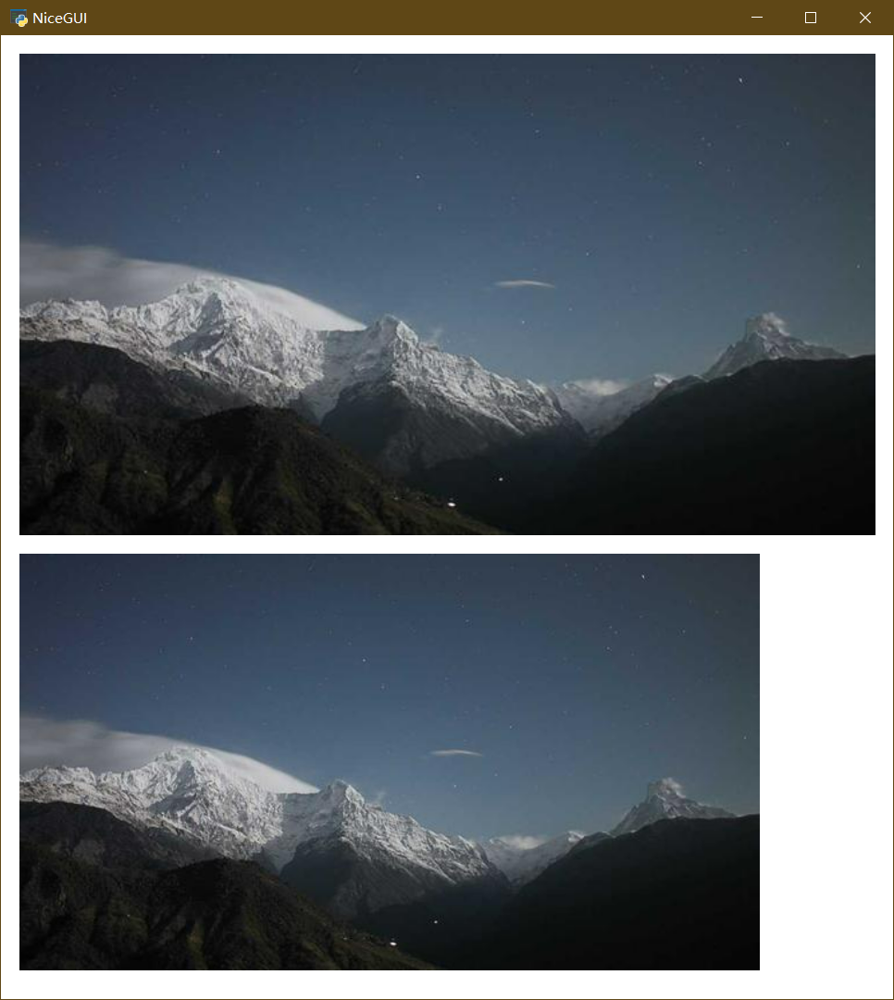
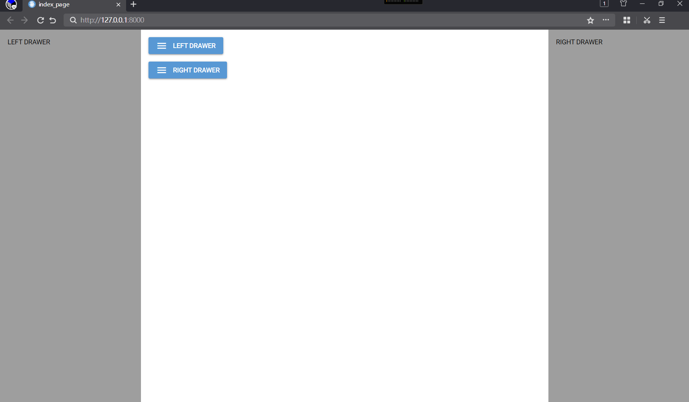

# nicegui的中文入门教程

[TOC]


## 0 前言

对于python语言的使用者来说，[nicegui](https://nicegui.io/)是一款优秀的WebUI、GUI框架，只需学习一定量的前端知识，就能使用nicegui快速搭建出美观的UI界面。但是，由于官方作者不提供系统性的入门、中文教程，很多中文初学者望而却步。于是，本教程应运而生。

本教程旨在用中文提供官方文档没有的系统性入门教程，并将部分社区讨论问题汉化、简化，方便中文学习者尽快上手并解决常见难题。虽然教程的名字叫入门教程，但本教程并没有停留在翻译官网文档的阶段，能够解决常见问题的高阶技巧也有。对于官方提供的各个控件的详细API，本教程并不会照本宣科，而是在提供思路之后，由读者自行查阅。正所谓“授人以鱼不如授人以渔”，掌握方法比掌握结果更有效。

->[教程全文详见仓库](https://github.com/python-and-fiction/chinese_guide_of_nicegui_for_beginner)

## 1 环境准备

本章主要介绍运行和开发nicegui程序的环境准备，包括虚拟环境的建立、开发工具的选择、如何自托管文档。

### 1.1 运行环境

为了保证最佳开发体验，所有的环境准备优先使用Windows系统，使用Linux、Mac的话，请自己根据系统变通。

首先，需要准备python解释器和pip。其中，Python解释器是运行后续代码、工具的基础，只需到官网安装最新稳定版（当前为3.12.*）即可；pip是Python官方的包管理工具，安装解释器时务必勾选此选项，如果没有勾选或者想要后续单独安装pip，可以到[pypi](https://pypi.org/)官方查看安装方法，这里不在赘述。

环境管理工具有pdm和poetry，使用以下命令全部安装：

```shell
pip install pdm poetry
```

环境管理工具是快捷管理python运行环境的工具，可以创建出独立的python运行环境，各个运行环境内安装的软件包不会干扰其他环境，也不会影响到默认的python环境。

pdm是一款国人创建的环境管理工具，语法简单，操作方便，因此教程采用此工具。

poetry也是一款环境管理工具，是nicegui官方仓库采用的，可以基于官方源代码自己编译安装包，也用于后续自托管文档，因此需要安装。

但是，poetry的检查依赖速度比pdm慢太多，故这里采用pdm作为学习工具，如果读者有能力，可以只使用poetry。

#### 1.1.1 基础环境初始化

先在纯英文、无空格、无特殊字符的路径下创建纯英文、无空格、无特殊字符的空白文件夹，进入该文件夹后，右键，在此处打开终端或者命令行，运行以下命令：

```shell
pdm init
```

会看到以下输出：

```shell
PS E:\PSF\git\chinese_guide_of_nicegui_for_beginner> pdm init
Creating a pyproject.toml for PDM...
Please enter the Python interpreter to use
 0. cpython@3.12 (D:\Programs\Python\Python312\python.EXE)
 1. cpython@3.11 (D:\mingw64\bin\python3.11.exe)
 2. cpython@3.11 (D:\mingw64\bin\python3.exe)
 3. cpython@3.11 (D:\mingw64\bin\python.exe)
 4. cpython@3.11 (C:\Users\peter\AppData\Local\pdm\pdm\python\cpython@3.11.5\python.exe)
Please select (0): 0
Virtualenv is created successfully at E:\PSF\git\chinese_guide_of_nicegui_for_beginner\.venv
Project name (chinese_guide_of_nicegui_for_beginner):
Project version (0.1.0):
Do you want to build this project for distribution(such as wheel)?
If yes, it will be installed by default when running `pdm install`. [y/n] (n):
License(SPDX name) (MIT):
Author name (): Peter
Author email (): peter@linux
Python requires('*' to allow any) (==3.12.*):
Project is initialized successfully
PS E:\PSF\git\chinese_guide_of_nicegui_for_beginner>
```

过程为交互式，需要自己输入之后回车才能继续，不输入直接回车则采用默认。

`Please select (0):`为选择python版本，pdm会自动识别当前电脑安装的所有python解释器，部分工具（如gcc）也会自带python解释器，需要正确选择自己安装的、可以直接运行pip命令的python解释器，这一步根据实际情况选择，一般默认第一个，可以直接回车。

`Project name (chinese_guide_of_nicegui_for_beginner):`为设置项目名称，通常为当前文件夹名字，可以自己输入来修改。这个不会修改当前文件夹名字，只会影响项目描述文件中的项目名称和后续创建的源代码文件夹名称。这里可以直接回车。

`Project version (0.1.0):`为设置当前项目的版本号，该版本号符合语义化规则，不懂或者不想了解的可以直接回车。

`If yes, it will be installed by default when running pdm install. [y/n] (n):`这一步是问你要不要将项目构建成分发包（可以用pip安装的），如果选择`y`，使用`pdm install`就会默认安装项目。这里选择不创建分发包，所以直接回车。

`License(SPDX name) (MIT):`、`Author name (): `、`Author email ():`分别是许可协议、作者名字、作者邮箱地址，了解、知道的可以修改，不清楚或者不想写的可以直接回车。

`Python requires('*' to allow any) (==3.12.*):`为python的版本要求，如果后续要用低版本或者高版本python运行，这里需要修改，否则此项目会限制python的版本。这个后续可以自己了解，这里直接回车即可。

至此，基础环境已经准备完毕，可以得到以下目录结构：

```shell
chinese_guide_of_nicegui_for_beginner
├─.venv
│  ├─Lib
│  │  └─site-packages
│  └─Scripts
├─src
│  └─chinese_guide_of_nicegui_for_beginner
└─tests
```

`./src/chinese_guide_of_nicegui_for_beginner/`下存放项目的源代码，后续的代码操作（创建修改）均在此目录。此外，项目根目录下有`pyproject.toml`（项目描述文件）和`README.md`（自述文件），本教程不涉及手动修改。

#### 1.1.2 nicegui运行环境

基础环境初始化完毕之后，项目还不能直接运行基于nicegui框架的代码，因为基础环境还没有安装nicegui。因此，需要在项目根目录下使用以下命令安装：

```shell
pdm add nicegui
```

安装过程取决于网速，耐心等待。

如果后续项目中需要使用其他库，可以使用`pdm add 库对应的pip安装命令中的名字`来添加到项目环境中。

对于调试使用nicegui的程序，通常在native mode下比较方便，因此，建议安装`pywebview`来增加native mode的支持，命令是：

```shell
pdm add pywebview
```

对于没有安装过Microsoft Edge WebView2或者版本较旧的Windows系统，建议访问 [ Microsoft Edge WebView2下载 ](https://developer.microsoft.com/zh-cn/microsoft-edge/webview2 ) 安装最新版本。

### 1.2 开发工具

[VSCode](https://code.visualstudio.com/)或者[PyCharm](https://www.jetbrains.com/pycharm/download/)，其中VSCode比PyCharm轻量，但需要手动安装python插件，而PyCharm自带插件，操作简单。这里推荐使用VSCode，比较流畅，如果是使用PyCharm，后续操作根据VSCode对应即可。

对于VSCode，建议安装以下插件：

```
ms-python.python
ms-python.autopep8
ms-python.black-formatter
```

### 1.3 自托管文档【可选】

因为官网文档是可交互的，只有连接到官网才能操作。但是，部分地区的访问官网存在网络不佳的情况，如果需要自托管官网文档，可以遵循以下步骤。

首先要安装git，具体可以看[Git - 安装 Git](https://git-scm.com/book/zh/v2/%E8%B5%B7%E6%AD%A5-%E5%AE%89%E8%A3%85-Git)。

安装完成后，额外找一个空白文件夹，打开终端，执行以下命令：

```shell
git clone https://github.com/zauberzeug/nicegui.git
```

没有git，可以打开以下链接：

```shell
https://github.com/zauberzeug/nicegui/archive/refs/heads/main.zip
```

下载压缩包之后解压，结果一样。对于GItHub难以访问的问题，可以自行搜索GitHub加速的方法。

使用以下命令进入nicegui的源代码文件夹，并执行安装操作：

```shell
cd nicegui
poetry install
```

等安装完成之后（poetry的install时间会比较长），执行以下命令，会开启一个服务器托管官网文档，并自动调用浏览器打开自托管的官网：

```shell
poetry run python .\main.py
```

_注意：如果不使用poetry创建的虚拟环境运行，而是使用全局python运行的话，首先要安装nicegui库，然后根据提示安装缺失的库（自托管文件需要的部分依赖不会随nicegui自动安装），并且在源码根目录执行`python main.py`_。

关掉终端就可以关闭服务器，下次运行这条命令就可以直接开启自托管的官网文档，无需再次安装。

如果官方有源代码更新，后续将源代码解压覆盖之后，执行一次安装操作即可更新。

## 2 入门基础

本章主要介绍nicegui的基础知识，系统性了解nicegui的基本结构，在自学nicegui、查阅官网文档时有方向。

### 2.1 认识nicegui

nicegui 是一个开源的python库，可以搭建运行在浏览器的图形界面，也就是WebUI，也可以理解为和网站一样。nicegui的学习过程并不难，但不意味着你可以零基础入门。对于开发nicegui的开发者而言，python的基础是必须的；如果掌握python不常用语法和用法更好，后续在使用nicegui的过程中，可以很方便理解一些为了达成效果而使用的骚操作。尽管大部分python的学习者是零基础入门，除了转全栈、爬虫的开发者，后续学习过程中很少接触前端（HTML、CSS、JavaScript），但还是在使用nicegui之前，要有学习前端的心理准备。nicegui为了方便python工程师快速搭建图形界面，专注于python代码本身，做了不少前端细节的隐藏。不过，默认的样式不一定符合预期效果，为了达成效果，还是需要了解一些前端知识，才能让界面完全符合心意。

nicegui的底层使用了fastapi作为运行服务器，Quasar作为前端框架，支持tailwindcss的CSS语法，因为Quasar的内部使用VUE搭建，nicegui也不可避免地用到了VUE的语法。因此，对于想要用好nicegui的开发者，在后续使用nicegui的过程中，需要对上述提到的项目有一定了解。想要对后端部分定制、修改的，需要了解fastapi以及其基于的其他组件；想要让界面美化、随心的，需要掌握Quasar、tailwindcss基础；对于有能力和需求完全定制界面的，则需要掌握VUE基础。

相关链接：

nicegui官方文档：https://nicegui.io/documentation

fastapi官方文档：https://fastapi.tiangolo.com/zh/

Quasar官方文档：https://quasar.dev/docs

tailwindcss官方文档：https://tailwindcss.com/

VUE官方文档：https://cn.vuejs.org/guide/introduction

#### 2.1.1 nicegui的`Hello World!`

如果你能看到这里，证明你有学好nicegui的基础和能力，并不畏惧上一节提到的那么多基础知识。那么，就用一段简单的`Hello World!`代码开启nicegui的入门之旅。

使用VSCode在项目文件夹下的`src\chinese_guide_of_nicegui_for_beginner`内，新建以`py`为后缀的python代码文件，复制以下代码到代码文件中，保存。

```python3
from nicegui import ui

ui.button('Say Hi',on_click=lambda :ui.notify('Hello World!'))

ui.run(native=True)
```

注意vscode的右下角，务必确保使用的是`venv`下的python解释器，如果不是，点击右下角`3.12.4{'.venv'}`对应位置，选择输入解释器路径-查找，选择`.venv\Scripts\`下的`python.exe`。


点击VSCode右上角的运行按钮（三角形），就可以看到一个窗口弹出，点击`SAY HI`按钮，就能看到窗口底部弹出的`Hello World!`。


从`Hello World!`示例可以看到，基于nicegui的python程序寥寥三行代码，除去导入语句和必不可少的`ui.run`，主体只有一行代码，就能实现一个完整的交互过程，足见nicegui的强大、简洁。后续教程中很多例子都可以做到几行代码实现不错的效果，这也是nicegui大受欢迎的原因。

### 2.2 nicegui的基本结构

#### 2.2.1 图形界面的基础概念

在正式学习nicegui之前，需要先对图形界面有个基础的理解。

一般来说，搭建图形界面理解三个概念：控件、布局、交互。

##### 2.2.1.1 控件

控件是搭建图形界面的基本元素，就像是盖房子用的砖、门、窗等最小搭建单位。控件通常是图形界面框架提供、直接可用的。如果使用过程中发现基本元素不够，可以结合布局功能，用基本元素组合出新的控件。

##### 2.2.1.2 布局

布局是排布控件的方式，就像是房屋的基本框架。用砖可以铺地，也可以垒墙，对于砖而言，墙或是地，就是布局。控件是横向排列还是竖向排列，是像网格一样一一对应，还是大控件套着小控件，都是由布局控制。大部分图形程序框架提供的布局类似，除了基本的几种布局之外，部分图形程序框架还提供额外的组合布局。

##### 2.2.1.3 交互

交互是图形界面的重中之重，也是一个程序最难的部分。论难度的话，前面的控件和布局的学习只是对照文档，按图索骥，交互则需要身经百战，不断积累经验。

事件机制是目前大部分图形界面采用的交互反馈机制，也就是基于特定的事件触发，执行对应的函数。微软的winform中采用的消息机制，Qt的信号与槽，现代网页开发中的event事件监听，都可以理解为事件机制，只是对于winform和Qt而言，他们框架内的事件分别叫做消息和信号而已。

除了事件机制，美化也是交互的一部分。大部分现代图形界面框架。如Qt、WPF以及一系列基于网页开发的图形界面框架，支持CSS或者类似语法的美化功能，让图形界面变得更加美观，也让控件的动画效果更加丰富，这个极大提升了用户的使用体验。

此外，基于图形界面框架的特性，后端的处理逻辑以及数据的传递也是交互的一部分。在函数内，对于控件的控制，如何做到符合要求，毕竟有的框架、编程语言不支持没有定义或者声明函数就调用，而有的语言不支持声明函数。如果需要让控件显示的文本与另一个控件的文本一致，如何处理数据同步过程也需要技巧。

#### 2.2.2 nicegui与基础概念的对应

对图形界面有基础的理解之后，下面就可以根据nicegui与基础概念的对应，进一步理解nicegui的设计理念。

在`Hello World!`示例中，使用了导入语句`from nicegui import ui`导入了`ui`，顾名思义，ui就是用户界面，这也是nicegui调用控件的模块，也可以调用布局。具体的控件和布局用法可以参考下一节[nicegui中不得不学的功能](#2.3 nicegui中不得不学的功能)，下一节将选取一些nicegui中常用、不好理解的功能重点讲解。

因为nicegui是基于Quasar这个Web框架做的python调用绑定，因此，nicegui的交互部分，很大程度与Web结合。在Web设计中，基于CSS实现的美化效果，基于JavaScript的event做的事件响应，都能在nicegui中看到。所以，如果用好nicegui，对Web三件套HTML、CSS、JavaScript的学习不可避免。此外，因为nicegui与Quasar这个Web框架的深度集成的关系，Quasar中的属性、slot、事件也需要掌握，才能让交互设计更加得心应手。

关于美化，下一节中的[外观美化](#2.3.7 外观美化)将会详细介绍，也可以查阅对应的官方文档。事件的学习，可以参阅下一节的[事件和执行](#2.3.8 事件和执行)，也可以查阅对应的官方文档。

### 2.3 nicegui中不得不学的功能

以下是官网文档对于nicegui提供的功能做了大致的划分，本教程将会对每个部分中不好掌握、需要重点学习的控件、功能进行剖析：

1.   文本控件：https://nicegui.io/documentation/section_text_elements

2.   常用控件：https://nicegui.io/documentation/section_controls

3.   多媒体控件：https://nicegui.io/documentation/section_audiovisual_elements

4.   数据控件：https://nicegui.io/documentation/section_data_elements

5.   属性绑定：https://nicegui.io/documentation/section_binding_properties

6.   图形布局：https://nicegui.io/documentation/section_page_layout

7.   外观美化：https://nicegui.io/documentation/section_styling_appearance

8.   事件和执行：https://nicegui.io/documentation/section_action_events

9.   网站页面：https://nicegui.io/documentation/section_pages_routing

10.   部署与配置：https://nicegui.io/documentation/section_configuration_deployment


这部分对于官方内容的解析并不会完全覆盖，主要讲经常用到的参数、属性、方法，对于某些隐藏参数和不常用的属性方法，会在后面用到的时候详细介绍，这里最多提一嘴。

#### 2.3.1 文本控件

文本类控件主要是一些静态展示可复制文本的控件，是构成网页显示效果的主要控件。

##### 2.3.1.1 ui.label

文本标签，用法很简单，通过传入一个字符串类型的参数`text`，让网页显示字符串内的文字。注意，虽然参数支持多行文字，但是输出只能一行，需要原样输出多行文字的话，可以使用下面介绍的`ui.html`，将`tag`设置为`pre`。

```python3
from nicegui import ui

ui.label(text='some label')

ui.run(native=True)
```

##### 2.3.1.2 ui.link

超链接，一种点击之后跳转到指定地址的文本元素。可以传入`text`、`target`、`new_tab`三个参数。代码如下：

```python3
from nicegui import ui

ui.link(text='NiceGUI on GitHub', target= 'https://github.com/zauberzeug/nicegui', new_tab=False)

ui.run(native=True)
```

`text`参数，字符串类型，表示超链接显示什么文字。

`target`参数，字符串类型、`page function`、`ui.element`类型，表示超链接跳转到什么位置，这里只介绍字符串类型用法，其他类型可以自行探索或者后续需要用到的时候补充。字符串类型参数表示超链接跳转的url地址，可以使用协议开头的完整地址，也可以使用省略主机的绝对路径、相对路径。

`new_tab`参数，布尔类型，默认为`False`，表示要不要在新建标签页中打开超链接。

##### 2.3.1.3 ui.element

通用元素，也是nicegui大部分界面控件的基类。很多控件都是通过继承这个类来调用自定义标签、JavaScript代码实现。通过继承实现自定义控件、修改默认风格属于高级用法，这里只说基本用法。

`tag`参数，字符串类型，默认为`div`，表示生成的元素用什么标签，实际使用时可以根据需要修改为其他HTML标签或者Quasar标签。代码如下：

```python3
from nicegui import ui

with ui.element('div').classes('p-2 bg-blue-100'):
    ui.label('inside a colored div')
    
ui.run(native=True)
```

`move`方法，将控件移动到指定控件之内，默认为`default`slot，也可以传递`target_slot`参数，指定slot。代码如下：

```python3
from nicegui import ui

with ui.card() as card:
    name = ui.input('Name', value='Paul')
    name.add_slot('append')
    icon = ui.icon('face')

ui.button('Move into input default slot', on_click=lambda: icon.move(name))
ui.button('Move into input append slot', on_click=lambda: icon.move(name, target_slot='append'))
ui.button('Move out of input', on_click=lambda: icon.move(card))

ui.run(native=True)
```


##### 2.3.1.4 ui.markdown和ui.html

与`ui.label`类似，`ui.markdown`和`ui.html`，都可以用来展示文本，只是后两者支持markdown语法和HTML语法，因为markdown语法支持一部分HTML的标签，可以看到放在`ui.markdown`里的HTML标签也能被解析。以下是三种控件解析同一内容的代码：

```python3
from nicegui import ui

content = '''
This is **Markdown**.
This is <u>emphasized</u>
'''
ui.label(content)
ui.markdown(content)
ui.html(content)

ui.run(native=True)
```

此外，`ui.html`还支持传入字符串类型参数`tag`给基类`ui.element`，用于修改生成`ui.html`用的标签，比如：

```python3
from nicegui import ui

ui.html('This is <u>emphasized</u>.', tag='em')

ui.run(native=True)
```

#### 2.3.2 常用控件

常用控件主要是一些支持点击、输入、拖动等交互功能的控件。

##### 2.3.2.1 ui.button

按钮作是网页交互设计中最常见的基本元素，在移动互联网没有普及之前，使用鼠标点击为主要交互方式的时代，除了用于跳转网页的超链接，按钮就是网页中用的最多的可交互元素。在nicegui中，按钮控件可以传入位置参数`text`，关键字参数`on_click`、`color`和`icon`。

以下代码就是一个定义了基本交互的按钮，点击会弹出一个通知提示：

```python3
from nicegui import ui

ui.button('Click me!', color='green', icon='thumb_up', on_click=lambda: ui.notify('You clicked me!'))

ui.run(native=True)
```

`text`参数，字符串类型，表示显示在按钮上的文字，如果是英文的话，默认全部大写。该参数默认只支持字符串类型，但是整数和小数可以直接使用，其他类型需要先转换为字符串类型才能传入。

`color`参数，字符串类型或者None，表示按钮的颜色，支持传入字符串类型的颜色类（Quasar、 Tailwind、CSS的颜色名）或者`None`（即让按钮变成默认颜色）。

`icon`参数，字符串类型，表示按钮额外显示的图标，支持传入字符串类型的图标名，具体名字会在`ui.icon`中介绍，这里不做详细介绍。

`on_click`参数，可调用类型，表示点击按钮调用的函数，可以使用`lambda`表达式，也可以使用函数名。

如果觉得对按钮传入参数来自定义按钮内容的方法太死板，也可以使用以下语法，使用`with`来进入按钮的`default slot`，随意组合按钮内的内容：

```python3
from nicegui import ui

with ui.button(color='green', on_click=lambda: ui.notify('You clicked me!')):
    ui.icon('thumb_up')
    ui.label('Click me!')

ui.run(native=True)
```


对于`on_click`参数、后续会涉及到的on开头的`on_*`参数、on开头的`on_*`方法和`on`方法里的callback或者handler参数，均为可调用类型参数，既可以在创建控件时定义lambda表达式，也可以提前定义。对于复杂一点逻辑操作，应该定义函数而不是lambda表达式，比如：

```python3
from nicegui import ui

test = lambda :...
#如果要执行的操作比较多、复杂，应该定义函数
def test():
    pass
#在控件中传参可以直接使用test
ui.button('Click me!',on_click=test)

ui.run(native=True)
```

对于button等控件而言，除了支持通过传参创建响应动作，还支持调用对应的`on_*`方法（比如on_click）创建，这个方法极大提高了响应动作的灵活性，上面的例子就可以借助这个方法调整函数定义与按钮创建的先后顺序，代码如下：

```python3
from nicegui import ui

button = ui.button('Click me!')
def test():
    pass
button.on_click(test)

ui.run(native=True)
```

##### 2.3.2.2 ui.input

输入框，大概是网页中仅次于按钮和超链接，用得最多的控件。HTML中输入框的变体很多，在nicegui中，输入框的参数也很多，基于输入框扩展的控件也多，使用输入框的逻辑设计、注意事项一样很多。不过，在这一节，针对输入框的学习并不会那么深入，只要能掌握常用的参数和基础的方法，那些疑难点会放到进阶和需要的时候细讲，以免一时不好理解而记混。

以下代码定义了一个名字输入框和密码输入框，并在输入名字的时候，自动弹出通知显示名字和密码：

```python3
from nicegui import ui

name = ui.input(label='Name:', value='Peter', on_change=lambda :ui.notify(f'{name.value=},{password.value=}'))
password = ui.input(label='Password:', value='123456', password=True, password_toggle_button=True)

ui.run(native=True)
```


`label`参数，字符串类型，直译的话是标签，表示显示在输入框上方的文本，但不是输入的文本，如果输入的内容是空的，点击输入的之前会显示在输入框内，点击之后会移动到输入框上方。

`value`参数，字符串类型，表示输入框内的内容，也就是输入框的值。对于后续介绍的以及其他支持交互输入的控件，都会有这么一个参数、属性、相关方法，来设置控件的值，这一点上，nicegui的设计倒是很统一。

`on_change`参数，可调用类型，表示输入框的值变化时执行的函数。

`password`参数，布尔类型，表示输入框是否设置为密码输入框，如果设置为`True`，输入的内容将不显示明文，转而显示统一的密码符号。

`password_toggle_button`参数，布尔类型，表示输入框内是否显示密码按钮，密码按钮可以切换输入框内的密码、明文状态。

输入框控件还有很多参数和方法，就留给读者自己探索了，后续如有相关案例，到时候再细讲。

##### 2.3.2.3 ui.slider和ui.knob

ui.slider是滑动条，这个比较简单，参数也不多，按理说不用专门讲一下，自学即可。至于ui.knob——旋钮，这个的样式参数比较多，也有很大的自定义自由度，值得一讲。不过，这些都不是这里要专门放在一起介绍的原因，具体原因是什么，这里先卖个关子，后面再做解释。

先看一段代码：

```python3
from nicegui import ui

slider = ui.slider(min=0, max=100, step=1, value=50)
ui.knob(min=0, max=100, step=1, value=50,
        color='orange', center_color='blue', track_color='black',
        size='3.5em',
        show_value=True
        ).bind_value(slider, 'value')

ui.run(native=True)
```


可以看到，ui.knob的前四个参数和ui.slider的一样，都是浮点类型，分别代表最小值、最大值、每次调整的最小步长、当前值。

在ui.knob中，有`color`、`center_color`、 `track_color`三种可以传参修改的颜色，分别代表旋钮边缘的颜色、旋钮中间的颜色、旋钮边缘没有覆盖之前的颜色，支持传入字符串类型的颜色类（Quasar、 Tailwind、CSS的颜色名）、`None`（即让按钮变成默认颜色）或者`"primary"`（跟随主题颜色）。

`size`是旋钮的整体大小，字符串类型，采用CSS语法的大小表示方式。

`show_value`参数，布尔类型，是否在旋钮中间显示当前值。

#### 2.3.3 多媒体控件

##### 2.3.3.1 ui.image和ui.interactive_image

点开一个网页，最抓人眼球的是什么内容？没错，是图片。既然用nicegui设计网页，没有图片元素怎么行？在nicegui中，有两种显示图片的控件：ui.image和ui.interactive_image。前者可以简单理解为显示图片的简单标签，后者是基于前者扩展了很多交互功能的plus版本。两者的第一个参数都是`source`，支持字符串类型的本地图像路径、网络图像路径，或者base64编码的图像本身，这个没什么难点，这里不做细讲，接下来要重点讲的是ui.interactive_image的其他参数的用法，因为这个控件有时候比看似简单的ui.image更加好用趁手。

先看一段代码：

```python3
from nicegui import ui

src = 'https://picsum.photos/id/377/640/360'
img = ui.image(src)
img2 = ui.interactive_image(src)

ui.run(native=True)
```



可以看到，同样的图片地址，都是不传入其他参数的情况下，即使可用空间大于图片大小，ui.interactive_image也不会随着页面大小而缩放图片，始终保持图片的原始大小，这个有别于ui.image的特性，可以在日后想要保持图片真实大小时使用。

除了`source`参数外，ui.interactive_image还有以下参数：

`content`参数，字符串类型，表示覆盖在图片之上的SVG内容，SVG的画布大小就是图片的大小。当然，不太理解SVG的话也没关系，后面用到会详细介绍，也可以专门找一下资料。这里可以简单理解SVG为一种用定义描述的几何图形，这种图形不会因为缩放变成马赛克，因为它是基于定义绘制的。

`size`参数，元组类型（宽度，高度），表示如果`source`没有设置的话，这就是默认图形的尺寸。这个对于绘制上面的SVG内容来说比较重要，因为这个尺寸就是画布的大小。对于想要交互创建SVG内容的操作，指定画布大小很重要。

`on_mouse`参数，可调用类型，表示触发鼠标事件之后要执行的操作，默认包含一个鼠标事件的参数，参数字典内的image_x和image_y的值是以像素为单位表示的鼠标交互位置。

`events`参数，字符串列表，表示JavaScript订阅的事件，默认订阅点击事件，即`['click']`，也可以自己指定要订阅的事件内容。

`cross`参数，字符串类型或者布尔类型，表示要不要显示十字线来指示鼠标位置，默认为`False`。如果为`True`或者表示颜色的字符串，就会显示指定颜色（即字符串表示的颜色）的十字线。

`force_reload`方法，强制重新载入图片，这个方法两者图片控件都有，对于某些时候网络不好造成图片加载失败、支持随机刷新图片的接口，这个方法还是很实用的。

对于图片控件，一样可以使用`with`嵌入其他内容。比如，下面的代码就嵌入了一个按钮，实现了点击图片和按钮有不同的通知内容：

```python3
from nicegui import ui

src = 'https://picsum.photos/id/377/640/360'
with ui.interactive_image(src,on_mouse=lambda :ui.notify('You clicked interactive_image.')):
    ui.button(on_click=lambda: ui.notify('You clicked button.'), icon='thumb_up')\
        .props('flat color=white').classes('absolute bottom-0 left-0 m-2')

ui.run(native=True)
```


##### 2.3.3.2 ui.icon和ui.avatar

在[ui.button](#2.3.2.1 ui.button)中挖了一个有关ui.icon的坑，现在，终于到了填坑的时候。先看一个简单的示例，了解一下ui.icon控件的用法：

```python3
from nicegui import ui

ui.icon(name='home', color='blue', size='xl')
ui.icon(name='o_home', color='blue', size='xl')
ui.icon(name='r_home', color='blue', size='xl')
ui.icon(name='sym_o_home', color='blue', size='xl')
ui.icon(name='sym_r_home', color='blue', size='xl')

ui.run(native=True)
```


ui.icon的参数不多，就三个：

`name`参数，字符串类型，表示图标字体中的图标名，ui.icon通过给定的图标名，从字体中加载图标，默认支持Material Icons图标字体。也可以自己添加其他图标字体，并结合对应图标字体的用法加载。这一部分需要根据具体情况灵活变通，这里不做详解。

`color`参数，字符串类型，表示图标的颜色。

`size`参数，字符串类型，表示图标的大小。

理解参数不难，但是，给出的示例代码并没有看上去那么简单。这个时候，聪明的读者已经发现了猫腻：几个图标看上去很像，但不完全一样。再仔细看的话就会发现，它们的后缀都是一样的，只有前缀不同。没错，这组图标本质上都是一个，只是名字的前缀有特定的风格含义，需要特别注意一下。

无前缀代表实心填充风格，"o\_" 前缀表示轮廓线风格，"r\_" 前缀表示圆角风格，"s\_"前缀表示锐化风格，"sym\_o\_"前缀表示轮廓线符号，"sym\_r\_"前缀表示圆角符号，"sym\_s\_" 前缀表示锐化符号。

这个时候，有的读者就要头疼了，前缀就这么几个，还好记，可图标那么多，每个图标名字怎么记得住，有没有方便查询的网站？有，不过国内没法直接访问，那就是官网：

 Material Icons查询网站（非中国大陆地区）：https://fonts.google.com/icons?icon.set=Material+Icons

当然，国内也有很多渠道查询，为了避免广告嫌疑，这里就不具体指明了。

不过，只是提供一个404网站，教程就失去了意义，这里还有一个备用方法，那就是小工具：

 Material Icons查询器：

```python3
from nicegui import ui

icon_name_dict = {
    '10k': ['', 'o_', 'r_', 's_', 'sym_o_', 'sym_r_', 'sym_s_'], '10mp': ['', 'o_', 'r_', 's_', 'sym_o_', 'sym_r_', 'sym_s_'], '11mp': ['', 'o_', 'r_', 's_', 'sym_o_', 'sym_r_', 'sym_s_'], '123': ['', 'o_', 'r_', 's_', 'sym_o_', 'sym_r_', 'sym_s_'], '12mp': ['', 'o_', 'r_', 's_', 'sym_o_', 'sym_r_', 'sym_s_'], '13mp': ['', 'o_', 'r_', 's_', 'sym_o_', 'sym_r_', 'sym_s_'], '14mp': ['', 'o_', 'r_', 's_', 'sym_o_', 'sym_r_', 'sym_s_'], '15mp': ['', 'o_', 'r_', 's_', 'sym_o_', 'sym_r_', 'sym_s_'], '16mp': ['', 'o_', 'r_', 's_', 'sym_o_', 'sym_r_', 'sym_s_'], '17mp': ['', 'o_', 'r_', 's_', 'sym_o_', 'sym_r_', 'sym_s_'], '18_up_rating': ['', 'o_', 'r_', 's_', 'sym_o_', 'sym_r_', 'sym_s_'], '18mp': ['', 'o_', 'r_', 's_', 'sym_o_', 'sym_r_', 'sym_s_'], '19mp': ['', 'o_', 'r_', 's_', 'sym_o_', 'sym_r_', 'sym_s_'], '1k': ['', 'o_', 'r_', 's_', 'sym_o_', 'sym_r_', 'sym_s_'], '1k_plus': ['', 'o_', 'r_', 's_', 'sym_o_', 'sym_r_', 'sym_s_'], '1x_mobiledata': ['', 'o_', 'r_', 's_', 'sym_o_', 'sym_r_', 'sym_s_'], '20mp': ['', 'o_', 'r_', 's_', 'sym_o_', 'sym_r_', 'sym_s_'], '21mp': ['', 'o_', 'r_', 's_', 'sym_o_', 'sym_r_', 'sym_s_'], '22mp': ['', 'o_', 'r_', 's_', 'sym_o_', 'sym_r_', 'sym_s_'], '23mp': ['', 'o_', 'r_', 's_', 'sym_o_', 'sym_r_', 'sym_s_'], '24mp': ['', 'o_', 'r_', 's_', 'sym_o_', 'sym_r_', 'sym_s_'], '2k': ['', 'o_', 'r_', 's_', 'sym_o_', 'sym_r_', 'sym_s_'], '2k_plus': ['', 'o_', 'r_', 's_', 'sym_o_', 'sym_r_', 'sym_s_'], '2mp': ['', 'o_', 'r_', 's_', 'sym_o_', 'sym_r_', 'sym_s_'], '30fps': ['', 'o_', 'r_', 's_', 'sym_o_', 'sym_r_', 'sym_s_'], '30fps_select': ['', 'o_', 'r_', 's_', 'sym_o_', 'sym_r_', 'sym_s_'], '360': ['', 'o_', 'r_', 's_', 'sym_o_', 'sym_r_', 'sym_s_'], '3d_rotation': ['', 'o_', 'r_', 's_', 'sym_o_', 'sym_r_', 'sym_s_'], '3g_mobiledata': ['', 'o_', 'r_', 's_', 'sym_o_', 'sym_r_', 'sym_s_'], '3k': ['', 'o_', 'r_', 's_', 'sym_o_', 'sym_r_', 'sym_s_'], '3k_plus': ['', 'o_', 'r_', 's_', 'sym_o_', 'sym_r_', 'sym_s_'], '3mp': ['', 'o_', 'r_', 's_', 'sym_o_', 'sym_r_', 'sym_s_'], '3p': ['', 'o_', 'r_', 's_', 'sym_o_', 'sym_r_', 'sym_s_'], '4g_mobiledata': ['', 'o_', 'r_', 's_', 'sym_o_', 'sym_r_', 'sym_s_'], '4g_plus_mobiledata': ['', 'o_', 'r_', 's_', 'sym_o_', 'sym_r_', 'sym_s_'], '4k': ['', 'o_', 'r_', 's_', 'sym_o_', 'sym_r_', 'sym_s_'], '4k_plus': ['', 'o_', 'r_', 's_', 'sym_o_', 'sym_r_', 'sym_s_'], '4mp': ['', 'o_', 'r_', 's_', 'sym_o_', 'sym_r_', 'sym_s_'], '5g': ['', 'o_', 'r_', 's_', 'sym_o_', 'sym_r_', 'sym_s_'], '5k': ['', 'o_', 'r_', 's_', 'sym_o_', 'sym_r_', 'sym_s_'], '5k_plus': ['', 'o_', 'r_', 's_', 'sym_o_', 'sym_r_', 'sym_s_'], '5mp': ['', 'o_', 'r_', 's_', 'sym_o_', 'sym_r_', 'sym_s_'], '60fps': ['', 'o_', 'r_', 's_', 'sym_o_', 'sym_r_', 'sym_s_'], '60fps_select': ['', 'o_', 'r_', 's_', 'sym_o_', 'sym_r_', 'sym_s_'], '6_ft_apart': ['', 'o_', 'r_', 's_', 'sym_o_', 'sym_r_', 'sym_s_'], '6k': ['', 'o_', 'r_', 's_', 'sym_o_', 'sym_r_', 'sym_s_'], '6k_plus': ['', 'o_', 'r_', 's_', 'sym_o_', 'sym_r_', 'sym_s_'], '6mp': ['', 'o_', 'r_', 's_', 'sym_o_', 'sym_r_', 'sym_s_'], '7k': ['', 'o_', 'r_', 's_', 'sym_o_', 'sym_r_', 'sym_s_'], '7k_plus': ['', 'o_', 'r_', 's_', 'sym_o_', 'sym_r_', 'sym_s_'], '7mp': ['', 'o_', 'r_', 's_', 'sym_o_', 'sym_r_', 'sym_s_'], '8k': ['', 'o_', 'r_', 's_', 'sym_o_', 'sym_r_', 'sym_s_'], '8k_plus': ['', 'o_', 'r_', 's_', 'sym_o_', 'sym_r_', 'sym_s_'], '8mp': ['', 'o_', 'r_', 's_', 'sym_o_', 'sym_r_', 'sym_s_'], '9k': ['', 'o_', 'r_', 's_', 'sym_o_', 'sym_r_', 'sym_s_'], '9k_plus': ['', 'o_', 'r_', 's_', 'sym_o_', 'sym_r_', 'sym_s_'], '9mp': ['', 'o_', 'r_', 's_', 'sym_o_', 'sym_r_', 'sym_s_'], 'abc': ['', 'o_', 'r_', 's_', 'sym_o_', 'sym_r_', 'sym_s_'], 'ac_unit': ['', 'o_', 'r_', 's_', 'sym_o_', 'sym_r_', 'sym_s_'], 'access_alarm': ['', 'o_', 'r_', 's_'], 'access_alarms': ['', 'o_', 'r_', 's_'], 'access_time': ['', 'o_', 'r_', 's_'], 'access_time_filled': ['', 'o_', 'r_', 's_'], 'accessibility': ['', 'o_', 'r_', 's_', 'sym_o_', 'sym_r_', 'sym_s_'], 'accessibility_new': ['', 'o_', 'r_', 's_', 'sym_o_', 'sym_r_', 'sym_s_'], 'accessible': ['', 'o_', 'r_', 's_', 'sym_o_', 'sym_r_', 'sym_s_'], 'accessible_forward': ['', 'o_', 'r_', 's_', 'sym_o_', 'sym_r_', 'sym_s_'], 'account_balance': ['', 'o_', 'r_', 's_', 'sym_o_', 'sym_r_', 'sym_s_'], 'account_balance_wallet': ['', 'o_', 'r_', 's_', 'sym_o_', 'sym_r_', 'sym_s_'], 'account_box': ['', 'o_', 'r_', 's_', 'sym_o_', 'sym_r_', 'sym_s_'], 'account_circle': ['', 'o_', 'r_', 's_', 'sym_o_', 'sym_r_', 'sym_s_'], 'account_tree': ['', 'o_', 'r_', 's_', 'sym_o_', 'sym_r_', 'sym_s_'], 'ad_units': ['', 'o_', 'r_', 's_', 'sym_o_', 'sym_r_', 'sym_s_'], 'adb': ['', 'o_', 'r_', 's_', 'sym_o_', 'sym_r_', 'sym_s_'], 'add': ['', 'o_', 'r_', 's_', 'sym_o_', 'sym_r_', 'sym_s_'], 'add_a_photo': ['', 'o_', 'r_', 's_', 'sym_o_', 'sym_r_', 'sym_s_'], 'add_alarm': ['', 'o_', 'r_', 's_'], 'add_alert': ['', 'o_', 'r_', 's_', 'sym_o_', 'sym_r_', 'sym_s_'], 'add_box': ['', 'o_', 'r_', 's_', 'sym_o_', 'sym_r_', 'sym_s_'], 'add_business': ['', 'o_', 'r_', 's_', 'sym_o_', 'sym_r_', 'sym_s_'], 'add_call': ['', 'sym_o_', 'sym_r_', 'sym_s_'], 'add_card': ['', 'o_', 'r_', 's_', 'sym_o_', 'sym_r_', 'sym_s_'], 'add_chart': ['', 'o_', 'r_', 's_', 'sym_o_', 'sym_r_', 'sym_s_'], 'add_circle': ['', 'o_', 'r_', 's_', 'sym_o_', 'sym_r_', 'sym_s_'], 'add_circle_outline': ['', 'o_', 'r_', 's_'], 'add_comment': ['', 'o_', 'r_', 's_', 'sym_o_', 'sym_r_', 'sym_s_'], 'add_home': ['', 'o_', 'r_', 's_', 'sym_o_', 'sym_r_', 'sym_s_'], 'add_home_work': ['', 'o_', 'r_', 's_', 'sym_o_', 'sym_r_', 'sym_s_'], 'add_ic_call': ['', 'o_', 'r_', 's_'], 'add_link': ['', 'o_', 'r_', 's_', 'sym_o_', 'sym_r_', 'sym_s_'], 'add_location': ['', 'o_', 'r_', 's_', 'sym_o_', 'sym_r_', 'sym_s_'], 'add_location_alt': ['', 'o_', 'r_', 's_', 'sym_o_', 'sym_r_', 'sym_s_'], 'add_moderator': ['', 'o_', 'r_', 's_', 'sym_o_', 'sym_r_', 'sym_s_'], 'add_photo_alternate': ['', 'o_', 'r_', 's_', 'sym_o_', 'sym_r_', 'sym_s_'], 'add_reaction': ['', 'o_', 'r_', 's_', 'sym_o_', 'sym_r_', 'sym_s_'], 'add_road': ['', 'o_', 'r_', 's_', 'sym_o_', 'sym_r_', 'sym_s_'], 'add_shopping_cart': ['', 'o_', 'r_', 's_', 'sym_o_', 'sym_r_', 'sym_s_'], 'add_task': ['', 'o_', 'r_', 's_', 'sym_o_', 'sym_r_', 'sym_s_'], 'add_to_drive': ['', 'o_', 'r_', 's_', 'sym_o_', 'sym_r_', 'sym_s_'], 'add_to_home_screen': ['', 'o_', 'r_', 's_', 'sym_o_', 'sym_r_', 'sym_s_'], 'add_to_photos': ['', 'o_', 'r_', 's_', 'sym_o_', 'sym_r_', 'sym_s_'], 'add_to_queue': ['', 'o_', 'r_', 's_', 'sym_o_', 'sym_r_', 'sym_s_'], 'addchart': ['', 'o_', 'r_', 's_'], 'adf_scanner': ['', 'o_', 'r_', 's_', 'sym_o_', 'sym_r_', 'sym_s_'], 'adjust': ['', 'o_', 'r_', 's_', 'sym_o_', 'sym_r_', 'sym_s_'], 'admin_panel_settings': ['', 'o_', 'r_', 's_', 'sym_o_', 'sym_r_', 'sym_s_'], 'ads_click': ['', 'o_', 'r_', 's_', 'sym_o_', 'sym_r_', 'sym_s_'], 'agriculture': ['', 'o_', 'r_', 's_', 'sym_o_', 'sym_r_', 'sym_s_'], 'air': ['', 'o_', 'r_', 's_', 'sym_o_', 'sym_r_', 'sym_s_'], 'airline_seat_flat': ['', 'o_', 'r_', 's_', 'sym_o_', 'sym_r_', 'sym_s_'], 'airline_seat_flat_angled': ['', 'o_', 'r_', 's_', 'sym_o_', 'sym_r_', 'sym_s_'], 'airline_seat_individual_suite': ['', 'o_', 'r_', 's_', 'sym_o_', 'sym_r_', 'sym_s_'], 'airline_seat_legroom_extra': ['', 'o_', 'r_', 's_', 'sym_o_', 'sym_r_', 'sym_s_'], 'airline_seat_legroom_normal': ['', 'o_', 'r_', 's_', 'sym_o_', 'sym_r_', 'sym_s_'], 'airline_seat_legroom_reduced': ['', 'o_', 'r_', 's_', 'sym_o_', 'sym_r_', 'sym_s_'], 'airline_seat_recline_extra': ['', 'o_', 'r_', 's_', 'sym_o_', 'sym_r_', 'sym_s_'], 'airline_seat_recline_normal': ['', 'o_', 'r_', 's_', 'sym_o_', 'sym_r_', 'sym_s_'], 'airline_stops': ['', 'o_', 'r_', 's_', 'sym_o_', 'sym_r_', 'sym_s_'], 'airlines': ['', 'o_', 'r_', 's_', 'sym_o_', 'sym_r_', 'sym_s_'], 'airplane_ticket': ['', 'o_', 'r_', 's_', 'sym_o_', 'sym_r_', 'sym_s_'], 'airplanemode_active': ['', 'o_', 'r_', 's_', 'sym_o_', 'sym_r_', 'sym_s_'], 'airplanemode_inactive': ['', 'o_', 'r_', 's_', 'sym_o_', 'sym_r_', 'sym_s_'], 'airplay': ['', 'o_', 'r_', 's_', 'sym_o_', 'sym_r_', 'sym_s_'], 'airport_shuttle': ['', 'o_', 'r_', 's_', 'sym_o_', 'sym_r_', 'sym_s_'], 'alarm': ['', 'o_', 'r_', 's_', 'sym_o_', 'sym_r_', 'sym_s_'], 'alarm_add': ['', 'o_', 'r_', 's_', 'sym_o_', 'sym_r_', 'sym_s_'], 'alarm_off': ['', 'o_', 'r_', 's_', 'sym_o_', 'sym_r_', 'sym_s_'], 'alarm_on': ['', 'o_', 'r_', 's_', 'sym_o_', 'sym_r_', 'sym_s_'], 'album': ['', 'o_', 'r_', 's_', 'sym_o_', 'sym_r_', 'sym_s_'], 'align_horizontal_center': ['', 'o_', 'r_', 's_', 'sym_o_', 'sym_r_', 'sym_s_'], 'align_horizontal_left': ['', 'o_', 'r_', 's_', 'sym_o_', 'sym_r_', 'sym_s_'], 'align_horizontal_right': ['', 'o_', 'r_', 's_', 'sym_o_', 'sym_r_', 'sym_s_'], 'align_vertical_bottom': ['', 'o_', 'r_', 's_', 'sym_o_', 'sym_r_', 'sym_s_'], 'align_vertical_center': ['', 'o_', 'r_', 's_', 'sym_o_', 'sym_r_', 'sym_s_'], 'align_vertical_top': ['', 'o_', 'r_', 's_', 'sym_o_', 'sym_r_', 'sym_s_'], 'all_inbox': ['', 'o_', 'r_', 's_', 'sym_o_', 'sym_r_', 'sym_s_'], 'all_inclusive': ['', 'o_', 'r_', 's_', 'sym_o_', 'sym_r_', 'sym_s_'], 'all_out': ['', 'o_', 'r_', 's_', 'sym_o_', 'sym_r_', 'sym_s_'], 'alt_route': ['', 'o_', 'r_', 's_', 'sym_o_', 'sym_r_', 'sym_s_'], 'alternate_email': ['', 'o_', 'r_', 's_', 'sym_o_', 'sym_r_', 'sym_s_'], 'analytics': ['', 'o_', 'r_', 's_', 'sym_o_', 'sym_r_', 'sym_s_'], 'anchor': ['', 'o_', 'r_', 's_', 'sym_o_', 'sym_r_', 'sym_s_'], 'android': ['', 'o_', 'r_', 's_', 'sym_o_', 'sym_r_', 'sym_s_'], 'animation': ['', 'o_', 'r_', 's_', 'sym_o_', 'sym_r_', 'sym_s_'], 'announcement': ['', 'o_', 'r_', 's_'], 'aod': ['', 'o_', 'r_', 's_', 'sym_o_', 'sym_r_', 'sym_s_'], 'apartment': ['', 'o_', 'r_', 's_', 'sym_o_', 'sym_r_', 'sym_s_'], 'api': ['', 'o_', 'r_', 's_', 'sym_o_', 'sym_r_', 'sym_s_'], 'app_blocking': ['', 'o_', 'r_', 's_', 'sym_o_', 'sym_r_', 'sym_s_'], 'app_registration': ['', 'o_', 'r_', 's_', 'sym_o_', 'sym_r_', 'sym_s_'], 'app_settings_alt': ['', 'o_', 'r_', 's_'], 'app_shortcut': ['', 'o_', 'r_', 's_', 'sym_o_', 'sym_r_', 'sym_s_'], 'approval': ['', 'o_', 'r_', 's_', 'sym_o_', 'sym_r_', 'sym_s_'], 'apps': ['', 'o_', 'r_', 's_', 'sym_o_', 'sym_r_', 'sym_s_'], 'apps_outage': ['', 'o_', 'r_', 's_', 'sym_o_', 'sym_r_', 'sym_s_'], 'architecture': ['', 'o_', 'r_', 's_', 'sym_o_', 'sym_r_', 'sym_s_'], 'archive': ['', 'o_', 'r_', 's_', 'sym_o_', 'sym_r_', 'sym_s_'], 'area_chart': ['', 'o_', 'r_', 's_', 'sym_o_', 'sym_r_', 'sym_s_'], 'arrow_back': ['', 'o_', 'r_', 's_', 'sym_o_', 'sym_r_', 'sym_s_'], 'arrow_back_ios': ['', 'o_', 'r_', 's_', 'sym_o_', 'sym_r_', 'sym_s_'], 'arrow_back_ios_new': ['', 'o_', 'r_', 's_', 'sym_o_', 'sym_r_', 'sym_s_'], 'arrow_circle_down': ['', 'o_', 'r_', 's_', 'sym_o_', 'sym_r_', 'sym_s_'], 'arrow_circle_left': ['', 'o_', 'r_', 's_', 'sym_o_', 'sym_r_', 'sym_s_'], 'arrow_circle_right': ['', 'o_', 'r_', 's_', 'sym_o_', 'sym_r_', 'sym_s_'], 'arrow_circle_up': ['', 'o_', 'r_', 's_', 'sym_o_', 'sym_r_', 'sym_s_'], 'arrow_downward': ['', 'o_', 'r_', 's_', 'sym_o_', 'sym_r_', 'sym_s_'], 'arrow_drop_down': ['', 'o_', 'r_', 's_', 'sym_o_', 'sym_r_', 'sym_s_'], 'arrow_drop_down_circle': ['', 'o_', 'r_', 's_', 'sym_o_', 'sym_r_', 'sym_s_'], 'arrow_drop_up': ['', 'o_', 'r_', 's_', 'sym_o_', 'sym_r_', 'sym_s_'], 'arrow_forward': ['', 'o_', 'r_', 's_', 'sym_o_', 'sym_r_', 'sym_s_'], 'arrow_forward_ios': ['', 'o_', 'r_', 's_', 'sym_o_', 'sym_r_', 'sym_s_'], 'arrow_left': ['', 'o_', 'r_', 's_', 'sym_o_', 'sym_r_', 'sym_s_'], 'arrow_outward': ['', 'o_', 'r_', 's_', 'sym_o_', 'sym_r_', 'sym_s_'], 'arrow_right': ['', 'o_', 'r_', 's_', 'sym_o_', 'sym_r_', 'sym_s_'], 'arrow_right_alt': ['', 'o_', 'r_', 's_', 'sym_o_', 'sym_r_', 'sym_s_'], 'arrow_upward': ['', 'o_', 'r_', 's_', 'sym_o_', 'sym_r_', 'sym_s_'], 'art_track': ['', 'o_', 'r_', 's_', 'sym_o_', 'sym_r_', 'sym_s_'], 'article': ['', 'o_', 'r_', 's_', 'sym_o_', 'sym_r_', 'sym_s_'], 'aspect_ratio': ['', 'o_', 'r_', 's_', 'sym_o_', 'sym_r_', 'sym_s_'], 'assessment': ['', 'o_', 'r_', 's_'], 'assignment': ['', 'o_', 'r_', 's_', 'sym_o_', 'sym_r_', 'sym_s_'], 'assignment_add': ['', 'sym_o_', 'sym_r_', 'sym_s_'], 'assignment_ind': ['', 'o_', 'r_', 's_', 'sym_o_', 'sym_r_', 'sym_s_'], 'assignment_late': ['', 'o_', 'r_', 's_', 'sym_o_', 'sym_r_', 'sym_s_'], 'assignment_return': ['', 'o_', 'r_', 's_', 'sym_o_', 'sym_r_', 'sym_s_'], 'assignment_returned': ['', 'o_', 'r_', 's_', 'sym_o_', 'sym_r_', 'sym_s_'], 'assignment_turned_in': ['', 'o_', 'r_', 's_', 'sym_o_', 'sym_r_', 'sym_s_'], 'assist_walker': ['', 'o_', 'r_', 's_', 'sym_o_', 'sym_r_', 'sym_s_'], 'assistant': ['', 'o_', 'r_', 's_'], 'assistant_direction': ['', 'o_', 'r_', 's_', 'sym_o_', 'sym_r_', 'sym_s_'], 'assistant_navigation': ['', 'sym_o_', 'sym_r_', 'sym_s_'], 'assistant_photo': ['', 'o_', 'r_', 's_'], 'assured_workload': ['', 'o_', 'r_', 's_', 'sym_o_', 'sym_r_', 'sym_s_'], 'atm': ['', 'o_', 'r_', 's_', 'sym_o_', 'sym_r_', 'sym_s_'], 'attach_email': ['', 'o_', 'r_', 's_', 'sym_o_', 'sym_r_', 'sym_s_'], 'attach_file': ['', 'o_', 'r_', 's_', 'sym_o_', 'sym_r_', 'sym_s_'], 'attach_money': ['', 'o_', 'r_', 's_', 'sym_o_', 'sym_r_', 'sym_s_'], 'attachment': ['', 'o_', 'r_', 's_', 'sym_o_', 'sym_r_', 'sym_s_'], 'attractions': ['', 'o_', 'r_', 's_', 'sym_o_', 'sym_r_', 'sym_s_'], 'attribution': ['', 'o_', 'r_', 's_', 'sym_o_', 'sym_r_', 'sym_s_'], 'audio_file': ['', 'o_', 'r_', 's_', 'sym_o_', 'sym_r_', 'sym_s_'], 'audiotrack': ['', 'o_', 'r_', 's_'], 'auto_awesome': ['', 'o_', 'r_', 's_'], 'auto_awesome_mosaic': ['', 'o_', 'r_', 's_', 'sym_o_', 'sym_r_', 'sym_s_'], 'auto_awesome_motion': ['', 'o_', 'r_', 's_', 'sym_o_', 'sym_r_', 'sym_s_'], 'auto_delete': ['', 'o_', 'r_', 's_', 'sym_o_', 'sym_r_', 'sym_s_'], 'auto_fix_high': ['', 'o_', 'r_', 's_'], 'auto_fix_normal': ['', 'o_', 'r_', 's_'], 'auto_fix_off': ['', 'o_', 'r_', 's_'], 'auto_graph': ['', 'o_', 'r_', 's_'], 'auto_mode': ['', 'o_', 'r_', 's_'], 'auto_stories': ['', 'o_', 'r_', 's_', 'sym_o_', 'sym_r_', 'sym_s_'], 'autofps_select': ['', 'o_', 'r_', 's_', 'sym_o_', 'sym_r_', 'sym_s_'], 'autorenew': ['', 'o_', 'r_', 's_', 'sym_o_', 'sym_r_', 'sym_s_'], 'av_timer': ['', 'o_', 'r_', 's_', 'sym_o_', 'sym_r_', 'sym_s_'], 'baby_changing_station': ['', 'o_', 'r_', 's_', 'sym_o_', 'sym_r_', 'sym_s_'], 'back_hand': ['', 'o_', 'r_', 's_', 'sym_o_', 'sym_r_', 'sym_s_'], 'backpack': ['', 'o_', 'r_', 's_', 'sym_o_', 'sym_r_', 'sym_s_'], 'backspace': ['', 'o_', 'r_', 's_', 'sym_o_', 'sym_r_', 'sym_s_'], 'backup': ['', 'o_', 'r_', 's_', 'sym_o_', 'sym_r_', 'sym_s_'], 'backup_table': ['', 'o_', 'r_', 's_', 'sym_o_', 'sym_r_', 'sym_s_'], 'badge': ['', 'o_', 'r_', 's_', 'sym_o_', 'sym_r_', 'sym_s_'], 'bakery_dining': ['', 'o_', 'r_', 's_', 'sym_o_', 'sym_r_', 'sym_s_'], 'balance': ['', 'o_', 'r_', 's_', 'sym_o_', 'sym_r_', 'sym_s_'], 'balcony': ['', 'o_', 'r_', 's_', 'sym_o_', 'sym_r_', 'sym_s_'], 'ballot': ['', 'o_', 'r_', 's_', 'sym_o_', 'sym_r_', 'sym_s_'], 'bar_chart': ['', 'o_', 'r_', 's_', 'sym_o_', 'sym_r_', 'sym_s_'], 'barcode_reader': ['', 'sym_o_', 'sym_r_', 'sym_s_'], 'batch_prediction': ['', 'o_', 'r_', 's_', 'sym_o_', 'sym_r_', 'sym_s_'], 'bathroom': ['', 'o_', 'r_', 's_', 'sym_o_', 'sym_r_', 'sym_s_'], 'bathtub': ['', 'o_', 'r_', 's_', 'sym_o_', 'sym_r_', 'sym_s_'], 'battery_0_bar': ['', 'o_', 'r_', 's_', 'sym_o_', 'sym_r_', 'sym_s_'], 'battery_1_bar': ['', 'o_', 'r_', 's_', 'sym_o_', 'sym_r_', 'sym_s_'], 'battery_2_bar': ['', 'o_', 'r_', 's_', 'sym_o_', 'sym_r_', 'sym_s_'], 'battery_3_bar': ['', 'o_', 'r_', 's_', 'sym_o_', 'sym_r_', 'sym_s_'], 'battery_4_bar': ['', 'o_', 'r_', 's_', 'sym_o_', 'sym_r_', 'sym_s_'], 'battery_5_bar': ['', 'o_', 'r_', 's_', 'sym_o_', 'sym_r_', 'sym_s_'], 'battery_6_bar': ['', 'o_', 'r_', 's_', 'sym_o_', 'sym_r_', 'sym_s_'], 'battery_alert': ['', 'o_', 'r_', 's_', 'sym_o_', 'sym_r_', 'sym_s_'], 'battery_charging_full': ['', 'o_', 'r_', 's_', 'sym_o_', 'sym_r_', 'sym_s_'], 'battery_full': ['', 'o_', 'r_', 's_', 'sym_o_', 'sym_r_', 'sym_s_'], 'battery_saver': ['', 'o_', 'r_', 's_', 'sym_o_', 'sym_r_', 'sym_s_'], 'battery_std': ['', 'o_', 'r_', 's_'], 'battery_unknown': ['', 'o_', 'r_', 's_', 'sym_o_', 'sym_r_', 'sym_s_'], 'beach_access': ['', 'o_', 'r_', 's_', 'sym_o_', 'sym_r_', 'sym_s_'], 'bed': ['', 'o_', 'r_', 's_', 'sym_o_', 'sym_r_', 'sym_s_'], 'bedroom_baby': ['', 'o_', 'r_', 's_', 'sym_o_', 'sym_r_', 'sym_s_'], 'bedroom_child': ['', 'o_', 'r_', 's_', 'sym_o_', 'sym_r_', 'sym_s_'], 'bedroom_parent': ['', 'o_', 'r_', 's_', 'sym_o_', 'sym_r_', 'sym_s_'], 'bedtime': ['', 'o_', 'r_', 's_', 'sym_o_', 'sym_r_', 'sym_s_'], 'bedtime_off': ['', 'o_', 'r_', 's_', 'sym_o_', 'sym_r_', 'sym_s_'], 'beenhere': ['', 'o_', 'r_', 's_', 'sym_o_', 'sym_r_', 'sym_s_'], 'bento': ['', 'o_', 'r_', 's_', 'sym_o_', 'sym_r_', 'sym_s_'], 'bike_scooter': ['', 'o_', 'r_', 's_', 'sym_o_', 'sym_r_', 'sym_s_'], 'biotech': ['', 'o_', 'r_', 's_', 'sym_o_', 'sym_r_', 'sym_s_'], 'blender': ['', 'o_', 'r_', 's_', 'sym_o_', 'sym_r_', 'sym_s_'], 'blind': ['', 'o_', 'r_', 's_', 'sym_o_', 'sym_r_', 'sym_s_'], 'blinds': ['', 'o_', 'r_', 's_', 'sym_o_', 'sym_r_', 'sym_s_'], 'blinds_closed': ['', 'o_', 'r_', 's_', 'sym_o_', 'sym_r_', 'sym_s_'], 'block': ['', 'o_', 'r_', 's_', 'sym_o_', 'sym_r_', 'sym_s_'], 'block_flipped': [''], 'bloodtype': ['', 'o_', 'r_', 's_', 'sym_o_', 'sym_r_', 'sym_s_'], 'bluetooth': ['', 'o_', 'r_', 's_', 'sym_o_', 'sym_r_', 'sym_s_'], 'bluetooth_audio': ['', 'o_', 'r_', 's_'], 'bluetooth_connected': ['', 'o_', 'r_', 's_', 'sym_o_', 'sym_r_', 'sym_s_'], 'bluetooth_disabled': ['', 'o_', 'r_', 's_', 'sym_o_', 'sym_r_', 'sym_s_'], 'bluetooth_drive': ['', 'o_', 'r_', 's_', 'sym_o_', 'sym_r_', 'sym_s_'], 'bluetooth_searching': ['', 'o_', 'r_', 's_', 'sym_o_', 'sym_r_', 'sym_s_'], 'blur_circular': ['', 'o_', 'r_', 's_', 'sym_o_', 'sym_r_', 'sym_s_'], 'blur_linear': ['', 'o_', 'r_', 's_', 'sym_o_', 'sym_r_', 'sym_s_'], 'blur_off': ['', 'o_', 'r_', 's_', 'sym_o_', 'sym_r_', 'sym_s_'], 'blur_on': ['', 'o_', 'r_', 's_', 'sym_o_', 'sym_r_', 'sym_s_'], 'bolt': ['', 'o_', 'r_', 's_', 'sym_o_', 'sym_r_', 'sym_s_'], 'book': ['', 'o_', 'r_', 's_', 'sym_o_', 'sym_r_', 'sym_s_'], 'book_online': ['', 'o_', 'r_', 's_', 'sym_o_', 'sym_r_', 'sym_s_'], 'bookmark': ['', 'o_', 'r_', 's_', 'sym_o_', 'sym_r_', 'sym_s_'], 'bookmark_add': ['', 'o_', 'r_', 's_', 'sym_o_', 'sym_r_', 'sym_s_'], 'bookmark_added': ['', 'o_', 'r_', 's_', 'sym_o_', 'sym_r_', 'sym_s_'], 'bookmark_border': ['', 'o_', 'r_', 's_'], 'bookmark_remove': ['', 'o_', 'r_', 's_', 'sym_o_', 'sym_r_', 'sym_s_'], 'bookmarks': ['', 'o_', 'r_', 's_', 'sym_o_', 'sym_r_', 'sym_s_'], 'border_all': ['', 'o_', 'r_', 's_', 'sym_o_', 'sym_r_', 'sym_s_'], 'border_bottom': ['', 'o_', 'r_', 's_', 'sym_o_', 'sym_r_', 'sym_s_'], 'border_clear': ['', 'o_', 'r_', 's_', 'sym_o_', 'sym_r_', 'sym_s_'], 'border_color': ['', 'o_', 'r_', 's_', 'sym_o_', 'sym_r_', 'sym_s_'], 'border_horizontal': ['', 'o_', 'r_', 's_', 'sym_o_', 'sym_r_', 'sym_s_'], 'border_inner': ['', 'o_', 'r_', 's_', 'sym_o_', 'sym_r_', 'sym_s_'], 'border_left': ['', 'o_', 'r_', 's_', 'sym_o_', 'sym_r_', 'sym_s_'], 'border_outer': ['', 'o_', 'r_', 's_', 'sym_o_', 'sym_r_', 'sym_s_'], 'border_right': ['', 'o_', 'r_', 's_', 'sym_o_', 'sym_r_', 'sym_s_'], 'border_style': ['', 'o_', 'r_', 's_', 'sym_o_', 'sym_r_', 'sym_s_'], 'border_top': ['', 'o_', 'r_', 's_', 'sym_o_', 'sym_r_', 'sym_s_'], 'border_vertical': ['', 'o_', 'r_', 's_', 'sym_o_', 'sym_r_', 'sym_s_'], 'boy': ['', 'o_', 'r_', 's_', 'sym_o_', 'sym_r_', 'sym_s_'], 'branding_watermark': ['', 'o_', 'r_', 's_', 'sym_o_', 'sym_r_', 'sym_s_'], 'breakfast_dining': ['', 'o_', 'r_', 's_', 'sym_o_', 'sym_r_', 'sym_s_'], 'brightness_1': ['', 'o_', 'r_', 's_', 'sym_o_', 'sym_r_', 'sym_s_'], 'brightness_2': ['', 'o_', 'r_', 's_', 'sym_o_', 'sym_r_', 'sym_s_'], 'brightness_3': ['', 'o_', 'r_', 's_', 'sym_o_', 'sym_r_', 'sym_s_'], 'brightness_4': ['', 'o_', 'r_', 's_', 'sym_o_', 'sym_r_', 'sym_s_'], 'brightness_5': ['', 'o_', 'r_', 's_', 'sym_o_', 'sym_r_', 'sym_s_'], 'brightness_6': ['', 'o_', 'r_', 's_', 'sym_o_', 'sym_r_', 'sym_s_'], 'brightness_7': ['', 'o_', 'r_', 's_', 'sym_o_', 'sym_r_', 'sym_s_'], 'brightness_auto': ['', 'o_', 'r_', 's_', 'sym_o_', 'sym_r_', 'sym_s_'], 'brightness_high': ['', 'o_', 'r_', 's_', 'sym_o_', 'sym_r_', 'sym_s_'], 'brightness_low': ['', 'o_', 'r_', 's_', 'sym_o_', 'sym_r_', 'sym_s_'], 'brightness_medium': ['', 'o_', 'r_', 's_', 'sym_o_', 'sym_r_', 'sym_s_'], 'broadcast_on_home': ['', 'o_', 'r_', 's_', 'sym_o_', 'sym_r_', 'sym_s_'], 'broadcast_on_personal': ['', 'o_', 'r_', 's_', 'sym_o_', 'sym_r_', 'sym_s_'], 'broken_image': ['', 'o_', 'r_', 's_', 'sym_o_', 'sym_r_', 'sym_s_'], 'browse_gallery': ['', 'o_', 'r_', 's_', 'sym_o_', 'sym_r_', 'sym_s_'], 'browser_not_supported': ['', 'o_', 'r_', 's_'], 'browser_updated': ['', 'o_', 'r_', 's_', 'sym_o_', 'sym_r_', 'sym_s_'], 'brunch_dining': ['', 'o_', 'r_', 's_', 'sym_o_', 'sym_r_', 'sym_s_'], 'brush': ['', 'o_', 'r_', 's_', 'sym_o_', 'sym_r_', 'sym_s_'], 'bubble_chart': ['', 'o_', 'r_', 's_', 'sym_o_', 'sym_r_', 'sym_s_'], 'bug_report': ['', 'o_', 'r_', 's_', 'sym_o_', 'sym_r_', 'sym_s_'], 'build': ['', 'o_', 'r_', 's_', 'sym_o_', 'sym_r_', 'sym_s_'], 'build_circle': ['', 'o_', 'r_', 's_', 'sym_o_', 'sym_r_', 'sym_s_'], 'bungalow': ['', 'o_', 'r_', 's_', 'sym_o_', 'sym_r_', 'sym_s_'], 'burst_mode': ['', 'o_', 'r_', 's_', 'sym_o_', 'sym_r_', 'sym_s_'], 'bus_alert': ['', 'o_', 'r_', 's_', 'sym_o_', 'sym_r_', 'sym_s_'], 'business': ['', 'o_', 'r_', 's_'], 'business_center': ['', 'o_', 'r_', 's_', 'sym_o_', 'sym_r_', 'sym_s_'], 'cabin': ['', 'o_', 'r_', 's_', 'sym_o_', 'sym_r_', 'sym_s_'], 'cable': ['', 'o_', 'r_', 's_', 'sym_o_', 'sym_r_', 'sym_s_'], 'cached': ['', 'o_', 'r_', 's_', 'sym_o_', 'sym_r_', 'sym_s_'], 'cake': ['', 'o_', 'r_', 's_', 'sym_o_', 'sym_r_', 'sym_s_'], 'calculate': ['', 'o_', 'r_', 's_', 'sym_o_', 'sym_r_', 'sym_s_'], 'calendar_month': ['', 'o_', 'r_', 's_', 'sym_o_', 'sym_r_', 'sym_s_'], 'calendar_today': ['', 'o_', 'r_', 's_', 'sym_o_', 'sym_r_', 'sym_s_'], 'calendar_view_day': ['', 'o_', 'r_', 's_', 'sym_o_', 'sym_r_', 'sym_s_'], 'calendar_view_month': ['', 'o_', 'r_', 's_', 'sym_o_', 'sym_r_', 'sym_s_'], 'calendar_view_week': ['', 'o_', 'r_', 's_', 'sym_o_', 'sym_r_', 'sym_s_'], 'call': ['', 'o_', 'r_', 's_', 'sym_o_', 'sym_r_', 'sym_s_'], 'call_end': ['', 'o_', 'r_', 's_', 'sym_o_', 'sym_r_', 'sym_s_'], 'call_made': ['', 'o_', 'r_', 's_', 'sym_o_', 'sym_r_', 'sym_s_'], 'call_merge': ['', 'o_', 'r_', 's_', 'sym_o_', 'sym_r_', 'sym_s_'], 'call_missed': ['', 'o_', 'r_', 's_', 'sym_o_', 'sym_r_', 'sym_s_'], 'call_missed_outgoing': ['', 'o_', 'r_', 's_', 'sym_o_', 'sym_r_', 'sym_s_'], 'call_received': ['', 'o_', 'r_', 's_', 'sym_o_', 'sym_r_', 'sym_s_'], 'call_split': ['', 'o_', 'r_', 's_', 'sym_o_', 'sym_r_', 'sym_s_'], 'call_to_action': ['', 'o_', 'r_', 's_', 'sym_o_', 'sym_r_', 'sym_s_'], 'camera': ['', 'o_', 'r_', 's_', 'sym_o_', 'sym_r_', 'sym_s_'], 'camera_alt': ['', 'o_', 'r_', 's_'], 'camera_enhance': ['', 'o_', 'r_', 's_'], 'camera_front': ['', 'o_', 'r_', 's_', 'sym_o_', 'sym_r_', 'sym_s_'], 'camera_indoor': ['', 'o_', 'r_', 's_', 'sym_o_', 'sym_r_', 'sym_s_'], 'camera_outdoor': ['', 'o_', 'r_', 's_', 'sym_o_', 'sym_r_', 'sym_s_'], 'camera_rear': ['', 'o_', 'r_', 's_', 'sym_o_', 'sym_r_', 'sym_s_'], 'camera_roll': ['', 'o_', 'r_', 's_', 'sym_o_', 'sym_r_', 'sym_s_'], 'cameraswitch': ['', 'o_', 'r_', 's_', 'sym_o_', 'sym_r_', 'sym_s_'], 'campaign': ['', 'o_', 'r_', 's_', 'sym_o_', 'sym_r_', 'sym_s_'], 'cancel': ['', 'o_', 'r_', 's_', 'sym_o_', 'sym_r_', 'sym_s_'], 'cancel_presentation': ['', 'o_', 'r_', 's_', 'sym_o_', 'sym_r_', 'sym_s_'], 'cancel_schedule_send': ['', 'o_', 'r_', 's_', 'sym_o_', 'sym_r_', 'sym_s_'], 'candlestick_chart': ['', 'o_', 'r_', 's_', 'sym_o_', 'sym_r_', 'sym_s_'], 'car_crash': ['', 'o_', 'r_', 's_', 'sym_o_', 'sym_r_', 'sym_s_'], 'car_rental': ['', 'o_', 'r_', 's_', 'sym_o_', 'sym_r_', 'sym_s_'], 'car_repair': ['', 'o_', 'r_', 's_', 'sym_o_', 'sym_r_', 'sym_s_'], 'card_giftcard': ['', 'o_', 'r_', 's_'], 'card_membership': ['', 'o_', 'r_', 's_', 'sym_o_', 'sym_r_', 'sym_s_'], 'card_travel': ['', 'o_', 'r_', 's_', 'sym_o_', 'sym_r_', 'sym_s_'], 'carpenter': ['', 'o_', 'r_', 's_', 'sym_o_', 'sym_r_', 'sym_s_'], 'cases': ['', 'o_', 'r_', 's_', 'sym_o_', 'sym_r_', 'sym_s_'], 'casino': ['', 'o_', 'r_', 's_', 'sym_o_', 'sym_r_', 'sym_s_'], 'cast': ['', 'o_', 'r_', 's_', 'sym_o_', 'sym_r_', 'sym_s_'], 'cast_connected': ['', 'o_', 'r_', 's_', 'sym_o_', 'sym_r_', 'sym_s_'], 'cast_for_education': ['', 'o_', 'r_', 's_', 'sym_o_', 'sym_r_', 'sym_s_'], 'castle': ['', 'o_', 'r_', 's_', 'sym_o_', 'sym_r_', 'sym_s_'], 'catching_pokemon': ['', 'o_', 'r_', 's_'], 'category': ['', 'o_', 'r_', 's_', 'sym_o_', 'sym_r_', 'sym_s_'], 'celebration': ['', 'o_', 'r_', 's_', 'sym_o_', 'sym_r_', 'sym_s_'], 'cell_tower': ['', 'o_', 'r_', 's_', 'sym_o_', 'sym_r_', 'sym_s_'], 'cell_wifi': ['', 'o_', 'r_', 's_', 'sym_o_', 'sym_r_', 'sym_s_'], 'center_focus_strong': ['', 'o_', 'r_', 's_', 'sym_o_', 'sym_r_', 'sym_s_'], 'center_focus_weak': ['', 'o_', 'r_', 's_', 'sym_o_', 'sym_r_', 'sym_s_'], 'chair': ['', 'o_', 'r_', 's_', 'sym_o_', 'sym_r_', 'sym_s_'], 'chair_alt': ['', 'o_', 'r_', 's_', 'sym_o_', 'sym_r_', 'sym_s_'], 'chalet': ['', 'o_', 'r_', 's_', 'sym_o_', 'sym_r_', 'sym_s_'], 'change_circle': ['', 'o_', 'r_', 's_', 'sym_o_', 'sym_r_', 'sym_s_'], 'change_history': ['', 'o_', 'r_', 's_', 'sym_o_', 'sym_r_', 'sym_s_'], 'charging_station': ['', 'o_', 'r_', 's_', 'sym_o_', 'sym_r_', 'sym_s_'], 'chat': ['', 'o_', 'r_', 's_', 'sym_o_', 'sym_r_', 'sym_s_'], 'chat_bubble': ['', 'o_', 'r_', 's_', 'sym_o_', 'sym_r_', 'sym_s_'], 'chat_bubble_outline': ['', 'o_', 'r_', 's_'], 'check': ['', 'o_', 'r_', 's_', 'sym_o_', 'sym_r_', 'sym_s_'], 'check_box': ['', 'o_', 'r_', 's_', 'sym_o_', 'sym_r_', 'sym_s_'], 'check_box_outline_blank': ['', 'o_', 'r_', 's_', 'sym_o_', 'sym_r_', 'sym_s_'], 'check_circle': ['', 'o_', 'r_', 's_', 'sym_o_', 'sym_r_', 'sym_s_'], 'check_circle_outline': ['', 'o_', 'r_', 's_'], 'checklist': ['', 'o_', 'r_', 's_', 'sym_o_', 'sym_r_', 'sym_s_'], 'checklist_rtl': ['', 'o_', 'r_', 's_', 'sym_o_', 'sym_r_', 'sym_s_'], 'checkroom': ['', 'o_', 'r_', 's_', 'sym_o_', 'sym_r_', 'sym_s_'], 'chevron_left': ['', 'o_', 'r_', 's_', 'sym_o_', 'sym_r_', 'sym_s_'], 'chevron_right': ['', 'o_', 'r_', 's_', 'sym_o_', 'sym_r_', 'sym_s_'], 'child_care': ['', 'o_', 'r_', 's_', 'sym_o_', 'sym_r_', 'sym_s_'], 'child_friendly': ['', 'o_', 'r_', 's_', 'sym_o_', 'sym_r_', 'sym_s_'], 'chrome_reader_mode': ['', 'o_', 'r_', 's_', 'sym_o_', 'sym_r_', 'sym_s_'], 'church': ['', 'o_', 'r_', 's_', 'sym_o_', 'sym_r_', 'sym_s_'], 'circle': ['', 'o_', 'r_', 's_', 'sym_o_', 'sym_r_', 'sym_s_'], 'circle_notifications': ['', 'o_', 'r_', 's_', 'sym_o_', 'sym_r_', 'sym_s_'], 'class': ['', 'o_', 'r_', 's_'], 'clean_hands': ['', 'o_', 'r_', 's_', 'sym_o_', 'sym_r_', 'sym_s_'], 'cleaning_services': ['', 'o_', 'r_', 's_', 'sym_o_', 'sym_r_', 'sym_s_'], 'clear': ['', 'o_', 'r_', 's_'], 'clear_all': ['', 'o_', 'r_', 's_', 'sym_o_', 'sym_r_', 'sym_s_'], 'close': ['', 'o_', 'r_', 's_', 'sym_o_', 'sym_r_', 'sym_s_'], 'close_fullscreen': ['', 'o_', 'r_', 's_', 'sym_o_', 'sym_r_', 'sym_s_'], 'closed_caption': ['', 'o_', 'r_', 's_', 'sym_o_', 'sym_r_', 'sym_s_'], 'closed_caption_disabled': ['', 'o_', 'r_', 's_', 'sym_o_', 'sym_r_', 'sym_s_'], 'closed_caption_off': ['', 'o_', 'r_', 's_'], 'cloud': ['', 'o_', 'r_', 's_', 'sym_o_', 'sym_r_', 'sym_s_'], 'cloud_circle': ['', 'o_', 'r_', 's_', 'sym_o_', 'sym_r_', 'sym_s_'], 'cloud_done': ['', 'o_', 'r_', 's_', 'sym_o_', 'sym_r_', 'sym_s_'], 'cloud_download': ['', 'o_', 'r_', 's_', 'sym_o_', 'sym_r_', 'sym_s_'], 'cloud_off': ['', 'o_', 'r_', 's_', 'sym_o_', 'sym_r_', 'sym_s_'], 'cloud_queue': ['', 'o_', 'r_', 's_'], 'cloud_sync': ['', 'o_', 'r_', 's_', 'sym_o_', 'sym_r_', 'sym_s_'], 'cloud_upload': ['', 'o_', 'r_', 's_', 'sym_o_', 'sym_r_', 'sym_s_'], 'cloudy_snowing': ['', 'sym_o_', 'sym_r_', 'sym_s_'], 'co2': ['', 'o_', 'r_', 's_', 'sym_o_', 'sym_r_', 'sym_s_'], 'co_present': ['', 'o_', 'r_', 's_', 'sym_o_', 'sym_r_', 'sym_s_'], 'code': ['', 'o_', 'r_', 's_', 'sym_o_', 'sym_r_', 'sym_s_'], 'code_off': ['', 'o_', 'r_', 's_', 'sym_o_', 'sym_r_', 'sym_s_'], 'coffee': ['', 'o_', 'r_', 's_', 'sym_o_', 'sym_r_', 'sym_s_'], 'coffee_maker': ['', 'o_', 'r_', 's_', 'sym_o_', 'sym_r_', 'sym_s_'], 'collections': ['', 'o_', 'r_', 's_'], 'collections_bookmark': ['', 'o_', 'r_', 's_', 'sym_o_', 'sym_r_', 'sym_s_'], 'color_lens': ['', 'o_', 'r_', 's_'], 'colorize': ['', 'o_', 'r_', 's_', 'sym_o_', 'sym_r_', 'sym_s_'], 'comment': ['', 'o_', 'r_', 's_', 'sym_o_', 'sym_r_', 'sym_s_'], 'comment_bank': ['', 'o_', 'r_', 's_', 'sym_o_', 'sym_r_', 'sym_s_'], 'comments_disabled': ['', 'o_', 'r_', 's_', 'sym_o_', 'sym_r_', 'sym_s_'], 'commit': ['', 'o_', 'r_', 's_', 'sym_o_', 'sym_r_', 'sym_s_'], 'commute': ['', 'o_', 'r_', 's_', 'sym_o_', 'sym_r_', 'sym_s_'], 'compare': ['', 'o_', 'r_', 's_', 'sym_o_', 'sym_r_', 'sym_s_'], 'compare_arrows': ['', 'o_', 'r_', 's_', 'sym_o_', 'sym_r_', 'sym_s_'], 'compass_calibration': ['', 'o_', 'r_', 's_', 'sym_o_', 'sym_r_', 'sym_s_'], 'compost': ['', 'o_', 'r_', 's_', 'sym_o_', 'sym_r_', 'sym_s_'], 'compress': ['', 'o_', 'r_', 's_', 'sym_o_', 'sym_r_', 'sym_s_'], 'computer': ['', 'o_', 'r_', 's_', 'sym_o_', 'sym_r_', 'sym_s_'], 'confirmation_number': ['', 'o_', 'r_', 's_', 'sym_o_', 'sym_r_', 'sym_s_'], 'connect_without_contact': ['', 'o_', 'r_', 's_', 'sym_o_', 'sym_r_', 'sym_s_'], 'connected_tv': ['', 'o_', 'r_', 's_', 'sym_o_', 'sym_r_', 'sym_s_'], 'connecting_airports': ['', 'o_', 'r_', 's_', 'sym_o_', 'sym_r_', 'sym_s_'], 'construction': ['', 'o_', 'r_', 's_', 'sym_o_', 'sym_r_', 'sym_s_'], 'contact_emergency': ['', 'o_', 'r_', 's_', 'sym_o_', 'sym_r_', 'sym_s_'], 'contact_mail': ['', 'o_', 'r_', 's_', 'sym_o_', 'sym_r_', 'sym_s_'], 'contact_page': ['', 'o_', 'r_', 's_', 'sym_o_', 'sym_r_', 'sym_s_'], 'contact_phone': ['', 'o_', 'r_', 's_', 'sym_o_', 'sym_r_', 'sym_s_'], 'contact_support': ['', 'o_', 'r_', 's_', 'sym_o_', 'sym_r_', 'sym_s_'], 'contactless': ['', 'o_', 'r_', 's_', 'sym_o_', 'sym_r_', 'sym_s_'], 'contacts': ['', 'o_', 'r_', 's_', 'sym_o_', 'sym_r_', 'sym_s_'], 'content_copy': ['', 'o_', 'r_', 's_', 'sym_o_', 'sym_r_', 'sym_s_'], 'content_cut': ['', 'o_', 'r_', 's_', 'sym_o_', 'sym_r_', 'sym_s_'], 'content_paste': ['', 'o_', 'r_', 's_', 'sym_o_', 'sym_r_', 'sym_s_'], 'content_paste_go': ['', 'o_', 'r_', 's_', 'sym_o_', 'sym_r_', 'sym_s_'], 'content_paste_off': ['', 'o_', 'r_', 's_', 'sym_o_', 'sym_r_', 'sym_s_'], 'content_paste_search': ['', 'o_', 'r_', 's_', 'sym_o_', 'sym_r_', 'sym_s_'], 'contrast': ['', 'o_', 'r_', 's_', 'sym_o_', 'sym_r_', 'sym_s_'], 'control_camera': ['', 'o_', 'r_', 's_', 'sym_o_', 'sym_r_', 'sym_s_'], 'control_point': ['', 'o_', 'r_', 's_'], 'control_point_duplicate': ['', 'o_', 'r_', 's_', 'sym_o_', 'sym_r_', 'sym_s_'], 'conveyor_belt': ['', 'sym_o_', 'sym_r_', 'sym_s_'], 'cookie': ['', 'o_', 'r_', 's_', 'sym_o_', 'sym_r_', 'sym_s_'], 'copy_all': ['', 'o_', 'r_', 's_', 'sym_o_', 'sym_r_', 'sym_s_'], 'copyright': ['', 'o_', 'r_', 's_', 'sym_o_', 'sym_r_', 'sym_s_'], 'coronavirus': ['', 'o_', 'r_', 's_', 'sym_o_', 'sym_r_', 'sym_s_'], 'corporate_fare': ['', 'o_', 'r_', 's_', 'sym_o_', 'sym_r_', 'sym_s_'], 'cottage': ['', 'o_', 'r_', 's_', 'sym_o_', 'sym_r_', 'sym_s_'], 'countertops': ['', 'o_', 'r_', 's_', 'sym_o_', 'sym_r_', 'sym_s_'], 'create': ['', 'o_', 'r_', 's_'], 'create_new_folder': ['', 'o_', 'r_', 's_', 'sym_o_', 'sym_r_', 'sym_s_'], 'credit_card': ['', 'o_', 'r_', 's_', 'sym_o_', 'sym_r_', 'sym_s_'], 'credit_card_off': ['', 'o_', 'r_', 's_', 'sym_o_', 'sym_r_', 'sym_s_'], 'credit_score': ['', 'o_', 'r_', 's_', 'sym_o_', 'sym_r_', 'sym_s_'], 'crib': ['', 'o_', 'r_', 's_', 'sym_o_', 'sym_r_', 'sym_s_'], 'crisis_alert': ['', 'o_', 'r_', 's_', 'sym_o_', 'sym_r_', 'sym_s_'], 'crop': ['', 'o_', 'r_', 's_', 'sym_o_', 'sym_r_', 'sym_s_'], 'crop_16_9': ['', 'o_', 'r_', 's_', 'sym_o_', 'sym_r_', 'sym_s_'], 'crop_3_2': ['', 'o_', 'r_', 's_', 'sym_o_', 'sym_r_', 'sym_s_'], 'crop_5_4': ['', 'o_', 'r_', 's_', 'sym_o_', 'sym_r_', 'sym_s_'], 'crop_7_5': ['', 'o_', 'r_', 's_', 'sym_o_', 'sym_r_', 'sym_s_'], 'crop_din': ['', 'o_', 'r_', 's_'], 'crop_free': ['', 'o_', 'r_', 's_', 'sym_o_', 'sym_r_', 'sym_s_'], 'crop_landscape': ['', 'o_', 'r_', 's_', 'sym_o_', 'sym_r_', 'sym_s_'], 'crop_original': ['', 'o_', 'r_', 's_'], 'crop_portrait': ['', 'o_', 'r_', 's_', 'sym_o_', 'sym_r_', 'sym_s_'], 'crop_rotate': ['', 'o_', 'r_', 's_', 'sym_o_', 'sym_r_', 'sym_s_'], 'crop_square': ['', 'o_', 'r_', 's_', 'sym_o_', 'sym_r_', 'sym_s_'], 'cruelty_free': ['', 'o_', 'r_', 's_', 'sym_o_', 'sym_r_', 'sym_s_'], 'css': ['', 'o_', 'r_', 's_', 'sym_o_', 'sym_r_', 'sym_s_'], 'currency_bitcoin': ['', 'o_', 'r_', 's_', 'sym_o_', 'sym_r_', 'sym_s_'], 'currency_exchange': ['', 'o_', 'r_', 's_', 'sym_o_', 'sym_r_', 'sym_s_'], 'currency_franc': ['', 'o_', 'r_', 's_', 'sym_o_', 'sym_r_', 'sym_s_'], 'currency_lira': ['', 'o_', 'r_', 's_', 'sym_o_', 'sym_r_', 'sym_s_'], 'currency_pound': ['', 'o_', 'r_', 's_', 'sym_o_', 'sym_r_', 'sym_s_'], 'currency_ruble': ['', 'o_', 'r_', 's_', 'sym_o_', 'sym_r_', 'sym_s_'], 'currency_rupee': ['', 'o_', 'r_', 's_', 'sym_o_', 'sym_r_', 'sym_s_'], 'currency_yen': ['', 'o_', 'r_', 's_', 'sym_o_', 'sym_r_', 'sym_s_'], 'currency_yuan': ['', 'o_', 'r_', 's_', 'sym_o_', 'sym_r_', 'sym_s_'], 'curtains': ['', 'o_', 'r_', 's_', 'sym_o_', 'sym_r_', 'sym_s_'], 'curtains_closed': ['', 'o_', 'r_', 's_', 'sym_o_', 'sym_r_', 'sym_s_'], 'cyclone': ['', 'o_', 'r_', 's_', 'sym_o_', 'sym_r_', 'sym_s_'], 'dangerous': ['', 'o_', 'r_', 's_', 'sym_o_', 'sym_r_', 'sym_s_'], 'dark_mode': ['', 'o_', 'r_', 's_', 'sym_o_', 'sym_r_', 'sym_s_'], 'dashboard': ['', 'o_', 'r_', 's_', 'sym_o_', 'sym_r_', 'sym_s_'], 'dashboard_customize': ['', 'o_', 'r_', 's_', 'sym_o_', 'sym_r_', 'sym_s_'], 'data_array': ['', 'o_', 'r_', 's_', 'sym_o_', 'sym_r_', 'sym_s_'], 'data_exploration': ['', 'o_', 'r_', 's_', 'sym_o_', 'sym_r_', 'sym_s_'], 'data_object': ['', 'o_', 'r_', 's_', 'sym_o_', 'sym_r_', 'sym_s_'], 'data_saver_off': ['', 'o_', 'r_', 's_'], 'data_saver_on': ['', 'o_', 'r_', 's_', 'sym_o_', 'sym_r_', 'sym_s_'], 'data_thresholding': ['', 'o_', 'r_', 's_', 'sym_o_', 'sym_r_', 'sym_s_'], 'data_usage': ['', 'o_', 'r_', 's_', 'sym_o_', 'sym_r_', 'sym_s_'], 'dataset': ['', 'o_', 'r_', 's_', 'sym_o_', 'sym_r_', 'sym_s_'], 'dataset_linked': ['', 'o_', 'r_', 's_', 'sym_o_', 'sym_r_', 'sym_s_'], 'date_range': ['', 'o_', 'r_', 's_', 'sym_o_', 'sym_r_', 'sym_s_'], 'deblur': ['', 'o_', 'r_', 's_', 'sym_o_', 'sym_r_', 'sym_s_'], 'deck': ['', 'o_', 'r_', 's_', 'sym_o_', 'sym_r_', 'sym_s_'], 'dehaze': ['', 'o_', 'r_', 's_', 'sym_o_', 'sym_r_', 'sym_s_'], 'delete': ['', 'o_', 'r_', 's_', 'sym_o_', 'sym_r_', 'sym_s_'], 'delete_forever': ['', 'o_', 'r_', 's_', 'sym_o_', 'sym_r_', 'sym_s_'], 'delete_outline': ['', 'o_', 'r_', 's_'], 'delete_sweep': ['', 'o_', 'r_', 's_', 'sym_o_', 'sym_r_', 'sym_s_'], 'delivery_dining': ['', 'o_', 'r_', 's_'], 'density_large': ['', 'o_', 'r_', 's_', 'sym_o_', 'sym_r_', 'sym_s_'], 'density_medium': ['', 'o_', 'r_', 's_', 'sym_o_', 'sym_r_', 'sym_s_'], 'density_small': ['', 'o_', 'r_', 's_', 'sym_o_', 'sym_r_', 'sym_s_'], 'departure_board': ['', 'o_', 'r_', 's_', 'sym_o_', 'sym_r_', 'sym_s_'], 'description': ['', 'o_', 'r_', 's_', 'sym_o_', 'sym_r_', 'sym_s_'], 'deselect': ['', 'o_', 'r_', 's_', 'sym_o_', 'sym_r_', 'sym_s_'], 'design_services': ['', 'o_', 'r_', 's_', 'sym_o_', 'sym_r_', 'sym_s_'], 'desk': ['', 'o_', 'r_', 's_', 'sym_o_', 'sym_r_', 'sym_s_'], 'desktop_access_disabled': ['', 'o_', 'r_', 's_', 'sym_o_', 'sym_r_', 'sym_s_'], 'desktop_mac': ['', 'o_', 'r_', 's_', 'sym_o_', 'sym_r_', 'sym_s_'], 'desktop_windows': ['', 'o_', 'r_', 's_', 'sym_o_', 'sym_r_', 'sym_s_'], 'details': ['', 'o_', 'r_', 's_', 'sym_o_', 'sym_r_', 'sym_s_'], 'developer_board': ['', 'o_', 'r_', 's_', 'sym_o_', 'sym_r_', 'sym_s_'], 'developer_board_off': ['', 'o_', 'r_', 's_', 'sym_o_', 'sym_r_', 'sym_s_'], 'developer_mode': ['', 'o_', 'r_', 's_', 'sym_o_', 'sym_r_', 'sym_s_'], 'device_hub': ['', 'o_', 'r_', 's_', 'sym_o_', 'sym_r_', 'sym_s_'], 'device_thermostat': ['', 'o_', 'r_', 's_', 'sym_o_', 'sym_r_', 'sym_s_'], 'device_unknown': ['', 'o_', 'r_', 's_', 'sym_o_', 'sym_r_', 'sym_s_'], 'devices': ['', 'o_', 'r_', 's_', 'sym_o_', 'sym_r_', 'sym_s_'], 'devices_fold': ['', 'o_', 'r_', 's_', 'sym_o_', 'sym_r_', 'sym_s_'], 'devices_other': ['', 'o_', 'r_', 's_', 'sym_o_', 'sym_r_', 'sym_s_'], 'dew_point': ['', 'sym_o_', 'sym_r_', 'sym_s_'], 'dialer_sip': ['', 'o_', 'r_', 's_', 'sym_o_', 'sym_r_', 'sym_s_'], 'dialpad': ['', 'o_', 'r_', 's_', 'sym_o_', 'sym_r_', 'sym_s_'], 'diamond': ['', 'o_', 'r_', 's_', 'sym_o_', 'sym_r_', 'sym_s_'], 'difference': ['', 'o_', 'r_', 's_', 'sym_o_', 'sym_r_', 'sym_s_'], 'dining': ['', 'o_', 'r_', 's_', 'sym_o_', 'sym_r_', 'sym_s_'], 'dinner_dining': ['', 'o_', 'r_', 's_', 'sym_o_', 'sym_r_', 'sym_s_'], 'directions': ['', 'o_', 'r_', 's_', 'sym_o_', 'sym_r_', 'sym_s_'], 'directions_bike': ['', 'o_', 'r_', 's_', 'sym_o_', 'sym_r_', 'sym_s_'], 'directions_boat': ['', 'o_', 'r_', 's_', 'sym_o_', 'sym_r_', 'sym_s_'], 'directions_boat_filled': ['', 'o_', 'r_', 's_'], 'directions_bus': ['', 'o_', 'r_', 's_', 'sym_o_', 'sym_r_', 'sym_s_'], 'directions_bus_filled': ['', 'o_', 'r_', 's_'], 'directions_car': ['', 'o_', 'r_', 's_', 'sym_o_', 'sym_r_', 'sym_s_'], 'directions_car_filled': ['', 'o_', 'r_', 's_'], 'directions_off': ['', 'o_', 'r_', 's_', 'sym_o_', 'sym_r_', 'sym_s_'], 'directions_railway': ['', 'o_', 'r_', 's_', 'sym_o_', 'sym_r_', 'sym_s_'], 'directions_railway_filled': ['', 'o_', 'r_', 's_'], 'directions_run': ['', 'o_', 'r_', 's_', 'sym_o_', 'sym_r_', 'sym_s_'], 'directions_subway': ['', 'o_', 'r_', 's_', 'sym_o_', 'sym_r_', 'sym_s_'], 'directions_subway_filled': ['', 'o_', 'r_', 's_'], 'directions_transit': ['', 'o_', 'r_', 's_'], 'directions_transit_filled': ['', 'o_', 'r_', 's_'], 'directions_walk': ['', 'o_', 'r_', 's_', 'sym_o_', 'sym_r_', 'sym_s_'], 'dirty_lens': ['', 'o_', 'r_', 's_', 'sym_o_', 'sym_r_', 'sym_s_'], 'disabled_by_default': ['', 'o_', 'r_', 's_', 'sym_o_', 'sym_r_', 'sym_s_'], 'disabled_visible': ['', 'o_', 'r_', 's_', 'sym_o_', 'sym_r_', 'sym_s_'], 'disc_full': ['', 'o_', 'r_', 's_', 'sym_o_', 'sym_r_', 'sym_s_'], 'discount': ['', 'o_', 'r_', 's_'], 'display_settings': ['', 'o_', 'r_', 's_', 'sym_o_', 'sym_r_', 'sym_s_'], 'diversity_1': ['', 'o_', 'r_', 's_', 'sym_o_', 'sym_r_', 'sym_s_'], 'diversity_2': ['', 'o_', 'r_', 's_', 'sym_o_', 'sym_r_', 'sym_s_'], 'diversity_3': ['', 'o_', 'r_', 's_', 'sym_o_', 'sym_r_', 'sym_s_'], 'dns': ['', 'o_', 'r_', 's_', 'sym_o_', 'sym_r_', 'sym_s_'], 'do_disturb': ['', 'o_', 'r_', 's_'], 'do_disturb_alt': ['', 'o_', 'r_', 's_'], 'do_disturb_off': ['', 'o_', 'r_', 's_'], 'do_disturb_on': ['', 'o_', 'r_', 's_'], 'do_not_disturb': ['', 'o_', 'r_', 's_'], 'do_not_disturb_alt': ['', 'o_', 'r_', 's_'], 'do_not_disturb_off': ['', 'o_', 'r_', 's_', 'sym_o_', 'sym_r_', 'sym_s_'], 'do_not_disturb_on': ['', 'o_', 'r_', 's_', 'sym_o_', 'sym_r_', 'sym_s_'], 'do_not_disturb_on_total_silence': ['', 'o_', 'r_', 's_', 'sym_o_', 'sym_r_', 'sym_s_'], 'do_not_step': ['', 'o_', 'r_', 's_', 'sym_o_', 'sym_r_', 'sym_s_'], 'do_not_touch': ['', 'o_', 'r_', 's_', 'sym_o_', 'sym_r_', 'sym_s_'], 'dock': ['', 'o_', 'r_', 's_', 'sym_o_', 'sym_r_', 'sym_s_'], 'document_scanner': ['', 'o_', 'r_', 's_', 'sym_o_', 'sym_r_', 'sym_s_'], 'domain': ['', 'o_', 'r_', 's_', 'sym_o_', 'sym_r_', 'sym_s_'], 'domain_add': ['', 'o_', 'r_', 's_', 'sym_o_', 'sym_r_', 'sym_s_'], 'domain_disabled': ['', 'o_', 'r_', 's_', 'sym_o_', 'sym_r_', 'sym_s_'], 'domain_verification': ['', 'o_', 'r_', 's_', 'sym_o_', 'sym_r_', 'sym_s_'], 'done': ['', 'o_', 'r_', 's_', 'sym_o_', 'sym_r_', 'sym_s_'], 'done_all': ['', 'o_', 'r_', 's_', 'sym_o_', 'sym_r_', 'sym_s_'], 'done_outline': ['', 'o_', 'r_', 's_', 'sym_o_', 'sym_r_', 'sym_s_'], 'donut_large': ['', 'o_', 'r_', 's_', 'sym_o_', 'sym_r_', 'sym_s_'], 'donut_small': ['', 'o_', 'r_', 's_', 'sym_o_', 'sym_r_', 'sym_s_'], 'door_back': ['', 'o_', 'r_', 's_', 'sym_o_', 'sym_r_', 'sym_s_'], 'door_front': ['', 'o_', 'r_', 's_', 'sym_o_', 'sym_r_', 'sym_s_'], 'door_sliding': ['', 'o_', 'r_', 's_', 'sym_o_', 'sym_r_', 'sym_s_'], 'doorbell': ['', 'o_', 'r_', 's_', 'sym_o_', 'sym_r_', 'sym_s_'], 'double_arrow': ['', 'o_', 'r_', 's_', 'sym_o_', 'sym_r_', 'sym_s_'], 'downhill_skiing': ['', 'o_', 'r_', 's_', 'sym_o_', 'sym_r_', 'sym_s_'], 'download': ['', 'o_', 'r_', 's_', 'sym_o_', 'sym_r_', 'sym_s_'], 'download_done': ['', 'o_', 'r_', 's_', 'sym_o_', 'sym_r_', 'sym_s_'], 'download_for_offline': ['', 'o_', 'r_', 's_', 'sym_o_', 'sym_r_', 'sym_s_'], 'downloading': ['', 'o_', 'r_', 's_', 'sym_o_', 'sym_r_', 'sym_s_'], 'drafts': ['', 'o_', 'r_', 's_', 'sym_o_', 'sym_r_', 'sym_s_'], 'drag_handle': ['', 'o_', 'r_', 's_', 'sym_o_', 'sym_r_', 'sym_s_'], 'drag_indicator': ['', 'o_', 'r_', 's_', 'sym_o_', 'sym_r_', 'sym_s_'], 'draw': ['', 'o_', 'r_', 's_', 'sym_o_', 'sym_r_', 'sym_s_'], 'drive_eta': ['', 'o_', 'r_', 's_'], 'drive_file_move': ['', 'o_', 'r_', 's_', 'sym_o_', 'sym_r_', 'sym_s_'], 'drive_file_move_outline': [''], 'drive_file_move_rtl': ['', 'o_', 'r_', 's_'], 'drive_file_rename_outline': ['', 'o_', 'r_', 's_'], 'drive_folder_upload': ['', 'o_', 'r_', 's_', 'sym_o_', 'sym_r_', 'sym_s_'], 'dry': ['', 'o_', 'r_', 's_', 'sym_o_', 'sym_r_', 'sym_s_'], 'dry_cleaning': ['', 'o_', 'r_', 's_', 'sym_o_', 'sym_r_', 'sym_s_'], 'duo': ['', 'o_', 'r_', 's_', 'sym_o_', 'sym_r_', 'sym_s_'], 'dvr': ['', 'o_', 'r_', 's_', 'sym_o_', 'sym_r_', 'sym_s_'], 'dynamic_feed': ['', 'o_', 'r_', 's_', 'sym_o_', 'sym_r_', 'sym_s_'], 'dynamic_form': ['', 'o_', 'r_', 's_', 'sym_o_', 'sym_r_', 'sym_s_'], 'e_mobiledata': ['', 'o_', 'r_', 's_', 'sym_o_', 'sym_r_', 'sym_s_'], 'earbuds': ['', 'o_', 'r_', 's_', 'sym_o_', 'sym_r_', 'sym_s_'], 'earbuds_battery': ['', 'o_', 'r_', 's_', 'sym_o_', 'sym_r_', 'sym_s_'], 'east': ['', 'o_', 'r_', 's_', 'sym_o_', 'sym_r_', 'sym_s_'], 'edgesensor_high': ['', 'o_', 'r_', 's_', 'sym_o_', 'sym_r_', 'sym_s_'], 'edgesensor_low': ['', 'o_', 'r_', 's_', 'sym_o_', 'sym_r_', 'sym_s_'], 'edit': ['', 'o_', 'r_', 's_', 'sym_o_', 'sym_r_', 'sym_s_'], 'edit_attributes': ['', 'o_', 'r_', 's_', 'sym_o_', 'sym_r_', 'sym_s_'], 'edit_calendar': ['', 'o_', 'r_', 's_', 'sym_o_', 'sym_r_', 'sym_s_'], 'edit_document': ['', 'sym_o_', 'sym_r_', 'sym_s_'], 'edit_location': ['', 'o_', 'r_', 's_', 'sym_o_', 'sym_r_', 'sym_s_'], 'edit_location_alt': ['', 'o_', 'r_', 's_', 'sym_o_', 'sym_r_', 'sym_s_'], 'edit_note': ['', 'o_', 'r_', 's_', 'sym_o_', 'sym_r_', 'sym_s_'], 'edit_notifications': ['', 'o_', 'r_', 's_', 'sym_o_', 'sym_r_', 'sym_s_'], 'edit_off': ['', 'o_', 'r_', 's_', 'sym_o_', 'sym_r_', 'sym_s_'], 'edit_road': ['', 'o_', 'r_', 's_', 'sym_o_', 'sym_r_', 'sym_s_'], 'edit_square': ['', 'sym_o_', 'sym_r_', 'sym_s_'], 'egg': ['', 'o_', 'r_', 's_', 'sym_o_', 'sym_r_', 'sym_s_'], 'egg_alt': ['', 'o_', 'r_', 's_', 'sym_o_', 'sym_r_', 'sym_s_'], 'eject': ['', 'o_', 'r_', 's_', 'sym_o_', 'sym_r_', 'sym_s_'], 'elderly': ['', 'o_', 'r_', 's_', 'sym_o_', 'sym_r_', 'sym_s_'], 'elderly_woman': ['', 'o_', 'r_', 's_', 'sym_o_', 'sym_r_', 'sym_s_'], 'electric_bike': ['', 'o_', 'r_', 's_', 'sym_o_', 'sym_r_', 'sym_s_'], 'electric_bolt': ['', 'o_', 'r_', 's_', 'sym_o_', 'sym_r_', 'sym_s_'], 'electric_car': ['', 'o_', 'r_', 's_', 'sym_o_', 'sym_r_', 'sym_s_'], 'electric_meter': ['', 'o_', 'r_', 's_', 'sym_o_', 'sym_r_', 'sym_s_'], 'electric_moped': ['', 'o_', 'r_', 's_', 'sym_o_', 'sym_r_', 'sym_s_'], 'electric_rickshaw': ['', 'o_', 'r_', 's_', 'sym_o_', 'sym_r_', 'sym_s_'], 'electric_scooter': ['', 'o_', 'r_', 's_', 'sym_o_', 'sym_r_', 'sym_s_'], 'electrical_services': ['', 'o_', 'r_', 's_', 'sym_o_', 'sym_r_', 'sym_s_'], 'elevator': ['', 'o_', 'r_', 's_', 'sym_o_', 'sym_r_', 'sym_s_'], 'email': ['', 'o_', 'r_', 's_'], 'emergency': ['', 'o_', 'r_', 's_', 'sym_o_', 'sym_r_', 'sym_s_'], 'emergency_recording': ['', 'o_', 'r_', 's_', 'sym_o_', 'sym_r_', 'sym_s_'], 'emergency_share': ['', 'o_', 'r_', 's_', 'sym_o_', 'sym_r_', 'sym_s_'], 'emoji_emotions': ['', 'o_', 'r_', 's_'], 'emoji_events': ['', 'o_', 'r_', 's_', 'sym_o_', 'sym_r_', 'sym_s_'], 'emoji_food_beverage': ['', 'o_', 'r_', 's_', 'sym_o_', 'sym_r_', 'sym_s_'], 'emoji_nature': ['', 'o_', 'r_', 's_', 'sym_o_', 'sym_r_', 'sym_s_'], 'emoji_objects': ['', 'o_', 'r_', 's_', 'sym_o_', 'sym_r_', 'sym_s_'], 'emoji_people': ['', 'o_', 'r_', 's_', 'sym_o_', 'sym_r_', 'sym_s_'], 'emoji_symbols': ['', 'o_', 'r_', 's_', 'sym_o_', 'sym_r_', 'sym_s_'], 'emoji_transportation': ['', 'o_', 'r_', 's_', 'sym_o_', 'sym_r_', 'sym_s_'], 'energy_savings_leaf': ['', 'o_', 'r_', 's_', 'sym_o_', 'sym_r_', 'sym_s_'], 'engineering': ['', 'o_', 'r_', 's_', 'sym_o_', 'sym_r_', 'sym_s_'], 'enhanced_encryption': ['', 'o_', 'r_', 's_', 'sym_o_', 'sym_r_', 'sym_s_'], 'equalizer': ['', 'o_', 'r_', 's_', 'sym_o_', 'sym_r_', 'sym_s_'], 'error': ['', 'o_', 'r_', 's_', 'sym_o_', 'sym_r_', 'sym_s_'], 'error_outline': ['', 'o_', 'r_', 's_'], 'escalator': ['', 'o_', 'r_', 's_', 'sym_o_', 'sym_r_', 'sym_s_'], 'escalator_warning': ['', 'o_', 'r_', 's_', 'sym_o_', 'sym_r_', 'sym_s_'], 'euro': ['', 'o_', 'r_', 's_', 'sym_o_', 'sym_r_', 'sym_s_'], 'euro_symbol': ['', 'o_', 'r_', 's_', 'sym_o_', 'sym_r_', 'sym_s_'], 'ev_station': ['', 'o_', 'r_', 's_', 'sym_o_', 'sym_r_', 'sym_s_'], 'event': ['', 'o_', 'r_', 's_', 'sym_o_', 'sym_r_', 'sym_s_'], 'event_available': ['', 'o_', 'r_', 's_', 'sym_o_', 'sym_r_', 'sym_s_'], 'event_busy': ['', 'o_', 'r_', 's_', 'sym_o_', 'sym_r_', 'sym_s_'], 'event_note': ['', 'o_', 'r_', 's_', 'sym_o_', 'sym_r_', 'sym_s_'], 'event_repeat': ['', 'o_', 'r_', 's_', 'sym_o_', 'sym_r_', 'sym_s_'], 'event_seat': ['', 'o_', 'r_', 's_', 'sym_o_', 'sym_r_', 'sym_s_'], 'exit_to_app': ['', 'o_', 'r_', 's_', 'sym_o_', 'sym_r_', 'sym_s_'], 'expand': ['', 'o_', 'r_', 's_', 'sym_o_', 'sym_r_', 'sym_s_'], 'expand_circle_down': ['', 'o_', 'r_', 's_', 'sym_o_', 'sym_r_', 'sym_s_'], 'expand_less': ['', 'o_', 'r_', 's_', 'sym_o_', 'sym_r_', 'sym_s_'], 'expand_more': ['', 'o_', 'r_', 's_', 'sym_o_', 'sym_r_', 'sym_s_'], 'explicit': ['', 'o_', 'r_', 's_', 'sym_o_', 'sym_r_', 'sym_s_'], 'explore': ['', 'o_', 'r_', 's_', 'sym_o_', 'sym_r_', 'sym_s_'], 'explore_off': ['', 'o_', 'r_', 's_', 'sym_o_', 'sym_r_', 'sym_s_'], 'exposure': ['', 'o_', 'r_', 's_', 'sym_o_', 'sym_r_', 'sym_s_'], 'exposure_neg_1': ['', 'o_', 'r_', 's_', 'sym_o_', 'sym_r_', 'sym_s_'], 'exposure_neg_2': ['', 'o_', 'r_', 's_', 'sym_o_', 'sym_r_', 'sym_s_'], 'exposure_plus_1': ['', 'o_', 'r_', 's_', 'sym_o_', 'sym_r_', 'sym_s_'], 'exposure_plus_2': ['', 'o_', 'r_', 's_', 'sym_o_', 'sym_r_', 'sym_s_'], 'exposure_zero': ['', 'o_', 'r_', 's_', 'sym_o_', 'sym_r_', 'sym_s_'], 'extension': ['', 'o_', 'r_', 's_', 'sym_o_', 'sym_r_', 'sym_s_'], 'extension_off': ['', 'o_', 'r_', 's_', 'sym_o_', 'sym_r_', 'sym_s_'], 'face': ['', 'o_', 'r_', 's_', 'sym_o_', 'sym_r_', 'sym_s_'], 'face_2': ['', 'o_', 'r_', 's_', 'sym_o_', 'sym_r_', 'sym_s_'], 'face_3': ['', 'o_', 'r_', 's_', 'sym_o_', 'sym_r_', 'sym_s_'], 'face_4': ['', 'o_', 'r_', 's_', 'sym_o_', 'sym_r_', 'sym_s_'], 'face_5': ['', 'o_', 'r_', 's_', 'sym_o_', 'sym_r_', 'sym_s_'], 'face_6': ['', 'o_', 'r_', 's_', 'sym_o_', 'sym_r_', 'sym_s_'], 'face_retouching_natural': ['', 'o_', 'r_', 's_'], 'face_retouching_off': ['', 'o_', 'r_', 's_', 'sym_o_', 'sym_r_', 'sym_s_'], 'fact_check': ['', 'o_', 'r_', 's_', 'sym_o_', 'sym_r_', 'sym_s_'], 'factory': ['', 'o_', 'r_', 's_', 'sym_o_', 'sym_r_', 'sym_s_'], 'family_restroom': ['', 'o_', 'r_', 's_', 'sym_o_', 'sym_r_', 'sym_s_'], 'fast_forward': ['', 'o_', 'r_', 's_', 'sym_o_', 'sym_r_', 'sym_s_'], 'fast_rewind': ['', 'o_', 'r_', 's_', 'sym_o_', 'sym_r_', 'sym_s_'], 'fastfood': ['', 'o_', 'r_', 's_', 'sym_o_', 'sym_r_', 'sym_s_'], 'favorite': ['', 'o_', 'r_', 's_', 'sym_o_', 'sym_r_', 'sym_s_'], 'favorite_border': ['', 'o_', 'r_', 's_'], 'fax': ['', 'o_', 'r_', 's_', 'sym_o_', 'sym_r_', 'sym_s_'], 'featured_play_list': ['', 'o_', 'r_', 's_', 'sym_o_', 'sym_r_', 'sym_s_'], 'featured_video': ['', 'o_', 'r_', 's_', 'sym_o_', 'sym_r_', 'sym_s_'], 'feed': ['', 'o_', 'r_', 's_', 'sym_o_', 'sym_r_', 'sym_s_'], 'feedback': ['', 'o_', 'r_', 's_', 'sym_o_', 'sym_r_', 'sym_s_'], 'female': ['', 'o_', 'r_', 's_', 'sym_o_', 'sym_r_', 'sym_s_'], 'fence': ['', 'o_', 'r_', 's_', 'sym_o_', 'sym_r_', 'sym_s_'], 'festival': ['', 'o_', 'r_', 's_', 'sym_o_', 'sym_r_', 'sym_s_'], 'fiber_dvr': ['', 'o_', 'r_', 's_', 'sym_o_', 'sym_r_', 'sym_s_'], 'fiber_manual_record': ['', 'o_', 'r_', 's_', 'sym_o_', 'sym_r_', 'sym_s_'], 'fiber_new': ['', 'o_', 'r_', 's_', 'sym_o_', 'sym_r_', 'sym_s_'], 'fiber_pin': ['', 'o_', 'r_', 's_', 'sym_o_', 'sym_r_', 'sym_s_'], 'fiber_smart_record': ['', 'o_', 'r_', 's_', 'sym_o_', 'sym_r_', 'sym_s_'], 'file_copy': ['', 'o_', 'r_', 's_', 'sym_o_', 'sym_r_', 'sym_s_'], 'file_download': ['', 'o_', 'r_', 's_'], 'file_download_done': ['', 'o_', 'r_', 's_', 'sym_o_', 'sym_r_', 'sym_s_'], 'file_download_off': ['', 'o_', 'r_', 's_', 'sym_o_', 'sym_r_', 'sym_s_'], 'file_open': ['', 'o_', 'r_', 's_', 'sym_o_', 'sym_r_', 'sym_s_'], 'file_present': ['', 'o_', 'r_', 's_', 'sym_o_', 'sym_r_', 'sym_s_'], 'file_upload': ['', 'o_', 'r_', 's_'], 'file_upload_off': ['', 'sym_o_', 'sym_r_', 'sym_s_'], 'filter': ['', 'o_', 'r_', 's_', 'sym_o_', 'sym_r_', 'sym_s_'], 'filter_1': ['', 'o_', 'r_', 's_', 'sym_o_', 'sym_r_', 'sym_s_'], 'filter_2': ['', 'o_', 'r_', 's_', 'sym_o_', 'sym_r_', 'sym_s_'], 'filter_3': ['', 'o_', 'r_', 's_', 'sym_o_', 'sym_r_', 'sym_s_'], 'filter_4': ['', 'o_', 'r_', 's_', 'sym_o_', 'sym_r_', 'sym_s_'], 'filter_5': ['', 'o_', 'r_', 's_', 'sym_o_', 'sym_r_', 'sym_s_'], 'filter_6': ['', 'o_', 'r_', 's_', 'sym_o_', 'sym_r_', 'sym_s_'], 'filter_7': ['', 'o_', 'r_', 's_', 'sym_o_', 'sym_r_', 'sym_s_'], 'filter_8': ['', 'o_', 'r_', 's_', 'sym_o_', 'sym_r_', 'sym_s_'], 'filter_9': ['', 'o_', 'r_', 's_', 'sym_o_', 'sym_r_', 'sym_s_'], 'filter_9_plus': ['', 'o_', 'r_', 's_', 'sym_o_', 'sym_r_', 'sym_s_'], 'filter_alt': ['', 'o_', 'r_', 's_', 'sym_o_', 'sym_r_', 'sym_s_'], 'filter_alt_off': ['', 'o_', 'r_', 's_', 'sym_o_', 'sym_r_', 'sym_s_'], 'filter_b_and_w': ['', 'o_', 'r_', 's_', 'sym_o_', 'sym_r_', 'sym_s_'], 'filter_center_focus': ['', 'o_', 'r_', 's_', 'sym_o_', 'sym_r_', 'sym_s_'], 'filter_drama': ['', 'o_', 'r_', 's_', 'sym_o_', 'sym_r_', 'sym_s_'], 'filter_frames': ['', 'o_', 'r_', 's_', 'sym_o_', 'sym_r_', 'sym_s_'], 'filter_hdr': ['', 'o_', 'r_', 's_', 'sym_o_', 'sym_r_', 'sym_s_'], 'filter_list': ['', 'o_', 'r_', 's_', 'sym_o_', 'sym_r_', 'sym_s_'], 'filter_list_alt': [''], 'filter_list_off': ['', 'o_', 'r_', 's_', 'sym_o_', 'sym_r_', 'sym_s_'], 'filter_none': ['', 'o_', 'r_', 's_', 'sym_o_', 'sym_r_', 'sym_s_'], 'filter_tilt_shift': ['', 'o_', 'r_', 's_', 'sym_o_', 'sym_r_', 'sym_s_'], 'filter_vintage': ['', 'o_', 'r_', 's_', 'sym_o_', 'sym_r_', 'sym_s_'], 'find_in_page': ['', 'o_', 'r_', 's_', 'sym_o_', 'sym_r_', 'sym_s_'], 'find_replace': ['', 'o_', 'r_', 's_', 'sym_o_', 'sym_r_', 'sym_s_'], 'fingerprint': ['', 'o_', 'r_', 's_', 'sym_o_', 'sym_r_', 'sym_s_'], 'fire_extinguisher': ['', 'o_', 'r_', 's_', 'sym_o_', 'sym_r_', 'sym_s_'], 'fire_hydrant_alt': ['', 'o_', 'r_', 's_'], 'fire_truck': ['', 'o_', 'r_', 's_', 'sym_o_', 'sym_r_', 'sym_s_'], 'fireplace': ['', 'o_', 'r_', 's_', 'sym_o_', 'sym_r_', 'sym_s_'], 'first_page': ['', 'o_', 'r_', 's_', 'sym_o_', 'sym_r_', 'sym_s_'], 'fit_screen': ['', 'o_', 'r_', 's_', 'sym_o_', 'sym_r_', 'sym_s_'], 'fitbit': ['', 'o_', 'r_', 's_'], 'fitness_center': ['', 'o_', 'r_', 's_', 'sym_o_', 'sym_r_', 'sym_s_'], 'flag': ['', 'o_', 'r_', 's_', 'sym_o_', 'sym_r_', 'sym_s_'], 'flag_circle': ['', 'o_', 'r_', 's_', 'sym_o_', 'sym_r_', 'sym_s_'], 'flaky': ['', 'o_', 'r_', 's_', 'sym_o_', 'sym_r_', 'sym_s_'], 'flare': ['', 'o_', 'r_', 's_', 'sym_o_', 'sym_r_', 'sym_s_'], 'flash_auto': ['', 'o_', 'r_', 's_', 'sym_o_', 'sym_r_', 'sym_s_'], 'flash_off': ['', 'o_', 'r_', 's_', 'sym_o_', 'sym_r_', 'sym_s_'], 'flash_on': ['', 'o_', 'r_', 's_', 'sym_o_', 'sym_r_', 'sym_s_'], 'flashlight_off': ['', 'o_', 'r_', 's_', 'sym_o_', 'sym_r_', 'sym_s_'], 'flashlight_on': ['', 'o_', 'r_', 's_', 'sym_o_', 'sym_r_', 'sym_s_'], 'flatware': ['', 'o_', 'r_', 's_', 'sym_o_', 'sym_r_', 'sym_s_'], 'flight': ['', 'o_', 'r_', 's_', 'sym_o_', 'sym_r_', 'sym_s_'], 'flight_class': ['', 'o_', 'r_', 's_', 'sym_o_', 'sym_r_', 'sym_s_'], 'flight_land': ['', 'o_', 'r_', 's_', 'sym_o_', 'sym_r_', 'sym_s_'], 'flight_takeoff': ['', 'o_', 'r_', 's_', 'sym_o_', 'sym_r_', 'sym_s_'], 'flip': ['', 'o_', 'r_', 's_', 'sym_o_', 'sym_r_', 'sym_s_'], 'flip_camera_android': ['', 'o_', 'r_', 's_', 'sym_o_', 'sym_r_', 'sym_s_'], 'flip_camera_ios': ['', 'o_', 'r_', 's_', 'sym_o_', 'sym_r_', 'sym_s_'], 'flip_to_back': ['', 'o_', 'r_', 's_', 'sym_o_', 'sym_r_', 'sym_s_'], 'flip_to_front': ['', 'o_', 'r_', 's_', 'sym_o_', 'sym_r_', 'sym_s_'], 'flood': ['', 'o_', 'r_', 's_', 'sym_o_', 'sym_r_', 'sym_s_'], 'fluorescent': ['', 'o_', 'r_', 's_', 'sym_o_', 'sym_r_', 'sym_s_'], 'flutter_dash': ['', 'o_', 'r_', 's_', 'sym_o_', 'sym_r_', 'sym_s_'], 'fmd_bad': ['', 'o_', 'r_', 's_', 'sym_o_', 'sym_r_', 'sym_s_'], 'fmd_good': ['', 'o_', 'r_', 's_'], 'foggy': ['', 'sym_o_', 'sym_r_', 'sym_s_'], 'folder': ['', 'o_', 'r_', 's_', 'sym_o_', 'sym_r_', 'sym_s_'], 'folder_copy': ['', 'o_', 'r_', 's_', 'sym_o_', 'sym_r_', 'sym_s_'], 'folder_delete': ['', 'o_', 'r_', 's_', 'sym_o_', 'sym_r_', 'sym_s_'], 'folder_off': ['', 'o_', 'r_', 's_', 'sym_o_', 'sym_r_', 'sym_s_'], 'folder_open': ['', 'o_', 'r_', 's_', 'sym_o_', 'sym_r_', 'sym_s_'], 'folder_shared': ['', 'o_', 'r_', 's_', 'sym_o_', 'sym_r_', 'sym_s_'], 'folder_special': ['', 'o_', 'r_', 's_', 'sym_o_', 'sym_r_', 'sym_s_'], 'folder_zip': ['', 'o_', 'r_', 's_', 'sym_o_', 'sym_r_', 'sym_s_'], 'follow_the_signs': ['', 'o_', 'r_', 's_', 'sym_o_', 'sym_r_', 'sym_s_'], 'font_download': ['', 'o_', 'r_', 's_', 'sym_o_', 'sym_r_', 'sym_s_'], 'font_download_off': ['', 'o_', 'r_', 's_', 'sym_o_', 'sym_r_', 'sym_s_'], 'food_bank': ['', 'o_', 'r_', 's_', 'sym_o_', 'sym_r_', 'sym_s_'], 'forest': ['', 'o_', 'r_', 's_', 'sym_o_', 'sym_r_', 'sym_s_'], 'fork_left': ['', 'o_', 'r_', 's_', 'sym_o_', 'sym_r_', 'sym_s_'], 'fork_right': ['', 'o_', 'r_', 's_', 'sym_o_', 'sym_r_', 'sym_s_'], 'forklift': ['', 'sym_o_', 'sym_r_', 'sym_s_'], 'format_align_center': ['', 'o_', 'r_', 's_', 'sym_o_', 'sym_r_', 'sym_s_'], 'format_align_justify': ['', 'o_', 'r_', 's_', 'sym_o_', 'sym_r_', 'sym_s_'], 'format_align_left': ['', 'o_', 'r_', 's_', 'sym_o_', 'sym_r_', 'sym_s_'], 'format_align_right': ['', 'o_', 'r_', 's_', 'sym_o_', 'sym_r_', 'sym_s_'], 'format_bold': ['', 'o_', 'r_', 's_', 'sym_o_', 'sym_r_', 'sym_s_'], 'format_clear': ['', 'o_', 'r_', 's_', 'sym_o_', 'sym_r_', 'sym_s_'], 'format_color_fill': ['', 'o_', 'r_', 's_', 'sym_o_', 'sym_r_', 'sym_s_'], 'format_color_reset': ['', 'o_', 'r_', 's_', 'sym_o_', 'sym_r_', 'sym_s_'], 'format_color_text': ['', 'o_', 'r_', 's_', 'sym_o_', 'sym_r_', 'sym_s_'], 'format_indent_decrease': ['', 'o_', 'r_', 's_', 'sym_o_', 'sym_r_', 'sym_s_'], 'format_indent_increase': ['', 'o_', 'r_', 's_', 'sym_o_', 'sym_r_', 'sym_s_'], 'format_italic': ['', 'o_', 'r_', 's_', 'sym_o_', 'sym_r_', 'sym_s_'], 'format_line_spacing': ['', 'o_', 'r_', 's_', 'sym_o_', 'sym_r_', 'sym_s_'], 'format_list_bulleted': ['', 'o_', 'r_', 's_', 'sym_o_', 'sym_r_', 'sym_s_'], 'format_list_bulleted_add': ['', 'sym_o_', 'sym_r_', 'sym_s_'], 'format_list_numbered': ['', 'o_', 'r_', 's_', 'sym_o_', 'sym_r_', 'sym_s_'], 'format_list_numbered_rtl': ['', 'o_', 'r_', 's_', 'sym_o_', 'sym_r_', 'sym_s_'], 'format_overline': ['', 'o_', 'r_', 's_', 'sym_o_', 'sym_r_', 'sym_s_'], 'format_paint': ['', 'o_', 'r_', 's_', 'sym_o_', 'sym_r_', 'sym_s_'], 'format_quote': ['', 'o_', 'r_', 's_', 'sym_o_', 'sym_r_', 'sym_s_'], 'format_shapes': ['', 'o_', 'r_', 's_', 'sym_o_', 'sym_r_', 'sym_s_'], 'format_size': ['', 'o_', 'r_', 's_', 'sym_o_', 'sym_r_', 'sym_s_'], 'format_strikethrough': ['', 'o_', 'r_', 's_', 'sym_o_', 'sym_r_', 'sym_s_'], 'format_textdirection_l_to_r': ['', 'o_', 'r_', 's_', 'sym_o_', 'sym_r_', 'sym_s_'], 'format_textdirection_r_to_l': ['', 'o_', 'r_', 's_', 'sym_o_', 'sym_r_', 'sym_s_'], 'format_underlined': ['', 'o_', 'r_', 's_', 'sym_o_', 'sym_r_', 'sym_s_'], 'fort': ['', 'o_', 'r_', 's_', 'sym_o_', 'sym_r_', 'sym_s_'], 'forum': ['', 'o_', 'r_', 's_', 'sym_o_', 'sym_r_', 'sym_s_'], 'forward': ['', 'o_', 'r_', 's_', 'sym_o_', 'sym_r_', 'sym_s_'], 'forward_10': ['', 'o_', 'r_', 's_', 'sym_o_', 'sym_r_', 'sym_s_'], 'forward_30': ['', 'o_', 'r_', 's_', 'sym_o_', 'sym_r_', 'sym_s_'], 'forward_5': ['', 'o_', 'r_', 's_', 'sym_o_', 'sym_r_', 'sym_s_'], 'forward_to_inbox': ['', 'o_', 'r_', 's_', 'sym_o_', 'sym_r_', 'sym_s_'], 'foundation': ['', 'o_', 'r_', 's_', 'sym_o_', 'sym_r_', 'sym_s_'], 'free_breakfast': ['', 'o_', 'r_', 's_'], 'free_cancellation': ['', 'o_', 'r_', 's_', 'sym_o_', 'sym_r_', 'sym_s_'], 'front_hand': ['', 'o_', 'r_', 's_', 'sym_o_', 'sym_r_', 'sym_s_'], 'front_loader': ['', 'sym_o_', 'sym_r_', 'sym_s_'], 'fullscreen': ['', 'o_', 'r_', 's_', 'sym_o_', 'sym_r_', 'sym_s_'], 'fullscreen_exit': ['', 'o_', 'r_', 's_', 'sym_o_', 'sym_r_', 'sym_s_'], 'functions': ['', 'o_', 'r_', 's_', 'sym_o_', 'sym_r_', 'sym_s_'], 'g_mobiledata': ['', 'o_', 'r_', 's_', 'sym_o_', 'sym_r_', 'sym_s_'], 'g_translate': ['', 'o_', 'r_', 's_', 'sym_o_', 'sym_r_', 'sym_s_'], 'gamepad': ['', 'o_', 'r_', 's_', 'sym_o_', 'sym_r_', 'sym_s_'], 'games': ['', 'o_', 'r_', 's_'], 'garage': ['', 'o_', 'r_', 's_', 'sym_o_', 'sym_r_', 'sym_s_'], 'gas_meter': ['', 'o_', 'r_', 's_', 'sym_o_', 'sym_r_', 'sym_s_'], 'gavel': ['', 'o_', 'r_', 's_', 'sym_o_', 'sym_r_', 'sym_s_'], 'generating_tokens': ['', 'o_', 'r_', 's_'], 'gesture': ['', 'o_', 'r_', 's_', 'sym_o_', 'sym_r_', 'sym_s_'], 'get_app': ['', 'o_', 'r_', 's_'], 'gif': ['', 'o_', 'r_', 's_', 'sym_o_', 'sym_r_', 'sym_s_'], 'gif_box': ['', 'o_', 'r_', 's_', 'sym_o_', 'sym_r_', 'sym_s_'], 'girl': ['', 'o_', 'r_', 's_', 'sym_o_', 'sym_r_', 'sym_s_'], 'gite': ['', 'o_', 'r_', 's_', 'sym_o_', 'sym_r_', 'sym_s_'], 'golf_course': ['', 'o_', 'r_', 's_', 'sym_o_', 'sym_r_', 'sym_s_'], 'gpp_bad': ['', 'o_', 'r_', 's_', 'sym_o_', 'sym_r_', 'sym_s_'], 'gpp_good': ['', 'o_', 'r_', 's_'], 'gpp_maybe': ['', 'o_', 'r_', 's_', 'sym_o_', 'sym_r_', 'sym_s_'], 'gps_fixed': ['', 'o_', 'r_', 's_'], 'gps_not_fixed': ['', 'o_', 'r_', 's_'], 'gps_off': ['', 'o_', 'r_', 's_'], 'grade': ['', 'o_', 'r_', 's_', 'sym_o_', 'sym_r_', 'sym_s_'], 'gradient': ['', 'o_', 'r_', 's_', 'sym_o_', 'sym_r_', 'sym_s_'], 'grading': ['', 'o_', 'r_', 's_', 'sym_o_', 'sym_r_', 'sym_s_'], 'grain': ['', 'o_', 'r_', 's_', 'sym_o_', 'sym_r_', 'sym_s_'], 'graphic_eq': ['', 'o_', 'r_', 's_', 'sym_o_', 'sym_r_', 'sym_s_'], 'grass': ['', 'o_', 'r_', 's_', 'sym_o_', 'sym_r_', 'sym_s_'], 'grid_3x3': ['', 'o_', 'r_', 's_', 'sym_o_', 'sym_r_', 'sym_s_'], 'grid_4x4': ['', 'o_', 'r_', 's_', 'sym_o_', 'sym_r_', 'sym_s_'], 'grid_goldenratio': ['', 'o_', 'r_', 's_', 'sym_o_', 'sym_r_', 'sym_s_'], 'grid_off': ['', 'o_', 'r_', 's_', 'sym_o_', 'sym_r_', 'sym_s_'], 'grid_on': ['', 'o_', 'r_', 's_', 'sym_o_', 'sym_r_', 'sym_s_'], 'grid_view': ['', 'o_', 'r_', 's_', 'sym_o_', 'sym_r_', 'sym_s_'], 'group': ['', 'o_', 'r_', 's_', 'sym_o_', 'sym_r_', 'sym_s_'], 'group_add': ['', 'o_', 'r_', 's_', 'sym_o_', 'sym_r_', 'sym_s_'], 'group_off': ['', 'o_', 'r_', 's_', 'sym_o_', 'sym_r_', 'sym_s_'], 'group_remove': ['', 'o_', 'r_', 's_', 'sym_o_', 'sym_r_', 'sym_s_'], 'group_work': ['', 'o_', 'r_', 's_', 'sym_o_', 'sym_r_', 'sym_s_'], 'groups': ['', 'o_', 'r_', 's_', 'sym_o_', 'sym_r_', 'sym_s_'], 'groups_2': ['', 'o_', 'r_', 's_', 'sym_o_', 'sym_r_', 'sym_s_'], 'groups_3': ['', 'o_', 'r_', 's_', 'sym_o_', 'sym_r_', 'sym_s_'], 'h_mobiledata': ['', 'o_', 'r_', 's_', 'sym_o_', 'sym_r_', 'sym_s_'], 'h_plus_mobiledata': ['', 'o_', 'r_', 's_', 'sym_o_', 'sym_r_', 'sym_s_'], 'hail': ['', 'o_', 'r_', 's_', 'sym_o_', 'sym_r_', 'sym_s_'], 'handshake': ['', 'o_', 'r_', 's_', 'sym_o_', 'sym_r_', 'sym_s_'], 'handyman': ['', 'o_', 'r_', 's_', 'sym_o_', 'sym_r_', 'sym_s_'], 'hardware': ['', 'o_', 'r_', 's_', 'sym_o_', 'sym_r_', 'sym_s_'], 'hd': ['', 'o_', 'r_', 's_', 'sym_o_', 'sym_r_', 'sym_s_'], 'hdr_auto': ['', 'o_', 'r_', 's_', 'sym_o_', 'sym_r_', 'sym_s_'], 'hdr_auto_select': ['', 'o_', 'r_', 's_', 'sym_o_', 'sym_r_', 'sym_s_'], 'hdr_enhanced_select': ['', 'o_', 'r_', 's_', 'sym_o_', 'sym_r_', 'sym_s_'], 'hdr_off': ['', 'o_', 'r_', 's_', 'sym_o_', 'sym_r_', 'sym_s_'], 'hdr_off_select': ['', 'o_', 'r_', 's_', 'sym_o_', 'sym_r_', 'sym_s_'], 'hdr_on': ['', 'o_', 'r_', 's_', 'sym_o_', 'sym_r_', 'sym_s_'], 'hdr_on_select': ['', 'o_', 'r_', 's_', 'sym_o_', 'sym_r_', 'sym_s_'], 'hdr_plus': ['', 'o_', 'r_', 's_', 'sym_o_', 'sym_r_', 'sym_s_'], 'hdr_strong': ['', 'o_', 'r_', 's_', 'sym_o_', 'sym_r_', 'sym_s_'], 'hdr_weak': ['', 'o_', 'r_', 's_', 'sym_o_', 'sym_r_', 'sym_s_'], 'headphones': ['', 'o_', 'r_', 's_', 'sym_o_', 'sym_r_', 'sym_s_'], 'headphones_battery': ['', 'o_', 'r_', 's_', 'sym_o_', 'sym_r_', 'sym_s_'], 'headset': ['', 'o_', 'r_', 's_'], 'headset_mic': ['', 'o_', 'r_', 's_', 'sym_o_', 'sym_r_', 'sym_s_'], 'headset_off': ['', 'o_', 'r_', 's_', 'sym_o_', 'sym_r_', 'sym_s_'], 'healing': ['', 'o_', 'r_', 's_', 'sym_o_', 'sym_r_', 'sym_s_'], 'health_and_safety': ['', 'o_', 'r_', 's_', 'sym_o_', 'sym_r_', 'sym_s_'], 'hearing': ['', 'o_', 'r_', 's_', 'sym_o_', 'sym_r_', 'sym_s_'], 'hearing_disabled': ['', 'o_', 'r_', 's_', 'sym_o_', 'sym_r_', 'sym_s_'], 'heart_broken': ['', 'o_', 'r_', 's_', 'sym_o_', 'sym_r_', 'sym_s_'], 'heat_pump': ['', 'o_', 'r_', 's_', 'sym_o_', 'sym_r_', 'sym_s_'], 'height': ['', 'o_', 'r_', 's_', 'sym_o_', 'sym_r_', 'sym_s_'], 'help': ['', 'o_', 'r_', 's_', 'sym_o_', 'sym_r_', 'sym_s_'], 'help_center': ['', 'o_', 'r_', 's_', 'sym_o_', 'sym_r_', 'sym_s_'], 'help_outline': ['', 'o_', 'r_', 's_'], 'hevc': ['', 'o_', 'r_', 's_', 'sym_o_', 'sym_r_', 'sym_s_'], 'hexagon': ['', 'o_', 'r_', 's_', 'sym_o_', 'sym_r_', 'sym_s_'], 'hide_image': ['', 'o_', 'r_', 's_', 'sym_o_', 'sym_r_', 'sym_s_'], 'hide_source': ['', 'o_', 'r_', 's_', 'sym_o_', 'sym_r_', 'sym_s_'], 'high_quality': ['', 'o_', 'r_', 's_', 'sym_o_', 'sym_r_', 'sym_s_'], 'highlight': ['', 'o_', 'r_', 's_', 'sym_o_', 'sym_r_', 'sym_s_'], 'highlight_alt': ['', 'o_', 'r_', 's_'], 'highlight_off': ['', 'o_', 'r_', 's_'], 'hiking': ['', 'o_', 'r_', 's_', 'sym_o_', 'sym_r_', 'sym_s_'], 'history': ['', 'o_', 'r_', 's_', 'sym_o_', 'sym_r_', 'sym_s_'], 'history_edu': ['', 'o_', 'r_', 's_', 'sym_o_', 'sym_r_', 'sym_s_'], 'history_toggle_off': ['', 'o_', 'r_', 's_', 'sym_o_', 'sym_r_', 'sym_s_'], 'hive': ['', 'o_', 'r_', 's_', 'sym_o_', 'sym_r_', 'sym_s_'], 'hls': ['', 'o_', 'r_', 's_', 'sym_o_', 'sym_r_', 'sym_s_'], 'hls_off': ['', 'o_', 'r_', 's_', 'sym_o_', 'sym_r_', 'sym_s_'], 'holiday_village': ['', 'o_', 'r_', 's_', 'sym_o_', 'sym_r_', 'sym_s_'], 'home': ['', 'o_', 'r_', 's_', 'sym_o_', 'sym_r_', 'sym_s_'], 'home_filled': [''], 'home_max': ['', 'o_', 'r_', 's_', 'sym_o_', 'sym_r_', 'sym_s_'], 'home_mini': ['', 'o_', 'r_', 's_', 'sym_o_', 'sym_r_', 'sym_s_'], 'home_repair_service': ['', 'o_', 'r_', 's_', 'sym_o_', 'sym_r_', 'sym_s_'], 'home_work': ['', 'o_', 'r_', 's_', 'sym_o_', 'sym_r_', 'sym_s_'], 'horizontal_distribute': ['', 'o_', 'r_', 's_', 'sym_o_', 'sym_r_', 'sym_s_'], 'horizontal_rule': ['', 'o_', 'r_', 's_', 'sym_o_', 'sym_r_', 'sym_s_'], 'horizontal_split': ['', 'o_', 'r_', 's_', 'sym_o_', 'sym_r_', 'sym_s_'], 'hot_tub': ['', 'o_', 'r_', 's_', 'sym_o_', 'sym_r_', 'sym_s_'], 'hotel': ['', 'o_', 'r_', 's_', 'sym_o_', 'sym_r_', 'sym_s_'], 'hotel_class': ['', 'o_', 'r_', 's_', 'sym_o_', 'sym_r_', 'sym_s_'], 'hourglass_bottom': ['', 'o_', 'r_', 's_', 'sym_o_', 'sym_r_', 'sym_s_'], 'hourglass_disabled': ['', 'o_', 'r_', 's_', 'sym_o_', 'sym_r_', 'sym_s_'], 'hourglass_empty': ['', 'o_', 'r_', 's_', 'sym_o_', 'sym_r_', 'sym_s_'], 'hourglass_full': ['', 'o_', 'r_', 's_'], 'hourglass_top': ['', 'o_', 'r_', 's_', 'sym_o_', 'sym_r_', 'sym_s_'], 'house': ['', 'o_', 'r_', 's_', 'sym_o_', 'sym_r_', 'sym_s_'], 'house_siding': ['', 'o_', 'r_', 's_', 'sym_o_', 'sym_r_', 'sym_s_'], 'houseboat': ['', 'o_', 'r_', 's_', 'sym_o_', 'sym_r_', 'sym_s_'], 'how_to_reg': ['', 'o_', 'r_', 's_', 'sym_o_', 'sym_r_', 'sym_s_'], 'how_to_vote': ['', 'o_', 'r_', 's_', 'sym_o_', 'sym_r_', 'sym_s_'], 'html': ['', 'o_', 'r_', 's_', 'sym_o_', 'sym_r_', 'sym_s_'], 'http': ['', 'o_', 'r_', 's_', 'sym_o_', 'sym_r_', 'sym_s_'], 'https': ['', 'o_', 'r_', 's_'], 'hub': ['', 'o_', 'r_', 's_', 'sym_o_', 'sym_r_', 'sym_s_'], 'hvac': ['', 'o_', 'r_', 's_', 'sym_o_', 'sym_r_', 'sym_s_'], 'ice_skating': ['', 'o_', 'r_', 's_', 'sym_o_', 'sym_r_', 'sym_s_'], 'icecream': ['', 'o_', 'r_', 's_', 'sym_o_', 'sym_r_', 'sym_s_'], 'image': ['', 'o_', 'r_', 's_', 'sym_o_', 'sym_r_', 'sym_s_'], 'image_aspect_ratio': ['', 'o_', 'r_', 's_', 'sym_o_', 'sym_r_', 'sym_s_'], 'image_not_supported': ['', 'o_', 'r_', 's_'], 'image_search': ['', 'o_', 'r_', 's_', 'sym_o_', 'sym_r_', 'sym_s_'], 'imagesearch_roller': ['', 'o_', 'r_', 's_', 'sym_o_', 'sym_r_', 'sym_s_'], 'import_contacts': ['', 'o_', 'r_', 's_', 'sym_o_', 'sym_r_', 'sym_s_'], 'import_export': ['', 'o_', 'r_', 's_'], 'important_devices': ['', 'o_', 'r_', 's_', 'sym_o_', 'sym_r_', 'sym_s_'], 'inbox': ['', 'o_', 'r_', 's_', 'sym_o_', 'sym_r_', 'sym_s_'], 'incomplete_circle': ['', 'o_', 'r_', 's_', 'sym_o_', 'sym_r_', 'sym_s_'], 'indeterminate_check_box': ['', 'o_', 'r_', 's_', 'sym_o_', 'sym_r_', 'sym_s_'], 'info': ['', 'o_', 'r_', 's_', 'sym_o_', 'sym_r_', 'sym_s_'], 'info_outline': ['', 'r_', 's_'], 'input': ['', 'o_', 'r_', 's_', 'sym_o_', 'sym_r_', 'sym_s_'], 'insert_chart': ['', 'o_', 'r_', 's_', 'sym_o_', 'sym_r_', 'sym_s_'], 'insert_chart_outlined': ['', 'o_', 'r_', 's_'], 'insert_comment': ['', 'o_', 'r_', 's_'], 'insert_drive_file': ['', 'o_', 'r_', 's_'], 'insert_emoticon': ['', 'o_', 'r_', 's_'], 'insert_invitation': ['', 'o_', 'r_', 's_'], 'insert_link': ['', 'o_', 'r_', 's_'], 'insert_page_break': ['', 'o_', 'r_', 's_', 'sym_o_', 'sym_r_', 'sym_s_'], 'insert_photo': ['', 'o_', 'r_', 's_'], 'insights': ['', 'o_', 'r_', 's_'], 'install_desktop': ['', 'o_', 'r_', 's_', 'sym_o_', 'sym_r_', 'sym_s_'], 'install_mobile': ['', 'o_', 'r_', 's_', 'sym_o_', 'sym_r_', 'sym_s_'], 'integration_instructions': ['', 'o_', 'r_', 's_', 'sym_o_', 'sym_r_', 'sym_s_'], 'interests': ['', 'o_', 'r_', 's_', 'sym_o_', 'sym_r_', 'sym_s_'], 'interpreter_mode': ['', 'o_', 'r_', 's_', 'sym_o_', 'sym_r_', 'sym_s_'], 'inventory': ['', 'o_', 'r_', 's_', 'sym_o_', 'sym_r_', 'sym_s_'], 'inventory_2': ['', 'o_', 'r_', 's_', 'sym_o_', 'sym_r_', 'sym_s_'], 'invert_colors': ['', 'o_', 'r_', 's_', 'sym_o_', 'sym_r_', 'sym_s_'], 'invert_colors_off': ['', 'o_', 'r_', 's_', 'sym_o_', 'sym_r_', 'sym_s_'], 'ios_share': ['', 'o_', 'r_', 's_', 'sym_o_', 'sym_r_', 'sym_s_'], 'iron': ['', 'o_', 'r_', 's_', 'sym_o_', 'sym_r_', 'sym_s_'], 'iso': ['', 'o_', 'r_', 's_'], 'javascript': ['', 'o_', 'r_', 's_', 'sym_o_', 'sym_r_', 'sym_s_'], 'join_full': ['', 'o_', 'r_', 's_'], 'join_inner': ['', 'o_', 'r_', 's_', 'sym_o_', 'sym_r_', 'sym_s_'], 'join_left': ['', 'o_', 'r_', 's_', 'sym_o_', 'sym_r_', 'sym_s_'], 'join_right': ['', 'o_', 'r_', 's_', 'sym_o_', 'sym_r_', 'sym_s_'], 'kayaking': ['', 'o_', 'r_', 's_', 'sym_o_', 'sym_r_', 'sym_s_'], 'kebab_dining': ['', 'o_', 'r_', 's_', 'sym_o_', 'sym_r_', 'sym_s_'], 'key': ['', 'o_', 'r_', 's_', 'sym_o_', 'sym_r_', 'sym_s_'], 'key_off': ['', 'o_', 'r_', 's_', 'sym_o_', 'sym_r_', 'sym_s_'], 'keyboard': ['', 'o_', 'r_', 's_', 'sym_o_', 'sym_r_', 'sym_s_'], 'keyboard_alt': ['', 'o_', 'r_', 's_', 'sym_o_', 'sym_r_', 'sym_s_'], 'keyboard_arrow_down': ['', 'o_', 'r_', 's_', 'sym_o_', 'sym_r_', 'sym_s_'], 'keyboard_arrow_left': ['', 'o_', 'r_', 's_', 'sym_o_', 'sym_r_', 'sym_s_'], 'keyboard_arrow_right': ['', 'o_', 'r_', 's_', 'sym_o_', 'sym_r_', 'sym_s_'], 'keyboard_arrow_up': ['', 'o_', 'r_', 's_', 'sym_o_', 'sym_r_', 'sym_s_'], 'keyboard_backspace': ['', 'o_', 'r_', 's_', 'sym_o_', 'sym_r_', 'sym_s_'], 'keyboard_capslock': ['', 'o_', 'r_', 's_', 'sym_o_', 'sym_r_', 'sym_s_'], 'keyboard_command_key': ['', 'o_', 'r_', 's_', 'sym_o_', 'sym_r_', 'sym_s_'], 'keyboard_control_key': ['', 'o_', 'r_', 's_', 'sym_o_', 'sym_r_', 'sym_s_'], 'keyboard_double_arrow_down': ['', 'o_', 'r_', 's_', 'sym_o_', 'sym_r_', 'sym_s_'], 'keyboard_double_arrow_left': ['', 'o_', 'r_', 's_', 'sym_o_', 'sym_r_', 'sym_s_'], 'keyboard_double_arrow_right': ['', 'o_', 'r_', 's_', 'sym_o_', 'sym_r_', 'sym_s_'], 'keyboard_double_arrow_up': ['', 'o_', 'r_', 's_', 'sym_o_', 'sym_r_', 'sym_s_'], 'keyboard_hide': ['', 'o_', 'r_', 's_', 'sym_o_', 'sym_r_', 'sym_s_'], 'keyboard_option_key': ['', 'o_', 'r_', 's_', 'sym_o_', 'sym_r_', 'sym_s_'], 'keyboard_return': ['', 'o_', 'r_', 's_', 'sym_o_', 'sym_r_', 'sym_s_'], 'keyboard_tab': ['', 'o_', 'r_', 's_', 'sym_o_', 'sym_r_', 'sym_s_'], 'keyboard_voice': ['', 'o_', 'r_', 's_'], 'king_bed': ['', 'o_', 'r_', 's_', 'sym_o_', 'sym_r_', 'sym_s_'], 'kitchen': ['', 'o_', 'r_', 's_', 'sym_o_', 'sym_r_', 'sym_s_'], 'kitesurfing': ['', 'o_', 'r_', 's_', 'sym_o_', 'sym_r_', 'sym_s_'], 'label': ['', 'o_', 'r_', 's_', 'sym_o_', 'sym_r_', 'sym_s_'], 'label_important': ['', 'o_', 'r_', 's_', 'sym_o_', 'sym_r_', 'sym_s_'], 'label_important_outline': ['', 'r_', 's_'], 'label_off': ['', 'o_', 'r_', 's_', 'sym_o_', 'sym_r_', 'sym_s_'], 'lan': ['', 'o_', 'r_', 's_', 'sym_o_', 'sym_r_', 'sym_s_'], 'landscape': ['', 'o_', 'r_', 's_', 'sym_o_', 'sym_r_', 'sym_s_'], 'landslide': ['', 'o_', 'r_', 's_', 'sym_o_', 'sym_r_', 'sym_s_'], 'language': ['', 'o_', 'r_', 's_', 'sym_o_', 'sym_r_', 'sym_s_'], 'laptop': ['', 'o_', 'r_', 's_'], 'laptop_chromebook': ['', 'o_', 'r_', 's_', 'sym_o_', 'sym_r_', 'sym_s_'], 'laptop_mac': ['', 'o_', 'r_', 's_', 'sym_o_', 'sym_r_', 'sym_s_'], 'laptop_windows': ['', 'o_', 'r_', 's_', 'sym_o_', 'sym_r_', 'sym_s_'], 'last_page': ['', 'o_', 'r_', 's_', 'sym_o_', 'sym_r_', 'sym_s_'], 'launch': ['', 'o_', 'r_', 's_'], 'layers': ['', 'o_', 'r_', 's_', 'sym_o_', 'sym_r_', 'sym_s_'], 'layers_clear': ['', 'o_', 'r_', 's_', 'sym_o_', 'sym_r_', 'sym_s_'], 'leaderboard': ['', 'o_', 'r_', 's_', 'sym_o_', 'sym_r_', 'sym_s_'], 'leak_add': ['', 'o_', 'r_', 's_', 'sym_o_', 'sym_r_', 'sym_s_'], 'leak_remove': ['', 'o_', 'r_', 's_', 'sym_o_', 'sym_r_', 'sym_s_'], 'legend_toggle': ['', 'o_', 'r_', 's_', 'sym_o_', 'sym_r_', 'sym_s_'], 'lens': ['', 'o_', 'r_', 's_', 'sym_o_', 'sym_r_', 'sym_s_'], 'lens_blur': ['', 'o_', 'r_', 's_', 'sym_o_', 'sym_r_', 'sym_s_'], 'library_add': ['', 'o_', 'r_', 's_', 'sym_o_', 'sym_r_', 'sym_s_'], 'library_add_check': ['', 'o_', 'r_', 's_', 'sym_o_', 'sym_r_', 'sym_s_'], 'library_books': ['', 'o_', 'r_', 's_', 'sym_o_', 'sym_r_', 'sym_s_'], 'library_music': ['', 'o_', 'r_', 's_', 'sym_o_', 'sym_r_', 'sym_s_'], 'light': ['', 'o_', 'r_', 's_', 'sym_o_', 'sym_r_', 'sym_s_'], 'light_mode': ['', 'o_', 'r_', 's_', 'sym_o_', 'sym_r_', 'sym_s_'], 'lightbulb': ['', 'o_', 'r_', 's_', 'sym_o_', 'sym_r_', 'sym_s_'], 'lightbulb_circle': ['', 'o_', 'r_', 's_', 'sym_o_', 'sym_r_', 'sym_s_'], 'lightbulb_outline': ['', 'r_', 's_'], 'line_axis': ['', 'o_', 'r_', 's_', 'sym_o_', 'sym_r_', 'sym_s_'], 'line_style': ['', 'o_', 'r_', 's_', 'sym_o_', 'sym_r_', 'sym_s_'], 'line_weight': ['', 'o_', 'r_', 's_', 'sym_o_', 'sym_r_', 'sym_s_'], 'linear_scale': ['', 'o_', 'r_', 's_', 'sym_o_', 'sym_r_', 'sym_s_'], 'link': ['', 'o_', 'r_', 's_', 'sym_o_', 'sym_r_', 'sym_s_'], 'link_off': ['', 'o_', 'r_', 's_', 'sym_o_', 'sym_r_', 'sym_s_'], 'linked_camera': ['', 'o_', 'r_', 's_', 'sym_o_', 'sym_r_', 'sym_s_'], 'liquor': ['', 'o_', 'r_', 's_', 'sym_o_', 'sym_r_', 'sym_s_'], 'list': ['', 'o_', 'r_', 's_', 'sym_o_', 'sym_r_', 'sym_s_'], 'list_alt': ['', 'o_', 'r_', 's_', 'sym_o_', 'sym_r_', 'sym_s_'], 'live_help': ['', 'o_', 'r_', 's_', 'sym_o_', 'sym_r_', 'sym_s_'], 'live_tv': ['', 'o_', 'r_', 's_', 'sym_o_', 'sym_r_', 'sym_s_'], 'living': ['', 'o_', 'r_', 's_', 'sym_o_', 'sym_r_', 'sym_s_'], 'local_activity': ['', 'o_', 'r_', 's_', 'sym_o_', 'sym_r_', 'sym_s_'], 'local_airport': ['', 'o_', 'r_', 's_'], 'local_atm': ['', 'o_', 'r_', 's_', 'sym_o_', 'sym_r_', 'sym_s_'], 'local_bar': ['', 'o_', 'r_', 's_', 'sym_o_', 'sym_r_', 'sym_s_'], 'local_cafe': ['', 'o_', 'r_', 's_', 'sym_o_', 'sym_r_', 'sym_s_'], 'local_car_wash': ['', 'o_', 'r_', 's_', 'sym_o_', 'sym_r_', 'sym_s_'], 'local_convenience_store': ['', 'o_', 'r_', 's_', 'sym_o_', 'sym_r_', 'sym_s_'], 'local_dining': ['', 'o_', 'r_', 's_', 'sym_o_', 'sym_r_', 'sym_s_'], 'local_drink': ['', 'o_', 'r_', 's_', 'sym_o_', 'sym_r_', 'sym_s_'], 'local_fire_department': ['', 'o_', 'r_', 's_', 'sym_o_', 'sym_r_', 'sym_s_'], 'local_florist': ['', 'o_', 'r_', 's_', 'sym_o_', 'sym_r_', 'sym_s_'], 'local_gas_station': ['', 'o_', 'r_', 's_', 'sym_o_', 'sym_r_', 'sym_s_'], 'local_grocery_store': ['', 'o_', 'r_', 's_'], 'local_hospital': ['', 'o_', 'r_', 's_', 'sym_o_', 'sym_r_', 'sym_s_'], 'local_hotel': ['', 'o_', 'r_', 's_'], 'local_laundry_service': ['', 'o_', 'r_', 's_', 'sym_o_', 'sym_r_', 'sym_s_'], 'local_library': ['', 'o_', 'r_', 's_', 'sym_o_', 'sym_r_', 'sym_s_'], 'local_mall': ['', 'o_', 'r_', 's_', 'sym_o_', 'sym_r_', 'sym_s_'], 'local_movies': ['', 'o_', 'r_', 's_'], 'local_offer': ['', 'o_', 'r_', 's_'], 'local_parking': ['', 'o_', 'r_', 's_', 'sym_o_', 'sym_r_', 'sym_s_'], 'local_pharmacy': ['', 'o_', 'r_', 's_', 'sym_o_', 'sym_r_', 'sym_s_'], 'local_phone': ['', 'o_', 'r_', 's_'], 'local_pizza': ['', 'o_', 'r_', 's_', 'sym_o_', 'sym_r_', 'sym_s_'], 'local_play': ['', 'o_', 'r_', 's_'], 'local_police': ['', 'o_', 'r_', 's_', 'sym_o_', 'sym_r_', 'sym_s_'], 'local_post_office': ['', 'o_', 'r_', 's_', 'sym_o_', 'sym_r_', 'sym_s_'], 'local_printshop': ['', 'o_', 'r_', 's_'], 'local_see': ['', 'o_', 'r_', 's_', 'sym_o_', 'sym_r_', 'sym_s_'], 'local_shipping': ['', 'o_', 'r_', 's_', 'sym_o_', 'sym_r_', 'sym_s_'], 'local_taxi': ['', 'o_', 'r_', 's_', 'sym_o_', 'sym_r_', 'sym_s_'], 'location_city': ['', 'o_', 'r_', 's_', 'sym_o_', 'sym_r_', 'sym_s_'], 'location_disabled': ['', 'o_', 'r_', 's_', 'sym_o_', 'sym_r_', 'sym_s_'], 'location_off': ['', 'o_', 'r_', 's_', 'sym_o_', 'sym_r_', 'sym_s_'], 'location_on': ['', 'o_', 'r_', 's_', 'sym_o_', 'sym_r_', 'sym_s_'], 'location_pin': [''], 'location_searching': ['', 'o_', 'r_', 's_', 'sym_o_', 'sym_r_', 'sym_s_'], 'lock': ['', 'o_', 'r_', 's_', 'sym_o_', 'sym_r_', 'sym_s_'], 'lock_clock': ['', 'o_', 'r_', 's_', 'sym_o_', 'sym_r_', 'sym_s_'], 'lock_open': ['', 'o_', 'r_', 's_', 'sym_o_', 'sym_r_', 'sym_s_'], 'lock_outline': ['', 'r_', 's_'], 'lock_person': ['', 'o_', 'r_', 's_', 'sym_o_', 'sym_r_', 'sym_s_'], 'lock_reset': ['', 'o_', 'r_', 's_', 'sym_o_', 'sym_r_', 'sym_s_'], 'login': ['', 'o_', 'r_', 's_', 'sym_o_', 'sym_r_', 'sym_s_'], 'logo_dev': ['', 'o_', 'r_', 's_', 'sym_o_', 'sym_r_', 'sym_s_'], 'logout': ['', 'o_', 'r_', 's_', 'sym_o_', 'sym_r_', 'sym_s_'], 'looks': ['', 'o_', 'r_', 's_', 'sym_o_', 'sym_r_', 'sym_s_'], 'looks_3': ['', 'o_', 'r_', 's_', 'sym_o_', 'sym_r_', 'sym_s_'], 'looks_4': ['', 'o_', 'r_', 's_', 'sym_o_', 'sym_r_', 'sym_s_'], 'looks_5': ['', 'o_', 'r_', 's_', 'sym_o_', 'sym_r_', 'sym_s_'], 'looks_6': ['', 'o_', 'r_', 's_', 'sym_o_', 'sym_r_', 'sym_s_'], 'looks_one': ['', 'o_', 'r_', 's_', 'sym_o_', 'sym_r_', 'sym_s_'], 'looks_two': ['', 'o_', 'r_', 's_', 'sym_o_', 'sym_r_', 'sym_s_'], 'loop': ['', 'o_', 'r_', 's_'], 'loupe': ['', 'o_', 'r_', 's_', 'sym_o_', 'sym_r_', 'sym_s_'], 'low_priority': ['', 'o_', 'r_', 's_', 'sym_o_', 'sym_r_', 'sym_s_'], 'loyalty': ['', 'o_', 'r_', 's_', 'sym_o_', 'sym_r_', 'sym_s_'], 'lte_mobiledata': ['', 'o_', 'r_', 's_', 'sym_o_', 'sym_r_', 'sym_s_'], 'lte_plus_mobiledata': ['', 'o_', 'r_', 's_', 'sym_o_', 'sym_r_', 'sym_s_'], 'luggage': ['', 'o_', 'r_', 's_', 'sym_o_', 'sym_r_', 'sym_s_'], 'lunch_dining': ['', 'o_', 'r_', 's_', 'sym_o_', 'sym_r_', 'sym_s_'], 'lyrics': ['', 'o_', 'r_', 's_', 'sym_o_', 'sym_r_', 'sym_s_'], 'macro_off': ['', 'o_', 'r_', 's_', 'sym_o_', 'sym_r_', 'sym_s_'], 'mail': ['', 'o_', 'r_', 's_', 'sym_o_', 'sym_r_', 'sym_s_'], 'mail_lock': ['', 'o_', 'r_', 's_', 'sym_o_', 'sym_r_', 'sym_s_'], 'mail_outline': ['', 'o_', 'r_', 's_'], 'male': ['', 'o_', 'r_', 's_', 'sym_o_', 'sym_r_', 'sym_s_'], 'man': ['', 'o_', 'r_', 's_', 'sym_o_', 'sym_r_', 'sym_s_'], 'man_2': ['', 'o_', 'r_', 's_', 'sym_o_', 'sym_r_', 'sym_s_'], 'man_3': ['', 'o_', 'r_', 's_', 'sym_o_', 'sym_r_', 'sym_s_'], 'man_4': ['', 'o_', 'r_', 's_', 'sym_o_', 'sym_r_', 'sym_s_'], 'manage_accounts': ['', 'o_', 'r_', 's_', 'sym_o_', 'sym_r_', 'sym_s_'], 'manage_history': ['', 'o_', 'r_', 's_', 'sym_o_', 'sym_r_', 'sym_s_'], 'manage_search': ['', 'o_', 'r_', 's_', 'sym_o_', 'sym_r_', 'sym_s_'], 'map': ['', 'o_', 'r_', 's_', 'sym_o_', 'sym_r_', 'sym_s_'], 'maps_home_work': ['', 'o_', 'r_', 's_'], 'maps_ugc': ['', 'o_', 'r_', 's_', 'sym_o_', 'sym_r_', 'sym_s_'], 'margin': ['', 'o_', 'r_', 's_', 'sym_o_', 'sym_r_', 'sym_s_'], 'mark_as_unread': ['', 'o_', 'r_', 's_', 'sym_o_', 'sym_r_', 'sym_s_'], 'mark_chat_read': ['', 'o_', 'r_', 's_', 'sym_o_', 'sym_r_', 'sym_s_'], 'mark_chat_unread': ['', 'o_', 'r_', 's_', 'sym_o_', 'sym_r_', 'sym_s_'], 'mark_email_read': ['', 'o_', 'r_', 's_', 'sym_o_', 'sym_r_', 'sym_s_'], 'mark_email_unread': ['', 'o_', 'r_', 's_', 'sym_o_', 'sym_r_', 'sym_s_'], 'mark_unread_chat_alt': ['', 'o_', 'r_', 's_', 'sym_o_', 'sym_r_', 'sym_s_'], 'markunread': ['', 'o_', 'r_', 's_'], 'markunread_mailbox': ['', 'o_', 'r_', 's_', 'sym_o_', 'sym_r_', 'sym_s_'], 'masks': ['', 'o_', 'r_', 's_', 'sym_o_', 'sym_r_', 'sym_s_'], 'maximize': ['', 'o_', 'r_', 's_', 'sym_o_', 'sym_r_', 'sym_s_'], 'media_bluetooth_off': ['', 'o_', 'r_', 's_', 'sym_o_', 'sym_r_', 'sym_s_'], 'media_bluetooth_on': ['', 'o_', 'r_', 's_', 'sym_o_', 'sym_r_', 'sym_s_'], 'mediation': ['', 'o_', 'r_', 's_', 'sym_o_', 'sym_r_', 'sym_s_'], 'medical_information': ['', 'o_', 'r_', 's_', 'sym_o_', 'sym_r_', 'sym_s_'], 'medical_services': ['', 'o_', 'r_', 's_', 'sym_o_', 'sym_r_', 'sym_s_'], 'medication': ['', 'o_', 'r_', 's_', 'sym_o_', 'sym_r_', 'sym_s_'], 'medication_liquid': ['', 'o_', 'r_', 's_', 'sym_o_', 'sym_r_', 'sym_s_'], 'meeting_room': ['', 'o_', 'r_', 's_', 'sym_o_', 'sym_r_', 'sym_s_'], 'memory': ['', 'o_', 'r_', 's_', 'sym_o_', 'sym_r_', 'sym_s_'], 'menu': ['', 'o_', 'r_', 's_', 'sym_o_', 'sym_r_', 'sym_s_'], 'menu_book': ['', 'o_', 'r_', 's_', 'sym_o_', 'sym_r_', 'sym_s_'], 'menu_open': ['', 'o_', 'r_', 's_', 'sym_o_', 'sym_r_', 'sym_s_'], 'merge': ['', 'o_', 'r_', 's_', 'sym_o_', 'sym_r_', 'sym_s_'], 'merge_type': ['', 'o_', 'r_', 's_', 'sym_o_', 'sym_r_', 'sym_s_'], 'message': ['', 'o_', 'r_', 's_'], 'mic': ['', 'o_', 'r_', 's_', 'sym_o_', 'sym_r_', 'sym_s_'], 'mic_external_off': ['', 'o_', 'r_', 's_', 'sym_o_', 'sym_r_', 'sym_s_'], 'mic_external_on': ['', 'o_', 'r_', 's_', 'sym_o_', 'sym_r_', 'sym_s_'], 'mic_none': ['', 'o_', 'r_', 's_'], 'mic_off': ['', 'o_', 'r_', 's_', 'sym_o_', 'sym_r_', 'sym_s_'], 'microwave': ['', 'o_', 'r_', 's_', 'sym_o_', 'sym_r_', 'sym_s_'], 'military_tech': ['', 'o_', 'r_', 's_', 'sym_o_', 'sym_r_', 'sym_s_'], 'minimize': ['', 'o_', 'r_', 's_', 'sym_o_', 'sym_r_', 'sym_s_'], 'minor_crash': ['', 'o_', 'r_', 's_', 'sym_o_', 'sym_r_', 'sym_s_'], 'miscellaneous_services': ['', 'o_', 'r_', 's_'], 'missed_video_call': ['', 'o_', 'r_', 's_', 'sym_o_', 'sym_r_', 'sym_s_'], 'mms': ['', 'o_', 'r_', 's_', 'sym_o_', 'sym_r_', 'sym_s_'], 'mobile_friendly': ['', 'o_', 'r_', 's_', 'sym_o_', 'sym_r_', 'sym_s_'], 'mobile_off': ['', 'o_', 'r_', 's_', 'sym_o_', 'sym_r_', 'sym_s_'], 'mobile_screen_share': ['', 'o_', 'r_', 's_', 'sym_o_', 'sym_r_', 'sym_s_'], 'mobiledata_off': ['', 'o_', 'r_', 's_', 'sym_o_', 'sym_r_', 'sym_s_'], 'mode': ['', 'o_', 'r_', 's_'], 'mode_comment': ['', 'o_', 'r_', 's_', 'sym_o_', 'sym_r_', 'sym_s_'], 'mode_edit': ['', 'o_', 'r_', 's_'], 'mode_edit_outline': ['', 'o_', 'r_', 's_'], 'mode_fan_off': ['', 'o_', 'r_', 's_', 'sym_o_', 'sym_r_', 'sym_s_'], 'mode_night': ['', 'o_', 'r_', 's_', 'sym_o_', 'sym_r_', 'sym_s_'], 'mode_of_travel': ['', 'o_', 'r_', 's_', 'sym_o_', 'sym_r_', 'sym_s_'], 'mode_standby': ['', 'o_', 'r_', 's_', 'sym_o_', 'sym_r_', 'sym_s_'], 'model_training': ['', 'o_', 'r_', 's_', 'sym_o_', 'sym_r_', 'sym_s_'], 'monetization_on': ['', 'o_', 'r_', 's_', 'sym_o_', 'sym_r_', 'sym_s_'], 'money': ['', 'o_', 'r_', 's_', 'sym_o_', 'sym_r_', 'sym_s_'], 'money_off': ['', 'o_', 'r_', 's_', 'sym_o_', 'sym_r_', 'sym_s_'], 'money_off_csred': ['', 'o_', 'r_', 's_'], 'monitor': ['', 'o_', 'r_', 's_', 'sym_o_', 'sym_r_', 'sym_s_'], 'monitor_heart': ['', 'o_', 'r_', 's_', 'sym_o_', 'sym_r_', 'sym_s_'], 'monitor_weight': ['', 'o_', 'r_', 's_', 'sym_o_', 'sym_r_', 'sym_s_'], 'monochrome_photos': ['', 'o_', 'r_', 's_', 'sym_o_', 'sym_r_', 'sym_s_'], 'mood': ['', 'o_', 'r_', 's_', 'sym_o_', 'sym_r_', 'sym_s_'], 'mood_bad': ['', 'o_', 'r_', 's_', 'sym_o_', 'sym_r_', 'sym_s_'], 'moped': ['', 'o_', 'r_', 's_'], 'more': ['', 'o_', 'r_', 's_', 'sym_o_', 'sym_r_', 'sym_s_'], 'more_horiz': ['', 'o_', 'r_', 's_', 'sym_o_', 'sym_r_', 'sym_s_'], 'more_time': ['', 'o_', 'r_', 's_', 'sym_o_', 'sym_r_', 'sym_s_'], 'more_vert': ['', 'o_', 'r_', 's_', 'sym_o_', 'sym_r_', 'sym_s_'], 'mosque': ['', 'o_', 'r_', 's_', 'sym_o_', 'sym_r_', 'sym_s_'], 'motion_photos_auto': ['', 'o_', 'r_', 's_', 'sym_o_', 'sym_r_', 'sym_s_'], 'motion_photos_off': ['', 'o_', 'r_', 's_', 'sym_o_', 'sym_r_', 'sym_s_'], 'motion_photos_on': ['', 'o_', 'r_', 's_', 'sym_o_', 'sym_r_', 'sym_s_'], 'motion_photos_pause': ['', 'o_', 'r_', 's_'], 'motion_photos_paused': ['', 'o_', 'r_', 's_', 'sym_o_', 'sym_r_', 'sym_s_'], 'mouse': ['', 'o_', 'r_', 's_', 'sym_o_', 'sym_r_', 'sym_s_'], 'move_down': ['', 'o_', 'r_', 's_', 'sym_o_', 'sym_r_', 'sym_s_'], 'move_to_inbox': ['', 'o_', 'r_', 's_', 'sym_o_', 'sym_r_', 'sym_s_'], 'move_up': ['', 'o_', 'r_', 's_', 'sym_o_', 'sym_r_', 'sym_s_'], 'movie': ['', 'o_', 'r_', 's_', 'sym_o_', 'sym_r_', 'sym_s_'], 'movie_creation': ['', 'o_', 'r_', 's_'], 'movie_edit': ['', 'sym_o_', 'sym_r_', 'sym_s_'], 'movie_filter': ['', 'o_', 'r_', 's_'], 'moving': ['', 'o_', 'r_', 's_', 'sym_o_', 'sym_r_', 'sym_s_'], 'mp': ['', 'o_', 'r_', 's_', 'sym_o_', 'sym_r_', 'sym_s_'], 'multiline_chart': ['', 'o_', 'r_', 's_', 'sym_o_', 'sym_r_', 'sym_s_'], 'multiple_stop': ['', 'o_', 'r_', 's_', 'sym_o_', 'sym_r_', 'sym_s_'], 'museum': ['', 'o_', 'r_', 's_', 'sym_o_', 'sym_r_', 'sym_s_'], 'music_note': ['', 'o_', 'r_', 's_', 'sym_o_', 'sym_r_', 'sym_s_'], 'music_off': ['', 'o_', 'r_', 's_', 'sym_o_', 'sym_r_', 'sym_s_'], 'music_video': ['', 'o_', 'r_', 's_', 'sym_o_', 'sym_r_', 'sym_s_'], 'my_location': ['', 'o_', 'r_', 's_', 'sym_o_', 'sym_r_', 'sym_s_'], 'nat': ['', 'o_', 'r_', 's_', 'sym_o_', 'sym_r_', 'sym_s_'], 'nature': ['', 'o_', 'r_', 's_', 'sym_o_', 'sym_r_', 'sym_s_'], 'nature_people': ['', 'o_', 'r_', 's_', 'sym_o_', 'sym_r_', 'sym_s_'], 'navigate_before': ['', 'o_', 'r_', 's_', 'sym_o_', 'sym_r_', 'sym_s_'], 'navigate_next': ['', 'o_', 'r_', 's_', 'sym_o_', 'sym_r_', 'sym_s_'], 'navigation': ['', 'o_', 'r_', 's_', 'sym_o_', 'sym_r_', 'sym_s_'], 'near_me': ['', 'o_', 'r_', 's_', 'sym_o_', 'sym_r_', 'sym_s_'], 'near_me_disabled': ['', 'o_', 'r_', 's_', 'sym_o_', 'sym_r_', 'sym_s_'], 'nearby_error': ['', 'o_', 'r_', 's_', 'sym_o_', 'sym_r_', 'sym_s_'], 'nearby_off': ['', 'o_', 'r_', 's_', 'sym_o_', 'sym_r_', 'sym_s_'], 'nest_cam_wired_stand': ['', 'o_', 'r_', 's_', 'sym_o_', 'sym_r_', 'sym_s_'], 'network_cell': ['', 'o_', 'r_', 's_', 'sym_o_', 'sym_r_', 'sym_s_'], 'network_check': ['', 'o_', 'r_', 's_', 'sym_o_', 'sym_r_', 'sym_s_'], 'network_locked': ['', 'o_', 'r_', 's_', 'sym_o_', 'sym_r_', 'sym_s_'], 'network_ping': ['', 'o_', 'r_', 's_', 'sym_o_', 'sym_r_', 'sym_s_'], 'network_wifi': ['', 'o_', 'r_', 's_', 'sym_o_', 'sym_r_', 'sym_s_'], 'network_wifi_1_bar': ['', 'o_', 'r_', 's_', 'sym_o_', 'sym_r_', 'sym_s_'], 'network_wifi_2_bar': ['', 'o_', 'r_', 's_', 'sym_o_', 'sym_r_', 'sym_s_'], 'network_wifi_3_bar': ['', 'o_', 'r_', 's_', 'sym_o_', 'sym_r_', 'sym_s_'], 'new_label': ['', 'o_', 'r_', 's_', 'sym_o_', 'sym_r_', 'sym_s_'], 'new_releases': ['', 'o_', 'r_', 's_', 'sym_o_', 'sym_r_', 'sym_s_'], 'newspaper': ['', 'o_', 'r_', 's_', 'sym_o_', 'sym_r_', 'sym_s_'], 'next_plan': ['', 'o_', 'r_', 's_', 'sym_o_', 'sym_r_', 'sym_s_'], 'next_week': ['', 'o_', 'r_', 's_', 'sym_o_', 'sym_r_', 'sym_s_'], 'nfc': ['', 'o_', 'r_', 's_', 'sym_o_', 'sym_r_', 'sym_s_'], 'night_shelter': ['', 'o_', 'r_', 's_', 'sym_o_', 'sym_r_', 'sym_s_'], 'nightlife': ['', 'o_', 'r_', 's_', 'sym_o_', 'sym_r_', 'sym_s_'], 'nightlight': ['', 'o_', 'r_', 's_', 'sym_o_', 'sym_r_', 'sym_s_'], 'nightlight_round': ['', 'o_', 'r_', 's_'], 'nights_stay': ['', 'o_', 'r_', 's_', 'sym_o_', 'sym_r_', 'sym_s_'], 'no_accounts': ['', 'o_', 'r_', 's_', 'sym_o_', 'sym_r_', 'sym_s_'], 'no_adult_content': ['', 'o_', 'r_', 's_', 'sym_o_', 'sym_r_', 'sym_s_'], 'no_backpack': ['', 'o_', 'r_', 's_', 'sym_o_', 'sym_r_', 'sym_s_'], 'no_cell': ['', 'o_', 'r_', 's_'], 'no_crash': ['', 'o_', 'r_', 's_', 'sym_o_', 'sym_r_', 'sym_s_'], 'no_drinks': ['', 'o_', 'r_', 's_', 'sym_o_', 'sym_r_', 'sym_s_'], 'no_encryption': ['', 'o_', 'r_', 's_', 'sym_o_', 'sym_r_', 'sym_s_'], 'no_encryption_gmailerrorred': ['', 'o_', 'r_', 's_'], 'no_flash': ['', 'o_', 'r_', 's_', 'sym_o_', 'sym_r_', 'sym_s_'], 'no_food': ['', 'o_', 'r_', 's_', 'sym_o_', 'sym_r_', 'sym_s_'], 'no_luggage': ['', 'o_', 'r_', 's_', 'sym_o_', 'sym_r_', 'sym_s_'], 'no_meals': ['', 'o_', 'r_', 's_', 'sym_o_', 'sym_r_', 'sym_s_'], 'no_meals_ouline': [''], 'no_meeting_room': ['', 'o_', 'r_', 's_', 'sym_o_', 'sym_r_', 'sym_s_'], 'no_photography': ['', 'o_', 'r_', 's_', 'sym_o_', 'sym_r_', 'sym_s_'], 'no_sim': ['', 'o_', 'r_', 's_', 'sym_o_', 'sym_r_', 'sym_s_'], 'no_stroller': ['', 'o_', 'r_', 's_', 'sym_o_', 'sym_r_', 'sym_s_'], 'no_transfer': ['', 'o_', 'r_', 's_', 'sym_o_', 'sym_r_', 'sym_s_'], 'noise_aware': ['', 'o_', 'r_', 's_', 'sym_o_', 'sym_r_', 'sym_s_'], 'noise_control_off': ['', 'o_', 'r_', 's_', 'sym_o_', 'sym_r_', 'sym_s_'], 'nordic_walking': ['', 'o_', 'r_', 's_', 'sym_o_', 'sym_r_', 'sym_s_'], 'north': ['', 'o_', 'r_', 's_', 'sym_o_', 'sym_r_', 'sym_s_'], 'north_east': ['', 'o_', 'r_', 's_', 'sym_o_', 'sym_r_', 'sym_s_'], 'north_west': ['', 'o_', 'r_', 's_', 'sym_o_', 'sym_r_', 'sym_s_'], 'not_accessible': ['', 'o_', 'r_', 's_', 'sym_o_', 'sym_r_', 'sym_s_'], 'not_interested': ['', 'o_', 'r_', 's_'], 'not_listed_location': ['', 'o_', 'r_', 's_', 'sym_o_', 'sym_r_', 'sym_s_'], 'not_started': ['', 'o_', 'r_', 's_', 'sym_o_', 'sym_r_', 'sym_s_'], 'note': ['', 'o_', 'r_', 's_'], 'note_add': ['', 'o_', 'r_', 's_', 'sym_o_', 'sym_r_', 'sym_s_'], 'note_alt': ['', 'o_', 'r_', 's_', 'sym_o_', 'sym_r_', 'sym_s_'], 'notes': ['', 'o_', 'r_', 's_', 'sym_o_', 'sym_r_', 'sym_s_'], 'notification_add': ['', 'o_', 'r_', 's_', 'sym_o_', 'sym_r_', 'sym_s_'], 'notification_important': ['', 'o_', 'r_', 's_', 'sym_o_', 'sym_r_', 'sym_s_'], 'notifications': ['', 'o_', 'r_', 's_', 'sym_o_', 'sym_r_', 'sym_s_'], 'notifications_active': ['', 'o_', 'r_', 's_', 'sym_o_', 'sym_r_', 'sym_s_'], 'notifications_none': ['', 'o_', 'r_', 's_'], 'notifications_off': ['', 'o_', 'r_', 's_', 'sym_o_', 'sym_r_', 'sym_s_'], 'notifications_paused': ['', 'o_', 'r_', 's_', 'sym_o_', 'sym_r_', 'sym_s_'], 'numbers': ['', 'o_', 'r_', 's_', 'sym_o_', 'sym_r_', 'sym_s_'], 'offline_bolt': ['', 'o_', 'r_', 's_', 'sym_o_', 'sym_r_', 'sym_s_'], 'offline_pin': ['', 'o_', 'r_', 's_', 'sym_o_', 'sym_r_', 'sym_s_'], 'offline_share': ['', 'o_', 'r_', 's_', 'sym_o_', 'sym_r_', 'sym_s_'], 'oil_barrel': ['', 'o_', 'r_', 's_', 'sym_o_', 'sym_r_', 'sym_s_'], 'on_device_training': ['', 'o_', 'r_', 's_', 'sym_o_', 'sym_r_', 'sym_s_'], 'ondemand_video': ['', 'o_', 'r_', 's_'], 'online_prediction': ['', 'o_', 'r_', 's_', 'sym_o_', 'sym_r_', 'sym_s_'], 'opacity': ['', 'o_', 'r_', 's_', 'sym_o_', 'sym_r_', 'sym_s_'], 'open_in_browser': ['', 'o_', 'r_', 's_', 'sym_o_', 'sym_r_', 'sym_s_'], 'open_in_full': ['', 'o_', 'r_', 's_', 'sym_o_', 'sym_r_', 'sym_s_'], 'open_in_new': ['', 'o_', 'r_', 's_', 'sym_o_', 'sym_r_', 'sym_s_'], 'open_in_new_off': ['', 'o_', 'r_', 's_', 'sym_o_', 'sym_r_', 'sym_s_'], 'open_with': ['', 'o_', 'r_', 's_', 'sym_o_', 'sym_r_', 'sym_s_'], 'other_houses': ['', 'o_', 'r_', 's_', 'sym_o_', 'sym_r_', 'sym_s_'], 'outbound': ['', 'o_', 'r_', 's_', 'sym_o_', 'sym_r_', 'sym_s_'], 'outbox': ['', 'o_', 'r_', 's_', 'sym_o_', 'sym_r_', 'sym_s_'], 'outdoor_grill': ['', 'o_', 'r_', 's_', 'sym_o_', 'sym_r_', 'sym_s_'], 'outgoing_mail': ['', 'sym_o_', 'sym_r_', 'sym_s_'], 'outlet': ['', 'o_', 'r_', 's_', 'sym_o_', 'sym_r_', 'sym_s_'], 'outlined_flag': ['', 'o_', 'r_', 's_'], 'output': ['', 'o_', 'r_', 's_', 'sym_o_', 'sym_r_', 'sym_s_'], 'padding': ['', 'o_', 'r_', 's_', 'sym_o_', 'sym_r_', 'sym_s_'], 'pages': ['', 'o_', 'r_', 's_', 'sym_o_', 'sym_r_', 'sym_s_'], 'pageview': ['', 'o_', 'r_', 's_', 'sym_o_', 'sym_r_', 'sym_s_'], 'paid': ['', 'o_', 'r_', 's_', 'sym_o_', 'sym_r_', 'sym_s_'], 'palette': ['', 'o_', 'r_', 's_', 'sym_o_', 'sym_r_', 'sym_s_'], 'pallet': ['', 'sym_o_', 'sym_r_', 'sym_s_'], 'pan_tool': ['', 'o_', 'r_', 's_', 'sym_o_', 'sym_r_', 'sym_s_'], 'pan_tool_alt': ['', 'o_', 'r_', 's_', 'sym_o_', 'sym_r_', 'sym_s_'], 'panorama': ['', 'o_', 'r_', 's_', 'sym_o_', 'sym_r_', 'sym_s_'], 'panorama_fish_eye': ['', 'o_', 'r_', 's_', 'sym_o_', 'sym_r_', 'sym_s_'], 'panorama_horizontal': ['', 'o_', 'r_', 's_', 'sym_o_', 'sym_r_', 'sym_s_'], 'panorama_horizontal_select': ['', 'o_', 'r_', 's_'], 'panorama_photosphere': ['', 'o_', 'r_', 's_', 'sym_o_', 'sym_r_', 'sym_s_'], 'panorama_photosphere_select': ['', 'o_', 'r_', 's_'], 'panorama_vertical': ['', 'o_', 'r_', 's_', 'sym_o_', 'sym_r_', 'sym_s_'], 'panorama_vertical_select': ['', 'o_', 'r_', 's_'], 'panorama_wide_angle': ['', 'o_', 'r_', 's_', 'sym_o_', 'sym_r_', 'sym_s_'], 'panorama_wide_angle_select': ['', 'o_', 'r_', 's_'], 'paragliding': ['', 'o_', 'r_', 's_', 'sym_o_', 'sym_r_', 'sym_s_'], 'park': ['', 'o_', 'r_', 's_', 'sym_o_', 'sym_r_', 'sym_s_'], 'party_mode': ['', 'o_', 'r_', 's_', 'sym_o_', 'sym_r_', 'sym_s_'], 'password': ['', 'o_', 'r_', 's_', 'sym_o_', 'sym_r_', 'sym_s_'], 'pattern': ['', 'o_', 'r_', 's_', 'sym_o_', 'sym_r_', 'sym_s_'], 'pause': ['', 'o_', 'r_', 's_', 'sym_o_', 'sym_r_', 'sym_s_'], 'pause_circle': ['', 'o_', 'r_', 's_', 'sym_o_', 'sym_r_', 'sym_s_'], 'pause_circle_filled': ['', 'o_', 'r_', 's_'], 'pause_circle_outline': ['', 'o_', 'r_', 's_'], 'pause_presentation': ['', 'o_', 'r_', 's_', 'sym_o_', 'sym_r_', 'sym_s_'], 'payment': ['', 'o_', 'r_', 's_'], 'payments': ['', 'o_', 'r_', 's_', 'sym_o_', 'sym_r_', 'sym_s_'], 'pedal_bike': ['', 'o_', 'r_', 's_', 'sym_o_', 'sym_r_', 'sym_s_'], 'pending': ['', 'o_', 'r_', 's_', 'sym_o_', 'sym_r_', 'sym_s_'], 'pending_actions': ['', 'o_', 'r_', 's_', 'sym_o_', 'sym_r_', 'sym_s_'], 'pentagon': ['', 'o_', 'r_', 's_', 'sym_o_', 'sym_r_', 'sym_s_'], 'people': ['', 'o_', 'r_', 's_'], 'people_alt': ['', 'o_', 'r_', 's_'], 'people_outline': ['', 'o_', 'r_', 's_'], 'percent': ['', 'o_', 'r_', 's_', 'sym_o_', 'sym_r_', 'sym_s_'], 'perm_camera_mic': ['', 'o_', 'r_', 's_', 'sym_o_', 'sym_r_', 'sym_s_'], 'perm_contact_calendar': ['', 'o_', 'r_', 's_', 'sym_o_', 'sym_r_', 'sym_s_'], 'perm_data_setting': ['', 'o_', 'r_', 's_', 'sym_o_', 'sym_r_', 'sym_s_'], 'perm_device_information': ['', 'o_', 'r_', 's_', 'sym_o_', 'sym_r_', 'sym_s_'], 'perm_identity': ['', 'o_', 'r_', 's_'], 'perm_media': ['', 'o_', 'r_', 's_', 'sym_o_', 'sym_r_', 'sym_s_'], 'perm_phone_msg': ['', 'o_', 'r_', 's_', 'sym_o_', 'sym_r_', 'sym_s_'], 'perm_scan_wifi': ['', 'o_', 'r_', 's_', 'sym_o_', 'sym_r_', 'sym_s_'], 'person': ['', 'o_', 'r_', 's_', 'sym_o_', 'sym_r_', 'sym_s_'], 'person_2': ['', 'o_', 'r_', 's_', 'sym_o_', 'sym_r_', 'sym_s_'], 'person_3': ['', 'o_', 'r_', 's_', 'sym_o_', 'sym_r_', 'sym_s_'], 'person_4': ['', 'o_', 'r_', 's_', 'sym_o_', 'sym_r_', 'sym_s_'], 'person_add': ['', 'o_', 'r_', 's_', 'sym_o_', 'sym_r_', 'sym_s_'], 'person_add_alt': ['', 'o_', 'r_', 's_'], 'person_add_alt_1': ['', 'o_', 'r_', 's_'], 'person_add_disabled': ['', 'o_', 'r_', 's_', 'sym_o_', 'sym_r_', 'sym_s_'], 'person_off': ['', 'o_', 'r_', 's_', 'sym_o_', 'sym_r_', 'sym_s_'], 'person_outline': ['', 'o_', 'r_', 's_'], 'person_pin': ['', 'o_', 'r_', 's_', 'sym_o_', 'sym_r_', 'sym_s_'], 'person_pin_circle': ['', 'o_', 'r_', 's_', 'sym_o_', 'sym_r_', 'sym_s_'], 'person_remove': ['', 'o_', 'r_', 's_', 'sym_o_', 'sym_r_', 'sym_s_'], 'person_remove_alt_1': ['', 'o_', 'r_', 's_'], 'person_search': ['', 'o_', 'r_', 's_', 'sym_o_', 'sym_r_', 'sym_s_'], 'personal_injury': ['', 'o_', 'r_', 's_', 'sym_o_', 'sym_r_', 'sym_s_'], 'personal_video': ['', 'o_', 'r_', 's_'], 'pest_control': ['', 'o_', 'r_', 's_', 'sym_o_', 'sym_r_', 'sym_s_'], 'pest_control_rodent': ['', 'o_', 'r_', 's_', 'sym_o_', 'sym_r_', 'sym_s_'], 'pets': ['', 'o_', 'r_', 's_', 'sym_o_', 'sym_r_', 'sym_s_'], 'phishing': ['', 'o_', 'r_', 's_', 'sym_o_', 'sym_r_', 'sym_s_'], 'phone': ['', 'o_', 'r_', 's_'], 'phone_android': ['', 'o_', 'r_', 's_', 'sym_o_', 'sym_r_', 'sym_s_'], 'phone_bluetooth_speaker': ['', 'o_', 'r_', 's_', 'sym_o_', 'sym_r_', 'sym_s_'], 'phone_callback': ['', 'o_', 'r_', 's_', 'sym_o_', 'sym_r_', 'sym_s_'], 'phone_disabled': ['', 'o_', 'r_', 's_', 'sym_o_', 'sym_r_', 'sym_s_'], 'phone_enabled': ['', 'o_', 'r_', 's_', 'sym_o_', 'sym_r_', 'sym_s_'], 'phone_forwarded': ['', 'o_', 'r_', 's_', 'sym_o_', 'sym_r_', 'sym_s_'], 'phone_iphone': ['', 'o_', 'r_', 's_', 'sym_o_', 'sym_r_', 'sym_s_'], 'phone_locked': ['', 'o_', 'r_', 's_', 'sym_o_', 'sym_r_', 'sym_s_'], 'phone_missed': ['', 'o_', 'r_', 's_', 'sym_o_', 'sym_r_', 'sym_s_'], 'phone_paused': ['', 'o_', 'r_', 's_', 'sym_o_', 'sym_r_', 'sym_s_'], 'phonelink': ['', 'o_', 'r_', 's_'], 'phonelink_erase': ['', 'o_', 'r_', 's_', 'sym_o_', 'sym_r_', 'sym_s_'], 'phonelink_lock': ['', 'o_', 'r_', 's_', 'sym_o_', 'sym_r_', 'sym_s_'], 'phonelink_off': ['', 'o_', 'r_', 's_', 'sym_o_', 'sym_r_', 'sym_s_'], 'phonelink_ring': ['', 'o_', 'r_', 's_', 'sym_o_', 'sym_r_', 'sym_s_'], 'phonelink_setup': ['', 'o_', 'r_', 's_', 'sym_o_', 'sym_r_', 'sym_s_'], 'photo': ['', 'o_', 'r_', 's_', 'sym_o_', 'sym_r_', 'sym_s_'], 'photo_album': ['', 'o_', 'r_', 's_', 'sym_o_', 'sym_r_', 'sym_s_'], 'photo_camera': ['', 'o_', 'r_', 's_', 'sym_o_', 'sym_r_', 'sym_s_'], 'photo_camera_back': ['', 'o_', 'r_', 's_', 'sym_o_', 'sym_r_', 'sym_s_'], 'photo_camera_front': ['', 'o_', 'r_', 's_', 'sym_o_', 'sym_r_', 'sym_s_'], 'photo_filter': ['', 'o_', 'r_', 's_'], 'photo_library': ['', 'o_', 'r_', 's_', 'sym_o_', 'sym_r_', 'sym_s_'], 'photo_size_select_actual': ['', 'o_', 'r_', 's_'], 'photo_size_select_large': ['', 'o_', 'r_', 's_', 'sym_o_', 'sym_r_', 'sym_s_'], 'photo_size_select_small': ['', 'o_', 'r_', 's_', 'sym_o_', 'sym_r_', 'sym_s_'], 'php': ['', 'o_', 'r_', 's_', 'sym_o_', 'sym_r_', 'sym_s_'], 'piano': ['', 'o_', 'r_', 's_', 'sym_o_', 'sym_r_', 'sym_s_'], 'piano_off': ['', 'o_', 'r_', 's_', 'sym_o_', 'sym_r_', 'sym_s_'], 'picture_as_pdf': ['', 'o_', 'r_', 's_', 'sym_o_', 'sym_r_', 'sym_s_'], 'picture_in_picture': ['', 'o_', 'r_', 's_', 'sym_o_', 'sym_r_', 'sym_s_'], 'picture_in_picture_alt': ['', 'o_', 'r_', 's_', 'sym_o_', 'sym_r_', 'sym_s_'], 'pie_chart': ['', 'o_', 'r_', 's_', 'sym_o_', 'sym_r_', 'sym_s_'], 'pie_chart_outline': ['', 'o_', 'r_', 's_'], 'pie_chart_outlined': [''], 'pin': ['', 'o_', 'r_', 's_', 'sym_o_', 'sym_r_', 'sym_s_'], 'pin_drop': ['', 'o_', 'r_', 's_', 'sym_o_', 'sym_r_', 'sym_s_'], 'pin_end': ['', 'o_', 'r_', 's_', 'sym_o_', 'sym_r_', 'sym_s_'], 'pin_invoke': ['', 'o_', 'r_', 's_', 'sym_o_', 'sym_r_', 'sym_s_'], 'pinch': ['', 'o_', 'r_', 's_', 'sym_o_', 'sym_r_', 'sym_s_'], 'pivot_table_chart': ['', 'o_', 'r_', 's_', 'sym_o_', 'sym_r_', 'sym_s_'], 'pix': ['', 'o_', 'r_', 's_'], 'place': ['', 'o_', 'r_', 's_'], 'plagiarism': ['', 'o_', 'r_', 's_', 'sym_o_', 'sym_r_', 'sym_s_'], 'play_arrow': ['', 'o_', 'r_', 's_', 'sym_o_', 'sym_r_', 'sym_s_'], 'play_circle': ['', 'o_', 'r_', 's_', 'sym_o_', 'sym_r_', 'sym_s_'], 'play_circle_filled': ['', 'o_', 'r_', 's_'], 'play_circle_outline': ['', 'o_', 'r_', 's_'], 'play_disabled': ['', 'o_', 'r_', 's_', 'sym_o_', 'sym_r_', 'sym_s_'], 'play_for_work': ['', 'o_', 'r_', 's_', 'sym_o_', 'sym_r_', 'sym_s_'], 'play_lesson': ['', 'o_', 'r_', 's_', 'sym_o_', 'sym_r_', 'sym_s_'], 'playlist_add': ['', 'o_', 'r_', 's_', 'sym_o_', 'sym_r_', 'sym_s_'], 'playlist_add_check': ['', 'o_', 'r_', 's_', 'sym_o_', 'sym_r_', 'sym_s_'], 'playlist_add_check_circle': ['', 'o_', 'r_', 's_', 'sym_o_', 'sym_r_', 'sym_s_'], 'playlist_add_circle': ['', 'o_', 'r_', 's_', 'sym_o_', 'sym_r_', 'sym_s_'], 'playlist_play': ['', 'o_', 'r_', 's_', 'sym_o_', 'sym_r_', 'sym_s_'], 'playlist_remove': ['', 'o_', 'r_', 's_', 'sym_o_', 'sym_r_', 'sym_s_'], 'plumbing': ['', 'o_', 'r_', 's_', 'sym_o_', 'sym_r_', 'sym_s_'], 'plus_one': ['', 'o_', 'r_', 's_'], 'podcasts': ['', 'o_', 'r_', 's_', 'sym_o_', 'sym_r_', 'sym_s_'], 'point_of_sale': ['', 'o_', 'r_', 's_', 'sym_o_', 'sym_r_', 'sym_s_'], 'policy': ['', 'o_', 'r_', 's_', 'sym_o_', 'sym_r_', 'sym_s_'], 'poll': ['', 'o_', 'r_', 's_'], 'polyline': ['', 'o_', 'r_', 's_', 'sym_o_', 'sym_r_', 'sym_s_'], 'polymer': ['', 'o_', 'r_', 's_', 'sym_o_', 'sym_r_', 'sym_s_'], 'pool': ['', 'o_', 'r_', 's_', 'sym_o_', 'sym_r_', 'sym_s_'], 'portable_wifi_off': ['', 'o_', 'r_', 's_', 'sym_o_', 'sym_r_', 'sym_s_'], 'portrait': ['', 'o_', 'r_', 's_'], 'post_add': ['', 'o_', 'r_', 's_', 'sym_o_', 'sym_r_', 'sym_s_'], 'power': ['', 'o_', 'r_', 's_', 'sym_o_', 'sym_r_', 'sym_s_'], 'power_input': ['', 'o_', 'r_', 's_', 'sym_o_', 'sym_r_', 'sym_s_'], 'power_off': ['', 'o_', 'r_', 's_', 'sym_o_', 'sym_r_', 'sym_s_'], 'power_settings_new': ['', 'o_', 'r_', 's_', 'sym_o_', 'sym_r_', 'sym_s_'], 'precision_manufacturing': ['', 'o_', 'r_', 's_', 'sym_o_', 'sym_r_', 'sym_s_'], 'pregnant_woman': ['', 'o_', 'r_', 's_', 'sym_o_', 'sym_r_', 'sym_s_'], 'present_to_all': ['', 'o_', 'r_', 's_', 'sym_o_', 'sym_r_', 'sym_s_'], 'preview': ['', 'o_', 'r_', 's_', 'sym_o_', 'sym_r_', 'sym_s_'], 'price_change': ['', 'o_', 'r_', 's_', 'sym_o_', 'sym_r_', 'sym_s_'], 'price_check': ['', 'o_', 'r_', 's_', 'sym_o_', 'sym_r_', 'sym_s_'], 'print': ['', 'o_', 'r_', 's_', 'sym_o_', 'sym_r_', 'sym_s_'], 'print_disabled': ['', 'o_', 'r_', 's_', 'sym_o_', 'sym_r_', 'sym_s_'], 'priority_high': ['', 'o_', 'r_', 's_', 'sym_o_', 'sym_r_', 'sym_s_'], 'privacy_tip': ['', 'o_', 'r_', 's_', 'sym_o_', 'sym_r_', 'sym_s_'], 'private_connectivity': ['', 'o_', 'r_', 's_', 'sym_o_', 'sym_r_', 'sym_s_'], 'production_quantity_limits': ['', 'o_', 'r_', 's_', 'sym_o_', 'sym_r_', 'sym_s_'], 'propane': ['', 'o_', 'r_', 's_', 'sym_o_', 'sym_r_', 'sym_s_'], 'propane_tank': ['', 'o_', 'r_', 's_', 'sym_o_', 'sym_r_', 'sym_s_'], 'psychology': ['', 'o_', 'r_', 's_', 'sym_o_', 'sym_r_', 'sym_s_'], 'psychology_alt': ['', 'o_', 'r_', 's_', 'sym_o_', 'sym_r_', 'sym_s_'], 'public': ['', 'o_', 'r_', 's_', 'sym_o_', 'sym_r_', 'sym_s_'], 'public_off': ['', 'o_', 'r_', 's_', 'sym_o_', 'sym_r_', 'sym_s_'], 'publish': ['', 'o_', 'r_', 's_', 'sym_o_', 'sym_r_', 'sym_s_'], 'published_with_changes': ['', 'o_', 'r_', 's_', 'sym_o_', 'sym_r_', 'sym_s_'], 'punch_clock': ['', 'o_', 'r_', 's_', 'sym_o_', 'sym_r_', 'sym_s_'], 'push_pin': ['', 'o_', 'r_', 's_', 'sym_o_', 'sym_r_', 'sym_s_'], 'qr_code': ['', 'o_', 'r_', 's_', 'sym_o_', 'sym_r_', 'sym_s_'], 'qr_code_2': ['', 'o_', 'r_', 's_', 'sym_o_', 'sym_r_', 'sym_s_'], 'qr_code_scanner': ['', 'o_', 'r_', 's_', 'sym_o_', 'sym_r_', 'sym_s_'], 'query_builder': ['', 'o_', 'r_', 's_'], 'query_stats': ['', 'o_', 'r_', 's_', 'sym_o_', 'sym_r_', 'sym_s_'], 'question_answer': ['', 'o_', 'r_', 's_'], 'question_mark': ['', 'o_', 'r_', 's_', 'sym_o_', 'sym_r_', 'sym_s_'], 'queue': ['', 'o_', 'r_', 's_'], 'queue_music': ['', 'o_', 'r_', 's_', 'sym_o_', 'sym_r_', 'sym_s_'], 'queue_play_next': ['', 'o_', 'r_', 's_', 'sym_o_', 'sym_r_', 'sym_s_'], 'quickreply': ['', 'o_', 'r_', 's_', 'sym_o_', 'sym_r_', 'sym_s_'], 'quiz': ['', 'o_', 'r_', 's_', 'sym_o_', 'sym_r_', 'sym_s_'], 'radar': ['', 'o_', 'r_', 's_', 'sym_o_', 'sym_r_', 'sym_s_'], 'radio': ['', 'o_', 'r_', 's_', 'sym_o_', 'sym_r_', 'sym_s_'], 'radio_button_checked': ['', 'o_', 'r_', 's_', 'sym_o_', 'sym_r_', 'sym_s_'], 'radio_button_unchecked': ['', 'o_', 'r_', 's_', 'sym_o_', 'sym_r_', 'sym_s_'], 'railway_alert': ['', 'o_', 'r_', 's_', 'sym_o_', 'sym_r_', 'sym_s_'], 'ramen_dining': ['', 'o_', 'r_', 's_', 'sym_o_', 'sym_r_', 'sym_s_'], 'ramp_left': ['', 'o_', 'r_', 's_', 'sym_o_', 'sym_r_', 'sym_s_'], 'ramp_right': ['', 'o_', 'r_', 's_', 'sym_o_', 'sym_r_', 'sym_s_'], 'rate_review': ['', 'o_', 'r_', 's_', 'sym_o_', 'sym_r_', 'sym_s_'], 'raw_off': ['', 'o_', 'r_', 's_', 'sym_o_', 'sym_r_', 'sym_s_'], 'raw_on': ['', 'o_', 'r_', 's_', 'sym_o_', 'sym_r_', 'sym_s_'], 'read_more': ['', 'o_', 'r_', 's_', 'sym_o_', 'sym_r_', 'sym_s_'], 'real_estate_agent': ['', 'o_', 'r_', 's_', 'sym_o_', 'sym_r_', 'sym_s_'], 'rebase_edit': ['', 'sym_o_', 'sym_r_', 'sym_s_'], 'receipt': ['', 'o_', 'r_', 's_', 'sym_o_', 'sym_r_', 'sym_s_'], 'receipt_long': ['', 'o_', 'r_', 's_', 'sym_o_', 'sym_r_', 'sym_s_'], 'recent_actors': ['', 'o_', 'r_', 's_', 'sym_o_', 'sym_r_', 'sym_s_'], 'recommend': ['', 'o_', 'r_', 's_', 'sym_o_', 'sym_r_', 'sym_s_'], 'record_voice_over': ['', 'o_', 'r_', 's_', 'sym_o_', 'sym_r_', 'sym_s_'], 'rectangle': ['', 'o_', 'r_', 's_', 'sym_o_', 'sym_r_', 'sym_s_'], 'recycling': ['', 'o_', 'r_', 's_', 'sym_o_', 'sym_r_', 'sym_s_'], 'redeem': ['', 'o_', 'r_', 's_', 'sym_o_', 'sym_r_', 'sym_s_'], 'redo': ['', 'o_', 'r_', 's_', 'sym_o_', 'sym_r_', 'sym_s_'], 'reduce_capacity': ['', 'o_', 'r_', 's_', 'sym_o_', 'sym_r_', 'sym_s_'], 'refresh': ['', 'o_', 'r_', 's_', 'sym_o_', 'sym_r_', 'sym_s_'], 'remember_me': ['', 'o_', 'r_', 's_', 'sym_o_', 'sym_r_', 'sym_s_'], 'remove': ['', 'o_', 'r_', 's_', 'sym_o_', 'sym_r_', 'sym_s_'], 'remove_circle': ['', 'o_', 'r_', 's_'], 'remove_circle_outline': ['', 'o_', 'r_', 's_'], 'remove_done': ['', 'o_', 'r_', 's_', 'sym_o_', 'sym_r_', 'sym_s_'], 'remove_from_queue': ['', 'o_', 'r_', 's_', 'sym_o_', 'sym_r_', 'sym_s_'], 'remove_moderator': ['', 'o_', 'r_', 's_', 'sym_o_', 'sym_r_', 'sym_s_'], 'remove_red_eye': ['', 'o_', 'r_', 's_'], 'remove_road': ['', 'o_', 'r_', 's_', 'sym_o_', 'sym_r_', 'sym_s_'], 'remove_shopping_cart': ['', 'o_', 'r_', 's_', 'sym_o_', 'sym_r_', 'sym_s_'], 'reorder': ['', 'o_', 'r_', 's_', 'sym_o_', 'sym_r_', 'sym_s_'], 'repartition': ['', 'o_', 'r_', 's_', 'sym_o_', 'sym_r_', 'sym_s_'], 'repeat': ['', 'o_', 'r_', 's_', 'sym_o_', 'sym_r_', 'sym_s_'], 'repeat_on': ['', 'o_', 'r_', 's_', 'sym_o_', 'sym_r_', 'sym_s_'], 'repeat_one': ['', 'o_', 'r_', 's_', 'sym_o_', 'sym_r_', 'sym_s_'], 'repeat_one_on': ['', 'o_', 'r_', 's_', 'sym_o_', 'sym_r_', 'sym_s_'], 'replay': ['', 'o_', 'r_', 's_', 'sym_o_', 'sym_r_', 'sym_s_'], 'replay_10': ['', 'o_', 'r_', 's_', 'sym_o_', 'sym_r_', 'sym_s_'], 'replay_30': ['', 'o_', 'r_', 's_', 'sym_o_', 'sym_r_', 'sym_s_'], 'replay_5': ['', 'o_', 'r_', 's_', 'sym_o_', 'sym_r_', 'sym_s_'], 'replay_circle_filled': ['', 'o_', 'r_', 's_'], 'reply': ['', 'o_', 'r_', 's_', 'sym_o_', 'sym_r_', 'sym_s_'], 'reply_all': ['', 'o_', 'r_', 's_', 'sym_o_', 'sym_r_', 'sym_s_'], 'report': ['', 'o_', 'r_', 's_', 'sym_o_', 'sym_r_', 'sym_s_'], 'report_gmailerrorred': ['', 'o_', 'r_', 's_'], 'report_off': ['', 'o_', 'r_', 's_', 'sym_o_', 'sym_r_', 'sym_s_'], 'report_problem': ['', 'o_', 'r_', 's_'], 'request_page': ['', 'o_', 'r_', 's_', 'sym_o_', 'sym_r_', 'sym_s_'], 'request_quote': ['', 'o_', 'r_', 's_', 'sym_o_', 'sym_r_', 'sym_s_'], 'reset_tv': ['', 'o_', 'r_', 's_', 'sym_o_', 'sym_r_', 'sym_s_'], 'restart_alt': ['', 'o_', 'r_', 's_', 'sym_o_', 'sym_r_', 'sym_s_'], 'restaurant': ['', 'o_', 'r_', 's_', 'sym_o_', 'sym_r_', 'sym_s_'], 'restaurant_menu': ['', 'o_', 'r_', 's_', 'sym_o_', 'sym_r_', 'sym_s_'], 'restore': ['', 'o_', 'r_', 's_'], 'restore_from_trash': ['', 'o_', 'r_', 's_', 'sym_o_', 'sym_r_', 'sym_s_'], 'restore_page': ['', 'o_', 'r_', 's_', 'sym_o_', 'sym_r_', 'sym_s_'], 'reviews': ['', 'o_', 'r_', 's_', 'sym_o_', 'sym_r_', 'sym_s_'], 'rice_bowl': ['', 'o_', 'r_', 's_', 'sym_o_', 'sym_r_', 'sym_s_'], 'ring_volume': ['', 'o_', 'r_', 's_', 'sym_o_', 'sym_r_', 'sym_s_'], 'rocket': ['', 'o_', 'r_', 's_', 'sym_o_', 'sym_r_', 'sym_s_'], 'rocket_launch': ['', 'o_', 'r_', 's_', 'sym_o_', 'sym_r_', 'sym_s_'], 'roller_shades': ['', 'o_', 'r_', 's_', 'sym_o_', 'sym_r_', 'sym_s_'], 'roller_shades_closed': ['', 'o_', 'r_', 's_', 'sym_o_', 'sym_r_', 'sym_s_'], 'roller_skating': ['', 'o_', 'r_', 's_', 'sym_o_', 'sym_r_', 'sym_s_'], 'roofing': ['', 'o_', 'r_', 's_', 'sym_o_', 'sym_r_', 'sym_s_'], 'room': ['', 'o_', 'r_', 's_'], 'room_preferences': ['', 'o_', 'r_', 's_', 'sym_o_', 'sym_r_', 'sym_s_'], 'room_service': ['', 'o_', 'r_', 's_', 'sym_o_', 'sym_r_', 'sym_s_'], 'rotate_90_degrees_ccw': ['', 'o_', 'r_', 's_', 'sym_o_', 'sym_r_', 'sym_s_'], 'rotate_90_degrees_cw': ['', 'o_', 'r_', 's_', 'sym_o_', 'sym_r_', 'sym_s_'], 'rotate_left': ['', 'o_', 'r_', 's_', 'sym_o_', 'sym_r_', 'sym_s_'], 'rotate_right': ['', 'o_', 'r_', 's_', 'sym_o_', 'sym_r_', 'sym_s_'], 'roundabout_left': ['', 'o_', 'r_', 's_', 'sym_o_', 'sym_r_', 'sym_s_'], 'roundabout_right': ['', 'o_', 'r_', 's_', 'sym_o_', 'sym_r_', 'sym_s_'], 'rounded_corner': ['', 'o_', 'r_', 's_', 'sym_o_', 'sym_r_', 'sym_s_'], 'route': ['', 'o_', 'r_', 's_', 'sym_o_', 'sym_r_', 'sym_s_'], 'router': ['', 'o_', 'r_', 's_', 'sym_o_', 'sym_r_', 'sym_s_'], 'rowing': ['', 'o_', 'r_', 's_', 'sym_o_', 'sym_r_', 'sym_s_'], 'rss_feed': ['', 'o_', 'r_', 's_', 'sym_o_', 'sym_r_', 'sym_s_'], 'rsvp': ['', 'o_', 'r_', 's_', 'sym_o_', 'sym_r_', 'sym_s_'], 'rtt': ['', 'o_', 'r_', 's_', 'sym_o_', 'sym_r_', 'sym_s_'], 'rule': ['', 'o_', 'r_', 's_', 'sym_o_', 'sym_r_', 'sym_s_'], 'rule_folder': ['', 'o_', 'r_', 's_', 'sym_o_', 'sym_r_', 'sym_s_'], 'run_circle': ['', 'o_', 'r_', 's_', 'sym_o_', 'sym_r_', 'sym_s_'], 'running_with_errors': ['', 'o_', 'r_', 's_', 'sym_o_', 'sym_r_', 'sym_s_'], 'rv_hookup': ['', 'o_', 'r_', 's_', 'sym_o_', 'sym_r_', 'sym_s_'], 'safety_check': ['', 'o_', 'r_', 's_', 'sym_o_', 'sym_r_', 'sym_s_'], 'safety_divider': ['', 'o_', 'r_', 's_', 'sym_o_', 'sym_r_', 'sym_s_'], 'sailing': ['', 'o_', 'r_', 's_', 'sym_o_', 'sym_r_', 'sym_s_'], 'sanitizer': ['', 'o_', 'r_', 's_', 'sym_o_', 'sym_r_', 'sym_s_'], 'satellite': ['', 'o_', 'r_', 's_', 'sym_o_', 'sym_r_', 'sym_s_'], 'satellite_alt': ['', 'o_', 'r_', 's_', 'sym_o_', 'sym_r_', 'sym_s_'], 'save': ['', 'o_', 'r_', 's_', 'sym_o_', 'sym_r_', 'sym_s_'], 'save_alt': ['', 'o_', 'r_', 's_'], 'save_as': ['', 'o_', 'r_', 's_', 'sym_o_', 'sym_r_', 'sym_s_'], 'saved_search': ['', 'o_', 'r_', 's_', 'sym_o_', 'sym_r_', 'sym_s_'], 'savings': ['', 'o_', 'r_', 's_', 'sym_o_', 'sym_r_', 'sym_s_'], 'scale': ['', 'o_', 'r_', 's_', 'sym_o_', 'sym_r_', 'sym_s_'], 'scanner': ['', 'o_', 'r_', 's_', 'sym_o_', 'sym_r_', 'sym_s_'], 'scatter_plot': ['', 'o_', 'r_', 's_', 'sym_o_', 'sym_r_', 'sym_s_'], 'schedule': ['', 'o_', 'r_', 's_', 'sym_o_', 'sym_r_', 'sym_s_'], 'schedule_send': ['', 'o_', 'r_', 's_', 'sym_o_', 'sym_r_', 'sym_s_'], 'schema': ['', 'o_', 'r_', 's_', 'sym_o_', 'sym_r_', 'sym_s_'], 'school': ['', 'o_', 'r_', 's_', 'sym_o_', 'sym_r_', 'sym_s_'], 'science': ['', 'o_', 'r_', 's_', 'sym_o_', 'sym_r_', 'sym_s_'], 'score': ['', 'o_', 'r_', 's_', 'sym_o_', 'sym_r_', 'sym_s_'], 'scoreboard': ['', 'o_', 'r_', 's_', 'sym_o_', 'sym_r_', 'sym_s_'], 'screen_lock_landscape': ['', 'o_', 'r_', 's_', 'sym_o_', 'sym_r_', 'sym_s_'], 'screen_lock_portrait': ['', 'o_', 'r_', 's_', 'sym_o_', 'sym_r_', 'sym_s_'], 'screen_lock_rotation': ['', 'o_', 'r_', 's_', 'sym_o_', 'sym_r_', 'sym_s_'], 'screen_rotation': ['', 'o_', 'r_', 's_', 'sym_o_', 'sym_r_', 'sym_s_'], 'screen_rotation_alt': ['', 'o_', 'r_', 's_', 'sym_o_', 'sym_r_', 'sym_s_'], 'screen_search_desktop': ['', 'o_', 'r_', 's_', 'sym_o_', 'sym_r_', 'sym_s_'], 'screen_share': ['', 'o_', 'r_', 's_', 'sym_o_', 'sym_r_', 'sym_s_'], 'screenshot': ['', 'o_', 'r_', 's_', 'sym_o_', 'sym_r_', 'sym_s_'], 'screenshot_monitor': ['', 'o_', 'r_', 's_', 'sym_o_', 'sym_r_', 'sym_s_'], 'scuba_diving': ['', 'o_', 'r_', 's_', 'sym_o_', 'sym_r_', 'sym_s_'], 'sd': ['', 'o_', 'r_', 's_', 'sym_o_', 'sym_r_', 'sym_s_'], 'sd_card': ['', 'o_', 'r_', 's_', 'sym_o_', 'sym_r_', 'sym_s_'], 'sd_card_alert': ['', 'o_', 'r_', 's_', 'sym_o_', 'sym_r_', 'sym_s_'], 'sd_storage': ['', 'o_', 'r_', 's_'], 'search': ['', 'o_', 'r_', 's_', 'sym_o_', 'sym_r_', 'sym_s_'], 'search_off': ['', 'o_', 'r_', 's_', 'sym_o_', 'sym_r_', 'sym_s_'], 'security': ['', 'o_', 'r_', 's_', 'sym_o_', 'sym_r_', 'sym_s_'], 'security_update': ['', 'o_', 'r_', 's_'], 'security_update_good': ['', 'o_', 'r_', 's_', 'sym_o_', 'sym_r_', 'sym_s_'], 'security_update_warning': ['', 'o_', 'r_', 's_', 'sym_o_', 'sym_r_', 'sym_s_'], 'segment': ['', 'o_', 'r_', 's_', 'sym_o_', 'sym_r_', 'sym_s_'], 'select_all': ['', 'o_', 'r_', 's_', 'sym_o_', 'sym_r_', 'sym_s_'], 'self_improvement': ['', 'o_', 'r_', 's_', 'sym_o_', 'sym_r_', 'sym_s_'], 'sell': ['', 'o_', 'r_', 's_', 'sym_o_', 'sym_r_', 'sym_s_'], 'send': ['', 'o_', 'r_', 's_', 'sym_o_', 'sym_r_', 'sym_s_'], 'send_and_archive': ['', 'o_', 'r_', 's_', 'sym_o_', 'sym_r_', 'sym_s_'], 'send_time_extension': ['', 'o_', 'r_', 's_', 'sym_o_', 'sym_r_', 'sym_s_'], 'send_to_mobile': ['', 'o_', 'r_', 's_', 'sym_o_', 'sym_r_', 'sym_s_'], 'sensor_door': ['', 'o_', 'r_', 's_', 'sym_o_', 'sym_r_', 'sym_s_'], 'sensor_occupied': ['', 'o_', 'r_', 's_', 'sym_o_', 'sym_r_', 'sym_s_'], 'sensor_window': ['', 'o_', 'r_', 's_', 'sym_o_', 'sym_r_', 'sym_s_'], 'sensors': ['', 'o_', 'r_', 's_', 'sym_o_', 'sym_r_', 'sym_s_'], 'sensors_off': ['', 'o_', 'r_', 's_', 'sym_o_', 'sym_r_', 'sym_s_'], 'sentiment_dissatisfied': ['', 'o_', 'r_', 's_', 'sym_o_', 'sym_r_', 'sym_s_'], 'sentiment_neutral': ['', 'o_', 'r_', 's_', 'sym_o_', 'sym_r_', 'sym_s_'], 'sentiment_satisfied': ['', 'o_', 'r_', 's_', 'sym_o_', 'sym_r_', 'sym_s_'], 'sentiment_satisfied_alt': ['', 'o_', 'r_', 's_'], 'sentiment_very_dissatisfied': ['', 'o_', 'r_', 's_', 'sym_o_', 'sym_r_', 'sym_s_'], 'sentiment_very_satisfied': ['', 'o_', 'r_', 's_', 'sym_o_', 'sym_r_', 'sym_s_'], 'set_meal': ['', 'o_', 'r_', 's_', 'sym_o_', 'sym_r_', 'sym_s_'], 'settings': ['', 'o_', 'r_', 's_', 'sym_o_', 'sym_r_', 'sym_s_'], 'settings_accessibility': ['', 'o_', 'r_', 's_', 'sym_o_', 'sym_r_', 'sym_s_'], 'settings_applications': ['', 'o_', 'r_', 's_', 'sym_o_', 'sym_r_', 'sym_s_'], 'settings_backup_restore': ['', 'o_', 'r_', 's_', 'sym_o_', 'sym_r_', 'sym_s_'], 'settings_bluetooth': ['', 'o_', 'r_', 's_', 'sym_o_', 'sym_r_', 'sym_s_'], 'settings_brightness': ['', 'o_', 'r_', 's_', 'sym_o_', 'sym_r_', 'sym_s_'], 'settings_cell': ['', 'o_', 'r_', 's_', 'sym_o_', 'sym_r_', 'sym_s_'], 'settings_ethernet': ['', 'o_', 'r_', 's_', 'sym_o_', 'sym_r_', 'sym_s_'], 'settings_input_antenna': ['', 'o_', 'r_', 's_', 'sym_o_', 'sym_r_', 'sym_s_'], 'settings_input_component': ['', 'o_', 'r_', 's_', 'sym_o_', 'sym_r_', 'sym_s_'], 'settings_input_composite': ['', 'o_', 'r_', 's_'], 'settings_input_hdmi': ['', 'o_', 'r_', 's_', 'sym_o_', 'sym_r_', 'sym_s_'], 'settings_input_svideo': ['', 'o_', 'r_', 's_', 'sym_o_', 'sym_r_', 'sym_s_'], 'settings_overscan': ['', 'o_', 'r_', 's_', 'sym_o_', 'sym_r_', 'sym_s_'], 'settings_phone': ['', 'o_', 'r_', 's_', 'sym_o_', 'sym_r_', 'sym_s_'], 'settings_power': ['', 'o_', 'r_', 's_', 'sym_o_', 'sym_r_', 'sym_s_'], 'settings_remote': ['', 'o_', 'r_', 's_', 'sym_o_', 'sym_r_', 'sym_s_'], 'settings_suggest': ['', 'o_', 'r_', 's_'], 'settings_system_daydream': ['', 'o_', 'r_', 's_', 'sym_o_', 'sym_r_', 'sym_s_'], 'settings_voice': ['', 'o_', 'r_', 's_', 'sym_o_', 'sym_r_', 'sym_s_'], 'severe_cold': ['', 'o_', 'r_', 's_', 'sym_o_', 'sym_r_', 'sym_s_'], 'shape_line': ['', 'o_', 'r_', 's_', 'sym_o_', 'sym_r_', 'sym_s_'], 'share': ['', 'o_', 'r_', 's_', 'sym_o_', 'sym_r_', 'sym_s_'], 'share_location': ['', 'o_', 'r_', 's_', 'sym_o_', 'sym_r_', 'sym_s_'], 'shelves': ['', 'sym_o_', 'sym_r_', 'sym_s_'], 'shield': ['', 'o_', 'r_', 's_', 'sym_o_', 'sym_r_', 'sym_s_'], 'shield_moon': ['', 'o_', 'r_', 's_', 'sym_o_', 'sym_r_', 'sym_s_'], 'shop': ['', 'o_', 'r_', 's_', 'sym_o_', 'sym_r_', 'sym_s_'], 'shop_2': ['', 'o_', 'r_', 's_'], 'shop_two': ['', 'o_', 'r_', 's_', 'sym_o_', 'sym_r_', 'sym_s_'], 'shopping_bag': ['', 'o_', 'r_', 's_', 'sym_o_', 'sym_r_', 'sym_s_'], 'shopping_basket': ['', 'o_', 'r_', 's_', 'sym_o_', 'sym_r_', 'sym_s_'], 'shopping_cart': ['', 'o_', 'r_', 's_', 'sym_o_', 'sym_r_', 'sym_s_'], 'shopping_cart_checkout': ['', 'o_', 'r_', 's_', 'sym_o_', 'sym_r_', 'sym_s_'], 'short_text': ['', 'o_', 'r_', 's_', 'sym_o_', 'sym_r_', 'sym_s_'], 'shortcut': ['', 'o_', 'r_', 's_'], 'show_chart': ['', 'o_', 'r_', 's_', 'sym_o_', 'sym_r_', 'sym_s_'], 'shower': ['', 'o_', 'r_', 's_', 'sym_o_', 'sym_r_', 'sym_s_'], 'shuffle': ['', 'o_', 'r_', 's_', 'sym_o_', 'sym_r_', 'sym_s_'], 'shuffle_on': ['', 'o_', 'r_', 's_', 'sym_o_', 'sym_r_', 'sym_s_'], 'shutter_speed': ['', 'o_', 'r_', 's_', 'sym_o_', 'sym_r_', 'sym_s_'], 'sick': ['', 'o_', 'r_', 's_', 'sym_o_', 'sym_r_', 'sym_s_'], 'sign_language': ['', 'o_', 'r_', 's_', 'sym_o_', 'sym_r_', 'sym_s_'], 'signal_cellular_0_bar': ['', 'o_', 'r_', 's_', 'sym_o_', 'sym_r_', 'sym_s_'], 'signal_cellular_4_bar': ['', 'o_', 'r_', 's_', 'sym_o_', 'sym_r_', 'sym_s_'], 'signal_cellular_alt': ['', 'o_', 'r_', 's_', 'sym_o_', 'sym_r_', 'sym_s_'], 'signal_cellular_alt_1_bar': ['', 'o_', 'r_', 's_', 'sym_o_', 'sym_r_', 'sym_s_'], 'signal_cellular_alt_2_bar': ['', 'o_', 'r_', 's_', 'sym_o_', 'sym_r_', 'sym_s_'], 'signal_cellular_connected_no_internet_0_bar': ['', 'o_', 'r_', 's_', 'sym_o_', 'sym_r_', 'sym_s_'], 'signal_cellular_connected_no_internet_4_bar': ['', 'o_', 'r_', 's_', 'sym_o_', 'sym_r_', 'sym_s_'], 'signal_cellular_no_sim': ['', 'o_', 'r_', 's_'], 'signal_cellular_nodata': ['', 'o_', 'r_', 's_', 'sym_o_', 'sym_r_', 'sym_s_'], 'signal_cellular_null': ['', 'o_', 'r_', 's_', 'sym_o_', 'sym_r_', 'sym_s_'], 'signal_cellular_off': ['', 'o_', 'r_', 's_', 'sym_o_', 'sym_r_', 'sym_s_'], 'signal_wifi_0_bar': ['', 'o_', 'r_', 's_', 'sym_o_', 'sym_r_', 'sym_s_'], 'signal_wifi_4_bar': ['', 'o_', 'r_', 's_', 'sym_o_', 'sym_r_', 'sym_s_'], 'signal_wifi_4_bar_lock': ['', 'o_', 'r_', 's_'], 'signal_wifi_bad': ['', 'o_', 'r_', 's_', 'sym_o_', 'sym_r_', 'sym_s_'], 'signal_wifi_connected_no_internet_4': ['', 'o_', 'r_', 's_'], 'signal_wifi_off': ['', 'o_', 'r_', 's_', 'sym_o_', 'sym_r_', 'sym_s_'], 'signal_wifi_statusbar_4_bar': ['', 'o_', 'r_', 's_'], 'signal_wifi_statusbar_connected_no_internet_4': ['', 'o_', 'r_', 's_'], 'signal_wifi_statusbar_null': ['', 'o_', 'r_', 's_', 'sym_o_', 'sym_r_', 'sym_s_'], 'signpost': ['', 'o_', 'r_', 's_', 'sym_o_', 'sym_r_', 'sym_s_'], 'sim_card': ['', 'o_', 'r_', 's_', 'sym_o_', 'sym_r_', 'sym_s_'], 'sim_card_alert': ['', 'o_', 'r_', 's_'], 'sim_card_download': ['', 'o_', 'r_', 's_', 'sym_o_', 'sym_r_', 'sym_s_'], 'single_bed': ['', 'o_', 'r_', 's_', 'sym_o_', 'sym_r_', 'sym_s_'], 'sip': ['', 'o_', 'r_', 's_', 'sym_o_', 'sym_r_', 'sym_s_'], 'skateboarding': ['', 'o_', 'r_', 's_', 'sym_o_', 'sym_r_', 'sym_s_'], 'skip_next': ['', 'o_', 'r_', 's_', 'sym_o_', 'sym_r_', 'sym_s_'], 'skip_previous': ['', 'o_', 'r_', 's_', 'sym_o_', 'sym_r_', 'sym_s_'], 'sledding': ['', 'o_', 'r_', 's_', 'sym_o_', 'sym_r_', 'sym_s_'], 'slideshow': ['', 'o_', 'r_', 's_', 'sym_o_', 'sym_r_', 'sym_s_'], 'slow_motion_video': ['', 'o_', 'r_', 's_', 'sym_o_', 'sym_r_', 'sym_s_'], 'smart_button': ['', 'o_', 'r_', 's_'], 'smart_display': ['', 'o_', 'r_', 's_', 'sym_o_', 'sym_r_', 'sym_s_'], 'smart_screen': ['', 'o_', 'r_', 's_', 'sym_o_', 'sym_r_', 'sym_s_'], 'smart_toy': ['', 'o_', 'r_', 's_', 'sym_o_', 'sym_r_', 'sym_s_'], 'smartphone': ['', 'o_', 'r_', 's_', 'sym_o_', 'sym_r_', 'sym_s_'], 'smoke_free': ['', 'o_', 'r_', 's_', 'sym_o_', 'sym_r_', 'sym_s_'], 'smoking_rooms': ['', 'o_', 'r_', 's_', 'sym_o_', 'sym_r_', 'sym_s_'], 'sms': ['', 'o_', 'r_', 's_', 'sym_o_', 'sym_r_', 'sym_s_'], 'sms_failed': ['', 'o_', 'r_', 's_'], 'snippet_folder': ['', 'o_', 'r_', 's_', 'sym_o_', 'sym_r_', 'sym_s_'], 'snooze': ['', 'o_', 'r_', 's_', 'sym_o_', 'sym_r_', 'sym_s_'], 'snowboarding': ['', 'o_', 'r_', 's_', 'sym_o_', 'sym_r_', 'sym_s_'], 'snowing': ['', 'sym_o_', 'sym_r_', 'sym_s_'], 'snowmobile': ['', 'o_', 'r_', 's_', 'sym_o_', 'sym_r_', 'sym_s_'], 'snowshoeing': ['', 'o_', 'r_', 's_', 'sym_o_', 'sym_r_', 'sym_s_'], 'soap': ['', 'o_', 'r_', 's_', 'sym_o_', 'sym_r_', 'sym_s_'], 'social_distance': ['', 'o_', 'r_', 's_', 'sym_o_', 'sym_r_', 'sym_s_'], 'solar_power': ['', 'o_', 'r_', 's_', 'sym_o_', 'sym_r_', 'sym_s_'], 'sort': ['', 'o_', 'r_', 's_', 'sym_o_', 'sym_r_', 'sym_s_'], 'sort_by_alpha': ['', 'o_', 'r_', 's_', 'sym_o_', 'sym_r_', 'sym_s_'], 'sos': ['', 'o_', 'r_', 's_', 'sym_o_', 'sym_r_', 'sym_s_'], 'soup_kitchen': ['', 'o_', 'r_', 's_', 'sym_o_', 'sym_r_', 'sym_s_'], 'source': ['', 'o_', 'r_', 's_'], 'south': ['', 'o_', 'r_', 's_', 'sym_o_', 'sym_r_', 'sym_s_'], 'south_america': ['', 'o_', 'r_', 's_', 'sym_o_', 'sym_r_', 'sym_s_'], 'south_east': ['', 'o_', 'r_', 's_', 'sym_o_', 'sym_r_', 'sym_s_'], 'south_west': ['', 'o_', 'r_', 's_', 'sym_o_', 'sym_r_', 'sym_s_'], 'spa': ['', 'o_', 'r_', 's_', 'sym_o_', 'sym_r_', 'sym_s_'], 'space_bar': ['', 'o_', 'r_', 's_', 'sym_o_', 'sym_r_', 'sym_s_'], 'space_dashboard': ['', 'o_', 'r_', 's_', 'sym_o_', 'sym_r_', 'sym_s_'], 'spatial_audio': ['', 'o_', 'r_', 's_', 'sym_o_', 'sym_r_', 'sym_s_'], 'spatial_audio_off': ['', 'o_', 'r_', 's_', 'sym_o_', 'sym_r_', 'sym_s_'], 'spatial_tracking': ['', 'o_', 'r_', 's_', 'sym_o_', 'sym_r_', 'sym_s_'], 'speaker': ['', 'o_', 'r_', 's_', 'sym_o_', 'sym_r_', 'sym_s_'], 'speaker_group': ['', 'o_', 'r_', 's_', 'sym_o_', 'sym_r_', 'sym_s_'], 'speaker_notes': ['', 'o_', 'r_', 's_', 'sym_o_', 'sym_r_', 'sym_s_'], 'speaker_notes_off': ['', 'o_', 'r_', 's_', 'sym_o_', 'sym_r_', 'sym_s_'], 'speaker_phone': ['', 'o_', 'r_', 's_', 'sym_o_', 'sym_r_', 'sym_s_'], 'speed': ['', 'o_', 'r_', 's_', 'sym_o_', 'sym_r_', 'sym_s_'], 'spellcheck': ['', 'o_', 'r_', 's_', 'sym_o_', 'sym_r_', 'sym_s_'], 'splitscreen': ['', 'o_', 'r_', 's_', 'sym_o_', 'sym_r_', 'sym_s_'], 'spoke': ['', 'o_', 'r_', 's_', 'sym_o_', 'sym_r_', 'sym_s_'], 'sports': ['', 'o_', 'r_', 's_', 'sym_o_', 'sym_r_', 'sym_s_'], 'sports_bar': ['', 'o_', 'r_', 's_', 'sym_o_', 'sym_r_', 'sym_s_'], 'sports_baseball': ['', 'o_', 'r_', 's_', 'sym_o_', 'sym_r_', 'sym_s_'], 'sports_basketball': ['', 'o_', 'r_', 's_', 'sym_o_', 'sym_r_', 'sym_s_'], 'sports_cricket': ['', 'o_', 'r_', 's_', 'sym_o_', 'sym_r_', 'sym_s_'], 'sports_esports': ['', 'o_', 'r_', 's_', 'sym_o_', 'sym_r_', 'sym_s_'], 'sports_football': ['', 'o_', 'r_', 's_', 'sym_o_', 'sym_r_', 'sym_s_'], 'sports_golf': ['', 'o_', 'r_', 's_', 'sym_o_', 'sym_r_', 'sym_s_'], 'sports_gymnastics': ['', 'o_', 'r_', 's_', 'sym_o_', 'sym_r_', 'sym_s_'], 'sports_handball': ['', 'o_', 'r_', 's_', 'sym_o_', 'sym_r_', 'sym_s_'], 'sports_hockey': ['', 'o_', 'r_', 's_', 'sym_o_', 'sym_r_', 'sym_s_'], 'sports_kabaddi': ['', 'o_', 'r_', 's_', 'sym_o_', 'sym_r_', 'sym_s_'], 'sports_martial_arts': ['', 'o_', 'r_', 's_', 'sym_o_', 'sym_r_', 'sym_s_'], 'sports_mma': ['', 'o_', 'r_', 's_', 'sym_o_', 'sym_r_', 'sym_s_'], 'sports_motorsports': ['', 'o_', 'r_', 's_', 'sym_o_', 'sym_r_', 'sym_s_'], 'sports_rugby': ['', 'o_', 'r_', 's_', 'sym_o_', 'sym_r_', 'sym_s_'], 'sports_score': ['', 'o_', 'r_', 's_', 'sym_o_', 'sym_r_', 'sym_s_'], 'sports_soccer': ['', 'o_', 'r_', 's_', 'sym_o_', 'sym_r_', 'sym_s_'], 'sports_tennis': ['', 'o_', 'r_', 's_', 'sym_o_', 'sym_r_', 'sym_s_'], 'sports_volleyball': ['', 'o_', 'r_', 's_', 'sym_o_', 'sym_r_', 'sym_s_'], 'square': ['', 'o_', 'r_', 's_', 'sym_o_', 'sym_r_', 'sym_s_'], 'square_foot': ['', 'o_', 'r_', 's_', 'sym_o_', 'sym_r_', 'sym_s_'], 'ssid_chart': ['', 'o_', 'r_', 's_', 'sym_o_', 'sym_r_', 'sym_s_'], 'stacked_bar_chart': ['', 'o_', 'r_', 's_', 'sym_o_', 'sym_r_', 'sym_s_'], 'stacked_line_chart': ['', 'o_', 'r_', 's_', 'sym_o_', 'sym_r_', 'sym_s_'], 'stadium': ['', 'o_', 'r_', 's_', 'sym_o_', 'sym_r_', 'sym_s_'], 'stairs': ['', 'o_', 'r_', 's_', 'sym_o_', 'sym_r_', 'sym_s_'], 'star': ['', 'o_', 'r_', 's_', 'sym_o_', 'sym_r_', 'sym_s_'], 'star_border': ['', 'o_', 'r_', 's_'], 'star_border_purple500': ['', 'o_', 'r_', 's_'], 'star_half': ['', 'o_', 'r_', 's_', 'sym_o_', 'sym_r_', 'sym_s_'], 'star_outline': ['', 'o_', 'r_', 's_'], 'star_purple500': ['', 'o_', 'r_', 's_'], 'star_rate': ['', 'o_', 'r_', 's_', 'sym_o_', 'sym_r_', 'sym_s_'], 'stars': ['', 'o_', 'r_', 's_', 'sym_o_', 'sym_r_', 'sym_s_'], 'start': ['', 'o_', 'r_', 's_', 'sym_o_', 'sym_r_', 'sym_s_'], 'stay_current_landscape': ['', 'o_', 'r_', 's_', 'sym_o_', 'sym_r_', 'sym_s_'], 'stay_current_portrait': ['', 'o_', 'r_', 's_', 'sym_o_', 'sym_r_', 'sym_s_'], 'stay_primary_landscape': ['', 'o_', 'r_', 's_', 'sym_o_', 'sym_r_', 'sym_s_'], 'stay_primary_portrait': ['', 'o_', 'r_', 's_', 'sym_o_', 'sym_r_', 'sym_s_'], 'sticky_note_2': ['', 'o_', 'r_', 's_', 'sym_o_', 'sym_r_', 'sym_s_'], 'stop': ['', 'o_', 'r_', 's_', 'sym_o_', 'sym_r_', 'sym_s_'], 'stop_circle': ['', 'o_', 'r_', 's_', 'sym_o_', 'sym_r_', 'sym_s_'], 'stop_screen_share': ['', 'o_', 'r_', 's_', 'sym_o_', 'sym_r_', 'sym_s_'], 'storage': ['', 'o_', 'r_', 's_', 'sym_o_', 'sym_r_', 'sym_s_'], 'store': ['', 'o_', 'r_', 's_', 'sym_o_', 'sym_r_', 'sym_s_'], 'store_mall_directory': ['', 'o_', 'r_', 's_'], 'storefront': ['', 'o_', 'r_', 's_', 'sym_o_', 'sym_r_', 'sym_s_'], 'storm': ['', 'o_', 'r_', 's_', 'sym_o_', 'sym_r_', 'sym_s_'], 'straight': ['', 'o_', 'r_', 's_', 'sym_o_', 'sym_r_', 'sym_s_'], 'straighten': ['', 'o_', 'r_', 's_', 'sym_o_', 'sym_r_', 'sym_s_'], 'stream': ['', 'o_', 'r_', 's_', 'sym_o_', 'sym_r_', 'sym_s_'], 'streetview': ['', 'o_', 'r_', 's_', 'sym_o_', 'sym_r_', 'sym_s_'], 'strikethrough_s': ['', 'o_', 'r_', 's_', 'sym_o_', 'sym_r_', 'sym_s_'], 'stroller': ['', 'o_', 'r_', 's_', 'sym_o_', 'sym_r_', 'sym_s_'], 'style': ['', 'o_', 'r_', 's_', 'sym_o_', 'sym_r_', 'sym_s_'], 'subdirectory_arrow_left': ['', 'o_', 'r_', 's_', 'sym_o_', 'sym_r_', 'sym_s_'], 'subdirectory_arrow_right': ['', 'o_', 'r_', 's_', 'sym_o_', 'sym_r_', 'sym_s_'], 'subject': ['', 'o_', 'r_', 's_', 'sym_o_', 'sym_r_', 'sym_s_'], 'subscript': ['', 'o_', 'r_', 's_', 'sym_o_', 'sym_r_', 'sym_s_'], 'subscriptions': ['', 'o_', 'r_', 's_', 'sym_o_', 'sym_r_', 'sym_s_'], 'subtitles': ['', 'o_', 'r_', 's_', 'sym_o_', 'sym_r_', 'sym_s_'], 'subtitles_off': ['', 'o_', 'r_', 's_', 'sym_o_', 'sym_r_', 'sym_s_'], 'subway': ['', 'o_', 'r_', 's_', 'sym_o_', 'sym_r_', 'sym_s_'], 'summarize': ['', 'o_', 'r_', 's_', 'sym_o_', 'sym_r_', 'sym_s_'], 'sunny': ['', 'sym_o_', 'sym_r_', 'sym_s_'], 'sunny_snowing': ['', 'sym_o_', 'sym_r_', 'sym_s_'], 'superscript': ['', 'o_', 'r_', 's_', 'sym_o_', 'sym_r_', 'sym_s_'], 'supervised_user_circle': ['', 'o_', 'r_', 's_', 'sym_o_', 'sym_r_', 'sym_s_'], 'supervisor_account': ['', 'o_', 'r_', 's_', 'sym_o_', 'sym_r_', 'sym_s_'], 'support': ['', 'o_', 'r_', 's_', 'sym_o_', 'sym_r_', 'sym_s_'], 'support_agent': ['', 'o_', 'r_', 's_', 'sym_o_', 'sym_r_', 'sym_s_'], 'surfing': ['', 'o_', 'r_', 's_', 'sym_o_', 'sym_r_', 'sym_s_'], 'surround_sound': ['', 'o_', 'r_', 's_', 'sym_o_', 'sym_r_', 'sym_s_'], 'swap_calls': ['', 'o_', 'r_', 's_', 'sym_o_', 'sym_r_', 'sym_s_'], 'swap_horiz': ['', 'o_', 'r_', 's_', 'sym_o_', 'sym_r_', 'sym_s_'], 'swap_horizontal_circle': ['', 'o_', 'r_', 's_', 'sym_o_', 'sym_r_', 'sym_s_'], 'swap_vert': ['', 'o_', 'r_', 's_', 'sym_o_', 'sym_r_', 'sym_s_'], 'swap_vertical_circle': ['', 'o_', 'r_', 's_', 'sym_o_', 'sym_r_', 'sym_s_'], 'swipe': ['', 'o_', 'r_', 's_', 'sym_o_', 'sym_r_', 'sym_s_'], 'swipe_down': ['', 'o_', 'r_', 's_', 'sym_o_', 'sym_r_', 'sym_s_'], 'swipe_down_alt': ['', 'o_', 'r_', 's_', 'sym_o_', 'sym_r_', 'sym_s_'], 'swipe_left': ['', 'o_', 'r_', 's_', 'sym_o_', 'sym_r_', 'sym_s_'], 'swipe_left_alt': ['', 'o_', 'r_', 's_', 'sym_o_', 'sym_r_', 'sym_s_'], 'swipe_right': ['', 'o_', 'r_', 's_', 'sym_o_', 'sym_r_', 'sym_s_'], 'swipe_right_alt': ['', 'o_', 'r_', 's_', 'sym_o_', 'sym_r_', 'sym_s_'], 'swipe_up': ['', 'o_', 'r_', 's_', 'sym_o_', 'sym_r_', 'sym_s_'], 'swipe_up_alt': ['', 'o_', 'r_', 's_', 'sym_o_', 'sym_r_', 'sym_s_'], 'swipe_vertical': ['', 'o_', 'r_', 's_', 'sym_o_', 'sym_r_', 'sym_s_'], 'switch_access_shortcut': ['', 'o_', 'r_', 's_', 'sym_o_', 'sym_r_', 'sym_s_'], 'switch_access_shortcut_add': ['', 'o_', 'r_', 's_', 'sym_o_', 'sym_r_', 'sym_s_'], 'switch_account': ['', 'o_', 'r_', 's_', 'sym_o_', 'sym_r_', 'sym_s_'], 'switch_camera': ['', 'o_', 'r_', 's_', 'sym_o_', 'sym_r_', 'sym_s_'], 'switch_left': ['', 'o_', 'r_', 's_', 'sym_o_', 'sym_r_', 'sym_s_'], 'switch_right': ['', 'o_', 'r_', 's_', 'sym_o_', 'sym_r_', 'sym_s_'], 'switch_video': ['', 'o_', 'r_', 's_', 'sym_o_', 'sym_r_', 'sym_s_'], 'synagogue': ['', 'o_', 'r_', 's_', 'sym_o_', 'sym_r_', 'sym_s_'], 'sync': ['', 'o_', 'r_', 's_', 'sym_o_', 'sym_r_', 'sym_s_'], 'sync_alt': ['', 'o_', 'r_', 's_', 'sym_o_', 'sym_r_', 'sym_s_'], 'sync_disabled': ['', 'o_', 'r_', 's_', 'sym_o_', 'sym_r_', 'sym_s_'], 'sync_lock': ['', 'o_', 'r_', 's_', 'sym_o_', 'sym_r_', 'sym_s_'], 'sync_problem': ['', 'o_', 'r_', 's_', 'sym_o_', 'sym_r_', 'sym_s_'], 'system_security_update': ['', 'o_', 'r_', 's_'], 'system_security_update_good': ['', 'o_', 'r_', 's_'], 'system_security_update_warning': ['', 'o_', 'r_', 's_'], 'system_update': ['', 'o_', 'r_', 's_', 'sym_o_', 'sym_r_', 'sym_s_'], 'system_update_alt': ['', 'o_', 'r_', 's_', 'sym_o_', 'sym_r_', 'sym_s_'], 'tab': ['', 'o_', 'r_', 's_', 'sym_o_', 'sym_r_', 'sym_s_'], 'tab_unselected': ['', 'o_', 'r_', 's_', 'sym_o_', 'sym_r_', 'sym_s_'], 'table_bar': ['', 'o_', 'r_', 's_', 'sym_o_', 'sym_r_', 'sym_s_'], 'table_chart': ['', 'o_', 'r_', 's_', 'sym_o_', 'sym_r_', 'sym_s_'], 'table_restaurant': ['', 'o_', 'r_', 's_', 'sym_o_', 'sym_r_', 'sym_s_'], 'table_rows': ['', 'o_', 'r_', 's_', 'sym_o_', 'sym_r_', 'sym_s_'], 'table_view': ['', 'o_', 'r_', 's_', 'sym_o_', 'sym_r_', 'sym_s_'], 'tablet': ['', 'o_', 'r_', 's_', 'sym_o_', 'sym_r_', 'sym_s_'], 'tablet_android': ['', 'o_', 'r_', 's_', 'sym_o_', 'sym_r_', 'sym_s_'], 'tablet_mac': ['', 'o_', 'r_', 's_', 'sym_o_', 'sym_r_', 'sym_s_'], 'tag': ['', 'o_', 'r_', 's_', 'sym_o_', 'sym_r_', 'sym_s_'], 'tag_faces': ['', 'o_', 'r_', 's_'], 'takeout_dining': ['', 'o_', 'r_', 's_', 'sym_o_', 'sym_r_', 'sym_s_'], 'tap_and_play': ['', 'o_', 'r_', 's_', 'sym_o_', 'sym_r_', 'sym_s_'], 'tapas': ['', 'o_', 'r_', 's_', 'sym_o_', 'sym_r_', 'sym_s_'], 'task': ['', 'o_', 'r_', 's_', 'sym_o_', 'sym_r_', 'sym_s_'], 'task_alt': ['', 'o_', 'r_', 's_', 'sym_o_', 'sym_r_', 'sym_s_'], 'taxi_alert': ['', 'o_', 'r_', 's_', 'sym_o_', 'sym_r_', 'sym_s_'], 'temple_buddhist': ['', 'o_', 'r_', 's_', 'sym_o_', 'sym_r_', 'sym_s_'], 'temple_hindu': ['', 'o_', 'r_', 's_', 'sym_o_', 'sym_r_', 'sym_s_'], 'terminal': ['', 'o_', 'r_', 's_', 'sym_o_', 'sym_r_', 'sym_s_'], 'terrain': ['', 'o_', 'r_', 's_'], 'text_decrease': ['', 'o_', 'r_', 's_', 'sym_o_', 'sym_r_', 'sym_s_'], 'text_fields': ['', 'o_', 'r_', 's_', 'sym_o_', 'sym_r_', 'sym_s_'], 'text_format': ['', 'o_', 'r_', 's_', 'sym_o_', 'sym_r_', 'sym_s_'], 'text_increase': ['', 'o_', 'r_', 's_', 'sym_o_', 'sym_r_', 'sym_s_'], 'text_rotate_up': ['', 'o_', 'r_', 's_', 'sym_o_', 'sym_r_', 'sym_s_'], 'text_rotate_vertical': ['', 'o_', 'r_', 's_', 'sym_o_', 'sym_r_', 'sym_s_'], 'text_rotation_angledown': ['', 'o_', 'r_', 's_', 'sym_o_', 'sym_r_', 'sym_s_'], 'text_rotation_angleup': ['', 'o_', 'r_', 's_', 'sym_o_', 'sym_r_', 'sym_s_'], 'text_rotation_down': ['', 'o_', 'r_', 's_', 'sym_o_', 'sym_r_', 'sym_s_'], 'text_rotation_none': ['', 'o_', 'r_', 's_', 'sym_o_', 'sym_r_', 'sym_s_'], 'text_snippet': ['', 'o_', 'r_', 's_', 'sym_o_', 'sym_r_', 'sym_s_'], 'textsms': ['', 'o_', 'r_', 's_'], 'texture': ['', 'o_', 'r_', 's_', 'sym_o_', 'sym_r_', 'sym_s_'], 'theater_comedy': ['', 'o_', 'r_', 's_', 'sym_o_', 'sym_r_', 'sym_s_'], 'theaters': ['', 'o_', 'r_', 's_', 'sym_o_', 'sym_r_', 'sym_s_'], 'thermostat': ['', 'o_', 'r_', 's_', 'sym_o_', 'sym_r_', 'sym_s_'], 'thermostat_auto': ['', 'o_', 'r_', 's_', 'sym_o_', 'sym_r_', 'sym_s_'], 'thumb_down': ['', 'o_', 'r_', 's_', 'sym_o_', 'sym_r_', 'sym_s_'], 'thumb_down_alt': ['', 'o_', 'r_', 's_'], 'thumb_down_off_alt': ['', 'o_', 'r_', 's_'], 'thumb_up': ['', 'o_', 'r_', 's_', 'sym_o_', 'sym_r_', 'sym_s_'], 'thumb_up_alt': ['', 'o_', 'r_', 's_'], 'thumb_up_off_alt': ['', 'o_', 'r_', 's_'], 'thumbs_up_down': ['', 'o_', 'r_', 's_', 'sym_o_', 'sym_r_', 'sym_s_'], 'thunderstorm': ['', 'o_', 'r_', 's_', 'sym_o_', 'sym_r_', 'sym_s_'], 'time_to_leave': ['', 'o_', 'r_', 's_'], 'timelapse': ['', 'o_', 'r_', 's_', 'sym_o_', 'sym_r_', 'sym_s_'], 'timeline': ['', 'o_', 'r_', 's_', 'sym_o_', 'sym_r_', 'sym_s_'], 'timer': ['', 'o_', 'r_', 's_', 'sym_o_', 'sym_r_', 'sym_s_'], 'timer_10': ['', 'o_', 'r_', 's_', 'sym_o_', 'sym_r_', 'sym_s_'], 'timer_10_select': ['', 'o_', 'r_', 's_', 'sym_o_', 'sym_r_', 'sym_s_'], 'timer_3': ['', 'o_', 'r_', 's_', 'sym_o_', 'sym_r_', 'sym_s_'], 'timer_3_select': ['', 'o_', 'r_', 's_', 'sym_o_', 'sym_r_', 'sym_s_'], 'timer_off': ['', 'o_', 'r_', 's_', 'sym_o_', 'sym_r_', 'sym_s_'], 'tips_and_updates': ['', 'o_', 'r_', 's_'], 'tire_repair': ['', 'o_', 'r_', 's_', 'sym_o_', 'sym_r_', 'sym_s_'], 'title': ['', 'o_', 'r_', 's_', 'sym_o_', 'sym_r_', 'sym_s_'], 'toc': ['', 'o_', 'r_', 's_', 'sym_o_', 'sym_r_', 'sym_s_'], 'today': ['', 'o_', 'r_', 's_', 'sym_o_', 'sym_r_', 'sym_s_'], 'toggle_off': ['', 'o_', 'r_', 's_', 'sym_o_', 'sym_r_', 'sym_s_'], 'toggle_on': ['', 'o_', 'r_', 's_', 'sym_o_', 'sym_r_', 'sym_s_'], 'token': ['', 'o_', 'r_', 's_', 'sym_o_', 'sym_r_', 'sym_s_'], 'toll': ['', 'o_', 'r_', 's_', 'sym_o_', 'sym_r_', 'sym_s_'], 'tonality': ['', 'o_', 'r_', 's_', 'sym_o_', 'sym_r_', 'sym_s_'], 'topic': ['', 'o_', 'r_', 's_', 'sym_o_', 'sym_r_', 'sym_s_'], 'tornado': ['', 'o_', 'r_', 's_', 'sym_o_', 'sym_r_', 'sym_s_'], 'touch_app': ['', 'o_', 'r_', 's_', 'sym_o_', 'sym_r_', 'sym_s_'], 'tour': ['', 'o_', 'r_', 's_', 'sym_o_', 'sym_r_', 'sym_s_'], 'toys': ['', 'o_', 'r_', 's_', 'sym_o_', 'sym_r_', 'sym_s_'], 'track_changes': ['', 'o_', 'r_', 's_', 'sym_o_', 'sym_r_', 'sym_s_'], 'traffic': ['', 'o_', 'r_', 's_', 'sym_o_', 'sym_r_', 'sym_s_'], 'train': ['', 'o_', 'r_', 's_', 'sym_o_', 'sym_r_', 'sym_s_'], 'tram': ['', 'o_', 'r_', 's_', 'sym_o_', 'sym_r_', 'sym_s_'], 'transcribe': ['', 'o_', 'r_', 's_', 'sym_o_', 'sym_r_', 'sym_s_'], 'transfer_within_a_station': ['', 'o_', 'r_', 's_', 'sym_o_', 'sym_r_', 'sym_s_'], 'transform': ['', 'o_', 'r_', 's_', 'sym_o_', 'sym_r_', 'sym_s_'], 'transgender': ['', 'o_', 'r_', 's_', 'sym_o_', 'sym_r_', 'sym_s_'], 'transit_enterexit': ['', 'o_', 'r_', 's_', 'sym_o_', 'sym_r_', 'sym_s_'], 'translate': ['', 'o_', 'r_', 's_', 'sym_o_', 'sym_r_', 'sym_s_'], 'travel_explore': ['', 'o_', 'r_', 's_', 'sym_o_', 'sym_r_', 'sym_s_'], 'trending_down': ['', 'o_', 'r_', 's_', 'sym_o_', 'sym_r_', 'sym_s_'], 'trending_flat': ['', 'o_', 'r_', 's_', 'sym_o_', 'sym_r_', 'sym_s_'], 'trending_up': ['', 'o_', 'r_', 's_', 'sym_o_', 'sym_r_', 'sym_s_'], 'trip_origin': ['', 'o_', 'r_', 's_', 'sym_o_', 'sym_r_', 'sym_s_'], 'trolley': ['', 'sym_o_', 'sym_r_', 'sym_s_'], 'troubleshoot': ['', 'o_', 'r_', 's_', 'sym_o_', 'sym_r_', 'sym_s_'], 'try': ['', 'o_', 'r_', 's_'], 'tsunami': ['', 'o_', 'r_', 's_', 'sym_o_', 'sym_r_', 'sym_s_'], 'tty': ['', 'o_', 'r_', 's_', 'sym_o_', 'sym_r_', 'sym_s_'], 'tune': ['', 'o_', 'r_', 's_', 'sym_o_', 'sym_r_', 'sym_s_'], 'tungsten': ['', 'o_', 'r_', 's_'], 'turn_left': ['', 'o_', 'r_', 's_', 'sym_o_', 'sym_r_', 'sym_s_'], 'turn_right': ['', 'o_', 'r_', 's_', 'sym_o_', 'sym_r_', 'sym_s_'], 'turn_sharp_left': ['', 'o_', 'r_', 's_', 'sym_o_', 'sym_r_', 'sym_s_'], 'turn_sharp_right': ['', 'o_', 'r_', 's_', 'sym_o_', 'sym_r_', 'sym_s_'], 'turn_slight_left': ['', 'o_', 'r_', 's_', 'sym_o_', 'sym_r_', 'sym_s_'], 'turn_slight_right': ['', 'o_', 'r_', 's_', 'sym_o_', 'sym_r_', 'sym_s_'], 'turned_in': ['', 'o_', 'r_', 's_'], 'turned_in_not': ['', 'o_', 'r_', 's_'], 'tv': ['', 'o_', 'r_', 's_', 'sym_o_', 'sym_r_', 'sym_s_'], 'tv_off': ['', 'o_', 'r_', 's_', 'sym_o_', 'sym_r_', 'sym_s_'], 'two_wheeler': ['', 'o_', 'r_', 's_', 'sym_o_', 'sym_r_', 'sym_s_'], 'type_specimen': ['', 'o_', 'r_', 's_', 'sym_o_', 'sym_r_', 'sym_s_'], 'u_turn_left': ['', 'o_', 'r_', 's_', 'sym_o_', 'sym_r_', 'sym_s_'], 'u_turn_right': ['', 'o_', 'r_', 's_', 'sym_o_', 'sym_r_', 'sym_s_'], 'umbrella': ['', 'o_', 'r_', 's_', 'sym_o_', 'sym_r_', 'sym_s_'], 'unarchive': ['', 'o_', 'r_', 's_', 'sym_o_', 'sym_r_', 'sym_s_'], 'undo': ['', 'o_', 'r_', 's_', 'sym_o_', 'sym_r_', 'sym_s_'], 'unfold_less': ['', 'o_', 'r_', 's_', 'sym_o_', 'sym_r_', 'sym_s_'], 'unfold_less_double': ['', 'o_', 'r_', 's_', 'sym_o_', 'sym_r_', 'sym_s_'], 'unfold_more': ['', 'o_', 'r_', 's_', 'sym_o_', 'sym_r_', 'sym_s_'], 'unfold_more_double': ['', 'o_', 'r_', 's_', 'sym_o_', 'sym_r_', 'sym_s_'], 'unpublished': ['', 'o_', 'r_', 's_', 'sym_o_', 'sym_r_', 'sym_s_'], 'unsubscribe': ['', 'o_', 'r_', 's_', 'sym_o_', 'sym_r_', 'sym_s_'], 'upcoming': ['', 'o_', 'r_', 's_', 'sym_o_', 'sym_r_', 'sym_s_'], 'update': ['', 'o_', 'r_', 's_', 'sym_o_', 'sym_r_', 'sym_s_'], 'update_disabled': ['', 'o_', 'r_', 's_', 'sym_o_', 'sym_r_', 'sym_s_'], 'upgrade': ['', 'o_', 'r_', 's_', 'sym_o_', 'sym_r_', 'sym_s_'], 'upload': ['', 'o_', 'r_', 's_', 'sym_o_', 'sym_r_', 'sym_s_'], 'upload_file': ['', 'o_', 'r_', 's_', 'sym_o_', 'sym_r_', 'sym_s_'], 'usb': ['', 'o_', 'r_', 's_', 'sym_o_', 'sym_r_', 'sym_s_'], 'usb_off': ['', 'o_', 'r_', 's_', 'sym_o_', 'sym_r_', 'sym_s_'], 'vaccines': ['', 'o_', 'r_', 's_', 'sym_o_', 'sym_r_', 'sym_s_'], 'vape_free': ['', 'o_', 'r_', 's_', 'sym_o_', 'sym_r_', 'sym_s_'], 'vaping_rooms': ['', 'o_', 'r_', 's_', 'sym_o_', 'sym_r_', 'sym_s_'], 'verified': ['', 'o_', 'r_', 's_', 'sym_o_', 'sym_r_', 'sym_s_'], 'verified_user': ['', 'o_', 'r_', 's_', 'sym_o_', 'sym_r_', 'sym_s_'], 'vertical_align_bottom': ['', 'o_', 'r_', 's_', 'sym_o_', 'sym_r_', 'sym_s_'], 'vertical_align_center': ['', 'o_', 'r_', 's_', 'sym_o_', 'sym_r_', 'sym_s_'], 'vertical_align_top': ['', 'o_', 'r_', 's_', 'sym_o_', 'sym_r_', 'sym_s_'], 'vertical_distribute': ['', 'o_', 'r_', 's_', 'sym_o_', 'sym_r_', 'sym_s_'], 'vertical_shades': ['', 'o_', 'r_', 's_', 'sym_o_', 'sym_r_', 'sym_s_'], 'vertical_shades_closed': ['', 'o_', 'r_', 's_', 'sym_o_', 'sym_r_', 'sym_s_'], 'vertical_split': ['', 'o_', 'r_', 's_', 'sym_o_', 'sym_r_', 'sym_s_'], 'vibration': ['', 'o_', 'r_', 's_', 'sym_o_', 'sym_r_', 'sym_s_'], 'video_call': ['', 'o_', 'r_', 's_', 'sym_o_', 'sym_r_', 'sym_s_'], 'video_camera_back': ['', 'o_', 'r_', 's_', 'sym_o_', 'sym_r_', 'sym_s_'], 'video_camera_front': ['', 'o_', 'r_', 's_', 'sym_o_', 'sym_r_', 'sym_s_'], 'video_chat': ['', 'o_', 'r_', 's_', 'sym_o_', 'sym_r_', 'sym_s_'], 'video_file': ['', 'o_', 'r_', 's_', 'sym_o_', 'sym_r_', 'sym_s_'], 'video_label': ['', 'o_', 'r_', 's_', 'sym_o_', 'sym_r_', 'sym_s_'], 'video_library': ['', 'o_', 'r_', 's_', 'sym_o_', 'sym_r_', 'sym_s_'], 'video_settings': ['', 'o_', 'r_', 's_', 'sym_o_', 'sym_r_', 'sym_s_'], 'video_stable': ['', 'o_', 'r_', 's_', 'sym_o_', 'sym_r_', 'sym_s_'], 'videocam': ['', 'o_', 'r_', 's_', 'sym_o_', 'sym_r_', 'sym_s_'], 'videocam_off': ['', 'o_', 'r_', 's_', 'sym_o_', 'sym_r_', 'sym_s_'], 'videogame_asset': ['', 'o_', 'r_', 's_', 'sym_o_', 'sym_r_', 'sym_s_'], 'videogame_asset_off': ['', 'o_', 'r_', 's_', 'sym_o_', 'sym_r_', 'sym_s_'], 'view_agenda': ['', 'o_', 'r_', 's_', 'sym_o_', 'sym_r_', 'sym_s_'], 'view_array': ['', 'o_', 'r_', 's_', 'sym_o_', 'sym_r_', 'sym_s_'], 'view_carousel': ['', 'o_', 'r_', 's_', 'sym_o_', 'sym_r_', 'sym_s_'], 'view_column': ['', 'o_', 'r_', 's_', 'sym_o_', 'sym_r_', 'sym_s_'], 'view_comfy': ['', 'o_', 'r_', 's_', 'sym_o_', 'sym_r_', 'sym_s_'], 'view_comfy_alt': ['', 'o_', 'r_', 's_', 'sym_o_', 'sym_r_', 'sym_s_'], 'view_compact': ['', 'o_', 'r_', 's_', 'sym_o_', 'sym_r_', 'sym_s_'], 'view_compact_alt': ['', 'o_', 'r_', 's_', 'sym_o_', 'sym_r_', 'sym_s_'], 'view_cozy': ['', 'o_', 'r_', 's_', 'sym_o_', 'sym_r_', 'sym_s_'], 'view_day': ['', 'o_', 'r_', 's_', 'sym_o_', 'sym_r_', 'sym_s_'], 'view_headline': ['', 'o_', 'r_', 's_', 'sym_o_', 'sym_r_', 'sym_s_'], 'view_in_ar': ['', 'o_', 'r_', 's_', 'sym_o_', 'sym_r_', 'sym_s_'], 'view_kanban': ['', 'o_', 'r_', 's_', 'sym_o_', 'sym_r_', 'sym_s_'], 'view_list': ['', 'o_', 'r_', 's_', 'sym_o_', 'sym_r_', 'sym_s_'], 'view_module': ['', 'o_', 'r_', 's_', 'sym_o_', 'sym_r_', 'sym_s_'], 'view_quilt': ['', 'o_', 'r_', 's_', 'sym_o_', 'sym_r_', 'sym_s_'], 'view_sidebar': ['', 'o_', 'r_', 's_', 'sym_o_', 'sym_r_', 'sym_s_'], 'view_stream': ['', 'o_', 'r_', 's_', 'sym_o_', 'sym_r_', 'sym_s_'], 'view_timeline': ['', 'o_', 'r_', 's_', 'sym_o_', 'sym_r_', 'sym_s_'], 'view_week': ['', 'o_', 'r_', 's_', 'sym_o_', 'sym_r_', 'sym_s_'], 'vignette': ['', 'o_', 'r_', 's_', 'sym_o_', 'sym_r_', 'sym_s_'], 'villa': ['', 'o_', 'r_', 's_', 'sym_o_', 'sym_r_', 'sym_s_'], 'visibility': ['', 'o_', 'r_', 's_', 'sym_o_', 'sym_r_', 'sym_s_'], 'visibility_off': ['', 'o_', 'r_', 's_', 'sym_o_', 'sym_r_', 'sym_s_'], 'voice_chat': ['', 'o_', 'r_', 's_', 'sym_o_', 'sym_r_', 'sym_s_'], 'voice_over_off': ['', 'o_', 'r_', 's_', 'sym_o_', 'sym_r_', 'sym_s_'], 'voicemail': ['', 'o_', 'r_', 's_', 'sym_o_', 'sym_r_', 'sym_s_'], 'volcano': ['', 'o_', 'r_', 's_', 'sym_o_', 'sym_r_', 'sym_s_'], 'volume_down': ['', 'o_', 'r_', 's_', 'sym_o_', 'sym_r_', 'sym_s_'], 'volume_down_alt': ['', 'sym_o_', 'sym_r_', 'sym_s_'], 'volume_mute': ['', 'o_', 'r_', 's_', 'sym_o_', 'sym_r_', 'sym_s_'], 'volume_off': ['', 'o_', 'r_', 's_', 'sym_o_', 'sym_r_', 'sym_s_'], 'volume_up': ['', 'o_', 'r_', 's_', 'sym_o_', 'sym_r_', 'sym_s_'], 'volunteer_activism': ['', 'o_', 'r_', 's_', 'sym_o_', 'sym_r_', 'sym_s_'], 'vpn_key': ['', 'o_', 'r_', 's_', 'sym_o_', 'sym_r_', 'sym_s_'], 'vpn_key_off': ['', 'o_', 'r_', 's_', 'sym_o_', 'sym_r_', 'sym_s_'], 'vpn_lock': ['', 'o_', 'r_', 's_', 'sym_o_', 'sym_r_', 'sym_s_'], 'vrpano': ['', 'o_', 'r_', 's_', 'sym_o_', 'sym_r_', 'sym_s_'], 'wallet': ['', 'o_', 'r_', 's_', 'sym_o_', 'sym_r_', 'sym_s_'], 'wallpaper': ['', 'o_', 'r_', 's_', 'sym_o_', 'sym_r_', 'sym_s_'], 'warehouse': ['', 'o_', 'r_', 's_', 'sym_o_', 'sym_r_', 'sym_s_'], 'warning': ['', 'o_', 'r_', 's_', 'sym_o_', 'sym_r_', 'sym_s_'], 'warning_amber': ['', 'o_', 'r_', 's_'], 'wash': ['', 'o_', 'r_', 's_', 'sym_o_', 'sym_r_', 'sym_s_'], 'watch': ['', 'o_', 'r_', 's_', 'sym_o_', 'sym_r_', 'sym_s_'], 'watch_later': ['', 'o_', 'r_', 's_'], 'watch_off': ['', 'o_', 'r_', 's_', 'sym_o_', 'sym_r_', 'sym_s_'], 'water': ['', 'o_', 'r_', 's_', 'sym_o_', 'sym_r_', 'sym_s_'], 'water_damage': ['', 'o_', 'r_', 's_', 'sym_o_', 'sym_r_', 'sym_s_'], 'water_drop': ['', 'o_', 'r_', 's_', 'sym_o_', 'sym_r_', 'sym_s_'], 'waterfall_chart': ['', 'o_', 'r_', 's_', 'sym_o_', 'sym_r_', 'sym_s_'], 'waves': ['', 'o_', 'r_', 's_', 'sym_o_', 'sym_r_', 'sym_s_'], 'waving_hand': ['', 'o_', 'r_', 's_', 'sym_o_', 'sym_r_', 'sym_s_'], 'wb_auto': ['', 'o_', 'r_', 's_', 'sym_o_', 'sym_r_', 'sym_s_'], 'wb_cloudy': ['', 'o_', 'r_', 's_'], 'wb_incandescent': ['', 'o_', 'r_', 's_', 'sym_o_', 'sym_r_', 'sym_s_'], 'wb_iridescent': ['', 'o_', 'r_', 's_', 'sym_o_', 'sym_r_', 'sym_s_'], 'wb_shade': ['', 'o_', 'r_', 's_', 'sym_o_', 'sym_r_', 'sym_s_'], 'wb_sunny': ['', 'o_', 'r_', 's_', 'sym_o_', 'sym_r_', 'sym_s_'], 'wb_twighlight': [''], 'wb_twilight': ['', 'o_', 'r_', 's_', 'sym_o_', 'sym_r_', 'sym_s_'], 'wc': ['', 'o_', 'r_', 's_', 'sym_o_', 'sym_r_', 'sym_s_'], 'web': ['', 'o_', 'r_', 's_', 'sym_o_', 'sym_r_', 'sym_s_'], 'web_asset': ['', 'o_', 'r_', 's_', 'sym_o_', 'sym_r_', 'sym_s_'], 'web_asset_off': ['', 'o_', 'r_', 's_', 'sym_o_', 'sym_r_', 'sym_s_'], 'web_stories': ['', 'o_', 'r_', 's_', 'sym_o_', 'sym_r_', 'sym_s_'], 'webhook': ['', 'o_', 'r_', 's_', 'sym_o_', 'sym_r_', 'sym_s_'], 'weekend': ['', 'o_', 'r_', 's_', 'sym_o_', 'sym_r_', 'sym_s_'], 'west': ['', 'o_', 'r_', 's_', 'sym_o_', 'sym_r_', 'sym_s_'], 'whatshot': ['', 'o_', 'r_', 's_', 'sym_o_', 'sym_r_', 'sym_s_'], 'wheelchair_pickup': ['', 'o_', 'r_', 's_', 'sym_o_', 'sym_r_', 'sym_s_'], 'where_to_vote': ['', 'o_', 'r_', 's_', 'sym_o_', 'sym_r_', 'sym_s_'], 'widgets': ['', 'o_', 'r_', 's_', 'sym_o_', 'sym_r_', 'sym_s_'], 'width_full': ['', 'o_', 'r_', 's_', 'sym_o_', 'sym_r_', 'sym_s_'], 'width_normal': ['', 'o_', 'r_', 's_', 'sym_o_', 'sym_r_', 'sym_s_'], 'width_wide': ['', 'o_', 'r_', 's_', 'sym_o_', 'sym_r_', 'sym_s_'], 'wifi': ['', 'o_', 'r_', 's_', 'sym_o_', 'sym_r_', 'sym_s_'], 'wifi_1_bar': ['', 'o_', 'r_', 's_', 'sym_o_', 'sym_r_', 'sym_s_'], 'wifi_2_bar': ['', 'o_', 'r_', 's_', 'sym_o_', 'sym_r_', 'sym_s_'], 'wifi_calling': ['', 'o_', 'r_', 's_', 'sym_o_', 'sym_r_', 'sym_s_'], 'wifi_calling_3': ['', 'o_', 'r_', 's_', 'sym_o_', 'sym_r_', 'sym_s_'], 'wifi_channel': ['', 'o_', 'r_', 's_', 'sym_o_', 'sym_r_', 'sym_s_'], 'wifi_find': ['', 'o_', 'r_', 's_', 'sym_o_', 'sym_r_', 'sym_s_'], 'wifi_lock': ['', 'o_', 'r_', 's_', 'sym_o_', 'sym_r_', 'sym_s_'], 'wifi_off': ['', 'o_', 'r_', 's_', 'sym_o_', 'sym_r_', 'sym_s_'], 'wifi_password': ['', 'o_', 'r_', 's_', 'sym_o_', 'sym_r_', 'sym_s_'], 'wifi_protected_setup': ['', 'o_', 'r_', 's_', 'sym_o_', 'sym_r_', 'sym_s_'], 'wifi_tethering': ['', 'o_', 'r_', 's_', 'sym_o_', 'sym_r_', 'sym_s_'], 'wifi_tethering_error': ['', 'o_', 'r_', 's_', 'sym_o_', 'sym_r_', 'sym_s_'], 'wifi_tethering_off': ['', 'o_', 'r_', 's_', 'sym_o_', 'sym_r_', 'sym_s_'], 'wind_power': ['', 'o_', 'r_', 's_', 'sym_o_', 'sym_r_', 'sym_s_'], 'window': ['', 'o_', 'r_', 's_', 'sym_o_', 'sym_r_', 'sym_s_'], 'wine_bar': ['', 'o_', 'r_', 's_', 'sym_o_', 'sym_r_', 'sym_s_'], 'woman': ['', 'o_', 'r_', 's_', 'sym_o_', 'sym_r_', 'sym_s_'], 'woman_2': ['', 'o_', 'r_', 's_', 'sym_o_', 'sym_r_', 'sym_s_'], 'work': ['', 'o_', 'r_', 's_', 'sym_o_', 'sym_r_', 'sym_s_'], 'work_history': ['', 'o_', 'r_', 's_', 'sym_o_', 'sym_r_', 'sym_s_'], 'work_off': ['', 'o_', 'r_', 's_'], 'work_outline': ['', 'o_', 'r_', 's_'], 'workspace_premium': ['', 'o_', 'r_', 's_', 'sym_o_', 'sym_r_', 'sym_s_'], 'workspaces': ['', 'o_', 'r_', 's_', 'sym_o_', 'sym_r_', 'sym_s_'], 'workspaces_filled': [''], 'workspaces_outline': [''], 'wrap_text': ['', 'o_', 'r_', 's_', 'sym_o_', 'sym_r_', 'sym_s_'], 'wrong_location': ['', 'o_', 'r_', 's_', 'sym_o_', 'sym_r_', 'sym_s_'], 'wysiwyg': ['', 'o_', 'r_', 's_', 'sym_o_', 'sym_r_', 'sym_s_'], 'yard': ['', 'o_', 'r_', 's_', 'sym_o_', 'sym_r_', 'sym_s_'], 'youtube_searched_for': ['', 'o_', 'r_', 's_', 'sym_o_', 'sym_r_', 'sym_s_'], 'zoom_in': ['', 'o_', 'r_', 's_', 'sym_o_', 'sym_r_', 'sym_s_'], 'zoom_in_map': ['', 'o_', 'r_', 's_', 'sym_o_', 'sym_r_', 'sym_s_'], 'zoom_out': ['', 'o_', 'r_', 's_', 'sym_o_', 'sym_r_', 'sym_s_'], 'zoom_out_map': ['', 'o_', 'r_', 's_', 'sym_o_', 'sym_r_', 'sym_s_'], 'face_unlock': ['o_', 'r_', 's_'], 'r_mobiledata': ['o_', 'r_', 's_', 'sym_o_', 'sym_r_', 'sym_s_'], '1x_mobiledata_badge': ['sym_o_', 'sym_r_', 'sym_s_'], '2d': ['sym_o_', 'sym_r_', 'sym_s_'], '3g_mobiledata_badge': ['sym_o_', 'sym_r_', 'sym_s_'], '4g_mobiledata_badge': ['sym_o_', 'sym_r_', 'sym_s_'], '50mp': ['sym_o_', 'sym_r_', 'sym_s_'], '5g_mobiledata_badge': ['sym_o_', 'sym_r_', 'sym_s_'], 'account_child': ['sym_o_', 'sym_r_', 'sym_s_'], 'account_child_invert': ['sym_o_', 'sym_r_', 'sym_s_'], 'account_circle_off': ['sym_o_', 'sym_r_', 'sym_s_'], 'action_key': ['sym_o_', 'sym_r_', 'sym_s_'], 'activity_zone': ['sym_o_', 'sym_r_', 'sym_s_'], 'acute': ['sym_o_', 'sym_r_', 'sym_s_'], 'ad': ['sym_o_', 'sym_r_', 'sym_s_'], 'ad_group': ['sym_o_', 'sym_r_', 'sym_s_'], 'ad_group_off': ['sym_o_', 'sym_r_', 'sym_s_'], 'ad_off': ['sym_o_', 'sym_r_', 'sym_s_'], 'add_ad': ['sym_o_', 'sym_r_', 'sym_s_'], 'add_notes': ['sym_o_', 'sym_r_', 'sym_s_'], 'admin_meds': ['sym_o_', 'sym_r_', 'sym_s_'], 'agender': ['sym_o_', 'sym_r_', 'sym_s_'], 'air_freshener': ['sym_o_', 'sym_r_', 'sym_s_'], 'air_purifier': ['sym_o_', 'sym_r_', 'sym_s_'], 'air_purifier_gen': ['sym_o_', 'sym_r_', 'sym_s_'], 'airware': ['sym_o_', 'sym_r_', 'sym_s_'], 'airwave': ['sym_o_', 'sym_r_', 'sym_s_'], 'alarm_smart_wake': ['sym_o_', 'sym_r_', 'sym_s_'], 'align_center': ['sym_o_', 'sym_r_', 'sym_s_'], 'align_end': ['sym_o_', 'sym_r_', 'sym_s_'], 'align_flex_center': ['sym_o_', 'sym_r_', 'sym_s_'], 'align_flex_end': ['sym_o_', 'sym_r_', 'sym_s_'], 'align_flex_start': ['sym_o_', 'sym_r_', 'sym_s_'], 'align_items_stretch': ['sym_o_', 'sym_r_', 'sym_s_'], 'align_justify_center': ['sym_o_', 'sym_r_', 'sym_s_'], 'align_justify_flex_end': ['sym_o_', 'sym_r_', 'sym_s_'], 'align_justify_flex_start': ['sym_o_', 'sym_r_', 'sym_s_'], 'align_justify_space_around': ['sym_o_', 'sym_r_', 'sym_s_'], 'align_justify_space_between': ['sym_o_', 'sym_r_', 'sym_s_'], 'align_justify_space_even': ['sym_o_', 'sym_r_', 'sym_s_'], 'align_justify_stretch': ['sym_o_', 'sym_r_', 'sym_s_'], 'align_self_stretch': ['sym_o_', 'sym_r_', 'sym_s_'], 'align_space_around': ['sym_o_', 'sym_r_', 'sym_s_'], 'align_space_between': ['sym_o_', 'sym_r_', 'sym_s_'], 'align_space_even': ['sym_o_', 'sym_r_', 'sym_s_'], 'align_start': ['sym_o_', 'sym_r_', 'sym_s_'], 'align_stretch': ['sym_o_', 'sym_r_', 'sym_s_'], 'all_match': ['sym_o_', 'sym_r_', 'sym_s_'], 'allergies': ['sym_o_', 'sym_r_', 'sym_s_'], 'allergy': ['sym_o_', 'sym_r_', 'sym_s_'], 'altitude': ['sym_o_', 'sym_r_', 'sym_s_'], 'ambulance': ['sym_o_', 'sym_r_', 'sym_s_'], 'amend': ['sym_o_', 'sym_r_', 'sym_s_'], 'amp_stories': ['sym_o_', 'sym_r_', 'sym_s_'], 'aod_tablet': ['sym_o_', 'sym_r_', 'sym_s_'], 'aod_watch': ['sym_o_', 'sym_r_', 'sym_s_'], 'apk_document': ['sym_o_', 'sym_r_', 'sym_s_'], 'apk_install': ['sym_o_', 'sym_r_', 'sym_s_'], 'app_badging': ['sym_o_', 'sym_r_', 'sym_s_'], 'app_promo': ['sym_o_', 'sym_r_', 'sym_s_'], 'apparel': ['sym_o_', 'sym_r_', 'sym_s_'], 'approval_delegation': ['sym_o_', 'sym_r_', 'sym_s_'], 'aq': ['sym_o_', 'sym_r_', 'sym_s_'], 'aq_indoor': ['sym_o_', 'sym_r_', 'sym_s_'], 'ar_on_you': ['sym_o_', 'sym_r_', 'sym_s_'], 'ar_stickers': ['sym_o_', 'sym_r_', 'sym_s_'], 'arming_countdown': ['sym_o_', 'sym_r_', 'sym_s_'], 'arrow_and_edge': ['sym_o_', 'sym_r_', 'sym_s_'], 'arrow_downward_alt': ['sym_o_', 'sym_r_', 'sym_s_'], 'arrow_insert': ['sym_o_', 'sym_r_', 'sym_s_'], 'arrow_left_alt': ['sym_o_', 'sym_r_', 'sym_s_'], 'arrow_or_edge': ['sym_o_', 'sym_r_', 'sym_s_'], 'arrow_range': ['sym_o_', 'sym_r_', 'sym_s_'], 'arrow_selector_tool': ['sym_o_', 'sym_r_', 'sym_s_'], 'arrow_split': ['sym_o_', 'sym_r_', 'sym_s_'], 'arrow_top_left': ['sym_o_', 'sym_r_', 'sym_s_'], 'arrow_top_right': ['sym_o_', 'sym_r_', 'sym_s_'], 'arrow_upward_alt': ['sym_o_', 'sym_r_', 'sym_s_'], 'arrows_more_down': ['sym_o_', 'sym_r_', 'sym_s_'], 'arrows_more_up': ['sym_o_', 'sym_r_', 'sym_s_'], 'arrows_outward': ['sym_o_', 'sym_r_', 'sym_s_'], 'article_shortcut': ['sym_o_', 'sym_r_', 'sym_s_'], 'artist': ['sym_o_', 'sym_r_', 'sym_s_'], 'assistant_device': ['sym_o_', 'sym_r_', 'sym_s_'], 'assistant_on_hub': ['sym_o_', 'sym_r_', 'sym_s_'], 'asterisk': ['sym_o_', 'sym_r_', 'sym_s_'], 'atr': ['sym_o_', 'sym_r_', 'sym_s_'], 'attach_file_add': ['sym_o_', 'sym_r_', 'sym_s_'], 'attach_file_off': ['sym_o_', 'sym_r_', 'sym_s_'], 'audio_description': ['sym_o_', 'sym_r_', 'sym_s_'], 'audio_video_receiver': ['sym_o_', 'sym_r_', 'sym_s_'], 'auto_read_pause': ['sym_o_', 'sym_r_', 'sym_s_'], 'auto_read_play': ['sym_o_', 'sym_r_', 'sym_s_'], 'auto_towing': ['sym_o_', 'sym_r_', 'sym_s_'], 'auto_transmission': ['sym_o_', 'sym_r_', 'sym_s_'], 'autopause': ['sym_o_', 'sym_r_', 'sym_s_'], 'autoplay': ['sym_o_', 'sym_r_', 'sym_s_'], 'autostop': ['sym_o_', 'sym_r_', 'sym_s_'], 'avg_pace': ['sym_o_', 'sym_r_', 'sym_s_'], 'avg_time': ['sym_o_', 'sym_r_', 'sym_s_'], 'award_star': ['sym_o_', 'sym_r_', 'sym_s_'], 'azm': ['sym_o_', 'sym_r_', 'sym_s_'], 'back_to_tab': ['sym_o_', 'sym_r_', 'sym_s_'], 'background_dot_large': ['sym_o_', 'sym_r_', 'sym_s_'], 'background_dot_small': ['sym_o_', 'sym_r_', 'sym_s_'], 'background_grid_small': ['sym_o_', 'sym_r_', 'sym_s_'], 'background_replace': ['sym_o_', 'sym_r_', 'sym_s_'], 'backlight_high': ['sym_o_', 'sym_r_', 'sym_s_'], 'backlight_high_off': ['sym_o_', 'sym_r_', 'sym_s_'], 'backlight_low': ['sym_o_', 'sym_r_', 'sym_s_'], 'badge_critical_battery': ['sym_o_', 'sym_r_', 'sym_s_'], 'bar_chart_4_bars': ['sym_o_', 'sym_r_', 'sym_s_'], 'barcode': ['sym_o_', 'sym_r_', 'sym_s_'], 'barcode_scanner': ['sym_o_', 'sym_r_', 'sym_s_'], 'barefoot': ['sym_o_', 'sym_r_', 'sym_s_'], 'bath_outdoor': ['sym_o_', 'sym_r_', 'sym_s_'], 'bath_private': ['sym_o_', 'sym_r_', 'sym_s_'], 'bath_public_large': ['sym_o_', 'sym_r_', 'sym_s_'], 'battery_change': ['sym_o_', 'sym_r_', 'sym_s_'], 'battery_charging_20': ['sym_o_', 'sym_r_', 'sym_s_'], 'battery_charging_30': ['sym_o_', 'sym_r_', 'sym_s_'], 'battery_charging_50': ['sym_o_', 'sym_r_', 'sym_s_'], 'battery_charging_60': ['sym_o_', 'sym_r_', 'sym_s_'], 'battery_charging_80': ['sym_o_', 'sym_r_', 'sym_s_'], 'battery_charging_90': ['sym_o_', 'sym_r_', 'sym_s_'], 'battery_error': ['sym_o_', 'sym_r_', 'sym_s_'], 'battery_full_alt': ['sym_o_', 'sym_r_', 'sym_s_'], 'battery_horiz_000': ['sym_o_', 'sym_r_', 'sym_s_'], 'battery_horiz_050': ['sym_o_', 'sym_r_', 'sym_s_'], 'battery_horiz_075': ['sym_o_', 'sym_r_', 'sym_s_'], 'battery_low': ['sym_o_', 'sym_r_', 'sym_s_'], 'battery_plus': ['sym_o_', 'sym_r_', 'sym_s_'], 'battery_profile': ['sym_o_', 'sym_r_', 'sym_s_'], 'battery_share': ['sym_o_', 'sym_r_', 'sym_s_'], 'battery_status_good': ['sym_o_', 'sym_r_', 'sym_s_'], 'battery_very_low': ['sym_o_', 'sym_r_', 'sym_s_'], 'bia': ['sym_o_', 'sym_r_', 'sym_s_'], 'bid_landscape': ['sym_o_', 'sym_r_', 'sym_s_'], 'bid_landscape_disabled': ['sym_o_', 'sym_r_', 'sym_s_'], 'bigtop_updates': ['sym_o_', 'sym_r_', 'sym_s_'], 'blanket': ['sym_o_', 'sym_r_', 'sym_s_'], 'blood_pressure': ['sym_o_', 'sym_r_', 'sym_s_'], 'blur_medium': ['sym_o_', 'sym_r_', 'sym_s_'], 'blur_short': ['sym_o_', 'sym_r_', 'sym_s_'], 'body_fat': ['sym_o_', 'sym_r_', 'sym_s_'], 'body_system': ['sym_o_', 'sym_r_', 'sym_s_'], 'bomb': ['sym_o_', 'sym_r_', 'sym_s_'], 'book_2': ['sym_o_', 'sym_r_', 'sym_s_'], 'book_3': ['sym_o_', 'sym_r_', 'sym_s_'], 'book_4': ['sym_o_', 'sym_r_', 'sym_s_'], 'book_5': ['sym_o_', 'sym_r_', 'sym_s_'], 'bookmark_manager': ['sym_o_', 'sym_r_', 'sym_s_'], 'bottom_app_bar': ['sym_o_', 'sym_r_', 'sym_s_'], 'bottom_drawer': ['sym_o_', 'sym_r_', 'sym_s_'], 'bottom_navigation': ['sym_o_', 'sym_r_', 'sym_s_'], 'bottom_panel_close': ['sym_o_', 'sym_r_', 'sym_s_'], 'bottom_panel_open': ['sym_o_', 'sym_r_', 'sym_s_'], 'bottom_right_click': ['sym_o_', 'sym_r_', 'sym_s_'], 'bottom_sheets': ['sym_o_', 'sym_r_', 'sym_s_'], 'box': ['sym_o_', 'sym_r_', 'sym_s_'], 'box_add': ['sym_o_', 'sym_r_', 'sym_s_'], 'box_edit': ['sym_o_', 'sym_r_', 'sym_s_'], 'brand_awareness': ['sym_o_', 'sym_r_', 'sym_s_'], 'brand_family': ['sym_o_', 'sym_r_', 'sym_s_'], 'breaking_news': ['sym_o_', 'sym_r_', 'sym_s_'], 'breaking_news_alt_1': ['sym_o_', 'sym_r_', 'sym_s_'], 'breastfeeding': ['sym_o_', 'sym_r_', 'sym_s_'], 'brightness_alert': ['sym_o_', 'sym_r_', 'sym_s_'], 'brightness_empty': ['sym_o_', 'sym_r_', 'sym_s_'], 'bring_your_own_ip': ['sym_o_', 'sym_r_', 'sym_s_'], 'browse': ['sym_o_', 'sym_r_', 'sym_s_'], 'browse_activity': ['sym_o_', 'sym_r_', 'sym_s_'], 'bubble': ['sym_o_', 'sym_r_', 'sym_s_'], 'bubbles': ['sym_o_', 'sym_r_', 'sym_s_'], 'business_chip': ['sym_o_', 'sym_r_', 'sym_s_'], 'business_messages': ['sym_o_', 'sym_r_', 'sym_s_'], 'buttons_alt': ['sym_o_', 'sym_r_', 'sym_s_'], 'cake_add': ['sym_o_', 'sym_r_', 'sym_s_'], 'calendar_add_on': ['sym_o_', 'sym_r_', 'sym_s_'], 'calendar_apps_script': ['sym_o_', 'sym_r_', 'sym_s_'], 'calendar_clock': ['sym_o_', 'sym_r_', 'sym_s_'], 'call_log': ['sym_o_', 'sym_r_', 'sym_s_'], 'call_quality': ['sym_o_', 'sym_r_', 'sym_s_'], 'camera_video': ['sym_o_', 'sym_r_', 'sym_s_'], 'camping': ['sym_o_', 'sym_r_', 'sym_s_'], 'candle': ['sym_o_', 'sym_r_', 'sym_s_'], 'captive_portal': ['sym_o_', 'sym_r_', 'sym_s_'], 'capture': ['sym_o_', 'sym_r_', 'sym_s_'], 'car_tag': ['sym_o_', 'sym_r_', 'sym_s_'], 'cardiology': ['sym_o_', 'sym_r_', 'sym_s_'], 'cards': ['sym_o_', 'sym_r_', 'sym_s_'], 'carry_on_bag': ['sym_o_', 'sym_r_', 'sym_s_'], 'carry_on_bag_checked': ['sym_o_', 'sym_r_', 'sym_s_'], 'carry_on_bag_inactive': ['sym_o_', 'sym_r_', 'sym_s_'], 'carry_on_bag_question': ['sym_o_', 'sym_r_', 'sym_s_'], 'cast_pause': ['sym_o_', 'sym_r_', 'sym_s_'], 'cast_warning': ['sym_o_', 'sym_r_', 'sym_s_'], 'cell_merge': ['sym_o_', 'sym_r_', 'sym_s_'], 'charger': ['sym_o_', 'sym_r_', 'sym_s_'], 'chart_data': ['sym_o_', 'sym_r_', 'sym_s_'], 'chat_add_on': ['sym_o_', 'sym_r_', 'sym_s_'], 'chat_apps_script': ['sym_o_', 'sym_r_', 'sym_s_'], 'chat_error': ['sym_o_', 'sym_r_', 'sym_s_'], 'chat_info': ['sym_o_', 'sym_r_', 'sym_s_'], 'chat_paste_go': ['sym_o_', 'sym_r_', 'sym_s_'], 'check_in_out': ['sym_o_', 'sym_r_', 'sym_s_'], 'check_indeterminate_small': ['sym_o_', 'sym_r_', 'sym_s_'], 'check_small': ['sym_o_', 'sym_r_', 'sym_s_'], 'checkbook': ['sym_o_', 'sym_r_', 'sym_s_'], 'checked_bag': ['sym_o_', 'sym_r_', 'sym_s_'], 'checked_bag_question': ['sym_o_', 'sym_r_', 'sym_s_'], 'cheer': ['sym_o_', 'sym_r_', 'sym_s_'], 'chess': ['sym_o_', 'sym_r_', 'sym_s_'], 'chip_extraction': ['sym_o_', 'sym_r_', 'sym_s_'], 'chips': ['sym_o_', 'sym_r_', 'sym_s_'], 'chromecast_2': ['sym_o_', 'sym_r_', 'sym_s_'], 'chromecast_device': ['sym_o_', 'sym_r_', 'sym_s_'], 'chronic': ['sym_o_', 'sym_r_', 'sym_s_'], 'cinematic_blur': ['sym_o_', 'sym_r_', 'sym_s_'], 'circles': ['sym_o_', 'sym_r_', 'sym_s_'], 'circles_ext': ['sym_o_', 'sym_r_', 'sym_s_'], 'clarify': ['sym_o_', 'sym_r_', 'sym_s_'], 'cleaning': ['sym_o_', 'sym_r_', 'sym_s_'], 'cleaning_bucket': ['sym_o_', 'sym_r_', 'sym_s_'], 'clear_day': ['sym_o_', 'sym_r_', 'sym_s_'], 'clear_night': ['sym_o_', 'sym_r_', 'sym_s_'], 'climate_mini_split': ['sym_o_', 'sym_r_', 'sym_s_'], 'clinical_notes': ['sym_o_', 'sym_r_', 'sym_s_'], 'clock_loader_10': ['sym_o_', 'sym_r_', 'sym_s_'], 'clock_loader_20': ['sym_o_', 'sym_r_', 'sym_s_'], 'clock_loader_40': ['sym_o_', 'sym_r_', 'sym_s_'], 'clock_loader_60': ['sym_o_', 'sym_r_', 'sym_s_'], 'clock_loader_80': ['sym_o_', 'sym_r_', 'sym_s_'], 'clock_loader_90': ['sym_o_', 'sym_r_', 'sym_s_'], 'close_small': ['sym_o_', 'sym_r_', 'sym_s_'], 'code_blocks': ['sym_o_', 'sym_r_', 'sym_s_'], 'cognition': ['sym_o_', 'sym_r_', 'sym_s_'], 'collapse_all': ['sym_o_', 'sym_r_', 'sym_s_'], 'collapse_content': ['sym_o_', 'sym_r_', 'sym_s_'], 'colors': ['sym_o_', 'sym_r_', 'sym_s_'], 'comedy_mask': ['sym_o_', 'sym_r_', 'sym_s_'], 'comic_bubble': ['sym_o_', 'sym_r_', 'sym_s_'], 'communication': ['sym_o_', 'sym_r_', 'sym_s_'], 'communities': ['sym_o_', 'sym_r_', 'sym_s_'], 'component_exchange': ['sym_o_', 'sym_r_', 'sym_s_'], 'concierge': ['sym_o_', 'sym_r_', 'sym_s_'], 'conditions': ['sym_o_', 'sym_r_', 'sym_s_'], 'congenital': ['sym_o_', 'sym_r_', 'sym_s_'], 'contactless_off': ['sym_o_', 'sym_r_', 'sym_s_'], 'contacts_product': ['sym_o_', 'sym_r_', 'sym_s_'], 'contract': ['sym_o_', 'sym_r_', 'sym_s_'], 'contract_delete': ['sym_o_', 'sym_r_', 'sym_s_'], 'contract_edit': ['sym_o_', 'sym_r_', 'sym_s_'], 'contrast_rtl_off': ['sym_o_', 'sym_r_', 'sym_s_'], 'controller_gen': ['sym_o_', 'sym_r_', 'sym_s_'], 'conversion_path': ['sym_o_', 'sym_r_', 'sym_s_'], 'conversion_path_off': ['sym_o_', 'sym_r_', 'sym_s_'], 'cookie_off': ['sym_o_', 'sym_r_', 'sym_s_'], 'cooking': ['sym_o_', 'sym_r_', 'sym_s_'], 'cool_to_dry': ['sym_o_', 'sym_r_', 'sym_s_'], 'counter_0': ['sym_o_', 'sym_r_', 'sym_s_'], 'counter_1': ['sym_o_', 'sym_r_', 'sym_s_'], 'counter_2': ['sym_o_', 'sym_r_', 'sym_s_'], 'counter_3': ['sym_o_', 'sym_r_', 'sym_s_'], 'counter_4': ['sym_o_', 'sym_r_', 'sym_s_'], 'counter_5': ['sym_o_', 'sym_r_', 'sym_s_'], 'counter_6': ['sym_o_', 'sym_r_', 'sym_s_'], 'counter_7': ['sym_o_', 'sym_r_', 'sym_s_'], 'counter_8': ['sym_o_', 'sym_r_', 'sym_s_'], 'counter_9': ['sym_o_', 'sym_r_', 'sym_s_'], 'credit_card_gear': ['sym_o_', 'sym_r_', 'sym_s_'], 'credit_card_heart': ['sym_o_', 'sym_r_', 'sym_s_'], 'crop_9_16': ['sym_o_', 'sym_r_', 'sym_s_'], 'crossword': ['sym_o_', 'sym_r_', 'sym_s_'], 'crowdsource': ['sym_o_', 'sym_r_', 'sym_s_'], 'csv': ['sym_o_', 'sym_r_', 'sym_s_'], 'custom_typography': ['sym_o_', 'sym_r_', 'sym_s_'], 'cut': ['sym_o_', 'sym_r_', 'sym_s_'], 'cycle': ['sym_o_', 'sym_r_', 'sym_s_'], 'data_alert': ['sym_o_', 'sym_r_', 'sym_s_'], 'data_check': ['sym_o_', 'sym_r_', 'sym_s_'], 'data_info_alert': ['sym_o_', 'sym_r_', 'sym_s_'], 'data_loss_prevention': ['sym_o_', 'sym_r_', 'sym_s_'], 'data_table': ['sym_o_', 'sym_r_', 'sym_s_'], 'database': ['sym_o_', 'sym_r_', 'sym_s_'], 'deceased': ['sym_o_', 'sym_r_', 'sym_s_'], 'decimal_decrease': ['sym_o_', 'sym_r_', 'sym_s_'], 'decimal_increase': ['sym_o_', 'sym_r_', 'sym_s_'], 'delete_history': ['sym_o_', 'sym_r_', 'sym_s_'], 'demography': ['sym_o_', 'sym_r_', 'sym_s_'], 'dentistry': ['sym_o_', 'sym_r_', 'sym_s_'], 'deployed_code': ['sym_o_', 'sym_r_', 'sym_s_'], 'deployed_code_account': ['sym_o_', 'sym_r_', 'sym_s_'], 'deployed_code_alert': ['sym_o_', 'sym_r_', 'sym_s_'], 'deployed_code_history': ['sym_o_', 'sym_r_', 'sym_s_'], 'deployed_code_update': ['sym_o_', 'sym_r_', 'sym_s_'], 'dermatology': ['sym_o_', 'sym_r_', 'sym_s_'], 'deskphone': ['sym_o_', 'sym_r_', 'sym_s_'], 'destruction': ['sym_o_', 'sym_r_', 'sym_s_'], 'detection_and_zone': ['sym_o_', 'sym_r_', 'sym_s_'], 'detector': ['sym_o_', 'sym_r_', 'sym_s_'], 'detector_alarm': ['sym_o_', 'sym_r_', 'sym_s_'], 'detector_battery': ['sym_o_', 'sym_r_', 'sym_s_'], 'detector_co': ['sym_o_', 'sym_r_', 'sym_s_'], 'detector_offline': ['sym_o_', 'sym_r_', 'sym_s_'], 'detector_smoke': ['sym_o_', 'sym_r_', 'sym_s_'], 'detector_status': ['sym_o_', 'sym_r_', 'sym_s_'], 'developer_guide': ['sym_o_', 'sym_r_', 'sym_s_'], 'developer_mode_tv': ['sym_o_', 'sym_r_', 'sym_s_'], 'device_reset': ['sym_o_', 'sym_r_', 'sym_s_'], 'devices_off': ['sym_o_', 'sym_r_', 'sym_s_'], 'devices_wearables': ['sym_o_', 'sym_r_', 'sym_s_'], 'diagnosis': ['sym_o_', 'sym_r_', 'sym_s_'], 'dialogs': ['sym_o_', 'sym_r_', 'sym_s_'], 'dictionary': ['sym_o_', 'sym_r_', 'sym_s_'], 'digital_out_of_home': ['sym_o_', 'sym_r_', 'sym_s_'], 'digital_wellbeing': ['sym_o_', 'sym_r_', 'sym_s_'], 'directions_alt': ['sym_o_', 'sym_r_', 'sym_s_'], 'directions_alt_off': ['sym_o_', 'sym_r_', 'sym_s_'], 'directory_sync': ['sym_o_', 'sym_r_', 'sym_s_'], 'discover_tune': ['sym_o_', 'sym_r_', 'sym_s_'], 'dishwasher': ['sym_o_', 'sym_r_', 'sym_s_'], 'dishwasher_gen': ['sym_o_', 'sym_r_', 'sym_s_'], 'display_external_input': ['sym_o_', 'sym_r_', 'sym_s_'], 'distance': ['sym_o_', 'sym_r_', 'sym_s_'], 'diversity_4': ['sym_o_', 'sym_r_', 'sym_s_'], 'dock_to_bottom': ['sym_o_', 'sym_r_', 'sym_s_'], 'dock_to_left': ['sym_o_', 'sym_r_', 'sym_s_'], 'dock_to_right': ['sym_o_', 'sym_r_', 'sym_s_'], 'docs_add_on': ['sym_o_', 'sym_r_', 'sym_s_'], 'docs_apps_script': ['sym_o_', 'sym_r_', 'sym_s_'], 'domain_verification_off': ['sym_o_', 'sym_r_', 'sym_s_'], 'domino_mask': ['sym_o_', 'sym_r_', 'sym_s_'], 'door_open': ['sym_o_', 'sym_r_', 'sym_s_'], 'door_sensor': ['sym_o_', 'sym_r_', 'sym_s_'], 'doorbell_3p': ['sym_o_', 'sym_r_', 'sym_s_'], 'doorbell_chime': ['sym_o_', 'sym_r_', 'sym_s_'], 'download_2': ['sym_o_', 'sym_r_', 'sym_s_'], 'draft': ['sym_o_', 'sym_r_', 'sym_s_'], 'draft_orders': ['sym_o_', 'sym_r_', 'sym_s_'], 'drag_click': ['sym_o_', 'sym_r_', 'sym_s_'], 'drag_pan': ['sym_o_', 'sym_r_', 'sym_s_'], 'draw_abstract': ['sym_o_', 'sym_r_', 'sym_s_'], 'draw_collage': ['sym_o_', 'sym_r_', 'sym_s_'], 'dresser': ['sym_o_', 'sym_r_', 'sym_s_'], 'dropdown': ['sym_o_', 'sym_r_', 'sym_s_'], 'dual_screen': ['sym_o_', 'sym_r_', 'sym_s_'], 'e911_avatar': ['sym_o_', 'sym_r_', 'sym_s_'], 'e911_emergency': ['sym_o_', 'sym_r_', 'sym_s_'], 'e_mobiledata_badge': ['sym_o_', 'sym_r_', 'sym_s_'], 'early_on': ['sym_o_', 'sym_r_', 'sym_s_'], 'earthquake': ['sym_o_', 'sym_r_', 'sym_s_'], 'ecg': ['sym_o_', 'sym_r_', 'sym_s_'], 'ecg_heart': ['sym_o_', 'sym_r_', 'sym_s_'], 'eco': ['sym_o_', 'sym_r_', 'sym_s_'], 'eda': ['sym_o_', 'sym_r_', 'sym_s_'], 'editor_choice': ['sym_o_', 'sym_r_', 'sym_s_'], 'elevation': ['sym_o_', 'sym_r_', 'sym_s_'], 'emergency_heat': ['sym_o_', 'sym_r_', 'sym_s_'], 'emergency_heat_2': ['sym_o_', 'sym_r_', 'sym_s_'], 'emergency_home': ['sym_o_', 'sym_r_', 'sym_s_'], 'emergency_share_off': ['sym_o_', 'sym_r_', 'sym_s_'], 'emoji_flags': ['sym_o_', 'sym_r_', 'sym_s_'], 'emoji_language': ['sym_o_', 'sym_r_', 'sym_s_'], 'emoticon': ['sym_o_', 'sym_r_', 'sym_s_'], 'empty_dashboard': ['sym_o_', 'sym_r_', 'sym_s_'], 'enable': ['sym_o_', 'sym_r_', 'sym_s_'], 'encrypted': ['sym_o_', 'sym_r_', 'sym_s_'], 'endocrinology': ['sym_o_', 'sym_r_', 'sym_s_'], 'energy': ['sym_o_', 'sym_r_', 'sym_s_'], 'energy_program_saving': ['sym_o_', 'sym_r_', 'sym_s_'], 'energy_program_time_used': ['sym_o_', 'sym_r_', 'sym_s_'], 'ent': ['sym_o_', 'sym_r_', 'sym_s_'], 'enterprise': ['sym_o_', 'sym_r_', 'sym_s_'], 'enterprise_off': ['sym_o_', 'sym_r_', 'sym_s_'], 'equal': ['sym_o_', 'sym_r_', 'sym_s_'], 'error_med': ['sym_o_', 'sym_r_', 'sym_s_'], 'ev_charger': ['sym_o_', 'sym_r_', 'sym_s_'], 'ev_mobiledata_badge': ['sym_o_', 'sym_r_', 'sym_s_'], 'ev_shadow': ['sym_o_', 'sym_r_', 'sym_s_'], 'ev_shadow_add': ['sym_o_', 'sym_r_', 'sym_s_'], 'ev_shadow_minus': ['sym_o_', 'sym_r_', 'sym_s_'], 'event_list': ['sym_o_', 'sym_r_', 'sym_s_'], 'event_upcoming': ['sym_o_', 'sym_r_', 'sym_s_'], 'exclamation': ['sym_o_', 'sym_r_', 'sym_s_'], 'exercise': ['sym_o_', 'sym_r_', 'sym_s_'], 'expand_all': ['sym_o_', 'sym_r_', 'sym_s_'], 'expand_circle_right': ['sym_o_', 'sym_r_', 'sym_s_'], 'expand_circle_up': ['sym_o_', 'sym_r_', 'sym_s_'], 'expand_content': ['sym_o_', 'sym_r_', 'sym_s_'], 'experiment': ['sym_o_', 'sym_r_', 'sym_s_'], 'explore_nearby': ['sym_o_', 'sym_r_', 'sym_s_'], 'explosion': ['sym_o_', 'sym_r_', 'sym_s_'], 'export_notes': ['sym_o_', 'sym_r_', 'sym_s_'], 'eyeglasses': ['sym_o_', 'sym_r_', 'sym_s_'], 'falling': ['sym_o_', 'sym_r_', 'sym_s_'], 'familiar_face_and_zone': ['sym_o_', 'sym_r_', 'sym_s_'], 'family_history': ['sym_o_', 'sym_r_', 'sym_s_'], 'family_home': ['sym_o_', 'sym_r_', 'sym_s_'], 'family_link': ['sym_o_', 'sym_r_', 'sym_s_'], 'family_star': ['sym_o_', 'sym_r_', 'sym_s_'], 'farsight_digital': ['sym_o_', 'sym_r_', 'sym_s_'], 'faucet': ['sym_o_', 'sym_r_', 'sym_s_'], 'feature_search': ['sym_o_', 'sym_r_', 'sym_s_'], 'featured_seasonal_and_gifts': ['sym_o_', 'sym_r_', 'sym_s_'], 'femur': ['sym_o_', 'sym_r_', 'sym_s_'], 'femur_alt': ['sym_o_', 'sym_r_', 'sym_s_'], 'fertile': ['sym_o_', 'sym_r_', 'sym_s_'], 'file_copy_off': ['sym_o_', 'sym_r_', 'sym_s_'], 'file_map': ['sym_o_', 'sym_r_', 'sym_s_'], 'file_save': ['sym_o_', 'sym_r_', 'sym_s_'], 'file_save_off': ['sym_o_', 'sym_r_', 'sym_s_'], 'filter_retrolux': ['sym_o_', 'sym_r_', 'sym_s_'], 'finance': ['sym_o_', 'sym_r_', 'sym_s_'], 'finance_chip': ['sym_o_', 'sym_r_', 'sym_s_'], 'finance_mode': ['sym_o_', 'sym_r_', 'sym_s_'], 'fire_hydrant': ['sym_o_', 'sym_r_', 'sym_s_'], 'fit_page': ['sym_o_', 'sym_r_', 'sym_s_'], 'fit_width': ['sym_o_', 'sym_r_', 'sym_s_'], 'flex_direction': ['sym_o_', 'sym_r_', 'sym_s_'], 'flex_no_wrap': ['sym_o_', 'sym_r_', 'sym_s_'], 'flex_wrap': ['sym_o_', 'sym_r_', 'sym_s_'], 'flights_and_hotels': ['sym_o_', 'sym_r_', 'sym_s_'], 'flightsmode': ['sym_o_', 'sym_r_', 'sym_s_'], 'floor': ['sym_o_', 'sym_r_', 'sym_s_'], 'floor_lamp': ['sym_o_', 'sym_r_', 'sym_s_'], 'flowsheet': ['sym_o_', 'sym_r_', 'sym_s_'], 'fluid': ['sym_o_', 'sym_r_', 'sym_s_'], 'fluid_balance': ['sym_o_', 'sym_r_', 'sym_s_'], 'fluid_med': ['sym_o_', 'sym_r_', 'sym_s_'], 'flutter': ['sym_o_', 'sym_r_', 'sym_s_'], 'folded_hands': ['sym_o_', 'sym_r_', 'sym_s_'], 'folder_data': ['sym_o_', 'sym_r_', 'sym_s_'], 'folder_limited': ['sym_o_', 'sym_r_', 'sym_s_'], 'folder_managed': ['sym_o_', 'sym_r_', 'sym_s_'], 'folder_supervised': ['sym_o_', 'sym_r_', 'sym_s_'], 'foot_bones': ['sym_o_', 'sym_r_', 'sym_s_'], 'footprint': ['sym_o_', 'sym_r_', 'sym_s_'], 'for_you': ['sym_o_', 'sym_r_', 'sym_s_'], 'format_h1': ['sym_o_', 'sym_r_', 'sym_s_'], 'format_h2': ['sym_o_', 'sym_r_', 'sym_s_'], 'format_h3': ['sym_o_', 'sym_r_', 'sym_s_'], 'format_h4': ['sym_o_', 'sym_r_', 'sym_s_'], 'format_h5': ['sym_o_', 'sym_r_', 'sym_s_'], 'format_h6': ['sym_o_', 'sym_r_', 'sym_s_'], 'format_image_left': ['sym_o_', 'sym_r_', 'sym_s_'], 'format_image_right': ['sym_o_', 'sym_r_', 'sym_s_'], 'format_ink_highlighter': ['sym_o_', 'sym_r_', 'sym_s_'], 'format_letter_spacing': ['sym_o_', 'sym_r_', 'sym_s_'], 'format_letter_spacing_2': ['sym_o_', 'sym_r_', 'sym_s_'], 'format_letter_spacing_standard': ['sym_o_', 'sym_r_', 'sym_s_'], 'format_letter_spacing_wide': ['sym_o_', 'sym_r_', 'sym_s_'], 'format_letter_spacing_wider': ['sym_o_', 'sym_r_', 'sym_s_'], 'format_paragraph': ['sym_o_', 'sym_r_', 'sym_s_'], 'format_text_clip': ['sym_o_', 'sym_r_', 'sym_s_'], 'format_text_overflow': ['sym_o_', 'sym_r_', 'sym_s_'], 'format_text_wrap': ['sym_o_', 'sym_r_', 'sym_s_'], 'format_underlined_squiggle': ['sym_o_', 'sym_r_', 'sym_s_'], 'forms_add_on': ['sym_o_', 'sym_r_', 'sym_s_'], 'forms_apps_script': ['sym_o_', 'sym_r_', 'sym_s_'], 'forward_circle': ['sym_o_', 'sym_r_', 'sym_s_'], 'forward_media': ['sym_o_', 'sym_r_', 'sym_s_'], 'frame_inspect': ['sym_o_', 'sym_r_', 'sym_s_'], 'frame_person': ['sym_o_', 'sym_r_', 'sym_s_'], 'frame_person_mic': ['sym_o_', 'sym_r_', 'sym_s_'], 'frame_person_off': ['sym_o_', 'sym_r_', 'sym_s_'], 'frame_reload': ['sym_o_', 'sym_r_', 'sym_s_'], 'frame_source': ['sym_o_', 'sym_r_', 'sym_s_'], 'full_coverage': ['sym_o_', 'sym_r_', 'sym_s_'], 'full_hd': ['sym_o_', 'sym_r_', 'sym_s_'], 'full_stacked_bar_chart': ['sym_o_', 'sym_r_', 'sym_s_'], 'function': ['sym_o_', 'sym_r_', 'sym_s_'], 'g_mobiledata_badge': ['sym_o_', 'sym_r_', 'sym_s_'], 'gallery_thumbnail': ['sym_o_', 'sym_r_', 'sym_s_'], 'garage_door': ['sym_o_', 'sym_r_', 'sym_s_'], 'garage_home': ['sym_o_', 'sym_r_', 'sym_s_'], 'garden_cart': ['sym_o_', 'sym_r_', 'sym_s_'], 'gastroenterology': ['sym_o_', 'sym_r_', 'sym_s_'], 'gate': ['sym_o_', 'sym_r_', 'sym_s_'], 'general_device': ['sym_o_', 'sym_r_', 'sym_s_'], 'genetics': ['sym_o_', 'sym_r_', 'sym_s_'], 'genres': ['sym_o_', 'sym_r_', 'sym_s_'], 'gesture_select': ['sym_o_', 'sym_r_', 'sym_s_'], 'glass_cup': ['sym_o_', 'sym_r_', 'sym_s_'], 'globe': ['sym_o_', 'sym_r_', 'sym_s_'], 'globe_asia': ['sym_o_', 'sym_r_', 'sym_s_'], 'globe_uk': ['sym_o_', 'sym_r_', 'sym_s_'], 'glucose': ['sym_o_', 'sym_r_', 'sym_s_'], 'glyphs': ['sym_o_', 'sym_r_', 'sym_s_'], 'go_to_line': ['sym_o_', 'sym_r_', 'sym_s_'], 'google_home_devices': ['sym_o_', 'sym_r_', 'sym_s_'], 'google_tv_remote': ['sym_o_', 'sym_r_', 'sym_s_'], 'google_wifi': ['sym_o_', 'sym_r_', 'sym_s_'], 'grid_3x3_off': ['sym_o_', 'sym_r_', 'sym_s_'], 'grid_guides': ['sym_o_', 'sym_r_', 'sym_s_'], 'grocery': ['sym_o_', 'sym_r_', 'sym_s_'], 'grouped_bar_chart': ['sym_o_', 'sym_r_', 'sym_s_'], 'gynecology': ['sym_o_', 'sym_r_', 'sym_s_'], 'h_mobiledata_badge': ['sym_o_', 'sym_r_', 'sym_s_'], 'h_plus_mobiledata_badge': ['sym_o_', 'sym_r_', 'sym_s_'], 'hallway': ['sym_o_', 'sym_r_', 'sym_s_'], 'hand_bones': ['sym_o_', 'sym_r_', 'sym_s_'], 'hand_gesture': ['sym_o_', 'sym_r_', 'sym_s_'], 'hangout_video': ['sym_o_', 'sym_r_', 'sym_s_'], 'hangout_video_off': ['sym_o_', 'sym_r_', 'sym_s_'], 'hard_drive': ['sym_o_', 'sym_r_', 'sym_s_'], 'hard_drive_2': ['sym_o_', 'sym_r_', 'sym_s_'], 'hdr_plus_off': ['sym_o_', 'sym_r_', 'sym_s_'], 'health_and_beauty': ['sym_o_', 'sym_r_', 'sym_s_'], 'health_metrics': ['sym_o_', 'sym_r_', 'sym_s_'], 'heap_snapshot_large': ['sym_o_', 'sym_r_', 'sym_s_'], 'heap_snapshot_multiple': ['sym_o_', 'sym_r_', 'sym_s_'], 'heap_snapshot_thumbnail': ['sym_o_', 'sym_r_', 'sym_s_'], 'heart_check': ['sym_o_', 'sym_r_', 'sym_s_'], 'heart_minus': ['sym_o_', 'sym_r_', 'sym_s_'], 'heart_plus': ['sym_o_', 'sym_r_', 'sym_s_'], 'heat': ['sym_o_', 'sym_r_', 'sym_s_'], 'heat_pump_balance': ['sym_o_', 'sym_r_', 'sym_s_'], 'helicopter': ['sym_o_', 'sym_r_', 'sym_s_'], 'help_clinic': ['sym_o_', 'sym_r_', 'sym_s_'], 'hematology': ['sym_o_', 'sym_r_', 'sym_s_'], 'hide': ['sym_o_', 'sym_r_', 'sym_s_'], 'high_density': ['sym_o_', 'sym_r_', 'sym_s_'], 'high_res': ['sym_o_', 'sym_r_', 'sym_s_'], 'highlight_keyboard_focus': ['sym_o_', 'sym_r_', 'sym_s_'], 'highlight_mouse_cursor': ['sym_o_', 'sym_r_', 'sym_s_'], 'highlight_text_cursor': ['sym_o_', 'sym_r_', 'sym_s_'], 'highlighter_size_1': ['sym_o_', 'sym_r_', 'sym_s_'], 'highlighter_size_2': ['sym_o_', 'sym_r_', 'sym_s_'], 'highlighter_size_3': ['sym_o_', 'sym_r_', 'sym_s_'], 'highlighter_size_4': ['sym_o_', 'sym_r_', 'sym_s_'], 'highlighter_size_5': ['sym_o_', 'sym_r_', 'sym_s_'], 'history_off': ['sym_o_', 'sym_r_', 'sym_s_'], 'home_and_garden': ['sym_o_', 'sym_r_', 'sym_s_'], 'home_app_logo': ['sym_o_', 'sym_r_', 'sym_s_'], 'home_health': ['sym_o_', 'sym_r_', 'sym_s_'], 'home_improvement_and_tools': ['sym_o_', 'sym_r_', 'sym_s_'], 'home_iot_device': ['sym_o_', 'sym_r_', 'sym_s_'], 'home_max_dots': ['sym_o_', 'sym_r_', 'sym_s_'], 'home_pin': ['sym_o_', 'sym_r_', 'sym_s_'], 'home_speaker': ['sym_o_', 'sym_r_', 'sym_s_'], 'home_storage': ['sym_o_', 'sym_r_', 'sym_s_'], 'hourglass': ['sym_o_', 'sym_r_', 'sym_s_'], 'house_with_shield': ['sym_o_', 'sym_r_', 'sym_s_'], 'household_supplies': ['sym_o_', 'sym_r_', 'sym_s_'], 'hr_resting': ['sym_o_', 'sym_r_', 'sym_s_'], 'humerus': ['sym_o_', 'sym_r_', 'sym_s_'], 'humerus_alt': ['sym_o_', 'sym_r_', 'sym_s_'], 'humidity_high': ['sym_o_', 'sym_r_', 'sym_s_'], 'humidity_indoor': ['sym_o_', 'sym_r_', 'sym_s_'], 'humidity_low': ['sym_o_', 'sym_r_', 'sym_s_'], 'humidity_mid': ['sym_o_', 'sym_r_', 'sym_s_'], 'humidity_percentage': ['sym_o_', 'sym_r_', 'sym_s_'], 'ifl': ['sym_o_', 'sym_r_', 'sym_s_'], 'iframe': ['sym_o_', 'sym_r_', 'sym_s_'], 'iframe_off': ['sym_o_', 'sym_r_', 'sym_s_'], 'imagesmode': ['sym_o_', 'sym_r_', 'sym_s_'], 'immunology': ['sym_o_', 'sym_r_', 'sym_s_'], 'in_home_mode': ['sym_o_', 'sym_r_', 'sym_s_'], 'inactive_order': ['sym_o_', 'sym_r_', 'sym_s_'], 'inbox_customize': ['sym_o_', 'sym_r_', 'sym_s_'], 'indeterminate_question_box': ['sym_o_', 'sym_r_', 'sym_s_'], 'info_i': ['sym_o_', 'sym_r_', 'sym_s_'], 'infrared': ['sym_o_', 'sym_r_', 'sym_s_'], 'ink_eraser': ['sym_o_', 'sym_r_', 'sym_s_'], 'ink_eraser_off': ['sym_o_', 'sym_r_', 'sym_s_'], 'ink_highlighter': ['sym_o_', 'sym_r_', 'sym_s_'], 'ink_highlighter_move': ['sym_o_', 'sym_r_', 'sym_s_'], 'ink_marker': ['sym_o_', 'sym_r_', 'sym_s_'], 'ink_pen': ['sym_o_', 'sym_r_', 'sym_s_'], 'inpatient': ['sym_o_', 'sym_r_', 'sym_s_'], 'input_circle': ['sym_o_', 'sym_r_', 'sym_s_'], 'insert_text': ['sym_o_', 'sym_r_', 'sym_s_'], 'instant_mix': ['sym_o_', 'sym_r_', 'sym_s_'], 'interactive_space': ['sym_o_', 'sym_r_', 'sym_s_'], 'ios': ['sym_o_', 'sym_r_', 'sym_s_'], 'jamboard_kiosk': ['sym_o_', 'sym_r_', 'sym_s_'], 'join': ['sym_o_', 'sym_r_', 'sym_s_'], 'joystick': ['sym_o_', 'sym_r_', 'sym_s_'], 'jump_to_element': ['sym_o_', 'sym_r_', 'sym_s_'], 'kettle': ['sym_o_', 'sym_r_', 'sym_s_'], 'key_vertical': ['sym_o_', 'sym_r_', 'sym_s_'], 'key_visualizer': ['sym_o_', 'sym_r_', 'sym_s_'], 'keyboard_capslock_badge': ['sym_o_', 'sym_r_', 'sym_s_'], 'keyboard_external_input': ['sym_o_', 'sym_r_', 'sym_s_'], 'keyboard_full': ['sym_o_', 'sym_r_', 'sym_s_'], 'keyboard_keys': ['sym_o_', 'sym_r_', 'sym_s_'], 'keyboard_off': ['sym_o_', 'sym_r_', 'sym_s_'], 'keyboard_onscreen': ['sym_o_', 'sym_r_', 'sym_s_'], 'keyboard_previous_language': ['sym_o_', 'sym_r_', 'sym_s_'], 'keyboard_tab_rtl': ['sym_o_', 'sym_r_', 'sym_s_'], 'kid_star': ['sym_o_', 'sym_r_', 'sym_s_'], 'lab_panel': ['sym_o_', 'sym_r_', 'sym_s_'], 'lab_profile': ['sym_o_', 'sym_r_', 'sym_s_'], 'lab_research': ['sym_o_', 'sym_r_', 'sym_s_'], 'labs': ['sym_o_', 'sym_r_', 'sym_s_'], 'language_chinese_array': ['sym_o_', 'sym_r_', 'sym_s_'], 'language_chinese_cangjie': ['sym_o_', 'sym_r_', 'sym_s_'], 'language_chinese_dayi': ['sym_o_', 'sym_r_', 'sym_s_'], 'language_chinese_pinyin': ['sym_o_', 'sym_r_', 'sym_s_'], 'language_chinese_quick': ['sym_o_', 'sym_r_', 'sym_s_'], 'language_chinese_wubi': ['sym_o_', 'sym_r_', 'sym_s_'], 'language_french': ['sym_o_', 'sym_r_', 'sym_s_'], 'language_gb_english': ['sym_o_', 'sym_r_', 'sym_s_'], 'language_international': ['sym_o_', 'sym_r_', 'sym_s_'], 'language_japanese_kana': ['sym_o_', 'sym_r_', 'sym_s_'], 'language_korean_latin': ['sym_o_', 'sym_r_', 'sym_s_'], 'language_pinyin': ['sym_o_', 'sym_r_', 'sym_s_'], 'language_spanish': ['sym_o_', 'sym_r_', 'sym_s_'], 'language_us': ['sym_o_', 'sym_r_', 'sym_s_'], 'language_us_colemak': ['sym_o_', 'sym_r_', 'sym_s_'], 'language_us_dvorak': ['sym_o_', 'sym_r_', 'sym_s_'], 'laps': ['sym_o_', 'sym_r_', 'sym_s_'], 'lasso_select': ['sym_o_', 'sym_r_', 'sym_s_'], 'laundry': ['sym_o_', 'sym_r_', 'sym_s_'], 'lda': ['sym_o_', 'sym_r_', 'sym_s_'], 'left_click': ['sym_o_', 'sym_r_', 'sym_s_'], 'left_panel_close': ['sym_o_', 'sym_r_', 'sym_s_'], 'left_panel_open': ['sym_o_', 'sym_r_', 'sym_s_'], 'letter_switch': ['sym_o_', 'sym_r_', 'sym_s_'], 'license': ['sym_o_', 'sym_r_', 'sym_s_'], 'lift_to_talk': ['sym_o_', 'sym_r_', 'sym_s_'], 'light_group': ['sym_o_', 'sym_r_', 'sym_s_'], 'light_off': ['sym_o_', 'sym_r_', 'sym_s_'], 'lightning_stand': ['sym_o_', 'sym_r_', 'sym_s_'], 'line_curve': ['sym_o_', 'sym_r_', 'sym_s_'], 'line_end': ['sym_o_', 'sym_r_', 'sym_s_'], 'line_end_arrow': ['sym_o_', 'sym_r_', 'sym_s_'], 'line_end_arrow_notch': ['sym_o_', 'sym_r_', 'sym_s_'], 'line_end_circle': ['sym_o_', 'sym_r_', 'sym_s_'], 'line_end_diamond': ['sym_o_', 'sym_r_', 'sym_s_'], 'line_end_square': ['sym_o_', 'sym_r_', 'sym_s_'], 'line_start': ['sym_o_', 'sym_r_', 'sym_s_'], 'line_start_arrow': ['sym_o_', 'sym_r_', 'sym_s_'], 'line_start_arrow_notch': ['sym_o_', 'sym_r_', 'sym_s_'], 'line_start_circle': ['sym_o_', 'sym_r_', 'sym_s_'], 'line_start_diamond': ['sym_o_', 'sym_r_', 'sym_s_'], 'line_start_square': ['sym_o_', 'sym_r_', 'sym_s_'], 'linked_services': ['sym_o_', 'sym_r_', 'sym_s_'], 'list_alt_add': ['sym_o_', 'sym_r_', 'sym_s_'], 'lists': ['sym_o_', 'sym_r_', 'sym_s_'], 'location_away': ['sym_o_', 'sym_r_', 'sym_s_'], 'location_chip': ['sym_o_', 'sym_r_', 'sym_s_'], 'location_home': ['sym_o_', 'sym_r_', 'sym_s_'], 'lock_open_right': ['sym_o_', 'sym_r_', 'sym_s_'], 'low_density': ['sym_o_', 'sym_r_', 'sym_s_'], 'lte_mobiledata_badge': ['sym_o_', 'sym_r_', 'sym_s_'], 'lte_plus_mobiledata_badge': ['sym_o_', 'sym_r_', 'sym_s_'], 'macro_auto': ['sym_o_', 'sym_r_', 'sym_s_'], 'magnification_large': ['sym_o_', 'sym_r_', 'sym_s_'], 'magnification_small': ['sym_o_', 'sym_r_', 'sym_s_'], 'magnify_docked': ['sym_o_', 'sym_r_', 'sym_s_'], 'magnify_fullscreen': ['sym_o_', 'sym_r_', 'sym_s_'], 'manga': ['sym_o_', 'sym_r_', 'sym_s_'], 'manufacturing': ['sym_o_', 'sym_r_', 'sym_s_'], 'markdown': ['sym_o_', 'sym_r_', 'sym_s_'], 'markdown_copy': ['sym_o_', 'sym_r_', 'sym_s_'], 'markdown_paste': ['sym_o_', 'sym_r_', 'sym_s_'], 'masked_transitions': ['sym_o_', 'sym_r_', 'sym_s_'], 'match_case': ['sym_o_', 'sym_r_', 'sym_s_'], 'match_word': ['sym_o_', 'sym_r_', 'sym_s_'], 'matter': ['sym_o_', 'sym_r_', 'sym_s_'], 'measuring_tape': ['sym_o_', 'sym_r_', 'sym_s_'], 'media_link': ['sym_o_', 'sym_r_', 'sym_s_'], 'media_output': ['sym_o_', 'sym_r_', 'sym_s_'], 'media_output_off': ['sym_o_', 'sym_r_', 'sym_s_'], 'medical_mask': ['sym_o_', 'sym_r_', 'sym_s_'], 'memory_alt': ['sym_o_', 'sym_r_', 'sym_s_'], 'menstrual_health': ['sym_o_', 'sym_r_', 'sym_s_'], 'metabolism': ['sym_o_', 'sym_r_', 'sym_s_'], 'mfg_nest_yale_lock': ['sym_o_', 'sym_r_', 'sym_s_'], 'mic_double': ['sym_o_', 'sym_r_', 'sym_s_'], 'microbiology': ['sym_o_', 'sym_r_', 'sym_s_'], 'microwave_gen': ['sym_o_', 'sym_r_', 'sym_s_'], 'mimo': ['sym_o_', 'sym_r_', 'sym_s_'], 'mimo_disconnect': ['sym_o_', 'sym_r_', 'sym_s_'], 'mindfulness': ['sym_o_', 'sym_r_', 'sym_s_'], 'mintmark': ['sym_o_', 'sym_r_', 'sym_s_'], 'missing_controller': ['sym_o_', 'sym_r_', 'sym_s_'], 'mist': ['sym_o_', 'sym_r_', 'sym_s_'], 'mitre': ['sym_o_', 'sym_r_', 'sym_s_'], 'mixture_med': ['sym_o_', 'sym_r_', 'sym_s_'], 'mode_cool': ['sym_o_', 'sym_r_', 'sym_s_'], 'mode_cool_off': ['sym_o_', 'sym_r_', 'sym_s_'], 'mode_dual': ['sym_o_', 'sym_r_', 'sym_s_'], 'mode_fan': ['sym_o_', 'sym_r_', 'sym_s_'], 'mode_heat': ['sym_o_', 'sym_r_', 'sym_s_'], 'mode_heat_cool': ['sym_o_', 'sym_r_', 'sym_s_'], 'mode_heat_off': ['sym_o_', 'sym_r_', 'sym_s_'], 'mode_off_on': ['sym_o_', 'sym_r_', 'sym_s_'], 'monitor_weight_gain': ['sym_o_', 'sym_r_', 'sym_s_'], 'monitor_weight_loss': ['sym_o_', 'sym_r_', 'sym_s_'], 'monitoring': ['sym_o_', 'sym_r_', 'sym_s_'], 'mop': ['sym_o_', 'sym_r_', 'sym_s_'], 'more_down': ['sym_o_', 'sym_r_', 'sym_s_'], 'more_up': ['sym_o_', 'sym_r_', 'sym_s_'], 'motion_blur': ['sym_o_', 'sym_r_', 'sym_s_'], 'motion_mode': ['sym_o_', 'sym_r_', 'sym_s_'], 'motion_sensor_active': ['sym_o_', 'sym_r_', 'sym_s_'], 'motion_sensor_alert': ['sym_o_', 'sym_r_', 'sym_s_'], 'motion_sensor_idle': ['sym_o_', 'sym_r_', 'sym_s_'], 'motion_sensor_urgent': ['sym_o_', 'sym_r_', 'sym_s_'], 'motorcycle': ['sym_o_', 'sym_r_', 'sym_s_'], 'mountain_flag': ['sym_o_', 'sym_r_', 'sym_s_'], 'move': ['sym_o_', 'sym_r_', 'sym_s_'], 'move_group': ['sym_o_', 'sym_r_', 'sym_s_'], 'move_item': ['sym_o_', 'sym_r_', 'sym_s_'], 'move_location': ['sym_o_', 'sym_r_', 'sym_s_'], 'move_selection_down': ['sym_o_', 'sym_r_', 'sym_s_'], 'move_selection_left': ['sym_o_', 'sym_r_', 'sym_s_'], 'move_selection_right': ['sym_o_', 'sym_r_', 'sym_s_'], 'move_selection_up': ['sym_o_', 'sym_r_', 'sym_s_'], 'moved_location': ['sym_o_', 'sym_r_', 'sym_s_'], 'movie_info': ['sym_o_', 'sym_r_', 'sym_s_'], 'moving_beds': ['sym_o_', 'sym_r_', 'sym_s_'], 'moving_ministry': ['sym_o_', 'sym_r_', 'sym_s_'], 'multicooker': ['sym_o_', 'sym_r_', 'sym_s_'], 'music_cast': ['sym_o_', 'sym_r_', 'sym_s_'], 'mystery': ['sym_o_', 'sym_r_', 'sym_s_'], 'nearby': ['sym_o_', 'sym_r_', 'sym_s_'], 'nephrology': ['sym_o_', 'sym_r_', 'sym_s_'], 'nest_audio': ['sym_o_', 'sym_r_', 'sym_s_'], 'nest_cam_floodlight': ['sym_o_', 'sym_r_', 'sym_s_'], 'nest_cam_indoor': ['sym_o_', 'sym_r_', 'sym_s_'], 'nest_cam_iq': ['sym_o_', 'sym_r_', 'sym_s_'], 'nest_cam_iq_outdoor': ['sym_o_', 'sym_r_', 'sym_s_'], 'nest_cam_magnet_mount': ['sym_o_', 'sym_r_', 'sym_s_'], 'nest_cam_outdoor': ['sym_o_', 'sym_r_', 'sym_s_'], 'nest_cam_stand': ['sym_o_', 'sym_r_', 'sym_s_'], 'nest_cam_wall_mount': ['sym_o_', 'sym_r_', 'sym_s_'], 'nest_clock_farsight_analog': ['sym_o_', 'sym_r_', 'sym_s_'], 'nest_clock_farsight_digital': ['sym_o_', 'sym_r_', 'sym_s_'], 'nest_connect': ['sym_o_', 'sym_r_', 'sym_s_'], 'nest_detect': ['sym_o_', 'sym_r_', 'sym_s_'], 'nest_display': ['sym_o_', 'sym_r_', 'sym_s_'], 'nest_display_max': ['sym_o_', 'sym_r_', 'sym_s_'], 'nest_doorbell_visitor': ['sym_o_', 'sym_r_', 'sym_s_'], 'nest_eco_leaf': ['sym_o_', 'sym_r_', 'sym_s_'], 'nest_farsight_weather': ['sym_o_', 'sym_r_', 'sym_s_'], 'nest_found_savings': ['sym_o_', 'sym_r_', 'sym_s_'], 'nest_gale_wifi': ['sym_o_', 'sym_r_', 'sym_s_'], 'nest_heat_link_e': ['sym_o_', 'sym_r_', 'sym_s_'], 'nest_heat_link_gen_3': ['sym_o_', 'sym_r_', 'sym_s_'], 'nest_hello_doorbell': ['sym_o_', 'sym_r_', 'sym_s_'], 'nest_mini': ['sym_o_', 'sym_r_', 'sym_s_'], 'nest_multi_room': ['sym_o_', 'sym_r_', 'sym_s_'], 'nest_protect': ['sym_o_', 'sym_r_', 'sym_s_'], 'nest_remote': ['sym_o_', 'sym_r_', 'sym_s_'], 'nest_remote_comfort_sensor': ['sym_o_', 'sym_r_', 'sym_s_'], 'nest_secure_alarm': ['sym_o_', 'sym_r_', 'sym_s_'], 'nest_sunblock': ['sym_o_', 'sym_r_', 'sym_s_'], 'nest_tag': ['sym_o_', 'sym_r_', 'sym_s_'], 'nest_thermostat': ['sym_o_', 'sym_r_', 'sym_s_'], 'nest_thermostat_e_eu': ['sym_o_', 'sym_r_', 'sym_s_'], 'nest_thermostat_gen_3': ['sym_o_', 'sym_r_', 'sym_s_'], 'nest_thermostat_sensor': ['sym_o_', 'sym_r_', 'sym_s_'], 'nest_thermostat_sensor_eu': ['sym_o_', 'sym_r_', 'sym_s_'], 'nest_thermostat_zirconium_eu': ['sym_o_', 'sym_r_', 'sym_s_'], 'nest_true_radiant': ['sym_o_', 'sym_r_', 'sym_s_'], 'nest_wake_on_approach': ['sym_o_', 'sym_r_', 'sym_s_'], 'nest_wake_on_press': ['sym_o_', 'sym_r_', 'sym_s_'], 'nest_wifi_point': ['sym_o_', 'sym_r_', 'sym_s_'], 'nest_wifi_pro': ['sym_o_', 'sym_r_', 'sym_s_'], 'nest_wifi_pro_2': ['sym_o_', 'sym_r_', 'sym_s_'], 'nest_wifi_router': ['sym_o_', 'sym_r_', 'sym_s_'], 'network_intelligence_history': ['sym_o_', 'sym_r_', 'sym_s_'], 'network_intelligence_update': ['sym_o_', 'sym_r_', 'sym_s_'], 'network_manage': ['sym_o_', 'sym_r_', 'sym_s_'], 'network_node': ['sym_o_', 'sym_r_', 'sym_s_'], 'network_wifi_1_bar_locked': ['sym_o_', 'sym_r_', 'sym_s_'], 'network_wifi_2_bar_locked': ['sym_o_', 'sym_r_', 'sym_s_'], 'network_wifi_3_bar_locked': ['sym_o_', 'sym_r_', 'sym_s_'], 'network_wifi_locked': ['sym_o_', 'sym_r_', 'sym_s_'], 'neurology': ['sym_o_', 'sym_r_', 'sym_s_'], 'new_window': ['sym_o_', 'sym_r_', 'sym_s_'], 'news': ['sym_o_', 'sym_r_', 'sym_s_'], 'newsmode': ['sym_o_', 'sym_r_', 'sym_s_'], 'newsstand': ['sym_o_', 'sym_r_', 'sym_s_'], 'night_sight_auto': ['sym_o_', 'sym_r_', 'sym_s_'], 'night_sight_auto_off': ['sym_o_', 'sym_r_', 'sym_s_'], 'night_sight_max': ['sym_o_', 'sym_r_', 'sym_s_'], 'no_sound': ['sym_o_', 'sym_r_', 'sym_s_'], 'noise_control_on': ['sym_o_', 'sym_r_', 'sym_s_'], 'not_accessible_forward': ['sym_o_', 'sym_r_', 'sym_s_'], 'note_stack': ['sym_o_', 'sym_r_', 'sym_s_'], 'note_stack_add': ['sym_o_', 'sym_r_', 'sym_s_'], 'notification_multiple': ['sym_o_', 'sym_r_', 'sym_s_'], 'notifications_unread': ['sym_o_', 'sym_r_', 'sym_s_'], 'nutrition': ['sym_o_', 'sym_r_', 'sym_s_'], 'ods': ['sym_o_', 'sym_r_', 'sym_s_'], 'odt': ['sym_o_', 'sym_r_', 'sym_s_'], 'offline_pin_off': ['sym_o_', 'sym_r_', 'sym_s_'], 'on_hub_device': ['sym_o_', 'sym_r_', 'sym_s_'], 'oncology': ['sym_o_', 'sym_r_', 'sym_s_'], 'onsen': ['sym_o_', 'sym_r_', 'sym_s_'], 'open_in_new_down': ['sym_o_', 'sym_r_', 'sym_s_'], 'open_in_phone': ['sym_o_', 'sym_r_', 'sym_s_'], 'open_jam': ['sym_o_', 'sym_r_', 'sym_s_'], 'ophthalmology': ['sym_o_', 'sym_r_', 'sym_s_'], 'oral_disease': ['sym_o_', 'sym_r_', 'sym_s_'], 'order_approve': ['sym_o_', 'sym_r_', 'sym_s_'], 'order_play': ['sym_o_', 'sym_r_', 'sym_s_'], 'orders': ['sym_o_', 'sym_r_', 'sym_s_'], 'orthopedics': ['sym_o_', 'sym_r_', 'sym_s_'], 'other_admission': ['sym_o_', 'sym_r_', 'sym_s_'], 'outbox_alt': ['sym_o_', 'sym_r_', 'sym_s_'], 'outdoor_garden': ['sym_o_', 'sym_r_', 'sym_s_'], 'outpatient': ['sym_o_', 'sym_r_', 'sym_s_'], 'outpatient_med': ['sym_o_', 'sym_r_', 'sym_s_'], 'output_circle': ['sym_o_', 'sym_r_', 'sym_s_'], 'oven': ['sym_o_', 'sym_r_', 'sym_s_'], 'oven_gen': ['sym_o_', 'sym_r_', 'sym_s_'], 'overview': ['sym_o_', 'sym_r_', 'sym_s_'], 'overview_key': ['sym_o_', 'sym_r_', 'sym_s_'], 'oxygen_saturation': ['sym_o_', 'sym_r_', 'sym_s_'], 'p2p': ['sym_o_', 'sym_r_', 'sym_s_'], 'pace': ['sym_o_', 'sym_r_', 'sym_s_'], 'pacemaker': ['sym_o_', 'sym_r_', 'sym_s_'], 'package': ['sym_o_', 'sym_r_', 'sym_s_'], 'package_2': ['sym_o_', 'sym_r_', 'sym_s_'], 'page_control': ['sym_o_', 'sym_r_', 'sym_s_'], 'page_info': ['sym_o_', 'sym_r_', 'sym_s_'], 'pageless': ['sym_o_', 'sym_r_', 'sym_s_'], 'pan_zoom': ['sym_o_', 'sym_r_', 'sym_s_'], 'partly_cloudy_day': ['sym_o_', 'sym_r_', 'sym_s_'], 'partly_cloudy_night': ['sym_o_', 'sym_r_', 'sym_s_'], 'partner_exchange': ['sym_o_', 'sym_r_', 'sym_s_'], 'partner_reports': ['sym_o_', 'sym_r_', 'sym_s_'], 'passkey': ['sym_o_', 'sym_r_', 'sym_s_'], 'patient_list': ['sym_o_', 'sym_r_', 'sym_s_'], 'pediatrics': ['sym_o_', 'sym_r_', 'sym_s_'], 'pen_size_1': ['sym_o_', 'sym_r_', 'sym_s_'], 'pen_size_2': ['sym_o_', 'sym_r_', 'sym_s_'], 'pen_size_3': ['sym_o_', 'sym_r_', 'sym_s_'], 'pen_size_4': ['sym_o_', 'sym_r_', 'sym_s_'], 'pen_size_5': ['sym_o_', 'sym_r_', 'sym_s_'], 'pergola': ['sym_o_', 'sym_r_', 'sym_s_'], 'person_alert': ['sym_o_', 'sym_r_', 'sym_s_'], 'person_apron': ['sym_o_', 'sym_r_', 'sym_s_'], 'person_book': ['sym_o_', 'sym_r_', 'sym_s_'], 'person_cancel': ['sym_o_', 'sym_r_', 'sym_s_'], 'person_celebrate': ['sym_o_', 'sym_r_', 'sym_s_'], 'person_check': ['sym_o_', 'sym_r_', 'sym_s_'], 'person_edit': ['sym_o_', 'sym_r_', 'sym_s_'], 'person_play': ['sym_o_', 'sym_r_', 'sym_s_'], 'person_raised_hand': ['sym_o_', 'sym_r_', 'sym_s_'], 'personal_bag': ['sym_o_', 'sym_r_', 'sym_s_'], 'personal_bag_off': ['sym_o_', 'sym_r_', 'sym_s_'], 'personal_bag_question': ['sym_o_', 'sym_r_', 'sym_s_'], 'personal_places': ['sym_o_', 'sym_r_', 'sym_s_'], 'pet_supplies': ['sym_o_', 'sym_r_', 'sym_s_'], 'phone_in_talk': ['sym_o_', 'sym_r_', 'sym_s_'], 'phonelink_ring_off': ['sym_o_', 'sym_r_', 'sym_s_'], 'photo_auto_merge': ['sym_o_', 'sym_r_', 'sym_s_'], 'photo_frame': ['sym_o_', 'sym_r_', 'sym_s_'], 'photo_prints': ['sym_o_', 'sym_r_', 'sym_s_'], 'physical_therapy': ['sym_o_', 'sym_r_', 'sym_s_'], 'picture_in_picture_center': ['sym_o_', 'sym_r_', 'sym_s_'], 'picture_in_picture_large': ['sym_o_', 'sym_r_', 'sym_s_'], 'picture_in_picture_medium': ['sym_o_', 'sym_r_', 'sym_s_'], 'picture_in_picture_mobile': ['sym_o_', 'sym_r_', 'sym_s_'], 'picture_in_picture_off': ['sym_o_', 'sym_r_', 'sym_s_'], 'picture_in_picture_small': ['sym_o_', 'sym_r_', 'sym_s_'], 'pill': ['sym_o_', 'sym_r_', 'sym_s_'], 'pill_off': ['sym_o_', 'sym_r_', 'sym_s_'], 'pinch_zoom_in': ['sym_o_', 'sym_r_', 'sym_s_'], 'pinch_zoom_out': ['sym_o_', 'sym_r_', 'sym_s_'], 'pip': ['sym_o_', 'sym_r_', 'sym_s_'], 'pip_exit': ['sym_o_', 'sym_r_', 'sym_s_'], 'place_item': ['sym_o_', 'sym_r_', 'sym_s_'], 'planner_banner_ad_pt': ['sym_o_', 'sym_r_', 'sym_s_'], 'planner_review': ['sym_o_', 'sym_r_', 'sym_s_'], 'play_pause': ['sym_o_', 'sym_r_', 'sym_s_'], 'play_shapes': ['sym_o_', 'sym_r_', 'sym_s_'], 'playing_cards': ['sym_o_', 'sym_r_', 'sym_s_'], 'podiatry': ['sym_o_', 'sym_r_', 'sym_s_'], 'podium': ['sym_o_', 'sym_r_', 'sym_s_'], 'point_scan': ['sym_o_', 'sym_r_', 'sym_s_'], 'position_bottom_left': ['sym_o_', 'sym_r_', 'sym_s_'], 'position_bottom_right': ['sym_o_', 'sym_r_', 'sym_s_'], 'position_top_right': ['sym_o_', 'sym_r_', 'sym_s_'], 'post': ['sym_o_', 'sym_r_', 'sym_s_'], 'potted_plant': ['sym_o_', 'sym_r_', 'sym_s_'], 'prayer_times': ['sym_o_', 'sym_r_', 'sym_s_'], 'pregnancy': ['sym_o_', 'sym_r_', 'sym_s_'], 'preliminary': ['sym_o_', 'sym_r_', 'sym_s_'], 'prescriptions': ['sym_o_', 'sym_r_', 'sym_s_'], 'preview_off': ['sym_o_', 'sym_r_', 'sym_s_'], 'print_add': ['sym_o_', 'sym_r_', 'sym_s_'], 'print_connect': ['sym_o_', 'sym_r_', 'sym_s_'], 'print_error': ['sym_o_', 'sym_r_', 'sym_s_'], 'print_lock': ['sym_o_', 'sym_r_', 'sym_s_'], 'priority': ['sym_o_', 'sym_r_', 'sym_s_'], 'privacy': ['sym_o_', 'sym_r_', 'sym_s_'], 'problem': ['sym_o_', 'sym_r_', 'sym_s_'], 'procedure': ['sym_o_', 'sym_r_', 'sym_s_'], 'process_chart': ['sym_o_', 'sym_r_', 'sym_s_'], 'productivity': ['sym_o_', 'sym_r_', 'sym_s_'], 'progress_activity': ['sym_o_', 'sym_r_', 'sym_s_'], 'prompt_suggestion': ['sym_o_', 'sym_r_', 'sym_s_'], 'psychiatry': ['sym_o_', 'sym_r_', 'sym_s_'], 'pulmonology': ['sym_o_', 'sym_r_', 'sym_s_'], 'pulse_alert': ['sym_o_', 'sym_r_', 'sym_s_'], 'qr_code_2_add': ['sym_o_', 'sym_r_', 'sym_s_'], 'question_exchange': ['sym_o_', 'sym_r_', 'sym_s_'], 'quick_phrases': ['sym_o_', 'sym_r_', 'sym_s_'], 'quick_reference': ['sym_o_', 'sym_r_', 'sym_s_'], 'quick_reference_all': ['sym_o_', 'sym_r_', 'sym_s_'], 'quick_reorder': ['sym_o_', 'sym_r_', 'sym_s_'], 'quiet_time': ['sym_o_', 'sym_r_', 'sym_s_'], 'quiet_time_active': ['sym_o_', 'sym_r_', 'sym_s_'], 'radio_button_partial': ['sym_o_', 'sym_r_', 'sym_s_'], 'radiology': ['sym_o_', 'sym_r_', 'sym_s_'], 'rainy': ['sym_o_', 'sym_r_', 'sym_s_'], 'rainy_heavy': ['sym_o_', 'sym_r_', 'sym_s_'], 'rainy_light': ['sym_o_', 'sym_r_', 'sym_s_'], 'rainy_snow': ['sym_o_', 'sym_r_', 'sym_s_'], 'range_hood': ['sym_o_', 'sym_r_', 'sym_s_'], 'raven': ['sym_o_', 'sym_r_', 'sym_s_'], 'readiness_score': ['sym_o_', 'sym_r_', 'sym_s_'], 'rear_camera': ['sym_o_', 'sym_r_', 'sym_s_'], 'rebase': ['sym_o_', 'sym_r_', 'sym_s_'], 'recent_patient': ['sym_o_', 'sym_r_', 'sym_s_'], 'regular_expression': ['sym_o_', 'sym_r_', 'sym_s_'], 'relax': ['sym_o_', 'sym_r_', 'sym_s_'], 'release_alert': ['sym_o_', 'sym_r_', 'sym_s_'], 'reminder': ['sym_o_', 'sym_r_', 'sym_s_'], 'remote_gen': ['sym_o_', 'sym_r_', 'sym_s_'], 'remove_selection': ['sym_o_', 'sym_r_', 'sym_s_'], 'reopen_window': ['sym_o_', 'sym_r_', 'sym_s_'], 'reset_image': ['sym_o_', 'sym_r_', 'sym_s_'], 'reset_wrench': ['sym_o_', 'sym_r_', 'sym_s_'], 'resize': ['sym_o_', 'sym_r_', 'sym_s_'], 'respiratory_rate': ['sym_o_', 'sym_r_', 'sym_s_'], 'responsive_layout': ['sym_o_', 'sym_r_', 'sym_s_'], 'resume': ['sym_o_', 'sym_r_', 'sym_s_'], 'rewarded_ads': ['sym_o_', 'sym_r_', 'sym_s_'], 'rheumatology': ['sym_o_', 'sym_r_', 'sym_s_'], 'rib_cage': ['sym_o_', 'sym_r_', 'sym_s_'], 'right_click': ['sym_o_', 'sym_r_', 'sym_s_'], 'right_panel_close': ['sym_o_', 'sym_r_', 'sym_s_'], 'right_panel_open': ['sym_o_', 'sym_r_', 'sym_s_'], 'ripples': ['sym_o_', 'sym_r_', 'sym_s_'], 'robot': ['sym_o_', 'sym_r_', 'sym_s_'], 'robot_2': ['sym_o_', 'sym_r_', 'sym_s_'], 'routine': ['sym_o_', 'sym_r_', 'sym_s_'], 'rubric': ['sym_o_', 'sym_r_', 'sym_s_'], 'rule_settings': ['sym_o_', 'sym_r_', 'sym_s_'], 'safety_check_off': ['sym_o_', 'sym_r_', 'sym_s_'], 'salinity': ['sym_o_', 'sym_r_', 'sym_s_'], 'sauna': ['sym_o_', 'sym_r_', 'sym_s_'], 'scan': ['sym_o_', 'sym_r_', 'sym_s_'], 'scan_delete': ['sym_o_', 'sym_r_', 'sym_s_'], 'scene': ['sym_o_', 'sym_r_', 'sym_s_'], 'science_off': ['sym_o_', 'sym_r_', 'sym_s_'], 'screen_record': ['sym_o_', 'sym_r_', 'sym_s_'], 'screen_rotation_up': ['sym_o_', 'sym_r_', 'sym_s_'], 'screenshot_frame': ['sym_o_', 'sym_r_', 'sym_s_'], 'screenshot_keyboard': ['sym_o_', 'sym_r_', 'sym_s_'], 'screenshot_region': ['sym_o_', 'sym_r_', 'sym_s_'], 'screenshot_tablet': ['sym_o_', 'sym_r_', 'sym_s_'], 'scrollable_header': ['sym_o_', 'sym_r_', 'sym_s_'], 'sdk': ['sym_o_', 'sym_r_', 'sym_s_'], 'search_check': ['sym_o_', 'sym_r_', 'sym_s_'], 'search_hands_free': ['sym_o_', 'sym_r_', 'sym_s_'], 'security_key': ['sym_o_', 'sym_r_', 'sym_s_'], 'select': ['sym_o_', 'sym_r_', 'sym_s_'], 'select_check_box': ['sym_o_', 'sym_r_', 'sym_s_'], 'select_to_speak': ['sym_o_', 'sym_r_', 'sym_s_'], 'select_window': ['sym_o_', 'sym_r_', 'sym_s_'], 'select_window_off': ['sym_o_', 'sym_r_', 'sym_s_'], 'self_care': ['sym_o_', 'sym_r_', 'sym_s_'], 'send_money': ['sym_o_', 'sym_r_', 'sym_s_'], 'sensors_krx': ['sym_o_', 'sym_r_', 'sym_s_'], 'sensors_krx_off': ['sym_o_', 'sym_r_', 'sym_s_'], 'sentiment_calm': ['sym_o_', 'sym_r_', 'sym_s_'], 'sentiment_content': ['sym_o_', 'sym_r_', 'sym_s_'], 'sentiment_excited': ['sym_o_', 'sym_r_', 'sym_s_'], 'sentiment_extremely_dissatisfied': ['sym_o_', 'sym_r_', 'sym_s_'], 'sentiment_frustrated': ['sym_o_', 'sym_r_', 'sym_s_'], 'sentiment_sad': ['sym_o_', 'sym_r_', 'sym_s_'], 'sentiment_stressed': ['sym_o_', 'sym_r_', 'sym_s_'], 'sentiment_worried': ['sym_o_', 'sym_r_', 'sym_s_'], 'service_toolbox': ['sym_o_', 'sym_r_', 'sym_s_'], 'settings_account_box': ['sym_o_', 'sym_r_', 'sym_s_'], 'settings_alert': ['sym_o_', 'sym_r_', 'sym_s_'], 'settings_b_roll': ['sym_o_', 'sym_r_', 'sym_s_'], 'settings_cinematic_blur': ['sym_o_', 'sym_r_', 'sym_s_'], 'settings_heart': ['sym_o_', 'sym_r_', 'sym_s_'], 'settings_motion_mode': ['sym_o_', 'sym_r_', 'sym_s_'], 'settings_night_sight': ['sym_o_', 'sym_r_', 'sym_s_'], 'settings_panorama': ['sym_o_', 'sym_r_', 'sym_s_'], 'settings_photo_camera': ['sym_o_', 'sym_r_', 'sym_s_'], 'settings_slow_motion': ['sym_o_', 'sym_r_', 'sym_s_'], 'settings_timelapse': ['sym_o_', 'sym_r_', 'sym_s_'], 'settings_video_camera': ['sym_o_', 'sym_r_', 'sym_s_'], 'settop_component': ['sym_o_', 'sym_r_', 'sym_s_'], 'shadow': ['sym_o_', 'sym_r_', 'sym_s_'], 'shadow_add': ['sym_o_', 'sym_r_', 'sym_s_'], 'shadow_minus': ['sym_o_', 'sym_r_', 'sym_s_'], 'shapes': ['sym_o_', 'sym_r_', 'sym_s_'], 'share_off': ['sym_o_', 'sym_r_', 'sym_s_'], 'share_reviews': ['sym_o_', 'sym_r_', 'sym_s_'], 'share_windows': ['sym_o_', 'sym_r_', 'sym_s_'], 'sheets_rtl': ['sym_o_', 'sym_r_', 'sym_s_'], 'shelf_auto_hide': ['sym_o_', 'sym_r_', 'sym_s_'], 'shelf_position': ['sym_o_', 'sym_r_', 'sym_s_'], 'shield_lock': ['sym_o_', 'sym_r_', 'sym_s_'], 'shield_locked': ['sym_o_', 'sym_r_', 'sym_s_'], 'shield_person': ['sym_o_', 'sym_r_', 'sym_s_'], 'shield_question': ['sym_o_', 'sym_r_', 'sym_s_'], 'shield_with_heart': ['sym_o_', 'sym_r_', 'sym_s_'], 'shield_with_house': ['sym_o_', 'sym_r_', 'sym_s_'], 'shift': ['sym_o_', 'sym_r_', 'sym_s_'], 'shift_lock': ['sym_o_', 'sym_r_', 'sym_s_'], 'shopping_cart_off': ['sym_o_', 'sym_r_', 'sym_s_'], 'shoppingmode': ['sym_o_', 'sym_r_', 'sym_s_'], 'short_stay': ['sym_o_', 'sym_r_', 'sym_s_'], 'shutter_speed_add': ['sym_o_', 'sym_r_', 'sym_s_'], 'shutter_speed_minus': ['sym_o_', 'sym_r_', 'sym_s_'], 'side_navigation': ['sym_o_', 'sym_r_', 'sym_s_'], 'signal_cellular_1_bar': ['sym_o_', 'sym_r_', 'sym_s_'], 'signal_cellular_2_bar': ['sym_o_', 'sym_r_', 'sym_s_'], 'signal_cellular_3_bar': ['sym_o_', 'sym_r_', 'sym_s_'], 'signal_cellular_add': ['sym_o_', 'sym_r_', 'sym_s_'], 'signal_cellular_pause': ['sym_o_', 'sym_r_', 'sym_s_'], 'signal_disconnected': ['sym_o_', 'sym_r_', 'sym_s_'], 'signal_wifi_statusbar_not_connected': ['sym_o_', 'sym_r_', 'sym_s_'], 'signature': ['sym_o_', 'sym_r_', 'sym_s_'], 'skeleton': ['sym_o_', 'sym_r_', 'sym_s_'], 'skillet': ['sym_o_', 'sym_r_', 'sym_s_'], 'skillet_cooktop': ['sym_o_', 'sym_r_', 'sym_s_'], 'skull': ['sym_o_', 'sym_r_', 'sym_s_'], 'sleep_score': ['sym_o_', 'sym_r_', 'sym_s_'], 'slide_library': ['sym_o_', 'sym_r_', 'sym_s_'], 'sliders': ['sym_o_', 'sym_r_', 'sym_s_'], 'smart_outlet': ['sym_o_', 'sym_r_', 'sym_s_'], 'smb_share': ['sym_o_', 'sym_r_', 'sym_s_'], 'snowing_heavy': ['sym_o_', 'sym_r_', 'sym_s_'], 'social_leaderboard': ['sym_o_', 'sym_r_', 'sym_s_'], 'sound_detection_dog_barking': ['sym_o_', 'sym_r_', 'sym_s_'], 'sound_detection_glass_break': ['sym_o_', 'sym_r_', 'sym_s_'], 'sound_detection_loud_sound': ['sym_o_', 'sym_r_', 'sym_s_'], 'sound_sampler': ['sym_o_', 'sym_r_', 'sym_s_'], 'source_environment': ['sym_o_', 'sym_r_', 'sym_s_'], 'source_notes': ['sym_o_', 'sym_r_', 'sym_s_'], 'spatial_speaker': ['sym_o_', 'sym_r_', 'sym_s_'], 'special_character': ['sym_o_', 'sym_r_', 'sym_s_'], 'specific_gravity': ['sym_o_', 'sym_r_', 'sym_s_'], 'speech_to_text': ['sym_o_', 'sym_r_', 'sym_s_'], 'speed_0_25': ['sym_o_', 'sym_r_', 'sym_s_'], 'speed_0_5': ['sym_o_', 'sym_r_', 'sym_s_'], 'speed_0_75': ['sym_o_', 'sym_r_', 'sym_s_'], 'speed_1_2': ['sym_o_', 'sym_r_', 'sym_s_'], 'speed_1_25': ['sym_o_', 'sym_r_', 'sym_s_'], 'speed_1_5': ['sym_o_', 'sym_r_', 'sym_s_'], 'speed_1_75': ['sym_o_', 'sym_r_', 'sym_s_'], 'speed_2x': ['sym_o_', 'sym_r_', 'sym_s_'], 'splitscreen_add': ['sym_o_', 'sym_r_', 'sym_s_'], 'splitscreen_bottom': ['sym_o_', 'sym_r_', 'sym_s_'], 'splitscreen_left': ['sym_o_', 'sym_r_', 'sym_s_'], 'splitscreen_right': ['sym_o_', 'sym_r_', 'sym_s_'], 'splitscreen_top': ['sym_o_', 'sym_r_', 'sym_s_'], 'splitscreen_vertical_add': ['sym_o_', 'sym_r_', 'sym_s_'], 'spo2': ['sym_o_', 'sym_r_', 'sym_s_'], 'sports_and_outdoors': ['sym_o_', 'sym_r_', 'sym_s_'], 'sprinkler': ['sym_o_', 'sym_r_', 'sym_s_'], 'sprint': ['sym_o_', 'sym_r_', 'sym_s_'], 'stack': ['sym_o_', 'sym_r_', 'sym_s_'], 'stack_off': ['sym_o_', 'sym_r_', 'sym_s_'], 'stack_star': ['sym_o_', 'sym_r_', 'sym_s_'], 'stacked_email': ['sym_o_', 'sym_r_', 'sym_s_'], 'stacked_inbox': ['sym_o_', 'sym_r_', 'sym_s_'], 'stacks': ['sym_o_', 'sym_r_', 'sym_s_'], 'stadia_controller': ['sym_o_', 'sym_r_', 'sym_s_'], 'star_rate_half': ['sym_o_', 'sym_r_', 'sym_s_'], 'stat_0': ['sym_o_', 'sym_r_', 'sym_s_'], 'stat_1': ['sym_o_', 'sym_r_', 'sym_s_'], 'stat_2': ['sym_o_', 'sym_r_', 'sym_s_'], 'stat_3': ['sym_o_', 'sym_r_', 'sym_s_'], 'stat_minus_1': ['sym_o_', 'sym_r_', 'sym_s_'], 'stat_minus_2': ['sym_o_', 'sym_r_', 'sym_s_'], 'stat_minus_3': ['sym_o_', 'sym_r_', 'sym_s_'], 'step': ['sym_o_', 'sym_r_', 'sym_s_'], 'step_into': ['sym_o_', 'sym_r_', 'sym_s_'], 'step_out': ['sym_o_', 'sym_r_', 'sym_s_'], 'step_over': ['sym_o_', 'sym_r_', 'sym_s_'], 'steppers': ['sym_o_', 'sym_r_', 'sym_s_'], 'steps': ['sym_o_', 'sym_r_', 'sym_s_'], 'stethoscope': ['sym_o_', 'sym_r_', 'sym_s_'], 'stethoscope_arrow': ['sym_o_', 'sym_r_', 'sym_s_'], 'stethoscope_check': ['sym_o_', 'sym_r_', 'sym_s_'], 'sticky_note': ['sym_o_', 'sym_r_', 'sym_s_'], 'stock_media': ['sym_o_', 'sym_r_', 'sym_s_'], 'stockpot': ['sym_o_', 'sym_r_', 'sym_s_'], 'strategy': ['sym_o_', 'sym_r_', 'sym_s_'], 'stream_apps': ['sym_o_', 'sym_r_', 'sym_s_'], 'stress_management': ['sym_o_', 'sym_r_', 'sym_s_'], 'stroke_full': ['sym_o_', 'sym_r_', 'sym_s_'], 'stroke_partial': ['sym_o_', 'sym_r_', 'sym_s_'], 'styler': ['sym_o_', 'sym_r_', 'sym_s_'], 'stylus': ['sym_o_', 'sym_r_', 'sym_s_'], 'stylus_laser_pointer': ['sym_o_', 'sym_r_', 'sym_s_'], 'stylus_note': ['sym_o_', 'sym_r_', 'sym_s_'], 'subheader': ['sym_o_', 'sym_r_', 'sym_s_'], 'supervised_user_circle_off': ['sym_o_', 'sym_r_', 'sym_s_'], 'surgical': ['sym_o_', 'sym_r_', 'sym_s_'], 'swap_driving_apps': ['sym_o_', 'sym_r_', 'sym_s_'], 'swap_driving_apps_wheel': ['sym_o_', 'sym_r_', 'sym_s_'], 'sweep': ['sym_o_', 'sym_r_', 'sym_s_'], 'switch': ['sym_o_', 'sym_r_', 'sym_s_'], 'switch_access': ['sym_o_', 'sym_r_', 'sym_s_'], 'switch_access_2': ['sym_o_', 'sym_r_', 'sym_s_'], 'switches': ['sym_o_', 'sym_r_', 'sym_s_'], 'sword_rose': ['sym_o_', 'sym_r_', 'sym_s_'], 'swords': ['sym_o_', 'sym_r_', 'sym_s_'], 'symptoms': ['sym_o_', 'sym_r_', 'sym_s_'], 'sync_saved_locally': ['sym_o_', 'sym_r_', 'sym_s_'], 'syringe': ['sym_o_', 'sym_r_', 'sym_s_'], 'tab_close': ['sym_o_', 'sym_r_', 'sym_s_'], 'tab_close_right': ['sym_o_', 'sym_r_', 'sym_s_'], 'tab_duplicate': ['sym_o_', 'sym_r_', 'sym_s_'], 'tab_group': ['sym_o_', 'sym_r_', 'sym_s_'], 'tab_move': ['sym_o_', 'sym_r_', 'sym_s_'], 'tab_new_right': ['sym_o_', 'sym_r_', 'sym_s_'], 'tab_recent': ['sym_o_', 'sym_r_', 'sym_s_'], 'table': ['sym_o_', 'sym_r_', 'sym_s_'], 'table_chart_view': ['sym_o_', 'sym_r_', 'sym_s_'], 'table_lamp': ['sym_o_', 'sym_r_', 'sym_s_'], 'table_rows_narrow': ['sym_o_', 'sym_r_', 'sym_s_'], 'tabs': ['sym_o_', 'sym_r_', 'sym_s_'], 'tactic': ['sym_o_', 'sym_r_', 'sym_s_'], 'tamper_detection_off': ['sym_o_', 'sym_r_', 'sym_s_'], 'tamper_detection_on': ['sym_o_', 'sym_r_', 'sym_s_'], 'target': ['sym_o_', 'sym_r_', 'sym_s_'], 'taunt': ['sym_o_', 'sym_r_', 'sym_s_'], 'team_dashboard': ['sym_o_', 'sym_r_', 'sym_s_'], 'temp_preferences_eco': ['sym_o_', 'sym_r_', 'sym_s_'], 'tenancy': ['sym_o_', 'sym_r_', 'sym_s_'], 'text_ad': ['sym_o_', 'sym_r_', 'sym_s_'], 'text_fields_alt': ['sym_o_', 'sym_r_', 'sym_s_'], 'text_select_end': ['sym_o_', 'sym_r_', 'sym_s_'], 'text_select_jump_to_beginning': ['sym_o_', 'sym_r_', 'sym_s_'], 'text_select_jump_to_end': ['sym_o_', 'sym_r_', 'sym_s_'], 'text_select_move_back_character': ['sym_o_', 'sym_r_', 'sym_s_'], 'text_select_move_back_word': ['sym_o_', 'sym_r_', 'sym_s_'], 'text_select_move_down': ['sym_o_', 'sym_r_', 'sym_s_'], 'text_select_move_forward_character': ['sym_o_', 'sym_r_', 'sym_s_'], 'text_select_move_forward_word': ['sym_o_', 'sym_r_', 'sym_s_'], 'text_select_move_up': ['sym_o_', 'sym_r_', 'sym_s_'], 'text_select_start': ['sym_o_', 'sym_r_', 'sym_s_'], 'text_to_speech': ['sym_o_', 'sym_r_', 'sym_s_'], 'texture_add': ['sym_o_', 'sym_r_', 'sym_s_'], 'texture_minus': ['sym_o_', 'sym_r_', 'sym_s_'], 'thermometer': ['sym_o_', 'sym_r_', 'sym_s_'], 'thermometer_add': ['sym_o_', 'sym_r_', 'sym_s_'], 'thermometer_gain': ['sym_o_', 'sym_r_', 'sym_s_'], 'thermometer_loss': ['sym_o_', 'sym_r_', 'sym_s_'], 'thermometer_minus': ['sym_o_', 'sym_r_', 'sym_s_'], 'thermostat_carbon': ['sym_o_', 'sym_r_', 'sym_s_'], 'things_to_do': ['sym_o_', 'sym_r_', 'sym_s_'], 'thread_unread': ['sym_o_', 'sym_r_', 'sym_s_'], 'thumbnail_bar': ['sym_o_', 'sym_r_', 'sym_s_'], 'tibia': ['sym_o_', 'sym_r_', 'sym_s_'], 'tibia_alt': ['sym_o_', 'sym_r_', 'sym_s_'], 'time_auto': ['sym_o_', 'sym_r_', 'sym_s_'], 'timer_10_alt_1': ['sym_o_', 'sym_r_', 'sym_s_'], 'timer_3_alt_1': ['sym_o_', 'sym_r_', 'sym_s_'], 'toast': ['sym_o_', 'sym_r_', 'sym_s_'], 'toolbar': ['sym_o_', 'sym_r_', 'sym_s_'], 'tools_flat_head': ['sym_o_', 'sym_r_', 'sym_s_'], 'tools_installation_kit': ['sym_o_', 'sym_r_', 'sym_s_'], 'tools_ladder': ['sym_o_', 'sym_r_', 'sym_s_'], 'tools_level': ['sym_o_', 'sym_r_', 'sym_s_'], 'tools_phillips': ['sym_o_', 'sym_r_', 'sym_s_'], 'tools_pliers_wire_stripper': ['sym_o_', 'sym_r_', 'sym_s_'], 'tools_power_drill': ['sym_o_', 'sym_r_', 'sym_s_'], 'tooltip': ['sym_o_', 'sym_r_', 'sym_s_'], 'top_panel_close': ['sym_o_', 'sym_r_', 'sym_s_'], 'top_panel_open': ['sym_o_', 'sym_r_', 'sym_s_'], 'total_dissolved_solids': ['sym_o_', 'sym_r_', 'sym_s_'], 'touchpad_mouse': ['sym_o_', 'sym_r_', 'sym_s_'], 'touchpad_mouse_off': ['sym_o_', 'sym_r_', 'sym_s_'], 'toys_and_games': ['sym_o_', 'sym_r_', 'sym_s_'], 'toys_fan': ['sym_o_', 'sym_r_', 'sym_s_'], 'trail_length': ['sym_o_', 'sym_r_', 'sym_s_'], 'trail_length_medium': ['sym_o_', 'sym_r_', 'sym_s_'], 'trail_length_short': ['sym_o_', 'sym_r_', 'sym_s_'], 'transition_chop': ['sym_o_', 'sym_r_', 'sym_s_'], 'transition_dissolve': ['sym_o_', 'sym_r_', 'sym_s_'], 'transition_fade': ['sym_o_', 'sym_r_', 'sym_s_'], 'transition_push': ['sym_o_', 'sym_r_', 'sym_s_'], 'transition_slide': ['sym_o_', 'sym_r_', 'sym_s_'], 'transportation': ['sym_o_', 'sym_r_', 'sym_s_'], 'travel': ['sym_o_', 'sym_r_', 'sym_s_'], 'travel_luggage_and_bags': ['sym_o_', 'sym_r_', 'sym_s_'], 'trip': ['sym_o_', 'sym_r_', 'sym_s_'], 'trophy': ['sym_o_', 'sym_r_', 'sym_s_'], 'tsv': ['sym_o_', 'sym_r_', 'sym_s_'], 'tv_gen': ['sym_o_', 'sym_r_', 'sym_s_'], 'tv_guide': ['sym_o_', 'sym_r_', 'sym_s_'], 'tv_options_edit_channels': ['sym_o_', 'sym_r_', 'sym_s_'], 'tv_options_input_settings': ['sym_o_', 'sym_r_', 'sym_s_'], 'tv_remote': ['sym_o_', 'sym_r_', 'sym_s_'], 'tv_signin': ['sym_o_', 'sym_r_', 'sym_s_'], 'tv_with_assistant': ['sym_o_', 'sym_r_', 'sym_s_'], 'two_pager': ['sym_o_', 'sym_r_', 'sym_s_'], 'ulna_radius': ['sym_o_', 'sym_r_', 'sym_s_'], 'ulna_radius_alt': ['sym_o_', 'sym_r_', 'sym_s_'], 'ungroup': ['sym_o_', 'sym_r_', 'sym_s_'], 'universal_currency': ['sym_o_', 'sym_r_', 'sym_s_'], 'universal_currency_alt': ['sym_o_', 'sym_r_', 'sym_s_'], 'universal_local': ['sym_o_', 'sym_r_', 'sym_s_'], 'unknown_2': ['sym_o_', 'sym_r_', 'sym_s_'], 'unknown_5': ['sym_o_', 'sym_r_', 'sym_s_'], 'unknown_document': ['sym_o_', 'sym_r_', 'sym_s_'], 'unknown_med': ['sym_o_', 'sym_r_', 'sym_s_'], 'unlicense': ['sym_o_', 'sym_r_', 'sym_s_'], 'upload_2': ['sym_o_', 'sym_r_', 'sym_s_'], 'urology': ['sym_o_', 'sym_r_', 'sym_s_'], 'user_attributes': ['sym_o_', 'sym_r_', 'sym_s_'], 'vacuum': ['sym_o_', 'sym_r_', 'sym_s_'], 'valve': ['sym_o_', 'sym_r_', 'sym_s_'], 'variable_add': ['sym_o_', 'sym_r_', 'sym_s_'], 'variable_insert': ['sym_o_', 'sym_r_', 'sym_s_'], 'variable_remove': ['sym_o_', 'sym_r_', 'sym_s_'], 'variables': ['sym_o_', 'sym_r_', 'sym_s_'], 'ventilator': ['sym_o_', 'sym_r_', 'sym_s_'], 'video_camera_front_off': ['sym_o_', 'sym_r_', 'sym_s_'], 'video_search': ['sym_o_', 'sym_r_', 'sym_s_'], 'view_column_2': ['sym_o_', 'sym_r_', 'sym_s_'], 'view_in_ar_off': ['sym_o_', 'sym_r_', 'sym_s_'], 'visibility_lock': ['sym_o_', 'sym_r_', 'sym_s_'], 'vital_signs': ['sym_o_', 'sym_r_', 'sym_s_'], 'voice_selection': ['sym_o_', 'sym_r_', 'sym_s_'], 'voting_chip': ['sym_o_', 'sym_r_', 'sym_s_'], 'vpn_key_alert': ['sym_o_', 'sym_r_', 'sym_s_'], 'vr180_create2d': ['sym_o_', 'sym_r_', 'sym_s_'], 'vr180_create2d_off': ['sym_o_', 'sym_r_', 'sym_s_'], 'wall_art': ['sym_o_', 'sym_r_', 'sym_s_'], 'wall_lamp': ['sym_o_', 'sym_r_', 'sym_s_'], 'wallpaper_slideshow': ['sym_o_', 'sym_r_', 'sym_s_'], 'ward': ['sym_o_', 'sym_r_', 'sym_s_'], 'warning_off': ['sym_o_', 'sym_r_', 'sym_s_'], 'watch_button_press': ['sym_o_', 'sym_r_', 'sym_s_'], 'watch_screentime': ['sym_o_', 'sym_r_', 'sym_s_'], 'watch_wake': ['sym_o_', 'sym_r_', 'sym_s_'], 'water_bottle': ['sym_o_', 'sym_r_', 'sym_s_'], 'water_bottle_large': ['sym_o_', 'sym_r_', 'sym_s_'], 'water_do': ['sym_o_', 'sym_r_', 'sym_s_'], 'water_ec': ['sym_o_', 'sym_r_', 'sym_s_'], 'water_full': ['sym_o_', 'sym_r_', 'sym_s_'], 'water_heater': ['sym_o_', 'sym_r_', 'sym_s_'], 'water_lock': ['sym_o_', 'sym_r_', 'sym_s_'], 'water_loss': ['sym_o_', 'sym_r_', 'sym_s_'], 'water_lux': ['sym_o_', 'sym_r_', 'sym_s_'], 'water_medium': ['sym_o_', 'sym_r_', 'sym_s_'], 'water_orp': ['sym_o_', 'sym_r_', 'sym_s_'], 'water_ph': ['sym_o_', 'sym_r_', 'sym_s_'], 'water_pump': ['sym_o_', 'sym_r_', 'sym_s_'], 'water_voc': ['sym_o_', 'sym_r_', 'sym_s_'], 'weather_hail': ['sym_o_', 'sym_r_', 'sym_s_'], 'weather_mix': ['sym_o_', 'sym_r_', 'sym_s_'], 'weather_snowy': ['sym_o_', 'sym_r_', 'sym_s_'], 'web_traffic': ['sym_o_', 'sym_r_', 'sym_s_'], 'weight': ['sym_o_', 'sym_r_', 'sym_s_'], 'width': ['sym_o_', 'sym_r_', 'sym_s_'], 'wifi_add': ['sym_o_', 'sym_r_', 'sym_s_'], 'wifi_calling_1': ['sym_o_', 'sym_r_', 'sym_s_'], 'wifi_calling_2': ['sym_o_', 'sym_r_', 'sym_s_'], 'wifi_home': ['sym_o_', 'sym_r_', 'sym_s_'], 'wifi_notification': ['sym_o_', 'sym_r_', 'sym_s_'], 'wifi_proxy': ['sym_o_', 'sym_r_', 'sym_s_'], 'window_closed': ['sym_o_', 'sym_r_', 'sym_s_'], 'window_open': ['sym_o_', 'sym_r_', 'sym_s_'], 'window_sensor': ['sym_o_', 'sym_r_', 'sym_s_'], 'work_alert': ['sym_o_', 'sym_r_', 'sym_s_'], 'work_update': ['sym_o_', 'sym_r_', 'sym_s_'], 'wounds_injuries': ['sym_o_', 'sym_r_', 'sym_s_'], 'wrist': ['sym_o_', 'sym_r_', 'sym_s_'], 'your_trips': ['sym_o_', 'sym_r_', 'sym_s_'], 'youtube_activity': ['sym_o_', 'sym_r_', 'sym_s_'], 'zone_person_alert': ['sym_o_', 'sym_r_', 'sym_s_'], 'zone_person_idle': ['sym_o_', 'sym_r_', 'sym_s_'], 'zone_person_urgent': ['sym_o_', 'sym_r_', 'sym_s_']}

icon_name_list = list(icon_name_dict.keys())
icon_name_dict_typed = {'':[],'o_':[],'r_':[],'s_':[],'sym_o_':[],'sym_r_':[],'sym_s_':[],}
for i in icon_name_list:
    for k in icon_name_dict[i]:
        icon_name_dict_typed[k].append(i)

type_name_map = {'':'Filled',
                 'o_':'Outline',
                 'r_':'Round',
                 's_':'Sharp',
                 'sym_o_':'Outline symbol',
                 'sym_r_':'Round symbol',
                 'sym_s_':'Sharp symbol',}

current_name = ''
current_type = ''

def all_show(icon_name = None,icon_type = None):
    with ui.card():
        ui.label(icon_name+':')
        with ui.column():
            with ui.row() as row1:
                label1= ui.label('This name has no filled icon.')
            with ui.row() as row2:
                label2= ui.label('This name has no styled icon.')
            with ui.row() as row3:
                label3= ui.label('This name has no symbol icon.')
            for prefix in icon_type:
                if prefix in ['o_','r_','s_']:
                    label2.set_text('Styled:')
                    with row2,ui.icon(prefix+icon_name, size='3em').on('click',lambda :(ui.clipboard.write(prefix+icon_name),ui.notify('name copied!'))):
                        ui.tooltip(prefix+icon_name).tailwind.font_size('sm')
                elif prefix in ['sym_o_','sym_r_','sym_s_']:
                    label3.set_text('Symbol:')
                    with row3,ui.icon(prefix+icon_name, size='3em').on('click',lambda :(ui.clipboard.write(prefix+icon_name),ui.notify('name copied!'))):
                        ui.tooltip(prefix+icon_name).tailwind.font_size('sm')
                else:
                    label1.set_text('Filled:')
                    with row1,ui.icon(prefix+icon_name, size='3em').on('click',lambda :(ui.clipboard.write(prefix+icon_name),ui.notify('name copied!'))):
                        ui.tooltip(prefix+icon_name).tailwind.font_size('sm')

def bigger_show(icon_name = None,icon_type = None):
    with ui.card():
        with ui.column():
            ui.label(icon_name+f' of {type_name_map[icon_type]}'+':')
            with ui.icon(icon_type+icon_name, size='10em').on('click',lambda :(ui.clipboard.write(icon_type+icon_name),ui.notify('name copied!'))):
                ui.tooltip(icon_type+icon_name).tailwind.font_size('sm')

def title():
    with ui.row():
        ui.link('all_types','/')
        ui.link('bigger_type','/bigger')
        ui.link('bigger_type_fisrt','/bigger_first')

@ui.page('/',title='all types')
def page_index():
    title()
    icon_name = ui.select(icon_name_list, value= current_name if (current_name in icon_name_list) else icon_name_list[0] ,label='icon name:', with_input=True).classes('w-64')

    @ui.refreshable
    def show():
        all_show(icon_name=icon_name.value,icon_type=icon_name_dict[icon_name.value])
    show()
    icon_name.on_value_change(show.refresh)
    icon_name.on_value_change(lambda e:globals().update({'current_name':e.sender.value}))

@ui.page('/bigger',title='bigger type')
def page_bigger():
    title()
    icon_name = ui.select(icon_name_list, value = current_name if (current_name in icon_name_list) else icon_name_list[0],label='icon name:', with_input=True).classes('w-64')

    @ui.refreshable
    def show():
        current_type_list = icon_name_dict[icon_name.value]
        icon_type_name = ui.select({ i:type_name_map[i] for i in current_type_list}, value= current_type if(current_type in current_type_list) else current_type_list[0] , label='icon type name:',with_input=True).classes('w-64')
        icon_type_name.bind_value_to(globals(),'current_type')

        @ui.refreshable
        def inner_show():
            bigger_show(icon_name=icon_name.value,icon_type=icon_type_name.value)

        inner_show()
        icon_type_name.on_value_change(inner_show.refresh)
    show()
    icon_name.on_value_change(show.refresh)
    icon_name.on_value_change(lambda e:globals().update({'current_name':e.sender.value}))

@ui.page('/bigger_first',title='bigger_type_fisrt')
def page_bigger_first():
    title()
    icon_type_name = ui.select(type_name_map, value=current_type,label='icon type name:', with_input=True).classes('w-64')
    icon_type_name.bind_value_to(globals(),'current_type')

    @ui.refreshable
    def show():
        current_name_list = icon_name_dict_typed[icon_type_name.value]
        icon_name = ui.select(current_name_list, value= current_name if current_name in current_name_list else current_name_list[0], label='icon name:',with_input=True).classes('w-64')

        @ui.refreshable
        def inner_show():
            bigger_show(icon_name = icon_name.value, icon_type= icon_type_name.value)

        inner_show()
        icon_name.on_value_change(inner_show.refresh)
        icon_name.on_value_change(lambda e:globals().update({'current_name':e.sender.value}))
    show()
    icon_type_name.on_value_change(show.refresh)

ui.run(native=True,title='Material Icons Search')

```


可以在选择框里选择或者输入名字，得到该名字家族的全部图标，如果有的名字不支持全部风格的图标，会有英文提示。也可以点第二、第三个链接，查看对应图标的放大细节。点击图标，会自动复制全名。

这一节到这里还没结束，还有一个控件要一并讲解。之所以放在一起讲，是因为这个控件主要参数和ui.icon一样，实际应用也不少，那就是头像控件——ui.avatar。

按照惯例先看代码：

```python3
from nicegui import ui

ui.avatar(icon='favorite_border', color='green-5', text_color='blue-10',
          size='60px', font_size='50px', square=False, rounded=True)
ui.avatar(icon='favorite_border', color='green-5', text_color='blue-10',
          size='60px', font_size='50px', square=True, rounded=False)
# 使用图片文件当做头像
url = 'https://nicegui.io/logo_square.png'
ui.avatar(f'img:{url}')
with ui.avatar():
    ui.image(url)

ui.run(native=True)
```


从参数上看，`icon`就是ui.icon的`name`；颜色这里不太一样，`color`和`text_color`分别代表头像的背景颜色、图标颜色；`size`是头像大小，`font_size`是图标大小。此外，还有两个布尔类型的参数决定头像框的形状：`square`是方形， `rounded`是圆角方形，如果两个都是`False`，头像框就是圆形。

除了使用图标字体外，头像当然可以使用图片。一种是用以`img:`开头的图片地址，另一种是在`defalut slot`中加入图片控件。要注意的是，两种方法呈现的图片不一样，后者使用的是ui.image的样式，实际图片显示会有差别。

##### 2.3.3.3 ui.audio和ui.video

ui.audio和ui.video从本质上讲是一样的，参数、方法基本一致，所以，只需学会其中一个的用法，另一个就是改个名字的事儿。

顾名思义，ui.audio和ui.video，分别代表着音频、视频控件，对于需要再网页播放音频、视频的需求，这两个控件再合适不过。

先看示例代码：

```python3
from nicegui import ui

v = ui.video(src='https://test-videos.co.uk/vids/bigbuckbunny/mp4/h264/360/Big_Buck_Bunny_360_10s_1MB.mp4',
             controls=True, autoplay=False, muted=False, loop=False)
ui.button('Play', on_click=v.play)
ui.button('Pause', on_click=v.pause)
ui.button('Jump to 0:05', on_click=lambda: v.seek(5))

ui.run(native=True)
```


控件通过字符串类型参数`src`传入视频地址，四个布尔类型参数`controls`、`autoplay`、 `muted`、 `loop`分别代表着是否显示内置工具栏、是否自动开始播放、是否静音、是否循环播放。

当然，除了上面代码里用按钮在外面控制播放暂停，还可以监听播放、暂停、播放结束的事件，执行特定的操作。

```python3
from nicegui import ui

v = ui.video(src='https://test-videos.co.uk/vids/bigbuckbunny/mp4/h264/360/Big_Buck_Bunny_360_10s_1MB.mp4',
             controls=True, autoplay=False, muted=False, loop=False)
v.on('play', lambda _: ui.notify('Started'))
v.on('pause', lambda _: ui.notify('Paused'))
v.on('ended', lambda _: ui.notify('Completed'))

ui.run(native=True)
```

#### 2.3.4 图形布局

盖房子不是把砖简单地垒砌，做图形界面一样不是简单地添加控件，美观、简洁的布局除了让图形界面整体风格更加整齐，也让用户使用时更加方便、快捷，这才是图形界面的意义。在掌握了一定数量的常用控件之后，在继续深入学习其他控件之前，是时候了解一下NiceGUI支持的布局控件了。

在NiceGUI中，有一个概念非常重要，那就是上下文。前面代码中使用的`with`就是Python的上下文管理器关键字，而在NiceGUI中，进入某个控件的上下文，就意味着后续添加控件的操作都是在这个控件的上下文内，直观感受的话，就是后续添加的控件都在这个控件内部。

以代码为例：

```python3
from nicegui import ui

with ui.card():
    ui.label('Card content')
    ui.button('Add label1', on_click=lambda: ui.label('Click!'))
ui.button('Add label2', on_click=lambda: ui.label('Click!'))

ui.run(native=True)
```

`Add label1`按钮在ui.card内部，它添加的ui.label就在ui.card内。`Add label2`按钮在ui.card外，它添加的ui.label就在ui.card外。所以点击两个按钮的效果是这样的：


##### 2.3.4.1 ui.row、ui.column和ui.grid

在图形界面的布局设计中，最常用也是最基本的布局，就是行布局、列布局和网格布局，几乎所有的现代GUI框架都提供了这三种布局。说来神奇，哪怕不用框架提供的其他布局，只是这三种布局相互组合，就能构成了用户在程序里看到的各种控件排布，真可谓“三生万物”。

行（ui.row）布局，即所有控件排成一行。

列（ui.column）布局，即所有控件排成一列。

网格（ui.grid）布局，即所有控件按照给定的网格排布（几行几列），依次占据每个单元格，就和表格一样。


在NiceGUI中，想要让指定的控件按照给定的布局排布，就要在布局的上下文内创建控件，因此，这三个常用布局的代码就要这样写：

```python3
from nicegui import ui

with ui.column().classes('border-4 border-black p-2'):
    ui.label('label 1')
    ui.label('label 2')
    ui.label('label 3')

with ui.row().classes('border-4 border-black p-2'):
    ui.label('label 1')
    ui.label('label 2')
    ui.label('label 3')

with ui.grid(columns=2,rows=2).classes('border-4 border-black p-2'):
    ui.label('label 1')
    ui.label('label 2')
    ui.label('label 3')

ui.run(native=True)
```


##### 2.3.4.2 ui.space

在布局控件的时候，如果想要一些控件放在末尾，可按照布局控件的规则，内部的控件总是像排队一样一个挨着一个，似乎需要调整CSS才行。其实，还有一种不用CSS的方法，那就是使用ui.space。

ui.space可以默认填充浮动布局的可用空间，让布局不会因为默认的排列规则而显得末尾空空如也。

```python3
from nicegui import ui

with ui.row().classes('w-96 border-4 border-black p-2'):
    ui.label('label 1')
    ui.label('label 2')
    ui.space()
    ui.label('label 3')

with ui.column().classes('h-96 border-4 border-black p-2'):
    ui.label('label 1')
    ui.label('label 2')
    ui.space()
    ui.label('label 3')

ui.run(native=True)
```


##### 2.3.4.3 ui.separator

用ui.space可以填充空白，但是有读者担心，目的是达到了，能不能画条线在末尾的控件前，用来区分一下这个位置的控件与其他位置控件的区别？没问题，ui.separator就是用来干这个的，不管是水平还是垂直，都可以。代码如下：

```python3
from nicegui import ui

with ui.column().classes('border-4 border-black p-2'):
    ui.label('text above')
    ui.separator()
    ui.label('text below')

with ui.row().classes('border-4 border-black p-2'):
    ui.label('text above')
    ui.separator().props('vertical')
    ui.label('text below')

ui.run(native=True)
```


##### 2.3.4.4 ui.menu和ui.context_menu

有用过图形程序的读者看到前面的内容，肯定联想到，ui.separator好像菜单里面用来分割退出功能与其他功能的分割符，NiceGUI有没有菜单？当然也有，普通的点击菜单ui.menu和右键菜单ui.context_menu。两个菜单的语法一致，只是触发方式不同。菜单的内部一般使用ui.menu_item当菜单项，一般可以当做按钮处理，因为它们的触发操作都是传给点击事件。

下面的代码给`menu`按钮创建点击菜单和右键菜单，可以分别用鼠标左击和右击查看弹出的菜单的异同，除了菜单内文字为了作出区分专门修改了之外，菜单的布局和样式一模一样，因此两种菜单可以很方便复用相同的内容：

```python3
from nicegui import ui

with ui.row().classes('w-full items-center'):
    result = ui.label().classes('mr-auto')
    with ui.button(text='menu', icon='menu'):
        with ui.context_menu() as menu1:
            ui.menu_item('Context Menu item 1', lambda: result.set_text('Selected item 1'))
            ui.menu_item('Context Menu item 2', lambda: result.set_text('Selected item 2'))
            ui.menu_item('Context Menu item 3 (keep open)',
                         lambda: result.set_text('Selected item 3'), auto_close=False)
            ui.separator()
            ui.menu_item('Close', menu1.close)
        with ui.menu() as menu2:
            ui.menu_item('Menu item 1', lambda: result.set_text('Selected item 1'))
            ui.menu_item('Menu item 2', lambda: result.set_text('Selected item 2'))
            ui.menu_item('Menu item 3 (keep open)',
                         lambda: result.set_text('Selected item 3'), auto_close=False)
            ui.separator()
            ui.menu_item('Close', menu2.close)

ui.run(native=True)
```


##### 2.3.4.5 ui.tooltip

ui.tooltip可以给控件添加一种光标悬停之后弹出的提示。一般是在给定控件的上下文添加，也可以用给定控件的`tooltip`方法来添加，代码如下：

```python3
from nicegui import ui

with ui.button(icon='thumb_up'):
    ui.tooltip('I like this')

button = ui.button(icon='thumb_up')
button.tooltip('I like this')

ui.run(native=True)
```

但是要注意，如果想要美化ui.tooltip，只能给上下文添加的ui.tooltip美化，如果是用`tooltip`方法添加的，则不能美化。因为`tooltip`方法返回的是控件本身，而不是tooltip。可以看到，下面代码的`tooltip`方法后添加的美化，在按钮本身生效了，实际上ui_tooltip并没有生效。

```python3
from nicegui import ui

with ui.button(icon='thumb_up'):
    ui.tooltip('I like this').classes('bg-green')

button = ui.button(icon='thumb_up')
button.tooltip('I like this').classes('bg-green')

ui.run(native=True)
```


##### 2.3.4.6 ui.notify

通知提示控件，在前面[ui.button](#2.3.2.1 ui.button)中已经用过，虽然简单传递一个字符串参数的用法很好用，但是到这一节结束都不说一下的话，实在是对不起读者。毕竟，这个控件的参数可不止看上去那么少，隐藏在其中的参数也很有用。

代码如下：

```python3
from nicegui import ui

ui.button('Notify',
          on_click=lambda: ui.notify(
              message='Hi!',
              position='bottom',
              close_button='OK',
              type=None,
              color='black-5',
              multi_line=False,
              progress=True,
              caption='5 minutes ago',
              timeout=5*1000,
              spinner= True
          ))

ui.run(native=True)
```


参数有点多，但不必害怕，习惯用法只需记住第一个参数，用起来也简单，其他参数只做了解。

 `message`参数，字符串类型，信息文本，显示在通知中的主要内容。

`position`参数，字符串类型，通知出现的位置，有"top-left"、 "top-right"、"bottom-left"、 "bottom-right"、 "top"、 "bottom"、 "left"、 "right"、 "center"可选，默认为 "bottom"。

`close_button`参数，字符串类型或者布尔型，是否显示关闭按钮，如果是字符串类型，关闭按钮的文字就是给定的文字。

`type`参数，字符串类型，通知的类型，有"positive"、 "negative"、 "warning"、 "info"、 "ongoing"，默认为`None`，不是其中的任何一种。

`color`参数，字符串类型，通知的背景颜色。

`multi_line`参数，布尔类型，是否让通知内容以多行格式显示。

 `progress`参数，布尔类型，是否显示通知消失的进度条。

`caption`参数，字符串类型，显示在信息文本下的说明文字。

`timeout`参数，整数型，通知自动消失的时间，单位毫秒，为0就是不消失，但是要确保`close_button`不是`False`，否则通知没法正常消除，影响用户体验。

`spinner`参数，布尔类型，是否显示转盘动画。

#### 2.3.5 属性绑定和数据控件

##### 2.3.5.1 binding

在[ui.slider和ui.knob](#2.3.2.3 ui.slider和ui.knob)一节中，为了让ui.slider和ui.knob联动，使用了`bind_value`方法来实现，现在是时候详细了解了。

对于大部分控件来说，都有几个可以bind的属性，以ui.button为例，有icon、text、visibility、enabled几个属性可以bind。在下面的代码中，就将ui.button这四个属性绑定到ui.select上，可以手动选择每个ui.select的值，让按钮实时发生变化：

```python3
from nicegui import ui

icon = ui.select(['home','menu'],value='menu',label='icon:').classes('w-32')
text = ui.select(['home','menu'],value='menu',label='text:').classes('w-32')
visibility = ui.select([True,False],value=True,label='visibility:').classes('w-32')
enabled = ui.select([True,False],value=True,label='enabled:').classes('w-32')
ui.button()\
    .bind_icon(icon,'value')\
    .bind_text(text,'value')\
    .bind_visibility(visibility,'value')\
    .bind_enabled(enabled,'value')

ui.run(native=True)
```


`bind_{属性名}`方法有四个参数`target_object`、 `target_name`、`forward`、`backward`：

`target_object`参数，任意对象，是被绑定的对象。

`target_name`参数，字符串类型，是被绑定对象的属性名，以被绑定的ui.select为例，它的值就对应`value`属性。

`forward`参数和`backward`参数，可调用类型，是正向绑定和反向绑定的转换函数。因为绑定是双向的，除了在目标值改变的时候同步过来，本身的值改变还要同步过去，是两个方向的操作。两个参数的默认值都是`lambda x:x`，意思是双向传递过程不改变值，如果有需要，可以修改这两个参数，在传递的时候实现数据的转换和映射的改变。

要注意的是，`bind_{属性名}`方法返回的是控件本身，因此可以实现连续bind的操作，不需要每次bind都要写一次控件对象，NiceGUI的这一点非常方便。

除了`bind_{属性名}`方法，对于同一属性，还有`bind_{属性名}_to`方法和`bind_{属性名}_from`方法。相比之下，后两者方法就像是把前者的两个方向拆分，分别对应着正向和反向，参数自然分别去掉了不需要的反向绑定`backward`参数和正向绑定`forward`参数。而NiceGUI实际上内部的实现，是`bind_{属性名}`方法执行了`bind_{属性名}_to`方法和`bind_{属性名}_from`方法，因此，三者的关系更像下面这张图：


`bind_{属性名}_to`方法和`bind_{属性名}_from`方法的特性，可以参照下面代码的演示：

```python3
from nicegui import ui

text_from = ui.select(['home','menu'],value='menu',label='text_from:').classes('w-32')
text_from2 = ui.select(['home','menu'],value='menu',label='text_from2:').classes('w-32')
text_to = ui.select(['home','menu'],value='menu',label='text_to:').classes('w-32')
ui.button()\
    .bind_text_from(text_from,'value')\
    .bind_text_from(text_from2,'value')\
    .bind_text_to(text_to,'value')

ui.run(native=True)
```


代码中做了两个反向绑定和一个正向绑定到ui.button。实际操作的话就会发现，因为两个反向绑定的控件都是单向绑定，任意操作其中一个反向绑定的控件，都只会影响到ui.button和正向绑定的控件，不会影响到另一个反向绑定的控件。对于正向绑定的控件，只有ui.button的`text`发生变化之后，正向绑定的控件才会发生变化，只是操作正向绑定的控件，ui.button和两个反向绑定的控件不会受影响。

##### 2.3.5.2 ui.linear_progress和ui.circular_progress

前面[ui.slider和ui.knob](#2.3.2.3 ui.slider和ui.knob)介绍过滑动条和旋钮，肯定有聪明的读者想用这两个控件做条形进度条和环形进度条，但是，这一节的标题已经表明，有专门的进度条控件，使用滑动条和旋钮充当进度条就未免有些画蛇添足。更关键的是，滑动条和旋钮接受用户输入，如果想避免用户输入影响数据展示，还要将控件禁用，具体样式又要做诸多调整，很不方便。然而，进度条控件没有这些弊端，使用起来更加简单。显然，这一节要介绍的进度条控件更适合展示进度。

ui.linear_progress和ui.circular_progress分别是线性进度条和环形进度条，样子看上去就像滑动条和旋钮，但与滑动条和旋钮不同，这两个控件不支持交互输入，只接受数据输入，所以，要想实现简单的交互演示，需要用到上一节的bind方法，这里用的是`bind_value_from`。当然，如果有其他控件作为该控件的下游，还可以使用`bind_value_to`串联下去。

```python3
from nicegui import ui

slider = ui.slider(min=0, max=1, step=0.01, value=0.5)
ui.linear_progress().bind_value_from(slider, 'value')
ui.circular_progress().bind_value_from(slider, 'value')

ui.run(native=True)
```


##### 2.3.5.3 ui.spinner

spinner直译的话是陀螺，在实际使用中，其实是加载中常见的动画图标，这里就称之为加载动画控件。

先看代码：

```python3
from nicegui import ui

ui.spinner(type='default',size='xl',color='red',thickness=5)

ui.run(native=True)
```


ui.spinner有`type`、`size`、`color`、`thickness`四个参数，分别是字符串类型的动画类型、字符串类型的整体尺寸大小、字符串类型的颜色和浮点类型的厚度（这个只有`type`为`default`时生效）。

下面的代码展示了所有动画类型的ui.spinner，读者可以根据需要选择合适的ui.spinner：

```python3
from nicegui import ui

spinner_type = ['default','audio','ball','bars','box','clock',
                'comment','cube','dots','facebook','gears','grid',
                'hearts','hourglass','infinity','ios','orbit','oval',
                'pie','puff','radio','rings','tail'] 

with ui.card().classes('w-96'),ui.label('All Spinners:'),ui.row():
    for i in spinner_type:
        with ui.element():
            ui.spinner(i,size='lg')
            ui.tooltip(i)

ui.run(native=True)
```


##### 2.3.5.4 ui.code

如果想要在网页上显示有语法高亮的代码块，除了截图之外，惯用的做法是将代码放到代码块里。在NiceGUI中，ui.code就是用来展示代码的。ui.code有两个字符串参数，`content`参数是代码主体，`language`参数是代码的语言类型。

```python3
from nicegui import ui

code ='''
    from nicegui import ui

    ui.label('Code inception!')

    ui.run()
'''
ui.code(content=code, language='python').classes('w-full')

ui.run(native=True)
```


用于数据展示的控件还有很多，比如：表格ui.table，树形图ui.tree，基于AG Grid的ui.aggrid，用于绘制图表ui.echart、ui.highchart、ui.pyplot、ui.line_plot、ui.plotly，展示3D模型的ui.scene等。因为用法稍微有点复杂，有能力的读者可以自己了解或者等基础学完之后学习后续的进阶教程，这里就不做讲解了。

#### 2.3.6 外观美化

哪怕控件的默认样式好看，总有人觉得厌烦，调整颜色、大小、排列方式，或者一点小小的位移，都能让人眼前一亮。可是，对于前端来说的改变很小，需要涉及到的经验、代码很多，不去深入学习的话似乎很难达到效果。好在有NiceGUI，它的前端样式可以使用tailwindcss，提前定义的一系列样式省去不少麻烦。当然，它也提供了多种自定义的接口，也没有因为降低难度而限制了前端的自由。

##### 2.3.6.1 需要记住具体名字的props、classes、style方法

在掌握便利的工具之前，先辛苦一下，学点需要基础知识、但以后会很有用的方法。

先看代码：

```python3
from nicegui import ui

ui.button('button').props('color="red"')
ui.button('button').classes('!bg-red-500')
ui.button('button').style('background-color:red !important')

ui.run(native=True)
```


代码中，使用了三种方法将按钮颜色设置为红色。下面将分别说明三种方法的用法：

`props`方法，设置的是HTML标签的属性，对于NiceGUI基于的Quasar来说，标签属性有不少是决定显示效果的，因此，在NiceGUI中，可以用这个方法设置对应底层组件的属性。就代码案例而言，具体属性名可以参考https://quasar.dev/vue-components/button ，属性值参考 https://quasar.dev/style/sass-scss-variables 。

`classes`方法，设置的是HTML标签的类（class）名，NiceGUI支持tailwindcss，因此，`classes`方法可以使用tailwindcss预定义的类，也可以使用自定义的CSS类。就代码案例而言，具体类名可以参考https://tailwindcss.com/docs/background-color  。

`style`方法，设置的是HTML标签的CSS属性，可以直接给组件设置CSS属性，如果有一定前端基础的话，可以使用该方法充分自定义，没有相关基础也没关系，上面的两个方法提供了丰富的预定义功能，学习难度也不高。就代码案例而言，具体语法可以参考 https://developer.mozilla.org/en-US/docs/Web/CSS/background-color 。

##### 2.3.6.2 好记一点的tailwindcss属性和Tailwind对象

tailwindcss官网提供了搜索功能，但总归需要一定的时间学习，更别说网络不好或者没网的时候，没法打开官网搜索。当然，也有方法自托管tailwindcss的文档，但有一定难度，也不符合NiceGUI的宗旨。

因此，NiceGUI后续推出了tailwindcss属性和Tailwind对象。无需死记硬背tailwindcss，也不需要反复查询官网，直接使用`tailwindcss`属性或者使用`Tailwind`对象，会有自动提示，只要有一点英语基础，很容易找到对应的tailwindcss类名。

比如：

```python3
from nicegui import ui
from nicegui.tailwind import Tailwind

#设定标签的字体颜色为红色
label = ui.label('Style')
red_style = Tailwind().text_color('red-400')
red_style.apply(label)
#上述代码可以简化为一行，但是调用tailwind必须放到最后。
#因为tailwind的函数返回的是tailwind对象，不是element对象。
#调用完tailwind之后没法继续调用基于element的方法。
ui.label('Style').tailwind.text_color('red-400')
#以上方法等同于设定class为text-red-400
ui.label('Style').classes('text-red-400')

ui.run(native=True)
```


在开发工具中调用控件的`tailwindcss`属性或者创建` Tailwind()`对象之后，再输入`.`，就会弹出子方法提示，选择对应的子方法之后，在输入引号，会进一步弹出参数的提示。

##### 2.3.6.3 暗黑模式ui.dark_mode

现在很多网站支持暗黑模式，方便访问者光线不佳时浏览网页，让网页没那么刺眼。NiceGUI中，也有一个控件可以快速切换暗黑模式，实现同样的效果，那就是ui.dark_mode。

以下代码用ui.dark_mode创建了一个暗黑模式的控件，默认值为`False`，并且创建了一个模式切换的响应函数，会在模式切换时弹出通知，通过点击下方的两个按钮，可以直接启用、禁用暗黑模式：

```python3
from nicegui import ui

dark = ui.dark_mode(value=False, on_change=lambda :ui.notify(f'Dark mode is {dark.value}.'))
ui.label('Switch mode:')
ui.button('Dark', on_click=dark.enable)
ui.button('Light', on_click=dark.disable)

ui.run(native=True)
```

##### 2.3.6.4 设置主题颜色ui.colors

前面讲了如何给单个控件设置颜色的方法，肯定有读者担心了，如果想要修改主题颜色，还需要每个控件修改一次或者添加一下主题类，会不会很麻烦？其实，这个操作也有简单的方法，ui.colors可以直接设置整个程序的主题颜色，直接影响所有控件。因为Quasar提供了一系列预先定义好的类名，这些名字用在NiceGUI的控件颜色中，通过ui.colors可以修改这些类名的具体值。类名可以参考https://quasar.dev/style/theme-builder 。

以下面的代码为例，`primary`就是各个控件主要的颜色，通过ui.colors将`primary`修改为`#555`，上一节中的按钮默认颜色就变成灰色了：

```python3
from nicegui import ui

dark = ui.dark_mode(value=False, on_change=lambda: ui.notify(
    f'Dark mode is {dark.value}.'))
ui.label('Switch mode:')
ui.button('Dark', on_click=dark.enable)
ui.button('Light', on_click=dark.disable)

main_color = dict(primary='#5898d4',
                  secondary='#26a69a',
                  accent='#9c27b0',
                  dark='#1d1d1d',
                  positive='#21ba45',
                  negative='#c10015',
                  info='#31ccec',
                  warning='#f2c037')
ui.colors().props.update(main_color)
#或者简单修改其中一个类别
ui.colors(primary='#555')

ui.run(native=True)
```


#### 2.3.7 事件和执行

##### 2.3.7.1 通用事件

大部分控件都有预定义事件监听，比如，ui.button的on_click点击事件监听，在传参或者调用方法时定义。除了这种已经定义的事件监听，每个控件还支持通过on方法创建任意事件监听，比如使用on方法创建点击事件监听，也可以创建鼠标进入、离开的事件监听。正如下面的代码所示：

```python3
from nicegui import ui

ui.button('A',on_click=lambda: ui.notify('You clicked the button A.'))
ui.button('B').on('click',lambda: ui.notify('You clicked the button B.'))
ui.button('C').on('mouseenter',lambda: ui.notify('You entered the button C.'))
ui.button('D').on('mouseleave',lambda: ui.notify('You left the button D.'))

ui.run(native=True)
```

##### 2.3.7.2 常用事件app.on\_\*

如果想要针对浏览器端的连接、关闭，服务器端的启动、关闭，添加事件监听，就要导入app模块。app.on_connect、app.on_disconnect可以监听浏览器端的连接、关闭；app.on_startup、app.on_shutdown可以监听服务器端的启动、关闭。代码如下：

```python3
from nicegui import ui,app

app.on_startup(lambda :print('started!'))
app.on_shutdown(lambda :print('shutdowning!'))
app.on_connect(lambda :print('connected!'))
app.on_disconnect(lambda :print('disconnected!'))

ui.run(native=True)
```

##### 2.3.7.3 定时器ui.timer

定时器可以根据给定的时间间隔，周期性执行指定函数。ui.timer有四个参数：浮点类型的时间间隔`interval`、可调用类型的执行操作`callback`、布尔类型的是否激活`active`、布尔类型的是否运行一次`once`。

代码如下：

```python3
from nicegui import ui

ui.timer(interval=6.0,callback=lambda :ui.notify('Timer.'),active=True,once=False)

ui.run(native=True)
```

##### 2.3.7.4 可刷新方法ui.refreshable

一般来说，每个控件都有`update`方法来更新控件显示，主要是针对某些不会触发UI刷新的修改。但是，`update`方法有一定局限性，只能刷新控件自身，如果控件下嵌套其他控件，该方法不能确保子控件一并刷新。因此，可刷新方法ui.refreshable就派上用场了。

以下面代码为例：

```python3
from nicegui import ui

a = ['A','A']

def row_ui():
    with ui.row() as row:
        for i in a:
            ui.label(i)
    return row

row = row_ui()

def clicked():
    a.append('A')
    row.update()

ui.button('A+1',on_click=clicked)

ui.run(native=True)
```

定义了一个字符串列表`a`，用于存储字符串。函数`row_ui`会根据a的内容创建相同数目的ui.label。然而，按钮`A+1`要执行的函数里，会执行一次给`a`追加一个'A'，也就是说，每点一次按钮，`a`里的'A'就会多一个。可是，即便函数`clicked`里已经添加了`row.update()`来刷新ui.row，每次点击按钮，屏幕上的ui.label并不会增加。

问题出在哪里？稍安勿躁，先修改一下代码，用`@ui.refreshable`装饰一下函数`row_ui`，然后将函数`clicked`里的`row.update()`换成`row_ui.refresh()`，再看看按钮点击的效果：

```python3
from nicegui import ui

a = ['A','A']

@ui.refreshable
def row_ui():
    with ui.row():
        for i in a:
            ui.label(i)
            
row_ui()

def clicked():
    a.append('A')
    row_ui.refresh()

ui.button('A+1',on_click=clicked)

ui.run(native=True)
```

这一次，结果总算正确了，点一次按钮，屏幕上的ui.label增加一个。

为什么？

可刷新方法ui.refreshable装饰的函数，会多一个`refresh`方法，调用这个方法会触发被装饰函数的重新执行，相当于这一部分的UI全部重新绘制，并不会像`update`方法一样只是触发刷新。触发刷新只能检测到与控件相关联的事件，示例代码里定义的列表a，没有使用绑定方法与控件关联，只有执行迭代的时候才有不同，因此ui.row的刷新并不能实现预期效果。

一般来说，为了快捷创建有规律的控件而使用迭代方法，需要根据数据变化刷新显示，都要用ui.refreshable来重新绘制。当然，没有控件数量变化的时候也有需要使用ui.refreshable来重新绘制的情况，读者在遇到时见机行事。毕竟重新绘制比触发刷新的性能开销大，非必要的情况，还是不要制造需要重新绘制的情况。

##### 2.3.7.5 运行JavaScript代码ui.run_javascript

NiceGUI既然是基于Web的UI，免不了与网页三剑客HTML、CSS、JavaScript打交道。前面提到过HTML的标签，也讲过了CSS的美化语法，JavaScript如何执行却没说过。现在，终于到了与JavaScript交互的时候。

ui.run_javascript可以运行任意JavaScript代码，方便在Python无法处理的时候，补充使用JavaScript的方法。当然，JavaScript毕竟是一门设计时就很仓促的语言，时至今日，哪怕ES标准正在解决JavaScript留下的烂摊子，也避免不了JavaScript糟糕的历史包袱。对于各位读者来说，非必要还是别执行JavaScript代码，但是这个执行的方法，不能不会。

```python3
from nicegui import ui

ui.button('js',on_click=lambda :ui.run_javascript(code='alert("Hello World from JavaScript!")',timeout=1))

ui.run(native=True)
```

字符串类型参数`code`就是要执行的JavaScript代码，浮点类型参数`timeout`是超时，有些JavaScript方法的执行时间比较长，可以修改这个参数来避免JavaScript执行触发超时而导致结果返回失败。

#### 2.3.8 网站页面

##### 2.3.8.1 ui.page

在继续下面的内容前，各位需要了解一个NiceGUI的概念——page页面。前面讲了不少控件，想要访问这些控件组成的页面，通常直接访问弹出的native mode窗口，当然，也可以直接在浏览器里输入地址。

但是，细心的读者就会发现，当用户打开多个浏览器页面访问这个地址或者多个用户打开同一地址的时候，任意一个页面进行交互，其他页面都会有反应，和印象中的网站页面不太一样，正常的网站页面不应该这样。

没错，前面的控件其实都布局在auto-index的页面下，也就是网站的根目录，即网址后面只有一个斜杠或者没有斜杠的情况（http://127.0.0.1:8000/ 或者http://127.0.0.1:8000）。前面提到过一个概念叫上下文，这里想要快速理解页面的概念的话，还是要正确划分上下文关系，后面才能更好应用页面设计。

默认情况下，没有添加ui.page装饰器的话，整个程序内的控件都在auto-index的页面下；即使添加了ui.page装饰器，没有在装饰器修饰的函数的上下文内，也会自动划分到auto-index的页面。

理解auto-index之后，现在，可以正式介绍ui.page了。

不同于auto-index的页面是多人共享，ui.page产生的页面是私有的，即每个人在打开的页面交互，不会影响其他人打开的页面。

以下面的代码为例：

```python3
from nicegui import ui
from uuid import uuid4

@ui.page(path='/private_page',title='private_page')
def private_page():
    ui.label(f'private page with ID {uuid4()}')

ui.label(f'shared auto-index page with ID {uuid4()}')
ui.link('private page', private_page)

ui.run(port=8000)
```

访问http://127.0.0.1:8000/时看到的uuid64和访问http://127.0.0.1:8000/private_page时看到的uuid64是不一样的，http://127.0.0.1:8000//private_page是ui.page产生的，属于私有页面，每次打开（可以尝试刷新）之后，`uuid4()`都会运行一次，因此uuid64会重新生成。而http://127.0.0.1:8000/下的uuid64是程序启动之后就生成了，`uuid4()`只在程序启动时运行一次，因此每次打开http://127.0.0.1:8000/显示的uuid64是一样的。如果想要http://127.0.0.1:8000/下的uuid64和http://127.0.0.1:8000/private_page一样，就要创建一个`path='/'`的ui.page。

创建ui.page的方法很简单，使用Python中的装饰器，在`@ui.page(path='/private_page',title='private_page')`的下一行定义一个函数，函数的内部就是ui.page的上下文。

ui.page默认有很多参数，这里只讲常用的`path`和`title`。

`path`参数，字符串类型，表示这个ui.page对应的服务器地址，即http://127.0.0.1:8000后面的部分。

`title`参数，字符串类型，表示这个ui.page的浏览器窗口标题。除了在定义ui.page时候设置标题外，还可以调用`ui.page_title(title='title')`来设置当前页的浏览器窗口标题。

##### 2.3.8.2 页面布局

尽管前面已经说过图形布局，这里还是有必要介绍一下页面布局。不同于图形布局能被嵌套在其他布局、控件内，页面布局的上一层只能是ui.page，或者说页面布局不受上层布局影响（专指ui.page_sticky，虽然放在图形布局下不报错，但图形布局并不会生效）。

ui.header和ui.footer：

标题和页脚，就是浮动在页面最上面和最下面的区域，就像报纸的页眉和页脚一样，不过这里使用的单词是header，所以称之为标题。这两个控件的代码参数只有一处差异，不过一般不怎么用。平时用的最多的还是相同的几个参数，这里只说布尔类型参数`value`，这个参数决定了这两个布局的显示状态，可以通过初始化传参来决定默认状态，也可以通过后续使用set_value修改这个值来显示、隐藏，使用set_visibility也能达到同样的效果，toggle可以自动切换显示、隐藏。

```python3
from nicegui import ui

@ui.page(path='/', title='index_page')
def page_index():
    ui.label('CONTENT')
    with ui.header(value=True, fixed=True, bordered=False, elevated=False, wrap=True, add_scroll_padding=False).classes('items-center'):
        ui.label('HEADER')
    with ui.footer(value=True, fixed=True, bordered=False, elevated=False, wrap=True):
        ui.label('FOOTER')

ui.run(port=8000)
```


ui.left_drawer和ui.right_drawer：

左右抽屉，其实这两个布局是基于ui.drawer的包装，呈现出来就是左右边栏。既然是基于同一控件的包装，参数自然是一样的。与标题和页脚一样，主要关注的还是参数`value`，含义一样是表示控件的显示、隐藏。

```python3
from nicegui import ui

@ui.page(path='/', title='index_page')
def page_index():
    with ui.left_drawer(value=True, fixed=True, bordered=False, elevated=False, top_corner=False, bottom_corner=False).classes('bg-grey') as left_drawer:
        ui.label('LEFT DRAWER')
    with ui.right_drawer(value=True, fixed=True, bordered=False, elevated=False, top_corner=False, bottom_corner=False).classes('bg-grey') as right_drawer:
        ui.label('RIGHT DRAWER')
    ui.button(on_click=lambda: left_drawer.toggle(),
                  icon='menu',text='left drawer')
    ui.button(on_click=lambda: right_drawer.toggle(),
                  icon='menu',text='right drawer')

ui.run(port=8000)
```



ui.page_sticky：

便签，这是从字面意义上看，实际作用也和便签类似，放在这个布局内的内容，会出现在侧边或者角落，就像贴在显示器的便签一样。ui.page_sticky的参数里，用得最多的就是字符串参数`position`位置，浮点类型参数`x_offset`和 `y_offset`XY方向的偏移。

```python3
from nicegui import ui

@ui.page(path='/', title='index_page')
def page_index():
    PageStickyPositions = ['top-right', 'top-left', 'bottom-right',
                           'bottom-left', 'top', 'right', 'bottom', 'left']
    for i in PageStickyPositions:
        with ui.page_sticky(position=i, x_offset=50, y_offset=50, expand=False):
            ui.button(icon='home')

ui.run(port=8000)
```


##### 2.3.8.3 ui.navigate

有了ui.page之后，访问不同的地址代表不同的页面，可以使用之前的ui.link来创建指向不同页面的超链接。那么，有没有方法来跳转不同页面而不用明显地摆出超链接？

也有，那就是这一节要说的ui.navigate。

ui.navigate提供了四个方法，分别是back后退、forward前进、reload重新载入、to跳转到。除了跳转到之外，其他方法都没有参数，跳转到的参数和ui.link一样，具体可以参考前面的介绍。

```python3
from nicegui import ui

with ui.row():
    ui.button('Back', on_click=ui.navigate.back)
    ui.button('Forward', on_click=ui.navigate.forward)
    ui.button('Reload', on_click=ui.navigate.reload)
    ui.button(text='baidu',icon='home',
              on_click=lambda: ui.navigate.to('https://www.baidu.com/'))

ui.run(port=8000)
```

##### 2.3.8.4 ui.download

除了用ui.link提供链接让用户点击下载文件之外，还可以调用ui.download来触发下载。

ui.download有三个参数，常用的是前两个字符串类型或者字节类型参数`src`来源，字符串类型参数`filename`文件名。

```python3
from nicegui import ui

ui.button('Logo', on_click=lambda: ui.download(src='https://nicegui.io/logo.png',filename='logo.png',media_type=''))
ui.button('Download', on_click=lambda: ui.download(src=b'Hello World',filename='hello.txt',media_type=''))

ui.run(port=8000)
```

#### 2.3.9 运行配置

##### 2.3.9.1 ui.run

几乎每个例子都要用的ui.run有非常多的参数，可基础内容都快讲完也不说说参数的话，多少有点说不过去。接下来，针对ui.run里常用的几个参数说一下。

`host`参数，字符串类型，表示整个程序监听的ip，默认情况下是'0.0.0.0'，即监听全部可用的本机ip，如果是native mode下，这个值默认为'127.0.0.1'，即只监听本地ip。

`port`参数，整数类型，表示程序监听的端口。

`title`参数，字符串类型，表示程序启动后的默认窗口标题。

`show`参数，布尔类型，表示程序启动后是否自动唤起默认浏览器打开程序的地址，如果同时开启了native mode的话，这个参数会被强制禁用。

`native`参数，布尔类型，表示是否启用本地窗口模式，即调用pywebview来显示NiceGUI程序，看上去就和桌面程序一样。

`reload`参数，布尔类型，表示是否启用热重载。不知道各位读者有没有注意到，之前都没有设置这个参数，但是修改了程序并保存的话，保存都是很快就生效，不需要手动重启程序。没错，这个参数默认为`True`，即程序修改会触发程序自动重启，让界面修改即使体现，这一点倒是方便开发的时候调试界面。不过，这个参数在非开发过程中最好设置为`False`，以免频繁触发重启。

##### 2.3.9.2 native mode

前面很多例子都是在native mode本地模式下调试，其实，native mode相关的设置也有很多需要注意的地方，下面就说一说常用的几个。

以代码为例：

```python3
from nicegui import app, ui

app.native.window_args['resizable'] = False
app.native.start_args['debug'] = True
app.native.settings['ALLOW_DOWNLOADS'] = True

ui.label('app running in native mode')
ui.button('enlarge', on_click=lambda: app.native.main_window.resize(1000, 700))
ui.button('title', on_click=lambda: app.native.main_window.set_title('main window'))

ui.run(native=True, window_size=(400, 300), fullscreen=False,title='main')
```

默认本地模式窗口可以自由调整窗口大小，但是有些时候界面没做大窗口的布局，不喜欢用户调整窗口大小或者最大化，可以设置`app.native.window_args['resizable'] `为`False`，禁用本地窗口的大小调整功能。

有能力的读者肯定试过在浏览器窗口中启用开发者调试工具来调整界面效果。但是，在本地窗口中，虽然本质上也是浏览器，但想要调试界面效果的话，还要额外开个浏览器窗口，总觉得有些麻烦，没关系，本地窗口也是可以启用开发者工具的。将`app.native.start_args['debug']`设置为`True`，在启动本地窗口的同时，还会弹出一个开发者工具，和在普通浏览器里一样，方便同步调试界面。

在前面介绍过ui.download，这个功能是程序化控制下载文件的。但是，有的读者可能遇到过在本地窗口下，这个功能好像失效了，以为是NiceGUI的bug。其实不然，这个是因为pywebview默认禁止下载，可以设置`app.native.settings['ALLOW_DOWNLOADS']`为`True`来允许下载。

前面讲了禁用窗口大小调整的方法，但是，如果在这种情况，还想控制窗口大小的变化，或者在没有禁用的情况下自由控制窗口大小，有没有办法？有，使用 app.native.main_window.resize方法即可，参数就是窗口的宽度和高度。

在[ui.page](#2.3.8.1 ui.page)一节介绍过ui.page_title方法来设置窗口标题，有没有一种方法设置窗口标题但是只针对本地窗口有效？有，app.native.main_window.set_title方法只设置本地窗口标题，不会影响浏览器的窗口标题。其实，ui.page_title方法里默认调用了一次app.native.main_window.set_title方法，如果没有特殊需求，只用ui.page_title方法更简单。

## 后记

至此，NiceGUI的基础部分完结，作者水平有限，接触NiceGUI也不完全，有些地方难免有疏漏或者描述不准确，请各位谅解。如有遗漏或者错误，请及时联系作者修改，作者不胜感激。

如果读者觉得意犹未尽，有些没有讲到的基础内容恰好是所需的，可以自行探索官方教程，或者期待本教程的进阶部分。进阶部分将进一步深入NiceGUI，介绍不常用的控件和其他用法，并不时补充NiceGUI的社区问题与解决方法，让广大使用中文的开发者更方便学习NiceGUI。

敬请期待。
