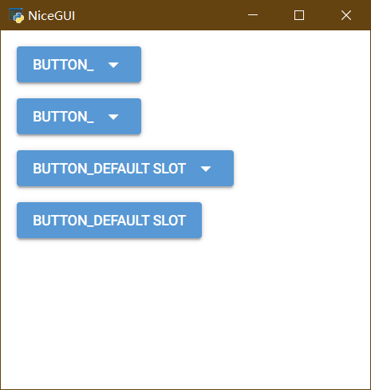
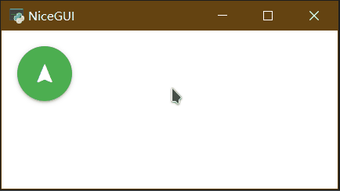
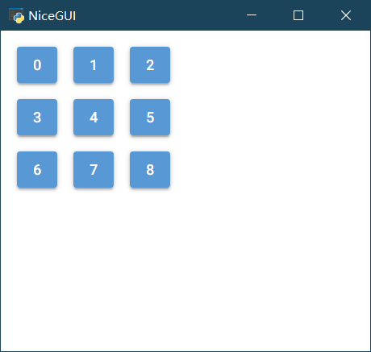

# nicegui的中文入门教程（进阶）

[TOC]

## 3 高阶技巧

NiceGUI的控件有很多，日常开发中，除了了解常用控件之外，不常用的控件也可以在学有余力的时候看看。当然，图形界面的开发不止对控件的了解，一些逻辑上的处理技巧，Python语言的特性与框架的结合，也是难免会遇到的难题。不过，不用怕，授人以鱼不如授人以渔，日常能遇到、能解决的难题，这里都有。

### 3.1 with的技巧

with可以嵌套使用，来实现类似HTML中div嵌套的效果，比如：

```python3
from nicegui import ui

with ui.element('div') as div1:
    with ui.element('div') as div2:
        ui.label('div in div')

ui.run(native=True)
```

也可以缩减一行，让代码更加紧凑：

```python3
from nicegui import ui

with ui.element('div') as div1, ui.element('div') as div2:
    ui.label('div in div')

ui.run(native=True)
```

### 3.2 slot的技巧

其实，所有的`with element`都是修改了 element 中名为`default`的slot。基于这个操作原理，可以借用`add_slot`的方法，结合`wiht`的用法，优雅、快捷地美化元素，实现复杂的布局。

比如，`ui.dropdown_button`有两个slot，`default`和`label`；其中，`default`就是默认的slot，常规方法就可以嵌入元素到弹出的下拉列表里，如果想要像修改`ui.button`一样修改`ui.dropdown_button`本身，则要修改`ui.dropdown_button`的`label`这个slot，代码如下：

```python3
from nicegui import ui

with ui.dropdown_button('button_'):
     ui.label('default slot')
#和上面的代码相同，主要是为了和下面的代码对比
with ui.dropdown_button('button_').add_slot('default'):
     ui.label('default slot')
#修改另一个slot，可以查看不同的效果
with ui.dropdown_button('button_').add_slot('label'):
     ui.label('default slot')
#可以对比 dropdown_button 和 button 的显示效果
with ui.button('button_').add_slot('default'):
     ui.label('default slot')

ui.run(native=True)
```



### 3.3 tailwindcss的技巧

不同于CSS定义中伪类在冒号之后来定义效果，在tailwindcss中，美化悬停（hover）和激活（active），需要放在冒号之前，冒号后紧随着要对状态应用的效果。比如，要实现标签背景颜色的悬停为红色、点击为黄色，代码如下：

```python3
from nicegui import ui

ui.label('label').classes('w-16 h-8 bg-green-400 hover:bg-red-400 active:bg-yellow-400')

ui.run(native=True)
```

类似的，还可以实现暗黑模式（dark）下的颜色定义，点击switch来切换暗黑模式的开关，可以看到标签在暗黑模式下的背景颜色为红色，非暗黑模式下的背景颜色为绿色，代码如下：

```python3
from nicegui import ui

ui.label('label').classes('w-16 h-8 bg-green-400 dark:bg-red-400')
dark_mode = ui.dark_mode()
switch = ui.switch('Dark Mode',on_change=lambda :dark_mode.set_value(switch.value))

ui.run(native=True)
```

在此基础上，还有一种根据屏幕宽度调整显示的技巧，就是将冒号前的单词换成代表屏幕宽度的断点`sm`、`md`、`lg`、`xl`、`2xl`。如果要让标签的宽度随窗口大小变化自适应，也就是小窗口宽度小一些，窗口越大，宽度越大，那么，代码可以这样写：

```python3
from nicegui import ui

ui.label('label').classes('w-64 h-8 bg-green-400 sm:w-8 md:w-16 lg:w-32')

ui.run(native=True)
```

然而，运行之后，可以看到上面的代码其实有问题，按照理解这样写是没错，但断点代表的含义是，大于这个屏幕宽度值才会应用这个样式，而且一次写这么多条，等屏幕宽度同时符合两条以上条件的时候，CSS就会处于竞争选择的状态，虽然样式上表现可能没问题，但规范要求应该明确断点范围，就好像写分段函数一样，必须明确区间。

所以，正确的根据屏幕宽度使用不同的样式应该这样写。使用`max-*`来表示最大到什么大小使用什么样式，使用冒号表示区间范围。于是，可以用`sm:max-md:w-16`来表示`sm`到`md`的范围内使用`w-16`的宽度样式，具体代码如下：

```python3
from nicegui import ui

ui.label('label').classes('h-8 bg-green-400 max-sm:w-8 sm:max-md:w-16 md:max-lg:w-32 lg:w-64')

ui.run(native=True)
```

### 3.4 自定义控件

#### 3.4.1 通过继承nicegui现有控件来创建新控件

在python中，可以通过继承来扩展现有类的功能，这个操作对于nicegui同样适用。

如果想要基于button实现一个可以通过点击切换颜色的按钮，可以这样做：

继承现有的控件类`ui.button`，先在`__init__`内调用父类的初始化方法；然后增加`_state`属性，默认为`False`，用于保存状态；最后定义点击事件的响应调用自身的`toggle`方法。

增加`toggle`方法，在方法内实现每次调用就翻转`_state`属性，并调用自身的`update`方法来更新显示。

重写`update`方法，先要根据`_state`属性设定button的显示颜色（动态更新`color`属性，详见Quasar提供的API），调用父类的`update`方法更新显示。

代码如下：

```python3
from nicegui import ui

class ToggleButton(ui.button):

    def __init__(self, *args, **kwargs) -> None:
        super().__init__(*args, **kwargs)
        self._state = False
        self.on('click', self.toggle)

    def toggle(self) -> None:
        """Toggle the button state."""
        self._state = not self._state
        self.update()

    def update(self) -> None:
        self.props(f'color={"green" if self._state else "red"}')
        super().update()

ToggleButton('Toggle me')

ui.run(native=True)
```


#### 3.4.2 使用Quasar的标签定义新控件

如果想要实现的功能比较复杂，但是Quasar提供了nicegui没有实现的组件，还有一种简单的方法创建新控件。

Quasar有一个浮动功能按钮[Floating Action Button](https://quasar.dev/vue-components/floating-action-button#introduction)，但nicegui没有实现。浮动功能按钮在Quasar的使用代码是：

```html
<q-fab color="green" icon="navigation" >
    <q-fab-action color="green-5" icon="train" />
    <q-fab-action color="green-5" icon="sailing" />
    <q-fab-action color="green-5" icon="rocket" />
</q-fab>
```

对应地，将HTML标签嵌套关系转换为python代码，`q-fab`标签就变成了`ui.element('q-fab')`，代码如下：

```python3
from nicegui import ui

with ui.element('q-fab').props('icon=navigation color=green'):
    ui.element('q-fab-action').props('icon=train color=green-5').on('click', lambda: ui.notify('train'))
    ui.element('q-fab-action').props('icon=sailing color=green-5').on('click', lambda: ui.notify('boat'))
    ui.element('q-fab-action').props('icon=rocket color=green-5').on('click', lambda: ui.notify('rocket'))
    
ui.run(native=True)
```



### 3.5 for循环的技巧

#### 3.5.1 用for创建多个有规律的控件

有时候，要创建多个外观一致或者有规律的控件，一个一个写代码或者复制粘贴的话，就不太pythonic了。在Python中，可以使用for来遍历迭代，同样可以使用for来创建多个外观一致或者有规律的控件。

```python3
from nicegui import ui

with ui.grid(rows=3,columns=3):
    for i in range(9):
        ui.button(i)

ui.run(native=True)
```



#### 3.5.2 与lambda组合使用时的问题

除了要创建一样的控件，还要给每个控件添加事件响应的话，每次都写一遍函数定义未免大材小用，更何况同名函数会出现覆盖，让函数名动态变化又没那么简单。这个时候Python的匿名函数——lambda表达式就派上用场了。lambda表达式可以创建语句简单的匿名函数，不必担心函数名重复的情况。比如，在下面的代码中，通过使用lambda表达式，让按钮的点击操作变成弹出一条通知。

```python3
from nicegui import ui

with ui.grid(rows=3,columns=3):
    for i in range(9):
        ui.button(i,on_click=lambda :ui.notify(i))

ui.run(native=True)
```

不过，事情并没有看上去那么简单，当写完代码开始执行的时候，才发现每个按钮的点击结果都一样，都是弹出内容为8的通知，这是为何？

原来，使用lambda表达式执行的`ui.notify(i)`，因为表达式没有绑定默认值，实际上绑定到了动态的`i`上，按钮的on_click的定义不是第一时间执行，而是在完成定义之后响应用户的操作。最终，当for完成遍历之后，动态的`i`已经被赋值为8，因此按钮的响应操作都被统一修改了。为了避免这种情况，需要修改一下lambda表达式，添加一个参数并绑定默认值：

```python3
from nicegui import ui

with ui.grid(rows=3,columns=3):
    for i in range(9):
        ui.button(i,on_click=lambda i=i:ui.notify(i))

ui.run(native=True)
```

修改之后的`lambda i=i:ui.notify(i)`中，`i=i`的意思是lambda表达式里的i变成了函数的参数i，而这个i绑定到了外部的i当时值。

当然，实际代码中不建议这样写，太容易混淆了（怕被裁员倒是可以）。

上面的代码可以再修改一下，让可读性变得更好：

```python3
from nicegui import ui

with ui.grid(rows=3, columns=3):
    for i in range(9):
        ui.button(i, on_click=lambda x=i: ui.notify(x))

ui.run(native=True)
```

#### 3.5.3 更好的for循环

为了确保批量生成之后还能访问每个控件，最好将批量生成的控件存储到列表里（不建议使用元组，没法修改；字典非必要也别用，字典的结构有点复杂，除非是列表没法实现需求）。

以下面的代码为例，使用buttons创建一个列表，在列表中用列表生成式来创建多个控件。后续如果需要修改某一个控件，就可以通过buttons来访问任意一个控件，这里是将第一个按钮隐藏。

```python3
from nicegui import ui

with ui.grid(rows=3,columns=3):
    buttons = [ui.button(i,on_click=lambda x=i:ui.notify(x)) for i in range(9)]

buttons[0].tailwind.visibility('invisible')

ui.run(native=True)
```


### 3.6 binding的技巧（更新中）

属性绑定的技巧：绑定全局变量和字典，性能优化


### 3.7 CSS选择器的技巧（更新中）

（ui.query和ui.teleport放到高阶内容）

ElementFilter，另一种选择方式，更pythonic


### 3.8 ui.add\_\* 和app.add\_\*的技巧（更新中）

（ui.add\_\* 和app.add\_\*属于高阶内容，在高阶部分讲）


### 3.9 ui.interactive_image与SVG的事件处理技巧（更新中）

在ui.interactive_image上创建SVG图形，以及处理SVG事件，


### 3.10 ui.keyboard的事件处理技巧（更新中）

完整介绍keyboard事件、组合键的识别与处理方法


### 3.11 3D场景的处理技巧（更新中）

ui.scene的完整学习


### 3.12 其他布局的使用技巧（更新中）

ui.list

ui.tabs

ui.scroll_area

ui.skeleton

ui.carousel

ui.expansion

ui.pagination

ui.stepper

ui.timeline

ui.splitter

ui.notification

ui.dialog

ui.menu 菜单内容用别的控件

ui.tooltip 上下文用其他内容

### 3.13 其他数据展示控件的使用技巧（更新中）

ui.table更多详细用法


## 4 具体示例【随时更新】

本节主要介绍常见问题，读者可以根据所属模块、函数查阅。

### 4.1 app.*

#### 4.1.1 app.shutdown

每次关闭程序都要在终端按下`Ctrl+C`，能不能在用户界面添加一个关闭整个程序的按钮？

通常情况下，nicegui程序作为一个网站，不需要关闭。但是，如果是当做桌面程序使用或者有不得不关闭的情况，让用户在终端按下`Ctrl+C`不太方便，如果程序是以无终端的方式运行，在终端按下`Ctrl+C`就更不可能。这个时候，可以调用`app.shutdown()`来关闭整个程序，代码如下：

```python3
from nicegui import ui,app

ui.button('shutdown',on_click=app.shutdown)

ui.run(native=True)
```

### 4.2 app.native

#### 4.2.1 app.native.settings

1，在native mode下，`ui.download`不能下载怎么办？

因为pywebview默认不允许网页弹出下载，需要使用`app.native.settings['ALLOW_DOWNLOADS'] = True`修改pywebview的配置，代码如下：

```python3
from nicegui import ui, app

app.native.settings['ALLOW_DOWNLOADS'] = True
ui.button("Download", on_click=lambda: ui.download(b'Demo text','demo_file.txt'))

ui.run(native=True)
```

### 4.3 ui.*

#### 4.3.1 ui.run

1，网站在标题栏的logo是NiceGUI的logo，如何指定为自己的logo？

修改`ui.run()`的默认参数`favicon`为自己logo的地址或者emoji字符`🚀`，例如：`ui.run(favicon='🚀')`。

### 4.4 ui.button

1，想要在定义之后修改button的颜色，但是`bg-*`的tailwindcss样式没有用，怎么实现？

button的默认颜色由Quasar控制，而Quasar的颜色应用使用最高优先级的`!important`，tailwindcss的颜色样式默认比这个低，所以无法成功。如果想修改颜色，可以修改button的`color`属性。或者使用`!bg-*`来强制应用。代码如下：

```python3
from nicegui import ui

ui.button('button').props('color="red-10"')
#或者强制应用tailwindcss
ui.button('button').classes('!bg-red-700')

ui.run(native=True)
```

注意：Quasar的颜色体系和tailwindcss的颜色体系不同。Quasar中，使用`color-[1-14]`来表示颜色，数字表示颜色程度，可选。tailwindcss中，使用`type-color-[50-950]`表示颜色，type为功能类别，数字表示颜色程序，可选。需要注意代码中不同方式使用的颜色体系。

2，不擅长CSS的话，怎么用ui.button实现一个 Floating Action Button？

Floating Action Button是特定最小尺寸的圆角按钮，如果熟悉CSS样式的话，可以将普通的按钮改成类似样式，但是，ui.button自带一个`fab`属性，可以一步完成，省去调整CSS的过程，代码如下：

```python3
from nicegui import ui

ui.button(icon='home', on_click=lambda: ui.notify('home')).props('fab')

ui.run(native=True)
```

3，如何实现按钮点击后才执行特定操作？

使用异步等待。

```python3
from nicegui import ui

@ui.page('/')
async def index():
    b = ui.button('Step')
    await b.clicked()
    ui.label('One')
    await b.clicked()
    ui.label('Two')
    await b.clicked()
    ui.label('Three')

ui.run()
```

### 4.5 ui.page

1，如何通过传参的形式动态修改页面内容？

使用参数注入，基于fastapi的https://fastapi.tiangolo.com/tutorial/path-params/ 和 https://fastapi.tiangolo.com/tutorial/query-params/ 或者 https://fastapi.tiangolo.com/advanced/using-request-directly/ ，可以捕获url传入的参数，并用在Python程序中。

```python3
from nicegui import ui

@ui.page('/icon/{icon}')
def icons(icon: str, amount: int = 1):
    ui.label(icon).classes('text-h3')
    with ui.row():
        [ui.icon(icon).classes('text-h3') for _ in range(amount)]
ui.link('Star', '/icon/star?amount=5')
ui.link('Home', '/icon/home')
ui.link('Water', '/icon/water_drop?amount=3')

ui.run()
```

