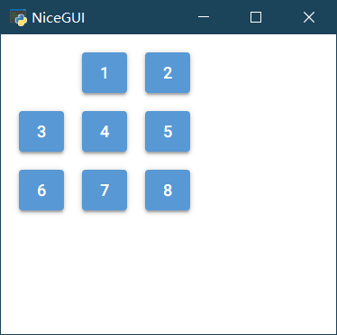

# nicegui的中文入门教程（进阶）

[TOC]

## 3 高阶技巧

NiceGUI的控件有很多，日常开发中，除了了解常用控件之外，不常用的控件也可以在学有余力的时候看看。当然，图形界面的开发不止对控件的了解，一些逻辑上的处理技巧，Python语言的特性与框架的结合，也是难免会遇到的难题。不过，不用怕，授人以鱼不如授人以渔，日常能遇到、能解决的难题，这里都有。

### 3.1 with的技巧

with可以嵌套使用，来实现类似HTML中div嵌套的效果，比如：

```python3
from nicegui import ui

with ui.element('div') as div1:
    with ui.element('div') as div2:
        ui.label('div in div')

ui.run(native=True)
```

也可以缩减一行，让代码更加紧凑：

```python3
from nicegui import ui

with ui.element('div') as div1, ui.element('div') as div2:
    ui.label('div in div')

ui.run(native=True)
```

### 3.2 slot的技巧

其实，所有的`with element`都是修改了 element 中名为`default`的slot。基于这个操作原理，可以借用`add_slot`的方法，结合`wiht`的用法，优雅、快捷地美化元素，实现复杂的布局。

比如，`ui.dropdown_button`有两个slot，`default`和`label`；其中，`default`就是默认的slot，常规方法就可以嵌入元素到弹出的下拉列表里，如果想要像修改`ui.button`一样修改`ui.dropdown_button`本身，则要修改`ui.dropdown_button`的`label`这个slot，代码如下：

```python3
from nicegui import ui

with ui.dropdown_button('button_'):
     ui.label('default slot')
#和上面的代码相同，主要是为了和下面的代码对比
with ui.dropdown_button('button_').add_slot('default'):
     ui.label('default slot')
#修改另一个slot，可以查看不同的效果
with ui.dropdown_button('button_').add_slot('label'):
     ui.label('default slot')
#可以对比 dropdown_button 和 button 的显示效果
with ui.button('button_').add_slot('default'):
     ui.label('default slot')

ui.run(native=True)
```


### 3.3 tailwindcss的技巧

不同于CSS定义中伪类在冒号之后来定义效果，在tailwindcss中，美化悬停（hover）和激活（active），需要放在冒号之前，冒号后紧随着要对状态应用的效果。比如，要实现标签背景颜色的悬停为红色、点击为黄色，代码如下：

```python3
from nicegui import ui

ui.label('label').classes('w-16 h-8 bg-green-400 hover:bg-red-400 active:bg-yellow-400')

ui.run(native=True)
```


类似的，还可以实现暗黑模式（dark）下的颜色定义，点击switch来切换暗黑模式的开关，可以看到标签在暗黑模式下的背景颜色为红色，非暗黑模式下的背景颜色为绿色，代码如下：

```python3
from nicegui import ui

ui.label('label').classes('w-16 h-8 bg-green-400 dark:bg-red-400')
dark_mode = ui.dark_mode()
switch = ui.switch('Dark Mode',on_change=lambda :dark_mode.set_value(switch.value))

ui.run(native=True)
```


在此基础上，还有一种根据屏幕宽度调整显示的技巧，就是将冒号前的单词换成代表屏幕宽度的断点`sm`、`md`、`lg`、`xl`、`2xl`。如果要让标签的宽度随窗口大小变化自适应，也就是小窗口宽度小一些，窗口越大，宽度越大，那么，代码可以这样写：

```python3
from nicegui import ui

ui.label('label').classes('w-64 h-8 bg-green-400 sm:w-8 md:w-16 lg:w-32')

ui.run(native=True)
```


然而，运行之后，可以看到上面的代码其实有问题，按照理解这样写是没错，但断点代表的含义是，大于这个屏幕宽度值才会应用这个样式，而且一次写这么多条，等屏幕宽度同时符合两条以上条件的时候，CSS就会处于竞争选择的状态，虽然样式上表现可能没问题，但规范要求应该明确断点范围，就好像写分段函数一样，必须明确区间。

所以，正确的根据屏幕宽度使用不同的样式应该这样写。使用`max-*`来表示最大到什么大小使用什么样式，使用冒号表示区间范围。于是，可以用`sm:max-md:w-16`来表示`sm`到`md`的范围内使用`w-16`的宽度样式，具体代码如下：

```python3
from nicegui import ui

ui.label('label').classes('h-8 bg-green-400 max-sm:w-8 sm:max-md:w-16 md:max-lg:w-32 lg:w-64')

ui.run(native=True)
```

### 3.4 自定义控件

#### 3.4.1 通过继承nicegui现有控件来创建新控件

在python中，可以通过继承来扩展现有类的功能，这个操作对于nicegui同样适用。

如果想要基于button实现一个可以通过点击切换颜色的按钮，可以这样做：

继承现有的控件类`ui.button`，先在`__init__`内调用父类的初始化方法；然后增加`_state`属性，默认为`False`，用于保存状态；最后定义点击事件的响应调用自身的`toggle`方法。

增加`toggle`方法，在方法内实现每次调用就翻转`_state`属性，并调用自身的`update`方法来更新显示。

重写`update`方法，先要根据`_state`属性设定button的显示颜色（动态更新`color`属性，详见Quasar提供的API），调用父类的`update`方法更新显示。

代码如下：

```python3
from nicegui import ui

class ToggleButton(ui.button):

    def __init__(self, *args, **kwargs) -> None:
        super().__init__(*args, **kwargs)
        self._state = False
        self.on('click', self.toggle)

    def toggle(self) -> None:
        """Toggle the button state."""
        self._state = not self._state
        self.update()

    def update(self) -> None:
        self.props(f'color={"green" if self._state else "red"}')
        super().update()

ToggleButton('Toggle me')

ui.run(native=True)
```


#### 3.4.2 使用Quasar的标签定义新控件

如果想要实现的功能比较复杂，但是Quasar提供了nicegui没有实现的组件，还有一种简单的方法创建新控件。

Quasar有一个浮动功能按钮[Floating Action Button](https://quasar.dev/vue-components/floating-action-button#introduction)，但nicegui没有实现。浮动功能按钮在Quasar的使用代码是：

```html
<q-fab color="green" icon="navigation" >
    <q-fab-action color="green-5" icon="train" />
    <q-fab-action color="green-5" icon="sailing" />
    <q-fab-action color="green-5" icon="rocket" />
</q-fab>
```

对应地，将HTML标签嵌套关系转换为python代码，`q-fab`标签就变成了`ui.element('q-fab')`，代码如下：

```python3
from nicegui import ui

with ui.element('q-fab').props('icon=navigation color=green'):
    ui.element('q-fab-action').props('icon=train color=green-5').on('click', lambda: ui.notify('train'))
    ui.element('q-fab-action').props('icon=sailing color=green-5').on('click', lambda: ui.notify('boat'))
    ui.element('q-fab-action').props('icon=rocket color=green-5').on('click', lambda: ui.notify('rocket'))
    
ui.run(native=True)
```


### 3.5 for循环的技巧

#### 3.5.1 用for创建多个有规律的控件

有时候，要创建多个外观一致或者有规律的控件，一个一个写代码或者复制粘贴的话，就不太pythonic了。在Python中，可以使用for来遍历迭代，同样可以使用for来创建多个外观一致或者有规律的控件。

```python3
from nicegui import ui

with ui.grid(rows=3,columns=3):
    for i in range(9):
        ui.button(i)

ui.run(native=True)
```


#### 3.5.2 与lambda组合使用时的问题

除了要创建一样的控件，还要给每个控件添加事件响应的话，每次都写一遍函数定义未免大材小用，更何况同名函数会出现覆盖，让函数名动态变化又没那么简单。这个时候Python的匿名函数——lambda表达式就派上用场了。lambda表达式可以创建语句简单的匿名函数，不必担心函数名重复的情况。比如，在下面的代码中，通过使用lambda表达式，让按钮的点击操作变成弹出一条通知。

```python3
from nicegui import ui

with ui.grid(rows=3,columns=3):
    for i in range(9):
        ui.button(i,on_click=lambda :ui.notify(i))

ui.run(native=True)
```

不过，事情并没有看上去那么简单，当写完代码开始执行的时候，才发现每个按钮的点击结果都一样，都是弹出内容为8的通知，这是为何？

原来，使用lambda表达式执行的`ui.notify(i)`，因为表达式没有绑定默认值，实际上绑定到了动态的`i`上，按钮的on_click的定义不是第一时间执行，而是在完成定义之后响应用户的操作。最终，当for完成遍历之后，动态的`i`已经被赋值为8，因此按钮的响应操作中的`i`都被统一修改了。为了避免这种情况，需要修改一下lambda表达式，添加一个参数并绑定默认值：

```python3
from nicegui import ui

with ui.grid(rows=3,columns=3):
    for i in range(9):
        ui.button(i,on_click=lambda i=i:ui.notify(i))

ui.run(native=True)
```

修改之后的`lambda i=i:ui.notify(i)`中，`i=i`的意思是lambda表达式里的i变成了函数的参数i，而这个i绑定到了外部的i当时值。

当然，实际代码中不建议这样写，太容易混淆了（怕被裁员倒是可以这样做）。

上面的代码可以再修改一下，让可读性变得更好：

```python3
from nicegui import ui

with ui.grid(rows=3, columns=3):
    for i in range(9):
        ui.button(i, on_click=lambda x=i: ui.notify(x))

ui.run(native=True)
```

#### 3.5.3 更好的for循环

为了确保批量生成之后还能访问每个控件，最好将批量生成的控件存储到列表里（不建议使用元组，没法修改；字典非必要也别用，字典的结构有点复杂，除非是列表没法实现需求）。

以下面的代码为例，使用buttons创建一个列表，在列表中用列表生成式来创建多个控件。后续如果需要修改某一个控件，就可以通过buttons来访问任意一个控件，这里是将第一个按钮隐藏。

```python3
from nicegui import ui

with ui.grid(rows=3,columns=3):
    buttons = [ui.button(i,on_click=lambda x=i:ui.notify(x)) for i in range(9)]

buttons[0].tailwind.visibility('invisible')

ui.run(native=True)
```



### 3.6 binding的技巧

#### 3.6.1 绑定到字典

在入门基础里提到的binding只介绍如何绑定两个控件，其实，binding除了绑定另一个控件，还支持绑定字典。绑定控件时，`target_object`是控件对象，这里则换成字典对象；`target_name`是控件对象的属性名，这里则换成字典的key，于是，就有了以下代码：

```python3
from nicegui import ui

data = {'name': 'Bob', 'age': 17}

ui.label().bind_text_from(data, 'name', backward=lambda n: f'Name: {n}')
ui.label().bind_text_from(data, 'age', backward=lambda a: f'Age: {a}')

ui.input(label='name:').bind_value(data,'name')
ui.number(label='age:').bind_value(data,'age',forward=lambda x:int(x))

ui.run(native=True)
```


要注意的是，ui.number的值输出为小数，如果不增加`forward=lambda x:int(x)`的话，`data['age']`会被修改为小数，而不是整数。同理，ui.input的值输出为字符串，如果字典输入不是字符串的话，在输出时需要转换。

#### 3.6.2 绑定到全局变量

还是上一节的代码，假如有人说：“字典还是有点复杂，能不能绑定到一个简单的变量上？”

怎么办？

也就是说，data字典没有了，取而代之的是：

```python3
name = 'Bob'
age = 17
```

其实也简单，只要将`data`换成`globals()`即可：

```python3
from nicegui import ui

name = 'Bob'
age = 17

ui.label().bind_text_from(globals(), 'name', backward=lambda n: f'Name: {n}')
ui.label().bind_text_from(globals(), 'age', backward=lambda a: f'Age: {a}')

ui.input(label='name:').bind_value(globals(), 'name')
ui.number(label='age:').bind_value(globals(), 'age', forward=lambda x: int(x))

ui.run(native=True)
```

任何在py文件内定义的全局变量，都会成为全局变量字典的一个键值，可以使用`globals()`访问全局变量字典。

#### 3.6.3 性能优化

在NiceGUI中有两种类型的绑定：

1.   "Bindable properties" （可绑定属性）会自动检测写入访问并触发值变动传播。大多数 NiceGUI 元素使用这种可绑定属性，例如`ui.input`的`value`或 `ui.label`的`text`。基本上所有带有`bind()`方法的属性都支持这种类型的绑定。
2.   另一种绑定"active links"（活动链接）不会自动检测写入访问并触发值变动传播。如果将标签文本绑定到字典或自定义数据模型的属性，NiceGUI 的绑定模块则需要主动检查值是否发生变化。这个主动检查是通过每 0.1 秒运行一次`refresh_loop()`来完成。主动检查间隔可以通过设置`ui.run()`的参数`binding_refresh_interval`来修改。

可绑定属性非常高效，只要值不变，就不会产生任何性能开销（相对而言比较小而已）。但活动链接需要每秒检查所有绑定值10 次。这可能会消耗比较多的性能，尤其是活动链接的绑定关系非常复杂、非常多的时候。

因为不能让主线程阻塞太久，所以如果太多主动检查导致运行`refresh_loop()`的耗时过长，程序会发出警告。当然，可以配置阈值`binding.MAX_PROPAGATION_TIME`（默认为 0.01 秒）来消除警告。但是，这个警告是有意义的，是在告诉开发者性能可能存在问题。比如，CPU在更新绑定花费太长时间的话，主线程就没法做别的事情，程序界面会因此卡住。

为了避免性能出问题，需要将活动链接改为可绑定属性之间的绑定，需要使用`binding.BindableProperty()`来创建可绑定属性。于是，基于第一小节的代码，将字典改为数据类，在数据类中定义两个可绑定属性，控件的绑定改为与数据类对象的绑定。代码如下：

```python3
from nicegui import ui, binding

class data_base:
    name = binding.BindableProperty()
    age = binding.BindableProperty()
    def __init__(self) -> None:
        self.name = 'Bob'
        self.age = 17

data =data_base()

ui.label().bind_text_from(data, 'name', backward=lambda n: f'Name: {n}')
ui.label().bind_text_from(data, 'age', backward=lambda a: f'Age: {a}')

ui.input(label='name:').bind_value(data,'name')
ui.number(label='age:').bind_value(data,'age',forward=lambda x:int(x))

ui.run(native=True)
```

因为代码中的绑定数量很少，因此差异不大，如果将绑定数量放大百倍，就能看出两种绑定的性能差异。

### 3.7 app.storage的技巧

有时候，网页上不同页面、用户需要存储、共享特定数据，依靠自己编程实现的话确实麻烦。好在NiceGUI提供了一种简单有效的数据存储功能，那就是`app.storage`（存储）。 存储有5个子字典，分别对应着不同的空间，有不同的应用范围：

-   `app.storage.tab`：存储在服务器的内存中，此字典对于每个选项卡、会话都是唯一的，可以存储任意对象。需要注意的是，在实现 https://github.com/zauberzeug/nicegui/discussions/2841 之前，重启服务器会导致此字典的数据丢失。此外，此字典只能在仅在[`ui.page`](https://nicegui.io/documentation/page)中使用，并且需要等待客户端建立连接（确保读写此字典的操作在异步函数内的 [`await ui.context.client.connected()`](https://nicegui.io/documentation/page#wait_for_client_connection)之后）。
-   `app.storage.client`：该字典也存储在服务器的内存中，对于每个客户端连接都是唯一的，并且可以存储任意对象。当页面重新加载或用户导航到另一个页面时，数据将被销毁。不同于能在服务器上保存数据好几天的`app.storage.tab`，`app.storage.client`更适合缓存频繁使用、一次性的数据。比如，需要动态更新的数据或者数据库连接，但希望在用户离开页面或关闭浏览器时立即销毁。同样的，这个字典只能在[`ui.page`](https://nicegui.io/documentation/page)中使用。
-   `app.storage.user`：存储在服务器磁盘中，每个字典都与浏览器cookie中保存的唯一标识符相关联，换句话说，此字典对于每个用户都是唯一的，并与浏览器的其他选项卡共享。可以通过存储在`app.storage.browser['id']`的标识符识别用户、会话。同样的，这个字典只能在[`ui.page`](https://nicegui.io/documentation/page)中使用。此外，这个字典需要设置`ui.run()`的`storage_secret`参数来签名浏览器会话cookie。
-   `app.storage.general`：该字典也存储在服务器磁盘中，提供了所有用户都可以访问的共享存储空间。
-   `app.storage.browser`：与前几个字典不同，此字典直接存储为浏览器会话cookie，在同一用户的所有浏览器选项卡之间共享。虽然很多方面看起来很像`app.storage.user`，不过，`app.storage.user`因为其在减少数据负载、增强安全性和提供更大存储容量方面的优势，在实际使用中比`app.storage.browser`更受欢迎。默认情况下，NiceGUI会在`app.storage.browser['id']`中为每个浏览器会话保留一个唯一标识符。同样的，这个字典只能在[`ui.page`](https://nicegui.io/documentation/page)中使用。此外，这个字典需要设置`ui.run()`的`storage_secret`参数来签名浏览器会话cookie。

如果因为上述介绍看起来不够直观，而在选用存储字典时候头疼，可以参考下面的对比表格快速选用（✅表示是，❌表示否）：

| 存储的子字典                     |   `tab`    |  `client`  |   `user`   | `general`  | `browser` |
| :------------------------------- | :--------: | :--------: | :--------: | :--------: | :-------: |
| 存储位置                         | 服务器内存 | 服务器内存 | 服务器磁盘 | 服务器磁盘 |  浏览器   |
| 是否在不同选项卡之间共享         |     ❌      |     ❌      |     ✅      |     ✅      |     ✅     |
| 是否在不同浏览器客户端之间共享   |     ❌      |     ❌      |     ❌      |     ✅      |     ❌     |
| 是否在服务器重启后保留数据       |     ❌      |     ❌      |     ❌      |     ✅      |     ❌     |
| 是否在页面重载后保留数据         |     ✅      |     ❌      |     ✅      |     ✅      |     ✅     |
| 是否只能用在ui.page内            |     ✅      |     ✅      |     ✅      |     ❌      |     ✅     |
| 是否需要客户端建立连接           |     ✅      |     ❌      |     ❌      |     ❌      |     ❌     |
| 是否只能在响应之前写入           |     ❌      |     ❌      |     ❌      |     ❌      |     ✅     |
| 是否要求数据可序列化             |     ❌      |     ❌      |     ✅      |     ✅      |     ✅     |
| 是否需要设置`storage_secret`参数 |     ❌      |     ❌      |     ✅      |     ❌      |     ✅     |

下面是个使用存储字典的简单例子：

```python3
from nicegui import app, ui

@ui.page('/')
def index():
    app.storage.user['count'] = app.storage.user.get('count', 0) + 1
    with ui.row():
       ui.label('your own page visits:')
       ui.label().bind_text_from(app.storage.user, 'count')

ui.run(storage_secret='private_key')
```

默认数据是以无缩进的JSON格式存储在`app.storage.user` 和`app.storage.general`中，可以将`app.storage.user.indent`、`app.storage.general.indent`设置为`True`来让对应存储字典的数据采用2个空格的缩进格式。

### 3.8 修改指定元素的技巧

在CSS中，有个非常重要的概念叫选择器。

每一条css样式定义由两部分组成，形式如下：

 ```css
 选择器{样式}
 ```

在{}之前的部分就是“选择器”。 “选择器”指明了{}中的“样式”的作用对象，也就是“样式”作用于网页中的哪些元素。

选择器有一套自己的[语法规则](https://developer.mozilla.org/en-US/docs/Learn/CSS/Building_blocks/Selectors)，通过合理设置选择器的规则，可以很精准地选择指定元素。

NiceGUI简化了不少CSS上的操作，但不代表不需要CSS的基础。如果读者掌握了CSS的选择器，与ui.query和ui.teleport结合使用，那就如同得到了屠龙宝刀，操作界面布局、美化界面将更加得心应手。

注意，前两小节要求读者具备CSS选择器基础，没有相应基础的读者可以搁置前两小节，直接看第三小节。

#### 3.8.1 ui.query

前面讲过如何美化控件，即在控件定义时使用props、classes、style等方法美化控件，也可以在控件定义好之后，通过给定的变量名调用相应方法。但是，如果想要美化的控件、元素根本就不是定义出来的，而是框架带出来的，想要美化就有点麻烦。当然，直接修改内置样式、源码很直观，但麻烦。要是有种方法能让想要修改的内容就像被定义为变量一样，后续直接使用，那就方便不少。正巧，ui.query就有这样的功能。

ui.query只有一个字符串类型参数`selector`，顾名思义，就是前面提到的选择器。通过给ui.query传入选择器语法，ui.query将返回CSS选择器能够选择的元素，后续可以直接对该元素执行样式美化的方法。

下面的代码就是使用ui.query选择了body（网页的主体），并设置body的背景颜色：

```python3
from nicegui import ui

body = ui.query(selector='body')
body.classes('bg-blue-400')

ui.run(native=True)
```


ui.query的用法很简单，难点在于确定CSS选择器的写法，这一部分属于CSS基础知识，这里就不再赘述，有能力的读者可以抽时间深入学习CSS选择器的语法。

#### 3.8.2 ui.teleport

肯定有读者在学了ui.query美化指定元素之后，突发奇想，想要给指定元素内部添加控件，比如，下面的代码：

```python3
from nicegui import ui

markdown = ui.markdown('Enter your **name**!')
with ui.query(f'#c{markdown.id} strong'):
    ui.input('name').classes('inline-flex').props('dense outlined')

ui.run(native=True)
```

然而，这段代码并不能成功运行，因为ui.query并不支持add_slot。如果想要实现类似效果，只需将ui.query换成ui.teleport即可，不过传递的参数名不是`selector`，而是`to`：

```python3
from nicegui import ui

markdown = ui.markdown('Enter your **name**!')
with ui.teleport(to=f'#c{markdown.id} strong'):
    ui.input('name').classes('inline-flex').props('dense outlined')

ui.run(native=True)
```


ui.teleport就是这样一个基于CSS选择器语法将任意控件传送至指定位置的控件。

#### 3.8.3 ElementFilter

暂时不会CSS选择器语法的读者也不用着急，尽管CSS选择器语法很强大，但在Python中不够直观，想要快速确定选择器还要去网页中开启调试模式。好在NiceGUI提供了另一种不需要CSS选择器的定位指定元素工具，那就是ElementFilter。

ElementFilter和ui模块同级，使用`from nicegui import ElementFilter`来导入。

ElementFilter的功能等于ui.query加ui.teleport，既能设置指定元素的样式，又能将控件传送到指定位置。但与ui.query和ui.teleport使用CSS选择器语法不同，ElementFilter的筛选方式更Pythonic，更直观，更契合python编程习惯。

以下代码是用于匹配的模板内容，以下面的代码为例，分别看看ElementFilter不同参数、方法的用途：

```python3
from nicegui import ui,ElementFilter

with ui.card():
    ui.button('button A')
    ui.label('label A_A')
    ui.label('label A_B')

with ui.card():
    ui.button('button B')
    ui.label('label B_A')
    ui.label('label B_B')

ui.run(native=True)
```

##### 3.8.3.1 初始化方法

ElementFilter是一个类，需要初始化为对象实例才能使用。ElementFilter的初始化方法有四个参数，分别是 `kind` 、`marker` 、`content` 、`local_scope`。

`kind`参数，NiceGUI的ui类型，表示筛选什么类型的控件。比如，在下面的代码中，传入的参数是`ui.label`，ElementFilter就会筛选ui.label，这样给ElementFilter对象设置背景颜色为红色的时候，页面内所有的ui.label的背景颜色就相应变成红色。

```python3
from nicegui import ui,ElementFilter

with ui.card():
    ui.button('button A')
    ui.label('label A_A')
    ui.label('label A_B')

with ui.card():
    ui.button('button B')
    ui.label('label B_A')
    ui.label('label B_B')

ElementFilter(kind=ui.label).classes('bg-red')

ui.run(native=True)
```


`marker`参数，字符串类型或者字符串列表类型，表示筛选包含指定mark或者指定mark列表的对象。

在此，需要额外介绍一下控件的mark方法，也就是如何给控件添加marker。对于每一个ui控件，都可以通过mark方法定义一组marker，用于ElementFilter的筛选。mark方法的参数是一个支持解包、分解的字符串类型参数`markers`。也就是说，传入`'A'` 、`'A','B','AB'`、`'B A BA'`、`'A','B BA'`都是可以的。本质上说，mark方法就是将传入的字符串转换为该对象的`_markers`列表。对于`'A','B','AB'`这样多个字符串，该方法会转化为`['B','A','AB']`这样的列表来使用。对于`'B A BA'`这样用空格划分的字符串，该方法会自动以空格为分隔符分解为`['B','A','BA']`这样的列表来使用。当然，两种方法混用也没问题，`'A','B BA'`这样的多个字符串，则会转化为`['A','B','BA']`这样的列表。注意，虽然mark方法支持串联、重复使用，但最好不要这样做，因为后执行的mark会覆盖先前mark方法的结果，如果是想清除之前的marker，倒是可以重复执行。

说完给控件添加marker，下面回归正题，说说如何筛选。`marker`参数和mark方法的`markers`参数类似，只不过`marker`参数没有解包过程，想要传入多个字符串，只能使用字符串列表。与mark方法的宽松不同，`marker`参数的要求比较严格，要么是纯字符串，带空格的会自动划分、转化为列表，要么是无空格的字符串组成列表，不支持正确解析内含带空格的字符串列表，所以，只有以下格式才是正确的用法：`'A'` 、`['A','B','AB']`、`'B A BA'`。

代码示例如下：

```python3
from nicegui import ui,ElementFilter

with ui.card():
    ui.button('button A')
    ui.label('label A_A').mark('A')
    ui.label('label A_B').mark('A','B','AB')

with ui.card():
    ui.button('button B')
    ui.label('label B_B').mark('B')
    ui.label('label B_A').mark('B A BA')
    
ElementFilter(marker='BA').classes('bg-red')
#ElementFilter(marker='A B').classes('bg-red')
#ElementFilter(marker=['A','B']).classes('bg-red')

ui.run(native=True)
```


`content`参数，字符串类型或者字符串列表类型，表示筛选包含指定内容的对象。筛选范围包括对象的value、text、label、icon、placeholder等文本属性。匹配要求完全包含指定字符串或者字符串列表。

```python3
from nicegui import ui,ElementFilter

with ui.card():
    ui.button('button A')
    ui.label('label A_A').mark('A')
    ui.label('label A_B').mark('A','B','AB')

with ui.card():
    ui.button('button B')
    ui.label('label B_B').mark('B')
    ui.label('label B_A').mark('B A BA')
    
ElementFilter(content=['B','A']).classes('bg-red')

ui.run(native=True)
```


`local_scope`参数，布尔类型，表示ElementFilter匹配当前范围还是全局，默认为`False`，即匹配全局。如果设置为`True`，则只匹配当前上下文。可以看以下代码，修改了缩进并将此参数设置为`True`，ElementFilter对象就只能匹配同一缩进内的控件：

```python3
from nicegui import ui,ElementFilter

with ui.card():
    ui.button('button A')
    ui.label('label A_A').mark('A')
    ui.label('label A_B').mark('A','B','AB')

with ui.card():
    ui.button('button B')
    ui.label('label B_B').mark('B')
    ui.label('label B_A').mark('B A BA')
    ElementFilter(content=['B','A'],local_scope=True).classes('bg-red')

ui.run(native=True)
```


##### 3.8.3.2 `within`方法和`not_within`方法

顾名思义，这两个方法就是在ElementFilter初始化参数的筛选范围内进一步筛选指定的父级对象，得到在指定的父级对象上下文之内、不在指定的父级对象上下文之内的对象。对`within`方法而言，会得到符合该方法匹配条件的对象。对`not_within`方法而言，会排除符合该方法匹配条件的对象

两个方法的参数都一样，都是三个，分别是`kind`、`marker`、`instance`。

`kind`和`marker`与初始化方法的参数一样，这里不再赘述。只是，这里的`marker`不支持字符串列表。

`instance`参数，对象或者对象列表，指定具体对象的范围内是否筛选。以 `within`方法为例，给此参数传递具体对象，ElementFilter将只筛选在该对象之内的ui.label：

```python3
from nicegui import ui,ElementFilter

with ui.card() as card1:
    ui.button('button A')
    ui.label('label A_A').mark('A')
    ui.label('label A_B').mark('A','B','AB')

with ui.card() as card2:
    ui.button('button B')
    ui.label('label B_B').mark('B')
    ui.label('label B_A').mark('B A BA')

ElementFilter(kind=ui.label).within(instance=card2).classes('bg-red')

ui.run(native=True)
```


这两个方法支持串联调用，不过串联就和传递列表给参数一样，是扩展了对应筛选条件的内部列表。对于这两种筛选条件的内部列表，匹配规则是不一样的：对于`within`方法，筛选则是要求列表内元素全部匹配；对于`not_within`方法，筛选则是要求列表内元素任意一个匹配。

##### 3.8.3.3 `exclude`方法

该方法是在ElementFilter初始化参数的筛选范围内进一步排除指定的对象。

该方法有三个参数，`kind` 、`marker` 、`content` ，同初始化方法的参数一样，这里简单说一下示例代码，不做详解。不过，该方法的三个参数不支持传入列表，`marker`也不支持根据空格自动划分字符串，这一点需要注意。

```python3
from nicegui import ui,ElementFilter
from nicegui.elements.mixins.text_element import TextElement

with ui.card() as card1:
    ui.button('button A')
    ui.label('label A_A').mark('A')
    ui.label('label A_B').mark('A','B','AB')

with ui.card() as card2:
    ui.button('button B')
    ui.label('label B_B').mark('B')
    ui.label('label B_A').mark('B A BA')

ElementFilter(kind=TextElement).exclude(kind=ui.label).classes('bg-red')

ui.run(native=True)
```


ui.label和ui.button都继承了TextElement，因此匹配TextElement会同时匹配到这两种控件，因此，在exclude方法中指定kind为ui.label之后，匹配结果就排除了ui.label，只有ui.button的颜色变成红色。

##### 3.8.3.4 传送控件到匹配结果

对于ElementFilter，想要传送控件到结果也很简单，只需遍历ElementFilter对象，就能获取匹配结果。

如下面代码所示，使用for遍历ElementFilter对象，使用with进入每个元素的上下文，就和正常添加控件到对应slot一样：

```python3
from nicegui import ui,ElementFilter
from nicegui.elements.mixins.text_element import TextElement

with ui.card() as card1:
    ui.button('button A')
    ui.label('label A_A').mark('A')
    ui.label('label A_B').mark('A','B','AB')

with ui.card() as card2:
    ui.button('button B')
    ui.label('label B_B').mark('B')
    ui.label('label B_A').mark('B A BA')

for ele in ElementFilter(kind=TextElement).exclude(kind=ui.label).classes('bg-red'):
    with ele:
        ui.icon('home')

ui.run(native=True)
```


##### 3.8.3.5 总结

ElementFilter的方法、参数不多，但用法不统一，要是组合使用，需要一些时间思考其匹配模式。而有的读者看到文字太多就头疼，没关系，这里将上面的内容简化为一个表格方便查阅。详细看过一遍文字教程之后，后续开发中再次遇到，可以快速参阅表格来确定匹配模式。

对应参数的匹配模式：

| ElementFilter的方法 | `__init__` | `within` | `not_within` | `exclude` |
| ------------------- | ---------- | -------- | ------------ | --------- |
| `kind`参数          | 任意一个   | 全部匹配 | 任意一个     | 任意一个  |
| `content`参数       | 全部匹配   | 无此参数 | 无此参数     | 任意一个  |
| `instance`参数      | 无此参数   | 全部匹配 | 任意一个     | 无此参数  |
| `marker`参数        | 全部匹配   | 全部匹配 | 任意一个     | 任意一个  |

Match type for parameters in ElementFilter's method:

| ElementFilter's method | `__init__` | `within` | `not_within` | `exclude` |
| ---------------------- | ---------- | -------- | ------------ | --------- |
| parameter `kind`       | any/or     | all/and  | any/or       | any/or    |
| parameter `content`    | all/and    | ----     | ----         | any/or    |
| parameter `instance`   | ----       | all/and  | any/or       | ----      |
| parameter `marker`     | all/and    | all/and  | any/or       | any/or    |

另外，对于NiceGUI2.1版本的ElementFilter部分方法参数不支持列表传入，这里特地补丁了一份模块文件，有需要的读者可以自行替换，文件的具体路径为`.venv\Lib\site-packages\nicegui\element_filter.py`，如果是全局环境的Python，路径为`{Python执可执行文件所在目录}\Lib\site-packages\nicegui\element_filter.py`

```python3
from __future__ import annotations

from typing import Generic, Iterator, List, Optional, Type, TypeVar, Union, overload

from typing_extensions import Self

from .context import context
from .element import Element
from .elements.mixins.content_element import ContentElement
from .elements.mixins.source_element import SourceElement
from .elements.mixins.text_element import TextElement
from .elements.notification import Notification
from .elements.select import Select

T = TypeVar('T', bound=Element)


class ElementFilter(Generic[T]):
    DEFAULT_LOCAL_SCOPE = False

    @overload
    def __init__(self: ElementFilter[Element], *,
                 marker: Union[str, List[str], None] = None,
                 content: Union[str, List[str], None] = None,
                 local_scope: bool = DEFAULT_LOCAL_SCOPE,
                 ) -> None:
        ...

    @overload
    def __init__(self, *,
                 kind: Union[Type[T], List[Type[T]], None] = None,
                 marker: Union[str, List[str], None] = None,
                 content: Union[str, List[str], None] = None,
                 local_scope: bool = DEFAULT_LOCAL_SCOPE,
                 ) -> None:
        ...

    def __init__(self, *,
                 kind: Union[Type[T], List[Type[T]], None] = None,
                 marker: Union[str, List[str], None] = None,
                 content: Union[str, List[str], None] = None,
                 local_scope: bool = DEFAULT_LOCAL_SCOPE,
                 ) -> None:
        """ElementFilter

        Sometimes it is handy to search the Python element tree of the current page.
        ``ElementFilter()`` allows powerful filtering by kind of elements, markers and content.
        It also provides a fluent interface to apply more filters like excluding elements or filtering for elements within a specific parent.
        The filter can be used as an iterator to iterate over the found elements and is always applied while iterating and not when being instantiated.

        And element is yielded if it matches all of the following conditions:

        - The element is of the specified kind (if specified).
        - The element is none of the excluded kinds.
        - The element has all of the specified markers.
        - The element has none of the excluded markers.
        - The element contains all of the specified content.
        - The element contains none of the excluded content.

        - Its ancestors include all of the specified instances defined via ``within``.
        - Its ancestors include none of the specified instances defined via ``not_within``.
        - Its ancestors include all of the specified kinds defined via ``within``.
        - Its ancestors include none of the specified kinds defined via ``not_within``.
        - Its ancestors include all of the specified markers defined via ``within``.
        - Its ancestors include none of the specified markers defined via ``not_within``.

        Element "content" includes its text, label, icon, placeholder, value, message, content, source.
        Partial matches like "Hello" in "Hello World!" are sufficient for content filtering.
        
        :param kind: filter by element type; the iterator will be of type ``kind``
        :param marker: filter by element markers; can be a list of strings or a single string where markers are separated by whitespace
        :param content: filter for elements which contain ``content`` in one of their content attributes like ``.text``, ``.value``, ``.source``, ...; can be a singe string or a list of strings which all must match
        :param local_scope: if `True`, only elements within the current scope are returned; by default the whole page is searched (this default behavior can be changed with ``ElementFilter.DEFAULT_LOCAL_SCOPE = True``)
        """
        self._kind = kind if isinstance(kind, list) else ([kind] if kind else [])
        self._markers = marker.split() if isinstance(marker, str) else [word for single_marker in (marker or []) for word in single_marker.split()]
        self._contents = [content] if isinstance(content, str) else content or []

        self._within_kinds: List[Type[Element]] = []
        self._within_instances: List[Element] = []
        self._within_markers: List[str] = []

        self._not_within_kinds: List[Type[Element]] = []
        self._not_within_instances: List[Element] = []
        self._not_within_markers: List[str] = []

        self._exclude_kinds: List[Type[Element]] = []
        self._exclude_markers: List[str] = []
        self._exclude_content: List[str] = []

        self._scope = context.slot.parent if local_scope else context.client.layout

    def __iter__(self) -> Iterator[T]:
        for element in self._scope.descendants():
            if self._kind and not isinstance(element, tuple(self._kind)):
                continue
            if self._exclude_kinds and isinstance(element, tuple(self._exclude_kinds)):
                continue

            if any(marker not in element._markers for marker in self._markers):
                continue
            if any(marker in element._markers for marker in self._exclude_markers):
                continue

            if self._contents or self._exclude_content:
                element_contents = [content for content in (
                    element.props.get('text'),
                    element.props.get('label'),
                    element.props.get('icon'),
                    element.props.get('placeholder'),
                    element.props.get('value'),
                    element.text if isinstance(element, TextElement) else None,
                    element.content if isinstance(element, ContentElement) else None,
                    element.source if isinstance(element, SourceElement) else None,
                ) if content]
                if isinstance(element, Notification):
                    element_contents.append(element.message)
                if isinstance(element, Select):
                    options = {option['value']: option['label'] for option in element.props.get('options', [])}
                    element_contents.append(options.get(element.value, ''))
                    if element.is_showing_popup:
                        element_contents.extend(options.values())
                if any(all(needle not in str(haystack) for haystack in element_contents) for needle in self._contents):
                    continue
                if any(needle in str(haystack) for haystack in element_contents for needle in self._exclude_content):
                    continue

            ancestors = set(element.ancestors())
            if self._within_instances and not ancestors.issuperset(self._within_instances):
                continue
            if self._not_within_instances and not ancestors.isdisjoint(self._not_within_instances):
                continue
            if self._within_kinds and not all(any(isinstance(ancestor, kind) for ancestor in ancestors) for kind in self._within_kinds):
                continue
            if self._not_within_kinds and any(isinstance(ancestor, tuple(self._not_within_kinds)) for ancestor in ancestors):
                continue
            ancestor_markers = {marker for ancestor in ancestors for marker in ancestor._markers}
            if self._within_markers and not ancestor_markers.issuperset(self._within_markers):
                continue
            if self._not_within_markers and not ancestor_markers.isdisjoint(self._not_within_markers):
                continue

            yield element  # type: ignore

    def within(self, *,
               kind: Union[Element, List[Element], None] = None,
               marker: Union[str, List[str], None] = None,
               instance: Union[Element, List[Element], None] = None,
               ) -> Self:
        """Filter elements which have a specific match in the parent hierarchy."""
        if kind is not None:
            if isinstance(kind, list):
                for every_kind in kind:
                    assert issubclass(every_kind, Element)
                self._within_kinds.extend(kind)
            else:    
                assert issubclass(kind, Element)
                self._within_kinds.append(kind)
        if marker is not None:
            markers = marker.split() if isinstance(marker, str) else [word for single_marker in marker for word in single_marker.split()]
            self._within_markers.extend(markers)
        if instance is not None:
            self._within_instances.extend(instance if isinstance(instance, list) else [instance])
        return self

    def exclude(self, *,
                kind: Union[Element, List[Element], None] = None,
                marker: Union[str, List[str], None] = None,
                content: Union[str, List[str], None] = None,
                ) -> Self:
        """Exclude elements with specific element type, marker or content."""
        if kind is not None:
            if isinstance(kind, list):
                for every_kind in kind:
                    assert issubclass(every_kind, Element)
                self._exclude_kinds.extend(kind)
            else:    
                assert issubclass(kind, Element)
                self._exclude_kinds.append(kind)
        if marker is not None:
            markers = marker.split() if isinstance(marker, str) else [word for single_marker in marker for word in single_marker.split()]
            self._exclude_markers.extend(markers)
        if content is not None:
            self._exclude_content.extend([content] if isinstance(content, str) else content)
        return self

    def not_within(self, *,
                   kind: Union[Element, List[Element], None] = None,
                   marker: Union[str, List[str], None] = None,
                   instance: Union[Element, List[Element], None] = None,
                   ) -> Self:
        """Exclude elements which have a parent of a specific type or marker."""
        if kind is not None:
            if isinstance(kind, list):
                for every_kind in kind:
                    assert issubclass(every_kind, Element)
                self._not_within_kinds.extend(kind)
            else:    
                assert issubclass(kind, Element)
                self._not_within_kinds.append(kind)
        if marker is not None:
            markers = marker.split() if isinstance(marker, str) else [word for single_marker in marker for word in single_marker.split()]
            self._not_within_markers.extend(markers)
        if instance is not None:
            self._not_within_instances.extend(instance if isinstance(instance, list) else [instance])
        return self

    def classes(self, add: Optional[str] = None, *, remove: Optional[str] = None, replace: Optional[str] = None) -> Self:
        """Apply, remove, or replace HTML classes.

        This allows modifying the look of the element or its layout using `Tailwind <https://tailwindcss.com/>`_ or `Quasar <https://quasar.dev/>`_ classes.

        Removing or replacing classes can be helpful if predefined classes are not desired.

        :param add: whitespace-delimited string of classes
        :param remove: whitespace-delimited string of classes to remove from the element
        :param replace: whitespace-delimited string of classes to use instead of existing ones
        """
        for element in self:
            element.classes(add, remove=remove, replace=replace)
        return self

    def style(self, add: Optional[str] = None, *, remove: Optional[str] = None, replace: Optional[str] = None) -> Self:
        """Apply, remove, or replace CSS definitions.

        Removing or replacing styles can be helpful if the predefined style is not desired.

        :param add: semicolon-separated list of styles to add to the element
        :param remove: semicolon-separated list of styles to remove from the element
        :param replace: semicolon-separated list of styles to use instead of existing ones
        """
        for element in self:
            element.style(add, remove=remove, replace=replace)
        return self

    def props(self, add: Optional[str] = None, *, remove: Optional[str] = None) -> Self:
        """Add or remove props.

        This allows modifying the look of the element or its layout using `Quasar <https://quasar.dev/>`_ props.
        Since props are simply applied as HTML attributes, they can be used with any HTML element.

        Boolean properties are assumed ``True`` if no value is specified.

        :param add: whitespace-delimited list of either boolean values or key=value pair to add
        :param remove: whitespace-delimited list of property keys to remove
        """
        for element in self:
            element.props(add, remove=remove)
        return self

```


### 3.9 ui.add\_\* 和app.add\_\*的技巧（更新中）


（ui.add\_\* 和app.add\_\*属于高阶内容，在高阶部分讲）


3.   10ui.interactive_image与SVG的事件处理技巧（更新中）

在ui.interactive_image上创建SVG图形，以及处理SVG事件，


3.11 ui.keyboard的事件处理技巧（更新中）

完整介绍keyboard事件、组合键的识别与处理方法


3.12 其他布局的使用技巧（更新中）

ui.list

ui.tabs

ui.scroll_area

ui.skeleton

ui.carousel

ui.expansion

ui.pagination

ui.stepper

ui.timeline

ui.splitter

ui.notification

ui.dialog

ui.menu 菜单内容用别的控件

ui.tooltip 上下文用其他内容


3.13 其他数据展示控件的使用技巧（更新中）

ui.table完整学习

以及其他数据展示控件的完整学习


3.14 3D场景的处理技巧（更新中）

ui.scene完整学习


## 4 具体示例【随时更新】

本节主要介绍常见问题，读者可以根据所属模块、函数查阅。

### 4.1 app.*

#### 4.1.1 app.shutdown

每次关闭程序都要在终端按下`Ctrl+C`，能不能在用户界面添加一个关闭整个程序的按钮？

通常情况下，nicegui程序作为一个网站，不需要关闭。但是，如果是当做桌面程序使用或者有不得不关闭的情况，让用户在终端按下`Ctrl+C`不太方便，如果程序是以无终端的方式运行，在终端按下`Ctrl+C`就更不可能。这个时候，可以调用`app.shutdown()`来关闭整个程序，代码如下：

```python3
from nicegui import ui,app

ui.button('shutdown',on_click=app.shutdown)

ui.run(native=True)
```

### 4.2 app.native

#### 4.2.1 app.native.settings

1，在native mode下，`ui.download`不能下载怎么办？

因为pywebview默认不允许网页弹出下载，需要使用`app.native.settings['ALLOW_DOWNLOADS'] = True`修改pywebview的配置，代码如下：

```python3
from nicegui import ui, app

app.native.settings['ALLOW_DOWNLOADS'] = True
ui.button("Download", on_click=lambda: ui.download(b'Demo text','demo_file.txt'))

ui.run(native=True)
```

### 4.3 ui.*

#### 4.3.1 ui.run

1，网站在标题栏的logo是NiceGUI的logo，如何指定为自己的logo？

修改`ui.run()`的默认参数`favicon`为自己logo的地址或者emoji字符`🚀`，例如：`ui.run(favicon='🚀')`。

### 4.4 ui.button

1，想要在定义之后修改button的颜色，但是`bg-*`的tailwindcss样式没有用，怎么实现？

button的默认颜色由Quasar控制，而Quasar的颜色应用使用最高优先级的`!important`，tailwindcss的颜色样式默认比这个低，所以无法成功。如果想修改颜色，可以修改button的`color`属性。或者使用`!bg-*`来强制应用。代码如下：

```python3
from nicegui import ui

ui.button('button').props('color="red-10"')
#或者强制应用tailwindcss
ui.button('button').classes('!bg-red-700')

ui.run(native=True)
```

注意：Quasar的颜色体系和tailwindcss的颜色体系不同。Quasar中，使用`color-[1-14]`来表示颜色，数字表示颜色程度，可选。tailwindcss中，使用`type-color-[50-950]`表示颜色，type为功能类别，数字表示颜色程序，可选。需要注意代码中不同方式使用的颜色体系。

2，不擅长CSS的话，怎么用ui.button实现一个 Floating Action Button？

Floating Action Button是特定最小尺寸的圆角按钮，如果熟悉CSS样式的话，可以将普通的按钮改成类似样式，但是，ui.button自带一个`fab`属性，可以一步完成，省去调整CSS的过程，代码如下：

```python3
from nicegui import ui

ui.button(icon='home', on_click=lambda: ui.notify('home')).props('fab')

ui.run(native=True)
```

3，如何实现按钮点击后才执行特定操作？

使用异步等待。

```python3
from nicegui import ui

@ui.page('/')
async def index():
    b = ui.button('Step')
    await b.clicked()
    ui.label('One')
    await b.clicked()
    ui.label('Two')
    await b.clicked()
    ui.label('Three')

ui.run()
```

### 4.5 ui.page

1，如何通过传参的形式动态修改页面内容？

使用参数注入，基于fastapi的https://fastapi.tiangolo.com/tutorial/path-params/ 和 https://fastapi.tiangolo.com/tutorial/query-params/ 或者 https://fastapi.tiangolo.com/advanced/using-request-directly/ ，可以捕获url传入的参数，并用在Python程序中。

```python3
from nicegui import ui

@ui.page('/icon/{icon}')
def icons(icon: str, amount: int = 1):
    ui.label(icon).classes('text-h3')
    with ui.row():
        [ui.icon(icon).classes('text-h3') for _ in range(amount)]
ui.link('Star', '/icon/star?amount=5')
ui.link('Home', '/icon/home')
ui.link('Water', '/icon/water_drop?amount=3')

ui.run()
```

