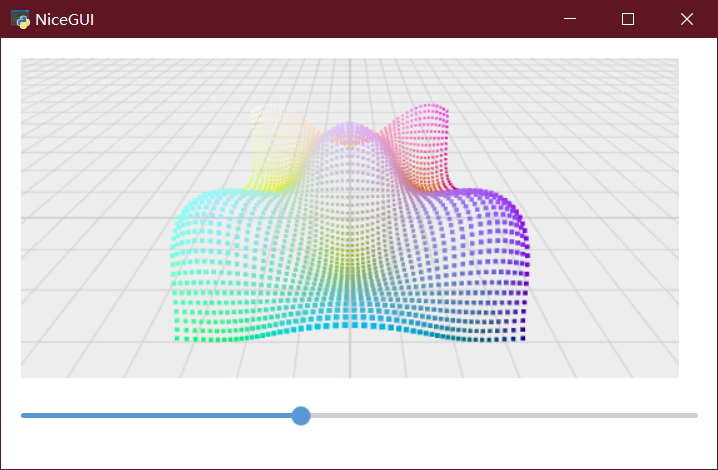

# nicegui的中文入门教程（进阶）

[TOC]

## 3 高阶技巧

NiceGUI的控件有很多，日常开发中，除了了解常用控件之外，不常用的控件也可以在学有余力的时候看看。当然，图形界面的开发不止对控件的了解，一些逻辑上的处理技巧，Python语言的特性与框架的结合，也是难免会遇到的难题。不过，不用怕，授人以鱼不如授人以渔，日常能遇到、能解决的难题，这里都有。

### 3.1 with的技巧

with可以嵌套使用，来实现类似HTML中div嵌套的效果，比如：

```python3
from nicegui import ui

with ui.element('div') as div1:
    with ui.element('div') as div2:
        ui.label('div in div')

ui.run(native=True)
```

也可以缩减一行，让代码更加紧凑：

```python3
from nicegui import ui

with ui.element('div') as div1, ui.element('div') as div2:
    ui.label('div in div')

ui.run(native=True)
```

### 3.2 slot的技巧

其实，所有的`with element`都是修改了 element 中名为`default`的slot。基于这个操作原理，可以借用`add_slot`的方法，结合`with`的用法，优雅、快捷地美化元素，实现复杂的布局。

比如，`ui.dropdown_button`有两个slot，`default`和`label`；其中，`default`就是默认的slot，常规方法就可以嵌入元素到弹出的下拉列表里，如果想要像修改`ui.button`一样修改`ui.dropdown_button`本身，则要修改`ui.dropdown_button`的`label`这个slot，代码如下：

```python3
from nicegui import ui

with ui.dropdown_button('button_'):
     ui.label('default slot')
#和上面的代码相同，主要是为了和下面的代码对比
with ui.dropdown_button('button_').add_slot('default'):
     ui.label('default slot')
#修改另一个slot，可以查看不同的效果
with ui.dropdown_button('button_').add_slot('label'):
     ui.label('default slot')
#可以对比 dropdown_button 和 button 的显示效果
with ui.button('button_').add_slot('default'):
     ui.label('default slot')

ui.run(native=True)
```


### 3.3 tailwindcss的技巧

不同于CSS定义中伪类在冒号之后来定义效果，在tailwindcss中，美化悬停（hover）和激活（active），需要放在冒号之前，冒号后紧随着要对状态应用的效果。比如，要实现标签背景颜色的悬停为红色、点击为黄色，代码如下：

```python3
from nicegui import ui

ui.label('label').classes('w-16 h-8 bg-green-400 hover:bg-red-400 active:bg-yellow-400')

ui.run(native=True)
```


类似的，还可以实现暗黑模式（dark）下的颜色定义，点击switch来切换暗黑模式的开关，可以看到标签在暗黑模式下的背景颜色为红色，非暗黑模式下的背景颜色为绿色，代码如下：

```python3
from nicegui import ui

ui.label('label').classes('w-16 h-8 bg-green-400 dark:bg-red-400')
dark_mode = ui.dark_mode()
switch = ui.switch('Dark Mode',on_change=lambda :dark_mode.set_value(switch.value))

ui.run(native=True)
```


在此基础上，还有一种根据屏幕宽度调整显示的技巧，就是将冒号前的单词换成代表屏幕宽度的断点`sm`、`md`、`lg`、`xl`、`2xl`。如果要让标签的宽度随窗口大小变化自适应，也就是小窗口宽度小一些，窗口越大，宽度越大，那么，代码可以这样写：

```python3
from nicegui import ui

ui.label('label').classes('w-64 h-8 bg-green-400 sm:w-8 md:w-16 lg:w-32')

ui.run(native=True)
```


然而，运行之后，可以看到上面的代码其实有问题，按照理解这样写是没错，但断点代表的含义是，大于这个屏幕宽度值才会应用这个样式，而且一次写这么多条，等屏幕宽度同时符合两条以上条件的时候，CSS就会处于竞争选择的状态，虽然样式上表现可能没问题，但规范要求应该明确断点范围，就好像写分段函数一样，必须明确区间。

所以，正确的根据屏幕宽度使用不同的样式应该这样写。使用`max-*`来表示最大到什么大小使用什么样式，使用冒号表示区间范围。于是，可以用`sm:max-md:w-16`来表示`sm`到`md`的范围内使用`w-16`的宽度样式，具体代码如下：

```python3
from nicegui import ui

ui.label('label').classes('h-8 bg-green-400 max-sm:w-8 sm:max-md:w-16 md:max-lg:w-32 lg:w-64')

ui.run(native=True)
```

### 3.4 自定义控件

#### 3.4.1 通过继承nicegui现有控件来创建新控件

在python中，可以通过继承来扩展现有类的功能，这个操作对于nicegui同样适用。

如果想要基于button实现一个可以通过点击切换颜色的按钮，可以这样做：

继承现有的控件类`ui.button`，先在`__init__`内调用父类的初始化方法；然后增加`_state`属性，默认为`False`，用于保存状态；最后定义点击事件的响应调用自身的`toggle`方法。

增加`toggle`方法，在方法内实现每次调用就翻转`_state`属性，并调用自身的`update`方法来更新显示。

重写`update`方法，先要根据`_state`属性设定button的显示颜色（动态更新`color`属性，详见Quasar提供的API），调用父类的`update`方法更新显示。

代码如下：

```python3
from nicegui import ui

class ToggleButton(ui.button):

    def __init__(self, *args, **kwargs) -> None:
        super().__init__(*args, **kwargs)
        self._state = False
        self.on('click', self.toggle)

    def toggle(self) -> None:
        """Toggle the button state."""
        self._state = not self._state
        self.update()

    def update(self) -> None:
        self.props(f'color={"green" if self._state else "red"}')
        super().update()

ToggleButton('Toggle me')

ui.run(native=True)
```


#### 3.4.2 使用Quasar的标签定义新控件

如果想要实现的功能比较复杂，但是Quasar提供了nicegui没有实现的组件，还有一种简单的方法创建新控件。

Quasar有一个浮动功能按钮[Floating Action Button](https://quasar.dev/vue-components/floating-action-button#introduction)，但nicegui没有实现。浮动功能按钮在Quasar的使用代码是：

```html
<q-fab color="green" icon="navigation" >
    <q-fab-action color="green-5" icon="train" />
    <q-fab-action color="green-5" icon="sailing" />
    <q-fab-action color="green-5" icon="rocket" />
</q-fab>
```

对应地，将HTML标签嵌套关系转换为python代码，`q-fab`标签就变成了`ui.element('q-fab')`，代码如下：

```python3
from nicegui import ui

with ui.element('q-fab').props('icon=navigation color=green'):
    ui.element('q-fab-action').props('icon=train color=green-5').on('click', lambda: ui.notify('train'))
    ui.element('q-fab-action').props('icon=sailing color=green-5').on('click', lambda: ui.notify('boat'))
    ui.element('q-fab-action').props('icon=rocket color=green-5').on('click', lambda: ui.notify('rocket'))
    
ui.run(native=True)
```


### 3.5 for循环的技巧

#### 3.5.1 用for创建多个有规律的控件

有时候，要创建多个外观一致或者有规律的控件，一个一个写代码或者复制粘贴的话，就不太pythonic了。在Python中，可以使用for来遍历迭代，同样可以使用for来创建多个外观一致或者有规律的控件。

```python3
from nicegui import ui

with ui.grid(rows=3,columns=3):
    for i in range(9):
        ui.button(i)

ui.run(native=True)
```


#### 3.5.2 与lambda组合使用时的问题

除了要创建一样的控件，还要给每个控件添加事件响应的话，每次都写一遍函数定义未免大材小用，更何况同名函数会出现覆盖，让函数名动态变化又没那么简单。这个时候Python的匿名函数——lambda表达式就派上用场了。lambda表达式可以创建语句简单的匿名函数，不必担心函数名重复的情况。比如，在下面的代码中，通过使用lambda表达式，让按钮的点击操作变成弹出一条通知。

```python3
from nicegui import ui

with ui.grid(rows=3,columns=3):
    for i in range(9):
        ui.button(i,on_click=lambda :ui.notify(i))

ui.run(native=True)
```

不过，事情并没有看上去那么简单，当写完代码开始执行的时候，才发现每个按钮的点击结果都一样，都是弹出内容为8的通知，这是为何？

原来，使用lambda表达式执行的`ui.notify(i)`，因为表达式没有绑定默认值，实际上绑定到了动态的`i`上，按钮的on_click的定义不是第一时间执行，而是在完成定义之后响应用户的操作。最终，当for完成遍历之后，动态的`i`已经被赋值为8，因此按钮的响应操作中的`i`都被统一修改了。为了避免这种情况，需要修改一下lambda表达式，添加一个参数并绑定默认值：

```python3
from nicegui import ui

with ui.grid(rows=3,columns=3):
    for i in range(9):
        ui.button(i,on_click=lambda i=i:ui.notify(i))

ui.run(native=True)
```

修改之后的`lambda i=i:ui.notify(i)`中，`i=i`的意思是lambda表达式里的i变成了函数的参数i，而这个i绑定到了外部的i当时值。

当然，实际代码中不建议这样写，太容易混淆了（怕被裁员倒是可以这样做）。

上面的代码可以再修改一下，让可读性变得更好：

```python3
from nicegui import ui

with ui.grid(rows=3, columns=3):
    for i in range(9):
        ui.button(i, on_click=lambda x=i: ui.notify(x))

ui.run(native=True)
```

#### 3.5.3 更好的for循环

为了确保批量生成之后还能访问每个控件，最好将批量生成的控件存储到列表里（不建议使用元组，没法修改；字典非必要也别用，字典的结构有点复杂，除非是列表没法实现需求）。

以下面的代码为例，使用buttons创建一个列表，在列表中用列表生成式来创建多个控件。后续如果需要修改某一个控件，就可以通过buttons来访问任意一个控件，这里是将第一个按钮隐藏。

```python3
from nicegui import ui

with ui.grid(rows=3,columns=3):
    buttons = [ui.button(i,on_click=lambda x=i:ui.notify(x)) for i in range(9)]

buttons[0].tailwind.visibility('invisible')

ui.run(native=True)
```


### 3.6 binding的技巧

#### 3.6.1 绑定到字典

在入门基础里提到的binding只介绍如何绑定两个控件，其实，binding除了绑定另一个控件，还支持绑定字典。绑定控件时，`target_object`是控件对象，这里则换成字典对象；`target_name`是控件对象的属性名，这里则换成字典的key，于是，就有了以下代码：

```python3
from nicegui import ui

data = {'name': 'Bob', 'age': 17}

ui.label().bind_text_from(data, 'name', backward=lambda n: f'Name: {n}')
ui.label().bind_text_from(data, 'age', backward=lambda a: f'Age: {a}')

ui.input(label='name:').bind_value(data,'name')
ui.number(label='age:').bind_value(data,'age',forward=lambda x:int(x))

ui.run(native=True)
```


要注意的是，ui.number的值输出为小数，如果不增加`forward=lambda x:int(x)`的话，`data['age']`会被修改为小数，而不是整数。同理，ui.input的值输出为字符串，如果字典输入不是字符串的话，在输出时需要转换。

#### 3.6.2 绑定到全局变量

还是上一节的代码，假如有人说：“字典还是有点复杂，能不能绑定到一个简单的变量上？”

怎么办？

也就是说，data字典没有了，取而代之的是：

```python3
name = 'Bob'
age = 17
```

其实也简单，只要将`data`换成`globals()`即可：

```python3
from nicegui import ui

name = 'Bob'
age = 17

ui.label().bind_text_from(globals(), 'name', backward=lambda n: f'Name: {n}')
ui.label().bind_text_from(globals(), 'age', backward=lambda a: f'Age: {a}')

ui.input(label='name:').bind_value(globals(), 'name')
ui.number(label='age:').bind_value(globals(), 'age', forward=lambda x: int(x))

ui.run(native=True)
```

任何在py文件内定义的全局变量，都会成为全局变量字典的一个键值，可以使用`globals()`访问全局变量字典。

#### 3.6.3 性能优化

在NiceGUI中有两种类型的绑定：

1.   "Bindable properties" （可绑定属性）会自动检测写入访问并触发值变动传播。大多数 NiceGUI 元素使用这种可绑定属性，例如`ui.input`的`value`或 `ui.label`的`text`。基本上所有带有`bind()`方法的属性都支持这种类型的绑定。
2.   另一种绑定"active links"（活动链接）不会自动检测写入访问并触发值变动传播。如果将标签文本绑定到字典或自定义数据模型的属性，NiceGUI 的绑定模块则需要主动检查值是否发生变化。这个主动检查是通过每 0.1 秒运行一次`refresh_loop()`来完成。主动检查间隔可以通过设置`ui.run()`的参数`binding_refresh_interval`来修改。

可绑定属性非常高效，只要值不变，就不会产生任何性能开销（相对而言比较小而已）。但活动链接需要每秒检查所有绑定值10 次。这可能会消耗比较多的性能，尤其是活动链接的绑定关系非常复杂、非常多的时候。

因为不能让主线程阻塞太久，所以如果太多主动检查导致运行`refresh_loop()`的耗时过长，程序会发出警告。当然，可以配置阈值`binding.MAX_PROPAGATION_TIME`（默认为 0.01 秒）来消除警告。但是，这个警告是有意义的，是在告诉开发者性能可能存在问题。比如，CPU在更新绑定花费太长时间的话，主线程就没法做别的事情，程序界面会因此卡住。

为了避免性能出问题，需要将活动链接改为可绑定属性之间的绑定，需要使用`binding.BindableProperty()`来创建可绑定属性。于是，基于第一小节的代码，将字典改为数据类，在数据类中定义两个可绑定属性，控件的绑定改为与数据类对象的绑定。代码如下：

```python3
from nicegui import ui, binding

class data_base:
    name = binding.BindableProperty()
    age = binding.BindableProperty()
    def __init__(self) -> None:
        self.name = 'Bob'
        self.age = 17

data =data_base()

ui.label().bind_text_from(data, 'name', backward=lambda n: f'Name: {n}')
ui.label().bind_text_from(data, 'age', backward=lambda a: f'Age: {a}')

ui.input(label='name:').bind_value(data,'name')
ui.number(label='age:').bind_value(data,'age',forward=lambda x:int(x))

ui.run(native=True)
```

因为代码中的绑定数量很少，因此差异不大，如果将绑定数量放大百倍，就能看出两种绑定的性能差异。

### 3.7 app.storage的技巧

有时候，网页上不同页面、用户需要存储、共享特定数据，依靠自己编程实现的话确实麻烦。好在NiceGUI提供了一种简单有效的数据存储功能，那就是`app.storage`（存储）。 存储有5个子字典，分别对应着不同的空间，有不同的应用范围：

-   `app.storage.tab`：存储在服务器的内存中，此字典对于每个选项卡、会话都是唯一的，可以存储任意对象。需要注意的是，在实现 https://github.com/zauberzeug/nicegui/discussions/2841 之前，重启服务器会导致此字典的数据丢失。对于使用复制选项卡功能（右键选项卡点复制）创建的新选项卡，二者的tab_id（ui.context.client.tab_id）是相同的，因此，复制的选项卡与原选项卡共享此字典。此外，此字典只能在仅在[`ui.page`](https://nicegui.io/documentation/page)中使用，并且需要等待客户端建立连接（确保读写此字典的操作在异步函数内的 [`await ui.context.client.connected()`](https://nicegui.io/documentation/page#wait_for_client_connection)之后）。
-   `app.storage.client`：该字典也存储在服务器的内存中，对于每个客户端连接都是唯一的，并且可以存储任意对象。当页面重新加载或用户导航到另一个页面时，数据将被销毁。不同于能在服务器上保存数据好几天的`app.storage.tab`，`app.storage.client`更适合缓存频繁使用、一次性的数据。比如，需要动态更新的数据或者数据库连接，但希望在用户离开页面或关闭浏览器时立即销毁。同样的，这个字典只能在[`ui.page`](https://nicegui.io/documentation/page)中使用。
-   `app.storage.user`：存储在服务器磁盘中，每个字典都与浏览器cookie中保存的唯一标识符相关联，换句话说，此字典对于每个用户都是唯一的，并与浏览器的其他选项卡共享。可以通过存储在`app.storage.browser['id']`的标识符识别用户、会话。同样的，这个字典只能在[`ui.page`](https://nicegui.io/documentation/page)中使用。此外，这个字典需要设置`ui.run()`的`storage_secret`参数来签名浏览器会话cookie。
-   `app.storage.general`：该字典也存储在服务器磁盘中，提供了所有用户都可以访问的共享存储空间。
-   `app.storage.browser`：与前几个字典不同，此字典直接存储为浏览器会话cookie，在同一用户的所有浏览器选项卡之间共享。虽然很多方面看起来很像`app.storage.user`，不过，`app.storage.user`因为其在减少数据负载、增强安全性和提供更大存储容量方面的优势，在实际使用中比`app.storage.browser`更受欢迎。默认情况下，NiceGUI会在`app.storage.browser['id']`中为每个浏览器会话保留一个唯一标识符。同样的，这个字典只能在[`ui.page`](https://nicegui.io/documentation/page)中使用。此外，这个字典需要设置`ui.run()`的`storage_secret`参数来签名浏览器会话cookie。

如果因为上述介绍看起来不够直观，而在选用存储字典时候头疼，可以参考下面的对比表格快速选用（✅表示是，❌表示否）：

| 存储的子字典                     |   `tab`    |  `client`  |   `user`   | `general`  | `browser` |
| :------------------------------- | :--------: | :--------: | :--------: | :--------: | :-------: |
| 存储位置                         | 服务器内存 | 服务器内存 | 服务器磁盘 | 服务器磁盘 |  浏览器   |
| 是否在不同选项卡之间共享         |     ❌      |     ❌      |     ✅      |     ✅      |     ✅     |
| 是否在不同浏览器客户端之间共享   |     ❌      |     ❌      |     ❌      |     ✅      |     ❌     |
| 是否在服务器重启后保留数据       |     ❌      |     ❌      |     ❌      |     ✅      |     ❌     |
| 是否在页面重载后保留数据         |     ✅      |     ❌      |     ✅      |     ✅      |     ✅     |
| 是否只能用在ui.page内            |     ✅      |     ✅      |     ✅      |     ❌      |     ✅     |
| 是否需要客户端建立连接           |     ✅      |     ❌      |     ❌      |     ❌      |     ❌     |
| 是否只能在响应之前写入           |     ❌      |     ❌      |     ❌      |     ❌      |     ✅     |
| 是否要求数据可序列化             |     ❌      |     ❌      |     ✅      |     ✅      |     ✅     |
| 是否需要设置`storage_secret`参数 |     ❌      |     ❌      |     ✅      |     ❌      |     ✅     |

下面是个使用存储字典的简单例子：

```python3
from nicegui import app, ui

@ui.page('/')
def index():
    app.storage.user['count'] = app.storage.user.get('count', 0) + 1
    with ui.row():
       ui.label('your own page visits:')
       ui.label().bind_text_from(app.storage.user, 'count')

ui.run(storage_secret='private_key')
```

默认数据是以无缩进的JSON格式存储在`app.storage.user` 和`app.storage.general`中，可以将`app.storage.user.indent`、`app.storage.general.indent`设置为`True`来让对应存储字典的数据采用2个空格的缩进格式。

### 3.8 修改指定元素的技巧

在CSS中，有个非常重要的概念叫选择器。

每一条css样式定义由两部分组成，形式如下：

 ```css
 选择器{样式}
 ```

在{}之前的部分就是“选择器”。 “选择器”指明了{}中的“样式”的作用对象，也就是“样式”作用于网页中的哪些元素。

选择器有一套自己的[语法规则](https://developer.mozilla.org/en-US/docs/Learn/CSS/Building_blocks/Selectors)，通过合理设置选择器的规则，可以很精准地选择指定元素。

NiceGUI简化了不少CSS上的操作，但不代表不需要CSS的基础。如果读者掌握了CSS的选择器，与ui.query和ui.teleport结合使用，那就如同得到了屠龙宝刀，操作界面布局、美化界面将更加得心应手。

注意，前两小节要求读者具备CSS选择器基础，没有相应基础的读者可以搁置前两小节，直接看第三小节。

#### 3.8.1 ui.query

前面讲过如何美化控件，即在控件定义时使用props、classes、style等方法美化控件，也可以在控件定义好之后，通过给定的变量名调用相应方法。但是，如果想要美化的控件、元素根本就不是定义出来的，而是框架带出来的，想要美化就有点麻烦。当然，直接修改内置样式、源码很直观，但麻烦。要是有种方法能让想要修改的内容就像被定义为变量一样，后续直接使用，那就方便不少。正巧，ui.query就有这样的功能。

注意，ui.query的props方法修改的是HTML元素的属性（attribute），而不是ui.element或者Quasar组件的属性（props）。

ui.query只有一个字符串类型参数`selector`，顾名思义，就是前面提到的选择器。通过给ui.query传入选择器语法，ui.query将返回CSS选择器能够选择的元素，后续可以直接对该元素执行样式美化的方法。

下面的代码就是使用ui.query选择了body（网页的主体），并设置body的背景颜色：

```python3
from nicegui import ui

body = ui.query(selector='body')
body.classes('bg-blue-400')

ui.run(native=True)
```


ui.query的用法很简单，难点在于确定CSS选择器的写法，这一部分属于CSS基础知识，这里就不再赘述，有能力的读者可以抽时间深入学习CSS选择器的语法。

#### 3.8.2 ui.teleport

肯定有读者在学了ui.query美化指定元素之后，突发奇想，想要给指定元素内部添加控件，比如，下面的代码：

```python3
from nicegui import ui

markdown = ui.markdown('Enter your **name**!')
with ui.query(f'#c{markdown.id} strong'):
    ui.input('name').classes('inline-flex').props('dense outlined')

ui.run(native=True)
```

然而，这段代码并不能成功运行，因为ui.query并不支持add_slot。如果想要实现类似效果，只需将ui.query换成ui.teleport即可，不过传递的参数名不是`selector`，而是`to`：

```python3
from nicegui import ui

markdown = ui.markdown('Enter your **name**!')
with ui.teleport(to=f'#c{markdown.id} strong'):
    ui.input('name').classes('inline-flex').props('dense outlined')

ui.run(native=True)
```


ui.teleport就是这样一个基于CSS选择器语法将任意控件传送至指定位置的控件。

#### 3.8.3 ElementFilter

暂时不会CSS选择器语法的读者也不用着急，尽管CSS选择器语法很强大，但在Python中不够直观，想要快速确定选择器还要去网页中开启调试模式。好在NiceGUI提供了另一种不需要CSS选择器的定位指定元素工具，那就是ElementFilter。

ElementFilter和ui模块同级，使用`from nicegui import ElementFilter`来导入。

ElementFilter的功能等于ui.query加ui.teleport，既能设置指定元素的样式，又能将控件传送到指定位置。但与ui.query和ui.teleport使用CSS选择器语法不同，ElementFilter的筛选方式更Pythonic，更直观，更契合python编程习惯。

以下代码是用于匹配的模板内容，以下面的代码为例，分别看看ElementFilter不同参数、方法的用途：

```python3
from nicegui import ui,ElementFilter

with ui.card():
    ui.button('button A')
    ui.label('label A_A')
    ui.label('label A_B')

with ui.card():
    ui.button('button B')
    ui.label('label B_A')
    ui.label('label B_B')

ui.run(native=True)
```

##### 3.8.3.1 初始化方法

ElementFilter是一个类，需要初始化为对象实例才能使用。ElementFilter的初始化方法有四个参数，分别是 `kind` 、`marker` 、`content` 、`local_scope`。

`kind`参数，NiceGUI的ui类型，表示筛选什么类型的控件。比如，在下面的代码中，传入的参数是`ui.label`，ElementFilter就会筛选ui.label，这样给ElementFilter对象设置背景颜色为红色的时候，页面内所有的ui.label的背景颜色就相应变成红色。

```python3
from nicegui import ui,ElementFilter

with ui.card():
    ui.button('button A')
    ui.label('label A_A')
    ui.label('label A_B')

with ui.card():
    ui.button('button B')
    ui.label('label B_A')
    ui.label('label B_B')

ElementFilter(kind=ui.label).classes('bg-red')

ui.run(native=True)
```


`marker`参数，字符串类型或者字符串列表类型，表示筛选包含指定mark或者指定mark列表的对象。

在此，需要额外介绍一下控件的mark方法，也就是如何给控件添加marker。对于每一个ui控件，都可以通过mark方法定义一组marker，用于ElementFilter的筛选。mark方法的参数是一个支持解包、分解的字符串类型参数`markers`。也就是说，传入`'A'` 、`'A','B','AB'`、`'B A BA'`、`'A','B BA'`都是可以的。本质上说，mark方法就是将传入的字符串转换为该对象的`_markers`列表。对于`'A','B','AB'`这样多个字符串，该方法会转化为`['B','A','AB']`这样的列表来使用。对于`'B A BA'`这样用空格划分的字符串，该方法会自动以空格为分隔符分解为`['B','A','BA']`这样的列表来使用。当然，两种方法混用也没问题，`'A','B BA'`这样的多个字符串，则会转化为`['A','B','BA']`这样的列表。注意，虽然mark方法支持串联、重复使用，但最好不要这样做，因为后执行的mark会覆盖先前mark方法的结果，如果是想清除之前的marker，倒是可以重复执行。

说完给控件添加marker，下面回归正题，说说如何筛选。`marker`参数和mark方法的`markers`参数类似，只不过`marker`参数没有解包过程，想要传入多个字符串，只能使用字符串列表。与mark方法的宽松不同，`marker`参数的要求比较严格，要么是纯字符串，带空格的会自动划分、转化为列表，要么是无空格的字符串组成列表，不支持正确解析内含带空格的字符串列表，所以，只有以下格式才是正确的用法：`'A'` 、`['A','B','AB']`、`'B A BA'`。

代码示例如下：

```python3
from nicegui import ui,ElementFilter

with ui.card():
    ui.button('button A')
    ui.label('label A_A').mark('A')
    ui.label('label A_B').mark('A','B','AB')

with ui.card():
    ui.button('button B')
    ui.label('label B_B').mark('B')
    ui.label('label B_A').mark('B A BA')
    
ElementFilter(marker='BA').classes('bg-red')
#ElementFilter(marker='A B').classes('bg-red')
#ElementFilter(marker=['A','B']).classes('bg-red')

ui.run(native=True)
```


`content`参数，字符串类型或者字符串列表类型，表示筛选包含指定内容的对象。筛选范围包括对象的value、text、label、icon、placeholder等文本属性。匹配要求完全包含指定字符串或者字符串列表。

```python3
from nicegui import ui,ElementFilter

with ui.card():
    ui.button('button A')
    ui.label('label A_A').mark('A')
    ui.label('label A_B').mark('A','B','AB')

with ui.card():
    ui.button('button B')
    ui.label('label B_B').mark('B')
    ui.label('label B_A').mark('B A BA')
    
ElementFilter(content=['B','A']).classes('bg-red')

ui.run(native=True)
```


`local_scope`参数，布尔类型，表示ElementFilter匹配当前范围还是全局，默认为`False`，即匹配全局。如果设置为`True`，则只匹配当前上下文。可以看以下代码，修改了缩进并将此参数设置为`True`，ElementFilter对象就只能匹配同一缩进内的控件：

```python3
from nicegui import ui,ElementFilter

with ui.card():
    ui.button('button A')
    ui.label('label A_A').mark('A')
    ui.label('label A_B').mark('A','B','AB')

with ui.card():
    ui.button('button B')
    ui.label('label B_B').mark('B')
    ui.label('label B_A').mark('B A BA')
    ElementFilter(content=['B','A'],local_scope=True).classes('bg-red')

ui.run(native=True)
```


##### 3.8.3.2 `within`方法和`not_within`方法

顾名思义，这两个方法就是在ElementFilter初始化参数的筛选范围内进一步筛选指定的父级对象，得到在指定的父级对象上下文之内、不在指定的父级对象上下文之内的对象。对`within`方法而言，会得到符合该方法匹配条件的对象。对`not_within`方法而言，会排除符合该方法匹配条件的对象

两个方法的参数都一样，都是三个，分别是`kind`、`marker`、`instance`。

`kind`和`marker`与初始化方法的参数一样，这里不再赘述。只是，这里的`marker`不支持字符串列表。

`instance`参数，对象或者对象列表，指定具体对象的范围内是否筛选。以 `within`方法为例，给此参数传递具体对象，ElementFilter将只筛选在该对象之内的ui.label：

```python3
from nicegui import ui,ElementFilter

with ui.card() as card1:
    ui.button('button A')
    ui.label('label A_A').mark('A')
    ui.label('label A_B').mark('A','B','AB')

with ui.card() as card2:
    ui.button('button B')
    ui.label('label B_B').mark('B')
    ui.label('label B_A').mark('B A BA')

ElementFilter(kind=ui.label).within(instance=card2).classes('bg-red')

ui.run(native=True)
```


这两个方法支持串联调用，不过串联就和传递列表给参数一样，是扩展了对应筛选条件的内部列表。对于这两种筛选条件的内部列表，匹配规则是不一样的：对于`within`方法，筛选则是要求列表内元素全部匹配；对于`not_within`方法，筛选则是要求列表内元素任意一个匹配。

##### 3.8.3.3 `exclude`方法

该方法是在ElementFilter初始化参数的筛选范围内进一步排除指定的对象。

该方法有三个参数，`kind` 、`marker` 、`content` ，同初始化方法的参数一样，这里简单说一下示例代码，不做详解。不过，该方法的三个参数不支持传入列表，`marker`也不支持根据空格自动划分字符串，这一点需要注意。

```python3
from nicegui import ui,ElementFilter
from nicegui.elements.mixins.text_element import TextElement

with ui.card() as card1:
    ui.button('button A')
    ui.label('label A_A').mark('A')
    ui.label('label A_B').mark('A','B','AB')

with ui.card() as card2:
    ui.button('button B')
    ui.label('label B_B').mark('B')
    ui.label('label B_A').mark('B A BA')

ElementFilter(kind=TextElement).exclude(kind=ui.label).classes('bg-red')

ui.run(native=True)
```


ui.label和ui.button都继承了TextElement，因此匹配TextElement会同时匹配到这两种控件，因此，在exclude方法中指定kind为ui.label之后，匹配结果就排除了ui.label，只有ui.button的颜色变成红色。

##### 3.8.3.4 传送控件到匹配结果

对于ElementFilter，想要传送控件到结果也很简单，只需遍历ElementFilter对象，就能获取匹配结果。

如下面代码所示，使用for遍历ElementFilter对象，使用with进入每个元素的上下文，就和正常添加控件到对应slot一样：

```python3
from nicegui import ui,ElementFilter
from nicegui.elements.mixins.text_element import TextElement

with ui.card() as card1:
    ui.button('button A')
    ui.label('label A_A').mark('A')
    ui.label('label A_B').mark('A','B','AB')

with ui.card() as card2:
    ui.button('button B')
    ui.label('label B_B').mark('B')
    ui.label('label B_A').mark('B A BA')

for ele in ElementFilter(kind=TextElement).exclude(kind=ui.label).classes('bg-red'):
    with ele:
        ui.icon('home')

ui.run(native=True)
```


##### 3.8.3.5 总结

ElementFilter的方法、参数不多，但用法不统一，要是组合使用，需要一些时间思考其匹配模式。而有的读者看到文字太多就头疼，没关系，这里将上面的内容简化为一个表格方便查阅。详细看过一遍文字教程之后，后续开发中再次遇到，可以快速参阅表格来确定匹配模式。

对应参数的匹配模式：

| ElementFilter的方法 | `__init__` | `within` | `not_within` | `exclude` |
| ------------------- | ---------- | -------- | ------------ | --------- |
| `kind`参数          | 任意一个   | 全部匹配 | 任意一个     | 任意一个  |
| `content`参数       | 全部匹配   | 无此参数 | 无此参数     | 任意一个  |
| `instance`参数      | 无此参数   | 全部匹配 | 任意一个     | 无此参数  |
| `marker`参数        | 全部匹配   | 全部匹配 | 任意一个     | 任意一个  |

Match type for parameters in ElementFilter's method:

| ElementFilter's method | `__init__` | `within` | `not_within` | `exclude` |
| ---------------------- | ---------- | -------- | ------------ | --------- |
| parameter `kind`       | any/or     | all/and  | any/or       | any/or    |
| parameter `content`    | all/and    | ----     | ----         | any/or    |
| parameter `instance`   | ----       | all/and  | any/or       | ----      |
| parameter `marker`     | all/and    | all/and  | any/or       | any/or    |

另外，对于NiceGUI2.1版本的ElementFilter部分方法参数不支持列表传入，这里特地补丁了一份模块文件，有需要的读者可以自行替换，文件的具体路径为`.venv\Lib\site-packages\nicegui\element_filter.py`，如果是全局环境的Python，路径为`{Python执可执行文件所在目录}\Lib\site-packages\nicegui\element_filter.py`

```python3
from __future__ import annotations

from typing import Generic, Iterator, List, Optional, Type, TypeVar, Union, overload

from typing_extensions import Self

from .context import context
from .element import Element
from .elements.mixins.content_element import ContentElement
from .elements.mixins.source_element import SourceElement
from .elements.mixins.text_element import TextElement
from .elements.notification import Notification
from .elements.select import Select

T = TypeVar('T', bound=Element)


class ElementFilter(Generic[T]):
    DEFAULT_LOCAL_SCOPE = False

    @overload
    def __init__(self: ElementFilter[Element], *,
                 marker: Union[str, List[str], None] = None,
                 content: Union[str, List[str], None] = None,
                 local_scope: bool = DEFAULT_LOCAL_SCOPE,
                 ) -> None:
        ...

    @overload
    def __init__(self, *,
                 kind: Union[Type[T], List[Type[T]], None] = None,
                 marker: Union[str, List[str], None] = None,
                 content: Union[str, List[str], None] = None,
                 local_scope: bool = DEFAULT_LOCAL_SCOPE,
                 ) -> None:
        ...

    def __init__(self, *,
                 kind: Union[Type[T], List[Type[T]], None] = None,
                 marker: Union[str, List[str], None] = None,
                 content: Union[str, List[str], None] = None,
                 local_scope: bool = DEFAULT_LOCAL_SCOPE,
                 ) -> None:
        """ElementFilter

        Sometimes it is handy to search the Python element tree of the current page.
        ``ElementFilter()`` allows powerful filtering by kind of elements, markers and content.
        It also provides a fluent interface to apply more filters like excluding elements or filtering for elements within a specific parent.
        The filter can be used as an iterator to iterate over the found elements and is always applied while iterating and not when being instantiated.

        And element is yielded if it matches all of the following conditions:

        - The element is of the specified kind (if specified).
        - The element is none of the excluded kinds.
        - The element has all of the specified markers.
        - The element has none of the excluded markers.
        - The element contains all of the specified content.
        - The element contains none of the excluded content.

        - Its ancestors include all of the specified instances defined via ``within``.
        - Its ancestors include none of the specified instances defined via ``not_within``.
        - Its ancestors include all of the specified kinds defined via ``within``.
        - Its ancestors include none of the specified kinds defined via ``not_within``.
        - Its ancestors include all of the specified markers defined via ``within``.
        - Its ancestors include none of the specified markers defined via ``not_within``.

        Element "content" includes its text, label, icon, placeholder, value, message, content, source.
        Partial matches like "Hello" in "Hello World!" are sufficient for content filtering.
        
        :param kind: filter by element type; the iterator will be of type ``kind``
        :param marker: filter by element markers; can be a list of strings or a single string where markers are separated by whitespace
        :param content: filter for elements which contain ``content`` in one of their content attributes like ``.text``, ``.value``, ``.source``, ...; can be a singe string or a list of strings which all must match
        :param local_scope: if `True`, only elements within the current scope are returned; by default the whole page is searched (this default behavior can be changed with ``ElementFilter.DEFAULT_LOCAL_SCOPE = True``)
        """
        self._kind = kind if isinstance(kind, list) else ([kind] if kind else [])
        self._markers = marker.split() if isinstance(marker, str) else [word for single_marker in (marker or []) for word in single_marker.split()]
        self._contents = [content] if isinstance(content, str) else content or []

        self._within_kinds: List[Type[Element]] = []
        self._within_instances: List[Element] = []
        self._within_markers: List[str] = []

        self._not_within_kinds: List[Type[Element]] = []
        self._not_within_instances: List[Element] = []
        self._not_within_markers: List[str] = []

        self._exclude_kinds: List[Type[Element]] = []
        self._exclude_markers: List[str] = []
        self._exclude_content: List[str] = []

        self._scope = context.slot.parent if local_scope else context.client.layout

    def __iter__(self) -> Iterator[T]:
        for element in self._scope.descendants():
            if self._kind and not isinstance(element, tuple(self._kind)):
                continue
            if self._exclude_kinds and isinstance(element, tuple(self._exclude_kinds)):
                continue

            if any(marker not in element._markers for marker in self._markers):
                continue
            if any(marker in element._markers for marker in self._exclude_markers):
                continue

            if self._contents or self._exclude_content:
                element_contents = [content for content in (
                    element.props.get('text'),
                    element.props.get('label'),
                    element.props.get('icon'),
                    element.props.get('placeholder'),
                    element.props.get('value'),
                    element.text if isinstance(element, TextElement) else None,
                    element.content if isinstance(element, ContentElement) else None,
                    element.source if isinstance(element, SourceElement) else None,
                ) if content]
                if isinstance(element, Notification):
                    element_contents.append(element.message)
                if isinstance(element, Select):
                    options = {option['value']: option['label'] for option in element.props.get('options', [])}
                    element_contents.append(options.get(element.value, ''))
                    if element.is_showing_popup:
                        element_contents.extend(options.values())
                if any(all(needle not in str(haystack) for haystack in element_contents) for needle in self._contents):
                    continue
                if any(needle in str(haystack) for haystack in element_contents for needle in self._exclude_content):
                    continue

            ancestors = set(element.ancestors())
            if self._within_instances and not ancestors.issuperset(self._within_instances):
                continue
            if self._not_within_instances and not ancestors.isdisjoint(self._not_within_instances):
                continue
            if self._within_kinds and not all(any(isinstance(ancestor, kind) for ancestor in ancestors) for kind in self._within_kinds):
                continue
            if self._not_within_kinds and any(isinstance(ancestor, tuple(self._not_within_kinds)) for ancestor in ancestors):
                continue
            ancestor_markers = {marker for ancestor in ancestors for marker in ancestor._markers}
            if self._within_markers and not ancestor_markers.issuperset(self._within_markers):
                continue
            if self._not_within_markers and not ancestor_markers.isdisjoint(self._not_within_markers):
                continue

            yield element  # type: ignore

    def within(self, *,
               kind: Union[Element, List[Element], None] = None,
               marker: Union[str, List[str], None] = None,
               instance: Union[Element, List[Element], None] = None,
               ) -> Self:
        """Filter elements which have a specific match in the parent hierarchy."""
        if kind is not None:
            if isinstance(kind, list):
                for every_kind in kind:
                    assert issubclass(every_kind, Element)
                self._within_kinds.extend(kind)
            else:    
                assert issubclass(kind, Element)
                self._within_kinds.append(kind)
        if marker is not None:
            markers = marker.split() if isinstance(marker, str) else [word for single_marker in marker for word in single_marker.split()]
            self._within_markers.extend(markers)
        if instance is not None:
            self._within_instances.extend(instance if isinstance(instance, list) else [instance])
        return self

    def exclude(self, *,
                kind: Union[Element, List[Element], None] = None,
                marker: Union[str, List[str], None] = None,
                content: Union[str, List[str], None] = None,
                ) -> Self:
        """Exclude elements with specific element type, marker or content."""
        if kind is not None:
            if isinstance(kind, list):
                for every_kind in kind:
                    assert issubclass(every_kind, Element)
                self._exclude_kinds.extend(kind)
            else:    
                assert issubclass(kind, Element)
                self._exclude_kinds.append(kind)
        if marker is not None:
            markers = marker.split() if isinstance(marker, str) else [word for single_marker in marker for word in single_marker.split()]
            self._exclude_markers.extend(markers)
        if content is not None:
            self._exclude_content.extend([content] if isinstance(content, str) else content)
        return self

    def not_within(self, *,
                   kind: Union[Element, List[Element], None] = None,
                   marker: Union[str, List[str], None] = None,
                   instance: Union[Element, List[Element], None] = None,
                   ) -> Self:
        """Exclude elements which have a parent of a specific type or marker."""
        if kind is not None:
            if isinstance(kind, list):
                for every_kind in kind:
                    assert issubclass(every_kind, Element)
                self._not_within_kinds.extend(kind)
            else:    
                assert issubclass(kind, Element)
                self._not_within_kinds.append(kind)
        if marker is not None:
            markers = marker.split() if isinstance(marker, str) else [word for single_marker in marker for word in single_marker.split()]
            self._not_within_markers.extend(markers)
        if instance is not None:
            self._not_within_instances.extend(instance if isinstance(instance, list) else [instance])
        return self

    def classes(self, add: Optional[str] = None, *, remove: Optional[str] = None, replace: Optional[str] = None) -> Self:
        """Apply, remove, or replace HTML classes.

        This allows modifying the look of the element or its layout using `Tailwind <https://tailwindcss.com/>`_ or `Quasar <https://quasar.dev/>`_ classes.

        Removing or replacing classes can be helpful if predefined classes are not desired.

        :param add: whitespace-delimited string of classes
        :param remove: whitespace-delimited string of classes to remove from the element
        :param replace: whitespace-delimited string of classes to use instead of existing ones
        """
        for element in self:
            element.classes(add, remove=remove, replace=replace)
        return self

    def style(self, add: Optional[str] = None, *, remove: Optional[str] = None, replace: Optional[str] = None) -> Self:
        """Apply, remove, or replace CSS definitions.

        Removing or replacing styles can be helpful if the predefined style is not desired.

        :param add: semicolon-separated list of styles to add to the element
        :param remove: semicolon-separated list of styles to remove from the element
        :param replace: semicolon-separated list of styles to use instead of existing ones
        """
        for element in self:
            element.style(add, remove=remove, replace=replace)
        return self

    def props(self, add: Optional[str] = None, *, remove: Optional[str] = None) -> Self:
        """Add or remove props.

        This allows modifying the look of the element or its layout using `Quasar <https://quasar.dev/>`_ props.
        Since props are simply applied as HTML attributes, they can be used with any HTML element.

        Boolean properties are assumed ``True`` if no value is specified.

        :param add: whitespace-delimited list of either boolean values or key=value pair to add
        :param remove: whitespace-delimited list of property keys to remove
        """
        for element in self:
            element.props(add, remove=remove)
        return self

```


### 3.9 其他布局

前面介绍过常用的布局，其实NiceGUI支持的布局控件有很多，下面提到的这些不常用，但有些需求比较刁钻，用这些布局刚好可以减少不必要的工作。

#### 3.9.1 ui.list

列表布局，看上去有点像ui.column，但列表布局主要是给ui.item用的，当然，要是想在一般布局的时候使用也没问题，不过需要注意一下二者的区别。

以代码为例：

```python3
from nicegui import ui

with ui.list().classes('border'):
    ui.item('3 Apples')
    ui.item('5 Bananas')
    ui.item('8 Strawberries')
    ui.item('13 Walnuts')

with ui.column().classes('border'):
    ui.item('3 Apples')
    ui.item('5 Bananas')
    ui.item('8 Strawberries')
    ui.item('13 Walnuts')

ui.run(native=True)
```


为了能清楚看到二者的区别，这里给两种布局加了个边框，方便看到边界。可以看出，ui.list比ui.column的默认行距小，整体看上去更加紧凑。当然，ui.list主要是给ui.item用的，默认的紧凑是有别的用途，如果在一般布局中需要紧凑一些的观感，可以根据需求调整样式，而不是使用ui.list代替ui.column。

关于ui.list更恰当的用途，还是以代码为例：

```python3
from nicegui import ui

with ui.list().props('bordered separator'):
    ui.item_label('Contacts').props('header').classes('text-bold')
    ui.separator()
    with ui.item(on_click=lambda: ui.notify('Selected contact 1')):
        with ui.item_section().props('avatar'):
            ui.icon('person')
        with ui.item_section():
            ui.item_label('Nice Guy')
            ui.item_label('name').props('caption')
        with ui.item_section().props('side'):
            ui.icon('chat')
    with ui.item(on_click=lambda: ui.notify('Selected contact 2')):
        with ui.item_section().props('avatar'):
            ui.icon('person')
        with ui.item_section():
            ui.item_label('Nice Person')
            ui.item_label('name').props('caption')
        with ui.item_section().props('side'):
            ui.icon('chat')

ui.run(native=True)
```


给ui.item内增加ui.item_section、ui.item_label等控件，可以实现类似通讯录的布局。不同于使用基本布局组合实现需要较多的样式调整，这些预定义的控件本身有很多属性样式，只需设置好对应的属性，就能让样式接近想要的效果。而且，本身的含义也比较直观，后续维护起来也方便。

#### 3.9.2 ui.splitter

前面介绍过ui.separator，可以生成一条水平或者垂直的分隔线，用来不明显地区分控件。但是，在NiceGUI中，除了ui.separator外，还有一种分隔线，那就是ui.splitter，也可以生成一条水平或者垂直的分隔线。不过，在前面没介绍这个控件，是因为这个控件的用法可比ui.separator复杂，用途也多，只是简单分隔一下，还是用ui.separator比较好。倘若对于分隔有更高的要求或者其他用途，ui.splitter绝对能胜任。

先看代码，分别用ui.separator和ui.splitter实现类似的效果：

```python3
from nicegui import ui

ui.label('separator')
with ui.card():
    ui.label('text above')
    ui.separator()
    ui.label('text below')
with ui.card(),ui.row():
    ui.label('text above')
    ui.separator().props('vertical')
    ui.label('text below')

ui.label('splitter')
with ui.card():
    splitter = ui.splitter(horizontal=True)
    with splitter.before:ui.label('text above')
    with splitter.after:ui.label('text below')
with ui.card().classes('w-56'),ui.row().classes('w-full'):
    splitter2 = ui.splitter().classes('w-full')
    with splitter2.before:ui.label('text above')
    with splitter2.after:ui.label('text below')

ui.run(native=True)
```


单看效果对比的话，ui.splitter看上去只是比ui.separator紧凑一些，似乎没什么不同。如果仔细看代码，就会发现ui.splitter的代码量比ui.separator多不少。

ui.splitter可以看做是一个容器，定义ui.splitter之后，会产生ui.splitter().before、ui.splitter().after、ui.splitter().separator三个子容器，需要分别给前两个容器填充内容，才能看到分隔效果。而且，中间的分隔线也支持添加内容和鼠标交互，可以用鼠标左右拖动。

当然，ui.splitter支持的参数不少，用起来也比ui.separator复杂：

`horizontal`参数，布尔类型，是否将ui.splitter水平显示。

`limits`参数，浮点元组类型，表示拖动分隔线的范围（最小、最大百分比），这是一个二元元组，默认为(0,100)，第一个元素表示拖动范围的最小值，，第二个元素表示拖动范围的最大值。

`value`参数，浮点类型，表示ui.splitter().before的初始大小百分比。

`reverse`参数，布尔类型，表示是否反转ui.splitter().before和ui.splitter().after先后顺序。

`on_change`参数，可调用类型，表示拖动分隔线时执行的操作。

以下代码是ui.splitter的典型运用，通过拖动分隔线，显示彩色、黑白图像的对比效果，同时弹出通知显示当前分隔线的位置：

```python3
from nicegui import ui

with ui.splitter(
    horizontal=False,
    reverse=False,
    limits=(0, 100),
    value=50,
    on_change=lambda e: ui.notify(f"Separator changed to {e.sender.value}."),
).classes("w-72 h-48").props(
    "before-class=overflow-hidden after-class=overflow-hidden"
    ) as splitter:
    with splitter.separator:
        ui.icon("lightbulb").classes("text-green")
        ui.tooltip("Move me.").classes("bg-green").props(
            'anchor="center middle" self="center middle"'
        )
    with splitter.before:
        ui.image("https://cdn.quasar.dev/img/parallax1.jpg").classes(
            "w-72 absolute-top-left"
        )
    with splitter.after:
        ui.image("https://cdn.quasar.dev/img/parallax1-bw.jpg").classes(
            "w-72 absolute-top-right"
        )

ui.run(native=True)
```


#### 3.9.3 ui.tabs

选项卡，现代浏览器的基本布局，可以通过点击上面的选项卡，切换下面的内容。

在NiceGUI中，和选项卡相关的控件有 ui.tabs、ui.tab、ui.tab_panels和ui.tab_panel。ui.tabs是放置选项卡的容器，ui.tab是选项卡，ui.tab_panels是放置选项卡关联内容的容器，ui.tab_panel则是选项卡的关联内容。

以下面的代码为例，ui.tab放置在ui.tabs内，ui.tab_panel放置在ui.tab_panels内，想要让选项卡正确关联、交互，需要确保以下参数正确设置：

1.   ui.tab_panels的参数`tabs`需要传递已经创建的ui.tabs实例；
2.   ui.tab_panel的参数`name`需要传递已经创建的ui.tab实例，或者实例的字符串参数`name`。

```python3
from nicegui import ui

with ui.tabs().classes("w-full") as tabs:
    one = ui.tab(name="One")
    two = ui.tab(name="Two")
with ui.tab_panels(tabs=tabs, value=two).classes("w-full"):
    with ui.tab_panel(name=one):
        ui.label("First tab")
    with ui.tab_panel(name='Two'):
        ui.label("Second tab")

ui.run(native=True)
```


ui.tab的`name`参数是用来区分选项卡的唯一标识符，称之为id也可以，但是，肯定有读者觉得不太方便，如果想要修改选项卡的名字，势必影响到下面ui.tab_panel的关联。其实，并不会导致这样的问题，ui.tab还有一个字符串参数`label`，如果设置了这个参数，显示在选项卡上的内容就会变成`label`而不是`name`。此外，ui.tab还支持像ui.button一样设置图标，只需给参数`icon`传入图标字符的名字即可：

```python3
from nicegui import ui

with ui.tabs().classes("w-full") as tabs:
    one = ui.tab(name="One",label='Home',icon='home')
    two = ui.tab(name="Two",label='About',icon='info')
with ui.tab_panels(tabs=tabs, value=two).classes("w-full"):
    with ui.tab_panel(name=one):
        ui.label("First tab")
    with ui.tab_panel(name='Two'):
        ui.label("Second tab")

ui.run(native=True)
```


除了通过点击交互来切换选项卡，调用ui.tabs、ui.panels的set_value方法也能切换选项卡：

```python3
from nicegui import ui

with ui.tabs().classes("w-full") as tabs:
    one = ui.tab(name="One",label='Home',icon='home')
    two = ui.tab(name="Two",label='About',icon='info')
with ui.tab_panels(tabs=tabs, value=two).classes("w-full") as panels:
    with ui.tab_panel(name=one):
        ui.label("First tab")
    with ui.tab_panel(name='Two'):
        ui.label("Second tab")

ui.button('GoTo 1', on_click=lambda: panels.set_value(one))
ui.button('GoTo 2', on_click=lambda: tabs.set_value('Two'))

ui.run(native=True)
```

想要让选项卡从水平变成垂直，只需调用`props('vertical')`，设置`'vertical'`即可。不过，只是设置一下，界面并不会如预想中那样改变，还需要借用前面介绍到的ui.splitter：

```python3
from nicegui import ui

with ui.splitter(value=10).classes('w-full h-56') as splitter:
    with splitter.before,ui.tabs().props('vertical').classes('w-full h-56')  as tabs:
        one = ui.tab(name="One",label='Home',icon='home')
        two = ui.tab(name="Two",label='About',icon='info')
    with splitter.after,ui.tab_panels(tabs=tabs, value=two).props('vertical').classes('w-full h-56')  as panels:
        with ui.tab_panel(name=one):
            ui.label("First tab")
        with ui.tab_panel(name='Two'):
            ui.label("Second tab")

ui.run(native=True)
```


ui.tabs支持两个参数：

`value`参数，字符串类型或者ui.tab类型或者ui.tab_panel类型，用于指定初始化选择的ui.tab或者ui.tab_panel，如果是字符串类型，则值为ui.tab或者ui.tab_panel的name属性的值。但是，因为定义ui.tabs时，ui.tab和ui.tab_panel通常还没定义，这个参数一般不需要知道，也没法指定。

`on_change`参数，可调用类型，当选项卡切换时执行的操作。

ui.tab支持三个参数：

`name`参数，字符串类型，表示选项卡的名字，也可以称之为标识符，如果对应的ui.tab_panel也定义了name，需要保持一致。

`label`参数，字符串类型，表示选项卡的标签，如果此参数没有定义，默认使用name的值。

`icon`参数，字符串类型，表示选项卡的图标。

ui.tab_panels支持五个参数：

`tabs`参数，ui.tabs类型，与已经创建的ui.tabs关联，ui.tabs切换选项卡时，ui.tab_panels也切换为相应的选项卡。

`value`参数，字符串类型或者ui.tab类型或者ui.tab_panel类型，用于指定初始化选择的ui.tab或者ui.tab_panel，如果是字符串类型，则值为ui.tab或者ui.tab_panel的name属性的值。但是，因为定义ui.tab_panels时，ui.tab_panel通常还没定义，这个参数一般不设置为ui.tab_panel类型对象，而是指定为字符串或者已经定义的ui.tab。

`on_change`参数，可调用类型，当选项卡切换时执行的操作。

`animated`参数，布尔类型，表示是否启用切换动画，默认为`True`。

`keep_alive`参数，布尔类型，表示是否对容器内的控件启用VUE的keep-alive组件。启用此组件，容器内控件不会在不可见的时候销毁，而是一直保持存活，以免再次访问控件时，控件的状态因为重建而被重置。

ui.tab_panel支持一个字符串参数`name`，与ui.tab的name相同，如果值一致，则会将ui.tab_panel与ui.tab关联。

#### 3.9.4 ui.scroll_area

对于较多的内容放置在网页，会导致网页又臭又长，可以使用滚动区域当容器。滚动区域控件会生成滚动条，让内容只在指定的大小内显示，拖动滚动条可以显示其余内容。

滚动区域控件支持一个可调用类型参数`on_scroll`作为响应滚动的执行操作，通过一个事件参数捕获滚动的响应事件，并将vertical_position（当前位置的垂直位置，单位像素）、vertical_percentage（当前位置的垂直位置，单位百分比）、vertical_size（滚动内容的垂直大小，单位像素）、vertical_container_size（滚动区域容器的垂直大小，单位像素）、horizontal_position（当前位置的水平位置，单位像素）、horizontal_percentage（当前位置的水平位置，单位百分比）、horizontal_size（滚动内容的水平大小，单位像素）、horizontal_container_size（滚动区域容器的水平大小，单位像素）等属性传递出来。此外，该控件的`scroll_to`方法可以设置控件内容滚动到什么位置。

以下是简单的示例：

```python3
from nicegui import ui

with ui.row():
    with ui.scroll_area().classes('w-32 h-32 border'):
        ui.label('I scroll. ' * 20)
    with ui.column().classes('p-4 w-32 h-32 border'):
        ui.label('I will not scroll. ' * 10)

ui.run(native=True)
```


给`on_scroll`参数传入带一个参数的lambda表达式，可以捕获滚动的响应事件，该事件的属性均为浮点类型。以下面的代码为例，代码中捕获的该事件的vertical_percentage，并将其赋给ui.number：

```python3
from nicegui import ui

position = ui.number('scroll position:').props('readonly')
with ui.card().classes('w-32 h-32'):
    with ui.scroll_area(on_scroll=lambda e: position.set_value(e.vertical_percentage)):
        ui.label('I scroll. ' * 20)

ui.run(native=True)
```


`scroll_to`方法可以设置控件内容滚动到什么位置，该方法有四个参数：

`pixels`参数，浮点类型，用像素表示目标位置，不能与`percent`参数同时指定。

`percent`参数，浮点类型，用百分比表示目标位置，不能与`pixels`参数同时指定。

`axis`参数，字符串类型，限定为'vertical'或'horizontal'，默认为 'vertical'，表示滚动的方向是水平还垂直。

`duration`参数，浮点类型，表示滚动动画的持续时间，默认是0，表示启用滚动动画。

以下代码在左边滚动区域的响应事件中添加执行了右边滚动区域的scroll_to方法，让左右的滚动保持一致：

```python3
from nicegui import ui

ui.number('position', value=0, min=0, max=1, step=0.1,
          on_change=lambda e: area1.scroll_to(percent=e.value)).classes('w-32')

with ui.row():
    with ui.card().classes('w-32 h-48'):
        with ui.scroll_area(on_scroll=lambda e: area2.scroll_to(percent=e.vertical_percentage)) as area1:
            ui.label('I scroll. ' * 20)

    with ui.card().classes('w-32 h-48'):
        with ui.scroll_area() as area2:
            ui.label('I scroll. ' * 20)

ui.run(native=True)
```


#### 3.9.5 ui.skeleton

骨架控件可以提供一系列占位轮廓，当内容还没有加载的时候，用占位轮廓提供网页的内容结构预览。同时，骨架控件上的鼠标样式会显示为正忙的样式，表示内容正在加载。

以下为代码示例：

```python3
from nicegui import ui

ui.skeleton(type='rect', tag='div', animation='wave', animation_speed=1.5,
            square=False, bordered=False, size=None, width=None, height=None).classes('w-full')

ui.run(native=True)
```


`type`参数，字符串类型，表示骨架的基本形状，支持'text'、'rect'、'circle',、'QBtn'、'QBadge'、'QChip'、'QToolbar'、'QCheckbox'、'QRadio'、'QToggle'、'QSlider'、'QRange'、'QInput'、'QAvatar'，默认为'rect'。

 `tag`参数，字符串类型，表示创建骨架控件用的HTML标签，默认为'div'。

`animation`参数，字符串类型，骨架控件的动画，因为是在加载过程中占位显示，必须要有动画，以缓解用户等待期间的焦虑。支持'wave'、'pulse'、'pulse-x'、'pulse-y'、'fade'、blink'、'none'，默认为'wave'。

`animation_speed`参数，浮点类型，表示动画的速度，即在多少秒完成一次动画循环，默认为1.5。

`square`参数，布尔类型，表示是否移除骨架控件的圆角，默认为False。

`bordered`参数，布尔类型，表示是否显示骨架控件的边框，默认为False。

`size`参数，字符串类型，表示使用CSS的大小单位指定骨架控件的大小，此时骨架控件显示为正方形或者圆形（取决于`type`参数），并且会覆盖`width`参数和`height`参数的设置，默认为None。

`width`参数，字符串类型，表示使用CSS的大小单位指定骨架控件的宽度，会被`size`参数覆盖，默认为None。

`height`参数，字符串类型，表示使用CSS的大小单位指定骨架控件的高度，会被`size`参数覆盖，默认为None。

#### 3.9.6 ui.carousel

‌‌轮播图是一种常见的网页设计元素，主要用于提供网页内容的快速展示和导航。‌ 它通过切换多个图片或内容，吸引用户的注意力，提高页面的视觉吸引力。轮播图支持自定义轮播图片、轮播动画效果等，能够在可视化应用中展示多张图片轮流播放的效果。

在NiceGUI中，ui.carousel就是可以实现轮播图效果的控件，不过它的英文是carousel，翻译过来的话是旋转木马，听起来不太像控件，这里就用轮播图代替。


NiceGUI的轮播图控件，本质上是一种容器，轮播图会依次展示每个子控件，放在其中的子控件就是像一页一页的幻灯片。一般来说，轮播图子控件应该是ui.carousel_slide，实际上用其他控件也可以。

ui.carousel有五个参数：

`value`参数，字符串类型或者ui.carousel_slide，表示轮播图初始展示哪一个子控件，默认为`None`，表示展示第一个。

`on_value_change`参数，可调用类型，表示轮播图当前展示的子控件变化时，执行什么操作。

`animated`参数，布尔类型，表示是否开启切换动画。

`arrows`参数，布尔类型，表示是否显示手动切换上、下一个子控件的箭头。

`navigation`参数，布尔类型，表示是否显示下面直接切换哪一个子控件的圆点。

`previous`方法，切换上一个子控件。

`next`方法，切换下一个子控件。

ui.carousel_slide只有一个字符串参数`name`，也就是上面ui.carousel中`value`用到的指定当前页的值。默认没有指定的话，这个值是自动生成的——'slide_1'这种名字，下划线后的数字代表当前控件在所有子控件中的排序。

```python3
from nicegui import ui

with ui.carousel(animated=True, arrows=True, navigation=True, on_value_change=lambda e: ui.notify(e.value))\
    .props('autoplay=5000 infinite') as carousel:
    with ui.carousel_slide().classes('p-0'):
        ui.interactive_image(
            'https://picsum.photos/id/30/270/180').classes('w-full h-full')
    with ui.carousel_slide().classes('p-0'):
        ui.interactive_image(
            'https://picsum.photos/id/31/270/180').classes('w-full h-full')
    with ui.carousel_slide().classes('p-0'):
        ui.interactive_image(
            'https://picsum.photos/id/32/270/180').classes('w-full h-full')
with ui.row():
    ui.button(icon='arrow_left',on_click=carousel.previous)
    ui.button(icon='arrow_right',on_click=carousel.next)
    
ui.run(native=True)
```


#### 3.9.7 ui.expansion

在其他UI框架中可能叫做Accordion或者手风琴，这里也称之为手风琴控件，而不是直译其为扩大。

‌手风琴控件是一个用来展示多个面板的控件，这些面板同时只能展开一项（也可以一项都不展开），和选项卡控件有异曲同工之妙。‌手风琴控件允许在一个紧凑的空间中显示许多链接，通过单击或点击来展开和折叠，使得用户可以在一个可视化的界面中快速访问不同的信息或功能。这种控件通常包括一个或多个可折叠的面板，每个面板可以包含文本、图像或其他内容，用户可以通过点击面板的标题来展开或折叠对应的内容。手风琴控件的设计旨在提供一个直观且用户友好的界面，使用户能够轻松地在不同部分之间切换，同时保持界面的整洁和有序。

先看代码和效果图：

```python3
from nicegui import ui

with ui.expansion(
    text="Expand!",
    caption="Expand me",
    icon="work",
    group=None,
    value=False,
    on_value_change=lambda e:ui.notify(e.value),
).classes("w-full"):
    ui.label("inside the expansion")

ui.run(native=True)
```


ui.expansion有六个参数：

`text`参数，字符串类型，表示手风琴控件的文本内容。

`caption`参数，字符串类型，表示手风琴控件的说明性文本内容（也可以称之为副标题或者标签文本，比文本内容小一点）。

`icon`参数，字符串类型，表示手风琴控件的图标。

`group`参数，字符串类型，表示手风琴控件的分组，默认为`None`。其实，单个ui.expansion没法组成手风琴控件，需要多个配合。在没有指定此参数的情况下，每个ui.expansion都是独立打开、关闭的，只有在指定相同的此参数之后，各个ui.expansion的开闭才会关联，每组ui.expansion中只允许一个ui.expansion开启，点开其他ui.expansion会让已经打开的ui.expansion关闭。

`value`参数，布尔类型，表示ui.expansion的开关状态，默认为`False`。

`on_value_change`参数，可调用类型，表示手风琴控件的值变化时执行什么操作。

`open`方法，调用此方法会打开手风琴控件。

`close`方法，调用此方法会关闭手风琴控件。

如果想用图片代替手风琴控件的图标，可以这样操作：

```python3
from nicegui import ui

with ui.expansion() as expansion:
    with expansion.add_slot('header'):
        with ui.row().classes('items-center'):
            ui.image('https://nicegui.io/logo.png').classes('w-16')
            ui.label('LOGO')
    ui.label('What a nice GUI!')

ui.run(native=True)
```


前面提到的`group`参数，用法也很简单：

```python3
from nicegui import ui

with ui.expansion(text='Expand One!', group='group'):
    ui.label('inside expansion one')
with ui.expansion(text='Expand Two!', group='group'):
    ui.label('inside expansion two')
with ui.expansion(text='Expand Three!', group='group'):
    ui.label('inside expansion three')

ui.run(native=True)
```


#### 3.9.8 ui.pagination

常在网页中看到多页内容的底部有标着页码的分页控件，点击后一页或者对应页码可以直接跳转。在NiceGUI，实现此功能的是ui.pagination。

```python3
from nicegui import ui

p = {"value": 0}
ui.label().bind_text_from(p, "value", lambda v: f"Page {v}")
ui.pagination(
    min=1,
    max=5,
    direction_links=False,
    value=1,
    on_change=lambda e: ui.notify(e.value)
).bind_value_to(p)


ui.run(native=True)
```


ui.pagination有五个参数：

`min`参数，整数类型，分页控件的页码最小值。

`max`参数，整数类型，分页控件的页码最小值。

`direction_links`参数，布尔类型，是否显示前一页、后一页的链接。

`value`参数，整数类型，分页控件的页码初始值。如果没有指定初始值，初始值是最小值。

`on_change`参数，可调用类型，表示分页控件的值变化时执行什么操作。

分页控件的更多样式设计可以参考[Quasar官网](https://quasar.dev/vue-components/pagination#qpagination-api)：

```python3
from nicegui import ui

p = {"value": 0}
ui.label().bind_text_from(p, "value", lambda v: f"Page {v}")
ui.pagination(
    min=1,
    max=5,
    direction_links=True,
    value=1,
    on_change=lambda e: ui.notify(e.value)
).props('''
        boundary-links 
        input
        icon-first="skip_previous"
        icon-last="skip_next"
        icon-prev="fast_rewind"
        icon-next="fast_forward"
        ''').bind_value_to(p)

ui.run(native=True)
```


#### 3.9.9 ui.stepper

ui.stepper是一个类似向导功能的综合控件，可以给用户提供直观的操作引导。从本质上说，ui.stepper是个容器，有点像前面提到的轮播图，每次都是展示当前子控件的内容。不同的是，ui.stepper会在上方（或者左边）提供全部子控件标题作为步骤的预览，大致结构如下图所示：


与ui.stepper相关的控件有ui.step和ui.stepper_navigation。ui.step是每一步的步骤，放在ui.stepper的上下文内。ui.step的上下文主要放置步骤的操作说明，这里的内容会展示在步骤预览的下方。ui.stepper_navigation是导航栏，里面放置下一步、上一步之类的操作按钮，通常放置在ui.step内，也可以放置在外面。

顺着上面的思路，代码如下：

```python3
from nicegui import ui

with ui.stepper(
    value='First',
    on_value_change=lambda e: ui.notify(e.value),
    keep_alive=True
).classes('w-full') as stepper:
    with ui.step(name='First', title='First step', icon='home') as first:
        ui.label('Do it fisrt.')
        with ui.stepper_navigation(wrap=True):
            ui.button('Next', on_click=stepper.next)
    with ui.step(name='Second', title='Second step', icon='home') as second:
        ui.label('Do it second.')
        with ui.stepper_navigation(wrap=True):
            ui.button('Next', on_click=stepper.next)
            ui.button('Back', on_click=stepper.previous).props('flat')
    with ui.step(name='last', title='Last step', icon='home') as last:
        ui.label('Do it last.')
        with ui.stepper_navigation(wrap=True):
            ui.button('Done', on_click=lambda: ui.notify(
                'Done!', type='positive'))
            ui.button('Back', on_click=stepper.previous).props('flat')

ui.run(native=True)
```


ui.stepper支持三个参数：

`value`参数，字符串类型或者ui.step类型，表示初始选择的步骤是哪一个，默认为`None`，即第一个。因为步骤的定义在这一行后面，直接使用ui.step类型会触发未定义报错，要指定非第一个当初始选择步骤，一般只能用字符串类型的名字，即ui.step的name属性的值。实际上ui.stepper点击下一步的操作，也就是将ui.stepper的value设置为指定ui.step的name的值。

`on_value_change`参数，可调用类型，当ui.stepper的value变化时执行的操作。

`keep_alive`参数，布尔类型，表示是否对容器内的控件启用VUE的keep-alive组件。启用此组件，容器内控件不会在不可见的时候销毁，而是一直保持存活，以免再次访问控件时，控件的状态因为重建而被重置。

`previous`方法，切换上一步骤。

`next`方法，切换下一步骤。

ui.step支持三个参数：

`name`参数，字符串类型，和ui.tab类似，name也是ui.step的唯一标识符。同时，当title没有被定义时，这也是title的默认值。

`title`参数，字符串类型，表示步骤的标题，当此参数没有定义、为默认的`None`时，此参数会取name的值。

`icon`参数，字符串类型，表示步骤的默认图标。注意，此图标只有在当前步骤没有被选定或者完成的时候显示。

ui.stepper_navigation支持一个布尔类型参数`wrap`，表示里面的内容如果超出容器宽度的话，是否自动换行，默认为`True`。

ui.stepper除了横向显示步骤，还可以变成竖向显示，只需调用`props('vertical')`，设置`'vertical'`即可：

```python3
from nicegui import ui

with ui.stepper(
    value='First',
    on_value_change=lambda e: ui.notify(e.value),
    keep_alive=True
).classes('w-full').props('vertical') as stepper:
    with ui.step(name='First', title='First step', icon='home') as first:
        ui.label('Do it fisrt.')
        with ui.stepper_navigation(wrap=True):
            ui.button('Next', on_click=stepper.next)
    with ui.step(name='Second', title='Second step', icon='home') as second:
        ui.label('Do it second.')
        with ui.stepper_navigation(wrap=True):
            ui.button('Next', on_click=stepper.next)
            ui.button('Back', on_click=stepper.previous).props('flat')
    with ui.step(name='last', title='Second step', icon='home') as last:
        ui.label('Do it last.')
        with ui.stepper_navigation(wrap=True):
            ui.button('Done', on_click=lambda: ui.notify(
                'Done!', type='positive'))
            ui.button('Back', on_click=stepper.previous).props('flat')

ui.run(native=True)
```


#### 3.9.10 ui.timeline

时间线控件有点像ui.stepper，不同的是，时间线控件只是展示为主的控件，并不具备交互功能。时间线控件可以像绘制思维导图一样，提供一个按照时间排序展示内容的控件。

以代码为例，ui.timeline需要内嵌ui.timeline_entry，才能构成完整的时间线控件：

```python3
from nicegui import ui

with ui.timeline(side='right', layout='dense', color=None):
    for i in range(1,3):
        ui.timeline_entry(body='Body', side='left', heading=False, tag=None,
                      icon=None, avatar=None, title='title', subtitle=f'Day {i}', color=None)
    with ui.timeline_entry(body='Body', side='right', heading=False, tag=None,
                      icon=None, avatar=None, title='title', subtitle=f'Day {i+1}', color=None):
        ui.label('Body is in context.')
    
ui.run(native=True)
```


ui.timeline支持三个参数：

`side`参数，字符串类型，表示时间线的内容在时间线的哪边，允许值是'left'和'right'，默认是'left'，即左边。

`layout`参数，字符串类型，表示时间线的布局，允许值是'dense', 'comfortable', 'loose'，默认是'dense'。dense布局是时间点的大字标题、标题、副标题和主要内容在时间线指定的side一边。comfortable布局是时间点的大字标题、标题和主要内容在时间线指定的side一边，副标题在另一边。loose布局是大字标题在中间，标题和主要内容在时间点指定的side一边，副标题在另一边。三种布局的对比如下：


`color`参数，字符串类型，表示时间线的颜色。

ui.timeline_entry支持的控件比较多，有九个：

`body`参数，字符串类型，表示时间点的主要内容。

 `side`参数，字符串类型，表示时间线的内容在时间线的哪边，允许值是'left'和'right'，默认是'left'，即左边。注意，ui.timeline_entry的side只有在ui.timeline的layout属性为`'loose'`时生效。

 `heading`参数，布尔类型，表示时间点是否为大字标题，默认为`False`。如果为`True`，当前时间点将只显示主要内容，并且样式与其他时间点不同，具体参考上面的布局对比图片。

 `tag`参数，字符串类型，表示当前时间点如果被设定为大字标题，使用什么HTML标签当做大字标题的外围标签，默认是'h3'。

`icon`参数，字符串类型，表示当前时间点的图标。

`avatar`参数，字符串类型，表示当前时间点的头像，可以用图片的地址。注意，如果指定了icon参数，则只会显示图标，因为图标的优先级比头像高。

`title`参数，字符串类型，表示当前时间点的标题。

`subtitle`参数，字符串类型，表示当前时间点的副标题。

`color`参数，字符串类型，表示时间点的颜色，如果当前时间点没有指定颜色，则采用时间线的颜色。

#### 3.9.11 ui.notification

ui.notification也是通知提示控件，相比ui.notify，ui.notification可以在显示的同时更新内容和一些其他属性，还可以使用dismiss方法手动移除。

而且，ui.notification的参数也不藏着掖着，直接放在提示里：

 `message`参数，字符串类型，信息文本，显示在通知中的主要内容。

`position`参数，字符串类型，通知出现的位置，有"top-left"、 "top-right"、"bottom-left"、 "bottom-right"、 "top"、 "bottom"、 "left"、 "right"、 "center"可选，默认为 "bottom"。

`close_button`参数，字符串类型或者布尔型，是否显示关闭按钮，如果是字符串类型，关闭按钮的文字就是给定的文字，默认为`False`。

`type`参数，字符串类型，通知的类型，有"positive"、 "negative"、 "warning"、 "info"、 "ongoing"，默认为`None`，不是其中的任何一种。

`color`参数，字符串类型，通知的背景颜色。

`multi_line`参数，布尔类型，是否让通知内容以多行格式显示。

`icon`参数，字符串类型，通知的图标，默认为`None`。

`spinner`参数，布尔类型，是否显示转盘动，默认为`False`。

`timeout`参数，整数型，通知自动消失的时间，单位秒，默认为5，为0就是不消失。但是要确保`close_button`不是`False`，或者有调用dismiss的方法，否则通知没法正常消除，影响用户体验。

`on_dismiss`参数，可调用类型，当通知消失时执行的操作。

`options`参数，字典类型，其他[Quasar的通知控件API](https://quasar.dev/quasar-plugins/notify#notify-api)中可用的参数可以传入此字典。

由于ui.notification的特殊性，现在可以弹出一个显示百分比进度并自动消失的通知了（并不需要估计执行时间）：

```python3
import asyncio
from nicegui import ui

async def compute():
    n = ui.notification(timeout=None)
    for i in range(10):
        n.message = f'Computing {i/10:.0%}'
        n.spinner = True
        await asyncio.sleep(0.2)
    n.message = 'Done!'
    n.spinner = False
    await asyncio.sleep(1)
    n.dismiss()

ui.button('Compute', on_click=compute)

ui.run(native=True)
```


#### 3.9.12 ui.dialog

对话框常见于桌面程序，在网页中并不多见。因为网页经常通过页面切换来跳转到特定界面，实现对话框一样的功能。但是，NiceGUI是混合框架，网页中也没法完全不用对话框。所以，还是有必要看一下对话框的用法。

ui.dialog只有一个布尔类型参数`value`，表示对话框初始的开启状态，默认为`False`。其余的对话框设计样式可以参考[Quasar的文档](https://quasar.dev/vue-components/dialog#qdialog-api)。

以下是示例：

```python3
from nicegui import ui

with ui.dialog() as dialog:
    with ui.card():
        ui.label('Hello world!')
        ui.button('Close', on_click=dialog.close)

ui.button('Open a dialog', on_click=dialog.open)

ui.run(native=True)
```


调用对话框的open方法打开对话框，调用close方法、点击关闭按钮、点击空白处、按ESC键都可以关闭对话框。如果想设置为只有点击关闭按钮才能关闭对话框，可以使用 `.props('persistent')`添加属性`'persistent'`。

需要注意的是，对话框实际运行时只创建一次，后续是重复使用的。关闭对话框并不会销毁对话框，只是隐藏对话框，而且下次开启时会重复使用已经创建的对话框。如果想要确保对话框内容准确，要么在打开对话框前更新对话框内容，要么每次打开前重新创建一次。更新对话框内容有两种方法，一是遍历对话框内每个控件，调用对应的更新方法；二是重新创建对话框内的内容，使用clear方法清除之后重新创建，或者使用refreshable方法包装需要更新的控件，调用refresh方法触发刷新重建。

以下面的代码为例，为了更新对话框的内容，先调用clear方法清除原有内容，然后创建新内容：

```python3
from nicegui import ui

def replace():
    dialog.clear()
    with dialog, ui.card().classes('w-64 h-64'):
        ui.label('New Content')
    dialog.open()

with ui.dialog() as dialog, ui.card():
    ui.label('Hello world!')

ui.button('Open', on_click=dialog.open)
ui.button('Replace', on_click=replace)

ui.run(native=True)
```

除了在对话框里修改全局变量来传递用户选择的结果，对话框还可以通过异步等待的方式返回结果，代码如下：

```python3
from nicegui import ui

with ui.dialog() as dialog, ui.card():
    ui.label('Are you sure?')
    with ui.row():
        ui.button('Yes', on_click=lambda: dialog.submit('Yes'))
        ui.button('No', on_click=lambda: dialog.submit('No'))

async def show():
    result = await dialog
    ui.notify(f'You chose {result}')

ui.button('Await a dialog', on_click=show)

ui.run(native=True)
```

#### 3.9.13 ui.menu补充

ui.menu中除了可以嵌入ui.menu_item，还可以嵌入其他控件，有时候会有意想不到的效果：

```python3
from nicegui import ui

with ui.row().classes('w-full items-center'):
    icon = ui.icon('', size='md').classes('mr-auto') 
    ui.space()
    with ui.button(icon='menu')as button:
        with ui.menu().props('auto-close'):
            with ui.column():
                switch =ui.switch('Show icon')
                toggle = ui.toggle(['fastfood', 'cake', 'icecream'], value='fastfood')
    icon.bind_name_from(toggle, 'value').bind_visibility_from(switch,'value')

ui.run(native=True)
```


#### 3.9.14 ui.tooltip补充

对于像ui.html、ui.markdown、ui.upload等不支持tooltip的元素，可以使用ui.element包装来间接实现：

```python3
from nicegui import ui

with ui.element().tooltip('...with a tooltip!'):
    ui.html('This is <u>HTML</u>...')

ui.run(native=True)
```

tooltip里除了显示一般的文本，还可以显示图像等其他内容。不过，不建议在tooltip内放置需要交互的内容，因为被添加tooltip的控件一旦失去焦点，tooltip就会消失，里面的交互内容永远无法交互：

```python3
from nicegui import ui

with ui.label('Mountains...'):
    with ui.tooltip().classes('bg-transparent'):
        ui.image('https://picsum.photos/id/377/640/360').classes('w-64')

ui.run(native=True)
```


### 3.10 其他常用控件

#### 3.10.1 ui.dropdown_button

前面在介绍菜单控件的时候，是用按钮内嵌入菜单，实现点击按钮弹出菜单的效果。其实，在NiceGUI中，有个控件可以实现一步到位，无需嵌入，那就是ui.dropdown_button——下拉按钮。

先看示例：

```python3
from nicegui import ui

with ui.dropdown_button('Open me!', auto_close=True, split=True):
    ui.item('Item 1', on_click=lambda: ui.notify('You clicked item 1'))
    ui.item('Item 2', on_click=lambda: ui.notify('You clicked item 2'))
    
ui.run(native=True)
```


可以看到，下拉按钮的弹出效果很像在按钮中嵌入了菜单，但需要的代码更少，结构也更清晰。当然，样式上因为多了一个下拉的三角，没法像嵌入菜单那样灵活，读者可以根据需求自主选择。

下拉按钮支持以下参数：

`text`参数，字符串类型，表示显示在按钮上的文字，和普通按钮一样。

`value`参数，布尔类型，表示下拉按钮的初始状态是否为下拉内容弹出，默认为`False`。

`on_value_change`参数，可调用类型，表示下拉按钮的value变化（即下拉内容弹出状态变化）时执行什么操作。

`on_click`参数，可调用类型，表示点击下拉按钮主体（不是右边的小三角）时执行什么操作，和普通按钮一样。

`color`参数，字符串类型或者None，表示按钮的颜色，支持传入字符串类型的颜色类（Quasar、 Tailwind、CSS的颜色名）或者`None`（即让按钮变成默认颜色），默认为'primary'，即和主题颜色一致。

`icon`参数，字符串类型，表示按钮额外显示的图标，支持传入字符串类型的图标名，和普通按钮一样。

`auto_close`参数，布尔类型，表示点击下拉内容之后是否自动关闭下拉内容的弹出，就和菜单项一样，默认为`False`。

`split`参数，布尔类型，表示是否显示分隔符来区分按钮主体和下拉弹出响应区，默认为`False`。

同样的，下拉按钮也可以嵌入其他控件，实现想要的效果：

```python3
from nicegui import ui

with ui.dropdown_button('Settings', icon='settings', split=True):
    with ui.row().classes('p-4 items-center'):
        ui.icon('volume_up', size='sm')
        ui.switch().props('color=negative')
        ui.separator().props('vertical')
        ui.icon('mic', size='sm')
        ui.switch().props('color=negative')

ui.run(native=True)
```


想要修改下拉触发区的图标，可以参考[API文档](https://quasar.dev/vue-components/button-dropdown#qbtndropdown-api)，修改'dropdown-icon'属性，

```python3
from nicegui import ui

with ui.dropdown_button("Open me!", auto_close=True, split=True).props(
    'no-icon-animation dropdown-icon="menu"'
):
    ui.item("Item 1", on_click=lambda: ui.notify("You clicked item 1"))
    ui.item("Item 2", on_click=lambda: ui.notify("You clicked item 2"))

ui.run(native=True)
```


#### 3.10.2 ui.button_group

下拉按钮看起来就像两个按钮组合到一起，也可以用按钮组控件模拟实现，让右边的按钮支持更多功能：

```python3
from nicegui import ui

with ui.button_group():
    ui.button('menu')
    ui.separator().props('vertical')
    ui.button(icon='menu')

ui.run(native=True)
```


下拉按钮也是按钮，一样可以和按钮组组合使用：

```python3
from nicegui import ui

with ui.button_group():
    ui.button('One')
    ui.button('Two')
    with ui.dropdown_button('Dropdown'):
        ui.item('Item 1', on_click=lambda: ui.notify('Item 1'))
        ui.item('Item 2', on_click=lambda: ui.notify('Item 2'))

ui.run(native=True)
```


#### 3.10.3 ui.badge

角标控件，可以在一个控件的上层显示简单的文字，就像手机图标上提示有多少消息未读的角标一样：

```python3
from nicegui import ui

with ui.button('Button'):
    ui.badge(text='99+', color='red',text_color='black',outline=False).props('floating')

ui.run(native=True)
```


角标控件支持以下参数：

`text`参数，字符串类型，显示在角标内的文字。

`color`参数，字符串类型或者None，表示角标的颜色，支持传入字符串类型的颜色类（Quasar、 Tailwind、CSS的颜色名）或者`None`（即让角标变成默认颜色），默认为'primary'，即和主题颜色一致。

`text_color`参数，字符串类型或者None，表示文字的颜色，支持传入字符串类型的颜色类（Quasar、 Tailwind、CSS的颜色名）或者`None`（即让文字变成默认颜色）。

`outline`参数，布尔类型，是否启用轮廓线风格，默认为`False`即填充风格。

更多角标的设计属性可以参考[API文档](https://quasar.dev/vue-components/badge#qbadge-api)，示例代码中的'floating'就是修改了设计属性，让角标显示在右上角。其他有用的属性有'rounded'、'transparent'、'label'等。

#### 3.10.4 ui.chip

晶片控件，看上去有点像角标，但交互性远远高于角标。可以点击、选择、移除，设计属性也比角标多。先看示例代码：

```python3
from nicegui import ui

with ui.row().classes("gap-1") as row:
    ui.chip("Click me", icon="ads_click", on_click=lambda: ui.notify("Clicked"))
    chip = ui.chip(
        text="Selectable",
        selectable=True,
        icon="bookmark",
        color="orange",
        on_selection_change=lambda e: ui.notify(e.sender.selected),
    )
    chip2 = ui.chip(
        text="Removable",
        removable=True,
        icon="label",
        color="indigo-3",
        on_value_change=lambda e: ui.notify(e.value),
    )
    ui.chip("Styled", icon="star", color="green").props("outline square")
    ui.chip("Disabled", icon="block", color="red").set_enabled(False)
ui.button("RESET", on_click=lambda: (chip.set_selected(False), chip2.set_value(True)))

ui.run(native=True)
```


晶片控件支持以下参数：

`text`参数，字符串类型，显示在控件内的内容。

`icon`参数，字符串类型，控件内的图标。

`color`参数，字符串类型，表示控件的颜色，支持传入字符串类型的颜色类（Quasar、 Tailwind、CSS的颜色名），默认为'primary'，即和主题颜色一致。

`text_color`参数，字符串类型或者None，表示文字的颜色，支持传入字符串类型的颜色类（Quasar、 Tailwind、CSS的颜色名）或者`None`（即让文字变成默认颜色）。

`on_click`参数，可调用类型，当点击控件时执行什么操作。注意，设置此参数，会同时添加控件的'clickable'属性，启用控件的鼠标悬停效果，让控件响应'click'事件。也就是说，如果直接使用`ui.chip('test').on('click',handler=lambda: ui.notify("Clicked"))`设置点击事件响应，这样操作并不能成功，只有`ui.chip('test').props('clickable').on('click',handler=lambda: ui.notify("Clicked"))`这样同时添加'clickable'属性才行。否则，只能用`ui.chip('test').on('mousedown',handler=lambda: ui.notify("Clicked"))`这样直接监听鼠标事件的响应才行，但这样会导致控件没有鼠标悬停效果。

`selectable`参数，布尔类型，控件是否可选择，默认为`False`。

`selected`参数，布尔类型，控件是否已经被选择，默认为`False`。

`on_selection_change`参数，可调用类型，当控件被选择时执行什么操作。

`removable`参数，布尔类型，控件是否可被移除，默认为`False`。如果设置为`True`，控件上会多一个"X"移除按钮。

`on_value_change`参数，可调用类型，当控件的被移除状态变化时执行什么操作。实际上，控件被移除、未被移除，就是将控件的value设置为`False`、`True`。

更多的设计属性可以参考[官方API](https://quasar.dev/vue-components/chip#qchip-api)。

以下是一个动态添加、移除控件的代码示例：

```python3
from nicegui import ui

def add_chip():
    with chips:
        ui.chip(label_input.value, icon='label', color='silver', removable=True)
    label_input.value = ''

label_input = ui.input('Add label').on('keydown.enter', add_chip)
with label_input.add_slot('append'):
    ui.button(icon='add', on_click=add_chip).props('round dense flat')

with ui.row().classes('gap-0') as chips:
    ui.chip('Label 1', icon='label', color='silver', removable=True)

ui.button('Restore removed chips', icon='unarchive',
          on_click=lambda: [chip.set_value(True) for chip in chips]) \
    .props('flat')

ui.run(native=True)
```

#### 3.10.5 ui.radio

单选按钮，每次只能选择其中一个值。

```python3
from nicegui import ui

radio1 = ui.radio([1, 2, 3], value=1)
radio2 = ui.radio({1: 'A', 2: 'B', 3: 'C'}).props('inline').bind_value(radio1, 'value')

ui.run(native=True)
```


单选按钮的参数很简单：

`options`参数，列表类型或者字典类型，表示单选按钮的所有选项。如果是列表，每个元素既是当前选择的值，也是显示出来的文本。如果是字典，则键（key）是当前选择的值，值（value）是显示出来的文本。

`value`参数，表示控件初始选择的值。

`on_change`参数，可调用类型，当值变化时执行什么操作。

更多设计属性参考[官方API](https://quasar.dev/vue-components/radio#qradio-api)。

除了让选项显示文本，借用ui.teleport功能，还能让选项显示图标：

```python3
from nicegui import ui

options = ['Star', 'Thump Up', 'Heart']
radio = ui.radio({x: '' for x in options}, value='Star').props('inline')
with ui.teleport(f'#c{radio.id} > div:nth-child(1) .q-radio__label'):
    ui.icon('star', size='md')
with ui.teleport(f'#c{radio.id} > div:nth-child(2) .q-radio__label'):
    ui.icon('thumb_up', size='md')
with ui.teleport(f'#c{radio.id} > div:nth-child(3) .q-radio__label'):
    ui.icon('favorite', size='md')
ui.label().bind_text_from(radio, 'value')

ui.run(native=True)
```


#### 3.10.6 ui.toggle

切换控件，功能上和单选按钮一样，操作起来有点像老式磁带播放机的按钮，每次只能点选一个：

```python3
from nicegui import ui

toggle1 = ui.toggle(
    options=[1, 2, 3], value=1, clearable=True, on_change=lambda e: ui.notify(e.value)
)
toggle2 = ui.toggle({1: "A", 2: "B", 3: "C"}).bind_value(toggle1, "value")

ui.run(native=True)
```


切换控件支持以下参数：

`options`参数，列表类型或者字典类型，表示切换控件的所有选项。如果是列表，每个元素既是当前选择的值，也是显示出来的文本。如果是字典，则键（key）是当前选择的值，值（value）是显示出来的文本。

`value`参数，表示控件初始选择的值。

`on_change`参数，可调用类型，当值变化时执行什么操作。

`clearable`参数，布尔类型，表示是否可以通过点击当前选择的选项来取消选择，默认为`False`，即默认必须选择一个，没法取消选择。

更多设计属性参考[官方API](https://quasar.dev/vue-components/button-toggle#qbtntoggle-api)。

#### 3.10.7 ui.select

下拉选择框，同样是一个提供多种选择内容的控件，只不过下拉选择框是弹出可选择的内容，在选择之后，将被选择的内容显示在框内。NiceGUI的下拉选择框支持的参数和设计属性比较多，也让这个看起来简单的选择控件有无数可能。在详细学习之前，先看简单的示例：

```python3
from nicegui import ui

select1 = ui.select([1, 2, 3], value=1)
select2 = ui.select({1: 'One', 2: 'Two', 3: 'Three'}).bind_value(select1, 'value')

ui.run(native=True)
```


下拉选择框支持以下参数：

`options`参数，列表类型或者字典类型，表示控件的所有选项。如果是列表，每个元素既是当前选择的值，也是显示出来的文本。如果是字典，则键（key）是当前选择的值，值（value）是显示出来的文本。

`label`参数，字符串类型，直译的话是标签，表示显示在选择框上方的文本，但不是选择的文本，如果当前选择的内容是空的，点击选择的之前会显示在选择框内，点击之后会移动到选择框上方。

`value`参数，表示控件初始选择的值。

`on_change`参数，可调用类型，当值变化时执行什么操作。

`with_input`参数，布尔类型，表示是否显示一个输入框在选择框内，用输入框内的内容筛选选项，默认为`False`，即不显示输入框。

`new_value_mode`参数，字符串类型或`None`，表示在选择框内输入值而不是选择当前定义好的选项，直接回车的话，执行什么样的操作。这个参数只支持'add'、'add-unique'、'toggle'。其中，'add'表示只能添加没有的值，即根据输入的值筛选当前已有的选项，如果有筛选结果，选择第一个，没有筛选结果则添加这个值。'add-unique'表示添加当前值到选项中，哪怕值是相同的，也能添加为新的选项。'toggle'表示没有就添加，和'add-unique'一样的添加；如果有就删除，注意，删除时候需要取消下拉弹出选项的焦点，确保选择框为输入状态，但没有弹出的选项，回车即可删除与当前输入框的内容相同的新增选项。默认为`None`，表示不会添加新的选项。

`multiple`参数，布尔类型，表示是否支持多选。

`clearable`参数，布尔类型，表示是否添加一个清除当前选择的按钮。

`validation`参数，可调用类型、字典类型或者`None`，表示验证选择的内容是否有效。如果传入可调用类型参数，该参数返回错误信息表示内容无效，返回`None`表示内容有效。如果传入字典类型参数，则字典的键（key）表示错误信息，字典的值（value）为可调用类型参数，字典的值（value）返回`True`表示内容有效，返回`False`则表示内容有效并输出错误信息。默认值为`None`，表示不验证选择的内容。

`key_generator`参数，生成器类型、迭代器类型或者可调用类型，当`options`为字典类型且`new_value_mode`不为`None`时，此参数用于生成字典的键（key）。当此参数为生成器类型和迭代器类型时，每次新添加选项的键（key）就是依次遍历此参数获得，该选项的显示文本就是输入的内容。当此参数不能继续遍历时，新的选项则没法添加。如果此参数为可调用类型，每次新添加选项的键（key）就是将输入内容当做参数、可调用参数返回的执行结果，该选项的显示文本就是输入的内容。注意，当`new_value_mode`为'add'时，此参数必须正确设置，否则会报错。

更多设计属性参考[官方API](https://quasar.dev/vue-components/select#qselect-api)。

使用添加输入框参数，可以同时启用搜索功能：

```python3
from nicegui import ui

continents = [
    'Asia',
    'Africa',
    'Antarctica',
    'Europe',
    'Oceania',
    'North America',
    'South America',
]
ui.select(options=continents, with_input=True,
          on_change=lambda e: ui.notify(e.value)).classes('w-40')

ui.run(native=True)
```


多选功能：

```python3
from nicegui import ui

names = ['Alice', 'Bob', 'Carol']
ui.select(names, multiple=True, value=names[:2], label='comma-separated') \
    .classes('w-64')
ui.select(names, multiple=True, value=names[:2], label='with chips') \
    .classes('w-64').props('use-chips')

ui.run(native=True)
```


调用set_options方法更新选项：

```python3
from nicegui import ui

select = ui.select([1, 2, 3], value=1)
with ui.row():
    ui.button('4, 5, 6', on_click=lambda: select.set_options([4, 5, 6], value=4))
    ui.button('1, 2, 3', on_click=lambda: select.set_options([1, 2, 3], value=1))

ui.run(native=True)
```

两种验证格式：

```python3
from nicegui import ui

ui.select(
    options=[1, 2, 3],
    value=1,
    validation={
        "value is less than 3": lambda v: v >= 3
    }
).classes("w-48")
ui.select(
    options={1: "One", 2: "Two", 3: "Three"},
    value=1,
    validation=lambda v: "value is less than 3" if v < 3 else None,
).classes("w-48")

ui.run(native=True)
```


使用生成器和迭代器作为key_generator：

```python3
from nicegui import ui

select1 = ui.select(
    options={1: "One", 2: "Two", 3: "Three"},
    value=1,
    new_value_mode='add',
    key_generator=(i for i in ['',4,5,6])
).classes("w-48")

select2 = ui.select(
    options={1: "One", 2: "Two", 3: "Three"},
    value=1,
    new_value_mode='add',
    key_generator=iter([4,5,6])
).classes("w-48")

ui.run(native=True)
```

注意，如果传入的key_generator是生成器，默认控件会执行一次next，然后才开始执行send方法，会导致生成器第一个生成（yield）值被抛弃，这样做的目的是每一步都能接收到send输入的内容。所以，如果是简易的生成器，不接收send的值，或者不太熟悉生成器语法的话，可以在头部插入任意值用于执行next，也可以使用iter方法转换为迭代器来使用。

#### 3.10.8 ui.checkbox

复选框控件，用于显示一个支持勾选的复选框。

```python3
from nicegui import ui

checkbox = ui.checkbox('check me')
ui.label('Check!').bind_visibility_from(checkbox, 'value')

ui.run(native=True)
```


复选框控件的参数很简单：

`text`参数，字符串类型，显示在控件右边的文字内容。

`value`参数，布尔类型，控件初始的勾选状态，默认为`False`，即不勾选。实际上，勾选复选框也就是将控件的value属性设置为`True`，调用控件的set_value方法可以改变勾选状态。

`on_change`参数，可调用类型，当控件的勾选状态变化时执行什么操作。

更多设计属性参考[官方API](https://quasar.dev/vue-components/checkbox#qcheckbox-api)。

#### 3.10.9 ui.switch

开关控件，显示一个像开关一样可以切换开启、关闭状态的控件。

```python3
from nicegui import ui

switch = ui.switch('switch me')
ui.label('Switch!').bind_visibility_from(switch, 'value')

ui.run(native=True)
```


开关控件的参数很简单：

`text`参数，字符串类型，显示在控件右边的文字内容。

`value`参数，布尔类型，控件初始的开关状态，默认为`False`，即关闭。实际上，切换为打开状态也就是将控件的value属性设置为`True`，调用控件的set_value方法可以改变开关状态。

`on_change`参数，可调用类型，当控件的开关状态变化时执行什么操作。

更多设计属性参考[官方API](https://quasar.dev/vue-components/toggle#qtoggle-api)。

#### 3.10.10 ui.range

范围条控件有点像之前提到的ui.slider，参数都是一样的，只是`value`参数略有差异。

```python3
from nicegui import ui

min_max_range = ui.range(min=0, max=100, value={'min': 20, 'max': 80})
ui.label().bind_text_from(min_max_range, 'value',
                          backward=lambda v: f'min: {v["min"]}, max: {v["max"]}')

ui.run(native=True)
```


范围条控件支持以下参数：

`min`参数，浮点类型，范围条最小值。

`max`参数，浮点类型，范围条最大值。

`step`参数，浮点类型，范围条的步长。

`value`参数，字典类型，范围条当前值。注意，因为范围条有两个滑块，不像ui.slider只有一个，因此，ui.slider值只是一个浮点数，范围条的值是一个字典，{'min': 20, 'max': 80}，键（key）是字符串，必须包含'min'和'max'，对应的值（value）就是左右滑块的当前位置。注意，虽然交互过程中，左边的滑块可以越过右边的滑块位置，不会影响最大值、最小值的输出，但在指定初始值的时候，最小值必须小于等于最大值，否则会显示异常。

`on_change`参数，可调用类型，拖动任一滑块触发的操作。

更多设计属性参考[官方API](https://quasar.dev/vue-components/range#qrange-api)。

#### 3.10.11 ui.joystick

虚拟摇杆控件，生成一个可以交互的虚拟摇杆。

```python3
from nicegui import ui

ui.joystick(
    color='blue', size=50,
    on_move=lambda e: coordinates.set_text(f'{e.x:.3f}, {e.y:.3f}'),
    on_end=lambda _: coordinates.set_text('0, 0'),
).classes('bg-slate-300')
coordinates = ui.label('0, 0')

ui.run(native=True)
```


虚拟摇杆是使用第三方JavaScript库实现的，NiceGUI提供的显式参数不多，想要了解更多用法的话，只能去[官方文档](https://github.com/yoannmoinet/nipplejs)了解。

虚拟摇杆支持以下参数：

`on_start`参数，可调用类型，当用户开始触摸控件时执行的操作。

`on_move`参数，可调用类型，当用户开始移动摇杆时执行的操作。

`on_end`参数，可调用类型，当用户停止触摸控件（此时虚拟摇杆消失）时执行的操作。

`throttle`参数，浮点类型，检测用户移动事件的间隔，默认为0.05，单位秒。

`options`参数，关键字参数，通过关键字参数的形式传递给此参数，第三方库支持的其他选项，可以参考下表或者[官方文档](https://github.com/yoannmoinet/nipplejs#options)：

```javascript
var options = {
    zone: Element,                  // active zone
    color: String,
    size: Integer,
    threshold: Float,               // before triggering a directional event
    fadeTime: Integer,              // transition time
    multitouch: Boolean,
    maxNumberOfNipples: Number,     // when multitouch, what is too many?
    dataOnly: Boolean,              // no dom element whatsoever
    position: Object,               // preset position for 'static' mode
    mode: String,                   // 'dynamic', 'static' or 'semi'
    restJoystick: Boolean|Object,   // Re-center joystick on rest state
    restOpacity: Number,            // opacity when not 'dynamic' and rested
    lockX: Boolean,                 // only move on the X axis
    lockY: Boolean,                 // only move on the Y axis
    catchDistance: Number,          // distance to recycle previous joystick in
                                    // 'semi' mode
    shape: String,                  // 'circle' or 'square'
    dynamicPage: Boolean,           // Enable if the page has dynamically visible elements
    follow: Boolean,                // Makes the joystick follow the thumbstick
};
```

常用的选项也就以下几个：

`color`：字符串，虚拟摇杆的颜色。

`size`：整数，虚拟摇杆的大小。

 `mode`：字符串，虚拟摇杆的显示模式。'dynamic'即动态显示，按下的话，不显示虚拟摇杆。'static'是静态显示，无论是否按下，虚拟摇杆都一直显示。'semi'是半动态，不按下之前，不显示，一旦按下，就会在按下位置始终显示。

`shape`：字符串，虚拟摇杆的形状，'circle'圆形或者 'square'方形。

```python3
from nicegui import ui

ui.joystick(
    color='blue',
    size=50,
    mode='dynamic',
    shape='square'
).classes('bg-slate-300')

ui.run(native=True)
```

#### 3.10.12 ui.textarea

文本区域控件其实就是基于ui.input实现的，大部分参数和ui.input的一样。能用的参数主要有这几个：

`label`参数，字符串类型，直译的话是标签，表示显示在文本区域上方的文本，但不是输入的文本，如果输入的内容是空的，点击输入的之前会显示在文本区域内，点击之后会移动到文本区域上方。

`value`参数，字符串类型，表示文本区域内的内容，也就是文本区域的值。

`on_change`参数，可调用类型，表示文本区域的值变化时执行的函数。

`placeholder`参数，字符串类型，表示文本区域的占位符，即文本区域没有输入之前，显示什么内容。与标签不太一样的是，占位符是文本区域获得焦点时候显示的，标签是文本区域没有获得焦点时候显示的。

`validation`参数，可调用类型、字典类型或者`None`，表示验证输入的内容是否有效。如果传入可调用类型参数，该参数返回错误信息表示内容无效，返回`None`表示内容有效。如果传入字典类型参数，则字典的键（key）表示错误信息，字典的值（value）返回`True`表示内容有效，返回`False`则表示内容有效并输出错误信息。默认值为`None`，表示不验证输入的内容。

#### 3.10.13 ui.number

数字输入框同样是基于ui.input实现的，只不过数字输入框额外支持的几个特有的参数：

`label`参数，字符串类型，直译的话是标签，表示显示在数字输入框上方的文本，但不是输入的文本，如果输入的内容是空的，点击输入的之前会显示在数字输入框内，点击之后会移动到数字输入框上方。

`value`参数，浮点类型，表示数字输入框内的内容，也就是数字输入框的值。

`on_change`参数，可调用类型，表示数字输入框的值变化时执行的函数。

`placeholder`参数，字符串类型，表示数字输入框的占位符，即数字输入框没有内容的话，显示什么内容。

`validation`参数，可调用类型、字典类型或者`None`，表示验证输入的内容是否有效。如果传入可调用类型参数，该参数返回错误信息表示内容无效，返回`None`表示内容有效。如果传入字典类型参数，则字典的键（key）表示错误信息，字典的值（value）返回`True`表示内容有效，返回`False`则表示内容有效并输出错误信息。默认值为`None`，表示不验证输入的内容。

`min`参数，浮点类型，数字输入框允许的最小值。

`max`参数，浮点类型，数字输入框允许的最大值。

`precision`参数，整数类型，数字输入框内数值的精度。如果是正数，表示保留到小数点之后的位数；如果是负数，表示保留到小数点前的位数，默认不限制精度。

`step`参数，浮点型，每次点击增减按钮增加、减少的数值。

`prefix`参数，字符串类型，表示显示在数字前的前缀。

`suffix`参数，字符串类型，表示显示在数字后的后缀。

`format`参数，字符串类型，表示数字的显示格式，该字符串采用类似"%.2f"的旧式%格式字符串。注意，不要尝试其他输出非纯浮点数的格式，会导致显示异常，包括但不限于前导填充、正负号等，数字输入框不支持添加正号的浮点数。

如果改变了数字输入框的数字或者精度，导致显示的内容不符合要求，可以手动调用sanitize方法：

```python3
from nicegui import ui

n = ui.number(value=3.14159265359, precision=5)
n.sanitize()

ui.run(native=True)
```

#### 3.10.14 ui.color_picker

颜色选择器，可以用于选择指定颜色。为了实现弹出效果，颜色选择器是基于Quasar官方的color_picker和menu实现的。

```python3
from nicegui import ui

with ui.button(icon='colorize') as button:
    ui.color_picker(on_pick=lambda e: button.classes(f'!bg-[{e.color}]'))
    
ui.run(native=True)
```


颜色选择器的参数很简单：

`on_pick`参数，可调用类型，表示颜色选择器完成选择之后执行的操作。

`value`参数，布尔类型，表示默认颜色选择器的弹出状态，默认为`False`，即不弹出。

更多设计属性参考[官方API](https://quasar.dev/vue-components/color-picker#qcolor-api)。

默认的颜色面板提供多种颜色显示模式，想要降低颜色选择复杂度，可以参考API：

```python3
from nicegui import ui

with ui.button(icon='palette'):
    picker = ui.color_picker(on_pick=lambda e: ui.notify(f'You chose {e.color}'))
    picker.q_color.props('default-view=palette no-header no-footer')

ui.run(native=True)
```


#### 3.10.15 ui.color_input

颜色输入框则是颜色选择器与输入框的结合体，从参数上看，也有输入框的影子：

`label`参数，字符串类型，表示显示在输入框上方的文本。

`placeholder`参数，字符串类型，表示输入框的占位符，仅在没有颜色值的时候显示。

`value`参数，字符串类型，表示输入框内的内容，也就是当前选择的颜色的值。

`on_change`参数，可调用类型，表示输入框的值变化时执行的函数。

`preview`参数，布尔类型，表示是否让取色器按钮的背景颜色与当前选择的颜色一致，默认为`False`，即不改变按钮的背景颜色。

```python3
from nicegui import ui

label = ui.label('Change my color!')
ci = ui.color_input(label='Color', value='#000000',
                    on_change=lambda e: label.style(f'color:{e.value}'), preview=False)

ui.run(native=True)
```


从控件的外观上看，控件主要由三部分组成：主体的输入框、右侧取色器图标代表的按钮、点击按钮之后弹出的颜色选择器面板。与之对应的，便是控件本身、控件的button成员、控件的picker成员，如果想要修改对应部分的外观、属性，可以访问对应的对象进行修改。

比如，想要给按钮增加一个工具提示，代码可以这样写：

```python3
from nicegui import ui

label = ui.label('Change my color!')
ci = ui.color_input(label='Color', value='#000000',
                    on_change=lambda e: label.style(f'color:{e.value}'), preview=False)
ci.button.tooltip('choose color')

ui.run(native=True)
```


#### 3.10.16 ui.date

日期控件支持显示、选择日期，用法简单直观，没有太复杂的用法，只是其中的mask参数需要多看看文档：

```python3
from nicegui import ui

ui.date(value='2023-01-01', mask='YYYY-MM-DD',
        on_change=lambda e: result.set_text(e.value))
result = ui.label()

ui.run(native=True)
```


控件支持以下参数：

`value`参数，字符串类型，控件的初始值。

`on_change`参数，可调用类型，当控件的值发生变化时执行什么操作。

`mask`参数，字符串类型，控件值的格式代码，默认为'YYYY-MM-DD'。

mask支持的格式代码参考[官网文档](https://quasar.dev/quasar-utils/date-utils#format-for-display)或者下表：

| 时间单位              | 格式代码及效果                                               |
| :-------------------- | :----------------------------------------------------------- |
| 年                    | **YY**：70，71……29，30<br/>**YYYY**：1970，1971……2029，2030  |
| 月                    | **M**：1，2……11，12<br/>**Mo**：1st，2nd……11th，12th<br/>**MM**：01，02……11，12<br/>**MMM**：Jan，Feb……Nov，Dec<br/>**MMMM**：January，February……November，December |
| 季度                  | **Q**：1，2，3，4<br/>**Qo**：1st，2nd，3rd，4th             |
| 本月第几天            | **D**：1，2……30，31<br/>**Do**：1st，2nd……30th，31st<br/>**DD**：01，02……30，31 |
| 本年第几天            | **DDD**：1，2……364，365<br/>**DDDo**：1st，2nd……364th，365th<br/>**DDDD**：001，002……364，365 |
| 本周第几天            | **d**：0，1……5，6<br/>**do**：0th，1st……5th，6th<br/>**dd**：Su，Mo……Fr，Sa<br/>**ddd**：Sun，Mon……Fri，Sat<br/>**dddd**：Sunday，Monday……Friday，Saturday |
| 本周第几天（ISO标准） | **E**：1，2……6，7                                            |
| 本年第几周            | **w**：1，2……52，53<br/>**wo**：1st，2nd……52nd，53rd<br/>**ww**：01，02……52，53 |

更多设计属性参考[官方API](https://quasar.dev/vue-components/date#qdate-api)。

#### 3.10.17 ui.time

时间控件支持显示、选择时间，用法简单直观，没有太复杂的用法，只是其中的mask参数需要多看看文档：

```python3
from nicegui import ui

ui.time(value='12:00', mask='HH:mm',
        on_change=lambda e: result.set_text(e.value))
result = ui.label()

ui.run(native=True)
```


控件支持以下参数：

`value`参数，字符串类型，控件的初始值。

`on_change`参数，可调用类型，当控件的值发生变化时执行什么操作。

`mask`参数，字符串类型，控件值的格式代码，默认为'HH:mm'。

mask支持的格式代码参考[官网文档](https://quasar.dev/quasar-utils/date-utils#format-for-display)或者下表：

| 时间单位               | 格式代码及效果                                               |
| :--------------------- | :----------------------------------------------------------- |
| 时                     | **H**：0，1……22，23<br/>**HH**：00，01……22，23<br/>**h**：0，1……11，12<br/>**hh**：01，02……11，12 |
| 分                     | **m**：0，1……58，59<br/>**mm**：00，01……58，59               |
| 秒                     | **s**：0，1……58，59<br/>**ss**：00，01……58，59               |
| 小数秒（秒的小数部分） | **S**：0，1……8，9<br/>**SS**：00，01……98，99<br/>**SSS**：000，001……998，999 |
| 时区                   | **Z**：-07:00，-06:00……+06:00，+07:00<br/>**ZZ**：-0700，-0600……+0600，+0700 |
| 上下午                 | **A**：AM，PM<br/>**a**：am，pm<br/>**aa**：a.m，p.m         |
| Unix时间戳             | **X**：1360013296<br/>**x**（毫秒）：1360013296123           |

更多设计属性参考[官方API](https://quasar.dev/vue-components/time#qtime-api)。

#### 3.10.18 ui.upload

之前提到过ui.download文件下载，有下载就有上传，相比于下载操作，上传操作就复杂了一些。

```python3
from nicegui import ui

ui.upload(on_upload=lambda e: ui.notify(
    f'Uploaded {e.name}')).classes('max-w-full')

ui.run(native=True)
```


点击加号按钮，弹出文件选择窗口，选择文件后点确认，然后点击上传按钮，完成上传。

上传控件支持以下参数：

`multiple`参数，布尔类型，表示是否支持上传多个文件，默认为`False`。	allow uploading multiple files at once (default: False)

`max_file_size`参数，整数类型，上传文件的大小限制，单位字节，默认为0，即不限制。

`max_total_size`参数，整数类型，上传文件的总大小限制，单位字节，默认为0，即不限制。

`max_files`参数，整数类型，上传文件的数量限制，默认为0，即不限制。

`on_upload`参数，可调用类型，完成一个文件上传之后执行的操作。

`on_multi_upload`参数，可调用类型，完成所有文件上传之后执行的操作。

`on_rejected`参数，可调用类型，当文件的上传被拒绝（超出大小限制或者不符合要求的扩展名等）之后执行的操作。

`label`参数，字符串类型，显示在控件上部的说明性文字。

`auto_upload`参数，布尔类型，表示是否开启自动上传，即完成选择之后就上传，默认为`False`。

更多设计属性参考[官方API](https://quasar.dev/vue-components/uploader#quploader-api)。

如果想要读取文件内容，可以读取事件参数的content属性：

```python3
from nicegui import events, ui

content = ui.textarea().classes('w-96')

def handle_upload(e: events.UploadEventArguments):
    text = e.content.read().decode('utf-8')
    content.set_value(text)

ui.upload(on_upload=handle_upload).props('accept=.txt').classes('max-w-full')

ui.run(native=True)
```


因为底层Starlette库默认文件大小参数的设置，上传大文件可能会导致一些潜在的问题。为了确保更平滑地上传大文件，建议调整Starlette的`MultiPartParser` 类中的参数`max_file_size`，将默认的`1024 * 1024`（1 MB）调大。下面的代码就将该参数调大到5MB，来让更大的文件切片保存到服务器内存中。加大此参数并不是解除大文件的限制，而是让缓存到内存的文件块更大，以便快速处理，不然，文件会直接存入磁盘，可能会产生卡顿现象。另外，此参数也不能无限制加大，此参数过大会导致占用太多的内存，反而会导致内存不足的问题。

```python3
from nicegui import ui
from starlette.formparsers import MultiPartParser

MultiPartParser.max_file_size = 1024 * 1024 * 5  # 5 MB

ui.upload(on_upload=lambda e: ui.notify(f'Uploaded {e.name}')).classes('max-w-full')

ui.run(native=True)
```


### 3.11 多媒体控件的使用技巧

#### 3.11.1 ui.interactive_image的交互技巧

interactive，顾名思义，就是交互性。既然ui.interactive_image是交互性图像，只是当成普通图像的加强版使用，而不学习它的交互能力实在说不过去。

通过捕获鼠标事件参数，可以获取到鼠标点击的事件种类`type`、鼠标位置`image_x\image_y`:

```python3
from nicegui import ui

src = 'https://picsum.photos/id/565/640/360'
ui.interactive_image(src, on_mouse=lambda e: ui.notify(
    f'{e.type} at ({e.image_x:.1f}, {e.image_y:.1f})'), cross=True)

ui.run(native=True)
```


既然可以通过点击获取鼠标位置，在鼠标位置画点东西自然也不是问题，还是上面的代码，可以在`on_mouse`参数的执行函数里，添加一些绘画的内容。前面介绍过，`content`参数表示覆盖在图片之上的SVG内容，函数里要操作的，也是`content`属性。其中，使用`e.sender.content`来获取`content`属性；因为这个属性实际上是描述SVG内容的字符串，因此每次绘制的内容会自动替换上一次绘制的内容，如果需要保存之前绘制的内容，赋值操作`=`就要换成添加并赋值操作`+=`：

```python3
from nicegui import ui, events

def draw(e: events.MouseEventArguments):
    e.sender.content = f'<circle cx="{e.image_x}" cy="{
        e.image_y}" r="15" fill="none" stroke="Red" stroke-width="2" />'

src = 'https://picsum.photos/id/565/640/360'
ui.interactive_image(src, on_mouse=draw, cross=True)

ui.run(native=True)
```


对于绘制在content上的SVG图形，其实也有交互事件，ui.interactive_image也能捕捉。只不过，需要设定SVG的`pointer-events`为`"all"`，来确保SVG图形接收所有事件响应，具体含义可以参考[手册](https://developer.mozilla.org/en-US/docs/Web/CSS/pointer-events)。

目前ui.interactive_image可以捕捉以下SVG事件:

-   pointermove
-   pointerdown
-   pointerup
-   pointerover
-   pointerout
-   pointerenter
-   pointerleave
-   pointercancel

想要在ui.interactive_image中响应SVG的事件，只需订阅"svg:"开头、后接SVG事件名的混合事件名即可响。

```python3
from nicegui import ui

src = 'https://picsum.photos/id/565/640/360'
content = '''
    <rect id="A" x="85" y="70" width="80" height="60" fill="none" stroke="red" pointer-events="all" cursor="pointer" />
    <rect id="B" x="180" y="70" width="80" height="60" fill="none" stroke="red" pointer-events="all" cursor="pointer" />
'''
ui.interactive_image(src, content=content,cross=True).on('svg:pointerdown',lambda e:ui.notify(f'SVG clicked: {e.args}'))

ui.run(native=True)
```


### 3.12 ui.add\_\* 和app.add\_\*的技巧

#### 3.12.1 app.add_static_file、app.add_static_files

前面提到过ui.image、ui.video、ui.audio等提供视听效果。不过，前面的例子中只用了网络图片地址，并没有使用本地地址，肯定有读者在尝试使用本地地址之后发现了一个奇怪的现象，以为NiceGUI有bug。

以下面的代码为例，`os.path.dirname(os.path.abspath(__file__))`可以获取代码文件的当前目录，在代码文件的同目录下放一个图片文件LOGO.png，下面的代码就能显示这个图片。看起来没问题。但是，一旦复制这个图片的地址，将后面的文件名换成其他同目录下的文件名，就会报404错误（文件未找到）。

```python3
from nicegui import ui
import os

ui.image(f'{os.path.dirname(os.path.abspath(__file__))}/LOGO.png')

ui.run(native=True)
```

其实这不是NiceGUI的bug，而是默认的安全和缓存机制，只有代码中使用的静态文件才会生成地址映射，其他没有使用的文件即使存在，直接输入地址访问也会报不存在。以上面的代码为例，图片文件的地址是`http://127.0.0.1:8000/_nicegui/auto/static/cf276f9ca066376dc8588fbf61afe905/LOGO.png`，中间的cf276f9ca066376dc8588fbf61afe905是图片的hash码，而不是真实存在的目录。之所以会变成这样，是因为NiceGUI会对小的静态文件进行缓存，提高访问速度。因为网页中经常存在大量图片、JavaScript代码、CSS代码等文件，使用缓存可以提高访问速度，不必每次刷新都要从服务器获取。而且，采用缓存机制，还能避免黑客恶意猜测服务器的文件目录，进而获取到影响安全的文件。

这个时候，理解这一切的读者已经恍然大悟，随之而来的是另一个问题——如果想创建一个图片的链接但图片随时修改怎么办？总不能每次都用ui.image生成一次，然后复制地址过去吧？就算使用代码实现自动化，看上去也不够优雅。

这时，就需要正式介绍一下本节要说的功能——app.add_static_file。app.add_static_file可以返回本地文件的服务器地址，也可以将本地文件映射为固定的服务器地址。

以代码为例：

```python3
from nicegui import ui, app
import os

src = app.add_static_file(
    local_file=f'{os.path.dirname(os.path.abspath(__file__))}/LOGO.png',
    url_path=None,
    single_use=False
)

ui.link('pic', src)
ui.label(src)
ui.image(src)

ui.run(native=True)
```


可以看到，给app_add_static_file的local_file传入本地文件地址，返回的正是服务器地址，和ui.image的图片地址一致，这下，ui.link也能使用图片，而不必担心图片变化还要手动复制地址。

app_add_static_file有三个参数：

`local_file`参数，字符串类型或者Path类型，表示本地文件地址。

`url_path`参数，字符串类型，表示服务器地址，默认为None，即自动生成服务器地址，也可以传入参数，例如`'/logo.png'`，就是固定的服务器地址。

`single_use`参数，布尔类型，表示文件是否在下载一次后移除服务器地址，默认为`False`。

假如要添加的图片比较多，但都在一个文件夹内，是不是还要一个一个添加？不用，app_add_static_files可以将本地文件夹映射为服务器地址。

app_add_static_files有三个参数：

`local_directory`参数，字符串类型或者Path类型，表示本地文件夹地址。

`url_path`参数，字符串类型，表示服务器目录地址，必须传入'/'开头的字符串，例如`'/pic'`，同时不能为'/'，不然会报错。

`follow_symlink`参数，布尔类型，表示是否追踪符号链接，即目录下如果存在符号链接的话，会将符号链接代表的实际路径连接到当前路径下，让服务器地址访问符号链接就和本地访问符号链接一样。这个参数默认为`False`，即不处理符号链接，服务器地址没法访问符号链接。注意，此参数为`True`并且在Windows平台下的话，代码中使用的`os.path.abspath(__file__)`会导致获取到文件路径中的磁盘符号为小写，将导致底层代码出错进而上报404错误。此时应该将`os.path.abspath(__file__)`换成`os.path.realpath(__file__)`。如果后续遇到Windows平台下开启app_add_static_files的追踪符号链接后，报404错误，可以按照这个思路检查一下传入的`local_directory`参数中，磁盘符号是不是小写。

#### 3.12.2 app.add_media_file、app.add_media_files

前面的app.add_static_file、app.add_static_files用于添加小的静态文件，本节要介绍的app.add_media_file、app.add_media_files则用于添加媒体文件。看名字的话，和前两者相似，一个是添加单个文件，一个是添加文件夹，那NiceGUI为何要设计重复的功能？

重复当然是不可能重复的，既然是用于媒体文件，肯定与静态文件不同。媒体文件通常是音视频等需要流式传输的文件，不会一下子全部加载，而是一点一点加载，这一点与静态文件不同。毕竟媒体文件通常比较大，一下子全部缓存，一不小心就会让缓存空间爆满。之所以采用流式传输，是因为媒体文件需要支持播放时跳转到指定时间点，如果是采用静态文件那种缓存全部再加载的机制，跳转到指定时间点的功能会失效，只有流式传输才支持跳转到指定时间点。

app.add_media_file、app.add_media_files得到的服务器地址就是采用流式传输，而不是缓存机制。

以下面的代码为例，可以看一下区别，因为此代码需要本地视频文件，这里就不提供直接运行的代码了，视频文件地址由读者自己修改：

```python3
from nicegui import ui,app

video = r'{视频文件的本地路径}'
app.add_static_file(local_file=video,url_path='/video1')
app.add_media_file(local_file=video,url_path='/video2')

ui.video('/video1')
ui.video('/video2')

ui.run(native=True)
```

通常情况下，app.add_static_file得到的视频文件地址，在播放器中没法拖动进度条，app.add_media_file得到的视频文件地址，在播放器中和正常播放一样，可以自由拖动时间轴。但是，大多数服务器、浏览器、播放器有容错优化，实际上两种方法得到的视频地址都可以正常播放，只有某些要求严格的接口、播放程序才会有区别。一般建议读者使用app.add_media_file添加媒体文件，以免特定情况下出现不兼容的问题。

app.add_media_file的参数和app.add_static_file的一样，这里不再赘述。app.add_media_files的参数则必app.add_static_files少了`follow_symlink`参数。

#### 3.12.3 ui.add_head_html和ui.add_body_html

ui.add_head_html可以添加HTML代码到页面head标签内，ui.add_body_html可以添加HTML代码到页面body标签内。对于页面加载来说，head标签内的内容一般不显示，而且因为是从上到下加载，head标签内的内容会先被加载，这里通常放着需要第一时间执行的前置脚本和样式设置。body标签内放着页面显示内容的主体，使用ui.add_body_html会在NiceGUI其他控件加载前嵌入HTML代码，因此ui.add_body_html通常是为了实现在NiceGUI其他内容显示之前放置内容，包括但不限于显示的内容、执行前置脚本和样式设置。

这两个方法都有两个参数字符串参数`code`和布尔参数`shared`。前者表示要嵌入的HTML代码，后者表示是否在所有页面（page）执行嵌入操作，对于使用ui.page装饰的页面，后者可以让嵌入操作的代码只写一次，就能应用于所有页面上。

前面说过，ui.html也可以添加HTML代码，那和ui.add_head_html、ui.add_body_html有什么区别？

ui.html会返回一个元素，可以使用一般元素的方法，ui.add_head_html和ui.add_body_html是直接将HTML代码嵌入页面，不会返回任何对象，没法调用一般元素的方法。不过，它们支持嵌入JavaScript代码，而ui.html只能是纯HTML。

```python3
from nicegui import ui

ui.add_head_html('<script>alert("yes")</script>')
ui.add_body_html('<script>alert("yes")</script>')
#ui.html('<script>alert("yes")</script>')

ui.run(native=True)
```

#### 3.12.4 ui.add_css、ui.add_scss、ui.add_sass

这三个功能都可以添加CSS代码，只是对应的CSS代码语法规则不同。

ui.add_scss和ui.add_sass依赖的libsass默认不安装，如果想要使用此控件，可以在项目根目录下使用以下命令安装：

```shell
pdm add nicegui[sass]
#或者下面这条
pdm add libsass
```

如果运行环境是全局环境或者想用pip安装，可以执行下面的命令安装：

```shell
pip install nicegui[sass]
#或者下面这条
pip install libsass
```

SASS是一款强化 CSS 的辅助工具，它在 CSS 语法的基础上增加了变量 (variables)、嵌套 (nested rules)、混合 (mixins)、导入 (inline imports) 等高级功能，这些拓展令 CSS 更加强大与优雅。简单一点理解的话，SASS是CSS扩展版本。SASS有两种语法风格：以scss为后缀的，是语法风格和CSS一致的版本，即采用大括号表示所属，用分号表示一句内容的结束；以sass为后缀的，是语法风格变成用缩进代替大括号、用换行代替分号的版本。

因此ui.add_css、ui.add_scss、ui.add_sass分别代表可以添加标准CSS代码、scss风格代码、sass风格代码。因为scss语法风格和CSS一致，基本兼容CSS，所以，可以用ui.add_scss添加CSS代码，反之不行。

ui.add_css：

```python3
from nicegui import ui

ui.add_css('''
    .red {
        color: red;
    }
''')
ui.label('This is red with CSS.').classes('red')

ui.run()
```

ui.add_scss：

```python3
from nicegui import ui

ui.add_scss('''
    .green {
        background-color: lightgreen;
        .blue {
            color: blue;
        }
    }
''')
with ui.element().classes('green'):
    ui.label('This is blue on green with SCSS.').classes('blue')

ui.run()
```

ui.add_sass：

```python3
from nicegui import ui

ui.add_sass('''
    .yellow
        background-color: yellow
        .purple
            color: purple
''')
with ui.element().classes('yellow'):
    ui.label('This is purple on yellow with SASS.').classes('purple')

ui.run()
```

### 3.13 ui.keyboard的事件处理技巧

ui.keyborad可以在页面添加一个按键事件的响应。

ui.keyborad有以下四个参数：

`on_key`参数，可调用类型，表示发生按键事件之后要执行的函数。

`active`参数，布尔类型，表示是否激活该功能，默认为`True`。

`repeating`参数，布尔类型，表示当按键持续按下的时候是否重复发送按键事件，默认为`True`。

`ignore`参数，字符串列表类型，表示当哪些元素激活时忽略按键事件的响应，默认为['input', 'select', 'button', 'textarea']。

对于`on_key`参数，可以传递一个`KeyEventArguments` 响应对象作为可调用对象的参数，该对象有以下属性：

-   `sender`：事件的发送者，即ui.keyboard元素。
-   `client`：客户端对象。
-   `action`：`KeyboardAction`对象，表示按键当前的动作，该对象有以下属性：
    -   `keydown`：按键是否按下。
    -   `keyup`：按键是否松开。
    -   `repeat`：按键是否重复。
-   `key`：`KeyboardKey`对象，表示当前按键，该对象有以下属性：
    -   `name`：按键名。比如： "a"，"Enter"，"ArrowLeft"等。 可以参考[这里](https://developer.mozilla.org/en-US/docs/Web/API/UI_Events/Keyboard_event_key_values)提供的按键名清单。
    -   `code`：按键的代号。比如："KeyA"，"Enter"，"ArrowLeft"等。
    -   `location`：按键的位置。0表示标准键盘区，1表示左边的按键（指的是Ctrl、Alt、Shift这种左右都有的按键），2表示右边的按键，3表示数字键盘区。
-   `modifiers`：`KeyboardModifiers`对象，表示当前修饰键（Ctrl、Alt、Shift、Win这种可以与字母、数字、功能键等组合使用的按键），该对象有以下属性：
    -   `alt`：Alt键（Mac下的Opt键）是否被按下。
    -   `ctrl`：Ctrl键是否被按下。
    -   `meta`：Meta键（WIn的Win键或者Mac下的Cmd键）是否被按下。
    -   `shift`：Shift键是否被按下。

为了方便，`KeyboardKey`对象还有以下属性：:

-   `is_cursorkey`：方向键是否被按下（数字键盘区的方向键不算）。
-   `number`：按下了主键盘区上方的哪个数字键。0-9表示对应的数字键，`None` 没有按下上方的数字键。
-   `backspace`、`tab`、`enter`、`shift`、`control`、`alt`、`pause`、`caps_lock`, `escape`、`space`、`page_up`、 `page_down`、`end`、`home`、`arrow_left`、`arrow_up`、arrow_right`、`arrow_down`、`print_screen`、`insert`、`delete`、`meta`、`f1`、`f2`、`f3`、`f4`、`f5`、`f6`、`f7`、`f8`、`f9`、`f10`、`f11`、`f12：表示对应的按键是否被按下。

下面代码中，通过勾选、取消复选框来启用、禁用按键事件捕捉。在按键的处理函数里，通过判断Ctrl键是否被按下来决定是否通知另一个按钮的按下、弹起状态：

```python3
from nicegui import ui
from nicegui.events import KeyEventArguments

def handle_key(e: KeyEventArguments):
    if e.modifiers.ctrl and not e.key.control:
        if e.action.keyup:
            ui.notify(f"{e.key} was just released")
        elif e.action.keydown:
            ui.notify(f"{e.key} was just pressed")

keyboard = ui.keyboard(
    on_key=handle_key,
    active=True,
    repeating=True,
    ignore=["input", "select", "button", "textarea"],
)
ui.label("Key events can be caught globally by using the keyboard element.")
ui.checkbox("Track key events").bind_value_to(keyboard, "active")

ui.run(native=True)
```


### 3.14 其他数据展示控件

因为大部分数据展示控件使用的是第三方扩展库，主要用法、API全在第三方网站上，这里只重点讲一下非第三方扩展库的控件。使用扩展库的控件，只简单过一遍基本用法，更多用法则以问题补充的形式添加，就不在教程中细讲。

#### 3.14.1 ui.table

在学习NiceGUI的表格之前，各位读者需要先了解一下HTML的表格结构，等日后熟悉表格控件之后，想要对表格进行深入美化时，很有帮助。

在HTML中，定义表格常用这几种标签：table、tbody、thead、tr、td、th。table表示整个表格，thead表示表头，tbody表示表格内容主体，tr表示一整行，td表示每个单元格，th表示表头中的单元格。具体结构如下图所示：


在HTML中，想要定义一个表格，需要自己写一堆标签。哪怕有插件，对于每个单元格内的数据，操作起来也没那么简单。

不过，NiceGUI的表格控件简化了绘制的过程，让开发者更加专注于数据的处理，确实是快捷展示数据的一种途径。先看一段简单的代码示例：

```python3
from nicegui import ui

columns = [
    {'name': 'firstname', 'label': 'Name', 'field': 'firstname', 'required': True, 'align': 'left'},
    {'name': 'age', 'label': 'Age', 'field': 'age', 'sortable': True},
]
rows = [
    {'firstname': 'Alice', 'age': 18},
    {'firstname': 'Bob', 'age': 21},
    {'firstname': 'Carol'},
]
table = ui.table(columns=columns, rows=rows, row_key='firstname')

ui.run(native=True)
```


在正式介绍表格控件的参数用法前，先来学习一下[表头定义](https://quasar.dev/vue-components/table#defining-the-columns)。

columns这个字典通过关键字给Quasar的表头定义传入一系列参数，进而一想到表格控件的展示。在Quasar中，表头定义支持以下参数：

 `name`：表格每一列的独特的id，用字符串表示。这个参数并不是显示出来的表头，只是表示这一列的变量标识符，就和在Python中定义一个变量一样。这个参数后续会用在slot'body-cell-[name]'中name和pagination中的sortBy等一系列API中特指name的地方。

`label`：表示每一列显示的表头内容。如果此参数没有定义，会取rows中每一行的key当表头（这个参考后续介绍的表格最简用法）。

`field`：表示该列对应每一行的哪个key的数据。看示例代码可知，每一行的数据也是用字典表示，而字典的key对应的就是表头定义里的field。这样，显示在这一列里的，就是每一行的这个key的数据。

`required`：表示该列的数据是否为必须的。这个值在设置'visible-columns'这个属性时，设置为True的列不受影响，会强制显示出来。

`align`：对齐，表示这一列的对齐方向。 

`sortable`：是否可排序，即点击表头可以启用该列数据的排序。

`sort`：排序的计算方法，使用JavaScript语法的函数定义。根据`(a, b, rowA, rowB) => parseInt(a, 10) - parseInt(b, 10)`返回值是否小于0来判断前者是否小于后者。此方法需要JavaScript基础和对相关API的了解，读者可以按需使用。

`rawSort`：排序的计算方法，使用JavaScript语法的函数定义。根据`(a, b, rowA, rowB) => parseInt(a, 10) - parseInt(b, 10)`返回值是否小于0来判断前者是否小于后者。此方法需要JavaScript基础和对相关API的了解，读者可以按需使用。

`format`：使用JavaScript语法的函数定义该列的数据显示为什么格式。比如：

```javascript
(val, row) => `${val}%`
val => val ? "\u2611":"\u2610"
```

注意，以上三个需要使用JavaScript函数表达式的参数，在Python中传参时，需要在前面加冒号，如：`':format':'val => val ? "\u2611":"\u2610"'`。这样才能启用计算表达式功能，不然不会生效。

`sortOrder`：点击表头时，先使用从小到大排序（递增）还是先使用从大到小排序（递减）。只支持'ad'或'da'，并且此参数会覆盖'column-sort-order'属性。

下面两个参数只对单元格内容生效：

 `style`：内容样式，采用CSS语法。

`classes`：内容样式类名。

下面两个参数只对表头生效：

`headerStyle`：表头样式，采用CSS语法。

`headerClasses`：表头样式类名。

下面正式介绍table的参数：

`rows`参数，字典类型，表示表格的内容。字典的key需要对应表头定义的field参数。

`columns`参数，字典类型，表示表头定义，具体参数含义参考上面的内容或者官网文档。如果没有此参数，表头会自动取rows字典的key。

`column_defaults`参数，字典类型，表示默认的表头定义。对于每个表头都需要设置的定义，为了减少重复操作的工作量，可以使用此参数传递。

`row_key`参数，字符串类型，表示确定每行数据唯一性的key值，默认是id，可以指定。注意，请务必保证指定唯一性key值后，每行数据用该key查询不会重复，否则会导致表格数据异常。

`title参数，字符串类型，表格的标题。

selection参数，字符串类型，使用鼠标单击会不会选择对应的行，支持"single"（单选）、"multiple"（多选），默认为`None`（不选择）。如果启用了单选或者多选，表格控件的selected属性会返回当前选择的行

`pagination`参数，字典类型或整数类型，如果是整数类型，表示分页时每页几行（0表示无数行，也就是分页常见的单页显示）；如果是字典类型，表示分页的定义。默认为`None`，即不分页。关于分页的定义，支持以下参数：

-   `rowsPerPage`：每页多少行。
-   `sortBy`：根据那个表头定义的name排序。
-   `descending`：是否递减排序，默认为`False`。
-   `page`：启用分页时，当前显示哪一页，默认为第一页。

`on_select`参数，可调用类型，当选择的行变化时执行什么操作。

`on_pagination_change`参数，可调用类型，当分页（每页多少行、当前页、排序等相关属性）变化时执行什么操作。

注意，如果启用了单选或者多选，表格控件的selected属性会返回当前选择的行。

别看表格控件涉及到的参数很多，想要快速创建也很简单，只需记住一个参数，那就是rows。以下是最简化的表格用法：

```python3
from nicegui import ui

ui.table(rows=[
    {'make': 'Toyota', 'model': 'Celica', 'price': 35000},
    {'make': 'Ford', 'model': 'Mondeo', 'price': 32000},
    {'make': 'Porsche', 'model': 'Boxster', 'price': 72000},
])

ui.run(native=True)
```

如果想要表格列的动态隐藏，可以给对应列的表头和单元格设置样式'hidden'，代码如下：

```python3
from nicegui import ui
from typing import Dict

columns = [
    {'name': 'name', 'label': 'Name', 'field': 'name', 'required': True, 'align': 'left'},
    {'name': 'age', 'label': 'Age', 'field': 'age', 'sortable': True},
]
rows = [
    {'name': 'Alice', 'age': 18},
    {'name': 'Bob', 'age': 21},
    {'name': 'Carol'},
]
table = ui.table(columns=columns, rows=rows, row_key='name')

def toggle(column: Dict, visible: bool) -> None:
    column['classes'] = '' if visible else 'hidden'
    column['headerClasses'] = '' if visible else 'hidden'
    table.update()

with ui.button(icon='menu'):
    with ui.menu(), ui.column().classes('gap-0 p-2'):
        for column in columns:
            ui.switch(column['label'], value=True, on_change=lambda e,
                      column=column: toggle(column, e.value))

ui.run(native=True)
```


想要给表格添加数据的话，可以使用add_row方法添加一行，或者用add_rows方法添加多行：

```python3
from datetime import datetime
from nicegui import ui

def add():
    table.add_row({'date': datetime.now().strftime('%c')})
    table.run_method('scrollTo', len(table.rows)-1)

columns = [{'name': 'date', 'label': 'Date', 'field': 'date'}]
table = ui.table(columns=columns, rows=[]).classes('h-52').props('virtual-scroll')
ui.button('Add row', on_click=add)

ui.run(native=True)
```

想要在表格中使用来自pandas的DataFrame数组，可以使用from_pandas方法：

```python3
import pandas as pd
from nicegui import ui

df = pd.DataFrame(data={'col1': [1, 2], 'col2': [3, 4]})
ui.table.from_pandas(df).classes('max-h-40')

ui.run(native=True)
```

自定义该列的数据排序方法和数据显示格式，可以使用前面提到的表头定义中的'sort'和’format‘：

```python3
from nicegui import ui

columns = [
    {
        'name': 'name',
        'label': 'Name',
        'field': 'name',
        'sortable': True,
        ':sort': '(a, b, rowA, rowB) => b.length - a.length',
    },
    {
        'name': 'age',
        'label': 'Age',
        'field': 'age',
        ':format': 'value => value + " years"',
    },
]
rows = [
    {'name': 'Alice', 'age': 18},
    {'name': 'Bob', 'age': 21},
    {'name': 'Carl', 'age': 42},
]
ui.table(columns=columns, rows=rows, row_key='name')

ui.run(native=True)
```

分页的简单示例，前面参数介绍部分已经详细说过，这里直接上代码：

```python3
from nicegui import ui

columns = [
    {
        "name": "name",
        "label": "Name",
        "field": "name",
        "required": True,
        "align": "left",
    },
    {"name": "age", "label": "Age", "field": "age", "sortable": True},
]
rows = [
    {"name": "Elsa", "age": 18},
    {"name": "Oaken", "age": 46},
    {"name": "Hans", "age": 20},
    {"name": "Sven"},
    {"name": "Olaf", "age": 4},
    {"name": "Anna", "age": 17},
]

ui.table(
    columns=columns,
    rows=rows,
    on_pagination_change=lambda e: ui.notify(e.value),
    pagination={"rowsPerPage": 4, "sortBy": "age", "page": 2},
)

ui.run(native=True)
```

一种根据内容确定显示格式的方法，使用的是slot而不是'format'参数，可扩展性更强，但要求更属性Quasar框架和前端知识，仅作了解，有余力的可以自行学习。这段代码的作用是根据age是否大于21，来让单元格内的badge的显示显示为绿色或者红色：

```python3
from nicegui import ui

columns = [
    {'name': 'name', 'label': 'Name', 'field': 'name'},
    {'name': 'age', 'label': 'Age', 'field': 'age'},
]
rows = [
    {'name': 'Alice', 'age': 18},
    {'name': 'Bob', 'age': 21},
    {'name': 'Carol', 'age': 42},
]
table = ui.table(columns=columns, rows=rows, row_key='name')
table.add_slot('body-cell-age', '''
    <q-td key="age" :props="props">
        <q-badge :color="props.value < 21 ? 'red' : 'green'">
            {{ props.value }}
        </q-badge>
    </q-td>
''')

ui.run(native=True)
```


如果表格的数据比较多，想要通过输入关键字来搜索、筛选数据，可以将输入框的值绑定到表格的filter属性：

```python3
from nicegui import ui

columns = [
    {'name': 'name', 'label': 'Name', 'field': 'name', 'required': True, 'align': 'left'},
    {'name': 'age', 'label': 'Age', 'field': 'age', 'sortable': True},
]
rows = [
    {'name': 'Alice', 'age': 18},
    {'name': 'Bob', 'age': 21},
    {'name': 'Carol'},
]
table = ui.table(columns=columns, rows=rows, row_key='name')
ui.input(label='search').bind_value_to(table,'filter')

ui.run(native=True)
```


#### 3.14.2 ui.tree

树形图控件，可以用树形图的方式展示给定的数据。

先看示例代码：

```python3
from nicegui import ui

tree = ui.tree(
    nodes=[
        {
            'id': 'numbers',
            'label': 'numbers',
            'icon': 'home',
            'children': [
                {
                    'id': '1',
                    'icon': 'home',
                    'label': 'one'
                },
                {
                    'id': '2',
                    'icon': 'home',
                    'label': 'two'
                }
            ]
        },
        {
            'id': 'letters',
            'label': 'letters',
            'icon': 'home',
            'children': [
                {
                    'id': 'a',
                    'icon': 'home',
                    'label': 'A'
                },
                {
                    'id': 'b',
                    'icon': 'home',
                    'label': 'B'
                }
            ]
        },
    ],
    node_key='id',
    label_key='label',
    children_key='children',
    on_select=lambda e: ui.notify(f'{e.value} selected.'),
    on_expand=lambda e: ui.notify(f'{e.value} expanded.'),
    on_tick=lambda e: ui.notify(f'{e.value} ticked.'),
    tick_strategy=None
)
tree.expand()
ui.run(native=True)
```


树形图控件支持以下参数：

`nodes`参数，字典列表，树的节点层次数据源，通过构建特定结构的数据，可以让树形图按照指定结构显示。列表为根节点，每个列表元素表示一个子节点。在字典中，添加'children'键（key）并设置类似结构的列表为值（value），即可为该节点扩展出子节点。在数据源中，不同的键有不同的含义：

​	`'id'`：表示节点的编号，具有唯一性，不可重复。如果需要获取已经选择、勾选、展开的节点数据，这个键对应的值会用于标识节点，出现在返回的列表中。

​	`'label'`：表示节点显示的文字，如果没有对应的值，该节点不会显示文字。

​	`'children'`：表示节点的子节点，如果有对应的值，该节点会变成可以展开的样式。该键的对应值是字典列表，需要与传给`nodes`参数结构保持一致，才能确保子节点显示正常。

​	`'icon'`：表示节点的图标。

`node_key`参数，字符串类型，表示`nodes`参数中用于确定节点唯一性的键，默认值是"id"，可以根据实际情况修改为其他值。

`label_key`参数，字符串类型，表示`nodes`参数中用于显示为节点文本的键，默认值是"label"，可以根据实际情况修改为其他值。

`children_key`参数，字符串类型，表示`nodes`参数中用于确定子节点的键，默认值是"children"，可以根据实际情况修改为其他值。

`on_select`参数，可调用类型，当节点的选择状态（点击节点即选择、取消选择该节点）时执行的操作。

`on_expand`参数，可调用类型，当节点的展开状态变化（点击有子节点的节点前的三角形可以展开、收回该节点）时执行的操作。

`on_tick`参数，可调用类型，当节点的展开状态变化（点击有节点前的复选框可以勾选、取消勾选该节点）时执行的操作。注意，只有下面的`tick_strategy`参数不为`None`时，才会显示复选框。

`tick_strategy`参数，字符串类型，表示节点的复选框采用什么勾选策略，支持"leaf"、"leaf-filtered"、 "strict"，默认为`None`，即没有勾选策略，不显示复选框。具体勾选策略的含义可以参考下表或者[官方文档](https://quasar.dev/vue-components/tree#tick-strategy)：

| 策略名          | 含义                                                         |
| :-------------- | :----------------------------------------------------------- |
| `leaf`          | 如果勾选了叶子节点，会影响父节点的勾选状态（变成全选或者部分勾选）；如果勾选的是分支节点，会影响父节点的勾选状态（变成全选或者部分勾选）和子节点的勾选状态（可以被勾选子节点会被全选）。 |
| `leaf-filtered` | 和`leaf`的含义一致，只不过该策略只会影响被过滤之后依然可见的节点。也就是说，对父节点、子节点如果在过滤之后不可见，勾选状态不会改变。 |
| `strict`        | 只影响被勾选的节点，不影响父节点或子节点的勾选状态。         |

更多设计属性参考[官方API](https://quasar.dev/vue-components/tree#qtree-api)。

两个助手函数，可以帮助读者更好使用树形图控件，一个是确认给定的key是不是树形图数据源的有效key，另一个是根据给定的key获取当前节点、父节点、子节点：

```python3
#验证key列表是不是有效的key
#不指定node_keys则获取全部节点的key
#可以通过指定parent_only来只获取父节点（有子节点的）
def find_all_node_keys(tree, node_keys=None, parent_only=False):
    NODES = tree._props['nodes']
    CHILDREN_KEY = tree._props['children-key']
    NODE_KEY = tree._props['node-key']
    def iterate_nodes(nodes=NODES):
        for node in nodes:
            if parent_only:
                if (CHILDREN_KEY in node.keys()):
                    yield node
                    yield from iterate_nodes(node.get(CHILDREN_KEY, []))
                else:
                    yield
            else:
                yield node
                yield from iterate_nodes(node.get(CHILDREN_KEY, []))
    finded_nodes = {node[NODE_KEY] for node in iterate_nodes(NODES) if node}
    return finded_nodes if node_keys is None else {finded_node for finded_node in set(node_keys) if finded_node in finded_nodes}
#获取指定key的相关节点
def get_related_nodes(tree, target_key=None):
    NODES = tree._props['nodes']
    CHILDREN_KEY = tree._props['children-key']
    NODE_KEY = tree._props['node-key']
    result = {'current':None,'parent':None,'children':None}
    def iterate_node(nodes=NODES,parent = None):
        for node in nodes:
            if target_key == node[NODE_KEY]:
                result['parent'] = parent
                result['current'] = node
                if (CHILDREN_KEY in node.keys()):
                    result['children'] = node.get(CHILDREN_KEY, [])
            else:
                if (CHILDREN_KEY in node.keys()):
                    iterate_node(nodes=node.get(CHILDREN_KEY, []),parent=node)
        return               
    iterate_node(NODES)
    return result
```

如果想要选择、展开、勾选的方法和获取对应状态的节点，可以参照下表提供的方法：

| 状态 | 设置为该状态的方法                                           | 取消该转态的方法                                             | 获取该状态下的节点   |
| ---- | ------------------------------------------------------------ | ------------------------------------------------------------ | -------------------- |
| 选择 | `.select(key)`                                               | `.deselect()`                                                | `.props['selected']` |
| 展开 | `.expand([key1,...keyn])`<br/>不传入参数的话就是对所有节点生效 | `.collapse([key1,...keyn])`<br/>不传入参数的话就是对所有节点生效 | `.props['expanded']` |
| 勾选 | `.tick([key1,...keyn])`<br/>不传入参数的话就是对所有节点生效 | `.untick([key1,...keyn])`<br/>不传入参数的话就是对所有节点生效 | `.props['ticked']`   |

```python3
from nicegui import ui

tree = ui.tree(
    nodes=[
        {
            'id': 'numbers',
            'label': 'numbers',
            'icon': 'home',
            'children': [
                {
                    'id': '1',
                    'icon': 'home',
                    'label': 'one'
                },
                {
                    'id': '2',
                    'icon': 'home',
                    'label': 'two'
                }
            ]
        },
        {
            'id': 'letters',
            'label': 'letters',
            'icon': 'home',
            'children': [
                {
                    'id': 'a',
                    'icon': 'home',
                    'label': 'A'
                },
                {
                    'id': 'b',
                    'icon': 'home',
                    'label': 'B'
                }
            ]
        },
    ],
    node_key='id',
    label_key='label',
    children_key='children',
    tick_strategy='leaf'
)

select='1'
expand=['letters']
tick=['a']
with ui.column():
    with ui.row():
        ui.label('select:').classes('w-12')
        ui.button(f'select {select}',on_click=lambda :tree.select(select))
        ui.button(f'deselect {select}',on_click=lambda :tree.deselect())
        ui.button(f'get selected',on_click=lambda :ui.notify(tree.props['selected']))
    with ui.row():
        ui.label('expend:').classes('w-12')
        ui.button(f'expand {expand}',on_click=lambda :tree.expand(expand))
        ui.button(f'collapse {expand}',on_click=lambda :tree.collapse(expand))
        ui.button(f'get expanded',on_click=lambda :ui.notify(tree.props['expanded']))
    with ui.row():
        ui.label('tick:').classes('w-12')
        ui.button(f'tick {tick}',on_click=lambda :tree.tick(tick))
        ui.button(f'untick {tick}',on_click=lambda :tree.untick(tick))
        ui.button(f'get ticked',on_click=lambda :ui.notify(tree.props['ticked']))
     
ui.run(native=True)
```


和table类似，树形图也支持筛选：

```python3
from nicegui import ui

tree = ui.tree(
    nodes=[
        {
            'id': 'numbers',
            'label': 'numbers',
            'icon': 'home',
            'children': [
                {
                    'id': '1',
                    'icon': 'home',
                    'label': 'one'
                },
                {
                    'id': '2',
                    'icon': 'home',
                    'label': 'two'
                }
            ]
        },
        {
            'id': 'letters',
            'label': 'letters',
            'icon': 'home',
            'children': [
                {
                    'id': 'a',
                    'icon': 'home',
                    'label': 'A'
                },
                {
                    'id': 'b',
                    'icon': 'home',
                    'label': 'B'
                }
            ]
        },
    ],
    node_key='id',
    label_key='label',
    children_key='children',
    tick_strategy='leaf'
)
ui.input('Search').bind_value_to(tree, 'filter')

ui.run(native=True)
```


#### 3.14.3 ui.log

日志控件，显示新推送的日志消息，并在保留历史日志消息，不需要完整传输历史消息到客户端。

控件只有一个整数参数`max_lines`，代表日志支持的最大行数。

使用push方法将日志消息推送给控件。

```python3
from datetime import datetime
from nicegui import ui

log = ui.log(max_lines=10).classes('w-full h-20')
ui.button('Log time', on_click=lambda: log.push(datetime.now().strftime('%X.%f')[:-5]))

ui.run(native=True)
```


以下代码展示了如何给日志记录模块增加推送到日志控件的操作：

```python3
import logging
from datetime import datetime
from nicegui import ui

logger = logging.getLogger()

class LogElementHandler(logging.Handler):
    """A logging handler that emits messages to a log element."""

    def __init__(self, element: ui.log, level: int = logging.NOTSET) -> None:
        self.element = element
        super().__init__(level)

    def emit(self, record: logging.LogRecord) -> None:
        try:
            msg = self.format(record)
            self.element.push(msg)
        except Exception:
            self.handleError(record)

log = ui.log(max_lines=10).classes('w-full')
handler = LogElementHandler(log)
logger.addHandler(handler)
ui.context.client.on_disconnect(lambda: logger.removeHandler(handler))
ui.button('Log time', on_click=lambda: logger.warning(datetime.now().strftime('%X.%f')[:-5]))

ui.run(native=True)
```

#### 3.14.4 ui.editor

编辑器控件，可以提供一个简易的文本编辑器。

```python3
from nicegui import ui

editor = ui.editor(placeholder='Type something here')
ui.markdown().bind_content_from(editor, 'value',
                                backward=lambda v: f'HTML code:\n```\n{v}\n```')

ui.run(native=True)
```


`placeholder`参数，字符串类型，占位符，和输入框的一样。

`value`参数，字符串类型，编辑器的初始文本。

`on_change`参数，可调用类型，编辑器内文本变化时执行的操作。

更多设计属性参考[官方API](https://quasar.dev/vue-components/editor#qeditor-api)。

修改content-class属性可以自定义内容区域的样式：

```python3
from nicegui import ui

editor = ui.editor(placeholder='Type something here').props('content-class="bg-green-100"')
ui.markdown().bind_content_from(editor, 'value',
                                backward=lambda v: f'HTML code:\n```\n{v}\n```')

ui.run(native=True)
```


修改toolbar属性可以实现自定义编辑器的快捷工具栏：

```python3
from nicegui import ui

with ui.editor().props(''':toolbar="[['left','center','right','justify'],['bold','italic','underline','strike'], ['undo','redo'],['color','bgcolor','save']]"''').classes('w-[480px]') as editor:
    with editor.add_slot("save"):
        with ui.button(icon="save", on_click=lambda: ui.notify(f'{len(editor.value)} chars saved!')).props("flat dense size=0.8em").classes("text-black p-0"):
            ui.tooltip('Save text').props('delay=1200 transition-duration=300')
    with editor.add_slot("color"):
        with ui.icon('format_color_text', size='1.2em').classes("p-0") as icon:
            ui.tooltip('Change color').props(
                'delay=1200 transition-duration=300')
            picker = ui.color_picker(
                on_pick=lambda e: editor.run_method('runCmd', 'foreColor', f'{e.color}')
            ).props('no-focus no-refocus auto-close')
            picker.q_color.props('no-header no-footer default-view=palette')
    with editor.add_slot("bgcolor"):
        with ui.icon('colorize', size='1.2em').classes("text-black py-0 ps-2"):
            ui.tooltip('Change bgcolor').props(
                'delay=1200 transition-duration=300')
            picker = ui.color_picker(on_pick=lambda e:  editor.run_method(
                'runCmd', 'backColor', f'{e.color}')).props('no-focus no-refocus auto-close')
            picker.q_color.props('no-header no-footer default-view=palette')

ui.run(native=True)
```


#### 3.14.5 ui.codemirror

codemirror代码编辑器，功能实现源自[CodeMirror](https://codemirror.net/)，支持超过140种语言的语法高亮（支持列表参考[这里](https://github.com/codemirror/language-data/blob/main/src/language-data.ts)）、超过30种界面主题（支持列表参考[这里](https://github.com/uiwjs/react-codemirror/tree/master/themes/all)）、行号显示、代码折叠、有限的自动补全等等。

```python3
from nicegui import ui

editor = ui.codemirror('print("Edit me!")', language='Python').classes('h-32')
ui.select(editor.supported_languages, label='Language', clearable=True) \
    .classes('w-32').bind_value(editor, 'language')
ui.select(editor.supported_themes, label='Theme') \
    .classes('w-32').bind_value(editor, 'theme')

ui.run(native=True)
```


控件支持以下参数：

`value`参数，字符串类型，编辑器的初始值。

`on_change`参数，可调用类型，编辑器的值发生变化时执行的操作。

`language`参数，字符串类型，编辑器的语法高亮方案，默认为`None`。注意，此参数大小写敏感，如果不确定语法的准确名称，可以查询该语言字符串是否在`ui.codemirror.supported_languages`内。

`theme`参数，字符串类型，编辑器的主题，默认为`"basicLight"`。如果不确定主题的准确名称，可以查询`ui.codemirror.supported_themes`。

`indent`参数，字符串类型，代码缩进使用的字符，默认为4个英文空格。

`line_wrapping`参数，布尔类型，表示是否自动换行，默认为`False`。

`highlight_whitespace`参数，布尔类型，表示是否高亮显示出空白字符，默认为`False`。

#### 3.14.6 ui.json_editor

JSON编辑器，功能实现源自[svelte-jsoneditor](https://github.com/josdejong/svelte-jsoneditor)。

JSON（JavaScript Object Notation，JavaScript对象表示法）是基于ECMAScript的一个子集设计的，是一种开放标准的文件格式和数据交换格式，它易于人阅读和编写，同时也易于机器解析和生成。JSON独立于语言设计，很多编程语言都支持JSON格式的数据交换。JSON是一种常用的数据格式，在电子数据交换中有多种用途，包括与服务器之间的Web应用程序的数据交换。其简洁和清晰的层次结构有效地提升了网络传输效率，使其成为理想的数据交换语言。其文件通常使用扩展名.json。

控件示例如下：

```python3
from nicegui import ui

json = {
    'array': [1, 2, 3],
    'boolean': True,
    'color': '#82b92c',
    None: None,
    'number': 123,
    'object': {
        'a': 'b',
        'c': 'd',
    },
    'time': 1575599819000,
    'string': 'Hello World',
}
jse = ui.json_editor({'content': {'json': json}},
               on_select=lambda e: ui.notify(f'Select: {e}'),
               on_change=lambda e: ui.notify(f'Change: {e}'))

ui.run(native=True)
```


控件支持以下参数：

`properties`参数，字典类型，传入控件的复合属性字典，其键（key）是JSON编辑器支持的属性（参考[官方API](https://github.com/josdejong/svelte-jsoneditor?tab=readme-ov-file#properties)）。以代码为例介绍几个常用属性：

​	`'content'`：表示内容主体（[官方文档](https://github.com/josdejong/svelte-jsoneditor?tab=readme-ov-file#content)），其值同样是字典。字典包含`'json'`和`'text'`两个键，分别代表内容的JSON格式和TEXT格式。

​	`mode`：字符串类型，表示编辑器默认的编辑模式（[官方文档](https://github.com/josdejong/svelte-jsoneditor?tab=readme-ov-file#mode)），支持'tree'、'text'、'table'，默认为'tree'。

​	`mainMenuBar`：布尔类型，表示是否显示编辑器的主菜单栏（[官方文档](https://github.com/josdejong/svelte-jsoneditor?tab=readme-ov-file#mainmenubar)），默认为`True`。

​	`navigationBar`：布尔类型，表示是否显示编辑器的导航栏（[官方文档](https://github.com/josdejong/svelte-jsoneditor?tab=readme-ov-file#navigationbar)），默认为`True`。

​	`statusBar`：布尔类型，表示是否显示编辑器文本模式的状态栏（[官方文档](https://github.com/josdejong/svelte-jsoneditor?tab=readme-ov-file#statusbar)），默认为`True`。

​	`readOnly`：布尔类型，表示是否启用编辑器内容的只读模式（[官方文档](https://github.com/josdejong/svelte-jsoneditor?tab=readme-ov-file#readonly)），默认为`True`。

​	更多属性和用途参考[官方API](https://github.com/josdejong/svelte-jsoneditor?tab=readme-ov-file#properties)。	

`on_select`参数，可调用类型，当控件的内容被选择时执行的操作。

`on_change`参数，可调用类型，当控件的内容被改变时执行的操作。

注意，除了初始化指定`properties`参数外，也可以修改`properties`属性来进而修改控件，但是，在修改属性之后，需要调用update方法才能触发界面更新，否则会导致界面显示与实际数据不一致。

控件对象的run_editor_method方法可以运行JSON编辑器支持的方法（参考[官方API](https://github.com/josdejong/svelte-jsoneditor?tab=readme-ov-file#methods)）。示例代码展示了如何展开、收起节点，如何获取数据。

方法名"expand" 前的":"表示"path => true"是一个JavaScript表达式，该表达式会先在会在客户端计算之后，再传递给方法。

注意，从客户端获取数据（包括其他一切与客户端相关的操作），只能在page页面内执行，不能在auto-index页面内执行。

```python3
from nicegui import ui

@ui.page('/')
def page():
    json = {
        'Name': 'Alice',
        'Age': 42,
        'Address': {
            'Street': 'Main Street',
            'City': 'Wonderland',
        },
    }
    editor = ui.json_editor({'content': {'json': json}})

    ui.button('Expand', on_click=lambda: editor.run_editor_method(':expand', 'path => true'))
    ui.button('Collapse', on_click=lambda: editor.run_editor_method(':expand', 'path => false'))
    ui.button('Readonly', on_click=lambda: editor.run_editor_method('updateProps', {'readOnly': True}))

    async def get_data() -> None:
        data = await editor.run_editor_method('get')
        ui.notify(data)
    ui.button('Get Data', on_click=get_data)

ui.run(native=True)
```


#### 3.14.7 ui.scene

场景控件可用于显示3D内容，功能实现源于[threejs](https://threejs.org/)。

示例代码中需要的图片文件和模型文件请自行搜索下载，放到代码文件的同目录下，并根据实际的文件名修改代码：

```python3
from nicegui import ui,app
import os

app.add_static_file(local_file=f'{os.path.dirname(os.path.abspath(__file__))}/LOGO.png',url_path='/logo')
app.add_static_file(local_file=f'{os.path.dirname(os.path.abspath(__file__))}/teapot.stl',url_path='/stl')
app.add_static_file(local_file=f'{os.path.dirname(os.path.abspath(__file__))}/Avocado.glb',url_path='/glp')

with ui.scene().classes('w-full h-96') as scene:
    scene.axes_helper()
    scene.sphere().material('#4488ff').move(2, 2)
    scene.cylinder(1, 0.5, 2, 20).material('#ff8800', opacity=0.5).move(-2, 1)
    scene.extrusion([[0, 0], [0, 1], [1, 0.5]], 0.1).material('#ff8888').move(2, -1)

    with scene.group().move(z=2):
        scene.box().move(x=2)
        scene.box().move(y=2).rotate(0.25, 0.5, 0.75)
        scene.box(wireframe=True).material('#888888').move(x=2, y=2)

    scene.line([-4, 0, 0], [-4, 2, 0]).material('#ff0000')
    scene.curve([-4, 0, 0], [-4, -1, 0], [-3, -1, 0], [-3, 0, 0]).material('#008800')

    logo = '/logo'
    scene.texture(logo, [[[0.5, 2, 0], [2.5, 2, 0]],
                         [[0.5, 0, 0], [2.5, 0, 0]]]).move(1, -3)

    teapot = '/stl'
    scene.stl(teapot).scale(1).move(-9, -9)

    avocado = '/glp'
    scene.gltf(avocado).scale(40).move(-2, -3, 0.5)

    scene.text('2D', 'background: rgba(0, 0, 0, 0.2); border-radius: 5px; padding: 5px').move(z=2)
    scene.text3d('3D', 'background: rgba(0, 0, 0, 0.2); border-radius: 5px; padding: 5px').move(y=-2).scale(.05)

ui.run(native=True)
```


控件支持以下参数：

`width`参数，整数类型，控件的宽度，默认为400，单位是像素。在没有缩放控件的情况下，此参数指定了控件的固定宽度。如果使用CSS样式缩放控件宽度，此参数指定的宽度优先级最低。

`height`参数，整数类型，控件的高度，默认为300，单位是像素。在没有缩放控件的情况下，此参数指定了控件的固定高度。如果使用CSS样式缩放控件高度，此参数指定的高度优先级最低。

`grid`参数，布尔类型或者整数元组类型，表示是否显示辅助网格或者网格的大小。如果为`False`，则不显示辅助网格（显示在地平面的网格，用于确定物体的位置和大小）。如果为`True`，则显示辅助网格。也可以指定一个整数元组来指定尺寸。元组的第一元素表示网格的大小（size），网格为正方形，只需指定边长即可。第二元素表示正方形的边划分为几等分（divisions），这样就可以得到'等分数的平方数'个正方形。网格大小的默认值是``(100,100)`。

`camera`参数，指定场景使用的相机，该参数需要传入`ui.scene.perspective_camera`（透视相机）或 `ui.scene.orthographic_camera`（正交相机）的实例，默认为透视相机。两种相机的参数不同：

​	ui.scene.perspective_camera（[官方文档](https://threejs.org/docs/index.html#api/zh/cameras/PerspectiveCamera)）：

​		`fov`参数，浮点类型，表示视野角（以度为单位），默认为75。

​		`near`参数，浮点类型，表示近裁剪平面距离，默认值为0.1。

​		`far`参数，浮点类型，表示远裁剪平面距离，默认值为1000。

​	ui.scene.orthographic_camera（[官方文档](https://threejs.org/docs/index.html#api/zh/cameras/OrthographicCamera)）：

​		`size`参数，浮点类型，表示视野角，默认为10。此参数与视野角的关系是这样的，[官方文档](https://threejs.org/docs/index.html#api/zh/cameras/OrthographicCamera)中定义正交相机需要的左、右、顶、底四个视锥平面参数，NiceGUI基于此参数，将 `(-size / 2)*控件的宽高比`、`(size / 2) * 控件的宽高比`、`size / 2`、`-size / 2`传递给对应参数。

​		`near`参数，浮点类型，表示近裁剪平面距离，默认值为0.1。

​		`far`参数，浮点类型，表示远裁剪平面距离，默认值为1000。

`on_click`参数，可调用类型，点击3D对象时执行的操作。注意，如果想要响应对应的点击事件，需要在`click_events`参数中添加对应事件的订阅。

`click_events`参数，字符串列表类型，控件订阅的JavaScript事件，默认为`['click', 'dblclick']`。

`on_drag_start`参数，可调用类型，开始拖动3D对象时执行的操作。

`on_drag_end`参数，可调用类型，停止拖动3D对象时执行的操作。

`drag_constraints`参数，字符串类型，表示用于限制被拖动的3D对象位置的JavaScript表达式，比如：`'x = 0, z = y / 2'`。

`background_color`参数，字符串类型，场景的背景颜色，默认为`"#eee"`。

如果想要想要点击事件，可以传递一个函数（或者lambda表达式这样的可调用对象）给场景控件的`on_click`参数。可以传递一个`SceneClickEventArguments`响应对象作为可调用对象的参数，该对象有以下属性：

-   `click_type`：此次响应的点击的类型，"click"（点击）或者"dblclick"（双击）。

-   `button`：鼠标的那个按键被按下，通常是0-4的整数数字（数字含义可以参考[文档](https://developer.mozilla.org/en-US/docs/Web/API/MouseEvent/button#value)），0表示鼠标主要按键（通常是左键），1表示鼠标辅助按键（通常是中键），2表示鼠标次要按键（通常是右键），3表示鼠标第四个按键（如果有的话，一般是浏览器前进功能按键），4表示鼠标第五个按键（如果有的话，一般是浏览器后退功能按键）。注意，如果只是订阅'click'或者'dblclick'事件，没法获取到鼠标主要按键之外的其他按键响应，只有订阅'mousedown'或者'mouseup'事件才能获取到其他鼠标按键的响应。

-   `alt`：Alt键（Mac下的Opt键）是否被按下。

-   `ctrl`：Ctrl键是否被按下。
-   `meta`：Meta键（WIn的Win键或者Mac下的Cmd键）是否被按下。
-   `shift`：Shift键是否被按下。
-   `hits`： 表示被点击的结果。因为控件是二维的，空间是三维的，点击操作会覆盖到不止一个对象，所以结果返回的是一个包含多个`SceneClickEventHit`类型的被点击对象的列表，根据到相机的距离由近到远排序。可以取索引值为0的对象表示第一个被点击的对象。注意，天空不是可以点击的对象。

对于`SceneClickEventHit`对象，该对象有以下属性：

-   `object_id`：被点击对象的id。如果该对象是NiceGUI创建且没有指定id（给对象的id属性赋值即可指定id），id则是自动生成的随机id。
-   `object_name`：被点击对象的name。如果该对象是NiceGUI创建且没有指定name（给对象的name属性赋值或使用with_name方法即可指定name），name则为`None`。
-   `x`、`y`、`z`：鼠标点击位置的x、y、z坐标。

```python3
from nicegui import ui, events

def handle_click(e: events.SceneClickEventArguments):
    hit = e.hits[0] if e.hits else None
    name = (hit.object_name or hit.object_id) if hit else 'sky'
    ui.notify(f'You clicked on the {name} at ({hit.x:.2f}, {hit.y:.2f}, {hit.z:.2f})' if hit else f'You clicked on the {name}')

with ui.scene(width=285, height=220, on_click=handle_click) as scene:
    scene.sphere().move(x=-1, z=1).with_name('sphere')
    scene.box().move(x=1, z=1).with_name('box')

ui.run(native=True)
```


如果想要在物体上呼出右键菜单，需要订阅或者添加订阅'contextmenu'事件。注意，因为右键菜单创建之后属于场景控件，同一个控件只能有一个右键菜单，且菜单不支持动态刷新，如果想要实现右键菜单根据被点击对象显示不同内容，建议清除之前的菜单内容重新添加内容。代码如下：

```python3
from nicegui import events, ui

def handle_click(e: events.SceneClickEventArguments) -> None:
    context_menu.clear()
    name = next((hit.object_name for hit in e.hits if hit.object_name), None)
    with context_menu:
            ui.item(name.capitalize()).classes('font-bold')
            ui.menu_item('inspect')
            ui.menu_item('open')

with ui.element():
    context_menu = ui.context_menu()
    with ui.scene(width=285, height=220, on_click=handle_click,
                  click_events=['contextmenu']) as scene:
        scene.sphere().move(x=-1, z=1).with_name('sphere')
        scene.box().move(x=1, z=1).with_name('box')

ui.run(native=True)
```


使用3D物体的draggable方法可以让对象变成可拖动对象。可以传递一个函数（或者lambda表达式这样的可调用对象）给场景控件的`on_drag_start `参数和`on_drag_end `参数，来响应可拖动对象的拖动事件。同时，还可以传递一个`SceneDragEventArguments`响应对象作为可调用对象的参数，该对象有以下属性：

-   `type`：此次响应的拖动事件的类型，"dragstart"（拖动开始）或者"dragend"（拖动结束）。

-   `object_id`：被拖动对象的id。如果该对象是NiceGUI创建且没有指定id（给对象的id属性赋值即可指定id），id则是自动生成的随机id。
-   `object_name`：被拖动对象的name。如果该对象是NiceGUI创建且没有指定name（给对象的name属性赋值或使用with_name方法即可指定name），name则为`None`。
-   `x`、`y`、`z`：被拖动对象的当前位置的x、y、z坐标。

此外，还可以设置场景控件的`drag_constraints`参数，来限制可拖动对象的运动规则。代码如下：

```python3
from nicegui import events, ui

def handle_drag(e: events.SceneDragEventArguments):
    ui.notify(f'You dropped the sphere at ({e.x:.2f}, {e.y:.2f}, {e.z:.2f})')

with ui.scene(width=285, height=220,
              drag_constraints='z = 1', on_drag_end=handle_drag) as scene:
    sphere = scene.sphere().move(z=1).draggable()

ui.switch('draggable sphere',
          value=sphere.draggable_,
          on_change=lambda e: sphere.draggable(e.value))

ui.run(native=True)
```


一般来说，为了避免性能问题，拖动物体只会在拖动结束时返回物体的位置等属性。但是，可以使用on方法来显式订阅"drag"事件，以便实时获取物体位置。比如，在下面的代码，长方体的对角位置可以根据两个小球的位置实时刷新：

```python3
from nicegui import events, ui

with ui.scene(width=285, drag_constraints='z=0') as scene:
    box = scene.box(1, 1, 0.2).move(0, 0).material('Orange')
    sphere1 = scene.sphere(0.2).move(0.5, -0.5).material('SteelBlue').draggable()
    sphere2 = scene.sphere(0.2).move(-0.5, 0.5).material('SteelBlue').draggable()

def handle_drag(e: events.GenericEventArguments) -> None:
    x1 = sphere1.x if e.args['object_id'] == sphere2.id else e.args['x']
    y1 = sphere1.y if e.args['object_id'] == sphere2.id else e.args['y']
    x2 = sphere2.x if e.args['object_id'] == sphere1.id else e.args['x']
    y2 = sphere2.y if e.args['object_id'] == sphere1.id else e.args['y']
    box.move((x1 + x2) / 2, (y1 + y2) / 2).scale(x2 - x1, y2 - y1, 1)
scene.on('drag', handle_drag)

ui.run(native=True)
```


可以使用point_cloud对象来渲染点云（具体参见[官方文档](https://threejs.org/docs/index.html#api/en/objects/Points)，但NiceGUI的构造方法与官方有差异）。

point_cloud对象支持三个参数和一个方法：

`points`参数，浮点类型列表的列表，每个浮点类型列表表示点的坐标，比如，`[[1,2,4]]`。

`colors`参数，浮点类型列表的列表，每个浮点类型列表表示点的RGB颜色（每个元素取值0-1），比如，`[[0.5,0。5,0]]` 。

`point_size`参数，浮点类型，表示点的尺寸，默认为1.0。

`set_points`方法可以设置、更新点云的点数据，参数是`points`和`colors`，含义同上。

示例如下：

```python3
import numpy as np
from nicegui import ui

def generate_data(frequency: float = 1.0):
    x, y = np.meshgrid(np.linspace(-3, 3), np.linspace(-3, 3))
    z = np.sin(x * frequency) * np.cos(y * frequency) + 1
    points = np.dstack([x, y, z]).reshape(-1, 3)
    colors = points / [6, 6, 2] + [0.5, 0.5, 0]
    return points, colors

with ui.scene().classes('w-full h-64') as scene:
    points, colors = generate_data()
    point_cloud = scene.point_cloud(points, colors, point_size=0.1)

ui.slider(min=0.1, max=3, step=0.1, value=1) \
    .on_value_change(lambda e: point_cloud.set_points(*generate_data(e.value)))

ui.run(native=True)
```



场景控件因为是基于3D渲染插件，加载过程会比一般的控件慢一些。而有的方法需要等待场景完全加载才能执行。所以，在下面的代码中，使用了`await scene.initialized()`来等待场景完成加载，然后再执行移动相机的操作：

```python3
from nicegui import ui

@ui.page('/')
async def page():
    with ui.scene(width=285, height=220) as scene:
        scene.sphere()
        await scene.initialized()
        scene.move_camera(x=1, y=-1, z=1.5, duration=2)

ui.run(native=True)
```

场景视图控件ui.scene_view可以显示一个指定场景的额外视图。注意，场景视图不同于场景，视图只是显示场景的内容，不能修改场景（无法与场景中的物体、视角交互，比如，拖动和旋转），但可以修改视图的相机来改变视图。此外，目前视图中不能显示2D文字和3D文字。

该控件支持以下参数：

`scene`参数，ui.scene类型，想要在视图内显示哪个场景的内容。

`width`参数，整数类型，视图的宽度。

`height`参数，整数类型，视图的高度。

`camera`参数，视图使用的相机，该参数需要传入`ui.scene.perspective_camera`（透视相机）或 `ui.scene.orthographic_camera`（正交相机）的实例，默认为透视相机。至于两种相机的区别和参数用法，可以参考前面场景的介绍。

`on_click`参数，和场景的`on_click`参数一致，点击视图中的物体时执行什么操作。

示例如下：

```python3
from nicegui import ui

with ui.grid(columns=2).classes('w-full'):
    with ui.scene().classes('h-64 col-span-2') as scene:
        scene.box().scale(4,4,4)

    with ui.scene_view(scene).classes('h-32') as scene_view1:
        scene_view1.move_camera(x=1, y=-3, z=5)

    with ui.scene_view(scene).classes('h-32') as scene_view2:
        scene_view2.move_camera(x=0, y=4, z=3)

ui.run(native=True)
```


使用get_camera方法可以获取当前状态下的相机参数字典，可以从字典中读取position（位置）、rotation（旋转角）、fov（视野角）等信息。完整的字典可以参考下面截取的两种相机的实际数据：

```python3
{
    'position': {
        'x': 0,
        'y': -2.9999999999999987,
        'z': 4.999999999999998
    },
    'up': {
        'x': 0,
        'y': 0,
        'z': 1
    },
    'rotation': {
        'isEuler': True,
        '_x': 0.5404195002705839,
        '_y': 0,
        '_z': 0,
        '_order': 'XYZ'
    },
    'quaternion': [0.26693358189581146, 0, 0, 0.9637149282107609],
    'type': 'PerspectiveCamera',
    'fov': 75,
    'aspect': 2.5625,
    'near': 0.1,
    'far': 1000
}
{
    'position': {
        'x': -0.9652986025245365,
        'y': -5.405483811638195,
        'z': 1.9618724143227206},
    'up': {
        'x': 0,
        'y': 0,
        'z': 1
    },
    'rotation':     {
        'isEuler': True,
        '_x': 1.2226394968534156,
        '_y': -0.16631298807245398,
        '_z': -0.06001179425981142,
        '_order': 'XYZ'
    },
    'quaternion': [0.5737485637603458, -0.05082729522319045, -0.07213409977360341, 0.8142639886996642],
    'type': 'OrthographicCamera',
    'aspect': 2.93359375,
    'near': 0.1,
    'far': 1000,
    'left': -14.66796875,
    'right': 14.66796875,
    'top': 5,
    'bottom': -5
}
```

代码则展示了每十秒获取一次相机参数：

```python3
from nicegui import ui

@ui.page('/')
async def index():
    with ui.scene().classes('w-full h-64') as scene:
        ball = scene.sphere()
    async def move():
        camera = await scene.get_camera()
        if camera is not None:
            print(camera)
    ui.timer(10, move)

ui.run(native=True)
```

对于想要自定义组合3D对象的读者，可以参考下面的代码。示例代码创建了一个自定义类，将模拟三维坐标轴，可以看做是默认axes_helper对象（[官网文档](https://threejs.org/docs/index.html#api/en/helpers/AxesHelper)）的替代方案。

代码如下：

```python3
import math
from nicegui import ui

class CoordinateSystem(ui.scene.group):

    def __init__(self, name: str, *, length: float = 1.0) -> None:
        super().__init__()

        with self:
            for label, color, rx, ry, rz in [
                ('x', '#ff0000', 0, 0, -math.pi / 2),
                ('y', '#00ff00', 0, 0, 0),
                ('z', '#0000ff', math.pi / 2, 0, 0),
            ]:
                with ui.scene.group().rotate(rx, ry, rz):
                    ui.scene.cylinder(0.02 * length, 0.02 * length, 0.8 * length) \
                        .move(y=0.4 * length).material(color)
                    ui.scene.cylinder(0, 0.1 * length, 0.2 * length) \
                        .move(y=0.9 * length).material(color)
                    ui.scene.text(label, style=f'color: {color}') \
                        .move(y=1.1 * length)
            ui.scene.text(name, style='color: #808080')

with ui.scene().classes('w-full h-64'):
    CoordinateSystem('origin')
    CoordinateSystem('custom frame').move(-2, -2, 1).rotate(0.1, 0.2, 0.3)

ui.run(native=True)
```


#### 3.14.8 ui.aggrid

AG网格控件可以显示表格数据，NiceGUI的AG网格控件的功能实现源自于[AG Grid](https://www.ag-grid.com/)（社区版，暂时不支持企业版）。

不同于ui.table，AG网格支持的功能更多，可以使用`run_grid_method`方法和`run_row_method`方法，来与AG网格实例 交互，详细用法可以参考[官方文档](https://www.ag-grid.com/javascript-data-grid/reference/)。

先看示例：

```python3
from nicegui import ui

grid = ui.aggrid({
    'defaultColDef': {'flex': 1},
    'columnDefs': [
        {'headerName': 'Name', 'field': 'name'},
        {'headerName': 'Age', 'field': 'age'},
        {'headerName': 'Parent', 'field': 'parent', 'hide': True},
    ],
    'rowData': [
        {'name': 'Alice', 'age': 18, 'parent': 'David'},
        {'name': 'Bob', 'age': 21, 'parent': 'Eve'},
        {'name': 'Carol', 'age': 42, 'parent': 'Frank'},
    ],
    'rowSelection': 'multiple',
}).classes('max-h-40')

def update():
    grid.options['rowData'][0]['age'] += 1
    grid.update()

ui.button('Update', on_click=update)
ui.button('Select all', on_click=lambda: grid.run_grid_method('selectAll'))
ui.button('Show parent', on_click=lambda: grid.run_grid_method('setColumnsVisible', ['parent'], True))

ui.run(native=True)
```


控件支持以下参数：

`options`参数，字典类型，表示AG网格的选项定义，可以定义网格选项（具体定义内容参考[官网文档](https://www.ag-grid.com/javascript-data-grid/grid-options/)），网格选项中包含列选项（对应的字典键是'columnDefs'，具体定义内容参考[官网文档](https://www.ag-grid.com/javascript-data-grid/column-properties/)）和具体的行数据（对应的字典键是'rowData'）。以示例代码为例，'defaultColDef'表示默认的列定义，适合定义每行都要设置的定义；'rowSelection'表示行的选择方式，可以是单选（'single'）或者多选（'multiple'），也可以采用`{'mode':"singleRow"}`、`{'mode':"multiRow"}`这样的RowSelectionOptions对象定义，支持更多相关样式定义。

`html_columns`参数，整数列表，表示哪些列的数据当作HTML格式渲染，默认为空列表，即所有列的数据不当作HTML格式渲染。

`theme`参数，字符串类型，表示AG网格的显示主题（支持的主题名参考[官网文档](https://www.ag-grid.com/javascript-data-grid/themes/)），默认为'balham'。

`auto_size_columns`参数，布尔类型，表示是否根据表格内容自动调节列宽，默认为`True`。

可以设置列选项的 'checkboxSelection'为`True`添加单选或者多选的复选框，也可以设置网格选项的'rowSelection'为RowSelectionOptions对象格式（[官网文档](https://www.ag-grid.com/javascript-data-grid/grid-options/#reference-selection-rowSelection)），默认会显示复选框。但是，需要注意的是，通过设置网格选项的'rowSelection'得到复选框是单独一列，而不是在指定的列内。选择行之后，可以使用get_selected_rows方法，以字典的形式获取被选择的行。如果是单选，则可以用get_selected_row方法直接获取该行数据或者`None`（如果没有数据被选择时）。实际上，get_selected_row方法就是直接返回get_selected_rows方法结果的第一个（索引值为0）元素，并在判断为空时返回`None`。

代码如下：

```python3
from nicegui import ui

@ui.page('/')
def index():
    grid = ui.aggrid({
    'columnDefs': [
        {'headerName': 'Name', 'field': 'name', 'checkboxSelection': True},
        {'headerName': 'Age', 'field': 'age'},
    ],
    'rowData': [
        {'name': 'Alice', 'age': 18},
        {'name': 'Bob', 'age': 21},
        {'name': 'Carol', 'age': 42},
    ],
    'rowSelection': 'multiple',
}).classes('max-h-40')

    async def output_selected_rows():
        rows = await grid.get_selected_rows()
        if rows:
            for row in rows:
                ui.notify(f"{row['name']}, {row['age']}")
        else:
            ui.notify('No rows selected.')

    async def output_selected_row():
        row = await grid.get_selected_row()
        if row:
            ui.notify(f"{row['name']}, {row['age']}")
        else:
            ui.notify('No row selected!')

    ui.button('Output selected rows', on_click=output_selected_rows)
    ui.button('Output selected row', on_click=output_selected_row)

ui.run(native=True)
```


在表头添加迷你过滤器（[官网文档](https://www.ag-grid.com/javascript-data-grid/filter-set-mini-filter/)），可以用来筛选对应列下的数据。在下面的代码中，除了添加迷你过滤器（也就是漏斗图标），还启用了浮动显示过滤器（也就是第一行的输入框），这两个参数相关的过滤器选项，可以参考[官网文档](https://www.ag-grid.com/javascript-data-grid/column-properties/#reference-filtering)。过滤的类型可以是"agTextColumnFilter"（文本过滤器）、"agNumberColumnFilter"（数字过滤器）、"agDateColumnFilter"（日期过滤器），除了这三种过滤器，还有两种是企业版功能，这里就不介绍了，相关类型可以参考[官网文档](https://www.ag-grid.com/javascript-data-grid/filtering/#column-filter-types)。

示例如下：

```python3
from nicegui import ui

ui.aggrid({
    'columnDefs': [
        {'headerName': 'Name', 'field': 'name', 'filter': 'agTextColumnFilter', 'floatingFilter': True},
        {'headerName': 'Age', 'field': 'age', 'filter': 'agNumberColumnFilter', 'floatingFilter': True},
    ],
    'rowData': [
        {'name': 'Alice', 'age': 18},
        {'name': 'Bob', 'age': 21},
        {'name': 'Carol', 'age': 42},
    ],
}).classes('max-h-40')

ui.run(native=True)
```


列定义中的'cellClassRules'可以实现根据网格的数据，设置网格的CSS类。其值是一个字典，字典的键（key）是要应用的CSS类名，字典的值（value）是用作判断条件的JavaScript表达式，更多用法可以参考[官网文档](https://www.ag-grid.com/javascript-data-grid/column-properties/#reference-styling-cellClassRules)。注意，因为字典的值是JavaScript表达式，需要在字典的键的字符串内添加英文冒号':'，启用计算表达式功能。

示例代码如下：

```python3
ui.aggrid({
    'columnDefs': [
        {'headerName': 'Name', 'field': 'name'},
        {'headerName': 'Age', 'field': 'age', 'cellClassRules': {
            ':bg-red-300': 'params => params.value < 21',
            ':bg-green-300': 'params => params.value >= 21',
        }},
    ],
    'rowData': [
        {'name': 'Alice', 'age': 18},
        {'name': 'Bob', 'age': 21},
        {'name': 'Carol', 'age': 42},
    ],
})

ui.run(native=True)
```


当然，如果不想写得这么复杂，可以使用映射的变量代替完整的JavaScript语法，具体参考[官网文档](https://www.ag-grid.com/javascript-data-grid/cell-styles/#cell-class-rules)：

-   `x`：映射了`value`。
-   `ctx`：映射了`context`。
-   `node`：映射了`node`。
-   `data`：映射了`data`。
-   `colDef`：映射了`colDef`。
-   `rowIndex`：映射了`rowIndex`。
-   `api`：映射了`grid api`。

这样的话，只写简单的逻辑表达式就可以了，简化写法如下：

```python3
from nicegui import ui

ui.aggrid({
    'columnDefs': [
        {'headerName': 'Name', 'field': 'name'},
        {'headerName': 'Age', 'field': 'age', 'cellClassRules': {
            'bg-red-300': 'x < 21',
            'bg-green-300': 'x >= 21',
        }},
    ],
    'rowData': [
        {'name': 'Alice', 'age': 18},
        {'name': 'Bob', 'age': 21},
        {'name': 'Carol', 'age': 42},
    ],
})

ui.run(native=True)
```

AG网格作为一个表格控件，同样支持从pandas中导入数据，使用 from_pandas方法即可：

```python3
import pandas as pd
from nicegui import ui

df = pd.DataFrame(data={'col1': [1, 2], 'col2': [3, 4]})
ui.aggrid.from_pandas(df).classes('max-h-40')

ui.run(native=True)
```

设定AG网格控件的`html_columns`参数，可以指定哪几列的数据当作HTML格式：

```python3
from nicegui import ui

ui.aggrid({
    'columnDefs': [
        {'headerName': 'Name', 'field': 'name'},
        {'headerName': 'URL', 'field': 'url'},
    ],
    'rowData': [
        {'name': 'Baidu', 'url': '<a href="https://www.baidu.com/">Baidu</a>'},
        {'name': 'GitHub', 'url': '<a href="https://github.com/">GitHub</a>'},
    ],
}, html_columns=[1])

ui.run(native=True)
```


AG网格控件的所有事件（[网格事件](https://www.ag-grid.com/javascript-data-grid/grid-events/)、[列事件](https://www.ag-grid.com/javascript-data-grid/column-events/)、[行事件](https://www.ag-grid.com/javascript-data-grid/row-events/)）都可以使用on方法订阅，使用Python代码编写事件的响应操作：

```python3
from nicegui import ui

ui.aggrid({
    'columnDefs': [
        {'headerName': 'Name', 'field': 'name'},
        {'headerName': 'Age', 'field': 'age'},
    ],
    'rowData': [
        {'name': 'Alice', 'age': 18},
        {'name': 'Bob', 'age': 21},
        {'name': 'Carol', 'age': 42},
    ],
}).on('cellClicked', lambda event: ui.notify(f'Cell value: {event.args["value"]}'))

ui.run(native=True)
```


如果'rowData'的数据中，键对应的值是字典，则字典被称为子域。那么，列选项的'field'就可以通过英文句号选择'rowData'的子域数据（参考[官网文档](https://www.ag-grid.com/javascript-data-grid/value-getters/#field)）。因此，'rowData'的键（key）不能有英文句号。

示例代码如下：

```python3
from nicegui import ui

ui.aggrid({
    'columnDefs': [
        {'headerName': 'First name', 'field': 'name.first'},
        {'headerName': 'Last name', 'field': 'name.last'},
        {'headerName': 'Age', 'field': 'age'}
    ],
    'rowData': [
        {'name': {'first': 'Alice', 'last': 'Adams'}, 'age': 18},
        {'name': {'first': 'Bob', 'last': 'Brown'}, 'age': 21},
        {'name': {'first': 'Carol', 'last': 'Clark'}, 'age': 42},
    ],
}).classes('max-h-40')

ui.run(native=True)
```


行高除了设置网格选项中的'rowHeight'这种统一值，还可以设置'getRowHeight'这种支持表达式的动态值，更多用法参考[官网文档](https://www.ag-grid.com/javascript-data-grid/grid-options/#reference-styling-getRowHeight)。注意，因为表达式是JavaScript语法，在NiceGUI中，需要添加英文冒号':'当前缀，启用计算表达式功能。

示例代码如下：

```python3
from nicegui import ui

ui.aggrid({
    'columnDefs': [{'field': 'name'}, {'field': 'age'}],
    'rowData': [
        {'name': 'Alice', 'age': '18'},
        {'name': 'Bob', 'age': '21'},
        {'name': 'Carol', 'age': '42'},
    ],
    ':getRowHeight': 'params => params.data.age > 35 ? 50 : 25',
}).classes('max-h-40')

ui.run(native=True)
```


运行run_row_method方法可以调用AG Grid提供的接口方法（[官网文档](https://www.ag-grid.com/javascript-data-grid/row-object/)）来影响单行数据，这个方法的参数分别是行ID、接口方法名、传给接口方法的参数。行ID可以是字符串类型的行索引值，也可以是网格选项'getRowId'提供的获取唯一ID的方法。比如，在下面的示例中，`':getRowId': '(params) => params.data.name'`就是定义了使用name列的数据当作每行数据的唯一ID。

需要注意的是，在点击'UPDATE'按钮、显示的数据更新的同时，行的选择状态是保留的。但是，如果是使用update方法（NiceGUI提供的，在其他更新数据的情况下，为了确保显示正常，可能需要调用此方法）来更新AG网格控件，选择状态则不会保留。 

示例代码如下：

```python3
from nicegui import ui

grid = ui.aggrid({
    'columnDefs': [
        {'field': 'name', 'checkboxSelection': True},
        {'field': 'age'},
    ],
    'rowData': [
        {'name': 'Alice', 'age': 18},
        {'name': 'Bob', 'age': 21},
        {'name': 'Carol', 'age': 42},
    ],
    ':getRowId': '(params) => params.data.name',
})
ui.button('Update',
          on_click=lambda: grid.run_row_method('Alice', 'setDataValue', 'age', 99))

ui.run(native=True)
```


除了传入方法名、方法参数给run\_\*\_method方法来调用接口方法，还可以给方法名传入定义了JavaScript箭头函数（[参考文档](https://developer.mozilla.org/en-US/docs/Web/JavaScript/Reference/Functions/Arrow_functions)）的字符串，可以实现在一定程度上自由运行特定方法。

以下面的代码为例，`'g => g.getDisplayedRowAtIndex(0).data'`就是定义了一个JavaScript箭头函数，这种函数的用法和Python的lambda表达式一样，本质上是一个函数，只是没有函数名，可以当做函数用，字符串内的'=>'前是参数，后面是该方法的返回值。这个箭头函数的返回值是获取getDisplayedRowAtIndex（[官网文档](https://www.ag-grid.com/javascript-data-grid/grid-api/#reference-displayedRows-getDisplayedRowAtIndex)）执行结果的data属性。getDisplayedRowAtIndex(0)执行结果是从显示的行中取第一个（索引值为0），其data属性就是这一行的数据，可以看作是`{'name': 'Alice'}`这样的字典，这也就是该行代码执行的结果。

需要注意的是，因为这种方法和客户端数据相关，只能在ui.page内使用，不能用在auto-index页面。

示例代码如下：

```python3
from nicegui import ui

@ui.page('/')
def page():
    grid = ui.aggrid({
        'columnDefs': [{'field': 'name'}],
        'rowData': [{'name': 'Alice'}, {'name': 'Bob'}],
    })

    async def get_first_name() -> None:
        row = await grid.run_grid_method('g => g.getDisplayedRowAtIndex(0).data')
        ui.notify(row['name'])

    ui.button('Get First Name', on_click=get_first_name)

ui.run(native=True)
```


AG网格有暗黑模式下的主题，但因为是第三方库，所以并不支持Quasar体系的自动切换暗黑模式。但可以使用下面的代码实现手动切换：

```python3
from nicegui import events, ui

grid = ui.aggrid({})
dark = ui.dark_mode()

def handle_theme_change(e: events.ValueChangeEventArguments):
    grid.classes(add='ag-theme-balham-dark' if dark.value else 'ag-theme-balham',
                 remove='ag-theme-balham ag-theme-balham-dark')

ui.switch('Dark', on_change=handle_theme_change).bind_value_to(dark)

ui.run(native=True)
```


#### 3.14.9 ui.highchart

highchart图表控件可以绘制Highchart图表，功能实现源于[Highcharts](https://www.highcharts.com/)。需要注意的是，该插件商用需要购买商业许可，如有商用需求，请到官网购买许可。同样因为许可限制，NiceGUI将此控件的相关代码放在单独的仓库中维护，如果想要使用此控件，可以在项目根目录下使用以下命令安装：

```shell
pdm add nicegui[highcharts]
#或者下面这条
pdm add nicegui-highcharts
```

如果运行环境是全局环境或者想用pip安装，可以执行下面的命令安装：

```bash
pip install nicegui[highcharts]
#或者下面这条，但需要确保已经安装了nicegui
pip install nicegui-highcharts
```

本控件的主要用法需要读者了解Highcharts，如果没有相关基础，可以先去看看Highcharts官网的[入门文档](https://www.highcharts.com/docs/index)。

更新options属性，可以将数据更新推送到图表上。但是，需要注意的是，更新数据之后，需要调用update方法。

先看代码示例：

```python3
from nicegui import ui
from random import random

chart = ui.highchart({
    'title': False,
    'chart': {'type': 'bar'},
    'xAxis': {'categories': ['A', 'B']},
    'series': [
        {'name': 'Alpha', 'data': [0.1, 0.2]},
        {'name': 'Beta', 'data': [0.3, 0.4]},
    ],
    'credits': {'enabled': False}
}).classes('w-full h-64')


def update():
    chart.options['series'][0]['data'][0] = random()
    chart.update()


ui.button('Update', on_click=update)

ui.run(native=True)
```


控件支持以下参数：

`options`参数，字典类型，给Highcharts传入的图表选项定义，具体参考[官网文档](https://api.highcharts.com/highcharts/)。就示例而言，用到的主要是'title'（标题，布尔类型的False为不显示，可以使用子字典定义标题样式和内容，具体见[文档](https://api.highcharts.com/highcharts/title)）、'chart'（图表样式，这里使用子字典定义图表类型使用柱状图'bar'，如果需要设置其他类型，可以参考[绘图选项](https://api.highcharts.com/highcharts/plotOptions)，而其他图表样式具体见[文档](https://api.highcharts.com/highcharts/chart)）、'xAxis'（设定x轴，具体见[文档](https://api.highcharts.com/highcharts/xAxis)）、'series'（具体数据，具体见[文档](https://api.highcharts.com/highcharts/title)）、'credits'（版权信息，具体见[文档](https://api.highcharts.com/highcharts/credits)）。

type参数，字符串类型，表示要绘制的图表大类，默认是"chart"（常规图表），即官网文档中的Highcharts.chart，如果想绘制其他图表。比如Highcharts.stockChart，则需要设置此参数为"stockChart"（股票图）。此参数支持"chart"、"stockChart"、"mapChart"、"ganttChart"等，具体每一种图表大类对应的方法、数据格式均不同，下面仅讲解常规图表。

`extras`参数，字符串列表，表示需要导入的额外依赖（Highcharts将不常用的功能及其依赖做成了插件，按需导入）， 比如"annotations"、"arc-diagram"、"solid-gauge"等。

`on_point_click`参数，可调用类型，表示图表上的点被点击时执行的操作。

`on_point_drag_start`参数，可调用类型，表示图表上的点开始拖动时执行的操作。

`on_point_drag`参数，可调用类型，表示图表上的点处于拖动状态时执行的操作。

`on_point_drop`参数，可调用类型，表示图表上的点放下时执行的操作。

有的图表类型不是常用的类型，需要导入额外依赖，比如下面代码中的'solidgauge'，参考[官网文档](https://api.highcharts.com/highcharts/plotOptions.solidgauge)，可知其需要[`modules/solid-gauge`](https://code.highcharts.com/modules/solid-gauge.js)（没有requires的话说明不需要额外导入），所以需要给`extras`参数传入需要导入的依赖`['solid-gauge']`：

```python3
from nicegui import ui

ui.highchart({
    'title': False,
    'chart': {'type': 'solidgauge'},
    'yAxis': {
        'min': 0,
        'max': 1,
    },
    'series': [
        {'data': [0.42]},
    ],
    'credits': {'enabled': False}
}, extras=['solid-gauge']).classes('w-full h-64')

ui.run(native=True)
```


如果设置图表允许拖动点，则可以注册以下事件来响应拖动操作：

-   `on_point_click`：点击点。
-   `on_point_drag_start`：开始拖动点。
-   `on_point_drag`：点被拖动时。
-   `on_point_drop`：点被放下时。

```python3
from nicegui import ui
from nicegui_highcharts import events

def handle_event(e:events.ChartEventArguments):
    print(f'{e.event_type}: x is {e.point_x if hasattr(e,'point_x') else None}, y is {e.point_y if hasattr(e,'point_y') else None}.')
ui.highchart(
    {
        'title': False,
        'plotOptions': {
            'series': {
                'stickyTracking': False,
                'dragDrop': {'draggableY': True, 'dragPrecisionY': 1},
            },
        },
        'series': [
            {'name': 'A', 'data': [[20, 10], [30, 20], [40, 30]]},
            {'name': 'B', 'data': [[50, 40], [60, 50], [70, 60]]},
        ],
        'credits': {'enabled': False}
    },
    extras=['draggable-points'],
    on_point_click=handle_event,
    on_point_drag_start=handle_event,
    on_point_drag=handle_event,
    on_point_drop=handle_event
).classes('w-full h-64')

ui.run(native=True)
```

得到的结果输出（部分）如下：

```shell
point_drag_start: x is None, y is None.
point_drag: x is 20, y is 22.
point_drag: x is 20, y is 23.
point_drag: x is 20, y is 30.
point_drop: x is 20, y is 30.
point_drag_start: x is None, y is None.
point_click: x is 20, y is 30.
point_drag_start: x is None, y is None.
point_click: x is 30, y is 43.
```

可以看到，拖动一个点总是包含拖动开始、拖动时、放下三个动作；如果是点击点，则会触发开始拖动和点击这两个动作。

#### 3.14.10 ui.echart

ui.echart可以绘制echart图表，功能实现源自[ECharts](https://echarts.apache.org/)。

相比于HighCharts，ECharts的许可协议更友好，也不需要购买商用许可，而且官网文档有中文版本，因此更受中国用户喜欢。

本控件的主要用法需要读者了解ECharts，如果没有相关基础，可以先去看看ECharts官网的[入门文档](https://echarts.apache.org/handbook/zh/get-started/)。

更新options属性，可以将数据更新推送到图表上。但是，需要注意的是，更新数据之后，需要调用update方法。

先看代码示例：

```python3
from nicegui import ui
from random import random

echart = ui.echart({
    'xAxis': {'type': 'value'},
    'yAxis': {'type': 'category', 'data': ['A', 'B'], 'inverse': True},
    'legend': {'textStyle': {'color': 'gray'}},
    'series': [
        {'type': 'bar', 'name': 'Alpha', 'data': [0.1, 0.2]},
        {'type': 'bar', 'name': 'Beta', 'data': [0.3, 0.4]},
    ],
})


def update():
    echart.options['series'][0]['data'][0] = random()
    echart.update()

ui.button('Update', on_click=update)

ui.run(native=True)
```


控件支持以下参数：

`options`参数，字典类型，给ECharts传入的图表选项定义，具体参考[官网文档](https://echarts.apache.org/zh/option.html)。

`on_click_point`参数，可调用类型，当点击数据点时执行的操作。

`enable_3d`参数，布尔类型，是否强制导入echarts-gl库，这样做会启用3D显示效果。

点击事件的响应操作，可以参考以下代码：

```python3
from nicegui import ui

ui.echart({
    'xAxis': {'type': 'category'},
    'yAxis': {'type': 'value'},
    'series': [{'type': 'line', 'data': [20, 10, 30, 50, 40, 30]}],
}, on_point_click=ui.notify)

ui.run(native=True)
```


定义动态属性（即使用JavaScript表达式的内容）的示例代码：

```python3
from nicegui import ui

ui.echart({
    'xAxis': {'type': 'category'},
    'yAxis': {'axisLabel': {':formatter': 'value => "$" + value'}},
    'series': [{'type': 'line', 'data': [5, 8, 13, 21, 34, 55]}],
})

ui.run(native=True)
```


使用from_pyecharts方法，可以基于pyecharts对象创建图表。对于创建动态属性（即使用JavaScript表达式的内容），既可以像之前说的那样在属性名前加英文冒号':'启用计算表达式功能，也可以使用pyecharts.commons.utils的JsCode方法直接传递转换后的对象，这样就不用添加英文冒号了。

示例代码如下：

```python3
from nicegui import ui
from pyecharts.charts import Bar
from pyecharts.commons.utils import JsCode
from pyecharts.options import AxisOpts

ui.echart.from_pyecharts(
    Bar()
    .add_xaxis(['A', 'B', 'C'])
    .add_yaxis('ratio', [1, 2, 4])
    .set_global_opts(
        xaxis_opts=AxisOpts(axislabel_opts={
            ':formatter': r'(val, idx) => `group ${val}`',
        }),
        yaxis_opts=AxisOpts(axislabel_opts={
            'formatter': JsCode(r'(val, idx) => `${val}%`'),
        }),
    )
)
ui.run(native=True)
```


调用run_chart_method方法可以执行ECharts的实例方法（[官网文档](https://echarts.apache.org/zh/api.html#echartsInstance)）。需要注意的是，代码中给实例方法名前面加了英文冒号':'，意思就是后面传给这个实例方法的参数是JavaScript表达式，需要先执行之后再传入。

需要注意的是，因为这种方法和客户端数据相关，只能在ui.page内使用，不能用在auto-index页面。

代码示例如下：

```python3
from nicegui import ui

@ui.page('/')
def page():
    echart = ui.echart({
        'xAxis': {'type': 'category', 'data': ['Mon', 'Tue', 'Wed', 'Thu', 'Fri']},
        'yAxis': {'type': 'value'},
        'series': [{'type': 'line', 'data': [150, 230, 224, 218, 135]}],
    })

    ui.button('Show Loading', on_click=lambda: echart.run_chart_method('showLoading'))
    ui.button('Hide Loading', on_click=lambda: echart.run_chart_method('hideLoading'))

    async def get_width():
        width = await echart.run_chart_method('getWidth')
        ui.notify(f'Width: {width}')
    ui.button('Get Width', on_click=get_width)

    ui.button('Set Tooltip', on_click=lambda: echart.run_chart_method(
        ':setOption', r'{tooltip: {formatter: params => "$" + params.value}}',
    ))

ui.run(native=True)
```


想要添加对ECharts的事件响应的话，可以使用on方法，订阅加了"chart:"前缀的ECharts事件名（具体事件名查询[官网文档](https://echarts.apache.org/zh/api.html#events)）。 比如下面的代码，就是监听了ECharts的"selectchanged"事件（[官网文档](https://echarts.apache.org/zh/api.html#events.selectchanged)）：

```python3
from nicegui import ui

ui.echart({
    'toolbox': {'feature': {'brush': {'type': ['rect']}}},
    'brush': {},
    'xAxis': {'type': 'category'},
    'yAxis': {'type': 'value'},
    'series': [{'type': 'line', 'data': [1, 2, 3]}],
}).on('chart:selectchanged', lambda e: label.set_text(
    f'Selected point {e.args["fromActionPayload"]["dataIndexInside"]}'
))
label = ui.label()

ui.run(native=True)
```


一般来说，如果options参数里包含了字符串"3D"，图表会自动启用3D显示。如果没有的话，可以设置`enable_3d`参数为`True`来强制启用：

```python3
from nicegui import ui

ui.echart({
    'xAxis3D': {},
    'yAxis3D': {},
    'zAxis3D': {},
    'grid3D': {},
    'series': [{
        'type': 'line3D',
        'data': [[1, 1, 1], [3, 3, 3]],
    }],
})

ui.run(native=True)
```


#### 3.14.11 ui.pyplot

ui.pyplot的用法像是一个控件，但和一般的控件不太一样，它只是创建了一个上下文环境，用于绘制[Matplotlib](https://matplotlib.org/)图形。

控件依赖的matplotlib默认不安装，如果想要使用此控件，可以在项目根目录下使用以下命令安装：

```shell
pdm add nicegui[matplotlib]
#或者下面这条
pdm add matplotlib
```

如果运行环境是全局环境或者想用pip安装，可以执行下面的命令安装：

```shell
pip install nicegui[matplotlib]
#或者下面这条
pip install matplotlib
```

控件支持以下参数：

`close`参数，布尔类型，表示退出上下文环境之后，是否关闭图形（figure，对应控件的fig属性），如果后续需要更新图形的话，此参数设置为`False`，默认此参数为`True`。

`kwargs`参数，关键字参数类型，用于给pyplot.figure传入像figsize之类的参数，更多参数支持可以参考[官网文档](https://matplotlib.org/stable/api/_as_gen/matplotlib.pyplot.figure.html)。

示例代码如下：

```python3
import numpy as np
from matplotlib import pyplot as plt
from nicegui import ui

with ui.pyplot(figsize=(3, 2)):
    x = np.linspace(0.0, 5.0)
    y = np.cos(2 * np.pi * x) * np.exp(-x)
    plt.plot(x, y, '-')

ui.run(native=True)
```


#### 3.14.12 ui.matplotlib

 ui.matplotlib用法接近ui.pyplot，绘图库用的也是[Matplotlib](https://matplotlib.org/)，但少了close参数，自然不能在退出上下文之后继续更新图形。

控件依赖的matplotlib默认不安装，如果想要使用此控件，可以在项目根目录下使用以下命令安装：

```shell
pdm add nicegui[matplotlib]
#或者下面这条
pdm add matplotlib
```

如果运行环境是全局环境或者想用pip安装，可以执行下面的命令安装：

```shell
pip install nicegui[matplotlib]
#或者下面这条
pip install matplotlib
```

参数只有一个：

`kwargs`参数，关键字参数类型，用于给matplotlib.figure.Figure传入像figsize之类的参数，更多参数支持可以参考[官网文档](https://matplotlib.org/stable/api/figure_api.html#matplotlib.figure.Figure)。

示例代码如下：

```python3
import numpy as np
from nicegui import ui

with ui.matplotlib(figsize=(3, 2)).figure as fig:
    x = np.linspace(0.0, 5.0)
    y = np.cos(2 * np.pi * x) * np.exp(-x)
    ax = fig.gca()
    ax.plot(x, y, '-')

ui.run(native=True)
```


#### 3.14.13 ui.line_plot

ui.line_plot可以绘制折线图，使用pyplot实现，但暴露了一些相关参数，方便创建控件时优化显示效果。

将push方法与ui.timer结合，可以做到实时刷新数据。

控件支持以下参数：

`n`参数，整数类型，图内线条的数量。

`limit`参数，整数类型，表示每条线支持的最多几个数据点，即如果达到该数量，新的数据点会把最早的数据点顶掉。	

`update_every`参数，整数类型，表示每push多少次数据才会更新图的显示，用来节省CPU和带宽的占用。

`close`参数，布尔类型，表示退出上下文环境之后，是否关闭图形（figure，对应控件的fig属性），如果后续需要更新图形的话，此参数设置为`False`，默认此参数为`True`。

`kwargs`参数，关键字参数类型，用于给pyplot.figure传入像figsize之类的参数，更多参数支持可以参考[官网文档](https://matplotlib.org/stable/api/_as_gen/matplotlib.pyplot.figure.html)。

示例代码如下：

```python3
import math
from datetime import datetime
from nicegui import ui

line_plot = ui.line_plot(n=2, limit=20, figsize=(3, 2), update_every=5) \
    .with_legend(['sin', 'cos'], loc='upper center', ncol=2)

def update_line_plot() -> None:
    now = datetime.now()
    x = now.timestamp()
    y1 = math.sin(x)
    y2 = math.cos(x)
    line_plot.push([now], [[y1], [y2]])

line_updates = ui.timer(0.1, update_line_plot, active=False)
line_checkbox = ui.checkbox('active').bind_value(line_updates, 'active')

ui.run(native=True)
```


#### 3.14.14 ui.plotly

ui.plotly可以绘制Plotly支持的图表，功能实现源自[Plotly](https://plotly.com/graphing-libraries/)。

控件依赖的plotly默认不安装，如果想要使用此控件，可以在项目根目录下使用以下命令安装：

```shell
pdm add nicegui[plotly]
#或者下面这条
pdm add plotly
```

如果运行环境是全局环境或者想用pip安装，可以执行下面的命令安装：

```shell
pip install nicegui[plotly]
#或者下面这条
pip install plotly
```

控件支持以下参数：

`figure`参数，字典类型或者plotly.graph_objects.Figure类型（即传入该类型的对象），表示想要Plotly渲染的图形。plotly.graph_objects.Figure类型的用法可以参考[官网文档](https://plotly.com/python/)。字典类型的话，其键（key）就是'data'（文档需要看图形类型，比如type是scatter的话，相关文档就是https://plotly.com/javascript/reference/scatter/）、'layout'（[官网文档](https://plotly.com/javascript/reference/layout/)）、'config'（可选，[官网文档](https://plotly.com/javascript/configuration-options/)）等，具体用法可以参考[官网文档](https://plotly.com/javascript/reference/index/)。

如果想要图形的性能好，最好给`figure`参数传入字典类型。

示例代码如下：

```python3
import plotly.graph_objects as go
from nicegui import ui

fig = go.Figure(go.Scatter(x=[1, 2, 3, 4], y=[1, 2, 3, 2.5]))
fig.update_layout(margin=dict(l=0, r=0, t=0, b=0))
ui.plotly(fig).classes('w-full h-40')

fig2 = {
    'data': [
        {
            'type': 'scatter',
            'name': 'Trace 1',
            'x': [1, 2, 3, 4],
            'y': [1, 2, 3, 2.5],
            'line':{'color':'#636EFA'},
        },
    ],
    'layout': {
        'margin': {'l': 15, 'r': 0, 't': 0, 'b': 15},
        'plot_bgcolor': '#E5ECF6',
        'xaxis': {'gridcolor': 'white'},
        'yaxis': {'gridcolor': 'white'},
    },
}
ui.plotly(fig2).classes('w-full h-40')

ui.run(native=True)
```


使用plotly.graph_objects.Figure()的add_trace方法（[官网文档](https://plotly.com/python-api-reference/generated/plotly.graph_objects.Figure.html#plotly.graph_objects.Figure.add_trace)）之后，需要调用`plot.update()`或者 `ui.update(plot)`来更新显示，才能让图形更新。

示例代码如下：

```python3
import plotly.graph_objects as go
from nicegui import ui
from random import random

fig = go.Figure()
fig.update_layout(margin=dict(l=0, r=0, t=0, b=0))
plot = ui.plotly(fig).classes('w-full h-40')

def add_trace():
    fig.add_trace(go.Scatter(x=[1, 2, 3], y=[random(), random(), random()]))
    plot.update()

ui.button('Add trace', on_click=add_trace)

ui.run(native=True)
```


使用on方法可以监听Plotly的事件（[官网文档](https://plotly.com/javascript/plotlyjs-events/)），目前，ui.plotly支持监听以下事件："plotly_click"、"plotly_legendclick"、"plotly_selecting"、"plotly_selected"、"plotly_hover"、"plotly_unhover"、"plotly_legenddoubleclick"、"plotly_restyle"、"plotly_relayout"、"plotly_webglcontextlost"、"plotly_afterplot"、"plotly_autosize"、"plotly_deselect"、"plotly_doubleclick"、"plotly_redraw"、"plotly_animated"。

示例代码如下：

```python3
import plotly.graph_objects as go
from nicegui import ui

fig = go.Figure(go.Scatter(x=[1, 2, 3, 4], y=[1, 2, 3, 2.5]))
fig.update_layout(margin=dict(l=0, r=0, t=0, b=0))
plot = ui.plotly(fig).classes('w-full h-40')
plot.on('plotly_click', ui.notify)

ui.run(native=True)
```


#### 3.14.15 ui.leaflet

ui.leaflet主要生成一个可以交互的地图控件，功能实现源自Leaflet（[官网文档](https://leafletjs.com/reference.html)）。

先看代码示例：

```python3
from nicegui import ui

m = ui.leaflet(center=(51.505, -0.09),options=dict(attributionControl=False))
ui.label().bind_text_from(m, 'center', lambda center: f'Center: {center[0]:.3f}, {center[1]:.3f}')
ui.label().bind_text_from(m, 'zoom', lambda zoom: f'Zoom: {zoom}')

with ui.grid(columns=2):
    ui.button('London', on_click=lambda: m.set_center((51.505, -0.090)))
    ui.button('Berlin', on_click=lambda: m.set_center((52.520, 13.405)))
    ui.button(icon='zoom_in', on_click=lambda: m.set_zoom(m.zoom + 1))
    ui.button(icon='zoom_out', on_click=lambda: m.set_zoom(m.zoom - 1))

ui.run(native=True)
```


控件支持以下参数：

`center`参数，浮点元组类型，表示地图默认中心位置的经纬度坐标。元组的第一个元素是纬度，第二个元素是经度，默认值是`(0.0, 0.0)`。

`zoom`参数，整数类型，地图的放大等级，默认为13。

`draw_control`参数，布尔类型或者字典类型，是否显示绘图工具栏（实现源自leaflet插件[leaflet-draw](https://github.com/Leaflet/Leaflet.draw)），默认是`False`，也可以传入定义绘图工具栏的字典（[官网文档](https://leaflet.github.io/Leaflet.draw/docs/leaflet-draw-latest.html#l-draw-toolbar)）。

`options`参数，字典类型，传入插件的额外选项，默认为空字典，即不传入任何额外选项。

`hide_drawn_items`参数，布尔类型，是否隐藏画在地图上元素，默认为`False`，即不隐藏。

控件默认的地图风格是OpenStreetMap，但可以在[这里](https://leaflet-extras.github.io/leaflet-providers/preview/)找到其他地图风格。每次设置风格，都是将新的tile_layer图层（[官网文档](https://leafletjs.com/reference.html#tilelayer)）叠加上去，所以需要使用clear_layers方法清除之前的地图图层。

示例代码如下：

```python3
from nicegui import ui

m = ui.leaflet(center=(51.505, -0.090), zoom=3,options=dict(attributionControl=False))
m.clear_layers()
m.tile_layer(
    url_template=r'https://{s}.tile.opentopomap.org/{z}/{x}/{y}.png',
    options={
        'maxZoom': 17,
    },
)

ui.run(native=True)
```


使用marker方法可以在地图上添加一个标记。以下面的代码为例，通过响应地图的点击事件（所有事件的使用说明参考[官网文档](https://leafletjs.com/reference.html#event)），获取点击位置的经纬度，再将经纬度传给marker方法的latlng参数（获取到的是字典，传入的是元组，所以需要转换）。

需要注意的是，这里响应地图的点击事件名是'map-click'。因为地图的一些事件名和JavaScript中事件名相同，所以NiceGUI做了处理，增加了'map-'前缀用于区分，使得控件依然可以正常响应JavaScript中的同名事件。

示例代码如下：

```python3
from nicegui import events, ui

m = ui.leaflet(center=(51.505, -0.09),options=dict(attributionControl=False))

def handle_click(e: events.GenericEventArguments):
    lat = e.args['latlng']['lat']
    lng = e.args['latlng']['lng']
    m.marker(latlng=(lat, lng))
m.on('map-click', handle_click)

ui.run(native=True)
```


marker方法返回的是marker对象，marker对象的move方法可以移动标记位置：

```python3
from nicegui import ui

m = ui.leaflet(center=(51.505, -0.09),options=dict(attributionControl=False))

marker = m.marker(latlng=m.center)
ui.button('Move marker', on_click=lambda: marker.move(51.51, -0.09))

ui.run(native=True)
```

使用generic_layer方法可以将矢量元素（[官网文档](https://leafletjs.com/reference.html#:~:text=VideoOverlay-,Vector%20Layers,-Path)）添加到地图中：

```python3
from nicegui import ui

m = ui.leaflet(center=(51.505, -0.09),options=dict(attributionControl=False))
m.generic_layer(name='circle', args=[m.center, {'color': 'red', 'radius': 300}])

ui.run(native=True)
```


控件还支持配置项（[官网文档](https://leafletjs.com/reference.html#map)），可以实现禁止控件中的地图显示某些内容或者禁止交互，以便于静态展示：

```python3
from nicegui import ui

options = {
    'zoomControl': False,
    'scrollWheelZoom': False,
    'doubleClickZoom': False,
    'boxZoom': False,
    'keyboard': False,
    'dragging': False,
    'attributionControl':False
}
ui.leaflet(center=(51.505, -0.09), options=options)

ui.run(native=True)
```


给`draw_control`参数传入字典可以启用并配置绘图工具栏（[官网文档](https://leaflet.github.io/Leaflet.draw/docs/leaflet-draw-latest.html#l-draw-toolbar)），同时，可以监听‘draw:'为前缀的绘图事件（事件名参考[官网文档](https://leaflet.github.io/Leaflet.draw/docs/leaflet-draw-latest.html#l-draw-event)）来响应绘图操作。

示例代码如下：

```python3
from nicegui import events, ui

def handle_draw(e: events.GenericEventArguments):
    layer_type = e.args['layerType']
    coords = e.args['layer'].get('_latlng') or e.args['layer'].get('_latlngs')
    ui.notify(f'Drawn a {layer_type} at {coords}')

draw_control = {
    'draw': {
        'polygon': True,
        'marker': True,
        'circle': True,
        'rectangle': True,
        'polyline': True,
        'circlemarker': True,
    },
    'edit': {
        'edit': True,
        'remove': True,
    },
}
m = ui.leaflet(center=(51.505, -0.09), draw_control=draw_control,options=dict(attributionControl=False))
m.classes('h-96')
m.on('draw:created', handle_draw)
m.on('draw:edited', lambda: ui.notify('Edit completed'))
m.on('draw:deleted', lambda: ui.notify('Delete completed'))

ui.run(native=True)
```


可以响应绘图事件'draw:created'的同时，使用图形的点位数据（`['layer']['_latlngs']`）和自定义的样式选项（[官网文档](https://leafletjs.com/reference.html#path)）绘制同样形状、不同样式的图形。不过，这样绘制出来的图会和默认的绘图重叠，需要将`hide_drawn_items`参数设置为`True`，来隐藏默认绘图。

示例代码如下：

```python3
from nicegui import events, ui

def handle_draw(e: events.GenericEventArguments):
    options = {'color': 'red', 'weight': 1}
    m.generic_layer(name='polygon', args=[e.args['layer']['_latlngs'], options])

draw_control = {
    'draw': {
        'polygon': True,
        'marker': False,
        'circle': False,
        'rectangle': False,
        'polyline': False,
        'circlemarker': False,
    },
    'edit': {
        'edit': False,
        'remove': False,
    },
}
m = ui.leaflet(center=(51.5, 0), draw_control=draw_control, hide_drawn_items=True,options=dict(attributionControl=False))
m.on('draw:created', handle_draw)

ui.run(native=True)
```


控件的run_map_method方法可以运行地图对象支持的方法（[官网文档](https://leafletjs.com/reference.html#map)），示例代码如下：

```python3
from nicegui import ui

m = ui.leaflet(center=(51.5, 0),options=dict(attributionControl=False))
ui.button('Fit world', on_click=lambda: m.run_map_method('fitWorld'))

ui.run(native=True)
```

运行run_layer_method方法，可以执行指定图层的接口方法。该方法的第一个参数是图层id，第二个参数是接口方法名（详见[官网文档](https://leafletjs.com/reference.html#layer)），后面的参数是传给接口参数的参数。不过，需要注意的是，该方法与客户端数据相关，只能在ui.page内执行，不能在auto-index页面内使用。

以下面的代码为例，在地图控件完成初始化之后，先设置默认attribution的前缀，然后清除现有的attribution。点击'Add Attribution'按钮，可以调用接口方法（[官网文档](https://leafletjs.com/reference.html#map-addcontrol)）增加一个attribution，与先前options里设置的attribution合并，显示为两个attribution。但是，layer接口方法'getAttribution'（[官网文档](https://leafletjs.com/reference.html#layer-getattribution)）获取的attribution是options里设置的attribution，因此最后弹出的通知只显示options里设置的attribution。

需要额外注意的是，调用任何接口方法都要等地图完成初始化之后，可以使用异步等待控件的initialized方法，就像下面代码中的`await m.initialized()`，就是为了确保地图确实完成了初始化，而添加的异步等待。

示例代码如下：

```python3
from nicegui import ui


@ui.page('/')
async def index():
    m = ui.leaflet(center=(51.505, -0.090), zoom=3)
    m.clear_layers()
    layer = m.tile_layer(
        url_template=r'https://{s}.tile.opentopomap.org/{z}/{x}/{y}.png',
        options={
            'maxZoom': 17,
            'attribution':'test1'
        },
    )
    await m.initialized()
    m.run_map_method('m => m.attributionControl.setPrefix("Psf")')
    m.run_map_method('m => m.attributionControl.remove()')
    ui.button('Add Attribution', on_click=lambda :m.run_map_method(':addControl',"L.control.attribution({prefix:'Psf'}).addAttribution('test2')"))
    
    async def handle_layer(e):
        result = await m.run_layer_method(layer.id,'getAttribution')
        ui.notify(result)
    ui.button('Get Attribution', on_click=handle_layer)

ui.run(native=True)
```


### 3.15 杂项技巧【随时更新】

有些技巧是灵感乍现，实在找不到合适的分类，就写在了这里。内容和分类可能会因为后续更新而变动。

高性能计算

subprocess

multiprocessing

threading

run.cpu_bound

run.io_bound

asyncio

termux安装NiceGUI，需要先安装python3、rust（orjson需要）、binutils和libuv（uvloop需要），最后安装NiceGUI。


## 4 具体示例【随时更新】

本节主要介绍常见问题，读者可以根据所属模块、函数查阅。

### 4.1 app.*

#### 4.1.1 app.shutdown

每次关闭程序都要在终端按下`Ctrl+C`，能不能在用户界面添加一个关闭整个程序的按钮？

通常情况下，nicegui程序作为一个网站，不需要关闭。但是，如果是当做桌面程序使用或者有不得不关闭的情况，让用户在终端按下`Ctrl+C`不太方便，如果程序是以无终端的方式运行，在终端按下`Ctrl+C`就更不可能。这个时候，可以调用`app.shutdown()`来关闭整个程序，代码如下：

```python3
from nicegui import ui,app

ui.button('shutdown',on_click=app.shutdown)

ui.run(native=True)
```

### 4.2 app.native

#### 4.2.1 app.native.settings

1，在native mode下，`ui.download`不能下载怎么办？

因为pywebview默认不允许网页弹出下载，需要使用`app.native.settings['ALLOW_DOWNLOADS'] = True`修改pywebview的配置，代码如下：

```python3
from nicegui import ui, app

app.native.settings['ALLOW_DOWNLOADS'] = True
ui.button("Download", on_click=lambda: ui.download(b'Demo text','demo_file.txt'))

ui.run(native=True)
```

### 4.3 ui.*

#### 4.3.1 ui.run

1，网站在标题栏的logo是NiceGUI的logo，如何指定为自己的logo？

修改`ui.run()`的默认参数`favicon`为自己logo的地址或者emoji字符`🚀`，例如：`ui.run(favicon='🚀')`。

#### 4.3.2 ui.refreshable

1，为什么有时候创建在ui.refreshable装饰的函数内的控件不会刷新？

以下面代码为例：

```python3
from nicegui import ui
from datetime import datetime

@ui.refreshable
def time_box(container:ui.element):
    with container:
        ui.label(datetime.now())

card1 = ui.card()
time_box(card1)

ui.button('refresh1',on_click=time_box.refresh)

ui.run(native=True)
```

先创建了一个ui.card，然后给refreshable修饰的方法传入，在方法内部，想要通过`with container`的方法，在ui.card内部创建可以刷新的时间标签。然而，实际执行的时候就会发现，标签并没有如预期那样刷新，而是不断创建新的标签。

为什么？

其实，refreshable方法相当于创建了一个可刷新的元素，并将方法内部创建的元素的父元素指定为可刷新元素。每次调用刷新方法，实际上是先清空可刷新元素，然后执行一遍方法内部创建元素的过程。但是，使用`with container`之后，接下来创建的元素的父元素是container，而不是可刷新元素，因此，每次调用刷新方法之后，方法内部创建的元素不会被清空，反而因为重新创建了一遍元素，container下的元素会多一个。

如果想要实现借用已经创建的元素当容器，让内部元素可以刷新，就要在创建之前，模拟可刷新元素的清空操作：

```python3
from nicegui import ui
from datetime import datetime

@ui.refreshable
def time_box(container:ui.element):
    container.clear()
    with container:
        ui.label(datetime.now())

card1 =ui.card()
time_box(card1)

ui.button('refresh1',on_click=time_box.refresh)

ui.run(native=True)
```

### 4.4 ui.button

1，想要在定义之后修改button的颜色，但是`bg-*`的tailwindcss样式没有用，怎么实现？

button的默认颜色由Quasar控制，而Quasar的颜色应用使用最高优先级的`!important`，tailwindcss的颜色样式默认比这个低，所以无法成功。如果想修改颜色，可以修改button的`color`属性。或者使用`!bg-*`来强制应用。代码如下：

```python3
from nicegui import ui

ui.button('button').props('color="red-10"')
#或者强制应用tailwindcss
ui.button('button').classes('!bg-red-700')

ui.run(native=True)
```

注意：Quasar的颜色体系和tailwindcss的颜色体系不同。Quasar中，使用`color-[1-14]`来表示颜色，数字表示颜色程度，可选。tailwindcss中，使用`type-color-[50-950]`表示颜色，type为功能类别，数字表示颜色程序，可选。需要注意代码中不同方式使用的颜色体系。

2，不擅长CSS的话，怎么用ui.button实现一个 Floating Action Button？

Floating Action Button是特定最小尺寸的圆角按钮，如果熟悉CSS样式的话，可以将普通的按钮改成类似样式，但是，ui.button自带一个`fab`属性，可以一步完成，省去调整CSS的过程，代码如下：

```python3
from nicegui import ui

ui.button(icon='home', on_click=lambda: ui.notify('home')).props('fab')

ui.run(native=True)
```

3，如何实现按钮点击后才执行特定操作？

使用异步等待。

```python3
from nicegui import ui

@ui.page('/')
async def index():
    b = ui.button('Step')
    await b.clicked()
    ui.label('One')
    await b.clicked()
    ui.label('Two')
    await b.clicked()
    ui.label('Three')

ui.run()
```

4，如何实现嵌入按钮的图标，点击图标并不触发按钮的点击事件？

使用JavaScript中对应事件的`stopPropagation()`方法阻止事件穿透即可。

```python3
from nicegui import ui

with ui.button('Item').classes('w-96') as button:
    button.on_click(lambda :ui.notify('button'))
    ui.space()
    icon = ui.icon('delete')
    icon.on('click',js_handler='(e)=>{e.stopPropagation()}')
    icon.on('click',lambda :ui.notify('icon'))
    
ui.run(native=True)
```

### 4.5 ui.page

1，如何通过传参的形式动态修改页面内容？

使用参数注入，基于fastapi的https://fastapi.tiangolo.com/tutorial/path-params/ 和 https://fastapi.tiangolo.com/tutorial/query-params/ 或者 https://fastapi.tiangolo.com/advanced/using-request-directly/ ，可以捕获url传入的参数，并用在Python程序中。

```python3
from nicegui import ui

@ui.page('/icon/{icon}')
def icons(icon: str, amount: int = 1):
    ui.label(icon).classes('text-h3')
    with ui.row():
        [ui.icon(icon).classes('text-h3') for _ in range(amount)]
ui.link('Star', '/icon/star?amount=5')
ui.link('Home', '/icon/home')
ui.link('Water', '/icon/water_drop?amount=3')

ui.run()
```

### 4.6 ui.stepper

1，如何使用其他控件模拟ui.step？

给控件增加.props["name"]和.props["title"]即可。

```python3
from nicegui import ui

with ui.stepper(
    value='First',
    on_value_change=lambda e: ui.notify(e.value),
    keep_alive=True
).classes('w-full') as stepper:
    with ui.card() as first:
        first.props.update(dict(name='First', title='First step', icon='home'))
        ui.label('Do it fisrt.')
        with ui.stepper_navigation(wrap=True):
            ui.button('Next', on_click=stepper.next)
    with ui.card() as second:
        second.props.update(dict(name='Second', title='Second step', icon='home'))
        ui.label('Do it second.')
        with ui.stepper_navigation(wrap=True):
            ui.button('Next', on_click=stepper.next)
            ui.button('Back', on_click=stepper.previous).props('flat')
    with ui.card() as last:
        last.props.update(dict(name='last', title='Last step', icon='home'))
        ui.label('Do it last.')
        with ui.stepper_navigation(wrap=True):
            ui.button('Done', on_click=lambda: ui.notify(
                'Done!', type='positive'))
            ui.button('Back', on_click=stepper.previous).props('flat')

ui.run(native=True)
```

2，将ui.stepper的控制按钮放置在外，如何识别第一步和最后一步？

遍历其中控件的name，或者直接指定中间变量存储第一步和最后一步的name，并绑定按钮的可见性或者使用refreshable装饰。

方法一：

```python3
from nicegui import ui

def navigation_bar(stepper:ui.stepper=None,on_finish=None,container=None):
    @ui.refreshable
    def navigation():
        with container or ui.element(),ui.row():
            step_name_list = [i.props['name'] for i in stepper]
            first_name = step_name_list[0]
            is_first = stepper.value == first_name
            is_not_first = not is_first
            last_name = step_name_list[-1]
            is_last = stepper.value == last_name
            is_not_last = not is_last
            next_btn = ui.button('Next', on_click=stepper.next)
            next_btn.bind_visibility_from(locals(),'is_not_last')
            last_btn = ui.button('Done')
            last_btn.bind_visibility_from(locals(),'is_last')
            if callable(on_finish):
                if len(on_finish.__code__.co_varnames) == 0:
                    last_btn.on_click(on_finish)
                else:
                    last_btn.on_click(lambda e:on_finish(e))
            else:
                last_btn.on_click(lambda: ui.notify('Done!', type='positive'))
            back_btn = ui.button('Back', on_click=stepper.previous).props('flat')
            back_btn.bind_visibility_from(locals(),'is_not_first')
    if stepper:
        navigation()
    stepper.on_value_change(navigation.refresh)

with ui.stepper(
    value='First',
    keep_alive=True
).classes('w-full') as stepper:
    with ui.step(name='First', title='First step', icon='home') as first:
        ui.label('Do it fisrt.')
    with ui.step(name='Second', title='Second step', icon='home') as second:
        ui.label('Do it second.')
    with ui.step(name='Last', title='Last step', icon='home') as last:
        ui.label('Do it last.')

with ui.card():
    navigation_bar(stepper)

ui.run(native=True)
```

方法二：

```python3
from nicegui import ui

with ui.stepper(
    value='First',
    keep_alive=True
).classes('w-full') as stepper:
    with ui.step(name='First', title='First step', icon='home') as first:
        ui.label('Do it fisrt.')
    with ui.step(name='Second', title='Second step', icon='home') as second:
        ui.label('Do it second.')
    with ui.step(name='Last', title='Last step', icon='home') as last:
        ui.label('Do it last.')

with ui.card(),ui.row():
    next_btn = ui.button('Next', on_click=stepper.next)
    next_btn.bind_visibility_from(stepper,'value',lambda x:x!=last.props['name'])
    last_btn = ui.button('Done')
    last_btn.bind_visibility_from(stepper,'value',lambda x:x==last.props['name'])
    last_btn.on_click(lambda: ui.notify('Done!', type='positive'))
    back_btn = ui.button('Back', on_click=stepper.previous).props('flat')
    back_btn.bind_visibility_from(stepper,'value',lambda x:x!=first.props['name'])

ui.run(native=True)
```

### 4.7 ui.icon

1，想用自定义的LOGO图片（SVG格式）当图标行不行（ui.icon控件或者其他支持icon参数的控件）？

可以，使用'img:path/to/some_image.png'这样的语法，如：`'img:https://cdn.quasar.dev/logo-v2/svg/logo.svg'`

```python3
from nicegui import ui

ui.button(text='LOGO',icon='img:https://cdn.quasar.dev/logo-v2/svg/logo.svg')

ui.run(native=True)
```

### 4.8 ui.carousel

1，如何自定义轮播图的控制控件？

修改add_slot('control')，API参考[Quasar官网](https://quasar.dev/vue-components/carousel#qcarouselcontrol-api)。

```python3
from nicegui import ui

with ui.carousel(animated=True, arrows=True, navigation=True).props('height=180px').classes('bg-green-400') as carousel:
    with ui.carousel_slide().classes('p-0'):
        ui.image('https://picsum.photos/id/30/270/180').classes('w-[270px]')
    with ui.carousel_slide().classes('p-0'):
        ui.image('https://picsum.photos/id/31/270/180').classes('w-[270px]')
    with ui.carousel_slide().classes('p-0'):
        ui.image('https://picsum.photos/id/32/270/180').classes('w-[270px]')
    with carousel.add_slot('control') ,ui.element('q-carousel-control').props('position="top-right"'):
        ui.button('prev',on_click=carousel.previous)
        ui.button('next',on_click=carousel.next)

ui.run(native=True)
```

### 4.9 ui.tree

1，如何实现点击树形图的文字部分也能展开子节点？

可以在on('click')中添加对当前节点是否展开的判断，然后展开、收起当前节点。

```python3
from nicegui import ui

ui.tree([
    {'id': 'numbers', 'children': [{'id': '1'}, {'id': '2'}]},
    {'id': 'letters', 'children': [{'id': 'A'}, {'id': 'B'}]},
], label_key='id').classes('w-full').props('no-selection-unset').on('click',lambda e:e.sender.run_method('setExpanded',e.sender.props['selected'],False if e.sender.props['selected'] in e.sender.props['expanded'] else True ))

ui.tree([
    {'id': 'numbers', 'children': [{'id': '1'}, {'id': '2'}]},
    {'id': 'letters', 'children': [{'id': 'A'}, {'id': 'B'}]},
], label_key='id').classes('w-full').props('no-selection-unset').on('click',lambda e:e.sender.collapse([e.sender.props['selected']]) if e.sender.props['selected'] in e.sender.props['expanded'] else e.sender.expand([e.sender.props['selected']]) )

ui.run(native=True)
```

