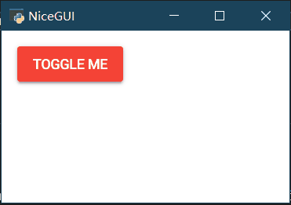

# nicegui的中文入门教程（进阶）

[TOC]

## 3 高阶技巧

NiceGUI的控件有很多，日常开发中，除了了解常用控件之外，不常用的控件也可以在学有余力的时候看看。当然，图形界面的开发不止对控件的了解，一些逻辑上的处理技巧，Python语言的特性与框架的结合，也是难免会遇到的难题。不过，不用怕，授人以鱼不如授人以渔，日常能遇到、能解决的难题，这里都有。

### 3.1 with的技巧

with可以嵌套使用，来实现类似HTML中div嵌套的效果，比如：

```python3
from nicegui import ui

with ui.element('div') as div1:
    with ui.element('div') as div2:
        ui.label('div in div')

ui.run(native=True)
```

也可以缩减一行，让代码更加紧凑：

```python3
from nicegui import ui

with ui.element('div') as div1, ui.element('div') as div2:
    ui.label('div in div')

ui.run(native=True)
```

### 3.2 slot的技巧

其实，所有的`with element`都是修改了 element 中名为`default`的slot。基于这个操作原理，可以借用`add_slot`的方法，结合`wiht`的用法，优雅、快捷地美化元素，实现复杂的布局。

比如，`ui.dropdown_button`有两个slot，`default`和`label`；其中，`default`就是默认的slot，常规方法就可以嵌入元素到弹出的下拉列表里，如果想要像修改`ui.button`一样修改`ui.dropdown_button`本身，则要修改`ui.dropdown_button`的`label`这个slot，代码如下：

```python3
from nicegui import ui

with ui.dropdown_button('button_'):
     ui.label('default slot')
#和上面的代码相同，主要是为了和下面的代码对比
with ui.dropdown_button('button_').add_slot('default'):
     ui.label('default slot')
#修改另一个slot，可以查看不同的效果
with ui.dropdown_button('button_').add_slot('label'):
     ui.label('default slot')
#可以对比 dropdown_button 和 button 的显示效果
with ui.button('button_').add_slot('default'):
     ui.label('default slot')

ui.run(native=True)
```


### 3.3 tailwindcss的技巧

不同于CSS定义中伪类在冒号之后来定义效果，在tailwindcss中，美化悬停（hover）和激活（active），需要放在冒号之前，冒号后紧随着要对状态应用的效果。比如，要实现标签背景颜色的悬停为红色、点击为黄色，代码如下：

```python3
from nicegui import ui

ui.label('label').classes('w-16 h-8 bg-green-400 hover:bg-red-400 active:bg-yellow-400')

ui.run(native=True)
```


类似的，还可以实现暗黑模式（dark）下的颜色定义，点击switch来切换暗黑模式的开关，可以看到标签在暗黑模式下的背景颜色为红色，非暗黑模式下的背景颜色为绿色，代码如下：

```python3
from nicegui import ui

ui.label('label').classes('w-16 h-8 bg-green-400 dark:bg-red-400')
dark_mode = ui.dark_mode()
switch = ui.switch('Dark Mode',on_change=lambda :dark_mode.set_value(switch.value))

ui.run(native=True)
```


在此基础上，还有一种根据屏幕宽度调整显示的技巧，就是将冒号前的单词换成代表屏幕宽度的断点`sm`、`md`、`lg`、`xl`、`2xl`。如果要让标签的宽度随窗口大小变化自适应，也就是小窗口宽度小一些，窗口越大，宽度越大，那么，代码可以这样写：

```python3
from nicegui import ui

ui.label('label').classes('w-64 h-8 bg-green-400 sm:w-8 md:w-16 lg:w-32')

ui.run(native=True)
```


然而，运行之后，可以看到上面的代码其实有问题，按照理解这样写是没错，但断点代表的含义是，大于这个屏幕宽度值才会应用这个样式，而且一次写这么多条，等屏幕宽度同时符合两条以上条件的时候，CSS就会处于竞争选择的状态，虽然样式上表现可能没问题，但规范要求应该明确断点范围，就好像写分段函数一样，必须明确区间。

所以，正确的根据屏幕宽度使用不同的样式应该这样写。使用`max-*`来表示最大到什么大小使用什么样式，使用冒号表示区间范围。于是，可以用`sm:max-md:w-16`来表示`sm`到`md`的范围内使用`w-16`的宽度样式，具体代码如下：

```python3
from nicegui import ui

ui.label('label').classes('h-8 bg-green-400 max-sm:w-8 sm:max-md:w-16 md:max-lg:w-32 lg:w-64')

ui.run(native=True)
```

### 3.4 自定义控件

#### 3.4.1 通过继承nicegui现有控件来创建新控件

在python中，可以通过继承来扩展现有类的功能，这个操作对于nicegui同样适用。

如果想要基于button实现一个可以通过点击切换颜色的按钮，可以这样做：

继承现有的控件类`ui.button`，先在`__init__`内调用父类的初始化方法；然后增加`_state`属性，默认为`False`，用于保存状态；最后定义点击事件的响应调用自身的`toggle`方法。

增加`toggle`方法，在方法内实现每次调用就翻转`_state`属性，并调用自身的`update`方法来更新显示。

重写`update`方法，先要根据`_state`属性设定button的显示颜色（动态更新`color`属性，详见Quasar提供的API），调用父类的`update`方法更新显示。

代码如下：

```python3
from nicegui import ui

class ToggleButton(ui.button):

    def __init__(self, *args, **kwargs) -> None:
        super().__init__(*args, **kwargs)
        self._state = False
        self.on('click', self.toggle)

    def toggle(self) -> None:
        """Toggle the button state."""
        self._state = not self._state
        self.update()

    def update(self) -> None:
        self.props(f'color={"green" if self._state else "red"}')
        super().update()

ToggleButton('Toggle me')

ui.run(native=True)
```



#### 3.4.2 使用Quasar的标签定义新控件

如果想要实现的功能比较复杂，但是Quasar提供了nicegui没有实现的组件，还有一种简单的方法创建新控件。

Quasar有一个浮动功能按钮[Floating Action Button](https://quasar.dev/vue-components/floating-action-button#introduction)，但nicegui没有实现。浮动功能按钮在Quasar的使用代码是：

```html
<q-fab color="green" icon="navigation" >
    <q-fab-action color="green-5" icon="train" />
    <q-fab-action color="green-5" icon="sailing" />
    <q-fab-action color="green-5" icon="rocket" />
</q-fab>
```

对应地，将HTML标签嵌套关系转换为python代码，`q-fab`标签就变成了`ui.element('q-fab')`，代码如下：

```python3
from nicegui import ui

with ui.element('q-fab').props('icon=navigation color=green'):
    ui.element('q-fab-action').props('icon=train color=green-5').on('click', lambda: ui.notify('train'))
    ui.element('q-fab-action').props('icon=sailing color=green-5').on('click', lambda: ui.notify('boat'))
    ui.element('q-fab-action').props('icon=rocket color=green-5').on('click', lambda: ui.notify('rocket'))
    
ui.run(native=True)
```


### 3.5 for循环的技巧

#### 3.5.1 用for创建多个有规律的控件

有时候，要创建多个外观一致或者有规律的控件，一个一个写代码或者复制粘贴的话，就不太pythonic了。在Python中，可以使用for来遍历迭代，同样可以使用for来创建多个外观一致或者有规律的控件。

```python3
from nicegui import ui

with ui.grid(rows=3,columns=3):
    for i in range(9):
        ui.button(i)

ui.run(native=True)
```


#### 3.5.2 与lambda组合使用时的问题

除了要创建一样的控件，还要给每个控件添加事件响应的话，每次都写一遍函数定义未免大材小用，更何况同名函数会出现覆盖，让函数名动态变化又没那么简单。这个时候Python的匿名函数——lambda表达式就派上用场了。lambda表达式可以创建语句简单的匿名函数，不必担心函数名重复的情况。比如，在下面的代码中，通过使用lambda表达式，让按钮的点击操作变成弹出一条通知。

```python3
from nicegui import ui

with ui.grid(rows=3,columns=3):
    for i in range(9):
        ui.button(i,on_click=lambda :ui.notify(i))

ui.run(native=True)
```

不过，事情并没有看上去那么简单，当写完代码开始执行的时候，才发现每个按钮的点击结果都一样，都是弹出内容为8的通知，这是为何？

原来，使用lambda表达式执行的`ui.notify(i)`，因为表达式没有绑定默认值，实际上绑定到了动态的`i`上，按钮的on_click的定义不是第一时间执行，而是在完成定义之后响应用户的操作。最终，当for完成遍历之后，动态的`i`已经被赋值为8，因此按钮的响应操作中的`i`都被统一修改了。为了避免这种情况，需要修改一下lambda表达式，添加一个参数并绑定默认值：

```python3
from nicegui import ui

with ui.grid(rows=3,columns=3):
    for i in range(9):
        ui.button(i,on_click=lambda i=i:ui.notify(i))

ui.run(native=True)
```

修改之后的`lambda i=i:ui.notify(i)`中，`i=i`的意思是lambda表达式里的i变成了函数的参数i，而这个i绑定到了外部的i当时值。

当然，实际代码中不建议这样写，太容易混淆了（怕被裁员倒是可以这样做）。

上面的代码可以再修改一下，让可读性变得更好：

```python3
from nicegui import ui

with ui.grid(rows=3, columns=3):
    for i in range(9):
        ui.button(i, on_click=lambda x=i: ui.notify(x))

ui.run(native=True)
```

#### 3.5.3 更好的for循环

为了确保批量生成之后还能访问每个控件，最好将批量生成的控件存储到列表里（不建议使用元组，没法修改；字典非必要也别用，字典的结构有点复杂，除非是列表没法实现需求）。

以下面的代码为例，使用buttons创建一个列表，在列表中用列表生成式来创建多个控件。后续如果需要修改某一个控件，就可以通过buttons来访问任意一个控件，这里是将第一个按钮隐藏。

```python3
from nicegui import ui

with ui.grid(rows=3,columns=3):
    buttons = [ui.button(i,on_click=lambda x=i:ui.notify(x)) for i in range(9)]

buttons[0].tailwind.visibility('invisible')

ui.run(native=True)
```


### 3.6 binding的技巧

#### 3.6.1 绑定到字典

在入门基础里提到的binding只介绍如何绑定两个控件，其实，binding除了绑定另一个控件，还支持绑定字典。绑定控件时，`target_object`是控件对象，这里则换成字典对象；`target_name`是控件对象的属性名，这里则换成字典的key，于是，就有了以下代码：

```python3
from nicegui import ui

data = {'name': 'Bob', 'age': 17}

ui.label().bind_text_from(data, 'name', backward=lambda n: f'Name: {n}')
ui.label().bind_text_from(data, 'age', backward=lambda a: f'Age: {a}')

ui.input(label='name:').bind_value(data,'name')
ui.number(label='age:').bind_value(data,'age',forward=lambda x:int(x))

ui.run(native=True)
```


要注意的是，ui.number的值输出为小数，如果不增加`forward=lambda x:int(x)`的话，`data['age']`会被修改为小数，而不是整数。同理，ui.input的值输出为字符串，如果字典输入不是字符串的话，在输出时需要转换。

#### 3.6.2 绑定到全局变量

还是上一节的代码，假如有人说：“字典还是有点复杂，能不能绑定到一个简单的变量上？”

怎么办？

也就是说，data字典没有了，取而代之的是：

```python3
name = 'Bob'
age = 17
```

其实也简单，只要将`data`换成`globals()`即可：

```python3
from nicegui import ui

name = 'Bob'
age = 17

ui.label().bind_text_from(globals(), 'name', backward=lambda n: f'Name: {n}')
ui.label().bind_text_from(globals(), 'age', backward=lambda a: f'Age: {a}')

ui.input(label='name:').bind_value(globals(), 'name')
ui.number(label='age:').bind_value(globals(), 'age', forward=lambda x: int(x))

ui.run(native=True)
```

任何在py文件内定义的全局变量，都会成为全局变量字典的一个键值，可以使用`globals()`访问全局变量字典。

#### 3.6.3 性能优化

在NiceGUI中有两种类型的绑定：

1.   "Bindable properties" （可绑定属性）会自动检测写入访问并触发值变动传播。大多数 NiceGUI 元素使用这种可绑定属性，例如`ui.input`的`value`或 `ui.label`的`text`。基本上所有带有`bind()`方法的属性都支持这种类型的绑定。
2.   另一种绑定"active links"（活动链接）不会自动检测写入访问并触发值变动传播。如果将标签文本绑定到字典或自定义数据模型的属性，NiceGUI 的绑定模块则需要主动检查值是否发生变化。这个主动检查是通过每 0.1 秒运行一次`refresh_loop()`来完成。主动检查间隔可以通过设置`ui.run()`的参数`binding_refresh_interval`来修改。

可绑定属性非常高效，只要值不变，就不会产生任何性能开销（相对而言比较小而已）。但活动链接需要每秒检查所有绑定值10 次。这可能会消耗比较多的性能，尤其是活动链接的绑定关系非常复杂、非常多的时候。

因为不能让主线程阻塞太久，所以如果太多主动检查导致运行`refresh_loop()`的耗时过长，程序会发出警告。当然，可以配置阈值`binding.MAX_PROPAGATION_TIME`（默认为 0.01 秒）来消除警告。但是，这个警告是有意义的，是在告诉开发者性能可能存在问题。比如，CPU在更新绑定花费太长时间的话，主线程就没法做别的事情，程序界面会因此卡住。

为了避免性能出问题，需要将活动链接改为可绑定属性之间的绑定，需要使用`binding.BindableProperty()`来创建可绑定属性。于是，基于第一小节的代码，将字典改为数据类，在数据类中定义两个可绑定属性，控件的绑定改为与数据类对象的绑定。代码如下：

```python3
from nicegui import ui, binding

class data_base:
    name = binding.BindableProperty()
    age = binding.BindableProperty()
    def __init__(self) -> None:
        self.name = 'Bob'
        self.age = 17

data =data_base()

ui.label().bind_text_from(data, 'name', backward=lambda n: f'Name: {n}')
ui.label().bind_text_from(data, 'age', backward=lambda a: f'Age: {a}')

ui.input(label='name:').bind_value(data,'name')
ui.number(label='age:').bind_value(data,'age',forward=lambda x:int(x))

ui.run(native=True)
```

因为代码中的绑定数量很少，因此差异不大，如果将绑定数量放大百倍，就能看出两种绑定的性能差异。

### 3.7 app.storage的技巧

有时候，网页上不同页面、用户需要存储、共享特定数据，依靠自己编程实现的话确实麻烦。好在NiceGUI提供了一种简单有效的数据存储功能，那就是`app.storage`（存储）。 存储有5个子字典，分别对应着不同的空间，有不同的应用范围：

-   `app.storage.tab`：存储在服务器的内存中，此字典对于每个选项卡、会话都是唯一的，可以存储任意对象。需要注意的是，在实现 https://github.com/zauberzeug/nicegui/discussions/2841 之前，重启服务器会导致此字典的数据丢失。此外，此字典只能在仅在[`ui.page`](https://nicegui.io/documentation/page)中使用，并且需要等待客户端建立连接（确保读写此字典的操作在异步函数内的 [`await ui.context.client.connected()`](https://nicegui.io/documentation/page#wait_for_client_connection)之后）。
-   `app.storage.client`：该字典也存储在服务器的内存中，对于每个客户端连接都是唯一的，并且可以存储任意对象。当页面重新加载或用户导航到另一个页面时，数据将被销毁。不同于能在服务器上保存数据好几天的`app.storage.tab`，`app.storage.client`更适合缓存频繁使用、一次性的数据。比如，需要动态更新的数据或者数据库连接，但希望在用户离开页面或关闭浏览器时立即销毁。同样的，这个字典只能在[`ui.page`](https://nicegui.io/documentation/page)中使用。
-   `app.storage.user`：存储在服务器磁盘中，每个字典都与浏览器cookie中保存的唯一标识符相关联，换句话说，此字典对于每个用户都是唯一的，并与浏览器的其他选项卡共享。可以通过存储在`app.storage.browser['id']`的标识符识别用户、会话。同样的，这个字典只能在[`ui.page`](https://nicegui.io/documentation/page)中使用。此外，这个字典需要设置`ui.run()`的`storage_secret`参数来签名浏览器会话cookie。
-   `app.storage.general`：该字典也存储在服务器磁盘中，提供了所有用户都可以访问的共享存储空间。
-   `app.storage.browser`：与前几个字典不同，此字典直接存储为浏览器会话cookie，在同一用户的所有浏览器选项卡之间共享。虽然很多方面看起来很像`app.storage.user`，不过，`app.storage.user`因为其在减少数据负载、增强安全性和提供更大存储容量方面的优势，在实际使用中比`app.storage.browser`更受欢迎。默认情况下，NiceGUI会在`app.storage.browser['id']`中为每个浏览器会话保留一个唯一标识符。同样的，这个字典只能在[`ui.page`](https://nicegui.io/documentation/page)中使用。此外，这个字典需要设置`ui.run()`的`storage_secret`参数来签名浏览器会话cookie。

如果因为上述介绍看起来不够直观，而在选用存储字典时候头疼，可以参考下面的对比表格快速选用（✅表示是，❌表示否）：

| 存储的子字典                     |   `tab`    |  `client`  |   `user`   | `general`  | `browser` |
| :------------------------------- | :--------: | :--------: | :--------: | :--------: | :-------: |
| 存储位置                         | 服务器内存 | 服务器内存 | 服务器磁盘 | 服务器磁盘 |  浏览器   |
| 是否在不同选项卡之间共享         |     ❌      |     ❌      |     ✅      |     ✅      |     ✅     |
| 是否在不同浏览器客户端之间共享   |     ❌      |     ❌      |     ❌      |     ✅      |     ❌     |
| 是否在服务器重启后保留数据       |     ❌      |     ❌      |     ❌      |     ✅      |     ❌     |
| 是否在页面重载后保留数据         |     ✅      |     ❌      |     ✅      |     ✅      |     ✅     |
| 是否只能用在ui.page内            |     ✅      |     ✅      |     ✅      |     ❌      |     ✅     |
| 是否需要客户端建立连接           |     ✅      |     ❌      |     ❌      |     ❌      |     ❌     |
| 是否只能在响应之前写入           |     ❌      |     ❌      |     ❌      |     ❌      |     ✅     |
| 是否要求数据可序列化             |     ❌      |     ❌      |     ✅      |     ✅      |     ✅     |
| 是否需要设置`storage_secret`参数 |     ❌      |     ❌      |     ✅      |     ❌      |     ✅     |

下面是个使用存储字典的简单例子：

```python3
from nicegui import app, ui

@ui.page('/')
def index():
    app.storage.user['count'] = app.storage.user.get('count', 0) + 1
    with ui.row():
       ui.label('your own page visits:')
       ui.label().bind_text_from(app.storage.user, 'count')

ui.run(storage_secret='private_key')
```

默认数据是以无缩进的JSON格式存储在`app.storage.user` 和`app.storage.general`中，可以将`app.storage.user.indent`、`app.storage.general.indent`设置为`True`来让对应存储字典的数据采用2个空格的缩进格式。

### 3.8 修改指定元素的技巧

在CSS中，有个非常重要的概念叫选择器。

每一条css样式定义由两部分组成，形式如下：

 ```css
 选择器{样式}
 ```

在{}之前的部分就是“选择器”。 “选择器”指明了{}中的“样式”的作用对象，也就是“样式”作用于网页中的哪些元素。

选择器有一套自己的[语法规则](https://developer.mozilla.org/en-US/docs/Learn/CSS/Building_blocks/Selectors)，通过合理设置选择器的规则，可以很精准地选择指定元素。

NiceGUI简化了不少CSS上的操作，但不代表不需要CSS的基础。如果读者掌握了CSS的选择器，与ui.query和ui.teleport结合使用，那就如同得到了屠龙宝刀，操作界面布局、美化界面将更加得心应手。

注意，前两小节要求读者具备CSS选择器基础，没有相应基础的读者可以搁置前两小节，直接看第三小节。

#### 3.8.1 ui.query

前面讲过如何美化控件，即在控件定义时使用props、classes、style等方法美化控件，也可以在控件定义好之后，通过给定的变量名调用相应方法。但是，如果想要美化的控件、元素根本就不是定义出来的，而是框架带出来的，想要美化就有点麻烦。当然，直接修改内置样式、源码很直观，但麻烦。要是有种方法能让想要修改的内容就像被定义为变量一样，后续直接使用，那就方便不少。正巧，ui.query就有这样的功能。

ui.query只有一个字符串类型参数`selector`，顾名思义，就是前面提到的选择器。通过给ui.query传入选择器语法，ui.query将返回CSS选择器能够选择的元素，后续可以直接对该元素执行样式美化的方法。

下面的代码就是使用ui.query选择了body（网页的主体），并设置body的背景颜色：

```python3
from nicegui import ui

body = ui.query(selector='body')
body.classes('bg-blue-400')

ui.run(native=True)
```


ui.query的用法很简单，难点在于确定CSS选择器的写法，这一部分属于CSS基础知识，这里就不再赘述，有能力的读者可以抽时间深入学习CSS选择器的语法。

#### 3.8.2 ui.teleport

肯定有读者在学了ui.query美化指定元素之后，突发奇想，想要给指定元素内部添加控件，比如，下面的代码：

```python3
from nicegui import ui

markdown = ui.markdown('Enter your **name**!')
with ui.query(f'#c{markdown.id} strong'):
    ui.input('name').classes('inline-flex').props('dense outlined')

ui.run(native=True)
```

然而，这段代码并不能成功运行，因为ui.query并不支持add_slot。如果想要实现类似效果，只需将ui.query换成ui.teleport即可，不过传递的参数名不是`selector`，而是`to`：

```python3
from nicegui import ui

markdown = ui.markdown('Enter your **name**!')
with ui.teleport(to=f'#c{markdown.id} strong'):
    ui.input('name').classes('inline-flex').props('dense outlined')

ui.run(native=True)
```


ui.teleport就是这样一个基于CSS选择器语法将任意控件传送至指定位置的控件。

#### 3.8.3 ElementFilter

暂时不会CSS选择器语法的读者也不用着急，尽管CSS选择器语法很强大，但在Python中不够直观，想要快速确定选择器还要去网页中开启调试模式。好在NiceGUI提供了另一种不需要CSS选择器的定位指定元素工具，那就是ElementFilter。

ElementFilter和ui模块同级，使用`from nicegui import ElementFilter`来导入。

ElementFilter的功能等于ui.query加ui.teleport，既能设置指定元素的样式，又能将控件传送到指定位置。但与ui.query和ui.teleport使用CSS选择器语法不同，ElementFilter的筛选方式更Pythonic，更直观，更契合python编程习惯。

以下代码是用于匹配的模板内容，以下面的代码为例，分别看看ElementFilter不同参数、方法的用途：

```python3
from nicegui import ui,ElementFilter

with ui.card():
    ui.button('button A')
    ui.label('label A_A')
    ui.label('label A_B')

with ui.card():
    ui.button('button B')
    ui.label('label B_A')
    ui.label('label B_B')

ui.run(native=True)
```

##### 3.8.3.1 初始化方法

ElementFilter是一个类，需要初始化为对象实例才能使用。ElementFilter的初始化方法有四个参数，分别是 `kind` 、`marker` 、`content` 、`local_scope`。

`kind`参数，NiceGUI的ui类型，表示筛选什么类型的控件。比如，在下面的代码中，传入的参数是`ui.label`，ElementFilter就会筛选ui.label，这样给ElementFilter对象设置背景颜色为红色的时候，页面内所有的ui.label的背景颜色就相应变成红色。

```python3
from nicegui import ui,ElementFilter

with ui.card():
    ui.button('button A')
    ui.label('label A_A')
    ui.label('label A_B')

with ui.card():
    ui.button('button B')
    ui.label('label B_A')
    ui.label('label B_B')

ElementFilter(kind=ui.label).classes('bg-red')

ui.run(native=True)
```


`marker`参数，字符串类型或者字符串列表类型，表示筛选包含指定mark或者指定mark列表的对象。

在此，需要额外介绍一下控件的mark方法，也就是如何给控件添加marker。对于每一个ui控件，都可以通过mark方法定义一组marker，用于ElementFilter的筛选。mark方法的参数是一个支持解包、分解的字符串类型参数`markers`。也就是说，传入`'A'` 、`'A','B','AB'`、`'B A BA'`、`'A','B BA'`都是可以的。本质上说，mark方法就是将传入的字符串转换为该对象的`_markers`列表。对于`'A','B','AB'`这样多个字符串，该方法会转化为`['B','A','AB']`这样的列表来使用。对于`'B A BA'`这样用空格划分的字符串，该方法会自动以空格为分隔符分解为`['B','A','BA']`这样的列表来使用。当然，两种方法混用也没问题，`'A','B BA'`这样的多个字符串，则会转化为`['A','B','BA']`这样的列表。注意，虽然mark方法支持串联、重复使用，但最好不要这样做，因为后执行的mark会覆盖先前mark方法的结果，如果是想清除之前的marker，倒是可以重复执行。

说完给控件添加marker，下面回归正题，说说如何筛选。`marker`参数和mark方法的`markers`参数类似，只不过`marker`参数没有解包过程，想要传入多个字符串，只能使用字符串列表。与mark方法的宽松不同，`marker`参数的要求比较严格，要么是纯字符串，带空格的会自动划分、转化为列表，要么是无空格的字符串组成列表，不支持正确解析内含带空格的字符串列表，所以，只有以下格式才是正确的用法：`'A'` 、`['A','B','AB']`、`'B A BA'`。

代码示例如下：

```python3
from nicegui import ui,ElementFilter

with ui.card():
    ui.button('button A')
    ui.label('label A_A').mark('A')
    ui.label('label A_B').mark('A','B','AB')

with ui.card():
    ui.button('button B')
    ui.label('label B_B').mark('B')
    ui.label('label B_A').mark('B A BA')
    
ElementFilter(marker='BA').classes('bg-red')
#ElementFilter(marker='A B').classes('bg-red')
#ElementFilter(marker=['A','B']).classes('bg-red')

ui.run(native=True)
```


`content`参数，字符串类型或者字符串列表类型，表示筛选包含指定内容的对象。筛选范围包括对象的value、text、label、icon、placeholder等文本属性。匹配要求完全包含指定字符串或者字符串列表。

```python3
from nicegui import ui,ElementFilter

with ui.card():
    ui.button('button A')
    ui.label('label A_A').mark('A')
    ui.label('label A_B').mark('A','B','AB')

with ui.card():
    ui.button('button B')
    ui.label('label B_B').mark('B')
    ui.label('label B_A').mark('B A BA')
    
ElementFilter(content=['B','A']).classes('bg-red')

ui.run(native=True)
```


`local_scope`参数，布尔类型，表示ElementFilter匹配当前范围还是全局，默认为`False`，即匹配全局。如果设置为`True`，则只匹配当前上下文。可以看以下代码，修改了缩进并将此参数设置为`True`，ElementFilter对象就只能匹配同一缩进内的控件：

```python3
from nicegui import ui,ElementFilter

with ui.card():
    ui.button('button A')
    ui.label('label A_A').mark('A')
    ui.label('label A_B').mark('A','B','AB')

with ui.card():
    ui.button('button B')
    ui.label('label B_B').mark('B')
    ui.label('label B_A').mark('B A BA')
    ElementFilter(content=['B','A'],local_scope=True).classes('bg-red')

ui.run(native=True)
```


##### 3.8.3.2 `within`方法和`not_within`方法

顾名思义，这两个方法就是在ElementFilter初始化参数的筛选范围内进一步筛选指定的父级对象，得到在指定的父级对象上下文之内、不在指定的父级对象上下文之内的对象。对`within`方法而言，会得到符合该方法匹配条件的对象。对`not_within`方法而言，会排除符合该方法匹配条件的对象

两个方法的参数都一样，都是三个，分别是`kind`、`marker`、`instance`。

`kind`和`marker`与初始化方法的参数一样，这里不再赘述。只是，这里的`marker`不支持字符串列表。

`instance`参数，对象或者对象列表，指定具体对象的范围内是否筛选。以 `within`方法为例，给此参数传递具体对象，ElementFilter将只筛选在该对象之内的ui.label：

```python3
from nicegui import ui,ElementFilter

with ui.card() as card1:
    ui.button('button A')
    ui.label('label A_A').mark('A')
    ui.label('label A_B').mark('A','B','AB')

with ui.card() as card2:
    ui.button('button B')
    ui.label('label B_B').mark('B')
    ui.label('label B_A').mark('B A BA')

ElementFilter(kind=ui.label).within(instance=card2).classes('bg-red')

ui.run(native=True)
```


这两个方法支持串联调用，不过串联就和传递列表给参数一样，是扩展了对应筛选条件的内部列表。对于这两种筛选条件的内部列表，匹配规则是不一样的：对于`within`方法，筛选则是要求列表内元素全部匹配；对于`not_within`方法，筛选则是要求列表内元素任意一个匹配。

##### 3.8.3.3 `exclude`方法

该方法是在ElementFilter初始化参数的筛选范围内进一步排除指定的对象。

该方法有三个参数，`kind` 、`marker` 、`content` ，同初始化方法的参数一样，这里简单说一下示例代码，不做详解。不过，该方法的三个参数不支持传入列表，`marker`也不支持根据空格自动划分字符串，这一点需要注意。

```python3
from nicegui import ui,ElementFilter
from nicegui.elements.mixins.text_element import TextElement

with ui.card() as card1:
    ui.button('button A')
    ui.label('label A_A').mark('A')
    ui.label('label A_B').mark('A','B','AB')

with ui.card() as card2:
    ui.button('button B')
    ui.label('label B_B').mark('B')
    ui.label('label B_A').mark('B A BA')

ElementFilter(kind=TextElement).exclude(kind=ui.label).classes('bg-red')

ui.run(native=True)
```


ui.label和ui.button都继承了TextElement，因此匹配TextElement会同时匹配到这两种控件，因此，在exclude方法中指定kind为ui.label之后，匹配结果就排除了ui.label，只有ui.button的颜色变成红色。

##### 3.8.3.4 传送控件到匹配结果

对于ElementFilter，想要传送控件到结果也很简单，只需遍历ElementFilter对象，就能获取匹配结果。

如下面代码所示，使用for遍历ElementFilter对象，使用with进入每个元素的上下文，就和正常添加控件到对应slot一样：

```python3
from nicegui import ui,ElementFilter
from nicegui.elements.mixins.text_element import TextElement

with ui.card() as card1:
    ui.button('button A')
    ui.label('label A_A').mark('A')
    ui.label('label A_B').mark('A','B','AB')

with ui.card() as card2:
    ui.button('button B')
    ui.label('label B_B').mark('B')
    ui.label('label B_A').mark('B A BA')

for ele in ElementFilter(kind=TextElement).exclude(kind=ui.label).classes('bg-red'):
    with ele:
        ui.icon('home')

ui.run(native=True)
```


##### 3.8.3.5 总结

ElementFilter的方法、参数不多，但用法不统一，要是组合使用，需要一些时间思考其匹配模式。而有的读者看到文字太多就头疼，没关系，这里将上面的内容简化为一个表格方便查阅。详细看过一遍文字教程之后，后续开发中再次遇到，可以快速参阅表格来确定匹配模式。

对应参数的匹配模式：

| ElementFilter的方法 | `__init__` | `within` | `not_within` | `exclude` |
| ------------------- | ---------- | -------- | ------------ | --------- |
| `kind`参数          | 任意一个   | 全部匹配 | 任意一个     | 任意一个  |
| `content`参数       | 全部匹配   | 无此参数 | 无此参数     | 任意一个  |
| `instance`参数      | 无此参数   | 全部匹配 | 任意一个     | 无此参数  |
| `marker`参数        | 全部匹配   | 全部匹配 | 任意一个     | 任意一个  |

Match type for parameters in ElementFilter's method:

| ElementFilter's method | `__init__` | `within` | `not_within` | `exclude` |
| ---------------------- | ---------- | -------- | ------------ | --------- |
| parameter `kind`       | any/or     | all/and  | any/or       | any/or    |
| parameter `content`    | all/and    | ----     | ----         | any/or    |
| parameter `instance`   | ----       | all/and  | any/or       | ----      |
| parameter `marker`     | all/and    | all/and  | any/or       | any/or    |

另外，对于NiceGUI2.1版本的ElementFilter部分方法参数不支持列表传入，这里特地补丁了一份模块文件，有需要的读者可以自行替换，文件的具体路径为`.venv\Lib\site-packages\nicegui\element_filter.py`，如果是全局环境的Python，路径为`{Python执可执行文件所在目录}\Lib\site-packages\nicegui\element_filter.py`

```python3
from __future__ import annotations

from typing import Generic, Iterator, List, Optional, Type, TypeVar, Union, overload

from typing_extensions import Self

from .context import context
from .element import Element
from .elements.mixins.content_element import ContentElement
from .elements.mixins.source_element import SourceElement
from .elements.mixins.text_element import TextElement
from .elements.notification import Notification
from .elements.select import Select

T = TypeVar('T', bound=Element)


class ElementFilter(Generic[T]):
    DEFAULT_LOCAL_SCOPE = False

    @overload
    def __init__(self: ElementFilter[Element], *,
                 marker: Union[str, List[str], None] = None,
                 content: Union[str, List[str], None] = None,
                 local_scope: bool = DEFAULT_LOCAL_SCOPE,
                 ) -> None:
        ...

    @overload
    def __init__(self, *,
                 kind: Union[Type[T], List[Type[T]], None] = None,
                 marker: Union[str, List[str], None] = None,
                 content: Union[str, List[str], None] = None,
                 local_scope: bool = DEFAULT_LOCAL_SCOPE,
                 ) -> None:
        ...

    def __init__(self, *,
                 kind: Union[Type[T], List[Type[T]], None] = None,
                 marker: Union[str, List[str], None] = None,
                 content: Union[str, List[str], None] = None,
                 local_scope: bool = DEFAULT_LOCAL_SCOPE,
                 ) -> None:
        """ElementFilter

        Sometimes it is handy to search the Python element tree of the current page.
        ``ElementFilter()`` allows powerful filtering by kind of elements, markers and content.
        It also provides a fluent interface to apply more filters like excluding elements or filtering for elements within a specific parent.
        The filter can be used as an iterator to iterate over the found elements and is always applied while iterating and not when being instantiated.

        And element is yielded if it matches all of the following conditions:

        - The element is of the specified kind (if specified).
        - The element is none of the excluded kinds.
        - The element has all of the specified markers.
        - The element has none of the excluded markers.
        - The element contains all of the specified content.
        - The element contains none of the excluded content.

        - Its ancestors include all of the specified instances defined via ``within``.
        - Its ancestors include none of the specified instances defined via ``not_within``.
        - Its ancestors include all of the specified kinds defined via ``within``.
        - Its ancestors include none of the specified kinds defined via ``not_within``.
        - Its ancestors include all of the specified markers defined via ``within``.
        - Its ancestors include none of the specified markers defined via ``not_within``.

        Element "content" includes its text, label, icon, placeholder, value, message, content, source.
        Partial matches like "Hello" in "Hello World!" are sufficient for content filtering.
        
        :param kind: filter by element type; the iterator will be of type ``kind``
        :param marker: filter by element markers; can be a list of strings or a single string where markers are separated by whitespace
        :param content: filter for elements which contain ``content`` in one of their content attributes like ``.text``, ``.value``, ``.source``, ...; can be a singe string or a list of strings which all must match
        :param local_scope: if `True`, only elements within the current scope are returned; by default the whole page is searched (this default behavior can be changed with ``ElementFilter.DEFAULT_LOCAL_SCOPE = True``)
        """
        self._kind = kind if isinstance(kind, list) else ([kind] if kind else [])
        self._markers = marker.split() if isinstance(marker, str) else [word for single_marker in (marker or []) for word in single_marker.split()]
        self._contents = [content] if isinstance(content, str) else content or []

        self._within_kinds: List[Type[Element]] = []
        self._within_instances: List[Element] = []
        self._within_markers: List[str] = []

        self._not_within_kinds: List[Type[Element]] = []
        self._not_within_instances: List[Element] = []
        self._not_within_markers: List[str] = []

        self._exclude_kinds: List[Type[Element]] = []
        self._exclude_markers: List[str] = []
        self._exclude_content: List[str] = []

        self._scope = context.slot.parent if local_scope else context.client.layout

    def __iter__(self) -> Iterator[T]:
        for element in self._scope.descendants():
            if self._kind and not isinstance(element, tuple(self._kind)):
                continue
            if self._exclude_kinds and isinstance(element, tuple(self._exclude_kinds)):
                continue

            if any(marker not in element._markers for marker in self._markers):
                continue
            if any(marker in element._markers for marker in self._exclude_markers):
                continue

            if self._contents or self._exclude_content:
                element_contents = [content for content in (
                    element.props.get('text'),
                    element.props.get('label'),
                    element.props.get('icon'),
                    element.props.get('placeholder'),
                    element.props.get('value'),
                    element.text if isinstance(element, TextElement) else None,
                    element.content if isinstance(element, ContentElement) else None,
                    element.source if isinstance(element, SourceElement) else None,
                ) if content]
                if isinstance(element, Notification):
                    element_contents.append(element.message)
                if isinstance(element, Select):
                    options = {option['value']: option['label'] for option in element.props.get('options', [])}
                    element_contents.append(options.get(element.value, ''))
                    if element.is_showing_popup:
                        element_contents.extend(options.values())
                if any(all(needle not in str(haystack) for haystack in element_contents) for needle in self._contents):
                    continue
                if any(needle in str(haystack) for haystack in element_contents for needle in self._exclude_content):
                    continue

            ancestors = set(element.ancestors())
            if self._within_instances and not ancestors.issuperset(self._within_instances):
                continue
            if self._not_within_instances and not ancestors.isdisjoint(self._not_within_instances):
                continue
            if self._within_kinds and not all(any(isinstance(ancestor, kind) for ancestor in ancestors) for kind in self._within_kinds):
                continue
            if self._not_within_kinds and any(isinstance(ancestor, tuple(self._not_within_kinds)) for ancestor in ancestors):
                continue
            ancestor_markers = {marker for ancestor in ancestors for marker in ancestor._markers}
            if self._within_markers and not ancestor_markers.issuperset(self._within_markers):
                continue
            if self._not_within_markers and not ancestor_markers.isdisjoint(self._not_within_markers):
                continue

            yield element  # type: ignore

    def within(self, *,
               kind: Union[Element, List[Element], None] = None,
               marker: Union[str, List[str], None] = None,
               instance: Union[Element, List[Element], None] = None,
               ) -> Self:
        """Filter elements which have a specific match in the parent hierarchy."""
        if kind is not None:
            if isinstance(kind, list):
                for every_kind in kind:
                    assert issubclass(every_kind, Element)
                self._within_kinds.extend(kind)
            else:    
                assert issubclass(kind, Element)
                self._within_kinds.append(kind)
        if marker is not None:
            markers = marker.split() if isinstance(marker, str) else [word for single_marker in marker for word in single_marker.split()]
            self._within_markers.extend(markers)
        if instance is not None:
            self._within_instances.extend(instance if isinstance(instance, list) else [instance])
        return self

    def exclude(self, *,
                kind: Union[Element, List[Element], None] = None,
                marker: Union[str, List[str], None] = None,
                content: Union[str, List[str], None] = None,
                ) -> Self:
        """Exclude elements with specific element type, marker or content."""
        if kind is not None:
            if isinstance(kind, list):
                for every_kind in kind:
                    assert issubclass(every_kind, Element)
                self._exclude_kinds.extend(kind)
            else:    
                assert issubclass(kind, Element)
                self._exclude_kinds.append(kind)
        if marker is not None:
            markers = marker.split() if isinstance(marker, str) else [word for single_marker in marker for word in single_marker.split()]
            self._exclude_markers.extend(markers)
        if content is not None:
            self._exclude_content.extend([content] if isinstance(content, str) else content)
        return self

    def not_within(self, *,
                   kind: Union[Element, List[Element], None] = None,
                   marker: Union[str, List[str], None] = None,
                   instance: Union[Element, List[Element], None] = None,
                   ) -> Self:
        """Exclude elements which have a parent of a specific type or marker."""
        if kind is not None:
            if isinstance(kind, list):
                for every_kind in kind:
                    assert issubclass(every_kind, Element)
                self._not_within_kinds.extend(kind)
            else:    
                assert issubclass(kind, Element)
                self._not_within_kinds.append(kind)
        if marker is not None:
            markers = marker.split() if isinstance(marker, str) else [word for single_marker in marker for word in single_marker.split()]
            self._not_within_markers.extend(markers)
        if instance is not None:
            self._not_within_instances.extend(instance if isinstance(instance, list) else [instance])
        return self

    def classes(self, add: Optional[str] = None, *, remove: Optional[str] = None, replace: Optional[str] = None) -> Self:
        """Apply, remove, or replace HTML classes.

        This allows modifying the look of the element or its layout using `Tailwind <https://tailwindcss.com/>`_ or `Quasar <https://quasar.dev/>`_ classes.

        Removing or replacing classes can be helpful if predefined classes are not desired.

        :param add: whitespace-delimited string of classes
        :param remove: whitespace-delimited string of classes to remove from the element
        :param replace: whitespace-delimited string of classes to use instead of existing ones
        """
        for element in self:
            element.classes(add, remove=remove, replace=replace)
        return self

    def style(self, add: Optional[str] = None, *, remove: Optional[str] = None, replace: Optional[str] = None) -> Self:
        """Apply, remove, or replace CSS definitions.

        Removing or replacing styles can be helpful if the predefined style is not desired.

        :param add: semicolon-separated list of styles to add to the element
        :param remove: semicolon-separated list of styles to remove from the element
        :param replace: semicolon-separated list of styles to use instead of existing ones
        """
        for element in self:
            element.style(add, remove=remove, replace=replace)
        return self

    def props(self, add: Optional[str] = None, *, remove: Optional[str] = None) -> Self:
        """Add or remove props.

        This allows modifying the look of the element or its layout using `Quasar <https://quasar.dev/>`_ props.
        Since props are simply applied as HTML attributes, they can be used with any HTML element.

        Boolean properties are assumed ``True`` if no value is specified.

        :param add: whitespace-delimited list of either boolean values or key=value pair to add
        :param remove: whitespace-delimited list of property keys to remove
        """
        for element in self:
            element.props(add, remove=remove)
        return self

```


### 3.9 其他布局（更新中一天两个）

前面介绍过常用的布局，其实NiceGUI支持的布局控件有很多，下面提到的这些不常用，但有些需求比较刁钻，用这些布局刚好可以减少不必要的工作。

#### 3.9.1 ui.list

列表布局，看上去有点像ui.column，但列表布局主要是给ui.item用的，当然，要是想在一般布局的时候使用也没问题，不过需要注意一下二者的区别。

以代码为例：

```python3
from nicegui import ui

with ui.list().classes('border'):
    ui.item('3 Apples')
    ui.item('5 Bananas')
    ui.item('8 Strawberries')
    ui.item('13 Walnuts')

with ui.column().classes('border'):
    ui.item('3 Apples')
    ui.item('5 Bananas')
    ui.item('8 Strawberries')
    ui.item('13 Walnuts')

ui.run(native=True)
```


为了能清楚看到二者的区别，这里给两种布局加了个边框，方便看到边界。可以看出，ui.list比ui.column的默认行距小，整体看上去更加紧凑。当然，ui.list主要是给ui.item用的，默认的紧凑是有别的用途，如果在一般布局中需要紧凑一些的观感，可以根据需求调整样式，而不是使用ui.list代替ui.column。

关于ui.list更恰当的用途，还是以代码为例：

```python3
from nicegui import ui

with ui.list().props('bordered separator'):
    ui.item_label('Contacts').props('header').classes('text-bold')
    ui.separator()
    with ui.item(on_click=lambda: ui.notify('Selected contact 1')):
        with ui.item_section().props('avatar'):
            ui.icon('person')
        with ui.item_section():
            ui.item_label('Nice Guy')
            ui.item_label('name').props('caption')
        with ui.item_section().props('side'):
            ui.icon('chat')
    with ui.item(on_click=lambda: ui.notify('Selected contact 2')):
        with ui.item_section().props('avatar'):
            ui.icon('person')
        with ui.item_section():
            ui.item_label('Nice Person')
            ui.item_label('name').props('caption')
        with ui.item_section().props('side'):
            ui.icon('chat')

ui.run(native=True)
```


给ui.item内增加ui.item_section、ui.item_label等控件，可以实现类似通讯录的布局。不同于使用基本布局组合实现需要较多的样式调整，这些预定义的控件本身有很多属性样式，只需设置好对应的属性，就能让样式接近想要的效果。而且，本身的含义也比较直观，后续维护起来也方便。

#### 3.9.2 ui.splitter

前面介绍过ui.separator，可以生成一条水平或者垂直的分隔线，用来不明显地区分控件。但是，在NiceGUI中，除了ui.separator外，还有一种分隔线，那就是ui.splitter，也可以生成一条水平或者垂直的分隔线。不过，在前面没介绍这个控件，是因为这个控件的用法可比ui.separator复杂，用途也多，只是简单分隔一下，还是用ui.separator比较好。倘若对于分隔有更高的要求或者其他用途，ui.splitter绝对能胜任。

先看代码，分别用ui.separator和ui.splitter实现类似的效果：

```python3
from nicegui import ui

ui.label('separator')
with ui.card():
    ui.label('text above')
    ui.separator()
    ui.label('text below')
with ui.card(),ui.row():
    ui.label('text above')
    ui.separator().props('vertical')
    ui.label('text below')

ui.label('splitter')
with ui.card():
    splitter = ui.splitter(horizontal=True)
    with splitter.before:ui.label('text above')
    with splitter.after:ui.label('text below')
with ui.card().classes('w-56'),ui.row().classes('w-full'):
    splitter2 = ui.splitter().classes('w-full')
    with splitter2.before:ui.label('text above')
    with splitter2.after:ui.label('text below')

ui.run(native=True)
```


单看效果对比的话，ui.splitter看上去只是比ui.separator紧凑一些，似乎没什么不同。如果仔细看代码，就会发现ui.splitter的代码量比ui.separator多不少。

ui.splitter可以看做是一个容器，定义ui.splitter之后，会产生ui.splitter().before、ui.splitter().after、ui.splitter().separator三个子容器，需要分别给前两个容器填充内容，才能看到分隔效果。而且，中间的分隔线也支持添加内容和鼠标交互，可以用鼠标左右拖动。

当然，ui.splitter支持的参数不少，用起来也比ui.separator复杂：

`horizontal`参数，布尔类型，是否将ui.splitter水平显示。

`limits`参数，浮点元组类型，表示拖动分隔线的范围（最小、最大百分比），这是一个二元元组，默认为(0,100)，第一个元素表示拖动范围的最小值，，第二个元素表示拖动范围的最大值。

`value`参数，浮点类型，表示ui.splitter().before的初始大小百分比。

`reverse`参数，布尔类型，表示是否反转ui.splitter().before和ui.splitter().after先后顺序。

`on_change`参数，可调用类型，表示拖动分隔线时执行的操作。

以下代码是ui.splitter的典型运用，通过拖动分隔线，显示彩色、黑白图像的对比效果，同时弹出通知显示当前分隔线的位置：

```python3
from nicegui import ui

with ui.splitter(
    horizontal=False,
    reverse=False,
    limits=(0, 100),
    value=50,
    on_change=lambda e: ui.notify(f"Separator changed to {e.sender.value}."),
).classes("w-72 h-48").props(
    "before-class=overflow-hidden after-class=overflow-hidden"
    ) as splitter:
    with splitter.separator:
        ui.icon("lightbulb").classes("text-green")
        ui.tooltip("Move me.").classes("bg-green").props(
            'anchor="center middle" self="center middle"'
        )
    with splitter.before:
        ui.image("https://cdn.quasar.dev/img/parallax1.jpg").classes(
            "w-72 absolute-top-left"
        )
    with splitter.after:
        ui.image("https://cdn.quasar.dev/img/parallax1-bw.jpg").classes(
            "w-72 absolute-top-right"
        )

ui.run(native=True)
```


#### 3.9.3 ui.tabs

选项卡，现代浏览器的基本布局，可以通过点击上面的选项卡，切换下面的内容。

在NiceGUI中，和选项卡相关的控件有 ui.tabs、ui.tab、ui.tab_panels和ui.tab_panel。ui.tabs是放置选项卡的容器，ui.tab是选项卡，ui.tab_panels是放置选项卡关联内容的容器，ui.tab_panel则是选项卡的关联内容。

以下面的代码为例，ui.tab放置在ui.tabs内，ui.tab_panel放置在ui.tab_panels内，想要让选项卡正确关联、交互，需要确保以下参数正确设置：

1.   ui.tab_panels的参数`tabs`需要传递已经创建的ui.tabs实例；
2.   ui.tab_panel的参数`name`需要传递已经创建的ui.tab实例，或者实例的字符串参数`name`。

```python3
from nicegui import ui

with ui.tabs().classes("w-full") as tabs:
    one = ui.tab(name="One")
    two = ui.tab(name="Two")
with ui.tab_panels(tabs=tabs, value=two).classes("w-full"):
    with ui.tab_panel(name=one):
        ui.label("First tab")
    with ui.tab_panel(name='Two'):
        ui.label("Second tab")

ui.run(native=True)
```


ui.tab的`name`参数是用来区分选项卡的唯一标识符，称之为id也可以，但是，肯定有读者觉得不太方便，如果想要修改选项卡的名字，势必影响到下面ui.tab_panel的关联。其实，并不会导致这样的问题，ui.tab还有一个字符串参数`label`，如果设置了这个参数，显示在选项卡上的内容就会变成`label`而不是`name`。此外，ui.tab还支持像ui.button一样设置图标，只需给参数`icon`传入图标字符的名字即可：

```python3
from nicegui import ui

with ui.tabs().classes("w-full") as tabs:
    one = ui.tab(name="One",label='Home',icon='home')
    two = ui.tab(name="Two",label='About',icon='info')
with ui.tab_panels(tabs=tabs, value=two).classes("w-full"):
    with ui.tab_panel(name=one):
        ui.label("First tab")
    with ui.tab_panel(name='Two'):
        ui.label("Second tab")

ui.run(native=True)
```


除了通过点击交互来切换选项卡，调用ui.tabs、ui.panels的set_value方法也能切换选项卡：

```python3
from nicegui import ui

with ui.tabs().classes("w-full") as tabs:
    one = ui.tab(name="One",label='Home',icon='home')
    two = ui.tab(name="Two",label='About',icon='info')
with ui.tab_panels(tabs=tabs, value=two).classes("w-full") as panels:
    with ui.tab_panel(name=one):
        ui.label("First tab")
    with ui.tab_panel(name='Two'):
        ui.label("Second tab")

ui.button('GoTo 1', on_click=lambda: panels.set_value(one))
ui.button('GoTo 2', on_click=lambda: tabs.set_value('Two'))

ui.run(native=True)
```

想要让选项卡从水平变成垂直，只需设调用`props('vertical')`，设置`'vertical'`即可。不过，只是设置一下，界面并不会如预想中那样改变，还需要借用前面介绍到的ui.splitter：

```python3
from nicegui import ui

with ui.splitter(value=10).classes('w-full h-56') as splitter:
    with splitter.before,ui.tabs().props('vertical').classes('w-full h-56')  as tabs:
        one = ui.tab(name="One",label='Home',icon='home')
        two = ui.tab(name="Two",label='About',icon='info')
    with splitter.after,ui.tab_panels(tabs=tabs, value=two).props('vertical').classes('w-full h-56')  as panels:
        with ui.tab_panel(name=one):
            ui.label("First tab")
        with ui.tab_panel(name='Two'):
            ui.label("Second tab")

ui.run(native=True)
```


#### 3.9.4 ui.scroll_area

对于较多的内容放置在网页，会导致网页又臭又长，可以使用滚动区域当容器。滚动区域控件会生成滚动条，让内容只在指定的大小内显示，拖动滚动条可以显示其余内容。

滚动区域控件支持一个可调用类型参数`on_scroll`作为响应滚动的执行操作，通过一个事件参数捕获滚动的响应事件，并将vertical_position（当前位置的垂直位置，单位像素）、vertical_percentage（当前位置的垂直位置，单位百分比）、vertical_size（滚动内容的垂直大小，单位像素）、vertical_container_size（滚动区域容器的垂直大小，单位像素）、horizontal_position（当前位置的水平位置，单位像素）、horizontal_percentage（当前位置的水平位置，单位百分比）、horizontal_size（滚动内容的水平大小，单位像素）、horizontal_container_size（滚动区域容器的水平大小，单位像素）等属性传递出来。此外，该控件的`scroll_to`方法可以设置控件内容滚动到什么位置。

以下是简单的示例：

```python3
from nicegui import ui

with ui.row():
    with ui.scroll_area().classes('w-32 h-32 border'):
        ui.label('I scroll. ' * 20)
    with ui.column().classes('p-4 w-32 h-32 border'):
        ui.label('I will not scroll. ' * 10)

ui.run(native=True)
```


给`on_scroll`参数传入带一个参数的lambda表达式，可以捕获滚动的响应事件，该事件的属性均为浮点类型。以下面的代码为例，代码中捕获的该事件的vertical_percentage，并将其赋给ui.number：

```python3
from nicegui import ui

position = ui.number('scroll position:').props('readonly')
with ui.card().classes('w-32 h-32'):
    with ui.scroll_area(on_scroll=lambda e: position.set_value(e.vertical_percentage)):
        ui.label('I scroll. ' * 20)

ui.run(native=True)
```


`scroll_to`方法可以设置控件内容滚动到什么位置，该方法有四个参数：

`pixels`参数，浮点类型，用像素表示目标位置，不能与`percent`参数同时指定。

`percent`参数，浮点类型，用百分比表示目标位置，不能与`pixels`参数同时指定。

`axis`参数，字符串类型，限定为'vertical'或'horizontal'，默认为 'vertical'，表示滚动的方向是水平还垂直。

`duration`参数，浮点类型，表示滚动动画的持续时间，默认是0，表示启用滚动动画。

以下代码在左边滚动区域的响应事件中添加执行了右边滚动区域的scroll_to方法，让左右的滚动保持一致：

```python3
from nicegui import ui

ui.number('position', value=0, min=0, max=1, step=0.1,
          on_change=lambda e: area1.scroll_to(percent=e.value)).classes('w-32')

with ui.row():
    with ui.card().classes('w-32 h-48'):
        with ui.scroll_area(on_scroll=lambda e: area2.scroll_to(percent=e.vertical_percentage)) as area1:
            ui.label('I scroll. ' * 20)

    with ui.card().classes('w-32 h-48'):
        with ui.scroll_area() as area2:
            ui.label('I scroll. ' * 20)

ui.run(native=True)
```


#### 3.9.5 ui.skeleton

骨架控件可以提供一系列占位轮廓，当内容还没有加载的时候，用占位轮廓提供网页的内容结构预览。同时，骨架控件上的鼠标样式会显示为正忙的样式，表示内容正在加载。

以下为代码示例：

```python3
from nicegui import ui

ui.skeleton(type='rect', tag='div', animation='wave', animation_speed=1.5,
            square=False, bordered=False, size=None, width=None, height=None).classes('w-full')

ui.run(native=True)
```


`type`参数，字符串类型，表示骨架的基本形状，支持'text'、'rect'、'circle',、'QBtn'、'QBadge'、'QChip'、'QToolbar'、'QCheckbox'、'QRadio'、'QToggle'、'QSlider'、'QRange'、'QInput'、'QAvatar'，默认为'rect'。

 `tag`参数，字符串类型，表示创建骨架控件用的HTML标签，默认为'div'。

`animation`参数，字符串类型，骨架控件的动画，因为是在加载过程中占位显示，必须要有动画，以缓解用户等待期间的焦虑。支持'wave'、'pulse'、'pulse-x'、'pulse-y'、'fade'、blink'、'none'，默认为'wave'。

`animation_speed`参数，浮点类型，表示动画的速度，即在多少秒完成一次动画循环，默认为1.5。

`square`参数，布尔类型，表示是否移除骨架控件的圆角，默认为False。

`bordered`参数，布尔类型，表示是否显示骨架控件的边框，默认为False。

`size`参数，字符串类型，表示使用CSS的大小单位指定骨架控件的大小，此时骨架控件显示为正方形或者圆形（取决于`type`参数），并且会覆盖`width`参数和`height`参数的设置，默认为None。

`width`参数，字符串类型，表示使用CSS的大小单位指定骨架控件的宽度，会被`size`参数覆盖，默认为None。

`height`参数，字符串类型，表示使用CSS的大小单位指定骨架控件的高度，会被`size`参数覆盖，默认为None。

#### 3.9.6 ui.carousel

‌‌轮播图是一种常见的网页设计元素，主要用于提供网页内容的快速展示和导航。‌ 它通过切换多个图片或内容，吸引用户的注意力，提高页面的视觉吸引力。轮播图支持自定义轮播图片、轮播动画效果等，能够在可视化应用中展示多张图片轮流播放的效果。

在NiceGUI中，ui.carousel就是可以实现轮播图效果的控件，不过它的英文是carousel，翻译过来的话是旋转木马，听起来不太像控件，这里就用轮播图代替。


NiceGUI的轮播图控件，本质上是一种容器，轮播图会依次展示每个子控件，放在其中的子控件就是像一页一页的幻灯片。一般来说，轮播图子控件应该是ui.carousel_slide，实际上用其他控件也可以。

ui.carousel有五个参数：

`value`参数，字符串类型或者ui.carousel_slide，表示轮播图初始展示哪一个子控件，默认为`None`，表示展示第一个。

`on_value_change`参数，可调用类型，表示轮播图当前展示的子控件变化时，执行什么操作。

`animated`参数，布尔类型，表示是否开启切换动画。

`arrows`参数，布尔类型，表示是否显示手动切换上、下一个子控件的箭头。

`navigation`参数，布尔类型，表示是否显示下面直接切换哪一个子控件的圆点。

`previous`方法，切换上一个子控件。

`next`方法，切换下一个子控件。

ui.carousel_slide只有一个字符串参数`name`，也就是上面ui.carousel中`value`用到的指定当前页的值。默认没有指定的话，这个值是自动生成的——'slide_1'这种名字，下划线后的数字代表当前控件在所有子控件中的排序。

```python3
from nicegui import ui

with ui.carousel(animated=True, arrows=True, navigation=True, on_value_change=lambda e: ui.notify(e.value))\
    .props('autoplay=5000 infinite') as carousel:
    with ui.carousel_slide().classes('p-0'):
        ui.interactive_image(
            'https://picsum.photos/id/30/270/180').classes('w-full h-full')
    with ui.carousel_slide().classes('p-0'):
        ui.interactive_image(
            'https://picsum.photos/id/31/270/180').classes('w-full h-full')
    with ui.carousel_slide().classes('p-0'):
        ui.interactive_image(
            'https://picsum.photos/id/32/270/180').classes('w-full h-full')
with ui.row():
    ui.button(icon='arrow_left',on_click=carousel.previous)
    ui.button(icon='arrow_right',on_click=carousel.next)
    
ui.run(native=True)
```


#### 3.9.7 ui.expansion

在其他UI框架中可能叫做Accordion或者手风琴，这里也称之为手风琴控件，而不是直译其为扩大。

‌手风琴控件是一个用来展示多个面板的控件，这些面板同时只能展开一项（也可以一项都不展开），和选项卡控件有异曲同工之妙。‌手风琴控件允许在一个紧凑的空间中显示许多链接，通过单击或点击来展开和折叠，使得用户可以在一个可视化的界面中快速访问不同的信息或功能。这种控件通常包括一个或多个可折叠的面板，每个面板可以包含文本、图像或其他内容，用户可以通过点击面板的标题来展开或折叠对应的内容。手风琴控件的设计旨在提供一个直观且用户友好的界面，使用户能够轻松地在不同部分之间切换，同时保持界面的整洁和有序。

先看代码和效果图：

```python3
from nicegui import ui

with ui.expansion(
    text="Expand!",
    caption="Expand me",
    icon="work",
    group=None,
    value=False,
    on_value_change=lambda e:ui.notify(e.value),
).classes("w-full"):
    ui.label("inside the expansion")

ui.run(native=True)
```


ui.expansion有六个参数：

`text`参数，字符串类型，表示手风琴控件的文本内容。

`caption`参数，字符串类型，表示手风琴控件的说明性文本内容（也可以称之为副标题或者标签文本，比文本内容小一点）。

`icon`参数，字符串类型，表示手风琴控件的图标。

`group`参数，字符串类型，表示手风琴控件的分组，默认为`None`。其实，单个ui.expansion没法组成手风琴控件，需要多个配合。在没有指定此参数的情况下，每个ui.expansion都是独立打开、关闭的，只有在指定相同的此参数之后，各个ui.expansion的开闭才会关联，每组ui.expansion中只允许一个ui.expansion开启，点开其他ui.expansion会让已经打开的ui.expansion关闭。

`value`参数，布尔类型，表示ui.expansion的开关状态，默认为`False`。

`on_value_change`参数，可调用类型，表示手风琴控件的值变化时执行什么操作。

`open`方法，调用此方法会打开手风琴控件。

`close`方法，调用此方法会关闭手风琴控件。

如果想用图片代替手风琴控件的图标，可以这样操作：

```python3
from nicegui import ui

with ui.expansion() as expansion:
    with expansion.add_slot('header'):
        with ui.row().classes('items-center'):
            ui.image('https://nicegui.io/logo.png').classes('w-16')
            ui.label('LOGO')
    ui.label('What a nice GUI!')

ui.run(native=True)
```


前面提到的`group`参数，用法也很简单：

```python3
from nicegui import ui

with ui.expansion(text='Expand One!', group='group'):
    ui.label('inside expansion one')
with ui.expansion(text='Expand Two!', group='group'):
    ui.label('inside expansion two')
with ui.expansion(text='Expand Three!', group='group'):
    ui.label('inside expansion three')

ui.run(native=True)
```


#### 3.9.8 ui.pagination

常在网页中看到多页内容的底部有标着页码的分页控件，点击后一页或者对应页码可以直接跳转。在NiceGUI，实现此功能的是ui.pagination。

```python3
from nicegui import ui

p = {"value": 0}
ui.label().bind_text_from(p, "value", lambda v: f"Page {v}")
ui.pagination(
    min=1,
    max=5,
    direction_links=False,
    value=1,
    on_change=lambda e: ui.notify(e.value)
).bind_value_to(p)


ui.run(native=True)
```


ui.pagination有五个参数：

`min`参数，整数类型，分页控件的页码最小值。

`max`参数，整数类型，分页控件的页码最小值。

`direction_links`参数，布尔类型，是否显示前一页、后一页的链接。

`value`参数，整数类型，分页控件的页码初始值。如果没有指定初始值，初始值是最小值。

`on_change`参数，可调用类型，表示分页控件的值变化时执行什么操作。

分页控件的更多样式设计可以参考[Quasar官网](https://quasar.dev/vue-components/pagination#qpagination-api)：

```python3
from nicegui import ui

p = {"value": 0}
ui.label().bind_text_from(p, "value", lambda v: f"Page {v}")
ui.pagination(
    min=1,
    max=5,
    direction_links=True,
    value=1,
    on_change=lambda e: ui.notify(e.value)
).props('''
        boundary-links 
        input
        icon-first="skip_previous"
        icon-last="skip_next"
        icon-prev="fast_rewind"
        icon-next="fast_forward"
        ''').bind_value_to(p)

ui.run(native=True)
```


#### 3.9.9 ui.stepper（更新中）


#### 3.9.10 ui.timeline


#### 3.9.11 ui.notification


#### 3.9.12 ui.dialog


#### 3.9.13 ui.menu补充

嵌入其他内容

#### 3.9.14 ui.tooltip补充 

嵌入其他内容


### 3.10 其他数据展示控件（更新中一天一个）

#### 3.10.1 ui.table


#### 3.10.2 ui.aggrid


#### 3.10.3 ui.highchart


#### 3.10.4 ui.echart


#### 3.10.5 ui.pyplot


#### 3.10.6 ui.matplotlib


#### 3.10.7 ui.line_plot


#### 3.10.8 ui.plotly


#### 3.10.9 ui.tree


#### 3.10.10 ui.log


#### 3.10.11 ui.editor


#### 3.10.12 ui.json_editor


#### 3.10.13 ui.codemirror


#### 3.10.14 ui.scene


### 3.11 多媒体控件的使用技巧

#### 3.11.1 ui.interactive_image的交互技巧

interactive，顾名思义，就是交互性。既然ui.interactive_image是交互性图像，只是当成普通图像的加强版使用，而不学习它的交互能力实在说不过去。

通过捕获鼠标事件参数，可以获取到鼠标点击的事件种类`type`、鼠标位置`image_x\image_y`:

```python3
from nicegui import ui

src = 'https://picsum.photos/id/565/640/360'
ui.interactive_image(src, on_mouse=lambda e: ui.notify(
    f'{e.type} at ({e.image_x:.1f}, {e.image_y:.1f})'), cross=True)

ui.run(native=True)
```


既然可以通过点击获取鼠标位置，在鼠标位置画点东西自然也不是问题，还是上面的代码，可以在`on_mouse`参数的执行函数里，添加一些绘画的内容。前面介绍过，`content`参数表示覆盖在图片之上的SVG内容，函数里要操作的，也是`content`属性。其中，使用`e.sender.content`来获取`content`属性；因为这个属性实际上是描述SVG内容的字符串，因此每次绘制的内容会自动替换上一次绘制的内容，如果需要保存之前绘制的内容，赋值操作`=`就要换成添加并赋值操作`+=`：

```python3
from nicegui import ui, events

def draw(e: events.MouseEventArguments):
    e.sender.content = f'<circle cx="{e.image_x}" cy="{
        e.image_y}" r="15" fill="none" stroke="Red" stroke-width="2" />'

src = 'https://picsum.photos/id/565/640/360'
ui.interactive_image(src, on_mouse=draw, cross=True)

ui.run(native=True)
```


对于绘制在content上的SVG图形，其实也有交互事件，ui.interactive_image也能捕捉。只不过，需要设定SVG的`pointer-events`为`"all"`，来确保SVG图形接收所有事件响应，具体含义可以参考[手册](https://developer.mozilla.org/en-US/docs/Web/CSS/pointer-events)。

目前ui.interactive_image可以捕捉以下SVG事件:

-   pointermove
-   pointerdown
-   pointerup
-   pointerover
-   pointerout
-   pointerenter
-   pointerleave
-   pointercancel

想要在ui.interactive_image中响应SVG的事件，只需订阅"svg:"开头、后接SVG事件名的混合事件名即可响。

```python3
from nicegui import ui

src = 'https://picsum.photos/id/565/640/360'
content = '''
    <rect id="A" x="85" y="70" width="80" height="60" fill="none" stroke="red" pointer-events="all" cursor="pointer" />
    <rect id="B" x="180" y="70" width="80" height="60" fill="none" stroke="red" pointer-events="all" cursor="pointer" />
'''
ui.interactive_image(src, content=content,cross=True).on('svg:pointerdown',lambda e:ui.notify(f'SVG clicked: {e.args}'))

ui.run(native=True)
```


### 3.12 ui.add\_\* 和app.add\_\*的技巧

#### 3.12.1 app.add_static_file、app.add_static_files

前面提到过ui.image、ui.video、ui.audio等提供视听效果。不过，前面的例子中只用了网络图片地址，并没有使用本地地址，肯定有读者在尝试使用本地地址之后发现了一个奇怪的现象，以为NiceGUI有bug。

以下面的代码为例，`os.path.dirname(os.path.abspath(__file__))`可以获取代码文件的当前目录，在代码文件的同目录下放一个图片文件LOGO.png，下面的代码就能显示这个图片。看起来没问题。但是，一旦复制这个图片的地址，将后面的文件名换成其他同目录下的文件名，就会报404错误（文件未找到）。

```python3
from nicegui import ui
import os

ui.image(f'{os.path.dirname(os.path.abspath(__file__))}/LOGO.png')

ui.run(native=True)
```

其实这不是NiceGUI的bug，而是默认的安全和缓存机制，只有代码中使用的静态文件才会生成地址映射，其他没有使用的文件即使存在，直接输入地址访问也会报不存在。以上面的代码为例，图片文件的地址是`http://127.0.0.1:8000/_nicegui/auto/static/cf276f9ca066376dc8588fbf61afe905/LOGO.png`，中间的cf276f9ca066376dc8588fbf61afe905是图片的hash码，而不是真实存在的目录。之所以会变成这样，是因为NiceGUI会对小的静态文件进行缓存，提高访问速度。因为网页中经常存在大量图片、JavaScript代码、CSS代码等文件，使用缓存可以提高访问速度，不必每次刷新都要从服务器获取。而且，采用缓存机制，还能避免黑客恶意猜测服务器的文件目录，进而获取到影响安全的文件。

这个时候，理解这一切的读者已经恍然大悟，随之而来的是另一个问题——如果想创建一个图片的链接但图片随时修改怎么办？总不能每次都用ui.image生成一次，然后复制地址过去吧？就算使用代码实现自动化，看上去也不够优雅。

这时，就需要正式介绍一下本节要说的功能——app.add_static_file。app.add_static_file可以返回本地文件的服务器地址，也可以将本地文件映射为固定的服务器地址。

以代码为例：

```python3
from nicegui import ui, app
import os

src = app.add_static_file(
    local_file=f'{os.path.dirname(os.path.abspath(__file__))}/LOGO.png',
    url_path=None,
    single_use=False
)

ui.link('pic', src)
ui.label(src)
ui.image(src)

ui.run(native=True)
```


可以看到，给app_add_static_file的local_file传入本地文件地址，返回的正是服务器地址，和ui.image的图片地址一致，这下，ui.link也能使用图片，而不必担心图片变化还要手动复制地址。

app_add_static_file有三个参数：

`local_file`参数，字符串类型或者Path类型，表示本地文件地址。

`url_path`参数，字符串类型，表示服务器地址，默认为None，即自动生成服务器地址，也可以传入参数，例如`'/logo.png'`，就是固定的服务器地址。

`single_use`参数，布尔类型，表示文件是否在下载一次后移除服务器地址，默认为`False`。

假如要添加的图片比较多，但都在一个文件夹内，是不是还要一个一个添加？不用，app_add_static_files可以将本地文件夹映射为服务器地址。

app_add_static_files有三个参数：

`local_directory`参数，字符串类型或者Path类型，表示本地文件夹地址。

`url_path`参数，字符串类型，表示服务器目录地址，必须传入'/'开头的字符串，例如`'/pic'`，同时不能为'/'，不然会报错。

`follow_symlink`参数，布尔类型，表示是否追踪符号链接，即目录下如果存在符号链接的话，会将符号链接代表的实际路径连接到当前路径下，让服务器地址访问符号链接就和本地访问符号链接一样。这个参数默认为`False`，即不处理符号链接，服务器地址没法访问符号链接。注意，此参数为`True`并且在Windows平台下的话，代码中使用的`os.path.abspath(__file__)`会导致获取到文件路径中的磁盘符号为小写，将导致底层代码出错进而上报404错误。此时应该将`os.path.abspath(__file__)`换成`os.path.realpath(__file__)`。如果后续遇到Windows平台下开启app_add_static_files的追踪符号链接后，报404错误，可以按照这个思路检查一下传入的`local_directory`参数中，磁盘符号是不是小写。

#### 3.12.2 app.add_media_file、app.add_media_files

前面的app.add_static_file、app.add_static_files用于添加小的静态文件，本节要介绍的app.add_media_file、app.add_media_files则用于添加媒体文件。看名字的话，和前两者相似，一个是添加单个文件，一个是添加文件夹，那NiceGUI为何要设计重复的功能？

重复当然是不可能重复的，既然是用于媒体文件，肯定与静态文件不同。媒体文件通常是音视频等需要流式传输的文件，不会一下子全部加载，而是一点一点加载，这一点与静态文件不同。毕竟媒体文件通常比较大，一下子全部缓存，一不小心就会让缓存空间爆满。之所以采用流式传输，是因为媒体文件需要支持播放时跳转到指定时间点，如果是采用静态文件那种缓存全部再加载的机制，跳转到指定时间点的功能会失效，只有流式传输才支持跳转到指定时间点。

app.add_media_file、app.add_media_files得到的服务器地址就是采用流式传输，而不是缓存机制。

以下面的代码为例，可以看一下区别，因为此代码需要本地视频文件，这里就不提供直接运行的代码了，视频文件地址由读者自己修改：

```python3
from nicegui import ui,app

video = r'{视频文件的本地路径}'
app.add_static_file(local_file=video,url_path='/video1')
app.add_media_file(local_file=video,url_path='/video2')

ui.video('/video1')
ui.video('/video2')

ui.run(native=True)
```

通常情况下，app.add_static_file得到的视频文件地址，在播放器中没法拖动进度条，app.add_media_file得到的视频文件地址，在播放器中和正常播放一样，可以自由拖动时间轴。但是，大多数服务器、浏览器、播放器有容错优化，实际上两种方法得到的视频地址都可以正常播放，只有某些要求严格的接口、播放程序才会有区别。一般建议读者使用app.add_media_file添加媒体文件，以免特定情况下出现不兼容的问题。

app.add_media_file的参数和app.add_static_file的一样，这里不再赘述。app.add_media_files的参数则必app.add_static_files少了`follow_symlink`参数。

#### 3.12.3 ui.add_head_html和ui.add_body_html

ui.add_head_html可以添加HTML代码到页面head标签内，ui.add_body_html可以添加HTML代码到页面body标签内。对于页面加载来说，head标签内的内容一般不显示，而且因为是从上到下加载，head标签内的内容会先被加载，这里通常放着需要第一时间执行的前置脚本和样式设置。body标签内放着页面显示内容的主体，使用ui.add_body_html会在NiceGUI其他控件加载前嵌入HTML代码，因此ui.add_body_html通常是为了实现在NiceGUI其他内容显示之前放置内容，包括但不限于显示的内容、执行前置脚本和样式设置。

这两个方法都有两个参数字符串参数`code`和布尔参数`shared`。前者表示要嵌入的HTML代码，后者表示是否在所有页面（page）执行嵌入操作，对于使用ui.page装饰的页面，后者可以让嵌入操作的代码只写一次，就能应用于所有页面上。

前面说过，ui.html也可以添加HTML代码，那和ui.add_head_html、ui.add_body_html有什么区别？

ui.html会返回一个元素，可以使用一般元素的方法，ui.add_head_html和ui.add_body_html是直接将HTML代码嵌入页面，不会返回任何对象，没法调用一般元素的方法。不过，它们支持嵌入JavaScript代码，而ui.html只能是纯HTML。

```python3
from nicegui import ui

ui.add_head_html('<script>alert("yes")</script>')
ui.add_body_html('<script>alert("yes")</script>')
#ui.html('<script>alert("yes")</script>')

ui.run(native=True)
```

#### 3.12.4 ui.add_css、ui.add_scss、ui.add_sass

这三个功能都可以添加CSS代码，只是对应的CSS代码语法规则不同。

SASS是一款强化 CSS 的辅助工具，它在 CSS 语法的基础上增加了变量 (variables)、嵌套 (nested rules)、混合 (mixins)、导入 (inline imports) 等高级功能，这些拓展令 CSS 更加强大与优雅。简单一点理解的话，SASS是CSS扩展版本。SASS有两种语法风格：以scss为后缀的，是语法风格和CSS一致的版本，即采用大括号表示所属，用分号表示一句内容的结束；以sass为后缀的，是语法风格变成用缩进代替大括号、用换行代替分号的版本。

因此ui.add_css、ui.add_scss、ui.add_sass分别代表可以添加标准CSS代码、scss风格代码、sass风格代码。因为scss语法风格和CSS一致，基本兼容CSS，所以，可以用ui.add_scss添加CSS代码，反之不行。

ui.add_css：

```python3
from nicegui import ui

ui.add_css('''
    .red {
        color: red;
    }
''')
ui.label('This is red with CSS.').classes('red')

ui.run()
```

ui.add_scss：

```python3
from nicegui import ui

ui.add_scss('''
    .green {
        background-color: lightgreen;
        .blue {
            color: blue;
        }
    }
''')
with ui.element().classes('green'):
    ui.label('This is blue on green with SCSS.').classes('blue')

ui.run()
```

ui.add_sass：

```python3
from nicegui import ui

ui.add_sass('''
    .yellow
        background-color: yellow
        .purple
            color: purple
''')
with ui.element().classes('yellow'):
    ui.label('This is purple on yellow with SASS.').classes('purple')

ui.run()
```

### 3.13 ui.keyboard的事件处理技巧

ui.keyborad可以在页面添加一个按键事件的响应。

ui.keyborad有以下四个参数：

`on_key`参数，可执行类型，表示发生按键事件之后要执行的函数。

`active`参数，布尔类型，表示是否激活该功能，默认为`True`。

`repeating`参数，布尔类型，表示当按键持续按下的时候是否重复发送按键事件，默认为`True`。

`ignore`参数，字符串列表类型，表示当哪些元素激活时忽略按键事件的响应，默认为['input', 'select', 'button', 'textarea']。

对于`on_key`参数，可以传递一个`KeyEventArguments` 响应对象作为函数的参数，该对象有以下属性：

-   `sender`：事件的发送者，即ui.keyboard元素。
-   `client`：客户端对象。
-   `action`：`KeyboardAction`对象，表示按键当前的动作，该对象有以下属性：
    -   `keydown`：按键是否按下。
    -   `keyup`：按键是否松开。
    -   `repeat`：按键是否重复。
-   `key`：`KeyboardKey`对象，表示当前按键，该对象有以下属性：
    -   `name`：按键名。比如： "a"，"Enter"，"ArrowLeft"等。 可以参考[这里](https://developer.mozilla.org/en-US/docs/Web/API/UI_Events/Keyboard_event_key_values)提供的按键名清单。
    -   `code`：按键的代号。比如："KeyA"，"Enter"，"ArrowLeft"等。
    -   `location`：按键的位置。0表示标准键盘区，1表示左边的按键（指的是Ctrl、Alt、Shift这种左右都有的按键），2表示右边的按键，3表示数字键盘区。
-   `modifiers`：`KeyboardModifiers`对象，表示当前修饰键（Ctrl、Alt、Shift、Win这种可以与字母、数字、功能键等组合使用的按键），该对象有以下属性：
    -   `alt`：Alt键（Mac下的Opt键）是否被按下。
    -   `ctrl`：Ctrl键是否被按下。
    -   `meta`：Meta键（WIn的Win键或者Mac下的Cmd键）是否被按下。
    -   `shift`：Shift键是否被按下。

为了方便，`KeyboardKey`对象还有以下属性：:

-   `is_cursorkey`：方向键是否被按下（数字键盘区的方向键不算）。
-   `number`：按下了主键盘区上方的哪个数字键。0-9表示对应的数字键，`None` 没有按下上方的数字键。
-   `backspace`、`tab`、`enter`、`shift`、`control`、`alt`、`pause`、`caps_lock`, `escape`、`space`、`page_up`、 `page_down`、`end`、`home`、`arrow_left`、`arrow_up`、arrow_right`、`arrow_down`、`print_screen`、`insert`、`delete`、`meta`、`f1`、`f2`、`f3`、`f4`、`f5`、`f6`、`f7`、`f8`、`f9`、`f10`、`f11`、`f12：表示对应的按键是否被按下。

下面代码中，通过勾选、取消复选框来启用、禁用按键事件捕捉。在按键的处理函数里，通过判断Ctrl键是否被按下来决定是否通知另一个按钮的按下、弹起状态：

```python3
from nicegui import ui
from nicegui.events import KeyEventArguments

def handle_key(e: KeyEventArguments):
    if e.modifiers.ctrl and not e.key.control:
        if e.action.keyup:
            ui.notify(f"{e.key} was just released")
        elif e.action.keydown:
            ui.notify(f"{e.key} was just pressed")

keyboard = ui.keyboard(
    on_key=handle_key,
    active=True,
    repeating=True,
    ignore=["input", "select", "button", "textarea"],
)
ui.label("Key events can be caught globally by using the keyboard element.")
ui.checkbox("Track key events").bind_value_to(keyboard, "active")

ui.run(native=True)
```


## 4 具体示例【随时更新】

本节主要介绍常见问题，读者可以根据所属模块、函数查阅。

### 4.1 app.*

#### 4.1.1 app.shutdown

每次关闭程序都要在终端按下`Ctrl+C`，能不能在用户界面添加一个关闭整个程序的按钮？

通常情况下，nicegui程序作为一个网站，不需要关闭。但是，如果是当做桌面程序使用或者有不得不关闭的情况，让用户在终端按下`Ctrl+C`不太方便，如果程序是以无终端的方式运行，在终端按下`Ctrl+C`就更不可能。这个时候，可以调用`app.shutdown()`来关闭整个程序，代码如下：

```python3
from nicegui import ui,app

ui.button('shutdown',on_click=app.shutdown)

ui.run(native=True)
```

### 4.2 app.native

#### 4.2.1 app.native.settings

1，在native mode下，`ui.download`不能下载怎么办？

因为pywebview默认不允许网页弹出下载，需要使用`app.native.settings['ALLOW_DOWNLOADS'] = True`修改pywebview的配置，代码如下：

```python3
from nicegui import ui, app

app.native.settings['ALLOW_DOWNLOADS'] = True
ui.button("Download", on_click=lambda: ui.download(b'Demo text','demo_file.txt'))

ui.run(native=True)
```

### 4.3 ui.*

#### 4.3.1 ui.run

1，网站在标题栏的logo是NiceGUI的logo，如何指定为自己的logo？

修改`ui.run()`的默认参数`favicon`为自己logo的地址或者emoji字符`🚀`，例如：`ui.run(favicon='🚀')`。

#### 4.3.2 ui.refreshable

1，为什么有时候创建在ui.refreshable装饰的函数内的控件不会刷新？

以下面代码为例：

```python3
from nicegui import ui
from datetime import datetime

@ui.refreshable
def time_box(container:ui.element):
    with container:
        ui.label(datetime.now())

card1 = ui.card()
time_box(card1)

ui.button('refresh1',on_click=time_box.refresh)

ui.run(native=True)
```

先创建了一个ui.card，然后给refreshable修饰的方法传入，在方法内部，想要通过`with container`的方法，在ui.card内部创建可以刷新的时间标签。然而，实际执行的时候就会发现，标签并没有如预期那样刷新，而是不断创建新的标签。

为什么？

其实，refreshable方法相当于创建了一个可刷新的元素，并将方法内部创建的元素的父元素指定为可刷新元素。每次调用刷新方法，实际上是先清空可刷新元素，然后执行一遍方法内部创建元素的过程。但是，使用`with container`之后，接下来创建的元素的父元素是container，而不是可刷新元素，因此，每次调用刷新方法之后，方法内部创建的元素不会被清空，反而因为重新创建了一遍元素，container下的元素会多一个。

如果想要实现借用已经创建的元素当容器，让内部元素可以刷新，就要在创建之前，模拟可刷新元素的清空操作：

```python3
from nicegui import ui
from datetime import datetime

@ui.refreshable
def time_box(container:ui.element):
    container.clear()
    with container:
        ui.label(datetime.now())

card1 =ui.card()
time_box(card1)

ui.button('refresh1',on_click=time_box.refresh)

ui.run(native=True)
```

### 4.4 ui.button

1，想要在定义之后修改button的颜色，但是`bg-*`的tailwindcss样式没有用，怎么实现？

button的默认颜色由Quasar控制，而Quasar的颜色应用使用最高优先级的`!important`，tailwindcss的颜色样式默认比这个低，所以无法成功。如果想修改颜色，可以修改button的`color`属性。或者使用`!bg-*`来强制应用。代码如下：

```python3
from nicegui import ui

ui.button('button').props('color="red-10"')
#或者强制应用tailwindcss
ui.button('button').classes('!bg-red-700')

ui.run(native=True)
```

注意：Quasar的颜色体系和tailwindcss的颜色体系不同。Quasar中，使用`color-[1-14]`来表示颜色，数字表示颜色程度，可选。tailwindcss中，使用`type-color-[50-950]`表示颜色，type为功能类别，数字表示颜色程序，可选。需要注意代码中不同方式使用的颜色体系。

2，不擅长CSS的话，怎么用ui.button实现一个 Floating Action Button？

Floating Action Button是特定最小尺寸的圆角按钮，如果熟悉CSS样式的话，可以将普通的按钮改成类似样式，但是，ui.button自带一个`fab`属性，可以一步完成，省去调整CSS的过程，代码如下：

```python3
from nicegui import ui

ui.button(icon='home', on_click=lambda: ui.notify('home')).props('fab')

ui.run(native=True)
```

3，如何实现按钮点击后才执行特定操作？

使用异步等待。

```python3
from nicegui import ui

@ui.page('/')
async def index():
    b = ui.button('Step')
    await b.clicked()
    ui.label('One')
    await b.clicked()
    ui.label('Two')
    await b.clicked()
    ui.label('Three')

ui.run()
```

### 4.5 ui.page

1，如何通过传参的形式动态修改页面内容？

使用参数注入，基于fastapi的https://fastapi.tiangolo.com/tutorial/path-params/ 和 https://fastapi.tiangolo.com/tutorial/query-params/ 或者 https://fastapi.tiangolo.com/advanced/using-request-directly/ ，可以捕获url传入的参数，并用在Python程序中。

```python3
from nicegui import ui

@ui.page('/icon/{icon}')
def icons(icon: str, amount: int = 1):
    ui.label(icon).classes('text-h3')
    with ui.row():
        [ui.icon(icon).classes('text-h3') for _ in range(amount)]
ui.link('Star', '/icon/star?amount=5')
ui.link('Home', '/icon/home')
ui.link('Water', '/icon/water_drop?amount=3')

ui.run()
```

